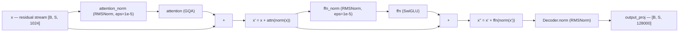
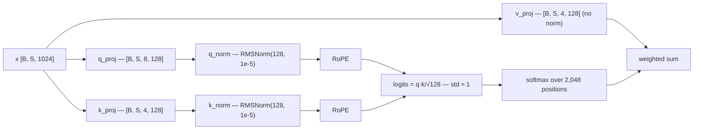
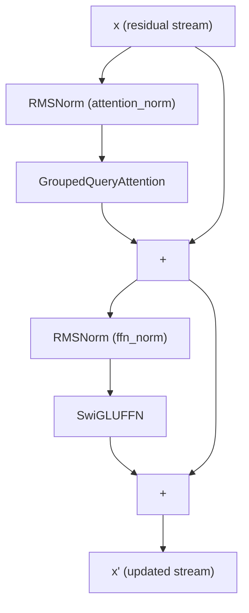
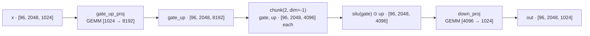
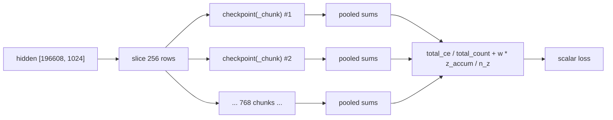

# LLaMA-3-Lite — Architecture Components (Normalization, FFN, Loss)

This document consolidates the three component-level theory guides for
LLaMA-3-Lite: **normalization** (RMSNorm and QK-norm), the **feed-forward
network** (SwiGLU), and the **loss functions** (chunked cross-entropy and
z-loss). Together they cover every non-attention component of the decoder
block plus the training objective — the machinery that keeps activations
well-scaled, holds the bulk of the model's parameters, and turns hidden
states into gradients. The code lives in `model.py:Transformer` (the block
stack), `model.py:RMSNorm`, `model.py:SwiGLUFFN`,
`model.py:GroupedQueryAttention`, and `model.py:chunked_head_cross_entropy_with_z`,
with the configuration in `config.py:get_config` and the training loop in
`train.py:train_model`.

## Overview

Deep networks amplify or shrink signals as they pass through layers, and
unchecked, the magnitude of the residual stream and its gradients drifts in
ways that make training unstable or impossible. Normalization layers
re-anchor the scale of a tensor at every block so that the optimizer always
works on well-conditioned, roughly unit-scale inputs. LLaMA-3-Lite uses
**RMSNorm** (`model.py:RMSNorm`), a cheaper cousin of LayerNorm that drops
the mean subtraction and keeps only the root-mean-square rescaling plus a
learnable gain: `y = x · rsqrt(mean(x²) + eps) · γ`. Every decoder block
applies it twice in **pre-norm** position
(`x = x + attention(attention_norm(x))` in `model.py:DecoderBlock.forward`),
and a final RMSNorm sits after the last block before the LM head
(`model.py:Decoder.forward`). Inside attention, a second, finer-grained
normalization — **QK-norm** — applies a per-head RMSNorm of `head_dim = 128`
to the query and key vectors *before* RoPE (`model.py:GroupedQueryAttention`),
which bounds the scale of the pre-softmax attention logits so they stay O(1)
late in training instead of growing with the activations. All of this is
cheap: the norm layers account for roughly 34K of the 251.7M non-embedding
parameters.

Every transformer block also contains a feed-forward network (FFN) that
transforms each token's representation **independently**. The FFN is a stack
of two matrix multiplications with a nonlinearity in between, expanded from
`d_model = 1024` to an intermediate width of `d_ff = 4096` (4×). LLaMA-3-Lite
uses **SwiGLU**, a *gated* FFN: instead of one intermediate projection
followed by `ReLU`, it computes two projections — a `gate` and an `up` — and
multiplies them elementwise after applying SiLU (the swish activation) to the
gate: `silu(gate) ⊙ up`. The two projections are fused into a single matrix,
`gate_up_proj`, so the layer costs three matrix multiplies per token
(`gate`, `up`, `down`) instead of two. At this scale that is 12.58M
parameters and 25.2M FLOPs per token per layer — 1.5× the cost of a plain
ReLU FFN of the same width, concentrated in the widest tensor the model ever
materializes (`[96, 2048, 8192]`). The whole block is realized in
`model.py:SwiGLUFFN`, with an optional Triton-fused activation path gated
behind `swiglu_impl='triton'` + `ENABLE_TRITON_KERNELS=1`.

Language modeling is next-token prediction: for every position in a sequence,
the model must assign high probability to the token that actually follows.
The training objective is the mean negative log-likelihood of those target
tokens under the model's softmax — the **cross-entropy (CE)** loss. At this
project's scale the logits tensor is huge: 96 × 2048 positions × 128,000
vocab entries is 25.2 billion numbers, 50.3 GB in BF16 — far too large to
materialize on an 80 GB A100 alongside the model, optimizer, and activations.
The code therefore slices the token axis into chunks of `ce_chunk_size = 256`
rows and computes the loss per chunk inside a gradient-checkpoint region,
keeping only one chunk's logits alive (~131 MB FP32) at any instant; because
CE is an additive sum over positions, summing per-chunk numerators and
denominators and dividing once at the end is *exactly* equal to the dense
loss. On top of CE, the loss adds **z-loss** (`z_loss_weight = 1e-4`), a
penalty on the squared log-partition $\ell = \log\sum_j e^{z_j}$ that grows
quadratically and prevents logits from drifting upward as training
progresses, the failure mode PaLM and Gemma 2 guarded against. An optional
fused Triton kernel (`cross_entropy_impl = 'triton'`) computes the same
per-chunk loss with an online-softmax pass and `atomic_add` accumulators,
but averages chunk means instead of pooled sums — exact only when chunks are
equal-sized, which they are at the training shape (196,608 = 768 × 256
exactly).

---

## Normalization: RMSNorm and QK-Norm

### Why Normalization Exists

#### The problem: scale drift

Consider a stack of linear layers. After `L` layers, a perturbation to the
input is multiplied by `L` matrices; if the spectral norm of the typical
layer is `ρ > 1`, magnitudes grow like `ρ^L`, and if `ρ < 1` they decay like
`ρ^L`. A 16-layer stack is not extreme, but transformers are not a plain
linear stack either: each block contains a softmax (which is scale-sensitive),
a gated nonlinearity, and residual adds that let the stream grow monotonically.
The result is that nothing intrinsic fixes the *scale* of the activations,
and two things that should stay fixed — the statistics seen by each sublayer
and the magnitude of gradients — drift with training.

The second-order problem compounds it: if activations inflate by a factor
`g`, backpropagated gradients typically scale with `g` as well (each linear
layer multiplies the gradient by its weight matrix), so the optimizer has to
cope with signals whose magnitude changes by orders of magnitude over the
course of training. Adam's per-parameter normalisation absorbs a lot of this,
but the *shape* of the loss landscape still depends on activation scale, and
large activations push softmaxes into saturated regimes where gradients
vanish.

#### What normalization layers provide

A normalization layer inserted at a fixed point in the graph gives three
guarantees:

1. **A fixed input scale for the next sublayer.** Whatever the residual
   stream has accumulated, the sublayer always sees a tensor whose per-token
   RMS is pinned to a known value (1 here). The sublayer's weights can
   therefore be initialised, regularised, and trained as if the input
   distribution were stationary.
2. **Bounded Jacobian magnitude.** The derivative of a norm layer w.r.t. its
   input is (up to a learnable gain) an orthogonal projection divided by the
   RMS — an operator with singular values ≈ 1/r. This prevents the layer from
   amplifying or damping the gradient signal it passes.
3. **A learnable scale-and-shift knob.** The per-feature gain `γ` (and bias
   `β` in LayerNorm) lets the optimizer decide what variance and offset each
   sublayer actually wants, independently of the upstream stream magnitude.
   Without normalization, this knob would have to be learned implicitly by
   scaling entire weight matrices, which is slower and couples layers.

Historically this is the "internal covariate shift" argument from the
BatchNorm paper (Ioffe & Szegedy, 2015): the distribution of a layer's inputs
changes as upstream weights move, and the optimizer keeps chasing a moving
target. BatchNorm attacked it by normalising over the *batch* dimension;
LayerNorm (Ba, Kiros & Hinton, 2016) moved the statistics to the *feature*
dimension, which is what makes it usable for variable-length sequences and
batch size 1. RMSNorm (Zhang & Sennrich, 2019) then observed that for
transformers the mean term is largely redundant and dropped it, cutting cost.

### Intuition: Controlling Scale and Gradient Health

#### The gauge analogy

Think of the residual stream as a pipeline whose pressure you do not control
directly: embeddings inject a small, fixed amount; each attention and FFN
block adds more; nothing removes any. Normalization layers are **pressure
regulators** placed on the branch pipes: no matter how high the main line's
pressure is, the branch that feeds a sublayer is always bled down to the same
working pressure (unit RMS). The sublayer then computes in a predictable
regime, and the regulator itself absorbs the pressure difference — that is
precisely what `x = x + attention(norm(x))` expresses: the *add* carries the
unregulated stream, the *norm* regulates only the branch.

#### A worked micro-example (RMSNorm by hand)

Take a single token with `d = 4` features, `x = [1, −2, 3, −4]`, and `γ = 1`:

$$
\text{mean}(x^2) = \frac{1^2 + (-2)^2 + 3^2 + (-4)^2}{4} = \frac{30}{4} = 7.5,
\qquad
r = \sqrt{7.5 + 10^{-5}} \approx 2.7386,
\qquad
y = \frac{x}{r} \approx [0.365, \; -0.730, \; 1.096, \; -1.461].
$$

Now feed the norm `3x = [3, −6, 9, −12]`:

$$
\text{mean}((3x)^2) = 9 \cdot 7.5 = 67.5, \qquad r = \sqrt{67.5 + 10^{-5}} \approx 8.2158,
\qquad
\frac{3x}{r} \approx [0.365, \; -0.730, \; 1.096, \; -1.461].
$$

Same output. The norm is **scale-invariant**: it divides out the input's
magnitude and keeps only its *direction* (shape). That single property is the
source of almost everything good and everything tricky about RMSNorm.

#### Gradient health

Why does fixing the forward scale fix the backward pass? Let `r = RMS(x)` be
the scalar denominator of a norm with `γ = 1`. The output is `y = x/r`, and a
short derivation (below) shows the input gradient is

$$
\frac{\partial L}{\partial x} = \frac{1}{r}\left(\frac{\partial L}{\partial y} - \frac{x}{d\,r^2}\left\langle x,\; \frac{\partial L}{\partial y}\right\rangle\right),
$$

i.e. the incoming gradient, scaled by `1/r`, with its component along `x`
removed. Two consequences:

- **No amplification:** the Jacobian has singular values ≈ `1/r`, so a norm
  layer never multiplies a gradient by a large factor. A stack of 16 blocks
  can no longer compound gradient growth through the normed branches.
- **No runaway in the radial direction:** gradient components parallel to the
  activation vector `x` (the ones that would make `x`'s norm grow) are
  explicitly projected away. The only way to change the stream's magnitude is
  through the learnable gain `γ` (and, in LayerNorm, `β`), whose gradients
  are O(1). The optimizer gets a clean, well-scaled channel for adjusting
  scale.

### Formal Treatment I — LayerNorm

LayerNorm normalises each vector `x ∈ ℝ^d` (for a transformer: one token's
`d_model`-dimensional hidden state) using its own mean and variance, then
applies a learned per-feature affine transform:

$$
\mu = \frac{1}{d}\sum_{j=1}^{d} x_j, \qquad
\sigma^2 = \frac{1}{d}\sum_{j=1}^{d} (x_j - \mu)^2,
$$

$$
y_i = \frac{x_i - \mu}{\sqrt{\sigma^2 + \epsilon}}\,\gamma_i + \beta_i, \qquad
i = 1, \dots, d.
$$

Here `γ, β ∈ ℝ^d` are learnable parameters (the "gain" and "bias"), and
`ε > 0` is a tiny constant that prevents division by zero and clips the
denominator's dynamic range for low-precision arithmetic. In a transformer
the statistics are computed **per token, over the hidden dimension only** —
never over the batch or sequence axes — so the transform is identical for
every position and every sequence, which is what makes it work at inference
time with sequences of any length and any batch size, without running
statistics.

Properties that matter here:

- **Invariance to translation and scaling.** Adding any constant `c` to `x`
  cancels in `x − μ`; multiplying `x` by any `α > 0` cancels in `(x−μ)/σ`.
  The layer is insensitive to both the offset and the magnitude of its input,
  and only the *shape* of the vector survives.
- **Cost:** computing `μ` and `σ²` requires two reduction passes over `d`
  features, plus a third elementwise pass for the final transform (subtract,
  scale, scale by `γ`, add `β`). In PyTorch's eager mode that is roughly 4–5
  kernel launches per layer invocation.
- **Parameter cost:** `2d` per norm (`γ` and `β`), which at `d = 1024` is
  2,048 parameters per instance.

LayerNorm is the right *concept* — per-token, feature-wise, learnable — and
it is what the original transformer used (with post-norm placement, below).
Its weaknesses for a modern LLM are only about efficiency and redundancy,
which is exactly what RMSNorm addresses next.

### Formal Treatment II — RMSNorm (Dropping the Mean)

#### The observation

Zhang & Sennrich (2019) made two empirical points. First, the *mean*
subtraction in LayerNorm contributes little for transformers: the residual
stream is approximately zero-mean already (zero-mean weight initialisation,
zero-mean embeddings, unbiased projections), and training quality is roughly
unchanged when the centering is removed. Second, what actually matters for
stability is the **root-mean-square scale** of the vector — the thing that
determines the magnitude of the dot products feeding softmaxes and the
variance of layer outputs.

#### The math, matched to the code exactly

`model.py:RMSNorm.forward` computes, verbatim:

```python
x * torch.rsqrt(x.pow(2).mean(dim=-1, keepdim=True) + self.eps) * self.weight
```

For a token row `x ∈ ℝ^d` with learnable gain `γ = self.weight ∈ ℝ^d` and
`self.eps = ε`, this is, coordinate-wise:

$$
y_i = x_i \cdot \frac{1}{\sqrt{\frac{1}{d}\sum_{j=1}^{d} x_j^2 + \epsilon}} \cdot \gamma_i,
\qquad
\text{i.e.} \qquad
y = \frac{x}{\operatorname{RMS}(x)}\,\gamma, \qquad
\operatorname{RMS}(x) = \sqrt{\frac{1}{d}\sum_{j} x_j^2 + \epsilon}.
$$

Three implementation details worth naming, because they are easy to get wrong
when reimplementing from memory:

1. **The bias `β` is gone.** Only the gain `γ` survives, so a norm costs `d`
   parameters, not `2d`.
2. **`ε` lives inside the square root**, as `sqrt(mean(x²) + ε)`, *not*
   outside it (`sqrt(mean(x²)) + ε`) and *not* inside the mean
   (`mean(x² + ε)`). The code's placement matches the original paper and the
   reference in `kernels/rmsnorm_triton.py:rmsnorm_pytorch`; numerically the
   three variants differ only at the `ε` scale (≈ 1e-5), so this is a
   convention, but the convention is load-bearing for bit-exact test
   comparisons such as
   `tests/test_model.py::TestRMSNorm.test_matches_reference`, which asserts
   equality against `x * torch.rsqrt(x.pow(2).mean(-1, keepdim=True) + 1e-5)`
   in float64.
3. **`mean` is over the last axis only, with `keepdim=True`**, so the RMS is
   a per-token scalar broadcast against `[B, S, d]`; no cross-token mixing.

#### The `eps` term and `rms_norm_eps: 1e-5`

The `ε` guard exists because the division is by `sqrt(mean(x²) + ε)`. If
every feature of a token is exactly zero, the denominator would be 0 without
`ε` and the output NaN. With `ε = 1e-5`, `rsqrt(ε) = 316.23` — large but
finite — and since the numerator `x` is zero, the output is exactly zero; the
layer passes a finite (zero) value and gradients still flow. The constant is
wired through the whole model: `config.py:get_config` sets
`'rms_norm_eps': 1e-5`, `model.py:build_transformer` defaults
`rms_norm_eps: float = 1e-5`, the block norms hard-code `eps=1e-5` in
`model.py:DecoderBlock.__init__`, and the final norm inherits the config
value via `model.py:Decoder.__init__` (`eps: float = 1e-5`). A single
consistent `ε` matters for two reasons: the QK-norms and the block norms
share the value, and changing it silently shifts every normalised
distribution by a relative `ε/mean(x²)`.

Why `1e-5` and not something bigger? `ε` must be small compared with the
typical `mean(x²)` (order 1 after normalisation, order 1e-4 for raw embedding
outputs at the init scale below) so it does not measurably shrink the
normalised variance, yet large enough to keep the reciprocal square root
representable in BF16/FP32 for zero or near-zero rows. `1e-5` is the
canonical RMSNorm/LayerNorm choice and is what `torch.nn.RMSNorm` uses by
default.

#### Why RMSNorm works for transformers

Three reasons, in increasing order of importance:

1. **It is scale-invariant by construction.** As the worked example above
   shows, `RMSNorm(αx) = RMSNorm(x)` for any `α > 0`. Whatever the residual
   stream's magnitude — 0.02 at init, larger later — the attention and FFN
   branches always see unit-RMS inputs. This is the same property that made
   LayerNorm work; dropping the mean only removes the *translation*-invariance
   half, which transformers barely use.
2. **The mean is nearly redundant in this architecture.** The embedding and
   every linear projection are initialised zero-mean
   (`model.py:Transformer._init_weights` draws from `normal_(0, 0.02)`), and
   the residual stream is a sum of zero-mean-ish contributions, so per-token
   means hover near zero. The statistic that actually controls downstream dot
   products is the RMS.
3. **It is measurably cheaper.** Removing `μ` removes an entire reduction
   pass over the hidden dimension and the `β` parameter. For the eager path
   that turns the ~4-launch LayerNorm chain into a 3-launch chain
   (`pow`+`mean` → `add`+`rsqrt` → multiply), and the fused Triton path
   (`kernels/rmsnorm_triton.py:triton_rmsnorm`) collapses even that into a
   single row-wise kernel. At this project's scale the FLOP saving is small,
   but the kernel-launch and memory-traffic saving is real on a GPU that runs
   16 blocks × 2 norms × (forward + backward) every step.

#### Gradient of RMSNorm

Let `r = sqrt(s + ε)` with `s = (1/d) Σ_j x_j²`. Then `y = x·γ/r` and

$$
\frac{\partial y_i}{\partial x_j} = \frac{\gamma_i}{r}\left(\delta_{ij} - \frac{x_i x_j}{d\,r^2}\right).
$$

In matrix form the Jacobian (with `γ = 1`) is `(I − xxᵀ/(d r²))/r`: a scaled
**orthogonal projection** onto the hyperplane perpendicular to `x`. The input
gradient is therefore the incoming gradient, scaled by `1/r`, minus its
projection onto `x`. Two practical readings:

- The norm is a conditioner: it neither inflates nor collapses gradient
  magnitudes, and it actively blocks the direction of growth — the one
  direction that would otherwise compound through a deep stack.
- The `γ` gradient is `∂L/∂γ = (x/r) ⊙ ∂L/∂y`, i.e. the *normalised* direction
  scaled by the incoming gradient — O(1) by construction, so the learnable
  gain trains at a healthy rate even when raw activations are tiny or huge.

The same derivation for LayerNorm additionally subtracts the mean direction;
RMSNorm simply omits that term.

### Numbers at This Project's Scale

All numbers below are derived from `config.py:get_config`
(`d_model = 1024`, `n_layers = 16`, `n_heads = 8`, `n_kv_heads = 4`,
`head_dim = 128`, `seq_len = 2048`, `batch_size = 96`, `vocab_size = 128000`)
and from `model.py`; none are measured.

**Tensors the norms touch.** A block input is `[96, 2048, 1024]` =
196,608 × 1024 = 201,326,592 elements ≈ 201.3M. That is ≈ 805 MB in FP32 or
≈ 402.7 MB in BF16 per live norm input — which is exactly why
`model.py:Transformer.forward` runs each block under
`torch.utils.checkpoint.checkpoint` when `gradient_checkpointing=True`: the
norm's input is the block's activation, and re-computing it on the backward
pass is cheaper than holding 16 such tensors. The mean/`x²` reductions reduce
201.3M elements to `[96, 2048, 1]` = 196,608 scalars.

**Parameter cost of the norms.** RMSNorm keeps only `γ`:

- per block: `attention_norm` (1024) + `ffn_norm` (1024) = 2,048;
- 16 blocks + final `Decoder.norm`: (16·2 + 1) · 1024 = **33,792** parameters;
- the LayerNorm equivalent would carry `γ + β = 2048` per norm, i.e. 67,584 —
  RMSNorm halves the count (saving 33,792);
- QK-norm adds `q_norm` (128) + `k_norm` (128) = 256 per layer → 16 × 256 =
  **4,096** parameters, exactly the `2 * head_dim * n_layers` arithmetic the
  test `tests/test_model.py::TestQKNorm.test_param_count_increases_when_enabled`
  asserts by diffing a `qknorm=True` model against a `qknorm=False` model.

As a fraction of the 251.7M non-embedding parameters, all normalisation
weights together (33,792 + 4,096 = 37,888) are ≈ 0.015% — a rounding error in
the parameter budget, which is the point: the conditioning they provide is
nearly free in memory.

**Compute cost.** Per token, one RMSNorm over `d` features costs ≈ `4d` FLOPs
(`x²`, the sum, the `rsqrt`, the scale-multiply; the `γ` multiply rides
along). The 33 full-dimension norms then cost ≈ 33 × 4 × 1024 × 196,608 ≈
26.6 GFLOP per forward pass. The model's total forward+backward cost is ≈
6·N·T = 6 × 513.8e6 × 196,608 ≈ 606 TFLOP per step, so all RMSNorm layers
together are well under 0.1% of training compute. QK-norm's reductions cover
[96, 2048, 12, 128] ≈ 302M elements per layer ≈ 1.2 GFLOP/layer — similarly
negligible. The *real* win of RMSNorm over LayerNorm is therefore not FLOPs
but kernel launches and memory traffic on the 201.3M-element tensors, plus
the `β`-free parameter budget.

**What the norms actually see at init.** Embeddings and projections are
initialised with std 0.02 (`model.py:Transformer._init_weights`), so the raw
embedding output has per-token RMS ≈ 0.02. The first `attention_norm`
rescales that to RMS 1 immediately; every branch input after that is unit-RMS
by construction regardless of how the stream grows.

### Pre-Norm Residual Placement

#### Post-norm vs pre-norm

The original transformer (Vaswani et al., 2017) used **post-norm**:
`x = norm(x + attention(x))`. The norm sees the *sum*, so the residual stream
is normalised at every block — but the gradient of `norm` then sits *on* the
residual path, multiplying the backpropagated signal, which made deep
post-norm stacks brittle and dependent on careful warmup.

Modern LLMs (GPT-2 onward, LLaMA, and this repo) use **pre-norm**:

$$
x \;\leftarrow\; x + \operatorname{Attention}(\operatorname{Norm}(x)), \qquad
x \;\leftarrow\; x + \operatorname{FFN}(\operatorname{Norm}(x)).
$$

The norm sits *inside* the branch, on the path from the stream into the
sublayer, and the residual add bypasses it entirely. The gradient of the loss
w.r.t. the stream then has an identity path through every block — a pure skip
connection — so depth no longer multiplies gradient magnitudes. The cost is
that the *stream itself* is never normalised and can grow; pre-norm shifts
the responsibility for final scaling to one norm at the end.

#### What this repo does

`model.py:DecoderBlock.forward` is the textbook pre-norm block:

```python
# illustrative
def forward(self, x):
    x = x + self.attention(self.attention_norm(x))
    x = x + self.ffn(self.ffn_norm(x))
    return x
```

`attention_norm` and `ffn_norm` are both `RMSNorm(d_model, eps=1e-5)`
(`model.py:DecoderBlock.__init__`); each sublayer gets its own gain vector, so
attention and FFN can demand different per-feature scales. Order matters: the
attention branch is normalised and applied *first*, then the FFN branch sees
the updated stream. Neither branch reads the other's raw output — only the
post-attention stream.

#### The final norm

Because pre-norm never rescales the stream, the stream entering the LM head
after 16 blocks has an arbitrary magnitude. `model.py:Decoder.forward`
applies one last `RMSNorm(d_model, eps=rms_norm_eps)` after the layer stack,
immediately before `output_proj` in `model.py:Transformer.forward`. This
final norm serves two purposes: it re-pins the stream to unit RMS so the
128,000-way logits are computed at a calibrated scale (the logits inherit the
stream's magnitude through the unbiased head projection), and it is the *only*
place where the stream's accumulated growth is corrected, which is what keeps
the z-loss term (below) from having to fight a runaway input distribution.



Note what is *not* there: there is no norm right after the input embedding.
The raw embedding feeds the first block, and the first `attention_norm`
absorbs its ≈ 0.02 RMS. This is standard LLaMA practice and saves one norm on
the hot path.

### QK-Norm: Per-Head Normalization Before RoPE

#### The problem: attention logit growth

Inside attention, the pre-softmax score for query position `i` and key
position `j` is `q_i · k_j / sqrt(head_dim)` (the scaling lives inside
`F.scaled_dot_product_attention` in `model.py:GroupedQueryAttention.forward`).
Nothing in this formula pins the *magnitude* of `q_i · k_j`. If the
activations feeding `q_proj`/`k_proj` grow by a factor `g` during training,
the query/key vectors grow by `g`, and the dot product — and therefore the
logits — grow by `g²`. The `1/sqrt(128)` scaling only fixes the variance
under the assumption that `q` and `k` coordinates are unit-variance, which
holds at initialisation (weights ~ `N(0, 0.02)`) but not later, when weight
norms increase and the residual stream inflates.

Growing attention logits are harmful in a specific way: softmax is
scale-sensitive, and `softmax(λ·z)` for `λ > 1` is a *sharper* distribution
(lower temperature). As training progresses and the model naturally sharpens,
this compounds: logits grow → attention becomes near one-hot → gradients
through the softmax vanish for the losing keys → the attention heads lose
their ability to mix context → the model's effective context becomes a single
token. Late in training this appears as attention entropy collapse and
stalled loss improvement.

#### The fix: per-head RMSNorm on Q and K

The remedy — adopted by Qwen2 (Yang et al., 2024) and Gemma 2 (Team Gemma,
2024), and enabled here by default — is to normalise each head's query and
key vectors to unit RMS *after* the projection and *before* RoPE, using
`RMSNorm(head_dim, eps=1e-5)`:

```python
# illustrative
# model.py:GroupedQueryAttention.__init__
if qknorm:
    self.q_norm = RMSNorm(head_dim, eps=1e-5)
    self.k_norm = RMSNorm(head_dim, eps=1e-5)
else:
    self.q_norm = nn.Identity()
    self.k_norm = nn.Identity()
```

and in the forward pass:

```python
# illustrative
q = self.q_proj(x).view(B, S, self.n_heads, self.head_dim)
k = self.k_proj(x).view(B, S, self.n_kv_heads, self.head_dim)
v = self.v_proj(x).view(B, S, self.n_kv_heads, self.head_dim)
q = self.q_norm(q)      # per-head, over head_dim — BEFORE transpose
k = self.k_norm(k)
q = q.transpose(1, 2)
k = k.transpose(1, 2)
```

The comment in the source states the design contract: *"QK-norm placement:
per-head, after projection, before RoPE (Qwen2 / Gemma2). Bounds attention
logit growth late in training."* Three placement details are deliberate:

1. **Per-head:** the norm runs over the last axis of the `[B, S, n_heads,
   head_dim]` view, i.e. over `head_dim = 128` features *per head*, not over
   the whole 1024-dim vector. Each of the 8 query heads and 4 key heads gets
   its own 128-parameter gain, and heads can legitimately operate at
   different scales.
2. **Before the transpose:** `model.py:GroupedQueryAttention.forward`
   comments *"Normalize over last axis (D) BEFORE transpose so RMSNorm sees
   head_dim"* — the `view` keeps `head_dim` last, so `dim=-1` is exactly the
   per-head axis; normalising after `transpose(1, 2)` would be equivalent
   here, but doing it before keeps the layout contiguous and the intent
   explicit.
3. **Before RoPE:** the norm runs on the unrotated vectors. This is not a
   numerical necessity — RoPE is an orthogonal (block-rotation) transform, so
   it preserves RMS and `RMSNorm(RoPE(x)) = RoPE(RMSNorm(x))` exactly — but
   it matches the Qwen2/Gemma2 lineage, keeps the norm outside the rotary
   path, and means the gain applies to the same coordinate basis as the
   projection that produced the vectors.

The `qknorm=False` branch installs `nn.Identity()` placeholders, so the
module structure (`attn.q_norm`, `attn.k_norm`) is stable while the transform
is a no-op; `tests/test_model.py::TestQKNorm.test_disabled_attention_is_bit_identical`
relies on this to prove that disabling QK-norm changes nothing else in the
model, and `tests/test_model.py::TestQKNorm.test_enabled_attention_does_not_crash`
checks the enabled path produces finite logits. The default is `qknorm: True`
in `config.py:get_config` and in `model.py:build_transformer`.

#### What it does to the logit scale — the math

After QK-norm with unit gains, each head's `q` and `k` vectors have
`RMS(q) = RMS(k) = 1`, so each coordinate has `E[q_i²] = E[k_i²] = 1`.
Treating coordinates as independent and zero-mean:

$$
\mathbb{E}[(q \cdot k)^2] = \sum_{i=1}^{128} \mathbb{E}[q_i^2]\,\mathbb{E}[k_i^2] = 128,
\qquad
\operatorname{std}(q \cdot k) \approx \sqrt{128} \approx 11.31.
$$

The SDPA scaling `1/sqrt(head_dim) = 1/sqrt(128) ≈ 0.0884` then divides this
back down, so the pre-softmax logits have std ≈ 1 — regardless of how large
the activations entering `q_proj`/`k_proj` have grown. The learned per-head
gains modulate this: with gains `γ_q, γ_k`, the logit std scales by
`γ_q · γ_k`, and the dot product is bounded in magnitude by
`‖q‖·‖k‖ = 128 · γ_q · γ_k` via Cauchy–Schwarz. The optimizer has exactly one
cheap, well-scaled knob per head to trade attention sharpness against
expressivity, and that knob cannot blow up: its gradient is O(1).

Contrast with the unnormalised case: with pre-norm activations of RMS `g`,
the projected `q` has RMS ≈ `g · ‖W_q‖_F / sqrt(d)` (order `g`), so logits
scale like `g²` and the `1/sqrt(128)` factor is a constant that cannot adapt.
QK-norm makes the logit scale **state-independent**: the bound holds at step
1 and at step 42,000 with identical force. For reference, the maximum of
2,048 iid `N(0,1)` samples is ≈ `sqrt(2 ln 2048) ≈ 3.9`, so with unit-logit
std the causal softmax over `seq_len = 2048` positions operates in a regime
where a few keys can win by modest factors — a healthy entropy gradient
signal — whereas a `g² ≈ 10` inflation would push those maxima to ≈ 12,
crushing the softmax toward one-hot.

#### Interplay with z-loss

QK-norm is not the only guard against late-training logit growth in this
repo. The training loss is
`chunked_head_cross_entropy_with_z(hidden, head_weight, targets, ...)`
(`model.py`), which adds PaLM-style **z-loss** (Chowdhery et al., 2022):

$$
L_z = \operatorname{mean}_{t}\left(\log \sum_{v=1}^{128000} e^{z_{t,v}}\right)^2,
\qquad
\frac{\partial L_z}{\partial z} = 2\,\log\!\sum_v e^{z_v}\;\cdot\;\operatorname{softmax}(z),
$$

weighted by `z_loss_weight = 1e-4` (`config.py:get_config`). The two
mechanisms attack the same failure mode at different points:

- **QK-norm** bounds the logits *inside* attention — before the softmax over
  the 2,048 positions — protecting attention entropy and the gradients that
  flow through it.
- **z-loss** bounds the log-partition of the *output* logits — before the
  softmax over the 128,000 vocab — by penalising `(log Σ e^z)²`, whose
  gradient pushes every logit toward 0 in proportion to its softmax share
  times the current log-partition.

Neither subsumes the other: attention logits never see the z-loss gradient
directly (the loss is computed on the head's output, far downstream), and the
head logits are not normalised by any architecture (this repo has no Gemma-2
style logit soft-capping; the z-loss is the designated output-side
regulariser — see the loss section below for the full treatment). The
`qknorm=True` and `use_z_loss=True` config flags are therefore two
independent, complementary levers on the same phenomenon, and the combination
is what keeps both softmaxes — positional and vocabular — in their
high-entropy, gradient-rich regimes for the full 42,000-step run.



### How the Code Realizes It

#### `RMSNorm` end to end

`model.py:RMSNorm` is minimal: `__init__` creates a single learnable gain
`self.weight = nn.Parameter(torch.ones(d_model))` (initialised to 1, i.e. the
norm is an exact no-op at init), stores `self.eps` and a dispatch flag
`self.impl`, and `forward` implements the RMSNorm formula directly. The
`impl="triton"` opt-in routes to `kernels/rmsnorm_triton.py:triton_rmsnorm`,
which fuses the eager chain (`pow`, `mean`, `add`, `rsqrt`, multiply) into
one row-wise kernel; `RMSNorm.forward` wraps the call in `try/except
(ImportError, ValueError)` and falls back to the eager formula — with a
one-time warning — if Triton is missing or the hidden size exceeds the
kernel's `_MAX_BLOCK_SIZE = 8192` guard (`kernels/rmsnorm_triton.py`).
`model.py:build_transformer` selects the implementation through
`rmsnorm_impl` (`"pytorch"` default), and `Transformer` threads it into every
block norm and the final norm. The eager and Triton paths compute the same
formula, and the kernel module ships its own pure-PyTorch reference
(`kernels/rmsnorm_triton.py:rmsnorm_pytorch`) as the numeric contract.

#### Wiring through the model

The full chain, verified in source:

- `config.py:get_config` → `'rms_norm_eps': 1e-5`, `'qknorm': True`;
- `model.py:build_transformer(rms_norm_eps=1e-5, qknorm=True, rmsnorm_impl="pytorch", ...)`
  → `model.py:Transformer`, which builds `DecoderBlock`s
  (`attention_norm = RMSNorm(d_model, eps=1e-5)`,
  `ffn_norm = RMSNorm(d_model, eps=1e-5)`) and a `Decoder` whose final norm
  takes `eps=rms_norm_eps`;
- `model.py:DecoderBlock.forward` applies the pre-norm residual pattern;
- `model.py:Decoder.forward` runs the 16 blocks and applies the final norm;
- `model.py:Transformer.forward` embeds, runs the decoder (per-block
  `checkpoint(..., use_reentrant=False)` when gradient checkpointing is on),
  and either returns the hidden state (`return_hidden=True`, used by the
  chunked-head training path) or projects to logits via `output_proj`;
- `model.py:GroupedQueryAttention` installs `q_norm`/`k_norm` and applies
  them in `forward` before `transpose(1, 2)` and RoPE.

#### Shape trace

| Stage | Tensor shape | Notes |
|---|---|---|
| token ids | `[96, 2048]` | `batch_size × seq_len` |
| embedding | `[96, 2048, 1024]` | RMS ≈ 0.02 at init |
| `attention_norm(x)` | `[96, 2048, 1024]` | per-token RMS → 1 |
| `q` after projection + view | `[96, 2048, 8, 128]` | `n_heads × head_dim` |
| `q_norm(q)` | `[96, 2048, 8, 128]` | per-head RMS → 1 |
| `k` after projection + view | `[96, 2048, 4, 128]` | `n_kv_heads × head_dim` |
| `k_norm(k)` | `[96, 2048, 4, 128]` | per-head RMS → 1 |
| attention output | `[96, 2048, 1024]` | added to stream |
| `ffn_norm(x')` | `[96, 2048, 1024]` | per-token RMS → 1 |
| `Decoder.norm` (after 16 blocks) | `[96, 2048, 1024]` | stream re-pinned to RMS 1 |
| `output_proj` logits | `[96, 2048, 128000]` | only materialised if `return_hidden=False` |

The `keepdim=True` reductions never collapse a batch/sequence axis: every
norm is a per-row transform with shapes `[B, S, d] → [B, S, d]` and
`[B, S, H, d_h] → [B, S, H, d_h]`, which is why
`tests/test_model.py::TestRMSNorm.test_output_shape` passes trivially — the
layer cannot change the shape of its input by construction.

---

## Feed-Forward Network: SwiGLU

### Why the FFN Exists

A transformer is an alternating composition of two very different operations:

1. **Attention** — a content-based routing mechanism. Every token emits a
   query and attends to every other token's keys, producing a weighted
   average of values. Attention is where the model *mixes information across
   positions*: "the subject of this sentence is the word three tokens back."
2. **The FFN** — a position-wise function applied identically to every token
   vector, with no interaction between tokens at all. The FFN is where the
   model *transforms each token's representation*: "given what this token
   means in this context, produce a richer, more abstract feature vector."

Why is the second operation necessary at all? Two classical arguments:

- **Capacity.** Attention output is a weighted average of value vectors —
  an operation that can only produce points in the convex hull of its
  inputs. Left alone, the representation space collapses toward mixtures of
  existing vectors. The FFN breaks the convex-hull constraint: its first
  projection expands into a much higher-dimensional space, applies a
  nonlinearity, and projects back, letting the model carve out features that
  no convex combination of token embeddings can express. This is the
  original motivation in Vaswani et al. (2017): the "position-wise
  feed-forward network" follows every attention sub-layer.

- **Key-value memory.** Geva et al. (2021) ("Transformer Feed-Forward
  Layers Are Key-Value Memories") read the two FFN matrices as a memory:
  each row of the first projection is a *key pattern* the input is tested
  against, and each column of the second projection is a *value* retrieved
  when the key matches. Under this view the FFN is where the model stores
  and recalls discrete knowledge ("the capital of France is Paris") —
  pattern matching followed by retrieval, applied per token.

A third, practical argument: the FFN is where most of the model's
**parameters and FLOPs live**. In LLaMA-3-Lite, the 16 FFN layers hold
201.3M of the 251.7M non-embedding parameters — 80% — and roughly 60% of
the per-block compute. Understanding the FFN is understanding the bulk of
the model's cost.

#### The residual-stream view

In a pre-norm transformer block the FFN is not a standalone function; it is
a *delta* added onto a slowly evolving residual stream:

$$x' = x + \text{FFN}(\text{RMSNorm}(x))$$

The residual connection guarantees that the FFN only ever has to produce a
*correction* to its input, and that gradients always have a direct, un-gated
path back to the embedding. The block as a whole is:



The two RMSNorm applications are what keep the stream well-scaled before
each sub-layer; the FFN itself is deliberately *unnormalized internally*.
See the normalization section above for why, and
[attention-and-positional.md](attention-and-positional.md) for the full
block.

### Intuition: Per-Token Working Memory with a Soft Gate

#### Expand, transform, contract

Think of the FFN as a detour through a wider "working memory":

```
d_model = 1024  →  d_ff = 4096  →  d_model = 1024
  (compact)        (expanded)       (compact again)
```

The expansion to 4× width matters because a token's contextual meaning is a
complex function of its embedding: many candidate features compete for the
1024 dimensions. Expanding to 4096 dimensions gives each candidate feature
its own slot to "fire" in (the keys/memory rows), the nonlinearity decides
which slots fire, and the contraction blends the firing features back into
the residual stream. The expansion is cheap in an architectural sense — the
FLOP cost grows only linearly with `d_ff`, and there are no pairwise
interactions between positions, so the width is a free-ish knob the designer
turns to trade compute for capacity.

#### The gate: a soft, learned switch

A plain ReLU FFN computes, per feature, `max(0, x·w_i)`: a hard, binary
switch — the feature either fires or it is dead (gradient exactly zero in
the dead region). SwiGLU replaces the hard switch with a *multiplicative
gate*: every feature is computed twice, once as the *content* (`up`) and
once as the *emphasis* (`gate`), and the content is multiplied by
`sigmoid(gate)`:

- A large positive gate → `silu ≈ gate` → content passes **amplified**.
- A large negative gate → `silu ≈ 0` → content is **suppressed**.

The gate is *soft*: it is a smooth, everywhere-differentiable function of
the input, so gradients always flow through both branches. The model learns
per-token emphasis: which transformations to apply, and how strongly,
conditioned on what the token currently means in context.

A tiny worked example (real numbers): with `silu(x) = x/(1 + e^{-x})`,

- `silu(2.0) = 2.0 / (1 + e^{-2.0}) = 2.0 / 1.1353 = 1.7616` — the gate
  *amplifies* an `up` value of `0.5` to `1.7616 × 0.5 = 0.8808`.
- `silu(-3.0) = -3.0 / (1 + e^{3.0}) = -3.0 / 21.0855 = -0.1423` — a gate of
  `-3.0` crushes an `up` value of `10.0` down to `-1.423`: 10 units of
  content contribute less than one and a half units to the output.

Note the second case: unlike ReLU, a suppressed feature still contributes a
small *negative* signal rather than exactly zero. This asymmetry (slightly
negative saturation) is a property of SiLU that empirical work has found
helpful; the important qualitative point is the continuous, learnable
emphasis.

### Formal Treatment

#### The canonical two-projection FFN

The vanilla FFN (Vaswani et al., 2017) is, for a token vector $x \in
\mathbb{R}^{d}$:

$$\text{FFN}(x) = W_2 \,\phi(W_1 x + b_1) + b_2$$

with $W_1 \in \mathbb{R}^{d_{\text{ff}} \times d}$, $W_2 \in
\mathbb{R}^{d \times d_{\text{ff}}}$, and $\phi$ a pointwise nonlinearity
(ReLU in the original paper). Two matrix multiplies, one nonlinearity. In
LLaMA-3-Lite both biases are dropped (`bias=False`), consistent with the
LLaMA family, so the layer is exactly:

$$\text{FFN}(x) = W_{\text{down}}\,\phi(W_{\text{up}}\,x)$$

#### Why 4× d_model

The expansion factor is a hyperparameter, but 4× has been the default since
the original transformer (`d_model = 512`, `d_ff = 2048`) and survives in
most modern models. The reasoning:

- **The bottleneck is the residual stream, not the FFN.** The residual
  stream must stay low-dimensional to keep attention cheap (attention FLOPs
  scale as $d$ per token-position pair) and to keep the gradient clean. The
  FFN is the designated place where the model is allowed to "think in
  high dimensions" at linear cost in $d_{\text{ff}}$.
- **Diminishing returns are gentle.** Each doubling of $d_{\text{ff}}$
  doubles the FFN's share of FLOPs and parameters but adds genuinely new
  feature slots. Ablations across the literature show quality climbing with
  width until the compute budget bites; 4× sits near the sweet spot.

At this project's scale the choice is explicit in `config.py:get_config`:
`d_ff: 4096 = 4 × d_model: 1024`.

> **A family-specific note.** The LLaMA family normally *shrinks* the
> SwiGLU width to $d_{\text{ff}} = \tfrac{8}{3}\,d_{\text{model}}$ so that
> three projections cost the same as a plain 4× FFN's two projections
> ($3 \cdot \tfrac{8}{3} d^2 = 8d^2 = 2 \cdot 4d^2$). LLaMA-3-Lite instead
> keeps `d_ff = 4 × d_model`, which makes its FFN 1.5× heavier than a plain
> ReLU FFN at the same width — see the FLOP comparison below for the
> arithmetic. [INFERENCE: the intent behind keeping 4× is not recorded in
> the repo; the config value and its consequences are.]

#### SiLU — the activation

SiLU (Sigmoid Linear Unit; also called *swish*, Ramachandran et al., 2017)
is defined as

$$\text{silu}(x) = x \cdot \sigma(x) = \frac{x}{1 + e^{-x}}$$

with derivative

$$\frac{d}{dx}\text{silu}(x) = \sigma(x)\big(1 + x\,(1 - \sigma(x))\big)$$

Properties that matter here:

- **Smooth and differentiable everywhere** — no kink, no exact-zero-gradient
  region, unlike ReLU.
- **Self-gating** — the input is its own gate: the derivative is a soft
  switch that is ~1 for large positive $x$ and ~0 for large negative $x$.
- **Bounded below, unbounded above** — the range is approximately
  $[-0.278, \infty)$, with the minimum attained near $x \approx -1.278$; a
  saturated feature leaks a small negative signal instead of dying.

#### SwiGLU — the gated FFN

SwiGLU (Shazeer, 2020, "GLU Variants Improve Transformer") replaces the
single intermediate projection with a *gated linear unit*: three projections
$W_g$, $W_u \in \mathbb{R}^{d_{\text{ff}} \times d}$, $W_d \in
\mathbb{R}^{d \times d_{\text{ff}}}$, and the rule

$$\text{SwiGLU}(x) = \Big(\text{silu}(x W_g) \odot (x W_u)\Big) W_d$$

where $\odot$ is the elementwise (Hadamard) product. The gate projection
$W_g$ decides *whether* each of the $d_{\text{ff}}$ features should fire;
the up projection $W_u$ decides *what* fires; the down projection $W_d$
blends the survivors back to `d_model`.

**Lineage.** The gated-FFN family entered the transformer literature with
Shazeer (2020), who found SwiGLU the best among gated variants at matched
compute. PaLM (Chowdhery et al., 2022) adopted SwiGLU ("gated activation")
at $d_{\text{ff}} = 4d$; LLaMA (Touvron et al., 2023) kept SwiGLU with the
$8/3$ width convention; Gemma uses GeGLU (the same gating with GELU as the
activation). LLaMA-3-Lite follows the PaLM/LLaMA lineage directly: `silu`
gate, `bias=False`, and a fused `gate_up_proj`.

**Why gating helps — the gradient argument.** In a plain ReLU FFN the
gradient with respect to the pre-activation is a binary mask: a feature
either contributes a full gradient or none. SwiGLU's gate gradient is

$$\frac{\partial \text{SwiGLU}}{\partial g_i} = \sigma(g_i)\big(1 + g_i(1 - \sigma(g_i))\big)\, u_i$$

— a *soft* weight that is large exactly when the gate is confident
($|g_i|$ large and sign consistent with firing). Features learn to modulate
their own gradients, which empirically improves optimization and
quality-per-FLOP over hard-gated ReLU at matched budget (the headline result
of Shazeer 2020).

#### FLOP comparison: SwiGLU vs plain ReLU FFN

Counting multiply–adds per token per layer (each matmul of shape
$[d_{\text{in}}, d_{\text{out}}]$ costs $2\, d_{\text{in}} d_{\text{out}}$
FLOPs):

| Quantity | Plain ReLU FFN | SwiGLU (this repo) |
|---|---|---|
| Projections | $W_1, W_2$ | $W_g, W_u, W_d$ |
| Matmuls per token | 2 | 3 |
| FLOPs per token per layer | $4\, d\, d_{\text{ff}}$ | $6\, d\, d_{\text{ff}}$ |
| At $d=1024, d_{\text{ff}}=4096$ | $4 \cdot 1024 \cdot 4096 = 16.8\text{M}$ | $6 \cdot 1024 \cdot 4096 = 25.2\text{M}$ |
| Params per layer | $8d^2 = 8.39\text{M}$ | $12d^2 = 12.58\text{M}$ |
| Relative cost | $1\times$ | $1.5\times$ |

The factor is exactly $\tfrac{3}{2}$: three projections instead of two, at
the same width. The *qualitative* comparison the literature makes is
fairer: at matched compute (i.e. comparing the 25.2M-FLOP SwiGLU against a
plain FFN of width $\tfrac{3}{2} \cdot 4096$), SwiGLU wins; at matched
width, the plain FFN wins on raw cost. This repo optimizes for the former
quality regime and pays the 1.5× tax.

For context, one attention layer at this scale costs
$8d^2 + 4 S d = 8 \cdot 1024^2 + 4 \cdot 2048 \cdot 1024 \approx 16.8\text{M}$
FLOPs per token per layer — *equal* to the plain FFN and $2/3$ of the
SwiGLU FFN. So the FFN is the dominant block: about 60% of per-block matmul
FLOPs (`25.2 / (25.2 + 16.8)`) at `seq_len = 2048 = 2·d_model`.

#### Fusing gate and up

Because $W_g$ and $W_u$ have identical shape and consume the *same input
tensor* $x$, the two matmuls can be stacked into one:

$$x\,[W_g \,\Vert\, W_u] = [\,x W_g \;\Vert\; x W_u\,] = [\,\text{gate} \;\Vert\; \text{up}\,]$$

Concatenating weight matrices along their *output* dimension (rows) turns
two GEMMs of shape $[d, d_{\text{ff}}]$ into one GEMM of shape
$[d, 2 d_{\text{ff}}]$. The input is read once instead of twice, kernel
launches drop from two to one, and the single larger GEMM utilizes tensor
cores better (GEMM efficiency rises with the square-ish dimension of the
reduction/shared tile). This is exactly `gate_up_proj` in the code.

### Numbers at This Project's Scale

All figures below are derived from `config.py:get_config` (`d_model 1024`,
`d_ff 4096`, `n_layers 16`, `batch_size 96`, `seq_len 2048`) unless marked
estimated.

#### Parameters

Per FFN layer:

$$\underbrace{2 \cdot 4096 \times 1024}_{\text{gate\_up\_proj}} + \underbrace{1024 \times 4096}_{\text{down\_proj}} = 8{,}388{,}608 + 4{,}194{,}304 = 12{,}582{,}912 \approx 12.58\text{M}$$

- `gate_up_proj.weight`: `[8192, 1024]` → 8.39M params.
- `down_proj.weight`: `[1024, 4096]` → 4.19M params.
- No biases anywhere, so that is the whole count.

Across 16 layers:

$$16 \times 12{,}582{,}912 = 201{,}326{,}592 \approx 201.3\text{M}$$

against a total of 513.8M parameters and 251.7M non-embedding parameters
(`model.py:Transformer.get_num_params`), the FFN is **80%** of the
non-embedding budget:

$$201.3 / 251.7 = 0.80$$

For comparison, all 16 attention blocks together are 50.3M
($16 \times 3.15\text{M}$), and the embedding + un-tied LM head is 131.1M
($128{,}000 \times 1024$). The unit test
`tests/test_model.py::TestTransformerParamCount.test_full_model_total_params`
pins the total within 1% of the advertised ~515M.

#### FLOPs

Tokens per step: $96 \times 2048 = 196{,}608$.

Per step, forward pass, FFN only:

$$16 \text{ layers} \times 25{,}165{,}824 \frac{\text{FLOP}}{\text{token}} \times 196{,}608 \text{ tokens} \approx 79.2 \text{ TFLOP}$$

Backward through a matmul costs ~2× the forward (gradients w.r.t. both the
input and the weight), so the FFN contributes ≈ 237 TFLOP per step
forward+backward. At the A100's 312 TFLOP/s BF16 dense peak that is ≥ 0.76 s
per step at 100% MFU; at a realistic 40–50% MFU, roughly 1.5–2 s per step
just from the FFN matmuls. [ESTIMATE: MFU is not measured in this repo;
`.benchmarks/` is empty.]

#### Activation memory

The fused projection output is the widest activation tensor the model
materializes during training (the full logits tensor would be wider, but the
chunked head never materializes it — see the loss section below):

$$[96, 2048, 8192] = 1.61\text{G elements} = 3.22\text{ GB (BF16)} = 6.44\text{ GB (FP32)}$$

per layer, plus the `[96, 2048, 4096]` activated tensor (1.61 GB BF16). This
is the dominant activation cost in the model and the reason the training
loop pairs gradient checkpointing (`model.py:Transformer.forward`) with
chunked head computation. Full per-tensor accounting lives in
[training-and-memory.md](training-and-memory.md).

### How the Code Realizes It

#### The module

`model.py:SwiGLUFFN` is 25 lines:

```python
# illustrative
class SwiGLUFFN(nn.Module):
    """SwiGLU FFN with fused gate+up projection."""
    def __init__(self, d_model: int, d_ff: int, swiglu_impl: str = "pytorch"):
        super().__init__()
        self.gate_up_proj = nn.Linear(d_model, 2 * d_ff, bias=False)
        self.down_proj = nn.Linear(d_ff, d_model, bias=False)
        self.d_ff = d_ff
        self.swiglu_impl = swiglu_impl
        self._triton_fallback_warned = False

    def forward(self, x):
        gate_up = self.gate_up_proj(x)
        if self.swiglu_impl == "triton":
            try:
                return self.down_proj(triton_swiglu(gate_up, self.d_ff))
            except (ImportError, ValueError) as exc:
                if not self._triton_fallback_warned:
                    print(
                        f"[SwiGLUFFN] triton path unavailable "
                        f"({type(exc).__name__}: {exc}); "
                        f"falling back to 'pytorch'."
                    )
                    self._triton_fallback_warned = True
        gate, up = gate_up.chunk(2, dim=-1)
        return self.down_proj(F.silu(gate) * up)
```

The constructor (`model.py:SwiGLUFFN.__init__`) creates exactly the two
matrices from the fusing derivation:

- `self.gate_up_proj = nn.Linear(d_model, 2 * d_ff, bias=False)` — the fused
  gate+up GEMM, weight shape `[2·d_ff, d_model]` = `[8192, 1024]` at full
  scale.
- `self.down_proj = nn.Linear(d_ff, d_model, bias=False)` — the contraction,
  weight shape `[d_model, d_ff]` = `[1024, 4096]`.

PyTorch convention: an `nn.Linear(in, out)` has weight `[out, in]`, so the
*rows* of `gate_up_proj.weight` partition as gate rows `0..d_ff-1` and up
rows `d_ff..2·d_ff-1` (the tests below exploit this).

#### The eager forward path

`model.py:SwiGLUFFN.forward`, pytorch branch:

1. `gate_up = self.gate_up_proj(x)` — one GEMM, output `[B, S, 2·d_ff]`.
2. `gate, up = gate_up.chunk(2, dim=-1)` — split the last axis into two
   `[B, S, d_ff]` views; `chunk` is a view operation, so this is free.
3. `F.silu(gate) * up` — the gated activation, elementwise.
4. `self.down_proj(...)` — the contraction back to `[B, S, d_model]`.

Shape trace at full scale (batch 96, seq 2048):



#### The Triton opt-in branch

The same forward, with `swiglu_impl == "triton"`, replaces steps 2–3 with a
single fused kernel call (`model.py:SwiGLUFFN.forward`):

```python
return self.down_proj(triton_swiglu(gate_up, self.d_ff))
```

`kernels/swiglu_triton.py:triton_swiglu` reads the fused `[..., 2·d_ff]`
tensor, splits it *inside* the kernel, computes `silu(gate) * up`, and writes
only the `d_ff`-wide result — one launch, one write, instead of the eager
path's `silu` write + `*` read/write (two extra elementwise roundtrips
through global memory). The kernel body (the `@triton.jit` function named
`_swiglu_fwd_kernel` in `kernels/swiglu_triton.py`):

- one program per row of the flattened `[M, 2·d_ff]` tensor, `M =
  B·S = 196,608` at full scale;
- loads `g = GU[row, 0..D)` and `u = GU[row, D..2D)` in one pass, computes in
  FP32 (`tl.sigmoid`), and stores the product cast back to the input dtype;
- `BLOCK_SIZE = triton.next_power_of_2(d_ff)` — exactly 4096 for this
  config — with `num_warps=8, num_stages=2`;
- the backward is a PyTorch autograd re-compute stub (`save_for_backward` +
  `torch.autograd.grad` through `kernels/swiglu_triton.py:swiglu_pytorch`),
  i.e. only the forward is fused; the gradient re-materializes
  `silu(gate) * up` eagerly.

Three gates control whether this path ever runs:

1. The config key `swiglu_impl` — `config.py:get_config` defaults to
   `'pytorch'`.
2. The environment variable `ENABLE_TRITON_KERNELS=1` — `train.py:train_model`
   force-restores all three `*_impl` keys to `'pytorch'` and warns if the
   variable is unset while any key says `'triton'`. Default runs never
   silently switch to a fused path.
3. Runtime availability — `triton_swiglu` raises `ImportError` when triton
   is not installed (CPU/Mac), and `ValueError` when the last dim is not
   exactly `2·d_ff` or `d_ff` exceeds the kernel's `_MAX_BLOCK_SIZE` (8192).
   `model.py:SwiGLUFFN.forward` catches both and falls back to the eager
   path, printing a warning exactly once per module instance
   (`self._triton_fallback_warned`).

#### Wiring into the block

`model.py:DecoderBlock.__init__` constructs the FFN with the block's width:

```python
# illustrative
self.ffn = SwiGLUFFN(d_model, d_ff, swiglu_impl=swiglu_impl)
self.attention_norm = RMSNorm(d_model, eps=1e-5, impl=rmsnorm_impl)
self.ffn_norm = RMSNorm(d_model, eps=1e-5, impl=rmsnorm_impl)
```

and `model.py:DecoderBlock.forward` applies it as a pre-norm residual delta:

```python
x = x + self.ffn(self.ffn_norm(x))
```

`model.py:Transformer.__init__` builds 16 such blocks inside `Decoder`, and
`model.py:build_transformer` threads the `swiglu_impl` choice through from
the config. Weight initialization is uniform with the rest of the model:
`model.py:Transformer._init_weights` draws every `nn.Linear` weight —
including `gate_up_proj` and `down_proj` — from `normal_(0.0, 0.02)`.

### Numerical Equivalence and the Test Suite

The fused `gate_up_proj` must be *exactly* equivalent to two separate
projections — it is a pure arithmetic reorganization, not an approximation.
Three tests pin this down in `tests/test_model.py::TestSwiGLUFFN`:

**`tests/test_model.py::TestSwiGLUFFN.test_fused_equals_unfused_reference`**
is the equivalence contract. It splits the fused weight by rows
(`torch.split(gate_up_w, d_ff, dim=0)`), applies the two projections
separately, builds the reference

```python
# illustrative
gate = F.linear(x, gate_w)
up = F.linear(x, up_w)
ref = F.linear(F.silu(gate) * up, down_w)
out = ffn(x)
assert torch.allclose(out, ref, atol=1e-6), (out - ref)
```

and asserts the module's output matches to `atol=1e-6`. The same test
implicitly verifies the row layout: the top `d_ff` rows of
`gate_up_proj.weight` act as the gate matrix, the bottom `d_ff` as the up
matrix.

**`tests/test_model.py::TestSwiGLUFFN.test_gate_up_proj_has_2x_d_ff_rows`**
pins the shapes: `gate_up_proj.weight.shape == (2*d_ff, d_model)` and
`down_proj.weight.shape == (d_model, d_ff)`.

**`tests/test_model.py::TestSwiGLUFFN.test_output_shape`** pins the
input/output shape invariance: `[2, 8, 64]` in, `[2, 8, 64]` out.

The Triton path's numerics are checked separately on GPU by
`tests/e2e_gpu_smoke.py::check_triton_kernels`, which compares
`triton_swiglu(gu, d_ff)` against the FP32 PyTorch reference and tolerates
abs diff < 1.0, with a comment that BF16 elementwise on cc-7.5+ can show a
~1e-3 constant bias — the kernel's FP32 internal accumulation keeps it well
inside that bound. There is no unit test for the eager→triton fallback in
`tests/`; the fallback is exercised only by running without triton (CPU/Mac)
or by the opt-in gates.

---

## Loss Functions: Chunked Cross-Entropy and Z-Loss

### Why This Exists

#### The loss is the only training signal

Everything in this model — 16 layers, GQA with 8/4 heads, SwiGLU, RoPE at
$\theta = 500000$, RMSNorm, QK-norm — exists to transform a token sequence
into predictions. The loss is the single scalar that tells the optimizer
whether those predictions are good. If the loss is wrong, every gradient in
the model is wrong, so the loss path gets treated with the same care as the
forward path: numerical precision, memory footprint, and exactness are all
negotiated here explicitly.

#### Problem one: the logits tensor does not fit

A decoder-only transformer scores every position against the whole vocab.
With `batch_size = 96`, `seq_len = 2048`, and `vocab_size = 128000`
(`config.py:get_config`), the logits tensor has

$$N = B \times S = 96 \times 2048 = 196{,}608 \text{ rows}$$

and $V = 128{,}000$ columns. That is $196{,}608 \times 128{,}000 =
25{,}165{,}824{,}000$ elements. At 2 bytes each (BF16, the dtype under
autocast on the A100):

$$25{,}165{,}824{,}000 \times 2\ \text{B} = 50{,}331{,}648{,}000\ \text{B}
\approx 50.3\ \text{GB}$$

An 80 GB A100 already holds 1.03 GB of BF16 weights, 4.11 GB of FP32 AdamW
moments, gradients, and several GB of activations. Allocating 50.3 GB of
logits on top is impossible — and that is before the FP32 upcast the loss
chain needs, which would be 100.7 GB. The loss computation must therefore
avoid ever materializing the full `[N, V]` tensor.

#### Problem two: logits drift upward late in training

Even if memory were free, a plain CE loss has a known failure mode in
large-scale pretraining: the logits slowly inflate. The quantity
$\ell_i = \log\sum_j e^{z_{ij}}$ — the log of the softmax normalization
constant, i.e. the log-partition function — grows without bound as training
proceeds. Nothing in CE stops this: CE is invariant to adding a constant to
all logits in a row (the constant cancels in $\ell - z_t$), so the optimizer
has no gradient pressure against a common-mode offset. The consequences are
spiky, overconfident softmaxes, degraded calibration, and — in scaled or
low-precision settings — outright numerical instability. PaLM
(Chowdhery et al., 2022) added a small penalty on $\ell^2$ to arrest this
drift, and Gemma 2 uses the same idea. That penalty is **z-loss**, and it is
the second ingredient of this project's loss.

### Intuition

**Cross-entropy as a prediction game.** For each position the model outputs
128,000 scores, one per vocab token. Softmax turns them into a probability
distribution. If the correct next token got probability $p_t$, the loss
contributes $-\log p_t$: near 0 when the model is confident and right,
growing to infinity as the model's probability for the true token approaches
zero. Minimizing mean $-\log p_t$ over all positions is exactly maximizing
the likelihood of the training text.

**Chunking as paying a bill in slices.** Summing a thousand itemized charges
then dividing by the count gives the same average as adding them all up at
once — the arithmetic is the same regardless of grouping, as long as you do
not round at each group. That is the entire trick of chunked CE: accumulate
the *sum* of losses and the *count* of valid positions per chunk, and divide
once at the very end. Averaging the per-chunk *means* instead would change
the answer when chunks are unequal (the small final chunk would count as
heavily as a full one) — which is precisely why the PyTorch path pools sums
while the Triton path's mean-of-chunk-means is only exact for equal chunks.

**Z-loss as a cap on logit inflation.** Picture a balloon (the
log-partition $\ell$) that slowly inflates as training goes on. CE does not
care how big the balloon is, only how much air is on the correct token's
side. Z-loss is a rubber band around the balloon: its penalty grows as the
*square* of the balloon's size, so the bigger the logits drift, the harder
the band pulls them back down. The gradient of $\ell^2$ is
$2\ell \cdot \text{softmax}(z)$ — a pressure that pushes every logit down,
proportionally to its softmax share and to the current inflation $\ell$. At
weight $1\times 10^{-4}$ it is a gentle, mostly-invisible hand during normal
training that turns into a real force only if logits start running away.

### Formal Treatment I — Cross-Entropy for Language Modeling

#### One row

For a single position with logits $z \in \mathbb{R}^{V}$ and target token
$t \in \{0, \dots, V-1\}$, the softmax probabilities are

$$p_j = \frac{e^{z_j}}{\sum_{k} e^{z_k}},$$

and the negative log-likelihood of the target is

$$L_{\text{CE}}(z, t) = -\log p_t
= \log\sum_{k} e^{z_k} - z_t
= \text{logsumexp}(z) - z_t .$$

The gradient with respect to the logits is the softmax minus a one-hot at the
target:

$$\frac{\partial L_{\text{CE}}}{\partial z_j} = p_j - \mathbb{1}[j = t].$$

This is the classic "softmax minus one-hot" update: the model raises the
target logit and lowers every other logit, each proportionally to its current
probability. Positions the model is already confident about (large $p_t$)
receive a small push; wrong predictions receive a large one.

#### Shift-by-1 targets

Given a token sequence $x_0, x_1, \dots, x_{S-1}$, the training pair for
position $i$ is input $x_i$, target $x_{i+1}$: each position predicts the
*next* token. In this repo the shift happens at the data layer, not in the
loss: `data/shared_data/loader.py:PackedDataset.__getitem__` slices a
`seq_len + 1`-token window and returns `window[:-1]` as inputs and
`window[1:]` as targets, so the target tensor for a batch is literally the
input tensor shifted by one position. Because documents are packed
back-to-back with a reserved EOS separator token (`eos_id = 0`), every window
is full and every one of the $B \times S$ positions has a valid target —
there is no padding anywhere in the pipeline.

#### The masked mean and `ignore_index`

The loss over a batch is a *masked mean* over the $N = B \times S$ rows:

$$L = \frac{1}{C}\sum_{i=1}^{N} w_i\, L_{\text{CE}}(z_i, t_i),
\qquad w_i = \begin{cases} 1 & t_i \ne \text{ignore\_index} \\ 0 & \text{otherwise} \end{cases},
\qquad C = \sum_i w_i .$$

Positions whose target equals `ignore_index` contribute zero to the numerator
and are excluded from the denominator `C`. In PyTorch this is exactly what
`F.cross_entropy(logits, targets, ignore_index=-100, reduction='mean')`
computes.

Why `-100`? `ignore_index` semantics are *"this position is not supervised"*,
which is the right treatment for padding in a padded pipeline. This pipeline
has no padding — but the convention still matters for a different reason:
`train.py:train_model` sets `ignore_index = -100` with the comment
*"No padding in this pipeline (packed documents, full windows), so nothing is
ignored; using -100 keeps EOS separators learnable."* If the code had used a
real token id as the ignore value — say `0`, the EOS id — then every EOS
separator between packed documents would be silently excluded from the loss,
and the model would never learn to emit end-of-document tokens. `-100` is not
a valid token id (ids live in $[0, 128000)$), so no position ever matches it
in the training data: every token, EOS included, stays supervised. The value
`-100` is purely conventional (PyTorch's own default); what matters is that
it is outside the vocab range.

### Formal Treatment II — The Chunked-Equals-Dense Proof

The claim: computing the masked-mean loss on disjoint slices of the token
axis, then pooling the partial sums and counts, produces *bit-for-bit the
same arithmetic expression* as computing it on the whole tensor at once.

Let the valid rows be the set $\mathcal{V} = \{i : w_i = 1\}$, and let
$\{c_1, \dots, c_K\}$ be a partition of the row indices into chunks (e.g.
consecutive blocks of 256). Write $L_{\text{CE}}(z_i, t_i) = \ell_i - z_{i, t_i}$
with $\ell_i = \text{logsumexp}(z_i)$.

**Dense** (single pass):

$$L_{\text{dense}} = \frac{1}{C}\sum_{i \in \mathcal{V}} (\ell_i - z_{i,t_i}),
\qquad C = |\mathcal{V}| = \sum_{i \in \mathcal{V}} 1 .$$

**Chunked** (per chunk $c$, accumulate sums and counts, divide at the end):

$$L_{\text{chunked}} = \frac{\sum_{c=1}^{K} \sum_{i \in \mathcal{V} \cap c} (\ell_i - z_{i,t_i})}{\sum_{c=1}^{K} |\mathcal{V} \cap c|} .$$

Because the chunks partition the row indices, the sets
$\mathcal{V} \cap c$ are disjoint and their union is $\mathcal{V}$. Finite
sums over disjoint sets add, so the double sum collapses:

$$\sum_{c} \sum_{i \in \mathcal{V} \cap c} (\ell_i - z_{i,t_i})
= \sum_{i \in \mathcal{V}} (\ell_i - z_{i,t_i}),
\qquad
\sum_{c} |\mathcal{V} \cap c| = |\mathcal{V}| = C .$$

Hence $L_{\text{chunked}} = L_{\text{dense}}$. **The equality is exact — no
approximation, no averaging of chunk means** — provided the implementation
accumulates numerators and denominators separately and performs the division
once, after all chunks. The identical argument applies to the z-loss term
$\sum_{i \in \mathcal{V}} \ell_i^2 / C$, and to the combined loss
$L + \lambda L_z$ since it is a weighted sum of two such pooled expressions.

The one way to break exactness is to average *chunk means* (each chunk's
loss divided by its own count) and then average those averages. If every
chunk has the same number of valid rows, the unweighted mean of chunk means
equals the pooled mean — but if the final chunk is short, or chunks have
different valid counts, the short chunk is over-weighted. This is exactly the
difference between the PyTorch path (pooled, exact always) and the Triton
path (mean of chunk means, exact for equal chunks) in
`model.py:chunked_head_cross_entropy_with_z`, discussed below.

**Gradients are preserved too.** Since the loss is an exact arithmetic
rearrangement of the dense expression, its gradient with respect to every
logit (and hence, through the LM head, to `hidden` and `head_weight`) is
identical: autograd differentiates the pooled expression, which is the same
function. The numerical values differ only at the last-ulp level, from
different summation orders — and even the summation order is nearly the same,
since the loss divides pooled FP32 sums.

### Formal Treatment III — Z-Loss and Its Gradient

#### The log-partition growth problem

Define the row log-partition

$$\ell_i = \log\sum_{j=1}^{V} e^{z_{ij}} = \text{logsumexp}(z_i).$$

Two facts about $\ell_i$:

1. **CE is invariant to it.** Adding a constant $c$ to all logits of a row
   leaves $p = \text{softmax}(z)$ unchanged (the constant cancels in the
   normalization), and leaves $L_{\text{CE}} = \ell_i - z_{i,t_i}$ unchanged.
   So CE gives *zero* gradient signal about the common-mode scale of the
   logits — the optimizer is free to push logits up or down without penalty.
2. **It grows with training.** Empirically, logit magnitudes drift upward
   over the course of pretraining: the model becomes progressively more
   overconfident, the softmax sharpens, and $\ell_i$ inflates. At extreme
   logit scales this degrades calibration and can push loss computations into
   unstable territory.

#### The penalty

Z-loss penalizes the squared log-partition, averaged over the valid rows:

$$L_z = \frac{1}{C}\sum_{i \in \mathcal{V}} \ell_i^2
= \operatorname{mean}\Big(\big(\log\textstyle\sum_j e^{z_{ij}}\big)^2\Big),$$

and the total loss is

$$L_{\text{total}} = L_{\text{CE}} + \lambda\, L_z,
\qquad \lambda = \text{z\_loss\_weight} = 10^{-4}
\quad (\text{config.py:get_config}).$$

The quadratic form is deliberate: at small $\ell$ the penalty and its gradient
are negligible, while at large $\ell$ they grow linearly — a soft but
unbounded counterforce to logit inflation.

#### The gradient

The gradient of $\ell_i$ with respect to its logits is the softmax itself:

$$\frac{\partial \ell_i}{\partial z_{ij}}
= \frac{1}{\sum_k e^{z_{ik}}} \cdot e^{z_{ij}}
= p_{ij} .$$

(This is the familiar identity: the derivative of the log-normalizer of a
softmax is the mean of the sufficient statistic — the distribution itself.)
Applying the chain rule to $\ell_i^2$:

$$\frac{\partial L_z}{\partial z_{ij}}
= \frac{1}{C}\cdot 2\,\ell_i\,\frac{\partial \ell_i}{\partial z_{ij}}
= \frac{2}{C}\,\ell_i\,p_{ij},$$

which is the elementwise form stated in the outline:
$\frac{\partial L_z}{\partial z_i} = 2\,\ell_i \cdot \text{softmax}(z_i)$.

Every component of this gradient is non-negative (since $\ell_i \ge 0$ —
logsumexp of anything is at least its max, and logits can be negative, but
$\ell_i \geq \max_j z_{ij}$; in practice for a trained model $\ell_i > 0$),
so gradient descent *pushes every logit down*, with force proportional to
$p_{ij}$ (the model's own confidence) times the current inflation $\ell_i$.
The more a row has run away, the harder it is pulled back; the target logit
is pulled down too, but it simultaneously receives the CE push
$1 - p_t$, so the net effect is to compress the whole logit distribution
toward a smaller scale without destroying the relative ordering that CE
maintains.

#### The combined per-logit gradient

Putting CE and z-loss together, for a valid row $i$ with target $t_i$:

$$\frac{\partial L_{\text{total}}}{\partial z_{ij}}
= \underbrace{\frac{1}{C}\big(p_{ij} - \mathbb{1}[j = t_i]\big)}_{\text{CE: softmax minus one-hot}}
\;+\; \underbrace{\frac{2\lambda}{C}\,\ell_i\,p_{ij}}_{\text{z-loss: scale down}}.$$

For an ignored row ($w_i = 0$) the entire gradient is zero: the code masks
the z-loss contribution as well as the CE contribution, so ignored positions
are completely unsupervised (see the masking in
`model.py:chunked_cross_entropy_with_z`). Note also the interaction with the
rest of the architecture: QK-norm (`model.py:GroupedQueryAttention`) already
bounds the *pre-softmax attention* scale, and z-loss bounds the *output
logits* scale — two complementary guards against scale drift, at opposite
ends of the model.

### Numbers at This Project's Scale

All figures below are derived from `config.py:get_config`:
`batch_size = 96`, `seq_len = 2048`, `vocab_size = 128000`,
`d_model = 1024`, `ce_chunk_size = 256`.

**The full logits tensor (what we never materialize):**

$$N = 96 \times 2048 = 196{,}608 \text{ rows}, \qquad V = 128{,}000$$

| Storage | Elements | Bytes | Size (decimal) | Size (GiB) |
|---|---|---|---|---|
| BF16 (autocast path) | $196{,}608 \times 128{,}000 = 2.5166 \times 10^{10}$ | $\times 2$ | **50.3 GB** | 46.9 GiB |
| FP32 (loss chain needs) | same | $\times 4$ | 100.7 GB | 93.7 GiB |

The 50.3 GB figure is BF16: $196{,}608 \times 128{,}000 \times 2\ \text{B} =
50{,}331{,}648{,}000\ \text{B} \approx 50.3$ GB. An 80 GB A100 could not hold
this alongside the rest of the training state; the FP32 version (100.7 GB)
is doubly impossible.

**The chunked head (what we actually do):** the hidden state
$[196{,}608, 1024]$ is sliced into $K$ chunks of 256 rows. The chunk count at
training shape is exact:

$$\frac{196{,}608}{256} = 768 \quad \text{chunks, no remainder.}$$

Per chunk, the loss materializes at most one logits slice:

$$256 \times 128{,}000 \times 4\ \text{B (FP32 upcast)} = 131{,}072{,}000\
\text{B} = 131.1\ \text{MB}$$

plus the BF16 pre-upcast slice (65.5 MB) and the 1 MiB hidden chunk
($256 \times 1024 \times 4$ B). Peak loss-path working set is therefore on
the order of 200 MB per chunk — and because each chunk runs inside a
`checkpoint` region, only one chunk's tensors are alive at a time. The whole
loss adds roughly 0.4 GB for the full hidden activation (which the caller
must hold: $196{,}608 \times 1024 \times 2$ B = 402.7 MB BF16) plus one
chunk's working set, instead of 50.3 GB for the logits. This is the
~50 GB → ~0.3 GB claim in the docstring of
`model.py:chunked_head_cross_entropy_with_z`, now derived rather than
asserted.

**The LM head itself:** `output_proj` is a single `nn.Linear(d_model,
vocab_size, bias=False)` ($128{,}000 \times 1024 = 131{,}072{,}000$
parameters = 131.1M, about a quarter of the model's 513.8M total; it is
excluded from the 251.7M non-embedding count by
`model.py:Transformer.get_num_params`). In BF16 the head weight is
262.1 MB; it is passed by reference into every chunk's matmul, so it is
counted once, not per chunk.

**The z-loss magnitude:** with a healthy model, $\ell_i$ is on the order of a
few to a few tens. At $\ell = 10$, the z penalty per row is
$\lambda \ell^2 = 10^{-4} \times 100 = 0.01$, small next to a CE of order
2–5. At $\ell = 30$ it is 0.09 — comparable to a well-fit CE and growing.
This is the intended regime: invisible early, corrective late.

### How the Code Realizes It

#### The training path

The training loop never asks the model for logits. `model.py:Transformer.forward`
supports `return_hidden: bool = False` and, when set, returns the decoder
output directly, skipping the head:

```python
# illustrative — model.py:Transformer.forward (abridged)
def forward(self, x, return_hidden: bool = False):
    x = self.input_embedding(x)
    x = self.decoder(x)          # or checkpointed layers
    if return_hidden:
        return x                 # [B, S, d_model] — the LM head is deferred
    logits = self.output_proj(x) # [B, S, V] — the 50.3 GB tensor, avoided
    return logits
```

The training loop (`train.py:train_model`) and validation
(`train.py:validate`) call it with `return_hidden=True`, then hand the
flattened hidden state, the head weight, and the flattened targets to the
chunked loss:

```python
# illustrative — train.py:train_model (abridged)
hidden = model(input_ids, return_hidden=True)          # [96, 2048, 1024]
loss = chunked_head_cross_entropy_with_z(
    hidden.view(-1, hidden.size(-1)),                  # [196608, 1024]
    _head_weight(model),                               # [128000, 1024]
    target_ids.view(-1),                               # [196608]
    chunk_size=ce_chunk_size,                          # 256
    ignore_index=ignore_index,                         # -100
    z_loss_weight=z_loss_weight,                       # 1e-4
    cross_entropy_impl=cross_entropy_impl,             # 'pytorch'
)
```

Two details matter here. First, `train.py:_head_weight` exists because the
model may be wrapped (EMA `AveragedModel`, `torch.compile`): it resolves
`model.output_proj.weight` if present, else `model.module.output_proj.weight`.
Second, the whole forward-plus-loss runs inside a BF16 autocast context on
CUDA, so the per-chunk `F.linear` in the loss produces BF16 logits that are
then upcast to FP32 for the loss arithmetic — the FP32 chain is confined to
one 131 MB chunk at a time (`train.py:train_model`, autocast block).

#### `chunked_cross_entropy_with_z` — chunking an existing logits tensor

`model.py:chunked_cross_entropy_with_z(logits, targets, chunk_size=256,
ignore_index=-100, z_loss_weight=1e-4, cross_entropy_impl='pytorch')` is the
simpler of the two functions: it *receives* an already-materialized logits
tensor (fine for tests and small shapes) and chunks along the token axis so
the FP32 loss chain never sees more than `chunk_size` rows at once. Its
docstring is explicit: prefer the head variant when the logits tensor itself
would not fit.

Per chunk it does, in order:

```python
# illustrative — model.py:chunked_cross_entropy_with_z (abridged)
cl = logits[start:end].float()            # upcast once, shared by CE and z
ct = targets[start:end]
mask = ct != ignore_index                 # valid-position mask
log_z = torch.logsumexp(cl, dim=-1)       # ell_i, numerically stable
z_accum = z_accum + log_z[mask].pow(2).sum()   # pooled z numerator (masked)
n_z += mask.sum()                          # pooled z denominator
ce = F.cross_entropy(cl, ct, ignore_index=ignore_index, reduction='none')
total_ce = total_ce + ce[mask].sum()       # pooled CE numerator
total_count = total_count + mask.sum()     # pooled CE denominator
```

and after the loop:

```python
# illustrative
ce_loss = (total_ce / total_count.float()) if total_count > 0 else torch.tensor(0.0, ...)
z_loss = z_accum / max(int(n_z), 1)
return ce_loss + z_loss_weight * z_loss
```

This is the pooled-sums pattern from the proof above — exact for any chunk
size, including a ragged final chunk. Note the *double* masking of the
z-loss: the mask gates both the `log_z[mask].pow(2)` numerator and the `n_z`
denominator, so ignored rows are entirely absent from the z-statistic. This
is the "why the code masks ignored tokens" detail: an ignored position is
unsupervised, its logits are arbitrary, and letting its $\ell^2$ pollute the
z-mean would inject noise into a global statistic. The behavior is guarded
by `tests/test_model.py::TestChunkedCrossEntropyWithZ.test_z_loss_ignores_ignore_index_positions`.

#### `chunked_head_cross_entropy_with_z` — the checkpoint-per-chunk design

`model.py:chunked_head_cross_entropy_with_z(hidden, head_weight, targets,
chunk_size=256, ignore_index=-100, z_loss_weight=1e-4,
cross_entropy_impl='pytorch')` is the memory-bounded variant: it computes the
logits itself, per chunk, and never holds more than one chunk's slice. The
per-chunk computation is a closure `_chunk(hidden_c, w, targets_c)` that
performs the head matmul and returns pooled partials:

```python
# illustrative — model.py:chunked_head_cross_entropy_with_z (abridged)
def _chunk(hidden_c, w, targets_c):
    logits = F.linear(hidden_c, w)         # [256, 128000] — one chunk only
    cl = logits.float()                    # FP32 upcast for the loss chain
    log_z = torch.logsumexp(cl, dim=-1)
    ce = F.cross_entropy(cl, targets_c, ignore_index=ignore_index, reduction='none')
    mask = targets_c != ignore_index
    return ce[mask].sum(), mask.sum().float(), log_z[mask].pow(2).sum()
```

and the loop wraps each call in gradient checkpointing:

```python
# illustrative — model.py:chunked_head_cross_entropy_with_z (abridged)
for start in range(0, hidden.shape[0], chunk_size):
    end = min(start + chunk_size, hidden.shape[0])
    out = checkpoint(_chunk, hidden[start:end], head_weight,
                     targets[start:end], use_reentrant=False)
    total_ce = total_ce + out[0]
    total_count = total_count + out[1].long()
    z_accum = z_accum + out[2]
    n_z += int(out[1])
ce_loss = (total_ce / total_count.float()) if total_count > 0 else ...
z_loss = z_accum / max(n_z, 1)
return ce_loss + z_loss_weight * z_loss
```

The checkpoint call is the heart of the memory bound. With
`use_reentrant=False`, the `_chunk` function's *inputs* (`hidden` slice,
`head_weight`, `targets` slice) are saved for the backward pass, but its
*outputs* — the logits, the FP32 upcast, the logsumexp — are not: they are
recomputed from the saved inputs when gradients flow backward. Consequently
at any instant only one chunk's logits exist, and they exist only during the
forward of that chunk (or during the backward recompute of that chunk),
never all 768 of them. The memory profile per chunk is:

```
hidden chunk  [256, 1024]   FP32    1.0 MiB   (saved input)
logits chunk  [256, 128000] BF16   65.5 MB    (transient, forward + backward)
logits chunk  [256, 128000] FP32  131.1 MB    (transient, .float() upcast)
head_weight   [128000, 1024]  shared reference (counted once)
---------------------------------------------------------------
peak per chunk ≈ 200 MB transient + 1 MiB saved
```

The full hidden activation `[196608, 1024]` (402.7 MB BF16) is held by the
caller — it is the input to the function — but that is an order of magnitude
smaller than the 50.3 GB logits tensor the dense path would require. The
trade-off is compute: backward recomputes each chunk's matmul once (the
classic checkpoint cost of one extra forward over the head), which is cheap
relative to the 16-layer decoder the chunks sit behind. The flow:



#### The Triton variant — fused kernel, online softmax, `atomic_add`

With `cross_entropy_impl='triton'` (and `ENABLE_TRITON_KERNELS=1`, see below),
`model.py:chunked_head_cross_entropy_with_z` calls
`kernels/cross_entropy_triton.py:triton_chunked_cross_entropy_with_z` per
chunk instead of the eager chain. The public entry point is
`triton_chunked_cross_entropy_with_z(logits, targets, ignore_index=-100,
z_loss_weight=1e-4)`, wrapped in
`kernels/cross_entropy_triton.py:_TritonCEWithZ`, an
`torch.autograd.Function` whose backward is a re-compute stub (below).

**The kernel** (the `_ce_z_fwd_kernel` JIT, launched by `kernels/cross_entropy_triton.py:_triton_ce_z_forward`) launches
one program per row (`grid = (M,)`). Each program loads the row's vocab slice
as a single vectorized block and computes the numerically stable
logsumexp — the classic max-shift (online-softmax `m`/`l`) trick:

```
m = max over vocab of x                 (running maximum)
x_shift = x - m                         (subtract to keep exp in range)
l = sum over vocab of exp(x_shift)      (running sum of exp)
log_z = m + log(l)                      (stable logsumexp)
```

For one block this is exactly the identity
$\log\sum e^{z_j} = m + \log\sum e^{z_j - m}$: shifting by the max prevents
`exp` overflow on large logits and underflow-induced loss of precision on
small ones. The kernel is "online" in the broader sense that each row needs
only one streaming pass over its vocab — no two-pass softmax, no stored
intermediate probabilities. The `m`/`l` merge becomes genuinely
multi-block only when the vocab axis exceeds one `tl.arange` block; here the
kernel's guard `_MAX_VOCAB_BLOCK = 131072` ensures that never happens at this
project's vocab (128,000 ≤ 131,072 = `next_power_of_2(128000)`), with a
`ValueError` raised otherwise — the file's comment notes a 256k vocab would
need two programs per row and hence a real online merge.

The per-row results are reduced with three scalar accumulators, all
`torch.float32` zeros of shape `(1,)`, updated via `tl.atomic_add`:

```python
# illustrative — body of the fused CE+z kernel (abridged; the JIT function is defined
# under `if HAS_TRITON:` and launched by kernels/cross_entropy_triton.py:_triton_ce_z_forward)
nll = log_z - target_logit                  # stable CE: logsumexp - target logit
if valid:                                   # ignored rows skip the CE accumulators
    tl.atomic_add(CE_SUM_ptr, nll)
    tl.atomic_add(CE_CNT_ptr, 1.0)
tl.atomic_add(Z_SUM_ptr, log_z * log_z)     # z accumulated for EVERY row
```

After the grid finishes, `kernels/cross_entropy_triton.py:_triton_ce_z_forward`
normalizes once:

```python
# illustrative
ce_mean = ce_sum / ce_cnt.clamp_min(1.0)    # masked mean over valid rows
z_mean = z_sum / M                          # mean over ALL rows (see below)
return ce_mean + z_loss_weight * z_mean
```

**The backward** (`kernels/cross_entropy_triton.py:_TritonCEWithZ.backward`)
is a re-compute stub: it re-runs the *PyTorch reference*
`kernels/cross_entropy_triton.py:cross_entropy_with_z_pytorch` on the saved
logits under `torch.enable_grad()` and harvests the gradient with
`torch.autograd.grad`. This trades forward memory for backward compute and
keeps the fused forward simple; the price is that the chunk's logits are
saved in `ctx` (65.5 MB BF16 per chunk, still bounded by one chunk) and the
reference loss is materialized during backward.

**The mean-of-chunk-means caveat.** `chunked_head_cross_entropy_with_z`
cannot pool the Triton path's per-chunk scalars into exact global sums —
the kernel returns *means*, not sums. So the Triton branch of the loop does:

```python
# illustrative
triton_acc = triton_acc + out
...
return triton_acc / max(n_chunks, 1)        # unweighted mean of chunk means
```

This is *not* the pooled expression of the proof: a chunk with 256 valid
rows and a final ragged chunk with, say, 128 rows each contribute one term to
the average, so the small chunk is weighted twice as heavily per row. The
function's docstring states the condition for exactness: *"per-chunk losses
are then averaged (equal-size chunks ⇒ exact)."* At the training shape the
condition holds exactly — 196,608 = 768 × 256, no remainder — and with no
ignored tokens every chunk's valid count equals its row count, so the Triton
path agrees with the PyTorch path to within FP32 rounding. (And because the
Triton kernel divides `z_sum` by `M` — all rows — rather than the valid
count, the two paths also agree on the z-term only when nothing is ignored,
which is the training reality.)

#### Gating

The Triton path is opt-in and guarded twice: `train.py:train_model` resets
`cross_entropy_impl` to `'pytorch'` unless `ENABLE_TRITON_KERNELS=1` is set
(default runs never silently switch to a fused path), and
`model.py:chunked_head_cross_entropy_with_z` falls back to the eager chain
with a printed warning when `import triton` fails. `chunked_cross_entropy_with_z`
has an analogous `ImportError`/`ValueError` fallback around its Triton call.
This mirrors the repo-wide convention (AGENTS.md rule 7) that fused kernels
are explicit, environment-gated choices, never implicit behavior changes.

### What the Tests Guard

The contract "chunked == dense, z-loss behaves" is enforced numerically in
`tests/test_model.py`, against a `tiny_model` (d_model 64, vocab 256,
seq_len 32; `tests/conftest.py`) so full logits are materializable for the
reference:

- `tests/test_model.py::TestChunkedCrossEntropyWithZ.test_matches_ce_plus_zpen_reference` —
  `chunked_cross_entropy_with_z` (chunk_size 32) must equal
  `F.cross_entropy(mean) + 1e-4 * mean(logsumexp²)` within 1e-5: the
  chunked-≡-dense equivalence for both terms at once.
- `tests/test_model.py::TestChunkedCrossEntropyWithZ.test_z_weight_zero_matches_pure_ce` —
  weight 0 must reduce exactly to plain CE (atol 1e-6): the z term is
  identically zero, not a no-op approximation.
- `tests/test_model.py::TestChunkedCrossEntropyWithZ.test_gradients_flow` —
  z-loss must backprop through logits with finite gradients, otherwise the
  logit-growth bound is worthless.
- `tests/test_model.py::TestChunkedCrossEntropyWithZ.test_z_loss_grows_with_logit_magnitude` —
  scaling logits ×5 must increase the z penalty: $\ell$ grows with the max
  logit, so $\ell^2$ grows.
- `tests/test_model.py::TestChunkedCrossEntropyWithZ.test_z_loss_ignores_ignore_index_positions` —
  rows with target −100 must not contribute to the z average: the masking
  contract of the chunked functions.
- `tests/test_model.py::TestChunkedHeadCrossEntropyWithZ.test_matches_dense_ce_with_zero_z` —
  the head variant at chunk_size 7 must equal dense CE on full logits
  (atol 1e-5): the checkpoint-per-chunk path is exact, not approximate.
- `tests/test_model.py::TestChunkedHeadCrossEntropyWithZ.test_matches_dense_ce_plus_z` —
  same with `z_loss_weight = 1e-4`: the combined loss matches the dense
  reference including the z term.
- `tests/test_model.py::TestChunkedHeadCrossEntropyWithZ.test_gradients_flow_to_hidden_and_head` —
  gradients must reach both `output_proj.weight` and, through the hidden
  state, `input_embedding.weight`, all finite: the head matmul and the
  checkpoint recompute are fully differentiable.
- `tests/test_model.py::TestChunkedHeadCrossEntropyWithZ.test_return_hidden_skips_head` —
  `return_hidden=True` returns `(B, S, d_model)` and never touches the head:
  the memory-saving contract of the training path.

(The chunk sizes 7, 16, and 32 in the tests deliberately leave remainders, so
the pooled PyTorch path is exercised with ragged final chunks — the case
where mean-of-chunk-means would fail but pooled sums do not.)

> All memory, parameter, and loss-magnitude figures in this document are
> derived from `config.py:get_config` values (`batch_size = 96`,
> `seq_len = 2048`, `vocab_size = 128000`, `d_model = 1024`,
> `ce_chunk_size = 256`, `z_loss_weight = 1e-4`) and the formulas in the
> formal sections above; nothing is measured from a running model. External
> claims about PaLM/Gemma 2 motivation are background knowledge, not repo
> facts.

---

## Edge Cases and Pitfalls

### Normalization

**Zero inputs.** A row of all zeros yields `mean(x²) = 0`, `rsqrt(ε) = 316.23`,
and output exactly 0 — finite, not NaN, thanks to `ε`. This is asserted by
`tests/test_model.py::TestRMSNorm.test_zero_input_yields_weight`. The subtle
consequence: a zeroed row *stays* zero (the norm cannot reanimate it), but
gradients still flow through the layer (the Jacobian is finite), so the
sublayer can learn its way out. Dead rows in practice indicate a dead
sublayer upstream, not a norm failure.

**Scale-invariance is multiplicative, not translational.** RMSNorm does *not*
subtract the mean, so it is invariant to `x → αx`
(`tests/test_model.py::TestRMSNorm.test_scale_invariance`) but *not* to
`x → x + c`: a constant offset inflates `mean(x²)` and shrinks the output.
The architecture relies on the stream being approximately zero-mean —
zero-mean init, zero-mean projections, symmetric activations. If some future
change adds a persistent bias to the stream (a learned embedding bias, a
nonzero-mean activation), the norms would silently downscale and the gain
parameters would compensate at a cost in conditioning. LayerNorm's
translation invariance is the only thing RMSNorm gives up.

**`ε` placement.** Adding `ε` inside the root (`sqrt(mean(x²) + ε)`) vs
outside or inside the mean differs by ~1e-5 relative — irrelevant for
training, decisive for bit-exact tests: the reference in
`tests/test_model.py::TestRMSNorm.test_matches_reference` is written to match
the code's placement in float64, and any reimplementation that moves `ε` will
fail it.

**Precision under BF16.** Under autocast, the eager path computes `x.pow(2)`
in the input dtype. For BF16 the range is FP32-like (~1e-38 min normal), so
underflow is not a practical concern, but the *accumulation* of 1024 squares
in BF16 loses precision relative to FP32; the norms are small enough that
this is benign in practice (the loss chain itself is the FP32-critical part
— see [training-and-memory.md](training-and-memory.md)). The Triton kernel
stores its output in the input's dtype, so no silent upcast happens there
either.

**Normalising the wrong axis.** RMSNorm always targets the last axis
(`dim=-1`). This is correct for the stream (`d_model`) and for heads only
because `GroupedQueryAttention.forward` views `q`/`k` as `[B, S, n_heads,
head_dim]` *before* the norm so that the last axis is `head_dim`, not `1024`
or `S`. Normalising over the sequence axis instead would mix tokens and
destroy the per-position independence the residual stream relies on. The
test suite guards this implicitly: `test_output_shape` and the QK-norm
finite-output test would fail loudly on a wrong-axis implementation only if
shapes changed or values diverged, so the axis choice is a review-level
invariant rather than a test-level one.

**Initialisation interaction.** `model.py:Transformer._init_weights` re-inits
only `nn.Linear` and `nn.Embedding` weights (`normal_(0, 0.02)`); the RMSNorm
gains are intentionally left at their `torch.ones(d_model)` initialisation.
This makes every norm an exact identity at step 0 — the model starts as a
perfectly conditioned, unnormalised-forward stack and only then begins to
move the gains. Re-initialising `γ` would break that clean start.

**QK-norm when disabled.** `qknorm=False` swaps in `nn.Identity`, which is
not a numerical change but a structural one: the attribute names survive, so
code that accesses `attn.q_norm` keeps working, and
`tests/test_model.py::TestQKNorm.test_disabled_attention_is_bit_identical`
verifies the model's outputs are bit-identical to a model whose norms were
manually replaced. This makes `qknorm` a clean A/B switch in
`config.py:get_config` — but note the flip side: with `qknorm=False`, the
`g²` logit-growth bound of the QK-norm section is gone, and the only
remaining guard on attention entropy is whatever the head loss indirectly
imposes.

**RoPE and the norm commute.** Because RoPE is an orthogonal transform
(block-diagonal 2×2 rotations; `model.py:RoPE.forward`), it preserves RMS, so
applying QK-norm before or after RoPE is mathematically identical. The code
normalises before, per the Qwen2/Gemma2 convention — the placement is
lineage, not necessity, and any future "optimisation" that moves the norm
after RoPE must preserve that the norm still runs per-head on `head_dim`.

**Triton fallback masking.** The fused kernel path is guarded by
`try/except (ImportError, ValueError)` in `model.py:RMSNorm.forward`; the
`ValueError` arm exists because `kernels/rmsnorm_triton.py` refuses hidden
sizes above `_MAX_BLOCK_SIZE = 8192`. At `d_model = 1024` and `head_dim =
128` this never triggers, but a hypothetical 16K-wide model would silently
fall back to eager per norm — numerically identical, slower, and warned
once. Gradient checkpointing and the Triton path are orthogonal: `RMSNorm`
is recomputed inside the block's checkpoint region either way.

### Feed-Forward Network

**1. The `2·d_ff` invariant.** Everything downstream assumes
`gate_up.shape[-1] == 2 * d_ff`. In the eager path this is guaranteed by
construction — `gate_up_proj` is the only producer — and `chunk(2, dim=-1)`
cannot fail dimensionally even if the invariant broke, it would just produce
semantically wrong halves. The Triton path is stricter:
`kernels/swiglu_triton.py:triton_swiglu` raises `ValueError` if the
last dim is not exactly `2·d_ff`, and `SwiGLUFFN.forward` converts that into
a one-time warning + eager fallback. `test_gate_up_proj_has_2x_d_ff_rows`
guards the shape contract at test time.

**2. Silent path switching.** A fused kernel and an eager computation that
differ by ~1e-3 can silently change training dynamics mid-run. The repo
avoids this by defaulting `swiglu_impl` to `'pytorch'`
(`config.py:get_config`) and by requiring the explicit
`ENABLE_TRITON_KERNELS=1` opt-in (`train.py:train_model`); when triton is
missing at runtime the fallback is loud (one warning per module) but safe.

**3. Block-size limits on the fused kernel.** `_MAX_BLOCK_SIZE = 8192`
bounds `triton.next_power_of_2(d_ff)`. At the current `d_ff = 4096` the
block is exactly 4096 (no masking waste); any `d_ff > 8192` would push the
block past the limit and route back to eager via the `ValueError` fallback.
Doubling `d_ff` therefore silently disables the fused path unless the
kernel is extended.

**4. BF16 accumulation.** Under autocast the eager path runs `F.silu` and
the multiply in BF16; the Triton kernel loads both halves as FP32 and only
casts the *product* back to the input dtype. Both are "correct" but not
bit-identical — hence the tolerance in
`tests/e2e_gpu_smoke.py::check_triton_kernels`. See
[training-and-memory.md](training-and-memory.md) for the broader numerics
story.

**5. Activation memory is the widest tensor in the model.** `[96, 2048,
8192]` at 3.22 GB BF16 per layer, and it must exist simultaneously for all
16 layers unless gradient checkpointing is on
(`model.py:Transformer.forward`). This single tensor is a large part of why
the training loop checkpoints per block and chunks the LM head; the full
derivation is in [training-and-memory.md](training-and-memory.md).

**6. No biases, no dropout.** `bias=False` on both projections matches the
LLaMA family and keeps the param count exact (nothing hidden in bias
vectors); it also matters for quantization later. There is no dropout in the
model at all — the FFN relies on data scale and weight decay for
regularization.

**7. Gate saturation ≈ soft dead units.** SiLU's derivative vanishes as the
gate goes very negative, so a persistently negative gate row behaves like a
dead ReLU unit — but softly, and recoverable because the gradient is never
*exactly* zero and the input to the gate is re-normalized every block
(`model.py:DecoderBlock.forward`). Watch for it in the same way you would
watch for dead ReLU units: a large fraction of permanently-saturated gate
rows in an FFN suggests a learning-rate or init problem, not a SwiGLU
defect.

**8. The 1.5× cost is real and deliberate in the config.** At
`d_ff = 4·d_model` the SwiGLU FFN costs 12.58M params / 25.2M FLOPs per
token per layer — 1.5× a plain ReLU FFN of the same width. If the model
ever needs to shave compute at constant width, the standard LLaMA move is
$d_{\text{ff}} = \tfrac{8}{3} d_{\text{model}}$ (see the FFN section); the
config (`config.py:get_config`) is the single place such a change lands.

### Loss Functions

**1. Calling the wrong function at training scale.**
`chunked_cross_entropy_with_z` still *receives* full logits; calling it on a
`[196608, 128000]` tensor requires the 50.3 GB allocation first. Its own
docstring warns to prefer `model.py:chunked_head_cross_entropy_with_z` when
logits would not fit. The head variant is the only one safe at training
shape.

**2. Unequal chunks break Triton exactness.** If `N % chunk_size != 0`, the
Triton path's unweighted mean of chunk means over-weights the final short
chunk; the PyTorch path stays exact. At the training shape this cannot
happen (768 × 256 = 196,608). Any experiment with a different
`batch_size × seq_len` or `ce_chunk_size` should prefer the PyTorch path,
or verify the remainder is zero.

**3. Z-masking divergence between paths.** The eager paths
(`chunked_cross_entropy_with_z`, the eager branch of the head variant)
mask ignored rows out of the z-statistic; the Triton kernel and its
reference `cross_entropy_with_z_pytorch` do not — `z_sum` is accumulated
for every row and divided by `M`, and the reference uses an unmasked
`log_z.pow(2).mean()`. With `ignore_index = -100` and no padding the sets
agree; with real ignored tokens they do not. If you use the Triton path on
data that has ignored positions, its z-term will differ from the eager
path by the ignored rows' contribution.

**4. Unconditional target-logit load.** The Triton kernel computes
`target_logit = tl.load(L_ptr + row * V + target)` *before* checking
`valid`. For an ignored row (`target = -100`), this is an out-of-range
scalar pointer read; the value is garbage but is never used because the
`if valid:` guard gates the `atomic_add`. It cannot be observed through
the loss, but it is the kind of latent OOB access that would fault if the
kernel were refactored; the training path never triggers it.

**5. All-ignored edge cases.** `total_count > 0` and `max(int(n_z), 1)`
guards in `model.py:chunked_cross_entropy_with_z` turn an all-ignored
input into a zero loss instead of a NaN; the Triton path's
`ce_cnt.clamp_min(1.0)` serves the same role for its denominator. The
z-denominator guard `max(n_z, 1)` means an all-ignored tensor yields
`z_accum / 1 = 0`, which is the right degenerate answer.

**6. `reduction='none'` + explicit mask.** The eager path uses
`F.cross_entropy(..., reduction='none')` and re-masks with `ce[mask].sum()`
rather than relying on `reduction='mean'`, because it needs the masked
*sum* and *count* separately to pool across chunks. `F.cross_entropy` with
`reduction='none'` already zeroes ignored positions; the explicit mask
makes the denominator independent of PyTorch's internal counting.

**7. Precision of the loss chain.** All loss arithmetic runs in FP32:
`cl = logits[...].float()` before both logsumexp and CE, so BF16 logits
are upcast once and shared, avoiding double promotion and BF16 rounding
inside the loss. `logsumexp` is stable by construction (max-shift), so
extreme logits cannot overflow the softmax normalization — this is also
why the z-loss gradient is well-behaved at large $\ell$ (see
[training-and-memory.md](training-and-memory.md)).

**8. Memory moves to backward.** In the eager head variant, `checkpoint`
recomputes each chunk during backward, so peak loss memory during the
backward pass is one chunk again, not N. In the Triton variant, the
autograd `Function` *saves* the chunk logits for its re-compute backward —
still one chunk, but saved rather than recomputed. Both stay
$O(\text{chunk} \times V)$, never $O(N \times V)$.

**9. EOS must stay learnable.** `ignore_index = -100` is deliberately not a
token id: the packed-document pipeline reserves `eos_id = 0`, and if 0
were used as the ignore value, every document-boundary token would drop
out of the loss and the model would never learn to emit EOS. The comment
at `train.py:train_model` documents this choice explicitly. Relatedly, the
loss is computed over *all* positions of the window — `window[1:]` is a
full-length target tensor (`data/shared_data/loader.py:PackedDataset.__getitem__`),
so the shift-by-1 never creates an unsupervised "last position".

**10. `z_loss_weight` is small on purpose.** At $10^{-4}$, the penalty is
negligible until $\ell$ is large ($\ell^2 \cdot 10^{-4} \gtrsim 0.01$
needs $\ell \gtrsim 10$). Turning it up an order of magnitude changes the
loss's optimum: CE wants the true-token logit high; z-loss pulls
everything down, and the balance point moves. The tests use weights from
$10^{-4}$ to $1.0$ to probe behavior, but the training value is the
PaLM-scale $10^{-4}$.

---

## References

- [attention-and-positional.md](attention-and-positional.md) — the residual
  stream and full block from scratch, attention with `1/sqrt(head_dim)`
  scaling and the causal softmax, RoPE after QK-norm, and the per-position
  positional encoding that pairs with z-loss at the model's output.
- [training-and-memory.md](training-and-memory.md) — AdamW's 2D+ weight
  decay, the BF16/TF32 behavior of the three FFN GEMMs, the
  `use_reentrant=False` mechanics the checkpoint-per-chunk design relies on,
  the full memory budget (of which the 50.3 GB → 0.3 GB logits bound is one
  component), gradient checkpointing, and reproducibility.
- [data-and-kernels.md](data-and-kernels.md) — document packing, EOS
  separators, and why the shift-by-1 window keeps every position supervised;
  the Triton model of computation behind `triton_swiglu`,
  `triton_rmsnorm`, and the fused CE kernel, including online softmax and
  `atomic_add` patterns.
- [../references/model-reference.md](../references/model-reference.md) —
  reference walkthroughs for `model.py`, `kernels/rope.py`, and
  `config.py` (`model.md`, `rope.md`, `config.md`).
- [../references/training-reference.md](../references/training-reference.md)
  — the test suite (`tests.md`), which guards all contracts cited above.
- [../references/data-reference.md](../references/data-reference.md) —
  kernel and data-layer references (`kernels.md`, `data.md`,
  `tokenizer.md`).
- [../training.md](../training.md) — the training loop, mixed-precision
  context, and memory-stack reference that the loss path and FFN activations
  feed into.
- [../README.md](../README.md) — the docs index / navigation map.

Key source files cited throughout: `model.py:Transformer`,
`model.py:DecoderBlock`, `model.py:Decoder`, `model.py:RMSNorm`,
`model.py:SwiGLUFFN`, `model.py:GroupedQueryAttention`,
`model.py:chunked_head_cross_entropy_with_z`,
`model.py:chunked_cross_entropy_with_z`, `config.py:get_config`,
`train.py:train_model`, `kernels/rmsnorm_triton.py:triton_rmsnorm`,
`kernels/swiglu_triton.py:triton_swiglu`,
`kernels/cross_entropy_triton.py:triton_chunked_cross_entropy_with_z`, and
`data/shared_data/loader.py:PackedDataset`.
