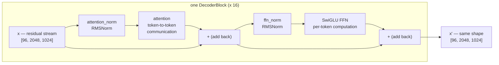
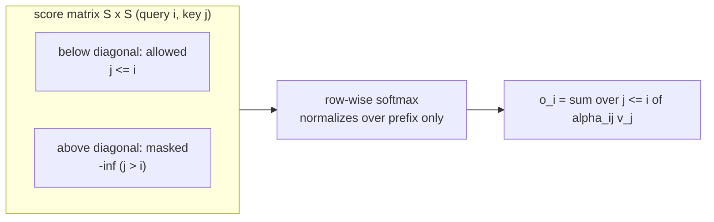
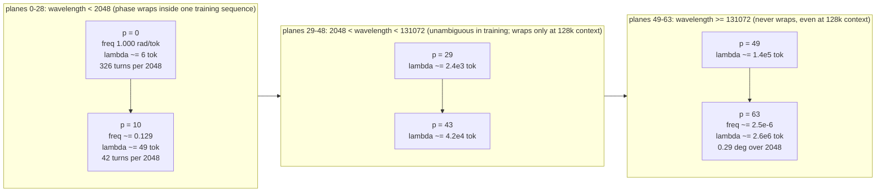
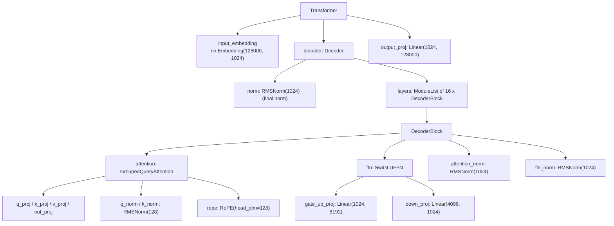
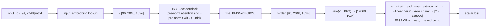
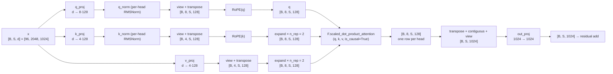

# LLaMA-3-Lite — Attention and Positional Encoding

> Audience: beginner → intermediate. This consolidated concept doc builds the
> LLaMA-3-Lite architecture from first principles — the decoder-only
> transformer, the residual stream, scaled dot-product attention with causal
> masking, multi-head and grouped-query attention, Flash Attention 2, and the
> RoPE landscape (why positions exist, the three encoding families, the
> mathematics of rotary embeddings, and what the θ = 500K frequency schedule
> controls). Code lives in `model.py` (`GroupedQueryAttention`, `RoPE`,
> `DecoderBlock`, `Transformer`, `build_transformer`) with hyperparameters in
> `config.py:get_config`; the line-by-line RoPE implementation deep-dive
> lives in [references/model-reference.md](../references/model-reference.md).
> Every number is worked out at this project's scale: batch 96, sequence
> 2048, `d_model` 1024.

## Overview

A transformer language model is a function that reads a sequence of token IDs
and outputs a probability distribution over "what comes next." LLaMA-3-Lite
is a **decoder-only** transformer: one stack of 16 identical blocks that
reads a prefix of up to 2,048 tokens and predicts the next token at every
position at once. Each block is a residual refinement step — it reads the
current hidden state, computes an attention update and a feed-forward update,
and **adds** them back (`x = x + block(x)`). Attention is the only place
tokens talk to each other: each token emits a **query** ("what am I looking
for"), every token emits a **key** ("what I am") and a **value** ("what I
carry"), and the output of a position is the weighted sum of all values,
where the weight of value $j$ is the softmax of the dot product between
position $i$'s query and position $j$'s key, divided by $\sqrt{d_k}$.
Because the language-modeling task is causal, the score matrix is masked so
that future tokens contribute nothing. LLaMA-3-Lite's attention
(`model.py:GroupedQueryAttention`) splits this into 8 heads of width 128,
shares the key/value heads between pairs of query heads (4 KV heads,
`n_rep = 2`), and delegates the actual math to PyTorch's fused
`F.scaled_dot_product_attention(q, k, v, is_causal=True)`, which on an A100
runs Flash Attention 2: same numbers, but $O(S)$ memory instead of $O(S^2)$
and no materialized attention matrix. Position enters inside attention: RoPE
(`model.py:RoPE`) rotates query and key vectors in 2-D planes before the dot
product, making the attention score depend on the *relative* distance between
tokens — with `rope_theta = 500000.0` in `config.py:get_config` controlling
how far position information stays unambiguous. The whole model has 513.8M
parameters, of which 251.7M live in the 16 blocks and the other 262.1M are
the two vocabulary-sized embedding tables.

## The language-modeling task and decoder-only design

### The task: predict the next token

Natural language is a sequence of discrete symbols. A language model turns
that sequence into a probability distribution. Write a sequence of tokens as

$$t_1, t_2, \dots, t_n$$

where each $t_i$ is an integer in $\{0, 1, \dots, V-1\}$ and $V$ is the
vocabulary size. The joint probability of the whole sequence factorizes by
the chain rule of probability:

$$p(t_1, \dots, t_n) = \prod_{i=1}^{n} p(t_i \mid t_1, \dots, t_{i-1}).$$

Nothing is assumed about the conditional distributions — this factorization is
exact for any distribution over sequences. The modeling problem is therefore:
*learn one conditional distribution per position*, $p(t_i \mid t_{<i})$. The
model takes the prefix $t_{<i}$ and outputs a vector of $V$ scores (logits)
that are turned into a probability distribution by softmax:

$$p(t_i = v \mid t_{<i}) = \frac{\exp(z_v)}{\sum_{j=0}^{V-1} \exp(z_j)},$$

where $z \in \mathbb{R}^V$ is the logit vector for position $i$.

Two consequences of this formulation matter enormously:

1. **It is self-supervised.** Any text corpus gives labels for free: for each
   position $i$, the "answer" is the observed token $t_i$. No human
   annotation, no labels beyond the text itself.
2. **Generation is just iterated prediction.** To generate, sample
   $\hat{t}_{n+1} \sim p(\cdot \mid t_{1..n})$, append it, and repeat. Because
   the model only ever conditions on the *past*, the training objective and
   the generation-time behavior are the same operation. This is the deep
   reason language models are trained with a next-token objective rather
   than, say, a reconstruction objective.

### The training signal, concretely

During training the model sees a window of $S = 2048$ tokens and produces one
logit vector per position. The target for position $i$ is the token at
position $i+1$ — the *next* token. The data pipeline builds this shift for
us: `data/shared_data/loader.py:PackedDataset.__getitem__` slices a window of
`seq_len + 1` tokens and returns `window[:-1]` as the inputs and `window[1:]`
as the targets. Training maximizes

$$\mathcal{L}_{\text{CE}} = -\frac{1}{N} \sum_{i} \log p(t_{i+1} \mid t_{\le i}),$$

i.e. mean per-token cross-entropy, summed over all positions in the batch. At
this project's scale, one training step consumes a batch of 96 windows of
2,048 tokens — $96 \times 2048 = 196{,}608$ tokens per step — and the planned
42,000 steps consume $196{,}608 \times 42{,}000 = 8.26$ billion tokens. That
number matters because it sits in the range where a ~0.5B-parameter model is
compute-matched to its data (see [training-and-memory.md](training-and-memory.md)).

A useful way to read the loss: minimizing cross-entropy is equivalent to
maximizing the probability the model assigns to the real continuation. If the
model is perfect, the loss is 0 (it assigns probability 1 to the true next
token); a uniform random guess over 128,000 tokens gives
$\ln(128{,}000) \approx 11.76$ nats. Training moves the loss from somewhere
near that ceiling down toward the irreducible entropy of natural text. The
model's quality is often quoted as **perplexity**, $\exp(\mathcal{L})$, which
reads as "the model's average branching factor per token."

### Why next-token prediction is enough

It is worth being explicit about a subtlety: the model is trained to predict
*one* token ahead, yet it is expected to learn syntax, facts, and reasoning.
The mechanism is that each conditional $p(t_i \mid t_{<i})$ must implicitly
summarize the entire prefix — grammar constrains the next word, semantics
constrain it further, and long-range patterns (coreference, argument
structure) require the model to have tracked them across thousands of tokens.
Predicting the next token is a cheap-to-evaluate probe that forces the model
to build exactly this summary, because the summary is what the prediction
must be conditioned on. This is why the hidden state after reading a prefix
is a useful "representation" of it, and why the model's internals are worth
studying — they are the machinery that maintains that summary.

### Why decoder-only? The sequence-to-sequence origin

The 2017 transformer was invented for **sequence-to-sequence** tasks such as
machine translation, where the input (a French sentence) and the output (an
English sentence) are different sequences. The architecture therefore had
three parts:

- an **encoder** that reads the *entire* source sequence with *bidirectional*
  self-attention — every source position may attend to every other source
  position, because the source is fully known;
- a **decoder** that generates the target one token at a time, using *causal*
  self-attention over the target prefix (each target position may attend only
  to earlier target positions, so the future cannot leak into the prediction)
  plus **cross-attention** that queries the encoder's final representation;
- a learned mapping (the head) from decoder hidden states to vocabulary
  scores.

The encoder-decoder split encodes a structural fact: the *source* is fully
observed and can be summarized with bidirectional context, while the *target*
is produced left-to-right and must respect causality.

Now consider plain language modeling. The "source" and "target" are the
**same text**: the model's job is to continue a prefix. There is no separate
input sentence to summarize — the conditioning context *is* the prefix the
model has already generated (or read from the corpus). That observation
dissolves the encoder-decoder split:

- **Bidirectional context is unavailable by construction.** The future tokens
  do not exist at prediction time. Causal masking is not a limitation imposed
  on language modeling; it is the correct statement of the task.
- **Cross-attention is unnecessary.** In translation, cross-attention tells
  the decoder "the source sentence is done, here is its summary." In language
  modeling, the prefix is itself the thing to attend to. A causal self-
  attention stack already conditions every position on every earlier
  position.
- **One stack suffices for both "reading" and "writing."** The same layers
  that processed the corpus prefix during training process the generated
  prefix during sampling. There is no separate encoder to run at generation
  time.

So the decoder-only architecture — a single causal stack with no
cross-attention — is not a simplification that sacrifices capability; it is
the *exact* minimal structure that implements next-token prediction. This is
the design lineage of GPT and LLaMA.

In LLaMA-3-Lite the absence of an encoder is visible directly in the code:
`model.py:DecoderBlock` contains exactly three things — a
`GroupedQueryAttention` (causal self-attention), a `SwiGLUFFN`, and two
normalization layers. There is no encoder, no cross-attention module, and no
attention mask argument at all: causality comes from `is_causal=True` inside
the attention call.

Dropping the encoder also halves the memory and compute footprint of every
"reading" pass: the model never needs to run a second network over the input
or store its activations for cross-attention. The remaining stack is the
largest single consumer of FLOPs, and it is shared between the training
forward pass and every generation step.

## The residual stream

### A blackboard, not a pipeline

The classic way to picture a neural network is a pipeline: data flows in one
end, gets transformed at each layer, and comes out the other end. A
transformer with residual connections is better pictured as a **shared
blackboard** (the "residual stream"). The hidden state $x$ is a board of
$B \times S$ rows, each row a vector in $\mathbb{R}^{1024}$ holding the
current "working notes" for one token position. Each block is an expert that:

1. reads the board,
2. computes an update — a small *delta* — from what it read,
3. **adds** the delta to the board, and leaves the board in place for the
   next block.

The update rule is exactly

$$x \leftarrow x + \text{block}(x).$$

Nothing is ever overwritten destructively; information only ever accumulates.
That single design decision is what makes transformers trainable at 16 layers
deep.

### Two kinds of updates

The two sub-blocks inside each `model.py:DecoderBlock` do two different kinds
of work:

- **Attention** (the "communication" update): each position looks at every
  earlier position, gathers relevant information, and writes a summary of
  what it found back to its own row. This is how information moves *between*
  tokens — a pronoun can "look at" its antecedent four hundred tokens back, a
  code token can attend to the function definition that names it.
- **Feed-forward** (the "computation" update): each row is processed
  *independently* through a wide two-layer network with a nonlinearity. No
  cross-token communication happens here; the FFN is where the model "thinks"
  about what it currently knows — pattern matching, arithmetic-like
  manipulation, recall of facts — one token at a time.

The alternation is deliberate and repeated 16 times: communicate, compute;
communicate, compute. Each round of communication+computation is one
"refinement step" of the board, and each block's delta is small enough (in
practice) that the board evolves smoothly across the depth of the network
rather than being overwritten.



### A worked toy example

Suppose a 3-token prefix `["the", "cat", "sat"]` is embedded as three
1024-dimension vectors. After the first block's attention, the vector for
"sat" contains a blend of "sat" plus gathered context about "cat" (the
subject). After the first FFN, that blended vector is transformed nonlinearly
into a slightly more "prediction-ready" vector — closer to whatever the model
believes follows "the cat sat". The next block repeats: attention lets "sat"
also gather information from "the" (e.g. that the noun phrase started at
position 0), and the FFN further refines. After 16 rounds, the final vector
for the last position is the model's complete summary of "the cat sat" as
evidence for predicting the next token. Note the shape never changes: in,
`[96, 2048, 1024]`; out, `[96, 2048, 1024]`. Depth buys *refinement*, not
*growth* — the model is free to use as much or as little of the 1024
dimensions per token as the task needs.

### What the residual stream buys you, concretely

- **A clean gradient highway.** The identity path `x = x + block(x)` means
  the gradient of the loss with respect to early layers has a term that flows
  through the blocks *without ever passing through a weight matrix or
  nonlinearity*. Deep stacks stay trainable.
- **Interpretability.** Since each block adds a delta, you can inspect "what
  did block 5 contribute to this prediction" — the deltas are directly
  additive.
- **Weight sharing across depth is not needed.** Each of the 16 blocks has
  its own parameters, but the *interface* is identical, so the blocks are
  interchangeable modules from the code's perspective — which is exactly how
  `model.py:Transformer.__init__` builds them, in a list comprehension over
  `n_layers`.

## The block equations and data flow

Let $B$ = batch size, $S$ = sequence length, $d = d_{\text{model}} = 1024$,
$L = 16$ layers, $V = 128{,}000$ vocabulary entries. The model is:

$$x_0 = \text{Embed}(t_{1..S}) \in \mathbb{R}^{B \times S \times d},$$

$$x_{\ell+1} = x_\ell + \text{Attn}\big(\text{RMSNorm}_a(x_\ell)\big) + \text{SwiGLU}\big(\text{RMSNorm}_f(x'_\ell)\big),$$

where the attention and FFN updates are applied as two separate residual adds
inside each block (see `model.py:DecoderBlock.forward`), and

$$x_{\text{out}} = \text{RMSNorm}_{\text{final}}(x_L),$$

$$\text{logits} = x_{\text{out}}\, W_{\text{head}}^{\top} \in \mathbb{R}^{B \times S \times V}.$$

The attention sub-block is scaled dot-product attention with causal masking
(developed in full below):

$$\text{Attn}(x) = \text{softmax}\left(\frac{QK^{\top}}{\sqrt{d_h}} + \text{mask}\right) V \, W_{\text{out}}, \qquad Q = xW_q,\; K = xW_k,\; V = xW_v,$$

with $d_h = 128$ the per-head dimension, 8 query heads, and 4 KV heads
(grouped-query attention: each KV head is shared by 2 query heads,
$n\_rep = 8/4 = 2$). The mask is a causal one — position $i$ may only attend
to $j \le i$.

The SwiGLU sub-block (detail in
[architecture-components.md](architecture-components.md)) is:

$$\text{SwiGLU}(x) = \big(\text{SiLU}(x W_g) \odot (x W_u)\big) W_{\text{down}},$$

where $\odot$ is elementwise multiplication and $W_g, W_u$ are stacked into a
single fused `gate_up_proj` of width $2 d_{\text{ff}} = 8192$ in the code.

### Pre-norm vs post-norm

There are two places a normalization layer can sit relative to a residual
update:

- **Post-norm** (the original 2017 transformer): `y = Norm(x + Sublayer(x))`.
  The normalization is applied *after* the addition, so the residual path
  itself passes through the norm. The gradient of the loss with respect to a
  deep layer's input must multiply through the norms of all later layers.
  With 16 stacked blocks, the effective learning rate of early layers is
  controlled by the product of these norm scales, which in practice makes
  deep post-norm stacks finicky to train.
- **Pre-norm** (GPT, LLaMA): `y = x + Sublayer(Norm(x))`. The normalization
  is applied to the *input* of the sublayer only; the residual identity path
  `x` is untouched. The gradient of the loss with respect to $x_0$ then
  contains a term that is literally the identity — `dL/dx_L` passed back
  unchanged through all 16 blocks — so early layers receive a strong, stable
  gradient signal regardless of depth.

LLaMA-3-Lite is pre-norm throughout, and you can read the placement directly
off the code:

```python
# illustrative
# model.py:DecoderBlock.forward
def forward(self, x):
    x = x + self.attention(self.attention_norm(x))
    x = x + self.ffn(self.ffn_norm(x))
    return x
```

The norm is a `model.py:RMSNorm` — a scale-only variant of LayerNorm that
skips mean subtraction (see
[architecture-components.md](architecture-components.md)):

$$\text{RMSNorm}(x) = \frac{x}{\sqrt{\frac{1}{d}\sum_j x_j^2 + \epsilon}} \odot \gamma,$$

with $\epsilon = 10^{-5}$ and a learned per-dimension gain
$\gamma \in \mathbb{R}^{1024}$. The final normalization after the last block
(`model.py:Decoder.forward`) is the *same* pre-norm logic applied once more:
the output of the 16th block passes through one last RMSNorm before the LM
head, so the head always reads a stably-scaled representation.

### Tokenization → embedding

The model never sees characters or bytes directly; it sees integers.
**Tokenization** is the fixed, learned-before-training mapping from text to
integers (see [references/data-reference.md](../references/data-reference.md)
for this repo's pipeline). LLaMA-3-Lite's vocabulary has $V = 128{,}000$
entries (`config.py:get_config` → `vocab_size: 128000`), which comfortably
covers multi-byte UTF-8, common subwords, and frequent punctuation.

The first learned layer is a lookup table:

$$x_0[i] = E[t_i], \qquad E \in \mathbb{R}^{128{,}000 \times 1024}.$$

`model.py:Transformer.__init__` creates this as `nn.Embedding(vocab_size,
d_model)` — a table of 128,000 rows, each a 1024-dimensional learned vector.
The lookup is a pure gather: row `t_i` is copied into position $i$ of the
hidden state. For a batch of 96 sequences of 2,048 tokens this produces the
tensor $[96, 2048, 1024]$ — the first time the $[B, S, d]$ shape appears.

Two things are deliberately *absent* here:

- **No positional embedding is added at the input.** The classic GPT-style
  architecture adds learned position vectors; LLaMA instead injects position
  information *inside* attention, by rotating queries and keys with **RoPE**
  (`model.py:RoPE`) before the dot product (see the RoPE sections below and
  [references/model-reference.md](../references/model-reference.md)). The
  embedding output is pure content.
- **The embedding is not normalized.** The first `attention_norm` inside
  block 0 is the first normalization the vectors see.

The embedding table is a large parameter sink: $128{,}000 \times 1024 =
131{,}072{,}000$ parameters — 131.1M — which is 25.5% of the entire model.
And there are *two* such tables, because (unlike some older GPT models) the
output head is **not weight-tied** to the input embedding: the model keeps
separate `input_embedding` and `output_proj` weights. The two tables together
are 262.1M parameters — more than the entire 16-block stack. This is the
"embeddings dominate a small model" phenomenon: at 0.5B scale the vocabulary
is a first-class citizen of the budget (parameter table below).

### The stack of blocks

The embedding output $[96, 2048, 1024]$ enters `model.py:Decoder`, which runs
the 16 `model.py:DecoderBlock`s in sequence and applies the final norm. Every
block preserves the shape:

$$[96, 2048, 1024] \xrightarrow{\text{block } \ell} [96, 2048, 1024].$$

Per block, the tensor work is: two RMSNorms (each a reduction over the last
axis, $1024$ floats per row), one multi-head attention pass (projections in
and out of $1024$ dimensions, plus the attention score computation described
below), and one SwiGLU pass (expand to $8192$, gate, compress back to $1024$;
see [architecture-components.md](architecture-components.md)).

If we count the per-block parameters once (derived in full in the parameter
table below): attention projections 3,145,728, QK-norm gains 256, SwiGLU
12,582,912, block norms 2,048 — **15,730,944 per block**, 16 blocks =
251,695,104. The stack of blocks, plus the final norm's 1,024 gains, is the
entire **non-embedding** parameter budget: 251,696,128, i.e. 251.7M.

### The LM head and the loss

After the final norm, the model must turn each of the $S$ row vectors into a
distribution over $V = 128{,}000$ tokens. The **LM head** is a learned linear
map, shared across all positions:

$$z = x_{\text{out}} W_{\text{head}}^{\top}, \qquad W_{\text{head}} \in \mathbb{R}^{128{,}000 \times 1024}.$$

In the code this is the `output_proj` head created in
`model.py:Transformer.__init__` — `nn.Linear(d_model, vocab_size,
bias=False)` — a matrix with $128{,}000 \times 1024 = 131{,}072{,}000$
parameters, the second 131.1M vocabulary-sized table.

**This is the moment where memory becomes the design constraint.** Flattening
the batch, the head produces

$$N = B \times S = 96 \times 2048 = 196{,}608 \text{ rows},$$

so the full logits tensor is $[196{,}608, 128{,}000]$ — 25.17 billion
entries. In BF16 that is $25{,}165{,}824{,}000 \times 2$ bytes $= 50.3$ GB;
in FP32, 100.7 GB. Neither fits on the 80 GB A100 once the model weights,
gradients, and activations are also resident. The code therefore never
materializes the full logits in training. `model.py:Transformer.forward` has
a `return_hidden: bool = False` flag: when `True` it returns the
`[96, 2048, 1024]` hidden states and skips the head, and the loss function
`model.py:chunked_head_cross_entropy_with_z` computes `hidden @ W_head.T` in
slices of `chunk_size = 256` rows. A single slice is $[256, 128{,}000]$ in
FP32 — $256 \times 128{,}000 \times 4$ bytes $= 131$ MB — and only one slice
is alive at a time because each slice's math runs inside a
gradient-checkpoint boundary.

The loss is cross-entropy plus a small **z-loss** regularizer (PaLM/Gemma2
style):

$$\mathcal{L} = \underbrace{-\frac{1}{N}\sum_i \log p(t_{i+1} \mid t_{\le i})}_{\text{CE}} + z_{\text{weight}} \cdot \underbrace{\frac{1}{N_z}\sum_{i \in \text{valid}} \left(\log \sum_v e^{z_{i,v}}\right)^2}_{\text{z-loss}},$$

with `z_loss_weight = 1e-4` (`config.py:get_config`). The z-loss penalizes
the log-partition function $\log \sum_v e^{z_v}$ — a measure of how "spread
out" the logits are — which prevents the model's logits from drifting to
ever-larger magnitudes late in training (see
[architecture-components.md](architecture-components.md) for the full
treatment, including why the training path masks ignored positions with
`ignore_index=-100`: this pipeline packs documents with no padding, so in
principle nothing is ignored, and `-100` exists to keep EOS-separator tokens
learnable).

### The parameter anatomy (the budget, derived)

Every number below is computed from the shapes in `model.py` and the
hyperparameters in `config.py:get_config`, and the totals were verified by
building the model (`model.py:build_transformer` prints them;
`model.py:Transformer.get_num_params` computes the non-embedding split).
Vocabulary $V = 128{,}000$, $d = 1024$, $d_{\text{ff}} = 4096$, 8 query
heads, 4 KV heads, `head_dim = 128`.

| Component | Weight shape(s) | Derivation | Params |
|---|---|---|---|
| input_embedding | $[128000, 1024]$ | $128{,}000 \times 1024$ | 131,072,000 |
| — per block, attention: q_proj | $[1024, 1024]$ | $d \times (n\_heads \cdot d_h) = 1024 \times 1024$ | 1,048,576 |
| k_proj | $[512, 1024]$ | $1024 \times (4 \cdot 128) = 1024 \times 512$ | 524,288 |
| v_proj | $[512, 1024]$ | $1024 \times 512$ | 524,288 |
| out_proj | $[1024, 1024]$ | $(8 \cdot 128) \times 1024$ | 1,048,576 |
| q_norm + k_norm gains | $[128]$ each | $2 \times \text{head\_dim} = 2 \times 128$ | 256 |
| gate_up_proj | $[8192, 1024]$ | $d \times 2 d_{\text{ff}} = 1024 \times 8192$ | 8,388,608 |
| down_proj | $[1024, 4096]$ | $d_{\text{ff}} \times d = 4096 \times 1024$ | 4,194,304 |
| attention_norm + ffn_norm gains | $[1024]$ each | $2 \times d$ | 2,048 |
| **per-block total** | | $3{,}145{,}728 + 256 + 12{,}582{,}912 + 2{,}048$ | **15,730,944** |
| **16 blocks** | | $15{,}730{,}944 \times 16$ | **251,695,104** |
| final RMSNorm gains | $[1024]$ | $d$ | 1,024 |
| **non-embedding total** | | $251{,}695{,}104 + 1{,}024$ | **251,696,128** (251.7M) |
| output_proj (LM head) | $[128000, 1024]$ | $128{,}000 \times 1024$ | 131,072,000 |
| **grand total** | | $251{,}696{,}128 + 2 \times 131{,}072{,}000$ | **513,840,128** (513.8M) |

Reading the table:

- **The two vocabulary tables cost 262.1M — over half the model.**
  `input_embedding` + `output_proj` = $2 \times 131{,}072{,}000 =
  262{,}144{,}000$, versus 251.7M for everything else. This is why
  `model.py:Transformer.get_num_params` splits the count:
  `non_embedding=True` subtracts both tables and reports 251.7M, the number
  that reflects the "reasoning machinery" rather than the vocabulary.
- **The FFN dominates the block.** SwiGLU is $12{,}582{,}912$ of the
  $15{,}730{,}944$ per block (80%), because it expands to $2 d_{\text{ff}} =
  8192$ wide. This is standard for LLaMA-family models and is worth
  remembering when reasoning about FLOPs and memory.
- **Attention is the KV-cheap part.** q + out are $1024 \times 1024$ each,
  but k and v are only $1024 \times 512$ because of grouped-query attention:
  4 KV heads instead of 8. The KV projections are $2 \times 524{,}288 =
  1{,}048{,}576$ — had they been full-width like q, the block would carry 1M
  extra params and, more importantly, the KV cache would be twice as large at
  inference.
- **Weights in memory.** In BF16, $513{,}840{,}128 \times 2$ bytes $= 1.03$
  GB for the weights alone (0.52 GB of it embeddings). Gradients add another
  1.03 GB in training, and AdamW keeps FP32 moments — $2 \times
  513{,}840{,}128 \times 4$ bytes $= 4.11$ GB. The full training-memory
  ledger is derived in [training-and-memory.md](training-and-memory.md).

## Scaled dot-product attention, step by step

### Why attention exists

Language is a sequence of tokens, and the job of a decoder-only model is to
predict the next token given the previous ones. The hard part is that any two
positions can matter to each other: the subject of a sentence and its verb
can be tens of tokens apart, with arbitrary structure in between. A model
needs a mechanism whose *connectivity* is not fixed by construction — any
position must be able to reach any earlier position — and whose *strength of
connection* is computed from the content of the two positions, not from a
hand-written rule.

The pre-attention alternatives each fail on one of these requirements:

- **Fixed-window context** (an $n$-gram model, or a convolutional receptive
  field): position $i$ can only see $i-n+1 \dots i$. Long-range dependencies
  are simply out of reach, and the budget grows linearly with the range you
  want.
- **Recurrent state** (an RNN/LSTM): in principle the hidden state at step
  $i$ summarizes all of history, but in practice the state is a fixed-size
  vector that must compress everything, and gradients must flow through the
  recurrence to reach earlier steps — vanishing-gradient territory. The path
  from position $i$ to position $j$ is $|i-j|$ long.
- **Fully-connected, fixed weights**: every position attends to every other
  with the *same* weight. This has full connectivity but zero selectivity —
  it cannot express "attend to the subject, not the adverb".

Attention solves all three at once: every position computes a *query*, every
position offers a *key* and a *value*, and the weight between positions $i$
and $j$ is a learned, content-dependent function of the query at $i$ and the
key at $j$. Connectivity is complete, the strength is computed on the fly,
and the path from any position to any other is exactly one hop — gradient
flow is direct.

### Intuition: attention as content-addressable retrieval

Think of a hash table, but differentiable. At every position you have three
vectors:

- **Query** $q_i$ — "what am I looking for". In a translation example, the
  token at position $i$ might be looking for the subject it depends on, or a
  coreferent noun.
- **Key** $k_j$ — "what I am". Each position announces its identity, in the
  same space as the queries so that dot products are meaningful.
- **Value** $v_j$ — "what I carry". The payload that position $j$ will hand
  over, in whatever proportion it is selected.

The retrieval: position $i$ computes how well each key $k_j$ matches its
query $q_i$ (the dot product, a similarity measure), normalizes those scores
into a probability distribution (softmax), and returns the weighted sum of
the values. So the output of position $i$ is a *mixture of the values of
every position, with mixture weights determined by content similarity*:

$$o_i = \sum_{j=1}^{S} \alpha_{ij} v_j, \qquad
\alpha_{ij} = \frac{\exp\big(q_i \cdot k_j / \sqrt{d_k}\big)}
{\sum_{j'=1}^{S} \exp\big(q_i \cdot k_{j'} / \sqrt{d_k}\big)}.$$

This is not a lookup with exact keys — it is a *soft* lookup: if the query is
somewhere between two keys, the output is a blend of the two values. And
because everything is differentiable, the projections that produce $q$, $k$,
$v$ are learned end-to-end: training discovers what kinds of "matching" are
useful for the loss. Different heads learn different retrieval patterns —
some heads track the previous token, some track syntactic relations, some
track positional structure via RoPE.

**A tiny worked example.** Take three tokens with 2-dimensional keys and
values, and suppose the query of token 2 happens to point exactly at key 0:

```
keys:   k0 = (1, 0)    k1 = (0, 1)    k2 = (0.7, 0.7)
values: v0 = (5, -2)   v1 = (0, 3)    v2 = (1, 1)
query:  q2 = (1, 0)
```

Dot products (ignoring the $\sqrt{d_k}$ factor for the example): $q_2 \cdot
k_0 = 1$, $q_2 \cdot k_1 = 0$, $q_2 \cdot k_2 = 0.7$. Softmax of $(1, 0,
0.7)$ gives roughly $\alpha = (0.42, 0.15, 0.30)$ (after subtracting the max
for stability, $\exp$ of $(0, -1, -0.3)$ normalized). The output is $o_2 =
0.42 \cdot v_0 + 0.15 \cdot v_1 + 0.30 \cdot v_2 = (2.4, -0.39)$. Token 2
mostly retrieved token 0's payload, diluted by the others. The mechanism has
selected "who to listen to" from content alone — no position index, no
hand-written rule.

### The formula

For a single head, let $Q, K, V \in \mathbb{R}^{S \times d_k}$ be the query,
key, and value matrices (one row per sequence position; $d_k$ is the head
dimension, 128 here). Attention is:

$$\text{Attention}(Q, K, V) = \operatorname{softmax}\!\left(\frac{Q K^\top}{\sqrt{d_k}}\right) V,$$

with the softmax applied row-wise (each row is one query's distribution over
the $S$ keys). The three ingredients:

1. **$Q K^\top$** — the $S \times S$ score matrix; entry $(i, j)$ is the raw
   similarity between query $i$ and key $j$. This is a batched matmul over
   the head dimension: for every pair of positions, a length-$d_k$ dot
   product.
2. **$1/\sqrt{d_k}$** — the *temperature* that keeps the scores in a sane
   range; the next section derives why the exact factor is $\sqrt{d_k}$.
3. **softmax + multiply by $V$** — normalize each row to a probability
   distribution and take the weighted average of the values.

The whole thing is two matrix multiplications and a row-wise softmax in
between. That is the entire "attention mechanism" — everything else in this
doc (positions, heads, masking, GQA, Flash Attention) is an engineering
refinement on top of this one formula.

**What the softmax buys you:**

- **Normalization**: each row sums to 1, so the output is a convex
  combination of values — the output lives in the same space and scale as the
  values regardless of the number of keys.
- **Selectivity**: the exponential sharpens differences. A key that scores
  twice as high gets $e^1 \approx 2.7\times$ the weight of a baseline key,
  not $2\times$; the mechanism is pushed toward near-one-hot "retrieval"
  while remaining fully differentiable.
- **Differentiability**: softmax is smooth everywhere, so the discrete choice
  "which keys to attend to" is relaxed into a continuous one and gradient
  descent can move the query to point at better keys.

### Why divide by √d_k — the variance argument

Consider the dot product of two *independent* random vectors with
independent, zero-mean, unit-variance entries (a reasonable model of
freshly-initialized or normalized query and key vectors):

$$s = q \cdot k = \sum_{i=1}^{d_k} q_i k_i, \qquad
\mathbb{E}[q_i] = \mathbb{E}[k_i] = 0,\quad
\operatorname{Var}(q_i) = \operatorname{Var}(k_i) = 1.$$

Because the entries are independent and zero-mean, the cross terms vanish and
the variance of each product term is

$$\operatorname{Var}(q_i k_i) = \mathbb{E}[q_i^2]\,\mathbb{E}[k_i^2]
- \mathbb{E}[q_i]^2 \mathbb{E}[k_i]^2 = 1 \cdot 1 - 0 = 1,$$

so the variance of the sum is additive:

$$\operatorname{Var}(s) = \sum_{i=1}^{d_k} \operatorname{Var}(q_i k_i) = d_k,
\qquad \operatorname{std}(s) = \sqrt{d_k}.$$

The score's standard deviation is $\sqrt{d_k}$ — it grows with the head
dimension. For $d_k = 128$ (this model's `head_dim`, from
`config.py:get_config`), $\operatorname{std}(s) \approx 11.3$. The softmax
inputs are spread over roughly $\pm 6 \cdot 11.3 \approx \pm 68$ once you
account for the tail — a range that spans ~30 orders of magnitude in $e^z$.
Scaling by $1/\sqrt{d_k}$ normalizes the variance back to 1, making the
softmax inputs $O(1)$ regardless of $d_k$:

$$\operatorname{Var}\!\left(\frac{s}{\sqrt{d_k}}\right) = \frac{d_k}{d_k} = 1.$$

That is the entire reason for the factor: it is a variance-normalizing
temperature. (This is exactly the argument in the original transformer paper;
the derivation above makes the "why $d_k$ and not $d_k/2$" question precise —
the variance of a length-$d_k$ sum is $d_k$, so the correct normalization is
$\sqrt{d_k}$.)

**What happens without it: softmax saturation kills the gradient.** Softmax
is only a useful learning signal where it is *sensitive* to its inputs. Write
the softmax row as $p = \operatorname{softmax}(z)$; the Jacobian is

$$\frac{\partial p_i}{\partial z_j} = p_i\,(\delta_{ij} - p_j).$$

If one entry of $z$ is much larger than the rest (which is typical when
$\operatorname{std}(z) \approx 11$: the max of 2048 draws sits around
$11.3 \cdot \sqrt{2 \ln 2048} \approx 45$), then $p$ is nearly one-hot:
$p_m \approx 1$ for the argmax $m$ and $p_{i \ne m} \approx 0$. In that
regime

$$\frac{\partial p_m}{\partial z_j} \approx \delta_{mj} - p_j \approx 0
\quad\text{for all } j,$$

so the gradient of *everything downstream of the softmax* with respect to the
scores is essentially zero — the row is a hard argmax that backprop cannot
push. With unnormalized scores, early in training (random queries/keys) most
rows land in this saturated state, and the model cannot learn to retarget its
attention: the gradient signal through the softmax is dead. The
$1/\sqrt{d_k}$ factor keeps typical scores in the regime where
$p_i (1 - p_i)$ is comfortably nonzero, so the softmax stays "plastic".

The same intuition in terms of the final cross-entropy gradient: the loss
gradient with respect to the logits is $p - y_{\text{target}}$; when $p$ is a
near-one-hot at the *wrong* token, the gradient is large but the softmax
Jacobian (which sits between the logits and $p$) is what actually backprops —
and it is the same near-zero matrix. Scaling fixes the root cause, not the
symptom.

**Numbers at this project's scale:**

- `head_dim` = 128 → unscaled score std $\sqrt{128} \approx 11.31$; scaled
  std = 1.
- Unscaled, the typical max score over a row of $S = 2048$ keys sits around
  $11.31 \cdot \sqrt{2 \ln 2048} \approx 11.31 \cdot 3.94 \approx 45$; $e^{45}$
  dwarfs every other term, i.e. effectively one-hot. Scaled, the typical max
  is $\approx 3.9$ and the softmax has real spread.
- With `qknorm=True` (the default in `config.py:get_config`), the query and
  key vectors are RMS-normalized per head (`model.py:GroupedQueryAttention`
  applies `RMSNorm(head_dim)` to $q$ and $k$ before RoPE; see
  [architecture-components.md](architecture-components.md)), so
  $\|q\| \approx \|k\| \approx \sqrt{d_k}$ and $q \cdot k$ is bounded by
  $d_k = 128$ in magnitude by Cauchy–Schwarz. The $\sqrt{d_k}$ scaling inside
  `F.scaled_dot_product_attention` still applies on top, keeping typical
  logits $O(1)$; the two mechanisms are complementary — QK-norm caps the
  worst case, the scaling normalizes the typical case.

### Causal masking: why the future must not leak

The model is trained to predict token $t+1$ from tokens $1 \dots t$ (see the
language-modeling section above). The target for position $i$ is the token at
position $i+1$, so position $i$'s prediction may legitimately use only
positions $j \le i$. If attention let position $i$ read position $j > i$, the
model could cheat: the answer to "what comes after $i$" is literally sitting
at position $i+1$ in the input. At training time the full sequence is fed in
at once (no sequential loop), so *nothing except the mask* prevents this
leakage — the model would learn "copy the next token", and at generation time
(where tokens are produced one at a time and the future genuinely does not
exist) it would collapse.

The fix is to force the score matrix to be lower-triangular: set the score of
every (query $i$, key $j$) pair with $j > i$ to $-\infty$ before the softmax.
Since $e^{-\infty} = 0$, those positions get zero attention weight and their
values contribute nothing; equivalently, the softmax is taken over the prefix
only:

$$o_i = \sum_{j \le i} \alpha_{ij} v_j, \qquad
\alpha_{ij} = \frac{\exp\!\big((q_i \cdot k_j + M_{ij}) / \sqrt{d_k}\big)}
{\sum_{j' \le i} \exp\!\big((q_i \cdot k_{j'} + M_{ij'}) / \sqrt{d_k}\big)},$$

with $M_{ij} = 0$ for $j \le i$ and $M_{ij} = -\infty$ for $j > i$. Masked
entries also receive no gradient through the softmax, which is exactly right:
a future token is not allowed to influence an earlier prediction, so it
should not influence the parameters through that prediction either.



**The flag in the code.** The mask is not built by hand anywhere in
`model.py`. The attention module requests it declaratively:

```python
# model.py:GroupedQueryAttention.forward (verbatim)
x = F.scaled_dot_product_attention(q, k, v, is_causal=True)
```

`is_causal=True` tells PyTorch's `scaled_dot_product_attention` to apply the
causal mask. How the mask is *realized* depends on the backend: the eager
"math" backend materializes an additive $S \times S$ mask of $-\infty$ above
the diagonal; the Flash Attention kernels never build the mask at all — they
skip the masked tiles, which is both faster and uses no extra memory. Either
way the caller supplies a flag, not a tensor.

There is one subtlety worth being explicit about: the model has **no padding
mask** and needs none. The data pipeline packs documents contiguously with
EOS separators and no padding tokens (see
[data-and-kernels.md](data-and-kernels.md)), and the loss masks ignored
positions with `ignore_index=-100` rather than the attention
(`model.py:chunked_head_cross_entropy_with_z` defaults to
`ignore_index=-100`). Causal masking is therefore the *only* masking the
model ever needs — which is exactly the situation where the fused
`is_causal` path can be used unconditionally.

**The test that proves causality.**
`tests/test_model.py::TestGroupedQueryAttention.test_causality` verifies the
property directly. The setup (from the test source):

```python
# illustrative
torch.manual_seed(0)
attn = GroupedQueryAttention(
    d_model=32, n_heads=4, n_kv_heads=2, head_dim=8,
    max_seq_len=16, rope_theta=10000.0,
).to(device).eval()
x = torch.randn(1, 6, 32, device=device)
out1 = attn(x)
x2 = x.clone()
x2[:, -1, :] += torch.randn_like(x[:, -1, :]) * 10.0
out2 = attn(x2)
assert torch.allclose(out1[:, :3, :], out2[:, :3, :], atol=1e-5)
```

It perturbs the *last* token (position 5) by a huge amount — ten times a
standard normal — and re-runs the forward pass. Under a causal mask,
positions 0–2 may only read positions $\le$ themselves, so the perturbation
at position 5 must leave their outputs untouched; the test asserts
`out1[:, :3, :]` and `out2[:, :3, :]` agree to `atol=1e-5`. (Positions 3–5
are *not* checked: 4 and 5 may legitimately attend to token 5, and 3 — while
it happens not to — is allowed to in principle.) The model runs in `eval()`
mode so no dropout noise is involved; the small tolerance absorbs
floating-point nondeterminism rather than any real leakage. If
`is_causal=True` were dropped, the first three outputs would shift by the
perturbed value's contribution and the test would fail loudly.

## Multi-head attention: anatomy and purpose

### Why more than one head

A single attention distribution per position is a severe bottleneck: the
output of position $i$ would be one weighted average, committing to a single
"who to listen to" pattern. Real text needs several simultaneous patterns —
token $i$ may need to copy the immediately preceding token *and* resolve a
long-range coreference *and* track positional structure — and a single
softmax cannot express three different retrieval schemes at once.

Multi-head attention fixes this by running $H$ independent attention
computations in parallel, each in its own $d_k$-dimensional subspace, and
concatenating the results:

$$\text{MHA}(x) = \text{Concat}(\text{head}_1, \dots, \text{head}_H)\, W_O,
\qquad
\text{head}_h = \text{Attention}(x W_{Qh},\, x W_{Kh},\, x W_{Vh}).$$

Each head has its own query, key, and value projection, so each learns its
own retrieval pattern; the concatenated outputs are mixed by the output
projection $W_O$ into the $d_model$-dimensional stream. Two properties
follow:

- **Parallel retrieval channels.** Different heads specialize (empirically:
  positional/adjacent-token heads, syntactic heads, coreference heads), and
  the output projection learns how to combine them.
- **Averaging/ensemble effect.** Per-head attention distributions are noisy
  estimates; averaging across heads reduces variance, which is part of why
  MHA trains so much more reliably than single-head attention at equal
  parameter count.

The cost is bounded: the total width of the $H$ heads equals $d_model$ (the
projections concatenate to exactly the input width), so the parameter count
of the attention block grows with $H$ only through the KV projections — which
is precisely what GQA shrinks back down.

### The projection anatomy

In `model.py:GroupedQueryAttention.__init__`, the four projections are plain
linear layers without bias:

```python
# illustrative
# model.py:GroupedQueryAttention.__init__ (verbatim)
self.q_proj = nn.Linear(d_model, n_heads * head_dim, bias=False)
self.k_proj = nn.Linear(d_model, n_kv_heads * head_dim, bias=False)
self.v_proj = nn.Linear(d_model, n_kv_heads * head_dim, bias=False)
self.out_proj = nn.Linear(n_heads * head_dim, d_model, bias=False)
```

- `q_proj` produces all $H$ queries at once: `[B, S, n_heads * head_dim]`,
  reshaped to `[B, S, n_heads, head_dim]` and transposed to
  `[B, n_heads, S, head_dim]` so the head dimension is the second axis, as
  `F.scaled_dot_product_attention` expects.
- `k_proj` / `v_proj` are the grouped-query versions: they produce
  `n_kv_heads = 4` heads' worth, not 8 (next section).
- `out_proj` maps the concatenated heads `[B, S, n_heads * head_dim]` back to
  `d_model`, mixing information *across* heads (each output coordinate is a
  learned combination of all heads).

The `bias=False` everywhere is deliberate and LLaMA-3-consistent: attention
logits are centered by the norms, and dropping biases removes parameters that
would mostly learn offsets (see
[architecture-components.md](architecture-components.md)).

### Shapes and parameters at this scale

With `d_model = 1024`, `n_heads = 8`, `n_kv_heads = 4`, `head_dim = 128`
(`config.py:get_config`; these are also the defaults of
`model.py:build_transformer`):

| Tensor | Shape | Notes |
|---|---|---|
| `x` (block input) | `[96, 2048, 1024]` | batch 96, seq 2048 |
| `q` after `q_proj` + view + transpose | `[96, 8, 2048, 128]` | 8 heads × 128 |
| `k`, `v` after projections + transpose | `[96, 4, 2048, 128]` | 4 shared KV heads |
| `k`, `v` after GQA expansion | `[96, 8, 2048, 128]` | broadcast ×2 |
| scores (conceptual) | `[96, 8, 2048, 2048]` | never materialized |
| SDPA output | `[96, 8, 2048, 128]` | one output row per head |
| after transpose + view | `[96, 2048, 1024]` | heads concatenated |
| after `out_proj` | `[96, 2048, 1024]` | back to the residual stream |

Parameter count of one attention block (all `bias=False`):

- `q_proj`: $1024 \times 1024 = 1{,}048{,}576$
- `k_proj`: $1024 \times 512 = 524{,}288$ (4 heads × 128)
- `v_proj`: $1024 \times 512 = 524{,}288$
- `out_proj`: $1024 \times 1024 = 1{,}048{,}576$
- **Total: 3,145,728 per layer**, or 50,331,648 across the 16 layers
  (≈ 50.3 M, about 20% of the 251.7 M non-embedding parameters — the rest is
  the feed-forward network; cross-check: 16 × 3,145,728 + 16 × 15,730,944 −
  … the per-layer sum of attention + FFN + norms is 15,730,944, and
  16 × 15,730,944 + 1024 = 251,696,128 ≈ 251.7 M, matching
  `model.py:Transformer.get_num_params`'s advertised figure).
- QK-norm adds a further $2 \times 128 = 256$ parameters per layer (two
  RMSNorm gains of `head_dim`), which
  `tests/test_model.py::TestQKNorm.test_param_count_increases_when_enabled`
  checks.

Why `head_dim = 128` and not larger? The per-pair score cost is proportional
to $d_k$ (a dot product of length 128), and Flash Attention 2 requires
$d_k \le 256$ and a multiple of 8 for its fast path — 128 is the LLaMA-3
convention, comfortably inside the fused-kernel envelope. The product
$n_{heads} \times head\_dim = d\_model$ is fixed by the projection width, so
"more heads" and "wider heads" trade against each other at constant parameter
count.

## Grouped-query attention: sharing the KV heads

### The problem: the KV cache

At inference time a decoder generates tokens one at a time. To avoid
recomputing the keys and values of all previous tokens at every step, a
serving stack caches them: per sequence, per layer, it stores K and V for
every position generated so far. The cache size per token is

$$\text{KV bytes/token/layer} = 2 \cdot n_{kv\_heads} \cdot head\_dim \cdot \text{bytes},$$

and it is multiplied by sequence length and layer count. With plain
multi-head attention ($n_{kv\_heads} = n_{heads} = 8$) at this scale in BF16:

$$8 \text{ heads} \times 2 \text{ (K and V)} \times 128 \times 2\ \text{B} = 4\ \text{KiB/token/layer},$$

$$4\ \text{KiB} \times 2048\ \text{tokens} \times 16\ \text{layers} = 128\ \text{MiB/sequence},$$

$$128\ \text{MiB} \times 96 = 12\ \text{GiB}$$

for a full batch of 96 concurrent sequences. That is a large, purely
*inference-side* memory bill that grows linearly with context length and
batch — and it buys nothing at training time. (During training, the KV
activations are transient per layer, and Flash Attention recomputes rather
than stores the scores; the cache arithmetic is the design driver for GQA,
which the GQA paper motivates exactly this way.)

### The idea: share K and V heads, keep Q heads

**Multi-query attention** (MQA) goes to the extreme: a single KV head shared
by all query heads, which minimizes the cache but measurably hurts quality —
one KV projection must serve every distinct retrieval pattern.
**Grouped-query attention** (GQA) interpolates: the $n_{heads}$ query heads
are partitioned into $n_{kv\_heads}$ groups, and each group shares one key
head and one value head. The sharing factor is

$$n_{rep} = \frac{n_{heads}}{n_{kv\_heads}},$$

computed in the code as `self.n_rep = n_heads // n_kv_heads`
(`model.py:GroupedQueryAttention.__init__`). With 8 query heads and 4 KV
heads, $n_{rep} = 2$: query heads 0–1 share KV head 0, query heads 2–3 share
KV head 1, and so on. Every query head still gets its own softmax over a
distinct key stream — the *scores* are full-size — but the keys and values
themselves are computed once per group.

### What it saves: parameters and cache, both exactly halved

The KV projections are $n_{kv\_heads}/n_{heads} = 1/2$ the width they would
have under MHA:

- Params per layer: MHA `k_proj` + `v_proj` would be
  $2 \times 1024 \times 1024 = 2{,}097{,}152$; with GQA they are
  $2 \times 1024 \times 512 = 1{,}048{,}576$ — a saving of 1,048,576 per
  layer, 16,777,216 total (≈ 16.8 M parameters, 6.7% of the non-embedding
  count).
- KV cache: 4 KiB → 2 KiB per token per layer, i.e. the 12 GiB figure above
  becomes

$$2\ \text{KiB} \times 2048 \times 16 = 64\ \text{MiB/sequence},\qquad
64\ \text{MiB} \times 96 = 6\ \text{GiB}.$$

Exactly half, for both. The quality/cost knob is $n_{kv\_heads}$: 4 sits
between MQA's 1 and MHA's 8, capturing most of the cache saving with minimal
quality loss (the empirical finding of the GQA paper, and the choice LLaMA-3
made at this size).

### The eager expansion in the code

`model.py:GroupedQueryAttention.forward` realizes the sharing by broadcasting
each KV head to its group before calling SDPA:

```python
# illustrative
# model.py:GroupedQueryAttention.forward (verbatim)
if self.n_rep > 1:
    k = k[:, :, None, :, :].expand(B, self.n_kv_heads, self.n_rep, S, self.head_dim).reshape(B, self.n_heads, S, self.head_dim)
    v = v[:, :, None, :, :].expand(B, self.n_kv_heads, self.n_rep, S, self.head_dim).reshape(B, self.n_heads, S, self.head_dim)
```

Step by step, for `k` of shape `[B, 4, S, 128]`:

1. `k[:, :, None, :, :]` inserts a singleton axis: `[B, 4, 1, S, 128]`.
2. `.expand(B, 4, 2, S, 128)` broadcasts along the new axis. `expand` is a
   *view*: it writes no data, it just gives every output index in the middle
   axis stride 0, so this costs nothing.
3. `.reshape(B, 8, S, 128)` collapses `(4, 2)` into 8. Because the expanded
   view has a stride-0 axis, a contiguous `[B, 8, S, 128]` cannot be a view
   of it — the reshape materializes a fresh copy, ~0.38 GiB per tensor per
   layer in BF16 at this scale (2 × 96 × 8 × 2048 × 128 × 2 B = 402.7 MB).
   This is a real, if transient, allocation; it is freed as soon as the SDPA
   call finishes. [Verified by experiment: `expand` returns a stride-0 view,
   the subsequent `reshape` is contiguous and does not alias the original
   storage.]
4. The interleaving produced by the collapse is immaterial: query head $h$
   reads exactly KV head $\lfloor h / n_{rep} \rfloor$, and since the
   $n_{rep}$ replicas are identical broadcasts, every ordering gives the same
   result.

Note the order of operations: RoPE is applied to `k` *before* the expansion
(`q = self.rope(q, S); k = self.rope(k, S)` above the snippet). This
matters: the rotation is elementwise per head, so rotating the 4 KV heads
once and then broadcasting is exactly equivalent to rotating 8 copies — and
costs half the trig multiplies. The eager expansion also means SDPA sees 8
fully-materialized KV heads; a hypothetical fused "grouped" kernel could
avoid the copy entirely, but the current code prioritizes simplicity, and the
0.77 GiB transient (K + V together) is a small fraction of the attention
budget at this scale. [INFERENCE: the choice of eager expansion over a
grouped SDPA call is a simplicity/portability tradeoff; the memory cost above
is measured, not estimated.]

### The divisibility constraint and its test

`n_rep` uses *integer* division, so nothing at construction time checks that
$n_{heads}$ is divisible by $n_{kv\_heads}$. If it is not, the `reshape` in
the expansion has the wrong element count (e.g. `n_heads=8`, `n_kv_heads=3`
gives $3 \times 2 = 6$ expanded heads, not 8) and raises `RuntimeError` at
the first forward pass. The test suite pins both behaviors:

- `tests/test_model.py::TestGroupedQueryAttention.test_n_rep_consistency`
  iterates the valid configurations `(4, 2)`, `(8, 4)`, `(4, 4)`, `(2, 1)`,
  asserts `attn.n_rep == n_heads // n_kv` for each, and checks the output
  shape `(1, 8, 32)`. Note `(4, 4)` is the `n_rep = 1` case — plain MHA,
  which GQA degenerates to when the group count equals the head count.
- `tests/test_model.py::TestGroupedQueryAttention.test_invalid_n_kv_heads_raises`
  builds `(8, 3)` and asserts a `RuntimeError` on forward.

## Flash Attention 2 / SDPA: from O(S²) to O(S) memory

### The O(S²) problem, with this project's numbers

The naive implementation materializes the score matrix
$S_{bh} = Q_{bh} K_{bh}^\top \in \mathbb{R}^{S \times S}$ in global memory
before the softmax and the second matmul. At this scale:

$$96 \times 8 \times 2048 \times 2048 = 3{,}221{,}225{,}472\ \text{elements} \approx 3.2\ \text{G per layer},$$

which is 12.0 GiB in FP32 or 6.0 GiB in BF16 — *per layer, per step, in
addition to the model itself*. Sixteen layers would need ~96–192 GiB of
transient score tensors. This is the single largest activation cost in a
transformer at long context, and it is why the memory-engineering story of
this project (see [training-and-memory.md](training-and-memory.md)) treats
attention memory as a first-class problem. The scaling is the issue: the
scores tensor is $O(B \cdot H \cdot S^2 \cdot 4\ \text{bytes})$, quadratic in
sequence length, while everything else in the model is linear in $S$.

### The fix: never materialize the scores — online softmax and tiling

Flash Attention (and its successor Flash Attention 2) computes the same
function without ever writing the full $S \times S$ matrix. The trick has two
parts:

1. **Tiling.** The computation is blocked: load a tile of $Q$ (`[B_r, d_k]`)
   and a tile of $K$ (`[B_c, d_k]`), form only the small `[B_r, B_c]` score
   block, and accumulate partial outputs `[B_r, d_k]`. At no point does more
   than one tile (a few tens of KiB) of scores exist in SRAM/registers.
2. **Online softmax.** The softmax denominator for a row is a *running* sum
   maintained as key tiles stream in. The standard trick keeps a running max
   $m$ and running sum $l$:

$$\text{softmax}(x)_i = \frac{e^{x_i - m}}{\sum_j e^{x_j - m}}
\quad\Longleftrightarrow\quad
\text{update: } m' = \max(m, m_{\text{tile}}),\quad
l' = l \cdot e^{m - m'} + l_{\text{tile}} \cdot e^{m_{\text{tile}} - m'},$$

   rescaling previously accumulated output by $e^{m - m'}$ when the max
   moves. This is the same max-subtraction used for numerical stability in
   any softmax, but done *incrementally*, so no separate pass over the full
   row is needed.

The result: peak memory for the attention computation is $O(S)$ (the output
`[B, H, S, d_k]` plus tiles), not $O(S^2)$. At this scale the SDPA output is
$96 \times 8 \times 2048 \times 128 = 201{,}326{,}592$ elements — 0.38 GiB in
BF16 — versus the 6.0 GiB score tensor it replaces. The backward pass reuses
the same trick: instead of storing the scores, Flash Attention 2 *recomputes*
them from the saved softmax statistics $(m, l)$ and the query/key tiles,
trading a small amount of extra FLOPs for the same $O(S)$ memory. This is
exactly the memory-engineering lever the project's headline numbers rely on
([training.md](../training.md) derives the full budget).

### Causal tiling saves compute, too

With `is_causal=True`, the fused kernels only process tiles whose row block
is at or below the diagonal (roughly the lower half of the matrix). Each tile
above the diagonal is skipped entirely — no scores computed, no softmax, no
output accumulation. The causal flag is thus not just a correctness feature;
in the fused path it roughly halves the QKᵀ and PV work versus the full
matrix.

### Backend dispatch

`F.scaled_dot_product_attention` is a single entry point with several
implementations behind it. Which one runs is decided at runtime from the
input properties (device, dtype, shapes, contiguity, whether `is_causal` or
an explicit mask is set):

| Backend | Conditions (typical) | Notes |
|---|---|---|
| FlashAttention (FA2) | CUDA, fp16/bf16, `head_dim` ≤ 256 and a multiple of 8, 4-D contiguous inputs, causal or no mask | Fastest on Ampere+; this is the A100 path for this model |
| memory-efficient | broader conditions incl. fp32 and explicit masks | online-softmax kernel, xformers lineage |
| cuDNN | some CUDA configurations | occasionally chosen for fp16 |
| math (eager) | everything else, incl. CPU | the reference implementation; builds the causal mask as an additive tensor |

The tests in `tests/` run on CPU in FP32 (the `device` fixture defaults to
`cpu` and `dtype` to `torch.float32` on CPU, `tests/conftest.py:device`,
`tests/conftest.py:dtype`), so they exercise the *math* backend — the slowest
but the most portable. The causality and GQA tests therefore verify the
*semantics* (masking, sharing, shapes), not the fused kernels; the fused path
is exercised by the e2e GPU script. All backends implement the same
mathematical function, so the correctness tests transfer.

### Why there is no `mask` parameter in the forward

`GroupedQueryAttention.forward` takes exactly one argument:

```python
def forward(self, x):
```

There is no `attn_mask` parameter, and the SDPA call passes only
`is_causal=True`. The reasons are grounded in the design:

1. **The model only ever needs causal masking.** There is no padding to mask
   (documents are packed contiguously with EOS separators —
   [data-and-kernels.md](data-and-kernels.md) — and the loss handles ignored
   positions via `ignore_index=-100`), so an arbitrary-mask API would have
   exactly one caller in the entire codebase: none.
2. **Arbitrary masks defeat the fused backend.** FlashAttention's fast
   kernels support either no mask or the built-in causal flag; a hand-built
   additive mask forces SDPA to fall back to the memory-efficient or math
   backend, losing the O(S) memory win and the causal tiling speedup. Keeping
   the signature mask-free guarantees the fast path stays reachable.
3. **The flag is a commitment, not an option.** Baking `is_causal=True` into
   the one call site makes the invariant "this model is a causal decoder"
   locally visible and un-forgettable — the causality test exists because the
   property is load-bearing.

So the removal is not an omission but the API surface matching the actual
problem: a decoder-only model with no padding needs exactly one mask, and
that mask is expressed by one boolean. [INFERENCE: the intent behind the
minimal signature; the code facts (single-argument `forward`,
`is_causal=True`, no padding pipeline) are verified in source.]

## Positional encoding: why order matters

### The symmetry, stated precisely

Take a single attention head with no position information. For an input
sequence of token vectors $x_1, \dots, x_S$, the head computes projections
$q_i = W_q x_i$, $k_j = W_k x_j$, $v_j = W_v x_j$ and produces

$$
\text{out}_i = \sum_{j=1}^{S} \alpha_{ij}\, v_j,
\qquad
\alpha_i = \operatorname{softmax}\!\Big(\frac{q_i^{\mathsf T} k_j}{\sqrt{d_k}}\Big)_j .
$$

Now swap two tokens $x_{j_1}$ and $x_{j_2}$ (neither of which is at position
$i$). What changes in $\text{out}_i$? The query $q_i$ is unchanged, every key
$k_j$ and value $v_j$ is unchanged as a *vector* — they just occupy different
slots. The sum over $j$ is a sum over a multiset, so reordering the slots
leaves $\text{out}_i$ **exactly unchanged**.

That is the sharp statement of the problem:

> **Without position information, the attention output at position $i$ is
> invariant under permutations of every *other* position.** The context
> around a token is treated as a *bag* of tokens, not a sequence.

The same holds for the whole transformer: RMSNorm and the FFN act
elementwise, residual adds are commutative, so every block is
permutation-equivariant, and by induction the entire stack is
permutation-equivariant: $\text{model}(\pi x) = \pi\, \text{model}(x)$ for
any permutation $\pi$ of positions. The only thing in the architecture that
can break the symmetry is an explicit position signal.

### Why that is fatal for language

Consider what a causal language model must learn. It predicts the next token
after a *prefix*, and the identity of that next token depends on order:

- `"the cat sat"` → next-token distribution heavily favoring `.`
- `"sat cat the"` → an ungrammatical prefix; the model should be confused

A permutation-invariant model cannot distinguish these two prefixes. It can
only learn order-insensitive statistics — "the word *cat* is in the context,
so *sat* is more likely" — which is bag-of-words modeling, not language
modeling. Order is where syntax, scope, coreference, and argument structure
live; a model with no position signal cannot represent any of them.

The practical failure is equally concrete. Because $\text{out}_i$ is
invariant to reorderings of the other positions, the *representation* of a
token is identical regardless of what surrounds it. Every copy of the same
token would behave identically, and the model would be unable to implement
"the second noun is the object" — a rule that requires distinguishing
positions 3 and 5.

### What information must be injected

At minimum, the model needs:

1. **Order** — a way to tell that position 3 ≠ position 5.
2. **Distance** — a way to know that two tokens are 2 apart, not 20.
3. **Direction** — in a causal model, the distinction between "to my left"
   (attended) and "to my right" (masked, or future).

A good encoding scheme also has two soft requirements that turn out to decide
between families:

4. **Relative, not absolute, semantics** — the rule the model wants is "the
   verb comes 2 tokens after the subject", not "the verb is at position 17".
   If positions enter only in absolute form, the model must spend capacity
   *re-deriving* offsets from pairs of absolute codes.
5. **Generalization beyond the training window** — a model trained on
   `seq_len = 2048` should degrade gracefully, not collapse, when asked to
   process 4096 tokens.

### Intuition: a tape measure made of clocks

**Picture each RoPE plane as the hand of a clock.** The vector pair
$(x_{2p}, x_{2p+1})$ is the position of the hand; the token's position $m$
advances the hand by a fixed angle $m\theta_p$ (one hand per plane, each with
its own gear ratio $\theta_p$). When you take the dot product of a query hand
at position $m$ and a key hand at position $n$, rotation math collapses the
two absolute angles into *one* relative angle $(n-m)\theta_p$ — the hands
only "see" how far apart they are, not where they both point in absolute
terms.

**Why many planes with different speeds?** Think of an odometer. The
ones-digit wheel spins fast and distinguishes nearby mile values; the tens
wheel spins ten times slower and disambiguates values the ones wheel has
already wrapped past; the hundreds wheel extends the range further. RoPE's
planes are odometer wheels at geometric gear ratios:

- **Fast planes** (high frequency, small $\theta_p$): complete many turns
  across the context. They encode fine-grained local order — "is the key 1
  or 2 tokens away?" — but wrap around, so on their own they cannot
  distinguish distance $d$ from $d + \lambda_p$ (their period).
- **Slow planes** (low frequency, large $\theta_p$): barely move across the
  whole context. They act as the coarse, high-order odometer digits that
  disambiguate large distances.

A single plane is ambiguous beyond its wavelength $\lambda_p = 2\pi/\theta_p$;
a *stack* of planes at many wavelengths pins down a distance the way several
odometer wheels together pin down a mileage. This is why the family of
frequencies — and the parameter that sets its scale, $\theta_{\text{base}}$ —
matters so much: it is the "gear box" that decides over what range position
is unambiguous at all.

A second intuition: **rotation is rigid.** Multiplying a vector by an
orthogonal matrix preserves its length and the angles between rotated
vectors. RoPE therefore adds position information *without* changing the
statistics of the dot products that attention computes — no norm drift, no
extra learned capacity, nothing for the optimizer to fight. It is the only
family where the position signal costs zero parameters and cannot be
"overwritten" by the network.

### The three families of position encoding

The design space has two axes: **where** the signal is injected (into the
residual stream, or into the attention logits, or into Q/K themselves) and
**what form** it takes (absolute position, or relative distance). The three
families occupy three corners of this space.

| Family | Representative | Injection point | Position form | Parameters | Length extrapolation |
|---|---|---|---|---|---|
| Absolute, sinusoidal | Vaswani et al. 2017 | added to token embeddings (residual stream) | absolute | 0 (fixed formula) | poor in practice |
| Absolute, learned | GPT-2, BERT | added to token embeddings | absolute | $L \times d_{\text{model}}$ table | none (fixed $L$) |
| Relative, bias | T5, ALiBi | added to attention logits | relative (distance) | T5: learned $2L{-}1$ scalars; ALiBi: 0 | ALiBi strong, T5 weak |
| Rotary (RoPE) | RoFormer, LLaMA, Mistral, Qwen, Gemma | multiplies Q and K | relative (distance) | 0 | strong, tunable via base |

**Absolute additive: sinusoidal and learned.** The original transformer adds
a position vector $p_m$ to the token embedding:

$$
x_m \leftarrow x_m + p_m .
$$

**Sinusoidal** (Vaswani et al. 2017) defines $p_m$ by closed form, with the
same geometric frequency schedule that RoPE would later reuse:

$$
p_{m, 2p} = \sin\Big(\frac{m}{10000^{2p/d}}\Big),
\qquad
p_{m, 2p+1} = \cos\Big(\frac{m}{10000^{2p/d}}\Big).
$$

**Learned** tables instead make $P \in \mathbb{R}^{L \times d_{\text{model}}}$
a parameter matrix trained end-to-end (GPT-2, BERT).

Why it works, partially: with $\sin$/$\cos$ codes, the relative offset
between two positions is recoverable *in principle* — the identity
$\sin(a+b) = \sin a\cos b + \cos a\sin b$ means a position-$m$ code rotated
by a phase offset produces a position-$(m+d)$ code — so the network *could*
extract distances from pairs of absolute codes. But it must learn to do so,
competing with content modeling for the same residual-stream capacity.

Why it is weak:

- **Contention.** $p_m$ is added into the same vector that carries the token
  embedding, so the position signal must be separated from content by later
  layers, and it perturbs the embedding geometry for all downstream use.
- **Absolute bias.** The signal is "I am at position 17", not "my context is
  2 to my left." Relative rules must be re-derived.
- **No window generalization.** Learned tables have no definition for
  positions beyond $L$ — the model simply has no vector for token 2049.
  Sinusoidal codes are defined for all $m$, but models trained on a window
  never learn to *use* them outside it; extrapolation is empirically poor.
- At this project's scale, a learned table would cost
  $2048 \times 1024 = 2{,}097{,}152 \approx 2.1\text{M}$ parameters (about
  $0.4\%$ of the 513.8M total) and would grow linearly with any attempt to
  extend the context.

**Relative additive: attention-logit bias (T5, ALiBi).** Instead of
perturbing embeddings, add the position signal directly where it is consumed
— the pre-softmax logit:

$$
s_{ij} = \frac{q_i^{\mathsf T} k_j}{\sqrt{d_k}} + b_{j-i}.
$$

**T5** learns a scalar per offset bucket $b_{j-i} \in \mathbb{R}^{2L-1}$
(usually log-bucketed for large offsets, so the table is far smaller than
$2L-1$ entries). **ALiBi** uses a fixed arithmetic bias $b_{j-i} = -m\,|j-i|$
with a per-head slope $m$, no learned parameters at all.

Strengths: the signal is *relative by construction* — the network directly
sees distance in the logit — and costs almost nothing (at most $2L-1 = 4095$
scalars at $L = 2048$). ALiBi extrapolates well because a linearly growing
penalty is defined for every distance.

Weaknesses: the bias is a *scalar*, so it can only push attention toward or
away from nearby tokens; it cannot express "attend to the token that matches
this *pattern* at distance 3" the way a vector-valued encoding can. The
position information never enters the Q/K representations, so it is invisible
to anything that consumes Q/K directly. And the bias must be materialized per
layer, adding a $[B, H, S, S]$ broadcast that is awkward with flash-attention
kernels (which is precisely why this project's attention call passes no mask
and no bias).

**Rotary: multiply Q and K by a rotation (RoPE).** RoPE takes the "inject
into Q/K" corner: instead of adding anything, it *rotates* each query and key
vector by an angle proportional to its position, so that the
position-dependent change is carried into the dot product. As the next
section shows, this makes the score a function of the relative offset $j - i$
with **no learned parameters and no addition into the residual stream** — the
position signal lives entirely in the rotation phases, is norm-preserving,
and is defined for every integer position (hence extrapolable).

RoPE has become the default for modern open LLMs (LLaMA 2/3, Mistral, Qwen,
Gemma) precisely because it threads the needle: relative semantics by
construction, zero parameters, orthogonal (training-stable), and a
*continuous knob* — the frequency base — that controls how far position
information stays unambiguous. The rest of the positional sections are about
that knob.

## Rotary embeddings, formally

### The rotation matrix

In 2-D, rotation by angle $\varphi$ is

$$
R(\varphi) =
\begin{bmatrix}
\cos\varphi & -\sin\varphi\\
\sin\varphi & \cos\varphi
\end{bmatrix},
\qquad
R(\varphi)^{\mathsf T} R(\varphi) = I,\quad
\det R(\varphi) = 1 .
$$

Rotations form the additive group: $R(\alpha) R(\beta) = R(\alpha+\beta)$ and
$R(\varphi)^{-1} = R(\varphi)^{\mathsf T} = R(-\varphi)$. These two
identities are the *entire* mechanism behind RoPE — everything else is
bookkeeping.

### Lifting to $D$ dimensions: block-diagonal rotation

For an even-dimensional vector $x \in \mathbb{R}^{D}$ (here
$D = \text{head\_dim} = 128$), split it into $D/2$ adjacent pairs
$(x_0, x_1), (x_2, x_3), \dots, (x_{D-2}, x_{D-1})$ and give each pair its
own frequency $\theta_p$. The position-$m$ rotation is the block-diagonal
matrix

$$
\mathbf{R}_m =
\operatorname{diag}\!\big(
  R(m\theta_0),\;
  R(m\theta_1),\;
  \dots,\;
  R(m\theta_{D/2 - 1})
\big),
\qquad
\theta_p = \theta_{\text{base}}^{-2p/D},
$$

and RoPE is simply the linear map $\text{RoPE}(x, m) = \mathbf{R}_m x$.
Each block rotates one 2-D plane by $m\theta_p$ radians — the clock-hand
picture, in matrix form. Because $\mathbf{R}_m$ is orthogonal (a
block-diagonal of orthogonal blocks), $\|\text{RoPE}(x,m)\| = \|x\|$ for
every position: the encoding is a rigid motion, not a resizing.

The frequency schedule $\theta_p = \theta_{\text{base}}^{-2p/D}$ is a
geometric progression: $p = 0$ gets the fastest plane ($\theta_0 = 1$ radian
per token), and each subsequent plane is slower by a factor
$\theta_{\text{base}}^{2/D}$. For $D = 128$ and
$\theta_{\text{base}} = 500000$, consecutive planes slow down by
$500000^{1/64} = e^{\ln 500000 / 64} = e^{0.2050} \approx 1.2276$, so the 64
planes span a huge range of timescales — this is the "odometer gear box."

### The relative-position payoff

The attention score between a query at position $m$ and a key at position $n$
after rotation is

$$
s(m,n) = \langle \mathbf{R}_m q,\; \mathbf{R}_n k \rangle
       = q^{\mathsf T} \mathbf{R}_m^{\mathsf T} \mathbf{R}_n k
       = q^{\mathsf T} \mathbf{R}_{n-m} k ,
$$

using $R(-\alpha)R(\beta) = R(\beta-\alpha)$ block-wise. **The absolute
positions $m$ and $n$ cancel; only the offset $n-m$ remains.**

Expanded per plane, with 2-D pairs $q^{(p)} = (q_{2p}, q_{2p+1})$ and
$k^{(p)} = (k_{2p}, k_{2p+1})$:

$$
\langle R(m\theta_p)\, q^{(p)},\; R(n\theta_p)\, k^{(p)} \rangle
= (q^{(p)}\cdot k^{(p)})\, \cos\big((n-m)\theta_p\big)
+ (q^{(p)} \times k^{(p)})\, \sin\big((n-m)\theta_p\big) ,
$$

where $\times$ is the scalar cross product $q_{2p}k_{2p+1} - q_{2p+1}k_{2p}$.
Summing over all $D/2$ planes:

> **The score depends only on the content of $q_i$, the content of $k_j$,
> and the relative distance $j - i$:**
> $$
> s(i,j) = g\big(q_i,\; k_j,\; j - i\big) .
> $$
> It does not depend on $i$ or $j$ individually.

Two structural facts fall out of this formula:

1. **Symmetric vs. antisymmetric channels.** The $\cos$ term is symmetric
   under swapping $q$ and $k$ (alignment: "are these tokens semantically
   related?"), while the $\sin$ term is antisymmetric and changes sign with
   the direction of the offset (chirality: "is the key before or after
   me?"). A causal model needs exactly this directed signal — the future must
   look different from the past, and the $\sin$ channel is what makes it so.
2. **Translation equivariance.** The model learns *distance-dependent*
   patterns — "the noun two places after this determiner" — that apply at
   any absolute location. The same grammatical relationship produces the
   same score at the start of a sequence and 1000 tokens in. This is the
   property the project's test
   `tests/test_model.py::TestRoPE.test_relative_position_property` pins
   down: it places identical (q, k) pairs at positions 0 and 5 and asserts
   the rotated dot products match, i.e. the score for offset 0 is
   position-independent.

### Why the rotation is applied to Q and K only

The score is a dot product of Q and K, so the cancellation in
$q^{\mathsf T}\mathbf{R}_m^{\mathsf T}\mathbf{R}_n k = q^{\mathsf T}\mathbf{R}_{n-m} k$
requires *both* vectors to be rotated. Rotating only one leaks absolute
position through the leftover phase. The value vector V never enters a dot
product with another V; it is only weighted by the already-position-aware
scores, so rotating V would add no position information while making the
output's coordinate frame position-dependent. The code applies RoPE exactly
where the math demands: `model.py:GroupedQueryAttention.forward` rotates `q`
and `k` and leaves `v` alone.

## The frequency schedule: what θ_base = 500000 controls

### Wavelengths at this project's scale

Each plane $p$ has an angular speed of $\theta_p$ radians per token and a
**wavelength** — the distance it travels before returning to the same phase —

$$
\lambda_p = \frac{2\pi}{\theta_p} = 2\pi\, \theta_{\text{base}}^{2p/D} .
$$

A plane with wavelength $\lambda_p$ resolves relative distances unambiguously
up to $\lambda_p$ tokens; beyond that its phase is periodic (aliased) and
distance $d$ is indistinguishable from $d + \lambda_p$.

Concrete numbers for this model: $D = 128$ (64 planes),
$\theta_{\text{base}} = 500000$, `seq_len = 2048`
(`config.py:get_config`), so $\ln\theta_{\text{base}} = 13.1224$ and
$\theta_p = e^{-p \cdot 13.1224/64}$:

| Plane $p$ | $\theta_p$ (rad/token) | Wavelength $\lambda_p$ | Rotation over 2048 tokens |
|---|---|---|---|
| 0 | $1.000$ | $2\pi \approx 6.3$ tokens | $2048$ rad $\approx 326$ full turns |
| 10 | $e^{-2.0504} \approx 0.129$ | $\approx 49$ tokens | $\approx 264$ rad $\approx 42$ turns |
| 28 | $e^{-5.7423} \approx 3.2\times10^{-3}$ | $\approx 2.0\times10^{3}$ tokens | $\approx 6.6$ rad (wraps once) |
| 29 | $e^{-5.9461} \approx 2.6\times10^{-3}$ | $\approx 2.4\times10^{3}$ tokens | $\approx 5.4$ rad (no full turn) |
| 43 | $e^{-8.8168} \approx 1.5\times10^{-4}$ | $\approx 4.2\times10^{4}$ tokens | $\approx 0.30$ rad |
| 63 | $e^{-12.9176} \approx 2.5\times10^{-6}$ | $\approx 2.6\times10^{6}$ tokens | $\approx 5.0\times10^{-3}$ rad ($0.29^\circ$) |

Derivation shown for the slowest plane: $\theta_{63} = 500000^{-63/64} =
e^{-0.984375 \times 13.1224} = e^{-12.9176} \approx 2.45\times10^{-6}$, so
$\lambda_{63} = 2\pi / 2.45\times10^{-6} \approx 2.56\times10^{6}$ tokens.
The fastest plane spins 326 full turns inside one training sequence; the
slowest one moves a fifth of a degree. The spectrum spans roughly **six
orders of magnitude in wavelength** — that is the multi-scale odometer.



The boundary between the fast and mid bands is where the phase first survives
a full 2048-token sequence. Solving $\lambda_p \ge 2048$:

$$
2\pi\, 500000^{p/64} \ge 2048
\iff p \ge 64 \cdot \frac{\ln(2048/2\pi)}{\ln 500000}
= 64 \cdot \frac{5.7868}{13.1224} = 28.2 ,
$$

so planes $p = 29 \dots 63$ — **35 of the 64 planes, 55%** — never wrap
inside the training window. They carry absolute-distance information across
the entire 2048-token context; the other 29 planes wrap and provide the
fine-grained, periodic local phase.

### What the base actually does

For a fixed plane $p$, raising $\theta_{\text{base}}$ *lowers* every
frequency $\theta_p$ (the exponent $-2p/D$ is negative) and *lengthens*
every wavelength by the same factor $(\theta_{\text{base}}')^{2p/D}$. So the
base is a single scalar that stretches or compresses the whole odometer:

- **Large base → slower planes → longer unambiguous range.** Position
  information stays trustworthy for larger distances and larger contexts.
- **Small base → faster planes → shorter range.** More planes wrap inside
  the training window, so long-range position becomes periodic noise.

The trade-off is real: if the base is too large, even the mid-frequency
planes barely move across the training context, and the model sees almost no
position signal in the low-frequency bands during training — the capacity is
there but never exercised. The base must be large enough to cover the target
context, but not so large that the relevant planes are effectively frozen
during training.

### Why LLaMA-3 uses 500K (and this project inherits it)

LLaMA-2 used $\theta_{\text{base}} = 10000$; LLaMA-3 jumped to
$\theta_{\text{base}} = 500000$ — a 50× change — to support 128K-token
contexts after training on much shorter sequences. The arithmetic makes the
reason crisp. Repeating the wavelength analysis for both bases at $D = 128$:

| Quantity | $\theta_{\text{base}} = 10^4$ (LLaMA-2) | $\theta_{\text{base}} = 5\times10^{5}$ (LLaMA-3) |
|---|---|---|
| Slowest frequency $\theta_{63}$ | $e^{-9.0664} \approx 1.16\times10^{-4}$ | $e^{-12.9176} \approx 2.45\times10^{-6}$ |
| Slowest wavelength $\lambda_{63}$ | $\approx 5.4\times10^{4}$ tokens | $\approx 2.6\times10^{6}$ tokens |
| Planes with $\lambda_p \ge 2048$ (unwrapped in training) | $p \ge 41$ → 23 of 64 (36%) | $p \ge 29$ → 35 of 64 (55%) |
| Planes with $\lambda_p \ge 131072$ (unwrapped at 128K) | **none** ($\lambda_{63} \approx 54\text{K} < 128\text{K}$) | $p \ge 49$ → 15 of 64 (23%) |

The punchline is the last row. At a 128K-token context with base 10K, *every
single plane* has completed at least one full rotation — the entire position
signal has aliased, and the model cannot tell distance $d$ from $d + \lambda$
in any band. With base 500K, the slowest 15 planes remain fully unambiguous
across the whole 128K window (plane 49 has $\lambda \approx 1.4\times10^{5}
\ge 131072$; plane 48 has $\lambda \approx 1.2\times10^{5}$, just short).
Those 15 unwrapped planes are the "long-distance anchor" that lets the model
keep a consistent notion of position at extreme context lengths.

This is why the project's operating rule treats the value as load-bearing:
AGENTS.md rule 5 states that **RoPE θ=500K is load-bearing for long-context
extrapolation; reducing it to 10K cuts context quality dramatically.** It is
not a style choice — it is the difference between having 15 unwrapped
long-range planes at 128K and having zero.

Note that within the *training* window the two bases differ more modestly
(55% vs 36% unwrapped planes at 2048 tokens), which is why the choice barely
matters for short-context training but dominates at inference beyond the
training length.

## Beyond the training window: extrapolation and the NTK/YaRN landscape

RoPE is defined for every integer position, but "defined" is not "useful":
planes whose wavelength is shorter than the distance being measured wrap
around and alias. Extending a RoPE model to a longer context therefore
requires either keeping enough planes unwrapped (the 500K strategy) or
actively fixing the ones that wrap. The standard toolkit, in historical
order:

1. **Position Interpolation (PI, Chen et al. 2023).** Down-scale *all*
   positions by the extension ratio $s$: use angle $m\theta_p / s$ instead of
   $m\theta_p$, so the rotation angles at the new context stay inside the
   range seen in training. Cheap to fine-tune, but it compresses *all*
   planes, including the fast ones whose short-range behavior was already
   fine — making nearby-token discrimination mushier.
2. **NTK-aware scaling (bloc97, 2023).** Rescale the *base* instead of the
   positions: $\theta_{\text{base}}' = \theta_{\text{base}} \cdot s^{D/(D-2)}$.
   The name comes from a neural-tangent-kernel intuition: low-frequency
   (long-wavelength) components carry absolute position and should be
   rescaled to stay unambiguous, while high-frequency components are already
   periodic and can be left alone. Rescaling the base implements exactly that
   blend — but as a *single* global knob for all planes.
3. **YaRN (Peng et al. 2023) — "NTK-by-parts".** Make the per-plane choice
   explicit. Classify each plane by its wavelength relative to the training
   and target context lengths: planes with $\lambda_p$ much larger than the
   new context are left untouched (they never wrap); planes with $\lambda_p$
   much smaller than the training window are fully interpolated (they already
   wrap, so interpolation costs nothing); planes in between get a smooth
   per-dimension blend. YaRN also adds an attention-logit temperature
   correction: keeping high frequencies intact sharpens the attention
   distribution, and the correction compensates so the entropy of the scores
   matches the training-time behavior.
4. **Fine-tuning-free and fine-tuned variants.** NTK/YaRN-style rescaling
   works zero-shot (moderate extensions) and better still with a short
   context-extension fine-tune.

This project does none of this at training time: it uses plain RoPE with the
500K base and `max_seq_len = 2048`; the 500K base *is* its extrapolation
headroom. The full implementation story — buffers, slicing, the GQA/flash
interaction, and the failure modes — lives in
[references/model-reference.md](../references/model-reference.md).

## How the code realizes it — walkthrough and shape trace

### The module tree

The whole model is built by one function call: `model.py:build_transformer`
takes the hyperparameters (with defaults matching the config) and constructs
a `model.py:Transformer`. The composition is:



`model.py:Transformer.__init__` does exactly this: creates the embedding,
builds the 16 blocks in a list comprehension over `range(n_layers)`, wraps
them in a `model.py:Decoder`, creates the `output_proj` head, and calls
`model.py:Transformer._init_weights`, which initializes every `nn.Linear` and
`nn.Embedding` weight from $\mathcal{N}(0, 0.02)$. Note there are **no bias
parameters anywhere** — every `Linear` is created with `bias=False`, and the
norms have only a gain vector. (The 0.02 init standard deviation is a
deliberate small-value choice: with $d = 1024$ and 16 residual adds, keeping
early activations small keeps the first blocks' deltas small relative to the
stream, and it is a well-tested GPT-era default.)

### The data flow, block by block

The complete forward data flow with real shapes (training configuration:
`batch_size = 96`, `seq_len = 2048`, `vocab_size = 128000` from
`config.py:get_config`):



At generation time (see `train.py:generate_samples` in
[training.md](../training.md)), the same graph is used in a loop: the model
is called without `return_hidden` so `model.py:Transformer.forward` runs the
head and returns logits `[1, S, 128000]`; `train.py:top_k_top_p_sampling`
converts the last row into a sampled next token, which is appended and fed
back in.

### `model.py:Transformer.forward`

The forward pass is the whole data flow in 15 lines:

```python
# illustrative
# model.py:Transformer.forward
def forward(self, x, return_hidden: bool = False):
    x = self.input_embedding(x)
    if self.gradient_checkpointing and self.training:
        for layer in self.decoder.layers:
            x = checkpoint(layer, x, use_reentrant=False)
    else:
        x = self.decoder(x)
    if return_hidden:
        return x
    logits = self.output_proj(x)
    return logits
```

Three design points are worth naming:

1. **The head is a separate, optional last step.** `return_hidden=True`
   returns the `[96, 2048, 1024]` representation so the training loop can
   hand it to the memory-bounded loss. The flag exists precisely because the
   full logits tensor is the memory bottleneck. The behavior is guarded by a
   test:
   `tests/test_model.py::TestChunkedHeadCrossEntropyWithZ.test_return_hidden_skips_head`.
2. **Gradient checkpointing lives here, not in the loss.** When
   `gradient_checkpointing=True` (the config default) and the module is in
   training mode, each block is wrapped in
   `torch.utils.checkpoint.checkpoint(layer, x, use_reentrant=False)`: the
   forward recomputes the block's activations during backprop instead of
   storing them, trading compute for memory (see
   [training-and-memory.md](training-and-memory.md)). The `self.training`
   guard matters: in eval mode the model runs the plain, faster path.
   `tests/test_model.py::TestTransformerForward.test_gradient_checkpointing_matches_normal`
   verifies the two paths are bit-identical in the forward output.
3. **The shape contract is fixed.** Input must be `[B, S]` of `torch.long`
   token IDs; output is `[B, S, d]` hidden states or `[B, S, V]` logits.
   `tests/test_model.py::TestTransformerForward.test_forward_output_shape`
   pins this down.

### `model.py:Decoder` and `model.py:DecoderBlock`

`model.py:Decoder` is a thin loop over the block list plus the final norm:

```python
# illustrative
# model.py:Decoder.forward
def forward(self, x):
    for layer in self.layers:
        x = layer(x)
    return self.norm(x)
```

`model.py:DecoderBlock.forward` is the residual-stream equation in code —
attention add, then FFN add, both pre-norm:

```python
# illustrative
# model.py:DecoderBlock.forward
def forward(self, x):
    x = x + self.attention(self.attention_norm(x))
    x = x + self.ffn(self.ffn_norm(x))
    return x
```

The two norms (`attention_norm`, `ffn_norm`) are `model.py:RMSNorm(1024)`
instances; the block owns no other parameters. Every detail of the sublayers
— head geometry, RoPE, the fused SwiGLU — is encapsulated in
`model.py:GroupedQueryAttention` and `model.py:SwiGLUFFN`.

### The attention forward pass, step by step

The full forward pass of `model.py:GroupedQueryAttention.forward` (the module
built per layer by `model.py:DecoderBlock` via `model.py:build_transformer`):

```python
# illustrative
def forward(self, x):
    B, S, _ = x.shape

    # Normalize over last axis (D) BEFORE transpose so RMSNorm sees head_dim.
    q = self.q_proj(x).view(B, S, self.n_heads, self.head_dim)
    k = self.k_proj(x).view(B, S, self.n_kv_heads, self.head_dim)
    v = self.v_proj(x).view(B, S, self.n_kv_heads, self.head_dim)
    q = self.q_norm(q)
    k = self.k_norm(k)
    q = q.transpose(1, 2)
    k = k.transpose(1, 2)
    v = v.transpose(1, 2)

    q = self.rope(q, S)
    k = self.rope(k, S)

    if self.n_rep > 1:
        k = k[:, :, None, :, :].expand(B, self.n_kv_heads, self.n_rep, S, self.head_dim).reshape(B, self.n_heads, S, self.head_dim)
        v = v[:, :, None, :, :].expand(B, self.n_kv_heads, self.n_rep, S, self.head_dim).reshape(B, self.n_heads, S, self.head_dim)

    x = F.scaled_dot_product_attention(q, k, v, is_causal=True)

    x = x.transpose(1, 2).contiguous().view(B, S, -1)
    return self.out_proj(x)
```

(The module is `model.py:GroupedQueryAttention`; `q_norm`/`k_norm` are
per-head RMSNorm when `qknorm=True`, `nn.Identity()` otherwise; `self.rope`
is the `model.py:RoPE` module with precomputed cos/sin buffers.)

**Shape trace at production scale**

| Step | Operation | Shape |
|---|---|---|
| 0 | block input `x` | `[96, 2048, 1024]` |
| 1 | `q_proj(x)` → `view` | `[96, 2048, 1024]` → `[96, 2048, 8, 128]` |
| 2 | `k_proj(x)` / `v_proj(x)` → `view` | `[96, 2048, 512]` → `[96, 2048, 4, 128]` |
| 3 | `q_norm(q)`, `k_norm(k)` | RMSNorm over last axis (128) — per head |
| 4 | `transpose(1, 2)` | `[96, 8, 2048, 128]` (and `[96, 4, 2048, 128]`) |
| 5 | `rope(q, S)`, `rope(k, S)` | same shapes; rotation per head |
| 6 | GQA expand + reshape | `[96, 4, 2048, 128]` → `[96, 8, 2048, 128]` |
| 7 | `F.scaled_dot_product_attention(q, k, v, is_causal=True)` | `[96, 8, 2048, 128]` |
| 8 | `transpose(1, 2)` + `contiguous()` + `view` | `[96, 2048, 1024]` |
| 9 | `out_proj` | `[96, 2048, 1024]` — back to the residual stream |

The attention-flow diagram, at the head level:



**Points of interest in the walkthrough**

- **QK-norm placement.** Normalization runs on the `[B, S, H, 128]` view
  *before* the transpose, so the norm sees `head_dim` on the last axis —
  exactly the per-head semantics (the comment in the code says this
  explicitly). It also runs *before* RoPE, which is a rotation and preserves
  norms (see `tests/test_model.py::TestRoPE.test_rotation_is_orthogonal`).
- **RoPE on q and k only.** `v` is never rotated — position enters through
  the scores, not through the payload.
- **The `contiguous()` call.** `transpose(1, 2)` yields a non-contiguous
  tensor; `.view(B, S, -1)` requires contiguity, so the code materializes one
  explicit copy of the SDPA output. Without it, PyTorch would either copy
  implicitly or error; the explicit call makes the copy visible.
- **One SDPA call per layer, no manual kernels.** Despite the "Flash
  Attention" branding, `model.py` never calls a flash kernel directly —
  everything goes through `F.scaled_dot_product_attention`, and backend
  selection is PyTorch's job. The custom Triton kernels in `kernels/` are for
  RMSNorm, SwiGLU, and cross-entropy, *not* for attention (see
  [data-and-kernels.md](data-and-kernels.md)).

### How RoPE is constructed: `model.py:RoPE.__init__`

```python
# illustrative
class RoPE(nn.Module):
    """Rotary Position Embeddings with precomputed cos/sin buffers."""
    def __init__(self, head_dim: int, max_seq_len: int, theta: float = 500000.0):
        super().__init__()
        inv_freq = 1.0 / (theta ** (torch.arange(0, head_dim, 2).float() / head_dim))
        self.register_buffer('inv_freq', inv_freq)
        t = torch.arange(max_seq_len).float()
        freqs = torch.outer(t, inv_freq)
        self.register_buffer('cos_cached', freqs.cos().unsqueeze(0).unsqueeze(0))
        self.register_buffer('sin_cached', freqs.sin().unsqueeze(0).unsqueeze(0))
```

This is the block-diagonal rotation verbatim, with the trig precomputed once:

- `inv_freq` is exactly $\theta_p = \theta_{\text{base}}^{-2p/D}$ for
  $p = 0 \dots D/2 - 1$ (a decreasing sequence; the test
  `tests/test_model.py::TestRoPE.test_inv_freq_monotonic` pins that down).
- `freqs = torch.outer(t, inv_freq)` is the angle matrix with
  $\text{freqs}[m, p] = m\theta_p$.
- `cos_cached` / `sin_cached` are the $[1, 1, \texttt{max\_seq\_len}, D/2]$
  lookup tables. Registering them as buffers (not parameters) is what keeps
  them non-trainable, on-device after `.to(device)`, and present in
  `state_dict()`; they are read, never recomputed, in the forward pass.

Per-layer memory: each table is
$2048 \times 64 \times 4\,\text{B} = 512\,\text{KiB}$, so 1 MiB per RoPE
module and 16 MiB across the 16 layers — negligible against the 1.03 GB of
BF16 weights.

### The rotation: `model.py:RoPE.forward`

```python
# illustrative
    def forward(self, x, seq_len: int):
        cos = self.cos_cached[:, :, :seq_len, :]
        sin = self.sin_cached[:, :, :seq_len, :]
        x1, x2 = x[..., ::2], x[..., 1::2]
        rotated = torch.stack([x1 * cos - x2 * sin, x1 * sin + x2 * cos], dim=-1)
        return rotated.flatten(-2)
```

The math is the per-pair rotation, written out for every pair at once:

- `x[..., ::2]` / `x[..., 1::2]` split each $D$-vector into its even and odd
  halves; index $p$ of both halves is the 2-D pair $p$.
- `x1 * cos - x2 * sin` and `x1 * sin + x2 * cos` are the two rows of
  $R(m\theta_p)$, broadcast against the $[1, 1, S, D/2]$ tables.
- `stack(..., dim=-1)` interleaves the rotated halves back into
  $[B, H, S, D/2, 2]$, and `flatten(-2)` restores $[B, H, S, D]$ with the
  original even/odd layout.

The slice `cos_cached[:, :, :seq_len, :]` means short sequences pay for only
the rows they use. Because the rotation is computed from cached constants
with no learned weights, the module adds exactly **zero parameters** to the
model.

### RoPE placement in the attention pipeline

The placement honors every constraint from the RoPE math:

- **Q and K only.** `self.rope(q, S)` and `self.rope(k, S)`; `v` passes
  through untouched — V carries content, position enters via the weights.
- **After QK-norm, before the GQA replication.** Rotating after
  `q_norm`/`k_norm` preserves the norm-bounding that QK-norm provides
  (rotation is length-preserving); rotating *before* the `expand`/`reshape`
  means all replicated KV copies share one rotation, and flash-attention sees
  plain `[B, H, S, D]` tensors — the backend does not need to know about
  positions at all.
- **One RoPE per layer, shared by all heads.** `GroupedQueryAttention.__init__`
  builds `self.rope = RoPE(head_dim, max_seq_len, rope_theta)` once; since
  every head has the same `head_dim = 128`, one frequency table serves all 8
  query heads and all 4 KV heads.

Shape trace at full scale ($B = 96$, $S = 2048$, $H = 8$, $D = 128$): `q`
enters RoPE as $[96, 8, 2048, 128]$; the even/odd split yields two
$[96, 8, 2048, 64]$ tensors; after the rotation and re-interleaving the
output is again $[96, 8, 2048, 128]$ — same shape, same dtype, no
allocations beyond the rotation result.

### RoPE cost

The rotation is $6$ FLOPs per pair (4 multiplies, 2 adds) times 64 pairs,
applied to $B \cdot H \cdot S = 96 \cdot 8 \cdot 2048 = 1{,}572{,}864$
vectors for Q and the same for K:

$$
2 \times 1{,}572{,}864 \times 384 = 1.21 \times 10^{9}\ \text{FLOPs}
$$

per layer — about 0.15% of the attention matmuls for the same layer
($2 \times B H S^2 D \approx 8.2 \times 10^{11}$ FLOPs). Position encoding is
effectively free at this scale.

### The tests that pin the RoPE theory down

- `tests/test_model.py::TestRoPE.test_relative_position_property` — the
  relative-position payoff: identical (q, k) pairs at positions 0 and 5 give
  equal rotated dot products (translation equivariance).
- `tests/test_model.py::TestRoPE.test_rotation_is_orthogonal` — the rigidity:
  the L2 norm is preserved, exactly because $\mathbf{R}_m$ is a rotation.
- `tests/test_model.py::TestRoPE.test_position_zero_is_identity` — at
  $m = 0$ all angles vanish ($\cos = 1$, $\sin = 0$), so RoPE is the identity
  for the first token.
- `tests/test_model.py::TestRoPE.test_inv_freq_monotonic` — the frequency
  schedule is strictly decreasing (fast planes first).
- `tests/test_model.py::TestRoPE.test_buffer_shapes` — the cached tables are
  $[1, 1, \texttt{max\_seq\_len}, D/2]$.

## Compute cost at this project's scale

### Per-layer forward FLOPs

FLOPs count 1 multiply + 1 add per MAC. With $B = 96$, $S = 2048$,
$d = 1024$, $H = 8$, $H_{kv} = 4$, $d_k = 128$, one attention layer's forward
pass costs:

| Operation | Matmul shape | FLOPs (forward) |
|---|---|---|
| `q_proj` | `[96, 2048, 1024] × [1024, 1024]` | $2 \cdot 96 \cdot 2048 \cdot 1024^2 = 412.3$ G |
| `k_proj` | `[96, 2048, 1024] × [1024, 512]` | $2 \cdot 96 \cdot 2048 \cdot 1024 \cdot 512 = 206.2$ G |
| `v_proj` | same | 206.2 G |
| QKᵀ | `[96, 8, 2048, 128] × [96, 8, 128, 2048]` | $2 \cdot 96 \cdot 8 \cdot 2048^2 \cdot 128 = 824.6$ G |
| softmax | elementwise (max, sub, exp, sum, div) | ≈ 16 G (5 ops × 3.2 G elements) |
| PV | `[96, 8, 2048, 2048] × [96, 8, 2048, 128]` | $2 \cdot 96 \cdot 8 \cdot 2048^2 \cdot 128 = 824.6$ G |
| `out_proj` | `[96, 2048, 1024] × [1024, 1024]` | 412.3 G |
| **Total** | | **≈ 2.90 TFLOPs per layer** |

Check the per-token picture: 2.90 T / 196,608 tokens = 14.8 MFLOPs per token
per layer. Of that, the projections contribute $6 d^2 = 6.3$ M (q and out
each $2 d^2$, k and v each $d^2$ under GQA), the score matmuls contribute
$4 S d = 8.4$ M, and softmax is negligible. The two terms that scale with
$d^2$ (projections) and with $S \cdot d$ (scores) are the only ones that
matter.

### Training FLOPs

The backward pass of a matmul-dominated graph costs about twice the forward
(one gradient for the input, one for the weight), so training ≈ 3 × forward:

$$2.90\ \text{TFLOPs} \times 16\ \text{layers} \times 3 \approx
139\ \text{TFLOPs per step},$$

at 196,608 tokens per step ($96 \times 2048$). For context, the standard
`6 × params × tokens` rule of thumb gives
$6 \times 251.7 \text{ M} \times 196{,}608 \approx 297$ TFLOPs/step for the
whole model (attention + FFN + head); the attention-specific figure above
excludes the FFN and the score matmuls, which have no weights, are precisely
why the attention-only count is *not* derivable from the 6NT rule alone.

### What GQA saves in FLOPs

The score matmuls (QKᵀ + PV = 1.65 T forward per layer) are the same under
GQA and MHA — every query head gets a full-size softmax either way. The
savings are confined to the KV projections: MHA would make `k_proj`/`v_proj`
1024-wide instead of 512-wide, adding $2 \times 206.2 = 412.3$ GFLOPs forward
per layer (≈ 0.4 T/layer, ≈ 20 TFLOPs/step with the ×3 factor). Measured
against the 139 TFLOPs/step total this is ~14% — real but secondary. The
*decisive* wins of GQA are the ones that do not show up in training FLOPs at
all: the 16.8 M saved parameters and the halved KV cache. FLOPs drove the
choice of Flash Attention; GQA is a memory/parameter play.

### Scaling with context length

As a function of $S$ and $d$, the two dominant per-token costs are:

$$\text{projections: } O(d^2), \qquad
\text{attention scores: } O(S \cdot d).$$

At this model's $S = 2048$, $d = 1024$, the score term (8.4 MFLOPs/token)
already exceeds the projection term (6.3 MFLOPs/token) — the crossover is
near $S \approx 1.5 d = 1536$ (GQA; $2d = 2048$ under MHA). This is the sense
in which "attention becomes the bottleneck at long context": every doubling
of the context doubles the score cost, and at some point it dominates the
entire model. It is also why the O(S) memory property of Flash Attention
matters more than its speed: at $S = 2048$ the naive score tensor is already
6–12 GiB per layer, and that bill grows quadratically.

## Edge cases and pitfalls

- **Forgetting `return_hidden=True` materializes 50 GB.** Calling
  `model(x)` in the training configuration runs `output_proj` over all
  196,608 positions: a `[196608, 128000]` BF16 tensor (50.3 GB). The
  training path always pairs `return_hidden=True` with the chunked head
  loss, and `model.py:Transformer.forward` makes the choice explicit rather
  than implicit.
- **Feeding the head through a wrapper.** The training loop resolves the
  head weight through `train.py:_head_weight`, which unwraps EMA and
  `torch.compile` wrappers (`model.module.output_proj.weight`) — the head
  weight must be passed into the loss explicitly because the chunked loss
  needs `W_head` as an argument, not as a layer inside the module graph.
- **Logits dtype: FP32 upcast is mandatory.** The loss chain (`logsumexp`,
  `cross_entropy`) runs in FP32 on a `float()` copy of each chunk. Skipping
  the upcast would lose the low-probability tail of the softmax to BF16's 3
  significant bits; the code upcasts once per chunk so both losses share the
  same precision.
- **`ignore_index=-100` with no padding.** This pipeline packs documents
  into full windows (no padding), so the mask is all-True in the normal
  case. The `-100` convention is kept so that if a padded or EOS position
  ever appears it contributes nothing — and EOS tokens themselves remain
  learnable because they are *not* ignored in ordinary data (see
  [data-and-kernels.md](data-and-kernels.md) and
  [architecture-components.md](architecture-components.md)).
- **The causal mask is a flag, not a tensor.**
  `F.scaled_dot_product_attention(q, k, v, is_causal=True)` — there is no
  mask argument plumbed through `model.py:GroupedQueryAttention.forward`. If
  you add cross-attention or non-causal variants later, the mask has to be
  reintroduced deliberately.
- **Sequence length is capped by the RoPE cache.** `model.py:RoPE`
  precomputes cos/sin buffers for `max_seq_len = 2048` positions;
  `RoPE.forward` slices `cos_cached[:, :, :seq_len, :]`, so a longer input
  indexes out of range. Fixed 2048-token windows are assumed everywhere
  (data chunks are `seq_len + 1`, CUDA-graph compilation is static-shape).
  See [references/model-reference.md](../references/model-reference.md).
- **Gradient checkpointing silently only helps in training.**
  `model.py:Transformer.forward` gates on `self.training`; in eval mode the
  blocks run plain. That is correct behavior (checkpointing is a
  training-time memory trade), but it means "eval uses more activation
  memory per block, not less."
- **Embedding and head are separate tables.** The model does not weight-tie
  `input_embedding` and `output_proj`, so gradients for the two tables are
  independent and both tables must be checkpointed/EMA'd with the rest.
  `model.py:Transformer.get_num_params` deliberately subtracts *both* for
  the non-embedding count.
- **`d_model` must equal `n_heads * head_dim`.** The attention reshape
  `view(B, S, n_heads, head_dim)` and the KV expansion
  (`n_rep = n_heads // n_kv_heads = 2`) rely on exact divisibility: 8 heads
  × 128 = 1024, 4 KV heads divide 8 query heads evenly. The tests cover the
  constraint (`tests/test_model.py::TestGroupedQueryAttention.test_invalid_n_kv_heads_raises`
  and `test_n_rep_consistency`).
- **Init scale matters at depth.** With 16 residual adds, a large init
  standard deviation would let early deltas dominate the stream and
  destabilize training; the $\mathcal{N}(0, 0.02)$ init in
  `model.py:Transformer._init_weights` keeps the first blocks' contributions
  small relative to the embedding scale.
- **Vocab size is a config decision, and it is expensive.**
  `vocab_size: 128000` means 131.1M parameters per table. Bumping the vocab
  changes the embedding budget linearly — each new token costs 2 × 1024
  parameters across the two tables.
- **Non-divisible head counts fail at forward, not construction.**
  `n_rep = n_heads // n_kv_heads` truncates silently; a config like
  `(8, 3)` builds fine and explodes in the GQA `reshape` with a
  `RuntimeError` on the first forward.
- **The GQA expansion materializes a copy.** `expand` is free, but the
  `reshape` that follows must materialize ~0.38 GiB per tensor per layer
  (BF16, production scale) because a stride-0 view cannot be re-viewed as
  contiguous. It is transient (freed after the SDPA call) but it is real
  memory traffic; a fused grouped-KV backend could avoid it. [Verified by
  experiment.]
- **Fused backends are picky about dtype and shape.** FlashAttention needs
  fp16/bf16 on CUDA, `head_dim` ≤ 256 and a multiple of 8 (128 is fine),
  contiguous 4-D inputs, and no explicit mask. The CPU tests (FP32, math
  backend) and the A100 training path (BF16, FA2) therefore exercise
  *different implementations of the same function*; the tests validate
  semantics, and any backend-specific behavior must be validated on GPU.
- **Removing the scaling factor silently kills learning.** The √d_k factor
  is load-bearing for gradient health. With `head_dim = 128` and no scaling,
  score std ≈ 11.3 → near-one-hot softmax rows → near-zero softmax Jacobian
  → no learning signal. The factor lives inside
  `F.scaled_dot_product_attention`, so the model code cannot accidentally
  forget it — but any hand-rolled attention implementation must add it.
- **Saturation can still bite late in training.** Even with scaling and
  QK-norm, attention logits can grow as activations inflate; QK-norm
  (default `qknorm=True`) exists precisely to bound them
  (`model.py:GroupedQueryAttention` builds `q_norm`/`k_norm` when enabled,
  and
  `tests/test_model.py::TestQKNorm.test_disabled_attention_is_bit_identical`
  documents the identity behavior when disabled). This is complementary to
  z-loss, which bounds the *LM-head* logits — see
  [architecture-components.md](architecture-components.md).
- **RoPE must be applied before the KV expansion.** The code rotates the 4
  KV heads once, then broadcasts. Rotating after expansion would be correct
  but wasteful (2× the rotation work); rotating only some replicas would be
  catastrophically wrong. The current order is also what makes
  causality-style perturbation tests meaningful — positions are encoded in
  the scores, where the causal mask acts.
- **`is_causal=True` and explicit masks are mutually exclusive paths.** If a
  future change needs a custom mask (say, cross-attention or block-diagonal
  attention), the SDPA call must change form and the FA2 backend will be
  silently unavailable for that call — the mask-free `is_causal` form is a
  deliberate contract, not a cosmetic choice.
- **Batch and sequence are both in the shapes.** The head-major layout
  `[B, H, S, d_k]` is what SDPA requires; forgetting the `transpose(1, 2)`
  (or the `contiguous()` before the final `view`) produces silent shape
  errors or implicit copies. The shape trace above is the checklist.
- **Causal masking and the KV cache interact at inference.** During training
  every position attends to all its predecessors every step, so nothing is
  cached. At generation time the causal structure is what *allows* the KV
  cache: a generated token's key/value depends only on itself, so past K/V
  never change and can be reused. GQA's halved cache is the payoff of the
  same grouping that the training-time expansion implements.
- **`seq_len` exceeds `max_seq_len`** — the `[:seq_len]` slice indexes past
  the buffer → out-of-bounds error. Crash, not silent corruption. Config
  keeps both at 2048; extending context requires rebuilding RoPE with a
  larger `max_seq_len`.
- **Odd `head_dim`** — the even/odd split leaves one feature unpaired.
  `head_dim = 128` is even; an odd value would silently drop the last
  feature (`[INFERENCE]`: the code does not guard it).
- **Position 0** — all rotation angles are 0 → identity. Correct by
  construction; verified by `test_position_zero_is_identity`.
- **Fast-plane aliasing** — plane $p$ cannot distinguish distance $d$ from
  $d + \lambda_p$. Intrinsic; mitigated by the multi-scale schedule and by
  the 500K base, not by the code.
- **Buffer dtype vs model dtype** — tables are float32; a BF16 forward
  down-casts on read. Loss of ~2 decimal digits of phase precision —
  immaterial for angles used in $\cos$/$\sin$ products.
- **Rotating only Q or only K** — breaks the cancellation
  $q^{\mathsf T}R_{n-m}k$; absolute position leaks. Both `self.rope(q, S)`
  and `self.rope(k, S)` are applied; V is intentionally not rotated.
- **Per-head frequency tables** — breaks the uniform distance semantics. One
  `RoPE` per layer, shared by all heads.
- **Pairing convention** — interleaved (even/odd) vs half-split pairings are
  not interchangeable. Code uses interleaved pairing (NeoX convention); a
  checkpoint from a half-split implementation would silently misalign.
- **Changing `rope_theta` after training** — wavelengths shift, position
  semantics change. AGENTS.md rule 5 treats 500K as load-bearing; the config
  value is the single source of truth.
- **Recomputing trig every forward** — wasteful. `register_buffer` caches
  `cos_cached`/`sin_cached` once at construction.

The one failure mode worth internalizing: **the 500K base buys extrapolation
headroom, not extrapolation itself.** Inside the 2048-token training window
the choice between 10K and 500K changes the unwrapped-plane count from 36% to
55% — visible but not transformative. The payoff appears only at inference
lengths far beyond training, where base 10K has zero unwrapped planes left
and base 500K still has 15. Any "long-context" claim about this model
therefore rests on the frequency schedule, which is exactly why the project
rules mark it load-bearing.

## References

- [architecture-components.md](architecture-components.md) — RMSNorm and
  QK-norm (which set the scale of query/key vectors before the dot product),
  the SwiGLU feed-forward (the other half of the decoder block), and the
  loss functions (chunked CE, z-loss, `ignore_index` semantics).
- [training-and-memory.md](training-and-memory.md) — the full memory budget
  that attention's O(S) behavior and GQA's halved cache plug into; gradient
  checkpointing; BF16/TF32 numerics (the FA2 path requires BF16 on GPU).
- [data-and-kernels.md](data-and-kernels.md) — document packing with EOS
  separators and no padding (why attention needs no padding mask); the
  Triton kernels (RMSNorm/SwiGLU/CE) — attention deliberately uses PyTorch's
  fused SDPA instead.
- [training.md](../training.md) — the applied training pipeline: the loop
  that calls `return_hidden=True`, the memory stack table, and the data
  pipeline.
- [references/model-reference.md](../references/model-reference.md) — the
  code-keyed walkthrough of the whole `model.py` file, the RoPE
  implementation deep-dive (buffers, even/odd pairing, gradient flow), and
  every config key (`n_heads`, `n_kv_heads`, `head_dim`, `rope_theta`,
  `qknorm`, and friends).
- [references/training-reference.md](../references/training-reference.md) —
  the test suite, including the GQA/causality/RoPE tests referenced
  throughout this doc.
- [references/data-reference.md](../references/data-reference.md) — the
  tokenizer contract (128K vocab, EOS/PAD ids) behind the token stream.
- [guides/learning-paths.md](../guides/learning-paths.md) — where this doc
  sits in the reading order.
- [guides/glossary.md](../guides/glossary.md) — attention, head,
  query/key/value, causal mask, KV cache, SDPA, RoPE, NTK, YaRN.
- [docs/README.md](../README.md) — the full documentation index.
- Key source files: `model.py` (`Transformer`, `Decoder`, `DecoderBlock`,
  `GroupedQueryAttention`, `RoPE`, `build_transformer`), `config.py`
  (`get_config`), `data/shared_data/loader.py` (`PackedDataset`),
  `train.py` (`generate_samples`, `top_k_top_p_sampling`).
- References (papers): Su et al. (2021) *RoFormer: Enhanced Transformer with
  Rotary Position Embedding* (arXiv:2104.09864); Vaswani et al. (2017)
  *Attention Is All You Need*; Raffel et al. (2020) *Exploring the Limits of
  Transfer Learning with a Unified Text-to-Text Transformer* (T5 relative
  position bias); Press et al. (2021) *Train Short, Test Long* (ALiBi); Meta
  AI (2024) *The Llama 3 Herd of Models* (arXiv:2407.21783) — the
  $\theta_{\text{base}} = 500000$ choice and its rationale; Chen et al.
  (2023) *Extending Context Window of Large Language Models via Positional
  Interpolation* (arXiv:2306.15595); Peng et al. (2023) *YaRN: Efficient
  Context Window Extension of Large Language Models* (arXiv:2309.00071);
  Ainslie et al. (2023) *GQA: Training Generalized Multi-Query Transformer
  Models from Multi-Head Checkpoints*; Dao et al. (2023) *FlashAttention-2*.
