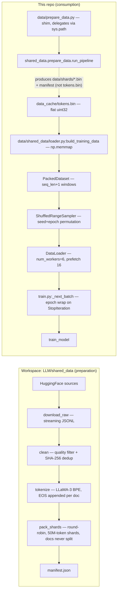
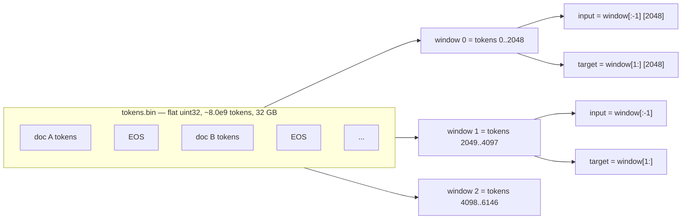
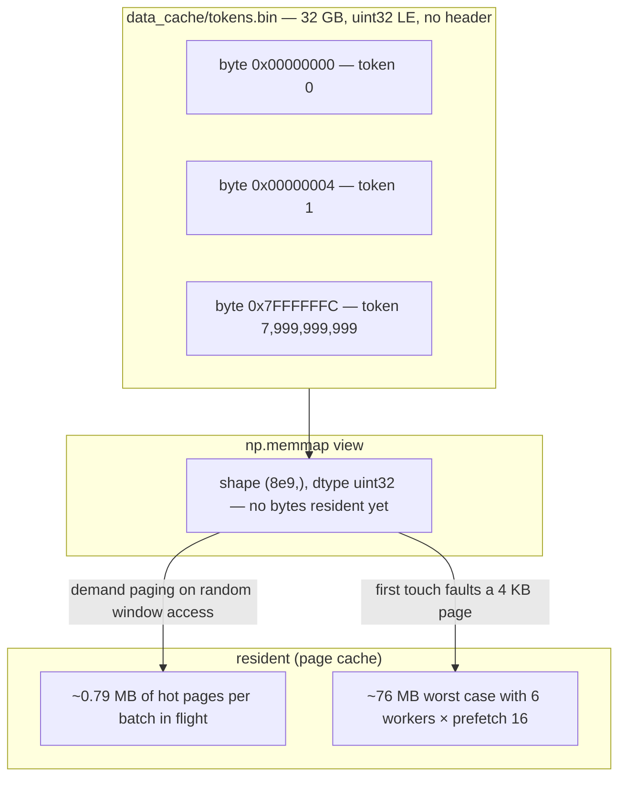
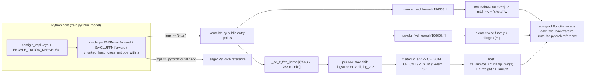

# LLaMA-3-Lite — Data Pipeline and Triton Kernels

> Audience: intermediate → expert. Prereqs: none beyond basic numpy/PyTorch
> (data half); familiarity with GPU execution — threads, warps, shared
> memory — and `model.py`'s layer structure (kernel half).

This consolidated concept doc covers the two ends of the training pipeline
that sit closest to the hardware and the data: the **8.0-billion-token
pretraining corpus** and the **mmap data path** that streams it, and the
**three opt-in Triton kernels** (fused RMSNorm, fused SwiGLU, and chunked
cross-entropy + z-loss) that fuse its hottest ops. The data half is about
how the corpus is prepared (a workspace-level pipeline in `LLM/shared_data/`
shared by all five CoreProjects LLM models), packed with EOS separators,
deduplicated, shuffled deterministically, and laid out as a flat `uint32`
file read through `np.memmap` — the page-fault argument that anchors the
project's headline memory reduction. The kernel half is about Triton's model
of computation (grids, `tl.arange` blocks, masks, `tl.constexpr`), the three
kernel patterns it enables, the `tl.atomic_add` accumulator design for
cross-entropy, the `torch.autograd.Function` wrappers whose backends
re-compute the pure-PyTorch reference, and the `ENABLE_TRITON_KERNELS`
gating that keeps every Triton path strictly opt-in. Consumption code lives
in `data/shared_data/loader.py` (`PackedDataset`, `ShuffledRangeSampler`,
`build_training_data`, `build_synthetic_data`) and kernels live in
`kernels/` (`kernels/rmsnorm_triton.py`, `kernels/swiglu_triton.py`,
`kernels/cross_entropy_triton.py`), with dispatch in `model.py:RMSNorm`,
`model.py:SwiGLUFFN`, and `model.py:chunked_head_cross_entropy_with_z`.

## Overview

**The data half.** LLaMA-3-Lite consumes an **8.0-billion-token** pretraining
corpus shared by the whole CoreProjects LLM suite. Preparation happens in a
**workspace-level pipeline** (`LLM/shared_data/`) that downloads five
web/code/math/arxiv sources (seven rows in the mixture), quality-filters
them, removes exact duplicates, tokenizes them with the LLaMA-3 BPE, and
packs the result into a flat stream of `uint32` token ids with an EOS
separator after every document. This repo vendors only the **loader** half
(`data/shared_data/loader.py`, two files): a `PackedDataset` that
memory-maps the token stream and slices `seq_len+1`-token windows with a
free next-token shift, a deterministic `ShuffledRangeSampler`, and the
`build_training_data`/`build_synthetic_data` factory functions that
`train.py:train_model` calls. Because the corpus is read through
`np.memmap`, a 32 GB corpus costs only a few megabytes of resident RAM —
the page-fault argument that anchors the project's headline memory
reduction. The 42,000-step plan consumes ~8.26B tokens, which slightly
exceeds the 8B corpus, so `train.py:_next_batch` wraps the epoch with a
fresh sampler permutation instead of crashing.

**The kernel half.** Triton is a Python-embedded DSL that lets you write CUDA
kernels with a single language model: you launch a **grid** of *programs*,
each program is assigned an ID (`tl.program_id(0)`), and each program
operates on **blocks** of a tensor declared with `tl.arange`, masked against
the real tensor shape, with the compiler deciding how to map the block onto
warps and threads. LLaMA-3-Lite ships three such kernels in `kernels/` —
one per "pattern": a **row-wise reduction** (RMSNorm), an **elementwise
fusion** (SwiGLU), and a **fused reduction + cross-program accumulation**
(chunked cross-entropy + z-loss, which uses `tl.atomic_add` on three scalar
accumulators). Each kernel is wrapped in a `torch.autograd.Function` whose
backward is not a Triton kernel at all: it **re-computes** the forward
through the pure-PyTorch reference and lets autograd differentiate it. The
kernels are strictly opt-in: they only run when the config keys
`rmsnorm_impl` / `swiglu_impl` / `cross_entropy_impl` are set to `'triton'`
**and** `ENABLE_TRITON_KERNELS=1` is in the environment; otherwise
`train.py:train_model` force-restores all three to `'pytorch'`. At runtime,
a missing Triton install or a tripped shape guard makes `model.py` print a
one-time warning and fall back to the eager path — never silently — while
any *other* kernel failure propagates as a hard error.

## Data Engineering: Mixture, Packing, Dedup, and Layout

### Why data engineering exists

Pretraining data engineering exists to answer three questions, and each one
has bitten real projects when ignored:

1. **What text, and how much?** Model quality at fixed compute is dominated
   by data quality and diversity. A model trained on 1TB of undeduplicated
   web crawl learns to regurgitate near-duplicate boilerplate. A model
   trained only on Wikipedia never learns code. The mixture in
   `LLM/shared_data/config/mixture.yaml` is the answer this project gives,
   and its total budget (8.0B tokens) is a Chinchilla-optimal target for
   ~400–500M-parameter models (see "The mixture and the Chinchilla budget").
2. **How is raw text turned into a tensor?** Transformers consume integer
   token ids of fixed sequence length. Text must be tokenized, truncated,
   deduplicated, and packed into windows — and the *boundaries between
   documents* must be represented, or the model sees run-on concatenated
   text. This project's answer is EOS-separated packing (AGENTS.md hard
   rule 6).
3. **How does the GPU actually get the bytes without blowing the memory
   budget?** A naive in-RAM corpus of 8B tokens would be 32 GB of host RAM
   (and a naive in-GPU copy would be catastrophic). The answer here is
   `np.memmap` + a shuffled window sampler: the OS serves pages on demand,
   so the resident footprint stays in the low megabytes no matter the corpus
   size.

This doc is deliberately split in two halves. The first half is the
**preparation** path (who writes the bytes), which lives in the workspace
`LLM/shared_data` pipeline; the second half is the **consumption** path (who
reads the bytes), which lives in this repo's vendored loader. Keeping those
two halves straight is the whole point of the alignment work this doc
documents: earlier project docs described workspace functions as if they
lived in this repo (`dataset.py` was claimed to contain `_stream_to_disk`,
`_doc_hash`, `interleave_datasets` — those symbols exist nowhere here).
Everything cited below is verified in source.

### Intuition: the corpus as a tape

Think of the prepared corpus as a **single long tape of token ids**, one
after another, like a reel of film:

```
[doc A tokens ...][EOS][doc B tokens ...][EOS][doc C tokens ...][EOS] ...
```

The loader never needs to know where one document ends and the next begins —
it doesn't have to. Training proceeds by cutting the tape into fixed-length
windows of `seq_len + 1 = 2049` tokens (they overlap by exactly one token,
which gives the next-token shift for free), and feeding each window to the
model twice: once as `input` (the first 2048 tokens) and once as `target`
(the last 2048 tokens, i.e. the input shifted right by one).

The EOS token id (128,009) is just a token on the tape. The model's job is
to *learn* that it marks a boundary — the same way it learns that a period
ends a sentence. Because windows cut the tape blindly, a window can contain
the tail of document A, an EOS, and the head of document B; attention is
fully causal across the whole window, so the model can attend across the
boundary. That is the standard packed-training trade: ~100% token
utilization with zero padding, at the cost of some attention capacity spent
on cross-document pairs (more on this in "Document packing").

Shuffling happens at the **window level**, not the document level. Each
epoch, the sampler produces a fresh deterministic permutation of the ~3.9M
window indices, so consecutive batches draw windows from all over the tape —
never 96 consecutive windows from one source. The permutation depends only
on `(seed, epoch)`, which is what makes a resumed run's data order
reproducible in principle.

### The real data path: who writes the bytes, who reads them

There are **two distinct codebases** involved:



**The preparation side (workspace).** The canonical pipeline lives at
`LLM/shared_data/` — one level up from this repo, in the workspace. It is
shared by Mamba-2-Lite, GPT-OSS-Lite, HyMo, DeepSeek-v3-Lite, and
LLaMA-3-Lite ("one corpus, five models"). Its stages run as subprocesses
from `shared_data.prepare_data.run_pipeline`:

1. `download_raw` streams the mixture sources from HuggingFace as JSONL.
2. `clean` applies the quality filter and the SHA-256 exact dedup.
3. `tokenize` encodes each document with the LLaMA-3 BPE
   (`add_special_tokens=false` — no BOS; EOS is appended manually) and
   writes one `uint32` token stream per source.
4. `pack_shards` round-robin interleaves documents across sources
   (respecting per-source token budgets) and writes fixed-size shards of
   50,000,000 tokens each, plus a validated `data/manifest.json` that
   records vocab size, EOS id, dtype, shard list with per-shard SHA-256,
   and per-source stats.

The output layout is a set of flat uint32 buffers (`data/shards/shard_*.bin`,
~190 MB each), each a contiguous run of token ids with an EOS after every
document. Documents are **never split across shards** (the pack config
`cross_document_boundary_ok: false` in
`LLM/shared_data/config/data_config.yaml`).

**The shim: `data/prepare_data.py`.** This repo's `data/prepare_data.py` is
a **thin shim** (about 60 lines). It does no preparation itself. Its job is
to put the workspace package on `sys.path` and call the orchestrator. The
path resolution is subtle and is the most common source of confusion:

- It computes three roots: `_DATA_ROOT` = `.../LLaMA-3-Lite/data/` (where the
  vendored loader lives), `_PROJECT_ROOT` = `.../LLaMA-3-Lite/`, and
  `_WORKSPACE_ROOT` = `.../LLM/` (the parent of the project root).
- It inserts all three into `sys.path`, in that order, with
  `sys.path.insert(0, ...)`. Since each insert lands at position 0, the
  final lookup order is **workspace first, then project, then vendored
  `data/`**.
- `data/prepare_data.py:_apply_llama3_defaults` then does
  `from shared_data.config import UNIVERSAL_TOTAL_TOKENS`. Because the
  workspace is first on the path, this resolves to
  `LLM/shared_data/config.py`. If the workspace package is not importable
  (say, the machine has no `LLM/` checkout), Python falls through to the
  **vendored** `data/shared_data/` package, which has no `config.py` — the
  import raises `ModuleNotFoundError`, and the shim catches it and exits
  with a message pointing at `LLM/shared_data/`. That failure mode is
  deliberate: the shim refuses to silently prepare a different corpus than
  every other project uses.
- `data/prepare_data.py:main` parses the flags
  (`--stage pretrain`, `--skip-download`, `--skip-clean`, `--skip-tokenize`,
  `--skip-pack`, `--mixture`, `--data-config`, `--data-root`, `--source`)
  and forwards them to `shared_data.prepare_data.run_pipeline`. Nothing in
  the project's own `config.py` is passed — the mixture and pipeline knobs
  come exclusively from the workspace YAMLs. This is why the `data_sources`
  dict in `config.py:get_config` is vestigial (see Pitfalls).

The workspace pipeline resolves its data root as `$LLM_DATA_ROOT` if set,
else `$PWD/data` (`shared_data.common._resolve_data_root`). Run
`python data/prepare_data.py` from this repo's root, and the raw/clean/
tokens/shards trees and `manifest.json` land under `LLaMA-3-Lite/data/`.

**The consumption side (vendored).** `data/shared_data/` is the **only**
data code in this repo, and it is a **loader only** — two files
(`__init__.py` re-exporting the public surface, `loader.py` with the
implementations). `dataset.py` at the repo root is a 32-line re-export shim
that puts `data/` on `sys.path` and re-exports `PackedDataset`,
`ShuffledRangeSampler`, `collate_fn`, `build_training_data`,
`build_synthetic_data` — so `train.py`'s
`from dataset import build_training_data, build_synthetic_data` keeps working
regardless of how the package is laid out.

`data/shared_data/loader.py:build_training_data` expects a **single flat
file** `data_cache/tokens.bin` (config keys `data_cache_dir` /
`data_cache_filename`): raw `uint32` little-endian, no header. It is this
file that gets mmap'd. The shard files the workspace pipeline produces are
byte-compatible with it — concatenating `shard_*.bin` in manifest order
yields exactly the flat stream the loader wants — but note that the current
workspace code does not itself emit `tokens.bin` (see Pitfalls: the missing
cache).

The full consumption path in the order a training run touches it:



### The mixture and the Chinchilla budget

#### The 8.0B-token mixture

The canonical recipe is `LLM/shared_data/config/mixture.yaml` — the file's
own header calls it "the canonical recipe" consumed by all five LLM
projects, and the pipeline validates at load time that the weights sum to
1.0 (it raises otherwise). The current mixture has seven sources:

| id | dataset (config) | weight | tokens (×8.0e9) | role |
|---|---|---|---|---|
| `fineweb-edu` | `HuggingFaceFW/fineweb-edu` (sample-10BT) | 0.40 | 3.20 B | quality-gated web backbone |
| `dclm-baseline` | `mlfoundations/dclm-baseline-1.0` | 0.15 | 1.20 B | DCLM-curated web (SOTA diet) |
| `the-stack-v2-python` | `bigcode/the-stack-v2` (Python) | 0.15 | 1.20 B | code reasoning |
| `the-stack-v2-jupyter` | `bigcode/the-stack-v2` (JupyterNotebook) | 0.05 | 0.40 B | notebook code+prose |
| `openmath` | `nvidia/OpenMathInstruct-2` | 0.10 | 0.80 B | math, problem + generated solution |
| `arxiv` | `cdv/arxiv-classification` | 0.10 | 0.80 B | long-form scientific prose |
| `cosmopedia` | `HuggingFaceTB/cosmopedia` | 0.05 | 0.40 B | synthetic educational prose |

Total: 8,000,000,000 tokens. The design notes in the YAML spell out the
rationale: web text dominates but is quality-gated (edu filter + DCLM
curation); **code + math together reach ~30%** (the single strongest lever
for reasoning in small models); arxiv supplies the long documents that
improve long-context behaviour; cosmopedia adds a diversity tail. OpenMath
is special: each document concatenates the problem and its generated
solution with a `"\n\n### Solution\n\n"` separator (`extra_text_field` /
`extra_separator`), so the model sees full worked derivations, not bare
problem statements.

Two honest caveats about this table, both verified:

- The workspace `README.md` §5 still shows an **older five-source recipe**
  (fineweb-edu 0.50 / fineweb 0.20 / the-stack-python 0.15 / openmath 0.10 /
  arxiv 0.05). The YAML is authoritative; the README is stale doc-rot —
  exactly the disease this doc set is being purged of. `[INFERENCE]` the
  README predates the current mixture.
- This project's `config.py:get_config` carries its own `data_sources` dict
  (six entries: fineweb_edu 0.5, fineweb_code 0.1, the_stack_python 0.2,
  the_stack_multilang 0.05, wikipedia 0.05, stackoverflow_qa 0.05 — summing
  to 0.95). **Nothing reads it**: the vendored loader consults only the
  cache-path and loader keys, and `data/prepare_data.py:main` never passes
  the project config to the workspace. It survives because
  `tests/test_config.py:REQUIRED_KEYS` pins the config surface and the
  weight-positivity test keeps it sane. Treat it as a legacy documentation
  surface, not the mixture.

#### The Chinchilla budget: why 8.0B tokens

Chinchilla (Hoffmann et al., 2022) measured the compute-optimal
parameter/token ratio for a fixed training FLOP budget: roughly **20 tokens
per parameter** at the frontier scale it swept (70B params, 1.4T tokens).
The scaling law is a sum of power laws in parameters $N$ and data $D$:

$$L(N, D) = A\,N^{-\alpha} + B\,D^{-\beta} + E,$$

where $E$ is the irreducible entropy of the data. Given a FLOP budget
$C \approx 6ND$, the optimal allocation moves *both* $N$ and $D$ up together
— for a fixed model size, more data than the 20:1 rule keeps helping, just
sublinearly.

Applied at this project's scale:

- $N = 515\text{M}$ (this model) $\Rightarrow$ the 20:1 rule wants
  $D^* \approx 20 \times 515 \times 10^6 \approx 10.3$B tokens.
- $N = 404\text{M}$ (the smallest model in the suite) $\Rightarrow$
  $D^* \approx 8.1$B tokens.

The shared corpus picks **8.0B** as a single budget for all five projects:
it is within ~1% of optimal for the suite's smallest model, a clean round
number, and one number for every log line and manifest (the workspace
README states exactly this reasoning). For LLaMA-3-Lite that is
$8.0\times10^9 / 515\times10^6 \approx 15.5$ tokens per parameter — 78% of
the 20:1 guideline, a deliberate compute-bound choice (the corpus is cheap
to extend; the A100-hours are not).

The training plan is consistent with the budget from the other side:
$42{,}000$ steps $\times 96$ batch $\times 2048$ seq $= 8.26$B tokens
consumed. That is *slightly more* than the corpus — by design, the last
~3.4k steps run on a second epoch pass (see "Shuffling and the epoch wrap").
Total training compute at this scale is roughly

$$6 \times 513.8\times10^6 \times 8.26\times10^9 \approx 2.5\times10^{19}$$
FLOPs — about 25.5 exaFLOPs `[derived]`. At an A100 80GB's ~312 TFLOPS of
BF16 matmul peak, that is ~23 hours at 100% MFU and more like 2.5 days at a
realistic 40% `[estimated]`.

### Tokenization and the EOS convention

The tokenizer story is short here because it has a dedicated reference doc
(see References); the data-engineering-relevant facts are:

- The corpus is tokenized with the **LLaMA-3 BPE** (workspace default:
  `name: llama3`, `vocab_size: 128000`, `eos_token_id: 128009`,
  `pad_token_id: 128002` in `LLM/shared_data/config/data_config.yaml`).
- The project's `config.py` declares `vocab_size: 128000` and
  `tokenizer_name: 'NousResearch/Meta-Llama-3-8B'`. The real tokenizer has
  128,256 ids (128,000 base + 256 special), so `train.py:train_model`
  computes `real_vocab_size = max(config['vocab_size'], len(tokenizer))` —
  with the real tokenizer that is 128,256, which is why EOS 128,009 is
  in-range of the embedding table. With the synthetic byte stub,
  `len(tokenizer)` returns 128,000 and the max resolves to the config
  value.
- `data/shared_data/loader.py:build_tokenizer` loads the real tokenizer via
  `transformers.AutoTokenizer.from_pretrained(config["tokenizer_name"])` and
  falls back `pad_token` → `eos_token` if the tokenizer has no pad token.
  `build_training_data` wraps that call in a try/except: if the download
  fails, it substitutes `_SyntheticTokenizerStub` and prints a warning that
  generation samples will be meaningless until a real tokenizer is
  available. The stub maps bytes ⇄ ids (`encode` clamps each byte to
  `vocab-1`, `decode` decodes with `errors="replace"`), so `train.py`
  always has a duck-typed tokenizer with `pad_token_id`, `eos_token_id`,
  `encode`, `decode`, and `__len__`.

EOS ids are added by the pipeline's tokenize/pack stages
(`add_eos: true`), *not* by the loader — the loader treats EOS as an
ordinary token. This split matters for the "who adds the EOS" question that
plagued the old docs.

### Document packing: EOS separators and the shift-by-one window

#### Why EOS separators (AGENTS.md rule 6)

If you concatenate documents without a separator, the model sees
"...the capital of France is ParisThe quick brown fox..." — a run-on
sentence with no boundary signal. The model can never learn where documents
end, and its next-token predictions across the boundary are garbage (it
must predict 'T' of "The" from "Paris"). AGENTS.md hard rule 6 states the
policy:

> **Document packing** must include EOS separators; without them the model
> sees run-on concatenated documents and degrades.

The EOS token (128,009) is the boundary signal. It is *learned*, like any
other token: the loss on the EOS position teaches the model to emit it at
document ends, and the loss on the token after EOS teaches it to start a
fresh document. This only works if EOS targets are actually supervised —
see the `ignore_index` note below.

#### The `seq_len+1` window trick

`data/shared_data/loader.py:PackedDataset` slices the tape into **disjoint**
windows of `seq_len + 1` tokens:

```python
# illustrative
chunk = seq_len + 1                       # 2049
self.n_chunks = tokens.size // chunk      # ~3.9M at 8B tokens

def __getitem__(self, idx: int) -> dict:
    start = idx * (self.seq_len + 1)
    end = start + self.seq_len + 1
    window = np.asarray(self.tokens[start:end], dtype=np.int64)
    return {
        "input": torch.from_numpy(window[:-1]),   # [2048]
        "target": torch.from_numpy(window[1:]),   # [2048]
    }
```

The `+1` gives the next-token shift for free: window `i` covers tape
positions $[i \cdot 2049, (i+1) \cdot 2049)$, `input` is that range minus
the last token, `target` is that range minus the first token. Because the
windows are disjoint and adjacent, every tape token except index 0 appears
as a target in **exactly one** window — token coverage is 100%. There is no
padding anywhere: no `[PAD]` runs, no truncated windows (the tape is
pre-truncated to a whole number of windows in `build_training_data`), and
no `mask` tensor. This is the "zero padding; every token is a training
target" property.

#### Cross-document attention

Because windows ignore document boundaries, a window can straddle an EOS.
With fully causal attention, tokens in the head of document B attend back
to the tail of document A. The cost: some attention capacity is spent on
pairs that carry no useful signal (A's ending rarely predicts B's start —
except through topic continuity), and the model must devote a few heads'
worth of capacity to "the EOS token means restart". The alternative —
block-diagonal attention masks that forbid cross-document pairs, as in
Megatron-LM-style packing — is not implemented here; it would complicate
the fused Flash-Attention path for a few percent of pairs. The EOS design
is the cheap, standard choice, and rule 6 exists precisely so the boundary
is *representable* even when it is crossed.

One consequence for loss design: since there is no padding, the
`ignore_index=-100` passed to the loss in `train.py:train_model` never
actually masks anything in the current pipeline — the comment there says so
explicitly. EOS targets are therefore always supervised, which is what makes
EOS learning possible. (The `-100` convention is kept so that any future
padding-aware pipeline gets correct masking for free.)

### Deduplication and quality filtering

#### The project config surface

`config.py:get_config` declares:

```python
# illustrative
'dedup': True,          # enable exact dedup
'dedup_hash_bytes': 256,  # prefix length hashed per document
'min_doc_tokens': 16,     # drop documents shorter than this
'max_doc_tokens': 8192,   # truncate documents longer than this
```

These are part of the pinned config contract
(`tests/test_config.py:REQUIRED_KEYS`). But — verified against the loader —
**the vendored loader never reads them**. `build_training_data` and
`build_synthetic_data` consult only cache paths, `seq_len`, `batch_size`,
`num_workers`, `pin_memory`, `prefetch_factor`, `val_split`,
`shuffle_seed`, `vocab_size`, and the tokenizer keys. The dedup/length keys
are the residue of the old in-repo streaming writer that the retired
`docs/data_prep.md` described; they now describe intent, not execution.
`[INFERENCE]` they were retained because the config surface is test-pinned.

#### What the workspace actually does

Dedup happens in the workspace `clean` stage, *before* tokenization, on
**text**:

- `shared_data.common.sha256_text` hashes the whole document after
  whitespace normalization (`" ".join(text.split())`).
- `shared_data.dedup.DedupFilter.is_duplicate` keeps a seen-set of those
  hashes, persisted per source to JSON (`dedup_<source>.json`) so a crash
  mid-clean neither re-emits duplicates nor forgets the seen set. A
  document is dropped iff its hash has been seen before — **exact** match,
  not prefix, not fuzzy.
- `shared_data.common.hash_to_bucket` maps each hash to one of 256 buckets
  (first 8 hex chars mod 256) so dedup state shards across files/workers.
  `LLM/shared_data/config/data_config.yaml` also reserves bloom-filter
  parameters (`bloom_capacity_per_bucket: 200000`,
  `bloom_error_rate: 0.001`), but the implemented `DedupFilter` keeps a
  plain in-memory set — the bloom is configured, not wired. `[INFERENCE]`
  the README's "bloom filter" bullet describes the reserved design.

So the "SHA-256 over the first 256 tokens" phrasing that appears in the old
docs describes a pipeline that no longer exists; the current pipeline
hashes the **entire normalized document**. The `dedup_hash_bytes: 256` key
is the only surviving trace of the prefix-hash design.

Length bounds are enforced per source in `mixture.yaml` itself, as
character counts (`min_chars`/`max_chars`, e.g. arxiv 500–500,000, fineweb
200–200,000), plus a global quality filter in `data_config.yaml`:
`drop_empty`, `min_unique_chars_ratio: 0.05`, `max_digit_ratio: 0.50`,
`max_punct_ratio: 0.50`, `max_whitespace_ratio: 0.50`. The net effect:
a document must be non-empty, reasonably varied, and not dominated by
digits/punctuation/whitespace; web text must clear 200 chars (to kill
snippet junk), arxiv must clear 500 (to keep long-form science).

Why dedup at all? Web crawls are dominated by near-duplicates (mirrored
articles, boilerplate templates, paginated re-posts). A deduplicated corpus
is worth several times its raw token count: every duplicate that survives
is a token the model spends capacity memorizing instead of generalizing,
and duplicates bias the empirical distribution toward whatever site
happened to be crawled most. Exact SHA-256 dedup after whitespace
normalization removes the *exact* duplicates cheaply; it deliberately does
not touch near-duplicates (that would need minhash/embedding clustering —
reserved, not implemented).

### Shuffling: deterministic permutations and the epoch wrap

#### Why shuffle at the window level

The tape is ordered by source (round-robin interleaved, but still
correlated: batches of arxiv windows, then batches of code, ...). Feeding
the tape in order makes the loss curve sawtooth — every source switch is a
distribution shift the optimizer must recover from — and lets the model
memorize order. Shuffling the *windows* (not documents, not tokens) makes
each batch a near-uniform draw over the whole corpus while preserving the
next-token structure inside each window. Window-level permutation is also
cheap: `~3.9M` indices, shuffled once per epoch, versus re-tokenizing or
re-packing anything.

#### The sampler

`data/shared_data/loader.py:ShuffledRangeSampler` is a
`torch.utils.data.Sampler[int]` over `range(n_chunks)`:

```python
# illustrative
def __iter__(self):
    rng = np.random.default_rng(self.seed + self.offset)
    order = rng.permutation(self.n)
    return iter(int(i) for i in order)

def set_epoch(self, epoch: int) -> None:
    self.offset = epoch
```

The permutation is a pure function of `(n, seed, offset)`: NumPy's PCG64
generator is deterministic given its seed, so the same triple always yields
the same permutation. `set_epoch(epoch)` simply sets `offset = epoch`, so
epoch $e$'s permutation comes from generator seed `seed + e` — a fresh
permutation every epoch, with no state carried across epochs. This is the
design that makes data order *reproducible in principle*: given the config's
`shuffle_seed` (42) and an epoch counter, any run can reconstruct exactly
which windows every step consumed. Cross-epoch resumability is discussed in
[training-and-memory.md](training-and-memory.md); the interaction with
checkpoints is a pitfall below.

The sampler plugs into a `torch.utils.data.DataLoader` with
`batch_size=96`, `drop_last=True`, `num_workers=6`, `prefetch_factor=16`,
`pin_memory=True`, `persistent_workers=True`. `collate_fn` stacks the
per-window dicts:

```python
# illustrative
def collate_fn(batch: list[dict]) -> dict:
    return {
        "input": torch.stack([b["input"] for b in batch], dim=0),   # [96, 2048]
        "target": torch.stack([b["target"] for b in batch], dim=0), # [96, 2048]
    }
```

#### The epoch wrap in `train.py:_next_batch`

The training loop never iterates `for batch in dataloader` directly. It
holds `step_iterator = iter(train_dataloader)` and fetches through
`train.py:_next_batch`, which owns the wrap-around:

```python
# illustrative — condensed from train.py:_next_batch
def _next_batch(step_iterator, train_dataloader, epoch_state):
    try:
        return next(step_iterator)
    except StopIteration:
        epoch_state['epoch'] += 1
        if hasattr(train_dataloader.sampler, 'set_epoch'):
            train_dataloader.sampler.set_epoch(epoch_state['epoch'])
        return next(iter(train_dataloader))
```

Why this exists is arithmetic: the corpus is 8.0B tokens, the plan consumes
8.26B, so the tape runs out ~38.6k steps into the 42k-step plan (see
"Train/val split" for the exact numbers). Without the wrap, training would
die with `StopIteration` at step ~38,637. With it, the sampler gets
`set_epoch(1)` and a fresh permutation, and the final ~3.4k steps consume a
second epoch's worth of windows. `epoch_state = {'epoch': 0}` is
initialized once in `train_model`, and the same `_next_batch` is used for
the warmup batch and every step.

The `hasattr(train_dataloader.sampler, 'set_epoch')` guard matters: the val
loader has no sampler (`shuffle=False`), and any future custom sampler
without `set_epoch` degrades gracefully.

### The memmap layout: uint32, 32 GB, page-fault residency

#### The file format

`data/shared_data/loader.py:build_training_data` opens the corpus as:

```python
tokens = np.memmap(path, dtype=np.uint32, mode="r")
```

The file is a raw little-endian `uint32` stream, no header, no index: token
$t$ lives at byte offset $4t$. Sizes at this project's scale:

- 8.0B tokens × 4 bytes = **32 GB** on disk (29.8 GiB).
- One shard = 50M tokens ≈ 190 MB (the workspace writes 161 shards —
  `ceil(8.0e9 / 50e6) = 160`, plus the EOS tokens that ride along with
  documents push the total past the even boundary `[derived]`).
- `uint16` would suffice for vocab ≤ 65,535; `uint32` covers any realistic
  vocab (up to 4.29B ids) and is the suite-wide convention, so all five
  projects' shards share one dtype.

Why `uint32` rather than, say, `int32` or packed bytes: token ids fit in
32 bits with headroom for special tokens; `uint32` maps 1:1 onto
`numpy`/mmap semantics; and the flat no-header layout means the file *is*
the array — no parsing, no deserialization, no per-shard open overhead in
the hot path.

#### Why the resident footprint is tiny: demand paging

`np.memmap` is a lazy view: the OS maps the file into virtual address space
but loads physical pages **on demand**. A page (4 KB on the A100 host) is
faulted into RAM only when a byte in it is touched, and evicted when
pressure demands. The loader touches the tape at random (shuffled window
indices), each window spanning 2049 × 4 = 8,196 bytes ≈ 2 pages:

- **One batch** touches at most 96 windows × ~8 KB ≈ **0.79 MB** of
  distinct corpus bytes — the source of the "~1 MB resident" headline.
- With `num_workers=6` and `prefetch_factor=16`, up to 96 batches can be
  in flight: 96 × 0.79 MB ≈ **76 MB** of page-cache pressure worst case
  `[derived]`. Still negligible next to the 32 GB file; and it is *host*
  page cache, invisible to the GPU memory budget.
- The GPU never sees the corpus: only the current batch is copied
  host→device (`non_blocking=True` from pinned buffers, since
  `pin_memory=True`).

Two corollaries worth stating:

1. **First-touch cost.** The first time training touches a window, the OS
   pays a page fault (~microseconds each, batched by the prefetch workers).
   This is why `num_workers > 0` matters: the faults hide behind the 16-batch
   prefetch pipeline.
2. **The int64 conversion.** `PackedDataset.__getitem__` converts each
   window with `np.asarray(..., dtype=np.int64)` before
   `torch.from_numpy` — `torch.from_numpy` cannot take `uint32` on CPU, so
   the ~8 KB window becomes a ~16 KB `int64` tensor. The docstring's "no
   copy" claim is about the memmap *slice* (a view); the dtype conversion
   is a per-window copy, deliberate and cheap. `collate_fn` stacks 96 of
   them into `[96, 2048]` `int64` tensors (1.5 MB each; 3.0 MB for
   input+target per batch).

#### The layout in one picture



### Train/val split alignment

The same file serves train and validation. `build_training_data` computes
both sides from one `val_split` (0.05, i.e. 5%):

```python
# illustrative
chunk = seq_len + 1
n_total = (tokens.size // chunk) * chunk          # truncate to whole windows
split = int(n_total * (1.0 - val_split))          # 95% boundary
split = (split // chunk) * chunk                  # align to a window edge
train_ds = PackedDataset(tokens[:split], seq_len)
val_ds   = PackedDataset(tokens[split:], seq_len)
```

Two alignment properties, both deliberate:

- **The corpus is first truncated to a whole number of windows**, so no
  window is ever partially filled (up to 2048 trailing tokens are dropped
  — 0.003% of an 8B corpus).
- **The split lands on a window boundary**, so train and val windows never
  overlap. Both are guaranteed by the `// chunk * chunk` floor.

At 8.0B tokens this yields `[derived]`:

| | tokens | windows | full batches (96) |
|---|---|---|---|
| train | ~7.60 B | ~3,709,125 | 38,636 (+69 leftover, dropped) |
| val | ~0.40 B | ~195,218 | 2,033 (+50 leftover, kept) |

The train loader has `drop_last=True` (the 69-window remainder is dropped
each epoch); the val loader has `drop_last=False` (a partial 50-window
batch is legal). Validation is capped anyway: `train.py:validate` breaks
after `val_max_batches=100` batches, so a validation pass reads 100 × 96 ×
2048 ≈ 19.7M tokens — a 0.25% sample of the val stream, evaluated every
`val_interval=2000` steps.

One structural note: the val split is the **tail of the packed tape**, not a
stratified sample. Because `pack_shards` round-robins sources and the split
is on a window boundary, the tail contains a mix of all sources
`[INFERENCE: from the round-robin interleave]`; it is not, however, the same
source proportion as the whole, and any future change to packing order
would change what validation sees. The val stream is deliberately *not*
shuffled (`shuffle=False`), so validation loss is comparable across
checkpoints.

### The synthetic fallback

`data/shared_data/loader.py:build_synthetic_data` exists so the repo runs
with **zero data artifacts**: no download, no cache, no HF tokenizer. It
generates a deterministic random-id stream

```python
# illustrative
num_tokens = max(8 * (seq_len + 1) * batch, 4096)   # 8 × 2049 × 96 = 1,573,632
rng = np.random.default_rng(seed)
tokens = rng.integers(2, max(3, vocab), size=num_tokens, dtype=np.uint32)
```

and builds the same `PackedDataset` + `ShuffledRangeSampler` + `DataLoader`
machinery over it, with the byte stub as tokenizer. `train.py:train_model`
wires the fallback: it tries `build_training_data(config)` first and catches
`FileNotFoundError`, printing a warning that points at
`python data/prepare_data.py`, then proceeds with synthetic data. The
pipeline therefore always runs; what changes is whether the loss curve means
anything. Synthetic data exercises the full data path (packing, shuffling,
epoch wrap, collation) and is what the test suite uses; it cannot train a
real model.

## Kernel Programming: The Triton Model

### Why these kernels exist

The project's performance contract (AGENTS.md hard rule 2) is that a
sanctioned Triton path must clear a **1.5× speedup** over the raw-PyTorch
path before it is enabled by default. The three kernels in `kernels/` are
the first candidates for that contract, and each targets a different
bottleneck:

1. **RMSNorm is launch-bound.** The eager chain `pow → mean → add → rsqrt →
   multiply` is several kernel launches over the same tensor, each one
   re-reading the full activation from HBM. Applied 33 times per forward
   (two per decoder block across 16 layers, plus the final norm — see
   `model.py:DecoderBlock` and `model.py:Decoder`), the eager path fires on
   the order of a hundred small kernels per step. A single row-wise Triton
   program reads each row **once** and does the whole reduction on-chip.
2. **SwiGLU is a pure fusion win.** `silu(gate) * up` is two elementwise
   launches that must each read and write a `[196608, 4096]` intermediate.
   Fusing them halves the elementwise memory traffic per layer and removes
   one intermediate tensor write + read of ~1.6 GB per layer.
3. **CE + z-loss is a memory and numerical problem.** The dense path
   computes `logsumexp` and `cross_entropy` as separate reductions over a
   `[N, 128000]` logits tensor; at full-batch scale that tensor alone is
   50.3 GB in BF16, which is why the training path never materializes it.
   The Triton variant folds the stable-logsumexp (max-shift) and the
   target-token NLL into one pass per row, and writes three running totals
   with `tl.atomic_add` — no per-row intermediate softmax tensor, no second
   reduction pass.

There is also a **correctness** argument that predates the speedup one: each
kernel ships with a pure-PyTorch reference (`kernels/rmsnorm_triton.py:rmsnorm_pytorch`,
`kernels/swiglu_triton.py:swiglu_pytorch`,
`kernels/cross_entropy_triton.py:cross_entropy_with_z_pytorch`) that runs
on CPU without Triton, and the backward passes are *implemented* as re-runs
of those references. The autograd graph you get from a Triton forward is
therefore numerically identical to the eager graph in both directions —
gradient checks cannot drift from the reference implementation even if the
forward kernel has subtle rounding.

One caveat about the 1.5× rule: AGENTS.md names `scripts/microbench_a100.py`
as the measurement harness, but that script is not in the working tree.
No in-repo microbenchmark exists, so the speedup contract is currently
enforced by rule, not by measurement — treat any throughput claim below as
an estimate,
not a benchmark.

### The Triton model of computation

#### Grids, programs, and `tl.program_id`

A Triton launch looks like a Python call with a **grid** in square brackets:

```python
# illustrative — pattern shared by all three kernels in this repo
_rmsnorm_fwd_kernel[(M,)](x_2d, weight, y, x_2d.stride(0), y.stride(0),
                          N=N, eps=eps, BLOCK_SIZE=block,
                          num_warps=4, num_stages=1)
```

`(M,)` is a 1-D grid of **M programs**. Each program is an independent unit
of work that Triton schedules onto a streaming multiprocessor; programs do
not share memory except through explicit global-memory atomics. Inside the
kernel, `tl.program_id(0)` returns this program's index along grid axis 0.
The universal idiom in this repo is *one program per row*: program `row`
owns the `row`-th row of the (flattened) tensor. That makes the kernel
trivially parallel across rows and puts the reduction axis entirely inside
one program — no cross-program communication for reductions. The price is
that the reduction axis must fit in one program's block, which is exactly
the constraint that `_MAX_VOCAB_BLOCK` encodes (see Pattern 3).

#### Blocks: `tl.arange`, masks, `tl.constexpr`

Within a program, Triton code is written over **blocks** — virtual vectors
whose length is a compile-time constant:

```python
# illustrative — body of the _rmsnorm_fwd_kernel JIT function
cols = tl.arange(0, BLOCK_SIZE)          # block of indices 0..BLOCK_SIZE-1
mask = cols < N                          # mask against the real width
x = tl.load(x_ptr, mask=mask, other=0.0).to(tl.float32)  # masked load
var = tl.sum(x * x, axis=0) / N          # block-wide reduction
```

`tl.arange(0, BLOCK_SIZE)` materializes a block of consecutive integers;
the compiler distributes that block across the program's threads and,
crucially, decides how to *loop* if the block is bigger than what fits in
registers. `tl.load` with a `mask` predicate and an `other=` fill value is
the safe way to read near a tensor's edge; every kernel here launches a
power-of-two block against a non-power-of-two tensor width, so every load
and store is masked. The mask fill value is pattern-dependent: `0.0` for
RMSNorm (masked lanes contribute nothing to the sum-of-squares) and SwiGLU
(masked lanes contribute nothing to the output, which is masked on store),
but `-float("inf")` for cross-entropy — because a masked lane feeds
`exp(x - m)`, and `exp(-inf) = 0` is exactly the "not part of the sum"
value.

`N`, `eps`, `BLOCK_SIZE`, `D`, `V`, `BLOCK_V` are all declared
`tl.constexpr`. A `tl.constexpr` is baked into the kernel at JIT-compile
time: the compiler sees the concrete value, so masks like `cols < N` become
compile-time-known loop bounds, and `eps` becomes a constant instead of a
loaded scalar. Triton specializes a fresh kernel binary per distinct
combination of constexpr values, which is why the same `@triton.jit`
function serves any width — but also why a launch with a surprising width
(see the `_MAX_BLOCK_SIZE` guard) pays a one-time compile cost.

#### `num_warps` and `num_stages`

Every launch in `kernels/` passes `num_warps` and `num_stages` explicitly:

- `num_warps` — how many warps (32 threads each) make up one program.
  RMSNorm uses `num_warps=4` (128 threads) for its 1024-wide block (8
  elements per thread); SwiGLU and CE use `num_warps=8` (256 threads) for
  their 4096- and 131072-wide blocks.
- `num_stages` — software-pipelining depth for loads. `num_stages=1`
  (RMSNorm) means no overlap of memory loads with compute; `num_stages=2`
  (SwiGLU, CE) lets the compiler prefetch the next tile while computing the
  current one. The CE kernel's whole-row block makes pipelining moot at the
  block level, but the setting is kept uniform with SwiGLU.

These are the only two scheduling knobs the repo exposes; everything else
about thread mapping, vectorization, and register allocation is Triton's
job.

#### The launch-config table

| Kernel | Grid | Block (`tl.arange`) | Mask fill | `tl.constexpr` args | `num_warps` / `num_stages` | Shape guard |
|---|---|---|---|---|---|---|
| `_rmsnorm_fwd_kernel` (launched by `kernels/rmsnorm_triton.py:_triton_rmsnorm_forward`) | `(M,)` — 1 program per row | `BLOCK_SIZE = next_power_of_2(N)` | `other=0.0` | `N`, `eps`, `BLOCK_SIZE` | 4 / 1 | `BLOCK_SIZE ≤ _MAX_BLOCK_SIZE = 8192` |
| `_swiglu_fwd_kernel` (launched by `kernels/swiglu_triton.py:_triton_swiglu_forward`) | `(M,)` — 1 program per row | `BLOCK_SIZE = next_power_of_2(d_ff)`; reads `cols` and `D + cols` of the fused `gate_up` row | `other=0.0` | `D`, `BLOCK_SIZE` | 8 / 2 | `BLOCK_SIZE ≤ _MAX_BLOCK_SIZE = 8192` |
| `_ce_z_fwd_kernel` (launched by `kernels/cross_entropy_triton.py:_triton_ce_z_forward`) | `(M,)` — 1 program per row | `BLOCK_V = next_power_of_2(V)` | `other=-inf` | `V`, `BLOCK_V` | 8 / 2 | `BLOCK_V ≤ _MAX_VOCAB_BLOCK = 131072` |

At project scale, `M = batch × seq = 96 × 2048 = 196,608` for all three
kernels in the training forward (the CE kernel is invoked per chunk of 256
rows inside `model.py:chunked_head_cross_entropy_with_z`), `N = d_model =
1024`, `D = d_ff = 4096`, and `V = vocab_size = 128,000` (or 128,256 with
`model.py:build_transformer`'s default). Note that `next_power_of_2(1024) =
1024` and `next_power_of_2(4096) = 4096` — the two "small" kernels launch
exactly-sized blocks — while `next_power_of_2(128000) = 131072 =
_MAX_VOCAB_BLOCK`, so the CE kernel's block is a full 2¹⁷-wide.



### Pattern 1 — row-wise RMSNorm

#### The eager baseline

RMSNorm over a row $x \in \mathbb{R}^N$ with gain $w \in \mathbb{R}^N$:

$$y_i = \frac{x_i}{\sqrt{\frac{1}{N}\sum_j x_j^2 + \epsilon}} \, w_i$$

The reference implementation `kernels/rmsnorm_triton.py:rmsnorm_pytorch` is
three lines of eager torch:

```python
# illustrative
# kernels/rmsnorm_triton.py:rmsnorm_pytorch — the reference (verbatim)
variance = x.pow(2).mean(dim=-1, keepdim=True)
return x * torch.rsqrt(variance + eps) * weight
```

The module docstring counts this as a "4-launch eager chain (pow, mean, add,
rsqrt, multiply)": each `pow`, `mean`, `add`, `rsqrt`, and multiply is a
separate kernel that reads the row from HBM and writes a (usually small)
result. Five reads of the activation per norm application, times 33 norm
applications per forward — the activation tensor is the single biggest
per-layer tensor in the model, so this traffic dominates the op's cost.

#### The kernel

```python
# illustrative — body of the _rmsnorm_fwd_kernel JIT function
row = tl.program_id(0)
cols = tl.arange(0, BLOCK_SIZE)
mask = cols < N

x = tl.load(X_ptr + row * stride_x_row + cols, mask=mask, other=0.0).to(tl.float32)
var = tl.sum(x * x, axis=0) / N
rstd = 1.0 / tl.sqrt(var + eps)

w = tl.load(W_ptr + cols, mask=mask, other=0.0).to(tl.float32)
y = (x * rstd) * w
tl.store(Y_ptr + row * stride_y_row + cols, y.to(Y_ptr.dtype.element_ty), mask=mask)
```

Program `row` loads its 1024-wide row once into registers (masked with `0.0`
fill), squares and sums it with one block reduction, and divides by the
*real* width `N` — not by `BLOCK_SIZE` — which is why the
masked-lanes-as-zero trick is correct: masked lanes add exactly $0^2 = 0$
to the sum. The weight is loaded with the same mask, and the store is
masked so padded lanes are never written. The row is read from HBM **once**;
the reduction stays on-chip. This is the canonical "row-wise reduce" Triton
pattern, and it is exactly what the FA2-style tiling literature calls a
*block-level* reduction: `tl.sum(..., axis=0)` is a cross-thread reduction
that Triton lowers to shared-memory shuffles inside the program.

The host wrapper `kernels/rmsnorm_triton.py:_triton_rmsnorm_forward` reshapes
any input to 2-D (`M, N`), forces contiguity, computes
`block = triton.next_power_of_2(N)`, launches, and reshapes back. The
`.contiguous()` is deliberate: a strided view would make
`X_ptr + row * stride_x_row + cols` a strided access pattern; the kernel
takes an explicit `stride_x_row` argument so it *could* handle
non-contiguous rows, but the wrapper guarantees the common case.

#### Why `next_power_of_2` and the `_MAX_BLOCK_SIZE` guard

`tl.arange(0, BLOCK_SIZE)` requires `BLOCK_SIZE` to be a power of two, and
Triton compiles the block as a whole — so the launch pads the real width up
to the next power of two and masks the tail. For `d_model = 1024` that is
free (1024 is already a power of two). The guard in
`_triton_rmsnorm_forward`:

```python
# illustrative
# kernels/rmsnorm_triton.py:_triton_rmsnorm_forward (verbatim guard)
block = triton.next_power_of_2(N)
if block > _MAX_BLOCK_SIZE:
    raise ValueError(...)
```

exists because `N` is not a trusted constant at the call site: it comes from
whatever tensor is passed to `RMSNorm.forward`, and a shape bug (a
non-flattened tensor, a wrong head_dim, a 2-D input where 3-D was expected)
could produce a width whose power-of-two block explodes the register budget
and the JIT cache. `_MAX_BLOCK_SIZE = 8192` is the repo's line in the sand:
anything wider than 8192 raises a `ValueError` that the module-level
dispatch catches (see "Fallback semantics" below). At this project's scale
the guard is inert — `d_model = 1024` and even the widest per-row axis in
the model (`2 · d_ff = 8192`, which is SwiGLU's fused gate-up row) are at or
below the cap.

The `ValueError` (not an assertion, not a silent pass) is the important
design choice: the kernel is *refusing* to compile something pathological,
and it does so in a way that the dispatch layer can catch and downgrade to
the eager path.

### Pattern 2 — fused SwiGLU

#### Why fusion saves launches (and traffic)

The FFN block `model.py:SwiGLUFFN.forward` computes
$y = \text{down\_proj}(\text{silu}(gate) \odot up)$, where `gate_up_proj`
produces a single fused `[M, 2·d_ff]` tensor and `gate`, `up` are its two
halves. Eagerly:

```python
# illustrative — the eager tail of model.py:SwiGLUFFN.forward
gate, up = gate_up.chunk(2, dim=-1)
return self.down_proj(F.silu(gate) * up)
```

`F.silu(gate)` materializes a `[196608, 4096]` intermediate (BF16:
$196{,}608 \times 4096 \times 2$ B $= 1.6$ GB), writes it to HBM, then the
multiply reads it back. The Triton kernel `_swiglu_fwd_kernel` instead loads
both halves of the fused row in one masked load, computes
$\text{silu}(g) = g \cdot \sigma(g)$ on-chip, multiplies by $u$, and stores
the `d_ff`-wide result:

```python
# illustrative — body of the _swiglu_fwd_kernel JIT function
g = tl.load(GU_ptr + row * stride_row + cols, mask=mask, other=0.0).to(tl.float32)
u = tl.load(GU_ptr + row * stride_row + D + cols, mask=mask, other=0.0).to(tl.float32)
silu_g = g * tl.sigmoid(g)
y = silu_g * u
tl.store(Y_ptr + row * stride_row + cols, y.to(Y_ptr.dtype.element_ty), mask=mask)
```

Two elementwise launches become one; the 1.6 GB intermediate never exists.
The host-side `_triton_swiglu_forward` also validates its contract up
front: the last dimension **must** equal `2 * d_ff` (else `ValueError`) —
the fused `gate_up_proj` output, not a pair of separate projections. The
`2 * d_ff` row is never loaded as a whole: the kernel reads only the two
`d_ff`-wide slices at `cols` and `D + cols`.

The shape math at project scale: per layer, eager is 2 launches over a
1.6 GB tensor pair; Triton is 1 launch with ~half the elementwise traffic.
Across 16 layers that is 16 launches saved per forward plus 16 intermediate
writes+reads of ~1.6 GB eliminated. This is the *weakest* of the three
kernels in pure-launch-count terms (the reduction-free pattern has no
algorithmic depth), which is exactly why AGENTS.md's 1.5× rule exists:
elementwise fusion is easy to write and easy to under-deliver on, and the
rule exists to prevent enabling it by default on launch-count aesthetics
alone. `num_warps=8` here is chosen so the 4096-wide block gives 16 elements
per thread.

### Pattern 3 — chunked CE + z-loss

#### The memory problem

Cross-entropy with z-loss (PaLM / Gemma2) over a row of logits $z \in
\mathbb{R}^V$ with target token $t$:

$$\ell_{\text{CE}} = -\log \frac{e^{z_t}}{\sum_j e^{z_j}} = \log\!\sum_j e^{z_j} - z_t, \qquad \ell_Z = \left(\log\!\sum_j e^{z_j}\right)^{\!2}, \qquad L = \text{mean}_{\text{valid}}(\ell_{\text{CE}}) + \lambda \cdot \text{mean}(\ell_Z)$$

with $\lambda = 1\text{e-}4$ (`config.py:get_config`, `z_loss_weight`). The
logits tensor `[N, V]` at full batch scale is the model's largest single
tensor: $N \times V \times 2$ B $= 196{,}608 \times 128{,}000 \times 2
\approx 50.3$ GB in BF16. The training path therefore never builds it:
`model.py:chunked_head_cross_entropy_with_z` computes
`F.linear(hidden_c, head_weight)` per 256-row chunk, each chunk's logits
are `[256, 128000]` (65.5 MB BF16 / 131 MB FP32), and the chunk lives inside
`torch.utils.checkpoint.checkpoint(..., use_reentrant=False)` so only one
chunk is alive at a time. See [training-and-memory.md](training-and-memory.md)
for the full stack.

#### The kernel: one program per row, the whole vocab in the block

```python
# illustrative — body of the _ce_z_fwd_kernel JIT function
row = tl.program_id(0)
if row >= M:
    return
target = tl.load(T_ptr + row)
valid = target != ignore_index

cols = tl.arange(0, BLOCK_V)
mask = cols < V
x = tl.load(L_ptr + row * V + cols, mask=mask, other=-float("inf")).to(tl.float32)

m = tl.max(x, axis=0)                    # running max over the row
x_shift = x - m
l = tl.sum(tl.exp(x_shift), axis=0)      # sum of exp of shifted logits
log_z = m + tl.log(l)                    # stable log-sum-exp

target_logit = tl.load(L_ptr + row * V + target).to(tl.float32)
nll = log_z - target_logit

if valid:
    tl.atomic_add(CE_SUM_ptr, nll)
    tl.atomic_add(CE_CNT_ptr, 1.0)
tl.atomic_add(Z_SUM_ptr, log_z * log_z)  # z accumulated for every row
```

#### Online softmax: the m/l running-max trick

`logsumexp` is numerically unstable if computed directly: a row of logits
can reach magnitude ~20–30 late in training, and $\exp(30) \approx 10^{13}$
is fine, but $\exp$ of any value above ~88 overflows FP32 (the z-loss's
entire purpose is to keep the log-partition from growing unboundedly — but
the kernel must be robust *before* the loss has done its job). The fix is
the classic max-shift identity:

$$\log\sum_j e^{z_j} = m + \log\sum_j e^{z_j - m}, \qquad m = \max_j z_j$$

which is exactly what the kernel does: `m = tl.max(x)` over the row, shift,
`exp`, sum, then `log_z = m + tl.log(l)`. In online-softmax terminology,
`m` and `l` are the running-max and the running-sum that a multi-tile
implementation would maintain and rescale as it streams; here the whole row
is one block, so the "running" part collapses to a single max pass followed
by a single exp-sum pass — the identity is the same, and it is what makes
`exp(x - m)` safe (`x - m ≤ 0`, so all exponentials are in `(0, 1]`). The
masked lanes load as `-inf`, so they contribute `exp(-inf) = 0` to `l` and
never win the max.

The NLL is then one subtraction: `nll = log_z - target_logit` — no second
softmax pass, no normalized distribution ever materialized. This is the
same trick the reference
`kernels/cross_entropy_triton.py:cross_entropy_with_z_pytorch` uses via
`torch.logsumexp`, and `F.cross_entropy` is internally max-shifted the same
way, so the fused kernel and the reference agree to floating-point
order-of-operations (the e2e GPU check in
`tests/e2e_gpu_smoke.py:check_triton_kernels` asserts the CE path against
the reference).

#### `atomic_add` accumulators

The kernel does **not** return per-row values. Each program atomically adds
into one of three 1-element FP32 device tensors: `CE_SUM` (sum of valid
NLLs), `CE_CNT` (count of valid rows), `Z_SUM` (sum of $\log_z^2$). The
host `kernels/cross_entropy_triton.py:_triton_ce_z_forward` then forms the
loss:

```python
# illustrative — kernels/cross_entropy_triton.py:_triton_ce_z_forward (tail)
ce_mean = ce_sum / ce_cnt.clamp_min(1.0)   # guard: all rows ignored -> 0/1 = 0
z_mean = z_sum / M                          # z is averaged over ALL rows
return ce_mean + z_loss_weight * z_mean
```

Two semantic details are load-bearing here. First, **CE is count-weighted
but Z is not**: the CE mean divides by the number of *valid* rows
(`CE_CNT`), while the z mean divides by `M` unconditionally — the `Z_SUM`
atomic sits outside the `if valid` block. This matches the kernel's own
reference `cross_entropy_with_z_pytorch` (`z = log_z.pow(2).mean()` over all
rows) but differs from the masked-z semantics of
`model.py:chunked_cross_entropy_with_z`, which averages z over non-ignored
tokens only. In this repo's training data there are no ignored rows (the
pipeline has no padding and `ignore_index = -100` never appears in targets
— EOS stays learnable), so the two agree; if ignore_index rows were ever
present, the Triton path's z term would differ from the PyTorch chunked
path. Flagged here because it is a latent, not active, discrepancy.

Second, `clamp_min(1.0)` turns the degenerate all-rows-ignored case into
`0/1 = 0` instead of a NaN, matching the eager path's
`if total_count > 0 ... else 0.0` guard in
`model.py:chunked_cross_entropy_with_z`.

The atomic pattern is a deliberate simplicity trade: `M` programs hammering
three single addresses costs serialization (up to $M$ atomic adds per
accumulator per chunk — 256 per chunk here, 196,608 if called on full
logits), but three 4-byte buffers is a trivial amount of contention relative
to the per-row work, and it keeps the kernel a single pass with no
cross-program reduction protocol. A production kernel would instead give
each program a private slot (an `M`-sized scratch buffer) and do a second
small reduction; the repo chose the 3-atomic design for clarity — and
because the per-chunk invocation keeps `M` small.

#### Why the vocab axis must fit one program: `_MAX_VOCAB_BLOCK`

The max and the exp-sum are block reductions *within* one program. If the
vocab axis were split across two programs, each would see only half the
row: the partial maxes would need a second pass to combine, and the partial
exp-sums would need the online-softmax rescale
$\ell_{AB} = \ell_A + e^{m_A - m_B} \ell_B$ across program boundaries — a
cross-program protocol with its own atomics or a second kernel. The module
comment states the constraint directly: *"Vocab is the per-block reduction
axis; 128k fits, 256k would need 2 programs/row."* The guard
`_MAX_VOCAB_BLOCK = 131072` is that constraint in code —
`next_power_of_2(128000) = 131072`, so the current vocab fits with zero
waste; a 256k vocab would trip the guard with a `ValueError`
(dispatch-caught, falls back to eager) rather than silently producing a
wrong split-reduction.

The cost of "whole vocab in one program" is register pressure, and it is
worth being explicit about: with `num_warps = 8` (256 threads) and
`BLOCK_V = 131072`, each thread's share of the block is $131072 / 256 = 512$
FP32 values, and the kernel must keep the *entire row live* between the
max-reduction and the exp-sum (it needs `x - m` after `m` is known). 512
live FP32 values per thread exceeds the register file by an order of
magnitude, so Triton will spill to local memory (or re-load)
[INFERENCE — the compiler's exact choice is not observable from this repo;
no GPU profiling artifacts exist]. This is the honest trade of Pattern 3:
the single-program design buys a trivial host protocol and an exact one-pass
reduction at the price of per-thread working-set pressure. At 256 rows per
chunk the total spill traffic is bounded, which is why the chunked-head
integration (below) is what makes the design viable at training scale.

#### The chunked-head integration

`model.py:chunked_head_cross_entropy_with_z` dispatches per chunk: when
`cross_entropy_impl == "triton"` and
`kernels/cross_entropy_triton.py:HAS_TRITON` is true, `_chunk` computes the
chunk's logits with `F.linear` and hands them to
`triton_chunked_cross_entropy_with_z`, which returns the scalar
`ce_mean + λ·z_mean` for that chunk. The host accumulates and averages:

```python
# illustrative — model.py:chunked_head_cross_entropy_with_z (triton tail)
triton_acc = triton_acc + out
...
return triton_acc / max(n_chunks, 1)
```

Mean-of-chunk-means equals the global mean only when every chunk has the
same number of valid rows. At this project's scale that is guaranteed:
`hidden.shape[0] = 196,608 = 768 × 256` exactly, so all 768 chunks are
equal-size and (with no ignored rows) equal-count — the average is exact.
The plan-level claim "per-chunk losses are then averaged (equal-size chunks
⇒ exact)" in the docstring is correct precisely because 196,608 is
divisible by `ce_chunk_size = 256`. With `ignore_index` rows present or a
ragged tail, mean-of-means would be slightly biased — same latent
discrepancy as the z-mean note above.

### The autograd.Function contract

Every kernel is wrapped the same way. The forward runs the Triton kernel;
the backward **re-computes the forward through the pure-PyTorch reference
inside `torch.enable_grad()`** and lets autograd differentiate it.
`kernels/cross_entropy_triton.py:_TritonCEWithZ` is the canonical shape:

```python
# illustrative — the autograd.Function pattern (all three kernels, verbatim shape)
class _TritonCEWithZ(torch.autograd.Function):
    @staticmethod
    def forward(ctx, logits, targets, ignore_index, z_loss_weight):
        ctx.save_for_backward(logits, targets)
        ctx.ignore_index = ignore_index
        ctx.z_loss_weight = z_loss_weight
        return _triton_ce_z_forward(logits, targets, ignore_index, z_loss_weight)

    @staticmethod
    def backward(ctx, grad_out):
        logits, targets = ctx.saved_tensors
        with torch.enable_grad():
            x = logits.detach().requires_grad_(True)
            y = cross_entropy_with_z_pytorch(x, targets, ctx.ignore_index, ctx.z_loss_weight)
        grad_x, = torch.autograd.grad(y, x, grad_out)
        return grad_x, None, None, None
```

Three obligations, all visible here:

1. **`forward(ctx, ...)` returns the kernel's output.** The first argument
   after `ctx` is the tensor that gets `requires_grad` tracking; non-tensor
   arguments (`ignore_index`, `z_loss_weight`, `d_ff`, `eps`) ride along on
   `ctx` as plain attributes.
2. **`ctx.save_for_backward(...)`** registers tensors for the backward pass
   *and* participates in autograd's memory bookkeeping: saved tensors are
   kept alive until backward runs (or freed early under
   `torch.autograd.graph.saved_tensors_hooks`, which this repo does not
   use). This is the one place the Function's memory profile differs from a
   plain eager graph — see below.
3. **`backward(ctx, grad_out)` returns one gradient per `forward` input**,
   `None` for non-tensor inputs. Because the re-computed graph is built
   from `detach().requires_grad_(True)` copies, the backward never re-enters
   the Triton kernel — the re-computed `y` is a *plain PyTorch* graph whose
   own autograd walks back to `x`, and `torch.autograd.grad(y, x, grad_out)`
   extracts exactly `∂L/∂x` as if the forward had been eager.
   `torch.enable_grad()` is mandatory: `backward` runs under `no_grad` by
   default in some call paths, and the re-computation must build a graph.

The other two kernels follow the identical contract:
`kernels/rmsnorm_triton.py:_TritonRMSNorm` saves `(x, weight)` and re-runs
`rmsnorm_pytorch`; `kernels/swiglu_triton.py:_TritonSwiGLU` saves `gate_up`
and re-runs `swiglu_pytorch` after a `chunk(2, dim=-1)`.

#### Memory implications

The re-compute design has three concrete consequences, in increasing order
of subtlety:

- **No Triton backward kernels exist.** Each file's docstring says
  "Backward is a PyTorch autograd re-compute stub." This is a deliberate
  scope cut: writing backward kernels for three different reduction
  patterns (a second RMSNorm-style reduction, an elementwise derivative,
  and a softmax-derivative pass) would triple the kernel surface and
  multiply the numerical-equivalence surface by the same factor. Instead
  the backward is *bit-identical by construction* to the eager reference's
  backward — gradient tests cannot drift.
- **Saved tensors are the only persistent cost.** The Functions save their
  *inputs*: `x` (an activation, e.g. `[196608, 1024]` BF16 ≈ 403 MB per
  norm application) for RMSNorm, `gate_up` (`[196608, 8192]` BF16 ≈ 3.2 GB
  per layer!) for SwiGLU, and the chunk logits (`[256, 128000]` BF16 ≈ 65.5
  MB) for CE. That is not free: an eager elementwise chain also keeps its
  inputs alive for backward, but a fused Function keeps the *largest* input
  of the fused op rather than letting intermediate buffers die.
  `ctx.save_for_backward(gate_up)` is exactly why SwiGLU's fusion saves
  forward memory traffic but not activation memory — the whole fused
  projection is pinned until backward.
- **Gradient checkpointing bounds the damage.** Because
  `gradient_checkpointing: True` is the default (`config.py:get_config`)
  and `model.py:Transformer.forward` wraps each block in
  `torch.utils.checkpoint.checkpoint(..., use_reentrant=False)`, block
  forwards run under `no_grad` and the Functions' `save_for_backward`
  happens during the *recomputed* forward in backward — so the saved
  `gate_up` tensors of all 16 layers never coexist. The RMSNorm/SwiGLU
  saved-activation cost is bounded by one block's worth; the CE Function's
  saved chunk logits are already bounded by the 256-row chunk design (65.5
  MB). Without checkpointing, 16 × 3.2 GB of saved `gate_up` tensors would
  be a new 51 GB peak — the Triton paths are only memory-safe *because* of
  the checkpoint stack, and any experiment that disables
  `gradient_checkpointing` should account for the Functions' saved tensors
  on top of the eager graph's own.

The backward re-compute also re-runs the *whole* fused op in eager PyTorch,
so backward time is eager-equivalent — the speedup contract (1.5×, AGENTS.md
rule 2) applies to the fused forward only. That asymmetry is accepted: the
rule's phrase "over the raw-PyTorch path" is interpreted as the end-to-end
step, and the forward fusion plus launch-count reduction is where the win
lives.

### Opt-in gating: `ENABLE_TRITON_KERNELS` and the `*_impl` keys

The kernels are reachable through exactly three switches, and all three must
agree for a Triton kernel to run:

1. **Per-kernel config keys** — `config.py:get_config` ships
   `'rmsnorm_impl': 'pytorch'`, `'swiglu_impl': 'pytorch'`,
   `'cross_entropy_impl': 'pytorch'` (and `tests/test_config.py:REQUIRED_KEYS`
   asserts all three exist). Setting one to `'triton'` is the *request*.
2. **The environment gate** — `train.py:train_model` reads
   `ENABLE_TRITON_KERNELS` (`os.environ.get("ENABLE_TRITON_KERNELS", "0") ==
   "1"`). If it is not exactly `"1"` and *any* of the three keys is
   `'triton'`, the trainer prints a `WARN:` and force-restores all three to
   `'pytorch'` before `model.py:build_transformer` is called. The inline
   comment at the gate in `train.py:train_model` states the contract:
   "default runs never silently switch to a fused path."
3. **Runtime availability** — each kernel module guards `import triton` in
   `try/except ImportError`, setting a module-level `HAS_TRITON` flag
   (`kernels/rmsnorm_triton.py:HAS_TRITON`, etc.). The public entry points
   `triton_rmsnorm`, `triton_swiglu`,
   `triton_chunked_cross_entropy_with_z` raise `ImportError` with a
   remediation message ("Install with `pip install triton` (Linux + CUDA
   only). Use `rmsnorm_impl='pytorch'` for CPU/Mac.") when Triton is absent.

The three gates are deliberately redundant, and the redundancy is the point
(AGENTS.md hard rule 7, quoted in the next section): a *default* run — no
env var, no config edit — can never end up executing a Triton kernel,
because the keys default to `'pytorch'` and the trainer force-backs even an
explicit request without the env var. The opt-in is three keystrokes of
intent: `rmsnorm_impl='triton'` + `swiglu_impl='triton'` +
`cross_entropy_impl='triton'` + `ENABLE_TRITON_KERNELS=1`.

When `impl='triton'` is requested and the model is built,
`model.py:build_transformer` prints which paths are active ("Triton kernels
active: rmsnorm, swiglu") so the run's own logs document what actually
executed.

### Fallback semantics: one-time warning vs the hard-fail rule

AGENTS.md hard rule 7 is strict: *"Never let a Triton kernel silently fall
back to the raw-PyTorch path during a default-config training run... If the
kernel fails to compile or throws at runtime, the run must surface a clear
error, not a silent fallback."* The dispatch code in `model.py` implements a
*loud* fallback rather than a hard error, and the distinction is the design:

- `model.py:RMSNorm.forward` and `model.py:SwiGLUFFN.forward` wrap the
  kernel call in `try/except (ImportError, ValueError)` and, on failure,
  `print` a message naming the module, the exception type, and the reason
  ("[RMSNorm] triton path unavailable (ValueError: ...); falling back to
  'pytorch'.") — **once per module instance**, guarded by the
  `self._triton_fallback_warned` flag, then run the eager math.
- `model.py:chunked_cross_entropy_with_z` (the dense variant) catches the
  same pair and prints the same message (without the one-time guard — it
  prints per call).
- `model.py:chunked_head_cross_entropy_with_z` checks `HAS_TRITON` *before*
  the chunk loop, prints a one-line fallback notice, and sets
  `use_triton = False` for the whole loop.

Why fall back at all instead of raising? Because the two failure classes are
qualitatively different:

- **`ImportError`** means "Triton is not installed" — a *capability*
  problem, not a kernel problem. On a CPU/Mac dev box or a CI runner
  without Triton, hard-failing would make `impl='triton'` configurations
  untestable and un-runnable; the config would be a brick. The repo's own
  contract (AGENTS.md rule 8) requires every kernel path to have a
  CPU-runnable pure-PyTorch reference, and the fallback is what makes
  `impl='triton'` gracefully degrade to that reference. The one-time
  warning converts the silent fallback the rule forbids into an
  *announced* one: the run's stdout names exactly which module fell back,
  why, and when.
- **`ValueError`** means "your tensor shape is outside the kernel's
  contract" — the `_MAX_BLOCK_SIZE` / `_MAX_VOCAB_BLOCK` guards. This is
  the near-pathological case the guards exist for, and downgrading to eager
  keeps a single bad width from killing a run that would otherwise be fine.

The hard-fail rule's real teeth are elsewhere: the **default-config** run
can never hit a fallback, because defaults are `'pytorch'` and the trainer
force-backs explicit requests without the env var — rule 7's "silent"
clause is about a kernel that *claims* to be active and isn't. And when the
run *has* opted in and a kernel genuinely miscompiles (a `TritonError` at
JIT time — *not* one of the two caught exception types), the `except`
clause does not match and the exception propagates: the run fails loudly,
exactly as the rule demands. The fallback net catches only the two
*anticipated* failure classes; everything else is an error. That is the
boundary, and it is encoded in the exception tuple of the `try/except`.

One alignment note, verified against the working tree: AGENTS.md's
"Sanctioned Triton paths" list still reads "(none yet)" even though
`kernels/` contains the three kernels described here. The rule's *structure*
(gate on `import triton`, set `HAS_TRITON`, wrap in
`torch.autograd.Function`, ship a CPU-runnable reference) is exactly what
the three kernel files do, but the list itself and the
`models/<name>_triton.py` placement convention were not updated when the
kernels landed — treat AGENTS.md's sanctioned list as stale [verified:
`kernels/rmsnorm_triton.py`, `kernels/swiglu_triton.py`,
`kernels/cross_entropy_triton.py` exist; the AGENTS.md list does not
mention them]. Rule 8's test obligation is likewise only partially
satisfied: the GPU-only numeric checks live in
`tests/e2e_gpu_smoke.py:check_triton_kernels` (rmsnorm tolerance 5e-2,
swiglu 1.0, CE against the reference), and
`tests/test_config.py:REQUIRED_KEYS` pins the config keys, but no test in
`tests/test_model.py` constructs `RMSNorm(impl="triton")` or exercises the
fallback path [verified via search]. The fallback semantics are enforced by
code review and by the e2e script, not by a unit test.

## Edge Cases and Pitfalls

### Data-path pitfalls

1. **The missing cache (the big one).** `build_training_data` raises
   `FileNotFoundError` if `data_cache/tokens.bin` does not exist, and
   `train.py` silently falls back to synthetic data. Today that fallback
   *always* fires: there is no `data_cache/` in the tree, and — verified by
   grepping the workspace for `tokens.bin` — the current pack stage emits
   `data/shards/shard_*.bin` + `manifest.json`, **not** `tokens.bin`. The
   statement in [training.md](../training.md) (data-pipeline section, merged
   from the retired `data/DATA_PIPELINE.md`) that "the packing stage produces
   `data_cache/tokens.bin`" is not backed by workspace code. Concatenating
   shards in manifest order yields exactly the flat stream the loader
   expects (byte-compatible `uint32`), so the wiring is a small missing
   step, but it is *missing*: as of this writing, `python train.py` on a
   fresh checkout trains on synthetic data even after
   `python data/prepare_data.py` succeeds. `[INFERENCE]` the shard→single-file
   concatenation is the intended bridge.
2. **The vendored loader is a snapshot.** Diffing
   `data/shared_data/loader.py` against `LLM/shared_data/loader.py` shows
   the workspace canonical loader has moved on (it now reads shards via the
   manifest). The `rsync` refresh command in
   [training.md](../training.md) (merged from the retired
   `data/DATA_PIPELINE.md`) would replace the vendored file and *change the
   input contract* from `tokens.bin` to the shards — a real behavioral
   change, not a cosmetic update.
3. **Doc rot in the mixture docs.** The workspace README §5 and this
   project's `data_sources` config both describe mixtures that differ from
   the canonical `mixture.yaml`. When reading any data doc, the YAML wins.
   (And `SKILLS.md` still teaches adding sources to `config.py:get_config`,
   which nothing consumes — a trap for anyone extending the mixture.)
4. **Resume does not restore the epoch counter.** `save_checkpoint` stores
   model/optimizer/scheduler/EMA/RNG states but **not** the sampler offset
   or epoch count; `epoch_state` restarts at `{'epoch': 0}` on every run.
   A run resumed at step 20k does not see the same window order as a
   never-stopped run at step 20k (the first StopIteration after resume bumps
   to epoch 1, replaying epoch-1 order from its start). The RNG state *is*
   restored, so the *sampler's* epoch-1 permutation is bit-identical to the
   original run's — the divergence is in *where* in the permutation the
   resumed iterator starts. See [training-and-memory.md](training-and-memory.md)
   for the full analysis.
5. **EOS 128,009 vs vocab 128,000.** The corpus contains token 128,009, but
   the config declares `vocab_size: 128,000`. This is safe *only* because
   `train.py` computes `real_vocab_size = max(config['vocab_size'],
   len(tokenizer))` — 128,256 with the real tokenizer. With the synthetic
   stub the embedding is 128,000-wide, but synthetic ids live in
   `[2, 128000)`, so the out-of-range id never occurs. Do not "simplify"
   `real_vocab_size` to the config value.
6. **`ignore_index=-100` never fires — by design.** There is no padding, so
   nothing is masked; EOS targets stay supervised (that is what makes EOS
   learning work). Any future padding must be added *with* a corresponding
   loss-mask, or the `-100` will silently start masking real tokens.
7. **Shuffled windows ≈ 0.79 MB/batch on the host.** The "~1 MB resident"
   headline is the single-batch footprint; the prefetch pipeline (6 workers
   × 16 batches) can hold ~76 MB of corpus pages. Neither touches GPU
   memory, but a `num_workers`/`prefetch_factor` increase has a host-RAM
   cost that scales linearly with both.
8. **The tail-of-tape val split.** Validation sees the last 5% of the packed
   stream, not a stratified sample. If packing order ever changed to be
   source-blocked, val would silently become source-skewed. The round-robin
   interleave is what keeps this honest today.
9. **Byte-stub generation output is garbage.** With the stub tokenizer
   (any run that lacks a real HF download), `train.py:generate_samples`
   decodes ids as raw bytes — expect mojibake, by design, and the warning
   printed at startup says so.
10. **Partial batches.** `drop_last=True` discards up to 95 windows per
    epoch (~0.5% of steps); `PackedDataset.__init__` pads buffers smaller
    than one window with zeros (only reachable with tiny synthetic corpora
    — the zeros are ordinary learnable ids in that case).

### Kernel pitfalls

1. **The `ignore_index` target-logit load is unmasked.** In
   `_ce_z_fwd_kernel`, `target_logit = tl.load(L_ptr + row * V + target)`
   uses `target` as a raw offset *before* the `valid` check. For an ignored
   row, `target = -100`, so the address is `row * V - 100` — for `row = 0`
   that is before the buffer start (out-of-bounds read), for `row ≥ 1` it
   silently reads the tail of the previous row. The value is discarded (the
   `nll` is only used under `if valid`), so it is dead-but-unsafe rather
   than wrong [the load executes regardless; CUDA does not fault on most
   OOB reads]. With no ignored rows in this repo's data the hazard is
   latent, but any code path that feeds `ignore_index` rows into the Triton
   path should mask this load.
2. **The z-mean and CE-mean denominators disagree.** The Triton kernel
   divides z by `M` (all rows) but CE by `ce_cnt` (valid rows), matching
   `cross_entropy_with_z_pytorch` but *not*
   `model.py:chunked_cross_entropy_with_z`'s masked z-mean. Identical today
   (no ignored rows); divergent the day ignore_index rows appear.
   Documented in the kernel's own comment ("z-loss mean is computed outside
   as Z_SUM / M").
3. **Mean-of-chunk-means is exact only for equal chunks.** The chunked-head
   triton path averages per-chunk scalars; exactness requires equal valid
   counts per chunk. Exact at this scale ($196{,}608 = 768 \times 256$);
   biased for a ragged tail or uneven ignore patterns.
4. **Register pressure on the 131072-wide CE block.** 512 FP32 values per
   thread (8 warps) cannot live in registers; Triton spills to local memory
   or re-loads [INFERENCE]. The 256-row chunked invocation bounds the blast
   radius; a direct call on full logits (`chunked_cross_entropy_with_z` with
   `impl='triton'`) still materializes 50.3 GB of logits *and* pays the
   spill — the docstring of
   `model.py:chunked_cross_entropy_with_z` explicitly warns to prefer the
   head-chunked variant.
5. **`_MAX_BLOCK_SIZE` and `_MAX_VOCAB_BLOCK` are the only shape guards.**
   d_ff = 4096 and vocab 128k are at/below the caps today; a config change
   (e.g. d_ff = 16384, or a 256k vocab) trips the `ValueError` and silently
   (well, loudly) downgrades to eager — the guard fires *before* the JIT
   attempts a pathological compile. Nothing in `config.py` validates the
   caps up front, so the failure mode is the runtime warning, not a config
   error.
6. **Saving `gate_up` pins 3.2 GB per layer.** `_TritonSwiGLU`'s
   `ctx.save_for_backward` holds the full fused projection; only the
   gradient-checkpointing stack keeps 16 of them from coexisting. Disabling
   `gradient_checkpointing` with `swiglu_impl='triton'` needs a fresh
   memory budget.
7. **Contiguity is forced, not assumed.** Both `_triton_rmsnorm_forward` and
   `_triton_ce_z_forward` call `.contiguous()` on the reshaped input — a
   defensive copy on strided views. Non-contiguous inputs (e.g. a
   transposed `[S, B, d_model]` layout) pay a copy before the kernel runs;
   the kernels themselves accept a `stride_row` argument but the wrappers
   always pass the contiguous stride.
8. **`eps` as `tl.constexpr` means a JIT specialization per eps value.** The
   RMSNorm kernel bakes `eps` into the binary; distinct eps values (e.g.
   1e-5 for pre-norms vs any future variant) mean distinct compiled kernels
   in the Triton cache. Harmless at this scale, worth knowing if the config
   surface grows eps knobs.
9. **The dense-variant fallback prints on every call.**
   `model.py:chunked_cross_entropy_with_z` lacks the
   `_triton_fallback_warned` one-time guard the module classes have; in a
   loop that calls it with `impl='triton'` on a Triton-less box, the warning
   repeats per call. Cosmetic, but the asymmetry is real.
10. **The 1.5× rule is currently unmeasured.** No microbenchmark harness
    ships in the repo (AGENTS.md names `scripts/microbench_a100.py`, which
    does not exist [verified]). Launch-count savings are real (RMSNorm:
    ~4–5 eager launches → 1, per application, 33 applications/forward;
    SwiGLU: 2 → 1 per layer, 16 layers), and elementwise traffic drops
    (SwiGLU intermediate eliminated, RMSNorm rows read once), but whether
    the aggregate clears 1.5× is an open empirical question until a harness
    lands.

## References

Related docs (all links relative to `docs/concepts/`):

- [architecture-components.md](architecture-components.md) — normalization
  (RMSNorm math and placement, the op Pattern 1 fuses), feedforward (SwiGLU
  anatomy and the fused `gate_up_proj`, the second kernel's input), and
  loss functions (chunked CE, z-loss theory, why `chunk_size=256` bounds
  the FP32 slice to 131 MB, `ignore_index`, and why EOS targets stay
  supervised).
- [attention-and-positional.md](attention-and-positional.md) — the
  transformer layer structure (`model.py:DecoderBlock`, `model.py:Decoder`)
  the kernels plug into.
- [training-and-memory.md](training-and-memory.md) — the full 92 GB → 20 GB
  derivation (where the mmap data path, saved activations, and chunked
  logits sit in the peak), mixed precision (why kernels upcast to FP32
  internally while the pipeline runs BF16), gradient checkpointing (why
  `use_reentrant=False` makes the re-compute backward safe with these
  `autograd.Function`s), scaling and metrics (token math, Chinchilla
  numbers, loss-curve expectations), optimization, and reproducibility
  (sampler determinism, RNG checkpoint restore, the epoch-counter caveat).
- [../references/data-reference.md](../references/data-reference.md) — the
  code tour of the vendored loader line by line; BPE theory, the
  special-token table, `build_tokenizer` vs the stub; and the
  code-keyed walkthrough of the three kernel files.
- [../references/model-reference.md](../references/model-reference.md) —
  the module-level dispatch (`model.py:RMSNorm`, `model.py:SwiGLUFFN`,
  `model.py:chunked_head_cross_entropy_with_z`) in full context, plus every
  config key (`rmsnorm_impl`, `swiglu_impl`, `cross_entropy_impl`, the
  dedup/length keys, `z_loss_weight`, and friends).
- [../references/training-reference.md](../references/training-reference.md)
  — the test suite, including `tests/e2e_gpu_smoke.py:check_triton_kernels`
  and `tests/test_config.py:REQUIRED_KEYS`.
- [../training.md](../training.md) — the loop that consumes `_next_batch`
  and the mmap data path, warmup, and validation.
- [../guides/quickstart.md](../guides/quickstart.md) — how to run a training
  or synthetic-data run end to end.
- [../guides/learning-paths.md](../guides/learning-paths.md) — where this
  doc sits in the reading order.
- [../guides/glossary.md](../guides/glossary.md) — Triton, kernel, warp,
  HBM, memmap, EOS, BPE, logsumexp, z-loss.
- [../guides/troubleshooting.md](../guides/troubleshooting.md) — the
  missing-cache fallback and Triton opt-in issues.
- [../README.md](../README.md) — the full documentation index (supersedes
  the retired `docs/CODE_MAP.md` and `docs/docs_expansion_plan.md`).
- [../../AGENTS.md](../../AGENTS.md) — hard rules 2 (1.5× speedup), 6
  (EOS-separated packing), 7 (no silent Triton fallback), 8 (CPU-runnable
  references).
- [../../SKILLS.md](../../SKILLS.md) — note: its mixture-extension advice
  points at `config.py:get_config`, which nothing consumes.

Key source files:

- `data/shared_data/loader.py` — `PackedDataset`, `ShuffledRangeSampler`,
  `collate_fn`, `build_tokenizer`, `build_training_data`,
  `build_synthetic_data` (the entire vendored consumption path).
- `data/prepare_data.py` — `main`, `_apply_llama3_defaults` (the shim into
  the workspace pipeline).
- `kernels/rmsnorm_triton.py` — `rmsnorm_pytorch`, `_triton_rmsnorm_forward`,
  `_TritonRMSNorm`, `triton_rmsnorm`, `HAS_TRITON`, `_MAX_BLOCK_SIZE`.
- `kernels/swiglu_triton.py` — `swiglu_pytorch`, `_triton_swiglu_forward`,
  `_TritonSwiGLU`, `triton_swiglu`, `HAS_TRITON`, `_MAX_BLOCK_SIZE`.
- `kernels/cross_entropy_triton.py` — `cross_entropy_with_z_pytorch`,
  `_triton_ce_z_forward`, `_TritonCEWithZ`,
  `triton_chunked_cross_entropy_with_z`, `HAS_TRITON`, `_MAX_VOCAB_BLOCK`.
- `model.py` — `RMSNorm`, `SwiGLUFFN`, `DecoderBlock`, `Decoder`,
  `Transformer`, `chunked_cross_entropy_with_z`,
  `chunked_head_cross_entropy_with_z`, `build_transformer`.
- `train.py` — `train_model`, `_next_batch`, `validate`, `generate_samples`
  (the `ENABLE_TRITON_KERNELS` gate and the synthetic-data fallback live
  here).
- `config.py` — `get_config` (`rmsnorm_impl`, `swiglu_impl`,
  `cross_entropy_impl`, `z_loss_weight`, dedup/length keys, `data_sources`).
- `tests/test_config.py` — `REQUIRED_KEYS`; `tests/e2e_gpu_smoke.py` —
  `check_triton_kernels`.
- Workspace (not in this repo): `LLM/shared_data/config/mixture.yaml` (the
  canonical mixture), `LLM/shared_data/config/data_config.yaml`,
  `shared_data.prepare_data.run_pipeline`, `shared_data.common.sha256_text`,
  `shared_data.dedup.DedupFilter.is_duplicate`,
  `shared_data.common.hash_to_bucket`.

References (papers): Hoffmann et al. (2022) *Training Compute-Optimal Large
Language Models* (Chinchilla, arXiv:2203.15556); Chowdhery et al. (2022)
*PaLM: Scaling Language Modeling with Pathways* (z-loss); Team Gemini (2023)
*Gemini: A Family of Highly Capable Multimodal Models* (Gemma-style z-loss);
Dao et al. (2023) *FlashAttention-2* (the block-level reduction literature
Pattern 1's `tl.sum(..., axis=0)` matches); Tillet et al. (2019) *Triton: An
Intermediate Language and Compiler for Tiled Neural Network Computations*
(arXiv:1910.04751).
