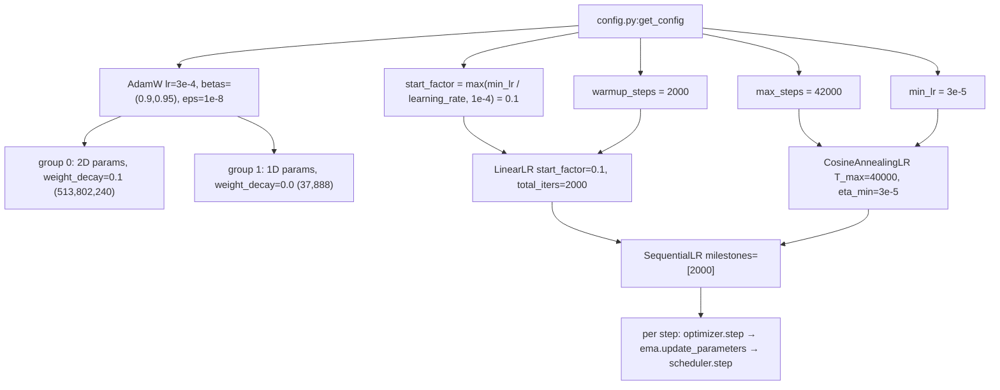
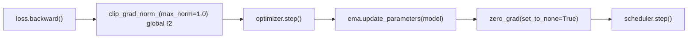
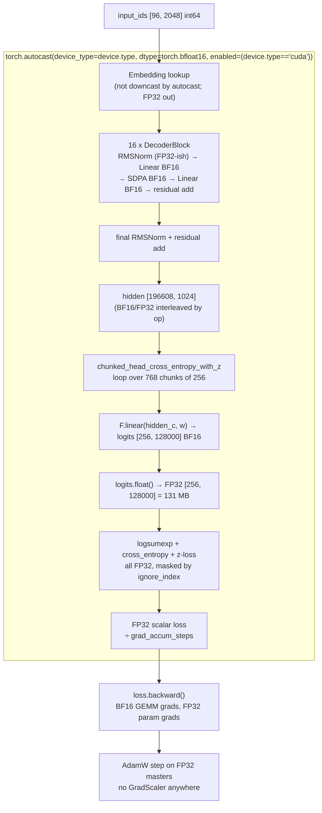
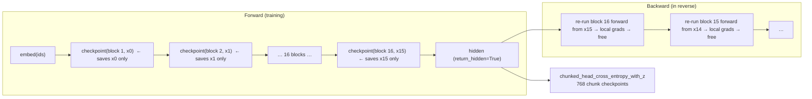
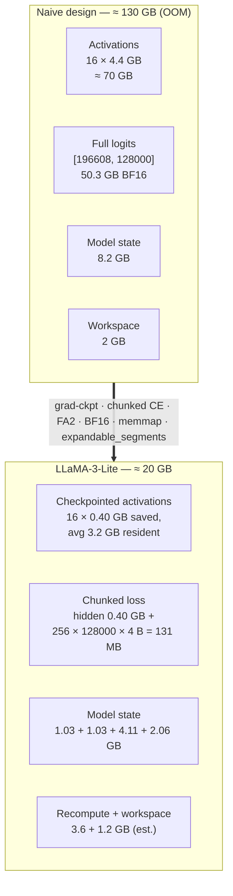
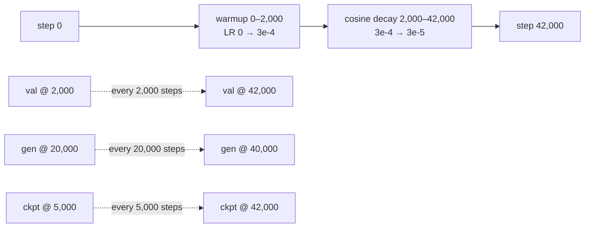

# LLaMA-3-Lite — Training, Memory, and Numerical Stability

This document consolidates the training-side theory of LLaMA-3-Lite into one place: the AdamW optimizer and learning-rate schedule (`train.py:train_model`, `config.py:get_config`), the BF16/TF32 mixed-precision policy and why it needs no `GradScaler` (`model.py:chunked_head_cross_entropy_with_z`, `train.py:setup_gpu_optimizations`), gradient checkpointing (`model.py:Transformer.forward`), the full 92 GB → 20 GB memory-stack derivation, the scaling/metrics contract (42,000 steps × 96 × 2048 tokens), and the RNG-state checkpoint round-trip that makes resumes bit-exact (`train.py:save_checkpoint`, `train.py:load_checkpoint`). Every number below is derived from the config and the source code with the arithmetic shown; where a figure is an estimate or an `[INFERENCE]` it is marked. The applied policy lives in [`../training.md`](../training.md); this doc keeps the full theory.

## Overview

Training a 513.8M-parameter decoder-only transformer on a single A100 80GB is a fixed-budget exercise. The pretraining goal is fixed: 42,000 steps at `batch_size=96`, `seq_len=2048` — 196,608 tokens per step — against an 8B-token corpus (≈8.26B tokens consumed, ~15.6 tokens per parameter, roughly 80% of the Chinchilla-recommended 20 tokens/param). Nothing about that goal can be relaxed to fit memory: the data budget, the batch size, and the hardware are all fixed. So the design questions are purely ones of *accounting and stability*:

- **Optimization.** AdamW with decoupled weight decay ($\lambda = 0.1$) applied only to 2D+ weight matrices, global-norm gradient clipping at 1.0, and a two-phase schedule — 2,000 warmup steps climbing linearly from $3\times10^{-5}$ to a peak of $3\times10^{-4}$, then 40,000 cosine steps decaying back to $3\times10^{-5}$.
- **Precision.** Parameters live in memory as FP32; every matrix multiply runs on the GPU tensor cores in BF16 inside `torch.autocast` blocks, with the loss computed chunk-by-chunk in FP32. BF16 keeps FP32's 8-bit exponent range, so gradients never underflow — which is exactly the failure mode that makes FP16 training require a `GradScaler`. There is no scaler, no inf/nan step-skipping, and no loss-scale bookkeeping anywhere in the repo.
- **Memory.** A naive implementation of this model would need on the order of 130–180 GB of VRAM. Eight cooperating techniques — BF16 compute, FP32 AdamW moments, gradient checkpointing, a chunked LM-head loss that never materializes full logits, Flash-Attention 2's $O(S)$ attention memory, a memory-mapped token corpus, a CUDA caching allocator configured with `expandable_segments`, and `torch.compile` CUDA graphs — fit the same training step into **~20 GB**.
- **Reproducibility.** A checkpoint stores the full state of every stochastic stream (four RNG states), not the seeds that started them, so a resumed run continues the interrupted run's exact stochastic stream and exact learning state.

The headline memory claim — **78% peak-memory reduction, 92 GB → 20 GB** — is an estimate, not a measurement: `.benchmarks/` is empty and no full run has completed. This doc derives every component of that estimate and marks each number as derived-from-config, estimated, or `[INFERENCE]`.

## Optimization: AdamW and the Learning-Rate Schedule

> Audience: intermediate

Training a transformer is a constrained-optimization problem: AdamW decides *how far* each weight moves per step, gradient clipping caps the worst case, and the learning-rate schedule decides *how bold* the optimizer is allowed to be at each point in the run. The project uses the standard LLM-pretraining recipe: AdamW with decoupled weight decay ($\lambda = 0.1$) applied only to 2D weight matrices, global-norm gradient clipping at $1.0$, and the two-phase warmup/cosine schedule above. Every piece of this recipe exists to answer one question: how do we make 513.8M parameters converge in the fewest tokens without diverging?

### Why this exists

Stochastic gradient descent moves every weight by $\eta \cdot g$, where the gradient $g$ is a noisy estimate. A 513.8M-parameter transformer trained on natural language faces three problems that plain SGD does not solve:

1. **Per-coordinate scale.** Some weights (embedding rows) see huge, dense gradients; others (deep FFN weights) see small, sparse ones. One global learning rate cannot serve both — the update step needs to be normalized by an estimate of each coordinate's gradient scale.
2. **Noisy early signals.** Gradients from a 196,608-token batch are only a sample; the first few thousand steps of training are the most fragile (the model's loss starts near $\ln 128000 \approx 11.76$ nats/token and must be driven down by orders of magnitude). Taking full-size steps before the optimizer has reliable statistics invites divergence.
3. **Generalization pressure.** A model with 513.8M parameters and ~8.26B tokens of data sees each parameter only ~16 times over the run. Without some form of regularization pressure, the optimizer will happily memorize the training distribution at the cost of validation loss.

AdamW + clipping + warmup + cosine decay is the empirical answer to all three: Adam normalizes each coordinate by its gradient history; clipping bounds rare catastrophic gradient events; warmup lets the optimizer's statistics (and the model's loss geometry) settle before large steps; cosine decay to a nonzero floor spends the second half of the run doing fine-grained convergence instead of thrashing.

### Intuition

**Adam as a ball rolling downhill with per-axis brakes.** SGD is a ball with constant friction. Adam brakes each axis independently: axes along which the ball has recently been moving fast (large gradient variance) get more braking, so the ball never rockets down a steep ravine while crawling along a flat ridge. The two running averages — first moment $m_t$ (mean gradient, i.e. direction) and second moment $v_t$ (mean squared gradient, i.e. how jumpy that direction is) — are the ball's memory. The update is roughly *direction / jumpiness*, which has units of a step in parameter space regardless of how big or small the raw gradients are.

**Weight decay as slow rust.** Decoupled weight decay multiplies every matrix weight by $(1 - \eta\lambda)$ each step — a tiny, uniform "rust" that slowly pulls large weights back toward zero. It is not about fitting the training data at all; it is a prior that says "prefer smaller matrices unless the data demands otherwise." Rust that scales with the weight (multiplicative) is qualitatively different from a constant pull: big weights rust faster, small weights barely rust, and the equilibrium magnitude of a weight is set by the tug-of-war between the data (pushing it up) and the rust (pulling it down).

**Warmup as warming up the engine.** Adam's second-moment estimate starts at zero. Until $v_t$ accumulates enough samples, the normalized update is essentially sign-descent with full magnitude — the largest step the optimizer is ever willing to take, taken in a direction estimated from a handful of noisy gradients. Warmup is the engine-idle period: run the engine at 10% throttle while the statistics warm up, then open the throttle.

**Cosine decay as easing off the gas.** The model needs big steps early, when the loss landscape is coarse, and small steps late, when it is fine. Cosine gives a smooth, self-decelerating throttle curve that spends most of its time near the middle and glides into a low floor instead of slamming to zero — and the floor matches the warmup start, so the throttle curve is one continuous arc from the first step to the last.

### The Adam update rule

Adam (Kingma & Ba, 2015) maintains two exponential moving averages per parameter. Let $g_t$ be the gradient at step $t$ (a vector over all parameters; the equations below are per-coordinate), $\beta_1, \beta_2 \in [0,1)$ decay rates, and $\eta_t$ the learning rate at step $t$:

$$
\begin{aligned}
m_t &= \beta_1 m_{t-1} + (1-\beta_1)\, g_t &\text{(first moment: smoothed gradient)} \\
v_t &= \beta_2 v_{t-1} + (1-\beta_2)\, g_t^2 &\text{(second moment: smoothed squared gradient)} \\
\hat m_t &= \frac{m_t}{1 - \beta_1^{\,t}} &\text{(bias correction)} \\
\hat v_t &= \frac{v_t}{1 - \beta_2^{\,t}} &\text{(bias correction)} \\
w_t &= w_{t-1} - \eta_t \frac{\hat m_t}{\sqrt{\hat v_t} + \varepsilon}
\end{aligned}
$$

The bias correction matters at small $t$. Both moments are initialized to zero, so the EMA starts out biased low; dividing by $1-\beta^{t}$ restores the expectation. Concretely: at $t=1$, $m_1 = (1-\beta_1)g_1$, so $\hat m_1 = g_1$ exactly; at $t=2$, $\hat m_2$ is the proper two-sample weighting, and so on. The correction decays away as $1-\beta^t \to 1$.

The per-coordinate step magnitude is bounded: by Cauchy–Schwarz, $|\hat m_t| \le \sqrt{\hat v_t}$ elementwise (an EMA of $g$ can never exceed the RMS of the $g$'s it averages), so each coordinate moves by at most $\eta_t$ per step — *regardless of how large the raw gradients are*. This is the property that lets one learning rate serve the embedding layer and the deepest FFN weight simultaneously.

**Why $\beta_1 = 0.9$.** The first moment is a smoothed direction estimate. $\beta_1 = 0.9$ gives an effective window of $1/(1-\beta_1) = 10$ steps: the direction used at step $t$ is an average over roughly the last ten gradients. That is long enough to suppress per-batch noise, short enough to track the direction as the loss landscape changes.

**Why $\beta_2 = 0.95$ instead of $0.999$.** The second moment estimates each coordinate's gradient variance, and its effective window is $1/(1-\beta_2)$:

| $\beta_2$ | window (steps) | window at 196,608 tokens/step |
|---|---|---|
| 0.999 (Adam default) | 1,000 | 196.6M tokens |
| 0.99 (LLaMA-2-style) | 100 | 19.7M tokens |
| **0.95 (this project)** | **20** | **3.9M tokens** |

The default $0.999$ assumes the per-coordinate gradient scale is roughly stationary over ~200M tokens. That assumption is wrong twice over in LLM pretraining: the gradient scale collapses by orders of magnitude over the run (loss goes from ~11.76 to ~2 nats), and the learning rate itself changes by $10\times$. With $\beta_2 = 0.95$, the optimizer re-estimates the coordinate scales every 3.9M tokens — fast enough to track the changing regime, at the cost of a noisier (shorter-average) variance estimate. LLM pretraining empirically tolerates that noise better than it tolerates a stale scale (GPT-3 used 0.95; the config here follows that convention).

### AdamW: decoupled weight decay vs. L2 regularization

"L2 regularization" means adding $\frac{\lambda}{2}\|w\|^2$ to the loss, so the *gradient* gains a $\lambda w$ term. "Weight decay" means subtracting $\eta\lambda w$ from the weight directly. For SGD these are equivalent (both subtract $\eta\lambda w$ per step). For Adam they are **not** equivalent, and the difference is the entire point of AdamW (Loshchilov & Hutter, 2019).

With L₂-in-the-loss, the regularizer rides through Adam's normalization. Writing $g_t' = g_t + \lambda w_{t-1}$, the update becomes:

$$
w_t = w_{t-1} - \eta_t \frac{\hat m_t'}{\sqrt{\hat v_t'} + \varepsilon}
$$

The decay term $\lambda w$ is mixed into $\hat m_t'$ and $\hat v_t'$ and therefore divided by $\sqrt{\hat v_t'}$ — the *effective* decay applied to a coordinate is approximately $\eta_t \lambda w / \sqrt{\hat v_t'}$, which varies per-coordinate and over time. Coordinates with quiet gradient histories (small $\hat v$) get decayed hard; coordinates with loud histories barely decayed. The regularization strength becomes an accident of each coordinate's gradient statistics — precisely the coupling that makes regularization non-uniform.

Decoupled weight decay applies the decay *outside* the moment machinery:

$$
\begin{aligned}
w_t &= w_{t-1} - \eta_t \lambda\, w_{t-1} &\text{(decay: uniform, history-independent)} \\
w_t &= w_t - \eta_t \frac{\hat m_t}{\sqrt{\hat v_t} + \varepsilon} &\text{(Adam update, unmodified)}
\end{aligned}
$$

(or equivalently combined into one line, as PyTorch documents it: $w_t = w_{t-1} - \eta_t(\lambda w_{t-1} + \hat m_t/(\sqrt{\hat v_t}+\varepsilon))$). Every coordinate decays by exactly $\eta_t \lambda$ per step, a constant fraction of its current magnitude. Decay is now a pure, predictable force: the equilibrium magnitude of a weight is set by the tug-of-war between data-driven updates and the uniform rust, with no dependence on the optimizer's internal bookkeeping. Loshchilov & Hutter show empirically that this decoupling improves generalization across vision and translation benchmarks, and it has become the default for LLM pretraining.

At this project's numbers: $\lambda = 0.1$, $\eta$ ranges $3\times10^{-5} \to 3\times10^{-4}$, so the per-step relative decay is $\eta\lambda \in [3\times10^{-6},\, 3\times10^{-5}]$ — at peak LR, 0.003% of a weight's magnitude per step. Small per step, but compounding: a weight receiving no gradient for the whole run would shrink by $(1 - \eta\lambda)^N$; integrating the actual $\eta_t$ curve (average $\eta \approx 1.0\times10^{-4}$ over the schedule) gives roughly $(1-1\times10^{-5})^{42000} \approx e^{-0.42} \approx 0.66$ of its initial magnitude. Decay is a real, cumulative force even though it is invisible per step.

### Why decay 2D+ parameters only

The optimizer construction in `train.py:train_model` partitions parameters by `param.dim() >= 2`: every 2D-or-larger tensor goes into the decayed group, every 1D tensor into an undecayed group. At this project's scale that split is:

| group | rule | count | fraction |
|---|---|---|---|
| decayed | `dim() >= 2`: embeddings, LM head, q/k/v/out projections, gate/up/down | 513,802,240 | 99.993% |
| undecayed | 1D: RMSNorm gains, QK-norm gains | 37,888 | 0.007% |

The undecayed 1D parameters are exactly the normalization gains: per decoder block, `attention.q_norm.weight` (128) + `attention.k_norm.weight` (128) + `attention_norm.weight` (1024) + `ffn_norm.weight` (1024) = 2,304, times 16 blocks, plus the final `decoder.norm.weight` (1024) = 37,888 total. There are no biases anywhere in the model (every `nn.Linear` in `model.py:GroupedQueryAttention` and `model.py:SwiGLUFFN` is `bias=False`).

Why exclude them?

1. **Norm gains are scale parameters, not weights.** An RMSNorm gain multiplies a unit-variance activation (see [architecture-components.md](architecture-components.md)); its magnitude is meaningful *as a scale*. Decaying it drags the residual-stream amplitude down over training, and every downstream layer must compensate by growing — an unnecessary, coupled distortion that fights the normalization.
2. **The magnitude argument.** 37,888 parameters is 0.007% of the model. Even if decay on them helped, it would be below the noise floor of the run; the risk (distorting norm scales) is real, the benefit is not.
3. **The positive case for 2D.** Decaying the big matrices — including the 262.1M-parameter embedding + LM head pair ($2 \times 128000 \times 1024$) and the 251.7M non-embedding weights — is where the generalization pressure actually lives. The `dim() >= 2` heuristic is the nanoGPT/GPT-2 idiom: "matrix weights decay, vectors don't."

Note that the *embedding* is decayed even though it is technically a lookup table, not a matrix multiply — it is 2D, so it decays, and that is standard for LLM pretraining.

### FP32 moments

The Adam state ($m_t$, $v_t$, plus the step counter) lives in FP32. This falls out of how the code is structured: the model is never cast to a lower precision — `train.py` wraps only the forward/backward *compute* in `torch.autocast(device_type='cuda', dtype=torch.bfloat16, ...)` (see [Mixed Precision](#mixed-precision-bf16-tf32-and-why-no-gradscaler)) — so parameters, gradients, and optimizer state are all FP32 by construction. The moments must not be BF16: the second moment is a *scale* estimate whose precision directly sets the precision of the normalized step, and BF16's ~3 significant decimal digits would quantize $\sqrt{\hat v_t}$ coarsely enough to corrupt the step size; $\varepsilon = 10^{-8}$ would also be meaningless in BF16 (it is far below representable precision). FP32 moments cost memory: $2 \times 513.8\text{M} \times 4\text{ B} = 4.11\text{ GB}$, against 2.06 GB for FP32 weights (see [Memory Engineering](#memory-engineering-the-92-gb-to-20-gb-stack) for the full stack). That is the price of a stable adaptive optimizer, and it is paid once, up front.

### Gradient clipping: global-norm semantics

The code clips with `torch.nn.utils.clip_grad_norm_(model.parameters(), max_norm=1.0)`. The semantics are *global*: compute the L2 norm of the *concatenated* gradient vector over every parameter,

$$
g = \sqrt{\sum_{p \in \text{params}} \sum_i g_{p,i}^{\,2}},
$$

and if $g > 1.0$, scale every gradient in the model by $1.0/g$ (if $g \le 1.0$, nothing changes). This is a "rare-event guard," not a regularizer: with Adam's normalization, the per-coordinate step is already bounded by $\eta_t$, so clipping mainly protects the *first moment* from being polluted by a single catastrophic gradient event (one bad batch can otherwise inject a large spike into $m_t$ that takes ~10 steps to wash out). It also bounds the norm of the actual parameter update: the update vector's norm is at most $\eta_t \cdot g_{\text{clipped}} \le \eta_t$ in the worst case. A single A100 run at batch 96 is too small for gradient noise to be the dominant failure mode, but the guard is cheap and standard.

### Warmup: why, and the start_factor trick

Three compounding reasons make the first few thousand steps the most dangerous phase of an LLM run:

1. **Cold-start second moment.** At step $t$, $\hat v_t$ is an average over $t$ samples. For $t < 20$ (the $\beta_2$ window), the variance estimate is dominated by a handful of gradients; the normalized step magnitude $\eta_t \hat m_t/\sqrt{\hat v_t}$ wanders as those few samples come and go. At $t=1$ the update is exactly $\eta \cdot \operatorname{sign}(g_1)$ — full-magnitude sign descent, the largest relative step Adam ever takes, on the basis of one sample.
2. **Steep initial landscape.** With init weights $\sim \mathcal{N}(0, 0.02^2)$ (`model.py:Transformer._init_weights`) and a 128,000-way output, the initial loss is near $\ln 128000 \approx 11.76$ nats/token, and the gradients in the first steps are large and correlated across the batch of 196,608 tokens.
3. **The schedule's own math.** $\eta = 3\times10^{-4}$ is chosen for the *converged* regime (where the normalized update is small and the model can afford large steps). Taking $3\times10^{-4}$-sized steps from step 1, when the model is changing fastest and the optimizer's statistics are worst, is exactly backwards.

Warmup fixes this by throttling $\eta$ from small to peak while the moments accumulate and the loss geometry settles. The code's construction makes the throttle's starting value meaningful rather than arbitrary:

$$
\texttt{start\_factor} = \max\!\left(\frac{\texttt{min\_lr}}{\texttt{learning\_rate}},\; 10^{-4}\right) = \max\!\left(\frac{3\times10^{-5}}{3\times10^{-4}},\; 10^{-4}\right) = 0.1
$$

So warmup starts at $0.1 \times 3\times10^{-4} = 3\times10^{-5}$ — **exactly the value the cosine tail ends at**. The warmup start is not a fourth free hyperparameter; it is derived from the two the schedule already has. The schedule is then one continuous arc: $3\times10^{-5} \to 3\times10^{-4} \to 3\times10^{-5}$. The $10^{-4}$ floor on `start_factor` guards pathological configs ($\texttt{min\_lr} = 0$, or a zero/negative peak LR), which would otherwise produce a zero or negative warmup start. `LinearLR` then interpolates multiplicatively from `start_factor` to `1.0` across `total_iters` steps, landing at the peak exactly on step 2,000.

### Cosine decay: why cosine, why not exponential

After warmup, the schedule hands off to `CosineAnnealingLR` with $T_{\max} = 40000$, $\eta_{\min} = 3\times10^{-5}$:

$$
\eta_t = \eta_{\min} + \frac{1}{2}(\eta_{\max} - \eta_{\min})\left(1 + \cos\frac{\pi t}{T_{\max}}\right)
$$

with $\eta_{\max} = 3\times10^{-4}$, $\eta_{\min} = 3\times10^{-5}$, $t = 0, 1, \dots, 39999$.

**Why not exponential decay?** An exponential $\eta_t = \eta_{\max} r^{t}$ has one knob — the rate $r$ — which must be fixed up front. To traverse a $10\times$ range over 40,000 steps it must decay quickly early (when the model still wants large steps) and keeps decaying forever after (the tail is asymptotically flat, so the last ~10,000 steps crawl at near-minimum LR, spending the run's final data on near-zero updates). Cosine has the same two endpoints but a qualitatively different shape: it *decelerates* — the curve spends most of its time in the upper-middle range and only drops sharply near the end. The derivative $d\eta_t/dt \propto \sin(\pi t/T_{\max})$ is largest mid-schedule and vanishes at both ends, so the schedule glides into the floor rather than slamming into it. This smooth, "spend most of the time at a useful LR" shape is the empirical winner (Loshchilov & Hutter, 2017, SGDR).

**Why a nonzero floor ($\eta_{\min} = 3\times10^{-5} = 10\%$ of peak)?** Three reasons. First, the last steps still need to *move*: a hard zero freezes the model and wastes the final tokens — the run's last gradient information is discarded. Second, the EMA shadow model (`ema_decay = 0.999`) keeps averaging the online weights and only converges to them if they keep moving; a zero-LR tail freezes the online weights while the EMA keeps blending stale snapshots (see [`../training.md`](../training.md)). Third, the $10\%$-of-peak convention is the empirical sweet spot (GPT-3 used exactly peak $3\times10^{-4}$, min $3\times10^{-5}$ — the same pair as here).

### The complete curve at this scale

| step | phase (t = cosine steps elapsed) | LR |
|---|---|---|
| 0 | warmup start | $3.000\times10^{-5}$ |
| 1,000 | warmup midpoint | $1.650\times10^{-4}$ |
| 2,000 | peak, cosine t=0 | $3.000\times10^{-4}$ |
| 12,000 | cosine t=10,000 | $2.605\times10^{-4}$ |
| 22,000 | cosine t=20,000 | $1.650\times10^{-4}$ |
| 32,000 | cosine t=30,000 | $6.954\times10^{-5}$ |
| 42,000 | cosine t=40,000 | $3.000\times10^{-5}$ |

Worked values: at t=10,000, $\cos(\pi/4) = 0.7071 \Rightarrow \eta = 3\times10^{-5} + \tfrac{1}{2}(2.7\times10^{-4})(1.7071) = 2.605\times10^{-4}$. At t=20,000, $\cos(\pi/2) = 0 \Rightarrow \eta = 1.65\times10^{-4}$ — the cosine midpoint lands at the arithmetic mean of peak and floor, exactly like the warmup midpoint. At t=30,000, $\cos(3\pi/4) = -0.7071 \Rightarrow \eta = 6.954\times10^{-5}$. The warmup-to-cosine seam is continuous: warmup's last step (t=1,999) sits at $0.99955 \times$ peak and cosine's first step at exactly peak — a 0.04% blip, invisible in practice.

### Tokens per step and the LR/batch relationship

The schedule's x-axis is *steps*, but the meaningful unit is *tokens*: each step consumes

$$
\text{tokens/step} = \texttt{batch\_size} \times \texttt{seq\_len} \times \texttt{grad\_accum\_steps} = 96 \times 2048 \times 1 = 196{,}608
$$

(computed verbatim in `train.py:train_model` as `tokens_per_step`). The run-level budget:

- warmup: $2{,}000 \times 196{,}608 = 3.93\times10^8$ tokens (0.39B, 4.8% of the run)
- cosine: $40{,}000 \times 196{,}608 = 7.86\times10^9$ tokens
- total: $42{,}000 \times 196{,}608 = 8.26\times10^9$ tokens — about 16.1 tokens per parameter for a 513.8M-param model, roughly 80% of the Chinchilla-recommended 20 tokens/param (see [Scaling and Metrics](#scaling-and-metrics))

Two scheduling consequences follow from the token rate. First, the $\beta_2 = 0.95$ window of 20 steps is only 3.9M tokens — a fraction of a percent of the run — so the optimizer can track the changing gradient scale as the schedule itself evolves. Second, warmup at 4.8% of the run is proportionally *long* compared with frontier runs (GPT-3 warmed up over 0.125% of its tokens); a small model seeing each token only ~16 times cannot afford to waste early tokens on a divergent trajectory, so it spends a larger share of the run easing in. The peak LR of $3\times10^{-4}$ is the near-universal transformer-pretraining default (same value as GPT-3 and LLaMA-3), chosen to be safe at this batch: for Adam-based training, 196,608 tokens/step is small enough that $3\times10^{-4}$ does not overshoot, and large enough that it is not wasteful.

### How the code realizes it

All of this lives in `train.py:train_model`. The parameter split and `AdamW` construction:

```python
# illustrative — trimmed from train.py:train_model; the loop body is verbatim
decay_params = []
no_decay_params = []
for param in model.named_parameters():
    if not param[1].requires_grad:
        continue
    if param[1].dim() >= 2:
        decay_params.append(param[1])
    else:
        no_decay_params.append(param[1])

optimizer = torch.optim.AdamW([
    {'params': decay_params, 'weight_decay': config['weight_decay']},
    {'params': no_decay_params, 'weight_decay': 0.0},
], lr=config['learning_rate'], betas=(config['beta1'], config['beta2']),
   eps=config['eps'])
```

The two param groups differ *only* in `weight_decay` ($0.1$ vs. $0.0$); both share `lr=3e-4`, `betas=(0.9, 0.95)`, `eps=1e-8`, all read from `config.py:get_config`. Because the model stays in FP32 (autocast covers only the compute), the Adam state is FP32 automatically — no master-weight copy is needed. The `requires_grad` guard also protects the (rare) frozen parameter from being grouped.

The scheduler construction:

```python
# illustrative — trimmed from train.py:train_model; verbatim
warmup_steps = config['warmup_steps']
max_steps = config['max_steps']
start_factor = max(config['min_lr'] / config['learning_rate'], 1e-4) if config['learning_rate'] > 0 else 1e-4
warmup_scheduler = LinearLR(optimizer, start_factor=start_factor, total_iters=warmup_steps)
cosine_scheduler = CosineAnnealingLR(optimizer, T_max=max_steps - warmup_steps, eta_min=config['min_lr'])
scheduler = SequentialLR(optimizer, schedulers=[warmup_scheduler, cosine_scheduler], milestones=[warmup_steps])
```

`torch.optim.lr_scheduler.SequentialLR` composes the two schedulers: it runs `LinearLR` for the first 2,000 `scheduler.step()` calls, then hands off to `CosineAnnealingLR` for the remaining 40,000, which is exactly `T_max = max_steps - warmup_steps`. Both schedulers act on both param groups identically — the decay/no-decay groups share the same LR trajectory, only the decay differs.



The per-step sequence (with `gradient_accumulation = 1`, that is every batch):

```python
# illustrative
grad_norm = nn.utils.clip_grad_norm_(model.parameters(), max_norm=config['max_grad_norm'])
optimizer.step()
if ema is not None:
    ema.update_parameters(model)
optimizer.zero_grad(set_to_none=True)
scheduler.step()
```

Order matters: clip before `optimizer.step()` (so the optimizer never sees an unclipped gradient), EMA update after the step (so the shadow tracks the *new* weights), `zero_grad(set_to_none=True)` after (releases gradient memory), and `scheduler.step()` last (the LR used by step $t$ was set by step $t-1$'s scheduler call — the standard PyTorch ordering). The logged LR comes from `scheduler.get_last_lr()[0]`, and the logged `tokens_seen = step * tokens_per_step` uses the same 196,608 tokens/step accounting. Clipping is inside the grad-accumulation branch too, so with `gradient_accumulation > 1` the norm is taken over the *accumulated* gradient — the correct global norm — and the scheduler steps once per optimizer step, not once per micro-batch.



The tiny-scheduler mirror in tests replicates the production chain at toy scale (2 warmup steps, 10 total, min/peak $10^{-5}/3\times10^{-4}$), including the exact `start_factor` formula:

```python
# illustrative
def make_tiny_scheduler(opt, warmup_steps=2, max_steps=10, min_lr=1e-5, peak_lr=3e-4):
    """Mirror of the production scheduler chain (LinearLR → CosineAnnealingLR)."""
    start_factor = max(min_lr / peak_lr, 1e-4) if peak_lr > 0 else 1e-4
    warm = LinearLR(opt, start_factor=start_factor, total_iters=warmup_steps)
    cos = CosineAnnealingLR(opt, T_max=max_steps - warmup_steps, eta_min=min_lr)
    return SequentialLR(opt, schedulers=[warm, cos], milestones=[warmup_steps])
```

This is runnable as written (it is the test's own code, `tests/test_train.py:make_tiny_scheduler`). It is used throughout `tests/test_train.py::TestCheckpointRoundTrip`, whose round-trip tests build an optimizer + `make_tiny_scheduler` chain, run a few steps, save via `train.py:save_checkpoint`, reload via `train.py:load_checkpoint`, and verify that optimizer and scheduler state (including step counters) restore exactly — which is what makes the LR curve bit-exact across resume boundaries. If the production construction drifts from this mirror, the mismatch shows up as a checkpoint round-trip failure.

## Mixed Precision: BF16, TF32, and Why No GradScaler

> Audience: intermediate. Everything here — the bit layouts, the four formats, why BF16 training needs no loss scaling, and exactly where each format appears in this codebase — is derived from first principles. The applied policy also appears in [`../training.md`](../training.md); this section keeps the full theory.

LLaMA-3-Lite trains with **mixed precision**: the model's parameters live in memory as FP32, but every matrix multiply runs on the GPU tensor cores in **BF16** (bfloat16) inside `torch.autocast` blocks, with the final loss computed chunk-by-chunk in **FP32**. BF16 keeps the full 8-bit exponent range of FP32, so gradients that are representable in FP32 are also representable in BF16 — small values do not flush to zero, which is exactly the failure mode that makes FP16 training require a `GradScaler`. Because the code uses BF16, there is no scaler, no inf/nan step-skipping, and no loss-scale bookkeeping: `loss.backward()` just works (`train.py` even says so in a comment). A second knob, TF32, is enabled for FP32 matmuls that escape autocast, and `torch.set_float32_matmul_precision('high')` pins the matmul precision policy. The numerically sensitive part — the softmax/log-sum-exp over the 128,000-token vocabulary — is explicitly upcast to FP32 per 256-row chunk, because doing it in BF16 would corrupt the loss.

### Why this exists

Two pressures push away from pure FP32:

1. **Throughput.** A100 dense FP32 compute is 19.5 TFLOPS; BF16 tensor cores are 312 TFLOPS, TF32 is 156 TFLOPS (vendor figures). Training a model whose largest matmul writes a 50 GB tensor every step is dominated by precision-limited throughput, so leaving 16x of compute on the table is not an option.
2. **Memory.** Activations, logits, and optimizer state dwarf the weights. Every byte of dtype saved on a large tensor is bytes of HBM bandwidth saved per step and bytes of peak residency saved. The LM-head GEMM alone produces a `[196608, 128000]` output; in BF16 that is 50.3 GB written per step, in FP32 it is 100.7 GB.

But naively running everything in a 16-bit format breaks training in a specific, well-understood way: **FP16's 5-bit exponent cannot represent small gradients**, and underflow to zero silently kills the update for deep layers late in training. The industry's first answer was loss scaling (`GradScaler`); the cleaner answer, available since Ampere, is **BF16**, which keeps FP32's exponent range and simply does not have the underflow problem.

### Intuition: digits vs range

Think of a floating-point number as scientific notation: *mantissa × 2^exponent*. The **exponent bits buy range** — how big or small a number can be. The **mantissa bits buy precision** — how many significant digits a number carries, regardless of its magnitude. Every real number is rounded to the nearest representable one, and the rounding error is always *relative*: a 7-bit mantissa stores about 2.8 significant decimal digits everywhere in its range, a 10-bit mantissa about 3.3 digits, a 23-bit mantissa about 7.2 digits.

Two failure modes follow:

- **Underflow (a range failure):** the true value is smaller than the smallest representable exponent, so it rounds to zero. A gradient of $10^{-8}$ is unrepresentable if the format's smallest normal is $6\times10^{-5}$ — it vanishes, and the weight never moves.
- **Rounding (a precision failure):** the value is representable in range, but the mantissa is too short, so each arithmetic operation perturbs the result by up to $\epsilon$ (machine epsilon) relative error. Errors compound through reductions (sums over 128,000 terms) and through chains of operations.

BF16 fixes the first failure entirely (same exponent field as FP32) and accepts a worse mantissa than FP16 for the second — a trade that is safe *only because* GEMMs accumulate in FP32 internally and the loss is computed in FP32. Range is cheap to fix; precision is fixed by where you accumulate, not by the input format.

### Formal treatment: IEEE-754 and the four formats

A normal IEEE-754 binary number is

$$x = (-1)^s \times 1.m \times 2^{e - \text{bias}}$$

where $s$ is the sign bit, $m$ is the mantissa stored without its leading 1 (the "hidden bit"), $e$ is the biased exponent, and the bias is $2^{k-1}-1$ for $k$ exponent bits. The largest exponent is reserved for inf/NaN; the smallest signals subnormals. Two quantities matter:

- **Range limits:** max value $(2 - 2^{-p}) \times 2^{2^{k-1}}$, min normal $2^{1 - 2^{k-1}}$ (for bias $2^{k-1}-1$), where $p$ = mantissa bits.
- **Unit roundoff (machine epsilon):** $\epsilon = 2^{-p}$. Each correctly-rounded operation satisfies $|\text{fl}(a \circ b) - (a \circ b)| \le \epsilon\,|a \circ b|$ (ignoring subnormal and overflow edge cases). It is the *relative* error per operation.

| Format | Bits (s/e/m) | Unit roundoff $\epsilon = 2^{-m}$ | Max value | Min normal | Min subnormal | Underflow risk in training |
|---|---|---|---|---|---|---|
| FP32 | 1/8/23 | $2^{-23} \approx 1.19\times10^{-7}$ | $\approx 3.40\times10^{38}$ | $1.18\times10^{-38}$ | $1.40\times10^{-45}$ | None — the reference |
| FP16 | 1/5/10 | $2^{-10} \approx 9.77\times10^{-4}$ | $65504$ | $6.10\times10^{-5}$ | $5.96\times10^{-8}$ | **Severe** — gradients $< 6\times10^{-5}$ lose precision, $< 6\times10^{-8}$ flush to zero |
| BF16 | 1/8/7 | $2^{-7} \approx 7.81\times10^{-3}$ | $\approx 3.39\times10^{38}$ | $1.18\times10^{-38}$ | $1.18\times10^{-38}$ | None — identical exponent range to FP32 |
| TF32 | 1/8/10 | $2^{-10} \approx 9.77\times10^{-4}$ | $\approx 3.39\times10^{38}$ | $1.18\times10^{-38}$ | — | None (matmul-only format) |

Key observations:

- **FP16 and BF16 are both 16 bits** but spend them completely differently. FP16 = 5 exponent + 10 mantissa: precise but narrow. BF16 = 8 exponent + 7 mantissa: FP32's full range, FP16-level precision at best (actually one third of FP16's mantissa).
- **BF16's exponent field is bit-for-bit identical to FP32's.** That is the entire thesis: anything whose *magnitude* is representable in FP32 — every gradient, every intermediate, every logit — is representable in BF16. Only the digits change.
- **TF32 is not a storage format.** It is a 19-bit (1/8/10) *compute* format: FP32 inputs are rounded to 10 mantissa bits and multiplied on the tensor cores, with the product accumulated in FP32. You never store TF32 tensors; it is a hardware trick to run FP32-shaped matmuls ~3x faster (up to 8x at vendor peak) on Ampere and later.

**The worked underflow example.** Take a typical late-training gradient for a deep layer: $g = 10^{-6}$. Its FP32 representation is exact to 7 digits. In FP16:

- $10^{-6} < 6.10\times10^{-5}$ (min normal) — the value is *subnormal*, so it has fewer than 10 effective mantissa bits;
- $10^{-6} > 5.96\times10^{-8}$ — it survives as a subnormal, but a slightly smaller gradient $g = 5\times10^{-8}$ is below the subnormal floor and rounds to exactly zero.

The Adam update is $w \leftarrow w - \eta \frac{m}{\sqrt{v}+\hat{\epsilon}}$; with $\eta = 3\times10^{-4}$ (config `learning_rate`) a vanished gradient means that weight gets no update at all. Across millions of parameters, the fraction of zeroed gradients grows as training proceeds (gradients shrink), which is why naive FP16 training stalls. Loss scaling ($\text{loss} \times 2^S$, then unscale gradients before the optimizer step) fixes this by making all gradients larger by $2^S$; it adds bookkeeping, a dynamic scale factor, and inf/NaN overflow checks. **BF16 removes the problem instead of managing it**: $10^{-6}$ and even $10^{-20}$ are far above BF16's min normal $1.18\times10^{-38}$. No scaling, no bookkeeping.

### Why BF16 training needs no GradScaler

The `GradScaler` exists for exactly one reason: **FP16's 5-bit exponent underflows gradients**. Its contract is: scale the loss up by $2^S$ before `backward()`, so gradients land in FP16's representable band; after the backward pass, unscale the gradients by $2^{-S}$ before the optimizer step; if the scaled loss overflowed to inf/NaN, skip the step and lower $S$. Three moving parts, all compensating for a range defect.

BF16 has FP32's exponent field, so **the scaling factor is unnecessary**: every gradient FP32 can hold, BF16 can hold too. The only remaining precision question is mantissa width, and that is handled not by scaling but by *where accumulation happens*:

1. BF16 tensor-core GEMMs accumulate products in **FP32 internally** — the per-dot-product error stays $\epsilon_{\text{BF16}}$-class, not $\epsilon_{\text{BF16}} \times K$ for the dot-product length $K$ (the hardware keeps a wide accumulator).
2. The **loss is computed in FP32** (the per-chunk `.float()` chain, below), so the scalar that drives backpropagation is accurate to 7 digits.
3. **Master weights are FP32** (next subsection), so weight updates are added at FP32 precision even though the forward matmuls consume BF16 copies.

The codebase makes this explicit. In `train.py`, the training step's autocast block is followed by a bare `loss.backward()` with the comment *"BF16 has the FP32 exponent range; no GradScaler needed."* A grep of the repo finds no `GradScaler`, no `scaler.scale(...)`, no `scaler.step(...)` anywhere — the entire class of machinery is absent because the format choice removed its reason to exist.

### Precision, not just range: why the loss chain must be FP32

Range is not the only hazard; reductions amplify rounding. The loss must compute

$$\log Z = \log\sum_{i=1}^{V} e^{z_i}, \qquad V = 128{,}000$$

twice per chunk (once for the CE normalization inside `F.cross_entropy`, once for the z-loss term), then form CE $= -\log p_{t} = \log Z - z_{t}$.

**The BF16 arithmetic:** each addend $e^{z_i}$ is stored with relative error up to $\epsilon_{\text{BF16}} = 7.8\times10^{-3}$. Summing $V = 128{,}000$ positive terms, the accumulated relative error of the sum is bounded (pessimistically) by $V \cdot \epsilon \approx 1000$, or around $\sqrt{V}\,\epsilon \approx 358 \times 7.8\times10^{-3} \approx 2.8$ under a random-walk model. That is an *absolute* error of up to ~2.8 nats in $\log Z$ — compared to a training loss of order 3–7 nats, this is not noise on top of the signal, it is the same size as the signal. The z-loss term $\overline{(\log Z)^2}$ would be garbage.

**The FP32 arithmetic:** the same bound gives $128{,}000 \times 1.19\times10^{-7} \approx 0.015$ (worst case) or $\sim 4\times10^{-5}$ (random walk) — harmless next to a loss of ~5.

So the upcast is load-bearing, not cosmetic: **`logsumexp` over a 128k-wide axis is the single most reduction-heavy computation in the model, and it must run in FP32.** The implementation enforces this per chunk rather than trusting autocast policy: in `model.py:chunked_head_cross_entropy_with_z` the per-chunk helper does `cl = logits.float()` *before* `torch.logsumexp(cl, dim=-1)` and `F.cross_entropy(cl, ...)`, with the comment *"Upcast to FP32 once so logsumexp + CE share a single precision promotion"*. `model.py:chunked_cross_entropy_with_z` (the variant that receives already-materialized logits) does the identical `cl = logits[start:end].float()`. Accumulators across chunks are FP32 tensors (`total_ce`, `z_accum`) and the final `ce_loss` is a FP32 scalar, so the loss that reaches `backward()` is FP32 end to end — only the logits *production* (`F.linear`) runs in BF16 under autocast.

### The standard recipe: BF16 compute + FP32 master weights

Why not store the weights in BF16 and save 1.03 GB? Because a weight stored in BF16 can only absorb updates at BF16 precision: each update $-\eta\frac{m}{\sqrt v + \hat\epsilon}$ is typically $10^{-3}$–$10^{-5}$ relative to the weight, and the BF16 rounding error per write is $\epsilon_{\text{BF16}} \approx 0.8\%$ of the weight. Over tens of thousands of steps these rounding errors accumulate in the direction of drift ($\sim\sqrt{\text{steps}}\,\epsilon \cdot |w|$), and the model quietly loses the low-order bits of its trained parameters. The fix that everyone converged on:

1. **FP32 master weights** — the parameters in memory, what the optimizer updates.
2. **Per-op BF16 compute** — autocast casts a FP32 weight to BF16 only for the duration of the matmul (a transient, not a storage change).
3. **FP32 accumulation** — GEMM internal accumulators and the entire loss chain run FP32.
4. **FP32 optimizer state** — AdamW's first and second moments, $m$ and $v$, span tiny magnitudes (config `eps = 1e-8`, and $v$ for rarely-updated weights is far below FP16's floor) and must be FP32; see [Optimization](#optimization-adamw-and-the-learning-rate-schedule).

This is exactly what LLaMA-3-Lite does, and it is *not* the variant where weights are stored BF16: `model.py:build_transformer` constructs every `nn.Linear` and `nn.Embedding` in the default FP32 dtype, `train.py:train_model` moves the model with a plain `.to(device)` (no dtype change), and a grep of `train.py`/`model.py` finds no `.bfloat16()` or `.half()` cast on any parameter. BF16 exists only inside the autocast context, as per-op temporaries. Consequences:

- The in-memory weight cost is the FP32 one: 2.06 GB, not 1.03 GB (math below).
- The `state_dict` and checkpoints are FP32; the EMA shadow in `train.py` (built via `AveragedModel`) holds FP32 copies too — see [Optimization](#optimization-adamw-and-the-learning-rate-schedule).
- "BF16 training" here means *BF16 compute*, which is what the throughput argument cares about; the memory argument (storage-level BF16) is a further optimization this repo deliberately does not take, trading 1.03 GB for update precision.

### Numbers at this project's scale

All figures below are derived from the config (`config.py:get_config`: batch 96, seq 2048, d_model 1024, vocab 128,000, 513.8M params) or from vendor-published A100 80GB specs; none are measured in this repo. `[derived]` = arithmetic from config, `[vendor]` = published hardware spec.

**Weight memory.** $513.8 \times 10^{6}$ parameters:

- FP32 (what this repo keeps in memory): $513.8\text{M} \times 4\text{ B} = 2.06\text{ GB}$ `[derived]`
- BF16 (storage-level variant): $513.8\text{M} \times 2\text{ B} = 1.03\text{ GB}$ `[derived]`
- AdamW moments (FP32, 2 per param): $2 \times 513.8\text{M} \times 4\text{ B} = 4.11\text{ GB}$ `[derived]`
- Gradients (FP32, match param dtype): $2.06\text{ GB}$ `[derived]`
- Total model state here: $2.06 + 2.06 + 4.11 = 8.22\text{ GB}$; in the BF16-storage variant: $1.03 + 1.03 + 4.11 = 6.17\text{ GB}$. Full accounting lives in [Memory Engineering](#memory-engineering-the-92-gb-to-20-gb-stack). `[derived]`

**The LM head, the reason everything is chunked and BF16.** With $N = 96 \times 2048 = 196{,}608$ rows:

- FLOPs per step: $2 \cdot N \cdot V \cdot d = 2 \times 196{,}608 \times 128{,}000 \times 1024 \approx 51.5\text{ TFLOPs}$ `[derived]`
- Ideal time at BF16 312 TFLOPS: $\approx 0.17\text{ ms}$; at FP32 19.5 TFLOPS: $\approx 2.6\text{ ms}$ `[derived, vendor]`
- Output write traffic: $196{,}608 \times 128{,}000 \times 2\text{ B} = 50.3\text{ GB}$ in BF16 vs $100.7\text{ GB}$ in FP32 — at 2 TB/s HBM that is ~25 ms vs ~50 ms of pure bandwidth per step, making the head *bandwidth-bound, not compute-bound*. `[derived, vendor]`
- Per-chunk FP32 slice in the loss: $256 \times 128{,}000 \times 4\text{ B} = 131\text{ MB}$ alive at once (one chunk at a time, thanks to `checkpoint`), vs 100.7 GB for the full FP32 logits tensor. `[derived]`

**Per-step scale.** 196,608 tokens/step; 42,000 steps → 8.26B tokens; the chunked loss loops over $196{,}608 / 256 = 768$ chunks per step.

### How the code realizes it

**The global switches: `train.py:setup_gpu_optimizations`.** Called from `train.py:train_model` and only when `device.type == 'cuda'` (on CPU every precision toggle is skipped, which is why the CPU test suite runs pure FP32 — see `tests/conftest.py:dtype`). Its effect:

```python
# illustrative — condensed from train.py:setup_gpu_optimizations
if config.get('tf32', True):
    torch.backends.cuda.matmul.allow_tf32 = True   # FP32 matmuls -> TF32 tensor cores
    torch.backends.cudnn.allow_tf32 = True         # FP32 convs -> TF32 (no convs in this model)
torch.set_float32_matmul_precision('high')         # matmul FP32 policy: 'high' == TF32
torch.backends.cudnn.benchmark = config.get('cudnn_benchmark', True)
torch.backends.cudnn.deterministic = False
if 'cuda_alloc_conf' in config:
    os.environ['PYTORCH_CUDA_ALLOC_CONF'] = config['cuda_alloc_conf']  # expandable_segments:True
```

- **`allow_tf32 = True` (both matmul and cudnn):** FP32 matmuls round inputs to TF32's 10-bit mantissa and run on the tensor cores at ~3x FP32 throughput on Ampere `[vendor]`. In this training loop most heavy matmuls are already BF16 via autocast, so TF32 is the safety net for FP32 matmuls that escape autocast — see the pitfall below about what actually controls this knob.
- **`torch.set_float32_matmul_precision('high')`:** the modern spelling of the same policy. PyTorch's float32 matmul precision modes are `'highest'` (strict FP32), `'high'` (TF32 on Ampere+), and `'medium'` (BF16 matmuls). Setting `'high'` enables TF32 for `matmul` — on recent PyTorch this is the `torch.backends.cuda.matmul` precision policy, and it also informs `torch.compile` which FP32 matmul kernels are fair game. It is set *unconditionally*, not gated on `config['tf32']` (see the interaction in the pitfalls section).
- **`cudnn_benchmark` / `cudnn.deterministic`:** algorithm autotuning; this model has no convolutions, so these are inert here and exist for the wider codebase pattern. `deterministic = False` is the explicit opposite of reproducibility; see [Reproducibility](#reproducibility-rng-state-and-checkpoint-round-trips).
- **`PYTORCH_CUDA_ALLOC_CONF=expandable_segments:True`:** set in `config.py:get_config` (`'cuda_alloc_conf': 'expandable_segments:True'`). Tells the CUDA caching allocator to use expandable segments (no giant upfront virtual-address reservation; segments grow/shrink on demand), which matters because the chunked-loss design allocates and frees a 131 MB logits slice 768 times per step. The environment variable must be set before the first CUDA allocation; `setup_gpu_optimizations` runs at the top of `train_model`, before the model is built. Full treatment in [Memory Engineering](#memory-engineering-the-92-gb-to-20-gb-stack).

**The autocast scoping rules, in code.** Four sites wrap compute in the same context manager:

```python
# illustrative — the real callsite in train.py:train_model elides the
# chunked_head_cross_entropy_with_z arguments, which fill 6 lines.
with torch.autocast(device_type=device.type, dtype=torch.bfloat16,
                    enabled=(device.type == 'cuda')):
    hidden = model(input_ids, return_hidden=True)
    loss = chunked_head_cross_entropy_with_z(...)
    loss = loss / grad_accum_steps
```

at the train step and the pre-loop warmup in `train.py:train_model`; a hardcoded-`'cuda'` variant in `train.py:validate` and `train.py:generate_samples`.

PyTorch autocast is **op-level, not module-level**: inside the context, every operation is classified, and only eligible ones are downcast:

| Op class | Examples in this model | Behavior under autocast(bf16) |
|---|---|---|
| **Downcast-eligible** | `nn.Linear`/`F.linear` (all projections, the LM head), `matmul`, `addmm`, `bmm`, `F.scaled_dot_product_attention` | FP32 inputs cast to **BF16**; GEMM runs on tensor cores, accumulates FP32 |
| **Force-FP32** | `F.cross_entropy`, `F.nll_loss`, native `layer_norm`/`rms_norm` | Always FP32 regardless of input dtype |
| **Promote-to-widest** | `pow`, `mean`, `sqrt`, `rsqrt`, `exp`, `log`, `sum` | FP32 if any input is FP32, else input dtype |
| **Everything else** | `mul`, `add` (residual stream), `silu`, `nn.Embedding` lookup, RoPE's `cos`/`sin` multiplies | Runs in input dtype with standard type promotion; parameters never modified in place |

Three consequences visible in this codebase:

1. **The residual stream interleaves dtypes.** A `Linear` outputs BF16; the residual `add` promotes to the wider operand; the custom `RMSNorm` (see the pitfalls) multiplies by an FP32 scale weight, promoting its output back to FP32. The code never relies on any of this — the only place precision is load-bearing, the loss, pins FP32 explicitly.
2. **Loss and norms stay FP32 by policy.** `F.cross_entropy` is on the force-FP32 list, so even without the explicit `.float()` the CE part would be FP32; the explicit upcast makes the *entire* chain (including `logsumexp` and the z-loss term, which are not force-FP32) FP32 deterministically.
3. **Backward passes are scoped too.** Autocast records the dtype of each forward op and applies the same policy in the backward pass; gradients flow through BF16 GEMMs (BF16 backward matmuls) but accumulate into FP32 parameters, and the FP32 loss keeps the gradient *signal* at FP32 precision at every non-GEMM step.

The `enabled=(device.type == 'cuda')` guard is deliberate: on CPU the context is a no-op and everything runs FP32 — which is precisely what the test suite relies on (`tests/conftest.py:dtype`: *"FP32 on CPU for exactness; bf16 only on GPU"*). BF16 autocast is a CUDA hardware feature; the guard makes the same code path exact-and-deterministic on CPU and fast on GPU.

**The FP32 loss chain: `model.py:chunked_head_cross_entropy_with_z`.** Per chunk of 256 rows, inside a `checkpoint`:

```python
# illustrative — condensed from model.py:chunked_head_cross_entropy_with_z
def _chunk(hidden_c, w, targets_c):
    logits = F.linear(hidden_c, w)          # BF16 under autocast: [256, 128000]
    cl = logits.float()                     # <- the FP32 upcast, per chunk
    log_z = torch.logsumexp(cl, dim=-1)     # FP32 reduction over 128k
    ce = F.cross_entropy(cl, targets_c, ignore_index=ignore_index, reduction='none')
    mask = targets_c != ignore_index
    return ce[mask].sum(), mask.sum().float(), log_z[mask].pow(2).sum()
```

Then, across the loop over `range(0, hidden.shape[0], chunk_size)` (768 iterations at batch 96), the FP32 scalars `total_ce`, `total_count`, `z_accum` accumulate and the final loss is `ce_loss + z_loss_weight * z_loss` — `ce_loss` and `z_loss` are both FP32. This is the *whole* precision story in one function: BF16 for the throughput-critical GEMM, FP32 for every reduction that feeds the gradient. The same pattern appears in `model.py:chunked_cross_entropy_with_z` for the pre-materialized-logits variant. The chunking and the per-chunk `checkpoint` are memory engineering (see [Gradient Checkpointing](#gradient-checkpointing) and [architecture-components.md](architecture-components.md)); the `.float()` is numerics.

**The flow, end to end:**



## Gradient Checkpointing

> Audience: intermediate

Training a transformer must remember intermediate activations so the backward pass can compute gradients. At this project's scale — batch $B = 96$, sequence $S = 2048$, $d_{\text{model}} = 1024$, $d_{\text{ff}} = 4096$, $L = 16$ layers — the naive activation bill is **~71 GB** of the A100's 80 GB before anything else is counted. Gradient checkpointing (a.k.a. activation recomputation) trades compute for memory: instead of keeping every layer's activations, keep only each layer's **input** and re-run the layer's forward pass during backward. The price is roughly one extra forward pass per layer per step (about +33% FLOPs); the payoff is that activation memory drops from ~71 GB to ~6.4 GB of saved inputs.

LLaMA-3-Lite applies the same idea at **two complementary sites**:

- every `DecoderBlock` is wrapped in `checkpoint(layer, x, use_reentrant=False)` inside `model.py:Transformer.forward` (guarded by `self.gradient_checkpointing and self.training`); and
- every 256-row chunk of the chunked LM-head loss is itself wrapped in `checkpoint(..., use_reentrant=False)` inside `model.py:chunked_head_cross_entropy_with_z`, so the 50.3 GB logits tensor is never materialized.

Both use the non-reentrant checkpoint variant: compile-friendly, saves only inputs, and free of the reentrant variant's double-backward restrictions.

### Why this exists

**Autograd is a memory consumer you did not choose.** In PyTorch, `loss.backward()` works because the forward pass recorded a graph. Every non-leaf tensor that a backward needs — the inputs to every matmul, every residual-branch operand — is kept alive from the moment it is created in forward until the backward pass consumes it. For a stack of $L$ transformer layers the dependency chain is $L$ deep, so the number of live tensors grows linearly in $L$:

$$\text{naive activation memory} = O(L \cdot B \cdot S \cdot d)$$

with $d_{\text{ff}} = 4d$ making the FFN term dominate. The constant matters enormously at this scale, and the linear-in-$L$ growth is what makes deep transformers the poster child for checkpointing.

**The budget at this project's scale.** The A100 80GB must hold, simultaneously:

| component | bytes | derivation |
|---|---|---|
| weights (BF16) | 1.03 GB | 513.8M params × 2 B |
| AdamW moments (FP32) | 4.11 GB | 2 × 513.8M × 4 B |
| gradients (BF16) | 1.03 GB | same shape as weights |
| full logits `[N, V]` (BF16) | 50.3 GB | 196,608 × 128,000 × 2 B |
| naive layer activations | ~71 GB | derived below |

The last row alone is already 89% of the card. The model cannot train on an 80 GB GPU **without** either checkpointing, a smaller batch, or a shorter sequence — and shrinking $B$ or $S$ directly shrinks the tokens-per-step throughput the run is budgeted around (96 × 2048 = 196,608 tokens/step, `config.py:get_config`). Checkpointing is the technique that keeps the batch and sequence fixed while trading the cheap resource (FLOPs, of which the A100 has ~312 TFLOPS dense in BF16) for the scarce one (VRAM).

**Why not just use a smaller batch?** `batch_size=96` and `seq_len=2048` are not arbitrary: they define the tokens-per-step that the 42,000-step plan and the 8B-token corpus budget are built around. Dropping to $B = 24$ would cut activation memory 4× but would also cut throughput 4× (or require 4× more steps, which the cosine schedule and EMA decay were not designed for). Checkpointing buys the memory back at ~33% compute cost — almost always the better trade at this scale.

### Intuition

**The student analogy.** A student derives a 16-step result. If she writes down every intermediate line, she can answer "how did you get from line 3 to line 4?" instantly, but she fills her notebook. If instead she only writes down the starting line of each section, she must *re-derive* a section when asked about it — slower, but the notebook lasts. Gradient checkpointing is the second strategy: each layer boundary is a written-down checkpoint; the interior of a layer is re-derived during backward.

**A two-matmul micro-example.** Consider $y = W_2\,(W_1 x)$. The backward needs $W_1 x$ (to compute $\partial y / \partial W_2$'s gradient) and $x$ (for $\partial y / \partial W_1$). Naively you save both $x$ and $W_1 x$ — 2 activations. Checkpointed, you save only $x$; in backward you recompute $W_1 x$ from $x$, then use it. Same answer, one saved tensor, one extra matmul.

**The spectrum.** Three regimes trade memory against compute:

| regime | activations kept | extra FLOPs |
|---|---|---|
| save everything | every intermediate | none |
| per-layer checkpoint (this repo) | layer inputs only | +1 forward per layer ≈ +33% |
| checkpoint everything | embedding output only | +1 forward per layer, plus head/embedding recompute |

Per-layer checkpointing is the sweet spot: it removes the linear-in-$L$ accumulation of interiors while keeping the recompute unit small enough that the extra forward fits comfortably in the backward's "shadow" time.

### How much memory, exactly

Throughout: $B = 96$, $S = 2048$, $d = d_{\text{model}} = 1024$, $d_{\text{ff}} = 4096$, $L = 16$, $V = 128{,}000$, batch size 96, and BF16 storage (2 bytes/tensor element) unless stated otherwise. All figures are **derived from config** (`config.py:get_config`) — none are measured; the repo's `.benchmarks/` directory is currently empty.

**The fundamental unit.** One full-width activation is

$$U \;=\; B \cdot S \cdot d \;=\; 96 \times 2048 \times 1024 \;=\; 201{,}326{,}592
\approx 2.01 \times 10^8 \text{ elements},$$

which is $U \times 2\,\text{B} = 402.65$ MB in BF16 (805.3 MB in FP32).

**The per-layer bill: attention path.** Per layer, the attention sub-block produces these dominant tensors (`model.py:GroupedQueryAttention.forward`):

| tensor | elements | BF16 bytes |
|---|---|---|
| $q$ after `q_proj` | $B \cdot S \cdot d = 1.0\,U$ | 402.65 MB |
| $k$ after `k_proj` | $B \cdot S \cdot (n_{kv} \cdot h) = 0.5\,U$ | 201.33 MB |
| $v$ after `v_proj` | $0.5\,U$ | 201.33 MB |
| attention output (SDPA → `out_proj`) | $1.0\,U$ | 402.65 MB |

The $k/v$ width is half of $d$ because of GQA: 4 KV heads × head_dim 128 = 512, vs 8 query heads × 128 = 1024. The attention sub-block sum is **1.21 GB** per layer.

Flash Attention 2 (via `F.scaled_dot_product_attention(q, k, v, is_causal=True)`) keeps the $S \times S$ attention matrix out of global memory entirely, which is why there is no $O(S^2)$ term in this table — see [attention-and-positional.md](attention-and-positional.md) for the $O(S)$ argument.

**The per-layer bill: FFN path.** The FFN is where the memory really lives. `model.py:SwiGLUFFN.forward` first computes the fused gate+up projection, **8× wider than the residual stream**:

$$B \cdot S \cdot 2 d_{\text{ff}} \;=\; 96 \times 2048 \times 8192
\;=\; 1{,}610{,}612{,}736 \text{ elements} \;\approx\; 1.61 \times 10^9,$$

which at 2 bytes/tensor element is **3.22 GB** — one tensor, 8U, bigger than the entire attention sub-block. This single tensor alone is the dominant activation in the whole model.

**Summing to ~70 GB:**

| component | per layer | × 16 layers |
|---|---|---|
| attention ($q, k, v$, output) | 1.21 GB | 19.3 GB |
| FFN `gate_up` intermediate | 3.22 GB | 51.5 GB |
| **total** | **4.43 GB** | **70.9 GB** |

$$\text{total} \;=\; 16 \times 4.43\,\text{GB} \;=\; 70.9\,\text{GB}
\;\approx\; 71\,\text{GB}.$$

That is the "~70 GB" figure. Two honest caveats:

- This counts only the five **dominant** per-layer tensors. A complete autograd accounting also keeps the norm outputs, the RoPE outputs, the expanded $K/V$ copies, the `silu(gate)` and gated intermediates, and the residual operands — roughly 28U ≈ 11.3 GB per layer, i.e. ~180 GB for 16 layers in BF16. The ~70 GB headline is therefore a *lower bound* on the naive cost, not the full one. Either way it is far past the 80 GB ceiling; the conclusion is unchanged.
- The reference table in [`../training.md`](../training.md) (formerly `docs/reference/memory-stack.md`) asserts the same "~70.0 GB" activation figure (and a 3.2 GB post-checkpoint figure); the per-tensor arithmetic above is the derivation that table's numbers reference. The post-checkpoint number is revisited honestly below.

**What checkpointing actually keeps.** With per-layer checkpointing, the only activation retained per layer is the layer's **input** — one $U$-wide tensor:

$$L \times U \times 2\,\text{B} \;=\; 16 \times 402.65\,\text{MB}
\;=\; 6.44\,\text{GB}.$$

During backward the picture is: 16 saved inputs (6.44 GB) plus **one** layer's worth of recomputed activations (≈ 4.4 GB by the dominant-tensor count, ≈ 11.3 GB by the full count) live at peak, giving a peak activation window of roughly **11–18 GB** `[derived estimate]`. The `memory-stack.md` table's "3.2 GB activations + 3.6 GB recompute buffer" figures are asserted targets; the derivation here lands higher because it includes the full saved input chain and a realistic single-layer recompute footprint. The order of magnitude — single-digit-to-low-tens of GB instead of ~71–180 GB — is the point. [Memory Engineering](#memory-engineering-the-92-gb-to-20-gb-stack) reconciles the full stack.

**The compute price: one extra forward per backward.** A linear layer's backward is two matmuls (grad-input and grad-weight) versus one in forward, so backward ≈ 2× forward FLOPs. Checkpointing adds exactly one forward per checkpointed layer:

$$\frac{F_{\text{fwd}} + F_{\text{bwd}} + F_{\text{recompute}}}{F_{\text{fwd}} + F_{\text{bwd}}}
\;=\; \frac{1 + 2 + 1}{1 + 2} \;=\; \frac{4}{3},$$

i.e. **+33% total FLOPs**. At this scale, forward FLOPs per layer are:

- projections ($q, k, v$, out): $4 \times 2 B S d^2 = 1.65$ TFLOP,
- SDPA (flash): $\approx 2 \times 2 B S d^2 = 1.65$ TFLOP,
- FFN: $2 B S d (2 d_{\text{ff}}) + 2 B S d_{\text{ff}} d = 3.30 + 1.65 = 4.95$ TFLOP,

so one layer ≈ 8.25 TFLOP and the 16-layer body ≈ **132 TFLOP per forward**. Per step: 132 (fwd) + 264 (bwd) + 132 (recompute) ≈ **528 TFLOP**, versus 396 without checkpointing. At the A100's 312 TFLOP/s dense BF16 peak that is ~1.7 s/step at 100% MFU; at a realistic 40–50% MFU, ~3.4–4.2 s/step, i.e. ~40–50 hours for the full 42,000 steps `[derived estimate; not measured]`.

**The head, separately: why a second checkpoint site.** The LM head `[N, V] = [196,608, 128{,}000]` logits tensor is 50.3 GB in BF16 (100.6 GB FP32) — larger than all layer activations combined, and it lives *after* the last layer, outside any per-layer checkpoint. It gets its own treatment in `model.py:chunked_head_cross_entropy_with_z`: the head matmul is computed in 256-row chunks, and **each chunk's computation is itself checkpointed**, so only one chunk's logits exist at a time:

- chunks per step: $196{,}608 / 256 = 768$,
- per-chunk logits: $256 \times 128{,}000 = 32.8$M elements → 65.5 MB BF16, 131.1 MB after the FP32 upcast,
- plus one FP32 chunk gradient (131.1 MB) during backward: ~**0.33 GB** transient loss memory `[derived]`, consistent with the function's own "~0.3 GB at `chunk_size=256`" docstring.

If the per-chunk checkpoint were omitted, all 768 chunk logits would stay alive in the autograd graph — 768 × 65.5 MB ≈ 50 GB again. The checkpoint is what makes the chunking actually bound memory rather than just reordering it.

The head GEMM is not small either: $2 N d V = 2 \times 196{,}608 \times 1024 \times 128{,}000 \approx 51.5$ TFLOP per pass, doubled to ~103 TFLOP by the per-chunk recompute. See [architecture-components.md](architecture-components.md) for the proof that chunked CE ≡ dense CE.

### How the code realizes it

**The switch: config → constructor → forward.** The flag is on by default in `config.py:get_config` (`'gradient_checkpointing': True`), flows through `model.py:build_transformer` into `model.py:Transformer.__init__` (stored as `self.gradient_checkpointing`), and is wired from the config in `train.py:train_model` (`gradient_checkpointing = config.get('gradient_checkpointing', True)`). `model.py:build_transformer` prints `Gradient checkpointing: ENABLED` when it is on. The flag is read once, in `model.py:Transformer.forward`; the setters that used to toggle it at runtime were removed, so the mode is fixed for the lifetime of a model object.

**The checkpointed forward.** `model.py:Transformer.forward` splits into two paths:

```python
# illustrative
def forward(self, x, return_hidden: bool = False):
    x = self.input_embedding(x)
    if self.gradient_checkpointing and self.training:
        for layer in self.decoder.layers:
            x = checkpoint(layer, x, use_reentrant=False)
    else:
        x = self.decoder(x)
    if return_hidden:
        return x
    logits = self.output_proj(x)
    return logits
```

Two details matter:

1. **The guard is `and self.training`.** In eval mode (validation, generation) the checkpoint branch is skipped and the plain `model.py:Decoder` path runs. This is desirable — no recompute machinery under `torch.no_grad()` — but see the final-norm fix below for the subtle consequence.
2. **The unit of recompute is a full `DecoderBlock`** (`model.py:DecoderBlock`, `x = x + self.attention(self.attention_norm(x))` then `x = x + self.ffn(self.ffn_norm(x))`). Each layer's input is saved; its attention + FFN interiors are re-derived during backward.



The gradient flow is standard: `checkpoint(layer, x)` calls the module as a function, so its parameters are captured by the autograd graph and receive gradients exactly as if it had run inline — the only difference is *when* the forward executes.

**Why `use_reentrant=False`.** `torch.utils.checkpoint.checkpoint` has two implementations. The reentrant variant (the legacy default) wraps the segment in a single `torch.autograd.Function` whose backward re-runs the forward under `torch.no_grad`; the non-reentrant variant (used at both call sites here) drives recomputation with autograd saved-tensor hooks. PyTorch's own documentation recommends `use_reentrant=False`, and the installed torch warns that omitting the parameter will become an error (torch 2.9). The practical differences, all of which favor this repo's choice:

- **Saves only inputs.** The non-reentrant implementation packs the input tensors into lightweight placeholders (`_Holder`) at forward time; the actual tensor storage is released, and unpacking a placeholder triggers the recompute during backward. Nothing else from the layer is retained.
- **No double-backward quirks.** The reentrant variant records the re-run forward under `torch.no_grad` and is incompatible with `torch.autograd.grad` or passing an `inputs=` argument to `backward()`. The non-reentrant variant records the graph *inside* the checkpointed region, so backward-within-backward works normally.
- **Compile-friendly.** TorchDynamo does not step inside `checkpoint`; it wraps the call as a higher-order op, and the non-reentrant implementation is the one that composes with `torch.compile` (see below).
- **Early-stop recomputation.** Recomputation stops as soon as every needed tensor has been produced (default `early_stop=True`), so a layer whose backward only needs the head of the computation re-runs less than the whole layer.
- **Determinism checking.** The default `determinism_check="default"` compares shapes, dtypes, and devices of recomputed tensors against the originals, surfacing silent divergence early.

The reentrant variant's restrictions — needs at least one input/output with `requires_grad`, mis-handles detached tensors and nested structures — are all avoided by construction here.

**The head-chunked loss as a second checkpoint site.** `model.py:chunked_head_cross_entropy_with_z` builds a closure `_chunk` that computes `F.linear(hidden_c, w)` plus the FP32 CE + z-loss chain, then loops:

```python
# illustrative
for start in range(0, hidden.shape[0], chunk_size):
    end = min(start + chunk_size, hidden.shape[0])
    out = checkpoint(_chunk, hidden[start:end], head_weight,
                     targets[start:end], use_reentrant=False)
```

Each iteration is its own checkpointed segment: in forward, `_chunk` runs and only `hidden[start:end]`, `head_weight`, and `targets[start:end]` are saved (as placeholders); in backward, each chunk's logits are recomputed one at a time and freed. Because `head_weight` is the same tensor object every chunk, autograd stores its storage once (~262 MB), not 768 times. This is the mechanism that bounds loss-side memory at ~0.33 GB and keeps the full-logits 50.3 GB tensor from ever existing. The body checkpointing and this head chunking are complementary: the former shrinks $\sim 71 \rightarrow \sim 6.4$ GB of layer activations, the latter $50.3 \rightarrow \sim 0.3$ GB of logits.

**Interplay with `torch.compile` and CUDA graphs.** The training path compiles the whole model: `train.py:train_model` wraps it with `torch.compile(model, mode='reduce-overhead')` when `config['compile_model']` is true. Three interactions matter:

1. **Non-reentrant checkpoint is the compile-compatible variant.** When the forward is compiled, the checkpoint call is traced as a higher-order op and the recompute becomes part of the compiled/optimized graph — the backward does not re-enter the Python-level `checkpoint` machinery.
2. **Static shapes are a hard requirement.** `mode='reduce-overhead'` uses CUDA graphs, and a graph is captured for one exact shape. The code honors this in `train.py:train_model` by warming up with a **real training batch** before the loop ("CUDA graphs recompile on shape change, so the warmup must use real training shapes"): it runs one forward (`model(_warmup_input, return_hidden=True)`) + the chunked loss + one `backward()` + `torch.cuda.synchronize()`, which captures the graph and absorbs the compile/autotune stall before the timed loop starts.
3. **Stream ownership.** The graph owns the device stream during execution, so the only async host→device prefetch that is compatible is `non_blocking=True` with `pin_memory=True` — which is exactly what the loop does; manual streams are off-limits (comment in `train.py:train_model`).

A shape change mid-run (different `B` or `S`) forces a full graph re-capture, a multi-second-to-minute stall — one more reason the loop never varies the batch or sequence shape.

**Interplay with BF16 autocast.** The training step runs under `torch.autocast(device_type=device.type, dtype=torch.bfloat16, enabled=(device.type == 'cuda'))` (`train.py:train_model`): matmuls downcast to BF16, and the loss chain upcasts per chunk in `model.py:chunked_head_cross_entropy_with_z` (`.float()` before `logsumexp`/CE).

A common piece of folklore says the checkpointed recompute runs *outside* the autocast context and therefore in FP32. **That is not what happens in the torch version this repo runs.** The non-reentrant implementation snapshots the autocast state (`enabled`, `dtype`, cache flag) at the moment the checkpointed region executes in the original forward, and re-enters `torch.amp.autocast(...)` with that snapshot around the recomputed forward. The recomputed matmuls therefore get the **same BF16 policy as the original forward** — recompute and forward agree on precision by construction. The FP32-recompute story predates this snapshot-and-restore behavior and does not apply to current torch (2.x). The residual numerics caveat is different and real: with `tf32=True` (`train.py:setup_gpu_optimizations` sets `torch.backends.cuda.matmul.allow_tf32 = True`) and cuBLAS non-determinism, the recomputed forward can differ from the original in the last bits. That is harmless — the recompute is an independent, valid execution of the same function, and its values feed only the local backward — but it is why "checkpointed training" and "non-checkpointed training" should not be expected to produce bit-identical gradients.

### The final norm is applied in both branches (fix verified)

`model.py:Transformer.forward`'s checkpoint branch is:

```python
# illustrative
for layer in self.decoder.layers:
    x = checkpoint(layer, x, use_reentrant=False)
x = self.decoder.norm(x)
```

It iterates `self.decoder.layers` and then **explicitly applies the decoder's final RMSNorm** (`self.decoder.norm`), matching the non-checkpointed branch (`self.decoder(x)`, via `model.py:Decoder.forward`). Consequences, verified by running both paths on a tiny model `[observation]`:

- In training with `gradient_checkpointing=True` (the config default), the LM head sees the same normalized features as validation and generation.
- The final norm's weight receives gradient in checkpointed training and stays coupled to the optimizer.

Historical note: an earlier version of the checkpoint branch omitted `self.decoder.norm`, producing a train/eval mismatch (the LM head saw un-normalized features in training, and the final-norm weight drifted via AdamW decay). The fix is in the code, and the training-mode regression test `tests/test_model.py::TestTransformerForward.test_gradient_checkpointing_matches_normal_in_training` locks it in.

### How to verify

**The repo's own test.** `tests/test_model.py::TestTransformerForward.test_gradient_checkpointing_matches_normal` passes and is a useful plumbing guard: it proves that flipping the `gradient_checkpointing` flag does not perturb weights, state dicts, or eval-mode outputs. Because both models in that test are in eval mode, `self.training` is `False` and the checkpoint branch — guarded by `self.gradient_checkpointing and self.training` — is never taken; both go through `model.py:Decoder`. The training-mode variant added with the norm fix covers the checkpointed branch directly.

**A training-mode check.** The meaningful verification is to compare train-mode forward/backward against the non-checkpointed path. This is runnable as written from the repo root (tiny model, CPU-safe), and on the current code it *reveals* any divergence rather than asserting equality:

```python
# illustrative
import torch
from model import build_transformer, chunked_head_cross_entropy_with_z

torch.manual_seed(42)
kw = dict(vocab_size=256, d_model=64, n_layers=4, n_heads=4, n_kv_heads=2,
          head_dim=16, d_ff=256, max_seq_len=32, rope_theta=500000.0,
          rms_norm_eps=1e-5)
ma = build_transformer(**kw, gradient_checkpointing=False)
mb = build_transformer(**kw, gradient_checkpointing=True)
mb.load_state_dict(ma.state_dict())
ma.train(); mb.train()

ids = torch.randint(0, 256, (2, 32), dtype=torch.long)
tgt = torch.randint(0, 256, (2, 32), dtype=torch.long)

ha = ma(ids, return_hidden=True)                     # layers + final norm
hb = mb(ids, return_hidden=True)                     # layers only (no final norm)
print("train hidden equal:", torch.allclose(ha, hb, atol=1e-6))

la = chunked_head_cross_entropy_with_z(ha.view(-1, 64), ma.output_proj.weight,
                                       tgt.view(-1), chunk_size=16)
lb = chunked_head_cross_entropy_with_z(hb.view(-1, 64), mb.output_proj.weight,
                                       tgt.view(-1), chunk_size=16)
la.backward(); lb.backward()
print("final-norm grad, plain/ckpt:",
      ma.decoder.norm.weight.grad is not None, mb.decoder.norm.weight.grad is not None)
```

On the fixed code this should print `train hidden equal: True` and `final-norm grad, plain/ckpt: True True`, and per-parameter grads should match to ~1e-6 (module-internal recompute is value-exact; only TF32 non-determinism would blur the last bits).

**End-to-end.** The strongest check is the GPU training run itself: `gradient_checkpointing=True` + `compile_mode='reduce-overhead'` + warmup must start the timed loop only after "Pre-warmup complete (CUDA graphs captured)" prints in `train.py:train_model`, with peak VRAM staying under 80 GB (expect ~20 GB per the stack accounting in [Memory Engineering](#memory-engineering-the-92-gb-to-20-gb-stack)).

## Memory Engineering: The 92 GB to 20 GB Stack

> Audience: intermediate → expert. Every number below is derived from the config and the source code with the arithmetic shown.

LLaMA-3-Lite is a 513.8M-parameter decoder-only transformer that pretrains at `batch_size=96`, `seq_len=2048` — 196,608 tokens per step — on a single A100 80GB. A naive implementation of the same model would need on the order of **130–180 GB of VRAM**: ~70 GB of saved activations across 16 layers, a ~50 GB full logits tensor, and ~8 GB of model state. This repo gets the same training step into **~20 GB** with eight cooperating techniques: BF16 compute, FP32 AdamW moments, gradient checkpointing, a chunked LM-head loss that never materializes full logits, Flash-Attention 2's $O(S)$ attention memory, a memory-mapped token corpus, a CUDA caching allocator configured with `expandable_segments`, and `torch.compile` CUDA graphs.

### Why this exists

The pretraining goal is fixed: 42,000 steps at 96 × 2048 tokens per step. Nothing about that goal can be relaxed to fit memory — the data budget is 8.26B tokens, the batch size is a quality/throughput choice, and the A100 80GB is the hardware. So the question is purely one of *accounting*: where does every byte go, and which bytes can be (a) recomputed instead of stored, (b) computed in a smaller format, (c) streamed from disk instead of held in RAM, or (d) reused instead of re-allocated?

Three of the four biggest consumers in the naive design are storage artifacts, not computation:

- **Activations.** Backpropagation needs every intermediate tensor of every layer. At this scale the FFN alone writes a `[96, 2048, 8192]` tensor (3.2 GB) per layer per step.
- **Logits.** Cross-entropy wants `[196608, 128000]` scores — 50.3 GB in BF16, 100.7 GB in FP32 — for a single number (the loss).
- **The corpus.** 8B tokens of training data is 32 GB of `uint32`, which a naive pipeline would load into RAM (or worse, into several RAM representations).

All three are storage, and all three have a classic engineering answer: **don't store them**. Recompute activations during backward (gradient checkpointing), compute the loss in slices (chunked CE), and let the OS page the corpus in on demand (memmap). The fourth big consumer — the optimizer state — cannot be recomputed or streamed; it must live in VRAM for the whole run.

### Intuition

Think of VRAM as a workspace you rent by the step. Four kinds of things compete for it:

1. **The model itself** — weights, gradients, optimizer moments, EMA shadow. These live for the entire run. You cannot shrink the *count* (513.8M parameters), only the *format* (2 vs 4 bytes per number) and the *number of copies*.
2. **Activations** — tensors produced mid-forward and needed again during backward. These live for (at most) one step. You can shrink their count (recompute instead of store) or their format (BF16).
3. **The loss computation's workspace** — for cross-entropy at vocab 128k, this is one giant tensor whose only job is to be reduced to a scalar. You can compute it in slices so only one slice exists at a time.
4. **Data plumbing** — input batches, pinned buffers, allocator slack. Small if done right.

The central trick of this repo is to make the *peak* of categories 2 and 3 small by construction: category 2 never holds more than one layer's worth of transients at once (gradient checkpointing), and category 3 never holds more than 256 rows of the vocab dimension at once (chunked head loss). Everything else is arithmetic.

A useful mental model for the arithmetic below: **the unit tensor is `B·S·d` = 96 × 2048 × 1024 elements, and in BF16 that is 402.7 MB.** Every derivation is a count of how many such tensors (or their bigger FFN cousins) are alive at the same time.

### The parameter budget (everything else hangs off this)

`build_transformer` (`model.py:build_transformer`) constructs a `Transformer` (`model.py:Transformer`) from the config keys in `config.py:get_config` — `d_model=1024`, `n_heads=8`, `n_kv_heads=4`, `head_dim=128`, `d_ff=4096`, `vocab_size=128000`, `n_layers=16`. The parameter count is derivable per module:

| Module | Shape | Parameters |
|---|---|---|
| `input_embedding` | 128000 × 1024 | 131,072,000 |
| per-block `q_proj` | 1024 × 1024 | 1,048,576 |
| per-block `k_proj` | 1024 × 512 | 524,288 |
| per-block `v_proj` | 1024 × 512 | 524,288 |
| per-block `out_proj` | 1024 × 1024 | 1,048,576 |
| per-block QK-norm | 2 × 128 | 256 |
| per-block norms | 2 × 1024 | 2,048 |
| per-block `gate_up_proj` | 1024 × 8192 | 8,388,608 |
| per-block `down_proj` | 4096 × 1024 | 4,194,304 |
| **per-block total** | | **15,730,944** |
| 16 blocks | | 251,695,104 |
| final `RMSNorm` | 1024 | 1,024 |
| `output_proj` (LM head) | 1024 × 128000 | 131,072,000 |
| **Total** | | **513,840,128 ≈ 513.8M** |

Non-embedding parameters (16 blocks + final norm) = 251,695,104 + 1,024 ≈ **251.7M**; the embedding plus the LM head each contribute 131.07M. The `Transformer.get_num_params` (`model.py:Transformer.get_num_params`) prints exactly this split (`non_embedding=True` subtracts the two 131,072,000-parameter matrices).

Two config details affect this count at the margins. First, the model is built with `real_vocab_size = max(config['vocab_size'], len(tokenizer))` (`train.py:train_model`): with the synthetic byte stub (`data/shared_data/loader.py:_SyntheticTokenizerStub`, whose `__len__` returns its `vocab`) this stays 128,000; if the real HuggingFace tokenizer loads it is 128,256, adding 2 × 256 × 1024 = 0.52M parameters — a 0.1% change, irrelevant to the budget. Second, the `vocab_size` here is the *model's* vocab; the *data* pipeline's tokenizer is a separate concern covered in [data-and-kernels.md](data-and-kernels.md).

### Component-by-component derivation

All arithmetic below uses $B=96$, $S=2048$, $d=1024$, $d_{\mathrm{ff}}=4096$, $V=128000$, $L=16$, $H=8$ query heads, $KV=4$ KV heads, $N=B\cdot S=196{,}608$ tokens per step, and 2 bytes per BF16 element unless noted. All VRAM numbers are derived-from-config; where a number is an estimate or an `[INFERENCE]` it is marked.

**Model state: weights, gradients, optimizer, EMA.** The model state is the one component that cannot be shrunk by cleverness in the training step — it is a fixed cost of 513.8M parameters, and it does not scale with batch size.

- **Weights (BF16).** $513{,}840{,}128 \times 2\ \mathrm{B} = 1.03\ \mathrm{GB}$.
- **Gradients (BF16).** One tensor per parameter: another $1.03\ \mathrm{GB}$.
- **AdamW moments (FP32).** `torch.optim.AdamW` (`train.py:train_model`) keeps two states per parameter — first and second moment. In FP32: $2 \times 513{,}840{,}128 \times 4\ \mathrm{B} = 4.11\ \mathrm{GB}$.
- **EMA shadow (FP32).** With `use_ema: True`, `train.py:train_model` constructs `AveragedModel(model, multi_avg_fn=get_ema_multi_avg_fn(0.999))` (`torch.optim.swa_utils`), which deep-copies the model: a full second weight copy. At FP32 that is $513{,}840{,}128 \times 4\ \mathrm{B} = 2.06\ \mathrm{GB}$.

Sum: **8.23 GB** of model state per step, independent of batch size:

$$1.03 + 1.03 + 4.11 + 2.06 = 8.23\ \mathrm{GB}$$

Two conventions appear in older docs and both are consistent with this one: the README's "7.2 GB" is the same accounting with FP32 gradients and without EMA — $513.84\mathrm{M} \times (2 + 4 + 8)\ \mathrm{B} = 7.19\ \mathrm{GB}$ — and the "BF16 halves parameter & gradient memory" claim in the old `docs/memory_stack.md` is exactly the weights/gradients rows above.

**Honesty flag (code reality).** `train.py` never calls `.bfloat16()` on the model: parameters are created in FP32 and only *compute* is downcast by `torch.autocast(dtype=torch.bfloat16)` around the forward/loss (`train.py:train_model`). At runtime the live weight storage is therefore $2 \times 1.03 = 2.06\ \mathrm{GB}$ and the EMA shadow is exactly the 2.06 GB derived above (it deep-copies the FP32 model). The 1.03 GB weight row is the *design profile* (weights cast to BF16), which the print in `train.py:train_model` ("1.03 GB in BF16") assumes. This is a derived-from-config number, not a measurement.

**Activations: the naive ~70 GB and the checkpointed ~3.2 GB.** The unit tensor. One `[B, S, d]` activation in BF16:

$$B \cdot S \cdot d \times 2\ \mathrm{B} = 96 \times 2048 \times 1024 \times 2 = 402.7\ \mathrm{MB} \approx 0.40\ \mathrm{GB}$$

*Naive (no checkpointing).* Backpropagation retains every intermediate of every layer between the end of forward and the start of backward. The four largest per-layer tensors are:

| Tensor | Shape | Size |
|---|---|---|
| block input `x` | [96, 2048, 1024] | 0.40 GB |
| `attention_norm` output | [96, 2048, 1024] | 0.40 GB |
| `gate_up_proj` output | [96, 2048, 8192] | 3.22 GB |
| `down_proj` output | [96, 2048, 1024] | 0.40 GB |

The `gate_up_proj` tensor dominates because $2d_{\mathrm{ff}} = 8192 = 8d$:

$$96 \times 2048 \times 8192 \times 2\ \mathrm{B} = 3.22\ \mathrm{GB}$$

Per layer these four sum to $0.40 + 0.40 + 3.22 + 0.40 = 4.43\ \mathrm{GB}$, and over 16 layers:

$$16 \times 4.43 = 70.9\ \mathrm{GB} \approx 70\ \mathrm{GB}$$

**This is the origin of the ~70 GB activation figure.** It is an *estimate by dominant terms*: it deliberately omits the SwiGLU intermediate (`[B,S,4096]` = 1.61 GB/layer), the attention path (q/k/v/out projections, expanded KV heads, attention output — ~2.4 GB/layer), and the second norm. Strict per-tensor retention is $9.46\ \mathrm{GB}$/layer, i.e. ~151 GB total over 16 layers. Both numbers are derived from the shapes in `model.py:DecoderBlock.forward` and `model.py:SwiGLUFFN.forward`; the 70 GB figure is the one the README uses, and it is the conservative (smaller) one. The full per-tensor walkthrough lives in [Gradient Checkpointing](#gradient-checkpointing) — this section only needs the magnitude: **activations, unoptimized, are 70–150 GB and alone can exceed the A100's 80 GB.**

*With gradient checkpointing.* `model.py:Transformer.forward` wraps each `DecoderBlock` in `checkpoint(layer, x, use_reentrant=False)` when `gradient_checkpointing: True` (config default) and the model is in training mode. Each checkpoint boundary saves only its *input* — one `[B,S,d]` tensor per block:

$$16 \times 402.7\ \mathrm{MB} = 6.44\ \mathrm{GB}$$

at the instant backward begins. The saved inputs are consumed (and freed) one block at a time in reverse order, so the *resident* count averages roughly half — $8 \times 402.7\ \mathrm{MB} = 3.22\ \mathrm{GB} \approx 3.2\ \mathrm{GB}$ — which is the figure the README and old `docs/memory_stack.md` quote for "checkpointed activations". During each block's backward, the recompute re-runs that block's forward (`checkpoint` invokes the layer with `use_reentrant=False`), producing one layer's transient working set. The README's "~3.6 GB backward recomputation buffer" is that working set, estimated as ~9 `[B,S,d]`-sized tensors; strictly, one layer's recompute touches ~9.5 GB of tensors (dominated by `gate_up_proj` at 3.22 GB), but the CUDA caching allocator reuses the blocks freed from the saved-input pool, so the marginal footprint is the ~3.2–3.6 GB row. Both figures are estimates marked as such; what is *derived* is the saved-input total of 6.44 GB and the per-layer recompute contents.

The compute cost: recomputation approximately doubles the FLOPs of the forward pass (each layer is computed twice per step instead of once), which is why the README describes checkpointing as trading ~25% per-step compute for the memory reduction; [Gradient Checkpointing](#gradient-checkpointing) quantifies the exact recompute budget (+33% total FLOPs).

**Logits and the loss: 50.3 GB → 0.5 GB.** The LM head is a `nn.Linear(d_model, vocab_size)` — `output_proj` (`model.py:Transformer`). A naive training loop would compute the full logits tensor over all $N = 196{,}608$ tokens:

$$N \times V \times 2\ \mathrm{B} = 196{,}608 \times 128{,}000 \times 2 = 50.3\ \mathrm{GB}\ \text{(BF16)}$$

and the FP32 loss chain would need $100.7\ \mathrm{GB}$. Both exceed the 80 GB GPU by themselves.

The training path never materializes it. The loop calls `model(input_ids, return_hidden=True)` (`train.py:train_model`), so `model.py:Transformer.forward` returns the final hidden states — a single $[B,S,d]$ tensor:

$$N \times d \times 2\ \mathrm{B} = 196{,}608 \times 1024 \times 2 = 0.40\ \mathrm{GB}$$

and passes them to `model.py:chunked_head_cross_entropy_with_z`, which computes `F.linear(hidden_c, head_weight)` in slices of `chunk_size=256` rows (`ce_chunk_size` in `config.py:get_config`). The per-chunk logits slice is:

$$256 \times 128{,}000 \times 4\ \mathrm{B} = 131\ \mathrm{MB}\ \text{(FP32, upcast inside the chunk)}$$

Each chunk runs inside `checkpoint(..., use_reentrant=False)` (`model.py:chunked_head_cross_entropy_with_z`), so the chunk's logits and its FP32 loss chain (`logsumexp`, per-token CE, z-loss) exist only for the duration of that chunk's backward, then are freed. The full loss region is therefore:

$$0.40\ \mathrm{GB}\ (\text{hidden buffer}) + 0.13\ \mathrm{GB}\ (\text{one chunk}) \approx 0.5\ \mathrm{GB}$$

The code's own docstring states "~0.3 GB at `chunk_size=256`" — that figure counts only the chunk slices (131 MB each, plus the per-chunk checkpoint-internal copies); with the hidden buffer the honest bound is ~0.5 GB. The reduction factor against the naive BF16 path is $50.3/0.53 \approx 95\times$; against the FP32 loss chain, $100.7/0.53 \approx 190\times$. The `chunk_size` knob trades this directly: raising it to 2048 gives 2048 × 128000 × 4 B = 1.05 GB per slice, and the pre-defect value 65536 would give 33.5 GB per slice — an OOM. The loss arithmetic (why chunked CE is *numerically identical* to dense CE — the reduction is over disjoint per-chunk index sets — and what the z-loss term does) is derived in [architecture-components.md](architecture-components.md).

**Attention: O(S) instead of O(S²).** Eager scaled-dot-product attention materializes the score matrix $QK^\top/\sqrt{d_k}$ of shape $[B, H, S, S]$. At this scale, per layer:

$$B \cdot H \cdot S^2 \times 4\ \mathrm{B} = 96 \times 8 \times 2048^2 \times 4 = 12.9\ \mathrm{GB}$$

— for *one* layer, in FP32 scores, before softmax, plus the same size again for the softmax output. Even the per-head-per-batch slice $96 \times 2048^2 \times 4\ \mathrm{B} = 1.61\ \mathrm{GB}$ is a large allocation. Across 16 layers this is the single most wasteful allocation in the naive design (~200 GB of churn).

`model.py:GroupedQueryAttention.forward` instead calls `F.scaled_dot_product_attention(q, k, v, is_causal=True)`, which dispatches to a fused FlashAttention-style kernel. FA2 tiles the $S \times S$ computation and keeps only $O(S)$ state per block — the online-softmax running statistics (`m`, `l`) — in SRAM, never materializing the score matrix in global memory. The tensors that *do* exist are the $[B,H,S,\mathrm{hd}]$ q/k/v/out tensors:

$$96 \times 8 \times 2048 \times 128 \times 2\ \mathrm{B} = 0.40\ \mathrm{GB}\ \text{each}$$

which are needed regardless (they are the attention path's activations). One code detail worth noting: because the KV heads are expanded eagerly (`k[:, :, None, :, :].expand(...).reshape(...)` in `model.py:GroupedQueryAttention.forward`), the expanded k and v *are* materialized at 0.40 GB each before the kernel runs; FA2's $O(S)$ win is the score matrix, not the KV activations. GQA still halves the KV *parameters* and the pre-expansion KV tensors ($[B,S,512]$ = 0.20 GB each vs 0.40 GB for full MHA), and it halves the *inference* KV cache — see [attention-and-positional.md](attention-and-positional.md) for the full treatment.

**The corpus: 32 GB on disk, ~1 MB resident.** The training data is a single `uint32` binary, `data_cache/tokens.bin`, produced by `data/prepare_data.py:main` (a thin shim delegating to the workspace `LLM/shared_data` pipeline) and consumed by `data/shared_data/loader.py:build_training_data`:

$$\text{8B tokens} \times 4\ \mathrm{B} = 32\ \mathrm{GB}\ \text{on disk}$$

The loader memory-maps it with `np.memmap(path, dtype=np.uint32, mode="r")` and `data/shared_data/loader.py:PackedDataset.__getitem__` slices `seq_len+1`-token windows out of it with no copy. The OS pages the file in 4 KB pages on demand: a window touches ~8.2 KB ≈ 3 pages, and the resident set tracks the *working set*, not the file size. One batch's unique bytes:

$$96\ \text{windows} \times 2049 \times 4\ \mathrm{B} = 0.79\ \mathrm{MB} \approx 1\ \mathrm{MB}$$

so resident RAM stays on the order of ~1 MB per fetched batch no matter how large the corpus grows — this is the "112 GB → ~1 MB" row in the old `docs/memory_stack.md`. The 112 GB figure is itself an estimate of the naive alternative (the corpus held in RAM in multiple representations — e.g. uint32 plus int64 copies plus padded buffers, ≈ 14 B/token × 8B tokens); what matters is that the naive *in-RAM* path is 32–112 GB of host memory while the mmap path is bounded by the batch working set. Details of the packing, shuffling (`data/shared_data/loader.py:ShuffledRangeSampler`), and the `seq_len+1` shift-by-one window live in [data-and-kernels.md](data-and-kernels.md) and [`../references/data-reference.md`](../references/data-reference.md).

**Allocator behavior: reuse, and `expandable_segments`.** Two PyTorch mechanics turn the per-component totals into a *peak* that is smaller than the naive sum:

1. **The CUDA caching allocator.** PyTorch does not call `cudaMalloc` per tensor; it caches freed blocks in a pool and reuses them. This is what makes the "one layer's recompute working set, not 16× it" claim true: as backward consumes each checkpointed block, its blocks return to the pool and the next recompute reuses them. Without the allocator, the recompute transients would stack additively.
2. **`expandable_segments:True`.** `train.py:setup_gpu_optimizations` sets `PYTORCH_CUDA_ALLOC_CONF` from the config key `cuda_alloc_conf` (`config.py:get_config`). With expandable segments the allocator reserves virtual address space and grows segments on demand instead of pre-cutting fixed-size blocks, which suppresses the fragmentation that large variable-size allocations (recompute transients, chunk slices) would otherwise cause and reduces the chance of spurious OOM at the same working set.

Additionally, `torch.compile(model, mode='reduce-overhead')` (`train.py:train_model`) captures the forward+loss graph as a CUDA graph, which (a) removes per-op launch overhead and (b) holds the graph's static workspace allocations in a persistent pool — that pool is the ~1 GB of the "workspace" row below. CUDA-graph capture is shape-sensitive, which is why the code warms up with real training shapes before the loop (`train.py:train_model`, the warmup block) and why the pipeline is one-shot-per-step with `non_blocking` H2D copies rather than manual streams.

### The end-to-end peak: B=96, B=48, B=16

**The full step at B=96.** Putting it together — this is the flagship table. Every cell carries its derivation; "derived" means straight arithmetic from config shapes, "est." means an estimate whose reasoning is given in the text.

| Component | Naive | Optimized | Derivation |
|---|---|---|---|
| Weights (BF16) | 1.03 GB | 1.03 GB | 513.84M × 2 B |
| Gradients (BF16) | 1.03 GB | 1.03 GB | 513.84M × 2 B |
| AdamW moments (FP32) | 4.11 GB | 4.11 GB | 2 × 513.84M × 4 B |
| EMA shadow (FP32) | 2.06 GB | 2.06 GB | 513.84M × 4 B |
| **Model state** | **8.23 GB** | **8.23 GB** | fixed cost, B-independent |
| Saved activations | 70.9 GB (dominant terms, est.; strict ≈ 151 GB) | 6.44 GB at backward start → ~3.2 GB resident | 16 × 0.40 GB saved block inputs; avg 8 × 0.40 GB |
| Recompute working set | — | ~3.6 GB (est., allocator-reused) | one layer's transients; `gate_up_proj` alone 3.22 GB |
| Logits / loss | 50.3 GB BF16 (100.7 GB FP32 loss) | 0.53 GB | hidden 0.40 + chunk 256×128000×4 B = 131 MB |
| Data (host RAM, not VRAM) | 32–112 GB | ~1 MB resident | 8B × 4 B on disk; ~0.8 MB/batch working set |
| Workspace + CUDA context + graph pools + input buffers | ~2 GB (est.) | ~1.2 GB (est.) | allocator slack, compile pools, [96,2048] int64 batches ≈ 1.6 MB each |
| **Peak VRAM total** | **≈ 130 GB (OOM)** | **≈ 20 GB** | see sums below |

Naive sum (dominant-terms accounting, BF16 logits):

$$8.23 + 70.9 + 50.3 + 0.40 + 2.0 \approx 131.8\ \mathrm{GB} \rightarrow \text{OOM by ~50 GB}$$

Optimized sum:

$$8.23 + 6.44 + 3.6 + 0.53 + 1.2 \approx 20.0\ \mathrm{GB}$$

The two caveats that keep this honest: (a) the 20 GB uses the saved-input peak of 6.44 GB and the allocator-reused recompute estimate of 3.6 GB; a strict "everything coexists" reading of the first recompute window gives ~24–26 GB. (b) The 78% headline is computed against the *older* 92 GB naive figure: $(92 - 20)/92 = 78.3\%$. Against the derived 130 GB naive total the same optimized footprint is an 85% cut, and against the strict ~212 GB accounting it is 91% — the README's 78% is the *conservative* framing, but the "92" itself cannot be reconstructed from any current table (the README's own naive rows sum to ~130, the old `docs/memory_stack.md`'s to ~180). Treat 92 as a stale headline estimate and 20 as the design estimate this doc derives. With 20 GB on an 80 GB card, headroom is ~60 GB — the README's "2× batch headroom".



**Sizing guide: B=48 and B=16.** Model state is batch-independent, so only the activation and loss rows scale. Using the same accounting at $B=48$ (unit tensor $48 \times 2048 \times 1024 \times 2 = 201.3\ \mathrm{MB}$):

- saved block inputs: $16 \times 0.20 = 3.22\ \mathrm{GB}$; recompute ~1.6 GB
- hidden: 0.20 GB; chunk slice unchanged at 131 MB
- total: $8.23 + 3.22 + 1.6 + 0.33 + 1.0 \approx 14.4\ \mathrm{GB}$ → comfortably fits a 40 GB GPU (README's `batch_size=48` row).

At $B=16$ (unit tensor 67.1 MB):

- saved inputs: $16 \times 0.067 = 1.07\ \mathrm{GB}$; recompute ~0.5 GB
- hidden: 67 MB; chunk 131 MB
- total: $8.23 + 1.07 + 0.5 + 0.20 + 1.0 \approx 11.0\ \mathrm{GB}$ → fits a 24 GB GPU (README's `batch_size=16` row, which pairs it with `gradient_accumulation=6` so tokens per step stay $16 \times 2048 \times 6 = 196{,}608$, identical to B=96).

At 16 GB the model state alone (8.23 GB with EMA) plus the recompute and loss rows leaves under ~5 GB of slack — workable only with a smaller `d_ff` or sequence length, which is why the README marks 16 GB "not recommended". The README rows are reproduced in [`../training.md`](../training.md) (formerly `docs/reference/memory-stack.md`); the derivations above are the numbers behind them.

### How the code realizes it

Every technique above maps to a symbol in the source. In file order:

**`config.py:get_config`** — the memory knobs all live here: `batch_size: 96`, `seq_len: 2048`, `gradient_checkpointing: True`, `ce_chunk_size: 256`, `use_ema: True`, `ema_decay: 0.999`, `tf32: True`, `cuda_alloc_conf: 'expandable_segments:True'`, `compile_model: True`, `compile_mode: 'reduce-overhead'`, `pin_memory: True`, `data_cache_dir` / `data_cache_filename`, `target_tokens: 8_000_000_000`.

**`train.py:setup_gpu_optimizations`** — sets `allow_tf32`, calls `torch.set_float32_matmul_precision('high')`, enables cuDNN benchmark, and writes `PYTORCH_CUDA_ALLOC_CONF` from `cuda_alloc_conf`.

**`model.py:Transformer.forward`** — the two branches that define the memory profile: `if self.gradient_checkpointing and self.training: for layer in self.decoder.layers: x = checkpoint(layer, x, use_reentrant=False)`, and `if return_hidden: return x` before `output_proj`.

**`model.py:GroupedQueryAttention.forward`** — `F.scaled_dot_product_attention(q, k, v, is_causal=True)` with the eager GQA KV expansion noted above.

**`model.py:chunked_head_cross_entropy_with_z`** — the 256-row loop over `hidden`, each slice through `checkpoint(_chunk, hidden[start:end], head_weight, targets[start:end], use_reentrant=False)` where `_chunk` does `F.linear(hidden_c, w)` then the FP32 `logsumexp` + CE + z-loss chain. Gradients flow to both `hidden` and `head_weight` — the LM head is trained without ever materializing its output tensor in full.

**`train.py:train_model`** — the orchestrator: builds the model with `real_vocab_size`, compiles it (`torch.compile(model, mode='reduce-overhead')`), warms up with real shapes, builds the two-group `AdamW` (decay on `dim() >= 2`, none on norms), constructs the EMA wrapper (`AveragedModel(model, multi_avg_fn=get_ema_multi_avg_fn(0.999))`), and runs the step under `torch.autocast(dtype=torch.bfloat16)` with `loss.backward()`, `clip_grad_norm_`, `optimizer.step()`, and `ema.update_parameters(model)`. The batch is moved with `non_blocking=True` onto `pin_memory` buffers.

**`data/shared_data/loader.py:build_training_data`** — `np.memmap(path, dtype=np.uint32, mode="r")`; **`data/shared_data/loader.py:PackedDataset`** — the zero-copy `seq_len+1` window slicing; **`data/shared_data/loader.py:collate_fn`** — stacks windows into the `[96, 2049]` int64 batch. The tokenizer's `pad_token`/`eos_token` surface is used by the packing pipeline; the synthetic fallback (`data/shared_data/loader.py:build_synthetic_data`) exercises the same path in RAM for smoke tests.

**`data/prepare_data.py:main`** — produces the 32 GB `tokens.bin` by delegating to the workspace `LLM/shared_data` pipeline (the vendored `data/shared_data/` package is only the loader). The workspace pipeline's 8B-token corpus, dedup, and packing are documented in [data-and-kernels.md](data-and-kernels.md).

### Measured vs. estimated

Be explicit, because the headline deserves it:

- **Measured.** Nothing yet. `.benchmarks/` is empty, no training run has completed, and the only peak-memory instrumentation is the planned `gpu/memory_used_mb` W&B log (`config.py:get_config`, `log_interval: 50`). The audit trail for this claim: the old `docs/memory_stack.md` asserts all of the above numbers without derivation; this doc is the first place they are derived.
- **Derived from config/source.** All per-tensor arithmetic above: parameter counts, model state, saved checkpoint inputs (6.44 GB), logits (50.3/100.7 GB), hidden (0.40 GB), chunk (131 MB), attention matrices (12.9 GB/layer), corpus size (32 GB), per-batch working set (~0.8 MB).
- **Estimated.** The 70 GB naive-activation figure (dominant-terms accounting), the ~3.2 GB resident checkpoint average, the ~3.6 GB recompute buffer, the ~1.2 GB workspace/context/graph-pool row, the 112 GB naive-RAM figure, and the 20 GB total (which carries ~1.2 GB of estimates).
- **`[INFERENCE]`.** The claim that FP32 parameter storage persists at runtime (no `.bfloat16()` cast exists in `train.py`; grep-confirmed), and the ~24–26 GB strict-coexistence peak.

To verify the headline on real hardware: run one step at `batch_size=96` behind `torch.cuda.reset_peak_memory_stats()` + `torch.cuda.max_memory_allocated()` (the pattern in `SKILLS.md`), and compare against the 20 GB estimate.

## Scaling and Metrics

> **Audience:** intermediate
> **Scope:** why this run is sized the way it is (42,000 steps, 8.26B tokens, ~515M params), what loss/perplexity curves are expected to look like, how validation and generation are measured, every metric W&B records, and how to benchmark the data pipeline.
> **Status:** no pretraining run has started yet (see [`../../README.md`](../../README.md) status banner). Everything about *actual curves* is therefore marked **expected** / `[INFERENCE]`; everything about *configuration, arithmetic, and code behavior* is verified against the working tree.

Training a 513.8M-parameter LLaMA-3-style decoder on a single A100 80GB is a fixed-budget exercise. The schedule in `config.py:get_config` consumes `max_steps × batch_size × seq_len = 42,000 × 96 × 2048 = 8.26B` tokens against an 8B-token corpus, which is a deliberate near-Chinchilla ratio (~15.6 tokens per parameter; the 20/parameter guideline would want ~10.3B). Because 42,000 steps slightly exceeds one pass over the 95% train split (~38.6k steps), `train.py:_next_batch` wraps the sampler to a fresh permutation instead of crashing at `StopIteration`.

Progress is observed through three instruments, all logged to W&B: a training-step dict every 50 steps (loss, LR, grad norm, throughput, memory), a validation pass every 2,000 steps (EMA weights, up to 100 batches, cross-entropy + perplexity), and a generation sample every 20,000 steps (5 prompts, 128 tokens, top-k/top-p/temperature). The data pipeline itself can be measured in isolation with `benchmark_data.py:benchmark`. Because the run has not started, the loss/perplexity trajectory below is a theoretical power-law prediction to check against, not a measurement.

### Why this exists

A training run is only interpretable if three questions have explicit answers:

1. **How much data, and why that much?** Token budgets look arbitrary without a model. Scaling-law literature (Kaplan et al. 2020; Hoffmann et al. 2022) turns "how big should the run be?" into arithmetic: for a given parameter count there is a compute-optimal data budget, and the loss as a function of data/parameters follows a predictable power-law shape.
2. **What does "it's working" mean?** With no human reading 8.26B tokens, we need cheap, deterministic, comparable signals: a held-out validation slice, a loss-to-perplexity conversion that is comparable across runs, and generated samples as a qualitative check.
3. **Is the pipeline fast enough?** A 196,608-token step must be delivered faster than the GPU can consume it, or the run becomes data-bound. `train/data_wait_ms` and `benchmark_data.py` exist to answer that.

The 42k-step / 8.26B-token / 8B-corpus mismatch specifically exists because the plan predates the corpus size: `max_steps` was set to hit ~8.26B tokens while `target_tokens` (the prepared corpus) is 8B. The fix was not to shrink the plan but to make the loader wrap (`train.py:_next_batch`), so the run completes its intended 8.26B-token trajectory with ~1.09 passes over the train split rather than dying at step ~38.6k. That decision is defensible: one extra epoch of 8B tokens is negligible re-observation, and a full second epoch would have changed the loss-vs-tokens curve interpretation.

### Intuition

**Token math is just dimensional analysis.** Every step the model sees one batch of 96 sequences, each 2,048 tokens long, and predicts each token given the previous ones: 96 × 2,048 = 196,608 predictions per step. Multiply by the number of steps and you get the total number of training examples seen. Nothing else about the model enters this arithmetic — it is a property of the schedule, not the network.

**Loss is measured in "surprise."** Cross-entropy is the average negative log-probability the model assigns to the correct next token. If the model were guessing uniformly among 128,000 vocabulary entries, every token would get probability $1/128{,}000$ and the loss would be $\ln 128{,}000 = 11.76$ nats. If the model were perfect, loss would be ~0. Real runs start near the uniform value and decay along a power law. Perplexity is just the loss re-expressed on a probability scale: $\mathrm{PPL} = e^{\mathrm{loss}}$ is the inverse geometric mean of the per-token probabilities — "the model is as surprised as if it were choosing uniformly among PPL options."

**Validation is a thermometer, not a training signal.** The model never trains on the validation slice; it only reads it every 2,000 steps to report how well it generalizes. Using EMA (moving-average) weights makes the reading steadier, because the averaged weights sit at the center of the recent optimizer trajectory instead of at its noisy end.

**The power-law shape.** When loss is plotted against tokens seen on log-log axes, pretraining curves are approximately straight lines over most of the run (loss decays polynomially, so a constant exponent appears as a constant slope). The curve is steep at the start (most of the "easy" structure of language is learned in the first few percent of data) and flattens toward a floor set by model size and data quality. Two straight segments of different slope, or a curve that goes *up*, are the signatures of a problem.

### Token arithmetic at this project's scale

All values from `config.py:get_config` (verified):

| Quantity | Symbol | Value | Arithmetic |
|---|---|---|---|
| Steps | $S$ | 42,000 | `max_steps` |
| Batch | $B$ | 96 | `batch_size` |
| Sequence | $T$ | 2,048 | `seq_len` |
| Tokens/step | | 196,608 | $96 \times 2{,}048$ |
| **Tokens consumed** | $D_{\text{plan}}$ | **8,257,536,000** | $42{,}000 \times 96 \times 2{,}048$ |
| Corpus | $D_{\text{corpus}}$ | 8,000,000,000 | `target_tokens` |
| Val split | | 0.05 | `val_split` |
| Train corpus | $D_{\text{train}}$ | 7,600,000,000 | $8 \times 10^9 \times 0.95$ |

The loader (`data/shared_data/loader.py:PackedDataset`) reads the token buffer in **windows of `seq_len + 1 = 2,049`** raw tokens: window $i$ yields 2,048 inputs (tokens $i \cdot 2049 \ldots i \cdot 2049 + 2047$) and 2,048 targets (the same window shifted by one). So the *raw* consumption rate is $96 \times 2{,}049 = 196{,}704$ tokens/step, while the nominal logged rate (`train.py:train_model`, `tokens_per_step = config['batch_size'] * config['seq_len'] * grad_accum_steps`) is 196,608 labels/step. The 0.05% difference (1 in 2,049) is the overlap between adjacent windows and is why the two numbers never quite agree — harmless, but see the pitfalls.

**Epoch wrap arithmetic** (derived from config):

$$N_{\text{train windows}} = \left\lfloor \frac{D_{\text{train}}}{2049} \right\rfloor = \left\lfloor \frac{7.6 \times 10^9}{2049} \right\rfloor = 3{,}709{,}126$$

$$\text{steps per epoch} = \left\lfloor \frac{3{,}709{,}126}{96} \right\rfloor = 38{,}636 \quad (< 42{,}000)$$

The plan overshoots one epoch by $42{,}000 - 38{,}636 = 3{,}364$ steps — about 1.09 epochs of raw consumption. Without the wrap, the one-shot `DataLoader` would raise `StopIteration` at step 38,636 and the run would die ~8% short of its target. `train.py:_next_batch` catches that, bumps `epoch_state['epoch']`, and calls `train_dataloader.sampler.set_epoch(...)`, which reseeds `ShuffledRangeSampler` (`data/shared_data/loader.py:ShuffledRangeSampler.__iter__` uses `np.random.default_rng(self.seed + self.offset)`) so the second pass gets a *fresh permutation*, not a repeat of the first.

### Chinchilla context: is 8B tokens the right budget?

Hoffmann et al. (2022, "Chinchilla") found that for compute-optimal training the data budget scales roughly linearly in parameters:

$$D_{\text{opt}} \approx 20 \times N$$

For this model, with $N$ verified at 513,840,128 parameters ($513.8$M; `model.py:Transformer.get_num_params`, confirmed by instantiating `model.py:build_transformer` with the config values):

| Run | Params | Tokens | Tokens/param | vs Chinchilla 20× |
|---|---|---|---|---|
| **LLaMA-3-Lite** | 513.8M | 8.0B | **15.6** | **0.78× (slightly data-starved)** |
| GPT-3 (175B) | 175B | 300B | 1.7 | 0.09× (massively under-trained) |
| Chinchilla reference | 70B | 1.4T | 20 | 1.0× (compute-optimal) |
| LLaMA-1 (7B) | 6.7B | 1.0T | ~143 | 7.2× (deliberately over-trained) |

Two readings of the 0.78× figure, both legitimate:

- **Compute-optimality:** the run is slightly below the 20/parameter guideline; the model will end marginally data-limited — its final loss will sit just above the parameter-limited floor $L(N)$ rather than at the combined floor.
- **Budget reality:** the schedule is what one A100 in ~2–3 days affords ($\approx 2.55 \times 10^{19}$ FLOPs; see below). LLaMA-1's *inference-optimal* reasoning (train a smaller model longer because serving cost dominates) pulls in the opposite direction — at 8B tokens this project is closer to Chinchilla than to either extreme.

Because the model is slightly data-limited, the loss-vs-tokens curve should *not* be expected to fully plateau by step 42,000; the slope late in the run is a diagnostic of how much headroom remains.

### Expected loss/perplexity trajectory (theoretical)

**Starting point (deterministic, not an estimate).** At initialization the model is effectively a uniform distribution over the 128,000-token vocabulary: $\text{loss}_0 = \ln V = \ln 128{,}000 = 11.76$ nats, $\text{PPL}_0 = 128{,}000$.

**Power-law shape (literature; `[INFERENCE]` for this run).** Kaplan et al. (2020) fit loss to parameter- and data-limited terms:

$$L(N) = \left(\frac{N_c}{N}\right)^{\alpha_N}, \qquad L(D) = \left(\frac{D_c}{D}\right)^{\alpha_D}, \qquad \frac{1}{L} = \frac{1}{L(N)} + \frac{1}{L(D)}$$

with fitted constants $N_c = 8.8 \times 10^{13}$, $D_c = 5.4 \times 10^{13}$, $\alpha_N = 0.076$, $\alpha_D = 0.095$ (log-log: $\log L \propto -\alpha \log X$, i.e. straight lines of slope $-\alpha$). At this project's scale:

$$L(N) = \left(\frac{8.8 \times 10^{13}}{5.138 \times 10^8}\right)^{0.076} \approx 2.50 \text{ nats}, \qquad L(D) = \left(\frac{5.4 \times 10^{13}}{8 \times 10^9}\right)^{0.095} \approx 2.31 \text{ nats}$$

$$\Rightarrow L_{\text{asymptote}} = \left(\frac{1}{2.50} + \frac{1}{2.31}\right)^{-1} \approx 1.20 \text{ nats}, \quad \mathrm{PPL}_{\text{asymptote}} \approx e^{1.20} \approx 3.3$$

Real runs converge toward, but rarely reach, the fitted asymptote within a fixed budget. A defensible *expectation band* for a 515M-parameter model after 8B tokens, based on published small-model curves, is a final validation loss of roughly **2.2–2.8 nats (PPL ≈ 9–16)** `[INFERENCE]` — i.e., far above the 3.3 floor, with the gap being "not enough parameters/data."

```mermaid
flowchart LR
    A["step 0<br/>loss = ln(128000) = 11.76 nats<br/>PPL = 128,000"] --> B["early: steep power-law drop<br/>first ~20% of tokens<br/>loss → ~3–5 nats [INFERENCE]"]
    B --> C["mid: near-log-linear decay on log-log axes<br/>slope ≈ −α_D [INFERENCE]"]
    C --> D["end of run (8.26B tokens)<br/>val loss ≈ 2.2–2.8 nats<br/>PPL ≈ 9–16 [INFERENCE]"]
    D -. asymptotic floor L ≈ 1.2 nats, PPL ≈ 3.3 .-> E["would need more params/data"]
```

**What a healthy W&B curve looks like.** A steep drop through warmup (steps 0–2,000, LR ramping 0 → 3e-4), then a long logarithmic grind; `val/loss` tracking `train/loss` with a small, roughly constant gap; `train/tokens_per_sec` flat or slowly rising as CUDA graphs amortize. Red flags: val loss rising while train falls (overfitting or distribution shift between the train slice and the held-out tail), loss stalling far above the band (LR/optimizer issue), or step time growing with step index (memory fragmentation, `gpu/memory_peak_mb` climbing).

### Throughput and wall-clock expectations

The dense-transformer rule of thumb is $\approx 6ND$ FLOPs for training on $D$ tokens. At this scale:

$$6 \times 5.138 \times 10^8 \times 8.2575 \times 10^9 \approx 2.55 \times 10^{19} \text{ FLOPs}$$

On an A100 80GB (BF16 peak ≈ 312 TFLOPS, dense):

| MFU | Wall clock |
|---|---|
| 100% (impossible) | ~22.7 h |
| 45% (plausible with `torch.compile` + TF32/BF16 + FA2) | ~50 h |
| 35% (conservative) | ~65 h |

These are estimates `[INFERENCE]` — the run has not started — but they set expectations for `train/step_time_ms` (~4–6 s at 40–50k tokens/s) and for `train/tokens_per_sec` (~40–60k). If the measured throughput is far below this band, the bottleneck is likely the data pipeline (`train/data_wait_ms` large) or a low-MFU configuration issue, not the model.

### Why perplexity = exp(loss)

Validation computes the mean cross-entropy over the validation slice:

$$\mathcal{L} = -\frac{1}{N}\sum_{i=1}^{N} \log p(x_i \mid x_{<i})$$

(here a sum over $N$ individual token predictions). Perplexity is defined as the inverse geometric mean of the per-token probabilities:

$$\mathrm{PPL} = \left(\prod_{i=1}^{N} p(x_i \mid x_{<i})\right)^{-1/N} = \exp\left(-\frac{1}{N}\sum_i \log p(x_i \mid x_{<i})\right) = e^{\mathcal{L}}$$

So the conversion is exact, not approximate — it is the same number in a friendlier unit ("the model is as surprised as if choosing uniformly among PPL symbols"). `train.py:validate` implements it as `perplexity = math.exp(min(avg_loss, 20))`; the `min(..., 20)` cap is an overflow guard (see the pitfalls).

### How the code realizes it

**The schedule and the epoch wrap.** The budget lives entirely in `config.py:get_config`: `max_steps = 42000`, `batch_size = 96`, `seq_len = 2048`, `gradient_accumulation = 1` (no accumulation — effective batch = 96), `target_tokens = 8_000_000_000`, `val_split = 0.05`, `val_interval = 2000`, `val_max_batches = 100`, `generation_interval = 20000`, `generation_max_tokens = 128`, `generation_temperature = 0.8`, `generation_top_k = 50`, `log_interval = 50`.

`train.py:_next_batch` is the wrap point:

```python
# illustrative — structure from train.py:_next_batch
def _next_batch(step_iterator, train_dataloader, epoch_state):
    try:
        return next(step_iterator)
    except StopIteration:
        epoch_state['epoch'] += 1
        if hasattr(train_dataloader.sampler, 'set_epoch'):
            train_dataloader.sampler.set_epoch(epoch_state['epoch'])
        return next(iter(train_dataloader))
```

`ShuffledRangeSampler.set_epoch` sets `offset = epoch`, and `__iter__` builds `np.random.default_rng(seed + offset)` — so epoch 2 is a new permutation of the same windows, reproducibly (same seed → same order; see [Reproducibility](#reproducibility-rng-state-and-checkpoint-round-trips)). Note the wrap only reseeds the sampler on the first `StopIteration`; `train.py:train_model` drives it from a single persistent `step_iterator`.

The timeline, from config:



The LR schedule (warmup `LinearLR` then `CosineAnnealingLR` inside `SequentialLR`, constructed in `train.py:train_model`) is documented in theory in [Optimization](#optimization-adamw-and-the-learning-rate-schedule); its only role here is that it shapes the expected loss curve — expect the steepest loss improvement while LR is high (first ~20% of the run), and a shallower, noisier decay as LR approaches `min_lr = 3e-5`.

**Validation methodology.** `train.py:validate` runs, per validation point:

1. Every `val_interval = 2000` steps (`step > 0 and step % config['val_interval'] == 0`), from `train.py:train_model`.
2. On the **EMA weights when `use_ema` is on** (`validate(ema, ...)`), because the EMA shadow is the noise-free center of the recent trajectory — the model state you would actually ship.
3. Over the held-out **tail 5%** of the corpus: `data/shared_data/loader.py:build_training_data` computes `split = int(n_total * (1.0 - val_split))`, rounds down to a window multiple, and hands `tokens[:split]` to train and `tokens[split:]` to validation. The validation `DataLoader` uses `shuffle=False`, so the same batches are re-read at every checkpoint — val/loss is comparable across time by construction.
4. For at most `val_max_batches = 100` batches: `hidden = model(input_ids, return_hidden=True)`, then `model.py:chunked_head_cross_entropy_with_z(hidden, _head_weight(model), targets, chunk_size=ce_chunk_size, ignore_index=ignore_index, z_loss_weight=z_loss_weight)` — the same loss path as training, never materializing full logits (see [architecture-components.md](architecture-components.md) and [Memory Engineering](#memory-engineering-the-92-gb-to-20-gb-stack)). `_head_weight` (`train.py:_head_weight`) resolves the LM head through the EMA/compile wrapper.
5. Averages the per-batch losses and logs `val/loss` + `val/perplexity = exp(min(avg_loss, 20))` at the current step, then returns `avg_loss` to the caller, which updates `best_val_loss` (used for checkpoint bookkeeping).

Coverage per validation point: $100 \times 96 \times 2{,}048 = 19{,}660{,}800$ tokens ≈ 0.25% of the corpus, 21 points across the run. Because the val dataloader is contiguous and deterministic, each point evaluates the *same* slice — the curve you plot is pure model improvement, not re-sampling noise.

Two honest caveats about what `val/loss` contains:

- It includes the **z-loss term** (`z_loss_weight = 1e-4`, `use_z_loss = True`). With per-position $\log\sum\exp(z)$ typically in the 5–10 range, z-loss contributes roughly $1e-4 \times (25\ldots 100) \approx 0.0025$–$0.01$ nats — small, but it means `exp(val/loss)` is a *slight overestimate* of the pure-CE perplexity. The bias is constant across checkpoints, so trend-reading is unaffected.
- `ignore_index = -100` is passed in (`train.py:train_model`): the pipeline has no padding, so nothing is ignored in practice; -100 merely keeps EOS separators learnable. Validation covers every token in the slice.

**Generation cadence.** Every `generation_interval = 20000` steps (`train.py:generate_samples`, again on EMA weights when present), the trainer:

1. Switches to eval mode and runs 5 fixed prompts — 2 prose (`"The history of artificial intelligence began in the"`, `"In a surprising discovery, researchers found that"`) and 3 code (a `fibonacci` docstring, a `BinaryTree` class, an `numpy` function) — chosen to exercise both prose and code modes of the mixture.
2. Autoregressively decodes up to `generation_max_tokens = 128` tokens, stopping early if EOS is sampled.
3. Samples with `train.py:top_k_top_p_sampling(logits[:, -1, :], config['generation_top_k'], top_p=0.9, temperature=config['generation_temperature'])`: divide logits by temperature 0.8, hard-mask everything outside top-k 50, hard-mask the cumulative-probability tail beyond top-p 0.9, then `torch.multinomial`. Note `top_p=0.9` is hard-coded at the call site — only top-k and temperature are config keys.
4. Logs a `wandb.Table` under `gen/samples` (columns: prompt, generated, step).

Generation is qualitative: it is not a metric, but it is the fastest way to *see* memorization vs generalization, mode collapse into a few tokens, or a broken tokenizer (the byte stub in `data/shared_data/loader.py:build_synthetic_data` decodes bytes directly — samples from a synthetic run are expected to be garbage by design).

**The W&B metrics reference.** `train.py:train_model` initializes a run (`wandb.init`) named `llama3-515M-<device>-<ts>` in project `langgpt-llama3-pretrain` with the hyperparameters baked into the run config, and logs the following keys. Train/gpu keys are logged every `log_interval = 50` steps; val keys every 2,000; gen keys every 20,000.

| Key | Cadence | Definition (from code) | What it tells you |
|---|---|---|---|
| `train/loss` | 50 | `loss.item() * grad_accum_steps` (includes z-loss; =1 accumulation here) | Instantaneous training loss; noisy — smooth it or compare against val |
| `train/lr` | 50 | `scheduler.get_last_lr()[0]` | Confirms warmup/cosine shape; sanity-check vs config |
| `train/grad_norm` | 50 | global grad norm returned by `clip_grad_norm_(..., max_norm=1.0)` | Spikes >1.0 are clipped; sustained ~1.0 means clipping is active (LR too high?) |
| `train/step_time_ms` | 50 | wall clock per loop iteration (includes the next batch's fetch) | Perf; expect ~4–6 s at batch 96 on A100 `[INFERENCE]` |
| `train/tokens_per_sec` | 50 | `tokens_per_step / step_time` | Throughput; ~40–60k tok/s expected `[INFERENCE]` |
| `train/tokens_seen` | 50 | `step * tokens_per_step` (196,608/step) | Progress in data units; x-axis for power-law plots |
| `train/effective_batch_size` | 50 | `batch_size * grad_accum_steps` (=96) | Constant here; matters only if accumulation is used |
| `train/data_wait_ms` | 50 | cumulative loader-fetch time since last log, then reset | Pipeline bound? If large relative to step time, tune `num_workers`/`prefetch_factor` |
| `gpu/memory_used_mb` | 50 (CUDA) | `torch.cuda.memory_allocated()` | Live tensor memory |
| `gpu/memory_peak_mb` | 50 (CUDA) | `torch.cuda.max_memory_allocated()` since last reset | Peak; **reset every 2,000 steps** right before validation, so it is a per-segment peak |
| `gpu/memory_reserved_mb` | 50 (CUDA) | `torch.cuda.memory_reserved()` | Allocator pool size; gap vs `used` is fragmentation/caching |
| `gpu/utilization_pct` | 50 (CUDA) | `torch.cuda.utilization()` (SM-busy %) | 0% at val/generation gaps is normal; sustained <30% during training ⇒ bottleneck elsewhere |
| `val/loss` | 2,000 | mean chunked-head CE + z-loss over ≤100 batches, EMA weights | The headline number; compare against the expectation band |
| `val/perplexity` | 2,000 | `exp(min(avg_loss, 20))` | Human-scale version of val/loss |
| `gen/samples` | 20,000 | W&B table (prompt, generated, step) | Qualitative check |

Reading guide: `train/loss` is a high-frequency noisy signal, `val/loss` is the low-frequency truth; `tokens_seen` (not steps) is the correct x-axis for scaling-law analysis because step-based x-axes distort curves after resumption or accumulation changes; `gpu/memory_peak_mb` should stay comfortably under 80 GB — if it approaches ~72 GB, lower `batch_size` or `ce_chunk_size` (see [Memory Engineering](#memory-engineering-the-92-gb-to-20-gb-stack)).

**The data-pipeline benchmark.** `benchmark_data.py:benchmark(steps, batch_size, seq_len, vocab_size, num_workers, prefetch_factor, pin_memory, device, with_model_forward)` isolates the loader from the GPU: it builds a synthetic uint32 buffer of BOS..EOS documents (`benchmark_data.py:build_benchmark_buffer`), wraps it in `PackedDataset` + `ShuffledRangeSampler` + the real `collate_fn`, and times `steps` iterations with the exact production loader settings (`num_workers=6`, `prefetch_factor=16`, `pin_memory`, `persistent_workers`). With `--with_model_forward` it also runs a tiny 2-layer proxy model forward per step to include the device-transfer + launch overhead.

It returns, per step: `tokens_per_step`, `total_tokens`, `total_time_s`, `tokens_per_sec`, `mean_step_ms`, `p50_step_ms`, `p99_step_ms` (p99 is the real signal — a loader that stutters once in a while destroys step-time predictability on the GPU), plus the settings.

```bash
python benchmark_data.py --steps 50 --batch_size 96 --seq_len 2048 \
    --num_workers 6 --prefetch_factor 16 --pin_memory --json
```

Use it to answer: *can the pipeline feed 196,608 tokens/step faster than the GPU consumes them?* If `p99_step_ms` is small relative to the training `train/step_time_ms`, the pipeline is not the bottleneck; if `train/data_wait_ms` grows during real training, re-run the benchmark with different `num_workers`/`prefetch_factor` before touching anything else.

## Reproducibility: RNG State and Checkpoint Round-Trips

> Audience: intermediate

LLaMA-3-Lite trains for 42,000 steps over ~8.26B tokens on a single A100 80GB — days of wall time in which a crash, a node preemption, or a manual stop is not a question of *if* but *when*. Resuming must not mean "close to where we were"; it must mean "bit-identical to the trajectory we would have followed had we never stopped." That requires more than saving weights. A training trajectory is a deterministic function of four things: the model parameters, the optimizer and scheduler state, every stochastic stream the run draws from (dropout masks, sampling noise), and the order of the data. The checkpoint written by `train.py:save_checkpoint` stores all four, plus the EMA shadow and the config snapshot; `train.py:load_checkpoint` restores them in order, including a cross-device fix that moves saved RNG-state tensors back to the CPU before reinstalling them. The data order needs no RNG state at all: the sampler's permutation is a pure function of a seed and an epoch offset (`data/shared_data/loader.py:ShuffledRangeSampler`), so it is recomputed identically on every resume. The result is that a resumed run continues the interrupted run's exact stochastic stream and exact learning state — with two honest caveats documented at the end: the *data* stream replays from the head of the current epoch after a resume, and bit-identity is only guaranteed given the same kernel selections on the same machine.

### Why this exists

There are two different things people mean by "reproducible training":

1. **Cold-start reproducibility** — the same seed produces the same run from step 0. This needs only a few seed calls at process start.
2. **Resume reproducibility** — a run interrupted at step $N$ can be restarted and produce exactly the trajectory that a never-interrupted run would have produced from step $N+1$ onward.

Cold-start reproducibility is cheap and is what most tutorials show. But it is useless for a 42,000-step pretraining run: nobody restarts a run from step 0 because the machine hiccuped. What matters operationally is that a run stopped at step $N$ — with a live model, live AdamW moments, a live LR schedule, and a live RNG stream half-consumed — can be resurrected *in the middle of all four*. That is a strictly harder problem, and it is the one this repo solves.

The README's reproducibility claim, as the test suite reads it, is "exact reproducibility via full RNG restore" (the docstring of `tests/test_train.py::TestCheckpointRoundTrip.test_load_restores_rng_state`). "Exact" is load-bearing: the goal is not that the resumed run behaves *statistically like* the original, but that a given stochastic draw after resume is the same tensor the interrupted run would have drawn next.

**Why seeding alone cannot do this.** Every PRNG is a deterministic state machine: a seed chooses an entry point into a long, fixed sequence of outputs, and the generator advances along that sequence. Seeding sets the *entry point*. If a resume simply re-seeds with the original seed, the generator replays outputs $0, 1, 2, \dots$ — but the interrupted run had already consumed outputs $0 \dots N-1$ and would next have consumed output $N$. Replaying output 0 means re-rolling the *same* dropout mask the model already saw at step 1, then the one it saw at step 2, and so on. The model's weights at step $N$ encode the effect of masks $0 \dots N-1$, so replaying them is double-counting history. What resume needs is the generator's *position*, not its entry point: output $N$.

That is the entire theory, in one sentence: **a checkpoint must store the full state of every stochastic stream, not the seeds that started them.**

### Intuition

Think of a PRNG as a book of random numbers. Seeding opens the book to page 1. Every call to `rand` reads one more number and turns the page. A checkpoint that stores only the seed is like telling the resumed process "start the book again from page 1" — it will read the same pages the original already read, while the model has moved on. A checkpoint that stores the full generator state is a bookmark on the exact page the interrupted run was reading. Restoring the bookmark makes the next `rand` return the number that would have come next.

Now count how many books the training loop is reading simultaneously:

- the **torch** generator, which produces dropout masks and any other `torch.rand*` draws inside `model.py` (and, during sampling, the noise for top-k/top-p);
- the **CUDA** generator, which produces the same kind of draws on the GPU;
- the **numpy** legacy global generator (`np.random.get_state`), stored for completeness — today's data path deliberately does *not* use it (see Sampler determinism below), but the contract stores it anyway;
- the **Python** `random` generator, also stored for completeness;
- the **data order**, which is not a book at all: it is recomputed from a deterministic formula (seed + epoch offset), like an index into a fixed dataset rather than a stream of draws.

The checkpoint round-trip is exactly the set of bookmarks: four RNG states, four learning-state objects (model, optimizer, scheduler, EMA), one counter (step), one derived counter (tokens seen), and one best-metric value. Restore all of them and the resumed run's next step is a pure deterministic function of the restored state — identical to the never-interrupted run.

### RNG state theory: what each generator's state actually is

**PyTorch CPU generator.** The CPU default generator (`torch.default_generator`) is a Mersenne Twister (MT19937), the same algorithm class as NumPy's legacy generator. `torch.random.get_rng_state()` returns the entire internal state — the 624-word twist table plus the position in it — serialized as a `torch.uint8` tensor on the CPU. Measured on this repo's environment (torch 2.12): 5,056 bytes. Restoring this byte tensor via `torch.random.set_rng_state` reinstalls the table *and* the position, so the next `torch.rand`, `torch.randn`, or `torch.bernoulli` (the primitive behind dropout) emits exactly the value the interrupted run would have emitted next. This is a *state*, not a seed: `set_rng_state` does not touch the generator's `initial_seed` metadata, which is why it can be called any number of times and each time makes the stream continue from the saved position.

**PyTorch CUDA generator.** Each CUDA device has its own generator (`torch.cuda.default_generator`), a Philox4_32_10 counter-based PRNG (torch's documented default for CUDA). Its state is a small counter/key tensor, returned by `torch.cuda.get_rng_state()` as a `torch.uint8` tensor **on the CUDA device itself**. Dropout executed on GPU tensors draws from this generator, so restoring only the CPU generator would restore half the stochastic stream. `torch.cuda.manual_seed_all(seed)` (as used in `tests/conftest.py:seed_everything`) seeds every device's generator; the checkpoint instead stores each device's current state.

**NumPy legacy generator.** `numpy.random.get_state()` returns a 5-tuple: the algorithm name `'MT19937'`, a 624-word array of uint32s, the position, and two Gaussian-cache fields (`has_gauss` and the cached value). `set_state` is the exact inverse. Like torch's CPU generator this is a full MT19937 state, so restoring it makes the next `np.random.*` call bit-identical. It is stored in `train.py:save_checkpoint` and restored in `train.py:load_checkpoint`, even though the training loop never draws from the legacy global — see Sampler determinism for why the data path avoids it.

**Python `random`.** `random.getstate()` returns a 3-tuple: version `3`, a 625-tuple of words (624 MT19937 state words plus the position), and the cached Gaussian for `random.gauss`. `random.setstate` restores it. Stored and restored for the same completeness reason.

**NumPy `default_rng` (PCG64).** This is the engine the sampler actually uses: `np.random.default_rng(seed)` creates a **new, independent** PCG64 generator seeded with `seed`, entirely separate from the legacy global. PCG64 is a permutation-based counter generator: for a fixed seed its output sequence is a pure function of the seed, deterministic across platforms and NumPy versions (within the stable algorithm). This is why `ShuffledRangeSampler` can produce a bit-identical permutation on any machine without any RNG state being saved.

**Why full-state restore gives bit-identical resumes.** A training step is a deterministic function of (weights, optimizer state, LR, input batch, RNG state). A checkpoint that restores all of them exactly — not approximately — means step $N+1$ computes the same forward pass, the same loss, the same backward pass, and the same parameter update as the never-interrupted run. By induction, every subsequent step matches as well, up to the environment caveats in the pitfalls. The word "bit-identical" is justified because every restored object is either a verbatim tensor copy (`model_state_dict`, RNG state bytes, optimizer moments) or a deterministic recomputation (the sampler permutation); nothing is re-sampled, re-initialized, or rounded.

### What the checkpoint stores, and why each piece is needed

`train.py:save_checkpoint` assembles this dictionary:

| Key | What it is | Why resume needs it |
|---|---|---|
| `model_state_dict` | All parameters and buffers | Without exact weights, the trajectory starts from the wrong point |
| `optimizer_state_dict` | AdamW first/second moments (FP32), per-parameter step counts | Moments encode the entire gradient history; a fresh Adam would take a different step even from identical weights |
| `scheduler_state_dict` | Internal LR-schedule position (warmup/cosine phase, `last_epoch`) | The LR at step $N$ is a specific point on the 3e-4 → 3e-5 curve; the wrong LR silently changes every subsequent update |
| `step` | Global step counter | Resumes `train_model`'s loop at the right index; drives `tokens_seen` |
| `tokens_seen` | Derived: `step × batch_size × seq_len × gradient_accumulation` | Bookkeeping/logging; at the default config this is `step × 96 × 2048 × 1 = step × 196,608` tokens (≈8.26B at step 42,000) |
| `best_val_loss` | Best validation loss so far | Keeps the "new best" comparison in `train_model` correct across a resume |
| `rng_torch` | Full CPU generator state (5,056-byte uint8 tensor) | Dropout masks and all CPU `torch.rand*` draws continue exactly |
| `rng_cuda` | Full CUDA generator state (only when CUDA is available) | GPU-side dropout/kernel draws continue exactly |
| `rng_numpy` | Legacy NumPy MT19937 state | Completeness of the restore contract |
| `rng_python` | Python `random` state | Completeness of the restore contract |
| `config` | The full config dict snapshot | Archival: the exact hyperparameters of the run that produced the checkpoint |
| `ema_state_dict` | EMA shadow weights + averaging counter (`None` when EMA off) | EMA — not the live model — is what `validate` and `generate_samples` use, so a resume with a re-initialized EMA would validate/generate from the wrong weights |

**Checkpoint size arithmetic.** The dominant costs are weights and optimizer state. At 513.8M parameters: BF16 weights = $513.8 \times 10^6 \times 2$ bytes ≈ 1.03 GB; AdamW keeps FP32 moments (two per parameter) = $2 \times 513.8 \times 10^6 \times 4$ bytes ≈ 4.11 GB; the EMA shadow is a second full copy of the module in BF16 ≈ 1.03 GB. Total ≈ 6.2 GB per step checkpoint, plus a few KB of RNG state and the config dict — negligible by comparison. With `keep_last_n_checkpoints: 3`, disk usage for periodic checkpoints caps at ≈18.6 GB. All four RNG states together are under 20 KB. *(Derived from config and the checkpoint schema; not measured.)*

### Sampler determinism: why the data order needs no RNG state

`data/shared_data/loader.py:ShuffledRangeSampler` is the only source of data ordering in the training loop, and it is deliberately **stateless between permutations**:

```python
# illustrative — structure, elided; source: data/shared_data/loader.py:ShuffledRangeSampler
def __init__(self, n, seed=0, offset=0):
    self.n, self.seed, self.offset = n, seed, offset

def __iter__(self):
    rng = np.random.default_rng(self.seed + self.offset)  # fresh PCG64
    order = rng.permutation(self.n)                       # pure function
    return iter(int(i) for i in order)

def set_epoch(self, epoch):
    self.offset = epoch
```

Each `__iter__` builds a **brand-new** PCG64 seeded with $\text{seed} + \text{offset}$ and permutes $\{0, \dots, n-1\}$ with it. Three properties follow:

1. **Same (seed, offset) ⇒ same permutation, bit-identically.** PCG64 is deterministic for a fixed seed, so the permutation is a pure function of two integers. No state to save, no state to restore.
2. **Bumping the offset per epoch gives a fresh permutation** without touching the seed. `set_epoch(epoch)` sets `offset = epoch`, so epoch $e$ uses seed $42 + e$ (with the default `shuffle_seed: 42` in config). The mapping `epoch → permutation` is reproducible forever: epoch 3's order is always the one seeded with 45, in any run, on any machine.
3. **It never touches the legacy NumPy global.** Because the sampler seeds its own `default_rng`, the checkpointed `rng_numpy` state is *not* part of the data stream — which is exactly why the stream needs no RNG restore and why the checkpointed NumPy state is stored only for completeness.

The dataset side is equally deterministic: `data/shared_data/loader.py:PackedDataset` is a read-only `np.uint32` memmap sliced into `seq_len+1` windows, and `data/shared_data/loader.py:build_training_data` builds both loaders from that fixed buffer. Nothing in the worker processes draws random numbers, and PyTorch seeds DataLoader workers deterministically from the main process's torch initial seed — which the checkpoint does not change — so worker RNG is not a variable either. The full batch stream is a pure function of (shuffle_seed, epoch offset, token buffer).

### How the code realizes it



```mermaid
flowchart LR
    A["Training loop at step N<br/>(train.py:train_model)"] --> B["save_checkpoint<br/>(train.py:save_checkpoint)"]
    B --> C["checkpoint dict: model / optimizer / scheduler state,<br/>step, tokens_seen, best_val_loss,<br/>rng_torch, rng_numpy, rng_python, rng_cuda,<br/>config snapshot, ema_state_dict"]
    C -->|"async daemon thread, or sync when async_save=False"| D["llama3-515M_step_N.pt"]
    D --> E["load_checkpoint<br/>(train.py:load_checkpoint)<br/>glob * _step_ * .pt, take newest"]
    E --> F["torch.load(..., map_location=device,<br/>weights_only=False)"]
    F --> G["restore model, optimizer, scheduler"]
    G --> H["restore RNG streams, each moved<br/>via .cpu().to(torch.uint8)"]
    H --> I["restore EMA shadow<br/>if ema given and present"]
    I --> J["train_model resumes<br/>at step N with best_val_loss"]
    J --> A
```

**The save path: `train.py:save_checkpoint`.**

```python
# illustrative — verbatim excerpt from train.py:save_checkpoint
checkpoint = {
    'model_state_dict': model.state_dict(),
    'optimizer_state_dict': optimizer.state_dict(),
    'scheduler_state_dict': scheduler.state_dict(),
    'step': step,
    'tokens_seen': step * config['batch_size'] * config['seq_len']
                   * config.get('gradient_accumulation', 1),
    'best_val_loss': best_val_loss,
    'rng_torch': torch.random.get_rng_state(),
    'rng_numpy': numpy.random.get_state(),
    'rng_python': random.getstate(),
    'config': config,
    'ema_state_dict': ema.state_dict() if ema is not None else None,
}
if torch.cuda.is_available():
    checkpoint['rng_cuda'] = torch.cuda.get_rng_state()
```

Two naming families exist. **Periodic checkpoints** are written to `{model_filename}_step_{step}.pt` — the files `train.py:load_checkpoint` globs for resume. **Final checkpoints** (`is_final=True`) skip the step namespace and write `{model_filename}_final_model_full.pt` (the whole dict, RNG included) and `{model_filename}_final_model_weights.pt` (weights only, for inference consumers). The full-final file is *not* a resume source by design — a finished run has no trajectory to continue. A third artifact, `{model_filename}_best.pt` (weights only), is written by `train_model` whenever validation improves; it is a deliverable, not a resume point.

With the default `async_checkpoint: True`, `save_checkpoint` hands the write to a daemon thread:

```python
# illustrative — verbatim excerpt from train.py:save_checkpoint
t = threading.Thread(target=torch.save, args=(checkpoint, path),
                     daemon=True, name=f"ckpt-save-{step}")
t.start()
return t
```

The rationale is in the code comment: `torch.save` serializes mostly in C++ without holding the GIL, so the Python training loop keeps issuing optimizer steps while the file is written to disk — at the cost of a CPU-core and I/O contention, which is acceptable at a 5,000-step checkpoint interval (`checkpoint_interval`). The caller must `t.join()` before exiting, and the trainer does exactly that — see Async checkpointing below. Note that the dictionary (including every `state_dict()`) is assembled in the main thread *before* the thread starts, so the RNG states are a consistent point-in-time snapshot; the caveat about weights is in the pitfalls.

**The load path: `train.py:load_checkpoint`.** `load_checkpoint` first finds the newest step checkpoint:

```python
# illustrative — verbatim excerpt from train.py:load_checkpoint
checkpoints = sorted(
    model_folder.glob(f"{config['model_filename']}_step_*.pt"),
    key=lambda x: int(str(x.stem).split('_step_')[-1])
    if str(x.stem).split('_step_')[-1].isdigit() else -1,
)
if not checkpoints:
    return 0, float('inf')
latest = checkpoints[-1]
checkpoint = torch.load(latest, map_location=device, weights_only=False)
```

Three details matter here. First, only `_step_*.pt` files are candidates — final and best files are deliberately invisible to resume. Second, `map_location=device` pulls every tensor in the archive onto the load device (CPU when training on CPU, CUDA when training on CUDA). Third, `weights_only=False` is required because the archive contains non-tensor objects: NumPy state tuples, the Python `random` state tuple, and the config dict. (The security trade-off of `weights_only=False` is noted in the pitfalls.)

Restoration happens in dependency order — weights first, then optimizer, then scheduler, then the four RNG streams, then EMA:

```python
# illustrative — verbatim excerpt from train.py:load_checkpoint
model.load_state_dict(checkpoint['model_state_dict'])
optimizer.load_state_dict(checkpoint['optimizer_state_dict'])
scheduler.load_state_dict(checkpoint['scheduler_state_dict'])

rng_torch = checkpoint['rng_torch']
if isinstance(rng_torch, torch.Tensor):
    rng_torch = rng_torch.cpu().to(torch.uint8)
torch.random.set_rng_state(rng_torch)
numpy.random.set_state(checkpoint['rng_numpy'])
random.setstate(checkpoint['rng_python'])
if 'rng_cuda' in checkpoint and torch.cuda.is_available():
    rng_cuda = checkpoint['rng_cuda']
    if isinstance(rng_cuda, torch.Tensor):
        rng_cuda = rng_cuda.cpu().to(torch.uint8)
    torch.cuda.set_rng_state(rng_cuda)

if ema is not None and checkpoint.get('ema_state_dict') is not None:
    ema.load_state_dict(checkpoint['ema_state_dict'])
```

The function returns `(step, best_val_loss)`, which `train_model` uses to start the progress bar at `initial_step` and to seed the best-model comparison.

**The cross-device RNG move fix.** This is the subtle line, worth a section of its own:

```python
# illustrative — the cross-device normalization from train.py:load_checkpoint
rng_torch = rng_torch.cpu().to(torch.uint8)
```

**The problem.** `torch.random.get_rng_state()` returns a CPU tensor, but `torch.cuda.get_rng_state()` returns its tensor **on the CUDA device**. After `torch.load(..., map_location=device)`, *every* tensor in the archive has been moved to the load device — including the RNG state tensors. So if a checkpoint saved on CUDA is loaded with `map_location='cuda'` (or loaded by default onto the device it was saved on), the previously-CPU `rng_torch` tensor is now a CUDA tensor — and `torch.random.set_rng_state` requires a CPU byte tensor and will not accept it. The reverse direction has the same hazard: a CPU-saved checkpoint loaded onto CUDA leaves `rng_cuda` (saved on device) wherever `map_location` put it.

**The fix.** `.cpu()` moves the state tensor to the host unconditionally, regardless of which device the archive landed on, so `set_rng_state` and `torch.cuda.set_rng_state` always receive the CPU byte tensor they are defined to consume. `.to(torch.uint8)` then normalizes the dtype: `get_rng_state` already produces `torch.uint8` today, but the cast makes the restore robust to checkpoints written by other torch versions or tooling that might have serialized the state in a different dtype, so a resume can never fail on an assertion about the state tensor's type.

This was a real bug, not a theoretical one: the regression test `tests/test_train.py::TestCheckpointRoundTrip.test_load_restores_rng_state_cross_device` (gpu-marked) is titled "Regression: `torch.load(map_location=device)` moved RNG state tensors to the load device." It saves a checkpoint while training on CUDA, loads it onto CPU, and asserts that step and best loss are restored and that the resumed model's forward outputs match the saved model's within tolerance.

**The EMA shadow.** The EMA object is a `torch.optim.swa_utils.AveragedModel` wrapping the live model with an exponential moving-average update function:

```python
# illustrative — verbatim excerpt from train.py:train_model
ema = AveragedModel(model, multi_avg_fn=get_ema_multi_avg_fn(config.get('ema_decay', 0.999)))
```

`AveragedModel` maintains a shadow copy of the module (`ema.module`) plus an internal averaging counter, and `train_model` advances it once per optimizer step with `ema.update_parameters(model)`. The shadow is not decorative: both validation and sample generation prefer it — `validate(ema, ...)` / `generate_samples(ema, ...)` in `train_model` — because the EMA centre of the recent weight trajectory is the noise-free estimate. Saving it is therefore mandatory for a faithful resume: `ema.state_dict()` captures the shadow weights and the counter, and `load_checkpoint` restores them via `ema.load_state_dict(...)` when an EMA exists and the checkpoint has one. Without this, a resumed run would validate and generate from an EMA that had been re-initialized to the just-restored live weights — a different trajectory for every artifact the run reports, even though training itself would continue correctly.

**The sampler wiring and the epoch wrap.** `data/shared_data/loader.py:build_training_data` constructs the training loader with `ShuffledRangeSampler(len(train_ds), seed=int(config.get("shuffle_seed", 42)))`. The offset starts at 0 and is only changed by `set_epoch`.

The epoch wrap lives in `train.py:_next_batch`:

```python
# illustrative — verbatim excerpt from train.py:_next_batch
try:
    return next(step_iterator)
except StopIteration:
    epoch_state['epoch'] += 1
    if hasattr(train_dataloader.sampler, 'set_epoch'):
        train_dataloader.sampler.set_epoch(epoch_state['epoch'])
    return next(iter(train_dataloader))
```

When the 42k-step plan (~8.26B tokens) exceeds the prepared corpus (~8B tokens), the iterator is exhausted, the epoch counter increments, `set_epoch` installs offset $e$, and a fresh `iter(train_dataloader)` draws the next permutation — epoch $e$'s order is seed $42 + e$, reproducible in any later run. This is why `set_epoch` keeps permutation reproducibility: each epoch is a *fresh* shuffle (no repeated ordering) while remaining a *deterministic* function of (seed, epoch), so nothing about the data order needs to be checkpointed.

**Async checkpointing and the join.** Periodic saves are asynchronous by default. `train_model` captures the thread returned by `save_checkpoint` and, after the main loop, does two things in order:

```python
# illustrative — verbatim excerpt from train.py:train_model
if ckpt_thread is not None:
    ckpt_thread.join()  # don't exit while the last async checkpoint is mid-write
save_checkpoint(model, optimizer, scheduler, config['max_steps'], config,
                best_val_loss, is_final=True, ema=ema)
```

Why join at all? The save thread is `daemon=True`: daemon threads are killed abruptly when the Python process exits, so an un-joined thread may be interrupted mid-`torch.save`, truncating the checkpoint file that the next resume would rely on. The join guarantees the last periodic checkpoint is fully on disk before the trainer touches the exit path. The final save is then synchronous — the `is_final=True` branch of `save_checkpoint` writes both final artifacts directly and returns `None` — so the final artifacts are complete by construction and need no joining. The ordering (join, then final save) also keeps the step- and final-namespace files from racing each other.

**How the tests verify all of this.** `tests/conftest.py:seed_everything` is the harness-side counterpart: it seeds torch (`manual_seed`), every CUDA generator (`manual_seed_all`), NumPy, and Python `random` to a caller-chosen seed (default 1234), so tests start from a known state. The dedicated suite is `tests/test_train.py::TestCheckpointRoundTrip`:

- **`test_load_restores_rng_state`** — the heart of the guarantee. It seeds all three host streams, draws ten samples from each, snapshots the states *after* the draws, and saves a checkpoint. Then it re-seeds everything to 0, draws fifty samples to perturb the streams, builds a fresh model/optimizer/scheduler, and loads the checkpoint. The assertions are exact: `torch.equal` on the full torch state tensor, `np.array_equal` on the NumPy state's word array, and tuple equality on the Python state. Finally it demonstrates the *behavioral* meaning: drawing `torch.rand(5)` twice from the restored state yields the same tensor — and even drawing 50 values, then restoring again, still yields the same 5 — proving the restore is a position, not a rewind.
- **`test_load_restores_rng_state_cross_device`** — the gpu-marked regression for the `.cpu().to(torch.uint8)` fix described above.
- **`test_save_creates_step_file`** — a step-42 checkpoint lands at `{model_filename}_step_42.pt`.
- **`test_final_checkpoint_uses_special_names`** — the final save writes the `_final_model_full.pt` / `_final_model_weights.pt` pair and *not* a step file, pinning the two-namespace design.
- **`test_load_returns_zero_when_no_checkpoints`** — an empty model folder makes `load_checkpoint` return `(0, inf)`, i.e. a clean cold start.
- **`test_async_save_returns_thread`** — with `async_checkpoint: True` the save returns a live thread; the test joins it and confirms the file exists, pinning the async contract.

## Edge Cases and Pitfalls

All six source docs' pitfalls, merged and grouped by topic. Where a pitfall's full derivation lives in a section above, this section recaps the operational rule.

### Optimization schedule and AdamW

- **The warmup seam is (almost) seamless.** Warmup's last step sits at $0.99955 \times$ peak, cosine's first at exactly peak; the 0.04% jump is far below the noise of the run. It is worth knowing it exists, because `SequentialLR`'s milestone is inclusive: at `last_epoch == 2000` control transfers to the cosine scheduler, which is why `T_max` must be `max_steps - warmup_steps` and not `max_steps` — double-counting the 2,000 warmup steps would stretch the cosine over 42,000 steps and end the run above `min_lr`.
- **`T_max <= 0` is unguarded.** If a config ever sets `max_steps <= warmup_steps`, `CosineAnnealingLR` receives `T_max <= 0` and the schedule degenerates (division by zero in the cosine term). The code does not guard this; it is an invariant of `config.py:get_config`'s defaults (42,000 vs. 2,000). `[INFERENCE: no guard exists in `train.py:train_model`.]`
- **The `1e-4` floor on `start_factor` silently overrides the curve.** If someone sets `min_lr` such that `min_lr / learning_rate < 1e-4` (e.g. `min_lr = 1e-8` at peak `3e-4` would floor at `1e-4`), the warmup start no longer equals `min_lr` and the curve develops a small kink at the bottom. The floor exists to keep `LinearLR` from receiving a zero or negative `start_factor`; it is a safety net, not a feature.
- **Warmup length vs. the $\beta_2$ window.** 2,000 warmup steps is 100 second-moment windows — plenty for the statistics to stabilize. If warmup were shorter than ~20 steps, the LR would reach peak before the moments converged, defeating the purpose. This is a sanity check to re-run if `warmup_steps` is ever shrunk.
- **The global clip includes the embeddings — and they dominate.** The 262.1M embedding + LM-head parameters are 51% of the model, receive dense gradients every step, and therefore contribute a large share of the global L2 norm. The clip is *global*, so a loud embedding gradient scales down every other gradient in the model proportionally. This is standard behavior (and usually benign), but it means `max_grad_norm` is not a per-layer budget; if one layer's gradients chronically dominate, the others get silently damped. The code clips everything with one call and no per-group handling — a deliberate simplicity.
- **`eps=1e-8` only makes sense with FP32 moments.** In the update $\hat m_t/(\sqrt{\hat v_t} + \varepsilon)$, the epsilon exists to avoid division by zero and to bound the step when $\hat v_t \to 0$. With FP32 moments (this repo) $10^{-8}$ is fine. If the model were ever cast to BF16 with default AdamW state, the moments would become BF16 and a $10^{-8}$ epsilon would be pure noise — a silent correctness trap. `[INFERENCE: PyTorch's default (non-fused) AdamW initializes moment state with the parameter's dtype; verified on torch 2.12.0 by inspection of torch/optim/adam.py and empirically on CPU.]`
- **`scheduler.step()` placement.** Stepping the scheduler once per *optimizer* step (inside the grad-accumulation branch) is correct: LR is a function of optimizer steps, not micro-batches. Moving `scheduler.step()` out of that branch (as a naive reader might) would advance the curve `grad_accum_steps` times too fast.
- **Weight decay on a frozen-parameter bug.** The `requires_grad` guard in the grouping loop means a parameter that is temporarily frozen drops out of *both* groups and stops decaying. For a permanently frozen parameter that is correct; if parameters were ever frozen and unfrozen mid-run (they are not, here), their decay would pause — a subtle behavior worth knowing.
- **Zero/negative LR configs.** `learning_rate <= 0` routes `start_factor` to the `1e-4` floor; `min_lr >= learning_rate` would make `start_factor >= 1` and the warmup would overshoot the peak (LinearLR would interpolate above the base LR). The defaults keep $\texttt{min\_lr} = 10\%$ of peak, which is the sane regime.

### Mixed precision and numerics

- **Never "helpfully" remove the `.float()` in the loss.** The arithmetic is the whole argument: `logsumexp` over 128,000 terms in BF16 carries a worst-case absolute error of order $10^2$–$10^3$ (and ~2.8 even under the optimistic random-walk model) against a loss of ~5 nats. The upcast in `model.py:chunked_head_cross_entropy_with_z` and `model.py:chunked_cross_entropy_with_z` is the difference between a training signal and noise. A reviewer who "optimizes" it to BF16 silently breaks training while keeping every test green on CPU (where the guard disables autocast and the FP32 path always ran anyway — the bug would only appear on GPU).
- **Switching the autocast dtype to `fp16` would resurrect the entire GradScaler requirement.** The comment in `train.py` ("BF16 has the FP32 exponent range; no GradScaler needed") and the whole no-scaler argument depend on the 8-bit exponent. FP16 would underflow gradients, and this codebase has no scaler machinery — the step would silently train poorly. The design is BF16-or-nothing.
- **`config['tf32'] = False` does not disable matmul TF32.** In `train.py:setup_gpu_optimizations` the `allow_tf32` flags are gated on `config.get('tf32', True)`, but `torch.set_float32_matmul_precision('high')` is called *unconditionally* immediately after — and `'high'` is the matmul TF32 policy. Flipping the config key therefore only reliably disables cudnn-conv TF32 (there are no convs in this model); matmul TF32 stays on via `'high'`. If you want strict IEEE FP32 matmuls, you must set `set_float32_matmul_precision('highest')` (and be prepared to pay the ~8x throughput difference).
- **TF32 and BF16 are not competitors here — they are different layers.** Under BF16 autocast, eligible GEMMs are BF16 and TF32 never applies to them; TF32 only touches FP32 matmuls outside autocast (and is what `'high'` means for `torch.compile`). Do not expect `allow_tf32` to speed up the autocast'd forward — that is BF16's job. The `'high'` setting matters most for FP32 fallback paths and for non-autocast'd code (e.g. any future inference path that skips the context manager).
- **The custom RMSNorm is not on autocast's force-FP32 list.** `model.py:RMSNorm.forward` is hand-rolled elementwise math (`x * torch.rsqrt(x.pow(2).mean(-1) + eps) * weight`), not `torch.nn.functional.rms_norm`, so its dtype follows the promote-to-widest rules: `pow`/`mean`/`rsqrt` stay in the activation's dtype, and only the final multiply by the FP32 `weight` promotes to FP32. If the incoming stream is BF16 (e.g. straight out of a Linear), the mean-of-squares is computed in BF16 — a relative error of $\sim\sqrt{1024}\,\epsilon_{\text{BF16}} \approx 0.25$ worst case in the variance estimate. That is *acceptable* (RMSNorm is a scaling, not a 128k-wide reduction, and the error is a mild gain jitter absorbed by training), but it is exactly why the loss path cannot follow the same pattern and why the code pins FP32 there. See [architecture-components.md](architecture-components.md).
- **`generate_samples` hardcodes `device_type='cuda'`.** The other three autocast sites use `device.type`; `train.py:generate_samples` writes `device_type='cuda'` with `enabled=device.type == 'cuda'`. On CPU this is harmless — `enabled=False` makes the context a no-op regardless of `device_type` — but it is an asymmetry; if generation ever runs on a non-CUDA accelerator that supports autocast, this site would need `device.type` too.
- **`PYTORCH_CUDA_ALLOC_CONF` is read once, at first allocation.** The `os.environ` assignment in `train.py:setup_gpu_optimizations` works only because it runs before `train_model` builds the model and touches CUDA memory. Setting it later (e.g. after the first forward) is silently ignored. `expandable_segments:True` is also the reason the per-chunk 131 MB allocations don't fragment the heap over 768 iterations per step.
- **Autocast never changes what a checkpoint contains.** Parameters stay FP32; `state_dict`, EMA shadow, and optimizer state are all FP32. Loading a checkpoint "in BF16" would require an explicit cast that this repo does not perform. The wandb config tag `"precision": "bf16"` in `train.py:train_model` means *compute* precision, not storage.
- **No GradScaler also means no overflow safety net.** BF16 eliminates underflow, not divergence: if the loss runs away (NaN/Inf), `loss.backward()` propagates it and the step proceeds — there is no scaler to skip the step. That is the standard BF16 trade: you trade FP16's overflow bookkeeping for the assumption that your loss is well-behaved. Z-loss (config `use_z_loss`, `z_loss_weight=1e-4`) exists partly to keep the loss bounded late in training — see [architecture-components.md](architecture-components.md).

### Gradient checkpointing

- **The eval/inference guard is doing double duty.** Because the checkpoint branch requires `self.training`, the recompute machinery is automatically off during validation and generation — good for latency. It also means `torch.no_grad()` inference pays nothing, since checkpoint is a no-op when no graph is being recorded anyway.
- **Statefulness and RNG inside checkpointed regions.** The recompute re-executes the layer's forward a second time, so anything the forward does besides pure math would happen twice: buffer updates, global state, sampling. This model's `model.py:DecoderBlock.forward` is pure — the only "state" is `model.py:RoPE`'s read-only `cos_cached`/`sin_cached` buffers — so recompute is value-exact. There is no dropout anywhere in `model.py:DecoderBlock` or `model.py:Transformer`, so the RNG-preservation concern that motivates `preserve_rng_state=True` (the default; and torch always preserves RNG under `torch.compile`) is moot. If dropout were ever added to a checkpointed region, recompute would draw different noise unless RNG state were restored — a classic footgun.
- **Don't checkpoint regions that are too small.** Checkpointing has overhead of its own: placeholder bookkeeping, the recompute launch, and the determinism check. Wrapping a single matmul saves nothing worth the machinery. Here the granularity is well chosen — a whole `DecoderBlock` (the natural unit whose interior is expensive) and a 256-row head chunk (whose recompute is a single large GEMM). The loss-side chunk size is the tunable knob: `'ce_chunk_size': 256` in `config.py:get_config`; larger chunks mean fewer recomputes but more transient logits memory (131.1 MB FP32 per chunk at 256), and the triton CE path's chunk-mean averaging is exact only for equal-sized chunks (196,608 / 256 = 768 — exact here).
- **Memory accounting vs the reference table.** The old `docs/reference/memory-stack.md` asserts a 3.2 GB post-checkpoint activation figure and a 3.6 GB recompute buffer. The derivation here — 16 saved inputs = 6.44 GB, plus one recomputed layer at peak, ~11–18 GB total — is larger and is the honest accounting given the code's per-layer granularity. Treat the reference table's numbers as aspirational targets; [Memory Engineering](#memory-engineering-the-92-gb-to-20-gb-stack) reconciles the full 92 → 20 GB stack.
- **Recompute is not bit-identical to the original forward.** With `tf32=True` and cuBLAS non-determinism, the recomputed forward can differ from the original in the last bits. Harmless (it is an independent, valid execution feeding only the local backward), but checkpointed and non-checkpointed training should not be expected to produce bit-identical gradients.

### Memory engineering

- **FP32 master weights (the quiet 2×).** Because `train.py` relies on autocast rather than casting the model, the *stored* weights are FP32: `max_memory_allocated` will show ~2.06 GB for weights, not the 1.03 GB design row. The compute is still BF16 (Tensor Core), and BF16's 8-bit exponent means no `GradScaler` is needed — see [Mixed Precision](#mixed-precision-bf16-tf32-and-why-no-gradscaler). If you want the design profile exactly, `model.bfloat16()` before `optimizer.step()` (with the optimizer built after the cast, so moments stay FP32).
- **EMA is a whole extra model.** `AveragedModel` deep-copies at construction, so turning `use_ema` on costs +2.06 GB (FP32) that nothing else reuses, and `save_checkpoint`/`load_checkpoint` (`train.py:save_checkpoint`, `train.py:load_checkpoint`) serialize the shadow into every checkpoint. On a 40 GB card this is the difference between B=48 and B=32. The EMA mechanics (why 0.999, how `get_ema_multi_avg_fn` updates) are in [Optimization](#optimization-adamw-and-the-learning-rate-schedule).
- **`ce_chunk_size` is the loss's memory dial.** 256 → 131 MB/chunk. The audit of this repo found the pre-fix default of 65536 would allocate 33.5 GB per slice — instant OOM. Keep it a power of two for the Triton path's equal-chunk exactness (`kernels/cross_entropy_triton.py`); the PyTorch path is exact for any size.
- **GQA does not shrink the expanded KV activations.** The eager `expand(...).reshape(...)` materializes full `[B,8,S,128]` k and v before SDPA. GQA's memory win here is params + inference KV cache + the pre-expansion tensors; do not claim an activation saving that the code does not have.
- **Generation still materializes logits.** `generate_samples` (`train.py:generate_samples`) calls `model(generated)` without `return_hidden`, so sampling peaks at `[5, 2048, 128000]` BF16 ≈ 2.6 GB transiently — irrelevant to the training peak but relevant if you benchmark inference on the same process.
- **The allocator makes estimates fragile.** Whether the peak is 20, 24, or 26 GB depends on block reuse order, which changes with `expandable_segments`, `torch.compile` graph capture, and cuDNN workspace allocations. Treat the 20 GB as a budget with ~20% variance, not a guarantee.
- **Don't cargo-cult the 92.** The 78% headline only reproduces against the 92 GB figure, which no current table sums to. Quote either the derived totals (130 → 20, ~85%) or the headline with the caveat that 92 is a stale estimate.

### Scaling and metrics

- **`StopIteration` at step ~38.6k.** The one-shot dataloader exhausts the 95% train split before step 42,000. Without the `train.py:_next_batch` wrap this crashes the run ~8% early — this was the defect the wrap fixed. Do not "fix" it by shrinking `max_steps` to 38,636 unless the intent is to train exactly one epoch; the wrap is the intended behavior.
- **Perplexity overflow guard.** `exp(min(avg_loss, 20))` caps PPL at $e^{20} \approx 4.85 \times 10^8$. Early in training loss is ~11.8 nats so the cap is idle, but a pathological batch (or a resumed run with a corrupted checkpoint) can produce huge losses; without the cap, `math.exp` overflows to `inf` and W&B records garbage.
- **`tokens_seen` vs raw tokens.** The logged `train/tokens_seen = step × 196,608` counts *labels*, while the corpus actually advances by 196,704 raw tokens/step (2,049-window overlap). Over 42,000 steps the discrepancy is $42{,}000 \times 96 = 4{,}032{,}000$ tokens ≈ 0.05% — invisible on a loss plot, but do not use `tokens_seen` for exact corpus-position accounting.
- **val/loss is EMA-weights loss; train/loss is live-weights loss.** The gap between them is not a pure overfitting measure. Comparing like with like requires both to come from the same weight state; treat "val − train" as a loose upper bound on generalization gap.
- **val/loss includes z-loss.** `exp(val/loss)` is a slight overestimate of pure-CE perplexity (≈0.0025–0.01 nats at `z_loss_weight=1e-4` `[INFERENCE]`). Constant across the run, so trends are unaffected — but don't compare this PPL digit-for-digit with a run that disables z-loss (`use_z_loss = False`).
- **Memory metrics have reset semantics.** `gpu/memory_peak_mb` is `max_memory_allocated` since the last `torch.cuda.reset_peak_memory_stats()`, which happens every 2,000 steps; the peak is per-segment, not run-total. The run-total peak lives in the final checkpoint-time printout.
- **Synthetic-data fallback produces meaningless curves.** Without a token cache, `train.py:train_model` falls back to `data/shared_data/loader.py:build_synthetic_data` (random ids, byte-stub tokenizer). Loss *will* drop (the model can memorize random structure), but no power-law interpretation applies and `gen/samples` is byte-garbage. The status banner in [`../../README.md`](../../README.md) is explicit: the 8.25B-token run has not started. Run `benchmark_data.py` for pipeline numbers; use `data/prepare_data.py:main` + `build_training_data` for real curves.
- **Comparing PPL across runs/tokenizers.** PPL is only meaningful against the same vocabulary and mixture. This model's `vocab_size = 128{,}000` (LLaMA-3 tokenizer, `NousResearch/Meta-Llama-3-8B`); a 32k-vocab model's PPL is not comparable even at the same loss-to-data ratio.
- **Per-step timing includes data fetch.** `train/step_time_ms` brackets the whole iteration including the prefetch of the *next* batch, so a slow loader inflates step time directly. Cross-check with `train/data_wait_ms` and the standalone benchmark before blaming the GPU.

### Reproducibility

- **The data stream replays from the epoch head after a resume.** This is the most important honest caveat. The sampler permutation is recomputed from (seed, offset) on every process start, and the resumed process starts with `offset = 0`. `load_checkpoint` restores `step`, but the permutation position is *not* persisted — nor is `epoch_state`, which lives only inside `train_model`. Concretely: the warmup consumes permutation slot 0, the pre-loop prefetch consumes slot 1, and step $k$ consumes slot $k+1$; a run resumed at step $N$ starts consuming slots $1, 2, \dots$ again. Within the first epoch the *sequence* is identical (same permutation, and the step counter aligns with the slot index), but the resumed run re-processes batches the model already trained on, instead of continuing from slot $N+1$. The model, optimizer, and stochastic streams continue exactly; the input stream does not. After the first wrap, the mismatch compounds: the crashed process would have wrapped to epoch $e$, while the resumed process wraps from offset 0. This is statistically benign (the same corpus, re-shuffled) and rare in practice — the 42k-step plan crosses the epoch boundary only about once — but it means "bit-identical resume" describes the *compute* state, not the *data* continuation. *(Verified from the code paths in `train_model`, `_next_batch`, and `load_checkpoint`; the divergence is by construction, not by accident.)*
- **Async checkpoints are not strict point-in-time snapshots.** `model.state_dict()` returns references to the live parameter storages (no copy), and the save thread reads them while the main thread may already be running the next optimizer step. A periodic checkpoint can therefore blend step $N$ and step $N+1$ weights. The RNG states are immune (they are copied tensors), and the final save is synchronous, so the final artifacts are exact. For a resume source, the blend shifts the trajectory by at most one step's worth of weight history — acceptable at a 5,000-step interval, but worth knowing before treating a periodic checkpoint as a forensic record.
- **Bit-identity is environment-scoped.** `train.py:setup_gpu_optimizations` enables TF32 matmuls (`torch.backends.cuda.matmul.allow_tf32 = True`), and the run uses `torch.compile(mode='reduce-overhead')` with CUDA graphs. Given the same machine, driver, cuBLAS heuristics, and compilation cache, TF32 reductions are deterministic and the resume is bit-identical. Across machines, driver versions, or autotune results, cuBLAS may select different kernels and the low bits of matmuls can differ. The checkpoint guarantees the *stochastic* continuation exactly; it cannot pin kernel selection. On a different GPU generation, plan for approximately-equal trajectories, not bit-equal ones. *([INFERENCE] — kernel selection is environment-dependent; the RNG restore itself is exact.)*
- **The live config, not the checkpoint's config, drives the resumed run.** `load_checkpoint` stores `config` but does not install it: the resumed process builds its dataloader, model, and schedule from the *current* `config.py`. The stored snapshot is archival (exactly what that run used). If `shuffle_seed` or the token corpus changed between crash and resume, the resumed permutation differs from the interrupted one — silently. Compare the checkpoint's `config` against the live one when resuming.
- **`weights_only=False` is a security surface.** Loading an untrusted checkpoint with `weights_only=False` can execute arbitrary code via pickle. This repo's checkpoints legitimately require it (non-tensor state), so only load checkpoints from trusted sources. *(Standard PyTorch pickle caveat.)*
- **`keep_last_n_checkpoints` deletes the oldest step files** immediately after queuing the newest async save. A stale file is only removed if it is outside the newest `N`; the just-queued newest file is never the deletion target, but an in-flight save of an older checkpoint could in principle be unlinked while still being written. With writes completing in seconds and pruning at a 5,000-step cadence this has not been observed; the final `join()` covers the last save regardless.
- **What is deliberately not stored.** The DataLoader worker RNG (workers draw nothing; worker base seeds derive from the invariant main-process torch initial seed), the sampler permutation (recomputed deterministically), the tokenizer (a pure bytes⇄ids stub, or external HF weights with no RNG), and `epoch_state` (see the first pitfall). Each omission is safe *except* `epoch_state`, which is the known data-continuation gap above.

## References

Related docs (relative to this file):

- [architecture-components.md](architecture-components.md) — RMSNorm, SwiGLU FFN, chunked CE + z-loss (the loss the optimizer minimizes, the norms whose gains are not decayed)
- [attention-and-positional.md](attention-and-positional.md) — SDPA/Flash-Attention 2's $O(S)$ memory, GQA's KV sharing, RoPE (the attention path behind the per-layer activation bill)
- [data-and-kernels.md](data-and-kernels.md) — the corpus mixture, document packing, memmap layout, and the Triton kernels
- [../training.md](../training.md) — the applied training policy: the full loop (validate/checkpoint/EMA/compile), the reference memory-stack table, and every precision-related key
- [../references/model-reference.md](../references/model-reference.md) — full walkthrough of `model.py` (`model.py:Transformer.forward`, `model.py:chunked_head_cross_entropy_with_z`, `model.py:GroupedQueryAttention.forward`) and the config reference (`config.py:get_config` every key)
- [../references/training-reference.md](../references/training-reference.md) — the test suite, including `tests/test_train.py::TestCheckpointRoundTrip` and `tests/test_model.py::TestTransformerForward`
- [../references/data-reference.md](../references/data-reference.md) — `ShuffledRangeSampler`, `PackedDataset`, and `build_training_data` walkthrough
- [../guides/quickstart.md](../guides/quickstart.md) — how to run a training step and watch the metrics
- [../guides/troubleshooting.md](../guides/troubleshooting.md) — operational failure modes for the loop, memory, and resumption
- [../guides/glossary.md](../guides/glossary.md) — the format, optimizer, and checkpoint vocabulary used here
- [../guides/learning-paths.md](../guides/learning-paths.md) — where this doc sits in the reading order
- [../README.md](../README.md) — the docs index and navigation map
- [../../README.md](../../README.md) — repo root (status banner: the 8.25B-token run has not started)
- [../../AGENTS.md](../../AGENTS.md), [../../SKILLS.md](../../SKILLS.md) — repo guidance, including the peak-memory verification pattern

Key source files (citations, not links):

- `config.py:get_config` — every knob named in this doc (batch, seq, LR schedule, precision, memory, metrics cadence)
- `train.py:train_model`, `train.py:setup_gpu_optimizations`, `train.py:validate`, `train.py:generate_samples`, `train.py:top_k_top_p_sampling`, `train.py:_head_weight`, `train.py:save_checkpoint`, `train.py:load_checkpoint`, `train.py:_next_batch`
- `model.py:Transformer`, `model.py:Transformer.forward`, `model.py:Transformer.get_num_params`, `model.py:Transformer._init_weights`, `model.py:DecoderBlock.forward`, `model.py:Decoder.forward`, `model.py:SwiGLUFFN.forward`, `model.py:GroupedQueryAttention.forward`, `model.py:RMSNorm.forward`, `model.py:chunked_head_cross_entropy_with_z`, `model.py:chunked_cross_entropy_with_z`, `model.py:build_transformer`
- `data/shared_data/loader.py:build_training_data`, `data/shared_data/loader.py:PackedDataset`, `data/shared_data/loader.py:PackedDataset.__getitem__`, `data/shared_data/loader.py:ShuffledRangeSampler`, `data/shared_data/loader.py:ShuffledRangeSampler.__iter__`, `data/shared_data/loader.py:_SyntheticTokenizerStub`, `data/shared_data/loader.py:build_synthetic_data`, `data/shared_data/loader.py:collate_fn`
- `data/prepare_data.py:main` — the 32 GB `tokens.bin` producer
- `benchmark_data.py:benchmark`, `benchmark_data.py:build_benchmark_buffer`, `benchmark_data.py:main` — the data-pipeline benchmark
- `tests/conftest.py:dtype`, `tests/conftest.py:seed_everything`, `tests/test_train.py:make_tiny_scheduler` — the harness fixtures behind the guarantees
