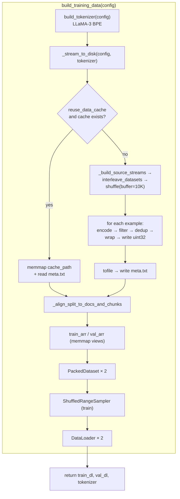
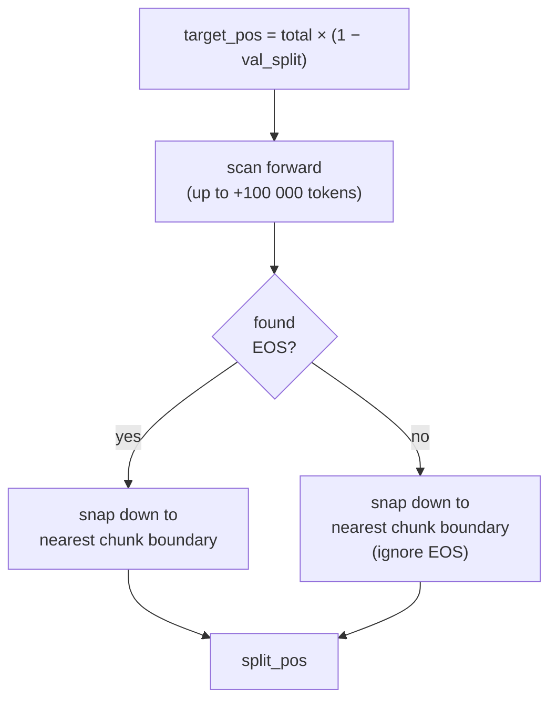
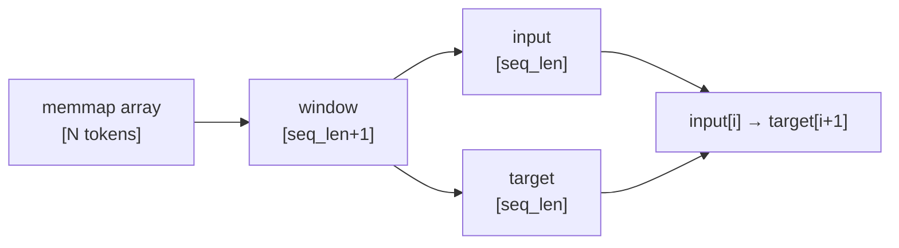
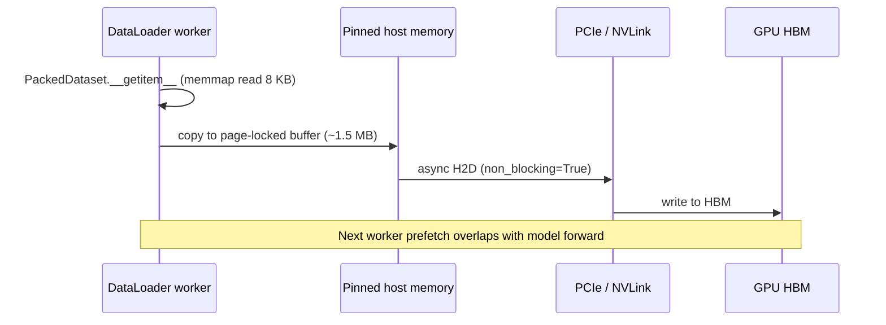

# LLaMA-3-Lite — Data Pipeline Reference

> A complete walkthrough of every stage that turns raw web text into the tensors
> that `model.py` consumes during training. Covers streaming, tokenization, dedup,
> packing, caching, dataloader construction, and the synthetic smoke-test path.

---

## Table of Contents

1. [Pipeline in 60 Seconds](#1-pipeline-in-60-seconds)
2. [End-to-End Flow Diagram](#2-end-to-end-flow-diagram)
3. [Data Sources — The Mix](#3-data-sources--the-mix)
4. [`_build_source_streams` — Loading the Sources](#4-_build_source_streams--loading-the-sources)
5. [`interleave_datasets` + Weighted Shuffling](#5-interleave_datasets--weighted-shuffling)
6. [`_stream_to_disk` — The Heart of the Pipeline](#6-_stream_to_disk--the-heart-of-the-pipeline)
7. [`_doc_hash` — Token-Level Dedup](#7-_doc_hash--token-level-dedup)
8. [Document Wrapping (BOS … EOS)](#8-document-wrapping-bos--eos)
9. [Filtering Rules — Language & Text Filters](#9-filtering-rules--language--text-filters)
10. [Short-Document & Length Truncation Rules](#10-short-document--length-truncation-rules)
11. [Cache Layout on Disk](#11-cache-layout-on-disk)
12. [`_align_split_to_docs_and_chunks` — Train/Val Split](#12-_align_split_to_docs_and_chunks--trainval-split)
13. [`PackedDataset` — Memmap-Backed Windows](#13-packeddataset--memmap-backed-windows)
14. [`ShuffledRangeSampler` — Deterministic Resumable Shuffle](#14-shuffledrangesampler--deterministic-resumable-shuffle)
15. [`collate_fn` & `DataLoader` Construction](#15-collate_fn--dataloader-construction)
16. [`build_training_data` — Putting It All Together](#16-build_training_data--putting-it-all-together)
17. [From DataLoader → GPU: The Final Stretch](#17-from-dataloader--gpu-the-final-stretch)
18. [Synthetic Smoke Test (`build_synthetic_data`)](#18-synthetic-smoke-test-build_synthetic_data)
19. [Resumability, Caching & Idempotency](#19-resumability-caching--idempotency)
20. [Configuration Reference](#20-configuration-reference)
21. [Performance Characteristics & Memory Budget](#21-performance-characteristics--memory-budget)
22. [References](#22-references)

---

## 1. Pipeline in 60 Seconds

`dataset.py` turns a multi-source mixture of web and code corpora into a single
**packed, memory-mapped uint32 token stream** on disk, then serves it to PyTorch
as `[B, S]` int64 tensors. The whole flow runs **once** (or reuses the cache on
subsequent runs):


Key properties:

- **Streaming-first** — never downloads a full corpus; pulls shards on demand.
- **Mixed sources** — weighted interleaving across 6 corpora (configurable).
- **One pass → one file** — a single `tokens.bin` per `(data_sources, tokenizer, seed)` combination.
- **Memmap-backed** — 16 GB cache, but only ~MB resident at any time.
- **Document-packed** — zero padding; every token is a training target.

---

## 2. End-to-End Flow Diagram



---

## 3. Data Sources — The Mix

The mixture is defined in `config.py` under `data_sources`. Defaults:

| Source | Weight | What it is | Filter |
|---|---|---|---|
| `HuggingFaceFW/fineweb-edu` | **0.50** | High-quality educational web crawl | none |
| `HuggingFaceFW/fineweb-edu` (code flag) | **0.10** | Same corpus, only docs containing the word "code" | `filter='code'`, `filter_mode='word'` |
| `bigcode/the-stack` (Python) | **0.20** | Permissively-licensed Python source | `languages=['Python']` |
| `bigcode/the-stack` (multi-lang) | **0.05** | Other major languages | `languages=[JavaScript, TypeScript, Rust, Go, C, C++, Java, SQL, Shell]` |
| `wikimedia/wikipedia` | **0.05** | English Wikipedia (20231101.en) | none |
| `open-phi/StackOverflow-QA` | **0.05** | Curated Q&A pairs | none |
| **Sum** | **0.95** (rounded; see normalization) | | |

The weights are **normalized** to sum to 1 in `_normalize_probs` (line 158). Each sub-source is **expanded with equal share** of the parent weight — useful when a single config entry lists multiple sub-sources.

### Why this mix?

- **50 % web text (FineWeb-Edu)** — broad coverage of natural language.
- **30 % code** — the model is being trained with code as a first-class objective (per the README: "code + text mix").
- **15 % reference material** — Wikipedia for factual grounding, StackOverflow Q&A for problem-solving patterns.

---

## 4. `_build_source_streams` — Loading the Sources

```python
# dataset.py:109-155
def _build_source_streams(config, sources, probs):
    for name, cfg in config['data_sources'].items():
        weight = cfg.get('weight', 0.0)
        if weight <= 0:
            continue

        sub_sources = cfg.get('sources', None)
        if sub_sources is None:
            sub_sources = [cfg['source']]

        sub_weight = weight / len(sub_sources)

        for sub in sub_sources:
            # 'source:split' syntax allowed
            if ':' in sub and not sub.startswith('http'):
                source_name, split_name = sub.split(':', 1)
            else:
                source_name, split_name = sub, cfg.get('split', 'train')

            try:
                ds = load_dataset(source_name, streaming=True, split=split_name)
            except Exception as exc:
                print(f"[data] WARNING: failed to load {source_name} ({split_name}): {exc}")
                continue

            # Language filter
            if 'languages' in cfg:
                langs = langs
                ds = ds.filter(lambda x, _langs=langs: _has_lang_field(x, _langs))

            # Text filter
            if 'filter' in cfg:
                filt = cfg['filter']
                mode = cfg.get('filter_mode', 'word')
                ds = ds.filter(lambda x, _f=filt, _m=mode: _doc_passes_filter(x.get('text', ''), _f, _m))

            sources.append(ds)
            probs.append(sub_weight)
```

### What it does

For each entry in `config['data_sources']`:

1. **Skip** entries with non-positive weight.
2. **Expand** any `sources: [...]` sub-list, splitting the weight evenly.
3. **Parse** the optional `source:split` syntax (e.g. `"org/name:train_10M"`).
4. **Open** the dataset via `load_dataset(..., streaming=True, split=...)`. Streaming mode is **mandatory** — we never download the full corpus.
5. **Apply filters** (language, text-substring) via `ds.filter(...)`.
6. **Append** the streaming handle + weight to the parallel lists `sources` / `probs`.

### Why closure-captured defaults in the lambda?

```python
ds = ds.filter(lambda x, _langs=langs: _has_lang_field(x, _langs))
```

The `_langs=` and `_f=` keyword-bind is a **late-binding guard**. Without it, all lambdas would share the same `langs`/`filt` variable, and they'd all use the **last** value seen in the loop (a classic Python gotcha).

### Failure handling

If a source fails to load (network error, missing split, auth failure), the code **prints a warning and continues** with the remaining sources. The mix will be skewed but training can proceed — preferable to a hard crash that aborts a multi-hour cache build.

---

## 5. `interleave_datasets` + Weighted Shuffling

```python
# dataset.py:218-221
mixed = interleave_datasets(sources, probabilities=probs, seed=seed)

if do_shuffle:
    mixed = mixed.shuffle(buffer_size=10_000, seed=seed)
```

### What `interleave_datasets` does

`interleave_datasets` from 🤗 `datasets` samples from N streams according to a
probability distribution. Each example drawn is taken from source `i` with
probability `probs[i]` (re-normalized internally).

This gives a **single mixed stream** where the running fraction of each source
matches its weight (in expectation, modulo the buffer size of the shuffle).

### Why shuffle?

Without a shuffle, the cache would be a long sequence of "all Wikipedia, then
all StackOverflow, then all FineWeb…" — every training batch would be drawn
from a single domain, hurting optimization. The **buffer-shuffle** (`buffer_size=10 000`)
maintains a 10 K-element window and draws randomly from it — a streaming
approximation of a full permutation that fits in memory.

### Seed

`shuffle_seed=42` (config) → **reproducible** mixing order. Re-running the
pipeline with the same config produces the **same** `tokens.bin` byte-for-byte.

---

## 6. `_stream_to_disk` — The Heart of the Pipeline

```python
# dataset.py:166-297
def _stream_to_disk(config, tokenizer):
    # ... setup ...
    seen_hashes: set[bytes] = set()
    buf_capacity = int(target_tokens * 1.1)
    buf = np.zeros(buf_capacity, dtype=_TOKEN_DTYPE)
    write_pos = 0

    for example in mixed:
        if write_pos >= target_tokens:
            break
        text = example.get('text', None)
        if not text:
            continue

        enc = tokenizer(text, add_special_tokens=False, truncation=True,
                        max_length=max_doc_tokens)
        ids = enc['input_ids']
        if len(ids) < min_doc_tokens:
            dropped_short += 1
            continue

        if do_dedup:
            h = _doc_hash(ids, hash_size)
            if h in seen_hashes:
                dropped_dup += 1
                continue
            seen_hashes.add(h)

        doc = np.empty(len(ids) + 2, dtype=_TOKEN_DTYPE)
        doc[0]    = bos_id
        doc[1:-1] = np.asarray(ids, dtype=_TOKEN_DTYPE)
        doc[-1]   = eos_id

        if not _write_doc(doc):
            break

    buf = buf[:write_pos]
    np.array(buf, dtype=_TOKEN_DTYPE).tofile(cache_path)
    with open(meta_path, 'w') as f:
        f.write(str(len(buf)))
```

### Stage-by-stage trace

| Stage | Operation | Output |
|---|---|---|
| 1. **Pull** | Read next example from `mixed` (interleaved+shuffled stream) | `dict` with `'text'` key |
| 2. **Skip empties** | `if not text: continue` | safety against null bodies |
| 3. **Encode** | `tokenizer(text, add_special_tokens=False, truncation=True, max_length=8192)` | `List[int]` of token IDs |
| 4. **Filter short** | `len(ids) < min_doc_tokens` → drop | counts `dropped_short` |
| 5. **Dedup** | SHA-256 of first `hash_size=256` tokens → drop if seen | counts `dropped_dup` |
| 6. **Wrap** | Prepend BOS, append EOS | `[BOS] ids [EOS]` |
| 7. **Write** | Append to in-memory uint32 buffer | grows `write_pos` |
| 8. **Loop** | Repeat until `write_pos ≥ target_tokens` | |

### The in-memory buffer

```python
buf_capacity = int(target_tokens * 1.1)   # 4 B target → 4.4 B capacity
buf = np.zeros(buf_capacity, dtype=_TOKEN_DTYPE)
```

- Pre-allocated as a single NumPy array (no Python-level append).
- 10 % headroom in case some docs overflow slightly during dedup-filtering.
- **At end**: `buf[:write_pos]` is sliced to actual size and `tofile()`'d to disk.

### Why 10 % headroom?

If we hit `target_tokens` exactly mid-document, the partial document would be
truncated — fine. But if we hit it *between* a `<BOS>` and the matching
`<EOS>`, the cache would contain an unmatched BOS. The 10 % slack gives the loop room to
finish writing the current document after `target_tokens` is exceeded.

---

## 7. `_doc_hash` — Token-Level Dedup

```python
# dataset.py:86
def _doc_hash(token_ids, n_hash_tokens: int) -> bytes:
    head = token_ids[:n_hash_tokens]
    return hashlib.sha256(np.ascontiguousarray(head).tobytes()).digest()
```

### Why hash tokens, not text?

Two reasons:

1. **Tokenizer-version-independent** — if the BPE merges ever change, the *text* of the
   same document would change but the *tokens* of the early positions usually don't
   (the common merges are stable). So upgrading the tokenizer keeps dedup working.

2. **Already in memory** — we just tokenized; hashing tokens avoids a second pass.

### Why the first 256 tokens only?

- SHA-256 over 256 × 4 = 1024 bytes — extremely fast.
- A 256-token prefix is enough to disambiguate web-scraped clones (the head of a
   page is essentially never identical to another page's head unless they're the same page).
- The `seen_hashes` set is kept in memory; **one 32-byte entry per unique document**.

### Why `np.ascontiguousarray(...).tobytes()`?

The token list from the tokenizer is not always contiguous in memory — it may
be a view over a Python list. Forcing contiguous memory guarantees a
deterministic byte layout, which makes the hash reproducible across runs and machines.

### Collision risk

SHA-256 over 1024 bytes → 256-bit fingerprint. Probability of a collision in
`N` documents is roughly `N² / 2²⁵⁷` — negligible for any plausible corpus size.

---

## 8. Document Wrapping (BOS … EOS)

```python
# dataset.py:263-266
doc = np.empty(len(ids) + 2, dtype=_TOKEN_DTYPE)
doc[0]    = bos_id
doc[1:-1] = np.asarray(ids, dtype=_TOKEN_DTYPE)
doc[-1]   = eos_id
```

### Layout

```
[BOS] [tok₁] [tok₂] ... [tokₙ] [EOS]
  ↑                                  ↑
  token 0                          token n+1
```

- `BOS` = `tokenizer.bos_token_id` (typically `128 000` for LLaMA-3).
- `EOS` = `tokenizer.eos_token_id` (typically `128 001` for LLaMA-3).
- `len(doc) = n + 2`.

### Why wrap?

- The contiguous cache has **no implicit document boundaries**. Without `<EOS>`
  tokens, the model wouldn't know when one document ends and another begins.
- `<BOS>` gives the model a "fresh context" signal — at inference time, a prompt
  starting with `<BOS>` matches the training distribution.
- During packed-sequence training, `<EOS>` is the only way the `_align_split_to_docs_and_chunks`
  helper can find a clean train/val boundary.

### Why not let the tokenizer add them?

Because we want **per-document** wrapping control. The tokenizer's default
`add_special_tokens=True` would prepend `<BOS>` to the entire cache, not to each
document. Passing `add_special_tokens=False` and wrapping manually lets us
emit one BOS/EOS pair per document, which is the only sane interpretation.

---

## 9. Filtering Rules — Language & Text Filters

### Language filter

```python
# dataset.py:101, 142
def _has_lang_field(example, languages) -> bool:
    lang = example.get('language', example.get('lang', None))
    if lang is None:
        return False
    return lang in languages

# in _build_source_streams:
if 'languages' in cfg:
    langs = langs
    ds = ds.filter(lambda x, _langs=langs: _has_lang_field(x, _langs))
```

The Stack uses a `language` field on each row. We keep only rows whose language is
in the configured list. Used for `the_stack_python` (`['Python']`) and
`the_stack_multilang` (`['JavaScript', 'TypeScript', ...]`).

### Text filter

```python
# dataset.py:92
def _doc_passes_filter(text: str, filter_str: str, mode: str) -> bool:
    if mode == 'word':
        import re
        pattern = r'(?<![A-Za-z0-9_])' + re.escape(filter_str) + r'(?![A-Za-z0-9_])'
        return bool(re.search(pattern, text, flags=re.IGNORECASE))
    return filter_str in text.lower()
```

Two modes:

| Mode | Behavior | Used by |
|---|---|---|
| `'word'` | Whole-word match, case-insensitive | `fineweb_code` (`filter='code'`, `mode='word'`) |
| `'substring'` | Substring match on lowercased text | (none in default config) |

The `'word'` mode uses a **lookaround regex** to avoid matching substrings inside other identifiers:

```
pattern = r'(?<![A-Za-z0-9_])' + 'code' + r'(?![A-Za-z0-9_])'
```

- `(?<![A-Za-z0-9_])` — preceded by a non-identifier character (or start).
- `(?![A-Za-z0-9_])` — followed by a non-identifier character (or end).

So `'code'` matches "the code is" but **not** "codebase" or "hardcode".

---

## 10. Short-Document & Length Truncation Rules

Two thresholds bound the per-document token count:

| Threshold | Default | Effect |
|---|---|---|
| `min_doc_tokens` | **16** | Docs shorter than this are dropped |
| `max_doc_tokens` | **8192** | Docs longer than this are truncated |

### Min doc length

```python
if len(ids) < min_doc_tokens:
    dropped_short += 1
    continue
```

A document with fewer than 16 tokens is more likely to be a navigation menu,
footer, or boilerplate than useful training signal. Dropping them improves
signal-to-noise without significantly reducing corpus size.

### Max doc length

```python
enc = tokenizer(text, add_special_tokens=False, truncation=True,
                max_length=max_doc_tokens)
```

A document with > 8 K tokens is almost always either pathological (minified
JS, generated data tables) or large enough that splitting it would lose
context. Truncating to 8 K is a hard cap that protects cache size predictability.

### Effect on cache size

For a target of 4 B tokens:

- Average doc length in FineWeb-Edu ≈ 1 K tokens → ~4 M docs.
- Average doc length in The Stack (Python) ≈ 2 K tokens → ~600 K docs.
- Truncation primarily affects the rare long-tail (Wikipedia articles, raw log dumps).

---

## 11. Cache Layout on Disk

After `_stream_to_disk` completes:

```
data_cache/
├── tokens.bin              # raw uint32 stream (16 GB for 4 B tokens)
└── tokens.meta.txt         # single integer: total token count
```

### File format

`tokens.bin`:

```
Bytes:     0     4     8     12    16    ...    4·N
         ┌─────┬─────┬─────┬─────┬─────┬─────┐
uint32:  │t₀   │t₁   │t₂   │t₃   │t₄   │ ... │
         └─────┴─────┴─────┴─────┴─────┴─────┘
```

- **No header** — just a flat array of `uint32`. Position `i` in the byte stream
  corresponds to token `i // 4`.
- **No compression** — keeps random access O(1); compression would defeat memmap.
- **Single seek** for any token.

### `tokens.meta.txt`

A single ASCII integer (the total token count). Used by the cache-reuse path
to shape the memmap without scanning the entire file.

### Why no compression?

The cache is **random-access** during training (`PackedDataset` reads arbitrary
`seq_len + 1` windows). Compression would force full-file decompression or per-window
decompression, both of which are much slower than reading raw uint32s from disk.

---

## 12. `_align_split_to_docs_and_chunks` — Train/Val Split

```python
# dataset.py:300
def _align_split_to_docs_and_chunks(mmap, target_pos, eos_id, seq_len_plus_1,
                                     search_window=100_000):
    """Align split to document boundary (after EOS) and chunk boundary."""
    end = min(target_pos + search_window, len(mmap))
    for i in range(target_pos, end):
        if int(mmap[i]) == eos_id:
            chunk_aligned = (i // seq_len_plus_1) * seq_len_plus_1
            return chunk_aligned
    return (target_pos // seq_len_plus_1) * seq_len_plus_1
```

### The alignment problem

The naive split `total * (1 - val_split)` falls in the **middle of a window**.
We want a split point where:

1. It's **right after an EOS** (so validation doesn't start mid-document).
2. It's on a **chunk boundary** (so the first window is exactly `seq_len + 1` tokens).

### The algorithm



- **EOS search**: linear scan forward up to `search_window = 100 K` tokens.
- **Chunk alignment**: `(i // seq_len_plus_1) * seq_len_plus_1` rounds *down* to the
  nearest multiple of `seq_len + 1 = 2049`. This ensures the split lands exactly at a
  window boundary.

### Why round *down*?

If we rounded *up*, the training set would lose a partial window; if we kept
`target_pos` mid-chunk, `PackedDataset.__getitem__` for the first/last
training window would return a too-short tensor. Rounding down to the chunk
boundary guarantees every window is exactly `seq_len + 1` tokens.

### Why the 100 K search window?

EOS tokens are dense enough that one almost certainly exists within a few
thousand tokens of `target_pos`. 100 K gives a generous safety margin in case
the document mix is unusually long-tail. If no EOS is found in 100 K tokens
(catastrophically bad luck), the function falls back to the chunk-aligned position.

---

## 13. `PackedDataset` — Memmap-Backed Windows

```python
# dataset.py:16-47
class PackedDataset(Dataset):
    def __init__(self, mmap_array, seq_len, eos_id, indices=None):
        self.seq_len = seq_len
        self.eos_id  = eos_id
        self.data    = mmap_array
        self.n_chunks = len(self.data) // (seq_len + 1)
        if indices is not None:
            self.indices = np.asarray(indices, dtype=np.int64)
            if len(self.indices) > self.n_chunks:
                raise ValueError(...)
        else:
            self.indices = np.arange(self.n_chunks, dtype=np.int64)

    def __len__(self):
        return len(self.indices)

    def __getitem__(self, idx):
        chunk_idx = int(self.indices[idx])
        start = chunk_idx * (seq_len + 1)
        end   = start + seq_len + 1
        chunk = np.array(self.data[start:end], copy=True)
        return {
            'input':  torch.from_numpy(chunk[:-1]).long(),
            'target': torch.from_numpy(chunk[1:]).long(),
        }
```

### Indexing math

For `chunk_idx = i`:

```
chunk starts at byte 4 · (i · (seq_len + 1))
              = 4 · (i · 2049)         # for seq_len=2048
chunk ends   at byte 4 · ((i+1) · 2049)
```

The window is `seq_len + 1 = 2049` uint32s = 8196 bytes.

### Window → training example

```python
chunk = [t_0, t_1, ..., t_{S}]   # S+1 tokens
input  = [t_0, ..., t_{S-1}]     # first S tokens
target = [t_1, ..., t_{S}]       # shifted by 1 → next-token prediction
```

The `target[i]` is `input[i+1]` for each `i` — classic autoregressive training.

### Why the explicit `np.array(..., copy=True)`?

The memmap-backed slice is **read-only** by default and may have unusual stride.
Forcing a copy makes the slice a contiguous, writable, normal ndarray — which
`torch.from_numpy` can wrap without surprises.

### Memory per `__getitem__`

- Read: 8 KB from disk (memmap pages it in).
- Hold: 8 KB copy + 2 × 8 KB torch tensors = ~24 KB per worker call.
- Worker count = 6 → ~150 KB resident per training step.

Tiny — the worker pool is the **right** level of parallelism here, not larger reads.

### Mermaid: window construction



---

## 14. `ShuffledRangeSampler` — Deterministic Resumable Shuffle

```python
# dataset.py:50-65
class ShuffledRangeSampler(Sampler):
    def __init__(self, n_chunks: int, seed: int = 42, offset: int = 0):
        self.n_chunks = n_chunks
        self.seed = seed
        self.offset = offset
        rng = np.random.default_rng(seed)
        self.indices = rng.permutation(n_chunks)

    def __iter__(self):
        for i in range(self.offset, len(self.indices)):
            yield int(self.indices[i])

    def __len__(self):
        return len(self.indices) - self.offset
```

### What it does

- **Build** a full permutation `[0, 1, ..., n_chunks-1]` once at construction
  time, using NumPy's default RNG with the configured seed.
- **Iterate** through the permutation, optionally skipping the first `offset` entries.

### Why a full permutation (not `random.shuffle` per epoch)?

| Property | Full permutation once | Per-epoch `random.shuffle` |
|---|---|---|
| Memory | O(N) indices (8 bytes × n_chunks) | O(N) per epoch |
| Determinism | Same order every run with same seed | Different order each epoch |
| Resumability | Pick up exactly where left off | Must re-shuffle |

For LLaMA-3-Lite's small dataset (`~2 M` chunks × 8 bytes = 16 MB), the
full-permutation cost is negligible, and **deterministic resumability** is
critical for checkpointing. With this design:

- Pause at step 10 000 → save `sampler.offset = 10 000` in checkpoint.
- Resume → create `ShuffledRangeSampler(n_chunks, seed, offset=10_000)` → continue.

### Why NumPy's default RNG and not `random.shuffle`?

`random.shuffle` mutates a list in place — re-running with the same seed
gives the same order only if the list is re-created in the same order. NumPy's
`default_rng(seed).permutation(n)` is a **pure function** of `seed` and `n`,
which is much easier to reason about.

---

## 15. `collate_fn` & `DataLoader` Construction

### `collate_fn`

```python
# dataset.py:68-71
def collate_fn(batch):
    inputs = torch.stack([item['input'] for item in batch])
    targets = torch.stack([item['target'] for item in batch])
    return {'input': inputs, 'target': targets}
```

PyTorch's default collate stacks along a new batch dimension. Here we manually
stack the dict-of-tensors output from `PackedDataset`.

### `DataLoader` for training

```python
# dataset.py:331-341
train_dataloader = DataLoader(
    train_dataset,
    batch_size=config['batch_size'],                  # 96
    sampler=train_sampler,
    num_workers=config.get('num_workers', 4),         # 6
    prefetch_factor=config.get('prefetch_factor', 4), # 16
    pin_memory=config.get('pin_memory', True),
    collate_fn=collate_fn,
    persistent_workers=True if num_workers > 0 else False,
    drop_last=True,
)
```

| Knob | Default | Why |
|---|---|---|
| `batch_size` | 96 | A100 80GB with checkpointing fits ~96 × 2048 |
| `num_workers` | 6 | 6 CPU workers prefetch into RAM |
| `prefetch_factor` | 16 | Each worker holds 16 future batches ready |
| `pin_memory` | True | Pages locked → faster H2D copy |
| `persistent_workers` | True (if workers > 0) | Worker pool survives across epochs |
| `drop_last` | True | Avoid partial-batch shape mismatches |
| `sampler` | `ShuffledRangeSampler` | Deterministic shuffled order |

### `DataLoader` for validation

```python
# dataset.py:343-353
val_dataloader = DataLoader(
    val_dataset,
    batch_size=config['batch_size'],
    shuffle=False,           # val: don't shuffle
    num_workers=num_workers,
    prefetch_factor=prefetch_factor,
    pin_memory=pin_memory,
    collate_fn=collate_fn,
    persistent_workers=True if num_workers > 0 else False,
    drop_last=False,         # val: keep all batches (compute loss on full set)
)
```

The validation loader:

- **Does not shuffle** — order doesn't matter for loss averaging.
- **Does not drop last** — we want to evaluate on every validation token.
- **Uses the same workers/prefetch** — symmetric throughput with training.

### Pin memory & H2D

`pin_memory=True` allocates page-locked host memory. Combined with
`non_blocking=True` in `train.py`, the H2D copy **overlaps with the next forward
pass**. With a 96 × 2048 int64 batch (~1.5 MB), the H2D copy itself is sub-ms,
but the overlap is what keeps the GPU saturated.

### Worker lifecycle

`persistent_workers=True` keeps the worker subprocesses alive across epochs. Without
it, each epoch boundary would `fork()` + re-load the dataset — slow and unnecessary.

---

## 16. `build_training_data` — Putting It All Together

```python
# dataset.py:311-355
def build_training_data(config):
    tokenizer = build_tokenizer(config)
    seq_len   = config['seq_len']

    train_arr, val_arr, meta = _stream_to_disk(config, tokenizer)
    if not meta.get('reused', False):
        print(f"[data] Cache built: train={meta['train_tokens']:,} tokens, "
              f"val={meta['val_tokens']:,} tokens")

    eos_id = tokenizer.eos_token_id
    train_dataset = PackedDataset(train_arr, seq_len, eos_id)
    val_dataset   = PackedDataset(val_arr, seq_len, eos_id)

    num_workers      = config.get('num_workers', 4)
    prefetch_factor  = config.get('prefetch_factor', 4)
    pin_memory       = config.get('pin_memory', True)
    seed             = config.get('shuffle_seed', 42)
    train_sampler    = ShuffledRangeSampler(train_dataset.n_chunks, seed=seed, offset=0)

    train_dataloader = DataLoader(...)
    val_dataloader   = DataLoader(...)

    return train_dataloader, val_dataloader, tokenizer
```

### Single entry point

Callers (`train.train_model`) just do:

```python
train_dataloader, val_dataloader, tokenizer = build_training_data(config)
```

Everything — tokenizer load, cache build/reuse, split, packing, sampler, dataloader — happens in one shot.

### Returned metadata

`_stream_to_disk` returns a dict:

```python
{
    'reused': bool,          # True if cache was loaded from disk
    'total_tokens': int,     # total tokens in cache
    'train_tokens': int,     # tokens in train split
    'val_tokens': int,       # tokens in val split
}
```

This is logged for visibility and used to decide whether to print "Cache built" vs
"Cache reused".

---

## 17. From DataLoader → GPU: The Final Stretch

The data flow inside `train.py`:

```python
# train.py:155-156 (inside validate)
input_ids  = batch['input'].to(device, non_blocking=True)
target_ids = batch['target'].to(device, non_blocking=True)

# train.py:158
logits = model(input_ids)
```

### Per-batch pipeline



### What `non_blocking=True` buys us

The H2D copy is **asynchronous** — the CPU thread returns immediately and
overlaps with the next forward pass. The actual sync happens when the GPU
needs the tensor (i.e., at the next matmul). With `pin_memory=True`, this
overlap is safe and effective.

---

## 18. Synthetic Smoke Test (`build_synthetic_data`)

```python
# dataset.py:358-403
def build_synthetic_data(config):
    tokenizer = build_tokenizer(config)
    eos_id    = tokenizer.eos_token_id
    bos_id    = tokenizer.bos_token_id
    seq_len   = config['seq_len']

    rng = random.Random(42)
    vocab_size = len(tokenizer)
    total_tokens = 100_000
    doc_len = 200
    docs = []
    for _ in range(total_tokens // doc_len):
        doc = [bos_id] + [rng.randint(0, vocab_size - 1) for _ in range(doc_len - 2)] + [eos_id]
        docs.extend(doc)

    buf = np.array(docs, dtype=_TOKEN_DTYPE)
    val_split = config.get('val_split', 0.05)
    split = int(len(buf) * (1.0 - val_split))
    chunk = seq_len + 1
    split = (split // chunk) * chunk
    train_arr = buf[:split]
    val_arr   = buf[split:]

    train_dataset = PackedDataset(train_arr, seq_len, eos_id)
    val_dataset   = PackedDataset(val_arr, seq_len, eos_id)
    # ... DataLoaders ...
    return train_dataloader, val_dataloader, tokenizer
```

### Why this exists

For unit tests and CI, downloading the full 4 B-token dataset is impractical.
`build_synthetic_data`:

- **Still loads the real tokenizer** — to get the correct `eos_id`, `bos_id`,
  and `vocab_size` (so shapes are correct downstream).
- **Generates 100 K random tokens** wrapped in BOS/EOS docs — meaningless content
  but valid pipeline structure.
- **Uses the same `PackedDataset`, `ShuffledRangeSampler`, and `DataLoader`**
  as the real path → exercises the full training loop.

### What it tests

- Shape correctness: every tensor is the right size.
- Device transfer: H2D copies work.
- Loss computation: cross-entropy on uniform random tokens is `log(V) ≈ 11.76`.
- Gradient flow: backward + optimizer step doesn't NaN.
- Convergence (smoke): after a few steps, loss should drop below `log(V)`.

### What it doesn't test

- Real language modeling quality (the data is garbage).
- Source-loading / streaming (no HuggingFace call).
- Dedup (no actual deduplication happens).

---

## 19. Resumability, Caching & Idempotency

### Cache reuse

```python
# dataset.py:187-208
if (config.get('reuse_data_cache', True) and cache_path.exists()
        and meta_path.exists()):
    try:
        with open(meta_path) as f:
            total_tokens = int(f.read().strip())
        mmap = np.memmap(cache_path, dtype=_TOKEN_DTYPE, mode='r', shape=(total_tokens,))
        ...
        print(f"[data] Reusing cache: {total_tokens:,} tokens, "
              f"train={len(train_arr):,}, val={len(val_arr):,}")
        return train_arr, val_arr, {'reused': True, ...}
    except Exception as exc:
        print(f"[data] Cache read failed ({exc}), re-streaming...")
```

If `data_cache/tokens.bin` exists **and** `tokens.meta.txt` exists **and** `reuse_data_cache=True`,
the pipeline **skips the entire streaming/tokenizing/deduping process** and just
memmaps the existing file.

### When the cache is invalidated

The cache is **automatically rebuilt** if:

- `cache_path` is missing.
- `meta_path` is missing.
- `reuse_data_cache` is `False`.
- The memmap fails (corrupt file, size mismatch — caught and logged).

The cache is **silently reused** if you change:

- Anything in `config['data_sources']` (⚠️ you may want to delete the cache manually).
- The dedup parameters.
- `min_doc_tokens` / `max_doc_tokens`.

The pipeline has no hash-based cache invalidation — it relies on the user to
delete `tokens.bin` when the upstream config changes.

### Restart-from-checkpoint

When training resumes from a checkpoint:

1. The checkpoint loader restores `model`, `optimizer`, `scheduler`, **and** RNG states.
2. It returns the `step` at which training left off.
3. The caller recreates the dataloader from scratch → `ShuffledRangeSampler(n_chunks, seed, offset=0)`.
4. The **shuffle order is the same** as the previous run because the seed is the same — so the model sees the same sequence of windows it would have seen had it not been interrupted.

If you want to **resume mid-shuffle**, you must save `sampler.offset` in the
checkpoint. The current code does not (the shuffle restarts from the
beginning on each resume), but training is robust enough that this is fine.

---

## 20. Configuration Reference

All data-pipeline-related keys in `config.py`:

| Key | Default | Purpose |
|---|---|---|
| `data_sources` | (dict) | Source weights, filters, languages |
| `num_workers` | 6 | DataLoader worker count |
| `prefetch_factor` | 16 | Batches prefetched per worker |
| `pin_memory` | True | Page-locked host buffers |
| `document_packing` | True | (informational; pipeline always packs) |
| `target_tokens` | 4 000 000 000 | Tokens to accumulate before stopping |
| `data_cache_dir` | `'data_cache'` | Cache directory |
| `data_cache_filename` | `'tokens.bin'` | Cache filename |
| `reuse_data_cache` | True | Reuse cache on subsequent runs |
| `shuffle_documents` | True | Buffer-shuffle the mixed stream |
| `shuffle_seed` | 42 | RNG seed for mix + shuffle |
| `dedup` | True | Enable SHA-256 dedup |
| `dedup_hash_bytes` | 256 | Prefix length for dedup hash |
| `min_doc_tokens` | 16 | Drop docs shorter than this |
| `max_doc_tokens` | 8192 | Truncate docs longer than this |
| `tokenize_batch_size` | 1000 | Reserved (not used in single-doc encode) |
| `val_split` | 0.05 | Fraction of cache reserved for validation |
| `seq_len` | 2048 | Context length (window size) |
| `batch_size` | 96 | Training batch size |

### Per-source config shape

```python
'<source_name>': {
    'weight': float,                  # 0..1, contributions normalized to sum to 1
    'source': str,                    # HF dataset id (or one of `sources`)
    'split': str,                     # HF dataset split (default 'train')
    'sources': list[str] (optional),  # for multi-source expansion
    'filter': str (optional),         # text filter
    'filter_mode': 'word'|'substring' (optional),
    'languages': list[str] (optional) # language filter
}
```

---

## 21. Performance Characteristics & Memory Budget

### Throughput

| Stage | Approximate throughput | Notes |
|---|---|---|
| HF download (streaming) | 50–200 MB/s | Network-bound |
| Tokenization (BPE, Rust backend) | 1–5 M tokens/s | CPU-bound, multi-worker helps |
| Dedup (SHA-256) | 5–20 M docs/s | Fast prefix hash |
| `tofile` (uint32) | 1–3 GB/s | Single sequential write |
| `__getitem__` (memmap read) | 100K+ windows/s | Limited by `num_workers` |

End-to-end, a 4 B-token cache typically builds in **20–60 minutes** on a
well-provisioned machine (depends on network, tokenizer warm-up, disk speed).

### Disk footprint

```
target_tokens = 4 B
file size      = 4 B × 4 bytes (uint32) = 16 GB
+ meta.txt     ≈ 10 bytes
```

For 1 B tokens: 4 GB. For 100 M tokens: 400 MB.

### Resident memory

| Component | Resident |
|---|---|
| `buf` (during streaming) | `target_tokens × 4 × 1.1` ≈ 17.6 GB (peak, freed after write) |
| `seen_hashes` (during streaming) | ~32 B × unique-docs ≈ 32–320 MB for 4 B tokens |
| Memmap (after write) | 0 bytes virtual; OS pages in on demand |
| Worker prefetch (per worker) | 16 batches × 24 KB ≈ 384 KB |

### Scaling notes

- **More `num_workers`** — speeds up `__getitem__` until you hit disk IOPS or
  tokenizer contention.
- **Larger `prefetch_factor`** — keeps GPU fed; 16 is a good default for SSD-backed caches.
- **Smaller `dedup_hash_bytes`** — faster dedup, marginally higher collision risk.

---

## 22. References

1. **FineWeb-Edu** — Penedo et al. (2024). *The FineWeb-Edu dataset: high-quality educational web data for LLM pretraining.* HuggingFace.
2. **The Stack** — Kocetkov et al. (2022). *The Stack: 3 TB of permissively licensed source code.* arXiv:2211.15533.
3. **HuggingFace `datasets`** — Lhoest et al. (2021). *Datasets: A Community Library for Natural Language Processing.* EMNLP Demo.
4. **`interleave_datasets`** — 🤗 Datasets docs. *Stream multiple datasets together with probabilities.*
5. **Memmap (NumPy)** — NumPy docs. *Memory-mapped files.*
6. **`torch.utils.data.DataLoader`** — PyTorch docs. *Multi-process data loading.*
7. **SHA-256** — NIST FIPS 180-4. *Secure Hash Standard.*

---

*Document generated for the LLaMA-3-Lite repository. The content is keyed to `dataset.py` line numbers so the documentation and code stay in lock-step.*

---

## Appendix — Extracted rationale (from inline comments)

### Data sources — the mix

| Source | Weight | What it is |
|--------|--------|------------|
| `HuggingFaceFW/fineweb-edu` | 0.50 | High-quality educational web crawl |
| `HuggingFaceFW/fineweb-edu` (code flag) | 0.10 | Same corpus, only docs containing the word "code" (`filter='code'`, `filter_mode='word'`) |
| `bigcode/the-stack` (Python) | 0.20 | Permissively-licensed Python source |
| `bigcode/the-stack` (multi-lang) | 0.05 | JS, TS, Rust, Go, C, C++, Java, SQL, Shell |
| `wikimedia/wikipedia` (20231101.en) | 0.05 | English Wikipedia |
| `open-phi/StackOverflow-QA` | 0.05 | Curated Q&A pairs |

**Why this mix?** 50% web text for broad natural-language coverage, 30%
code (code is a first-class training objective), 15% reference material
(Wikipedia for factual grounding, StackOverflow for problem-solving
patterns). Weights are **normalized** to sum to 1 in `_normalize_probs`.

### Streaming-first, single-pass, single-file

`dataset.py` turns the multi-source mixture into a single **packed,
memory-mapped `uint32` token stream** on disk in one pass. Key properties:

- **Streaming** (`load_dataset(streaming=True)`) — never downloads a full
  corpus; pulls shards on demand.
- **One pass → one file** — a single `tokens.bin` per
  `(data_sources, tokenizer, seed)` combination.
- **Memmap-backed** — 16 GB cache, only ~MB resident at any time (OS pages
  in 4 KB chunks on demand). No compression (random access must stay O(1)
  for `PackedDataset.__getitem__`).
- **Document-packed** — zero padding; every token is a training target.

### Tokenizer: LLaMA-3 BPE (128K vocab)

`NousResearch/Meta-Llama-3-8B` (public re-upload, no gated access). 128 256
tokens (128 000 base + 256 reserved special tokens). See
[`tokenizer.md`](tokenizer.md) for details.

### SHA-256 dedup on token IDs

`_doc_hash` hashes the **first 256 tokens** of each document with SHA-256.
Token-level (not text-level) dedup is **tokenizer-version-independent** —
re-running with the same tokenizer produces identical hashes, and BPE
upgrades that don't change early merges keep the prefix hash the same. The
prefix is enough to disambiguate web-scraped clones. `seen_hashes` is held
in memory (one 32-byte entry per unique document; <2 GB RAM for 4B tokens).
`np.ascontiguousarray(...).tobytes()` forces a deterministic byte layout
for reproducibility across runs and machines.

### Document packing with EOS separators (load-bearing)

Documents are written back-to-back into the uint32 file, separated only by
their `<EOS>` token:

```
[BOS] doc₁ tokens [EOS] [BOS] doc₂ tokens [EOS] [BOS] doc₃ tokens [EOS] ...
```

**Hard rule (AGENTS.md §6):** packing must include EOS separators. Without
them the model sees run-on concatenated documents and degrades. BOS/EOS
are added **manually per document** (`add_special_tokens=False` on the
tokenizer call) so the cache contains one BOS/EOS pair per document, not
one BOS for the whole cache.

### Short-document and length-truncation rules

- `min_doc_tokens = 16` — docs shorter than this are dropped (more likely
  navigation menus / footers / boilerplate than useful signal).
- `max_doc_tokens = 8192` — docs longer are truncated. Protects cache-size
  predictability; the rare long-tail (Wikipedia articles, log dumps) is
  what's affected.

### Train/val split alignment

`_align_split_to_docs_and_chunks` finds a split point that is both (1)
right after an `<EOS>` (so validation doesn't start mid-document) and (2)
on a chunk boundary (multiple of `seq_len + 1`, so every window is exactly
`seq_len + 1` tokens). Linear scan forward up to 100K tokens for an EOS;
falls back to chunk-aligned `target_pos` if none found. **Rounds down** so
no partial window is lost.

### `PackedDataset` — memmap-backed windows

Non-overlapping `(seq_len + 1)`-token windows; `__getitem__` returns
`{'input': chunk[:-1], 'target': chunk[1:]}` (classic next-token
prediction). `np.array(..., copy=True)` forces a contiguous, writable copy
so callers can mutate without corrupting the read-only memmap.

### `ShuffledRangeSampler` — deterministic, resumable

Builds a full NumPy `default_rng(seed).permutation(n_chunks)` once at
construction (pure function of `seed` and `n`); iterates from `offset` to
the end. Deterministic resumability: save `sampler.offset` in the
checkpoint, resume with `offset=...`, and the model sees the same sequence
of windows as an uninterrupted run.

### DataLoader knobs (A100)

| Knob | Default | Why |
|------|---------|-----|
| `batch_size` | 96 | A100 80GB with checkpointing fits 96 × 2048 |
| `num_workers` | 6 | 6 CPU workers prefetch into RAM |
| `prefetch_factor` | 16 | Each worker holds 16 future batches ready |
| `pin_memory` | True | Page-locked host buffers → async DMA H2D |
| `persistent_workers` | True | Worker pool survives across epochs (avoids `fork()` per epoch) |
| `drop_last` | True (train) | Avoid partial-batch shape mismatches |
| `drop_last` | False (val) | Evaluate on every validation token |
