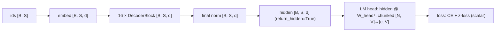

# Glossary — Notation, Acronyms, Config Keys, and File Layout

> Audience: all levels. This is the shared vocabulary of every doc in this
> tree. When any other doc uses a symbol or acronym, it means what it means
> here. All values are the project's actual configuration from
> `config.py:get_config` unless marked `[INFERENCE]`.

## The 60-second summary

LLaMA-3-Lite is a 515M-parameter, decoder-only, LLaMA-3-style transformer:
16 layers, d_model 1024, 8 query heads with 4 KV heads (GQA), SwiGLU feedforward
of width 4096, RoPE with θ = 500K, and a 128K vocabulary. One training step
consumes `B × S = 96 × 2048 = 196,608` tokens (`model.py:Transformer.forward`).
The docs use a fixed set of symbols (`B`, `S`, `V`, `d`, `N`, ...), a fixed set
of tensor-shape conventions (`[B, S, d]` hidden states, `[N, V]` logits), and a
fixed set of acronyms (GQA, RoPE, RMSNorm, SwiGLU, FA2, BF16, ...). This file
is the lookup table for all of them, plus a one-line map of every config key
and every top-level file. The full key-by-key rationale lives in
[`config.md`](../reference/config.md).

## 1. Notation

| Symbol | Meaning | Value at this scale |
|---|---|---|
| $B$ | batch size (micro-batch, sequences per step) | `batch_size = 96` |
| $S$ | sequence length (window per sequence) | `seq_len = 2048` |
| $N$ | tokens per optimizer step, $N = B \cdot S \cdot \text{grad\_accum}$ | 196,608 (grad_accum = 1) |
| $V$ | vocabulary size | `vocab_size = 128000` |
| $d$, $d_{\text{model}}$ | hidden / residual-stream width | `d_model = 1024` |
| $d_{\text{ff}}$ | SwiGLU feedforward width (each of gate/up) | `d_ff = 4096`; fused `gate_up_proj` is $2 d_{\text{ff}} = 8192$ wide |
| $n_{\text{heads}}$ | number of query heads | `n_heads = 8` |
| $n_{\text{kv}}$ | number of KV heads (GQA) | `n_kv_heads = 4` |
| $h$ | head dimension | `head_dim = 128`; $d = n_{\text{heads}} \cdot h$ |
| $n_{\text{rep}}$ | KV expansion factor, $n_{\text{heads}} / n_{\text{kv}}$ | `n_rep = 2` (eager repeat in `model.py:GroupedQueryAttention`) |
| $L$ | number of decoder layers | `n_layers = 16` |
| $\theta$ | RoPE base frequency | `rope_theta = 500000.0` |
| $P$ | total parameter count | 513.8M; 251.7M non-embedding (`model.py:Transformer.get_num_params`) |
| $T$ | total tokens seen over the run | $42{,}000 \times 196{,}608 \approx 8.26\text{B}$ (target `target_tokens = 8B`) |
| $t$ | optimizer step index | $0 \ldots$ `max_steps - 1 = 41999` |
| $\eta$ | learning rate | `3e-4` peak, cosine-decayed to `min_lr = 3e-5` |
| $\mathcal{L}_{\text{CE}}$ | cross-entropy loss (mean over non-ignored tokens) | — |
| $L_z$ | z-loss, $L_z = \operatorname{mean}\left((\log \sum_v e^{z_v})^2\right)$ | weighted by `z_loss_weight = 1e-4` |
| $\log Z$ | log-partition $\log \sum_v e^{z_v}$ (logsumexp) of one token's logits; what z-loss squares | — |
| $\lambda_z$ | z-loss weight | `z_loss_weight = 1e-4` |
| $c$ | CE chunk size (rows of logits materialized at once) | `ce_chunk_size = 256` |
| $\gamma$ | EMA decay | `ema_decay = 0.999` |
| $g_{\max}$ | gradient-norm clip threshold | `max_grad_norm = 1.0` |
| $\epsilon$ | AdamW epsilon | `eps = 1e-8` |
| $\varepsilon_{\text{rms}}$ | RMSNorm epsilon | `rms_norm_eps = 1e-5` |
| grad_accum | gradient-accumulation steps per optimizer step | `gradient_accumulation = 1` |
| tokens_seen | cumulative tokens consumed, $t \cdot N$ | logged as `train/tokens_seen` |
| tokens_per_sec | throughput, $N / \text{step\_time}$ | logged as `train/tokens_per_sec` |

Conventions: a bare `d` means `d_model`; `N` is always the *flattened* token
axis ($N = B \cdot S$ for the training loss), never a model size. When grad
accumulation > 1, the loss is divided by grad_accum before `backward`, and
`tokens_seen` counts `grad_accum × B × S` per step (`train.py:train_model`).

### Tensor-shape conventions

- `[B, S]` — token-id tensors (`input` / `target` from
  `data/shared_data/loader.py:collate_fn`).
- `[B, S, d]` — hidden states at every point of the residual stream.
- `[B, n_heads, S, h]` — query tensor after `model.py:GroupedQueryAttention`
  projection + transpose + RoPE; keys/values are `[B, n_kv, S, h]` before the
  `n_rep` expansion.
- `[N, V]` — the *dense* logits tensor the code deliberately never builds:
  $196{,}608 \times 128{,}000$ elements = 50.3 GB in BF16. The training path
  materializes only `[c, V]` slices via
  `model.py:chunked_head_cross_entropy_with_z` ($c = 256$ rows ≈ 131 MB FP32).

## 2. Acronyms

| Acronym | Expansion | Meaning in this repo |
|---|---|---|
| LM / LLM | Language Model / Large Language Model | The model class; LLaMA-3-Lite is a decoder-only LM (next-token prediction) |
| BPE | Byte-Pair Encoding | Subword tokenization of the corpus; the real tokenizer is HF `NousResearch/Meta-Llama-3-8B` (`data/shared_data/loader.py:build_tokenizer`); the synthetic path uses a bytes⇄ids stub (`_SyntheticTokenizerStub`) |
| CE | Cross-Entropy | Token-prediction loss over `[N, V]`; computed chunked (`chunk_size=256`) |
| GQA | Grouped-Query Attention | 8 query heads share 4 KV heads; halves KV params/cache vs MHA (`n_rep = 2`) |
| MHA | Multi-Head Attention | The 8-heads-per-tensor baseline GQA compresses; all heads would have own K/V |
| KV | Key / Value (cache) | Attention key/value tensors; with SDPA no explicit cache is materialized (`F.scaled_dot_product_attention`) |
| FA2 / SDPA | Flash Attention 2 / Scaled Dot-Product Attention | The fused, $O(S)$-memory attention backend used by `model.py:GroupedQueryAttention.forward` with `is_causal=True` |
| RoPE | Rotary Position Embedding | Positional encoding by 2D rotation of query/key pairs; implemented in `model.py:RoPE` with θ = 500K |
| RMSNorm | Root-Mean-Square Normalization | Pre-norm used everywhere (`model.py:RMSNorm`); no mean-centering, learnable scale |
| SwiGLU | Swish-Gated Linear Unit | FFN activation: `silu(gate) * up` from a fused 2·d_ff projection (`model.py:SwiGLUFFN`) |
| EMA | Exponential Moving Average | Shadow weights with decay 0.999, used for validation and generation (`AveragedModel` + `get_ema_multi_avg_fn` in `train.py:train_model`) |
| W&B | Weights & Biases | Experiment logger; every `train/*` metric is logged there |
| HF | Hugging Face | Source of the tokenizer and the corpus `data_sources` entries |
| BF16 / FP32 / FP16 / TF32 | Brain Float 16 / single / half / TensorFloat-32 | BF16 = matmul/activation precision (8-bit exponent, no underflow → no GradScaler); FP32 = loss chain + optimizer moments; TF32 = FP32 matmul with 10-bit mantissa (`tf32=True`, `torch.set_float32_matmul_precision('high')` in `train.py:setup_gpu_optimizations`) |
| CUDA graph | CUDA Graph | Whole-kernel-launch capture used by `torch.compile(mode='reduce-overhead')`; requires static shapes, owns the stream |
| mmap | memory-map | `data/shared_data/loader.py:PackedDataset` maps `tokens.bin` via `np.memmap`, so only touched pages are resident |
| uint32 | unsigned 32-bit int | Token storage format: 4 bytes per token; 8B tokens = 32 GB `tokens.bin` |
| EOS / BOS / PAD | End/Start-of-Sequence, Padding | EOS (id 128009) separates packed documents and stays learnable; PAD (id 128002) defaults to EOS; `ignore_index = -100` (there is no padding in this pipeline) |
| NTK | Neural Tangent Kernel | Frequency-scaling family for RoPE long-context extension (theory only; see `rope.md`) |
| YaRN | Yet another RoPE extensioN | NTK-derived interpolation scheme for RoPE (theory only; not implemented) |
| grad-ckpt | gradient checkpointing | Recompute activations in backward; one layer at a time via `torch.utils.checkpoint.checkpoint(layer, x, use_reentrant=False)` in `model.py:Transformer.forward` |
| FFN / MLP | Feed-Forward Network / Multi-Layer Perceptron | The per-block `attention → FFN` sequence; here SwiGLU |
| QK-norm | Query/Key normalization | Per-head RMSNorm before RoPE on q/k (`qknorm=True`), bounds attention-logit growth |
| AdamW | Adam with decoupled weight decay | The optimizer (`optimizer='AdamW'`, β₁=0.9, β₂=0.95); weight decay applies to 2D+ params only |
| OOM | Out Of Memory | The failure the memory stack exists to prevent (see `memory-engineering.md`) |
| H2D | Host-to-Device | CPU→GPU copies; `non_blocking=True` prefetch is the only async path compatible with CUDA graphs |

## 3. Config-key glossary

Every key below lives in `config.py:get_config`; defaults are the current
values. One-line semantics only — interactions, why, and the worked memory
budget are in [`config.md`](../reference/config.md).

**Architecture**

| Key | Default | Meaning |
|---|---|---|
| `d_model` | 1024 | Residual-stream width |
| `n_layers` | 16 | Decoder blocks |
| `n_heads` | 8 | Query heads |
| `n_kv_heads` | 4 | KV heads (GQA) |
| `head_dim` | 128 | Per-head width |
| `d_ff` | 4096 | SwiGLU width per gate/up branch |
| `vocab_size` | 128000 | Vocabulary; effective vocab = `max(vocab_size, len(tokenizer))` |
| `seq_len` | 2048 | Sequence window |
| `rope_theta` | 500000.0 | RoPE base frequency |
| `rms_norm_eps` | 1e-5 | RMSNorm epsilon |

**Training**

| Key | Default | Meaning |
|---|---|---|
| `batch_size` | 96 | Sequences per step |
| `gradient_accumulation` | 1 | Micro-batches per optimizer step |
| `max_steps` | 42000 | Total optimizer steps (~8.26B tokens) |
| `learning_rate` | 3e-4 | Peak LR |
| `min_lr` | 3e-5 | Cosine floor |
| `warmup_steps` | 2000 | Linear warmup length |
| `weight_decay` | 0.1 | AdamW decoupled decay (2D+ params) |
| `max_grad_norm` | 1.0 | Gradient clipping threshold |
| `optimizer` | AdamW | Optimizer family |
| `beta1` | 0.9 | Adam first moment decay |
| `beta2` | 0.95 | Adam second moment decay |
| `eps` | 1e-8 | Adam epsilon |

**Runtime / numerics**

| Key | Default | Meaning |
|---|---|---|
| `compile_model` | True | Wrap model in `torch.compile` |
| `compile_mode` | reduce-overhead | Compile mode (CUDA graphs) |
| `gradient_checkpointing` | True | Recompute activations per layer |
| `ce_chunk_size` | 256 | Rows of logits per loss chunk (~131 MB FP32) |
| `rmsnorm_impl` / `swiglu_impl` / `cross_entropy_impl` | pytorch | Per-op Triton opt-in, gated on `ENABLE_TRITON_KERNELS=1` |
| `use_z_loss` | True | Informational toggle (behavior follows `z_loss_weight`) |
| `z_loss_weight` | 1e-4 | z-loss coefficient |
| `qknorm` | True | Per-head QK RMSNorm |
| `use_ema` | True | Enable EMA shadow |
| `ema_decay` | 0.999 | EMA decay |
| `tf32` | True | Allow TF32 matmuls |
| `cudnn_benchmark` | True | cuDNN autotuning |
| `cuda_alloc_conf` | expandable_segments:True | CUDA caching-allocator policy |

**Data**

| Key | Default | Meaning |
|---|---|---|
| `data_sources` | 6 mixtures | Workspace corpus mixture + weights (50% fineweb-edu, 10% code, 20% the-stack-Python, 5% each others) |
| `num_workers` | 6 | DataLoader workers |
| `prefetch_factor` | 16 | Batches prefetched per worker |
| `pin_memory` | True | Page-locked host buffers for async H2D |
| `target_tokens` | 8_000_000_000 | Corpus budget (8B tokens ≈ 32 GB uint32) |
| `data_cache_dir` / `data_cache_filename` | data_cache / tokens.bin | mmap'd token cache |
| `reuse_data_cache` | True | Skip rebuilding an existing cache |
| `shuffle_documents` | True | Corpus shuffling toggle |
| `shuffle_seed` | 42 | Sampler seed (`data/shared_data/loader.py:ShuffledRangeSampler`) |
| `dedup` | True | Exact-near-dup removal via first-`dedup_hash_bytes` hash |
| `dedup_hash_bytes` | 256 | Hash prefix length for dedup |
| `min_doc_tokens` / `max_doc_tokens` | 16 / 8192 | Document length filter |
| `tokenizer_name` | NousResearch/Meta-Llama-3-8B | HF tokenizer for real data |
| `tokenizer_cache_dir` | None | HF cache override |

**Eval / generation / checkpointing**

| Key | Default | Meaning |
|---|---|---|
| `val_interval` | 2000 | Steps between validation runs |
| `val_max_batches` | 100 | Validation batches per run |
| `val_split` | 0.05 | Held-out fraction of the cache |
| `generation_interval` | 20000 | Steps between sample prints |
| `generation_max_tokens` | 128 | Samples length |
| `generation_temperature` | 0.8 | Sampling temperature |
| `generation_top_k` | 50 | Top-k sampling |
| `model_folder` / `model_filename` | weights / llama3-515M | Checkpoint directory + stem |
| `checkpoint_interval` | 5000 | Steps between checkpoints |
| `keep_last_n_checkpoints` | 3 | Checkpoints to retain |
| `async_checkpoint` | True | Save on a daemon thread; loop `join()`s at exit (`train.py:save_checkpoint`) |
| `preload` | None | Path of a checkpoint to resume from |
| `wandb_project` / `wandb_entity` / `wandb_tags` | langgpt-llama3-pretrain / None / tags | W&B identity |
| `log_interval` | 50 | Steps between W&B logs |

## 4. File-layout glossary

| Path | Role |
|---|---|
| `config.py` | Single source of truth for all hyperparameters (`config.py:get_config`) |
| `model.py` | The whole model: `RoPE`, `RMSNorm`, `GroupedQueryAttention`, `SwiGLUFFN`, `DecoderBlock`, `Decoder`, `Transformer`, the chunked CE + z-loss functions, and `build_transformer` |
| `train.py` | The training loop: `setup_gpu_optimizations`, `validate`, `generate_samples`, `save_checkpoint` / `load_checkpoint`, `_head_weight`, `_next_batch`, and the `train_model` entry point |
| `dataset.py` | 32-line re-export shim of the loader API (legacy entry point) |
| `data/prepare_data.py` | Thin shim that delegates corpus preparation to the workspace `LLM/shared_data` pipeline |
| `data/shared_data/loader.py` | Vendored loader: `PackedDataset`, `ShuffledRangeSampler`, `collate_fn`, `build_tokenizer`, `build_synthetic_data`, `build_training_data`, `_SyntheticTokenizerStub` |
| `kernels/` | The three optional Triton kernels (`rmsnorm_triton.py`, `swiglu_triton.py`, `cross_entropy_triton.py`) with a package `__init__.py` |
| `tests/` | Unit + equivalence + smoke suite (`test_model.py`, `test_train.py`, `test_config.py`, `test_smoke.py`), `conftest.py` fixtures, the GPU `e2e_gpu_smoke.py`, and the doc checker `test_doc_refs.py` |
| `scripts/generate_code_map.py` | Regenerates `docs/CODE_MAP.md` (symbol ↔ doc ↔ test table) |
| `benchmark_data.py` | Standalone data-loading microbenchmark |
| `pytest.ini` | Marker registration (`gpu`, `numeric`, `smoke`) and test options |
| `.github/workflows/ci.yml` | CI: import check, smoke suite, doc-ref checker |

## 5. Reading on

- Deep-dive on every key: [`config.md`](../reference/config.md)
- Memory arithmetic that motivates the notation: [`memory-engineering.md`](../theory/memory-engineering.md)
- The loss symbols: [`loss-functions.md`](../theory/loss-functions.md)
- Where to go next: [`learning-paths.md`](learning-paths.md), [`quickstart.md`](quickstart.md), [`troubleshooting.md`](troubleshooting.md)
