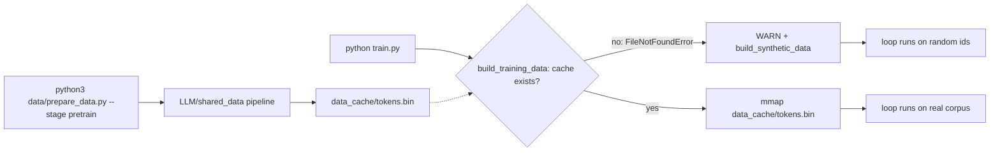

# Quickstart — From Zero to a Running Training Loop

> Audience: beginner. You have cloned `LLaMA-3-Lite` and want to see it train
> something — synthetic data, real data, or just the tests — without reading
> the whole codebase first.
> Scope: the current working tree. All commands below were checked against the
> source files they invoke.

## The 60-second summary

`python train.py` always trains: if `data_cache/tokens.bin` does not exist,
`train.py:train_model` prints a loud warning and falls back to **synthetic
data** (random token ids, a byte-level tokenizer stub, no downloads), so the
loop, checkpointing, W&B, and resume machinery all work on a machine with
nothing but PyTorch. To train on real text you must first build the corpus
cache with `python3 data/prepare_data.py --stage pretrain`, which delegates to
the workspace-level `LLM/shared_data` pipeline (download → clean → tokenize →
pack) and writes the single uint32 file `data_cache/tokens.bin` that the
in-tree loader memory-maps. For a fast sanity check there is a CPU pytest
suite and a standalone end-to-end smoke script (`tests/e2e_gpu_smoke.py`) that
exercises the whole pipeline on a tiny model in a few minutes. This guide
walks all three paths, then covers resume (`preload`), W&B offline mode, the
config keys worth touching first, and where artifacts land.

## 1. Prerequisites

| Requirement | Version / note |
|---|---|
| Python | 3.10+ |
| PyTorch | 2.x (CUDA 12.1 build on a GPU host: `pip install torch --index-url https://download.pytorch.org/whl/cu121`) |
| GPU | NVIDIA A100 80GB for the full 42,000-step run at batch 96; anything with ≥20 GB VRAM with the memory stack on (see [memory-stack.md](../training.md)) |
| `wandb` | imported unconditionally by `train.py` — install even for offline runs |
| `transformers` / `datasets` | only needed for the real tokenizer (`data/shared_data/loader.py:build_tokenizer`) and the real-data pipeline; the synthetic path never touches them |
| Workspace package | `LLM/shared_data` (the universal pipeline) — required only for Mode 2, real data |

Model scale for reference: 16 layers, `d_model` 1024, GQA 8Q/4KV, SwiGLU
`d_ff` 4096, vocab 128k, seq 2048 — **513.8M parameters** (≈515M in the
README's rounding), 1.03 GB in BF16 ($513.8\text{M} \times 2\text{B}$).

## 2. The three ways to run



### 2.1 Mode 1 — `python train.py` (what actually happens right now)

Without a prepared cache, this is not an error path — it is the designed
fallback. `train_model` first tries
`data/shared_data/loader.py:build_training_data`, which checks for
`data_cache/tokens.bin` and raises `FileNotFoundError` if it is missing. The
trainer catches it and prints exactly this:

```text
WARN: Token cache not found at data_cache/tokens.bin. Run `python data/prepare_data.py`
first (or pass `data_sources` empty + use build_synthetic_data).
WARN: no token cache found — falling back to synthetic data. Run `python data/prepare_data.py`
to build the real corpus cache at data_cache/tokens.bin.
```

then calls `data/shared_data/loader.py:build_synthetic_data`, and training
proceeds normally.

**What "synthetic" means.** A random uint32 buffer of
`max(8 × (seq_len+1) × batch, 4096)` ids — at the default config that is
8 × 2049 × 96 ≈ **1.57M tokens** — split 95/5 into train/val, served through
the same `PackedDataset` + `ShuffledRangeSampler` + DataLoader path as real
data. The tokenizer is `data/shared_data/loader.py:_SyntheticTokenizerStub`,
a duck-typed bytes⇄ids stub (`encode`/`decode`, `eos_token_id=0`,
`pad_token_id=0`) that needs no HuggingFace download. Its `__len__` returns
the config vocab, so `real_vocab_size = max(config['vocab_size'], len(tokenizer))`
still resolves to 128,000.

**Why it exists.** This repo vendors only the *loader* half of the data
pipeline (`data/shared_data/` is 2 files); the preparation pipeline lives in
the workspace. Synthetic mode makes `train.py` runnable on a bare checkout so
the training loop, checkpointing, EMA, W&B logging, and resume are all
testable without a 32 GB corpus on disk.

**What you should expect.** Targets are random, so the loss sits at the
cross-entropy floor for uniform random labels, $\ln(128000) \approx 11.76$,
and never improves — that is correct behavior, not a bug. The 1.57M-token
corpus is ~7 train batches at batch 96, after which `train.py:_next_batch`
prints `WARN: train corpus exhausted (epoch N); restarting the sampler with a
fresh permutation` and wraps around, so even a 42k-step "synthetic run"
completes (by re-reading the same random ids with a new shuffle). Generation
samples are byte-garbage by construction. Use Mode 1 to prove the *loop*
works; use Mode 2 for anything with real signal.

### 2.2 Mode 2 — real data: `prepare_data.py` then `train.py`

```bash
# from the repo root
python3 data/prepare_data.py --stage pretrain
python train.py
```

`data/prepare_data.py:main` is a thin shim: it inserts the project root,
`data/`, and the project's parent on `sys.path`, then imports the
**workspace** `LLM/shared_data` package and delegates to its `run_pipeline`.
If that package is not importable on your machine, it exits with guidance
rather than failing cryptically:

```text
LLaMA-3-Lite data prep delegates to the universal pipeline at `LLM/shared_data/`
(shared_data.config / shared_data.prepare_data). That workspace package is not
importable on this machine (...). This project vendors only the loader
(data/shared_data/).
```

The `--stage pretrain` choice is currently the only stage. Other flags mirror
the universal pipeline so you can skip phases when re-running:

| Flag | Effect |
|---|---|
| `--mixture PATH` | override the mixture spec (default: `LLM/shared_data/config/mixture.yaml`) |
| `--data-config PATH` | override the data config (default: `.../data_config.yaml`) |
| `--data-root PATH` | override where shards are written |
| `--source NAME` | restrict to one source key from `data_sources` |
| `--skip-download` | reuse an existing corpus |
| `--skip-clean` / `--skip-tokenize` | reuse cleaned / tokenized artifacts |
| `--skip-pack` | stop before the packing stage |

The packing stage produces `data_cache/tokens.bin` (the name comes from
`config['data_cache_dir']` / `config['data_cache_filename']`): a single
little-endian uint32 file with no header, EOS-separated documents. At the
full 8B-token budget that is ~32 GB on disk. `build_training_data` then opens
it with `np.memmap(path, dtype=np.uint32, mode="r")` — resident RAM stays near
zero because pages are faulted in on access — holds out the last
`val_split` (5%) on chunk boundaries, and hands you train/val loaders plus a
tokenizer.

**Tokenizer caveat.** The real path tries
`data/shared_data/loader.py:build_tokenizer`
(`transformers.AutoTokenizer` on `tokenizer_name:
NousResearch/Meta-Llama-3-8B`; requires a one-time download; pad falls back to
EOS). If that fails, the loader prints
`[data] tokenizer load failed (...); using the byte stub. Generation samples
will be meaningless until a real tokenizer is available.` and trains on the
mmap cache with the stub — the loss is real, only the sample text is
meaningless. With the real tokenizer (vocab 128,256) the model is built at
128,256 via `max(config['vocab_size'], len(tokenizer))`.

### 2.3 Mode 3 — quick smoke: tests and the e2e script

Fastest path, no GPU required for the pytest suite (the `device` fixture in
`tests/conftest.py:device` defaults to CPU, where tests run FP32 for
exactness):

```bash
python -m pytest tests/ -m smoke      # end-to-end smoke tests, seconds
python -m pytest tests/               # full CPU suite
python -m pytest tests/ --run-gpu     # additionally run gpu-marked tests
```

`tests/` covers the model (attention causality, fused≡unfused SwiGLU, chunked
CE ≡ dense CE), the config contract, training mechanics (scheduler, EMA,
checkpoint round-trip), and the end-to-end smoke class. `gpu`-marked tests
are skipped by default; the conftest injects a `wandb` stub and sets
`WANDB_MODE=offline`/`WANDB_DISABLED` so the suite is hermetic. See
[tests.md](../references/training-reference.md) for the full fixture/marker reference.

For a true end-to-end GPU check, the standalone script:

```bash
python tests/e2e_gpu_smoke.py            # 8 stages; use ~/.venv/bin/python if you have a project venv
python tests/e2e_gpu_smoke.py --steps 4  # override the tiny config's max_steps
```

`tests/e2e_gpu_smoke.py:main` runs 8 stages — environment, data pipeline,
model build, training steps, chunked-CE vs dense equivalence, validation,
checkpoint save/load round-trip, Triton kernels — on a tiny config
(`d_model` 128, 2 layers, vocab 512, batch 4) that fits in ~4 GB of VRAM. It
sets `WANDB_MODE=offline` and `WANDB_DISABLED` itself, and still runs on CPU
(with a warning that the "GPU run" goal is not met). A green run ends with
`E2E SMOKE: ALL CHECKS PASSED`.

Optionally, `python benchmark_data.py --steps 50 --batch_size 96 --seq_len 2048`
measures data-pipeline throughput only (no model forward unless
`--with_model_forward`); see `benchmark_data.py:main`.

## 3. Resuming from a checkpoint

Set the `preload` config key to anything non-`None` in `config.py`
(`config.py:get_config` defaults it to `None`):

```python
'preload': True,   # any non-None value arms the resume path
```

When non-`None`, `train.py:load_checkpoint` is called before the loop. Two
things worth knowing:

- **The value is a switch, not a path.** `load_checkpoint` ignores the
  string and auto-detects the *latest* `llama3-515M_step_*.pt` in
  `config['model_folder']` (sorted by step number). The README's example
  `'preload': 'weights/llama3-515M_step_5000.pt'` works, but any non-`None`
  value resumes the newest checkpoint in `weights/`.
- **Everything is restored**, not just weights: model, optimizer, and
  scheduler state dicts; the full RNG state (`rng_torch`, `rng_numpy`,
  `rng_python`, plus `rng_cuda` on GPU — the cross-device move is handled by
  a `.cpu().to(torch.uint8)` fix); the EMA shadow (`ema_state_dict`) when
  present; and the recorded `step` + `best_val_loss`. The loop then runs
  `range(initial_step, max_steps)` and prints `Resumed from step N`. This is
  what makes resumes bit-identical — see
  [reproducibility.md](../concepts/training-and-memory.md).

## 4. W&B: online, offline, disabled

`train.py` calls `wandb.init(project=config['wandb_project'], ...)` with a
timestamped run name (`llama3-515M-{device}-{unix_time}`). Without an account
or network this would block/fail, so:

```bash
WANDB_MODE=offline python train.py     # log locally, sync later with `wandb sync`
WANDB_DISABLED=true python train.py    # no logging at all (tests use this)
```

Offline runs write a local run directory under `wandb/` in the repo root.
Logged metrics include `train/loss`, `train/lr`, `train/grad_norm`,
`train/tokens_per_sec`, `train/tokens_seen`, `gpu/memory_*`, `val/loss`,
`val/perplexity`, and the generation table at `generation_interval`.

## 5. Config keys for your first run

All in `config.py:get_config`. The ones that change the *shape* of a first
run:

| Key | Default | Touch it because |
|---|---|---|
| `max_steps` | 42000 | the full pretraining run (~8.26B tokens = 42,000 × 96 × 2048). Set 20–100 for a smoke run |
| `warmup_steps` | 2000 | the cosine scheduler gets `T_max = max_steps − warmup_steps`, so **keep `max_steps > warmup_steps`**; for a 50-step run use `warmup_steps: 10` |
| `batch_size` | 96 | the A100 budget; drop to 48/32/16 on smaller GPUs (sizing math in [memory-engineering.md](../concepts/training-and-memory.md)) |
| `compile_model` | True | `torch.compile(mode='reduce-overhead')` captures CUDA graphs; the first step stalls 30s–2min on autotune. Set `False` for quick/CPU smoke runs |
| `gradient_checkpointing` | True | the main activation-memory lever; leave on unless profiling |
| `ce_chunk_size` | 256 | chunk width of the head+loss (memory vs overhead tradeoff; see [loss-functions.md](../concepts/architecture-components.md)) |
| `model_folder` | `weights` | where every artifact lands |
| `checkpoint_interval` / `val_interval` / `log_interval` | 5000 / 2000 / 50 | cadence of checkpoints, validation, and W&B logging |
| `preload` | `None` | set non-`None` to resume (see §3) |
| `wandb_project` | `langgpt-llama3-pretrain` | your W&B project name |

Other load-bearing keys to be aware of (not first-run knobs): `use_z_loss`
(+`z_loss_weight` 1e-4), `qknorm`, `use_ema` (`ema_decay` 0.999), `tf32`,
`keep_last_n_checkpoints` (3), `num_workers`/`prefetch_factor`/`pin_memory`
(loader), and the `*_impl` Triton gates — `rmsnorm_impl`/`swiglu_impl`/
`cross_entropy_impl` only take effect with `ENABLE_TRITON_KERNELS=1`;
otherwise `train.py` force-restores all three to `'pytorch'` with a warning.
Full key-by-key reference: [config.md](../references/model-reference.md).

## 6. Where artifacts land

Everything goes under `config['model_folder']` (default `weights/`, created
on demand by `train.py:save_checkpoint`):

| Artifact | When |
|---|---|
| `weights/llama3-515M_step_N.pt` | every `checkpoint_interval` (5000); pruned to the newest `keep_last_n_checkpoints` (3) |
| `weights/llama3-515M_best.pt` | on any validation loss improvement (weights only) |
| `weights/llama3-515M_final_model_full.pt` | end of training — full checkpoint (state dicts + RNG + EMA + config) |
| `weights/llama3-515M_final_model_weights.pt` | end of training — model weights only |
| `wandb/` | local run dirs when `WANDB_MODE=offline` |
| `data_cache/tokens.bin` | the prepared corpus cache (Mode 2); reused across runs |

Step checkpoints are saved on a background thread when `async_checkpoint` is
`True` (the default); `train_model` joins the thread before exiting so the
final writes never get cut off.

## References

- [learning-paths.md](learning-paths.md) — where this fits in the doc tree
- [training.md](../training.md) — the loop this guide starts
- [config.md](../references/model-reference.md) — every key, with interactions
- [data.md](../references/data-reference.md) — the vendored loader, line by line
- [data-engineering.md](../concepts/data-and-kernels.md) — the universal pipeline behind `prepare_data.py`
- [troubleshooting.md](troubleshooting.md) — OOM, CUDA-graph stalls, missing-cache errors
- [glossary.md](glossary.md) — notation used across the docs
