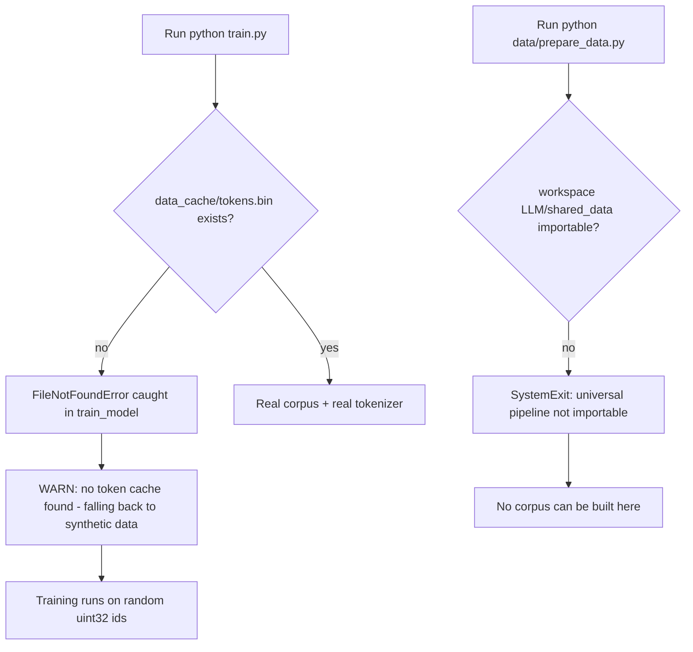

# Troubleshooting — LLaMA-3-Lite FAQ

> **Audience:** beginner–intermediate (anyone running `train.py` or the test suite).

This guide is organized by symptom: you hit an error, you look up the message here, and you get the cause, the fix, and how to prevent it next time. Every quoted message is the exact text the code prints. Facts are anchored to symbols in `train.py`, `model.py`, `config.py`, `data/shared_data/loader.py`, and `data/prepare_data.py` — see
[`model.md`](../references/model-reference.md) and
[`training.md`](../training.md) for the full walkthroughs, and
[`memory-engineering.md`](../concepts/training-and-memory.md) for the memory
arithmetic behind the OOM entry.

The two messages that confuse people the most, up front:

```text
WARN: Token cache not found at data_cache/tokens.bin. Run `python data/prepare_data.py` first (or pass `data_sources` empty + use build_synthetic_data).
```

vs.

```text
LLaMA-3-Lite data prep delegates to the universal pipeline at `LLM/shared_data/` ...
```

The first is a **runtime warning** from `train.py` — training still starts on synthetic data. The second is a **hard exit** from `data/prepare_data.py` — the real corpus cannot be built on this machine at all. They are two different errors; entries 2 and 3 cover them separately.



---

## 1. CUDA out of memory at batch 96

**Symptom.** `torch.OutOfMemoryError: CUDA out of memory` (or a clean process kill by the OOM killer) during the warmup forward or the first training step on an 80 GB A100.

**Cause.** Batch 96 × seq 2048 is the headline configuration, and it only fits because two techniques are on by default. `config.py:get_config` sets `gradient_checkpointing: True` and `ce_chunk_size: 256`; the loss docstring in `model.py:chunked_head_cross_entropy_with_z` states that chunking plus per-chunk `checkpoint` "bounds the loss memory to ~0.3 GB at `chunk_size=256` instead of the ~50 GB a full `[N, V]` logits tensor would need." README's memory table puts the peak at ~92 GB without these techniques — over the 80 GB budget — versus ~20 GB with them. If either toggle is off, or the chunk size is raised, you are back in OOM territory.

**Fix.** In order of preference:

1. Confirm `gradient_checkpointing: True` in `config.py:get_config`. It
   must stay on at this batch size; `model.py:Transformer.forward` only applies `checkpoint(layer, x, use_reentrant=False)` per layer when the flag is set **and** the model is in training mode.
2. Lower `ce_chunk_size` (default 256). Each chunk materializes one
   `[chunk_size, 128000]` slice at a time: at 256 rows of FP32 logits that is `256 × 128000 × 4 B ≈ 0.13 GB` live per chunk. Halving it halves that slice.
3. Reduce `batch_size` (e.g. 96 → 48) and compensate with
   `gradient_accumulation` so the optimizer still steps on the same effective batch.
4. If fragmentation is the culprit rather than steady-state usage, the
   allocator is already configured for it: `train.py:setup_gpu_optimizations` exports `PYTORCH_CUDA_ALLOC_CONF = config['cuda_alloc_conf']`, which is `expandable_segments:True` by default. If you overrode it, put it back.

**Prevention.** Treat the memory budget as a derived quantity, not a guess — [memory-engineering.md](../concepts/training-and-memory.md) derives every line of the stack table including the 92 GB → 20 GB arithmetic. Change one knob at a time and watch `gpu/memory_peak_mb` in the W&B log dict produced by `train.py:train_model`.

---

## 2. `Token cache not found at data_cache/tokens.bin` — but training still starts

**Symptom.** `train.py` prints a `WARN:` line starting with the `FileNotFoundError` text and then continues.

**Cause.** `train.py:train_model` tries `build_training_data(config)` first; `data/shared_data/loader.py:build_training_data` raises when `data_cache/tokens.bin` does not exist:

```text
Token cache not found at data_cache/tokens.bin. Run `python data/prepare_data.py` first (or pass `data_sources` empty + use build_synthetic_data).
```

`train_model` catches exactly `FileNotFoundError` and falls back:

```text
WARN: no token cache found — falling back to synthetic data. Run `python data/prepare_data.py` to build the real corpus cache at data_cache/tokens.bin.
```

So this is **not** a crash: it is the smoke-test path. You are training on synthetic random ids (see entry 11 for why the output will look like garbage).

**Fix.** To train on real text, build the corpus first: `python data/prepare_data.py`, which produces the uint32 `tokens.bin` the loader mmaps (`data/shared_data/loader.py:build_training_data` documents the layout: "raw `uint32` little-endian with no header"). Then rerun `python train.py` — the `WARN` disappears.

**Prevention.** If you intend a real run, check for `data_cache/tokens.bin` before launching, and read
[`quickstart.md`](quickstart.md) which walks the build-then-train order.
A `WARN:` in the first three lines of a training log means you are on synthetic data; the plan's 42k-step run should never train on it.

---

## 3. `data/prepare_data.py` exits with the `LLM/shared_data` SystemExit

**Symptom.** Running `python data/prepare_data.py` prints an error and the process exits non-zero, with text starting:

```text
LLaMA-3-Lite data prep delegates to the universal pipeline at `LLM/shared_data/` (shared_data.config / shared_data.prepare_data). That workspace package is not importable on this machine (...). This project vendors only the loader (data/shared_data/).
```

**Cause.** `data/prepare_data.py` is a thin shim: `data/prepare_data.py:main` calls `_apply_llama3_defaults()`, which does `from shared_data.config import UNIVERSAL_TOTAL_TOKENS`. That module lives in the **workspace** package at `LLM/shared_data/` (sibling of this repo, not inside it). The vendored `data/shared_data/` contains only the loader (`__init__.py` + `loader.py`). When the workspace package is absent (fresh clone, or this repo moved outside the `LLM/` tree), the import fails with `ModuleNotFoundError` and `data/prepare_data.py:main` re-raises it as that `SystemExit`.

**Fix.** Make the workspace package importable: the repo must sit at `…/LLM/LLaMA-3-Lite` with the universal pipeline present at `…/LLM/shared_data/` (which is where `data/prepare_data.py` inserts into `sys.path`). If the workspace lives elsewhere, point the shim's `_WORKSPACE_ROOT` at it.

**Prevention.** Distinguish this from entry 2: this is the **build** step failing, entry 2 is the **train** step warning. On machines without the workspace pipeline you cannot build the real corpus; use the synthetic fallback (entry 2) or prepare `tokens.bin` elsewhere and copy it in. The two-file vendored reality is documented honestly in
[training.md](../training.md) (the data-pipeline section).

---

## 4. Triton import errors on Mac / CPU

**Symptom.** With `rmsnorm_impl: 'triton'` (or `swiglu_impl` / `cross_entropy_impl`) set, the model prints one-time fallback warnings and runs slower than expected — or a direct kernel call raises `ImportError`. Typical warnings:

```text
[RMSNorm] triton path unavailable (ModuleNotFoundError: No module named 'triton'); falling back to 'pytorch'.
```

```text
[SwiGLUFFN] triton path unavailable (ModuleNotFoundError: No module named 'triton'); falling back to 'pytorch'.
```

```text
[chunked_head_cross_entropy_with_z] triton unavailable (`import triton` failed); falling back to 'pytorch'.
```

**Cause.** The Triton kernels are opt-in and Linux+CUDA-only. `kernels/rmsnorm_triton.py`, `kernels/swiglu_triton.py`, and `kernels/cross_entropy_triton.py` each guard `import triton` in a `try/except ImportError` and set `HAS_TRITON`; the model's call sites catch `(ImportError, ValueError)` and fall back to the pure-PyTorch path. `model.py:RMSNorm.forward` and `model.py:SwiGLUFFN.forward` print their fallback warning exactly once. On macOS, `pip install triton` is not available — Triton requires a CUDA toolchain, so the kernels simply cannot run on a Mac.

**Fix.** On a Mac or CPU box: nothing is broken — this is the intended degradation. Leave the `*_impl` keys at their `'pytorch'` defaults. If you call a kernel entry point directly (e.g. `kernels/rmsnorm_triton.py:triton_rmsnorm`), it raises `ImportError("triton_rmsnorm requires the `triton` package. Install with `pip install triton` (Linux + CUDA only).")` — that is the public contract, not a bug. On a Linux box with CUDA: `pip install triton`, then set `ENABLE_TRITON_KERNELS=1` (entry 5).

**Prevention.** Default config is `'pytorch'` for all three impls (`config.py:get_config`), so nothing to do. The `HAS_TRITON` gate pattern is covered in [kernel-programming.md](../concepts/data-and-kernels.md) and the kernel reference [`kernels.md`](../references/data-reference.md).

---

## 5. `ENABLE_TRITON_KERNELS != '1'; forcing all to 'pytorch'`

**Symptom.** Config says `rmsnorm_impl: 'triton'` but training prints:

```text
WARN: rmsnorm_impl/swiglu_impl/cross_entropy_impl set to 'triton' but ENABLE_TRITON_KERNELS != '1'; forcing all to 'pytorch'. Set ENABLE_TRITON_KERNELS=1 to enable the fused Triton paths.
```

**Cause.** Per AGENTS.md hard rule 7, a Triton kernel must never silently switch on during a default-config run. The opt-in is **two** switches: the per-kernel config key **and** the `ENABLE_TRITON_KERNELS=1` environment variable. `train.py:train_model` checks `os.environ.get("ENABLE_TRITON_KERNELS", "0") == "1"`; if it is not `"1"` and any impl requests `'triton'`, all three are force-restored to `'pytorch'` with that warning.

**Fix.** Either intend the fused path — run with `ENABLE_TRITON_KERNELS=1 python train.py` — or set the impl keys back to `'pytorch'` and the warning goes away.

**Prevention.** Treat the warning as information, not an error: it proves the gate works. If you want Triton on the A100, set both switches; the ≥1.5× speedup rule for enabling a kernel by default is in
[`kernel-programming.md`](../concepts/data-and-kernels.md).

---

## 6. `torch.compile` stalls / CUDA-graph re-capture on shape change

**Symptom.** The run appears frozen for 30 seconds to minutes right after the banner — then prints `Pre-warmup complete (CUDA graphs captured).` and proceeds. Later, slow steps appear around validation or generation.

**Cause.** `config.py:get_config` sets `compile_model: True` with `compile_mode: 'reduce-overhead'`, which uses CUDA graphs. Compilation and graph capture are deferred work: the code comments in `train.py:train_model` spell it out — "First step stalls 30s–2min on autotune; warm it up before the loop" and "CUDA graphs recompile on shape change, so the warmup must use real training shapes." The warmup runs one forward + loss + backward before the loop precisely so the stall does not land on step 1 of the progress bar. Two real shape-change hazards remain:

- Validation runs the same compiled model (`validate(ema, ...)` inside
  `train.py:train_model`); the val loader uses `drop_last=False` (`data/shared_data/loader.py:build_training_data`), so a final partial batch has a different shape and forces one re-capture per val round.
  [INFERENCE: any batch whose row count differs from 96 triggers it.]
- `train.py:generate_samples` calls `model(generated)` with `generated`
  growing by one token per iteration, so each of the `generation_max_tokens` (128) steps sees a new shape.

**Fix.** Accept the one-time warmup stall — it is the designed trade. For interactive debugging, set `compile_model: False` in `config.py:get_config`; the model runs pure eager and every step is uniformly slow instead of bursty. If you need graphs but not the stream ownership, switch `compile_mode` to `'default'` or `'max-autotune'` (no CUDA-graph re-capture per shape, slightly slower steady-state steps).

**Prevention.** Keep training shapes static: batch 96 and seq 2048 for the whole run, and don't change `batch_size` mid-run — the warmup comment exists because a shape change recompiles. `'reduce-overhead'` also "owns the stream", which is why the H2D copies in `train.py:train_model` are `non_blocking=True` and manual streams are avoided. See
[`optimization.md`](../concepts/training-and-memory.md) and
[`mixed-precision.md`](../concepts/training-and-memory.md) for the surrounding
throughput design.

---

## 7. Checkpoint "not found" on resume / partial checkpoint after a kill

**Symptom.** You set `preload` to resume and training starts at step 0 as if nothing existed; or a resume crashes with an unpickling/`EOFError`; or the final save looks missing.

**Cause.** Two distinct behaviors in `train.py`:

- `train.py:load_checkpoint` globs
  `{model_folder}/{model_filename}_step_*.pt` and, **if no checkpoint exists, silently returns `(0, float('inf'))`** — no error, training just restarts from scratch. A wrong `model_folder` therefore looks like "my checkpoint vanished".
- Checkpoints are saved on a background thread when
  `async_checkpoint: True` (`train.py:save_checkpoint` returns the `threading.Thread`; the loop prints `Checkpoint queued (async): …`). The thread is joined at the very end of training (`ckpt_thread.join()`), but if the process is killed between `torch.save` starting and finishing, the `.pt` file is truncated, and the next `load_checkpoint` fails while unpickling it.

**Fix.** For a silent restart: check that `model_folder` matches where the checkpoints were written and that `model_filename` is unchanged (`weights/llama3-515M_step_*.pt`). For a corrupt file: delete the partial `_step_N.pt` (the loader picks the highest numeric step, so the previous one resumes cleanly) or restore from the `_best.pt` weights snapshot.

**Prevention.** Never kill training mid-save. If you must, remove the partial file before resuming. For long runs, the atomic-save discipline (`.tmp` + rename) used elsewhere in the workspace portfolio is a stronger pattern than async threads; until then, `keep_last_n_checkpoints` limits how many step files accumulate. Checkpoint contents and the RNG-restore contract are documented in [`training.md`](../training.md) and
[`reproducibility.md`](../concepts/training-and-memory.md).

---

## 8. `StopIteration` vs the "train corpus exhausted" epoch wrap

**Symptom.** Either you see a `StopIteration` traceback while training, or you see a mid-run warning:

```text
WARN: train corpus exhausted (epoch 1); restarting the sampler with a fresh permutation. The 42k-step plan (~8.26B tokens) exceeds the prepared corpus.
```

**Cause.** The plan's 42,000 steps at 96 × 2048 tokens/step consume ~8.26B tokens — more than the prepared corpus, and more than `target_tokens` (8B) implies. `train.py:_next_batch` exists so the loop never dies at the end of the data: it catches `StopIteration`, bumps the epoch counter, calls `sampler.set_epoch(epoch)` for a fresh permutation (`data/shared_data/loader.py:ShuffledRangeSampler.set_epoch`), and restarts the iterator. The warning is the **expected, designed** message for a longer-than-corpus run.

**Fix.** If you see the `WARN:` — nothing to fix; that is the wrap working. If you see a real `StopIteration` traceback, it is coming from your own loop outside `train.py:_next_batch` (the training loop never raises it) or from `next(iter(train_dataloader))` after the corpus ran out in a context the wrapper does not cover.

**Prevention.** Size the corpus to at least ~8.26B tokens for a full 42k run, or shorten `max_steps` to match the corpus. If you want to avoid the wrap entirely, build the larger corpus with `data/prepare_data.py` (entry 3) and verify `data_cache/tokens.bin` size first ([`data-engineering.md`](../concepts/data-and-kernels.md) has the tokens-per-byte math).

---

## 9. `ModuleNotFoundError: No module named 'wandb'` on a dev box

**Symptom.** `python train.py` crashes at import time with `ModuleNotFoundError` for `wandb`; the pytest suite, by contrast, runs fine without W&B installed.

**Cause.** `train.py` does a module-level `import wandb`. The test suite never sees the failure because `tests/conftest.py` injects a minimal `wandb` stub at import time when the real package is missing — the comment there says it exists "so `train.py`'s module-level `import wandb` succeeds on CPU/Mac dev boxes" — and it also exports `WANDB_MODE=offline` and `WANDB_DISABLED=true` for the real package. Those protections are pytest session setup; they do not apply to a bare `python train.py`.

**Fix.** Two options:

- `pip install wandb`, then optionally `wandb login` (or export
  `WANDB_API_KEY`) — real runs log to the dashboard;
- for offline runs, keep W&B installed and export `WANDB_MODE=offline`
  (and `WANDB_DISABLED=true` to skip uploads entirely).

**Prevention.** Treat the conftest stub as a test-only shim, not a runtime feature. `train.py:train_model` calls `wandb.init` with the project from `config.py:get_config` (`wandb_project`), logs `gen/samples` tables via `train.py:generate_samples`, and `wandb.finish()` at the end — all of that is a no-op under the stub. See
[`quickstart.md`](quickstart.md) for the W&B offline recipe.

---

## 10. `TypeError: object of type '_SyntheticTokenizerStub' has no len()`

**Symptom.** `train.py` crashes computing `real_vocab_size = max(config['vocab_size'], len(tokenizer))`.

**Cause.** This is the signature of a **stale loader**. The current `data/shared_data/loader.py:_SyntheticTokenizerStub` defines `__len__` returning `self._vocab`, so `len(tokenizer)` is always valid — for the synthetic stub and the real tokenizer alike. If you still hit the `TypeError`, an older copy of `loader.py` is being imported: a stale `__pycache__`, or a `PYTHONPATH` entry pointing at an old `shared_data`/`dataset.py` that lacks the method. (In the same class of confusion: the real-tokenizer load path. When `build_tokenizer` fails — no `transformers`, no network — `data/shared_data/loader.py:build_training_data` catches it and prints `[data] tokenizer load failed (...); using the byte stub. Generation samples will be meaningless until a real tokenizer is available.` The stub still has `__len__`, so training proceeds.)

**Fix.** Verify the vendored loader is the one on `sys.path`: `data/shared_data/loader.py` (the repo vendors exactly this file), clear stale `__pycache__` under `data/`, and check `PYTHONPATH` for an unexpected `shared_data` package. The historical defect is fixed in the current tree; if you are on an older checkout, pull the current loader.

**Prevention.** Import the stub directly to confirm: `from data.shared_data.loader import _SyntheticTokenizerStub; len(_SyntheticTokenizerStub(128000, 0, 0))`. The tokenizer contract (pad defaults to EOS in `build_tokenizer`) is documented in [`tokenizer.md`](../references/data-reference.md).

---

## 11. Generation output is garbage

**Symptom.** Samples logged at `gen/samples` are byte-mojibake — wrong characters, replacement glyphs — or nonsense tokens.

**Cause.** Expected whenever you are on the synthetic path. With no `tokens.bin`, `train.py:train_model` falls back to `data/shared_data/loader.py:build_synthetic_data`, whose docstring states: "Synthetic ids are random, so the byte stub is used unconditionally (no HF download)." The model learns a random-id distribution, and the `_SyntheticTokenizerStub` maps bytes ⇄ ids (clamped to vocab) — so `decode` of sampled ids is byte-garbage by construction. The same holds when the real tokenizer fails to load (entry 10): the fallback print says explicitly "Generation samples will be meaningless until a real tokenizer is available."

**Fix.** Build the real corpus (`python data/prepare_data.py`, entry 3), confirm the cache exists (entry 2), and make sure `build_tokenizer` can load `tokenizer_name` (`NousResearch/Meta-Llama-3-8B`) — network or `tokenizer_cache_dir` access is required the first time. Then generation uses real BPE ids.

**Prevention.** Any training run that started with the `WARN: no token cache found` line will produce garbage samples; that is the smoke-test contract, not a bug. Real pretraining must start from a real corpus.

---

## Appendix: the "Known issues" in AGENTS.md

AGENTS.md lists two known issues worth reading before a long run:

- **"Full 8.25B-token run not yet started."** The 42k-step plan is
  validated in pieces (smoke runs, checkpoint/resume tests) but has not run end-to-end on the A100; entry 8 explains the corpus-size interaction you will hit on the real run.
- **"The 78% memory reduction headline is the most-tested number in the
  portfolio; do not regress it."** The 92 GB → 20 GB claim is enforced by the memory stack's invariants: `gradient_checkpointing`, chunked CE at `ce_chunk_size: 256`, and the mmap loader. If you are tempted to disable any of them for convenience, that is exactly the regression the rule forbids — see entry 1 and
  [memory-engineering.md](../concepts/training-and-memory.md).

## References

- [quickstart.md](quickstart.md) — the happy path this guide assumes
- [training.md](../training.md) — loop, checkpoint, and resume mechanics
- [config.md](../references/model-reference.md) — every knob referenced above
- [memory-engineering.md](../concepts/training-and-memory.md) — the OOM arithmetic
- [glossary.md](glossary.md) — notation and acronyms used here
