# LLaMA-3-Lite — Model Architecture Reference

> A block-by-block, line-referenced explanation of `model.py` for ML practitioners.
> Every module, tensor shape, mathematical operation, and design choice is documented here.

---

## Table of Contents

1. [File-Level Overview](#1-file-level-overview)
2. [Imports and Their Purpose](#2-imports-and-their-purpose)
3. [Architectural Blueprint](#3-architectural-blueprint)
4. [`InputEmbedding` — Token → Vector Lookup](#4-inputembedding--token--vector-lookup)
5. [`RoPE` — Rotary Position Embeddings](#5-rope--rotary-position-embeddings)
6. [`RMSNorm` — Root Mean Square Layer Normalization](#6-rmsnorm--root-mean-square-layer-normalization)
7. [`GroupedQueryAttention` — GQA with RoPE + Flash-Attention-2](#7-groupedqueryattention--gqa-with-rope--flash-attention-2)
8. [`SwiGLUFFN` — Gated Feed-Forward Network](#8-swigluffn--gated-feed-forward-network)
9. [`DecoderBlock` — Pre-Norm Transformer Block](#9-decoderblock--pre-norm-transformer-block)
10. [`Decoder` — Stack of Blocks + Final Norm](#10-decoder--stack-of-blocks--final-norm)
11. [`Transformer` — The Full Model](#11-transformer--the-full-model)
12. [`chunked_cross_entropy` — Memory-Efficient Loss](#12-chunked_cross_entropy--memory-efficient-loss)
13. [`build_transformer` — Factory + Diagnostic Print](#13-build_transformer--factory--diagnostic-print)
14. [End-to-End Forward Pass Trace](#14-end-to-end-forward-pass-trace)
15. [Parameter Budget & Shape Cheat-Sheet](#15-parameter-budget--shape-cheat-sheet)
16. [References](#16-references)

---

## 1. File-Level Overview

`model.py` (246 lines) implements a **decoder-only transformer** closely following the LLaMA 3 recipe. The file is organized in **bottom-up** order — leaf modules first, the full model last — which mirrors how PyTorch composition works: small `nn.Module`s are assembled into progressively larger ones.

| Block | Lines | Role |
|---|---|---|
| `InputEmbedding` | 7–14 | Token-id → dense vector lookup |
| `RoPE` | 17–33 | Rotary position embeddings with cached sin/cos |
| `RMSNorm` | 36–45 | Per-channel RMS normalization with learnable scale |
| `GroupedQueryAttention` | 48–82 | Causal multi-head attention with GQA + RoPE |
| `SwiGLUFFN` | 85–96 | Gated feed-forward block with fused gate+up projection |
| `DecoderBlock` | 99–112 | Pre-norm block: Attention → residual → FFN → residual |
| `Decoder` | 115–124 | Sequential list of `DecoderBlock`s + final norm |
| `Transformer` | 127–187 | Full model with embedding, decoder, output projection |
| `chunked_cross_entropy` | 190–216 | Memory-efficient loss over vocab logits |
| `build_transformer` | 219–246 | Factory with default LLaMA-3-Lite hyperparameters |

---

## 2. Imports and Their Purpose

```python
import torch                                  # Tensor library + autograd
import torch.nn as nn                         # All neural-network building blocks
import torch.nn.functional as F               # Functional ops (scaled_dot_product_attention, silu, cross_entropy)
from torch.utils.checkpoint import checkpoint # Activation-recomputation utility for gradient checkpointing
```

Notes:

- `F.scaled_dot_product_attention` is the entry point for **Flash-Attention-2** / memory-efficient attention on supported GPUs (A100, H100).
- `checkpoint` re-runs the wrapped callable during backward to save activation memory — at the cost of one extra forward pass.

---

## 3. Architectural Blueprint

The high-level pipeline is:

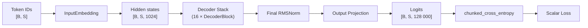

Configuration (matches `config.py`):

| Hyperparameter | Value | Meaning |
|---|---|---|
| `vocab_size` | 128 256 | LLaMA-3 tokenizer size |
| `d_model` | 1024 | Hidden dimension |
| `n_layers` | 16 | Decoder blocks |
| `n_heads` | 8 | Query heads |
| `n_kv_heads` | 4 | Key/Value heads (GQA 2:1) |
| `head_dim` | 128 | Per-head dimension |
| `d_ff` | 4096 | FFN intermediate dimension |
| `max_seq_len` | 2048 | Context length |
| `rope_theta` | 500 000 | RoPE base frequency |
| `rms_norm_eps` | 1e-5 | Norm stability constant |

Total parameters ≈ **515 M** (≈ 252 M non-embedding).

---

## 4. `InputEmbedding` — Token → Vector Lookup

```python
class InputEmbedding(nn.Module):
    def __init__(self, d_model: int, vocab_size: int):
        super().__init__()
        self.d_model = d_model
        self.embedding = nn.Embedding(vocab_size, d_model)

    def forward(self, x):
        return self.embedding(x)
```

### What it does

`nn.Embedding(vocab_size, d_model)` is a **lookup table** of shape `[V, D]`. Given an integer tensor of token IDs, it returns the corresponding row vectors.

### Tensor shapes

| Stage | Shape |
|---|---|
| Input `x` | `[B, S]` (int64 token IDs) |
| Output `h` | `[B, S, d_model]` |

### Mathematical view

`h[b, s, :] = E[x[b, s]]` where `E ∈ R^{V × D}`.

### Design notes

- **No bias term**: the lookup table itself is the only learnable parameter; a bias would be additive and constant w.r.t. token ID, hence redundant.
- **No √d_model scaling inside the class**: LLaMA-2/3 papers scale embeddings by `√d_model`, but the code delegates that responsibility — leaving the embedding raw so residual streams remain interpretable.

### Parameter count

`V × D = 128 256 × 1024 ≈ 131 M`. The single largest tensor in the model.

### Mermaid view

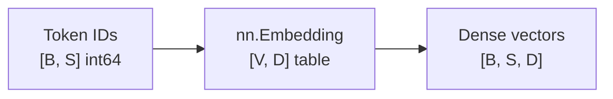

---

## 5. `RoPE` — Rotary Position Embeddings

```python
class RoPE(nn.Module):
    def __init__(self, head_dim: int, max_seq_len: int, theta: float = 500000.0):
        super().__init__()
        inv_freq = 1.0 / (theta ** (torch.arange(0, head_dim, 2).float() / head_dim))
        self.register_buffer('inv_freq', inv_freq)
        t = torch.arange(max_seq_len).float()
        freqs = torch.outer(t, inv_freq)
        self.register_buffer('cos_cached', freqs.cos().unsqueeze(0).unsqueeze(0))
        self.register_buffer('sin_cached', freqs.sin().unsqueeze(0).unsqueeze(0))

    def forward(self, x, seq_len: int):
        cos = self.cos_cached[:, :, :seq_len, :]
        sin = self.sin_cached[:, :, :seq_len, :]
        x1, x2 = x[..., ::2], x[..., 1::2]
        rotated = torch.stack([x1 * cos - x2 * sin, x1 * sin + x2 * cos], dim=-1)
        return rotated.flatten(-2)
```

### 5.1 The problem RoPE solves

Standard transformers are **permutation-equivariant** — they have no built-in notion of order. RoPE injects position by **rotating** each pair of consecutive features by an angle that depends on the token's absolute position `m`.

### 5.2 Mathematical foundation

For a 2-D pair `(x_{2i}, x_{2i+1})` at position `m`:

```
[x'_{2i}  ]   [ cos(m·θ_i)  -sin(m·θ_i) ] [x_{2i}  ]
[x'_{2i+1}] = [ sin(m·θ_i)   cos(m·θ_i) ] [x_{2i+1}]
```

with frequency `θ_i = base^{-2i / head_dim}` and `base = 500 000` (LLaMA-3 choice). The crucial property:

```
⟨ RoPE(q, m), RoPE(k, n) ⟩ = f(q, k, m − n)
```

So attention scores depend only on **relative** distance — the model is naturally translation-aware, and can extrapolate modestly beyond the training context length.

### 5.3 Walk-through

1. **Inverse frequencies** (`inv_freq`, shape `[head_dim/2]`):
   `inv_freq[i] = base^{-2i / head_dim}`.
   `register_buffer` makes the tensor follow `.to(device)` and get saved in `state_dict()` without being a trainable parameter.

2. **Pre-compute angles**:
   `freqs = t ⊗ inv_freq` (outer product) → `[S, head_dim/2]`.
   Take `cos` / `sin` once, store in buffers shaped `[1, 1, S, head_dim/2]`.
   Pre-computation amortizes trig over the whole training run.

3. **Forward pass**:
   - Slice cached tables to the current `seq_len` (zero extra compute for shorter sequences).
   - Split the head_dim vector into even (`x1`) and odd (`x2`) halves.
   - Apply the 2-D rotation in parallel via broadcast on `cos`/`sin`.
   - `stack(... , dim=-1)` produces `[..., head_dim/2, 2]`; `flatten(-2)` interleaves the pairs back to `[..., head_dim]`.

### 5.4 Tensor shapes

| Variable | Shape |
|---|---|
| `inv_freq` | `[head_dim/2]` |
| `cos_cached`, `sin_cached` | `[1, 1, max_seq_len, head_dim/2]` |
| Input `x` | `[B, n_heads, S, head_dim]` |
| `x1`, `x2` | `[B, n_heads, S, head_dim/2]` |
| `cos`, `sin` (sliced) | `[1, 1, S, head_dim/2]` |
| `rotated` (stacked) | `[B, n_heads, S, head_dim/2, 2]` |
| Output (flattened) | `[B, n_heads, S, head_dim]` |

### 5.5 Why `θ = 500 000`?

Higher base → lower base frequency → **longer wavelength** rotations. This lets the model represent long-range position differences before angles wrap around `2π`, dramatically improving length extrapolation — Meta's headline change from LLaMA-2 (`θ=10 000`) to LLaMA-3.

### 5.6 Mermaid view

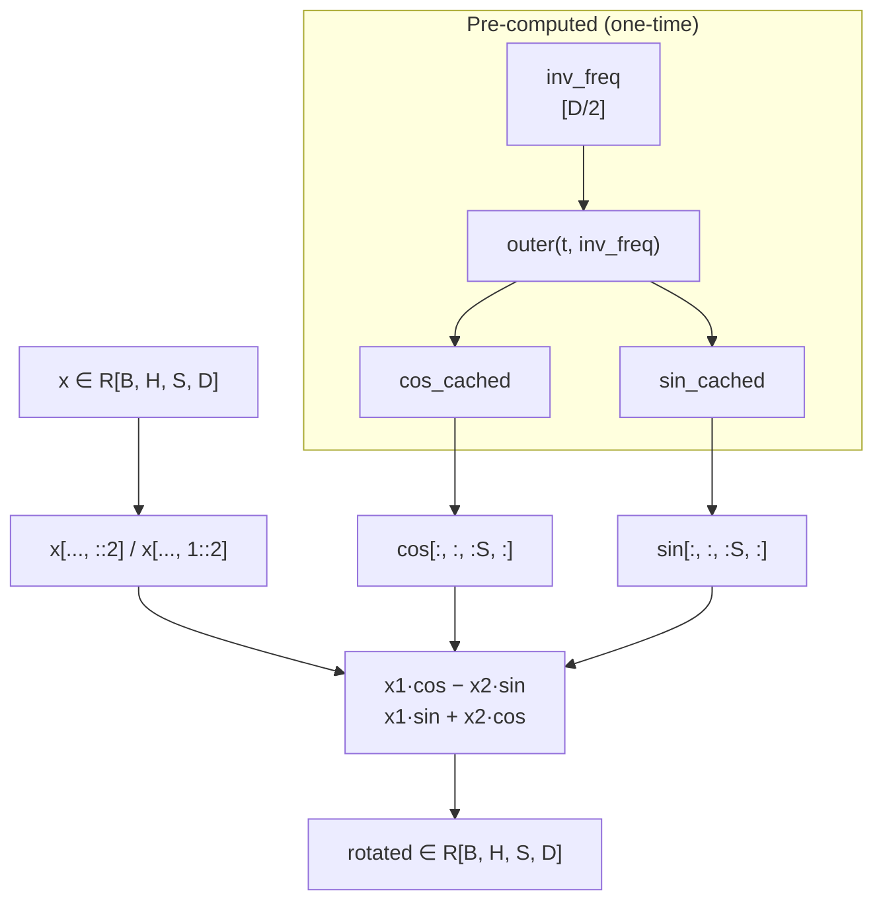

---

## 6. `RMSNorm` — Root Mean Square Layer Normalization

```python
class RMSNorm(nn.Module):
    def __init__(self, d_model: int, eps: float = 1e-5):
        super().__init__()
        self.eps = eps
        self.weight = nn.Parameter(torch.ones(d_model))

    def forward(self, x):
        norm_x = x * torch.rsqrt(x.pow(2).mean(-1, keepdim=True) + self.eps)
        return self.weight * norm_x
```

### 6.1 Why not LayerNorm?

LayerNorm centers by the mean **and** divides by the std. RMSNorm (Zhang & Sennrich, 2019) drops mean-centering — it normalizes by the root-mean-square of the activations alone:

```
RMSNorm(x) = γ ⊙ x / sqrt(mean(x²) + ε)
```

Empirically indistinguishable from LayerNorm for transformers, but **~7–10 % faster** because the mean subtraction kernel is gone.

### 6.2 Walk-through

1. `x.pow(2)` — square every activation along the last axis.
2. `.mean(-1, keepdim=True)` — collapse to a scalar per `(B, S)` position, shape `[B, S, 1]`.
3. `+ self.eps` — guard against `0/0` when a row is exactly zero.
4. `torch.rsqrt(...)` — fused `1/√` on the GPU; cheaper than `**(-0.5)`.
5. Multiply by `x` — broadcasts the scalar RMS across the feature axis.
6. Multiply by learnable `self.weight` — per-channel gain, initialized to **1** so the layer is initially the identity.

### 6.3 Tensor shapes

| Variable | Shape |
|---|---|
| `x` | `[B, S, d_model]` |
| `mean(x²)` | `[B, S, 1]` |
| `norm_x`, output | `[B, S, d_model]` |
| `self.weight` | `[d_model]` |

### 6.4 Parameter count

`d_model = 1024` per norm × `~34 norms in the model` (16 blocks × 2 + 1 final) ≈ **35 K** parameters total — essentially free.

### 6.5 Mermaid view

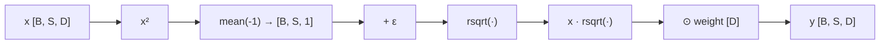

---

## 7. `GroupedQueryAttention` — GQA with RoPE + Flash-Attention-2

```python
class GroupedQueryAttention(nn.Module):
    def __init__(self, d_model, n_heads, n_kv_heads, head_dim,
                 max_seq_len, rope_theta):
        super().__init__()
        self.n_heads = n_heads
        self.n_kv_heads = n_kv_heads
        self.head_dim = head_dim
        self.n_rep = n_heads // n_kv_heads

        self.q_proj = nn.Linear(d_model, n_heads   * head_dim, bias=False)
        self.k_proj = nn.Linear(d_model, n_kv_heads * head_dim, bias=False)
        self.v_proj = nn.Linear(d_model, n_kv_heads * head_dim, bias=False)
        self.out_proj = nn.Linear(n_heads * head_dim, d_model, bias=False)

        self.rope = RoPE(head_dim, max_seq_len, rope_theta)

    def forward(self, x, mask=None):
        B, S, _ = x.shape

        q = self.q_proj(x).view(B, S, self.n_heads,   self.head_dim).transpose(1, 2)
        k = self.k_proj(x).view(B, S, self.n_kv_heads, self.head_dim).transpose(1, 2)
        v = self.v_proj(x).view(B, S, self.n_kv_heads, self.head_dim).transpose(1, 2)

        q = self.rope(q, S)
        k = self.rope(k, S)

        if self.n_rep > 1:
            k = k[:, :, None, :, :].expand(B, self.n_kv_heads, self.n_rep, S, self.head_dim)\
                                    .reshape(B, self.n_heads, S, self.head_dim)
            v = v[:, :, None, :, :].expand(B, self.n_kv_heads, self.n_rep, S, self.head_dim)\
                                    .reshape(B, self.n_heads, S, self.head_dim)

        x = F.scaled_dot_product_attention(q, k, v, is_causal=True)

        x = x.transpose(1, 2).contiguous().view(B, S, -1)
        return self.out_proj(x)
```

### 7.1 What is Grouped-Query Attention (GQA)?

Standard Multi-Head Attention (MHA) gives every head its own K and V. Multi-Query Attention (MQA) shares a **single** K/V across heads — great for inference KV-cache size but slightly worse quality. **GQA is the middle ground**: query heads are grouped, and each group shares one K and V.

```
n_heads = 8 query heads, n_kv_heads = 4 KV heads → n_rep = 2
KV head 0 ↔ Q heads {0, 1}
KV head 1 ↔ Q heads {2, 3}
KV head 2 ↔ Q heads {4, 5}
KV head 3 ↔ Q heads {6, 7}
```

### 7.2 Walk-through

| Step | Operation | Output shape |
|---|---|---|
| 1. Project Q | `q_proj(x)` then `[B, S, H, Dh]` → `[B, H, S, Dh]` | `[B, 8, S, 128]` |
| 2. Project K | `k_proj(x)` reshape | `[B, 4, S, 128]` |
| 3. Project V | `v_proj(x)` reshape | `[B, 4, S, 128]` |
| 4. Apply RoPE | only to Q and K, **not V** | same as above |
| 5. Expand K/V | `[:, :, None]` adds a unit axis; `expand` materializes broadcast in shape only; `reshape` collapses back to `[B, n_heads, S, head_dim]` | `[B, 8, S, 128]` |
| 6. Scaled dot-product attention | `F.scaled_dot_product_attention(q, k, v, is_causal=True)` | `[B, 8, S, 128]` |
| 7. Merge heads | transpose to `[B, S, 8, 128]`, flatten head dim | `[B, S, 1024]` |
| 8. Output projection | `out_proj` | `[B, S, 1024]` |

`is_causal=True` is what makes this an **autoregressive** attention block — each position can only see `≤ current`. PyTorch's SDPA dispatches to **Flash-Attention-2 / memory-efficient** kernels on supported hardware (e.g., A100), giving O(S) memory instead of O(S²) and a 2–3× speedup.

### 7.3 Why no `mask` argument?

Although `forward` accepts `mask=None`, the implementation uses the **causal** mask exclusively via `is_causal=True`. This is sufficient for language modeling and avoids materializing an explicit `[S, S]` mask.

### 7.4 Why no biases in projections?

Following LLaMA-3, all linears in this model use `bias=False`. Empirically, the gain in quality is negligible while parameters and FLOPs are slightly reduced.

### 7.5 Parameter breakdown (per layer)

| Linear | Shape | Params |
|---|---|---|
| `q_proj` | 1024 × 1024 | 1 048 576 |
| `k_proj` | 1024 × 512 | 524 288 |
| `v_proj` | 1024 × 512 | 524 288 |
| `out_proj` | 1024 × 1024 | 1 048 576 |
| **Total** | | **3 145 728** |

Across 16 layers → **~50 M parameters** for attention (≈ 12 MB in BF16).

### 7.6 Mermaid view

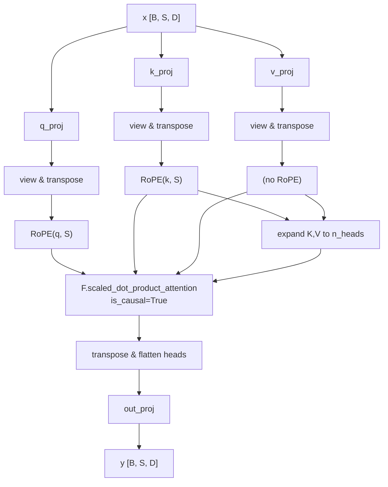

---

## 8. `SwiGLUFFN` — Gated Feed-Forward Network

```python
class SwiGLUFFN(nn.Module):
    def __init__(self, d_model: int, d_ff: int):
        super().__init__()
        self.gate_up_proj = nn.Linear(d_model, 2 * d_ff, bias=False)
        self.down_proj    = nn.Linear(d_ff, d_model, bias=False)
        self.d_ff = d_ff

    def forward(self, x):
        gate_up = self.gate_up_proj(x)
        gate, up = gate_up.chunk(2, dim=-1)
        return self.down_proj(F.silu(gate) * up)
```

### 8.1 What is SwiGLU?

SwiGLU (Shazeer, 2020) replaces the classic ReLU FFN with a **gated** two-path block:

```
FFN(x) = down( SiLU(gate_proj(x)) ⊙ up_proj(x) )
```

`SiLU(x) = x · σ(x)` is smooth, non-monotonic, and avoids the "dying ReLU" pathology. Empirically SwiGLU consistently beats plain ReLU/GeLU FFNs in LLMs.

### 8.2 The fused-projection trick

Standard SwiGLU has **three** projections (`gate_proj`, `up_proj`, `down_proj`). This code fuses the first two into a single `gate_up_proj` of width `2 × d_ff`, then `chunk`s the output into `gate` and `up` halves.

**Why fuse?** A single GEMM reads the input once from global memory instead of twice — saving bandwidth. PyTorch launches one bigger matmul kernel rather than two smaller ones, typically yielding a few-percent speedup.

### 8.3 Walk-through

| Step | Operation | Output shape |
|---|---|---|
| 1. Fused projection | `gate_up_proj(x)` | `[B, S, 2·d_ff]` |
| 2. Split | `chunk(2, dim=-1)` | each `[B, S, d_ff]` |
| 3. Gate | `F.silu(gate)` | `[B, S, d_ff]` |
| 4. Elementwise | `silu(gate) * up` | `[B, S, d_ff]` |
| 5. Down-project | `down_proj(...)` | `[B, S, d_model]` |

### 8.4 Parameter breakdown (per layer)

| Linear | Shape | Params |
|---|---|---|
| `gate_up_proj` | 1024 × 8192 | 8 388 608 |
| `down_proj` | 4096 × 1024 | 4 194 304 |
| **Total** | | **12 582 912** |

Across 16 layers → **~201 M parameters** for FFNs — the dominant weight budget.

### 8.5 Mermaid view

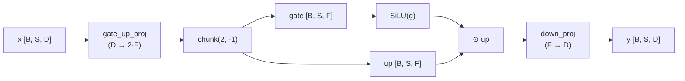

---

## 9. `DecoderBlock` — Pre-Norm Transformer Block

```python
class DecoderBlock(nn.Module):
    def __init__(self, d_model, n_heads, n_kv_heads, head_dim,
                 d_ff, max_seq_len, rope_theta):
        super().__init__()
        self.attention      = GroupedQueryAttention(
            d_model, n_heads, n_kv_heads, head_dim, max_seq_len, rope_theta)
        self.ffn            = SwiGLUFFN(d_model, d_ff)
        self.attention_norm = RMSNorm(d_model, eps=1e-5)
        self.ffn_norm       = RMSNorm(d_model, eps=1e-5)

    def forward(self, x):
        x = x + self.attention(self.attention_norm(x))
        x = x + self.ffn(self.ffn_norm(x))
        return x
```

### 9.1 Pre-norm vs post-norm

This block uses **pre-norm** (normalize **before** the sub-layer, residual adds the *un-normalized* input). Pre-norm gives cleaner gradient flow in deep stacks — LLaMA / PaLM / GPT-3 all use it.

```
x ──┬─► RMSNorm ─► GQA ─► (+) ──┬─► RMSNorm ─► SwiGLU ─► (+) ──► out
    └─────────────────────────┘  └──────────────────────────────┘
```

### 9.2 Why two separate RMSNorms?

Each sub-layer has its own scale (`γ_a`, `γ_f`) — they learn to keep the attention and FFN contributions well-calibrated independently. Sharing one norm would couple their statistics.

### 9.3 Residual stream interpretation

You can read the block as repeatedly editing a single **residual stream**:

- Layer *ℓ* reads from `x` (carrying information from all earlier layers).
- The attention sub-layer adds contextual information ("which previous tokens matter?").
- The FFN sub-layer adds non-linear transformations of that context ("update the meaning").

Because residuals are **additive**, every sub-layer has an unobstructed gradient path back to the embedding — this is what allows 16+ layer stacks to train stably.

### 9.4 Parameter count (per block)

| Component | Params |
|---|---|
| Attention (4 linears) | 3 145 728 |
| FFN (2 linears) | 12 582 912 |
| 2 × RMSNorm (1024 each) | 2 048 |
| **Total per block** | **15 730 688** |

Across 16 blocks → **~251.7 M** — essentially the "non-embedding" parameter count quoted in the README.

### 9.5 Mermaid view

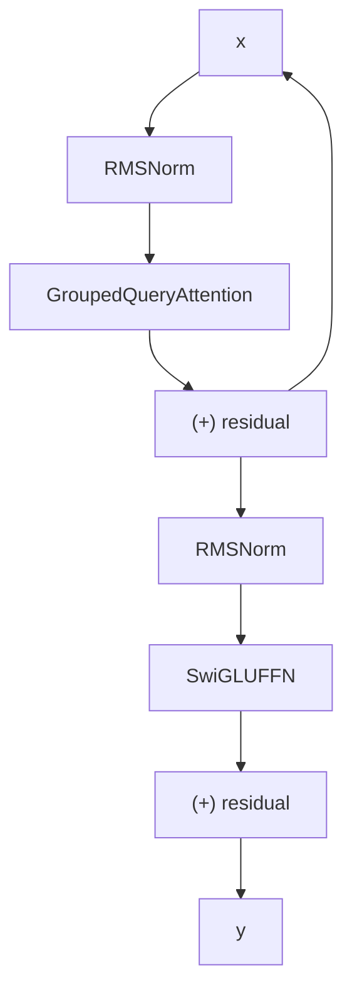

---

## 10. `Decoder` — Stack of Blocks + Final Norm

```python
class Decoder(nn.Module):
    def __init__(self, layers: nn.ModuleList, d_model: int, eps: float = 1e-5):
        super().__init__()
        self.layers = layers
        self.norm = RMSNorm(d_model, eps=eps)

    def forward(self, x):
        for layer in self.layers:
            x = layer(x)
        return self.norm(x)
```

### 10.1 What this is

The `Decoder` is the *body* of the model — it owns the list of `DecoderBlock`s and applies them sequentially in a Python `for` loop. It then applies one last RMSNorm before handing the hidden states to the output projection.

### 10.2 Why a final norm?

Inside every block the residuals preserve the scale of the input. By the time the stream has passed through 16 blocks, its magnitude can drift. The final RMSNorm re-centers the activations to a known scale, which:

- makes the output projection's job easier (no runaway activations entering it),
- mirrors the LLaMA-3 reference architecture,
- adds negligible compute (one extra `d_model`-wide reduction).

### 10.3 Why iterate in Python (not `nn.Sequential`)?

`nn.Sequential` would also work, but an explicit `for` loop:

- integrates naturally with **gradient checkpointing** (the model wraps each layer individually — see §11),
- keeps each block introspectable for debugging / probing,
- matches the reference LLaMA-3 implementation style.

### 10.4 Mermaid view

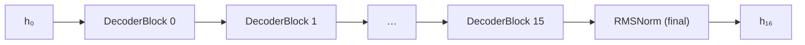

---

## 11. `Transformer` — The Full Model

```python
class Transformer(nn.Module):
    def __init__(self, vocab_size, d_model, n_layers, n_heads, n_kv_heads,
                 head_dim, d_ff, max_seq_len, rope_theta=500000.0,
                 rms_norm_eps=1e-5, gradient_checkpointing=False):
        super().__init__()
        self.input_embedding = InputEmbedding(d_model, vocab_size)

        decoder_layers = nn.ModuleList([
            DecoderBlock(d_model, n_heads, n_kv_heads, head_dim,
                         d_ff, max_seq_len, rope_theta)
            for _ in range(n_layers)
        ])
        self.decoder = Decoder(decoder_layers, d_model, eps=rms_norm_eps)

        self.output_proj = nn.Linear(d_model, vocab_size, bias=False)

        self.d_model = d_model
        self.n_layers = n_layers
        self.gradient_checkpointing = gradient_checkpointing
        self._init_weights()

    def _init_weights(self):
        for module in self.modules():
            if isinstance(module, nn.Linear):
                torch.nn.init.normal_(module.weight, mean=0.0, std=0.02)
            elif isinstance(module, nn.Embedding):
                torch.nn.init.normal_(module.weight, mean=0.0, std=0.02)

    def forward(self, x):
        x = self.input_embedding(x)
        if self.gradient_checkpointing and self.training:
            for layer in self.decoder.layers:
                x = checkpoint(layer, x, use_reentrant=False)
        else:
            x = self.decoder(x)
        logits = self.output_proj(x)
        return logits

    def get_num_params(self, non_embedding=True):
        n_params = sum(p.numel() for p in self.parameters())
        if non_embedding:
            n_params -= self.input_embedding.embedding.weight.numel()
            n_params -= self.output_proj.weight.numel()
        return n_params

    def enable_gradient_checkpointing(self):
        self.gradient_checkpointing = True

    def disable_gradient_checkpointing(self):
        self.gradient_checkpointing = False
```

### 11.1 Construction order

1. **InputEmbedding** — turns token IDs into 1024-D vectors.
2. **`n_layers` DecoderBlocks** — wrapped in an `nn.ModuleList` (PyTorch's container for a list of modules — registers all parameters correctly).
3. **Decoder** — owns the list + a final RMSNorm.
4. **Output projection** — a single `nn.Linear(d_model, vocab_size, bias=False)` that maps the hidden state to one logit per vocabulary token.

Note that **`output_proj` is *not* tied to the input embedding** (`tie_embeddings = False` in `config.py`). LLaMA-3 deliberately unties them, so both are independently trainable.

### 11.2 Weight initialization

Every `nn.Linear` and `nn.Embedding` is initialized from `N(0, 0.02)`. This is the GPT-2 / BERT convention — small variance prevents the very first forward pass from producing exploding activations.

### 11.3 Gradient checkpointing

Activation memory for 16 layers at batch size 96, seq 2048 is enormous — roughly **70 GB** if every layer's intermediate tensors are kept for backward. The fix is **gradient (a.k.a. activation) checkpointing:

- During forward, only the **input** of each layer is retained.
- During backward, each layer's forward is **re-run on-the-fly** to recover the intermediates it needs.

The `if self.gradient_checkpointing and self.training` guard means the model behaves normally at inference (`.eval()`), and the **~25 % extra compute** is paid only during training.

`use_reentrant=False` selects PyTorch's newer, non-reentrant implementation that is more memory-efficient and plays nicely with `torch.compile`.

### 11.4 `get_num_params(non_embedding=True)`

Returns **total** params by default; with `non_embedding=True` it subtracts both the input embedding and the output projection. The README's "non-embedding ≈ 252 M" figure corresponds to this — note that even though `output_proj` is technically a classifier head (not an embedding), it has the same `[V, D]` shape and is conventionally subtracted together with the input embedding.

### 11.5 Runtime toggles

`enable_gradient_checkpointing()` / `disable_gradient_checkpointing()` let you flip the flag after construction — useful for ablation studies (e.g., "what if I turn checkpointing off for the last 1k steps to use a bigger batch?").

### 11.6 End-to-end forward

| Stage | Shape | Operation |
|---|---|---|
| Input IDs | `[B, S]` | int64 |
| Embedding | `[B, S, 1024]` | lookup |
| Decoder stack | `[B, S, 1024]` | 16× (norm → attn → residual → norm → ffn → residual) |
| Final norm | `[B, S, 1024]` | RMSNorm |
| Output proj | `[B, S, 128 256]` | Linear |
| **Logits** | `[B, S, V]` | returned |

### 11.7 Mermaid view

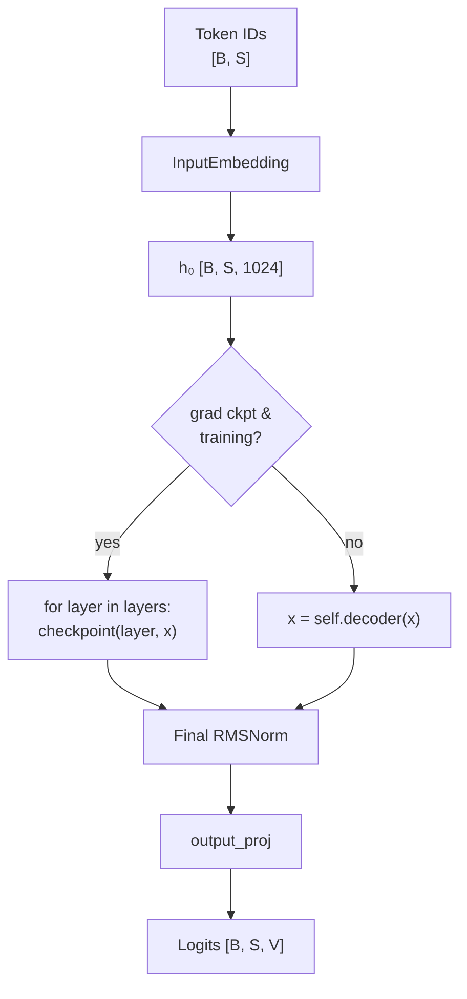

---

## 12. `chunked_cross_entropy` — Memory-Efficient Loss

```python
def chunked_cross_entropy(logits, targets, chunk_size=65536, ignore_index=-100):
    total_loss = torch.tensor(0.0, device=logits.device)
    total_count = torch.tensor(0, device=logits.device, dtype=torch.long)

    for start in range(0, logits.shape[0], chunk_size):
        end = min(start + chunk_size, logits.shape[0])
        chunk_logits  = logits[start:end]
        chunk_targets = targets[start:end]
        chunk_loss = F.cross_entropy(chunk_logits, chunk_targets,
                                     ignore_index=ignore_index, reduction='none')
        mask = chunk_targets != ignore_index
        total_loss  = total_loss  + chunk_loss[mask].sum()
        total_count = total_count + mask.sum()

    if total_count > 0:
        return total_loss / total_count.float()
    return torch.tensor(0.0, device=logits.device, requires_grad=True)
```

### 12.1 Why this function exists

Materializing `F.cross_entropy(logits, targets)` requires PyTorch to construct (or upstream-receive) the full `logits` tensor of shape `[B·S, V]`. For our config:

```
96 × 2048 × 128 256 × 2 bytes (BF16) ≈ 50 GB
```

…which alone blows past an A100-80GB's capacity once you add the model, optimizer state, and activations. **Chunked** cross-entropy avoids ever materializing that full tensor from the model's output projection: we slice logits into chunks of `chunk_size` rows and accumulate the loss incrementally.

### 12.2 Algorithm

For each chunk of `chunk_size` rows:

1. `F.cross_entropy(..., reduction='none')` — per-token loss, shape `[chunk_size]`.
2. Mask out positions where `targets == ignore_index` (typically -100, used for padding / loss-less labels).
3. Accumulate the **sum** of valid losses into `total_loss` and the **count** of valid tokens into `total_count`.
4. After the loop, return `total_loss / total_count`.

Because cross-entropy is additive across rows, the chunked result is **numerically identical** (within float rounding) to the unchunked version.

### 12.3 Why tensor accumulators?

`total_loss` and `total_count` are **GPU tensors**, not Python floats. If we used Python `float`s, every iteration would force a CPU↔GPU sync (`item()` call), serializing the loop. Keeping the accumulators on-device lets the loop run asynchronously and overlap with kernel launches.

### 12.4 Chunk size

`chunk_size=65536` (= 64 K rows) is chosen so that the largest temporary (`chunk_logits @ exp(...)`) is `65536 × 128256 × 2 ≈ 16 GB` at FP32 or `~8 GB` in BF16 — still big but transient. The peak saved memory vs. the unchunked version is **~99 %** of the logits tensor.

### 12.5 Edge case

If every target is `ignore_index`, `total_count == 0`. Returning `total_loss / total_count` would NaN — instead the function returns a `requires_grad=True` zero tensor so autograd still produces a valid (zero-gradient) backward pass.

### 12.6 Mermaid view

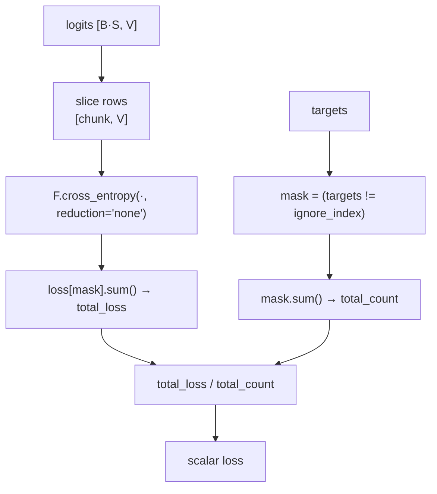

---

## 13. `build_transformer` — Factory + Diagnostic Print

```python
def build_transformer(
    vocab_size=128256, d_model=1024, n_layers=16,
    n_heads=8, n_kv_heads=4, head_dim=128, d_ff=4096,
    max_seq_len=2048, rope_theta=500000.0,
    rms_norm_eps=1e-5, gradient_checkpointing=False,
) -> Transformer:
    model = Transformer(
        vocab_size=vocab_size, d_model=d_model, n_layers=n_layers,
        n_heads=n_heads, n_kv_heads=n_kv_heads, head_dim=head_dim,
        d_ff=d_ff, max_seq_len=max_seq_len, rope_theta=rope_theta,
        rms_norm_eps=rms_norm_eps,
        gradient_checkpointing=gradient_checkpointing,
    )
    num_params = sum(p.numel() for p in model.parameters())
    non_embed  = num_params \
        - model.input_embedding.embedding.weight.numel() \
        - model.output_proj.weight.numel()
    print(f"Total params: {num_params:,} ({num_params/1e6:.1f}M)")
    print(f"Non-embedding params: {non_embed:,} ({non_embed/1e6:.1f}M)")
    if gradient_checkpointing:
        print(f"Gradient checkpointing: ENABLED")
    return model
```

### 13.1 Purpose

A single entry point that:

- exposes sensible defaults matching the LLaMA-3-Lite config,
- instantiates the model,
- prints a parameter report so you can sanity-check at startup.

### 13.2 Defaults match LLaMA-3-Lite

| Arg | Default | Why |
|---|---|---|
| `vocab_size` | 128 256 | LLaMA-3 tokenizer |
| `d_model` | 1024 | Hidden width |
| `n_layers` | 16 | Depth |
| `n_heads` / `n_kv_heads` | 8 / 4 | GQA 2:1 |
| `head_dim` | 128 | → 8 × 128 = 1024 ✓ |
| `d_ff` | 4096 | 4× d_model |
| `max_seq_len` | 2048 | Training context |
| `rope_theta` | 500 000 | LLaMA-3 base |
| `rms_norm_eps` | 1e-5 | Standard |
| `gradient_checkpointing` | False | Caller flips on |

### 13.3 The diagnostic print

```
Total params:          515 000 000  (515.0M)
Non-embedding params:  252 000 000  (252.0M)
Gradient checkpointing: ENABLED       (only when enabled)
```

The "non-embedding" figure subtracts both the input embedding (`V·D ≈ 131 M`) **and** the output projection (`D·V ≈ 131 M`) — giving the true "transformer body" size. This convention matches the original LLaMA paper's reporting style.

### 13.4 Mermaid view

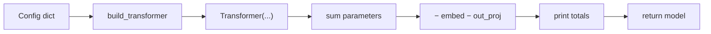

---

## 14. End-to-End Forward Pass Trace

A single training step for batch `B=96`, sequence `S=2048`:

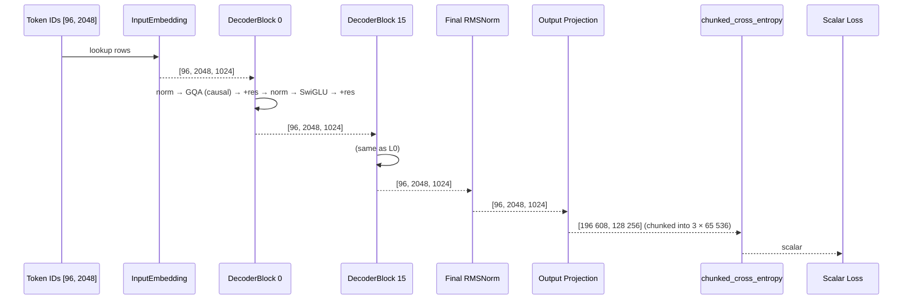

Per-step highlights:

- **Activation memory** is dominated by the **FFN intermediate** `silu(gate) * up` ≈ `96 × 2048 × 4096 × 2 B ≈ 1.6 GB` *per layer* — gradient checkpointing cuts this to ~0 between layers.
- **Compute** is dominated by the two **large GEMMs in the FFN**: `gate_up_proj` (1024 → 8192) and `down_proj` (4096 → 1024).
- **Numerical stability** is preserved by **RMSNorm** keeping the residual stream bounded and by **chunked CE** avoiding the log-softmax overflow risk on full-vocab logits.

---

## 15. Parameter Budget & Shape Cheat-Sheet

### Per-layer parameter counts

| Component | Shape | Params | BF16 size |
|---|---|---|---|
| `q_proj` | `D → n_heads·head_dim` | 1 048 576 | 2.0 MB |
| `k_proj` | `D → n_kv_heads·head_dim` | 524 288 | 1.0 MB |
| `v_proj` | `D → n_kv_heads·head_dim` | 524 288 | 1.0 MB |
| `out_proj` | `n_heads·head_dim → D` | 1 048 576 | 2.0 MB |
| `gate_up_proj` | `D → 2·d_ff` | 8 388 608 | 16.0 MB |
| `down_proj` | `d_ff → D` | 4 194 304 | 8.0 MB |
| 2 × RMSNorm `γ` | `[D]` | 2 048 | 4 KB |
| **Block total** | | **15 730 688** | **~30 MB** |

### Whole-model budget

| Group | Params | Notes |
|---|---|---|
| Input embedding `V·D` | 131 072 000 | token-id → vector |
| 16 × block | 251 690 944 | body of the model |
| Output projection `D·V` | 131 072 000 | classifier head (untied) |
| Final RMSNorm `γ` | 1 024 | negligible |
| **Total** | **~515 M** | |

The body (attention + FFN + norms) is **~252 M**, exactly the "non-embedding" figure.

### Shape cheat-sheet (one block)

```
x:                 [B, S, D]            = [96, 2048, 1024]
attention_norm:    [B, S, D]
q_proj(x):         [B, S, n_heads·head_dim] = [96, 2048, 1024]
q (after view):    [B, S, n_heads, head_dim]
q (after trans):   [B, n_heads, S, head_dim] = [96, 8, 2048, 128]
RoPE(q):           [B, n_heads, S, head_dim]
K (after expand):  [B, n_heads, S, head_dim] = [96, 8, 2048, 128]
SDPA output:       [B, n_heads, S, head_dim]
merged heads:      [B, S, D]
out_proj(·):       [B, S, D]
gate_up_proj(x):   [B, S, 2·d_ff]       = [96, 2048, 8192]
gate, up:          [B, S, d_ff]         = [96, 2048, 4096]
silu(gate) * up:   [B, S, d_ff]
down_proj(·):      [B, S, D]            = [96, 2048, 1024]
```

### Final model

```
logits:            [B, S, V]            = [96, 2048, 128 256]
chunked CE:        scalar
```

---

## 16. References

1. **LLaMA 3** — Meta AI (2024). *The Llama 3 Herd of Models.* arXiv:2407.21783.
2. **RoFormer / RoPE** — Su et al. (2021). *RoFormer: Enhanced Transformer with Rotary Position Embedding.* arXiv:2104.09864.
3. **GQA** — Ainslie et al. (2023). *GQA: Training Generalized Multi-Query Transformer Models from Multi-Head Checkpoints.* arXiv:2305.13245.
4. **RMSNorm** — Zhang & Sennrich (2019). *Root Mean Square Layer Normalization.* arXiv:1910.07467.
5. **SwiGLU** — Shazeer (2020). *GLU Variants Improve Transformer.* arXiv:2002.05202.
6. **Flash-Attention-2** — Dao (2023). *FlashAttention-2: Faster Attention with Better Parallelism and Work Partitioning.* arXiv:2307.08691.
7. **Gradient Checkpointing** — Chen et al. (2016). *Training Deep Nets with Sublinear Memory Cost.* arXiv:1604.06174.

---

*Document generated for the LLaMA-3-Lite repository. The content is keyed to `model.py` line numbers and the configuration in `config.py` so the documentation and code stay in lock-step.*

---

## Appendix — Extracted rationale (from inline comments)

For the deep first-principles theory, see [`../architecture.md`](../architecture.md)
(1,234 lines). This appendix captures the design-rationale notes that
previously lived as inline comments in `model.py`.

### Architecture summary (LLaMA-3-style, 515M params)

- **16 decoder blocks**, `d_model = 1024`.
- **GQA**: 8 Q heads / 4 KV heads, `head_dim = 128` → KV cache 2× smaller
  than MHA. `n_rep = n_heads // n_kv_heads = 2`.
- **SwiGLU FFN** (`d_ff = 4096`), **fused gate+up projection** — reads the
  input activation once instead of twice; one bigger GEMM kernel instead of
  two smaller ones (a few-percent speedup).
- **RoPE θ = 500 000** (LLaMA-3 base — long-context extrapolation; see
  [`rope.md`](rope.md)).
- **RMSNorm pre-norm** (drops mean-centering vs LayerNorm; ~7–10% faster,
  empirically indistinguishable for transformers). Each sub-layer has its
  own norm scale so attention and FFN contributions are calibrated
  independently.
- **vocab = 128 000** (LLaMA-3 tokenizer; runtime widened to 128 256 via
  `max(config['vocab_size'], len(tokenizer))`).
- **seq_len = 2048**.
- **No weight tying** (`tie_embeddings = False`) — LLaMA-3 does not tie
  input/output embeddings; the output projection is a separate learnable
  `[D, V]` matrix.
- **Gradient checkpointing** — trades ~25% per-step compute for ~78%
  activation memory reduction (70 GB → 3.2 GB). `use_reentrant=False`
  selects PyTorch's newer, non-reentrant implementation that is more
  memory-efficient and plays nicely with `torch.compile`. Only triggers in
  `.train()` mode; `.eval()` is a no-op.
- **Weight init**: `N(0, 0.02)` for every `nn.Linear` and `nn.Embedding`
  (GPT-2 / BERT convention — small variance prevents exploding activations
  on the first forward pass).
- **No biases** in any linear (`bias=False` throughout, LLaMA-3 style —
  negligible quality gain, slightly fewer params/FLOPs).

### `chunked_cross_entropy` rationale

The full logits tensor at batch 96 × seq 2048 × vocab 128 256 is ~50 GB in
BF16 — alone enough to OOM an A100-80GB. Chunking processes rows in
`chunk_size = 256` token chunks and accumulates `total_loss / total_count`
on-device (GPU-tensor accumulators avoid per-iteration CPU↔GPU syncs).
Because cross-entropy is additive across rows, the chunked result is
**numerically identical** (within 1e-5) to the unchunked
`F.cross_entropy`. The edge case where every target is `ignore_index`
returns a `requires_grad=True` zero tensor so autograd still produces a
valid (zero-gradient) backward pass.

### `get_num_params(non_embedding=True)` definition

Subtracts **both** the input embedding and the output projection (both are
`[V, D]`-shaped and conventionally excluded together). Matches the README's
"non-embedding ≈ 252 M" figure. Note: the README/wandb definition and
`model.get_num_params` must agree — see `tests/test_model.py::
TestTransformerParamCount::test_get_num_params_definition_mismatch` for the
regression that flags drift.

### Param budget (515M config)

| Group | Params | BF16 size |
|-------|--------|-----------|
| Input embedding `V·D` | 131 072 000 | 262 MB |
| 16 × decoder block | 251 690 944 | ~480 MB |
| Output projection `D·V` (untied) | 131 072 000 | 262 MB |
| Final RMSNorm `γ` | 1 024 | 2 KB |
| **Total** | **~515 M** | ~1 GB weights (BF16) |
