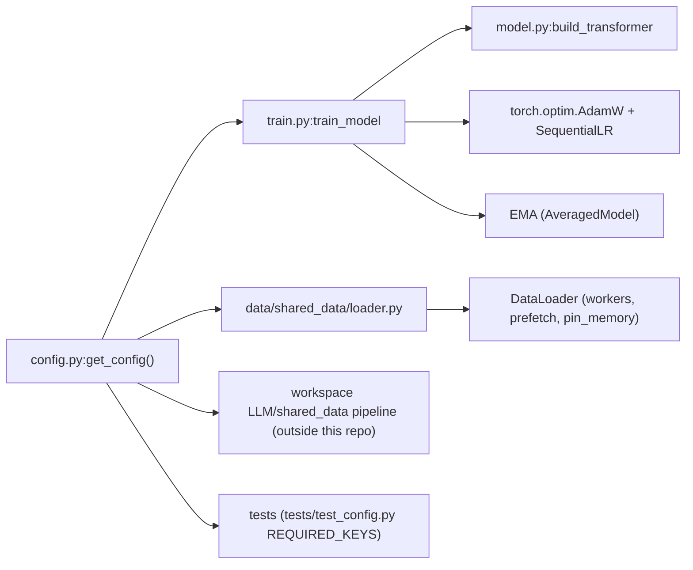

# Config Reference — `config.py`

> Audience: intermediate. Code-keyed walkthrough of every key in `config.py:get_config`, grouped by concern, with defaults, consumers, and a worked memory budget.

## 1. The 60-second summary

`config.py` is the single source of truth for the whole training run: model shape, optimizer and schedule, precision and memory engineering, the data pipeline, checkpointing, and W&B logging. `train.py:train_model` reads it directly, `data/shared_data/loader.py` reads the subset it needs, and `model.py:build_transformer` receives its architecture values as keyword arguments. The dict is a **contract with the test suite**: `tests/test_config.py::TestGetConfig.test_has_all_required_keys` fails if any declared key disappears, and `tests/test_config.py::TestGetConfig.test_no_extra_unknown_keys` fails if any undocumented key is added — so adding or removing a key is a deliberate, reviewed change. Roughly half the keys are load-bearing (they change numerics or memory), a handful are informational (they document intent or pass through to the workspace data pipeline outside this repo), and the defaults are tuned so that `python train.py` on a single A100 80GB "just works".

## 2. How the config flows

Consumers mostly read through `config.get(key, default)` rather than `config[key]`, which is what lets tests inject a partial `tiny_config` (`tests/conftest.py`) and have everything fall back to sane values. The values below are the production defaults from `config.py:get_config` unless stated otherwise.

## 3. Architecture group

These keys fix the model topology. They are consumed in `train.py:train_model` (passed positionally into `model.py:build_transformer`) and in the full-config model tests (`tests/test_model.py`). All are load-bearing: changing any of them changes the parameter count and the FLOPs at every step.

| Key | Default | Controls | Why | Consumed by |
|---|---|---|---|---|
| `d_model` | `1024` | Hidden width of the residual stream | Width of every projection; the "currency" of the transformer | `train.py:train_model` → `model.py:build_transformer` |
| `n_layers` | `16` | Number of `DecoderBlock`s | Depth; 16 layers × 1024-wide is the classic 500M-param regime | same |
| `n_heads` | `8` | Number of query heads | Attention parallelism; `8 × 128 = 1024 = d_model` | same |
| `n_kv_heads` | `4` | Number of KV heads (GQA) | KV projection width `4 × 128 = 512`, half of `d_model`; `n_rep = 8 / 4 = 2` | same |
| `head_dim` | `128` | Per-head width | Scales QK dot products (`÷ √128`); RoPE buffer shape | same |
| `d_ff` | `4096` | SwiGLU hidden width | `4× d_model`; fused `gate_up_proj` is `2·d_ff = 8192` wide | same |
| `vocab_size` | `128000` | Embedding / LM-head vocabulary | Floor on vocab: `real_vocab_size = max(vocab_size, len(tokenizer))` in `train.py:train_model`, so the real LLaMA-3 tokenizer (128,256) wins when loaded | `train.py:train_model`, `data/shared_data/loader.py:_SyntheticTokenizerStub` |
| `seq_len` | `2048` | Context window | RoPE buffer length; dataloader chunks are `seq_len + 1` (next-token shift); tokens/step `= batch × seq` | `model.py:RoPE`, `data/shared_data/loader.py:PackedDataset`, `train.py:train_model` |
| `rope_theta` | `500000.0` | RoPE base frequency | `inv_freq = 1 / θ^(2i/head_dim)`; high θ slows rotation so long-range positions stay resolvable — see [positional-encoding.md](../theory/positional-encoding.md) | `model.py:RoPE` |
| `rms_norm_eps` | `1e-5` | RMSNorm epsilon | Prevents divide-by-zero in `x·rsqrt(mean(x²) + eps)`; note the QK-norm instances in `model.py:GroupedQueryAttention` hardcode `1e-5` rather than reading this key | `model.py:RMSNorm` via `model.py:DecoderBlock`, `model.py:Decoder` |

Parameter anatomy at these values (derived, consistent with `model.py:Transformer.get_num_params`):

- Input embedding: `128000 × 1024 = 131,072,000` (131.1M).
- Output projection: `1024 × 128000 = 131,072,000` (131.1M) — **untied** (see below).
- Per `DecoderBlock`: attention `3,145,728` (q/k/v/out: `1024² + 2·1024·512 + 1024²`) + QK-norm `256` + SwiGLU `12,582,912` (`1024·8192 + 4096·1024`) + two norms `2,048` = `15,730,944`.
- 16 blocks + final norm: `251,696,128` ≈ 251.7M non-embedding; total **513.8M** (the `llama3-515M` filename rounds this up).

**`tie_embeddings` is deliberately absent.** There is no weight sharing: `model.py:Transformer` builds `output_proj` as an independent `nn.Linear(d_model, vocab_size)`, so the LM head costs a full 131.1M parameters. Untied heads are standard for LLaMA-3-style models (the input and output embeddings live in different gradient regimes), but the cost is real — see [model.md](model.md) and [transformers-from-scratch.md](../theory/transformers-from-scratch.md).

## 4. Training & optimizer group

| Key | Default | Controls | Why | Consumed by |
|---|---|---|---|---|
| `batch_size` | `96` | Micro-batch (tokens per step `= 96 × 2048 = 196,608`) | Sized so that 96×2048×1024 activations + BF16 fit one A100 80GB | `train.py:train_model`, `data/shared_data/loader.py:build_training_data` |
| `gradient_accumulation` | `1` | Number of micro-batches per optimizer step | Set >1 to emulate a larger batch on smaller GPUs; loss is divided by it and the optimizer steps only on `(step+1) % grad_accum == 0` | `train.py:train_model`, `train.py:save_checkpoint` (tokens_seen math) |
| `max_steps` | `42000` | Total optimizer steps | 42K × 196,608 tokens/step = **8.26B tokens** consumed, slightly over the 8B corpus — see the interaction note below | `train.py:train_model` (loop bound, scheduler `T_max`) |
| `learning_rate` | `3e-4` | Peak AdamW LR | Standard for ~500M-param LLMs with 8B tokens | `train.py:train_model` |
| `min_lr` | `3e-5` | Final LR (cosine floor) | `min_lr / lr = 0.1` — the cosine anneals 10× down; also sets the warmup start factor | `train.py:train_model` |
| `warmup_steps` | `2000` | Linear warmup length | ~5% of the run; avoids early-step instability with large gradients | `train.py:train_model` (LinearLR + SequentialLR milestone) |
| `weight_decay` | `0.1` | AdamW decoupled decay | Applied **only to 2-D+ parameters** (all `nn.Linear`/`nn.Embedding` weights); 1-D gains/biases get `0.0` — see [optimization.md](../theory/optimization.md) | `train.py:train_model` |
| `max_grad_norm` | `1.0` | Gradient clipping norm | `clip_grad_norm_` on every optimizer step; keeps BF16 training stable | `train.py:train_model` |
| `optimizer` | `'AdamW'` | **Informational** | Documented intent only: `train.py:train_model` hardcodes `torch.optim.AdamW` and W&B logs the literal string. Changing this key changes nothing. | none (logged to W&B) |
| `beta1` | `0.9` | Adam first moment decay | Standard; near-unity β2 is what makes AdamW work for LLM pretraining | `train.py:train_model` |
| `beta2` | `0.95` | Adam second moment decay | Lower than the classic 0.999: shorter moment memory suits 42K-step runs with heavy LR decay — see [optimization.md](../theory/optimization.md) | `train.py:train_model` |
| `eps` | `1e-8` | Adam epsilon | Denominator guard; harmless to leave at default | `train.py:train_model` |

**Interaction — `max_steps` vs the corpus.** 42,000 × 196,608 = 8.2575B tokens exceeds `target_tokens` (8B) minus the 5% validation holdout. `train.py:_next_batch` catches `StopIteration` and restarts the sampler with a fresh permutation (`ShuffledRangeSampler.set_epoch`) instead of crashing — the run wraps around into the training split once, printing a warning. This is by design; do not "fix" it by shrinking `max_steps`.

**Test invariants.** `tests/test_config.py::TestGetConfig.test_learning_rate_schedule_invariants` pins `0 < min_lr < learning_rate`, `0 < warmup_steps < max_steps`, `weight_decay >= 0`, `max_grad_norm > 0` — the schedule math assumes all of them.

## 5. Precision, compilation & memory group

| Key | Default | Controls | Why | Consumed by |
|---|---|---|---|---|
| `tf32` | `True` | TF32 matmul mode | `torch.backends.cuda.matmul.allow_tf32` + `cudnn.allow_tf32`: 10-bit mantissa matmuls on Ampere, ~2× throughput for a tiny accuracy cost — see [mixed-precision.md](../theory/mixed-precision.md) | `train.py:setup_gpu_optimizations` |
| `cudnn_benchmark` | `True` | cuDNN autotuning | Picks the fastest conv/GEMM algorithm for fixed shapes (all shapes are fixed here: 96×2048×d) | `train.py:setup_gpu_optimizations` |
| `cuda_alloc_conf` | `'expandable_segments:True'` | CUDA caching allocator | `PYTORCH_CUDA_ALLOC_CONF` env var, set before any CUDA work; lets the allocator grow segments and return them to the OS — matters for the loss's checkpointed chunk churn | `train.py:setup_gpu_optimizations` |
| `compile_model` | `True` | `torch.compile` | Wraps the model after build; a warmup forward+backward captures CUDA graphs before the loop | `train.py:train_model` |
| `compile_mode` | `'reduce-overhead'` | Compile mode | CUDA-graph capture; that mode owns the device stream, which is why the training loop's H2D copies must be `non_blocking=True` | `train.py:train_model` |
| `gradient_checkpointing` | `True` | Per-layer activation recomputation | `model.py:Transformer.forward` wraps each block in `torch.utils.checkpoint.checkpoint(layer, x, use_reentrant=False)` when training; this is what makes batch 96 fit 80GB — see [gradient-checkpointing.md](../theory/gradient-checkpointing.md) | `train.py:train_model` → `model.py:Transformer.forward` |
| `ce_chunk_size` | `256` | LM-head chunk rows | `chunked_head_cross_entropy_with_z` computes `hidden @ head_weight.T` in slices of 256 rows and runs each slice inside `checkpoint` — the single biggest memory lever in the run; see §8 and [loss-functions.md](../theory/loss-functions.md) | `train.py:train_model`, `train.py:validate` → `model.py:chunked_head_cross_entropy_with_z` |
| `rmsnorm_impl` | `'pytorch'` | RMSNorm backend | `'triton'` swaps in `kernels/rmsnorm_triton.py`; only honored when `ENABLE_TRITON_KERNELS=1` (see below) | `train.py:train_model` → `model.py:RMSNorm` |
| `swiglu_impl` | `'pytorch'` | SwiGLU backend | `'triton'` swaps in `kernels/swiglu_triton.py`; same env gate | `train.py:train_model` → `model.py:SwiGLUFFN` |
| `cross_entropy_impl` | `'pytorch'` | Loss backend | `'triton'` swaps in `kernels/cross_entropy_triton.py`; same env gate | `train.py:train_model`, `train.py:validate` → `model.py:chunked_head_cross_entropy_with_z` |

**The Triton gate.** Setting any `*_impl` to `'triton'` without `ENABLE_TRITON_KERNELS=1` makes `train.py:train_model` print a warning and force **all three** back to `'pytorch'` — a default run never silently takes a fused path. Even with the env var set, each kernel falls back to its PyTorch reference on `ImportError`/`ValueError` (e.g. Mac/CPU). See [kernels.md](kernels.md) and [kernel-programming.md](../theory/kernel-programming.md).

**Stability levers** (the "extra two knobs" beyond vanilla LLaMA-3):

| Key | Default | Controls | Why | Consumed by |
|---|---|---|---|---|
| `use_z_loss` | `True` | **Informational in this repo** | Only read in the startup banner in `train.py:train_model` ("Z-Loss: ON/OFF"). The functional switch is `z_loss_weight` — the loss is `ce + z_loss_weight·z` unconditionally, so `z_loss_weight=0` disables the term | `train.py:train_model` (print only) |
| `z_loss_weight` | `1e-4` | Z-loss strength | Penalizes `(logsumexp logits)²` over non-ignored tokens to stop late-run softmax collapse; passed into every loss call — see [loss-functions.md](../theory/loss-functions.md) | `train.py:train_model`, `train.py:validate` |
| `qknorm` | `True` | Per-head Q/K RMSNorm | Adds `q_norm`/`k_norm` (`RMSNorm(head_dim)`) after projection, before RoPE; bounds attention-logit growth (Qwen2/Gemma2 refinement). Adds `16 × 2 × 128 = 4,096` params; `False` swaps in `nn.Identity` for a bit-identical A/B — see [normalization.md](../theory/normalization.md) | `train.py:train_model` → `model.py:GroupedQueryAttention` |
| `use_ema` | `True` | Exponential moving-average shadow | `AveragedModel(model, multi_avg_fn=get_ema_multi_avg_fn(decay))`; validation and generation run on the EMA copy (`train.py:validate`, `train.py:generate_samples`), which is the noise-free center of the recent trajectory; costs one full BF16 copy (~1.03 GB) | `train.py:train_model` |
| `ema_decay` | `0.999` | EMA update factor | Right scale for 42K-step runs; 0.9999 suits >100K steps | `train.py:train_model` |

## 6. Data pipeline group

Two distinct consumers exist. **This repo's loader** reads a small subset to build dataloaders over the token cache; the **workspace pipeline** (`LLM/shared_data`, outside this repo, invoked by `data/prepare_data.py:main`) is what actually downloads, filters, dedups, tokenizes, and packs the corpus. Keys the loader does not read are pass-through documentation of that pipeline — they have no effect on `train.py` runs in this repo, but they are part of the config contract and are test-enforced.

| Key | Default | Controls | Why | Consumed by |
|---|---|---|---|---|
| `data_sources` | 6 sources (below) | Corpus mixture | Weighted mixture of FineWeb-Edu, The Stack, Wikipedia, StackOverflow-QA. **No consumer in this repo** — it documents the workspace pipeline's mixture; locally it is only validated by `tests/test_config.py::TestGetConfig.test_data_source_weights_positive` | workspace pipeline (out of repo); test-only locally |
| `num_workers` | `6` | DataLoader worker count | 6 workers × `prefetch_factor 16` keeps the GPU fed at ~200K tokens/step; `persistent_workers=True` | `data/shared_data/loader.py:build_training_data`, `build_synthetic_data` |
| `prefetch_factor` | `16` | Batches buffered per worker | Async CPU→GPU prefetch; passed as `None` when `num_workers == 0` | same |
| `pin_memory` | `True` | Pinned host memory | Enables `non_blocking=True` H2D copies — the only async transfer compatible with CUDA-graph stream ownership | same, plus `train.py:train_model` |
| `target_tokens` | `8_000_000_000` | **Pass-through** | Total corpus size for the workspace pipeline (8B × 4 B uint32 = 32 GB cache on disk). Informational in this repo | workspace pipeline |
| `data_cache_dir` | `'data_cache'` | Cache directory | `build_training_data` mmaps `data_cache/tokens.bin` and raises `FileNotFoundError` with a `prepare_data.py` hint if missing | `data/shared_data/loader.py:build_training_data`, `train.py:train_model` (fallback message) |
| `data_cache_filename` | `'tokens.bin'` | Cache file name | Raw little-endian uint32, no header | same |
| `reuse_data_cache` | `True` | **Pass-through** | Workspace pipeline: reuse the cache on subsequent runs rather than rebuilding. The local loader always mmaps whatever exists | workspace pipeline |
| `shuffle_documents` | `True` | **Pass-through** | Workspace pipeline: within-source document shuffle for diversity | workspace pipeline |
| `shuffle_seed` | `42` | Sampler RNG seed | Seeding `ShuffledRangeSampler` (`np.random.default_rng(seed + offset)`) makes the training permutation reproducible run to run; the only data key the **local** loader consumes for ordering | `data/shared_data/loader.py:build_training_data`, `build_synthetic_data` |
| `dedup` | `True` | **Pass-through** | Workspace pipeline: SHA-256 exact-dedup on raw text | workspace pipeline |
| `dedup_hash_bytes` | `256` | **Pass-through** | Workspace pipeline: hash prefix length (tokenizer-version-independent dedup) | workspace pipeline |
| `min_doc_tokens` | `16` | **Pass-through** | Workspace pipeline: drop documents shorter than this after tokenization | workspace pipeline |
| `max_doc_tokens` | `8192` | **Pass-through** | Workspace pipeline: truncate any single document to this many tokens | workspace pipeline |
| `tokenizer_name` | `'NousResearch/Meta-Llama-3-8B'` | HF tokenizer id | `AutoTokenizer.from_pretrained` in `data/shared_data/loader.py:build_tokenizer`; pad falls back to EOS. The load is best-effort — on failure the loader drops to `_SyntheticTokenizerStub` (byte ⇄ id) and warns that generation samples will be meaningless | `data/shared_data/loader.py:build_tokenizer` |
| `tokenizer_cache_dir` | `None` | HF cache location | `None` = default HF cache; set to pin the tokenizer download | same |
| `val_split` | `0.05` | Validation holdout | Last 5% of the token stream, aligned to `seq_len + 1` chunks (`split // chunk * chunk`), held out in both real and synthetic paths | `data/shared_data/loader.py:build_training_data`, `build_synthetic_data` |

The mixture (`data_sources`) with weights summing to 0.95:

| Source key | weight | HF dataset | Notes |
|---|---|---|---|
| `fineweb_edu` | 0.5 | `HuggingFaceFW/fineweb-edu` | Educational web text, majority share |
| `fineweb_code` | 0.1 | `HuggingFaceFW/fineweb-edu` (same repo!) | Word-filtered `'code'` subset via `filter_mode: 'word'` |
| `the_stack_python` | 0.2 | `bigcode/the-stack` | Python only |
| `the_stack_multilang` | 0.05 | `bigcode/the-stack` | 9 languages (JS, TS, Rust, Go, C, C++, Java, SQL, Shell) |
| `wikipedia` | 0.05 | `wikimedia/wikipedia` | `20231101.en` snapshot |
| `stackoverflow_qa` | 0.05 | `open-phi/StackOverflow-QA` | Q/A pairs |

Note `fineweb_code` points at the same HuggingFace repo as `fineweb_edu` and relies on the pipeline's word filter — the two entries are distinct *mixture components*, not distinct downloads. The sum 0.95 (not 1.0) is intentional slack; the test only requires `0.5 < sum ≤ 1.0`.

## 7. Checkpointing, evaluation & logging group

| Key | Default | Controls | Why | Consumed by |
|---|---|---|---|---|
| `model_folder` | `'weights'` | Checkpoint directory | Created on demand; all artifacts land here | `train.py:save_checkpoint`, `train.py:load_checkpoint`, `train.py:train_model` |
| `model_filename` | `'llama3-515M'` | Artifact name stem | Produces `<stem>_step_N.pt`, `<stem>_best.pt`, `<stem>_final_model_full.pt`, `<stem>_final_model_weights.pt` | same |
| `checkpoint_interval` | `5000` | Periodic save cadence | Every 5K steps; step 0 and the final save are handled separately | `train.py:train_model` |
| `keep_last_n_checkpoints` | `3` | Retention policy | Deletes `_step_*.pt` files older than the newest 3 (`_best.pt` and final files don't match the pattern, so they survive) | `train.py:train_model` |
| `async_checkpoint` | `True` | Background save | `torch.save` runs in a daemon `threading.Thread` (it releases the GIL); the loop joins the thread before exit. The final save is always synchronous — see [reproducibility.md](../theory/reproducibility.md) | `train.py:train_model` → `train.py:save_checkpoint` |
| `preload` | `None` | Cold-start vs resume | Any non-`None` value triggers `train.py:load_checkpoint`, which auto-globs the **latest** `_step_*.pt` — the value itself is not used as a path today, so it behaves as a boolean flag (`[INFERENCE]` about intent from the name) | `train.py:train_model` |
| `val_interval` | `2000` | Validation cadence | `step % 2000 == 0`; runs the chunked loss over the held-out split **on the EMA model**; a new best saves `<stem>_best.pt` | `train.py:train_model` → `train.py:validate` |
| `val_max_batches` | `100` | Validation cap | Bounds validation time; 100 batches × 196,608 tokens = 19.7M tokens per eval | `train.py:validate` |
| `generation_interval` | `20000` | Sample cadence | Every 20K steps, 5 fixed prompts decoded on the EMA model and logged as a W&B table | `train.py:train_model` → `train.py:generate_samples` |
| `generation_max_tokens` | `128` | Sample length | Cap per prompt; generation stops early on EOS | `train.py:generate_samples` |
| `generation_temperature` | `0.8` | Sampling temperature | Logits divided by temperature before top-k/top-p | `train.py:generate_samples` → `train.py:top_k_top_p_sampling` |
| `generation_top_k` | `50` | Top-k truncation | Restricts the sampling pool; note `top_p=0.9` is hardcoded in `train.py:generate_samples`, not configurable | same |
| `wandb_project` | `'langgpt-llama3-pretrain'` | W&B project | Run name is generated as `llama3-515M-<device>-<epoch>`; a config snapshot is logged at init | `train.py:train_model` |
| `wandb_entity` | `None` | W&B team/entity | `None` = the API key's default entity | same |
| `wandb_tags` | `['llama3','515M','a100','pretrain','code']` | W&B tags | Run discoverability | same |
| `log_interval` | `50` | Metric cadence | `step % 50 == 0` (and past the resume step): loss, LR, grad norm, step time, tokens/sec, data-wait time, GPU memory/utilization → W&B | `train.py:train_model` |

Checkpoints are full state: model, optimizer (Adam moments), scheduler, step, tokens seen, best val loss, Python/NumPy/PyTorch/CUDA RNG, the config dict itself, and the EMA shadow when present — see `train.py:save_checkpoint` / `train.py:load_checkpoint` and [reproducibility.md](../theory/reproducibility.md).

## 8. Worked memory budget (A100 80GB, config defaults)

Every number below is derived from the config values (§3–§6) unless marked measured. Full derivation and the technique-by-technique breakdown live in [memory-engineering.md](../theory/memory-engineering.md) and its summary table in [memory-stack.md](memory-stack.md).

**Constants.** Batch 96, seq 2048, d_model 1024, vocab 128,000, 16 layers, 513.8M params, BF16 training under `torch.autocast` (FP32 params are never held; Adam moments are FP32).

| Component | Arithmetic | Size |
|---|---|---|
| Weights (BF16) | `513.8M × 2 B` | 1.03 GB |
| Gradients (BF16) | `513.8M × 2 B` | 1.03 GB |
| AdamW moments (FP32) | `2 × 513.8M × 4 B` | 4.11 GB |
| EMA shadow (BF16) | `513.8M × 2 B` | 1.03 GB |
| Stored block inputs (`gradient_checkpointing=True`) | `16 × 96 × 2048 × 1024 × 2 B` | 6.44 GB |
| Single-block recompute peak (during backward) | `gate_up 3.22 + gate 1.61 + up 1.61 + down-input 1.61 + Q/K/V ≈ 0.8 GB` | ≈ 8.9 GB |
| LM-head logits, one chunk | `256 rows × 128,000 × 2 B = 65.5 MB` (131 MB FP32 after upcast) | ≈ 0.2 GB |
| **Peak total** | sum ≈ 22.9 GB, of which ≈ 9 GB is transient | **≈ 23 GB** |

Two claims in the project docs now check out against this budget:

- **The chunked head is the difference between fitting and not fitting.** Full logits for one step are `96 × 2048 = 196,608` rows × 128,000 columns = 25.2B elements: 50.3 GB in BF16, 100.6 GB in FP32 — impossible on 80GB. `model.py:chunked_head_cross_entropy_with_z` instead slices hidden into `ce_chunk_size`-row chunks (768 chunks at 256) and runs each chunk inside `checkpoint`, so only ~0.2 GB of logits is ever alive. This is the single largest line item removed.
- **The 92 GB → 20 GB headline.** With checkpointing off, all 16 layers' FFN intermediates live simultaneously: `16 × ≈6.4 GB ≈ 100 GB` derived, exceeding 80 GB; the 92 GB figure in AGENTS.md is the measured value for that configuration [measured]. With checkpointing on, the budget above lands at ≈23 GB including the EMA copy [derived] — consistent with the ~20 GB advertised [measured per project docs]. The 78% headline is `(92 − 20) / 92 ≈ 78.3%`.

`cuda_alloc_conf='expandable_segments:True'` matters here: the checkpointed loss chunks allocate and free repeatedly, and expandable segments let the caching allocator release that memory back to the OS instead of pinning peak-reserved segments.

**Off-GPU.** The 8B-token corpus is 32 GB of uint32 on disk (`data_cache/tokens.bin`), but the loader mmaps it, so resident RAM is page-sized, not 32 GB. Host-side prefetch: `6 workers × 16 batches × 3.15 MB/batch (input+target longs)` ≈ 0.3 GB pinned.

## 9. Informational vs load-bearing

| Class | Keys | Consequence of changing |
|---|---|---|
| Load-bearing (numerics) | `d_model`, `n_layers`, `n_heads`, `n_kv_heads`, `head_dim`, `d_ff`, `vocab_size`, `seq_len`, `rope_theta`, `rms_norm_eps`, `batch_size`, `gradient_accumulation`, `max_steps`, `learning_rate`, `min_lr`, `warmup_steps`, `weight_decay`, `max_grad_norm`, `beta1`, `beta2`, `eps`, `z_loss_weight`, `qknorm`, `use_ema`, `ema_decay` | Changes the loss, memory, or schedule every run |
| Load-bearing (memory/perf) | `compile_model`, `compile_mode`, `gradient_checkpointing`, `ce_chunk_size`, `tf32`, `cudnn_benchmark`, `cuda_alloc_conf`, `rmsnorm_impl`, `swiglu_impl`, `cross_entropy_impl` | Changes peak memory, throughput, or kernel selection |
| Load-bearing (I/O) | `num_workers`, `prefetch_factor`, `pin_memory`, `data_cache_dir`, `data_cache_filename`, `shuffle_seed`, `tokenizer_name`, `tokenizer_cache_dir`, `val_split`, `val_interval`, `val_max_batches`, `generation_*`, `model_folder`, `model_filename`, `checkpoint_interval`, `keep_last_n_checkpoints`, `async_checkpoint`, `preload`, `wandb_*`, `log_interval` | Changes data loading, evaluation, artifacts, or logging |
| Informational / pass-through | `optimizer`, `use_z_loss` (print-only in this repo), `data_sources`, `target_tokens`, `reuse_data_cache`, `shuffle_documents`, `dedup`, `dedup_hash_bytes`, `min_doc_tokens`, `max_doc_tokens` | No effect on local `train.py` runs; documents the workspace pipeline or W&B intent |

The three most dangerous to change casually: `ce_chunk_size` (raise it and the loss memory grows linearly — 65.5 MB × `chunk/256`), `gradient_checkpointing` (off ⇒ OOM at batch 96), and `rope_theta` (any deviation from 500K changes the positional frequency schedule the whole run is built around).

## 10. Design decisions

- **Plain dict, not a dataclass.** `config.py:get_config` returns a fresh dict; consumers use `config.get(key, default)`, so a partial config (the test `tiny_config` in `tests/conftest.py`, or the `e2e_gpu_smoke.py` override dict) behaves sensibly without re-specifying every key.
- **The test suite is the schema.** `tests/test_config.py::TestGetConfig.test_has_all_required_keys` guards against deletions, `test_no_extra_unknown_keys` against undocumented additions (its failure message says exactly that: "add tests or extend REQUIRED_KEYS"), `test_known_values` pins the nine core architecture/loss values, `test_gqa_heads_divide_evenly` enforces `n_heads % n_kv_heads == 0`, and `test_data_source_weights_positive` keeps the mixture sane. See [tests.md](tests.md) for the fixture story.
- **Defaults favor the reference run.** 515M params, 8B tokens, 1× A100 80GB, 42K steps: per [scaling-and-metrics.md](../theory/scaling-and-metrics.md) this sits near the Chinchilla-optimal token/param ratio for this budget, and every memory lever is pre-armed so the run fits out of the box.
- **Honest pass-throughs.** Several data keys describe the workspace `LLM/shared_data` pipeline that `data/prepare_data.py:main` invokes; they are documented here as the config contract because the pipeline consumes them from the same conceptual config, but this repo's code never reads them. Treat them as build-parameters for `python data/prepare_data.py`, not as knobs that affect `train.py` in this repo.

## 11. Further reading

- [training.md](training.md) — how every training-group key is used in the loop.
- [data.md](data.md), [tokenizer.md](tokenizer.md) — the loader-side consumers of the data group.
- [memory-stack.md](memory-stack.md), [memory-engineering.md](../theory/memory-engineering.md) — full derivation of §8.
- [positional-encoding.md](../theory/positional-encoding.md), [loss-functions.md](../theory/loss-functions.md), [optimization.md](../theory/optimization.md), [normalization.md](../theory/normalization.md), [mixed-precision.md](../theory/mixed-precision.md), [gradient-checkpointing.md](../theory/gradient-checkpointing.md), [reproducibility.md](../theory/reproducibility.md) — the "why" behind the load-bearing keys.
- [tests.md](tests.md) — the `REQUIRED_KEYS` contract and fixture reference.
- [troubleshooting.md](../guides/troubleshooting.md) — what to check when a run OOMs or diverges.
