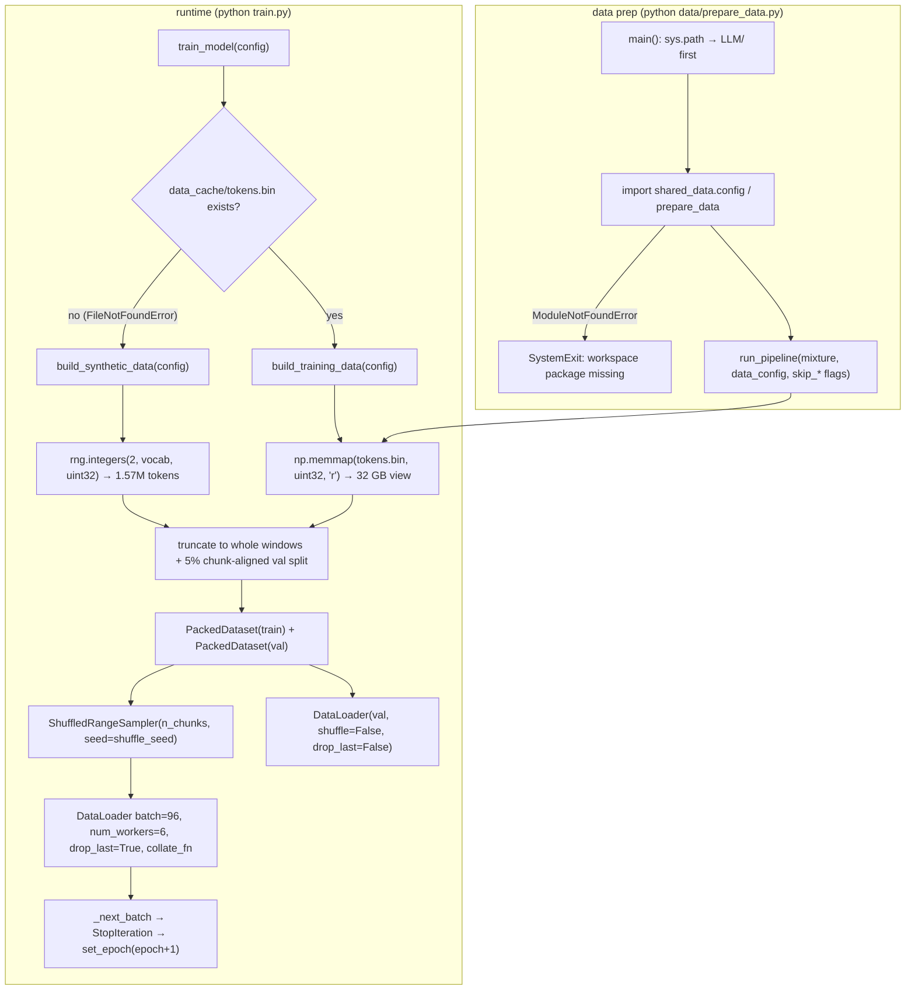

# Reference: The Data Loader (`data/shared_data/loader.py`)

> Audience: intermediate. Assumes you know what a token is and have skimmed
> `[data-engineering.md](../theory/data-engineering.md)`; this file is the
> code tour, not the theory.

## 60-second summary

LLaMA-3-Lite reads training data from exactly three files. The runtime
loader is `data/shared_data/loader.py` (210 lines): a memory-mapped
`uint32` token buffer wrapped in a `Dataset`, a deterministic
`Sampler`, a stacking `collate_fn`, and three builders that assemble
train/val `DataLoader`s. `data/prepare_data.py` is a thin CLI shim that
delegates corpus construction to the workspace-level `LLM/shared_data`
pipeline; `dataset.py` is a 32-line re-export shim so `train.py` and
`benchmark_data.py` keep importing from the old path. The corpus on disk
is one file, `data_cache/tokens.bin`: raw little-endian `uint32` tokens,
no header, EOS-separated documents, about 32 GB at the 8B-token target.
Because the loader memory-maps it, GPU-resident data cost is ~0 bytes —
the headline enabler of the project's 78% memory reduction.

## File overview

| File | Lines | Role |
|---|---|---|
| `data/shared_data/loader.py` | 210 | The only data code that runs at training time |
| `data/shared_data/__init__.py` | 21 | Re-exports the same 5 public symbols as `dataset.py` |
| `data/prepare_data.py` | 72 | CLI shim → workspace `LLM/shared_data` pipeline |
| `dataset.py` | 32 | Re-export shim for backward compatibility |

There is **no** `_stream_to_disk`, `_doc_hash`, `_build_source_streams`, or
`interleave_datasets` in this repository. Those functions belong to the
workspace pipeline at `LLM/shared_data` (imported through the shim); the
vendored `data/shared_data/` package contains exactly two files
(`__init__.py`, `loader.py`) and is the complete runtime surface.

## Function map

| Symbol | Kind | What it does |
|---|---|---|
| `data/shared_data/loader.py:PackedDataset` | `Dataset` | Read-only `uint32` windowed view of the corpus |
| `data/shared_data/loader.py:ShuffledRangeSampler` | `Sampler` | Deterministic permutation of `range(n)` |
| `data/shared_data/loader.py:collate_fn` | function | Stacks per-chunk dicts into `[B, seq_len]` tensors |
| `data/shared_data/loader.py:build_synthetic_data` | function | Random `uint32` corpus, no disk, no HF download |
| `data/shared_data/loader.py:build_tokenizer` | function | `AutoTokenizer.from_pretrained` + pad→eos fallback |
| `data/shared_data/loader.py:build_training_data` | function | mmap `tokens.bin` → real train/val loaders |
| `data/shared_data/loader.py:_SyntheticTokenizerStub` | class | Byte⇄id tokenizer stand-in |
| `data/prepare_data.py:main` | function | CLI → `run_pipeline` in the workspace package |
| `dataset.py:PackedDataset` … | re-exports | 5 symbols re-exported for `train.py` |

## The corpus layout

Both builders assume one on-disk format: a single binary file of
little-endian `uint32` token ids, no header, no framing beyond the tokens
themselves. Documents are packed back-to-back; an EOS separator id marks
document boundaries. This is the same byte layout used by GPT-OSS-Lite —
`data/prepare_data.py:main` prints that the two projects' shards are
interchangeable.

At the project's configured scale the corpus is:

$$8\,000\,000\,000\ \text{tokens} \times 4\ \frac{\text{bytes}}{\text{token}} = 32\ \text{GB}$$

(`config.py:get_config` sets `target_tokens: 8_000_000_000`, which matches
the workspace `shared_data.config.UNIVERSAL_TOTAL_TOKENS` printed by
`data/prepare_data.py:_apply_llama3_defaults`.)

## `PackedDataset` — the mmap windowed view

`data/shared_data/loader.py:PackedDataset` is a `torch.utils.data.Dataset`
with three construction-time jobs: dtype coercion, tiny-buffer padding,
and chunk counting.

### Construction (`data/shared_data/loader.py:PackedDataset.__init__`)

```python
# illustrative
def __init__(self, tokens: np.ndarray, seq_len: int, eos_id: int = 0):
    if tokens.dtype != np.uint32:
        tokens = tokens.astype(np.uint32, copy=False)
    chunk = seq_len + 1
    if tokens.size < chunk:
        # Pad up to one chunk so a tiny buffer is still usable.
        pad = np.zeros(chunk - tokens.size, dtype=np.uint32)
        tokens = np.concatenate([tokens, pad])
    self.tokens = tokens
    self.seq_len = seq_len
    self.eos_id = eos_id
    self.n_chunks = tokens.size // (seq_len + 1)
```

Three behaviors worth naming:

1. **Dtype coercion.** If the caller hands in anything that is not already
   `uint32` (a plain `np.array` of Python ints, say), it is cast with
   `copy=False`. For the real corpus this is a no-op: the array arrives
   from `np.memmap(path, dtype=np.uint32, mode="r")` in
   `data/shared_data/loader.py:build_training_data`.
2. **Tiny-buffer padding.** If the buffer is smaller than one
   `seq_len + 1` window, it is zero-padded up to exactly one chunk. This
   keeps `__len__` ≥ 1 so even a handful of tokens yields a usable dataset.
   It exists for tests and synthetic debugging, not for the 8B corpus.
3. **Chunk counting.** `n_chunks = tokens.size // (seq_len + 1)` floors to
   whole windows. Any trailing partial window is silently dropped — it can
   never be a full `seq_len` input + shifted target.

Note the constructor stores `eos_id` but `PackedDataset.__getitem__` never
consults it: windowing is position-only. The EOS separator's only job is
to be a learnable token id at document boundaries; the windower does not
need to know where documents start or end. `eos_id` is "reserved for
document-boundary callers" (the docstring's words) — a hook, not a
behavior.

### Item access (`data/shared_data/loader.py:PackedDataset.__getitem__`)

```python
# illustrative
def __getitem__(self, idx: int) -> dict:
    start = idx * (self.seq_len + 1)
    end = start + self.seq_len + 1
    window = np.asarray(self.tokens[start:end], dtype=np.int64)
    return {
        "input": torch.from_numpy(window[:-1]),
        "target": torch.from_numpy(window[1:]),
    }
```

Window `i` covers tokens `[i·(S+1), (i+1)·(S+1))` with `S = seq_len`.
Consecutive windows tile the corpus with no overlap and no gap — every
token appears in exactly one window. The returned dict is the shift-by-1
pair:

- `input` = first `S` tokens of the window (`window[:-1]`),
- `target` = the next-token prediction target (`window[1:]`), i.e. the same
  window advanced by one position.

So the last token of a window appears only as a target and the first only
as an input; there is no padding, no masking, and every target position is
real corpus data. That is why training uses `ignore_index = -100` (see
below) — nothing is ever ignored, and the EOS separator ids stay
learnable.

**The "no copy" claim, precisely.** The module docstring says
`__getitem__` "slices `seq_len+1` chunks with no copy". Slicing a memmap
yields a memmap view — the 32 GB file is never copied into RAM. However,
`np.asarray(..., dtype=np.int64)` with a different dtype performs a cast
that *does* allocate a small array (2049 × 8 B ≈ 16.4 KB at `seq_len =
2048`). The `int64` conversion is required because `torch.from_numpy`
needs a dtype it can wrap as a signed tensor (`ignore_index = -100` is
meaningful only in a signed type), and it lets `window[:-1]` /
`window[1:]` be wrapped as zero-copy views of that small buffer. The
resident-memory story is untouched: RAM cost is proportional to the pages
touched (≈ 8.2 KB of file per window) plus the transient 16.4 KB cast, not
to the 32 GB corpus.

### Sizing at project scale

With `S = 2048`, `chunk = 2049`, and an 8B-token file:

| Quantity | Value | Arithmetic |
|---|---|---|
| Windows per file | ≈ 3,904,343 | `⌊8e9 / 2049⌋` (1,193 trailing tokens dropped) |
| Val holdout (5%) | ≈ 195,218 | chunk-aligned 5% of the chunk-aligned total |
| Train windows | ≈ 3,709,125 | chunk-aligned 95% |
| Full batches per epoch | 38,636 | `⌊3,709,125 / 96⌋` (`drop_last=True`) |

The 42,000-step plan (`config.py:get_config` `max_steps`) therefore
exhausts the train split shortly after epoch 1 — the exact reason
`train.py:_next_batch` wraps the sampler (see below).

## `ShuffledRangeSampler` — deterministic shuffle

`data/shared_data/loader.py:ShuffledRangeSampler` shuffles the chunk
indices `range(n_chunks)` with a seedable offset:

```python
# illustrative
def __iter__(self):
    rng = np.random.default_rng(self.seed + self.offset)
    order = rng.permutation(self.n)
    return iter(int(i) for i in order)

def set_epoch(self, epoch: int) -> None:
    self.offset = epoch
```

Design points:

- **Determinism.** The permutation is a function of `(seed, offset)`
  only, via NumPy's `default_rng` (PCG64). The same pair always yields the
  same order, independent of wall-clock time, worker count, or iteration
  history — so a resume with the same checkpointed `offset` replays the
  same epoch order.
- **Fresh epochs.** Bumping `offset` changes the generator seed, hence the
  permutation. `set_epoch(epoch)` is the standard
  `torch.utils.data` epoch hook, and `train.py:_next_batch` calls it when
  the corpus runs out.
- **Fresh generator per iteration.** `__iter__` creates a new
  `default_rng` each call, so iterating twice at the same offset gives the
  identical order (reproducible restarts), and a partially-consumed
  iterator can be abandoned and rebuilt without corrupting anything.

The ids yielded are Python `int`s, which `DataLoader` uses to index
`PackedDataset`. Because the sampler is explicitly constructed (not
`shuffle=True`), `train.py` can reach it as
`train_dataloader.sampler` to call `set_epoch` — the mechanism behind the
epoch wrap.

## `collate_fn` — from chunk dicts to batches

```python
# illustrative
def collate_fn(batch: list[dict]) -> dict:
    return {
        "input": torch.stack([b["input"] for b in batch], dim=0),
        "target": torch.stack([b["target"] for b in batch], dim=0),
    }
```

`torch.stack` over axis 0 turns `B` dicts of `[S]` int64 tensors into one
dict of `[B, S]` int64 tensors. Both builders pass this as
`collate_fn=collate_fn`; it is also what the smoke tests reuse directly.

Shape trace per batch:

```
96 chunks × {"input": [2048] int64, "target": [2048] int64}
    ──stack──▶ {"input": [96, 2048] int64, "target": [96, 2048] int64}
```

Each tensor is `96 × 2048 × 8 B = 1.57 MB`; a batch's data tensors total
≈ 3.1 MB on CPU before the `non_blocking` H2D copy in
`train.py:train_model`.

## `build_synthetic_data` — the no-disk fallback

`data/shared_data/loader.py:build_synthetic_data` is the path taken when
no real corpus exists. It returns `(train_dl, val_dl, tokenizer)` where
the tokenizer is always the byte stub — random ids make a real tokenizer
meaningless, so the stub is used "unconditionally (no HF download)".

Key steps:

1. **Budget.** With `num_tokens=None`, it synthesizes
   `max(8 · (S+1) · B, 4096)` tokens: `8 × 2049 × 96 = 1,573,632` at
   project scale. The `4096` floor keeps absurdly small configs usable.
2. **Random stream.** `rng.integers(2, max(3, vocab), size=…, dtype=np.uint32)`
   draws uniform ids in `[2, vocab)` — ids `0` and `1` are deliberately
   never produced, so they remain free as EOS/BOS conventions.
3. **Split.** The stream is truncated to whole windows
   (`n_total = (size // chunk) · chunk`), then split at
   `int(n_total · (1 − val_split))` re-aligned to a chunk boundary, so
   train and val are both integral numbers of windows.
4. **Loaders.** Two `PackedDataset`s + one `ShuffledRangeSampler` + two
   `DataLoader`s (table below).
5. **Stub.** Returns `_SyntheticTokenizerStub(vocab=vocab, eos_id=0, pad_id=0)`.

Note `PackedDataset` is called without `eos_id` here (defaults to `0`),
as is the stub's `eos_id`/`pad_id` — consistent with the `[2, vocab)` id
range, where `0` never appears in the data.

## `build_tokenizer` — real tokenizer, pad→eos

```python
# illustrative
def build_tokenizer(config: dict):
    from transformers import AutoTokenizer

    tokenizer = AutoTokenizer.from_pretrained(
        config["tokenizer_name"],
        cache_dir=config.get("tokenizer_cache_dir", None),
    )
    if tokenizer.pad_token is None:
        tokenizer.pad_token = tokenizer.eos_token
    return tokenizer
```

This is the *only* place the real tokenizer is loaded in this repo. It
uses `config.py:get_config`'s `tokenizer_name:
'NousResearch/Meta-Llama-3-8B'` with an optional `tokenizer_cache_dir`.
Because the corpus is packed (no padding ever exists in the stream), the
tokenizer's own pad token is never needed by the data path — the
pad→eos fallback is defensive, so a tokenizer without a pad token (as
Llama-3's is) still satisfies code that queries `tokenizer.pad_token_id`.
It raises when `transformers` is missing or the download fails; every
caller wraps it in the stub fallback.

## `build_training_data` — the real path

`data/shared_data/loader.py:build_training_data` is what production
training calls. In order:

1. **Resolve the cache path.** `data_cache_dir` (default `"data_cache"`) +
   `data_cache_filename` (default `"tokens.bin"`) → `data_cache/tokens.bin`.
2. **Existence contract.** If the file does not exist it raises
   `FileNotFoundError` with instructions:
   `Run `python data/prepare_data.py` first (or pass `data_sources` empty
   + use build_synthetic_data)`. The check is existence-only — file size
   and content are not validated; a truncated file simply yields fewer
   windows. `train.py:train_model` catches exactly this exception to
   switch to synthetic data.
3. **Memory-map.** `np.memmap(path, dtype=np.uint32, mode="r")` opens the
   32 GB file read-only; nothing is loaded until a page is touched.
4. **Split.** Identical math to the synthetic path: truncate to whole
   windows, chunk-align the 5% validation holdout
   (`config.py:get_config` `val_split: 0.05`).
5. **Loaders.** `PackedDataset` (default `eos_id=0`) + sampler seeded with
   `shuffle_seed` (default `42` — note the synthetic builder's sampler
   default falls back to its own `seed` argument instead) + the same
   `DataLoader` configuration as synthetic.
6. **Tokenizer with fallback.** It tries `build_tokenizer(config)`;
   on *any* exception it prints a warning — "tokenizer load failed …
   using the byte stub. Generation samples will be meaningless until a
   real tokenizer is available." — and substitutes the stub. This is the
   honest acknowledgement that the stub's decode output is byte-garbage,
   not text.

## `_SyntheticTokenizerStub` — duck-typed tokenizer

`data/shared_data/loader.py:_SyntheticTokenizerStub` implements just
enough of a tokenizer API for the training loop and generation:

| Member | Behavior |
|---|---|
| `pad_token_id` / `eos_token_id` | Plain attributes from the constructor (`0`/`0` for synthetic data) |
| `__len__` | Returns `vocab` — critical, because `train.py:train_model` computes `real_vocab_size = max(config['vocab_size'], len(tokenizer))` |
| `encode(text)` | `[min(b, vocab-1) for b in text.encode("utf-8")]` — one id per UTF-8 byte, clamped |
| `decode(ids)` | `bytes(int(i) & 0xFF for i in ids).decode("utf-8", errors="replace")` — bytes back out, invalid sequences replaced |

`decode`'s `& 0xFF` mask is what makes ids ≥ 256 safe to round-trip (ids
beyond 255 were never in the bytes in the first place — the round-trip
is lossy by construction, hence "generation samples will be meaningless").

`__len__` is the load-bearing member: the real Meta-Llama-3-8B tokenizer
has 128,256 entries, so `real_vocab_size = max(128000, 128256) = 128256`
— the LM head and embedding tables are sized to the *tokenizer's* vocab,
not `config['vocab_size']`, when a real tokenizer is present.

## `data/prepare_data.py` — the shim

`data/prepare_data.py:main` is a CLI entry point (`python
data/prepare_data.py --stage pretrain …`) that produces `tokens.bin`. It
does **not** implement any pipeline itself.

### Path resolution

```python
# illustrative
_PROJECT_ROOT = Path(__file__).resolve().parents[1]  # .../LLaMA-3-Lite/
_DATA_ROOT = Path(__file__).resolve().parent  # vendored shared_data lives here
_WORKSPACE_ROOT = _PROJECT_ROOT.parent  # workspace LLM/shared_data (universal pipeline)
for _p in (_DATA_ROOT, _PROJECT_ROOT, _WORKSPACE_ROOT):
    _p = str(_p)
    if _p not in sys.path:
        sys.path.insert(0, _p)
```

Because each path is `insert(0)`-ed in turn, the final `sys.path` order is
`LLM/`, then `LLaMA-3-Lite/`, then `data/`. The workspace `LLM/shared_data`
package therefore wins the `import shared_data` lookup — which is the
point: the shim must load the *universal* pipeline
(`shared_data.config`, `shared_data.prepare_data`), not the vendored
loader. The vendored `data/shared_data/` contains only
`loader.py` + `__init__.py`; it cannot satisfy that import, and the shim
does not expect it to.

### Constants and delegation

`data/prepare_data.py` hard-codes the LLaMA-3 contract:
`LLAMA3_TOKENIZER_NAME = "llama3"`, `LLAMA3_VOCAB_SIZE = 128_000`,
`LLAMA3_EOS_TOKEN_ID = 128_009`, `LLAMA3_PAD_TOKEN_ID = 128_002` — the
values that end up in `tokens.bin`, whatever the actual tokenizer object
used at load time.

`data/prepare_data.py:_apply_llama3_defaults` is the workspace probe: it
imports `UNIVERSAL_TOTAL_TOKENS` from `shared_data.config` and prints the
corpus size, tokenizer, and the 50M-token shard size. If that import
raises `ModuleNotFoundError`, `main` re-raises it as a `SystemExit` whose
message explains the situation exactly: the project "vendors only the
loader (`data/shared_data/`)" and delegates to `LLM/shared_data/` — the
workspace package must exist and be importable on the machine that builds
data.

The actual work is one call:

```python
# illustrative
from shared_data.prepare_data import run_pipeline

return run_pipeline(
    mixture_path=Path(args.mixture) if args.mixture else UNIVERSAL_MIXTURE_PATH,
    data_config_path=Path(args.data_config) if args.data_config else UNIVERSAL_DATA_CONFIG_PATH,
    source=args.source,
    skip_download=args.skip_download,
    skip_clean=args.skip_clean,
    skip_tokenize=args.skip_tokenize,
    skip_pack=args.skip_pack,
    data_root=Path(args.data_root) if args.data_root else None,
)
```

The CLI flags (`--mixture`, `--data-config`, `--data-root`, `--source`,
`--skip-download/clean/tokenize/pack`) pass straight through to the
workspace pipeline, which does the downloading, dedup, tokenization, and
packing that produce the EOS-separated `uint32` stream.

## `dataset.py` — the re-export shim

`dataset.py` exists so `train.py` and `benchmark_data.py` keep working
unchanged:

```python
# illustrative
from shared_data.loader import (
    PackedDataset,
    ShuffledRangeSampler,
    collate_fn,
    build_training_data,
    build_synthetic_data,
)
```

It inserts only its own `data/` directory on `sys.path` (never the
workspace path), so `import shared_data` resolves to the **vendored**
loader — the runtime copy. `train.py:train_model` imports
`build_training_data, build_synthetic_data` from here; the smoke tests
import the module as `ds` and use `ds.PackedDataset`,
`ds.ShuffledRangeSampler`, and `ds.collate_fn` directly. `build_tokenizer`
and `_SyntheticTokenizerStub` are intentionally not re-exported — they are
internal to the loader.

## The DataLoader configuration

Both builders produce the same loader pair (`config.py:get_config` values;
synthetic defaults apply when a key is absent):

| Parameter | `train_dl` | `val_dl` | Absent-key default |
|---|---|---|---|
| `batch_size` | 96 | 96 | — |
| `sampler` | `ShuffledRangeSampler(n_chunks, seed=shuffle_seed)` | `None` (`shuffle=False`) | — |
| `num_workers` | 6 | `min(2, 6) = 2` | 0 |
| `prefetch_factor` | 16 | 16 | 2 (ignored when `num_workers=0` → `None`) |
| `pin_memory` | True | True | False |
| `collate_fn` | `collate_fn` | `collate_fn` | — |
| `drop_last` | True | False | — |
| `persistent_workers` | True (`n_workers > 0`) | True | `n_workers > 0` |

The train/val asymmetry is deliberate: the train loader drops the final
incomplete batch (so every optimizer step sees a full 96 × 2048 window,
and step counts are exact), while the validation loader keeps partial
batches (it is capped anyway by `val_max_batches: 100`). `persistent_workers`
avoids re-spawning the 6 workers every epoch; `pin_memory` enables the
`non_blocking=True` H2D copies in `train.py:train_model`.

## Loader construction, end to end



## How the training loop consumes it

- `train.py:train_model` receives `(train_dataloader, val_dataloader,
  tokenizer)`; if any is `None` it tries `build_training_data(config)`
  first and only on `FileNotFoundError` falls back to
  `build_synthetic_data(config)` — with a printed warning pointing at the
  missing `data_cache/tokens.bin`.
- `ignore_index = -100` is hard-coded with the rationale in a comment:
  "No padding in this pipeline (packed documents, full windows), so
  nothing is ignored; using -100 keeps EOS separators learnable."
- `real_vocab_size = max(config['vocab_size'], len(tokenizer))` sizes the
  model's embedding/LM head to the *tokenizer's* vocab (128,256 for the
  real Llama-3 tokenizer, 128,000 for the stub).
- `train.py:_next_batch` wraps the iterator: on `StopIteration` it bumps
  `epoch_state['epoch']`, calls `set_epoch` on the sampler (guarded by
  `hasattr`), prints the "42k-step plan (~8.26B tokens) exceeds the
  prepared corpus" warning, and re-iterates the loader. The first epoch
  yields ≈ 38,636 full batches; step 42,000 lands ≈ 3,364 steps into
  epoch 2.
- `generate_samples` (`train.py:generate_samples`) calls
  `tokenizer.encode(prompt)` and `tokenizer.decode(ids)` and compares
  `next_token.item()` to `tokenizer.eos_token_id` — the three-member API
  the stub provides.

## The test suite's view

`tests/test_smoke.py:tiny_dataloaders` builds loaders by hand, exercising
`PackedDataset` and `ShuffledRangeSampler` exactly as the builders do but
with `tiny_config` values (`seq_len=32`, `vocab=256`, `batch=4`,
`val_split` from the tiny config). It synthesizes
`n_tokens = (seq_len + 1) * 32 + 10` tokens — deliberately **not** a
multiple of the chunk size, so the floor-to-whole-windows truncation is
part of what the fixture covers — then splits chunk-aligned, constructs
`PackedDataset` with an explicit `eos_id`, seeds the sampler with
`seed=42, offset=0`, and wires `ds.collate_fn` into both loaders. The
`TestEndToEndSmoke` class then runs real forward/backward steps, chunked-
vs-dense loss equivalence, and validation on these loaders.

## Edge cases & pitfalls

1. **Missing cache.** `build_training_data` raises `FileNotFoundError`
   when `tokens.bin` is absent; `train.py` catches it and silently switches
   to random synthetic tokens. Training "works" but learns nothing —
   the warning is the only signal. Check `data_cache/` before drawing
   conclusions from a run.
2. **Existence-only check.** The guard never validates size or contents.
   A truncated `tokens.bin` yields fewer windows; a corrupt one yields
   garbage ids without any error.
3. **Stub decode is lossy.** `_SyntheticTokenizerStub.encode` maps each
   UTF-8 byte to an id (clamped to `vocab-1`); `decode` masks back to
   bytes. Multi-byte characters round-trip imperfectly, and with the real
   corpus + stub fallback, generated "text" is byte-garbage by design —
   `build_training_data`'s warning says so.
4. **`len(tokenizer)` is load-bearing.** If a tokenizer object lacks
   `__len__`, `train_model`'s `real_vocab_size = max(...)` crashes with
   `TypeError`. The stub implements `__len__`; the real
   `AutoTokenizer` does too.
5. **Epoch wrap vs. one-shot iterator.** A plain `iter(dataloader)` dies
   with `StopIteration` at the end of the corpus; `_next_batch` exists
   precisely because the 42K-step plan exceeds one pass over the 95%
   train split (≈38.6K steps). Do not replace it with a bare
   `for batch in dataloader` loop.
6. **`drop_last=True` means the last few windows of each epoch are
   skipped** — at project scale that is 69 windows of 3,709,125
   (0.002%), immaterial for training but relevant if you are auditing
   exact token counts.
7. **`eos_id` is inert in the vendored loader.** Document separators are
   baked into the stream by the workspace packer; `PackedDataset` never
   acts on `eos_id`. Do not expect window boundaries to coincide with
   document boundaries (they almost never do).
8. **The shim requires the workspace.** `python data/prepare_data.py`
   without `LLM/shared_data` importable exits with the `SystemExit`
   guidance message — the vendored package alone cannot build the corpus.

## Design decisions

- **One file, one format.** A headerless little-endian `uint32` stream is
  the interchange format with GPT-OSS-Lite, trivially memmap-able, and
  4 bytes/token (vs. 2 bytes for `uint16` — 128k vocab needs 17 bits, so
  `uint32` is the honest choice).
- **mmap over preload.** The corpus is 32 GB; the GPU budget is 20 GB.
  mmap makes the data path cost ~0 resident bytes and ~0 setup time,
  trading per-window page faults — amortized away by 6 prefetch workers.
- **Explicit sampler over `shuffle=True`.** `shuffle=True` would hide the
  RNG state and prevent the epoch wrap; an explicit
  `ShuffledRangeSampler` gives `train.py` a handle (`sampler.set_epoch`)
  and reproducibility for free.
- **Shift-by-1 inside the window, not across the whole corpus.** Each
  chunk carries its own `input`/`target` pair, so the sampler shuffles
  *windows* while the sequence structure within a window is untouched.
- **Stub fallback everywhere.** `build_training_data` wraps the real
  tokenizer in `try/except Exception` and degrades to the stub; the
  training loop cannot crash on a missing HF download, only warn.

## Further reading

- `[data-engineering.md](../theory/data-engineering.md)` — the theory:
  document packing, dedup, streaming/shuffling, the memmap layout.
- `[scaling-and-metrics.md](../theory/scaling-and-metrics.md)` — the
  42,000-step / 8.26B-token budget and why the epoch wrap is required.
- `[reproducibility.md](../theory/reproducibility.md)` — sampler
  seed+offset determinism and checkpoint round-trips.
- `[tokenizer.md](tokenizer.md)` — the tokenizer reference rework
  (BPE theory, special-token table, `len(tokenizer)` logic).
- `[training.md](training.md)` — how `train_model` consumes the loaders.
- `[config.md](config.md)` — every data key and its interaction.
- `[memory-stack.md](memory-stack.md)` — where the mmap data path fits in
  the 92 → 20 GB stack.
