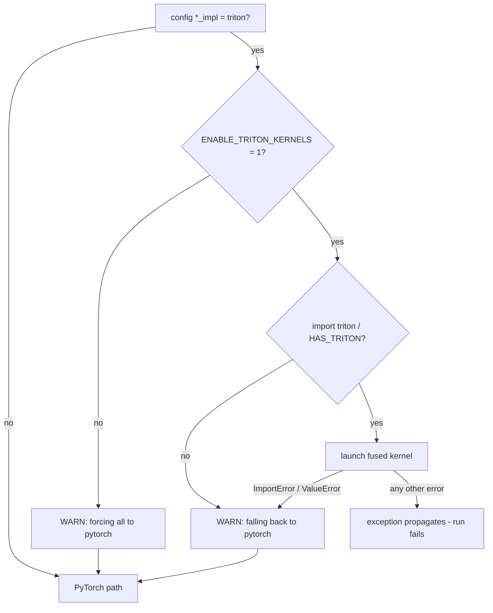

# Triton Kernels Reference

> **Audience:** intermediate — you know what RMSNorm, SwiGLU, and cross-entropy
> do; this doc is about the three fused Triton implementations, their launch
> geometry, and the opt-in/fallback machinery around them.
> Theory counterpart: [kernel-programming.md](../theory/kernel-programming.md).

## The 60-second summary

`kernels/` holds three optional Triton kernels — fused RMSNorm
(`kernels/rmsnorm_triton.py`), fused SwiGLU activation
(`kernels/swiglu_triton.py`), and fused chunked cross-entropy + z-loss
(`kernels/cross_entropy_triton.py`) — each shipped with a pure-PyTorch
reference implementation that runs on CPU without Triton installed. Every
kernel is **opt-in**: `config.get_config()` defaults all three `*_impl` keys
to `'pytorch'`, and the trainer refuses to honor `'triton'` unless the
environment variable `ENABLE_TRITON_KERNELS=1` is set. Each kernel is wrapped
in a `torch.autograd.Function` whose forward launches one Triton program and
whose backward **re-computes** the reference implementation instead of
launching a second kernel. If Triton is missing (`ImportError`) or the tensor
shape violates a kernel guard (`ValueError`), the model layer prints a warning
and falls back to the PyTorch path; any *other* runtime failure propagates and
kills the run. AGENTS.md requires ≥ 1.5× speedup for a sanctioned kernel
before it may be enabled by default, but the benchmark script it names
(`scripts/microbench_a100.py`) does not exist in this repo yet.

## File map

| File | Public API | Reference |
|---|---|---|
| `kernels/rmsnorm_triton.py` | `kernels/rmsnorm_triton.py:triton_rmsnorm` | `kernels/rmsnorm_triton.py:rmsnorm_pytorch` |
| `kernels/swiglu_triton.py` | `kernels/swiglu_triton.py:triton_swiglu` | `kernels/swiglu_triton.py:swiglu_pytorch` |
| `kernels/cross_entropy_triton.py` | `kernels/cross_entropy_triton.py:triton_chunked_cross_entropy_with_z` | `kernels/cross_entropy_triton.py:cross_entropy_with_z_pytorch` |

Dispatch sites live in `model.py`: `model.py:RMSNorm.forward`,
`model.py:SwiGLUFFN.forward`, `model.py:chunked_cross_entropy_with_z`, and
`model.py:chunked_head_cross_entropy_with_z`. The env-var gate lives in
`train.py:train_model`.

## The opt-in contract

Three layers of control decide whether a fused kernel ever runs:

1. **Per-kernel config keys.** `config.get_config()` defaults
   `rmsnorm_impl`, `swiglu_impl`, and `cross_entropy_impl` to `'pytorch'`
   (see [config.md](config.md) for the full surface).
2. **The env-var gate.** `train.py:train_model` reads
   `ENABLE_TRITON_KERNELS`; if it is not exactly `"1"` and any `*_impl` key
   is `'triton'`, it prints a warning and force-restores all three keys to
   `'pytorch'`. A default-config run can therefore never accidentally enter a
   fused path — the opt-in is explicit twice over (AGENTS.md rule 7).
3. **Per-module dispatch with warned fallback.** When an `*_impl` key is
   `'triton'`, the model layer calls the Triton entry point and catches
   `(ImportError, ValueError)`:

```python
# illustrative — the exact pattern in model.py:RMSNorm.forward
if self.impl == "triton":
    try:
        return triton_rmsnorm(x, self.weight, self.eps)
    except (ImportError, ValueError) as exc:
        if not self._triton_fallback_warned:
            print(f"[RMSNorm] triton path unavailable "
                  f"({type(exc).__name__}: {exc}); "
                  f"falling back to 'pytorch'.")
            self._triton_fallback_warned = True
return x * torch.rsqrt(x.pow(2).mean(dim=-1, keepdim=True) + self.eps) * self.weight
```

The two `nn.Module` sites (`model.py:RMSNorm.forward`,
`model.py:SwiGLUFFN.forward`) guard the warning with a
`self._triton_fallback_warned` flag, so the message prints **once per
module instance**, not once per forward. The two function sites
(`model.py:chunked_cross_entropy_with_z`, `model.py:chunked_head_cross_entropy_with_z`)
have no such flag and print on every call.



**Fallback vs hard-fail, precisely:** the caught exception classes are
`ImportError` (Triton absent; the public entry points raise it explicitly)
and `ValueError` (a shape exceeds the kernel's block guard — see each
kernel below). Anything else — a Triton compile failure, an illegal-memory
access, a CUDA OOM — is *not* caught and propagates out of the forward pass,
surfacing as a clear error per AGENTS.md rule 7. Note also that the kernel
modules never raise `ImportError` at import time: they use
`try: import triton / except ImportError: HAS_TRITON = False`, so importing
`kernels.*` works on any machine, CPU or GPU, with or without Triton.

AGENTS.md rule 2 sets the performance bar: a sanctioned Triton path must
show **≥ 1.5× speedup over the raw-PyTorch path in
`scripts/microbench_a100.py`**; below that it must not be enabled by default.
That script is referenced by the rule but **does not exist in this repo**
(no `scripts/` directory — verified by glob). The `'pytorch'` defaults mean
the kernels are never enabled by default today; the 1.5× bar is therefore
unenforced until a benchmark lands.

## Kernel 1 — fused RMSNorm

**Signature:** `triton_rmsnorm(x: torch.Tensor, weight: torch.Tensor, eps: float) -> torch.Tensor`

**What it fuses.** The eager chain `pow → mean → add → rsqrt → multiply`
(five elementwise/reduction launches per norm in the PyTorch path) collapses
into one row-wise program. The reference,
`kernels/rmsnorm_triton.py:rmsnorm_pytorch`, is:

```python
variance = x.pow(2).mean(dim=-1, keepdim=True)
return x * torch.rsqrt(variance + eps) * weight
```

**Grid/block design.** `kernels/rmsnorm_triton.py:_triton_rmsnorm_forward`
flattens `x` to `(M, N)` (`.contiguous()` first, guaranteeing coalesced
access), then launches a **one-dimensional grid of `M` programs** — one
one program per row. `N` is a `tl.constexpr` block size computed with
`triton.next_power_of_2(N)`; the compiled kernel loads the row under a
`cols < N` mask, computes `var = sum(x²)/N` and `rstd = 1/sqrt(var+eps)` as
FP32, multiplies by the weight vector, and stores back.

At this project's scale: `N = d_model = 1024` (a power of two already, so
`BLOCK_SIZE = 1024` and the mask is fully covered), and
`M = B·S = 96 × 2048 = 196,608` programs per norm. The 16 layers each run
two such norms (`attention_norm`, `ffn_norm`) plus the final decoder norm —
33 launches per forward pass, each 196,608-wide. The QK-norms inside
`model.py:GroupedQueryAttention` are constructed with the default
`impl='pytorch'`, so the fused path never applies to the `head_dim = 128`
norms.

**Launch params:** `num_warps=4, num_stages=1`. There is no inner loop to
pipeline, so `num_stages=1` is correct; `num_warps=4` is enough to saturate
the 1,024-wide row.

**Guard:** `kernels/rmsnorm_triton.py:_MAX_BLOCK_SIZE = 8192`; if
`next_power_of_2(N) > 8192` the forward raises `ValueError` (d_model ≤ 8192
for the Triton path), which the dispatch layer converts into a warned
fallback.

## Kernel 2 — fused SwiGLU

**Signature:** `triton_swiglu(gate_up: torch.Tensor, d_ff: int) -> torch.Tensor`

**What it fuses.** `gate_up` is the fused output of `gate_up_proj`
(`model.py:SwiGLUFFN.__init__`, a `Linear(d_model, 2·d_ff)`), width `2·d_ff`
with gate and up halves concatenated. Eager SwiGLU needs `silu` and a
multiply (two elementwise launches, plus a `chunk` view); the compiled
kernel does both in one program. The reference,
`kernels/swiglu_triton.py:swiglu_pytorch`, is:

```python
return F.silu(gate) * up
```

**Grid/block design.** `kernels/swiglu_triton.py:_triton_swiglu_forward`
validates `gate_up.shape[-1] == 2 * d_ff` (else `ValueError`), flattens to
`(M, 2·d_ff)`, and launches **`M` programs, one per row**. Each program
loads the gate half at `cols` and the up half at `cols + d_ff`, computes
`silu_g = g · sigmoid(g)`, then `y = silu_g · u`, and stores the `d_ff`-wide
result. `BLOCK_SIZE = next_power_of_2(d_ff)`.

At this project's scale: `d_ff = 4096` (already a power of two →
`BLOCK_SIZE = 4096`), `M = B·S = 196,608` programs per layer per forward —
one launch per layer replacing two eager launches.

**Launch params:** `num_warps=8, num_stages=2`. The wider row (4,096
columns) justifies 8 warps; `num_stages=2` is the Triton default pipelining
for the two loads.

**Guard:** the same `_MAX_BLOCK_SIZE = 8192`; `d_ff > 8192` raises
`ValueError` → warned fallback in `model.py:SwiGLUFFN.forward`.

## Kernel 3 — fused chunked CE + z-loss

**Signature:**
`triton_chunked_cross_entropy_with_z(logits, targets, ignore_index=-100, z_loss_weight=1e-4) -> torch.Tensor`

**What it fuses.** The PyTorch chain `logsumexp → cross_entropy → mean →
z-penalty` (several launches, plus FP32 upcasts) collapses into **one
program per logits row**. The reference,
`kernels/cross_entropy_triton.py:cross_entropy_with_z_pytorch`, is:

```python
# illustrative
log_z = torch.logsumexp(logits.float(), dim=-1)
ce = F.cross_entropy(logits, targets, ignore_index=ignore_index, reduction="mean")
z = log_z.pow(2).mean()
return ce + z_loss_weight * z
```

**Online softmax.** The kernel loads the full vocab row with `other=-inf`
padding, then computes the
running-max form of log-sum-exp in one pass: `m = max(x)`,
`l = sum(exp(x − m))`, `log_z = m + log(l)`. The per-token NLL is
`log_z − target_logit`, so the softmax denominator is never materialized.

**Accumulators via `atomic_add`.** The kernel writes to three scalar
buffers with Triton `atomic_add`: `CE_SUM` (sum of NLL over non-ignored
rows), `CE_CNT` (count of non-ignored rows), and `Z_SUM` (sum of `log_z²`).
`kernels/cross_entropy_triton.py:_triton_ce_z_forward` finalizes with
`ce_mean = ce_sum / ce_cnt.clamp_min(1.0)` and `z_mean = z_sum / M`, then
returns `ce_mean + z_loss_weight · z_mean`. The three scalars live in device
memory for the whole launch, so peak memory is the logits slice plus a
handful of bytes — no `[M, V]` softmax buffer.

**Grid/block design.** `M` programs over the flattened `(M, V)` logits,
`BLOCK_V = next_power_of_2(V)`. **The entire vocab axis is one block**: at
this project's scale `V = 128,256` → `BLOCK_V = 131,072`, exactly
`kernels/cross_entropy_triton.py:_MAX_VOCAB_BLOCK`. A 256K vocab would need
two programs per row; the constant encodes that ceiling, and `V > 131,072`
raises `ValueError`.

**How chunking composes.** The kernel does **not** chunk the vocab axis and
does **not** accept a `chunk_size` parameter (its docstring warns against
passing one — in fact passing `chunk_size=` raises `TypeError`, verified;
the "silently no-op" wording in the docstring is inaccurate). Chunking
happens at the caller: `model.py:chunked_head_cross_entropy_with_z` loops
over `hidden` rows in slices of `chunk_size = 256`, materializes one
chunk's logits with `F.linear`, and calls the kernel per chunk — so each
launch is `M = 256` rows (768 launches over the `196,608` training rows),
and only one chunk's `[256, 128256]` logits tensor is live at a time (see
[memory-stack.md](memory-stack.md)). Per-chunk scalar losses are summed and
divided by `n_chunks`; with equal-size chunks that mean is exact (the
function docstring's "equal-size chunks ⇒ exact" caveat — a trailing
partial chunk makes the mean approximate).

**Launch params:** `num_warps=8, num_stages=2` — same reasoning as SwiGLU:
a wide (131,072-column) row and two memory phases per program.

## The autograd.Function wrapper pattern

All three kernels share the same wrapper contract
(`kernels/rmsnorm_triton.py:_TritonRMSNorm`,
`kernels/swiglu_triton.py:_TritonSwiGLU`,
`kernels/cross_entropy_triton.py:_TritonCEWithZ`):

- **forward** saves what backward needs via `ctx.save_for_backward` —
  `(x, weight)` for RMSNorm, `gate_up` for SwiGLU, `(logits, targets)` for
  CE — plus any scalars (`eps`, `d_ff`, `ignore_index`, `z_loss_weight`) as
  plain attributes — and returns the Triton result.
- **backward re-computes.** Each backward detaches the saved tensors,
  re-runs the *pure-PyTorch reference* inside `torch.enable_grad()`, and
  calls `torch.autograd.grad(y, [inputs], grad_out)` to obtain input
  gradients. No Triton kernel runs in backward at all — the fused path is
  forward-only, and the backward is a correctness-preserving autograd
  stub. The memory cost of this design is keeping the *inputs* alive
  (e.g. pre-norm `x` for RMSNorm, `gate_up` for SwiGLU, full `logits` for
  CE) rather than the activations.

Because the wrapper is a `torch.autograd.Function`, the Triton forward
participates in the graph like any op: gradients flow through it to the
projection weights above and the embedding/hidden states below, and it
composes with `torch.compile` and CUDA-graph capture the same way an eager
op does.

## Launch / fallback table

| Kernel | Entry point | Grid | Block | warps / stages | Guard (→ `ValueError`) | Fallback on `ImportError`/`ValueError` |
|---|---|---|---|---|---|---|
| RMSNorm | `kernels/rmsnorm_triton.py:triton_rmsnorm` | `(M,)`, M = B·S rows | `next_pow2(d_model)` = 1024 | 4 / 1 | `d_model > 8192` | one-time print + PyTorch (`model.py:RMSNorm.forward`) |
| SwiGLU | `kernels/swiglu_triton.py:triton_swiglu` | `(M,)`, M = B·S rows | `next_pow2(d_ff)` = 4096 | 8 / 2 | `d_ff > 8192` or `last != 2·d_ff` | one-time print + PyTorch (`model.py:SwiGLUFFN.forward`) |
| CE + z | `kernels/cross_entropy_triton.py:triton_chunked_cross_entropy_with_z` | `(M,)`, M = chunk rows | `next_pow2(V)` = 131072 | 8 / 2 | `V > 131072` (`_MAX_VOCAB_BLOCK`) | print + PyTorch (`model.py:chunked_cross_entropy_with_z`, `model.py:chunked_head_cross_entropy_with_z`) |

All three `ImportError` messages are uniform: install `triton` (Linux + CUDA
only) or use `*_impl='pytorch'` on CPU/Mac.

## The CPU-test contract

AGENTS.md rule 8 requires every kernel to ship a unit test that runs **on
CPU without Triton installed**, using the pure-PyTorch reference, with
GPU-only behavior behind `@pytest.mark.gpu` (auto-skipped on CPU-only
machines). The machinery:

- **References import triton-free.** `rmsnorm_pytorch`, `swiglu_pytorch`,
  and `cross_entropy_with_z_pytorch` import and run without Triton; the
  module-level `kernels/cross_entropy_triton.py:HAS_TRITON` flag is `False`
  and the entry points raise
  `ImportError` if called. The model-level behavior is therefore testable
  end-to-end on a Mac/CPU box (this repo's 59-test suite passes on CPU with
  `HAS_TRITON == False` everywhere).
- **Markers.** `pytest.ini` registers `gpu`, `smoke`, `numeric`, `slow`
  under `--strict-markers`; `tests/conftest.py:pytest_collection_modifyitems`
  skips every `gpu`-marked test with "needs --run-gpu and a CUDA device"
  unless `--run-gpu` is passed. The `device` fixture defaults to CPU, and
  the `dtype` fixture is FP32 on CPU "for exactness" and BF16 on GPU —
  meaning the CPU contract is exercised in exact arithmetic.
- **GPU equivalence.** `tests/e2e_gpu_smoke.py:check_triton_kernels` (stage
  8 of the e2e smoke script) compares each kernel against a hand-written
  BF16 reference on CUDA with tolerance assertions (RMSNorm abs diff
  < 5e-2, SwiGLU < 1.0, CE loss finite), skipping cleanly when Triton or a
  GPU is absent.

One caveat worth knowing: the fallback *warnings* themselves are not
unit-tested — no test in `tests/` asserts the one-time-warning behavior of
`model.py:RMSNorm.forward`; the dispatch path is covered indirectly by the
model tests (which run the PyTorch branch) and by the e2e script (which
runs the Triton branch). And `tests/e2e_gpu_smoke.py:check_triton_kernels`
passes `chunk_size=4096` to the CE entry point, which does not accept that
keyword — that call raises `TypeError` (verified) if stage 8 is reached on
a CUDA box, so the CE segment of the e2e script is currently broken.

## Microbenchmark rule

AGENTS.md rule 2: for any sanctioned Triton path, target **≥ 1.5× speedup
over the raw-PyTorch path** measured in `scripts/microbench_a100.py`; below
that, do not enable by default. State of the world today:

- The three kernels exist and are wired through dispatch, but all
  `*_impl` defaults are `'pytorch'` — they are **not** enabled by default.
- No benchmark exists: `scripts/microbench_a100.py` is absent from the repo
  (the rule references a file that has not landed). Until one does, the
  1.5× bar is untested and no claim of speedup is made anywhere in this
  repo.
- AGENTS.md rule 1 requires sanctioned Triton paths to be listed in the
  contract; the current AGENTS.md text predates `kernels/` and still says
  "no custom Triton kernels exist" — the sanctioned-list entry is a
  doc-debt item, not a code fact.

## Edge cases & pitfalls

- **Block-size guards.** All three kernels validate their reduction axis
  before launch. `d_model` and `d_ff` must be ≤ 8192 (`_MAX_BLOCK_SIZE`);
  vocab must be ≤ 131,072 (`_MAX_VOCAB_BLOCK`). This project's 1024 / 4096 /
  128,256 all fit; a 256K-vocab model would trip the CE guard with a warned
  fallback, not a silent wrong answer.
- **`ignore_index` and the target-logit load.** Inside the CE kernel, the
  target logit is loaded *unconditionally* — the `valid` flag only guards
  the two CE
  `atomic_add`s. For an ignored row the computed `nll` is garbage (the load
  can even be out of bounds for `ignore_index = -100` on row 0) but is
  discarded. In practice training targets contain no `-100` (there is no
  padding; EOS separators stay learnable), so the path is not exercised —
  but the "protect against ignore_index" comment overstates what the mask
  does.
- **z-loss averaging differs between paths.** The Triton kernel accumulates
  `Z_SUM` for *every* row and divides by `M`
  (`z_mean = z_sum / M`), while the PyTorch paths
  (`model.py:chunked_cross_entropy_with_z`, `model.py:chunked_head_cross_entropy_with_z`)
  accumulate `log_z²` over **non-ignored rows only**. With no ignored rows
  the two agree exactly; with `-100`s present they diverge. The
  `chunked_cross_entropy_with_z` docstring's "z-loss is averaged over
  non-ignored tokens only" describes the PyTorch path, not the Triton one.
- **All-ignored chunk.** `ce_cnt.clamp_min(1.0)` means an all-ignored chunk
  contributes `0/1 = 0` to the CE mean instead of being excluded; the
  PyTorch path guards with `if total_count > 0`.
- **Partial trailing chunk.** The head-chunked Triton path averages per-chunk
  means over `n_chunks`; if `hidden.shape[0]` is not a multiple of
  `chunk_size` (256), the last chunk's mean is weighted equally with full
  chunks and the result is approximate. `196,608 / 256 = 768` divides
  exactly in training.
- **Contiguity cost.** Each forward calls `.contiguous()` on its reshaped
  input. In the training loop the CE kernel receives per-chunk logits fresh
  from `F.linear` (already contiguous), and RMSNorm/SwiGLU inputs are the
  contiguous residual-stream tensors, so in the hot path this is a no-op
  view check, not a copy.
- **Backward is a re-compute, not a kernel.** Backward cost is a full
  reference-implementation pass (including `F.cross_entropy`'s internal
  softmax for CE). This is a correctness/engineering tradeoff, not a
  performance feature: expect the fused path to accelerate forward passes
  and leave backward at eager speed.

## Further reading

- [kernel-programming.md](../theory/kernel-programming.md) — the Triton
  execution model behind these kernels (grids, `tl.arange`, masks,
  `atomic_add`).
- [loss-functions.md](../theory/loss-functions.md) — chunked CE equivalence
  proof, z-loss gradient, and why `ignore_index=-100`.
- [normalization.md](../theory/normalization.md) — RMSNorm math and QK-norm
  placement.
- [feedforward.md](../theory/feedforward.md) — SwiGLU and the fused
  `gate_up_proj` anatomy.
- [mixed-precision.md](../theory/mixed-precision.md) — why the kernels
  upcast to FP32 internally.
- [model.md](model.md) — where each kernel plugs into the forward pass.
- [training.md](training.md) — how `ENABLE_TRITON_KERNELS` interacts with
  the training loop.
- [tests.md](tests.md) — the `gpu`/`numeric`/`smoke` marker system and the
  e2e smoke script.
- [troubleshooting.md](../guides/troubleshooting.md) — Triton import
  failures on Mac/CPU and related runtime issues.
