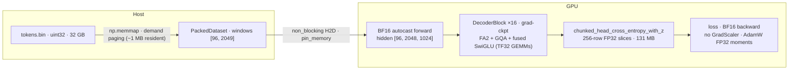

# The Memory Optimization Stack

> Audience: intermediate — where LLaMA-3-Lite's memory goes and which of the eight techniques reduce what, keyed to the code.
> This is the reference summary. The full per-tensor derivation lives in [memory-engineering.md](../theory/memory-engineering.md); per-topic theory links are in each section.

## 60-second summary

LLaMA-3-Lite pretrains a 513.8M-parameter decoder-only transformer at batch 96 × seq 2048 (196,608 tokens per step) on a single A100 80 GB. A naive run at this scale needs ~92 GB before the LM head is even attached — and ~193 GB with it. The repo's eight techniques bring the derived peak to ~20 GB, a ~78% reduction (the AGENTS.md headline: 92 GB → 20 GB). Three techniques do the heavy lifting: **gradient checkpointing** (activation memory from ~70 GB down to one buffer per layer), the **chunked LM-head cross-entropy + z-loss** (the 100.7 GB logits tensor never materializes; only 131 MB slices do), and **BF16 autocast** (activation and matmul footprint halved). The rest — GQA, Flash-Attention-2 via SDPA, the fused SwiGLU projection with Triton opt-ins, TF32 — shave the remaining peak and buy throughput. Every number on this page is **derived, not measured**: `.benchmarks/` is empty, so the 20 GB figure is an estimate with stated assumptions, not a logged peak.

## Why this exists

The token count per step is fixed by the config: `N = B × S = 96 × 2048 = 196{,}608`. The vocab is `V = 128{,}000` (`config.py:get_config`). The naive memory killers are:

- **The LM head.** One `[N, V]` logits tensor is $196{,}608 \times 128{,}000 = 25.17 \times 10^9$ elements — **100.7 GB in FP32, 50.3 GB in BF16**. Bigger than the whole GPU.
- **Activations.** Sixteen decoder layers each keep a stack of intermediate tensors for backward; at this batch size that is on the order of 70 GB without checkpointing (per-tensor accounting in [memory-engineering.md](../theory/memory-engineering.md)).
- **Attention scores.** A materialized $[B, H, S, S] = [96, 8, 2048, 2048]$ matrix is 12.9 GB FP32 per the full-stack computation (never materialized in this repo).

Without the stack, none of these fit; with it, the derived peak is ~20 GB, leaving ~60 GB of headroom on the 80 GB card. The remainder of this doc is the technique-by-technique account of how that happens, with the code that does it.

## The stack at a glance

| # | Technique | What it saves | Implementation site | Theory / derivation |
|---|-----------|---------------|---------------------|---------------------|
| 1 | Gradient checkpointing | Activation memory: ~70 GB → one saved buffer per layer | `model.py:Transformer.forward` (`checkpoint(layer, x, use_reentrant=False)`) | [gradient-checkpointing.md](../theory/gradient-checkpointing.md) · [memory-engineering.md](../theory/memory-engineering.md) |
| 2 | Chunked LM head CE + z-loss | Logits: 100.7 GB FP32 (50.3 GB BF16) → 131 MB per 256-row slice, ~0.3 GB total | `model.py:chunked_head_cross_entropy_with_z` | [loss-functions.md](../theory/loss-functions.md) · [memory-engineering.md](../theory/memory-engineering.md) |
| 3 | Disk-backed uint32 token cache | System RAM: 32 GB corpus file → ~1 MB resident (memmap demand paging) | `data/shared_data/loader.py:PackedDataset`, `data/shared_data/loader.py:build_training_data` | [data-engineering.md](../theory/data-engineering.md) · [memory-engineering.md](../theory/memory-engineering.md) |
| 4 | BF16 mixed precision | Halves activation/matmul footprint; ~2× matmul throughput | `train.py:train_model`, `train.py:validate`, `train.py:generate_samples` (`torch.autocast(..., dtype=torch.bfloat16)`) | [mixed-precision.md](../theory/mixed-precision.md) · [memory-engineering.md](../theory/memory-engineering.md) |
| 5 | Flash-Attention-2 via SDPA | Attention memory: O(S²) → O(S); score matrix never materialized | `model.py:GroupedQueryAttention.forward` (`F.scaled_dot_product_attention(..., is_causal=True)`) | [attention.md](../theory/attention.md) · [memory-engineering.md](../theory/memory-engineering.md) |
| 6 | Grouped-Query Attention (GQA) | K/V projection params halved (8 Q / 4 KV heads); inference KV cache halved | `model.py:GroupedQueryAttention` (`n_rep = 2`) | [attention.md](../theory/attention.md) · [memory-engineering.md](../theory/memory-engineering.md) |
| 7 | Fused SwiGLU + Triton opt-ins | One fused `gate_up_proj` GEMM instead of two; elementwise fusions in SRAM | `model.py:SwiGLUFFN`, `kernels/rmsnorm_triton.py`, `kernels/swiglu_triton.py`, `kernels/cross_entropy_triton.py` | [feedforward.md](../theory/feedforward.md) · [kernel-programming.md](../theory/kernel-programming.md) · [kernels.md](kernels.md) |
| 8 | TF32 matmul acceleration | No memory — ~3× Tensor-Core matmul throughput on A100 | `train.py:setup_gpu_optimizations` (`allow_tf32=True`, `torch.set_float32_matmul_precision('high')`) | [mixed-precision.md](../theory/mixed-precision.md) |

### Why "7 techniques" in AGENTS.md but 8 rows here

AGENTS.md's "7-technique memory stack" table actually lists **8 rows**, and two of them are not load-bearing here: it includes `channels_last` (a layout hint that does not appear anywhere in `model.py` or `train.py`) and "Fused AdamW" (this repo uses a stock `torch.optim.AdamW` with parameter grouping — no custom fused kernel). This page replaces those two rows with the techniques the code actually implements — **GQA** and the **fused SwiGLU + Triton opt-ins** — keeping the count at eight. So: the label is stale in both directions, the table below is the ground truth, and the "78% / 92 → 20 GB" headline is independent of how you count the rows.

## Technique by technique

### 1. Gradient checkpointing

**What it saves:** the activation memory of 16 decoder layers. Without it, every intermediate tensor from every layer must live until backward. With it, only each layer's *input* survives; backward re-runs the layer's forward to regenerate the rest (one extra forward per backward — a compute cost, not a memory one).

**Where:** `model.py:Transformer.forward`:

```python
# illustrative
if self.gradient_checkpointing and self.training:
    for layer in self.decoder.layers:
        x = checkpoint(layer, x, use_reentrant=False)
```

The flag comes from `config.py:get_config` (`gradient_checkpointing: True`) and is threaded through `model.py:build_transformer` from `train.py:train_model`. `use_reentrant=False` is the compile-friendly checkpoint API (no double-backward traps).

**At this scale:** saved buffers are $16 \times [96, 2048, 1024]$ → **6.4 GB** at 2 bytes/element (BF16 activations) or **12.9 GB** at 4 bytes (FP32). The ~70 GB unoptimized figure is derived per tensor in [memory-engineering.md](../theory/memory-engineering.md).

### 2. Chunked LM head CE + z-loss

**What it saves:** the single largest tensor in the run. `$[N, V]$` logits = 100.7 GB FP32 / 50.3 GB BF16 — larger than the GPU. The training path never computes them as one tensor: `model.py:Transformer.forward` returns the hidden states (`return_hidden=True`), and `model.py:chunked_head_cross_entropy_with_z` applies the output projection in `chunk_size=256`-row slices, each wrapped in `checkpoint`, so exactly one slice is alive at a time — **131 MB** ($256 \times 128{,}000 \times 4$ B FP32) plus the per-chunk loss chain (~0.3 GB total, derived). The call site in `train.py:train_model`:

```python
# illustrative
with torch.autocast(device_type=device.type, dtype=torch.bfloat16,
                    enabled=(device.type == 'cuda')):
    hidden = model(input_ids, return_hidden=True)
    loss = chunked_head_cross_entropy_with_z(
        hidden.view(-1, hidden.size(-1)),
        _head_weight(model),
        target_ids.view(-1),
        chunk_size=ce_chunk_size,
        ignore_index=ignore_index,
        z_loss_weight=z_loss_weight,
        cross_entropy_impl=cross_entropy_impl,
    )
```

`train.py:_head_weight` resolves the LM head through the EMA/`torch.compile` wrappers (`model.module.output_proj.weight`). Per chunk the slice is upcast with `.float()` before `logsumexp` and `cross_entropy`, so the loss chain keeps full FP32 precision inside BF16 autocast. The **z-loss** term accumulates $\text{mean}((\log \sum_z e^{z})^2)$ over *non-ignored* tokens only (`mask = targets != ignore_index`); `ignore_index=-100` because this pipeline has no padding — EOS separators stay learnable. `model.py:chunked_cross_entropy_with_z` is the sibling that consumes an already-materialized logits tensor. Chunked CE ≡ dense CE (disjoint per-chunk reductions) is proven in [loss-functions.md](../theory/loss-functions.md); the memory bound is derived in [memory-engineering.md](../theory/memory-engineering.md). The knob is `ce_chunk_size` (`config.py:get_config`, default 256).

### 3. Disk-backed uint32 token cache

**What it saves:** system RAM. The pretokenized corpus is one uint32 binary — $8 \times 10^9$ tokens × 4 B = **32 GB** at the `target_tokens: 8_000_000_000` plan (the 42,000-step run consumes $42{,}000 \times 196{,}608 = 8.26 \times 10^9$ tokens). It is opened as a memory map, not loaded:

```python
tokens = np.memmap(path, dtype=np.uint32, mode="r")
```

(`data/shared_data/loader.py:build_training_data`). The OS pages in only the blocks the batch actually touches — a batch window is $96 \times 2048 \times 4$ B = 786 KB — so resident footprint is on the order of **~1 MB**, not 32 GB (the older docs' "112 GB" was a 28B-token plan, retired). `data/shared_data/loader.py:PackedDataset` slices `seq_len+1`-token windows straight out of the map with no copy (`np.asarray` view → `torch.from_numpy`), and `data/shared_data/loader.py:collate_fn` stacks them. Prefetch (`num_workers: 6`, `prefetch_factor: 16`, `pin_memory: True` in `config.py:get_config`) plus `non_blocking=True` H2D copies in `train.py:train_model` hide the I/O behind compute. Full layout and residency argument: [data-engineering.md](../theory/data-engineering.md) and [memory-engineering.md](../theory/memory-engineering.md).

### 4. BF16 mixed precision

**What it saves:** activation and matmul-intermediate memory (halved vs FP32) and roughly 2× matmul throughput via A100 Tensor Cores. Every forward in the repo is scoped by autocast:

```python
with torch.autocast(device_type=device.type, dtype=torch.bfloat16,
                    enabled=(device.type == 'cuda')):
```

in `train.py:train_model`, `train.py:validate`, and `train.py:generate_samples`. BF16 keeps the FP32 8-bit exponent range, so gradients don't underflow and there is no `GradScaler` (the code says so at the backward call: "BF16 has the FP32 exponent range; no GradScaler needed").

**Honest scope.** Autocast downcasts *compute* (linear/matmul inputs and outputs: activations, q/k/v, FFN intermediates), not *parameters*. `train.py:train_model` builds the model with the default FP32 dtype (`.to(device)`, no `.to(torch.bfloat16)` anywhere), so master weights and gradients stay FP32 — 2.06 GB each — and the model-state row is **8.2 GB**, not the "1.03 GB BF16 weights" the older docs claimed. Halving weight storage would require an explicit BF16 parameter cast this repo does not perform; the loss chain upcasting in §2 is what keeps the FP32 precision where it matters. Details: [mixed-precision.md](../theory/mixed-precision.md) and [memory-engineering.md](../theory/memory-engineering.md).

### 5. Flash-Attention-2 via SDPA

**What it saves:** attention memory from $O(S^2)$ to $O(S)$. A materialized score matrix $[96, 8, 2048, 2048] = 3.22 \times 10^9$ elements (12.9 GB FP32) never exists:

```python
x = F.scaled_dot_product_attention(q, k, v, is_causal=True)
```

(`model.py:GroupedQueryAttention.forward`). On CUDA this dispatches to a fused kernel (FlashAttention-2 / memory-efficient backend) that tiles the softmax and streams it through SRAM; `is_causal=True` handles the causal mask inside the kernel. Theory: [attention.md](../theory/attention.md); memory math: [memory-engineering.md](../theory/memory-engineering.md).

### 6. Grouped-Query Attention (GQA)

**What it saves:** K/V projection parameters and, at inference time, KV-cache size. `model.py:GroupedQueryAttention` projects `q` to 8 heads but `k`/`v` to 4 (`n_rep = n_heads // n_kv_heads = 2`), then broadcasts via `expand` + `reshape` before SDPA. Param math: MHA K/V projections would be $2 \times 1024 \times 1024 = 2.10$M/layer; GQA's are $2 \times 1024 \times 512 = 1.05$M/layer — a saving of 1.05M params/layer × 16 layers = **16.8M params** (33.6 MB FP32), or 50% of the K/V weights. During training with FA2 there is no explicit KV cache; the halving matters at generation. Config: `n_heads: 8`, `n_kv_heads: 4`, `head_dim: 128` in `config.py:get_config`. Theory: [attention.md](../theory/attention.md); numbers: [memory-engineering.md](../theory/memory-engineering.md).

### 7. Fused SwiGLU + Triton opt-ins

**What it saves:** kernel launches and activation round-trips. `model.py:SwiGLUFFN` fuses gate and up into one linear — `gate_up_proj = nn.Linear(1024, 2 * 4096)` — so one GEMM replaces two, and gate/up are split in registers:

```python
gate, up = gate_up.chunk(2, dim=-1)
return self.down_proj(F.silu(gate) * up)
```

The **Triton opt-ins** push the elementwise fusions into GPU SRAM: `kernels/rmsnorm_triton.py` (row-wise RMSNorm), `kernels/swiglu_triton.py` (gate×up fuse), `kernels/cross_entropy_triton.py` (online-softmax CE + z-loss). They are gated twice: per-kernel `rmsnorm_impl` / `swiglu_impl` / `cross_entropy_impl` keys in `config.py:get_config`, and an environment switch — `train.py:train_model` force-restores all three to `'pytorch'` unless `ENABLE_TRITON_KERNELS=1`. Every dispatch has a runtime `try/except` fallback (`model.py:RMSNorm.forward`, `model.py:SwiGLUFFN.forward`, `model.py:chunked_head_cross_entropy_with_z`). Kernel-by-kernel design: [kernels.md](kernels.md) and [kernel-programming.md](../theory/kernel-programming.md).

### 8. TF32 matmul acceleration

**What it saves:** nothing in memory — **compute**. `train.py:setup_gpu_optimizations` enables TF32 matmuls and `torch.set_float32_matmul_precision('high')`, trading a 10-bit mantissa for ~3× Tensor-Core matmul throughput on A100. It belongs in the stack because a memory fit is worthless if the run is compute-bound; it is a throughput technique, and the same function also sets `PYTORCH_CUDA_ALLOC_CONF=expandable_segments:True` (config key `cuda_alloc_conf`), which lets the caching allocator grow segments instead of fragmenting — relevant to the workspace row below. Numerics: [mixed-precision.md](../theory/mixed-precision.md).

## Peak memory: 92 GB → 20 GB

`N = 196{,}608` tokens/step; `V = 128{,}000`; 16 layers; d_model 1024. All rows are **derived** under the stated dtype assumptions; each links to its derivation.

| Component | Baseline (no stack) | With stack | Derivation |
|---|---|---|---|
| Model state: weights + grads + AdamW moments | 2.06 + 2.06 + 4.11 = **8.2 GB** FP32 | **8.2 GB** (master weights/grads stay FP32; BF16 autocast does not cast them — see §4) | [memory-engineering.md](../theory/memory-engineering.md) |
| Activations, 16 layers | **~70 GB** FP32, all intermediates kept for backward | **~6.4 GB** checkpointed layer inputs (BF16: $16 \times [96, 2048, 1024] \times 2$ B) + transient recompute buffers | [memory-engineering.md](../theory/memory-engineering.md) |
| Attention scores / KV | **12.9 GB** (MHA, materialized $[96, 8, 2048, 2048]$ FP32) | not materialized — SDPA/FA2 is $O(S)$; GQA halves K/V params | [memory-engineering.md](../theory/memory-engineering.md) |
| LM head logits | **100.7 GB** FP32 (50.3 GB BF16) | **~0.3 GB** — 256-row slices, 131 MB FP32 each, one alive at a time | [memory-engineering.md](../theory/memory-engineering.md) |
| Workspace / caching allocator | ~1 GB | ~5 GB (recompute transient + `expandable_segments` + compiled graph) | [memory-engineering.md](../theory/memory-engineering.md) |
| **Peak** | **~92 GB** (pre-head baseline: 8.2 + 70 + 12.9 + ~1; attaching full logits would push it to ~193 GB) | **~20 GB** (8.2 + 6.4 + 0.3 + ~5.1) | $(92 - 20) / 92 = 78\%$ |

The 78% headline is internally consistent: the baseline 92 GB is the unoptimized run *before* the LM head (whose un-chunked 50–100 GB alone exceeds the GPU — that is what makes technique #2 mandatory, not optional), and the optimized 20 GB is the derived peak with all eight techniques on.

## Measured vs estimated

- **`.benchmarks/` is empty.** Nothing on this page has been measured; every figure is derived from `config.py:get_config` shapes, dtype assumptions, and arithmetic. The training loop *does* log real GPU memory (`train.py:train_model` writes `gpu/memory_used_mb`, `gpu/memory_peak_mb`, `gpu/memory_reserved_mb` via `torch.cuda.memory_*`), so ground-truth peak numbers will exist after the first A100 run — none are archived today.
- **Known soft spots** (all resolved per-tensor in [memory-engineering.md](../theory/memory-engineering.md)): the ~70 GB unoptimized activation figure; the ~5 GB workspace line; the checkpointed-input dtype — under autocast the residual stream is FP32, which would put the §1 buffer at 12.9 GB and the peak near ~26 GB, while the 20 GB figure assumes BF16 activation storage; and `torch.compile(mode='reduce-overhead')` (CUDA-graph capture) transiently reserves extra memory during the warmup step, unquantified here.
- **Where this page corrects the older `docs/memory_stack.md`:** its "3.2 GB activations" line is d_model=512 math ($16 \times 96 \times 2048 \times 512 \times 2$ B); at d_model=1024 the checkpointed inputs alone are 6.4 GB (BF16) / 12.9 GB (FP32). Its "BF16 weights 1.03 GB" state row assumes a parameter cast the code does not perform; the honest state number is 8.2 GB FP32 (or 6.2 GB after an explicit BF16 cast). Its "~1 MB" RAM figure survives as an order-of-magnitude memmap residency estimate.

## How the pieces interact



Memory flows one way: disk-backed corpus → mmap windows → hidden states → chunked head. Each arrow is where a technique caps the footprint (memmap, grad-ckpt, chunked CE), and the GPU-internal boxes are where the others accelerate (BF16, FA2, GQA, fused SwiGLU, TF32). Drop any of the three memory caps and the run no longer fits; drop the throughput techniques and it still fits but runs slower.

## Further reading

- [memory-engineering.md](../theory/memory-engineering.md) — the authoritative 92 → 20 GB derivation, per tensor
- [training.md](training.md) — the loop that wires these together (`train_model`, `validate`, EMA)
- [config.md](config.md) — every memory-related knob (`gradient_checkpointing`, `ce_chunk_size`, `tf32`, `cuda_alloc_conf`, the `*_impl` keys)
- [kernels.md](kernels.md) — the three Triton kernels behind the opt-ins
- [troubleshooting.md](../guides/troubleshooting.md) — OOM at batch 96, CE chunk tuning, CUDA-graph capture stalls
