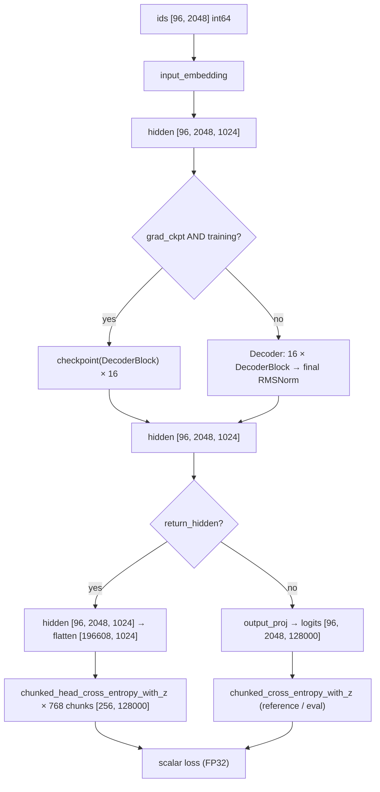

# Model Reference — `model.py`

> Audience: intermediate (ML practitioners who can read PyTorch). This is the
> code-keyed walkthrough of `model.py` — the consolidated successor of the
> retired `architecture.md` and `docs/model_architecture.md`. Concept theory
> lives in `docs/theory/`; this file explains what the code does, in what
> order, with what shapes, and why each piece exists.

## 1. The 60-Second Summary

`model.py` implements the entire LLaMA-3-Lite network: a decoder-only
transformer with 515M parameters (128,000-token vocabulary, 16 layers,
d_model 1024, 8 query heads / 4 KV heads, head_dim 128, SwiGLU FFN of width
4096, RoPE with theta 500,000). The file is organized bottom-up: small leaf
modules (`RoPE`, `RMSNorm`), then `GroupedQueryAttention`, `SwiGLUFFN`,
`DecoderBlock`, `Decoder`, and finally `Transformer` plus a `build_transformer`
factory. Two loss functions live here too: `chunked_cross_entropy_with_z`
(the reference implementation over materialized logits) and
`chunked_head_cross_entropy_with_z` (the training path, which computes the
128k-wide LM head in `chunk_size`-row slices inside gradient checkpointing so
the full `[196608, 128000]` logits tensor never exists). Three Triton kernels
(rmsnorm, swiglu, cross-entropy) are optional drop-ins controlled by `*_impl`
constructor arguments, each with a PyTorch fallback.

## 2. File Overview and Module Map

| Symbol | Kind | Role |
|---|---|---|
| `model.py:RoPE` | class | Rotary position embeddings, precomputed cos/sin buffers, no learnable params |
| `model.py:RMSNorm` | class | RMS normalization with optional Triton fused path |
| `model.py:GroupedQueryAttention` | class | GQA: Q/K/V projections, QK-norm, RoPE, SDPA with `is_causal=True` |
| `model.py:SwiGLUFFN` | class | Fused gate+up projection, SiLU gating, optional Triton path |
| `model.py:DecoderBlock` | class | One transformer layer: pre-norm attention + pre-norm FFN residuals |
| `model.py:Decoder` | class | Stack of blocks + final RMSNorm |
| `model.py:Transformer` | class | Full model: embedding, decoder, untied LM head, weight init, param counting |
| `model.py:chunked_cross_entropy_with_z` | function | Reference CE + z-loss over an already-materialized logits tensor |
| `model.py:chunked_head_cross_entropy_with_z` | function | Memory-bounded LM head + CE + z-loss (the training path) |
| `model.py:build_transformer` | function | Factory with diagnostic parameter printing |

The module imports only PyTorch (`torch`, `torch.nn`, `torch.nn.functional`,
`torch.utils.checkpoint.checkpoint`) and the three Triton entry points
(`kernels/rmsnorm_triton.py:triton_rmsnorm`,
`kernels/swiglu_triton.py:triton_swiglu`,
`kernels/cross_entropy_triton.py:triton_chunked_cross_entropy_with_z`). The
Triton kernels are described in `[kernels.md](kernels.md)`; their theory in
`[kernel-programming.md](../theory/kernel-programming.md)`.

## 3. Block-by-Block Walkthrough

### 3.1 `RoPE` — rotary position embeddings

**Purpose.** Attention is permutation-invariant: without position
information, the token at position 3 and the token at position 40 produce
identical Q/K inner products. RoPE encodes position by rotating each
head-dimension pair of the query and key vectors by an angle proportional to
the absolute position, so that the Q·K inner product becomes a function of
the *relative* offset `i − j`. The theory is in
`[positional-encoding.md](../theory/positional-encoding.md)`; the
implementation deep-dive is `[rope.md](rope.md)`.

**Constructor (`model.py:RoPE.__init__`).** With `head_dim=128`, `max_seq_len=2048`,
`theta=500000.0`:

- `inv_freq[i] = 1 / theta^(2i / head_dim)` for `i` in `0..63` — 64 frequency
  constants, geometrically spaced. The high `theta=500k` slows the rotation
  schedule (LLaMA 3's long-context choice; the AGENTS.md hard rule).
- `cos_cached`, `sin_cached` = `cos/sin(t ⊗ inv_freq)` for `t = 0..2047`,
  shaped `[1, 1, 2048, 64]`. These are registered as **buffers** — persistent
  in `state_dict` but with zero gradient and zero parameter count.

**Forward (`model.py:RoPE.forward`).** Given `x` of shape
`[B, n_heads, S, head_dim]` and a `seq_len`:

1. Slice the cached tables to `[1, 1, seq_len, 64]` — buffers are
   precomputed up to `max_seq_len`, so any shorter sequence is a cheap view.
2. Split `x` into even-indexed elements `x[..., ::2]` and odd-indexed
   `x[..., 1::2]` (`x1`, `x2`).
3. Apply the 2D rotation per pair:
   `stack([x1·cos − x2·sin, x1·sin + x2·cos], dim=-1)` and `flatten(-2)` back
   to `[B, n_heads, S, head_dim]`.

Because each pair is rotated by an orthogonal matrix, the norm of every
vector is preserved (`tests/test_model.py::TestRoPE::test_rotation_is_orthogonal`),
position 0 is the identity (`test_position_zero_is_identity`), and the
relative-position property holds (`test_relative_position_property`). RoPE is
applied to Q and K only — never to V.

### 3.2 `RMSNorm` — root mean square normalization

**Purpose.** Pre-normalization keeps residual-stream gradients stable; RMS
normalization drops LayerNorm's mean-subtraction, which costs one reduction
pass and matters at this scale. Theory: `[normalization.md](../theory/normalization.md)`.

**Constructor (`model.py:RMSNorm.__init__`).** One learnable scale
`self.weight = ones(d_model)`, `eps=1e-5`, and an `impl` string
(`"pytorch"` default, `"triton"` opt-in).

**Forward (`model.py:RMSNorm.forward`).** The reference path is exactly

$$x \odot \frac{1}{\sqrt{\frac{1}{d}\sum_{i=1}^{d} x_i^2 + \epsilon}} \odot w$$

implemented as `x * torch.rsqrt(x.pow(2).mean(dim=-1, keepdim=True) + eps) * weight`.
When `impl == "triton"`, the module first tries
`kernels/rmsnorm_triton.py:triton_rmsnorm`; on `ImportError`/`ValueError`
(triton missing — the norm on Mac/CPU dev boxes) it prints a one-time
fallback notice (guarded by `_triton_fallback_warned`) and takes the PyTorch
path. There is no mean subtraction anywhere: the normalization constant is
the RMS of the row, not its standard deviation.

### 3.3 `GroupedQueryAttention` — GQA with QK-norm and SDPA

**Purpose.** With 8 query heads and 4 KV heads (`n_rep = 8/4 = 2`), the KV
projections and the KV cache are half the size of full MHA. Theory:
`[attention.md](../theory/attention.md)`.

**Constructor (`model.py:GroupedQueryAttention.__init__`).** Four
bias-free `nn.Linear`s:

| Projection | Weight shape | Rows it produces |
|---|---|---|
| `q_proj` | `[8·128, 1024] = [1024, 1024]` | 8 query heads × 128 |
| `k_proj` | `[4·128, 1024] = [512, 1024]` | 4 KV heads × 128 |
| `v_proj` | `[4·128, 1024] = [512, 1024]` | 4 KV heads × 128 |
| `out_proj` | `[1024, 8·128] = [1024, 1024]` | projects attention output back to d_model |

If `qknorm=True` (the default), `q_norm` and `k_norm` are `RMSNorm(head_dim=128)`
— per-head normalization applied *after* projection and *before* RoPE
(Qwen2/Gemma2 placement; it bounds attention-logit growth late in training).
If `qknorm=False` they become `nn.Identity()`. `self.rope = RoPE(head_dim, max_seq_len, rope_theta)`.

**Forward (`model.py:GroupedQueryAttention.forward`)** — note the signature is
`forward(self, x)` with **no mask parameter**: causality is expressed solely
through SDPA's `is_causal=True` flag.

1. `q = q_proj(x).view(B, S, 8, 128)`; `k`, `v` likewise with 4 heads. The
   `view` keeps the token axis second so the subsequent RMSNorm operates on
   the last axis (`head_dim`), which is what the per-head norm needs.
2. `q = q_norm(q)`, `k = k_norm(k)` — QK-norm here, on `[B, S, n_heads, head_dim]`.
3. `transpose(1, 2)` gives `[B, 8, S, 128]` for Q and `[B, 4, S, 128]` for K/V.
4. `q = rope(q, S)`, `k = rope(k, S)` — position information enters.
5. GQA expansion: `k`/`v` are broadcast `expand(B, 4, 2, S, 128).reshape(B, 8, S, 128)` —
   a strided-view trick, no memory copy.
6. `x = F.scaled_dot_product_attention(q, k, v, is_causal=True)` — PyTorch's
   fused SDPA, which dispatches to the Flash Attention 2 kernel on CUDA
   (O(S) memory instead of an O(S²) attention matrix). The causal flag means
   token `i` attends only to `0..i`; `tests/test_model.py::TestGroupedQueryAttention::test_causality`
   enforces this by perturbing the last token and checking earlier outputs are
   unchanged.
7. `x.transpose(1, 2).contiguous().view(B, S, -1)` then `out_proj(x)` →
   `[B, S, 1024]`.

### 3.4 `SwiGLUFFN` — gated feed-forward network

**Purpose.** The FFN does the per-token nonlinear computation; SwiGLU gates
the hidden activation so each token can modulate *how much* of the up-projected
value passes through. Theory: `[feedforward.md](../theory/feedforward.md)`.

**Constructor (`model.py:SwiGLUFFN.__init__`).** `gate_up_proj` is one
`nn.Linear(d_model, 2·d_ff)` — weight `[8192, 1024]` — fusing what LLaMA
calls `gate_proj` and `up_proj` into a single matmul (one Tensor-Core-friendly
GEMM instead of two). `down_proj` is `nn.Linear(d_ff, d_model)` — weight
`[1024, 4096]`.

**Forward (`model.py:SwiGLUFFN.forward`).**

$$x \mapsto \text{down\_proj}\big(\text{SiLU}(xW_{\text{gate}}) \odot xW_{\text{up}}\big)$$

With `swiglu_impl="pytorch"`: `gate, up = gate_up.chunk(2, dim=-1)`, then
`down_proj(F.silu(gate) * up)`. With `swiglu_impl="triton"`: the module calls
`kernels/swiglu_triton.py:triton_swiglu(gate_up, d_ff)` — one fused elementwise
kernel that computes SiLU, gating and splitting in a single launch — falling
back to PyTorch on `ImportError`/`ValueError` with a one-time warning. The
fusion equivalence is tested by
`tests/test_model.py::TestSwiGLUFFN::test_fused_equals_unfused_reference`.

### 3.5 `DecoderBlock` — one transformer layer

**Constructor (`model.py:DecoderBlock.__init__`).** Wires one
`GroupedQueryAttention`, one `SwiGLUFFN`, and two d_model-wide `RMSNorm`s
(`attention_norm`, `ffn_norm`), threading `qknorm`, `rmsnorm_impl`, and
`swiglu_impl` through.

**Forward (`model.py:DecoderBlock.forward`).** Pre-norm residual layout:

```python
# illustrative
x = x + self.attention(self.attention_norm(x))   # attention sub-block
x = x + self.ffn(self.ffn_norm(x))               # FFN sub-block
return x
```

Normalize first, transform, then add back to the unchanged residual stream.
The residual path is an identity map, so gradients flow through the stack
without vanishing through 16 nonlinearities.

### 3.6 `Decoder` — the layer stack

**Constructor (`model.py:Decoder.__init__`).** Holds the `nn.ModuleList` of 16
`DecoderBlock`s and the final `RMSNorm(d_model, eps=rms_norm_eps)`.

**Forward (`model.py:Decoder.forward`).** Loops the blocks in order, then
applies the final norm once:

```python
# illustrative
for layer in self.layers:
    x = layer(x)
return self.norm(x)
```

The final norm is what the LM head reads; it is part of `Decoder` (not of
`Transformer`) because the gradient-checkpointing path in
`model.py:Transformer.forward` interacts with it (see §3.7).

### 3.7 `Transformer` — the full model

**Constructor (`model.py:Transformer.__init__`).**

- `input_embedding = nn.Embedding(vocab_size, d_model)` — weight `[128000, 1024]`.
- 16 `DecoderBlock`s in a `ModuleList`, wrapped in a `Decoder`.
- `output_proj = nn.Linear(d_model, vocab_size)` — weight `[128000, 1024]`,
  **untied**: a separate matrix from the input embedding, so the LM head is a
  full 131M parameters of its own (no weight tying).
- `gradient_checkpointing` is stored as a plain flag. Per the in-code note,
  the enable/disable setters were removed — the flag is fixed at construction
  time and never toggled at runtime.
- `_init_weights()`: every `nn.Linear` and `nn.Embedding` weight is drawn
  from `normal_(0, 0.02)`. RMSNorm scales stay at 1.0; RoPE has no parameters.

**Forward (`model.py:Transformer.forward`).**

```python
# illustrative
x = self.input_embedding(x)                       # [B, S] -> [B, S, 1024]
if self.gradient_checkpointing and self.training:
    for layer in self.decoder.layers:
        x = checkpoint(layer, x, use_reentrant=False)
else:
    x = self.decoder(x)                           # layers + final norm
if return_hidden:
    return x
return self.output_proj(x)                        # [B, S, 128000]
```

- `return_hidden=True` returns the final hidden states instead of logits —
  this is the training contract: `train.py` calls `model(ids, return_hidden=True)`
  and feeds the hidden states to `chunked_head_cross_entropy_with_z`
  (see §4; the loop is documented in `[training.md](training.md)`).
- The gradient-checkpointing branch wraps each layer in
  `torch.utils.checkpoint.checkpoint(layer, x, use_reentrant=False)` so layer
  inputs are discarded and recomputed during backward (theory:
  `[gradient-checkpointing.md](../theory/gradient-checkpointing.md)`). Two
  subtleties worth knowing:

  1. The branch fires only when `self.training` is true. In eval mode a
     checkpoint-enabled model takes the `else` branch and runs normally.
  2. The checkpointed loop applies `decoder.norm` explicitly after the
     layers (`x = self.decoder.norm(x)`), so training and eval apply the
     final RMSNorm identically — a fix for the earlier behavior where the
     checkpointed branch bypassed it.
     `tests/test_model.py::TestTransformerForward::test_gradient_checkpointing_matches_normal`
     exercises both models in eval mode, where the two paths coincide.

**Parameter counting (`model.py:Transformer.get_num_params`).** Sums
`p.numel()` over all parameters; with `non_embedding=True` (default) it
subtracts both `input_embedding.weight.numel()` and
`output_proj.weight.numel()`. Buffers (RoPE cos/sin, `inv_freq`) are not
parameters and never counted. The definition is pinned by
`tests/test_model.py::TestTransformerParamCount::test_get_num_params_definition_mismatch`,
which asserts `get_num_params(non_embedding=True) == total − embedding − head`.

## 4. The Chunked Losses: Reference vs. Training Path

The vocabulary projection is the memory bottleneck of the whole model. At the
training batch of `B=96, S=2048` there are $N = 96 \times 2048 = 196{,}608$
tokens, so a materialized logits tensor would be

$$196{,}608 \times 128{,}000 = 25.17 \times 10^9 \text{ elements} = \begin{cases} 50.3 \text{ GB (BF16)} \\ 100.7 \text{ GB (FP32)} \end{cases}$$

which exceeds the A100's 80 GB. Two functions in `model.py` exist because
there are two different problems: *where* the FP32 loss chain is bounded, and
*whether the logits tensor exists at all. Full derivation:
`[loss-functions.md](../theory/loss-functions.md)`; memory accounting:
`[memory-engineering.md](../theory/memory-engineering.md)`.

### 4.1 `chunked_cross_entropy_with_z` — the reference implementation

Signature (real, from source):

```python
chunked_cross_entropy_with_z(logits, targets, chunk_size=256, ignore_index=-100,
                             z_loss_weight=1e-4, cross_entropy_impl="pytorch")
```

This function **receives the full logits tensor already materialized** — it
is the reference and the numerical ground truth used by the equivalence
tests; its docstring explicitly says to prefer the head-chunked variant when
the logits themselves would not fit in memory. It chunks along the token axis
so the FP32 upcast chain never sees more than `chunk_size` rows at once.
Per chunk (`model.py:chunked_cross_entropy_with_z` loop):

- `cl = logits[start:end].float()` — one FP32 upcast shared by CE and
  logsumexp (a single precision promotion, not two).
- `mask = ct != ignore_index`; ignored positions are excluded from **both**
  the CE mean and the z-loss mean.
- `log_z = logsumexp(cl, -1)`; accumulate `log_z[mask].pow(2).sum()` and the
  mask count — this is the masked z-loss (PaLM/Gemma2 logit-growth penalty).
- `ce = F.cross_entropy(cl, ct, ignore_index=ignore_index, reduction='none')`;
  accumulate `ce[mask].sum()` and the count.

After the loop:

$$\mathcal{L} = \frac{\sum_{\text{valid}} \text{CE}}{\text{count}} + z\_loss\_weight \cdot \frac{\sum_{\text{valid}} \log z^2}{\max(n_z, 1)}$$

with the `max(…, 1)` guards protecting against an all-ignored batch.
`cross_entropy_impl="triton"` swaps the whole per-chunk loop for
`kernels/cross_entropy_triton.py:triton_chunked_cross_entropy_with_z`
(fused online-softmax kernel; falls back to PyTorch with a printed warning).
Equivalence with `F.cross_entropy` plus a `weight·mean(log_z²)` penalty is
pinned at 1e-5 by `tests/test_model.py::TestChunkedCrossEntropyWithZ::test_matches_ce_plus_zpen_reference`,
and ignore-index masking by `test_z_loss_ignores_ignore_index_positions`.

### 4.2 `chunked_head_cross_entropy_with_z` — the training path

Signature (real, from source):

```python
# illustrative
chunked_head_cross_entropy_with_z(hidden, head_weight, targets, chunk_size=256,
                                  ignore_index=-100, z_loss_weight=1e-4,
                                  cross_entropy_impl="pytorch")
```

This is what `train.py` uses for the training, warmup, and validation losses
(`train.py` call sites, with `_head_weight(model)` resolving the LM head
through EMA/compile wrappers). It never materializes the full logits tensor:

1. The input is the **hidden states** `[196608, 1024]` (flattened from
   `[96, 2048, 1024]` by the caller) plus the head weight `[128000, 1024]`.
2. For each `chunk_size`-row slice it runs
   `checkpoint(_chunk, hidden[start:end], head_weight, targets[start:end], use_reentrant=False)`
   where `_chunk` computes `logits = F.linear(hidden_c, w)` — the per-chunk
   LM head — then the same FP32 CE + masked-z chain as §4.1.
3. Because each chunk runs inside `torch.utils.checkpoint`, only one chunk's
   logits are alive at a time: `[256, 128000]` = 65.5 MB BF16 / 131 MB FP32,
   instead of the 50.3 GB full tensor. With 196,608 tokens the loop runs
   exactly 768 chunks. This is the ~0.3 GB loss-memory bound the docstring
   claims (131 MB FP32 chunk × the handful of tensors the checkpoint keeps
   alive). Gradients flow to both `hidden` and `head_weight` — proven by
   `tests/test_model.py::TestChunkedHeadCrossEntropyWithZ::test_gradients_flow_to_hidden_and_head`
   (the head gets a grad, and the *embedding* gets a grad, which proves flow
   through the non-leaf hidden tensor).
4. Results are accumulated as sums (`total_ce`, `total_count`, `z_accum`,
   `n_z`) and averaged at the end — so the chunked result is **exactly**
   equal to the dense loss, not an approximation
   (`test_matches_dense_ce_plus_z` asserts equality at 1e-5 with `z_loss_weight=1e-4`).

The Triton variant differs: with `cross_entropy_impl="triton"` and triton
importable (`HAS_TRITON`), each chunk returns the fused kernel's scalar loss
and the per-chunk losses are *averaged* — exact only because the chunks are
equal-sized (256 divides 196,608). The averaging branch is documented in the
function docstring.

**Why two functions?** `chunked_cross_entropy_with_z` bounds the FP32 loss
chain but still requires the caller to own a full logits tensor; it is the
reference implementation that the numerical-equivalence tests compare
against. `chunked_head_cross_entropy_with_z` additionally bounds the logits
themselves, which is what makes training at batch 96 fit in 80 GB. The CE
chunk size is a config knob (`config.py:get_config` → `ce_chunk_size: 256`);
`[config.md](config.md)` documents the knob, `[troubleshooting.md](../guides/troubleshooting.md)`
the OOM symptoms of raising it.

## 5. `build_transformer` — Factory and Diagnostics

`model.py:build_transformer` is a thin, keyword-explicit factory:

```python
# illustrative
build_transformer(vocab_size=128256, d_model=1024, n_layers=16, n_heads=8,
                  n_kv_heads=4, head_dim=128, d_ff=4096, max_seq_len=2048,
                  rope_theta=500000.0, rms_norm_eps=1e-5,
                  gradient_checkpointing=False, qknorm=True,
                  rmsnorm_impl="pytorch", swiglu_impl="pytorch") -> Transformer
```

Note the default `vocab_size=128256` (the Meta Llama-3 tokenizer vocabulary),
while production passes the config value `128000` from
`config.py:get_config` (see `[training.md](training.md)` for the
`build_transformer` call site). After construction it prints the diagnostics
that appear in every training log:

```
Total params: 513,840,128 (513.8M)
Non-embedding params: 251,696,128 (251.7M)
```

plus `Gradient checkpointing: ENABLED` when the flag is set, and a
`Triton kernels active: rmsnorm, swiglu` line when either `*_impl` is
`"triton"`. `total` is the plain parameter sum; `non_embed` uses
`model.get_num_params(non_embedding=True)` (both embedding tables subtracted).

## 6. End-to-End Tensor Shape Trace

The full data flow, from token ids to scalar loss, at the production shape
`[96, 2048]`:



One decoder block in detail (per-token shapes after `B=96, S=2048`):

| Step | Operation | Output shape |
|---|---|---|
| 0 | input token ids | `[96, 2048]` int64 |
| 1 | `input_embedding` (`model.py:Transformer.forward`) | `[96, 2048, 1024]` |
| 2 | `attention_norm` (RMSNorm) | `[96, 2048, 1024]` |
| 3 | `q_proj` / `k_proj` / `v_proj` then `view` | Q `[96, 2048, 8, 128]`, K/V `[96, 2048, 4, 128]` |
| 4 | QK-norm `q_norm` / `k_norm` (per-head) | same shapes as step 3 |
| 5 | `transpose(1, 2)` + RoPE | Q `[96, 8, 2048, 128]`, K `[96, 4, 2048, 128]` |
| 6 | GQA expand (`n_rep=2`) | K/V `[96, 8, 2048, 128]` (view, no copy) |
| 7 | `F.scaled_dot_product_attention(..., is_causal=True)` | `[96, 8, 2048, 128]` |
| 8 | `transpose` + `contiguous().view` + `out_proj` | `[96, 2048, 1024]` |
| 9 | residual add | `[96, 2048, 1024]` |
| 10 | `ffn_norm` (RMSNorm) | `[96, 2048, 1024]` |
| 11 | `gate_up_proj` | `[96, 2048, 8192]` |
| 12 | `silu(gate) * up` (chunk to 2×4096, gate, multiply) | `[96, 2048, 4096]` |
| 13 | `down_proj` + residual add | `[96, 2048, 1024]` |
| 14 | final `decoder.norm` | `[96, 2048, 1024]` |
| 15 | `output_proj` (full path only) | `[96, 2048, 128000]` |
| 16 | loss (training path) | scalar FP32 |

Dtype note: the suite runs FP32 on CPU and BF16 on GPU (the conftest
`dtype` fixture); in training, autocast downcasts
matmuls to BF16 on CUDA while the loss chain upcasts per chunk to FP32
(see `[mixed-precision.md](../theory/mixed-precision.md)`).

## 7. Parameter Budget

Derived at the production config (`config.py:get_config`: `vocab_size=128000`,
`d_model=1024`, `n_heads=8`, `n_kv_heads=4`, `head_dim=128`, `d_ff=4096`,
`n_layers=16`). Every row is `numel` arithmetic; RoPE contributes 0 (buffers).

| Component | Formula | Params |
|---|---|---|
| `input_embedding` | 128,000 × 1024 | 131,072,000 |
| Per layer — attention: `q_proj` | 1024 × (8·128) = 1024×1024 | 1,048,576 |
| Per layer — `k_proj` | 1024 × (4·128) = 1024×512 | 524,288 |
| Per layer — `v_proj` | 1024 × 512 | 524,288 |
| Per layer — `out_proj` | (8·128) × 1024 | 1,048,576 |
| Per layer — `q_norm` + `k_norm` | 128 + 128 | 256 |
| Per layer — attention subtotal | | **3,145,984** |
| Per layer — `gate_up_proj` | 1024 × (2·4096) | 8,388,608 |
| Per layer — `down_proj` | 4096 × 1024 | 4,194,304 |
| Per layer — `attention_norm` + `ffn_norm` | 1024 + 1024 | 2,048 |
| Per layer — FFN subtotal | | **12,584,960** |
| Per layer — block total | 3,145,984 + 12,584,960 | **15,730,944** |
| 16 blocks | × 16 | 251,695,104 |
| Final `decoder.norm` | 1024 | 1,024 |
| **Non-embedding total** | `get_num_params(non_embedding=True)` | **251,696,128 (251.7M)** |
| `output_proj` (untied head) | 1024 × 128,000 | 131,072,000 |
| **Grand total** | 131,072,000 × 2 + 251,696,128 | **513,840,128 (513.8M)** |

Two numbers to keep straight: the exact derived totals above, and the
README's headline approximations `~515M` / `~252M`, which
`tests/test_model.py::TestTransformerParamCount::test_full_model_total_params`
and `test_get_num_params_definition_mismatch` check within a 1% tolerance —
the README rounds the verified 513,840,128 total and 251,696,128
non-embedding counts to two significant figures. The budget structure is
worth internalizing: embeddings + untied head are 131M × 2 = 262M (51% of
the model), the 16 blocks 251.7M, of which the FFN (`gate_up_proj` +
`down_proj`) is 12.58M per block — 80% of each block's weights. QK-norm
costs 256 params per layer (16 × 128 × 2), pinned by
`tests/test_model.py::TestQKNorm::test_param_count_increases_when_enabled`.

## 8. Design Decisions and Pitfalls

- **Untied embeddings.** The input embedding and the LM head are separate
  `[128000, 1024]` matrices. Weight tying would save 131M params and is a
  common small-model trick, but this model deliberately does not do it
  (config has no `tie_embeddings` key) — the 513.8M figure includes both.
- **No mask parameter in attention.** `model.py:GroupedQueryAttention.forward`
  takes only `x`; causality comes from `is_causal=True` inside SDPA. A stale
  `mask=None` argument in earlier walkthroughs does not exist in the current
  code.
- **Gradient checkpointing applies the final norm explicitly.** The
  checkpointed branch of `model.py:Transformer.forward` calls
  `self.decoder.norm(x)` after the layer loop, matching the non-checkpointed
  path. (Historical note: an earlier version of the loop bypassed the final
  RMSNorm in training; the equivalence test now covers both modes.)
- **Chunk-averaging in the Triton head loss.** The triton variant of
  `chunked_head_cross_entropy_with_z` averages per-chunk losses; this equals
  the dense loss only because 256 divides 196,608 evenly. A non-divisor
  `ce_chunk_size` would introduce a small bias in the triton path (the
  PyTorch path stays exact via sum/count accumulation).
- **Ignore-index semantics.** Training uses `ignore_index=-100` (no padding;
  EOS separators must stay learnable) and both losses exclude ignored tokens
  from CE *and* z-loss means — z-loss masking is pinned by
  `tests/test_model.py::TestChunkedCrossEntropyWithZ::test_z_loss_ignores_ignore_index_positions`.
- **Triton is opt-in with silent-ish fallback.** Each kernel path guards on
  `ImportError`/`ValueError`; RMSNorm and SwiGLU warn once per module, the
  CE function prints per call. On Mac/CPU nothing breaks, it just runs eager
  PyTorch. See `[kernels.md](kernels.md)` and
  `[kernel-programming.md](../theory/kernel-programming.md)`.

## 9. Further Reading

- Theory: `[transformers-from-scratch.md](../theory/transformers-from-scratch.md)`
  (residual stream view), `[attention.md](../theory/attention.md)` (GQA,
  SDPA/Flash Attention 2), `[positional-encoding.md](../theory/positional-encoding.md)`
  (RoPE theory), `[normalization.md](../theory/normalization.md)` (RMSNorm,
  QK-norm), `[feedforward.md](../theory/feedforward.md)` (SwiGLU),
  `[loss-functions.md](../theory/loss-functions.md)` (chunked CE + z-loss),
  `[gradient-checkpointing.md](../theory/gradient-checkpointing.md)`,
  `[memory-engineering.md](../theory/memory-engineering.md)`.
- Reference: `[rope.md](rope.md)` (RoPE implementation deep-dive),
  `[kernels.md](kernels.md)` (the three Triton kernels),
  `[training.md](training.md)` (how the loop consumes `return_hidden` +
  `chunked_head_cross_entropy_with_z`), `[config.md](config.md)` (every knob
  this file reads), `[tests.md](tests.md)` (the test classes cited above),
  `[memory-stack.md](memory-stack.md)` (the 92→20 GB stack).
- Guides: `[learning-paths.md](../guides/learning-paths.md)` (where this doc
  sits in each path), `[glossary.md](../guides/glossary.md)` (notation:
  `B`, `S`, `d`, `N`, `V`, `n_kv`).
