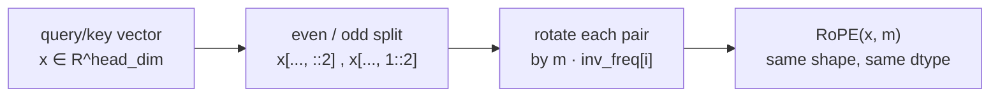
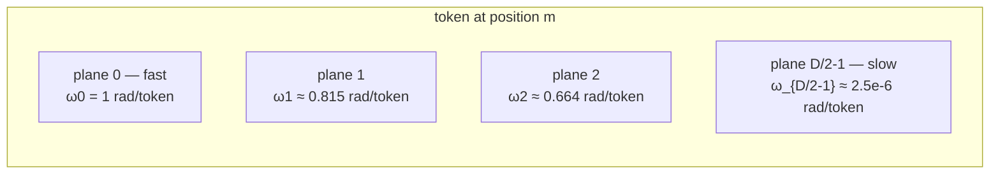
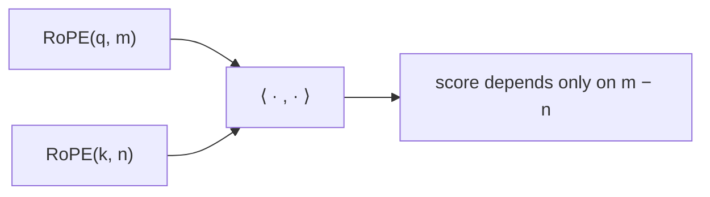
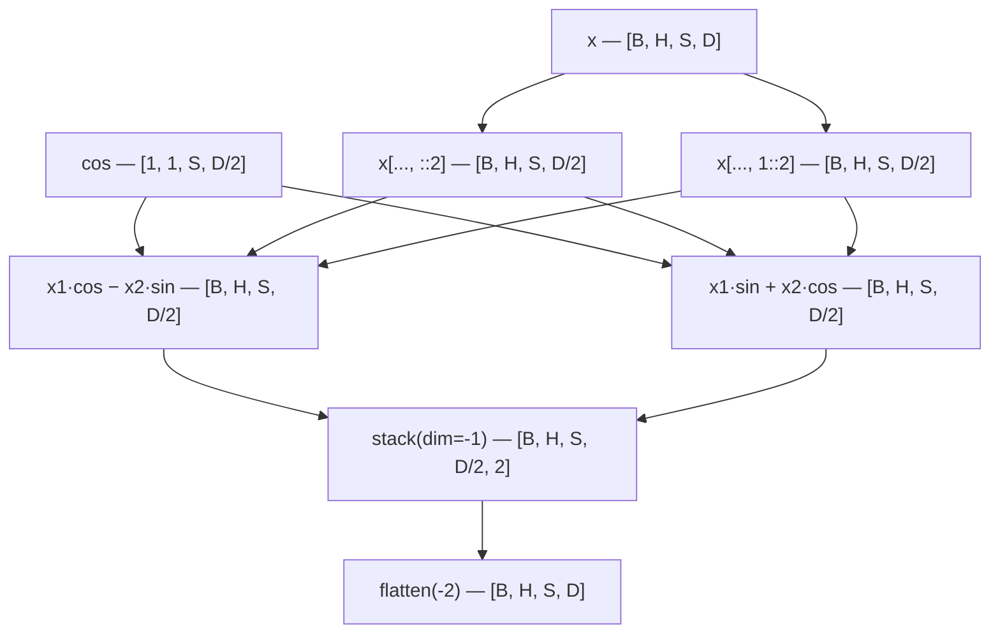
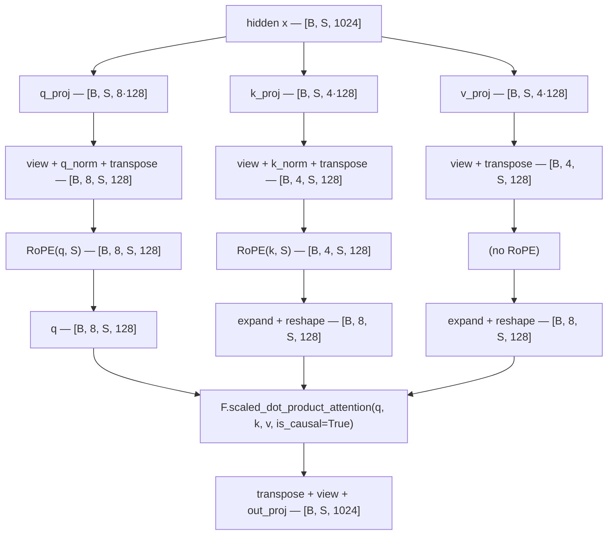
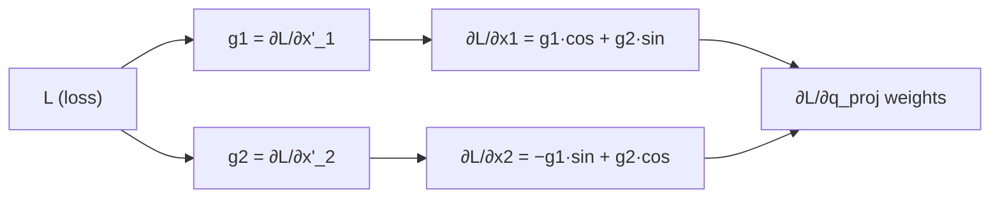

# RoPE in LLaMA-3-Lite — Implementation Deep Dive

> **Audience:** intermediate.
> **Scope:** the reference companion to the theory doc
> [positional-encoding.md](../theory/positional-encoding.md). This file walks
> the exact `RoPE` implementation in `model.py:RoPE`, derives every number at
> this project's scale (head_dim 128, max_seq_len 2048, batch 96, 16 layers),
> and explains the design decisions around it. The general theory — why
> positions at all, the three position-encoding families, NTK/YaRN
> extensions — lives in the theory doc; this file cross-links instead of
> duplicating.

---

## Table of Contents

1. [The 60-Second Summary](#1-the-60-second-summary)
2. [Why Position Information is Needed](#2-why-position-information-is-needed)
3. [What RoPE Does, Intuitively](#3-what-rope-does-intuitively)
4. [The Mathematical Foundation](#4-the-mathematical-foundation)
5. [The Relative-Position Property (The Big Payoff)](#5-the-relative-position-property-the-big-payoff)
6. [Frequency Schedule — Why `theta = 500000`](#6-frequency-schedule--why-theta--500000)
7. [Implementation Walkthrough](#7-implementation-walkthrough)
8. [Tensor Shape Trace](#8-tensor-shape-trace)
9. [Why Even/Odd Pairing, Why `stack` + `flatten`](#9-why-evenodd-pairing-why-stack--flatten)
10. [Precomputed Buffers — Why `register_buffer`](#10-precomputed-buffers--why-register_buffer)
11. [Applied to Q and K, but Not V](#11-applied-to-q-and-k-but-not-v)
12. [Interaction with GQA and Flash Attention 2](#12-interaction-with-gqa-and-flash-attention-2)
13. [Length Extrapolation & Interpolation](#13-length-extrapolation--interpolation)
14. [Gradient Flow Through RoPE](#14-gradient-flow-through-rope)
15. [Numerical Properties & Edge Cases](#15-numerical-properties--edge-cases)
16. [Memory & Compute Cost](#16-memory--compute-cost)
17. [Common Pitfalls & How This Code Avoids Them](#17-common-pitfalls--how-this-code-avoids-them)
18. [Further Reading](#18-further-reading)

---

## 1. The 60-Second Summary

**RoPE (Rotary Position Embeddings)** encodes the position of a token by
**rotating** the query and key vectors of every attention head in 2-D planes,
one plane per adjacent pair of features, each plane spinning at its own
frequency. Two consequences fall out for free:

1. The attention score between two tokens depends only on their **relative**
   distance, not their absolute positions.
2. The model can generalize to sequence lengths beyond what it saw in
   training — *length extrapolation* — because the rotation angles are
   well-defined for any integer position.

In LLaMA-3-Lite the whole mechanism is one small `nn.Module`,
`model.py:RoPE`, which precomputes the cos/sin tables once in
`model.py:RoPE.__init__` and applies a single broadcast rotation in
`model.py:RoPE.forward`. It has **no learnable parameters**: the frequency
schedule is fixed by `theta = 500000.0` from `config.py:get_config`, exactly
as LLaMA-3 uses it. The rotation is applied to Q and K only, after the
per-head QK-norm and before Flash Attention 2, inside
`model.py:GroupedQueryAttention.forward`.



---

## 2. Why Position Information is Needed

A vanilla attention layer computes

$$\text{Attention}(Q, K, V) = \operatorname{softmax}\!\left(\frac{Q K^\top}{\sqrt{d_k}}\right) V .$$

The dot product $q \cdot k$ depends only on the **content** of the two
vectors, not on *where* they appear in the sequence. Permute the input
sequence and the outputs permute identically: the layer cannot tell
`"the cat sat"` from `"sat cat the"`. Language is order-dependent —
"the dog bit the man" and "the man bit the dog" share every word — so the
model must be told where each token sits.

Three things matter:

- **Order** — which token came first.
- **Distance** — how far apart two tokens are.
- **Relative position** — "the verb is two words after the subject", not
  "the verb is at position 17".

Position encodings inject this information. The full landscape of how to do
that — absolute additive (sinusoidal/learned), relative additive (T5/ALiBi),
and rotary — is covered in [positional-encoding.md](../theory/positional-encoding.md);
here we implement the rotary family.

---

## 3. What RoPE Does, Intuitively

Picture each head's query/key vector of length `head_dim` as a sequence of
`head_dim / 2` **independent 2-D points**:

```
x = [x0, x1, x2, x3, x4, x5, ..., x_{D-2}, x_{D-1}]
      |--|  |--|  |--|        |------|
     plane0 plane1 plane2     plane D/2-1
```

RoPE rotates each of those 2-D points by an angle proportional to the
token's absolute position $m$:

```
RoPE(x, m) = [ R(m·ω0)·[x0, x1],  R(m·ω1)·[x2, x3],  ...,  R(m·ω_{D/2-1})·[x_{D-2}, x_{D-1}] ]
```

where $R(\phi) = \begin{bmatrix} \cos\phi & -\sin\phi \\ \sin\phi & \cos\phi \end{bmatrix}$
is the standard 2-D rotation matrix.

Different planes spin at **different frequencies** $\omega_i$, so the rotated
vector carries a multi-scale "fingerprint" of position: fast planes encode
fine-grained nearby-token offsets, slow planes encode long-range structure.



For `head_dim = 128` the spectrum spans from 1 radian per token (a full turn
every $2\pi \approx 6.3$ tokens) down to $2.46\times 10^{-6}$ radians per
token (a full turn every ~2.56M tokens) — roughly **six orders of magnitude**
of timescales.

---

## 4. The Mathematical Foundation

### 4.1 The 2-D rotation

For a single 2-D point $(x_{2i},\, x_{2i+1})$ at position $m$, RoPE applies:

$$\begin{bmatrix} x'_{2i} \\ x'_{2i+1} \end{bmatrix} =
\begin{bmatrix} \cos(m\,\omega_i) & -\sin(m\,\omega_i) \\ \sin(m\,\omega_i) & \cos(m\,\omega_i) \end{bmatrix}
\begin{bmatrix} x_{2i} \\ x_{2i+1} \end{bmatrix}$$

i.e. $x'_{2i} = x_{2i}\cos\phi_i - x_{2i+1}\sin\phi_i$ and
$x'_{2i+1} = x_{2i}\sin\phi_i + x_{2i+1}\cos\phi_i$ with $\phi_i = m\,\omega_i$.
This is exactly the arithmetic in `model.py:RoPE.forward`:

```python
# illustrative
x1, x2 = x[..., ::2], x[..., 1::2]                      # x1 = even features, x2 = odd features
rotated = torch.stack([x1 * cos - x2 * sin,             # x'_{2i}   = x_{2i} cos - x_{2i+1} sin
                       x1 * sin + x2 * cos], dim=-1)    # x'_{2i+1} = x_{2i} sin + x_{2i+1} cos
return rotated.flatten(-2)
```

### 4.2 Inverse frequencies

The frequencies $\omega_i$ follow a geometric schedule over the head:

$$\omega_i = \theta_{\text{base}}^{-2i / \text{head\_dim}}, \qquad i = 0, 1, \dots, \tfrac{\text{head\_dim}}{2}-1$$

`model.py:RoPE.__init__` builds the inverse frequencies in one line:

```python
inv_freq = 1.0 / (theta ** (torch.arange(0, head_dim, 2).float() / head_dim))
```

Unpacking for `head_dim = D`:

- `torch.arange(0, D, 2).float()` → `[0, 2, 4, ..., D-2]` (shape `[D/2]`)
- `/ D` → `[0, 2/D, 4/D, ..., (D-2)/D]`
- `theta ** (...)` → `[θ^0, θ^{2/D}, θ^{4/D}, ..., θ^{(D-2)/D}]`
- `1.0 / (...)` → `[θ^0, θ^{-2/D}, θ^{-4/D}, ..., θ^{-(D-2)/D}]`

So `inv_freq[i] = θ^{-2i/D} = ω_i`, exactly the schedule above. Note these
are **frequencies** (radians per token position), not wavelengths; a smaller
value means a slower spin. Because the exponent `2i/D` increases with `i`,
`inv_freq` is strictly decreasing — `tests/test_model.py::TestRoPE.test_inv_freq_monotonic`
asserts exactly that (`inv_freq[:-1] > inv_freq[1:]` elementwise).

### 4.3 The angle matrix

The per-plane angle at position $m$ is $m \cdot \omega_i$, which is one row of
an **outer product** between the position vector and the inverse frequencies:

```
            ω0         ω1        ...    ω_{D/2-1}
m=0    [    0          0         ...       0       ]
m=1    [   ω0         ω1         ...    ω_{D/2-1}  ]
m=2    [  2ω0        2ω1         ...   2ω_{D/2-1}  ]
...
```

`model.py:RoPE.__init__` materializes this matrix for every position up to
`max_seq_len`:

```python
# illustrative
t = torch.arange(max_seq_len).float()        # positions [0, 1, ..., max_seq_len-1]
freqs = torch.outer(t, inv_freq)             # [max_seq_len, D/2]; freqs[m, i] = m * ω_i
self.register_buffer('cos_cached', freqs.cos().unsqueeze(0).unsqueeze(0))
self.register_buffer('sin_cached', freqs.sin().unsqueeze(0).unsqueeze(0))
```

### 4.4 Why `unsqueeze(0).unsqueeze(0)`?

`freqs.cos()` has shape `[S, D/2]` where `S = max_seq_len`. The two
unsqueezes push it to `[1, 1, S, D/2]` so it broadcasts against an input of
shape `[B, H, S, D/2]` (batch, head). The leading singleton dims align the
cache with the `[B, H, S, D]` layout that attention uses after the
transpose in `model.py:GroupedQueryAttention.forward`.

---

## 5. The Relative-Position Property (The Big Payoff)

The reason to build all this machinery is one identity. Let
$R(\phi)$ be the 2-D rotation and $q_i, k_i$ the $i$-th 2-D block of
$q, k$. The attention score between position $m$ and position $n$ is

$$\langle \mathrm{RoPE}(q, m),\, \mathrm{RoPE}(k, n) \rangle
= \sum_i \langle R(m\,\omega_i)\, q_i,\; R(n\,\omega_i)\, k_i \rangle
= \sum_i \langle q_i,\; R((n - m)\,\omega_i)\, k_i \rangle .$$

The second equality uses two facts about rotation matrices:

- $R(\alpha)^\top = R(-\alpha)$ (rotations are orthogonal),
- $R(-\alpha)\,R(\beta) = R(\beta - \alpha)$ (rotations compose by angle
  addition).

The absolute positions $m$ and $n$ survive only through their **difference**
$n - m$. The score depends on the relative offset alone:

$$\langle \mathrm{RoPE}(q,m), \mathrm{RoPE}(k,n) \rangle = g(q, k, m - n) .$$

**Consequence:** the model has no way to distinguish "token A is at position
7" from "token A is at position 107, exactly 100 tokens after B at position
7" — the attention score is identical in both cases. That is precisely the
desired semantics: attention should be a function of **content** plus
**relative distance**, not of absolute location.



The test `tests/test_model.py::TestRoPE.test_relative_position_property`
checks a degenerate instance of this: the inner product of a fixed pair of
orthogonal unit vectors placed at offsets `(0, 0)` and `(5, 5)` must be
identical (both equal the unrotated inner product, since the rotation is
applied to both arguments). A stronger, offset-varying version — that
`⟨RoPE(q, 0), RoPE(k, d)⟩` equals `⟨RoPE(q, 5), RoPE(k, 5+d)⟩` for any
content `q, k` — follows from the same algebra; the orthogonality of every
plane is asserted directly by
`tests/test_model.py::TestRoPE.test_rotation_is_orthogonal`.

---

## 6. Frequency Schedule — Why `theta = 500000`

`theta` is the **base** of the geometric progression of frequencies:
$\omega_i = \theta^{-2i/D}$. It is the single most load-bearing RoPE
hyperparameter in this repo — `AGENTS.md` rule 5 states it as a hard rule:
*RoPE θ=500K is load-bearing for long-context extrapolation; reducing it to
10K cuts context quality dramatically.* The value flows from
`config.py:get_config` (`'rope_theta': 500000.0`) through
`model.py:build_transformer` into every `GroupedQueryAttention`'s
`model.py:GroupedQueryAttention.__init__`, which constructs the shared
`RoPE(head_dim, max_seq_len, rope_theta)`.

### What it controls

For a fixed plane index $i$, raising the base $\theta$ lowers $\omega_i$,
which **lengthens the wavelength** $2\pi / \omega_i$. A larger base pushes
every plane's turning point further out, so position information stays
unambiguous over longer distances. LLaMA-3 chose 500,000 vs LLaMA-2's
10,000 — a 50× jump.

### The spectrum at this project's scale (head_dim 128, theta 500000)

Derived from `inv_freq[i] = 500000^(-2i/128)`, with wavelength
$\lambda_i = 2\pi / \omega_i$ and rotation over the training context
$S = 2048$ (i.e. $2048 \cdot \omega_i$ radians):

| Plane $i$ | Features $(2i, 2i+1)$ | $\omega_i$ (rad/token) | Wavelength (tokens) | Rotation over 2048-token context |
|---|---|---|---|---|
| 0 | (0, 1) | 1.000 | 6.3 | 2048 rad ≈ **326 turns** |
| 1 | (2, 3) | 0.815 | 7.7 | 1668 rad ≈ 265 turns |
| 16 | (32, 33) | 0.0376 | 167 | 77.0 rad ≈ 12.3 turns |
| 32 | (64, 65) | 1.414e-3 | 4,443 | 2.90 rad ≈ 166° |
| 38 | (76, 77) | 4.133e-4 | 15,204 | 0.85 rad ≈ 48° |
| 63 | (126, 127) | 2.455e-6 | 2,559,196 | 5.0e-3 rad ≈ **0.29°** |

Derived facts worth internalizing:

- The **fastest** plane (index 0, $\omega_0 = 1$) turns 326 full rotations
  over the training context and rotates a full radian (~57°) per token
  position — adjacent tokens are maximally distinguishable in this plane.
- The **slowest** plane (index 63, $\omega_{63} = 2.455\times10^{-6}$)
  rotates only **0.29 degrees** over the entire 2048-token training context.
  It is effectively position-invariant during training — the headroom is what
  makes long-context extrapolation work. Over a 128K-token context it has
  still only turned 18.4°, less than a quarter turn, so no aliasing.
- Counting planes that rotate at least 1 radian over the training context:
  $\omega_i \ge 1/2048 \iff i \le \ln(2048)/(2\ln\theta \cdot 128^{-1})
  \approx 37.2$, so planes 0–37 are informative within training while
  **26 of 64 planes (41%)** barely move at 2048 tokens. This is by design:
  those planes are reserved for longer contexts.
- Plane 32 has wavelength 4,443 tokens ≈ 2.2× the training context — the
  first plane whose full turn lands just outside what training ever saw.

For comparison, with LLaMA-2's $\theta = 10{,}000$ the slowest wavelength is
$2\pi \cdot 10{,}000^{126/128} \approx 54{,}410$ tokens — 47× shorter than
2.56M — which is why the 50× base jump buys LLaMA-3 its long-context
capability. Full derivation and the NTK/YaRN extension landscape live in
[positional-encoding.md](../theory/positional-encoding.md).

---

## 7. Implementation Walkthrough

`model.py:RoPE` is 17 lines and every one of them is doing real work. The
full class, verbatim and runnable:

```python
# illustrative
import torch
import torch.nn as nn


class RoPE(nn.Module):
    """Rotary Position Embeddings with precomputed cos/sin buffers."""
    def __init__(self, head_dim: int, max_seq_len: int, theta: float = 500000.0):
        super().__init__()
        inv_freq = 1.0 / (theta ** (torch.arange(0, head_dim, 2).float() / head_dim))
        self.register_buffer('inv_freq', inv_freq)
        t = torch.arange(max_seq_len).float()
        freqs = torch.outer(t, inv_freq)
        self.register_buffer('cos_cached', freqs.cos().unsqueeze(0).unsqueeze(0))
        self.register_buffer('sin_cached', freqs.sin().unsqueeze(0).unsqueeze(0))

    def forward(self, x, seq_len: int):
        cos = self.cos_cached[:, :, :seq_len, :]
        sin = self.sin_cached[:, :, :seq_len, :]
        x1, x2 = x[..., ::2], x[..., 1::2]
        rotated = torch.stack([x1 * cos - x2 * sin, x1 * sin + x2 * cos], dim=-1)
        return rotated.flatten(-2)
```

### Construction (`model.py:RoPE.__init__`)

| Step | Code | Output |
|---|---|---|
| 1 | `inv_freq = 1.0 / (theta ** (torch.arange(0, head_dim, 2).float() / head_dim))` | `[D/2]` float32, decreasing geometric schedule |
| 2 | `self.register_buffer('inv_freq', inv_freq)` | non-learnable buffer, follows device + state_dict |
| 3 | `t = torch.arange(max_seq_len).float()` | `[max_seq_len]` positions |
| 4 | `freqs = torch.outer(t, inv_freq)` | `[max_seq_len, D/2]` angle matrix, `freqs[m, i] = m·ω_i` |
| 5 | `freqs.cos().unsqueeze(0).unsqueeze(0)` (and `.sin()`) | `[1, 1, max_seq_len, D/2]` each, registered as buffers |

### Forward (`model.py:RoPE.forward`)

| Step | Code | Output |
|---|---|---|
| 1 | `cos = self.cos_cached[:, :, :seq_len, :]` (and `sin`) | `[1, 1, S, D/2]` view, sliced to the actual sequence length |
| 2 | `x1, x2 = x[..., ::2], x[..., 1::2]` | two `[B, H, S, D/2]` strided views (even / odd features) |
| 3 | `torch.stack([x1*cos - x2*sin, x1*sin + x2*cos], dim=-1)` | `[B, H, S, D/2, 2]` — the rotation, all planes in parallel |
| 4 | `rotated.flatten(-2)` | `[B, H, S, D]` — interleaved back to the original layout |

### Where the caller supplies `seq_len`

The `seq_len` argument is the **actual** input length, not `max_seq_len`:
`model.py:GroupedQueryAttention.forward` unpacks `B, S, _ = x.shape` from
the hidden state and calls `self.rope(q, S)` and `self.rope(k, S)`. In
training `S == 2048 == max_seq_len`, so the slice in step 1 is a full-tensor
view (a no-op); for shorter sequences (validation prompts, generation) only
the first `S` cache rows are read. Slicing a tensor produces a view, so this
costs no copy.

### Placement in the attention pipeline

Inside `model.py:GroupedQueryAttention.forward`, the order is:

1. `q_proj`, `k_proj`, `v_proj` → `[B, S, n_heads*head_dim]` etc.
2. `view` into `[B, S, n_heads, head_dim]` (KV heads use `n_kv_heads`).
3. Per-head QK-norm `q_norm` / `k_norm` (RMSNorm over `head_dim`) —
   **before** the transpose, so the norm sees `head_dim` as the last axis.
4. `transpose(1, 2)` → `[B, n_heads, S, head_dim]`.
5. `q = self.rope(q, S)`, `k = self.rope(k, S)` — **V is not rotated**.
6. GQA replication (`expand` + `reshape`) for `n_rep = n_heads // n_kv_heads`.
7. `F.scaled_dot_product_attention(q, k, v, is_causal=True)`.

---

## 8. Tensor Shape Trace

Concrete run with `head_dim = 8`, `max_seq_len = 5`, `batch = 2`,
`heads = 3`, `seq_len = 4` (these are the shapes the CPU tests exercise via
`tests/test_model.py::TestRoPE.test_buffer_shapes` and
`test_rotation_is_orthogonal`, scaled up):

| Step | Tensor | Shape |
|---|---|---|
| 1 | `inv_freq` (after construction) | `[4]` |
| 2 | `t` (after construction) | `[5]` |
| 3 | `freqs` (after construction) | `[5, 4]` |
| 4 | `cos_cached`, `sin_cached` (after construction) | `[1, 1, 5, 4]` |
| 5 | `cos`, `sin` (sliced to `seq_len=4`) | `[1, 1, 4, 4]` |
| 6 | `x` (input from caller) | `[2, 3, 4, 8]` |
| 7 | `x1`, `x2` (even/odd split) | `[2, 3, 4, 4]` each |
| 8 | `rotated` (stack) | `[2, 3, 4, 4, 2]` |
| 9 | output (`flatten(-2)`) | `[2, 3, 4, 8]` |



Note that input and output have **identical shape and dtype**: RoPE is a
pointwise, shape-preserving transformation. This is one of its nicest
properties — it slots into any layer that already produces (or consumes) a
`[B, H, S, D]` tensor, which is why `model.py:GroupedQueryAttention.forward`
can insert it between the QK-norm transpose and the GQA expansion with no
other shape bookkeeping.

---

## 9. Why Even/Odd Pairing, Why `stack` + `flatten`

### The choice of pairs

RoPE rotates **adjacent** pairs: $(x_0, x_1), (x_2, x_3), \dots$

1. **Contiguity** — adjacent features are contiguous in memory; the slices
   `x[..., ::2]` and `x[..., 1::2]` are strided **views**, so the split costs
   zero data movement.
2. **Independence** — pairs of distinct indices never share a feature, so
   rotating them independently cannot entangle them.
3. **Convention** — every mainstream RoPE implementation (RoFormer, GPT-NeoX,
   LLaMA) pairs the same way. The exact pairing is not mathematically
   critical as long as it is consistent, but matching the ecosystem's
   convention matters for weight compatibility.

### Why `stack` + `flatten(-2)` instead of two strided writes?

The naive alternative is:

```python
# illustrative — the two-write formulation this code avoids
out_even = x1 * cos - x2 * sin    # [B, H, S, D/2]
out_odd  = x1 * sin + x2 * cos    # [B, H, S, D/2]
output = torch.empty_like(x)
output[..., ::2] = out_even       # strided scatter write
output[..., 1::2] = out_odd       # strided scatter write
```

The `stack` + `flatten(-2)` formulation:

- Allocates exactly **one** output tensor (the stack), instead of two scratch
  tensors plus a pre-allocated `output`.
- Avoids two non-contiguous scatter writes, which are slow on GPU.
- `flatten(-2)` is a **view** — it only changes the tensor metadata.
- Lets `torch.compile` fuse the entire rotation (split → four FMAs → stack)
  into a single kernel, and lets the stack itself fuse with the downstream
  consumer.

**Layout check** for `D = 4`, one plane, rotation angle $\phi$:

```
input pair:      (a, b)
stack:           [..., 0] = a·cosφ − b·sinφ        [..., 1] = a·sinφ + b·cosφ
after flatten:   output[0] = a·cosφ − b·sinφ        output[1] = a·sinφ + b·cosφ
```

The even-position features of the input stay at even positions of the output
and odd at odd — the rotation happens **within each pair** while the
interleaved layout is preserved, so downstream code sees an ordinary
`[B, H, S, D]` tensor.

---

## 10. Precomputed Buffers — Why `register_buffer`

### Three ways to store constants in PyTorch

| Mechanism | Trainable? | In `state_dict()`? | Follows `.to(device)`? | Used here? |
|---|---|---|---|---|
| `nn.Parameter` | yes | yes | yes | no (would be learned) |
| plain attribute `self.x = tensor` | no | no | **no** (stranded on CPU) | no |
| `register_buffer` | no | yes | yes | **yes** |

`cos_cached`, `sin_cached` and `inv_freq` are:

- **Not learnable** — they are derived from `theta` and `head_dim`, not from
  data. `register_buffer` guarantees `requires_grad=False` (verified: the
  buffers expose `requires_grad == False` and never appear in
  `model.parameters()`).
- **Device-resident** — they must follow `.to(device)` with the rest of the
  model, or every forward would be a CPU↔GPU copy. Buffers move with the
  module.
- **Checkpointed** — a saved `state_dict()` must contain the exact cos/sin
  tables so a resumed run reproduces identical rotations. Buffers are saved
  alongside parameters.

`register_buffer` is the only mechanism that satisfies all three. Verified
behavior: after `RoPE(...).half()` (or `.to(device=..., dtype=...)`), the
buffers carry the new dtype and appear under the keys `inv_freq`,
`cos_cached`, `sin_cached` in `state_dict()`.

### One-time cost

The trig (`cos`, `sin`) is computed **once** at module construction; the
forward pass never calls `torch.cos`/`torch.sin` — it only multiplies
precomputed values. For `max_seq_len = 2048`, `head_dim = 128`:

- `cos_cached.numel() = 2048 × 64 = 131,072` floats = **512 KiB**.
- `sin_cached` same → **512 KiB**; `inv_freq` is negligible (64 floats).
- Total **~1 MiB** per RoPE module; at 16 layers (one RoPE per
  `model.py:DecoderBlock`, shared across all 8 query heads of that layer)
  that is **~16 MiB** of tables across the whole model — cheap.

---

## 11. Applied to Q and K, but Not V

In `model.py:GroupedQueryAttention.forward` the rotation is applied to
exactly two of the three projections:

```python
# illustrative
q = self.rope(q, S)
k = self.rope(k, S)
# v is deliberately not rotated
```

### Why Q and K?

Attention scores are $Q K^\top$. The relative-position identity of §5 holds
only when **both** vectors in the dot product are rotated:

$$\langle \mathrm{RoPE}(q,m),\, \mathrm{RoPE}(k,n) \rangle = g(q,k,m-n).$$

Rotating only one side leaves a residual absolute-position term in the score
and breaks the clean relative semantics — the model would be able to (and
would be forced to) memorize absolute positions, which hurts generalization
to unseen lengths.

### Why not V?

The value vector is what the scores **weight**:

$$\text{output}[i] = \sum_j \alpha_{ij}\, v[j] .$$

Position has already been baked into the weights via the rotated `q, k`;
the values only need to carry content. Rotating `v` would add no
information, waste the same compute as the Q/K rotations, and make the
output's coordinate frame position-dependent in a way that complicates the
residual stream for no benefit. LLaMA, GPT-NeoX and RoFormer all follow the
rotate-Q-and-K-only convention.

---

## 12. Interaction with GQA and Flash Attention 2



Three interactions worth spelling out:

1. **RoPE runs on the un-replicated KV heads.** With GQA, `n_kv_heads = 4`
   and `n_heads = 8` (`n_rep = 2`), so RoPE is applied to the 4 shared KV
   head vectors **before** the `expand`+`reshape` replication in
   `model.py:GroupedQueryAttention.forward`. All replicated copies therefore
   carry the identical rotation — one rotation pass per KV head instead of
   per query head, halving the K-side RoPE cost.
2. **FA2 is agnostic.** Flash Attention 2 sees two `[B, H, S, D]` tensors and
   computes the causal scaled dot-product; it does not care that Q/K were
   rotated. The relative-position property holds inside the flash kernel
   because it is a property of the inner product, not of the kernel.
3. **Orthogonality leaves the attention geometry intact.** Since every plane
   is an orthogonal transform, RoPE preserves the norms of q and k; the
   softmax logits are reshuffled by position but their scale is unchanged,
   so FA2's numerical behavior (e.g. its online-softmax rescaling) is
   unaffected. This is asserted directly by
   `tests/test_model.py::TestRoPE.test_rotation_is_orthogonal`.

The causality of the whole attention path (which RoPE never interferes with)
is defended by `tests/test_model.py::TestGroupedQueryAttention.test_causality`.

---

## 13. Length Extrapolation & Interpolation

### What extrapolation means here

A model trained at `seq_len = 2048` asked to process `seq_len = 4096`:
with **absolute** embeddings this usually fails — positions 2048–4095 were
never seen and have no embedding. With **RoPE** it partially works, because
the rotation angle $m \cdot \omega_i$ is well-defined for any integer $m$;
the question is only whether the slowest planes have aliased by then.

At this project's scale: the slowest plane's wavelength is 2.56M tokens, so
within any context up to ~2.56M tokens no plane completes a full turn that
it has not already been "trained on" in some sense. In practice the
well-behaved range is much shorter than the naive wavelength (the model must
also generalize the *content* patterns), which is why long-context work
typically adds fine-tuning — see
[positional-encoding.md](../theory/positional-encoding.md) for the NTK/YaRN
extension landscape.

### What the code does and does not do

- The cache is built for `max_seq_len` at construction time, so a forward
  with `S > max_seq_len` fails **loudly** (see §15) rather than silently
  degrading — the safe failure mode.
- There is **no KV-cache path** in `model.py:GroupedQueryAttention.forward`
  and **no position interpolation** implemented: training runs at
  `seq_len = 2048` with `theta = 500000` as-is. To extend context the
  module must be rebuilt with a larger `max_seq_len` (buffers are sized at
  construction), and long-context fine-tuning would optionally rescale the
  rotation angles.

### Why `theta = 500000` is load-bearing

Reducing the base to 10,000 shrinks the slowest wavelength from 2.56M to
54.4K tokens (47×), so the plane-index-32 band — wavelength ~4.4K, already
just past the training context — and everything slower aliases far sooner.
This is why `AGENTS.md` rule 5 makes the value a hard rule: it is the
difference between a 2K-trained model that can stretch toward 128K contexts
and one whose long-range planes are mush beyond ~8K tokens.

---

## 14. Gradient Flow Through RoPE

RoPE has **no learnable parameters** — the rotation coefficients are
constants. All gradients pass through the rotation into the Q/K projections.

### Backward of the rotation

For one plane with angle $\phi = m\,\omega_i$:

$$\begin{bmatrix} x'_1 \\ x'_2 \end{bmatrix} =
\begin{bmatrix} \cos\phi & -\sin\phi \\ \sin\phi & \cos\phi \end{bmatrix}
\begin{bmatrix} x_1 \\ x_2 \end{bmatrix}, \qquad
\begin{bmatrix} \frac{\partial L}{\partial x_1} \\[2pt] \frac{\partial L}{\partial x_2} \end{bmatrix} =
\begin{bmatrix} \cos\phi & \sin\phi \\ -\sin\phi & \cos\phi \end{bmatrix}
\begin{bmatrix} g_1 \\ g_2 \end{bmatrix},$$

where $(g_1, g_2)$ is the incoming gradient on the rotated pair. The backward
matrix is the **transpose** of the forward rotation — itself a rotation by
$-\phi$.

### Implications for training

- **No vanishing/exploding gradients.** Every singular value of the forward
  and backward Jacobians is 1 (an orthogonal matrix), so the gradient norm is
  preserved exactly through the rotation:
  $\|\partial L/\partial x\| = \|\partial L/\partial x'\|\cdot$
  `tests/test_model.py::TestRoPE.test_rotation_is_orthogonal` verifies the
  forward half of this contract.
- **Gradients reach the projections.** The rotation is applied after
  `q_proj`/`k_proj`, so $\partial L/\partial q$ flows back through the
  rotation into the projection weights uniformly across all positions.
- **No gradient through the schedule.** Because `cos_cached`/`sin_cached`
  are buffers, `theta` and `head_dim` are not (and cannot be) tuned by
  gradient descent — the schedule is a fixed design choice, asserted as a
  hard rule rather than a learned quantity.



---

## 15. Numerical Properties & Edge Cases

### Dtype of the cache and promotion

`inv_freq`, `freqs`, and the cos/sin tables are computed in **float32**
(`torch.arange(...).float()`, `.cos()`, `.sin()`). Buffers do not
auto-cast: `cos_cached` stays FP32 in storage regardless of autocast, and
moves to whatever dtype the module is explicitly moved to (`.half()` /
`.to(dtype=...)`). In the rotation itself, PyTorch binary-op promotion
applies: `x1 * cos` with a BF16 `x1` and an FP32 `cos` promotes to FP32, so
the rotation arithmetic never loses precision to the BF16 mantissa — a
benign detail under the autocast path, and exact FP32 in the CPU test path (the `dtype` fixture is `torch.float32` on
CPU, `bfloat16` only on GPU — see `tests/conftest.py:dtype`). Deeper autocast mechanics live in
[mixed-precision.md](../theory/mixed-precision.md).

### Position 0 is the identity

At $m = 0$, every angle is 0, so $\cos = 1$, $\sin = 0$ and the rotation is
the identity:

$$\mathrm{RoPE}(x, 0) = x .$$

The first token of any sequence passes through unchanged — correct behavior
(no "position 0 twist"), and asserted by
`tests/test_model.py::TestRoPE.test_position_zero_is_identity`.

### Adjacent positions are distinct

At $m = 1$ the fastest plane has already rotated 1 radian (~57°), so the
second token is clearly separated from the first in the high-frequency
planes — a 1-position offset produces a distinct fingerprint. Combined with
the norm-preservation property, this guarantees the code cannot collapse
positions 0 and 1 in any plane.

### Sequence longer than `max_seq_len` — loud failure

`cos_cached[:, :, :seq_len, :]` with `seq_len > max_seq_len` does **not**
index out of bounds: Python-style slicing clamps, returning the full
`[1, 1, max_seq_len, D/2]` cache. The failure happens one step later, when
that cache broadcasts against `x1` of shape `[B, H, S, D/2]` with
`S > max_seq_len` — PyTorch raises a `RuntimeError` ("size of tensor a must
match size of tensor b at non-singleton dimension 2"). Either way the model
**crashes loudly rather than silently producing wrong outputs**; the
mechanism is a broadcast mismatch, not an OOB read. To serve longer
sequences, rebuild the module with a larger `max_seq_len`.

### Odd `head_dim` — loud failure, not silent truncation

`torch.arange(0, head_dim, 2)` on an odd `head_dim` (e.g. 7) yields 4 even
indices but `x[..., 1::2]` yields only 3 odd indices, so `x1` and `x2` have
different final-dim sizes and the `stack` raises a `RuntimeError`. The
implementation therefore does **not** silently drop the last feature (a
behavior that would quietly corrupt every head); it fails at construction/
forward time. LLaMA-3-Lite uses `head_dim = 128`, even by construction
(`config.py:get_config`), so this never fires in practice — but it is a
guaranteed loud bug for anyone who changes the config to an odd value.

---

## 16. Memory & Compute Cost

### Compute

Per token, per head-vector, the rotation costs 4 multiplications and 2
additions per plane (counting each mul/add as one FLOP):

- Per vector: $64 \text{ planes} \times 6 = 384$ FLOPs ($640$ under the
  FMA-counts-as-2 convention).
- Per step: q has $B \cdot n\_heads \cdot S = 96 \cdot 8 \cdot 2048 =
  1{,}572{,}864$ vectors, k has $96 \cdot 4 \cdot 2048 = 786{,}432$ (GQA
  halves the K side; §12). Per layer that is
  $(1.57M + 0.79M) \times 384 \approx 0.91$ GFLOPs; at 16 layers ≈
  **14.5 GFLOPs per training step**.
- Compare with the total step cost of the model,
  $6 N B S = 6 \times 513.8\text{M} \times 196{,}608 \approx 606$ TFLOPs
  (forward + backward): RoPE is **~0.002% of step FLOPs** — effectively
  free. It is dwarfed by the projection matmuls (`O(B S D^2)` per linear).

### Memory

- **No activation blow-up:** input and output have identical `[B, H, S, D]`
  shape; the stack allocates one tensor of the same size as `x`, and the
  split is view-only. Per layer at batch 96: q+k activation memory is
  dominated by the SDPA path, not by RoPE (see
  [memory-stack.md](memory-stack.md)).
- **Cache reads:** each layer reads $2 \times S \times (D/2)$ floats
  (cos + sin, sliced to `S`): $2 \times 2048 \times 64 \times 4\text{B} =
  1$ MiB per layer per forward. The tables themselves are 16 MiB total across
  the model (§10) and stay resident.
- **Gradient memory:** the rotation is differentiable with no saved state —
  autograd keeps only the (small) input/output tensors; the backward is
  computed from the FP32 cache, which is a constant.

### Wall-clock

RoPE is a few elementwise FMAs plus one stack; on an A100 it is a rounding
error next to the QKV projections and Flash Attention (tens of µs vs
milliseconds per layer). It is not a bottleneck at any batch size this
config can afford (see [memory-stack.md](memory-stack.md) for the 92→20 GB
derivation, which includes RoPE's ~1 MiB-per-layer tables as a line item).

---

## 17. Common Pitfalls & How This Code Avoids Them

| Pitfall | What goes wrong | How this code avoids it |
|---|---|---|
| Rotating only Q or only K | Asymmetric rotation leaks absolute position into the score; relative property breaks | Both `q = self.rope(q, S)` and `k = self.rope(k, S)` in `model.py:GroupedQueryAttention.forward` |
| Rotating V | Wasted compute; position-dependent output frame | Only Q and K are passed to `self.rope` |
| Wrong pairing convention | Model silently incompatible with pretrained weights | Even/odd adjacent pairing, the standard convention |
| Recomputing `cos`/`sin` every forward | Massive wasted trig | `register_buffer` precomputes once |
| FP32 cache with BF16 forward | Precision loss or dtype surprise | Buffers stay FP32; binary-op promotion lifts the rotation to FP32 (verified); no downcast inside RoPE |
| Strided scatter writes (`x[..., ::2] = ...`) | Slow, non-contiguous GPU writes | `stack` + `flatten(-2)`; flatten is a view |
| One `inv_freq` per head | Breaks the uniform relative-position geometry | One shared `RoPE` per attention layer (built in `model.py:GroupedQueryAttention.__init__`), reused across all heads |
| Naive broadcasting | Shape mismatch | `unsqueeze(0).unsqueeze(0)` gives `[1, 1, S, D/2]` which broadcasts against `[B, H, S, D/2]` |
| Rotating the full `max_seq_len` cache for short inputs | Wasted bandwidth | `[:, :, :seq_len, :]` slice in `model.py:RoPE.forward`; slicing is a view |
| Forgetting `requires_grad=False` on the frequency tables | Schedule becomes learnable / optimizer picks it up | `register_buffer` guarantees non-learnable buffers, excluded from `parameters()` |
| Odd `head_dim` | Last feature silently dropped in some implementations | Loud `RuntimeError` from the `x1`/`x2` size mismatch (verified); config uses even `head_dim = 128` |
| `S > max_seq_len` | Silent truncation in some implementations | Loud broadcast `RuntimeError` (verified); cache is sized at construction |

---

## 18. Further Reading

- **Theory:** [positional-encoding.md](../theory/positional-encoding.md) —
  the three encoding families, the general RoPE derivation, the NTK/YaRN
  extension landscape. This doc's §2–§6 are the implementation-side view of
  that theory.
- **Theory:** [attention.md](../theory/attention.md) — scaled dot-product
  attention, GQA, Flash Attention 2; the consumer of the rotated Q/K.
- **Theory:** [mixed-precision.md](../theory/mixed-precision.md) — autocast
  scoping and dtype promotion, for the FP32-cache/BF16-forward interplay
  sketched in §15.
- **Reference:** [model.md](model.md) — the full forward pass and parameter
  budget; `model.py:RoPE` is one component of the pipeline traced there.
- **Reference:** [config.md](config.md) — the `rope_theta` and `seq_len`
  keys, and the worked memory budget.
- **Reference:** [memory-stack.md](memory-stack.md) — where the 16 MiB of
  RoPE tables sit in the 92→20 GB derivation.
- **Reference:** [tests.md](tests.md) — how `TestRoPE` and the other
  test classes defend these contracts.
- **Guides:** [learning-paths.md](../guides/learning-paths.md),
  [glossary.md](../guides/glossary.md).

---

*Document generated for the LLaMA-3-Lite repository. Content is keyed to
`model.py:RoPE` (construction in `model.py:RoPE.__init__`, rotation in
`model.py:RoPE.forward`), its call sites in
`model.py:GroupedQueryAttention.forward`, the schedule source in
`config.py:get_config`, and the contract tests in
`tests/test_model.py::TestRoPE`.*
