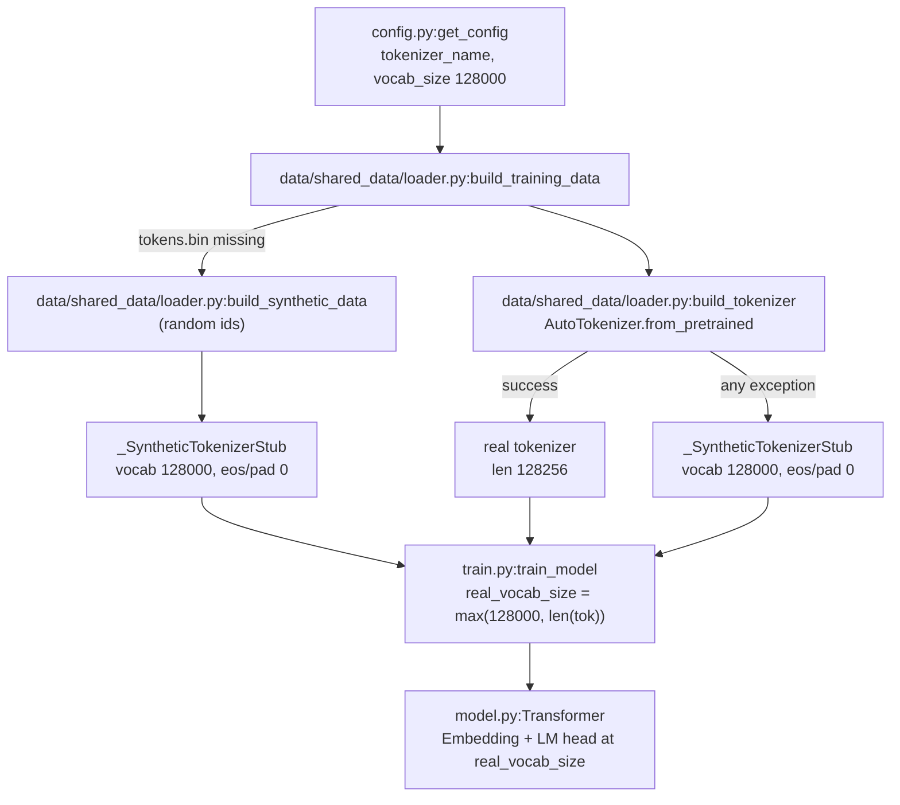
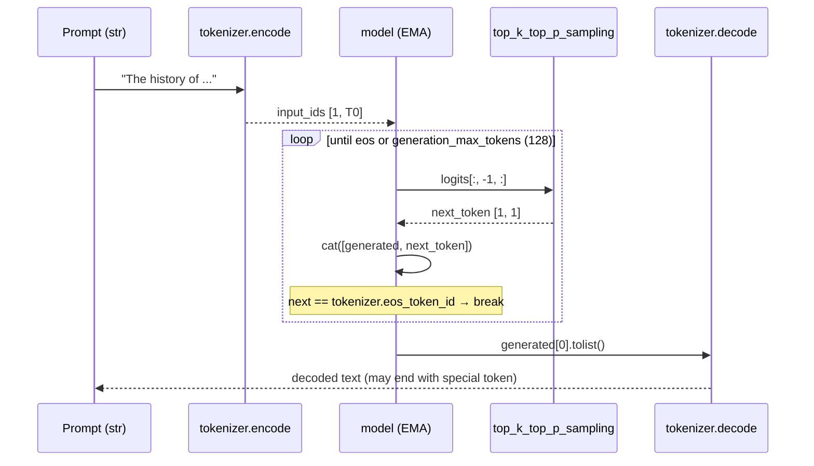
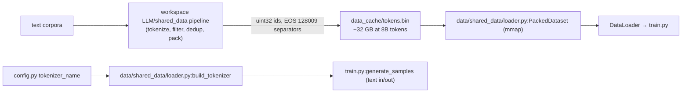

# Reference: The Tokenizer (`data/shared_data/loader.py:build_tokenizer`)

> Audience: beginner → intermediate. Assumes you know what a "token" is and
> have skimmed `[data-engineering.md](../theory/data-engineering.md)` for the
> corpus theory. This file is the code tour: what tokenizer this project
> uses, where it is loaded, how its size interacts with the model, and how
> generation consumes it.

---

## 60-second summary

LLaMA-3-Lite never tokenizes text at training time. The corpus is
pretokenized to `uint32` ids by the workspace `LLM/shared_data` pipeline
(invoked through the `data/prepare_data.py` shim) and stored in
`data_cache/tokens.bin`; the project's own data code only *loads* a
tokenizer and consumes ids. That load happens in
`data/shared_data/loader.py:build_tokenizer`, which calls
`AutoTokenizer.from_pretrained(config["tokenizer_name"])` and patches
`pad_token` to `eos_token` when the checkpoint declares no pad token (the
LLaMA-3 tokenizer does not ship one). The tokenizer's real vocabulary is
128,256 ids (128,000 ordinary subword symbols plus 256 special tokens at
the top of the range), while `config.py:get_config` sets `vocab_size` to
128,000 — so `train.py:train_model` computes
`real_vocab_size = max(config['vocab_size'], len(tokenizer))` and builds
the model's embedding and LM head at that width. Because the pipeline never
pads, `train.py:train_model` sets `ignore_index = -100` (a sentinel that
matches no real token id), which keeps the EOS document separator learnable
— critical, since the pad fallback makes `pad_token_id == eos_token_id`.
Generation (`train.py:generate_samples`) encodes a prompt, samples
autoregressively, stops on `tokenizer.eos_token_id`, and decodes the result.
Offline or synthetic runs use a byte-level stub,
`data/shared_data/loader.py:_SyntheticTokenizerStub`, which maps each UTF-8
byte to one id.

---

## 1. File overview & function map

| File | Role in the tokenizer story |
|---|---|
| `data/shared_data/loader.py` | `build_tokenizer` (real load), `build_training_data` (calls it with fallback), `build_synthetic_data` (stub, unconditionally), `_SyntheticTokenizerStub` (byte⇄id stand-in) |
| `data/prepare_data.py` | CLI shim → workspace pipeline; pins the tokenizer contract constants (`LLAMA3_TOKENIZER_NAME`, `LLAMA3_VOCAB_SIZE`, `LLAMA3_EOS_TOKEN_ID`, `LLAMA3_PAD_TOKEN_ID`) |
| `config.py:get_config` | `tokenizer_name`, `tokenizer_cache_dir`, `vocab_size` |
| `train.py` | `real_vocab_size` resolution, `ignore_index = -100`, `generate_samples` |
| `model.py:Transformer` | Embedding + LM head sized to `real_vocab_size` |
| `dataset.py` | 32-line re-export shim (no tokenizer symbols of its own) |

There is **no** tokenization code in this repository — no `_stream_to_disk`,
no `_doc_hash`, no `interleave_datasets`. Those live in the workspace
`LLM/shared_data` package, and the old `docs/tokenizer.md` wrongly
attributed them to `dataset.py`; see §9 for the honest pipeline picture.

| Symbol | Kind | What it does |
|---|---|---|
| `data/shared_data/loader.py:build_tokenizer` | function | `AutoTokenizer.from_pretrained` + pad→eos fallback |
| `data/shared_data/loader.py:build_training_data` | function | mmap `tokens.bin`; tries `build_tokenizer`, falls back to the stub |
| `data/shared_data/loader.py:build_synthetic_data` | function | Random `uint32` corpus; always returns the stub |
| `data/shared_data/loader.py:_SyntheticTokenizerStub` | class | `len` / `encode` / `decode` / `eos_token_id` / `pad_token_id` duck-type |
| `data/prepare_data.py:LLAMA3_VOCAB_SIZE` | constant | 128,000 — pipeline-side vocab contract |
| `data/prepare_data.py:LLAMA3_EOS_TOKEN_ID` | constant | 128,009 — `<\|eot_id\|>` document separator |
| `data/prepare_data.py:LLAMA3_PAD_TOKEN_ID` | constant | 128,002 — `<\|pad_id\|>` |
| `train.py:train_model` | function | `real_vocab_size`, `ignore_index = -100`, model build |
| `train.py:generate_samples` | function | encode → autoregressive sample → eos stop → decode |
| `model.py:Transformer` | class | `input_embedding` + `output_proj` sized to the vocab |

---

## 2. BPE in 60 seconds — what this tokenizer is

### 2.1 Why subword tokens

A language model predicts the next token, so the vocabulary defines both
the model's input alphabet and its output distribution. Three options:

- **Characters** (256 UTF-8 bytes): tiny vocab, but every word becomes a
  long sequence; the model spends capacity learning spelling instead of
  meaning, and the effective context shrinks.
- **Words**: efficient for common words, but vocabularies run into the
  millions, and every out-of-vocabulary word is unrepresentable without a
  fallback.
- **Subwords** (BPE): a middle path — common words become single tokens,
  rare words split into pieces, and *every* input is representable. This is
  what LLaMA-3 uses.

### 2.2 Byte-level BPE: the algorithm

Byte Pair Encoding builds a vocabulary greedily from a corpus:

1. Start with the 256 UTF-8 bytes as the base alphabet.
2. Count adjacent byte (later: symbol) pairs across the corpus; merge the
   most frequent pair into a new symbol; repeat.
3. Stop after a fixed number of merges.

The result is a ranked list of merge rules. Encoding is deterministic:
repeatedly apply the learned merges in rank order. Decoding is lossless —
a token id maps back to a byte sequence, so no input byte is ever dropped.

LLaMA-3's variant is **byte-level**: the base alphabet is the UTF-8 bytes
of the text, so arbitrary code, emoji, and non-Latin scripts all encode
without an `<unk>` token. This is why the tokenizer round-trips
losslessly — a property the synthetic stub in §8 exploits directly.

### 2.3 Pretokenization

Merges must not run across word boundaries, so the tokenizer first splits
text into "words" with a regex (the TikToken-style pattern): runs of
letters, digits, punctuation, and whitespace, with a special marker for
leading spaces so that `"cat"` and `" cat"` become distinct tokens. BPE
merges then apply *within* each word only. This is why the model sees
separate tokens for `'The'`, `' cat'`, `' sat'` — the leading-space
variants carry the word-boundary information that lets the model emit
spaces correctly.

### 2.4 The 128,256-vocabulary anatomy

The real LLaMA-3 tokenizer (`NousResearch/Meta-Llama-3-8B` on the Hub,
loaded via `AutoTokenizer`) has **128,256** ids:

| Range | Contents | Count |
|---|---|---|
| `0` – `127,999` | ordinary byte-BPE subword symbols (256 base bytes + learned merges) | 128,000 |
| `128,000` – `128,255` | special / control tokens | 256 |
| **Total** | | **128,256** |

`[INFERENCE]` — the exact merge count and id layout come from the published
tokenizer artifact, not from this repo's source. What the repo itself
pins: `config.py:get_config` sets `vocab_size: 128000` and
`data/prepare_data.py:LLAMA3_VOCAB_SIZE` is also `128_000` — i.e. the
project configures the *ordinary* vocabulary, and the extra 256 special ids
are exactly the drift that `real_vocab_size = max(...)` absorbs (§4).

---

## 3. The load path — `data/shared_data/loader.py:build_tokenizer`

### 3.1 The function

This is the entire real load path in this repo:

```python
# illustrative
def build_tokenizer(config: dict):
    """Load the project tokenizer from ``tokenizer_name``; pad defaults to eos.

    Raises when transformers is missing or the download fails; callers fall
    back to the byte stub.
    """
    from transformers import AutoTokenizer

    tokenizer = AutoTokenizer.from_pretrained(
        config["tokenizer_name"],
        cache_dir=config.get("tokenizer_cache_dir", None),
    )
    if tokenizer.pad_token is None:
        tokenizer.pad_token = tokenizer.eos_token
    return tokenizer
```

(Verbatim from `data/shared_data/loader.py:build_tokenizer`.)

Three config keys drive it (`config.py:get_config`):

| Key | Default | Effect |
|---|---|---|
| `tokenizer_name` | `'NousResearch/Meta-Llama-3-8B'` | HF repo id (or local path) to load |
| `tokenizer_cache_dir` | `None` | `None` → the default HF cache (`~/.cache/huggingface`); a path pins the cache for offline reuse |
| `vocab_size` | `128000` | Config-side vocab; *not* read by `build_tokenizer` — it matters in §4 |

`AutoTokenizer.from_pretrained` dispatches on the checkpoint's
`tokenizer_config.json` to the fast Rust-backed tokenizer, so
`len(tokenizer)` returns 128,256 and `encode`/`decode` run in optimized
native code.

### 3.2 The pad→eos fallback

LLaMA-3 defines **no native pad token** — `tokenizer.pad_token` is `None`
after load. `build_tokenizer` patches it to the EOS token so that any code
that asks for a pad id gets a valid one instead of `None`. The consequence
is load-bearing: after this line, `tokenizer.pad_token_id ==
tokenizer.eos_token_id`, so a loss configured with `ignore_index =
pad_token_id` would silently erase every EOS target (see §6).

### 3.3 Callers and the fallback chain

`build_tokenizer` is called from exactly one place:
`data/shared_data/loader.py:build_training_data`, inside a `try`/`except`
that catches *any* exception (missing `transformers`, no network, no cache):

```python
# illustrative — the fallback inside build_training_data
real_vocab = int(config["vocab_size"])
try:
    tokenizer = build_tokenizer(config)
except Exception as exc:
    print(
        f"[data] tokenizer load failed ({type(exc).__name__}: {exc}); "
        f"using the byte stub. Generation samples will be meaningless "
        f"until a real tokenizer is available."
    )
    tokenizer = _SyntheticTokenizerStub(vocab=real_vocab, eos_id=0, pad_id=0)
```

`build_synthetic_data` does **not** call `build_tokenizer` at all — it
always returns `_SyntheticTokenizerStub(vocab=vocab, eos_id=0, pad_id=0)`
so tests and offline runs never touch the network. And in
`train.py:train_model`, a missing `data_cache/tokens.bin`
(`FileNotFoundError`) drops the whole real path and falls back to
`build_synthetic_data(config)` with a warning.



---

## 4. The vocab contract — 128,000 vs 128,256 vs the stub

### 4.1 Three numbers that must agree

| Source | `len(tokenizer)` | Where it comes from |
|---|---|---|
| `config.py:get_config` → `vocab_size` | 128,000 | Model-side default; matches `data/prepare_data.py:LLAMA3_VOCAB_SIZE` |
| Real LLaMA-3 tokenizer (via `build_tokenizer`) | **128,256** | 128,000 ordinary + 256 special ids |
| `data/shared_data/loader.py:_SyntheticTokenizerStub.__len__` | 128,000 | Returns `self._vocab`, i.e. the config value |

### 4.2 `real_vocab_size = max(config['vocab_size'], len(tokenizer))`

`train.py:train_model` reconciles the two at model-build time:

```python
# illustrative — the two lines that matter in train_model
ignore_index = -100
real_vocab_size = max(config['vocab_size'], len(tokenizer))
model = build_transformer(
    vocab_size=real_vocab_size,
    d_model=config['d_model'],
    # ...
).to(device)
```

With the real tokenizer this resolves to 128,256 (the tokenizer wins); with
the stub it stays 128,000. `model.py:build_transformer`'s own default is
already `vocab_size: int = 128256`, matching the real tokenizer, but the
training path never relies on that default — it passes `real_vocab_size`
explicitly.

### 4.3 Why the model head must cover the tokenizer

`model.py:Transformer` builds two vocab-sized tensors:

```python
# illustrative — construction inside Transformer.__init__
self.input_embedding = nn.Embedding(vocab_size, d_model)
# ... decoder blocks ...
self.output_proj = nn.Linear(d_model, vocab_size, bias=False)
```

Both must be at least as wide as the tokenizer, because:

- **Encoding side.** `generate_samples` feeds `tokenizer.encode(prompt)`
  into the model. If the embedding were narrower than some encoded id, the
  lookup would index out of range and crash. Every id the tokenizer can
  produce must have an embedding row.
- **Output side.** The LM head emits one logit per vocab row, and sampling
  picks an id in `[0, vocab_size)`. If the head were narrower than the
  tokenizer's largest ids, those ids could never be *generated* — the model
  could literally not emit special tokens or rare subwords, and
  `decode` would receive ids the model never scored.

The `max(...)` guard is what makes the mismatch harmless: the model is
always built at least as wide as whichever source is larger. The opposite
drift (head wider than the tokenizer, e.g. after a tokenizer downgrade) is
also absorbed — the unused top rows just never receive training signal or
sampling mass. One real cost of widening: checkpoint compatibility. An
embedding/head at 128,256 does not load into a 128,000-shaped checkpoint
and vice versa; the `max()` is evaluated per-run, so the model shape can
change silently if the tokenizer resolution changes.

### 4.4 Parameter arithmetic

At the config vocab (128,000):

$$128{,}000 \times 1024 = 131{,}072{,}000 \approx 131.1\text{M}$$

per embedding/head tensor; the pair costs 262.1M params, which with the
251.7M non-embedding parameters gives the headline 513.8M total
(consistent with `model.py:Transformer.get_num_params`). At the real
tokenizer width (128,256):

$$128{,}256 \times 1024 = 131{,}334{,}144 \approx 131.3\text{M}$$

so the widened model is ≈ 514.4M params — a 0.6M-parameter difference,
~0.1% of the model, entirely in the embedding and head. In BF16 the head
weight alone is $131.3\text{M} \times 2\text{B} \approx 263\text{MB}$; the
widening adds ~0.5 MB per tensor. [Derived from the two vocab numbers and
`model.py:Transformer` shapes; the 513.8M total is the audited count.]

---

## 5. Special tokens

### 5.1 The table

The special range `128,000`–`128,255` holds the control tokens. The ones
this project cares about, with the repo's own constants from
`data/prepare_data.py`:

| id | Token | Role | Repo constant |
|---|---|---|---|
| 128,000 | `<\|begin_of_text\|>` | BOS — start of a sequence | — (pipeline-side) |
| 128,001 | `<\|end_of_text\|>` | Base-model EOS (declared by the HF checkpoint) | — |
| 128,002 | `<\|pad_id\|>` | Pad id pinned by the project | `LLAMA3_PAD_TOKEN_ID` |
| 128,006 | `<\|start_header_id\|>` | Chat role header open | — |
| 128,007 | `<\|end_header_id\|>` | Chat role header close | — |
| 128,009 | `<\|eot_id\|>` | End-of-turn; the document separator in this pipeline | `LLAMA3_EOS_TOKEN_ID` |
| 128,010 | `<\|python_tag\|>` | Code marker | — |

Three subtleties worth flagging:

1. **The corpus separator is 128,009 (`<\|eot_id\|>`), not the base
   checkpoint's 128,001 (`<\|end_of_text\|>`).** `data/prepare_data.py`
   pins `LLAMA3_EOS_TOKEN_ID = 128_009`, and the workspace pipeline
   (configured there with `LLAMA3_TOKENIZER_NAME = "llama3"`) uses that id
   to separate packed documents in `tokens.bin`. The loader itself never
   checks EOS ids while reading — `PackedDataset` slices fixed `seq_len+1`
   windows and does not even receive the eos id from
   `build_training_data` (it defaults to 0 and is reserved for
   document-boundary callers).
2. **What `tokenizer.eos_token_id` reports depends on the loaded
   checkpoint.** The base `NousResearch/Meta-Llama-3-8B` artifact declares
   `<\|end_of_text\|>` (128,001) as `eos_token`; the chat-tuned family
   uses `<\|eot_id\|>` (128,009). `[INFERENCE]` about the Hub artifact;
   grounded in this repo: generation stops on whatever
   `tokenizer.eos_token_id` resolves to, and the project's own separator
   constant is 128,009.
3. **PAD is a *constant*, not necessarily the runtime pad.** The project
   pins 128,002, but the *runtime* `pad_token_id` after
   `build_tokenizer`'s fallback is `eos_token_id` (the fallback fires
   because LLaMA-3 ships no pad token). Both ids live in the special
   range, so the model head covers them either way; the discrepancy only
   matters if you assume `pad_token_id == 128002` at runtime — it does
   not, unless the checkpoint declares it.

### 5.2 Why PAD falls back to EOS

`data/shared_data/loader.py:build_tokenizer` sets
`tokenizer.pad_token = tokenizer.eos_token` when the checkpoint has none.
This is the standard GPT-style convention and is harmless *only because
this pipeline never pads*: documents are packed back-to-back into
fixed-size windows, so no batch ever contains a pad position. The moment
you would use `pad_token_id` as a loss `ignore_index`, the fallback turns
into a bug — see §6.

---

## 6. Why `ignore_index = -100` (`train.py:train_model`)

The training loop sets, with the code's own comment:

```python
# illustrative
# No padding in this pipeline (packed documents, full windows), so nothing
# is ignored; using -100 keeps EOS separators learnable.
ignore_index = -100
```

(`train.py:train_model`.) The chain of reasoning:

1. **The pipeline never pads.** `PackedDataset.__getitem__` slices
   `seq_len+1`-token windows from the packed stream and shifts by one:
   `input = window[:-1]`, `target = window[1:]`. Every position in a
   window is a real next-token target, including positions whose target is
   the EOS separator that ends a document mid-window.
2. **`pad_token_id == eos_token_id` after the fallback** (§3.2). If the
   loss used `ignore_index = pad_token_id`, it would silently mask every
   EOS position — the model would never receive gradient for predicting a
   document boundary, would learn that EOS "never happens", and
   generation would never emit the stop token. The fallback that keeps
   `pad_token` valid for library code is exactly what makes `pad_id` the
   wrong ignore sentinel here.
3. **`-100` matches nothing.** Token ids live in `[0, 128256)`, so the
   conventional `-100` sentinel can never collide with a real target.
   Nothing is masked, every position contributes to the loss, and EOS
   stays learnable.

The `ignore_index` value flows into
`model.py:chunked_head_cross_entropy_with_z` from `train.py:train_model`
(training) and `train.py:validate` (validation). The `-100` contract is
the flip side of the PAD=EOS decision: they only compose correctly because
the pipeline packs rather than pads. For the loss semantics themselves,
see `[loss-functions.md](../theory/loss-functions.md)`.

---

## 7. Generation — `train.py:generate_samples`

### 7.1 Walkthrough

```python
# illustrative (abridged: 5 prompts, wandb table logging elided)
@torch.no_grad()
def generate_samples(model, tokenizer, device, step, config):
    model.eval()
    prompts = [
        "The history of artificial intelligence began in the",
        "def fibonacci(n):\n    \"\"\"Return the nth Fibonacci number.\"\"\"\n    ",
        # ... 3 more text/code prompts
    ]
    for prompt in prompts:
        tokens = tokenizer.encode(prompt)                      # str -> list[int]
        input_ids = torch.tensor([tokens], device=device)
        generated = input_ids
        for _ in range(config['generation_max_tokens']):
            with torch.autocast(device_type='cuda', dtype=torch.bfloat16,
                                enabled=device.type == 'cuda'):
                logits = model(generated)
            next_token = top_k_top_p_sampling(
                logits[:, -1, :],
                config['generation_top_k'],
                top_p=0.9,
                temperature=config['generation_temperature']
            )
            generated = torch.cat([generated, next_token], dim=1)
            if next_token.item() == tokenizer.eos_token_id:
                break
        text = tokenizer.decode(generated[0].tolist())         # list[int] -> str
        # ... wandb.Table({"prompt", "generated", "step"})
    model.train()
```

Step by step, with the real signatures:

1. **Encode.** `tokenizer.encode(prompt)` returns a plain `list[int]` with
   no special tokens — a bare prompt prime. (For the stub, this is one id
   per UTF-8 byte, §8.)
2. **Autoregressive loop.** Up to `generation_max_tokens` (default 128)
   steps: the model scores the whole growing sequence, the *last*
   position's logits (`logits[:, -1, :]`) go through
   `train.py:top_k_top_p_sampling(logits, top_k, top_p, temperature)`
   (top-k 50, top-p 0.9, temperature 0.8 from config), and the sampled id
   is appended.
3. **Stop.** Two exit conditions: the sampled id equals
   `tokenizer.eos_token_id`, or the token budget is exhausted. There is no
   BOS prepend and no `skip_special_tokens` on decode, so the decoded
   sample may end with the literal special-token string.
4. **Decode.** `tokenizer.decode(generated[0].tolist())` reverses the id
   sequence into text (byte-stable, because byte-level BPE decodes any id
   sequence to a byte string).
5. **Which model?** `train.py:train_model` calls
   `generate_samples(ema, tokenizer, device, step, config)` when the EMA
   shadow exists, else the live model — generation always runs on the
   smoother EMA weights. `model.eval()` / `model.train()` around the loop
   keep checkpointing and dropout-free layers consistent.

### 7.2 The flow



Sampling knobs (`config.py:get_config`): `generation_max_tokens` 128,
`generation_temperature` 0.8, `generation_top_k` 50, `top_p` 0.9
hardcoded in the call. The full loop mechanics live in
`[training.md](training.md)`.

---

## 8. The synthetic stub — `data/shared_data/loader.py:_SyntheticTokenizerStub`

### 8.1 The class (verbatim)

```python
# illustrative
class _SyntheticTokenizerStub:
    """Duck-typed tokenizer for synthetic data: bytes ⇄ ids, clamped to vocab."""

    def __init__(self, vocab: int, eos_id: int, pad_id: int):
        self._vocab = vocab
        self.eos_token_id = eos_id
        self.pad_token_id = pad_id

    def __len__(self) -> int:
        return self._vocab

    def encode(self, text: str) -> list[int]:
        return [min(b, self._vocab - 1) for b in text.encode("utf-8")]

    def decode(self, ids) -> str:
        raw = bytes(int(i) & 0xFF for i in ids)
        return raw.decode("utf-8", errors="replace")
```

It is a duck-type, not a real tokenizer: it implements exactly the surface
the rest of the code touches — `len()` (for `real_vocab_size`),
`encode()` / `decode()` (for `generate_samples`), and the two id
attributes (`eos_token_id` for the stop check, `pad_token_id` for
consumers that ask). The mapping is deliberately trivial:

- `encode` takes the UTF-8 bytes of the string, one id per byte. The
  `min(b, vocab - 1)` clamp is a no-op at this project's vocab
  (bytes ≤ 255 < 127,999) but keeps the stub correct if someone constructs
  it with a tiny vocab.
- `decode` masks each id to a byte (`& 0xFF`) and UTF-8-decodes with
  replacement characters for invalid sequences. So the stub round-trips
  ASCII losslessly, and any byte string survives encode→decode intact.
- `__len__` returns the config `vocab_size` (128,000), which is what makes
  `max(config['vocab_size'], len(tokenizer))` resolve to 128,000 on
  synthetic runs.

```python
# illustrative — the stub in action
stub = _SyntheticTokenizerStub(vocab=128_000, eos_id=0, pad_id=0)
stub.encode("cat")          # [99, 97, 116] — one id per UTF-8 byte
stub.decode([99, 97, 116])  # "cat"
len(stub)                   # 128000
stub.eos_token_id           # 0
```

### 8.2 When it is used

| Path | Stub? | Why |
|---|---|---|
| `build_synthetic_data` | Always | Synthetic ids are random `uint32`; no text ever exists to tokenize, and no HF download is allowed in tests/offline runs |
| `build_training_data` | On `build_tokenizer` failure | Missing `transformers`, no network, no cache → warning + stub |
| `train.py:train_model` | Via `build_synthetic_data` fallback | `tokens.bin` missing → synthetic corpus + stub |
| `tests/e2e_gpu_smoke.py:check_data_pipeline` | Via `build_synthetic_data` | GPU smoke path exercises the real builders on synthetic data |

Note that the stub's `eos_id`/`pad_id` are **0** everywhere it is
constructed, and `build_synthetic_data` samples ids in `[2, vocab)` —
`rng.integers(2, max(3, vocab), ...)` — so id 0 never appears in a
synthetic corpus. The stop check `next_token.item() == 0` is therefore
well-defined (it can fire when the model happens to emit id 0, a valid
logits row), and even an `ignore_index = 0` would mask nothing. The
training loop still uses `-100` for uniformity.

### 8.3 Training vs generation consequences

Training is unaffected by the stub: the model consumes ids, and synthetic
ids are perfectly good training signal (the loss decreases, shapes check,
gradients flow). Only *generation* degrades — the warning in
`build_training_data` says it plainly: *"Generation samples will be
meaningless until a real tokenizer is available."* A prompt encodes to its
bytes, the model generates byte-ids, and decode reassembles bytes — the
output is byte-garbage, but the *mechanics* (encode → sample → eos-stop →
decode) are exercised end to end. That is exactly what the smoke tests
want: `tests/test_smoke.py` drives the loop on synthetic data, and
`tests/conftest.py:make_token_stream` builds BOS..EOS-packed buffers
without any tokenizer at all.

---

## 9. Where tokenization actually happens (the honest picture)

The old `docs/tokenizer.md` described a "streaming tokenization" pipeline
with `_stream_to_disk`, `_doc_hash`, and per-document BOS/EOS wrapping in
`dataset.py`. None of that exists in this repo — `dataset.py` is a 32-line
re-export shim, and those functions belong to the workspace
`LLM/shared_data` package. The real division of labor:



- **Corpus side.** `data/prepare_data.py:main` prints the pipeline
  contract via `data/prepare_data.py:_apply_llama3_defaults` (universal
  corpus size, tokenizer, shard size) and delegates to
  `shared_data.prepare_data.run_pipeline` in the
  workspace package; if that package is not importable it exits with
  guidance (`ModuleNotFoundError` → "This project vendors only the loader
  (data/shared_data/)"). The workspace pipeline is what actually runs the
  tokenizer over documents, filters/dedups, wraps documents with
  separators, and writes `tokens.bin`.
- **Runtime side.** This repo's loader (`PackedDataset`,
  `ShuffledRangeSampler`, `collate_fn`) never inspects token semantics: it
  slices `seq_len+1` windows of `uint32` and shifts by one. The tokenizer
  is loaded only for its *metadata* (`len`, ids) and for *generation*
  (encode/decode).
- **Consistency requirement.** The ids in `tokens.bin` are produced by the
  pipeline's tokenizer (`data/prepare_data.py:LLAMA3_TOKENIZER_NAME` =
  `"llama3"`), while
  generation loads `config['tokenizer_name']`
  (`NousResearch/Meta-Llama-3-8B`). The two must share the same id space
  for `tokens.bin` ids to mean anything at generation time. The `max()`
  vocab guard covers *size* drift but not *semantic* drift — a tokenizer
  swap that renumbers the special range would silently change what the
  model sees. [The requirement is grounded in the two names; the
  consequences are reasoning.]

The corpus theory — packing, EOS separators, dedup, the memmap layout —
lives in `[data-engineering.md](../theory/data-engineering.md)`; the code
tour of the loader itself is `[data.md](data.md)`.

---

## 10. Edge cases & pitfalls

1. **PAD == EOS after load, so never use `pad_id` as `ignore_index`.** The
   pad→eos fallback in `build_tokenizer` makes the two ids identical;
   `ignore_index = pad_id` would mask every document separator. The
   pipeline's answer is `-100` (§6). If you change `ignore_index`, change
   it to a value outside `[0, vocab)`.
2. **The stop-check id may not be the separator id.** Generation stops on
   `tokenizer.eos_token_id`, which for the base checkpoint is
   `<\|end_of_text\|>` (128,001) while the corpus separator is
   `<\|eot_id\|>` (128,009). The model is trained to emit the *corpus*
   separator; if the loaded tokenizer declares a different eos id, the
   loop may not stop on 128,009. `[INFERENCE]` about the Hub artifact's
   declared eos; grounded in `train.py:generate_samples` checking only
   `tokenizer.eos_token_id` and `data/prepare_data.py:LLAMA3_EOS_TOKEN_ID`
   being 128,009. Watch the two names agree.
3. **Stub generation is byte-garbage by design.** The warning in
   `build_training_data` is the contract, not a bug: synthetic/fallback
   runs verify mechanics, not text quality.
4. **`real_vocab_size` can change between runs.** It is evaluated per-run
   from whichever tokenizer actually loads. A run that loses network
   access silently rebuilds the model at 128,000 (stub) instead of 128,256
   — different shapes, incompatible checkpoints. Symptom: checkpoint load
   shape mismatches after an environment change.
5. **Widening the vocab costs parameters and memory.** 128,256 vs 128,000
   adds ~0.6M params (§4.4) — small, but the embedding and head are the
   two largest single tensors in the model (≈131.3M params / ≈263 MB BF16
   each at the real width), so every vocab decision is a memory decision.
6. **`build_tokenizer` swallows nothing — its callers do.** The function
   itself raises on failure (missing `transformers`, failed download);
   the fallback lives in `build_training_data`. Any new caller must decide
   its own stub policy.
7. **No `skip_special_tokens` in generation.** `decode(generated[0]
   .tolist())` renders special tokens literally, so samples can end with
   `<|end_of_text|>`/`<|eot_id|>` text. Cosmetic, but surprising if you
   string-match on outputs.
8. **Two different "vocab 128,000" numbers.** `config.py:get_config` and
   `data/prepare_data.py:LLAMA3_VOCAB_SIZE` both say 128,000; the real
   tokenizer says 128,256. They are *supposed* to differ (special range),
   and the `max()` absorbs it — but any code that assumes
   `vocab_size == len(tokenizer)` without the guard will mis-size the
   model or crash on out-of-range ids.

---

## 11. Further reading

- **Theory:** `[data-engineering.md](../theory/data-engineering.md)` —
  document packing, EOS separators, dedup, streaming/shuffling, the memmap
  layout. This doc is the tokenizer-side view of that pipeline.
- **Theory:** `[loss-functions.md](../theory/loss-functions.md)` —
  `ignore_index` semantics, chunked cross-entropy, z-loss; why `-100` is
  safe and what masking does to gradients.
- **Theory:** `[transformers-from-scratch.md](../theory/transformers-from-scratch.md)`
  — embeddings and the LM head in the residual-stream view.
- **Theory:** `[scaling-and-metrics.md](../theory/scaling-and-metrics.md)`
  — the 8B-token / 42,000-step budget that the pretokenized corpus serves.
- **Reference:** `[data.md](data.md)` — the full loader tour
  (`PackedDataset`, `ShuffledRangeSampler`, `collate_fn`, the builders).
- **Reference:** `[config.md](config.md)` — every config key this doc
  touches (`tokenizer_name`, `vocab_size`, generation knobs).
- **Reference:** `[training.md](training.md)` — the training loop and
  generation in context.
- **Guides:** `[glossary.md](../guides/glossary.md)` — notation and
  acronyms (`V`, `BOS/EOS/PAD`, BPE).
