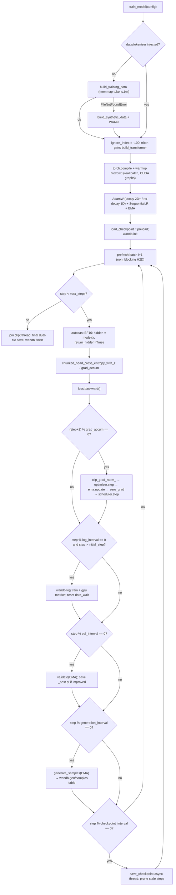

# LLaMA-3-Lite — Training Script Reference (`train.py`)

> Audience: intermediate. A code-keyed walkthrough of the current
> `train.py` — the full pretraining pipeline for the 515M-parameter
> LLaMA-3-Lite model: mixed-precision forward/backward with a
> memory-bounded chunked LM head, AdamW + warmup/cosine, EMA, async
> checkpointing with full RNG restore, validation, and generation.
> Theory is linked, not duplicated: see the "Further reading" section
> for the dedicated theory docs.

---

## 1. File overview

`train.py` is the single entry point for pretraining (`python train.py`
runs `config.py:get_config` then `train.py:train_model`). It owns
everything outside the model itself:

- GPU configuration (TF32, BF16 matmul precision, cuDNN benchmark,
  caching-allocator settings) via `train.py:setup_gpu_optimizations`.
- Data acquisition, including the synthetic-data fallback when the token
  cache is missing (`data/shared_data/loader.py:build_training_data` →
  `data/shared_data/loader.py:build_synthetic_data`).
- Model construction through `model.py:build_transformer`, optional
  `torch.compile`, the Triton-kernel gate, parameter partitioning, and
  the optimizer/scheduler/EMA stack.
- The 42,000-step training loop: BF16 autocast forward, chunked-head
  CE + z-loss, gradient clipping, optimizer/scheduler stepping, EMA
  shadow updates, double-buffered H2D prefetch, W&B logging.
- Periodic validation (with best-model persistence), sample generation,
  and checkpointing (async thread + join, full RNG state, EMA shadow).
- Final artifact save (`*_final_model_full.pt` + `*_final_model_weights.pt`).

`tests/test_train.py` covers the unit-testable pieces (sampling
distribution, checkpoint round-trip, RNG restore, GPU setup idempotence,
scheduler mirror); `tests/test_smoke.py` runs end-to-end training steps
on synthetic data.

### Function map

| Symbol | Role |
|---|---|
| `train.py:setup_gpu_optimizations` | TF32, `set_float32_matmul_precision('high')`, cuDNN benchmark, `PYTORCH_CUDA_ALLOC_CONF`, GPU info print |
| `train.py:top_k_top_p_sampling` | Temperature-scaled top-k + nucleus sampling over the vocab axis |
| `train.py:generate_samples` | Autoregressive generation on 5 fixed prompts, logged as a `wandb.Table` |
| `train.py:_head_weight` | Resolves the LM-head weight through EMA/`torch.compile` wrappers |
| `train.py:validate` | Chunked-head CE + z-loss over held-out batches; logs loss + perplexity |
| `train.py:save_checkpoint` | Full-state checkpoint; async `Thread` when `async_save=True`, final dual-file save |
| `train.py:load_checkpoint` | Restores model/optimizer/scheduler/RNG/EMA; returns `(step, best_val_loss)` |
| `train.py:_next_batch` | Next batch from the iterator, with corpus-exhaustion epoch wrap |
| `train.py:train_model` | Orchestrates everything: build, compile, warmup, loop, logging, cadence, final save |

---

## 2. `setup_gpu_optimizations` — hardware configuration

```python
# illustrative
def setup_gpu_optimizations(config):
    if config.get('tf32', True):
        torch.backends.cuda.matmul.allow_tf32 = True
        torch.backends.cudnn.allow_tf32 = True

    torch.set_float32_matmul_precision('high')
    torch.backends.cudnn.benchmark = config.get('cudnn_benchmark', True)
    torch.backends.cudnn.deterministic = False

    if 'cuda_alloc_conf' in config:
        os.environ['PYTORCH_CUDA_ALLOC_CONF'] = config['cuda_alloc_conf']
```

Called only when a CUDA device is present (`train.py:train_model` guards
with `if device.type == 'cuda'`). Four effects:

1. **TF32 matmuls**: `allow_tf32` on both cuBLAS and cuDNN. TF32 keeps the
   FP32 exponent range (8 bits) while truncating the mantissa to 10 bits,
   which roughly doubles FP32 matmul throughput on Ampere+. See
   `mixed-precision.md` for the numeric trade-off.
2. **Matmul precision `'high'`**: the same effect via the higher-level
   API — float32 matmuls may use TF32 tensor cores where supported.
3. **cuDNN benchmark** on, `deterministic` off: benchmark mode picks the
   fastest convolution/GEMM algorithm for the fixed training shapes; it is
   incompatible with bit-exact reproducibility, which is why
   `reproducibility.md` scopes exactness to the checkpoint round-trip, not
   run-to-run.
4. **Caching allocator**: `PYTORCH_CUDA_ALLOC_CONF` is set from
   `config['cuda_alloc_conf']` (`expandable_segments:True`), which reduces
   fragmentation under the chunked-loss allocation pattern. It must be set
   before CUDA initializes, hence the `os.environ` assignment here.

The function also prints the device name, total memory, and compute
capability when CUDA is available. `tests/test_train.py::TestSetupGpuOptimizations.test_idempotent_on_cpu`
verifies it is safe to call on a CPU-only machine.

---

## 3. Sampling: `top_k_top_p_sampling` and `generate_samples`

### `top_k_top_p_sampling` — the token-selection rule

```python
# illustrative
def top_k_top_p_sampling(logits, top_k, top_p, temperature):
    logits = logits / temperature

    if top_k > 0:
        top_k = min(top_k, logits.size(-1))
        top_k_vals, top_k_indices = logits.topk(top_k, dim=-1)
        logits = torch.full_like(logits, float('-inf')).scatter_(-1, top_k_indices, top_k_vals)

    if top_p > 0:
        sorted_logits, sorted_indices = torch.sort(logits, descending=True)
        cumulative_probs = torch.cumsum(torch.softmax(sorted_logits, dim=-1), dim=-1)
        sorted_indices_to_remove = cumulative_probs > top_p
        sorted_indices_to_remove[..., 1:] = sorted_indices_to_remove[..., :-1].clone()
        sorted_indices_to_remove[..., 0] = False
        logits = torch.full_like(logits, float('-inf')).scatter(
            -1, sorted_indices, sorted_logits.masked_fill(sorted_indices_to_remove, float('-inf'))
        )

    probs = logits.softmax(dim=-1)
    next_token = torch.multinomial(probs, num_samples=1)
    return next_token
```

The pipeline, in order:

1. **Temperature**: divide logits by $\tau$ before softmax. With the
   config's $\tau = 0.8$, the distribution sharpens (logits scale up by
   $1/0.8 = 1.25$).
2. **Top-k mask** (if `top_k > 0`): keep only the largest `top_k` logits,
   mask the rest to $-\infty$ so they get zero probability. `top_k` is
   clamped to the vocab size. Config uses `top_k = 50`.
3. **Top-p (nucleus) mask** (if `top_p > 0`): sort logits descending,
   compute the cumulative softmax probability, and zero out every token
   *after* the cumulative mass exceeds `top_p`. The `[..., 1:]` shift keeps
   the first (highest-probability) token in the set, so a single token with
   probability $> p$ is still allowed. Config uses `top_p = 0.9`.
4. **Sample**: `softmax` the masked logits and draw one token via
   `torch.multinomial`. Masking with $-\infty$ guarantees the sampled token
   is from the surviving set, and `softmax(-inf) = 0` keeps
   `torch.multinomial` well-defined (the all-$-\infty$ edge case would
   produce NaN, which is why `tests/test_train.py::TestTopKTopPSampling.test_handles_neg_inf_logits`
   guards the degenerate input).

`tests/test_train.py::TestTopKTopPSampling` covers determinism under a
seed, top-k restriction, temperature scaling, top-p pruning, and the
$-\infty$ edge case.

### `generate_samples` — the generation benchmark

```python
# illustrative
@torch.no_grad()
def generate_samples(model, tokenizer, device, step, config):
    model.eval()
    prompts = [
        "The history of artificial intelligence began in the",
        "In a surprising discovery, researchers found that",
        "def fibonacci(n):\n    \"\"\"Return the nth Fibonacci number.\"\"\"\n    ",
        "class BinaryTree:\n    def __init__(self, value):\n        ",
        "import numpy as np\n\ndef calculate_mean(data):\n    ",
    ]
    table = wandb.Table(columns=["prompt", "generated", "step"])
    for prompt in prompts:
        tokens = tokenizer.encode(prompt)
        input_ids = torch.tensor([tokens], device=device)
        generated = input_ids
        for _ in range(config['generation_max_tokens']):
            with torch.autocast(device_type='cuda', dtype=torch.bfloat16, enabled=device.type == 'cuda'):
                logits = model(generated)
            next_token = top_k_top_p_sampling(
                logits[:, -1, :],
                config['generation_top_k'],
                top_p=0.9,
                temperature=config['generation_temperature']
            )
            generated = torch.cat([generated, next_token], dim=1)
            if next_token.item() == tokenizer.eos_token_id:
                break
        text = tokenizer.decode(generated[0].tolist())
        table.add_data(prompt, text, step)
    wandb.log({"gen/samples": table}, step=step)
    model.train()
```

Key behaviors:

- **Five fixed prompts**: two prose (AI history, scientific discovery) and
  three code (Fibonacci, `BinaryTree` class, NumPy `calculate_mean`),
  chosen to exercise both natural language and code/indentation.
- **Autoregressive loop**: at each step the full growing sequence is
  re-fed to `model(generated)` (no KV cache — the loop is capped at
  `generation_max_tokens = 128`, so the cost is bounded), the last
  position's logits `[:, -1, :]` are sampled with the config's
  `top_k=50`, hardcoded `top_p=0.9`, `temperature=0.8`, and the token is
  appended. Generation stops early on `tokenizer.eos_token_id`.
- **BF16 autocast is enabled only on CUDA** (`enabled=device.type ==
  'cuda'`), so CPU runs stay in FP32 — the same guard pattern as the
  training and validation passes.
- **W&B Table**: all five generations are collected into one
  `wandb.Table` with columns `["prompt", "generated", "step"]` and logged
  as `gen/samples` at the current step.
- The function restores `model.train()` before returning so the caller's
  training state is unaffected.

Note the tokenizer is whatever `train.py:train_model` resolved: the real
HF tokenizer when the corpus cache exists, or the byte
`data/shared_data/loader.py:_SyntheticTokenizerStub` on the synthetic
fallback (in which case "generated text" is byte-clamped noise — see
`troubleshooting.md`).

---

## 4. `_head_weight` and `validate`

### `_head_weight` — resolving the LM head through wrappers

```python
# illustrative
def _head_weight(model: torch.nn.Module) -> torch.nn.Parameter:
    """Resolve the LM head weight through EMA/compile wrappers."""
    if hasattr(model, "output_proj"):
        return model.output_proj.weight
    return model.module.output_proj.weight
```

The loss needs the LM-head weight `output_proj.weight` ($[V, d_{model}]$)
to compute `hidden @ head_weight.T`. But by the time the loss runs, `model`
may be wrapped by `torch.compile` (whose `OptimizedModule` forwards
attribute access to the original module, so `hasattr(model,
"output_proj")` is true and the first branch fires) or by
`AveragedModel` (whose wrapped module lives at `.module`). This helper
normalizes both cases so the head-chunked loss can be called identically
from the warmup, the step loop, and `validate`.

### `validate` — head-chunked validation loss

```python
# illustrative
@torch.no_grad()
def validate(model, val_dataloader, ignore_index, device, step, config):
    model.eval()
    total_loss = 0
    num_batches = 0
    val_max_batches = config.get('val_max_batches', 200)
    z_loss_weight = config.get('z_loss_weight', 1e-4)
    cross_entropy_impl = config.get('cross_entropy_impl', 'pytorch')
    ce_chunk_size = config.get('ce_chunk_size', 256)

    with torch.autocast(device_type='cuda', dtype=torch.bfloat16, enabled=device.type == 'cuda'):
        for batch in val_dataloader:
            if num_batches >= val_max_batches:
                break
            input_ids = batch['input'].to(device, non_blocking=True)
            target_ids = batch['target'].to(device, non_blocking=True)
            hidden = model(input_ids, return_hidden=True)
            loss = chunked_head_cross_entropy_with_z(
                hidden.view(-1, hidden.size(-1)),
                _head_weight(model),
                target_ids.view(-1),
                chunk_size=ce_chunk_size,
                ignore_index=ignore_index,
                z_loss_weight=z_loss_weight,
                cross_entropy_impl=cross_entropy_impl,
            )
            total_loss += loss.item() if isinstance(loss, torch.Tensor) else loss
            num_batches += 1

    avg_loss = total_loss / max(num_batches, 1)
    perplexity = math.exp(min(avg_loss, 20))
    wandb.log({'val/loss': avg_loss, 'val/perplexity': perplexity}, step=step)
    model.train()
    return avg_loss
```

The validation pass is the *same* loss computation as training — a
deliberate symmetry so `val/loss` is directly comparable to `train/loss`:

- **`return_hidden=True`**: `model.py:Transformer.forward` stops after the
  final RMSNorm and returns the hidden states `[96, 2048, 1024]` instead of
  materializing the full logits tensor. The LM head projection happens
  inside `model.py:chunked_head_cross_entropy_with_z` in
  `chunk_size`-row slices. At this scale: full logits would be
  $196\,608 \times 128\,000 \times 2\,\text{B} = 50.3\,\text{GB}$ BF16;
  chunked at 256 rows the FP32 loss chain sees at most
  $256 \times 128\,000 \times 4\,\text{B} = 131\,\text{MB}$ per chunk
  (768 chunks for the whole batch).
- **Capped at `val_max_batches = 100`** (config), so validation cost is
  bounded and the loop breaks out early.
- **`ignore_index`** is passed through — `-100` in training — so val loss
  uses the identical masking semantics.
- **Perplexity** is `exp(loss)`, clamped at `math.exp(20)` so a diverged
  run cannot log `inf`. Loss is the mean over batches, each batch loss
  already being a mean over non-ignored tokens.
- Logs `val/loss` and `val/perplexity` at the current step, restores
  `model.train()`.

---

## 5. Checkpointing: `save_checkpoint` and `load_checkpoint`

### `save_checkpoint`

```python
# illustrative
def save_checkpoint(model, optimizer, scheduler, step, config, best_val_loss=None,
                    is_final=False, async_save=True, ema=None):
    model_folder = Path(config['model_folder'])
    model_folder.mkdir(parents=True, exist_ok=True)
    checkpoint = {
        'model_state_dict': model.state_dict(),
        'optimizer_state_dict': optimizer.state_dict(),
        'scheduler_state_dict': scheduler.state_dict(),
        'step': step,
        'tokens_seen': step * config['batch_size'] * config['seq_len'] * config.get('gradient_accumulation', 1),
        'best_val_loss': best_val_loss,
        'rng_torch': torch.random.get_rng_state(),
        'rng_numpy': numpy.random.get_state(),
        'rng_python': random.getstate(),
        'config': config,
        'ema_state_dict': ema.state_dict() if ema is not None else None,
    }
    if torch.cuda.is_available():
        checkpoint['rng_cuda'] = torch.cuda.get_rng_state()
    ...
```

The checkpoint is a **full training-state snapshot**, not just weights:

- model, optimizer, and scheduler state dicts (so LR position and Adam
  moments resume exactly);
- `step` and `tokens_seen` (derived as
  `step × batch_size × seq_len × gradient_accumulation`);
- `best_val_loss` (best-so-far tracker);
- **four RNG states** — torch CPU (`torch.random.get_rng_state()`),
  numpy, python, and CUDA (when available) — the basis of the
  "exact reproducibility" guarantee (see `reproducibility.md`);
- the **EMA shadow** state dict (`ema.state_dict()`), so the smoothed
  weights resume too;
- the `config` dict itself, so a checkpoint is self-describing.

Two save paths:

1. **Periodic** (`is_final=False`): writes `{model_filename}_step_{step}.pt`.
   With `async_save=True` (config `async_checkpoint: True`), the actual
   `torch.save` runs in a daemon `threading.Thread` named
   `ckpt-save-{step}`; `torch.save` releases the GIL while writing, so the
   main loop continues training. The function **returns the thread**, and
   the caller must `t.join()` before exiting — `train.py:train_model` does
   exactly that after the loop, so a queued checkpoint is never
   half-written when the process ends.
2. **Final** (`is_final=True`): writes two files —
   `{model_filename}_final_model_full.pt` (the full checkpoint dict) and
   `{model_filename}_final_model_weights.pt` (`model.state_dict()` only,
   for quick loading/deployment). Synchronous, returns `None`.

`tests/test_train.py::TestCheckpointRoundTrip.test_async_save_returns_thread`
asserts the returned thread finishes within a timeout and the file exists;
`test_save_creates_step_file` and `test_final_checkpoint_uses_special_names`
pin both file-naming schemes.

### `load_checkpoint`

```python
# illustrative
def load_checkpoint(model, optimizer, scheduler, config, device, ema=None):
    model_folder = Path(config['model_folder'])
    checkpoints = sorted(
        model_folder.glob(f"{config['model_filename']}_step_*.pt"),
        key=lambda x: int(str(x.stem).split('_step_')[-1])
        if str(x.stem).split('_step_')[-1].isdigit() else -1,
    )
    if not checkpoints:
        return 0, float('inf')
    latest = checkpoints[-1]
    checkpoint = torch.load(latest, map_location=device, weights_only=False)
    model.load_state_dict(checkpoint['model_state_dict'])
    optimizer.load_state_dict(checkpoint['optimizer_state_dict'])
    scheduler.load_state_dict(checkpoint['scheduler_state_dict'])

    rng_torch = checkpoint['rng_torch']
    if isinstance(rng_torch, torch.Tensor):
        rng_torch = rng_torch.cpu().to(torch.uint8)
    torch.random.set_rng_state(rng_torch)
    numpy.random.set_state(checkpoint['rng_numpy'])
    random.setstate(checkpoint['rng_python'])
    if 'rng_cuda' in checkpoint and torch.cuda.is_available():
        rng_cuda = checkpoint['rng_cuda']
        if isinstance(rng_cuda, torch.Tensor):
            rng_cuda = rng_cuda.cpu().to(torch.uint8)
        torch.cuda.set_rng_state(rng_cuda)

    if ema is not None and checkpoint.get('ema_state_dict') is not None:
        ema.load_state_dict(checkpoint['ema_state_dict'])
    print(f"Resumed from step {checkpoint['step']}")
    return checkpoint['step'], checkpoint.get('best_val_loss', float('inf'))
```

- **Latest-step discovery**: globs `*_step_*.pt`, sorts by the numeric
  suffix (non-numeric suffixes sort to `-1` so `_best.pt`/final files never
  collide), and loads the last. With no checkpoints it returns `(0, inf)`,
  which `train.py:train_model` treats as "start from scratch".
- **Cross-device RNG fix**: `torch.load(map_location=device)` may move the
  saved RNG state tensors onto the load device; the
  `rng_torch.cpu().to(torch.uint8)` normalization forces them back to CPU
  `uint8` before `torch.random.set_rng_state`, which is the documented
  expectation (regression-tested by
  `tests/test_train.py::TestCheckpointRoundTrip.test_load_restores_rng_state_cross_device`).
- **EMA shadow** is restored only when an EMA wrapper is active *and* the
  checkpoint carries one — resuming a non-EMA run from an EMA checkpoint,
  or vice versa, degrades gracefully.
- Returns `(step, best_val_loss)`; `train_model` feeds both straight into
  the `tqdm` range start and the best-loss tracker.

`tests/test_train.py::TestCheckpointRoundTrip.test_load_restores_model_weights`
proves the round-trip: a fresh model's outputs before load differ from the
reference, and match after load (atol 1e-4); `test_load_restores_rng_state`
proves the next draws from torch/numpy/python are bit-identical.

---

## 6. `_next_batch` — the epoch wrap

```python
# illustrative
def _next_batch(step_iterator, train_dataloader, epoch_state):
    try:
        return next(step_iterator)
    except StopIteration:
        epoch_state['epoch'] += 1
        if hasattr(train_dataloader.sampler, 'set_epoch'):
            train_dataloader.sampler.set_epoch(epoch_state['epoch'])
        print(f"WARN: train corpus exhausted (epoch {epoch_state['epoch']}); "
              f"restarting the sampler with a fresh permutation. ...")
        return next(iter(train_dataloader))
```

The 42,000-step plan consumes $42\,000 \times 96 \times 2048 = 8.26\text{B}$
tokens, which can exceed the prepared corpus (target 8B). Instead of
crashing on `StopIteration`, the iterator is wrapped: when the stream is
exhausted, the epoch counter bumps and — if the sampler supports it —
`data/shared_data/loader.py:ShuffledRangeSampler.set_epoch` is called,
which sets `offset = epoch`. The sampler's `__iter__` builds
`np.random.default_rng(seed + offset)` and permutes the chunk indices, so
each epoch gets a **fresh but reproducible** permutation. A fresh
`iter(train_dataloader)` then restarts the stream. This is the single
place all batch acquisition funnels through (warmup, prefetch, and the
step loop all call `_next_batch`).

---

## 7. `train_model` — the full pipeline

### 7.1 Device, data, and the synthetic fallback

```python
# illustrative
def train_model(config, train_dataloader=None, val_dataloader=None, tokenizer=None):
    device_str = 'cuda' if torch.cuda.is_available() else 'cpu'
    device = torch.device(device_str)
    if device.type == 'cuda':
        setup_gpu_optimizations(config)

    if train_dataloader is None or val_dataloader is None or tokenizer is None:
        try:
            train_dataloader, val_dataloader, tokenizer = build_training_data(config)
        except FileNotFoundError as exc:
            print(f"WARN: {exc}\nWARN: no token cache found — falling back to synthetic data. "
                  f"Run `python data/prepare_data.py` to build the real corpus cache at "
                  f"{config['data_cache_dir']}/{config['data_cache_filename']}.")
            train_dataloader, val_dataloader, tokenizer = build_synthetic_data(config)
```

The function accepts injectable dataloaders/tokenizer (how the tests drive
it), but the normal path is `build_training_data`, which memmaps
`data_cache/tokens.bin` and splits off the last `val_split = 5%` for
validation. If the cache is missing, `data/shared_data/loader.py:build_training_data`
raises `FileNotFoundError`, and the trainer **falls back to synthetic
random uint32 data** via `data/shared_data/loader.py:build_synthetic_data`
with a loud WARN telling the user to run `python data/prepare_data.py`.
This is why `python train.py` on a fresh clone still runs end-to-end.

Then `ignore_index = -100`:

```python
# illustrative
    # No padding in this pipeline (packed documents, full windows), so nothing
    # is ignored; using -100 keeps EOS separators learnable.
    ignore_index = -100
```

The packed-corpus pipeline never pads, so `-100` never actually masks
anything in normal operation — but choosing it (rather than 0 or the EOS
id) guarantees the EOS boundary tokens that separate documents remain
learnable. The loss path only masks tokens whose target equals `-100`
(`model.py:chunked_head_cross_entropy_with_z`), so the constant is
load-bearing for the masking semantics, not for padding.

### 7.2 Model build, `real_vocab_size`, and the Triton gate

```python
# illustrative
    real_vocab_size = max(config['vocab_size'], len(tokenizer))
    ...
    triton_enabled = os.environ.get("ENABLE_TRITON_KERNELS", "0") == "1"
    rmsnorm_impl = config.get('rmsnorm_impl', 'pytorch')
    swiglu_impl = config.get('swiglu_impl', 'pytorch')
    cross_entropy_impl = config.get('cross_entropy_impl', 'pytorch')
    if not triton_enabled and any(v == "triton" for v in (rmsnorm_impl, swiglu_impl, cross_entropy_impl)):
        print("WARN: ... forcing all to 'pytorch'. Set ENABLE_TRITON_KERNELS=1 ...")
        rmsnorm_impl = "pytorch"
        swiglu_impl = "pytorch"
        cross_entropy_impl = "pytorch"
```

- **`real_vocab_size = max(config['vocab_size'], len(tokenizer))`**: the
  model's vocab must cover the tokenizer. For the synthetic byte stub,
  `len()` equals the config vocab (128,000); a real HF tokenizer can be
  larger (e.g. 128,256), in which case the embedding table and LM head are
  sized up so no token id falls out of range. The model is built through
  `model.py:build_transformer` with every architectural key from config
  (`d_model`, `n_layers`, `n_heads`, `n_kv_heads`, `head_dim`, `d_ff`,
  `seq_len`, `rope_theta`, `rms_norm_eps`, `gradient_checkpointing`,
  `qknorm`, and the resolved `*_impl` keys).
- **Triton gate**: fused Triton paths (`rmsnorm_impl`/`swiglu_impl`/
  `cross_entropy_impl == 'triton'`) only fire when the environment
  variable `ENABLE_TRITON_KERNELS=1` is set; otherwise all three are
  force-restored to `'pytorch'` with a WARN. Default runs never silently
  switch to a fused path. See `kernel-programming.md` and `kernels.md`.
- The trainer prints the parameter count (`~513.8M`, `model_mem_gb =
  num_params × 2 / 1e9` ≈ 1.03 GB in BF16), non-embedding count
  (`~251.7M` via `model.py:Transformer.get_num_params`), gradient-
  checkpointing state, tokens/step (196,608), and the QK-Norm / z-loss /
  EMA toggles.

### 7.3 `torch.compile` warmup — CUDA-graph capture before the loop

```python
# illustrative
    ce_chunk_size = config.get('ce_chunk_size', 256)
    epoch_state = {'epoch': 0}
    step_iterator = iter(train_dataloader)
    _warmup_batch = _next_batch(step_iterator, train_dataloader, epoch_state)
    _warmup_input = _warmup_batch['input'].to(device, non_blocking=True)
    _warmup_target = _warmup_batch['target'].to(device, non_blocking=True)

    if config.get('compile_model', True) and hasattr(torch, 'compile'):
        compile_mode = config.get('compile_mode', 'reduce-overhead')
        model = torch.compile(model, mode=compile_mode)
        with torch.autocast(device_type=device.type, dtype=torch.bfloat16,
                            enabled=(device.type == 'cuda')):
            _warmup_hidden = model(_warmup_input, return_hidden=True)
            _warmup_loss = chunked_head_cross_entropy_with_z(
                _warmup_hidden.view(-1, _warmup_hidden.size(-1)),
                _head_weight(model),
                _warmup_target.view(-1),
                chunk_size=ce_chunk_size, ignore_index=ignore_index,
                z_loss_weight=z_loss_weight,
                cross_entropy_impl=cross_entropy_impl,
            )
        _warmup_loss.backward()
        if device.type == 'cuda':
            torch.cuda.synchronize()
        print("Pre-warmup complete (CUDA graphs captured).")
```

- `compile_mode='reduce-overhead'` uses **CUDA graphs**, which capture the
  whole forward/backward into a graph replay. CUDA graphs are static-shape:
  they recompile on shape change, so the warmup uses a **real training
  batch** from `_next_batch` (never a random shape).
- The warmup runs the exact production loss path — forward with
  `return_hidden=True`, chunked head loss, `backward()` — then
  synchronizes, so the first real step is a graph replay instead of a
  30s–2min autotune stall.
- Stream ownership: `'reduce-overhead'` graphs own the device stream, so
  the only allowed async prefetch is `non_blocking=True` H2D (pinned
  memory) — manual streams are off-limits (see 7.5).
- On CPU (no `torch.compile` benefit needed but the guard still applies),
  the warmup simply runs the FP32 path once.

### 7.4 Parameter partition, AdamW, scheduler, EMA

```python
# illustrative
    decay_params, no_decay_params = [], []
    for param in model.named_parameters():
        if not param[1].requires_grad:
            continue
        if param[1].dim() >= 2:
            decay_params.append(param[1])
        else:
            no_decay_params.append(param[1])

    optimizer = torch.optim.AdamW([
        {'params': decay_params, 'weight_decay': config['weight_decay']},
        {'params': no_decay_params, 'weight_decay': 0.0},
    ], lr=config['learning_rate'], betas=(config['beta1'], config['beta2']),
       eps=config['eps'])
```

- **Decay partition**: 2D+ parameters (embedding matrices, all linear
  weights) get AdamW's decoupled weight decay (0.1); 1D parameters
  (RMSNorm gains, biases) get none — weight decay on norm scales would
  fight the normalization. The partition sizes are printed.
- **AdamW**: $\beta_1 = 0.9$, $\beta_2 = 0.95$ (the faster-decaying second
  moment typical for LLMs), `eps = 1e-8`. Adam moments live in FP32
  regardless of the BF16 forward pass. Full theory in `optimization.md`.

```python
# illustrative
    warmup_steps = config['warmup_steps']
    max_steps = config['max_steps']
    start_factor = max(config['min_lr'] / config['learning_rate'], 1e-4) if config['learning_rate'] > 0 else 1e-4
    warmup_scheduler = LinearLR(optimizer, start_factor=start_factor, total_iters=warmup_steps)
    cosine_scheduler = CosineAnnealingLR(optimizer, T_max=max_steps - warmup_steps, eta_min=config['min_lr'])
    scheduler = SequentialLR(optimizer, schedulers=[warmup_scheduler, cosine_scheduler], milestones=[warmup_steps])
```

- **SequentialLR chain**: `LinearLR` ramps from
  `start_factor = min_lr/peak_lr = 3e-5/3e-4 = 0.1` (i.e. 3e-5) up to
  `learning_rate` 3e-4 over the first 2,000 steps, then
  `CosineAnnealingLR` decays from 3e-4 to `eta_min = 3e-5` over the
  remaining `T_max = 40,000` steps, for a 3e-4 → 3e-5 cosine tail. The
  `start_factor = min_lr/peak_lr` trick makes the warmup start exactly at
  the floor the cosine returns to — a symmetric, gap-free schedule.

```python
# illustrative
    ema = AveragedModel(model, multi_avg_fn=get_ema_multi_avg_fn(config.get('ema_decay', 0.999))) if use_ema else None

    initial_step, best_val_loss = 0, float('inf')
    if config.get('preload') is not None:
        initial_step, best_val_loss = load_checkpoint(model, optimizer, scheduler, config, device, ema=ema)
```

- **EMA**: `torch.optim.swa_utils.AveragedModel` with
  `get_ema_multi_avg_fn(0.999)` maintains the exponentially smoothed
  shadow `ema.module`. The shadow is the noise-free centre of the recent
  optimization trajectory, so validation and generation use it when
  available (see 7.7). `ema.update_parameters(model)` steps the shadow
  once per optimizer step. Theory in `optimization.md`.
- **Resume**: `config['preload']` (default `None`) gates the
  `load_checkpoint` call; a non-`None` value resumes from the latest
  `*_step_*.pt` in `model_folder`, feeding `initial_step` into the
  `tqdm` range and restoring `best_val_loss`.

### 7.5 `wandb.init` and double-buffered prefetch

```python
    wandb.init(project=config['wandb_project'], entity=config.get('wandb_entity'),
               name=f"llama3-515M-{device}-{int(time.time())}", config={...}, tags=config.get('wandb_tags', []))
```

`wandb.init` records the run config (architecture hyperparameters,
`params_total`, `params_non_embed`, `batch_size`,
`gradient_accumulation`, LR/min-LR/warmup/max-steps, `precision: "bf16"`,
`gradient_checkpointing`, `ce_chunk_size`, `torch_compile`) and tags.

```python
# illustrative
    next_batch = _next_batch(step_iterator, train_dataloader, epoch_state)
    next_input = next_batch['input'].to(device, non_blocking=True)
    next_target = next_batch['target'].to(device, non_blocking=True)

    for step in pbar:
        input_ids = next_input
        target_ids = next_target
        batch = _next_batch(step_iterator, train_dataloader, epoch_state)
        next_input = batch['input'].to(device, non_blocking=True)
        next_target = batch['target'].to(device, non_blocking=True)
```

**Double buffering**: step $i$ consumes `next_input`/`next_target` while
step $i+1$'s batch is already being fetched and moved to the device. With
`pin_memory=True` (config) and `non_blocking=True`, the H2D copy overlaps
GPU compute — the only prefetch form compatible with CUDA-graph-owned
streams. The fetch is timed and accumulated into `data_wait_time`, which
is logged as `train/data_wait_ms` and reset each log interval, so
data-bound stalls are visible.

### 7.6 The step loop — autocast, chunked loss, clip, step, EMA

```python
# illustrative
        with torch.autocast(device_type=device.type, dtype=torch.bfloat16,
                            enabled=(device.type == 'cuda')):
            hidden = model(input_ids, return_hidden=True)
            loss = chunked_head_cross_entropy_with_z(
                hidden.view(-1, hidden.size(-1)),
                _head_weight(model),
                target_ids.view(-1),
                chunk_size=ce_chunk_size,
                ignore_index=ignore_index,
                z_loss_weight=z_loss_weight,
                cross_entropy_impl=cross_entropy_impl,
            )
            loss = loss / grad_accum_steps

        loss.backward()

        if (step + 1) % grad_accum_steps == 0:
            grad_norm = nn.utils.clip_grad_norm_(model.parameters(), max_norm=config['max_grad_norm'])
            optimizer.step()
            if ema is not None:
                ema.update_parameters(model)
            optimizer.zero_grad(set_to_none=True)
            scheduler.step()
```

- **BF16 autocast** (CUDA only): matmuls run in BF16; BF16 keeps the FP32
  exponent range, so no `GradScaler` is needed (see `mixed-precision.md`).
  The loss chain itself upcasts per chunk to FP32 inside
  `model.py:chunked_head_cross_entropy_with_z` (`.float()` before
  `logsumexp`/`cross_entropy`), keeping the softmax/CE numerics exact.
- **`return_hidden=True` + chunked head**: the forward returns hidden
  states `[96, 2048, 1024]`; the loss function computes
  `hidden @ head_weight.T` in `ce_chunk_size`-row slices (256 by
  default — 768 chunks per step at this batch), each slice inside
  `torch.utils.checkpoint` so only one chunk's logits are alive at a time
  (131 MB FP32 per chunk vs 50.3 GB for the full tensor). Gradients flow
  to both `hidden` and `head_weight`. Theory: `loss-functions.md`,
  memory accounting in `memory-engineering.md`.
- **`gradient_accumulation = 1`** by default: `loss = loss / grad_accum_steps`
  normalizes, and the optimizer branch fires every step. With
  `grad_accum > 1`, gradients accumulate over micro-batches and
  `tokens_seen`/effective batch scale accordingly.
- **Clip, step, EMA, zero, schedule**: `clip_grad_norm_` (max norm 1.0)
  caps the global gradient norm; `optimizer.step()`; the EMA shadow
  advances via `ema.update_parameters(model)`; `zero_grad(set_to_none=True)`
  frees gradient buffers (memory, and `None`-grad semantics); the
  scheduler steps once per optimizer step.

### 7.7 Logging block and periodic cadence

```python
# illustrative
        if step % config['log_interval'] == 0 and step > initial_step:
            if device.type == 'cuda':
                torch.cuda.synchronize()
            current_lr = scheduler.get_last_lr()[0]
            tokens_seen = step * tokens_per_step
            tokens_per_sec = tokens_per_step / step_time if step_time > 0 else 0
            effective_batch = config['batch_size'] * grad_accum_steps
            gpu_util = torch.cuda.utilization() if device.type == 'cuda' else None
            log_dict = {
                'train/loss': loss.item() * grad_accum_steps,
                'train/lr': current_lr,
                'train/grad_norm': grad_norm.item() if isinstance(grad_norm, torch.Tensor) else grad_norm,
                'train/step_time_ms': step_time * 1000,
                'train/tokens_per_sec': tokens_per_sec,
                'train/tokens_seen': tokens_seen,
                'train/effective_batch_size': effective_batch,
                'train/data_wait_ms': data_wait_time * 1000,
            }
            if device.type == 'cuda':
                log_dict['gpu/memory_used_mb'] = torch.cuda.memory_allocated() / 1e6
                log_dict['gpu/memory_peak_mb'] = torch.cuda.max_memory_allocated() / 1e6
                log_dict['gpu/memory_reserved_mb'] = torch.cuda.memory_reserved() / 1e6
                if gpu_util is not None:
                    log_dict['gpu/utilization_pct'] = gpu_util
            wandb.log(log_dict, step=step)
            ...
            data_wait_time = 0.0
```

Every `log_interval = 50` steps (and after the resume point): loss is
reported unscaled (`loss.item() * grad_accum_steps`), LR from the
scheduler, **`grad_norm` persists across non-optimizer steps** — it is
initialized to `0.0` before the loop and only overwritten on optimizer
steps, so `train/grad_norm` never raises a `NameError` under
`gradient_accumulation > 1`. CUDA memory stats (allocated, peak,
reserved) and utilization are logged on GPU runs. `data_wait_time` is
reset after each log so the next window is a fresh measurement.

The periodic cadence (all `step > 0` and modulo-gated):

```python
# illustrative
        if step > 0 and step % config['val_interval'] == 0:
            if device.type == 'cuda':
                torch.cuda.reset_peak_memory_stats()
            # EMA is the noise-free centre of the recent opt trajectory; prefer it for val.
            val_loss = validate(ema, ...) if ema is not None else validate(model, ...)
            if val_loss < best_val_loss:
                best_val_loss = val_loss
                global_state['best_val_loss'] = best_val_loss
                torch.save(model.state_dict(), f"{model_folder}/{config['model_filename']}_best.pt")
            model.train()

        if step > 0 and step % config['generation_interval'] == 0:
            generate_samples(ema, ...) if ema is not None else generate_samples(model, ...)

        if step > 0 and step % config['checkpoint_interval'] == 0:
            ckpt_thread = save_checkpoint(model, optimizer, scheduler, step, config,
                                          best_val_loss, async_save=config.get('async_checkpoint', False), ema=ema)
            if config.get('keep_last_n_checkpoints', 0) > 0:
                ... # prune *_{model_filename}_step_*.pt files beyond the newest `keep_last_n_checkpoints`
```

- **Validation every 2,000 steps** on the EMA shadow when present
  (`val_interval = 2000`, `val_max_batches = 100`). A new best
  `val/loss` persists the **raw model** state dict to
  `{model_filename}_best.pt`. Peak-memory stats reset before validation so
  the next window's `gpu/memory_peak_mb` reflects training, not the
  validation pass.
- **Generation every 20,000 steps** (`generation_interval`), also on the
  EMA shadow, logging the 5-prompt `wandb.Table`.
- **Checkpoint every 5,000 steps** (`checkpoint_interval`), async per
  `config['async_checkpoint'] = True`, returning the thread into
  `ckpt_thread`; stale `*_step_*.pt` files beyond the newest
  `keep_last_n_checkpoints = 3` are unlinked.

### 7.8 Final save

```python
# illustrative
    total_time = time.time() - training_start_time
    print(f"Training completed in {total_time/3600:.2f} hours!")
    print(f"Average throughput: {config['max_steps'] * tokens_per_step / total_time / 1e6:.2f}M tokens/sec")

    if ckpt_thread is not None:
        ckpt_thread.join()          # don't exit while the last async checkpoint is mid-write

    save_checkpoint(model, optimizer, scheduler, config['max_steps'], config, best_val_loss, is_final=True, ema=ema)
    wandb.finish()
```

After the loop: throughput is reported, the last async checkpoint thread
is joined (so no half-written file survives process exit), the final
dual-file save runs (`*_final_model_full.pt` + `*_final_model_weights.pt`
at `step = max_steps`), and W&B is finished.

---

## 8. Loop state machine



---

## 9. Design decisions

- **Head-chunked loss everywhere** (warmup, train, val): one loss path,
  one memory bound. The full-logits path still exists for the
  already-materialized case (`model.py:chunked_cross_entropy_with_z`) but
  training never touches it — the memory win (50.3 GB → ~0.4 GB hidden +
  ~0.13 GB chunk) is what makes batch 96 fit an 80 GB A100. Derivation in
  `memory-engineering.md`.
- **Synthetic fallback is a feature, not a hack**: `python train.py` must
  run end-to-end on a fresh clone. The fallback prints a precise remedy
  (`python data/prepare_data.py`); the real pipeline is opt-in by
  preparing the cache. `quickstart.md` explains both paths.
- **EMA for validation/generation, raw model for the best checkpoint**:
  the shadow is the low-variance estimate of the recent trajectory, so
  it is what gets scored and shown; but the persisted `_best.pt` and
  final weights are the plain model state dict, which is what a
  deployment would load.
- **Async checkpointing with explicit join**: `torch.save` releases the
  GIL, so a daemon thread hides disk I/O behind compute; the join at the
  end guarantees durability without stalling the loop.
- **One knob for loss memory**: `ce_chunk_size` trades chunk memory
  against per-chunk launch overhead; 256 rows is the shipped default
  (131 MB FP32 per chunk). Lower it if a smaller GPU OOMs on the loss;
  raise it on GPU-bound runs where 768 tiny checkpointed chunks add
  overhead.
- **`-100` as the mask sentinel**: even though the packed pipeline never
  pads, choosing a sentinel outside the vocab keeps EOS (document
  boundary) tokens learnable and keeps the loss identical in structure to
  a padded pipeline.

## 10. Edge cases and pitfalls

- **Missing token cache**: `build_training_data` raises `FileNotFoundError`
  → synthetic fallback (loud WARN). Generated samples on the synthetic
  path are byte noise because the stub tokenizer is bytes ⇄ ids.
- **`len(tokenizer)` vs vocab**: a real tokenizer larger than
  `config['vocab_size']` silently grows the model (`real_vocab_size`);
  the printed parameter count reflects the actual build.
- **Triton keys set but env unset**: silently (but with a WARN) forced to
  `'pytorch'`. If you expected fused kernels, set `ENABLE_TRITON_KERNELS=1`
  — the config keys alone do nothing.
- **CUDA graphs and shape changes**: graphs recompile on shape change, so
  the warmup must use a real batch and shapes must stay fixed. If you see
  capture stalls, check that batch/seq never change mid-run
  (`troubleshooting.md`).
- **Corpus exhaustion**: the 42k-step plan (8.26B tokens) can exceed the
  corpus; `_next_batch` wraps with a fresh sampler permutation instead of
  `StopIteration` crashing the run. Expect the WARN and one "epoch" repeat
  on an 8B corpus.
- **`grad_norm` under `gradient_accumulation > 1`**: only optimizer steps
  produce a tensor; the loop's `0.0` initialization keeps logging valid on
  the other steps.
- **RNG tensors moved by `torch.load(map_location=...)`**: load normalizes
  to CPU `uint8` before `set_rng_state`; the cross-device regression test
  pins this.
- **Async save and process exit**: the last checkpoint thread is joined
  before the final save and `wandb.finish()`, so a queued write never gets
  cut off.
- **CPU runs**: autocast is disabled (`enabled=device.type == 'cuda'`),
  everything runs FP32 — slower, but bit-exact and test-friendly.

## 11. Further reading

- `[optimization.md](../theory/optimization.md)` — AdamW, decoupled weight
  decay, gradient clipping, warmup + cosine theory.
- `[mixed-precision.md](../theory/mixed-precision.md)` — BF16/TF32 ranges,
  why no `GradScaler`, autocast scoping.
- `[loss-functions.md](../theory/loss-functions.md)` — chunked CE, the
  chunked ≡ dense equivalence, z-loss and its masking.
- `[gradient-checkpointing.md](../theory/gradient-checkpointing.md)` —
  activation memory, per-chunk checkpointing, `use_reentrant=False`.
- `[reproducibility.md](../theory/reproducibility.md)` — RNG state theory
  and the checkpoint round-trip.
- `[memory-engineering.md](../theory/memory-engineering.md)` — the full
  92 → 20 GB derivation this loop's choices enable.
- `[scaling-and-metrics.md](../theory/scaling-and-metrics.md)` — token
  math, validation methodology, the W&B metric reference.
- Siblings: `[model.md](model.md)` (the architecture this loop trains),
  `[data.md](data.md)` (dataloaders and the synthetic fallback),
  `[config.md](config.md)` (every key used above), `[tests.md](tests.md)`
  (the test suite), `[kernels.md](kernels.md)` (the Triton paths gated in
  §7.2).
- Guides: `[quickstart.md](../guides/quickstart.md)`,
  `[troubleshooting.md](../guides/troubleshooting.md)`.
