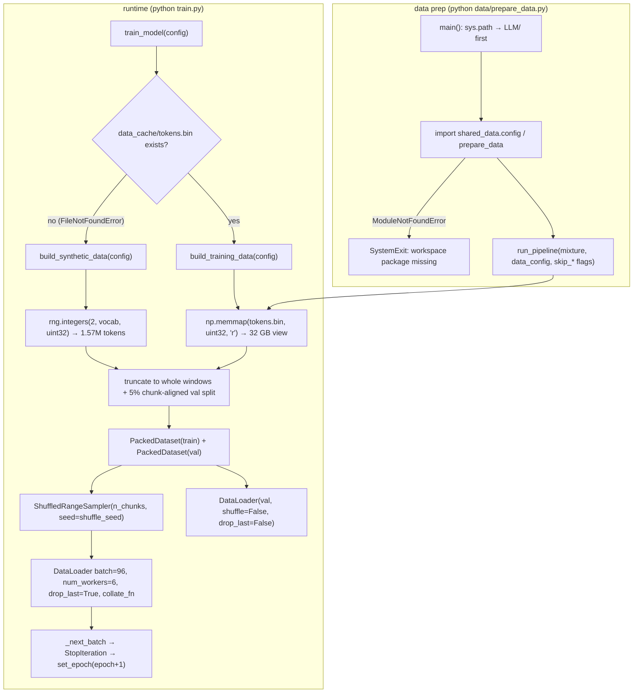
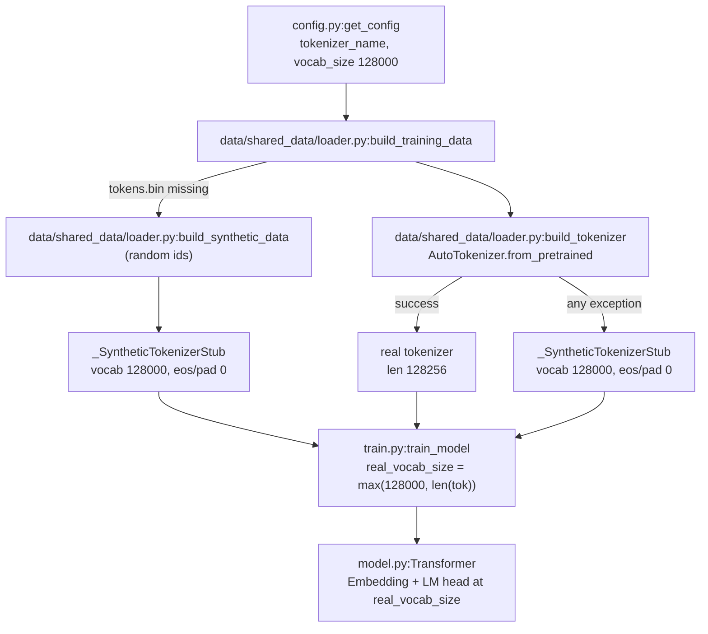
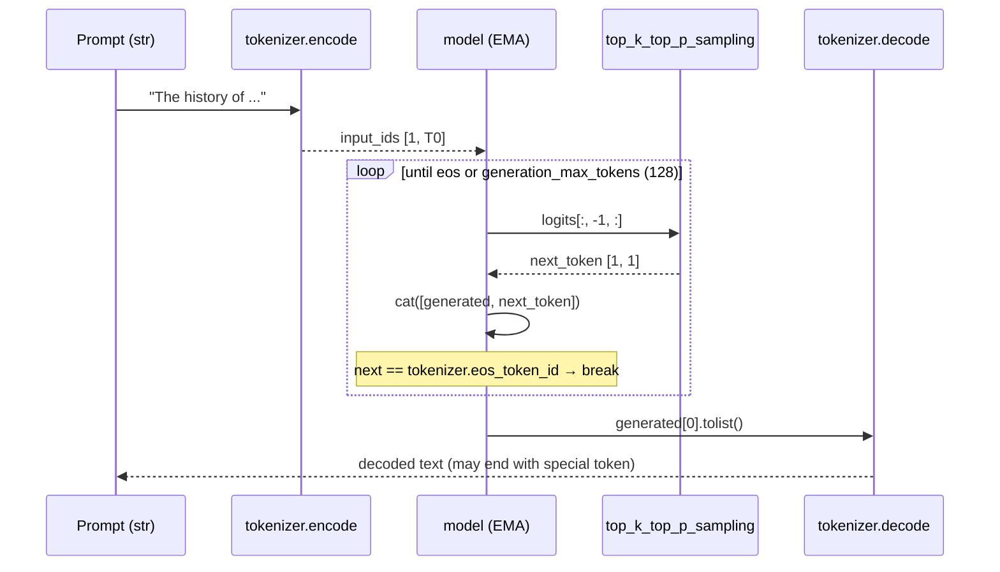
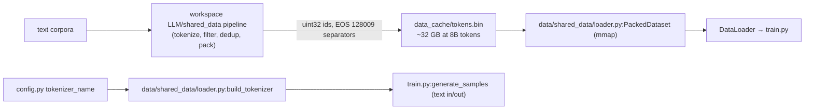
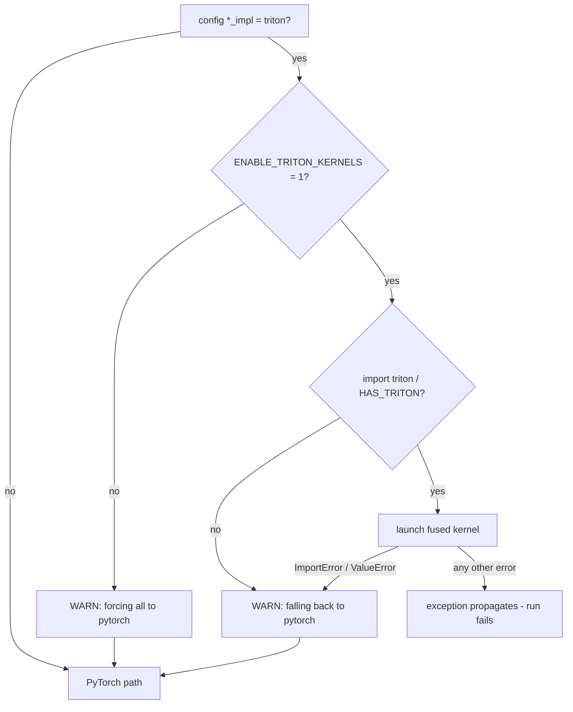

# LLaMA-3-Lite — Data, Tokenizer, and Kernels Reference

This document consolidates the three reference docs for the data path, the tokenizer contract, and the optional fused Triton kernels. It covers the vendored loader tour (`data/shared_data/loader.py:PackedDataset`, `data/shared_data/loader.py:ShuffledRangeSampler`, `data/shared_data/loader.py:collate_fn`, `data/shared_data/loader.py:build_tokenizer`, `data/shared_data/loader.py:build_synthetic_data`, `data/shared_data/loader.py:build_training_data`), the `data/prepare_data.py:main` shim, the tokenizer contract resolved in `train.py:train_model`, and the three kernels (`kernels/rmsnorm_triton.py:triton_rmsnorm`, `kernels/swiglu_triton.py:triton_swiglu`, `kernels/cross_entropy_triton.py:triton_chunked_cross_entropy_with_z`) with their launch geometry, autograd wrappers, and `ENABLE_TRITON_KERNELS` gating.

## Overview

**Data.** LLaMA-3-Lite reads training data from exactly three files. The runtime loader is `data/shared_data/loader.py` (210 lines): a memory-mapped `uint32` token buffer wrapped in a `Dataset`, a deterministic `Sampler`, a stacking `collate_fn`, and three builders that assemble train/val `DataLoader`s. `data/prepare_data.py` is a thin CLI shim that delegates corpus construction to the workspace-level `LLM/shared_data` pipeline; `dataset.py` is a 32-line re-export shim so `train.py` and `benchmark_data.py` keep importing from the old path. The corpus on disk is one file, `data_cache/tokens.bin`: raw little-endian `uint32` tokens, no header, EOS-separated documents, about 32 GB at the 8B-token target. Because the loader memory-maps it, GPU-resident data cost is ~0 bytes — the headline enabler of the project's 78% memory reduction.

**Tokenizer.** LLaMA-3-Lite never tokenizes text at training time. The corpus is pretokenized to `uint32` ids by the workspace `LLM/shared_data` pipeline (invoked through the `data/prepare_data.py` shim) and stored in `data_cache/tokens.bin`; the project's own data code only *loads* a tokenizer and consumes ids. That load happens in `data/shared_data/loader.py:build_tokenizer`, which calls `AutoTokenizer.from_pretrained(config["tokenizer_name"])` and patches `pad_token` to `eos_token` when the checkpoint declares no pad token (the LLaMA-3 tokenizer does not ship one). The tokenizer's real vocabulary is 128,256 ids (128,000 ordinary subword symbols plus 256 special tokens at the top of the range), while `config.py:get_config` sets `vocab_size` to 128,000 — so `train.py:train_model` computes `real_vocab_size = max(config['vocab_size'], len(tokenizer))` and builds the model's embedding and LM head at that width. Because the pipeline never pads, `train.py:train_model` sets `ignore_index = -100` (a sentinel that matches no real token id), which keeps the EOS document separator learnable — critical, since the pad fallback makes `pad_token_id == eos_token_id`. Generation (`train.py:generate_samples`) encodes a prompt, samples autoregressively, stops on `tokenizer.eos_token_id`, and decodes the result. Offline or synthetic runs use a byte-level stub, `data/shared_data/loader.py:_SyntheticTokenizerStub`, which maps each UTF-8 byte to one id.

**Kernels.** `kernels/` holds three optional Triton kernels — fused RMSNorm (`kernels/rmsnorm_triton.py`), fused SwiGLU activation (`kernels/swiglu_triton.py`), and fused chunked cross-entropy + z-loss (`kernels/cross_entropy_triton.py`) — each shipped with a pure-PyTorch reference implementation that runs on CPU without Triton installed. Every kernel is **opt-in**: `config.get_config()` defaults all three `*_impl` keys to `'pytorch'`, and the trainer refuses to honor `'triton'` unless the environment variable `ENABLE_TRITON_KERNELS=1` is set. Each kernel is wrapped in a `torch.autograd.Function` whose forward launches one Triton program and whose backward **re-computes** the reference implementation instead of launching a second kernel. If Triton is missing (`ImportError`) or the tensor shape violates a kernel guard (`ValueError`), the model layer prints a warning and falls back to the PyTorch path; any *other* runtime failure propagates and kills the run. AGENTS.md requires ≥ 1.5× speedup for a sanctioned kernel before it may be enabled by default, but the benchmark script it names (`scripts/microbench_a100.py`) does not exist in this repo yet.

---

## Data Loader Reference (data/shared_data/loader.py)

> Audience: intermediate. Assumes you know what a token is and have skimmed the theory in [data-and-kernels.md](../concepts/data-and-kernels.md); this part is the code tour, not the theory.

## File overview

| File | Lines | Role |
|---|---|---|
| `data/shared_data/loader.py` | 210 | The only data code that runs at training time |
| `data/shared_data/__init__.py` | 21 | Re-exports the same 5 public symbols as `dataset.py` |
| `data/prepare_data.py` | 72 | CLI shim → workspace `LLM/shared_data` pipeline |
| `dataset.py` | 32 | Re-export shim for backward compatibility |

There is **no** `_stream_to_disk`, `_doc_hash`, `_build_source_streams`, or `interleave_datasets` in this repository. Those functions belong to the workspace pipeline at `LLM/shared_data` (imported through the shim); the vendored `data/shared_data/` package contains exactly two files (`__init__.py`, `loader.py`) and is the complete runtime surface.

## Function map

| Symbol | Kind | What it does |
|---|---|---|
| `data/shared_data/loader.py:PackedDataset` | `Dataset` | Read-only `uint32` windowed view of the corpus |
| `data/shared_data/loader.py:ShuffledRangeSampler` | `Sampler` | Deterministic permutation of `range(n)` |
| `data/shared_data/loader.py:collate_fn` | function | Stacks per-chunk dicts into `[B, seq_len]` tensors |
| `data/shared_data/loader.py:build_synthetic_data` | function | Random `uint32` corpus, no disk, no HF download |
| `data/shared_data/loader.py:build_tokenizer` | function | `AutoTokenizer.from_pretrained` + pad→eos fallback |
| `data/shared_data/loader.py:build_training_data` | function | mmap `tokens.bin` → real train/val loaders |
| `data/shared_data/loader.py:_SyntheticTokenizerStub` | class | Byte⇄id tokenizer stand-in |
| `data/prepare_data.py:main` | function | CLI → `run_pipeline` in the workspace package |
| `dataset.py:PackedDataset` … | re-exports | 5 symbols re-exported for `train.py` |

## The corpus layout

Both builders assume one on-disk format: a single binary file of little-endian `uint32` token ids, no header, no framing beyond the tokens themselves. Documents are packed back-to-back; an EOS separator id marks document boundaries. This is the same byte layout used by GPT-OSS-Lite — `data/prepare_data.py:main` prints that the two projects' shards are interchangeable.

At the project's configured scale the corpus is:

$$8\,000\,000\,000\ \text{tokens} \times 4\ \frac{\text{bytes}}{\text{token}} = 32\ \text{GB}$$

(`config.py:get_config` sets `target_tokens: 8_000_000_000`, which matches the workspace `shared_data.config.UNIVERSAL_TOTAL_TOKENS` printed by `data/prepare_data.py:_apply_llama3_defaults`.)

## PackedDataset — the mmap windowed view

`data/shared_data/loader.py:PackedDataset` is a `torch.utils.data.Dataset` with three construction-time jobs: dtype coercion, tiny-buffer padding, and chunk counting.

### Construction (`data/shared_data/loader.py:PackedDataset.__init__`)

```python
# illustrative
def __init__(self, tokens: np.ndarray, seq_len: int, eos_id: int = 0):
    if tokens.dtype != np.uint32:
        tokens = tokens.astype(np.uint32, copy=False)
    chunk = seq_len + 1
    if tokens.size < chunk:
        # Pad up to one chunk so a tiny buffer is still usable.
        pad = np.zeros(chunk - tokens.size, dtype=np.uint32)
        tokens = np.concatenate([tokens, pad])
    self.tokens = tokens
    self.seq_len = seq_len
    self.eos_id = eos_id
    self.n_chunks = tokens.size // (seq_len + 1)
```

Three behaviors worth naming:

1. **Dtype coercion.** If the caller hands in anything that is not already
   `uint32` (a plain `np.array` of Python ints, say), it is cast with `copy=False`. For the real corpus this is a no-op: the array arrives from `np.memmap(path, dtype=np.uint32, mode="r")` in `data/shared_data/loader.py:build_training_data`.
2. **Tiny-buffer padding.** If the buffer is smaller than one
   `seq_len + 1` window, it is zero-padded up to exactly one chunk. This keeps `__len__` ≥ 1 so even a handful of tokens yields a usable dataset. It exists for tests and synthetic debugging, not for the 8B corpus.
3. **Chunk counting.** `n_chunks = tokens.size // (seq_len + 1)` floors to
   whole windows. Any trailing partial window is silently dropped — it can never be a full `seq_len` input + shifted target.

Note the constructor takes no `eos_id`: `PackedDataset.__getitem__` never consults one — windowing is position-only. The EOS separator's only job is to be a learnable token id at document boundaries; the windower does not need to know where documents start or end. An `eos_id` parameter existed once as a "reserved for document-boundary callers" hook and was removed in the cleanup — no caller ever used it.

### Item access (`data/shared_data/loader.py:PackedDataset.__getitem__`)

```python
# illustrative
def __getitem__(self, idx: int) -> dict:
    start = idx * (self.seq_len + 1)
    end = start + self.seq_len + 1
    window = np.asarray(self.tokens[start:end], dtype=np.int64)
    return {
        "input": torch.from_numpy(window[:-1]),
        "target": torch.from_numpy(window[1:]),
    }
```

Window `i` covers tokens `[i·(S+1), (i+1)·(S+1))` with `S = seq_len`. Consecutive windows tile the corpus with no overlap and no gap — every token appears in exactly one window. The returned dict is the shift-by-1 pair:

- `input` = first `S` tokens of the window (`window[:-1]`),
- `target` = the next-token prediction target (`window[1:]`), i.e. the same
  window advanced by one position.

So the last token of a window appears only as a target and the first only as an input; there is no padding, no masking, and every target position is real corpus data. That is why training uses `ignore_index = -100` (see the Tokenizer Reference below) — nothing is ever ignored, and the EOS separator ids stay learnable.

**The "no copy" claim, precisely.** The module docstring says `__getitem__` "slices `seq_len+1` chunks with no copy". Slicing a memmap yields a memmap view — the 32 GB file is never copied into RAM. However, `np.asarray(..., dtype=np.int64)` with a different dtype performs a cast that *does* allocate a small array (2049 × 8 B ≈ 16.4 KB at `seq_len = 2048`). The `int64` conversion is required because `torch.from_numpy` needs a dtype it can wrap as a signed tensor (`ignore_index = -100` is meaningful only in a signed type), and it lets `window[:-1]` / `window[1:]` be wrapped as zero-copy views of that small buffer. The resident-memory story is untouched: RAM cost is proportional to the pages touched (≈ 8.2 KB of file per window) plus the transient 16.4 KB cast, not to the 32 GB corpus.

### Sizing at project scale

With `S = 2048`, `chunk = 2049`, and an 8B-token file:

| Quantity | Value | Arithmetic |
|---|---|---|
| Windows per file | ≈ 3,904,343 | `⌊8e9 / 2049⌋` (1,193 trailing tokens dropped) |
| Val holdout (5%) | ≈ 195,218 | chunk-aligned 5% of the chunk-aligned total |
| Train windows | ≈ 3,709,125 | chunk-aligned 95% |
| Full batches per epoch | 38,636 | `⌊3,709,125 / 96⌋` (`drop_last=True`) |

The 42,000-step plan (`config.py:get_config` `max_steps`) therefore exhausts the train split shortly after epoch 1 — the exact reason `train.py:_next_batch` wraps the sampler (see below).

## ShuffledRangeSampler — deterministic shuffle

`data/shared_data/loader.py:ShuffledRangeSampler` shuffles the chunk indices `range(n_chunks)` with a seedable offset:

```python
# illustrative
def __iter__(self):
    rng = np.random.default_rng(self.seed + self.offset)
    order = rng.permutation(self.n)
    return iter(int(i) for i in order)

def set_epoch(self, epoch: int) -> None:
    self.offset = epoch
```

Design points:

- **Determinism.** The permutation is a function of `(seed, offset)`
  only, via NumPy's `default_rng` (PCG64). The same pair always yields the same order, independent of wall-clock time, worker count, or iteration history — so a resume with the same checkpointed `offset` replays the same epoch order.
- **Fresh epochs.** Bumping `offset` changes the generator seed, hence the
  permutation. `set_epoch(epoch)` is the standard `torch.utils.data` epoch hook, and `train.py:_next_batch` calls it when the corpus runs out.
- **Fresh generator per iteration.** `__iter__` creates a new
  `default_rng` each call, so iterating twice at the same offset gives the identical order (reproducible restarts), and a partially-consumed iterator can be abandoned and rebuilt without corrupting anything.

The ids yielded are Python `int`s, which `DataLoader` uses to index `PackedDataset`. Because the sampler is explicitly constructed (not `shuffle=True`), `train.py` can reach it as `train_dataloader.sampler` to call `set_epoch` — the mechanism behind the epoch wrap.

## collate_fn — from chunk dicts to batches

```python
# illustrative
def collate_fn(batch: list[dict]) -> dict:
    return {
        "input": torch.stack([b["input"] for b in batch], dim=0),
        "target": torch.stack([b["target"] for b in batch], dim=0),
    }
```

`torch.stack` over axis 0 turns `B` dicts of `[S]` int64 tensors into one dict of `[B, S]` int64 tensors. Both builders pass this as `collate_fn=collate_fn`; it is also what the smoke tests reuse directly.

Shape trace per batch:

```
96 chunks × {"input": [2048] int64, "target": [2048] int64}
    ──stack──▶ {"input": [96, 2048] int64, "target": [96, 2048] int64}
```

Each tensor is `96 × 2048 × 8 B = 1.57 MB`; a batch's data tensors total ≈ 3.1 MB on CPU before the `non_blocking` H2D copy in `train.py:train_model`.

## build_synthetic_data — the no-disk fallback

`data/shared_data/loader.py:build_synthetic_data` is the path taken when no real corpus exists. It returns `(train_dl, val_dl, tokenizer)` where the tokenizer is always the byte stub — random ids make a real tokenizer meaningless, so the stub is used "unconditionally (no HF download)".

Key steps:

1. **Budget.** With `num_tokens=None`, it synthesizes
   `max(8 · (S+1) · B, 4096)` tokens: `8 × 2049 × 96 = 1,573,632` at project scale. The `4096` floor keeps absurdly small configs usable.
2. **Random stream.** `rng.integers(2, max(3, vocab), size=…, dtype=np.uint32)`
   draws uniform ids in `[2, vocab)` — ids `0` and `1` are deliberately never produced, so they remain free as EOS/BOS conventions.
3. **Split.** The stream is truncated to whole windows
   (`n_total = (size // chunk) · chunk`), then split at `int(n_total · (1 − val_split))` re-aligned to a chunk boundary, so train and val are both integral numbers of windows.
4. **Loaders.** Two `PackedDataset`s + one `ShuffledRangeSampler` + two
   `DataLoader`s (table below).
5. **Stub.** Returns `_SyntheticTokenizerStub(vocab=vocab, eos_id=0, pad_id=0)`.

Note `PackedDataset` takes no `eos_id` (windowing is position-only); the stub's `eos_id`/`pad_id` are `0` — consistent with the `[2, vocab)` id range, where `0` never appears in the data.

## build_tokenizer — real tokenizer, pad→eos

This is the *only* place the real tokenizer is loaded in this repo. It uses `config.py:get_config`'s `tokenizer_name: 'NousResearch/Meta-Llama-3-8B'` with an optional `tokenizer_cache_dir`. Because the corpus is packed (no padding ever exists in the stream), the tokenizer's own pad token is never needed by the data path — the pad→eos fallback is defensive, so a tokenizer without a pad token (as Llama-3's is) still satisfies code that queries `tokenizer.pad_token_id`. It raises when `transformers` is missing or the download fails; every caller wraps it in the stub fallback. The full function (verbatim, with docstring), its config keys, and the fallback chain are covered in the
[Tokenizer Reference](#tokenizer-reference) below.

## build_training_data — the real path

`data/shared_data/loader.py:build_training_data` is what production training calls. In order:

1. **Resolve the cache path.** `data_cache_dir` (default `"data_cache"`) +
   `data_cache_filename` (default `"tokens.bin"`) → `data_cache/tokens.bin`.
2. **Existence contract.** If the file does not exist it raises
   `FileNotFoundError` with instructions: `Run `python data/prepare_data.py` first (or pass `data_sources` empty
   + use build_synthetic_data)`. The check is existence-only — file size
   and content are not validated; a truncated file simply yields fewer windows. `train.py:train_model` catches exactly this exception to switch to synthetic data.
3. **Memory-map.** `np.memmap(path, dtype=np.uint32, mode="r")` opens the
   32 GB file read-only; nothing is loaded until a page is touched.
4. **Split.** Identical math to the synthetic path: truncate to whole
   windows, chunk-align the 5% validation holdout (`config.py:get_config` `val_split: 0.05`).
5. **Loaders.** `PackedDataset` (position-windowed, no `eos_id`) + sampler seeded with
   `shuffle_seed` (default `42` — note the synthetic builder's sampler default falls back to its own `seed` argument instead) + the same `DataLoader` configuration as synthetic.
6. **Tokenizer with fallback.** It tries `build_tokenizer(config)`;
   on *any* exception it prints a warning — "tokenizer load failed … using the byte stub. Generation samples will be meaningless until a real tokenizer is available." — and substitutes the stub. This is the honest acknowledgement that the stub's decode output is byte-garbage, not text.

## _SyntheticTokenizerStub — duck-typed tokenizer

`data/shared_data/loader.py:_SyntheticTokenizerStub` implements just enough of a tokenizer API for the training loop and generation:

| Member | Behavior |
|---|---|
| `pad_token_id` / `eos_token_id` | Plain attributes from the constructor (`0`/`0` for synthetic data) |
| `__len__` | Returns `vocab` — critical, because `train.py:train_model` computes `real_vocab_size = max(config['vocab_size'], len(tokenizer))` |
| `encode(text)` | `[min(b, vocab-1) for b in text.encode("utf-8")]` — one id per UTF-8 byte, clamped |
| `decode(ids)` | `bytes(int(i) & 0xFF for i in ids).decode("utf-8", errors="replace")` — bytes back out, invalid sequences replaced |

`decode`'s `& 0xFF` mask is what makes ids ≥ 256 safe to round-trip (ids beyond 255 were never in the bytes in the first place — the round-trip is lossy by construction, hence "generation samples will be meaningless").

`__len__` is the load-bearing member: the real Meta-Llama-3-8B tokenizer has 128,256 entries, so `real_vocab_size = max(128000, 128256) = 128256` — the LM head and embedding tables are sized to the *tokenizer's* vocab, not `config['vocab_size']`, when a real tokenizer is present.

## data/prepare_data.py — the shim

`data/prepare_data.py:main` is a CLI entry point (`python data/prepare_data.py --stage pretrain …`) that produces `tokens.bin`. It does **not** implement any pipeline itself.

### Path resolution

```python
# illustrative
_PROJECT_ROOT = Path(__file__).resolve().parents[1]  # .../LLaMA-3-Lite/
_DATA_ROOT = Path(__file__).resolve().parent  # vendored shared_data lives here
_WORKSPACE_ROOT = _PROJECT_ROOT.parent  # workspace LLM/shared_data (universal pipeline)
for _p in (_DATA_ROOT, _PROJECT_ROOT, _WORKSPACE_ROOT):
    _p = str(_p)
    if _p not in sys.path:
        sys.path.insert(0, _p)
```

Because each path is `insert(0)`-ed in turn, the final `sys.path` order is `LLM/`, then `LLaMA-3-Lite/`, then `data/`. The workspace `LLM/shared_data` package therefore wins the `import shared_data` lookup — which is the point: the shim must load the *universal* pipeline (`shared_data.config`, `shared_data.prepare_data`), not the vendored loader. The vendored `data/shared_data/` contains only `loader.py` + `__init__.py`; it cannot satisfy that import, and the shim does not expect it to.

### Constants and delegation

`data/prepare_data.py` hard-codes the LLaMA-3 contract: `LLAMA3_TOKENIZER_NAME = "llama3"`, `LLAMA3_VOCAB_SIZE = 128_000`, `LLAMA3_EOS_TOKEN_ID = 128_009`, `LLAMA3_PAD_TOKEN_ID = 128_002` — the values that end up in `tokens.bin`, whatever the actual tokenizer object used at load time.

`data/prepare_data.py:_apply_llama3_defaults` is the workspace probe: it imports `UNIVERSAL_TOTAL_TOKENS` from `shared_data.config` and prints the corpus size, tokenizer, and the 50M-token shard size. If that import raises `ModuleNotFoundError`, `main` re-raises it as a `SystemExit` whose message explains the situation exactly: the project "vendors only the loader (`data/shared_data/`)" and delegates to `LLM/shared_data/` — the workspace package must exist and be importable on the machine that builds data.

The actual work is one call:

```python
# illustrative
from shared_data.prepare_data import run_pipeline

return run_pipeline(
    mixture_path=Path(args.mixture) if args.mixture else UNIVERSAL_MIXTURE_PATH,
    data_config_path=Path(args.data_config) if args.data_config else UNIVERSAL_DATA_CONFIG_PATH,
    source=args.source,
    skip_download=args.skip_download,
    skip_clean=args.skip_clean,
    skip_tokenize=args.skip_tokenize,
    skip_pack=args.skip_pack,
    data_root=Path(args.data_root) if args.data_root else None,
)
```

The CLI flags (`--mixture`, `--data-config`, `--data-root`, `--source`, `--skip-download/clean/tokenize/pack`) pass straight through to the workspace pipeline, which does the downloading, dedup, tokenization, and packing that produce the EOS-separated `uint32` stream.

## dataset.py — the re-export shim

`dataset.py` exists so `train.py` and `benchmark_data.py` keep working unchanged:

```python
# illustrative
from shared_data.loader import (
    PackedDataset,
    ShuffledRangeSampler,
    collate_fn,
    build_training_data,
    build_synthetic_data,
)
```

It inserts only its own `data/` directory on `sys.path` (never the workspace path), so `import shared_data` resolves to the **vendored** loader — the runtime copy. `train.py:train_model` imports `build_training_data, build_synthetic_data` from here; the smoke tests import the module as `ds` and use `ds.PackedDataset`, `ds.ShuffledRangeSampler`, and `ds.collate_fn` directly. `build_tokenizer` and `_SyntheticTokenizerStub` are intentionally not re-exported — they are internal to the loader.

## The DataLoader configuration

Both builders produce the same loader pair (`config.py:get_config` values; synthetic defaults apply when a key is absent):

| Parameter | `train_dl` | `val_dl` | Absent-key default |
|---|---|---|---|
| `batch_size` | 96 | 96 | — |
| `sampler` | `ShuffledRangeSampler(n_chunks, seed=shuffle_seed)` | `None` (`shuffle=False`) | — |
| `num_workers` | 6 | `min(2, 6) = 2` | 0 |
| `prefetch_factor` | 16 | 16 | 2 (ignored when `num_workers=0` → `None`) |
| `pin_memory` | True | True | False |
| `collate_fn` | `collate_fn` | `collate_fn` | — |
| `drop_last` | True | False | — |
| `persistent_workers` | True (`n_workers > 0`) | True | `n_workers > 0` |

The train/val asymmetry is deliberate: the train loader drops the final incomplete batch (so every optimizer step sees a full 96 × 2048 window, and step counts are exact), while the validation loader keeps partial batches (it is capped anyway by `val_max_batches: 100`). `persistent_workers` avoids re-spawning the 6 workers every epoch; `pin_memory` enables the `non_blocking=True` H2D copies in `train.py:train_model`.

## Loader construction, end to end



## How the training loop consumes it

- `train.py:train_model` receives `(train_dataloader, val_dataloader,
  tokenizer)`; if any is `None` it tries `build_training_data(config)` first and only on `FileNotFoundError` falls back to `build_synthetic_data(config)` — with a printed warning pointing at the missing `data_cache/tokens.bin`.
- `ignore_index = -100` is hard-coded with the rationale in a comment:
  "No padding in this pipeline (packed documents, full windows), so nothing is ignored; using -100 keeps EOS separators learnable."
- `real_vocab_size = max(config['vocab_size'], len(tokenizer))` sizes the
  model's embedding/LM head to the *tokenizer's* vocab (128,256 for the real Llama-3 tokenizer, 128,000 for the stub).
- `train.py:_next_batch` wraps the iterator: on `StopIteration` it bumps
  `epoch_state['epoch']`, calls `set_epoch` on the sampler (guarded by `hasattr`), prints the "42k-step plan (~8.26B tokens) exceeds the prepared corpus" warning, and re-iterates the loader. The first epoch yields ≈ 38,636 full batches; step 42,000 lands ≈ 3,364 steps into epoch 2.
- `generate_samples` (`train.py:generate_samples`) calls
  `tokenizer.encode(prompt)` and `tokenizer.decode(ids)` and compares `next_token.item()` to `tokenizer.eos_token_id` — the three-member API the stub provides.

## The test suite's view

`tests/test_smoke.py:tiny_dataloaders` builds loaders by hand, exercising `PackedDataset` and `ShuffledRangeSampler` exactly as the builders do but with `tiny_config` values (`seq_len=32`, `vocab=256`, `batch=4`, `val_split` from the tiny config). It synthesizes `n_tokens = (seq_len + 1) * 32 + 10` tokens — deliberately **not** a multiple of the chunk size, so the floor-to-whole-windows truncation is part of what the fixture covers — then splits chunk-aligned, constructs `PackedDataset` (no `eos_id` — windowing is position-only), seeds the sampler with `seed=42, offset=0`, and wires `ds.collate_fn` into both loaders. The `TestEndToEndSmoke` class then runs real forward/backward steps, chunked-vs-dense loss equivalence, and validation on these loaders.

## Edge cases & pitfalls

1. **Missing cache.** `build_training_data` raises `FileNotFoundError`
   when `tokens.bin` is absent; `train.py` catches it and silently switches to random synthetic tokens. Training "works" but learns nothing — the warning is the only signal. Check `data_cache/` before drawing conclusions from a run.
2. **Existence-only check.** The guard never validates size or contents.
   A truncated `tokens.bin` yields fewer windows; a corrupt one yields garbage ids without any error.
3. **Stub decode is lossy.** `_SyntheticTokenizerStub.encode` maps each
   UTF-8 byte to an id (clamped to `vocab-1`); `decode` masks back to bytes. Multi-byte characters round-trip imperfectly, and with the real corpus + stub fallback, generated "text" is byte-garbage by design — `build_training_data`'s warning says so.
4. **`len(tokenizer)` is load-bearing.** If a tokenizer object lacks
   `__len__`, `train_model`'s `real_vocab_size = max(...)` crashes with `TypeError`. The stub implements `__len__`; the real `AutoTokenizer` does too.
5. **Epoch wrap vs. one-shot iterator.** A plain `iter(dataloader)` dies
   with `StopIteration` at the end of the corpus; `_next_batch` exists precisely because the 42K-step plan exceeds one pass over the 95% train split (≈38.6K steps). Do not replace it with a bare `for batch in dataloader` loop.
6. **`drop_last=True` means the last few windows of each epoch are
   skipped** — at project scale that is 69 windows of 3,709,125 (0.002%), immaterial for training but relevant if you are auditing exact token counts.
7. **`eos_id` is inert in the vendored loader.** Document separators are
   baked into the stream by the workspace packer; `PackedDataset` never acts on `eos_id`. Do not expect window boundaries to coincide with document boundaries (they almost never do).
8. **The shim requires the workspace.** `python data/prepare_data.py`
   without `LLM/shared_data` importable exits with the `SystemExit` guidance message — the vendored package alone cannot build the corpus.

## Design decisions

- **One file, one format.** A headerless little-endian `uint32` stream is
  the interchange format with GPT-OSS-Lite, trivially memmap-able, and 4 bytes/token (vs. 2 bytes for `uint16` — 128k vocab needs 17 bits, so `uint32` is the honest choice).
- **mmap over preload.** The corpus is 32 GB; the GPU budget is 20 GB.
  mmap makes the data path cost ~0 resident bytes and ~0 setup time, trading per-window page faults — amortized away by 6 prefetch workers.
- **Explicit sampler over `shuffle=True`.** `shuffle=True` would hide the
  RNG state and prevent the epoch wrap; an explicit `ShuffledRangeSampler` gives `train.py` a handle (`sampler.set_epoch`) and reproducibility for free.
- **Shift-by-1 inside the window, not across the whole corpus.** Each
  chunk carries its own `input`/`target` pair, so the sampler shuffles *windows* while the sequence structure within a window is untouched.
- **Stub fallback everywhere.** `build_training_data` wraps the real
  tokenizer in `try/except Exception` and degrades to the stub; the training loop cannot crash on a missing HF download, only warn.

---

## Tokenizer Reference

> Audience: beginner → intermediate. Assumes you know what a "token" is and have skimmed the corpus theory in [data-and-kernels.md](../concepts/data-and-kernels.md). This part is the code tour: what tokenizer this project uses, where it is loaded, how its size interacts with the model, and how generation consumes it.

## File overview & function map

| File | Role in the tokenizer story |
|---|---|
| `data/shared_data/loader.py` | `build_tokenizer` (real load), `build_training_data` (calls it with fallback), `build_synthetic_data` (stub, unconditionally), `_SyntheticTokenizerStub` (byte⇄id stand-in) |
| `data/prepare_data.py` | CLI shim → workspace pipeline; pins the tokenizer contract constants (`LLAMA3_TOKENIZER_NAME`, `LLAMA3_VOCAB_SIZE`, `LLAMA3_EOS_TOKEN_ID`, `LLAMA3_PAD_TOKEN_ID`) |
| `config.py:get_config` | `tokenizer_name`, `tokenizer_cache_dir`, `vocab_size` |
| `train.py` | `real_vocab_size` resolution, `ignore_index = -100`, `generate_samples` |
| `model.py:Transformer` | Embedding + LM head sized to `real_vocab_size` |
| `dataset.py` | 32-line re-export shim (no tokenizer symbols of its own) |

There is **no** tokenization code in this repository — no `_stream_to_disk`, no `_doc_hash`, no `interleave_datasets`. Those live in the workspace `LLM/shared_data` package, and the old `docs/tokenizer.md` wrongly attributed them to `dataset.py`; see [Where tokenization actually happens](#where-tokenization-actually-happens--the-honest-picture) for the honest pipeline picture.

| Symbol | Kind | What it does |
|---|---|---|
| `data/shared_data/loader.py:build_tokenizer` | function | `AutoTokenizer.from_pretrained` + pad→eos fallback |
| `data/shared_data/loader.py:build_training_data` | function | mmap `tokens.bin`; tries `build_tokenizer`, falls back to the stub |
| `data/shared_data/loader.py:build_synthetic_data` | function | Random `uint32` corpus; always returns the stub |
| `data/shared_data/loader.py:_SyntheticTokenizerStub` | class | `len` / `encode` / `decode` / `eos_token_id` / `pad_token_id` duck-type |
| `data/prepare_data.py:LLAMA3_VOCAB_SIZE` | constant | 128,000 — pipeline-side vocab contract |
| `data/prepare_data.py:LLAMA3_EOS_TOKEN_ID` | constant | 128,009 — `<\|eot_id\|>` document separator |
| `data/prepare_data.py:LLAMA3_PAD_TOKEN_ID` | constant | 128,002 — `<\|pad_id\|>` |
| `train.py:train_model` | function | `real_vocab_size`, `ignore_index = -100`, model build |
| `train.py:generate_samples` | function | encode → autoregressive sample → eos stop → decode |
| `model.py:Transformer` | class | `input_embedding` + `output_proj` sized to the vocab |

## BPE in 60 seconds — what this tokenizer is

### Why subword tokens

A language model predicts the next token, so the vocabulary defines both the model's input alphabet and its output distribution. Three options:

- **Characters** (256 UTF-8 bytes): tiny vocab, but every word becomes a
  long sequence; the model spends capacity learning spelling instead of meaning, and the effective context shrinks.
- **Words**: efficient for common words, but vocabularies run into the
  millions, and every out-of-vocabulary word is unrepresentable without a fallback.
- **Subwords** (BPE): a middle path — common words become single tokens,
  rare words split into pieces, and *every* input is representable. This is what LLaMA-3 uses.

### Byte-level BPE: the algorithm

Byte Pair Encoding builds a vocabulary greedily from a corpus:

1. Start with the 256 UTF-8 bytes as the base alphabet.
2. Count adjacent byte (later: symbol) pairs across the corpus; merge the
   most frequent pair into a new symbol; repeat.
3. Stop after a fixed number of merges.

The result is a ranked list of merge rules. Encoding is deterministic: repeatedly apply the learned merges in rank order. Decoding is lossless — a token id maps back to a byte sequence, so no input byte is ever dropped.

LLaMA-3's variant is **byte-level**: the base alphabet is the UTF-8 bytes of the text, so arbitrary code, emoji, and non-Latin scripts all encode without an `<unk>` token. This is why the tokenizer round-trips losslessly — a property the synthetic stub exploits directly.

### Pretokenization

Merges must not run across word boundaries, so the tokenizer first splits text into "words" with a regex (the TikToken-style pattern): runs of letters, digits, punctuation, and whitespace, with a special marker for leading spaces so that `"cat"` and `" cat"` become distinct tokens. BPE merges then apply *within* each word only. This is why the model sees separate tokens for `'The'`, `' cat'`, `' sat'` — the leading-space variants carry the word-boundary information that lets the model emit spaces correctly.

### The 128,256-vocabulary anatomy

The real LLaMA-3 tokenizer (`NousResearch/Meta-Llama-3-8B` on the Hub, loaded via `AutoTokenizer`) has **128,256** ids:

| Range | Contents | Count |
|---|---|---|
| `0` – `127,999` | ordinary byte-BPE subword symbols (256 base bytes + learned merges) | 128,000 |
| `128,000` – `128,255` | special / control tokens | 256 |
| **Total** | | **128,256** |

`[INFERENCE]` — the exact merge count and id layout come from the published tokenizer artifact, not from this repo's source. What the repo itself pins: `config.py:get_config` sets `vocab_size: 128000` and `data/prepare_data.py:LLAMA3_VOCAB_SIZE` is also `128_000` — i.e. the project configures the *ordinary* vocabulary, and the extra 256 special ids are exactly the drift that `real_vocab_size = max(...)` absorbs (see below).

## The load path — `data/shared_data/loader.py:build_tokenizer`

### The function

This is the entire real load path in this repo:

```python
# illustrative
def build_tokenizer(config: dict):
    """Load the project tokenizer from ``tokenizer_name``; pad defaults to eos.

    Raises when transformers is missing or the download fails; callers fall
    back to the byte stub.
    """
    from transformers import AutoTokenizer

    tokenizer = AutoTokenizer.from_pretrained(
        config["tokenizer_name"],
        cache_dir=config.get("tokenizer_cache_dir", None),
    )
    if tokenizer.pad_token is None:
        tokenizer.pad_token = tokenizer.eos_token
    return tokenizer
```

(Verbatim from `data/shared_data/loader.py:build_tokenizer`.)

Three config keys drive it (`config.py:get_config`):

| Key | Default | Effect |
|---|---|---|
| `tokenizer_name` | `'NousResearch/Meta-Llama-3-8B'` | HF repo id (or local path) to load |
| `tokenizer_cache_dir` | `None` | `None` → the default HF cache (`~/.cache/huggingface`); a path pins the cache for offline reuse |
| `vocab_size` | `128000` | Config-side vocab; *not* read by `build_tokenizer` — it matters in the vocab contract below |

`AutoTokenizer.from_pretrained` dispatches on the checkpoint's `tokenizer_config.json` to the fast Rust-backed tokenizer, so `len(tokenizer)` returns 128,256 and `encode`/`decode` run in optimized native code.

### The pad→eos fallback

LLaMA-3 defines **no native pad token** — `tokenizer.pad_token` is `None` after load. `build_tokenizer` patches it to the EOS token so that any code that asks for a pad id gets a valid one instead of `None`. The consequence is load-bearing: after this line, `tokenizer.pad_token_id == tokenizer.eos_token_id`, so a loss configured with `ignore_index = pad_token_id` would silently erase every EOS target (see
[Why `ignore_index = -100`](#why-ignore_index-100-trainpytrain_model)).

### Callers and the fallback chain

`build_tokenizer` is called from exactly one place: `data/shared_data/loader.py:build_training_data`, inside a `try`/`except` that catches *any* exception (missing `transformers`, no network, no cache):

```python
# illustrative — the fallback inside build_training_data
real_vocab = int(config["vocab_size"])
try:
    tokenizer = build_tokenizer(config)
except Exception as exc:
    print(
        f"[data] tokenizer load failed ({type(exc).__name__}: {exc}); "
        f"using the byte stub. Generation samples will be meaningless "
        f"until a real tokenizer is available."
    )
    tokenizer = _SyntheticTokenizerStub(vocab=real_vocab, eos_id=0, pad_id=0)
```

`build_synthetic_data` does **not** call `build_tokenizer` at all — it always returns `_SyntheticTokenizerStub(vocab=vocab, eos_id=0, pad_id=0)` so tests and offline runs never touch the network. And in `train.py:train_model`, a missing `data_cache/tokens.bin` (`FileNotFoundError`) drops the whole real path and falls back to `build_synthetic_data(config)` with a warning.



## The vocab contract: 128,000 vs 128,256 vs the stub

### Three numbers that must agree

| Source | `len(tokenizer)` | Where it comes from |
|---|---|---|
| `config.py:get_config` → `vocab_size` | 128,000 | Model-side default; matches `data/prepare_data.py:LLAMA3_VOCAB_SIZE` |
| Real LLaMA-3 tokenizer (via `build_tokenizer`) | **128,256** | 128,000 ordinary + 256 special ids |
| `data/shared_data/loader.py:_SyntheticTokenizerStub.__len__` | 128,000 | Returns `self._vocab`, i.e. the config value |

### `real_vocab_size = max(config['vocab_size'], len(tokenizer))`

`train.py:train_model` reconciles the two at model-build time:

```python
# illustrative — the two lines that matter in train_model
ignore_index = -100
real_vocab_size = max(config['vocab_size'], len(tokenizer))
model = build_transformer(
    vocab_size=real_vocab_size,
    d_model=config['d_model'],
    # ...
).to(device)
```

With the real tokenizer this resolves to 128,256 (the tokenizer wins); with the stub it stays 128,000. `model.py:build_transformer`'s own default is already `vocab_size: int = 128256`, matching the real tokenizer, but the training path never relies on that default — it passes `real_vocab_size` explicitly.

### Why the model head must cover the tokenizer

`model.py:Transformer` builds two vocab-sized tensors:

```python
# illustrative — construction inside Transformer.__init__
self.input_embedding = nn.Embedding(vocab_size, d_model)
# ... decoder blocks ...
self.output_proj = nn.Linear(d_model, vocab_size, bias=False)
```

Both must be at least as wide as the tokenizer, because:

- **Encoding side.** `generate_samples` feeds `tokenizer.encode(prompt)`
  into the model. If the embedding were narrower than some encoded id, the lookup would index out of range and crash. Every id the tokenizer can produce must have an embedding row.
- **Output side.** The LM head emits one logit per vocab row, and sampling
  picks an id in `[0, vocab_size)`. If the head were narrower than the tokenizer's largest ids, those ids could never be *generated* — the model could literally not emit special tokens or rare subwords, and `decode` would receive ids the model never scored.

The `max(...)` guard is what makes the mismatch harmless: the model is always built at least as wide as whichever source is larger. The opposite drift (head wider than the tokenizer, e.g. after a tokenizer downgrade) is also absorbed — the unused top rows just never receive training signal or sampling mass. One real cost of widening: checkpoint compatibility. An embedding/head at 128,256 does not load into a 128,000-shaped checkpoint and vice versa; the `max()` is evaluated per-run, so the model shape can change silently if the tokenizer resolution changes.

### Parameter arithmetic

At the config vocab (128,000):

$$128{,}000 \times 1024 = 131{,}072{,}000 \approx 131.1\text{M}$$

per embedding/head tensor; the pair costs 262.1M params, which with the 251.7M non-embedding parameters gives the headline 513.8M total (consistent with `model.py:Transformer.get_num_params`). At the real tokenizer width (128,256):

$$128{,}256 \times 1024 = 131{,}334{,}144 \approx 131.3\text{M}$$

so the widened model is ≈ 514.4M params — a 0.6M-parameter difference, ~0.1% of the model, entirely in the embedding and head. In BF16 the head weight alone is $131.3\text{M} \times 2\text{B} \approx 263\text{MB}$; the widening adds ~0.5 MB per tensor. [Derived from the two vocab numbers and `model.py:Transformer` shapes; the 513.8M total is the audited count.]

## Special tokens

### The table

The special range `128,000`–`128,255` holds the control tokens. The ones this project cares about, with the repo's own constants from `data/prepare_data.py`:

| id | Token | Role | Repo constant |
|---|---|---|---|
| 128,000 | `<\|begin_of_text\|>` | BOS — start of a sequence | — (pipeline-side) |
| 128,001 | `<\|end_of_text\|>` | Base-model EOS (declared by the HF checkpoint) | — |
| 128,002 | `<\|pad_id\|>` | Pad id pinned by the project | `LLAMA3_PAD_TOKEN_ID` |
| 128,006 | `<\|start_header_id\|>` | Chat role header open | — |
| 128,007 | `<\|end_header_id\|>` | Chat role header close | — |
| 128,009 | `<\|eot_id\|>` | End-of-turn; the document separator in this pipeline | `LLAMA3_EOS_TOKEN_ID` |
| 128,010 | `<\|python_tag\|>` | Code marker | — |

Three subtleties worth flagging:

1. **The corpus separator is 128,009 (`<\|eot_id\|>`), not the base
   checkpoint's 128,001 (`<\|end_of_text\|>`).** `data/prepare_data.py` pins `LLAMA3_EOS_TOKEN_ID = 128_009`, and the workspace pipeline (configured there with `LLAMA3_TOKENIZER_NAME = "llama3"`) uses that id to separate packed documents in `tokens.bin`. The loader itself never checks EOS ids while reading — `PackedDataset` slices fixed `seq_len+1` windows and has no `eos_id` parameter at all (windowing is position-only; the eos id is reserved for document-boundary callers).
2. **What `tokenizer.eos_token_id` reports depends on the loaded
   checkpoint.** The base `NousResearch/Meta-Llama-3-8B` artifact declares `<\|end_of_text\|>` (128,001) as `eos_token`; the chat-tuned family uses `<\|eot_id\|>` (128,009). `[INFERENCE]` about the Hub artifact; grounded in this repo: generation stops on whatever `tokenizer.eos_token_id` resolves to, and the project's own separator constant is 128,009.
3. **PAD is a *constant*, not necessarily the runtime pad.** The project
   pins 128,002, but the *runtime* `pad_token_id` after `build_tokenizer`'s fallback is `eos_token_id` (the fallback fires because LLaMA-3 ships no pad token). Both ids live in the special range, so the model head covers them either way; the discrepancy only matters if you assume `pad_token_id == 128002` at runtime — it does not, unless the checkpoint declares it.

### Why PAD falls back to EOS

`data/shared_data/loader.py:build_tokenizer` sets `tokenizer.pad_token = tokenizer.eos_token` when the checkpoint has none. This is the standard GPT-style convention and is harmless *only because this pipeline never pads*: documents are packed back-to-back into fixed-size windows, so no batch ever contains a pad position. The moment you would use `pad_token_id` as a loss `ignore_index`, the fallback turns into a bug — see the next section.

## Why `ignore_index = -100` (`train.py:train_model`)

The training loop sets, with the code's own comment:

```python
# illustrative
# No padding in this pipeline (packed documents, full windows), so nothing
# is ignored; using -100 keeps EOS separators learnable.
ignore_index = -100
```

(`train.py:train_model`.) The chain of reasoning:

1. **The pipeline never pads.** `PackedDataset.__getitem__` slices
   `seq_len+1`-token windows from the packed stream and shifts by one: `input = window[:-1]`, `target = window[1:]`. Every position in a window is a real next-token target, including positions whose target is the EOS separator that ends a document mid-window.
2. **`pad_token_id == eos_token_id` after the fallback** (see above). If the
   loss used `ignore_index = pad_token_id`, it would silently mask every EOS position — the model would never receive gradient for predicting a document boundary, would learn that EOS "never happens", and generation would never emit the stop token. The fallback that keeps `pad_token` valid for library code is exactly what makes `pad_id` the wrong ignore sentinel here.
3. **`-100` matches nothing.** Token ids live in `[0, 128256)`, so the
   conventional `-100` sentinel can never collide with a real target. Nothing is masked, every position contributes to the loss, and EOS stays learnable.

The `ignore_index` value flows into `model.py:chunked_head_cross_entropy_with_z` from `train.py:train_model` (training) and `train.py:validate` (validation). The `-100` contract is the flip side of the PAD=EOS decision: they only compose correctly because the pipeline packs rather than pads. For the loss semantics themselves, see [architecture-components.md](../concepts/architecture-components.md).

## Generation — `train.py:generate_samples`

### Walkthrough

```python
# illustrative (abridged: 5 prompts, wandb table logging elided)
@torch.no_grad()
def generate_samples(model, tokenizer, device, step, config):
    model.eval()
    prompts = [
        "The history of artificial intelligence began in the",
        "def fibonacci(n):\n    \"\"\"Return the nth Fibonacci number.\"\"\"\n    ",
        # ... 3 more text/code prompts
    ]
    for prompt in prompts:
        tokens = tokenizer.encode(prompt)                      # str -> list[int]
        input_ids = torch.tensor([tokens], device=device)
        generated = input_ids
        for _ in range(config['generation_max_tokens']):
            with torch.autocast(device_type='cuda', dtype=torch.bfloat16,
                                enabled=device.type == 'cuda'):
                logits = model(generated)
            next_token = top_k_top_p_sampling(
                logits[:, -1, :],
                config['generation_top_k'],
                top_p=0.9,
                temperature=config['generation_temperature']
            )
            generated = torch.cat([generated, next_token], dim=1)
            if next_token.item() == tokenizer.eos_token_id:
                break
        text = tokenizer.decode(generated[0].tolist())         # list[int] -> str
        # ... wandb.Table({"prompt", "generated", "step"})
    model.train()
```

Step by step, with the real signatures:

1. **Encode.** `tokenizer.encode(prompt)` returns a plain `list[int]` with
   no special tokens — a bare prompt prime. (For the stub, this is one id per UTF-8 byte.)
2. **Autoregressive loop.** Up to `generation_max_tokens` (default 128)
   steps: the model scores the whole growing sequence, the *last* position's logits (`logits[:, -1, :]`) go through `train.py:top_k_top_p_sampling(logits, top_k, top_p, temperature)` (top-k 50, top-p 0.9, temperature 0.8 from config), and the sampled id is appended.
3. **Stop.** Two exit conditions: the sampled id equals
   `tokenizer.eos_token_id`, or the token budget is exhausted. There is no BOS prepend and no `skip_special_tokens` on decode, so the decoded sample may end with the literal special-token string.
4. **Decode.** `tokenizer.decode(generated[0].tolist())` reverses the id
   sequence into text (byte-stable, because byte-level BPE decodes any id sequence to a byte string).
5. **Which model?** `train.py:train_model` calls
   `generate_samples(ema, tokenizer, device, step, config)` when the EMA shadow exists, else the live model — generation always runs on the smoother EMA weights. `model.eval()` / `model.train()` around the loop keep checkpointing and dropout-free layers consistent.

### The flow



Sampling knobs (`config.py:get_config`): `generation_max_tokens` 128, `generation_temperature` 0.8, `generation_top_k` 50, `top_p` 0.9 hardcoded in the call. The full loop mechanics live in
[training.md](../training.md).

## The synthetic stub — `data/shared_data/loader.py:_SyntheticTokenizerStub`

### The class (verbatim)

```python
# illustrative
class _SyntheticTokenizerStub:
    """Duck-typed tokenizer for synthetic data: bytes ⇄ ids, clamped to vocab."""

    def __init__(self, vocab: int, eos_id: int, pad_id: int):
        self._vocab = vocab
        self.eos_token_id = eos_id
        self.pad_token_id = pad_id

    def __len__(self) -> int:
        return self._vocab

    def encode(self, text: str) -> list[int]:
        return [min(b, self._vocab - 1) for b in text.encode("utf-8")]

    def decode(self, ids) -> str:
        raw = bytes(int(i) & 0xFF for i in ids)
        return raw.decode("utf-8", errors="replace")
```

It is a duck-type, not a real tokenizer: it implements exactly the surface the rest of the code touches — `len()` (for `real_vocab_size`), `encode()` / `decode()` (for `generate_samples`), and the two id attributes (`eos_token_id` for the stop check, `pad_token_id` for consumers that ask). The mapping is deliberately trivial:

- `encode` takes the UTF-8 bytes of the string, one id per byte. The
  `min(b, vocab - 1)` clamp is a no-op at this project's vocab (bytes ≤ 255 < 127,999) but keeps the stub correct if someone constructs it with a tiny vocab.
- `decode` masks each id to a byte (`& 0xFF`) and UTF-8-decodes with
  replacement characters for invalid sequences. So the stub round-trips ASCII losslessly, and any byte string survives encode→decode intact.
- `__len__` returns the config `vocab_size` (128,000), which is what makes
  `max(config['vocab_size'], len(tokenizer))` resolve to 128,000 on synthetic runs.

```python
# illustrative — the stub in action
stub = _SyntheticTokenizerStub(vocab=128_000, eos_id=0, pad_id=0)
stub.encode("cat")          # [99, 97, 116] — one id per UTF-8 byte
stub.decode([99, 97, 116])  # "cat"
len(stub)                   # 128000
stub.eos_token_id           # 0
```

### When it is used

| Path | Stub? | Why |
|---|---|---|
| `build_synthetic_data` | Always | Synthetic ids are random `uint32`; no text ever exists to tokenize, and no HF download is allowed in tests/offline runs |
| `build_training_data` | On `build_tokenizer` failure | Missing `transformers`, no network, no cache → warning + stub |
| `train.py:train_model` | Via `build_synthetic_data` fallback | `tokens.bin` missing → synthetic corpus + stub |
| `tests/e2e_gpu_smoke.py:check_data_pipeline` | Via `build_synthetic_data` | GPU smoke path exercises the real builders on synthetic data |

Note that the stub's `eos_id`/`pad_id` are **0** everywhere it is constructed, and `build_synthetic_data` samples ids in `[2, vocab)` — `rng.integers(2, max(3, vocab), ...)` — so id 0 never appears in a synthetic corpus. The stop check `next_token.item() == 0` is therefore well-defined (it can fire when the model happens to emit id 0, a valid logits row), and even an `ignore_index = 0` would mask nothing. The training loop still uses `-100` for uniformity.

### Training vs generation consequences

Training is unaffected by the stub: the model consumes ids, and synthetic ids are perfectly good training signal (the loss decreases, shapes check, gradients flow). Only *generation* degrades — the warning in `build_training_data` says it plainly: *"Generation samples will be meaningless until a real tokenizer is available."* A prompt encodes to its bytes, the model generates byte-ids, and decode reassembles bytes — the output is byte-garbage, but the *mechanics* (encode → sample → eos-stop → decode) are exercised end to end. That is exactly what the smoke tests want: `tests/test_smoke.py` drives the loop on synthetic data, and `tests/conftest.py:make_token_stream` builds BOS..EOS-packed buffers without any tokenizer at all.

## Where tokenization actually happens (the honest picture)

The old `docs/tokenizer.md` described a "streaming tokenization" pipeline with `_stream_to_disk`, `_doc_hash`, and per-document BOS/EOS wrapping in `dataset.py`. None of that exists in this repo — `dataset.py` is a 32-line re-export shim, and those functions belong to the workspace `LLM/shared_data` package. The real division of labor:



- **Corpus side.** `data/prepare_data.py:main` prints the pipeline
  contract via `data/prepare_data.py:_apply_llama3_defaults` (universal corpus size, tokenizer, shard size) and delegates to `shared_data.prepare_data.run_pipeline` in the workspace package; if that package is not importable it exits with guidance (`ModuleNotFoundError` → "This project vendors only the loader (data/shared_data/)"). The workspace pipeline is what actually runs the tokenizer over documents, filters/dedups, wraps documents with separators, and writes `tokens.bin`.
- **Runtime side.** This repo's loader (`PackedDataset`,
  `ShuffledRangeSampler`, `collate_fn`) never inspects token semantics: it slices `seq_len+1` windows of `uint32` and shifts by one. The tokenizer is loaded only for its *metadata* (`len`, ids) and for *generation* (encode/decode).
- **Consistency requirement.** The ids in `tokens.bin` are produced by the
  pipeline's tokenizer (`data/prepare_data.py:LLAMA3_TOKENIZER_NAME` = `"llama3"`), while generation loads `config['tokenizer_name']` (`NousResearch/Meta-Llama-3-8B`). The two must share the same id space for `tokens.bin` ids to mean anything at generation time. The `max()` vocab guard covers *size* drift but not *semantic* drift — a tokenizer swap that renumbers the special range would silently change what the model sees. [The requirement is grounded in the two names; the consequences are reasoning.]

The corpus theory — packing, EOS separators, dedup, the memmap layout — lives in [data-and-kernels.md](../concepts/data-and-kernels.md); the code tour of the loader itself is the [Data Loader Reference](#data-loader-reference-data-shared_dataloaderpy) part above.

## Edge cases & pitfalls

1. **PAD == EOS after load, so never use `pad_id` as `ignore_index`.** The
   pad→eos fallback in `build_tokenizer` makes the two ids identical; `ignore_index = pad_id` would mask every document separator. The pipeline's answer is `-100` (see above). If you change `ignore_index`, change it to a value outside `[0, vocab)`.
2. **The stop-check id may not be the separator id.** Generation stops on
   `tokenizer.eos_token_id`, which for the base checkpoint is `<\|end_of_text\|>` (128,001) while the corpus separator is `<\|eot_id\|>` (128,009). The model is trained to emit the *corpus* separator; if the loaded tokenizer declares a different eos id, the loop may not stop on 128,009. `[INFERENCE]` about the Hub artifact's declared eos; grounded in `train.py:generate_samples` checking only `tokenizer.eos_token_id` and `data/prepare_data.py:LLAMA3_EOS_TOKEN_ID` being 128,009. Watch the two names agree.
3. **Stub generation is byte-garbage by design.** The warning in
   `build_training_data` is the contract, not a bug: synthetic/fallback runs verify mechanics, not text quality.
4. **`real_vocab_size` can change between runs.** It is evaluated per-run
   from whichever tokenizer actually loads. A run that loses network access silently rebuilds the model at 128,000 (stub) instead of 128,256 — different shapes, incompatible checkpoints. Symptom: checkpoint load shape mismatches after an environment change.
5. **Widening the vocab costs parameters and memory.** 128,256 vs 128,000
   adds ~0.6M params (see parameter arithmetic) — small, but the embedding and head are the two largest single tensors in the model (≈131.3M params / ≈263 MB BF16 each at the real width), so every vocab decision is a memory decision.
6. **`build_tokenizer` swallows nothing — its callers do.** The function
   itself raises on failure (missing `transformers`, failed download); the fallback lives in `build_training_data`. Any new caller must decide its own stub policy.
7. **No `skip_special_tokens` in generation.** `decode(generated[0]
   .tolist())` renders special tokens literally, so samples can end with `<|end_of_text|>`/`<|eot_id|>` text. Cosmetic, but surprising if you string-match on outputs.
8. **Two different "vocab 128,000" numbers.** `config.py:get_config` and
   `data/prepare_data.py:LLAMA3_VOCAB_SIZE` both say 128,000; the real tokenizer says 128,256. They are *supposed* to differ (special range), and the `max()` absorbs it — but any code that assumes `vocab_size == len(tokenizer)` without the guard will mis-size the model or crash on out-of-range ids.

---

## Triton Kernels Reference

> Audience: intermediate — you know what RMSNorm, SwiGLU, and cross-entropy do; this part is about the three fused Triton implementations, their launch geometry, and the opt-in/fallback machinery around them. Theory counterpart: [data-and-kernels.md](../concepts/data-and-kernels.md).

## File map

| File | Public API | Reference |
|---|---|---|
| `kernels/rmsnorm_triton.py` | `kernels/rmsnorm_triton.py:triton_rmsnorm` | `kernels/rmsnorm_triton.py:rmsnorm_pytorch` |
| `kernels/swiglu_triton.py` | `kernels/swiglu_triton.py:triton_swiglu` | `kernels/swiglu_triton.py:swiglu_pytorch` |
| `kernels/cross_entropy_triton.py` | `kernels/cross_entropy_triton.py:triton_chunked_cross_entropy_with_z` | `kernels/cross_entropy_triton.py:cross_entropy_with_z_pytorch` |

Dispatch sites live in `model.py`: `model.py:RMSNorm.forward`, `model.py:SwiGLUFFN.forward`, `model.py:chunked_cross_entropy_with_z`, and `model.py:chunked_head_cross_entropy_with_z`. The env-var gate lives in `train.py:train_model`.

## The opt-in contract

Three layers of control decide whether a fused kernel ever runs:

1. **Per-kernel config keys.** `config.get_config()` defaults
   `rmsnorm_impl`, `swiglu_impl`, and `cross_entropy_impl` to `'pytorch'` (see [model-reference.md](model-reference.md) for the full surface).
2. **The env-var gate.** `train.py:train_model` reads
   `ENABLE_TRITON_KERNELS`; if it is not exactly `"1"` and any `*_impl` key is `'triton'`, it prints a warning and force-restores all three keys to `'pytorch'`. A default-config run can therefore never accidentally enter a fused path — the opt-in is explicit twice over (AGENTS.md rule 7).
3. **Per-module dispatch with warned fallback.** When an `*_impl` key is
   `'triton'`, the model layer calls the Triton entry point and catches `(ImportError, ValueError)`:

```python
# illustrative — the exact pattern in model.py:RMSNorm.forward
if self.impl == "triton":
    try:
        return triton_rmsnorm(x, self.weight, self.eps)
    except (ImportError, ValueError) as exc:
        if not self._triton_fallback_warned:
            print(f"[RMSNorm] triton path unavailable "
                  f"({type(exc).__name__}: {exc}); "
                  f"falling back to 'pytorch'.")
            self._triton_fallback_warned = True
return x * torch.rsqrt(x.pow(2).mean(dim=-1, keepdim=True) + self.eps) * self.weight
```

The two `nn.Module` sites (`model.py:RMSNorm.forward`, `model.py:SwiGLUFFN.forward`) guard the warning with a `self._triton_fallback_warned` flag, so the message prints **once per module instance**, not once per forward. The two function sites (`model.py:chunked_cross_entropy_with_z`, `model.py:chunked_head_cross_entropy_with_z`) have no such flag and print on every call.



## Fallback vs hard-fail, precisely

The caught exception classes are `ImportError` (Triton absent; the public entry points raise it explicitly) and `ValueError` (a shape exceeds the kernel's block guard — see each kernel below). Anything else — a Triton compile failure, an illegal-memory access, a CUDA OOM — is *not* caught and propagates out of the forward pass, surfacing as a clear error per AGENTS.md rule 7. Note also that the kernel modules never raise `ImportError` at import time: they use `try: import triton / except ImportError: HAS_TRITON = False`, so importing `kernels.*` works on any machine, CPU or GPU, with or without Triton.

AGENTS.md rule 2 sets the performance bar: a sanctioned Triton path must show **≥ 1.5× speedup over the raw-PyTorch path in `scripts/microbench_a100.py`**; below that it must not be enabled by default. That script is referenced by the rule but **does not exist in this repo** (no `scripts/` directory — verified by glob). The `'pytorch'` defaults mean the kernels are never enabled by default today; the 1.5× bar is therefore unenforced until a benchmark lands.

## Kernel 1 — fused RMSNorm

**Signature:** `triton_rmsnorm(x: torch.Tensor, weight: torch.Tensor, eps: float) -> torch.Tensor`

**What it fuses.** The eager chain `pow → mean → add → rsqrt → multiply` (five elementwise/reduction launches per norm in the PyTorch path) collapses into one row-wise program. The reference, `kernels/rmsnorm_triton.py:rmsnorm_pytorch`, is:

```python
variance = x.pow(2).mean(dim=-1, keepdim=True)
return x * torch.rsqrt(variance + eps) * weight
```

**Grid/block design.** `kernels/rmsnorm_triton.py:_triton_rmsnorm_forward` flattens `x` to `(M, N)` (`.contiguous()` first, guaranteeing coalesced access), then launches a **one-dimensional grid of `M` programs** — one program per row. `N` is a `tl.constexpr` block size computed with `triton.next_power_of_2(N)`; the compiled kernel loads the row under a `cols < N` mask, computes `var = sum(x²)/N` and `rstd = 1/sqrt(var+eps)` as FP32, multiplies by the weight vector, and stores back.

At this project's scale: `N = d_model = 1024` (a power of two already, so `BLOCK_SIZE = 1024` and the mask is fully covered), and `M = B·S = 96 × 2048 = 196,608` programs per norm. The 16 layers each run two such norms (`attention_norm`, `ffn_norm`) plus the final decoder norm — 33 launches per forward pass, each 196,608-wide. The QK-norms inside `model.py:GroupedQueryAttention` are constructed with the default `impl='pytorch'`, so the fused path never applies to the `head_dim = 128` norms.

**Launch params:** `num_warps=4, num_stages=1`. There is no inner loop to pipeline, so `num_stages=1` is correct; `num_warps=4` is enough to saturate the 1,024-wide row.

**Guard:** `kernels/rmsnorm_triton.py:_MAX_BLOCK_SIZE = 8192`; if `next_power_of_2(N) > 8192` the forward raises `ValueError` (d_model ≤ 8192 for the Triton path), which the dispatch layer converts into a warned fallback.

## Kernel 2 — fused SwiGLU

**Signature:** `triton_swiglu(gate_up: torch.Tensor, d_ff: int) -> torch.Tensor`

**What it fuses.** `gate_up` is the fused output of `gate_up_proj` (`model.py:SwiGLUFFN.__init__`, a `Linear(d_model, 2·d_ff)`), width `2·d_ff` with gate and up halves concatenated. Eager SwiGLU needs `silu` and a multiply (two elementwise launches, plus a `chunk` view); the compiled kernel does both in one program. The reference, `kernels/swiglu_triton.py:swiglu_pytorch`, is:

```python
return F.silu(gate) * up
```

**Grid/block design.** `kernels/swiglu_triton.py:_triton_swiglu_forward` validates `gate_up.shape[-1] == 2 * d_ff` (else `ValueError`), flattens to `(M, 2·d_ff)`, and launches **`M` programs, one per row**. Each program loads the gate half at `cols` and the up half at `cols + d_ff`, computes `silu_g = g · sigmoid(g)`, then `y = silu_g · u`, and stores the `d_ff`-wide result. `BLOCK_SIZE = next_power_of_2(d_ff)`.

At this project's scale: `d_ff = 4096` (already a power of two → `BLOCK_SIZE = 4096`), `M = B·S = 196,608` programs per layer per forward — one launch per layer replacing two eager launches.

**Launch params:** `num_warps=8, num_stages=2`. The wider row (4,096 columns) justifies 8 warps; `num_stages=2` is the Triton default pipelining for the two loads.

**Guard:** the same `_MAX_BLOCK_SIZE = 8192`; `d_ff > 8192` raises `ValueError` → warned fallback in `model.py:SwiGLUFFN.forward`.

## Kernel 3 — fused chunked CE + z-loss

**Signature:** `triton_chunked_cross_entropy_with_z(logits, targets, ignore_index=-100, z_loss_weight=1e-4) -> torch.Tensor`

**What it fuses.** The PyTorch chain `logsumexp → cross_entropy → mean → z-penalty` (several launches, plus FP32 upcasts) collapses into **one program per logits row**. The reference, `kernels/cross_entropy_triton.py:cross_entropy_with_z_pytorch`, is:

```python
# illustrative
log_z = torch.logsumexp(logits.float(), dim=-1)
ce = F.cross_entropy(logits, targets, ignore_index=ignore_index, reduction="mean")
z = log_z.pow(2).mean()
return ce + z_loss_weight * z
```

### Online softmax

The kernel loads the full vocab row with `other=-inf` padding, then computes the running-max form of log-sum-exp in one pass: `m = max(x)`, `l = sum(exp(x − m))`, `log_z = m + log(l)`. The per-token NLL is `log_z − target_logit`, so the softmax denominator is never materialized.

### Accumulators via `atomic_add`

The kernel writes to three scalar buffers with Triton `atomic_add`: `CE_SUM` (sum of NLL over non-ignored rows), `CE_CNT` (count of non-ignored rows), and `Z_SUM` (sum of `log_z²`). `kernels/cross_entropy_triton.py:_triton_ce_z_forward` finalizes with `ce_mean = ce_sum / ce_cnt.clamp_min(1.0)` and `z_mean = z_sum / M`, then returns `ce_mean + z_loss_weight · z_mean`. The three scalars live in device memory for the whole launch, so peak memory is the logits slice plus a handful of bytes — no `[M, V]` softmax buffer.

### Grid/block design

`M` programs over the flattened `(M, V)` logits, `BLOCK_V = next_power_of_2(V)`. **The entire vocab axis is one block**: at this project's scale `V = 128,256` → `BLOCK_V = 131,072`, exactly `kernels/cross_entropy_triton.py:_MAX_VOCAB_BLOCK`. A 256K vocab would need two programs per row; the constant encodes that ceiling, and `V > 131,072` raises `ValueError`.

### How chunking composes

The kernel does **not** chunk the vocab axis and does **not** accept a `chunk_size` parameter (its docstring warns against passing one — in fact passing `chunk_size=` raises `TypeError`, verified; the "silently no-op" wording in the docstring is inaccurate). Chunking happens at the caller: `model.py:chunked_head_cross_entropy_with_z` loops over `hidden` rows in slices of `chunk_size = 256`, materializes one chunk's logits with `F.linear`, and calls the kernel per chunk — so each launch is `M = 256` rows (768 launches over the `196,608` training rows), and only one chunk's `[256, 128256]` logits tensor is live at a time (see
[training.md](../training.md) for the memory stack). Per-chunk scalar losses
are summed and divided by `n_chunks`; with equal-size chunks that mean is exact (the function docstring's "equal-size chunks ⇒ exact" caveat — a trailing partial chunk makes the mean approximate).

**Launch params:** `num_warps=8, num_stages=2` — same reasoning as SwiGLU: a wide (131,072-column) row and two memory phases per program.

## The autograd.Function wrapper pattern

All three kernels share the same wrapper contract (`kernels/rmsnorm_triton.py:_TritonRMSNorm`, `kernels/swiglu_triton.py:_TritonSwiGLU`, `kernels/cross_entropy_triton.py:_TritonCEWithZ`):

- **forward** saves what backward needs via `ctx.save_for_backward` —
  `(x, weight)` for RMSNorm, `gate_up` for SwiGLU, `(logits, targets)` for CE — plus any scalars (`eps`, `d_ff`, `ignore_index`, `z_loss_weight`) as plain attributes — and returns the Triton result.
- **backward re-computes.** Each backward detaches the saved tensors,
  re-runs the *pure-PyTorch reference* inside `torch.enable_grad()`, and calls `torch.autograd.grad(y, [inputs], grad_out)` to obtain input gradients. No Triton kernel runs in backward at all — the fused path is forward-only, and the backward is a correctness-preserving autograd stub. The memory cost of this design is keeping the *inputs* alive (e.g. pre-norm `x` for RMSNorm, `gate_up` for SwiGLU, full `logits` for CE) rather than the activations.

Because the wrapper is a `torch.autograd.Function`, the Triton forward participates in the graph like any op: gradients flow through it to the projection weights above and the embedding/hidden states below, and it composes with `torch.compile` and CUDA-graph capture the same way an eager op does.

## Launch / fallback table

| Kernel | Entry point | Grid | Block | warps / stages | Guard (→ `ValueError`) | Fallback on `ImportError`/`ValueError` |
|---|---|---|---|---|---|---|
| RMSNorm | `kernels/rmsnorm_triton.py:triton_rmsnorm` | `(M,)`, M = B·S rows | `next_pow2(d_model)` = 1024 | 4 / 1 | `d_model > 8192` | one-time print + PyTorch (`model.py:RMSNorm.forward`) |
| SwiGLU | `kernels/swiglu_triton.py:triton_swiglu` | `(M,)`, M = B·S rows | `next_pow2(d_ff)` = 4096 | 8 / 2 | `d_ff > 8192` or `last != 2·d_ff` | one-time print + PyTorch (`model.py:SwiGLUFFN.forward`) |
| CE + z | `kernels/cross_entropy_triton.py:triton_chunked_cross_entropy_with_z` | `(M,)`, M = chunk rows | `next_pow2(V)` = 131072 | 8 / 2 | `V > 131072` (`_MAX_VOCAB_BLOCK`) | print + PyTorch (`model.py:chunked_cross_entropy_with_z`, `model.py:chunked_head_cross_entropy_with_z`) |

All three `ImportError` messages are uniform: install `triton` (Linux + CUDA only) or use `*_impl='pytorch'` on CPU/Mac.

## The CPU-test contract

AGENTS.md rule 8 requires every kernel to ship a unit test that runs **on CPU without Triton installed**, using the pure-PyTorch reference, with GPU-only behavior behind `@pytest.mark.gpu` (auto-skipped on CPU-only machines). The machinery:

- **References import triton-free.** `rmsnorm_pytorch`, `swiglu_pytorch`,
  and `cross_entropy_with_z_pytorch` import and run without Triton; the module-level `kernels/cross_entropy_triton.py:HAS_TRITON` flag is `False` and the entry points raise `ImportError` if called. The model-level behavior is therefore testable end-to-end on a Mac/CPU box (this repo's 59-test suite passes on CPU with `HAS_TRITON == False` everywhere).
- **Markers.** `pytest.ini` registers `gpu`, `smoke`, `numeric`, `slow`
  under `--strict-markers`; `tests/conftest.py:pytest_collection_modifyitems` skips every `gpu`-marked test with "needs --run-gpu and a CUDA device" unless `--run-gpu` is passed. The `device` fixture defaults to CPU, and the `dtype` fixture is FP32 on CPU "for exactness" and BF16 on GPU — meaning the CPU contract is exercised in exact arithmetic.
- **GPU equivalence.** `tests/e2e_gpu_smoke.py:check_triton_kernels` (stage
  8 of the e2e smoke script) compares each kernel against a hand-written BF16 reference on CUDA with tolerance assertions (RMSNorm abs diff
  < 5e-2, SwiGLU < 1.0, CE loss finite), skipping cleanly when Triton or a
  GPU is absent.

One caveat worth knowing: the fallback *warnings* themselves are not unit-tested — no test in `tests/` asserts the one-time-warning behavior of `model.py:RMSNorm.forward`; the dispatch path is covered indirectly by the model tests (which run the PyTorch branch) and by the e2e script (which runs the Triton branch). And `tests/e2e_gpu_smoke.py:check_triton_kernels` passes `chunk_size=4096` to the CE entry point, which does not accept that keyword — that call raises `TypeError` (verified) if stage 8 is reached on a CUDA box, so the CE segment of the e2e script is currently broken.

## Microbenchmark rule

AGENTS.md rule 2: for any sanctioned Triton path, target **≥ 1.5× speedup over the raw-PyTorch path** measured in `scripts/microbench_a100.py`; below that, do not enable by default. State of the world today:

- The three kernels exist and are wired through dispatch, but all
  `*_impl` defaults are `'pytorch'` — they are **not** enabled by default.
- No benchmark exists: `scripts/microbench_a100.py` is absent from the repo
  (the rule references a file that has not landed). Until one does, the 1.5× bar is untested and no claim of speedup is made anywhere in this repo.
- AGENTS.md rule 1 requires sanctioned Triton paths to be listed in the
  contract; the current AGENTS.md text predates `kernels/` and still says "no custom Triton kernels exist" — the sanctioned-list entry is a doc-debt item, not a code fact.

## Edge cases & pitfalls

- **Block-size guards.** All three kernels validate their reduction axis
  before launch. `d_model` and `d_ff` must be ≤ 8192 (`_MAX_BLOCK_SIZE`); vocab must be ≤ 131,072 (`_MAX_VOCAB_BLOCK`). This project's 1024 / 4096 / 128,256 all fit; a 256K-vocab model would trip the CE guard with a warned fallback, not a silent wrong answer.
- **`ignore_index` and the target-logit load.** Inside the CE kernel, the
  target logit is loaded *unconditionally* — the `valid` flag only guards the two CE `atomic_add`s. For an ignored row the computed `nll` is garbage (the load can even be out of bounds for `ignore_index = -100` on row 0) but is discarded. In practice training targets contain no `-100` (there is no padding; EOS separators stay learnable), so the path is not exercised — but the "protect against ignore_index" comment overstates what the mask does.
- **z-loss averaging differs between paths.** The Triton kernel accumulates
  `Z_SUM` for *every* row and divides by `M` (`z_mean = z_sum / M`), while the PyTorch paths (`model.py:chunked_cross_entropy_with_z`, `model.py:chunked_head_cross_entropy_with_z`) accumulate `log_z²` over **non-ignored rows only**. With no ignored rows the two agree exactly; with `-100`s present they diverge. The `chunked_cross_entropy_with_z` docstring's "z-loss is averaged over non-ignored tokens only" describes the PyTorch path, not the Triton one.
- **All-ignored chunk.** `ce_cnt.clamp_min(1.0)` means an all-ignored chunk
  contributes `0/1 = 0` to the CE mean instead of being excluded; the PyTorch path guards with `if total_count > 0`.
- **Partial trailing chunk.** The head-chunked Triton path averages per-chunk
  means over `n_chunks`; if `hidden.shape[0]` is not a multiple of `chunk_size` (256), the last chunk's mean is weighted equally with full chunks and the result is approximate. `196,608 / 256 = 768` divides exactly in training.
- **Contiguity cost.** Each forward calls `.contiguous()` on its reshaped
  input. In the training loop the CE kernel receives per-chunk logits fresh from `F.linear` (already contiguous), and RMSNorm/SwiGLU inputs are the contiguous residual-stream tensors, so in the hot path this is a no-op view check, not a copy.
- **Backward is a re-compute, not a kernel.** Backward cost is a full
  reference-implementation pass (including `F.cross_entropy`'s internal softmax for CE). This is a correctness/engineering tradeoff, not a performance feature: expect the fused path to accelerate forward passes and leave backward at eager speed.

---

## References

**Related docs (in the new tree):**

- [../concepts/data-and-kernels.md](../concepts/data-and-kernels.md) — the
  theory counterparts to Parts I and III: the Triton execution model (grids, `tl.arange`, masks, `atomic_add`), document packing, EOS separators, dedup, streaming/shuffling, the memmap layout.
- [../concepts/architecture-components.md](../concepts/architecture-components.md)
  — chunked CE equivalence proof, z-loss gradient, why `ignore_index=-100`; RMSNorm math and QK-norm placement; SwiGLU and the fused `gate_up_proj` anatomy; `ignore_index` semantics and what masking does to gradients.
- [../concepts/attention-and-positional.md](../concepts/attention-and-positional.md)
  — embeddings and the LM head in the residual-stream view.
- [../concepts/training-and-memory.md](../concepts/training-and-memory.md)
  — why the kernels upcast to FP32 internally; the 8B-token / 42,000-step budget that the pretokenized corpus serves; sampler seed+offset determinism and checkpoint round-trips.
- [model-reference.md](model-reference.md) — the full config surface
  (`rmsnorm_impl`, `swiglu_impl`, `cross_entropy_impl`, `tokenizer_name`, `vocab_size`, generation knobs) and where each kernel plugs into the forward pass.
- [training-reference.md](training-reference.md) — the
  `gpu`/`numeric`/`smoke` marker system and the e2e smoke script.
- [../training.md](../training.md) — how `train_model` consumes the
  loaders, how `ENABLE_TRITON_KERNELS` interacts with the training loop, and where the mmap data path fits in the 92 → 20 GB memory stack.
- [../guides/troubleshooting.md](../guides/troubleshooting.md) — Triton
  import failures on Mac/CPU and related runtime issues.
- [../guides/glossary.md](../guides/glossary.md) — notation and acronyms
  (`V`, `BOS/EOS/PAD`, BPE).
- [../README.md](../README.md) — the new docs nav map.

**Key source files cited in this doc:**

- `data/shared_data/loader.py` — `PackedDataset`, `ShuffledRangeSampler`,
  `collate_fn`, `build_tokenizer`, `build_synthetic_data`, `build_training_data`, `_SyntheticTokenizerStub`.
- `data/prepare_data.py` — `main`, `_apply_llama3_defaults`,
  `LLAMA3_TOKENIZER_NAME`, `LLAMA3_VOCAB_SIZE`, `LLAMA3_EOS_TOKEN_ID`, `LLAMA3_PAD_TOKEN_ID`.
- `dataset.py` — re-export shim.
- `config.py:get_config` — data/tokenizer/kernel config keys.
- `train.py` — `train_model`, `_next_batch`, `generate_samples`,
  `top_k_top_p_sampling`, `validate`.
- `model.py` — `Transformer`, `RMSNorm.forward`, `SwiGLUFFN.forward`,
  `chunked_cross_entropy_with_z`, `chunked_head_cross_entropy_with_z`, `GroupedQueryAttention`, `build_transformer`.
- `kernels/rmsnorm_triton.py`, `kernels/swiglu_triton.py`,
  `kernels/cross_entropy_triton.py` — the three Triton kernels, their references, and `HAS_TRITON` guards.
- `tests/test_smoke.py`, `tests/conftest.py`, `tests/e2e_gpu_smoke.py` —
  the CPU-test contract and the e2e smoke stages.
