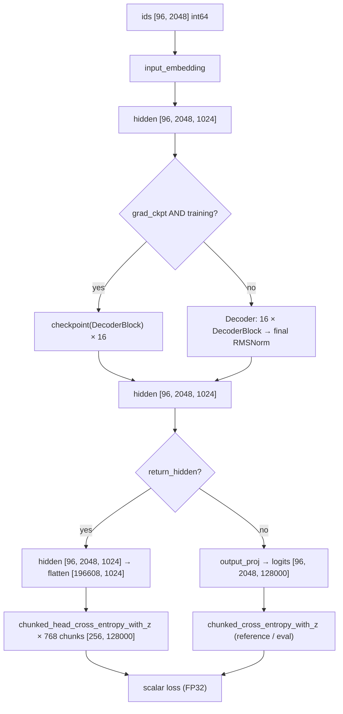
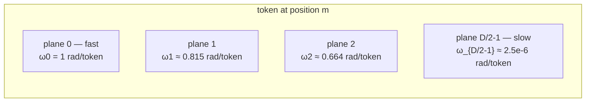
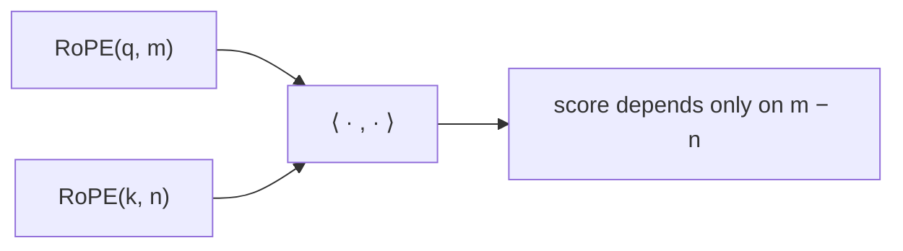
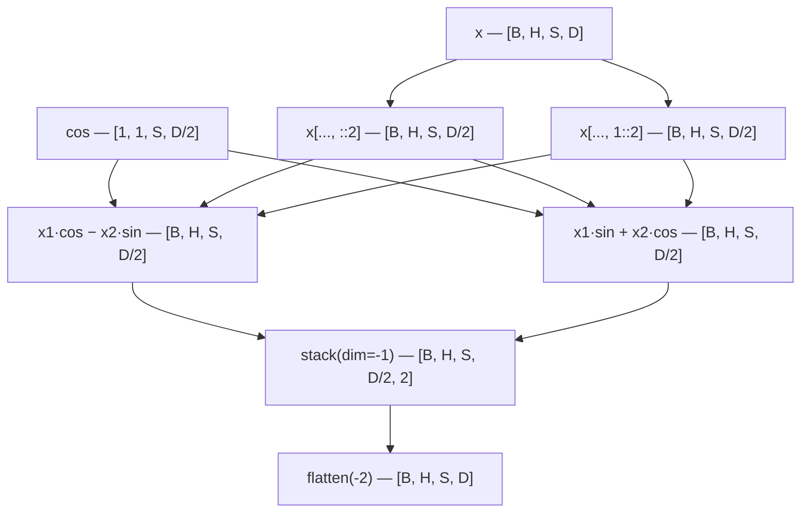
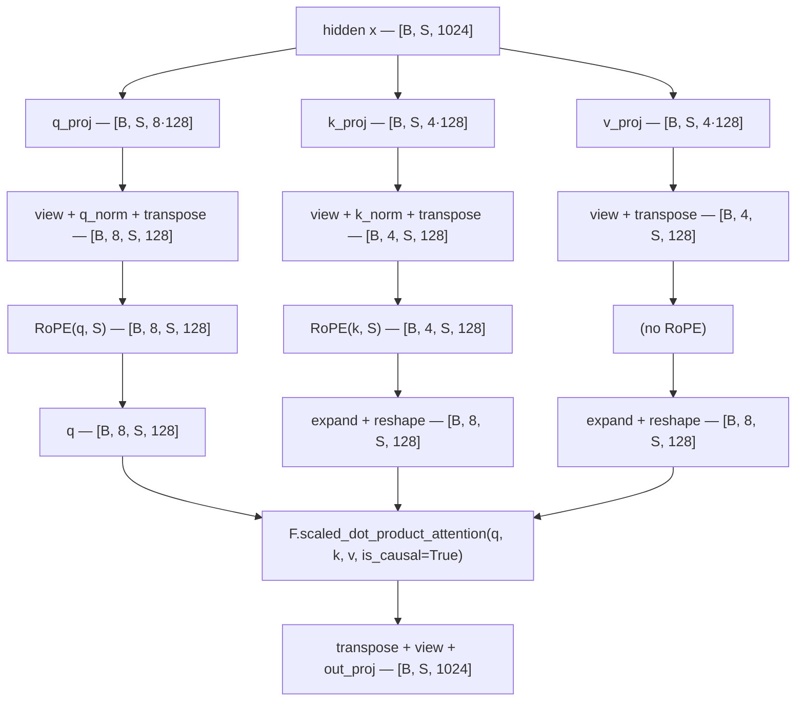
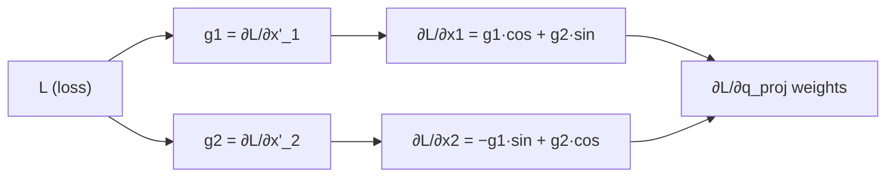
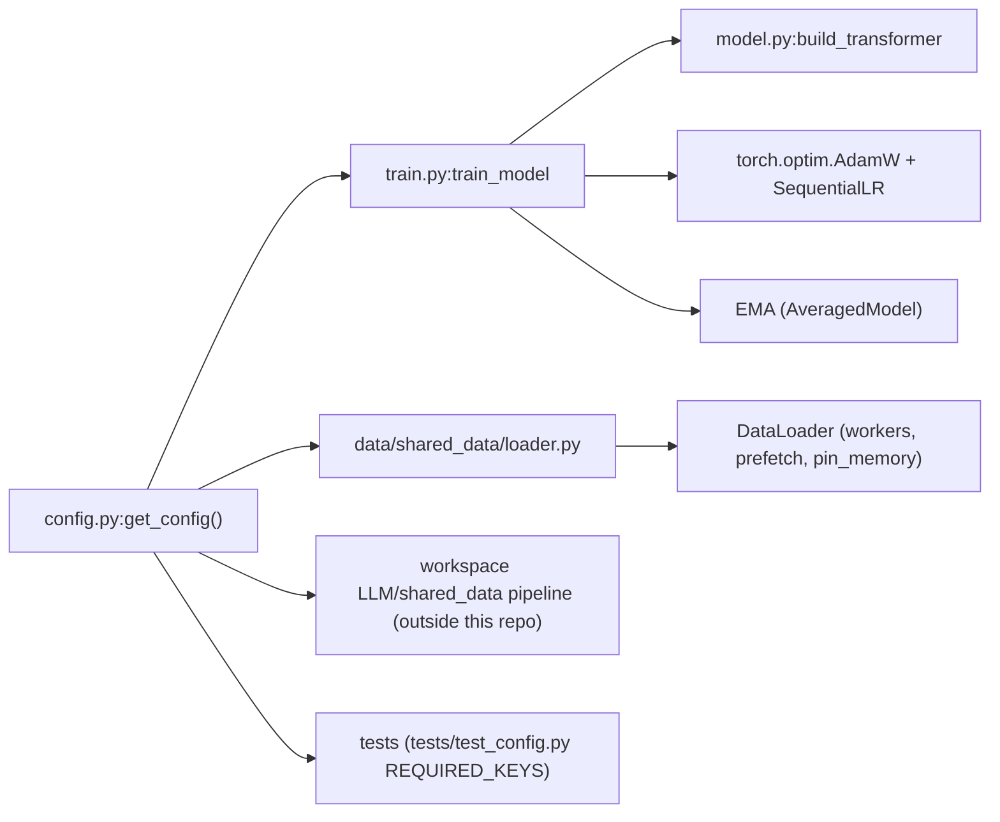

# LLaMA-3-Lite — Model, RoPE, and Config Reference

> Audience: intermediate (ML practitioners who can read PyTorch). This is the consolidated code-keyed reference for the model architecture, the rotary position embedding implementation, and the training config. It merges the former `model.md` (the walkthrough of `model.py`), `rope.md` (the RoPE implementation deep dive), and `config.md` (every key in `config.py:get_config`). Concept theory lives in `docs/concepts/`; this file explains what the code does, in what order, with what shapes, and why each piece exists.

## Overview

`model.py` implements the entire LLaMA-3-Lite network: a decoder-only transformer with 515M parameters (128,000-token vocabulary, 16 layers, d_model 1024, 8 query heads / 4 KV heads, head_dim 128, SwiGLU FFN of width 4096, RoPE with theta 500,000). The file is organized bottom-up: small leaf modules (`RoPE`, `RMSNorm`), then `GroupedQueryAttention`, `SwiGLUFFN`, `DecoderBlock`, `Decoder`, and finally `Transformer` plus a `build_transformer` factory. Two loss functions live here too: `chunked_cross_entropy_with_z` (the reference implementation over materialized logits) and `chunked_head_cross_entropy_with_z` (the training path, which computes the 128k-wide LM head in `chunk_size`-row slices inside gradient checkpointing so the full `[196608, 128000]` logits tensor never exists). Three Triton kernels (rmsnorm, swiglu, cross-entropy) are optional drop-ins controlled by `*_impl` constructor arguments, each with a PyTorch fallback.

**RoPE** encodes the position of a token by **rotating** the query and key vectors of every attention head in 2-D planes, one plane per adjacent pair of features, each plane spinning at its own frequency. Two consequences fall out for free: (1) the attention score between two tokens depends only on their **relative** distance, not their absolute positions, and (2) the model can generalize to sequence lengths beyond what it saw in training — *length extrapolation* — because the rotation angles are well-defined for any integer position. In LLaMA-3-Lite the whole mechanism is one small `nn.Module`, `model.py:RoPE`, which precomputes the cos/sin tables once in `model.py:RoPE.__init__` and applies a single broadcast rotation in `model.py:RoPE.forward`. It has **no learnable parameters**: the frequency schedule is fixed by `theta = 500000.0` from `config.py:get_config`, exactly as LLaMA-3 uses it. The rotation is applied to Q and K only, after the per-head QK-norm and before Flash Attention 2, inside `model.py:GroupedQueryAttention.forward`.

**Config.** `config.py` is the single source of truth for the whole training run: model shape, optimizer and schedule, precision and memory engineering, the data pipeline, checkpointing, and W&B logging. `train.py:train_model` reads it directly, `data/shared_data/loader.py` reads the subset it needs, and `model.py:build_transformer` receives its architecture values as keyword arguments. The dict is a **contract with the test suite**: `tests/test_config.py::TestGetConfig.test_has_all_required_keys` fails if any declared key disappears, and `tests/test_config.py::TestGetConfig.test_no_extra_unknown_keys` fails if any undocumented key is added — so adding or removing a key is a deliberate, reviewed change. Roughly half the keys are load-bearing (they change numerics or memory), a handful are informational (they document intent or pass through to the workspace data pipeline outside this repo), and the defaults are tuned so that `python train.py` on a single A100 80GB "just works".

## Model Reference (model.py)

### File Overview and Module Map

| Symbol | Kind | Role |
|---|---|---|
| `model.py:RoPE` | class | Rotary position embeddings, precomputed cos/sin buffers, no learnable params |
| `model.py:RMSNorm` | class | RMS normalization with optional Triton fused path |
| `model.py:GroupedQueryAttention` | class | GQA: Q/K/V projections, QK-norm, RoPE, SDPA with `is_causal=True` |
| `model.py:SwiGLUFFN` | class | Fused gate+up projection, SiLU gating, optional Triton path |
| `model.py:DecoderBlock` | class | One transformer layer: pre-norm attention + pre-norm FFN residuals |
| `model.py:Decoder` | class | Stack of blocks + final RMSNorm |
| `model.py:Transformer` | class | Full model: embedding, decoder, untied LM head, weight init, param counting |
| `model.py:chunked_cross_entropy_with_z` | function | Reference CE + z-loss over an already-materialized logits tensor |
| `model.py:chunked_head_cross_entropy_with_z` | function | Memory-bounded LM head + CE + z-loss (the training path) |
| `model.py:build_transformer` | function | Factory with diagnostic parameter printing |

The module imports only PyTorch (`torch`, `torch.nn`, `torch.nn.functional`, `torch.utils.checkpoint.checkpoint`) and the three Triton entry points (`kernels/rmsnorm_triton.py:triton_rmsnorm`, `kernels/swiglu_triton.py:triton_swiglu`, `kernels/cross_entropy_triton.py:triton_chunked_cross_entropy_with_z`). The Triton kernels are described in [data-reference.md](data-reference.md); their theory in [data-and-kernels.md](../concepts/data-and-kernels.md).

### Block-by-Block Walkthrough

#### `RoPE` — rotary position embeddings

**Purpose.** Attention is permutation-invariant: without position information, the token at position 3 and the token at position 40 produce identical Q/K inner products. RoPE encodes position by rotating each head-dimension pair of the query and key vectors by an angle proportional to the absolute position, so that the Q·K inner product becomes a function of the *relative* offset `i − j`. The theory is in
[attention-and-positional.md](../concepts/attention-and-positional.md); the
implementation deep-dive is [§ RoPE Implementation Deep Dive](#rope-implementation-deep-dive) below.

**Constructor (`model.py:RoPE.__init__`).** With `head_dim=128`, `max_seq_len=2048`, `theta=500000.0`:

- `inv_freq[i] = 1 / theta^(2i / head_dim)` for `i` in `0..63` — 64 frequency
  constants, geometrically spaced. The high `theta=500k` slows the rotation schedule (LLaMA 3's long-context choice; the AGENTS.md hard rule).
- `cos_cached`, `sin_cached` = `cos/sin(t ⊗ inv_freq)` for `t = 0..2047`,
  shaped `[1, 1, 2048, 64]`. These are registered as **buffers** — persistent in `state_dict` but with zero gradient and zero parameter count.

**Forward (`model.py:RoPE.forward`).** Given `x` of shape `[B, n_heads, S, head_dim]` and a `seq_len`:

1. Slice the cached tables to `[1, 1, seq_len, 64]` — buffers are
   precomputed up to `max_seq_len`, so any shorter sequence is a cheap view.
2. Split `x` into even-indexed elements `x[..., ::2]` and odd-indexed
   `x[..., 1::2]` (`x1`, `x2`).
3. Apply the 2D rotation per pair:
   `stack([x1·cos − x2·sin, x1·sin + x2·cos], dim=-1)` and `flatten(-2)` back to `[B, n_heads, S, head_dim]`.

Because each pair is rotated by an orthogonal matrix, the norm of every vector is preserved (`tests/test_model.py::TestRoPE::test_rotation_is_orthogonal`), position 0 is the identity (`test_position_zero_is_identity`), and the relative-position property holds (`test_relative_position_property`). RoPE is applied to Q and K only — never to V.

#### `RMSNorm` — root mean square normalization

**Purpose.** Pre-normalization keeps residual-stream gradients stable; RMS normalization drops LayerNorm's mean-subtraction, which costs one reduction pass and matters at this scale. Theory:
[architecture-components.md](../concepts/architecture-components.md).

**Constructor (`model.py:RMSNorm.__init__`).** One learnable scale `self.weight = ones(d_model)`, `eps=1e-5`, and an `impl` string (`"pytorch"` default, `"triton"` opt-in).

**Forward (`model.py:RMSNorm.forward`).** The reference path is exactly

$$x \odot \frac{1}{\sqrt{\frac{1}{d}\sum_{i=1}^{d} x_i^2 + \epsilon}} \odot w$$

implemented as `x * torch.rsqrt(x.pow(2).mean(dim=-1, keepdim=True) + eps) * weight`. When `impl == "triton"`, the module first tries `kernels/rmsnorm_triton.py:triton_rmsnorm`; on `ImportError`/`ValueError` (triton missing — the norm on Mac/CPU dev boxes) it prints a one-time fallback notice (guarded by `_triton_fallback_warned`) and takes the PyTorch path. There is no mean subtraction anywhere: the normalization constant is the RMS of the row, not its standard deviation.

#### `GroupedQueryAttention` — GQA with QK-norm and SDPA

**Purpose.** With 8 query heads and 4 KV heads (`n_rep = 8/4 = 2`), the KV projections and the KV cache are half the size of full MHA. Theory:
[attention-and-positional.md](../concepts/attention-and-positional.md).

**Constructor (`model.py:GroupedQueryAttention.__init__`).** Four bias-free `nn.Linear`s:

| Projection | Weight shape | Rows it produces |
|---|---|---|
| `q_proj` | `[8·128, 1024] = [1024, 1024]` | 8 query heads × 128 |
| `k_proj` | `[4·128, 1024] = [512, 1024]` | 4 KV heads × 128 |
| `v_proj` | `[4·128, 1024] = [512, 1024]` | 4 KV heads × 128 |
| `out_proj` | `[1024, 8·128] = [1024, 1024]` | projects attention output back to d_model |

If `qknorm=True` (the default), `q_norm` and `k_norm` are `RMSNorm(head_dim=128)` — per-head normalization applied *after* projection and *before* RoPE (Qwen2/Gemma2 placement; it bounds attention-logit growth late in training). If `qknorm=False` they become `nn.Identity()`. `self.rope = RoPE(head_dim, max_seq_len, rope_theta)`.

**Forward (`model.py:GroupedQueryAttention.forward`)** — note the signature is `forward(self, x)` with **no mask parameter**: causality is expressed solely through SDPA's `is_causal=True` flag.

1. `q = q_proj(x).view(B, S, 8, 128)`; `k`, `v` likewise with 4 heads. The
   `view` keeps the token axis second so the subsequent RMSNorm operates on the last axis (`head_dim`), which is what the per-head norm needs.
2. `q = q_norm(q)`, `k = k_norm(k)` — QK-norm here, on `[B, S, n_heads, head_dim]`.
3. `transpose(1, 2)` gives `[B, 8, S, 128]` for Q and `[B, 4, S, 128]` for K/V.
4. `q = rope(q, S)`, `k = rope(k, S)` — position information enters.
5. GQA expansion: `k`/`v` are broadcast `expand(B, 4, 2, S, 128).reshape(B, 8, S, 128)` —
   a strided-view trick, no memory copy.
6. `x = F.scaled_dot_product_attention(q, k, v, is_causal=True)` — PyTorch's
   fused SDPA, which dispatches to the Flash Attention 2 kernel on CUDA (O(S) memory instead of an O(S²) attention matrix). The causal flag means token `i` attends only to `0..i`; `tests/test_model.py::TestGroupedQueryAttention::test_causality` enforces this by perturbing the last token and checking earlier outputs are unchanged.
7. `x.transpose(1, 2).contiguous().view(B, S, -1)` then `out_proj(x)` →
   `[B, S, 1024]`.

#### `SwiGLUFFN` — gated feed-forward network

**Purpose.** The FFN does the per-token nonlinear computation; SwiGLU gates the hidden activation so each token can modulate *how much* of the up-projected value passes through. Theory:
[architecture-components.md](../concepts/architecture-components.md).

**Constructor (`model.py:SwiGLUFFN.__init__`).** `gate_up_proj` is one `nn.Linear(d_model, 2·d_ff)` — weight `[8192, 1024]` — fusing what LLaMA calls `gate_proj` and `up_proj` into a single matmul (one Tensor-Core-friendly GEMM instead of two). `down_proj` is `nn.Linear(d_ff, d_model)` — weight `[1024, 4096]`.

**Forward (`model.py:SwiGLUFFN.forward`).**

$$x \mapsto \text{down\_proj}\big(\text{SiLU}(xW_{\text{gate}}) \odot xW_{\text{up}}\big)$$

With `swiglu_impl="pytorch"`: `gate, up = gate_up.chunk(2, dim=-1)`, then `down_proj(F.silu(gate) * up)`. With `swiglu_impl="triton"`: the module calls `kernels/swiglu_triton.py:triton_swiglu(gate_up, d_ff)` — one fused elementwise kernel that computes SiLU, gating and splitting in a single launch — falling back to PyTorch on `ImportError`/`ValueError` with a one-time warning. The fusion equivalence is tested by `tests/test_model.py::TestSwiGLUFFN::test_fused_equals_unfused_reference`.

#### `DecoderBlock` — one transformer layer

**Constructor (`model.py:DecoderBlock.__init__`).** Wires one `GroupedQueryAttention`, one `SwiGLUFFN`, and two d_model-wide `RMSNorm`s (`attention_norm`, `ffn_norm`), threading `qknorm`, `rmsnorm_impl`, and `swiglu_impl` through.

**Forward (`model.py:DecoderBlock.forward`).** Pre-norm residual layout:

```python
# illustrative
x = x + self.attention(self.attention_norm(x))   # attention sub-block
x = x + self.ffn(self.ffn_norm(x))               # FFN sub-block
return x
```

Normalize first, transform, then add back to the unchanged residual stream. The residual path is an identity map, so gradients flow through the stack without vanishing through 16 nonlinearities.

#### `Decoder` — the layer stack

**Constructor (`model.py:Decoder.__init__`).** Holds the `nn.ModuleList` of 16 `DecoderBlock`s and the final `RMSNorm(d_model, eps=rms_norm_eps)`.

**Forward (`model.py:Decoder.forward`).** Loops the blocks in order, then applies the final norm once:

```python
# illustrative
for layer in self.layers:
    x = layer(x)
return self.norm(x)
```

The final norm is what the LM head reads; it is part of `Decoder` (not of `Transformer`) because the gradient-checkpointing path in `model.py:Transformer.forward` interacts with it (see below).

#### `Transformer` — the full model

**Constructor (`model.py:Transformer.__init__`).**

- `input_embedding = nn.Embedding(vocab_size, d_model)` — weight `[128000, 1024]`.
- 16 `DecoderBlock`s in a `ModuleList`, wrapped in a `Decoder`.
- `output_proj = nn.Linear(d_model, vocab_size)` — weight `[128000, 1024]`,
  **untied**: a separate matrix from the input embedding, so the LM head is a full 131M parameters of its own (no weight tying).
- `gradient_checkpointing` is stored as a plain flag. Per the in-code note,
  the enable/disable setters were removed — the flag is fixed at construction time and never toggled at runtime.
- `_init_weights()`: every `nn.Linear` and `nn.Embedding` weight is drawn
  from `normal_(0, 0.02)`. RMSNorm scales stay at 1.0; RoPE has no parameters.

**Forward (`model.py:Transformer.forward`).**

```python
# illustrative
x = self.input_embedding(x)                       # [B, S] -> [B, S, 1024]
if self.gradient_checkpointing and self.training:
    for layer in self.decoder.layers:
        x = checkpoint(layer, x, use_reentrant=False)
else:
    x = self.decoder(x)                           # layers + final norm
if return_hidden:
    return x
return self.output_proj(x)                        # [B, S, 128000]
```

- `return_hidden=True` returns the final hidden states instead of logits —
  this is the training contract: `train.py` calls `model(ids, return_hidden=True)` and feeds the hidden states to `chunked_head_cross_entropy_with_z` (see the chunked-losses section; the loop is documented in
  [training.md](../training.md)).
- The gradient-checkpointing branch wraps each layer in
  `torch.utils.checkpoint.checkpoint(layer, x, use_reentrant=False)` so layer inputs are discarded and recomputed during backward (theory:
  [training-and-memory.md](../concepts/training-and-memory.md)). Two
  subtleties worth knowing:

  1. The branch fires only when `self.training` is true. In eval mode a
     checkpoint-enabled model takes the `else` branch and runs normally.
  2. The checkpointed loop applies `decoder.norm` explicitly after the
     layers (`x = self.decoder.norm(x)`), so training and eval apply the final RMSNorm identically — a fix for the earlier behavior where the checkpointed branch bypassed it. `tests/test_model.py::TestTransformerForward::test_gradient_checkpointing_matches_normal` exercises both models in eval mode, where the two paths coincide.

**Parameter counting (`model.py:Transformer.get_num_params`).** Sums `p.numel()` over all parameters; with `non_embedding=True` (default) it subtracts both `input_embedding.weight.numel()` and `output_proj.weight.numel()`. Buffers (RoPE cos/sin, `inv_freq`) are not parameters and never counted. The definition is pinned by `tests/test_model.py::TestTransformerParamCount::test_get_num_params_definition_mismatch`, which asserts `get_num_params(non_embedding=True) == total − embedding − head`.

### The Chunked Losses: Reference vs. Training Path

The vocabulary projection is the memory bottleneck of the whole model. At the training batch of `B=96, S=2048` there are $N = 96 \times 2048 = 196{,}608$ tokens, so a materialized logits tensor would be

$$196{,}608 \times 128{,}000 = 25.17 \times 10^9 \text{ elements} = \begin{cases} 50.3 \text{ GB (BF16)} \\ 100.7 \text{ GB (FP32)} \end{cases}$$

which exceeds the A100's 80 GB. Two functions in `model.py` exist because there are two different problems: *where* the FP32 loss chain is bounded, and *whether the logits tensor exists at all. Full derivation:
[training-and-memory.md](../concepts/training-and-memory.md).

#### `chunked_cross_entropy_with_z` — the reference implementation

Signature (real, from source):

```python
chunked_cross_entropy_with_z(logits, targets, chunk_size=256, ignore_index=-100,
                             z_loss_weight=1e-4, cross_entropy_impl="pytorch")
```

This function **receives the full logits tensor already materialized** — it is the reference and the numerical ground truth used by the equivalence tests; its docstring explicitly says to prefer the head-chunked variant when the logits themselves would not fit in memory. It chunks along the token axis so the FP32 upcast chain never sees more than `chunk_size` rows at once. Per chunk (`model.py:chunked_cross_entropy_with_z` loop):

- `cl = logits[start:end].float()` — one FP32 upcast shared by CE and
  logsumexp (a single precision promotion, not two).
- `mask = ct != ignore_index`; ignored positions are excluded from **both**
  the CE mean and the z-loss mean.
- `log_z = logsumexp(cl, -1)`; accumulate `log_z[mask].pow(2).sum()` and the
  mask count — this is the masked z-loss (PaLM/Gemma2 logit-growth penalty).
- `ce = F.cross_entropy(cl, ct, ignore_index=ignore_index, reduction='none')`;
  accumulate `ce[mask].sum()` and the count.

After the loop:

$$\mathcal{L} = \frac{\sum_{\text{valid}} \text{CE}}{\text{count}} + z\_loss\_weight \cdot \frac{\sum_{\text{valid}} \log z^2}{\max(n_z, 1)}$$

with the `max(…, 1)` guards protecting against an all-ignored batch. `cross_entropy_impl="triton"` swaps the whole per-chunk loop for `kernels/cross_entropy_triton.py:triton_chunked_cross_entropy_with_z` (fused online-softmax kernel; falls back to PyTorch with a printed warning). Equivalence with `F.cross_entropy` plus a `weight·mean(log_z²)` penalty is pinned at 1e-5 by `tests/test_model.py::TestChunkedCrossEntropyWithZ::test_matches_ce_plus_zpen_reference`, and ignore-index masking by `test_z_loss_ignores_ignore_index_positions`.

#### `chunked_head_cross_entropy_with_z` — the training path

Signature (real, from source):

```python
# illustrative
chunked_head_cross_entropy_with_z(hidden, head_weight, targets, chunk_size=256,
                                  ignore_index=-100, z_loss_weight=1e-4,
                                  cross_entropy_impl="pytorch")
```

This is what `train.py` uses for the training, warmup, and validation losses (`train.py` call sites, with `_head_weight(model)` resolving the LM head through EMA/compile wrappers). It never materializes the full logits tensor:

1. The input is the **hidden states** `[196608, 1024]` (flattened from
   `[96, 2048, 1024]` by the caller) plus the head weight `[128000, 1024]`.
2. For each `chunk_size`-row slice it runs
   `checkpoint(_chunk, hidden[start:end], head_weight, targets[start:end], use_reentrant=False)` where `_chunk` computes `logits = F.linear(hidden_c, w)` — the per-chunk LM head — then the same FP32 CE + masked-z chain as the reference above.
3. Because each chunk runs inside `torch.utils.checkpoint`, only one chunk's
   logits are alive at a time: `[256, 128000]` = 65.5 MB BF16 / 131 MB FP32, instead of the 50.3 GB full tensor. With 196,608 tokens the loop runs exactly 768 chunks. This is the ~0.3 GB loss-memory bound the docstring claims (131 MB FP32 chunk × the handful of tensors the checkpoint keeps alive). Gradients flow to both `hidden` and `head_weight` — proven by `tests/test_model.py::TestChunkedHeadCrossEntropyWithZ::test_gradients_flow_to_hidden_and_head` (the head gets a grad, and the *embedding* gets a grad, which proves flow through the non-leaf hidden tensor).
4. Results are accumulated as sums (`total_ce`, `total_count`, `z_accum`,
   `n_z`) and averaged at the end — so the chunked result is **exactly** equal to the dense loss, not an approximation (`test_matches_dense_ce_plus_z` asserts equality at 1e-5 with `z_loss_weight=1e-4`).

The Triton variant differs: with `cross_entropy_impl="triton"` and triton importable (`HAS_TRITON`), each chunk returns the fused kernel's scalar loss and the per-chunk losses are *averaged* — exact only because the chunks are equal-sized (256 divides 196,608). The averaging branch is documented in the function docstring.

**Why two functions?** `chunked_cross_entropy_with_z` bounds the FP32 loss chain but still requires the caller to own a full logits tensor; it is the reference implementation that the numerical-equivalence tests compare against. `chunked_head_cross_entropy_with_z` additionally bounds the logits themselves, which is what makes training at batch 96 fit in 80 GB. The CE chunk size is a config knob (`config.py:get_config` → `ce_chunk_size: 256`); the [Config Reference](#config-reference-configpyget_config) below documents the knob, [troubleshooting.md](../guides/troubleshooting.md) the OOM symptoms of raising it.

### `build_transformer` — Factory and Diagnostics

`model.py:build_transformer` is a thin, keyword-explicit factory:

```python
# illustrative
build_transformer(vocab_size=128256, d_model=1024, n_layers=16, n_heads=8,
                  n_kv_heads=4, head_dim=128, d_ff=4096, max_seq_len=2048,
                  rope_theta=500000.0, rms_norm_eps=1e-5,
                  gradient_checkpointing=False, qknorm=True,
                  rmsnorm_impl="pytorch", swiglu_impl="pytorch") -> Transformer
```

Note the default `vocab_size=128256` (the Meta Llama-3 tokenizer vocabulary), while production passes the config value `128000` from `config.py:get_config` (see [training.md](../training.md) for the `build_transformer` call site). After construction it prints the diagnostics that appear in every training log:

```
Total params: 513,840,128 (513.8M)
Non-embedding params: 251,696,128 (251.7M)
```

plus `Gradient checkpointing: ENABLED` when the flag is set, and a `Triton kernels active: rmsnorm, swiglu` line when either `*_impl` is `"triton"`. `total` is the plain parameter sum; `non_embed` uses `model.get_num_params(non_embedding=True)` (both embedding tables subtracted).

### End-to-End Tensor Shape Trace

The full data flow, from token ids to scalar loss, at the production shape `[96, 2048]`:



One decoder block in detail (per-token shapes after `B=96, S=2048`):

| Step | Operation | Output shape |
|---|---|---|
| 0 | input token ids | `[96, 2048]` int64 |
| 1 | `input_embedding` (`model.py:Transformer.forward`) | `[96, 2048, 1024]` |
| 2 | `attention_norm` (RMSNorm) | `[96, 2048, 1024]` |
| 3 | `q_proj` / `k_proj` / `v_proj` then `view` | Q `[96, 2048, 8, 128]`, K/V `[96, 2048, 4, 128]` |
| 4 | QK-norm `q_norm` / `k_norm` (per-head) | same shapes as step 3 |
| 5 | `transpose(1, 2)` + RoPE | Q `[96, 8, 2048, 128]`, K `[96, 4, 2048, 128]` |
| 6 | GQA expand (`n_rep=2`) | K/V `[96, 8, 2048, 128]` (view, no copy) |
| 7 | `F.scaled_dot_product_attention(..., is_causal=True)` | `[96, 8, 2048, 128]` |
| 8 | `transpose` + `contiguous().view` + `out_proj` | `[96, 2048, 1024]` |
| 9 | residual add | `[96, 2048, 1024]` |
| 10 | `ffn_norm` (RMSNorm) | `[96, 2048, 1024]` |
| 11 | `gate_up_proj` | `[96, 2048, 8192]` |
| 12 | `silu(gate) * up` (chunk to 2×4096, gate, multiply) | `[96, 2048, 4096]` |
| 13 | `down_proj` + residual add | `[96, 2048, 1024]` |
| 14 | final `decoder.norm` | `[96, 2048, 1024]` |
| 15 | `output_proj` (full path only) | `[96, 2048, 128000]` |
| 16 | loss (training path) | scalar FP32 |

Dtype note: the suite runs FP32 on CPU and BF16 on GPU (the conftest `dtype` fixture); in training, autocast downcasts matmuls to BF16 on CUDA while the loss chain upcasts per chunk to FP32 (see [training-and-memory.md](../concepts/training-and-memory.md)).

### Parameter Budget

Derived at the production config (`config.py:get_config`: `vocab_size=128000`, `d_model=1024`, `n_heads=8`, `n_kv_heads=4`, `head_dim=128`, `d_ff=4096`, `n_layers=16`). Every row is `numel` arithmetic; RoPE contributes 0 (buffers).

| Component | Formula | Params |
|---|---|---|
| `input_embedding` | 128,000 × 1024 | 131,072,000 |
| Per layer — attention: `q_proj` | 1024 × (8·128) = 1024×1024 | 1,048,576 |
| Per layer — `k_proj` | 1024 × (4·128) = 1024×512 | 524,288 |
| Per layer — `v_proj` | 1024 × 512 | 524,288 |
| Per layer — `out_proj` | (8·128) × 1024 | 1,048,576 |
| Per layer — `q_norm` + `k_norm` | 128 + 128 | 256 |
| Per layer — attention subtotal | | **3,145,984** |
| Per layer — `gate_up_proj` | 1024 × (2·4096) | 8,388,608 |
| Per layer — `down_proj` | 4096 × 1024 | 4,194,304 |
| Per layer — `attention_norm` + `ffn_norm` | 1024 + 1024 | 2,048 |
| Per layer — FFN subtotal | | **12,584,960** |
| Per layer — block total | 3,145,984 + 12,584,960 | **15,730,944** |
| 16 blocks | × 16 | 251,695,104 |
| Final `decoder.norm` | 1024 | 1,024 |
| **Non-embedding total** | `get_num_params(non_embedding=True)` | **251,696,128 (251.7M)** |
| `output_proj` (untied head) | 1024 × 128,000 | 131,072,000 |
| **Grand total** | 131,072,000 × 2 + 251,696,128 | **513,840,128 (513.8M)** |

Two numbers to keep straight: the exact derived totals above, and the README's headline approximations `~515M` / `~252M`, which `tests/test_model.py::TestTransformerParamCount::test_full_model_total_params` and `test_get_num_params_definition_mismatch` check within a 1% tolerance — the README rounds the verified 513,840,128 total and 251,696,128 non-embedding counts to two significant figures. The budget structure is worth internalizing: embeddings + untied head are 131M × 2 = 262M (51% of the model), the 16 blocks 251.7M, of which the FFN (`gate_up_proj` + `down_proj`) is 12.58M per block — 80% of each block's weights. QK-norm costs 256 params per layer (16 × 128 × 2), pinned by `tests/test_model.py::TestQKNorm::test_param_count_increases_when_enabled`.

### Design Decisions and Pitfalls

- **Untied embeddings.** The input embedding and the LM head are separate
  `[128000, 1024]` matrices. Weight tying would save 131M params and is a common small-model trick, but this model deliberately does not do it (config has no `tie_embeddings` key) — the 513.8M figure includes both.
- **No mask parameter in attention.** `model.py:GroupedQueryAttention.forward`
  takes only `x`; causality comes from `is_causal=True` inside SDPA. A stale `mask=None` argument in earlier walkthroughs does not exist in the current code.
- **Gradient checkpointing applies the final norm explicitly.** The
  checkpointed branch of `model.py:Transformer.forward` calls `self.decoder.norm(x)` after the layer loop, matching the non-checkpointed path. (Historical note: an earlier version of the loop bypassed the final RMSNorm in training; the equivalence test now covers both modes.)
- **Chunk-averaging in the Triton head loss.** The triton variant of
  `chunked_head_cross_entropy_with_z` averages per-chunk losses; this equals the dense loss only because 256 divides 196,608 evenly. A non-divisor `ce_chunk_size` would introduce a small bias in the triton path (the PyTorch path stays exact via sum/count accumulation).
- **Ignore-index semantics.** Training uses `ignore_index=-100` (no padding;
  EOS separators must stay learnable) and both losses exclude ignored tokens from CE *and* z-loss means — z-loss masking is pinned by `tests/test_model.py::TestChunkedCrossEntropyWithZ::test_z_loss_ignores_ignore_index_positions`.
- **Triton is opt-in with silent-ish fallback.** Each kernel path guards on
  `ImportError`/`ValueError`; RMSNorm and SwiGLU warn once per module, the CE function prints per call. On Mac/CPU nothing breaks, it just runs eager PyTorch. See [data-reference.md](data-reference.md) and
  [data-and-kernels.md](../concepts/data-and-kernels.md).

## RoPE Implementation Deep Dive

The reference companion to the theory doc
[attention-and-positional.md](../concepts/attention-and-positional.md). This
section walks the exact `RoPE` implementation in `model.py:RoPE`, derives every number at this project's scale (head_dim 128, max_seq_len 2048, batch 96, 16 layers), and explains the design decisions around it. The general theory — why positions at all, the three position-encoding families, NTK/YaRN extensions — lives in the theory doc; this section cross-links instead of duplicating.

### Why Position Information is Needed

A vanilla attention layer computes

$$\text{Attention}(Q, K, V) = \operatorname{softmax}\!\left(\frac{Q K^\top}{\sqrt{d_k}}\right) V .$$

The dot product $q \cdot k$ depends only on the **content** of the two vectors, not on *where* they appear in the sequence. Permute the input sequence and the outputs permute identically: the layer cannot tell `"the cat sat"` from `"sat cat the"`. Language is order-dependent — "the dog bit the man" and "the man bit the dog" share every word — so the model must be told where each token sits.

Three things matter:

- **Order** — which token came first.
- **Distance** — how far apart two tokens are.
- **Relative position** — "the verb is two words after the subject", not
  "the verb is at position 17".

Position encodings inject this information. The full landscape of how to do that — absolute additive (sinusoidal/learned), relative additive (T5/ALiBi), and rotary — is covered in [attention-and-positional.md](../concepts/attention-and-positional.md); here we implement the rotary family.

### What RoPE Does, Intuitively

Picture each head's query/key vector of length `head_dim` as a sequence of `head_dim / 2` **independent 2-D points**:

```
x = [x0, x1, x2, x3, x4, x5, ..., x_{D-2}, x_{D-1}]
      |--|  |--|  |--|        |------|
     plane0 plane1 plane2     plane D/2-1
```

RoPE rotates each of those 2-D points by an angle proportional to the token's absolute position $m$:

```
RoPE(x, m) = [ R(m·ω0)·[x0, x1],  R(m·ω1)·[x2, x3],  ...,  R(m·ω_{D/2-1})·[x_{D-2}, x_{D-1}] ]
```

where $R(\phi) = \begin{bmatrix} \cos\phi & -\sin\phi \\ \sin\phi & \cos\phi \end{bmatrix}$ is the standard 2-D rotation matrix.

Different planes spin at **different frequencies** $\omega_i$, so the rotated vector carries a multi-scale "fingerprint" of position: fast planes encode fine-grained nearby-token offsets, slow planes encode long-range structure.



For `head_dim = 128` the spectrum spans from 1 radian per token (a full turn every $2\pi \approx 6.3$ tokens) down to $2.46\times 10^{-6}$ radians per token (a full turn every ~2.56M tokens) — roughly **six orders of magnitude** of timescales.

### The Mathematical Foundation

#### The 2-D rotation

For a single 2-D point $(x_{2i},\, x_{2i+1})$ at position $m$, RoPE applies:

$$\begin{bmatrix} x'_{2i} \\ x'_{2i+1} \end{bmatrix} =
\begin{bmatrix} \cos(m\,\omega_i) & -\sin(m\,\omega_i) \\ \sin(m\,\omega_i) & \cos(m\,\omega_i) \end{bmatrix}
\begin{bmatrix} x_{2i} \\ x_{2i+1} \end{bmatrix}$$

i.e. $x'_{2i} = x_{2i}\cos\phi_i - x_{2i+1}\sin\phi_i$ and $x'_{2i+1} = x_{2i}\sin\phi_i + x_{2i+1}\cos\phi_i$ with $\phi_i = m\,\omega_i$. This is exactly the arithmetic in `model.py:RoPE.forward`:

```python
# illustrative
x1, x2 = x[..., ::2], x[..., 1::2]                      # x1 = even features, x2 = odd features
rotated = torch.stack([x1 * cos - x2 * sin,             # x'_{2i}   = x_{2i} cos - x_{2i+1} sin
                       x1 * sin + x2 * cos], dim=-1)    # x'_{2i+1} = x_{2i} sin + x_{2i+1} cos
return rotated.flatten(-2)
```

#### Inverse frequencies

The frequencies $\omega_i$ follow a geometric schedule over the head:

$$\omega_i = \theta_{\text{base}}^{-2i / \text{head\_dim}}, \qquad i = 0, 1, \dots, \tfrac{\text{head\_dim}}{2}-1$$

`model.py:RoPE.__init__` builds the inverse frequencies in one line:

```python
inv_freq = 1.0 / (theta ** (torch.arange(0, head_dim, 2).float() / head_dim))
```

Unpacking for `head_dim = D`:

- `torch.arange(0, D, 2).float()` → `[0, 2, 4, ..., D-2]` (shape `[D/2]`)
- `/ D` → `[0, 2/D, 4/D, ..., (D-2)/D]`
- `theta ** (...)` → `[θ^0, θ^{2/D}, θ^{4/D}, ..., θ^{(D-2)/D}]`
- `1.0 / (...)` → `[θ^0, θ^{-2/D}, θ^{-4/D}, ..., θ^{-(D-2)/D}]`

So `inv_freq[i] = θ^{-2i/D} = ω_i`, exactly the schedule above. Note these are **frequencies** (radians per token position), not wavelengths; a smaller value means a slower spin. Because the exponent `2i/D` increases with `i`, `inv_freq` is strictly decreasing — `tests/test_model.py::TestRoPE.test_inv_freq_monotonic` asserts exactly that (`inv_freq[:-1] > inv_freq[1:]` elementwise).

#### The angle matrix

The per-plane angle at position $m$ is $m \cdot \omega_i$, which is one row of an **outer product** between the position vector and the inverse frequencies:

```
            ω0         ω1        ...    ω_{D/2-1}
m=0    [    0          0         ...       0       ]
m=1    [   ω0         ω1         ...    ω_{D/2-1}  ]
m=2    [  2ω0        2ω1         ...   2ω_{D/2-1}  ]
...
```

`model.py:RoPE.__init__` materializes this matrix for every position up to `max_seq_len`:

```python
# illustrative
t = torch.arange(max_seq_len).float()        # positions [0, 1, ..., max_seq_len-1]
freqs = torch.outer(t, inv_freq)             # [max_seq_len, D/2]; freqs[m, i] = m * ω_i
self.register_buffer('cos_cached', freqs.cos().unsqueeze(0).unsqueeze(0))
self.register_buffer('sin_cached', freqs.sin().unsqueeze(0).unsqueeze(0))
```

#### Why `unsqueeze(0).unsqueeze(0)`?

`freqs.cos()` has shape `[S, D/2]` where `S = max_seq_len`. The two unsqueezes push it to `[1, 1, S, D/2]` so it broadcasts against an input of shape `[B, H, S, D/2]` (batch, head). The leading singleton dims align the cache with the `[B, H, S, D]` layout that attention uses after the transpose in `model.py:GroupedQueryAttention.forward`.

### The Relative-Position Property (The Big Payoff)

The reason to build all this machinery is one identity. Let $R(\phi)$ be the 2-D rotation and $q_i, k_i$ the $i$-th 2-D block of $q, k$. The attention score between position $m$ and position $n$ is

$$\langle \mathrm{RoPE}(q, m),\, \mathrm{RoPE}(k, n) \rangle
= \sum_i \langle R(m\,\omega_i)\, q_i,\; R(n\,\omega_i)\, k_i \rangle
= \sum_i \langle q_i,\; R((n - m)\,\omega_i)\, k_i \rangle .$$

The second equality uses two facts about rotation matrices:

- $R(\alpha)^\top = R(-\alpha)$ (rotations are orthogonal),
- $R(-\alpha)\,R(\beta) = R(\beta - \alpha)$ (rotations compose by angle
  addition).

The absolute positions $m$ and $n$ survive only through their **difference** $n - m$. The score depends on the relative offset alone:

$$\langle \mathrm{RoPE}(q,m), \mathrm{RoPE}(k,n) \rangle = g(q, k, m - n) .$$

**Consequence:** the model has no way to distinguish "token A is at position 7" from "token A is at position 107, exactly 100 tokens after B at position 7" — the attention score is identical in both cases. That is precisely the desired semantics: attention should be a function of **content** plus **relative distance**, not of absolute location.



The test `tests/test_model.py::TestRoPE.test_relative_position_property` checks a degenerate instance of this: the inner product of a fixed pair of orthogonal unit vectors placed at offsets `(0, 0)` and `(5, 5)` must be identical (both equal the unrotated inner product, since the rotation is applied to both arguments). A stronger, offset-varying version — that `⟨RoPE(q, 0), RoPE(k, d)⟩` equals `⟨RoPE(q, 5), RoPE(k, 5+d)⟩` for any content `q, k` — follows from the same algebra; the orthogonality of every plane is asserted directly by `tests/test_model.py::TestRoPE.test_rotation_is_orthogonal`.

### Frequency Schedule — Why `theta = 500000`

`theta` is the **base** of the geometric progression of frequencies: $\omega_i = \theta^{-2i/D}$. It is the single most load-bearing RoPE hyperparameter in this repo — `AGENTS.md` rule 5 states it as a hard rule: *RoPE θ=500K is load-bearing for long-context extrapolation; reducing it to 10K cuts context quality dramatically.* The value flows from `config.py:get_config` (`'rope_theta': 500000.0`) through `model.py:build_transformer` into every `GroupedQueryAttention`'s `model.py:GroupedQueryAttention.__init__`, which constructs the shared `RoPE(head_dim, max_seq_len, rope_theta)`.

#### What it controls

For a fixed plane index $i$, raising the base $\theta$ lowers $\omega_i$, which **lengthens the wavelength** $2\pi / \omega_i$. A larger base pushes every plane's turning point further out, so position information stays unambiguous over longer distances. LLaMA-3 chose 500,000 vs LLaMA-2's 10,000 — a 50× jump.

#### The spectrum at this project's scale (head_dim 128, theta 500000)

Derived from `inv_freq[i] = 500000^(-2i/128)`, with wavelength $\lambda_i = 2\pi / \omega_i$ and rotation over the training context $S = 2048$ (i.e. $2048 \cdot \omega_i$ radians):

| Plane $i$ | Features $(2i, 2i+1)$ | $\omega_i$ (rad/token) | Wavelength (tokens) | Rotation over 2048-token context |
|---|---|---|---|---|
| 0 | (0, 1) | 1.000 | 6.3 | 2048 rad ≈ **326 turns** |
| 1 | (2, 3) | 0.815 | 7.7 | 1668 rad ≈ 265 turns |
| 16 | (32, 33) | 0.0376 | 167 | 77.0 rad ≈ 12.3 turns |
| 32 | (64, 65) | 1.414e-3 | 4,443 | 2.90 rad ≈ 166° |
| 38 | (76, 77) | 4.133e-4 | 15,204 | 0.85 rad ≈ 48° |
| 63 | (126, 127) | 2.455e-6 | 2,559,196 | 5.0e-3 rad ≈ **0.29°** |

Derived facts worth internalizing:

- The **fastest** plane (index 0, $\omega_0 = 1$) turns 326 full rotations
  over the training context and rotates a full radian (~57°) per token position — adjacent tokens are maximally distinguishable in this plane.
- The **slowest** plane (index 63, $\omega_{63} = 2.455\times10^{-6}$)
  rotates only **0.29 degrees** over the entire 2048-token training context. It is effectively position-invariant during training — the headroom is what makes long-context extrapolation work. Over a 128K-token context it has still only turned 18.4°, less than a quarter turn, so no aliasing.
- Counting planes that rotate at least 1 radian over the training context:
  $\omega_i \ge 1/2048 \iff i \le \ln(2048)/(2\ln\theta \cdot 128^{-1}) \approx 37.2$, so planes 0–37 are informative within training while **26 of 64 planes (41%)** barely move at 2048 tokens. This is by design: those planes are reserved for longer contexts.
- Plane 32 has wavelength 4,443 tokens ≈ 2.2× the training context — the
  first plane whose full turn lands just outside what training ever saw.

For comparison, with LLaMA-2's $\theta = 10{,}000$ the slowest wavelength is $2\pi \cdot 10{,}000^{126/128} \approx 54{,}410$ tokens — 47× shorter than 2.56M — which is why the 50× base jump buys LLaMA-3 its long-context capability. Full derivation and the NTK/YaRN extension landscape live in
[attention-and-positional.md](../concepts/attention-and-positional.md).

### Implementation Walkthrough

`model.py:RoPE` is 17 lines and every one of them is doing real work. The full class, verbatim and runnable:

```python
# illustrative
import torch
import torch.nn as nn


class RoPE(nn.Module):
    """Rotary Position Embeddings with precomputed cos/sin buffers."""
    def __init__(self, head_dim: int, max_seq_len: int, theta: float = 500000.0):
        super().__init__()
        inv_freq = 1.0 / (theta ** (torch.arange(0, head_dim, 2).float() / head_dim))
        self.register_buffer('inv_freq', inv_freq)
        t = torch.arange(max_seq_len).float()
        freqs = torch.outer(t, inv_freq)
        self.register_buffer('cos_cached', freqs.cos().unsqueeze(0).unsqueeze(0))
        self.register_buffer('sin_cached', freqs.sin().unsqueeze(0).unsqueeze(0))

    def forward(self, x, seq_len: int):
        cos = self.cos_cached[:, :, :seq_len, :]
        sin = self.sin_cached[:, :, :seq_len, :]
        x1, x2 = x[..., ::2], x[..., 1::2]
        rotated = torch.stack([x1 * cos - x2 * sin, x1 * sin + x2 * cos], dim=-1)
        return rotated.flatten(-2)
```

#### Construction (`model.py:RoPE.__init__`)

| Step | Code | Output |
|---|---|---|
| 1 | `inv_freq = 1.0 / (theta ** (torch.arange(0, head_dim, 2).float() / head_dim))` | `[D/2]` float32, decreasing geometric schedule |
| 2 | `self.register_buffer('inv_freq', inv_freq)` | non-learnable buffer, follows device + state_dict |
| 3 | `t = torch.arange(max_seq_len).float()` | `[max_seq_len]` positions |
| 4 | `freqs = torch.outer(t, inv_freq)` | `[max_seq_len, D/2]` angle matrix, `freqs[m, i] = m·ω_i` |
| 5 | `freqs.cos().unsqueeze(0).unsqueeze(0)` (and `.sin()`) | `[1, 1, max_seq_len, D/2]` each, registered as buffers |

#### Forward (`model.py:RoPE.forward`)

| Step | Code | Output |
|---|---|---|
| 1 | `cos = self.cos_cached[:, :, :seq_len, :]` (and `sin`) | `[1, 1, S, D/2]` view, sliced to the actual sequence length |
| 2 | `x1, x2 = x[..., ::2], x[..., 1::2]` | two `[B, H, S, D/2]` strided views (even / odd features) |
| 3 | `torch.stack([x1*cos - x2*sin, x1*sin + x2*cos], dim=-1)` | `[B, H, S, D/2, 2]` — the rotation, all planes in parallel |
| 4 | `rotated.flatten(-2)` | `[B, H, S, D]` — interleaved back to the original layout |

#### Where the caller supplies `seq_len`

The `seq_len` argument is the **actual** input length, not `max_seq_len`: `model.py:GroupedQueryAttention.forward` unpacks `B, S, _ = x.shape` from the hidden state and calls `self.rope(q, S)` and `self.rope(k, S)`. In training `S == 2048 == max_seq_len`, so the slice in step 1 is a full-tensor view (a no-op); for shorter sequences (validation prompts, generation) only the first `S` cache rows are read. Slicing a tensor produces a view, so this costs no copy.

#### Placement in the attention pipeline

Inside `model.py:GroupedQueryAttention.forward`, the order is:

1. `q_proj`, `k_proj`, `v_proj` → `[B, S, n_heads*head_dim]` etc.
2. `view` into `[B, S, n_heads, head_dim]` (KV heads use `n_kv_heads`).
3. Per-head QK-norm `q_norm` / `k_norm` (RMSNorm over `head_dim`) —
   **before** the transpose, so the norm sees `head_dim` as the last axis.
4. `transpose(1, 2)` → `[B, n_heads, S, head_dim]`.
5. `q = self.rope(q, S)`, `k = self.rope(k, S)` — **V is not rotated**.
6. GQA replication (`expand` + `reshape`) for `n_rep = n_heads // n_kv_heads`.
7. `F.scaled_dot_product_attention(q, k, v, is_causal=True)`.

### Tensor Shape Trace

Concrete run with `head_dim = 8`, `max_seq_len = 5`, `batch = 2`, `heads = 3`, `seq_len = 4` (these are the shapes the CPU tests exercise via `tests/test_model.py::TestRoPE.test_buffer_shapes` and `test_rotation_is_orthogonal`, scaled up):

| Step | Tensor | Shape |
|---|---|---|
| 1 | `inv_freq` (after construction) | `[4]` |
| 2 | `t` (after construction) | `[5]` |
| 3 | `freqs` (after construction) | `[5, 4]` |
| 4 | `cos_cached`, `sin_cached` (after construction) | `[1, 1, 5, 4]` |
| 5 | `cos`, `sin` (sliced to `seq_len=4`) | `[1, 1, 4, 4]` |
| 6 | `x` (input from caller) | `[2, 3, 4, 8]` |
| 7 | `x1`, `x2` (even/odd split) | `[2, 3, 4, 4]` each |
| 8 | `rotated` (stack) | `[2, 3, 4, 4, 2]` |
| 9 | output (`flatten(-2)`) | `[2, 3, 4, 8]` |



Note that input and output have **identical shape and dtype**: RoPE is a pointwise, shape-preserving transformation. This is one of its nicest properties — it slots into any layer that already produces (or consumes) a `[B, H, S, D]` tensor, which is why `model.py:GroupedQueryAttention.forward` can insert it between the QK-norm transpose and the GQA expansion with no other shape bookkeeping.

### Why Even/Odd Pairing, Why `stack` + `flatten`

#### The choice of pairs

RoPE rotates **adjacent** pairs: $(x_0, x_1), (x_2, x_3), \dots$

1. **Contiguity** — adjacent features are contiguous in memory; the slices
   `x[..., ::2]` and `x[..., 1::2]` are strided **views**, so the split costs zero data movement.
2. **Independence** — pairs of distinct indices never share a feature, so
   rotating them independently cannot entangle them.
3. **Convention** — every mainstream RoPE implementation (RoFormer, GPT-NeoX,
   LLaMA) pairs the same way. The exact pairing is not mathematically critical as long as it is consistent, but matching the ecosystem's convention matters for weight compatibility.

#### Why `stack` + `flatten(-2)` instead of two strided writes?

The naive alternative is:

```python
# illustrative — the two-write formulation this code avoids
out_even = x1 * cos - x2 * sin    # [B, H, S, D/2]
out_odd  = x1 * sin + x2 * cos    # [B, H, S, D/2]
output = torch.empty_like(x)
output[..., ::2] = out_even       # strided scatter write
output[..., 1::2] = out_odd       # strided scatter write
```

The `stack` + `flatten(-2)` formulation:

- Allocates exactly **one** output tensor (the stack), instead of two scratch
  tensors plus a pre-allocated `output`.
- Avoids two non-contiguous scatter writes, which are slow on GPU.
- `flatten(-2)` is a **view** — it only changes the tensor metadata.
- Lets `torch.compile` fuse the entire rotation (split → four FMAs → stack)
  into a single kernel, and lets the stack itself fuse with the downstream consumer.

**Layout check** for `D = 4`, one plane, rotation angle $\phi$:

```
input pair:      (a, b)
stack:           [..., 0] = a·cosφ − b·sinφ        [..., 1] = a·sinφ + b·cosφ
after flatten:   output[0] = a·cosφ − b·sinφ        output[1] = a·sinφ + b·cosφ
```

The even-position features of the input stay at even positions of the output and odd at odd — the rotation happens **within each pair** while the interleaved layout is preserved, so downstream code sees an ordinary `[B, H, S, D]` tensor.

### Precomputed Buffers — Why `register_buffer`

#### Three ways to store constants in PyTorch

| Mechanism | Trainable? | In `state_dict()`? | Follows `.to(device)`? | Used here? |
|---|---|---|---|---|
| `nn.Parameter` | yes | yes | yes | no (would be learned) |
| plain attribute `self.x = tensor` | no | no | **no** (stranded on CPU) | no |
| `register_buffer` | no | yes | yes | **yes** |

`cos_cached`, `sin_cached` and `inv_freq` are:

- **Not learnable** — they are derived from `theta` and `head_dim`, not from
  data. `register_buffer` guarantees `requires_grad=False` (verified: the buffers expose `requires_grad == False` and never appear in `model.parameters()`).
- **Device-resident** — they must follow `.to(device)` with the rest of the
  model, or every forward would be a CPU↔GPU copy. Buffers move with the module.
- **Checkpointed** — a saved `state_dict()` must contain the exact cos/sin
  tables so a resumed run reproduces identical rotations. Buffers are saved alongside parameters.

`register_buffer` is the only mechanism that satisfies all three. Verified behavior: after `RoPE(...).half()` (or `.to(device=..., dtype=...)`), the buffers carry the new dtype and appear under the keys `inv_freq`, `cos_cached`, `sin_cached` in `state_dict()`.

#### One-time cost

The trig (`cos`, `sin`) is computed **once** at module construction; the forward pass never calls `torch.cos`/`torch.sin` — it only multiplies precomputed values. For `max_seq_len = 2048`, `head_dim = 128`:

- `cos_cached.numel() = 2048 × 64 = 131,072` floats = **512 KiB**.
- `sin_cached` same → **512 KiB**; `inv_freq` is negligible (64 floats).
- Total **~1 MiB** per RoPE module; at 16 layers (one RoPE per
  `model.py:DecoderBlock`, shared across all 8 query heads of that layer) that is **~16 MiB** of tables across the whole model — cheap.

### Applied to Q and K, but Not V

In `model.py:GroupedQueryAttention.forward` the rotation is applied to exactly two of the three projections:

```python
# illustrative
q = self.rope(q, S)
k = self.rope(k, S)
# v is deliberately not rotated
```

#### Why Q and K?

Attention scores are $Q K^\top$. The relative-position identity of §5 holds only when **both** vectors in the dot product are rotated:

$$\langle \mathrm{RoPE}(q,m),\, \mathrm{RoPE}(k,n) \rangle = g(q,k,m-n).$$

Rotating only one side leaves a residual absolute-position term in the score and breaks the clean relative semantics — the model would be able to (and would be forced to) memorize absolute positions, which hurts generalization to unseen lengths.

#### Why not V?

The value vector is what the scores **weight**:

$$\text{output}[i] = \sum_j \alpha_{ij}\, v[j] .$$

Position has already been baked into the weights via the rotated `q, k`; the values only need to carry content. Rotating `v` would add no information, waste the same compute as the Q/K rotations, and make the output's coordinate frame position-dependent in a way that complicates the residual stream for no benefit. LLaMA, GPT-NeoX and RoFormer all follow the rotate-Q-and-K-only convention.

### Interaction with GQA and Flash Attention 2



Three interactions worth spelling out:

1. **RoPE runs on the un-replicated KV heads.** With GQA, `n_kv_heads = 4`
   and `n_heads = 8` (`n_rep = 2`), so RoPE is applied to the 4 shared KV head vectors **before** the `expand`+`reshape` replication in `model.py:GroupedQueryAttention.forward`. All replicated copies therefore carry the identical rotation — one rotation pass per KV head instead of per query head, halving the K-side RoPE cost.
2. **FA2 is agnostic.** Flash Attention 2 sees two `[B, H, S, D]` tensors and
   computes the causal scaled dot-product; it does not care that Q/K were rotated. The relative-position property holds inside the flash kernel because it is a property of the inner product, not of the kernel.
3. **Orthogonality leaves the attention geometry intact.** Since every plane
   is an orthogonal transform, RoPE preserves the norms of q and k; the softmax logits are reshuffled by position but their scale is unchanged, so FA2's numerical behavior (e.g. its online-softmax rescaling) is unaffected. This is asserted directly by `tests/test_model.py::TestRoPE.test_rotation_is_orthogonal`.

The causality of the whole attention path (which RoPE never interferes with) is defended by `tests/test_model.py::TestGroupedQueryAttention.test_causality`.

### Length Extrapolation & Interpolation

#### What extrapolation means here

A model trained at `seq_len = 2048` asked to process `seq_len = 4096`: with **absolute** embeddings this usually fails — positions 2048–4095 were never seen and have no embedding. With **RoPE** it partially works, because the rotation angle $m \cdot \omega_i$ is well-defined for any integer $m$; the question is only whether the slowest planes have aliased by then.

At this project's scale: the slowest plane's wavelength is 2.56M tokens, so within any context up to ~2.56M tokens no plane completes a full turn that it has not already been "trained on" in some sense. In practice the well-behaved range is much shorter than the naive wavelength (the model must also generalize the *content* patterns), which is why long-context work typically adds fine-tuning — see
[attention-and-positional.md](../concepts/attention-and-positional.md) for
the NTK/YaRN extension landscape.

#### What the code does and does not do

- The cache is built for `max_seq_len` at construction time, so a forward
  with `S > max_seq_len` fails **loudly** (see the numerical-properties section) rather than silently degrading — the safe failure mode.
- There is **no KV-cache path** in `model.py:GroupedQueryAttention.forward`
  and **no position interpolation** implemented: training runs at `seq_len = 2048` with `theta = 500000` as-is. To extend context the module must be rebuilt with a larger `max_seq_len` (buffers are sized at construction), and long-context fine-tuning would optionally rescale the rotation angles.

#### Why `theta = 500000` is load-bearing

Reducing the base to 10,000 shrinks the slowest wavelength from 2.56M to 54.4K tokens (47×), so the plane-index-32 band — wavelength ~4.4K, already just past the training context — and everything slower aliases far sooner. This is why `AGENTS.md` rule 5 makes the value a hard rule: it is the difference between a 2K-trained model that can stretch toward 128K contexts and one whose long-range planes are mush beyond ~8K tokens.

### Gradient Flow Through RoPE

RoPE has **no learnable parameters** — the rotation coefficients are constants. All gradients pass through the rotation into the Q/K projections.

#### Backward of the rotation

For one plane with angle $\phi = m\,\omega_i$:

$$\begin{bmatrix} x'_1 \\ x'_2 \end{bmatrix} =
\begin{bmatrix} \cos\phi & -\sin\phi \\ \sin\phi & \cos\phi \end{bmatrix}
\begin{bmatrix} x_1 \\ x_2 \end{bmatrix}, \qquad
\begin{bmatrix} \frac{\partial L}{\partial x_1} \\[2pt] \frac{\partial L}{\partial x_2} \end{bmatrix} =
\begin{bmatrix} \cos\phi & \sin\phi \\ -\sin\phi & \cos\phi \end{bmatrix}
\begin{bmatrix} g_1 \\ g_2 \end{bmatrix},$$

where $(g_1, g_2)$ is the incoming gradient on the rotated pair. The backward matrix is the **transpose** of the forward rotation — itself a rotation by $-\phi$.

#### Implications for training

- **No vanishing/exploding gradients.** Every singular value of the forward
  and backward Jacobians is 1 (an orthogonal matrix), so the gradient norm is preserved exactly through the rotation: $\|\partial L/\partial x\| = \|\partial L/\partial x'\|\cdot$ `tests/test_model.py::TestRoPE.test_rotation_is_orthogonal` verifies the forward half of this contract.
- **Gradients reach the projections.** The rotation is applied after
  `q_proj`/`k_proj`, so $\partial L/\partial q$ flows back through the rotation into the projection weights uniformly across all positions.
- **No gradient through the schedule.** Because `cos_cached`/`sin_cached`
  are buffers, `theta` and `head_dim` are not (and cannot be) tuned by gradient descent — the schedule is a fixed design choice, asserted as a hard rule rather than a learned quantity.



### Numerical Properties & Edge Cases

#### Dtype of the cache and promotion

`inv_freq`, `freqs`, and the cos/sin tables are computed in **float32** (`torch.arange(...).float()`, `.cos()`, `.sin()`). Buffers do not auto-cast: `cos_cached` stays FP32 in storage regardless of autocast, and moves to whatever dtype the module is explicitly moved to (`.half()` / `.to(dtype=...)`). In the rotation itself, PyTorch binary-op promotion applies: `x1 * cos` with a BF16 `x1` and an FP32 `cos` promotes to FP32, so the rotation arithmetic never loses precision to the BF16 mantissa — a benign detail under the autocast path, and exact FP32 in the CPU test path (the `dtype` fixture is `torch.float32` on CPU, `bfloat16` only on GPU — see `tests/conftest.py:dtype`). Deeper autocast mechanics live in
[training-and-memory.md](../concepts/training-and-memory.md).

#### Position 0 is the identity

At $m = 0$, every angle is 0, so $\cos = 1$, $\sin = 0$ and the rotation is the identity:

$$\mathrm{RoPE}(x, 0) = x .$$

The first token of any sequence passes through unchanged — correct behavior (no "position 0 twist"), and asserted by `tests/test_model.py::TestRoPE.test_position_zero_is_identity`.

#### Adjacent positions are distinct

At $m = 1$ the fastest plane has already rotated 1 radian (~57°), so the second token is clearly separated from the first in the high-frequency planes — a 1-position offset produces a distinct fingerprint. Combined with the norm-preservation property, this guarantees the code cannot collapse positions 0 and 1 in any plane.

#### Sequence longer than `max_seq_len` — loud failure

`cos_cached[:, :, :seq_len, :]` with `seq_len > max_seq_len` does **not** index out of bounds: Python-style slicing clamps, returning the full `[1, 1, max_seq_len, D/2]` cache. The failure happens one step later, when that cache broadcasts against `x1` of shape `[B, H, S, D/2]` with `S > max_seq_len` — PyTorch raises a `RuntimeError` ("size of tensor a must match size of tensor b at non-singleton dimension 2"). Either way the model **crashes loudly rather than silently producing wrong outputs**; the mechanism is a broadcast mismatch, not an OOB read. To serve longer sequences, rebuild the module with a larger `max_seq_len`.

#### Odd `head_dim` — loud failure, not silent truncation

`torch.arange(0, head_dim, 2)` on an odd `head_dim` (e.g. 7) yields 4 even indices but `x[..., 1::2]` yields only 3 odd indices, so `x1` and `x2` have different final-dim sizes and the `stack` raises a `RuntimeError`. The implementation therefore does **not** silently drop the last feature (a behavior that would quietly corrupt every head); it fails at construction/ forward time. LLaMA-3-Lite uses `head_dim = 128`, even by construction (`config.py:get_config`), so this never fires in practice — but it is a guaranteed loud bug for anyone who changes the config to an odd value.

### Memory & Compute Cost

#### Compute

Per token, per head-vector, the rotation costs 4 multiplications and 2 additions per plane (counting each mul/add as one FLOP):

- Per vector: $64 \text{ planes} \times 6 = 384$ FLOPs ($640$ under the
  FMA-counts-as-2 convention).
- Per step: q has $B \cdot n\_heads \cdot S = 96 \cdot 8 \cdot 2048 =
  1{,}572{,}864$ vectors, k has $96 \cdot 4 \cdot 2048 = 786{,}432$ (GQA halves the K side; see the GQA interaction section). Per layer that is $(1.57M + 0.79M) \times 384 \approx 0.91$ GFLOPs; at 16 layers ≈ **14.5 GFLOPs per training step**.
- Compare with the total step cost of the model,
  $6 N B S = 6 \times 513.8\text{M} \times 196{,}608 \approx 606$ TFLOPs (forward + backward): RoPE is **~0.002% of step FLOPs** — effectively free. It is dwarfed by the projection matmuls (`O(B S D^2)` per linear).

#### Memory

- **No activation blow-up:** input and output have identical `[B, H, S, D]`
  shape; the stack allocates one tensor of the same size as `x`, and the split is view-only. Per layer at batch 96: q+k activation memory is dominated by the SDPA path, not by RoPE (see
  [training.md](../training.md)).
- **Cache reads:** each layer reads $2 \times S \times (D/2)$ floats
  (cos + sin, sliced to `S`): $2 \times 2048 \times 64 \times 4\text{B} = 1$ MiB per layer per forward. The tables themselves are 16 MiB total across the model (see the buffer section) and stay resident.
- **Gradient memory:** the rotation is differentiable with no saved state —
  autograd keeps only the (small) input/output tensors; the backward is computed from the FP32 cache, which is a constant.

#### Wall-clock

RoPE is a few elementwise FMAs plus one stack; on an A100 it is a rounding error next to the QKV projections and Flash Attention (tens of µs vs milliseconds per layer). It is not a bottleneck at any batch size this config can afford (see [training.md](../training.md) for the 92→20 GB derivation, which includes RoPE's ~1 MiB-per-layer tables as a line item).

### Common Pitfalls & How This Code Avoids Them

| Pitfall | What goes wrong | How this code avoids it |
|---|---|---|
| Rotating only Q or only K | Asymmetric rotation leaks absolute position into the score; relative property breaks | Both `q = self.rope(q, S)` and `k = self.rope(k, S)` in `model.py:GroupedQueryAttention.forward` |
| Rotating V | Wasted compute; position-dependent output frame | Only Q and K are passed to `self.rope` |
| Wrong pairing convention | Model silently incompatible with pretrained weights | Even/odd adjacent pairing, the standard convention |
| Recomputing `cos`/`sin` every forward | Massive wasted trig | `register_buffer` precomputes once |
| FP32 cache with BF16 forward | Precision loss or dtype surprise | Buffers stay FP32; binary-op promotion lifts the rotation to FP32 (verified); no downcast inside RoPE |
| Strided scatter writes (`x[..., ::2] = ...`) | Slow, non-contiguous GPU writes | `stack` + `flatten(-2)`; flatten is a view |
| One `inv_freq` per head | Breaks the uniform relative-position geometry | One shared `RoPE` per attention layer (built in `model.py:GroupedQueryAttention.__init__`), reused across all heads |
| Naive broadcasting | Shape mismatch | `unsqueeze(0).unsqueeze(0)` gives `[1, 1, S, D/2]` which broadcasts against `[B, H, S, D/2]` |
| Rotating the full `max_seq_len` cache for short inputs | Wasted bandwidth | `[:, :, :seq_len, :]` slice in `model.py:RoPE.forward`; slicing is a view |
| Forgetting `requires_grad=False` on the frequency tables | Schedule becomes learnable / optimizer picks it up | `register_buffer` guarantees non-learnable buffers, excluded from `parameters()` |
| Odd `head_dim` | Last feature silently dropped in some implementations | Loud `RuntimeError` from the `x1`/`x2` size mismatch (verified); config uses even `head_dim = 128` |
| `S > max_seq_len` | Silent truncation in some implementations | Loud broadcast `RuntimeError` (verified); cache is sized at construction |

## Config Reference (config.py:get_config)

Code-keyed walkthrough of every key in `config.py:get_config`, grouped by concern, with defaults, consumers, and a worked memory budget.

### How the config flows



Consumers mostly read through `config.get(key, default)` rather than `config[key]`, which is what lets tests inject a partial `tiny_config` (`tests/conftest.py`) and have everything fall back to sane values. The values below are the production defaults from `config.py:get_config` unless stated otherwise.

### Architecture group

These keys fix the model topology. They are consumed in `train.py:train_model` (passed positionally into `model.py:build_transformer`) and in the full-config model tests (`tests/test_model.py`). All are load-bearing: changing any of them changes the parameter count and the FLOPs at every step.

| Key | Default | Controls | Why | Consumed by |
|---|---|---|---|---|
| `d_model` | `1024` | Hidden width of the residual stream | Width of every projection; the "currency" of the transformer | `train.py:train_model` → `model.py:build_transformer` |
| `n_layers` | `16` | Number of `DecoderBlock`s | Depth; 16 layers × 1024-wide is the classic 500M-param regime | same |
| `n_heads` | `8` | Number of query heads | Attention parallelism; `8 × 128 = 1024 = d_model` | same |
| `n_kv_heads` | `4` | Number of KV heads (GQA) | KV projection width `4 × 128 = 512`, half of `d_model`; `n_rep = 8 / 4 = 2` | same |
| `head_dim` | `128` | Per-head width | Scales QK dot products (`÷ √128`); RoPE buffer shape | same |
| `d_ff` | `4096` | SwiGLU hidden width | `4× d_model`; fused `gate_up_proj` is `2·d_ff = 8192` wide | same |
| `vocab_size` | `128000` | Embedding / LM-head vocabulary | Floor on vocab: `real_vocab_size = max(vocab_size, len(tokenizer))` in `train.py:train_model`, so the real LLaMA-3 tokenizer (128,256) wins when loaded | `train.py:train_model`, `data/shared_data/loader.py:_SyntheticTokenizerStub` |
| `seq_len` | `2048` | Context window | RoPE buffer length; dataloader chunks are `seq_len + 1` (next-token shift); tokens/step `= batch × seq` | `model.py:RoPE`, `data/shared_data/loader.py:PackedDataset`, `train.py:train_model` |
| `rope_theta` | `500000.0` | RoPE base frequency | `inv_freq = 1 / θ^(2i/head_dim)`; high θ slows rotation so long-range positions stay resolvable — see [attention-and-positional.md](../concepts/attention-and-positional.md) | `model.py:RoPE` |
| `rms_norm_eps` | `1e-5` | RMSNorm epsilon | Prevents divide-by-zero in `x·rsqrt(mean(x²) + eps)`; note the QK-norm instances in `model.py:GroupedQueryAttention` hardcode `1e-5` rather than reading this key | `model.py:RMSNorm` via `model.py:DecoderBlock`, `model.py:Decoder` |

Parameter anatomy at these values (derived, consistent with `model.py:Transformer.get_num_params`):

- Input embedding: `128000 × 1024 = 131,072,000` (131.1M).
- Output projection: `1024 × 128000 = 131,072,000` (131.1M) — **untied** (see below).
- Per `DecoderBlock`: attention `3,145,728` (q/k/v/out: `1024² + 2·1024·512 + 1024²`) + QK-norm `256` + SwiGLU `12,582,912` (`1024·8192 + 4096·1024`) + two norms `2,048` = `15,730,944`.
- 16 blocks + final norm: `251,696,128` ≈ 251.7M non-embedding; total **513.8M** (the `llama3-515M` filename rounds this up).

**`tie_embeddings` is deliberately absent.** There is no weight sharing: `model.py:Transformer` builds `output_proj` as an independent `nn.Linear(d_model, vocab_size)`, so the LM head costs a full 131.1M parameters. Untied heads are standard for LLaMA-3-style models (the input and output embeddings live in different gradient regimes), but the cost is real — see [§ Model Reference (model.py)](#model-reference-modelpy) and
[attention-and-positional.md](../concepts/attention-and-positional.md).

### Training & optimizer group

| Key | Default | Controls | Why | Consumed by |
|---|---|---|---|---|
| `batch_size` | `96` | Micro-batch (tokens per step `= 96 × 2048 = 196,608`) | Sized so that 96×2048×1024 activations + BF16 fit one A100 80GB | `train.py:train_model`, `data/shared_data/loader.py:build_training_data` |
| `gradient_accumulation` | `1` | Number of micro-batches per optimizer step | Set >1 to emulate a larger batch on smaller GPUs; loss is divided by it and the optimizer steps only on `(step+1) % grad_accum == 0` | `train.py:train_model`, `train.py:save_checkpoint` (tokens_seen math) |
| `max_steps` | `42000` | Total optimizer steps | 42K × 196,608 tokens/step = **8.26B tokens** consumed, slightly over the 8B corpus — see the interaction note below | `train.py:train_model` (loop bound, scheduler `T_max`) |
| `learning_rate` | `3e-4` | Peak AdamW LR | Standard for ~500M-param LLMs with 8B tokens | `train.py:train_model` |
| `min_lr` | `3e-5` | Final LR (cosine floor) | `min_lr / lr = 0.1` — the cosine anneals 10× down; also sets the warmup start factor | `train.py:train_model` |
| `warmup_steps` | `2000` | Linear warmup length | ~5% of the run; avoids early-step instability with large gradients | `train.py:train_model` (LinearLR + SequentialLR milestone) |
| `weight_decay` | `0.1` | AdamW decoupled decay | Applied **only to 2-D+ parameters** (all `nn.Linear`/`nn.Embedding` weights); 1-D gains/biases get `0.0` — see [training-and-memory.md](../concepts/training-and-memory.md) | `train.py:train_model` |
| `max_grad_norm` | `1.0` | Gradient clipping norm | `clip_grad_norm_` on every optimizer step; keeps BF16 training stable | `train.py:train_model` |
| `optimizer` | `'AdamW'` | **Informational** | Documented intent only: `train.py:train_model` hardcodes `torch.optim.AdamW` and W&B logs the literal string. Changing this key changes nothing. | none (logged to W&B) |
| `beta1` | `0.9` | Adam first moment decay | Standard; near-unity β2 is what makes AdamW work for LLM pretraining | `train.py:train_model` |
| `beta2` | `0.95` | Adam second moment decay | Lower than the classic 0.999: shorter moment memory suits 42K-step runs with heavy LR decay — see [training-and-memory.md](../concepts/training-and-memory.md) | `train.py:train_model` |
| `eps` | `1e-8` | Adam epsilon | Denominator guard; harmless to leave at default | `train.py:train_model` |

**Interaction — `max_steps` vs the corpus.** 42,000 × 196,608 = 8.2575B tokens exceeds `target_tokens` (8B) minus the 5% validation holdout. `train.py:_next_batch` catches `StopIteration` and restarts the sampler with a fresh permutation (`ShuffledRangeSampler.set_epoch`) instead of crashing — the run wraps around into the training split once, printing a warning. This is by design; do not "fix" it by shrinking `max_steps`.

**Test invariants.** `tests/test_config.py::TestGetConfig.test_learning_rate_schedule_invariants` pins `0 < min_lr < learning_rate`, `0 < warmup_steps < max_steps`, `weight_decay >= 0`, `max_grad_norm > 0` — the schedule math assumes all of them.

### Precision, compilation & memory group

| Key | Default | Controls | Why | Consumed by |
|---|---|---|---|---|
| `tf32` | `True` | TF32 matmul mode | `torch.backends.cuda.matmul.allow_tf32` + `cudnn.allow_tf32`: 10-bit mantissa matmuls on Ampere, ~2× throughput for a tiny accuracy cost — see [training-and-memory.md](../concepts/training-and-memory.md) | `train.py:setup_gpu_optimizations` |
| `cudnn_benchmark` | `True` | cuDNN autotuning | Picks the fastest conv/GEMM algorithm for fixed shapes (all shapes are fixed here: 96×2048×d) | `train.py:setup_gpu_optimizations` |
| `cuda_alloc_conf` | `'expandable_segments:True'` | CUDA caching allocator | `PYTORCH_CUDA_ALLOC_CONF` env var, set before any CUDA work; lets the allocator grow segments and return them to the OS — matters for the loss's checkpointed chunk churn | `train.py:setup_gpu_optimizations` |
| `compile_model` | `True` | `torch.compile` | Wraps the model after build; a warmup forward+backward captures CUDA graphs before the loop | `train.py:train_model` |
| `compile_mode` | `'reduce-overhead'` | Compile mode | CUDA-graph capture; that mode owns the device stream, which is why the training loop's H2D copies must be `non_blocking=True` | `train.py:train_model` |
| `gradient_checkpointing` | `True` | Per-layer activation recomputation | `model.py:Transformer.forward` wraps each block in `torch.utils.checkpoint.checkpoint(layer, x, use_reentrant=False)` when training; this is what makes batch 96 fit 80GB — see [training-and-memory.md](../concepts/training-and-memory.md) | `train.py:train_model` → `model.py:Transformer.forward` |
| `ce_chunk_size` | `256` | LM-head chunk rows | `chunked_head_cross_entropy_with_z` computes `hidden @ head_weight.T` in slices of 256 rows and runs each slice inside `checkpoint` — the single biggest memory lever in the run; see the worked memory budget below and [training-and-memory.md](../concepts/training-and-memory.md) | `train.py:train_model`, `train.py:validate` → `model.py:chunked_head_cross_entropy_with_z` |
| `rmsnorm_impl` | `'pytorch'` | RMSNorm backend | `'triton'` swaps in `kernels/rmsnorm_triton.py`; only honored when `ENABLE_TRITON_KERNELS=1` (see below) | `train.py:train_model` → `model.py:RMSNorm` |
| `swiglu_impl` | `'pytorch'` | SwiGLU backend | `'triton'` swaps in `kernels/swiglu_triton.py`; same env gate | `train.py:train_model` → `model.py:SwiGLUFFN` |
| `cross_entropy_impl` | `'pytorch'` | Loss backend | `'triton'` swaps in `kernels/cross_entropy_triton.py`; same env gate | `train.py:train_model`, `train.py:validate` → `model.py:chunked_head_cross_entropy_with_z` |

**The Triton gate.** Setting any `*_impl` to `'triton'` without `ENABLE_TRITON_KERNELS=1` makes `train.py:train_model` print a warning and force **all three** back to `'pytorch'` — a default run never silently takes a fused path. Even with the env var set, each kernel falls back to its PyTorch reference on `ImportError`/`ValueError` (e.g. Mac/CPU). See
[data-reference.md](data-reference.md) and
[data-and-kernels.md](../concepts/data-and-kernels.md).

**Stability levers** (the "extra two knobs" beyond vanilla LLaMA-3):

| Key | Default | Controls | Why | Consumed by |
|---|---|---|---|---|
| `use_z_loss` | `True` | **Informational in this repo** | Only read in the startup banner in `train.py:train_model` ("Z-Loss: ON/OFF"). The functional switch is `z_loss_weight` — the loss is `ce + z_loss_weight·z` unconditionally, so `z_loss_weight=0` disables the term | `train.py:train_model` (print only) |
| `z_loss_weight` | `1e-4` | Z-loss strength | Penalizes `(logsumexp logits)²` over non-ignored tokens to stop late-run softmax collapse; passed into every loss call — see [training-and-memory.md](../concepts/training-and-memory.md) | `train.py:train_model`, `train.py:validate` |
| `qknorm` | `True` | Per-head Q/K RMSNorm | Adds `q_norm`/`k_norm` (`RMSNorm(head_dim)`) after projection, before RoPE; bounds attention-logit growth (Qwen2/Gemma2 refinement). Adds `16 × 2 × 128 = 4,096` params; `False` swaps in `nn.Identity` for a bit-identical A/B — see [architecture-components.md](../concepts/architecture-components.md) | `train.py:train_model` → `model.py:GroupedQueryAttention` |
| `use_ema` | `True` | Exponential moving-average shadow | `AveragedModel(model, multi_avg_fn=get_ema_multi_avg_fn(decay))`; validation and generation run on the EMA copy (`train.py:validate`, `train.py:generate_samples`), which is the noise-free center of the recent trajectory; costs one full BF16 copy (~1.03 GB) | `train.py:train_model` |
| `ema_decay` | `0.999` | EMA update factor | Right scale for 42K-step runs; 0.9999 suits >100K steps | `train.py:train_model` |

### Data pipeline group

Two distinct consumers exist. **This repo's loader** reads a small subset to build dataloaders over the token cache; the **workspace pipeline** (`LLM/shared_data`, outside this repo, invoked by `data/prepare_data.py:main`) is what actually downloads, filters, dedups, tokenizes, and packs the corpus. Keys the loader does not read are pass-through documentation of that pipeline — they have no effect on `train.py` runs in this repo, but they are part of the config contract and are test-enforced.

| Key | Default | Controls | Why | Consumed by |
|---|---|---|---|---|
| `data_sources` | 6 sources (below) | Corpus mixture | Weighted mixture of FineWeb-Edu, The Stack, Wikipedia, StackOverflow-QA. **No consumer in this repo** — it documents the workspace pipeline's mixture; locally it is only validated by `tests/test_config.py::TestGetConfig.test_data_source_weights_positive` | workspace pipeline (out of repo); test-only locally |
| `num_workers` | `6` | DataLoader worker count | 6 workers × `prefetch_factor 16` keeps the GPU fed at ~200K tokens/step; `persistent_workers=True` | `data/shared_data/loader.py:build_training_data`, `build_synthetic_data` |
| `prefetch_factor` | `16` | Batches buffered per worker | Async CPU→GPU prefetch; passed as `None` when `num_workers == 0` | same |
| `pin_memory` | `True` | Pinned host memory | Enables `non_blocking=True` H2D copies — the only async transfer compatible with CUDA-graph stream ownership | same, plus `train.py:train_model` |
| `target_tokens` | `8_000_000_000` | **Pass-through** | Total corpus size for the workspace pipeline (8B × 4 B uint32 = 32 GB cache on disk). Informational in this repo | workspace pipeline |
| `data_cache_dir` | `'data_cache'` | Cache directory | `build_training_data` mmaps `data_cache/tokens.bin` and raises `FileNotFoundError` with a `prepare_data.py` hint if missing | `data/shared_data/loader.py:build_training_data`, `train.py:train_model` (fallback message) |
| `data_cache_filename` | `'tokens.bin'` | Cache file name | Raw little-endian uint32, no header | same |
| `reuse_data_cache` | `True` | **Pass-through** | Workspace pipeline: reuse the cache on subsequent runs rather than rebuilding. The local loader always mmaps whatever exists | workspace pipeline |
| `shuffle_documents` | `True` | **Pass-through** | Workspace pipeline: within-source document shuffle for diversity | workspace pipeline |
| `shuffle_seed` | `42` | Sampler RNG seed | Seeding `ShuffledRangeSampler` (`np.random.default_rng(seed + offset)`) makes the training permutation reproducible run to run; the only data key the **local** loader consumes for ordering | `data/shared_data/loader.py:build_training_data`, `build_synthetic_data` |
| `dedup` | `True` | **Pass-through** | Workspace pipeline: SHA-256 exact-dedup on raw text | workspace pipeline |
| `dedup_hash_bytes` | `256` | **Pass-through** | Workspace pipeline: hash prefix length (tokenizer-version-independent dedup) | workspace pipeline |
| `min_doc_tokens` | `16` | **Pass-through** | Workspace pipeline: drop documents shorter than this after tokenization | workspace pipeline |
| `max_doc_tokens` | `8192` | **Pass-through** | Workspace pipeline: truncate any single document to this many tokens | workspace pipeline |
| `tokenizer_name` | `'NousResearch/Meta-Llama-3-8B'` | HF tokenizer id | `AutoTokenizer.from_pretrained` in `data/shared_data/loader.py:build_tokenizer`; pad falls back to EOS. The load is best-effort — on failure the loader drops to `_SyntheticTokenizerStub` (byte ⇄ id) and warns that generation samples will be meaningless | `data/shared_data/loader.py:build_tokenizer` |
| `tokenizer_cache_dir` | `None` | HF cache location | `None` = default HF cache; set to pin the tokenizer download | same |
| `val_split` | `0.05` | Validation holdout | Last 5% of the token stream, aligned to `seq_len + 1` chunks (`split // chunk * chunk`), held out in both real and synthetic paths | `data/shared_data/loader.py:build_training_data`, `build_synthetic_data` |

The mixture (`data_sources`) with weights summing to 0.95:

| Source key | weight | HF dataset | Notes |
|---|---|---|---|
| `fineweb_edu` | 0.5 | `HuggingFaceFW/fineweb-edu` | Educational web text, majority share |
| `fineweb_code` | 0.1 | `HuggingFaceFW/fineweb-edu` (same repo!) | Word-filtered `'code'` subset via `filter_mode: 'word'` |
| `the_stack_python` | 0.2 | `bigcode/the-stack` | Python only |
| `the_stack_multilang` | 0.05 | `bigcode/the-stack` | 9 languages (JS, TS, Rust, Go, C, C++, Java, SQL, Shell) |
| `wikipedia` | 0.05 | `wikimedia/wikipedia` | `20231101.en` snapshot |
| `stackoverflow_qa` | 0.05 | `open-phi/StackOverflow-QA` | Q/A pairs |

Note `fineweb_code` points at the same HuggingFace repo as `fineweb_edu` and relies on the pipeline's word filter — the two entries are distinct *mixture components*, not distinct downloads. The sum 0.95 (not 1.0) is intentional slack; the test only requires `0.5 < sum ≤ 1.0`.

### Checkpointing, evaluation & logging group

| Key | Default | Controls | Why | Consumed by |
|---|---|---|---|---|
| `model_folder` | `'weights'` | Checkpoint directory | Created on demand; all artifacts land here | `train.py:save_checkpoint`, `train.py:load_checkpoint`, `train.py:train_model` |
| `model_filename` | `'llama3-515M'` | Artifact name stem | Produces `<stem>_step_N.pt`, `<stem>_best.pt`, `<stem>_final_model_full.pt`, `<stem>_final_model_weights.pt` | same |
| `checkpoint_interval` | `5000` | Periodic save cadence | Every 5K steps; step 0 and the final save are handled separately | `train.py:train_model` |
| `keep_last_n_checkpoints` | `3` | Retention policy | Deletes `_step_*.pt` files older than the newest 3 (`_best.pt` and final files don't match the pattern, so they survive) | `train.py:train_model` |
| `async_checkpoint` | `True` | Background save | `torch.save` runs in a daemon `threading.Thread` (it releases the GIL); the loop joins the thread before exit. The final save is always synchronous — see [training-and-memory.md](../concepts/training-and-memory.md) | `train.py:train_model` → `train.py:save_checkpoint` |
| `preload` | `None` | Cold-start vs resume | Any non-`None` value triggers `train.py:load_checkpoint`, which auto-globs the **latest** `_step_*.pt` — the value itself is not used as a path today, so it behaves as a boolean flag (`[INFERENCE]` about intent from the name) | `train.py:train_model` |
| `val_interval` | `2000` | Validation cadence | `step % 2000 == 0`; runs the chunked loss over the held-out split **on the EMA model**; a new best saves `<stem>_best.pt` | `train.py:train_model` → `train.py:validate` |
| `val_max_batches` | `100` | Validation cap | Bounds validation time; 100 batches × 196,608 tokens = 19.7M tokens per eval | `train.py:validate` |
| `generation_interval` | `20000` | Sample cadence | Every 20K steps, 5 fixed prompts decoded on the EMA model and logged as a W&B table | `train.py:train_model` → `train.py:generate_samples` |
| `generation_max_tokens` | `128` | Sample length | Cap per prompt; generation stops early on EOS | `train.py:generate_samples` |
| `generation_temperature` | `0.8` | Sampling temperature | Logits divided by temperature before top-k/top-p | `train.py:generate_samples` → `train.py:top_k_top_p_sampling` |
| `generation_top_k` | `50` | Top-k truncation | Restricts the sampling pool; note `top_p=0.9` is hardcoded in `train.py:generate_samples`, not configurable | same |
| `wandb_project` | `'langgpt-llama3-pretrain'` | W&B project | Run name is generated as `llama3-515M-<device>-<epoch>`; a config snapshot is logged at init | `train.py:train_model` |
| `wandb_entity` | `None` | W&B team/entity | `None` = the API key's default entity | same |
| `wandb_tags` | `['llama3','515M','a100','pretrain','code']` | W&B tags | Run discoverability | same |
| `log_interval` | `50` | Metric cadence | `step % 50 == 0` (and past the resume step): loss, LR, grad norm, step time, tokens/sec, data-wait time, GPU memory/utilization → W&B | `train.py:train_model` |

Checkpoints are full state: model, optimizer (Adam moments), scheduler, step, tokens seen, best val loss, Python/NumPy/PyTorch/CUDA RNG, the config dict itself, and the EMA shadow when present — see `train.py:save_checkpoint` / `train.py:load_checkpoint` and [training-and-memory.md](../concepts/training-and-memory.md).

### Worked memory budget (A100 80GB, config defaults)

Every number below is derived from the config values (the architecture, training and data groups above) unless marked measured. Full derivation and the technique-by-technique breakdown live in
[training-and-memory.md](../concepts/training-and-memory.md) and its summary
table in [training.md](../training.md).

**Constants.** Batch 96, seq 2048, d_model 1024, vocab 128,000, 16 layers, 513.8M params, BF16 training under `torch.autocast` (FP32 params are never held; Adam moments are FP32).

| Component | Arithmetic | Size |
|---|---|---|
| Weights (BF16) | `513.8M × 2 B` | 1.03 GB |
| Gradients (BF16) | `513.8M × 2 B` | 1.03 GB |
| AdamW moments (FP32) | `2 × 513.8M × 4 B` | 4.11 GB |
| EMA shadow (BF16) | `513.8M × 2 B` | 1.03 GB |
| Stored block inputs (`gradient_checkpointing=True`) | `16 × 96 × 2048 × 1024 × 2 B` | 6.44 GB |
| Single-block recompute peak (during backward) | `gate_up 3.22 + gate 1.61 + up 1.61 + down-input 1.61 + Q/K/V ≈ 0.8 GB` | ≈ 8.9 GB |
| LM-head logits, one chunk | `256 rows × 128,000 × 2 B = 65.5 MB` (131 MB FP32 after upcast) | ≈ 0.2 GB |
| **Peak total** | sum ≈ 22.9 GB, of which ≈ 9 GB is transient | **≈ 23 GB** |

Two claims in the project docs now check out against this budget:

- **The chunked head is the difference between fitting and not fitting.**
  Full logits for one step are `96 × 2048 = 196,608` rows × 128,000 columns = 25.2B elements: 50.3 GB in BF16, 100.6 GB in FP32 — impossible on 80GB. `model.py:chunked_head_cross_entropy_with_z` instead slices hidden into `ce_chunk_size`-row chunks (768 chunks at 256) and runs each chunk inside `checkpoint`, so only ~0.2 GB of logits is ever alive. This is the single largest line item removed.
- **The 92 GB → 20 GB headline.** With checkpointing off, all 16 layers'
  FFN intermediates live simultaneously: `16 × ≈6.4 GB ≈ 100 GB` derived, exceeding 80 GB; the 92 GB figure in AGENTS.md is the measured value for that configuration [measured]. With checkpointing on, the budget above lands at ≈23 GB including the EMA copy [derived] — consistent with the ~20 GB advertised [measured per project docs]. The 78% headline is `(92 − 20) / 92 ≈ 78.3%`.

`cuda_alloc_conf='expandable_segments:True'` matters here: the checkpointed loss chunks allocate and free repeatedly, and expandable segments let the caching allocator release that memory back to the OS instead of pinning peak-reserved segments.

**Off-GPU.** The 8B-token corpus is 32 GB of uint32 on disk (`data_cache/tokens.bin`), but the loader mmaps it, so resident RAM is page-sized, not 32 GB. Host-side prefetch: `6 workers × 16 batches × 3.15 MB/batch (input+target longs)` ≈ 0.3 GB pinned.

### Informational vs load-bearing

| Class | Keys | Consequence of changing |
|---|---|---|
| Load-bearing (numerics) | `d_model`, `n_layers`, `n_heads`, `n_kv_heads`, `head_dim`, `d_ff`, `vocab_size`, `seq_len`, `rope_theta`, `rms_norm_eps`, `batch_size`, `gradient_accumulation`, `max_steps`, `learning_rate`, `min_lr`, `warmup_steps`, `weight_decay`, `max_grad_norm`, `beta1`, `beta2`, `eps`, `z_loss_weight`, `qknorm`, `use_ema`, `ema_decay` | Changes the loss, memory, or schedule every run |
| Load-bearing (memory/perf) | `compile_model`, `compile_mode`, `gradient_checkpointing`, `ce_chunk_size`, `tf32`, `cudnn_benchmark`, `cuda_alloc_conf`, `rmsnorm_impl`, `swiglu_impl`, `cross_entropy_impl` | Changes peak memory, throughput, or kernel selection |
| Load-bearing (I/O) | `num_workers`, `prefetch_factor`, `pin_memory`, `data_cache_dir`, `data_cache_filename`, `shuffle_seed`, `tokenizer_name`, `tokenizer_cache_dir`, `val_split`, `val_interval`, `val_max_batches`, `generation_*`, `model_folder`, `model_filename`, `checkpoint_interval`, `keep_last_n_checkpoints`, `async_checkpoint`, `preload`, `wandb_*`, `log_interval` | Changes data loading, evaluation, artifacts, or logging |
| Informational / pass-through | `optimizer`, `use_z_loss` (print-only in this repo), `data_sources`, `target_tokens`, `reuse_data_cache`, `shuffle_documents`, `dedup`, `dedup_hash_bytes`, `min_doc_tokens`, `max_doc_tokens` | No effect on local `train.py` runs; documents the workspace pipeline or W&B intent |

The three most dangerous to change casually: `ce_chunk_size` (raise it and the loss memory grows linearly — 65.5 MB × `chunk/256`), `gradient_checkpointing` (off ⇒ OOM at batch 96), and `rope_theta` (any deviation from 500K changes the positional frequency schedule the whole run is built around).

### Design decisions

- **Plain dict, not a dataclass.** `config.py:get_config` returns a fresh
  dict; consumers use `config.get(key, default)`, so a partial config (the test `tiny_config` in `tests/conftest.py`, or the `e2e_gpu_smoke.py` override dict) behaves sensibly without re-specifying every key.
- **The test suite is the schema.** `tests/test_config.py::TestGetConfig.test_has_all_required_keys`
  guards against deletions, `test_no_extra_unknown_keys` against undocumented additions (its failure message says exactly that: "add tests or extend REQUIRED_KEYS"), `test_known_values` pins the nine core architecture/loss values, `test_gqa_heads_divide_evenly` enforces `n_heads % n_kv_heads == 0`, and `test_data_source_weights_positive` keeps the mixture sane. See
  [training-reference.md](training-reference.md) for the fixture story.
- **Defaults favor the reference run.** 515M params, 8B tokens, 1× A100
  80GB, 42K steps: per [training-and-memory.md](../concepts/training-and-memory.md) this sits near the Chinchilla-optimal token/param ratio for this budget, and every memory lever is pre-armed so the run fits out of the box.
- **Honest pass-throughs.** Several data keys describe the workspace
  `LLM/shared_data` pipeline that `data/prepare_data.py:main` invokes; they are documented here as the config contract because the pipeline consumes them from the same conceptual config, but this repo's code never reads them. Treat them as build-parameters for `python data/prepare_data.py`, not as knobs that affect `train.py` in this repo.

## References

- **Concepts:**
  - [attention-and-positional.md](../concepts/attention-and-positional.md) —
    RoPE theory, attention/GQA/SDPA, the residual-stream view of the transformer; the "why" behind § Model Reference and the RoPE deep dive.
  - [architecture-components.md](../concepts/architecture-components.md) —
    RMSNorm/QK-norm, SwiGLU, loss functions.
  - [training-and-memory.md](../concepts/training-and-memory.md) —
    optimization, mixed precision, memory engineering, gradient checkpointing, scaling, reproducibility; the full derivation of the worked memory budget.
  - [data-and-kernels.md](../concepts/data-and-kernels.md) — Triton kernel
    theory and data-engineering theory.
- **References:**
  - [training.md](../training.md) — how the loop consumes `return_hidden` +
    `chunked_head_cross_entropy_with_z`, every training-group key in use, and the 92→20 GB memory-stack summary.
  - [data-reference.md](data-reference.md) — the three Triton kernels
    (`rmsnorm`, `swiglu`, cross-entropy) and the loader/tokenizer consumers of the data group.
  - [training-reference.md](training-reference.md) — the test classes cited
    above (`TestRoPE`, `TestGroupedQueryAttention`, `TestChunked*`, `TestGetConfig`, `TestTransformerParamCount`, …) and the `REQUIRED_KEYS` contract.
- **Guides:** [learning-paths.md](../guides/learning-paths.md) (where this
  doc sits in each path), [glossary.md](../guides/glossary.md) (notation: `B`, `S`, `d`, `N`, `V`, `n_kv`), [troubleshooting.md](../guides/troubleshooting.md) (what to check when a run OOMs or diverges).
- **Docs index:** [README.md](../README.md) — the new nav map for the docs
  tree; [../../README.md](../../README.md) — repo root.
- **Key source files:** `model.py` (`RoPE`, `RMSNorm`, `GroupedQueryAttention`,
  `SwiGLUFFN`, `DecoderBlock`, `Decoder`, `Transformer`, `chunked_cross_entropy_with_z`, `chunked_head_cross_entropy_with_z`, `build_transformer`), `config.py:get_config`, `train.py` (`train_model`, `validate`, `generate_samples`, `save_checkpoint`, `load_checkpoint`, `top_k_top_p_sampling`, `setup_gpu_optimizations`), `data/shared_data/loader.py` (`build_training_data`, `build_synthetic_data`, `build_tokenizer`, `PackedDataset`, `_SyntheticTokenizerStub`), and the contract tests in `tests/test_model.py`, `tests/test_config.py`, `tests/conftest.py`.
