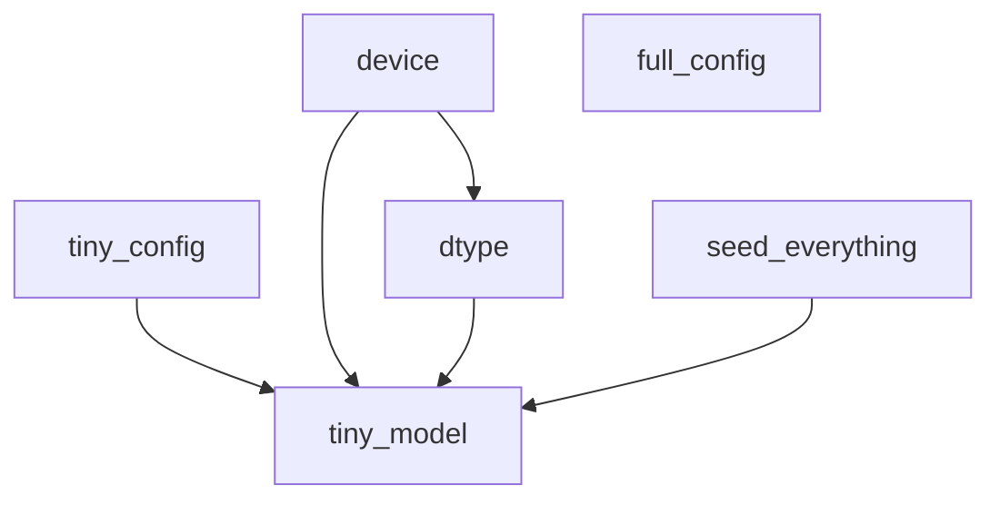

# LLaMA-3-Lite — Training and Test Reference

This document is the consolidated test-suite reference for LLaMA-3-Lite. It covers the test strategy (unit / equivalence / smoke / e2e GPU), the shared fixture system (`tests/conftest.py`), pytest markers and configuration, a per-file walkthrough of every test class, the eight asserted stages of the standalone `tests/e2e_gpu_smoke.py` pipeline, the CI wiring in `.github/workflows/ci.yml`, and the design decisions behind the suite. The training code these tests defend lives in `train.py`, `model.py`, `dataset.py`, and `config.py`; the executable half of the documentation contract is enforced by `tests/test_doc_refs.py`, whose other half is this docs tree.

> Audience: intermediate — you have run `pytest` before and want to know what this suite defends and how to drive it.

## Overview

LLaMA-3-Lite keeps its correctness story in **59 test functions** across four files (`tests/test_config.py`, `tests/test_model.py`, `tests/test_smoke.py`, `tests/test_train.py`), a shared fixture/helper module (`tests/conftest.py`), and one standalone GPU pipeline script (`tests/e2e_gpu_smoke.py`) that is not collected by pytest. (63 functions including `tests/test_doc_refs.py`'s four; 71 collected items once parametrization is expanded.) Everything runs on a tiny, CPU-friendly model configuration — the production 16-layer / 1024-wide model is never trained in tests. The suite is the executable half of the documentation contract enforced by `tests/test_doc_refs.py`; the other half is this docs tree, which cites the same symbols.

The suite is designed to answer three questions, in order of increasing cost:

1. **Is each module mathematically right?** (unit + equivalence tests, seconds)
2. **Does the whole pipeline hang together?** (smoke tests, tens of seconds)
3. **Does it work on a real GPU with real kernels?** (the e2e script, minutes)

## Test Strategy

| Layer | Where | What it defends |
|---|---|---|
| Unit | `tests/test_model.py`, `tests/test_config.py` | Individual modules against closed-form references: RMSNorm against the explicit `x * rsqrt(mean(x^2) + eps)` formula, RoPE against rotation properties, SwiGLU against the unfused gate/up/down computation, the config surface against a fixed `REQUIRED_KEYS` contract. |
| Equivalence | `tests/test_model.py::TestChunkedCrossEntropyWithZ`, `TestChunkedHeadCrossEntropyWithZ`, `TestSwiGLUFFN.test_fused_equals_unfused_reference` | The memory-saving implementations must be numerically indistinguishable from their naive counterparts: chunked CE ≡ dense CE, chunked head CE ≡ dense CE + z-loss, fused `gate_up_proj` ≡ two separate projections. This is the guarantee that makes the memory optimizations (see [training.md](../training.md)) safe. |
| Smoke | `tests/test_smoke.py::TestEndToEndSmoke`, `tests/test_train.py::TestCheckpointRoundTrip` | End-to-end paths on synthetic data: a real forward/backward/optimizer step, loss decreasing over 30 steps, checkpoint save → fresh-model load reproducing pre-save outputs bit-for-bit, RNG state restored exactly. |
| E2E GPU | `tests/e2e_gpu_smoke.py` | The full pipeline on real hardware: environment, data loading with `non_blocking` H2D, autocast BF16 training, chunked CE, validation, checkpoint round-trip, and the three Triton kernels — each stage an assert-guarded `check_*` function. |

The strategy is layered deliberately: the equivalence tests would catch a wrong chunking math on any laptop; the e2e script catches integration bugs (device/dtype plumbing, kernel fallbacks, allocator config) that only appear under CUDA. Theory for the chunked-CE equivalence and z-loss lives in
[architecture-components.md](../concepts/architecture-components.md); the RNG-restore mechanics are
in [training-and-memory.md](../concepts/training-and-memory.md).

## Fixtures

The fixture system lives in `tests/conftest.py`, which does four jobs: environment pinning, the wandb stub, CLI options, and the shared fixtures/helpers.

### Environment pinning

At import time it sets `TOKENIZERS_PARALLELISM=false`, `WANDB_MODE=offline`, `WANDB_DISABLED=true`, and prepends the repo root to `PYTHONPATH` so `import config`, `import model`, `import train` resolve from tests. All are `setdefault` — they never override an explicit environment.

### The wandb stub

`train.py` imports `wandb` at module scope, so any test that imports `train` (and `tests/test_smoke.py` and `tests/e2e_gpu_smoke.py` both do) would fail on a machine without the package. `conftest.py` handles this at import time: if `wandb` is not already in `sys.modules`, it tries a real import; on `ImportError` it installs a minimal stub module with `log`, `init`, `finish`, a `Table` class supporting `add_data`, and a `_calls` dict recording every invocation. Because the stub is injected into `sys.modules["wandb"]`, the `import wandb` inside `train.py` silently succeeds and every test stays offline-capable. `tests/test_smoke.py::TestEndToEndSmoke.test_validate_runs_and_returns_finite_loss` relies on this: it monkeypatches `wandb.log` and asserts `validate` calls it exactly once.

### CLI options

`tests/conftest.py:pytest_addoption` registers two flags:

- `--device {cpu,cuda}` — force the device used by fixture-based tests.
- `--run-gpu` — unskip tests marked `gpu` (see [Markers](#markers)).

`tests/conftest.py:pytest_collection_modifyitems` implements the gating: when `--run-gpu` is absent, every item carrying the `gpu` keyword gets a skip marker with the reason `needs --run-gpu and a CUDA device`. `--run-gpu` alone does **not** move the `device` fixture to CUDA — pass `--device cuda` for that (the option help text is optimistic on this point; the fixture is the source of truth).

### Fixture table

| Fixture | Scope | Contract |
|---|---|---|
| `tests/conftest.py:device` | session | Returns `torch.device` from `--device`, defaulting to `cpu`; `pytest.skip`s the whole session if `cuda` was requested but `torch.cuda.is_available()` is false. |
| `tests/conftest.py:dtype` | session | `torch.float32` on CPU, `torch.bfloat16` on CUDA. FP32-on-CPU is deliberate: the equivalence tests assert `atol=1e-5` against dense references, which only holds in a dtype with enough mantissa. GPU tests get the production dtype (see [training-and-memory.md](../concepts/training-and-memory.md)). |
| `tests/conftest.py:seed_everything` | function | Factory `_seed(seed=1234)` seeding torch, CUDA (when available), numpy, and the Python `random` module; returns the seed used. |
| `tests/conftest.py:full_config` | session | The production config straight from `config.get_config()` — used only by the param-count and config-contract tests, never to build a training model. |
| `tests/conftest.py:tiny_config` | function | The small CPU-friendly config dict every fast test builds on: `d_model=64`, `n_layers=2`, `n_heads=4`, `n_kv_heads=2`, `head_dim=16`, `d_ff=128`, `vocab_size=256`, `seq_len=32`, `batch_size=4`, `max_steps=10`, `ce_chunk_size=16`, `warmup_steps=2`, `val_split=0.1`. It mirrors the production key set (minus Triton dispatch keys), so config plumbing is exercised at small scale. |
| `tests/conftest.py:tiny_model` | function | A `build_transformer(...)` instance built from `tiny_config` hyperparameters, moved to `device`/`dtype`, seeded via `seed_everything(1234)`. |

Dependencies among fixtures:

### Module-level helpers

- `tests/conftest.py:make_token_stream(num_tokens, vocab_size, seq_len, eos_id=0, bos_id=1, seed=42)` — builds a synthetic `uint32` token buffer packed as repeated `BOS … EOS` documents (each document `max(8, seq_len // 2)` tokens long), exactly the layout `PackedDataset` expects. Used by `tests/test_smoke.py:tiny_dataloaders` to build train/val loaders without a tokenizer.

## Markers

`pytest.ini` pins the collection rules (`testpaths = tests`, `python_files = test_*.py`, `python_classes = Test*`, `python_functions = test_*`), suppresses Deprecation/Future/User/Resource warnings globally, and disables the cache provider (`-p no:cacheprovider`). `addopts = -ra --strict-markers --strict-config` means every marker used anywhere must be registered, and the config file must parse strictly.

Registered markers:

- `slow` — tests taking more than a few seconds (reserved; currently unused).
- `gpu` — requires a CUDA GPU; auto-skipped unless `--run-gpu` is passed. Currently one test: `tests/test_train.py::TestCheckpointRoundTrip.test_load_restores_rng_state_cross_device`.
- `smoke` — fast end-to-end pipeline tests. CI selects it with `-m smoke`. Note: as of this writing no test carries `@pytest.mark.smoke` — the end-to-end tests live in `tests/test_smoke.py::TestEndToEndSmoke` without the marker, so the CI selection is currently empty (see [Running the Suites](#running-the-suites)). This is the first thing to fix when wiring a test into the CI smoke job.
- `numeric` — numerical-equivalence assertions. Currently one test: `tests/test_model.py::TestChunkedCrossEntropyWithZ.test_matches_ce_plus_zpen_reference`.

## Per-File Walkthroughs

### `tests/test_config.py` — the config contract (7 tests)

`tests/test_config.py:REQUIRED_KEYS` is the authoritative list of every key `config.get_config()` must (and must not) expose. `TestGetConfig` enforces a **bijection**: `test_has_all_required_keys` fails if any required key is missing; `test_no_extra_unknown_keys` fails if the config grows a key the test suite does not know about — so adding a config knob forces updating the contract in the same commit.

- `tests/test_config.py::TestGetConfig.test_known_values` — pins the
  production numbers: `d_model=1024`, `n_layers=16`, `n_heads=8`, `n_kv_heads=4`, `head_dim=128`, `d_ff=4096`, `vocab_size=128000`, `seq_len=2048`, `ce_chunk_size=256`.
- `test_gqa_heads_divide_evenly` — GQA validity (`n_heads % n_kv_heads == 0`,
  ratio ≥ 1), a precondition of the KV-expansion logic in
  [model-reference.md](model-reference.md).
- `test_data_source_weights_positive` — mixture weights are positive and sum
  in `(0.5, 1.0]`, the invariant the workspace data pipeline relies on ([data-reference.md](data-reference.md), [data-and-kernels.md](../concepts/data-and-kernels.md)).
- `test_learning_rate_schedule_invariants` — `0 < min_lr < learning_rate`,
  `0 < warmup_steps < max_steps`, `weight_decay >= 0`, `max_grad_norm > 0`; the preconditions of the SequentialLR chain ([training-and-memory.md](../concepts/training-and-memory.md)).

### `tests/test_model.py` — the model (35 tests)

Nine test classes, each pinned to a `model.py` symbol:

- **`tests/test_model.py::TestRMSNorm`** — output shape, zero-input behavior,
  exact match to the closed form `x * rsqrt(mean(x^2) + eps) * weight` in float64, scale invariance (RMSNorm is homogeneous), and `weight` being a learnable parameter initialized to ones. Theory: [architecture-components.md](../concepts/architecture-components.md).
- **`tests/test_model.py::TestRoPE`** — buffer shapes (`cos_cached`/
  `sin_cached` as `(1, 1, max_seq_len, head_dim/2)`, `inv_freq` of length `head_dim/2`), strictly decreasing `inv_freq` (monotone frequency schedule), and three geometric properties that *define* rotary embeddings: rotation preserves the Euclidean norm, position 0 is the identity, and the inner product `q_i · k_j` depends only on `i − j` (`test_relative_position_property`) — the translation-equivariance that makes RoPE a relative scheme. Theory:
  [attention-and-positional.md](../concepts/attention-and-positional.md).
- **`tests/test_model.py::TestGroupedQueryAttention`** — output shape,
  `test_causality` (perturbing the last token must not change earlier outputs — the `is_causal` mask contract), `n_rep == n_heads // n_kv_heads` across four head configurations, and `test_invalid_n_kv_heads_raises` (a non-divisor `n_kv_heads` fails loudly at forward time, not silently at init). Theory: [attention-and-positional.md](../concepts/attention-and-positional.md).
- **`tests/test_model.py::TestSwiGLUFFN`** — output shape; the core
  equivalence `test_fused_equals_unfused_reference` (splitting `gate_up_proj.weight` into gate/up halves and running `silu(gate) * up → down_proj` must reproduce the fused forward at `atol=1e-6`); and `gate_up_proj` being exactly `2 * d_ff` rows. Theory: [architecture-components.md](../concepts/architecture-components.md).
- **`tests/test_model.py::TestTransformerParamCount`** — the README's
  advertised ~515M total parameters within 1%, and `get_num_params(non_embedding=True)` agreeing with both the README's ~252M and the `total − in_emb − out_emb` definition — a guard against metric-definition drift. The anatomy behind these numbers is derived in
  [attention-and-positional.md](../concepts/attention-and-positional.md).
- **`tests/test_model.py::TestTransformerForward`** — forward shape
  `(B, S, vocab)`, backward producing a finite grad for *every* parameter, and `test_gradient_checkpointing_matches_normal` (checkpointed and non-checkpointed forwards are identical at `atol=1e-6` — the correctness half of the memory tradeoff in
  [training-and-memory.md](../concepts/training-and-memory.md)).
- **`tests/test_model.py::TestChunkedCrossEntropyWithZ`** — the z-loss
  wrapper. `test_matches_ce_plus_zpen_reference` (marked `numeric`) proves `chunked_cross_entropy_with_z(logits, targets, chunk_size, z_loss_weight)` equals `F.cross_entropy + weight * mean(logsumexp(logits)^2)` at `atol=1e-5`; `test_z_weight_zero_matches_pure_ce` proves the penalty term is identically zero when the weight is zero; `test_gradients_flow` proves the bound actually backprops; `test_z_loss_grows_with_logit_magnitude` sanity-checks the penalty's behavior; and `test_z_loss_ignores_ignore_index_positions` proves masked positions are excluded from the z average (the `ignore_index=-100` training contract). Full derivation: [architecture-components.md](../concepts/architecture-components.md).
- **`tests/test_model.py::TestChunkedHeadCrossEntropyWithZ`** — the
  memory-bounded LM-head loss, the centerpiece of the 92→20 GB story ([training.md](../training.md)). It proves chunked-head loss ≡ dense CE (z=0) and ≡ dense CE + z (z=1e-4) at `atol=1e-5` on the same `tiny_model`; that gradients reach both `output_proj.weight` and `input_embedding.weight` (proving hidden gradient flow through a non-leaf); and that `return_hidden=True` skips the head (hidden is `(B, S, d_model)`).
- **`tests/test_model.py::TestQKNorm`** — parameter-count delta is exactly
  `2 * head_dim * n_layers` when enabled; with `qknorm=False` the `q_norm`/`k_norm` modules are `torch.nn.Identity` placeholders and the forward is unchanged; with `qknorm=True` they are real `RMSNorm` instances and the forward runs finite. Theory: [architecture-components.md](../concepts/architecture-components.md).

### `tests/test_smoke.py` — the pipeline (4 tests)

`tests/test_smoke.py:tiny_dataloaders` builds train/val `DataLoader`s from `make_token_stream` output via `dataset.PackedDataset` + `dataset.ShuffledRangeSampler` + `dataset.collate_fn` — the real loading path at tiny scale. `TestEndToEndSmoke` then defends:

- `test_one_forward_backward_step` — one real AdamW step: loss finite and
  positive, and every named parameter receives a finite gradient (a catch-all for dtype/plumbing errors).
- `test_loss_decreases_over_few_steps` — a tiny model overfits a fixed
  random batch in 30 steps (`lr=1e-2`), proving the optimizer path actually learns.
- `test_chunked_ce_matches_full_ce_in_training` — chunked CE (`chunk_size=7`)
  equals `F.cross_entropy` inside a real forward pass, bridging the unit-level equivalence to the full model.
- `test_validate_runs_and_returns_finite_loss` — `train.validate` runs,
  returns a finite positive loss, and calls `wandb.log` exactly once (stubbed via monkeypatch).

### `tests/test_train.py` — training components (13 tests)

- **`tests/test_train.py::TestTopKTopPSampling`** (5) — the generation
  sampler `train.top_k_top_p_sampling`: seeded determinism (`torch.equal` on two seeded runs), `top_k=1` = argmax, temperature acceptance, `top_p=0.5` pruning a low-probability tail down to the single high-probability token, and `-inf` logits handled (the finite entry wins, output finite). Used by `train.generate_samples`; see [training.md](../training.md).
- **`tests/test_train.py::TestCheckpointRoundTrip`** (7) — the
  reproducibility contract ([training-and-memory.md](../concepts/training-and-memory.md)):
  - `test_save_creates_step_file` — `save_checkpoint(..., step=42)` writes
    `<model_filename>_step_42.pt`.
  - `test_load_restores_model_weights` — a freshly seeded model does *not*
    reproduce the pre-save outputs until `load_checkpoint`; after loading it matches at `atol=1e-4`. This is the round-trip in miniature.
  - `test_load_restores_rng_state` — the headline claim: torch, numpy, and
    Python RNG states are restored **exactly** (`torch.equal` on rng states, `np.array_equal` on `get_state()[1]`, `random.getstate()` equality), and post-restore draws are bit-identical to a reference draw from the saved state.
  - `test_load_returns_zero_when_no_checkpoints` — `(step=0, best=inf)` on an
    empty folder (fresh-start contract).
  - `test_final_checkpoint_uses_special_names` — the final checkpoint writes
    `*_final_model_full.pt` and `*_final_model_weights.pt` and no step file.
  - `test_async_save_returns_thread` — `async_save=True` returns a joinable
    `Thread`; after `join(timeout=5)` the file exists.
  - `test_load_restores_rng_state_cross_device` (marked `gpu`) — regression:
    `torch.load(map_location=...)` used to move RNG state tensors to the load device, breaking CPU-loads-from-CUDA-saves; this test saves on CUDA and loads on CPU and asserts both weights and RNG survive. It self-skips unless the fixture device is CPU *and* CUDA is present, so it runs with `--run-gpu` alone.
- **`tests/test_train.py::TestSetupGpuOptimizations`** (1) —
  `test_idempotent_on_cpu` runs `train.setup_gpu_optimizations` twice with `tf32=False`/`cudnn_benchmark=False`/no `cuda_alloc_conf` and asserts nothing explodes — the CPU-safety half of the GPU configurator ([training-and-memory.md](../concepts/training-and-memory.md)).

## The E2E GPU Script

A standalone script (not collected by pytest) that drives the **real pipeline** end to end in 8 asserted stages. Run it with `python tests/e2e_gpu_smoke.py` (the module docstring suggests the project venv: `~/.venv/bin/python tests/e2e_gpu_smoke.py`).

- `tests/e2e_gpu_smoke.py:check_environment` — prints torch version, CUDA
  availability, device name/compute-capability/VRAM, and Triton availability; selects `cuda` when present, else `cpu` with a warning (the script is runnable on CPU but that defeats its purpose).
- `tests/e2e_gpu_smoke.py:build_tiny_config` — a GPU-friendly config
  (`d_model=128`, 2 layers, `vocab_size=512`, `seq_len=64`, `batch_size=4`, `max_steps=8`, `ce_chunk_size=128`) sized so the CE buffers fit in 4 GB, with `tf32` set by `tests/e2e_gpu_smoke.py:device_supports_tf32` (Ampere and newer, compute capability ≥ 8) and `cuda_alloc_conf=expandable_segments:True`.
- `tests/e2e_gpu_smoke.py:check_data_pipeline` — builds synthetic data via
  `dataset.build_synthetic_data(num_tokens=8192, seed=0)`, verifies batch shapes `(batch_size, seq_len)`, and exercises the trainer's `non_blocking` H2D copy (with `cuda.synchronize`) on GPU, printing the H2D time.
- `tests/e2e_gpu_smoke.py:build_model` — seeds and builds the model, prints
  param count and GPU memory after build.
- `tests/e2e_gpu_smoke.py:train_steps` — the real training recipe at small
  scale: AdamW with the decay/no-decay split (`p.dim() >= 2`), BF16 `torch.autocast` on CUDA, chunked CE with z-loss, gradient clipping, epoch wrap on `StopIteration`, and a `cuda.synchronize` per step. Asserts every loss is finite.
- `tests/e2e_gpu_smoke.py:check_chunked_ce` — dense vs chunked CE on the
  trained model, `abs diff < 1e-3`.
- `tests/e2e_gpu_smoke.py:check_validate` — stubs `wandb` (same pattern as
  conftest) and calls `train.validate`; asserts a finite positive loss and prints perplexity.
- `tests/e2e_gpu_smoke.py:check_checkpoint_roundtrip` — saves step 7 into a
  temp dir, loads into a freshly seeded model, asserts `step == 7`, `best_val_loss ≈ 2.5`, and max-abs weight drift `< 1e-3`.
- `tests/e2e_gpu_smoke.py:check_triton_kernels` — skipped on CPU or without
  Triton; otherwise compares `kernels.rmsnorm_triton.triton_rmsnorm` (diff `< 5e-2`), `kernels.swiglu_triton.triton_swiglu` (diff `< 1.0`, tolerating the documented BF16 bias on cc-7.5), and `kernels.cross_entropy_triton.triton_chunked_cross_entropy_with_z` (diff `< 5e-1`) against their PyTorch references. Kernel details:
  [data-reference.md](data-reference.md), [data-and-kernels.md](../concepts/data-and-kernels.md).
- `tests/e2e_gpu_smoke.py:main` — parses `--steps N` to override
  `cfg["max_steps"]` (useful for a 1–2 step sanity pass), runs the stages in order, prints `E2E SMOKE: ALL CHECKS PASSED`, and exits 0; any failed assert exits non-zero.

## Running the Suites

| Intent | Command |
|---|---|
| Full CPU suite (fast, no GPU needed) | `python -m pytest tests/ -q` |
| One file | `python -m pytest tests/test_model.py -q` |
| One test class | `python -m pytest tests/test_model.py::TestRoPE -q` |
| Numeric-equivalence tests only | `python -m pytest tests/ -m numeric -q` |
| GPU-marked tests (CUDA required) | `python -m pytest tests/ --run-gpu -q` |
| Entire suite on a CUDA box | `python -m pytest tests/ --run-gpu --device cuda -q` |
| E2E GPU script (full) | `python tests/e2e_gpu_smoke.py` |
| E2E GPU script (quick, 2 steps) | `python tests/e2e_gpu_smoke.py --steps 2` |
| Doc↔code anchor checker | `python -m pytest tests/test_doc_refs.py -q` |

The CPU suite needs no data, no tokenizer download, and no wandb: the `tiny_config`/`tiny_model` fixtures and the conftest wandb stub make it hermetic. On a Mac M1 the full suite runs in roughly a minute (verified 2026-08-03: 59 passed / 1 skipped, the skip being the `gpu`-marked test).

### CI workflow (`.github/workflows/ci.yml`)

On every push/PR to `main`, the `smoke` job runs on `ubuntu-latest` with Python 3.11 and the CPU-only torch wheel (`pip install torch --index-url https://download.pytorch.org/whl/cpu`), then three steps:

1. **Import checks** — `python -c "import model; import dataset; import train"`,
   the cheapest smoke: the three entry modules must import cleanly.
2. **CPU smoke test** — `python -m pytest tests/ -m smoke --no-header -q`.
   As noted in [Markers](#markers), the `smoke` marker is currently unused by any test, so this selection collects nothing until the marker is applied to `TestEndToEndSmoke` (the natural home). This is a known gap, not a failure mode of the suite itself — the full CPU suite is what actually runs locally.
3. **Doc reference checker** — `python -m pytest tests/test_doc_refs.py
   --no-header -q`, enforcing that every symbol citation in these docs resolves to a real module attribute and that no line-number anchors exist.

CI intentionally does not run the `gpu` tests (no CUDA runner) and does not run the e2e script; both are local/GPU-farm activities.

## Test Matrix

| File | What it defends | How to run |
|---|---|---|
| `tests/test_config.py` | Config contract: `REQUIRED_KEYS` bijection, production values (1024/16/8/4/128/4096/128k/2048/256), GQA divisibility, mixture-weight and LR-schedule invariants | `pytest tests/test_config.py` |
| `tests/test_model.py` | Model math: RMSNorm, RoPE, GQA causality, SwiGLU fused≡unfused, param counts (514.9M / 251.7M), forward/backward, grad-ckpt equivalence, chunked CE ≡ dense CE, chunked head ≡ dense CE+z, QK-norm identity/RMSNorm behavior | `pytest tests/test_model.py` |
| `tests/test_smoke.py` | End-to-end training on synthetic data: one optimizer step, loss descent, chunked-CE-in-training, `validate` + wandb stub | `pytest tests/test_smoke.py` |
| `tests/test_train.py` | Generation sampling (top-k/top-p/temperature/-inf), checkpoint round-trip incl. exact RNG restore and cross-device regression, async save, GPU-optimization idempotence | `pytest tests/test_train.py` |
| `tests/e2e_gpu_smoke.py` | Full pipeline on real hardware: env, data, training with autocast, chunked CE, validate, checkpoint, Triton kernels | `python tests/e2e_gpu_smoke.py [--steps N]` |

## Design Decisions

- **Tiny models for big guarantees.** Every numerical contract is checked on
  a 2-layer / 64-wide model, where dense references fit in memory and tolerances stay tight. The 16-layer production model is only instantiated once, in `tests/test_model.py::TestTransformerParamCount`, which builds it on CPU (no forward) purely to count parameters.
- **Exactness is a dtype decision, not a tolerance decision.** FP32 on CPU
  is what makes the `1e-5` equivalence assertions meaningful; GPU runs use BF16 because that is what trains. The two are wired through the `device` → `dtype` fixture chain, so no test hardcodes a dtype.
- **The suite is hermetic by default.** No network, no data files, no wandb,
  no tokenizer: synthetic tokens from `make_token_stream`, a stubbed wandb, and config-driven tiny sizes. The e2e script is the one place that deliberately breaks hermeticity to touch real kernels and real allocator settings.

## Training Loop

The end-to-end training recipe this suite defends — AdamW with the decay/no-decay split, BF16 autocast, chunked CE with z-loss, gradient clipping, checkpointing, and generation sampling — is documented in
[training.md](../training.md), with the memory, precision, and optimization
theory behind it in
[training-and-memory.md](../concepts/training-and-memory.md). The tests in
`tests/test_train.py` and `tests/test_smoke.py` are the executable form of those chapters.

## References

- [model-reference.md](model-reference.md) — the config surface the `test_config` contract pins.
- [training.md](../training.md) — `validate`, `save_checkpoint`/`load_checkpoint`,
  `top_k_top_p_sampling`, `setup_gpu_optimizations` in context.
- [architecture-components.md](../concepts/architecture-components.md) — why chunked CE ≡ dense CE
  and what z-loss does.
- [training-and-memory.md](../concepts/training-and-memory.md) — the RNG-restore theory
  behind `TestCheckpointRoundTrip` and the memory claims the chunked-head equivalence tests make safe.
- [data-reference.md](data-reference.md) — the Triton kernels checked by the e2e script.
- [learning-paths.md](../guides/learning-paths.md) — where this reference sits
  in the reading order.
