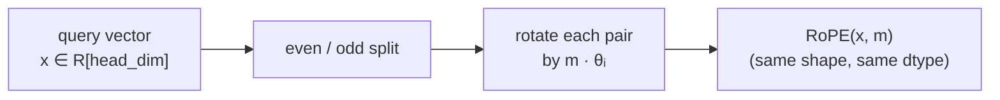
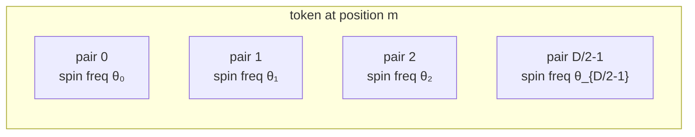
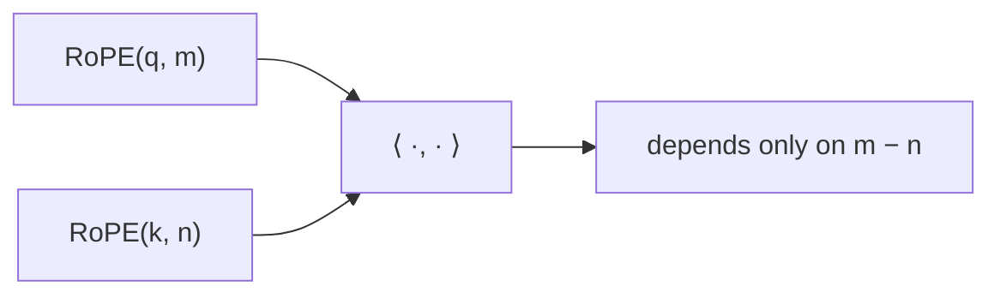
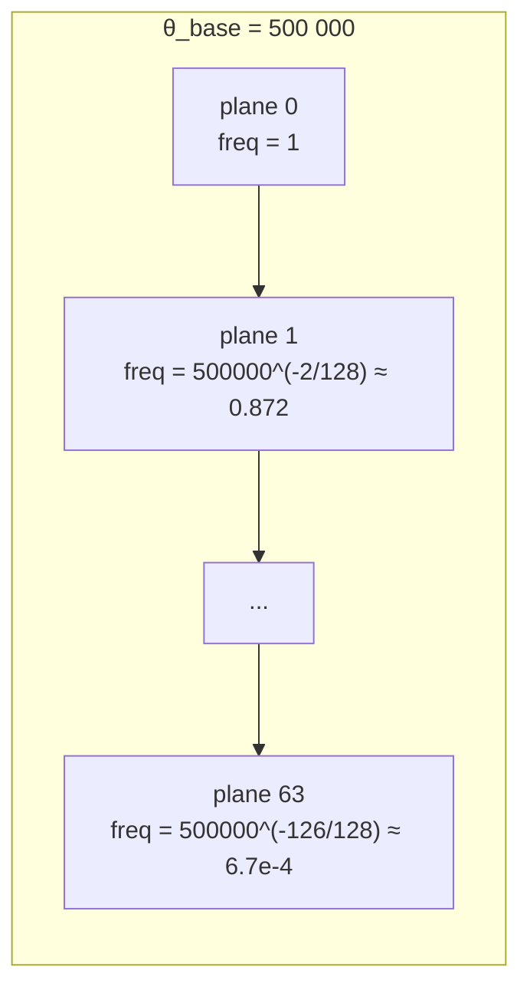
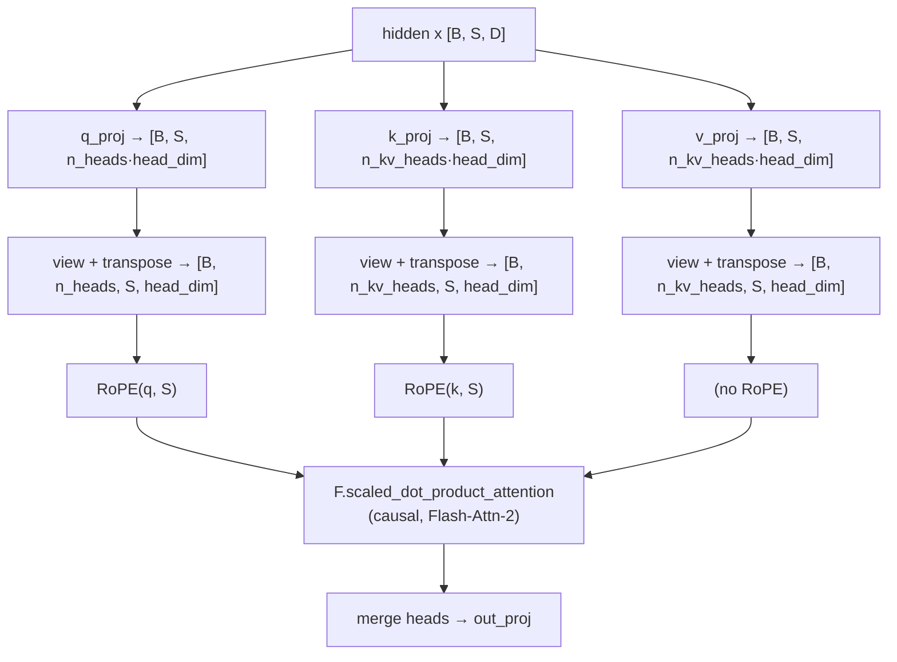
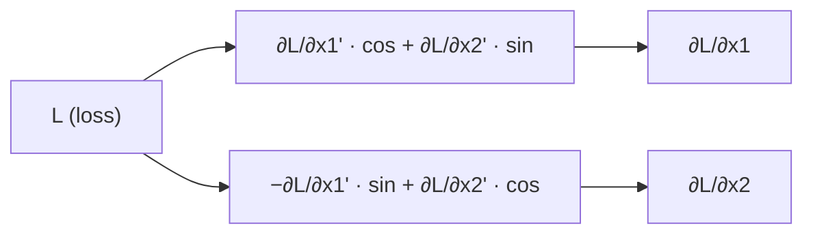

# RoPE in LLaMA-3-Lite — Deep Dive

> A self-contained, line-by-line explanation of the `RoPE` class in `model.py`
> and every concept required to understand why it works the way it does.

---

## Table of Contents

1. [The 60-Second Summary](#1-the-60-second-summary)
2. [Why Position Information is Needed](#2-why-position-information-is-needed)
3. [The Three Families of Position Encoding](#3-the-three-families-of-position-encoding)
4. [What RoPE Does, Intuitively](#4-what-rope-does-intuitively)
5. [The Mathematical Foundation](#5-the-mathematical-foundation)
6. [The Relative-Position Property (The Big Payoff)](#6-the-relative-position-property-the-big-payoff)
7. [Multi-Dimensional Rotation Across the Head](#7-multi-dimensional-rotation-across-the-head)
8. [Frequency Schedule — Why `θ = 500 000`](#8-frequency-schedule--why-θ--500-000)
9. [Implementation Walk-Through](#9-implementation-walk-through)
10. [Line-by-Line Annotated Code](#10-line-by-line-annotated-code)
11. [Tensor Shape Trace](#11-tensor-shape-trace)
12. [Why Even/Odd Pairing, Why `stack` + `flatten`](#12-why-evenodd-pairing-why-stack--flatten)
13. [Precomputed Buffers — Why `register_buffer`](#13-precomputed-buffers--why-register_buffer)
14. [Why Apply RoPE to Q and K but Not V](#14-apply-rope-to-q-and-k-but-not-v)
15. [Interaction with GQA and Flash-Attention-2](#15-interaction-with-gqa-and-flash-attention-2)
16. [Length Extrapolation & Interpolation](#16-length-extrapolation--interpolation)
17. [Gradient Flow Through RoPE](#17-gradient-flow-through-rope)
18. [Numerical Properties & Edge Cases](#18-numerical-properties--edge-cases)
19. [Memory & Compute Cost](#19-memory--compute-cost)
20. [Common Pitfalls & How This Code Avoids Them](#20-common-pitfalls--how-this-code-avoids-them)
21. [References](#21-references)

---

## 1. The 60-Second Summary

**RoPE (Rotary Position Embeddings)** encodes the position of a token by
**rotating** parts of its query and key vectors in 2-D planes — each plane
spinning at a different frequency. Two consequences fall out for free:

1. The attention score between two tokens depends only on their **relative**
   distance, not their absolute positions.
2. The model can generalize (somewhat) to sequence lengths beyond what it
   saw in training — *length extrapolation*.

In LLaMA-3-Lite, the `RoPE` class is implemented as a single 17-line
`nn.Module` (`model.py:17–33`) that holds **pre-computed cos/sin buffers**
and applies a single broadcast rotation at forward time.



---

## 2. Why Position Information is Needed

A vanilla attention layer has the form:

```
Attention(Q, K, V) = softmax(Q Kᵀ / √d) V
```

The dot product `q · k` depends only on the **content** of the two vectors, not
on *where* they appear in the sequence. That means if you permute the input
sequence, the output is permuted identically — the model cannot distinguish
`"the cat sat"` from `"sat cat the"`.

For language modeling we need the model to know:

- **Order** — which token came first.
- **Distance** — how far apart two tokens are.
- **Relative position** — "the verb is two words after the subject", not "the
  verb is at position 17".

Position encodings are how this information gets injected.

---

## 3. The Three Families of Position Encoding

| Family | Example | How position enters | Property |
|---|---|---|---|
| **Absolute (additive)** | Sinusoidal (Vaswani 2017), learned | `x ← x + p[m]` | Absolute; needs to learn relative offsets |
| **Relative (additive)** | T5, ALiBi, Kerple | Bias added to `QKᵀ` directly | Naturally relative; but extra parameters |
| **Rotary (RoPE)** | GPT-NeoX, LLaMA, Mistral | Rotate Q and K by position | Naturally relative; no extra parameters; extrapolates |

RoPE is the dominant choice in modern LLMs because it threads the needle:
**no learned parameters, naturally relative, length-extrapolating**.

---

## 4. What RoPE Does, Intuitively

Picture each head's query/key vector of length `head_dim` as a sequence of
`head_dim / 2` **independent 2-D points**:

```
x = [x₀, x₁, x₂, x₃, x₄, x₅, ...]
      ↘ ↗  ↘ ↗  ↘ ↗         (each adjacent pair is one 2-D point)
    [x₀,x₁]  [x₂,x₃]  [x₄,x₅]  ...
```

RoPE rotates each of those 2-D points by an angle proportional to the token's
absolute position `m`:

```
x_rotated[m] = [
    R(m·θ₀) · [x₀, x₁],
    R(m·θ₁) · [x₂, x₃],
    R(m·θ₂) · [x₄, x₅],
    ...
]
```

where `R(φ) = [[cos φ, -sin φ], [sin φ, cos φ]]`.

Different pairs spin at **different frequencies** `θᵢ`, so that the resulting
vector has a multi-scale "fingerprint" of position. Some pairs spin fast
(short-range info), some spin slowly (long-range info).



---

## 5. The Mathematical Foundation

### 5.1 The 2-D rotation

For a single 2-D point `(x_{2i}, x_{2i+1})` at position `m`, RoPE applies:

```
[x'_{2i}  ]   [ cos(m · θᵢ)   -sin(m · θᵢ) ] [x_{2i}  ]
[x'_{2i+1}] = [ sin(m · θᵢ)    cos(m · θᵢ) ] [x_{2i+1}]
```

This is just a standard 2-D rotation matrix `R(φ)` where `φ = m · θᵢ`.

### 5.2 Inverse frequencies

The frequencies `θᵢ` are defined as:

```
θᵢ = base^(-2i / head_dim),   for i = 0, 1, ..., head_dim/2 - 1
```

Equivalently (using `inv_freq[i] = 1 / θᵢ`):

```
inv_freq[i] = base^(+2i / head_dim) / 1
            = base^(2i / head_dim)
```

In the code (line 21):

```python
inv_freq = 1.0 / (theta ** (torch.arange(0, head_dim, 2).float() / head_dim))
```

Let's unpack:

- `torch.arange(0, head_dim, 2)` → `[0, 2, 4, ..., head_dim - 2]` (shape `[head_dim/2]`).
- `.float() / head_dim` → `[0, 2/D, 4/D, ..., (D-2)/D]`.
- `theta ** (...)` → `[θ^0, θ^(2/D), θ^(4/D), ..., θ^((D-2)/D)]` = `[1, θ^(2/D), ..., θ^((D-2)/D)]`.
- `1.0 / (...)` → `[1, θ^(-2/D), θ^(-4/D), ..., θ^(-(D-2)/D)]` = the `inv_freq` we want.

So `inv_freq[i] = θ^(-2i/D)` — exactly as in the formula above.

### 5.3 The angle matrix

`m · θᵢ` is just the row of an **outer product** between positions and
inverse frequencies:

```
        inv_freq[0]  inv_freq[1]  ...  inv_freq[D/2-1]
m=0     [   0           0        ...        0        ]
m=1     [   θ₀          θ₁       ...    θ_{D/2-1}   ]
m=2     [  2θ₀         2θ₁       ...   2θ_{D/2-1}   ]
...
```

Code (line 24):

```python
t = torch.arange(max_seq_len).float()         # [0, 1, 2, ..., S-1]
freqs = torch.outer(t, inv_freq)              # [S, D/2]
```

After `freqs.cos()` and `freqs.sin()` we get two tables of shape `[S, D/2]`.

### 5.4 Why `unsqueeze(0).unsqueeze(0)`?

```python
self.register_buffer('cos_cached', freqs.cos().unsqueeze(0).unsqueeze(0))
```

Original `freqs.cos()` has shape `[S, D/2]`. The two `unsqueeze` operations
push it to `[1, 1, S, D/2]` so it broadcasts cleanly against an input of
shape `[B, H, S, D/2]`. The 4-D convention matches what attention uses.

---

## 6. The Relative-Position Property (The Big Payoff)

Why go through all this rotation trouble? Because of one beautiful identity.

Let `R(m, θᵢ)` be the rotation operator for plane `i` at position `m`. The
inner product of a rotated query and a rotated key, summed over all planes,
factors as:

```
⟨ RoPE(q, m), RoPE(k, n) ⟩ = Σᵢ ⟨ R(m, θᵢ) qᵢ,  R(n, θᵢ) kᵢ ⟩
                            = Σᵢ ⟨ qᵢ,  R((n - m) · θᵢ) kᵢ ⟩
                            = g(q, k, m − n)
```

The dot product depends only on the **relative offset** `m − n`, not on the
absolute positions `m` and `n`.

**Why?** Rotations preserve dot products: `⟨R(α) a, R(β) b⟩ = ⟨a, R(β−α) b⟩`.
Apply that plane-by-plane and the absolute offsets cancel.

**Consequence**: the model has no way to tell "this token is at position 7"
from "this token is at position 107 — exactly 100 tokens after another token
at position 7". Both give the same attention score, which is what we want:
attention should be a function of **content** + **relative distance**, not of
absolute position.



---

## 7. Multi-Dimensional Rotation Across the Head

For one head of dimension `D = 128`, the model uses 64 independent 2-D planes.
Each plane has its own frequency `θᵢ`:

| Pair index `i` | Pair `(2i, 2i+1)` | Frequency `θᵢ` | Wavelength at `m` | Spins per max_seq_len |
|---|---|---|---|---|
| 0 | (0, 1) | θ₀ = base^0 = 1 | 2π / 1 = 2π | `2048 / (2π)` ≈ 326 |
| 1 | (2, 3) | θ₁ = base^(-2/D) | 2π · θ₁^(-1) | … |
| … | … | … | … | … |
| 31 | (62, 63) | θ₃₁ = base^(-62/D) | slowest | spins < 1× over max_seq_len |

The result is a **multi-scale position fingerprint**: each plane contributes
a different timescale of positional information. Some pairs spin fast and
encode fine-grained nearby-token positions; others spin slowly and encode
long-range structure.

For `D = 128` and `base = 500 000`:

- Lowest frequency (pair 63): `500000^(-62/128) ≈ 1/1480` → wavelength ≈ 9300 tokens.
- Highest frequency (pair 0): `1` → wavelength `2π ≈ 6.28` tokens.

So the model sees position information across roughly **3 orders of magnitude**
of timescales — from ~6 tokens up to ~10 000 tokens.

---

## 8. Frequency Schedule — Why `θ = 500 000`

The `theta` parameter is the **base** of the geometric progression of
frequencies. It's the single most important RoPE hyperparameter.

### What it controls

`θᵢ = θ_base^(-2i/D)`. For a fixed pair index `i`, increasing `θ_base`
**decreases** `θᵢ`, which **increases** the wavelength. So a larger `theta`
gives longer-range position encoding.

### LLaMA-3 chose `θ_base = 500 000` vs LLaMA-2's `10 000`

| `θ_base` | Slowest wavelength | Extrapolation range |
|---|---|---|
| 10 000 (LLaMA-2) | ~ 12 K tokens | modest |
| 500 000 (LLaMA-3) | ~ 9 300 K tokens | very long |

The 50× jump in base is what makes LLaMA-3 capable of 128 K-token contexts
after training on much shorter sequences — the longest-wavelength planes
don't wrap around `2π` until you've gone very far.

### Visualization of the spectrum



The slowest plane spins only 0.00067 radians per token position — at the
end of a 2048-token context, it has rotated only ~1.4 radians (less than a
quarter turn). So no information is lost to aliasing within the training
context.

---

## 9. Implementation Walk-Through

The class (`model.py:17–33`) is small but every line is doing real work.

### Construction (`__init__`)

| Step | Line | Operation | Output |
|---|---|---|---|
| 1 | 21 | Compute `inv_freq` | `[D/2]` float32 |
| 2 | 22 | Register as buffer (non-learnable, on-device) | buffer `inv_freq` |
| 3 | 23 | Build position vector | `[max_seq_len]` |
| 4 | 24 | Outer product `t ⊗ inv_freq` | `[max_seq_len, D/2]` |
| 5 | 25–26 | `cos` / `sin` + 2 unsqueezes | `[1, 1, max_seq_len, D/2]` each |

### Forward (`forward`)

| Step | Line | Operation | Output |
|---|---|---|---|
| 1 | 29–30 | Slice cache to current `seq_len` | `[1, 1, S, D/2]` |
| 2 | 31 | Even/odd split of input | `[B, H, S, D/2]` each |
| 3 | 32 | Rotation formula via `stack` | `[B, H, S, D/2, 2]` |
| 4 | 33 | Flatten the last two dims | `[B, H, S, D]` |

---

## 10. Line-by-Line Annotated Code

```python
class RoPE(nn.Module):
    """Rotary Position Embeddings with precomputed cos/sin buffers."""

    def __init__(self, head_dim: int, max_seq_len: int, theta: float = 500000.0):
        super().__init__()
        # ------------------------------------------------------------------
        # Line 21 — inverse frequencies.
        #
        # Produces inv_freq[i] = theta^(-2i/head_dim), shape [head_dim/2].
        #
        #   * `torch.arange(0, head_dim, 2)` → [0, 2, 4, ..., head_dim-2]
        #   * `.float() / head_dim`          → [0, 2/D, 4/D, ..., (D-2)/D]
        #   * `theta ** (...)`               → [1, θ^(2/D), θ^(4/D), ...]
        #   * `1.0 / (...)`                  → [1, θ^(-2/D), θ^(-4/D), ...]
        #
        # These are the FREQUENCIES, not the wavelengths. Smaller value = slower spin.
        # ------------------------------------------------------------------
        inv_freq = 1.0 / (theta ** (torch.arange(0, head_dim, 2).float() / head_dim))

        # ------------------------------------------------------------------
        # Line 22 — register as a buffer (NOT a parameter).
        #
        # Buffers follow .to(device), are saved/loaded in state_dict(),
        # and are excluded from gradient computation. Exactly what we want
        # for a non-learnable, device-resident frequency table.
        # ------------------------------------------------------------------
        self.register_buffer('inv_freq', inv_freq)

        # ------------------------------------------------------------------
        # Lines 23–24 — the angle matrix.
        #
        # t: positions [0, 1, ..., max_seq_len-1], shape [S].
        # freqs: outer product t ⊗ inv_freq, shape [S, D/2].
        # freqs[m, i] = m * inv_freq[i] = m * θᵢ = the rotation angle for
        # plane i at position m.
        # ------------------------------------------------------------------
        t = torch.arange(max_seq_len).float()
        freqs = torch.outer(t, inv_freq)

        # ------------------------------------------------------------------
        # Lines 25–26 — cache cos and sin.
        #
        # Shape: [S, D/2] → unsqueeze(0) → [1, S, D/2] → unsqueeze(0) → [1, 1, S, D/2].
        # The leading 1,1 dims broadcast against (batch, head) in the forward.
        # ------------------------------------------------------------------
        self.register_buffer('cos_cached', freqs.cos().unsqueeze(0).unsqueeze(0))
        self.register_buffer('sin_cached', freqs.sin().unsqueeze(0).unsqueeze(0))

    def forward(self, x, seq_len: int):
        # ------------------------------------------------------------------
        # Lines 29–30 — slice caches to current length.
        #
        # This is why short sequences pay no extra compute: we slice off
        # only the first seq_len entries of each table.
        # ------------------------------------------------------------------
        cos = self.cos_cached[:, :, :seq_len, :]
        sin = self.sin_cached[:, :, :seq_len, :]

        # ------------------------------------------------------------------
        # Line 31 — even/odd pair split.
        #
        # x has shape [B, H, S, head_dim]. Splitting it into
        #   x1 = x[..., ::2]    (even indices: 0, 2, 4, ...)
        #   x2 = x[..., 1::2]   (odd indices:  1, 3, 5, ...)
        # gives two tensors of shape [B, H, S, head_dim/2].
        # Each pair (x1[..., i], x2[..., i]) is one 2-D plane.
        # ------------------------------------------------------------------
        x1, x2 = x[..., ::2], x[..., 1::2]

        # ------------------------------------------------------------------
        # Line 32 — the rotation, computed in parallel for every plane.
        #
        # For each plane i, the rotation matrix R(φᵢ) with φᵢ = m · θᵢ
        # is applied as:
        #
        #   [x1' ]   [cos -sin] [x1]
        #   [x2' ] = [sin  cos] [x2]
        #
        # Multiplied out:
        #   x1' = x1 * cos − x2 * sin
        #   x2' = x1 * sin + x2 * cos
        #
        # The stack creates a new dim of size 2 at the end, interleaving
        # the two rotated components per plane.
        #
        # Shapes:
        #   cos, sin  : [1, 1, S, D/2]   (broadcasts against B, H)
        #   x1, x2    : [B, H, S, D/2]
        #   x1*cos... : [B, H, S, D/2]
        #   stack dim : [B, H, S, D/2, 2]
        # ------------------------------------------------------------------
        rotated = torch.stack(
            [x1 * cos - x2 * sin, x1 * sin + x2 * cos],
            dim=-1
        )

        # ------------------------------------------------------------------
        # Line 33 — interleave back to the original head_dim shape.
        #
        # flatten(-2) merges the last two dims (D/2, 2) into one dim (D).
        # The resulting interleaving is exactly what we want:
        #   [x1'[0], x2'[0], x1'[1], x2'[1], ...]
        # which matches the original even/odd layout.
        #
        # Output shape: [B, H, S, head_dim]
        # ------------------------------------------------------------------
        return rotated.flatten(-2)
```

---

## 11. Tensor Shape Trace

For a concrete example, take `head_dim = 8`, `max_seq_len = 5`,
`batch = 2`, `heads = 3`, `seq_len = 4`.

| Step | Tensor | Shape |
|---|---|---|
| 1. `inv_freq` | after line 21 | `[4]` |
| 2. `t` | after line 23 | `[5]` |
| 3. `freqs` | after line 24 | `[5, 4]` |
| 4. `cos_cached`, `sin_cached` | after lines 25–26 | `[1, 1, 5, 4]` |
| 5. `cos`, `sin` (sliced) | after lines 29–30 | `[1, 1, 4, 4]` |
| 6. `x` (input) | caller | `[2, 3, 4, 8]` |
| 7. `x1`, `x2` | after line 31 | `[2, 3, 4, 4]` |
| 8. `rotated` | after line 32 | `[2, 3, 4, 4, 2]` |
| 9. Output | after line 33 | `[2, 3, 4, 8]` |

Note that the input and output have **identical shape and dtype** — RoPE is a
**pointwise, in-place-shaped** transformation. This is one of its nicest
properties: it slots into any layer that already produces (or consumes) a
`[B, H, S, D]` tensor.

---

## 12. Why Even/Odd Pairing, Why `stack` + `flatten`

### The choice of pairs

RoPE rotates **adjacent pairs**: `(x₀, x₁)`, `(x₂, x₃)`, …

Why pairs and not, say, `(x₀, x_{D/2})` or other long-distance pairings?

1. **Hardware friendliness** — interleaved pairs are contiguous in memory. The
   slice `x[..., ::2]` is just a strided view; no data movement needed.
2. **Each pair is "orthogonal"** — different pairs of indices don't share
   features, so rotating them independently doesn't entangle them.
3. **Empirical convention** — every open-source RoPE implementation does this
   (GPT-NeoX, RoFormer reference, xFormers, etc.). The exact pairing doesn't
   matter for correctness as long as it's consistent.

### Why `stack` + `flatten(-2)` instead of two separate writes?

The naive alternative is:

```python
out_even = x1 * cos - x2 * sin    # [B, H, S, D/2]
out_odd  = x1 * sin + x2 * cos    # [B, H, S, D/2]
output = torch.empty_like(x)
output[..., ::2]  = out_even
output[..., 1::2] = out_odd
```

The `stack` + `flatten(-2)` approach used in this code:

- **Avoids allocating `output`** up front.
- **Avoids two strided writes** (`[..., ::2] = ...` is non-contiguous).
- **Avoids any explicit reshape** — `flatten(-2)` is a view operation.
- Lets PyTorch fuse the entire rotation into a single CUDA kernel.

The output **layout** is `[x1'[0], x2'[0], x1'[1], x2'[1], ...]`, which
matches the original even/odd layout, so the downstream code sees a normal
`[B, H, S, head_dim]` tensor with no surprises.

### Verification by example

For `D = 4` and a single 2-D plane:

```
Input pair:     (x1, x2) = (a, b)
Rotation angle: φ
Output pair:    (a cos φ − b sin φ,  a sin φ + b cos φ)
```

In the `stack`:

```
rotated[..., 0, 0] = a cos φ − b sin φ   # the rotated "even" component
rotated[..., 0, 1] = a sin φ + b cos φ   # the rotated "odd"  component
```

After `flatten(-2)`:

```
output[..., 0] = a cos φ − b sin φ   # position 0 (was even)
output[..., 1] = a sin φ + b cos φ   # position 1 (was odd)
```

So the original even-position features are at even positions in the output,
and odd at odd. The rotation has happened **within each pair** but the
**layout is preserved**.

---

## 13. Precomputed Buffers — Why `register_buffer`

### Three options for storing constants in PyTorch

| Option | Trainable? | On `state_dict()`? | On `.to(device)`? | Used here? |
|---|---|---|---|---|
| `nn.Parameter` | yes | yes | yes | ❌ (would be learned) |
| `self.x = tensor` | no | no | **no** | ❌ (would stay on CPU) |
| `register_buffer` | no | yes | **yes** | ✅ |

`cos_cached` and `sin_cached` are:

- **Not learnable** — they're derived from `theta` and `head_dim`, not from data.
- **Must follow `.to(device)`** — we don't want them stranded on CPU when
  the model moves to GPU.
- **Must be in `state_dict()`** — when we save a checkpoint, we need the
  exact same cos/sin tables to reproduce results.

`register_buffer` does all three correctly.

### One-time cost

The trig (`cos`, `sin`) is computed **once** at module construction. The
forward pass never calls `torch.cos` or `torch.sin` — it just multiplies
pre-computed values. This eliminates thousands of trig calls per training
step.

For `max_seq_len = 2048`, `head_dim = 128`:
- `cos_cached.numel() = 2048 × 64 = 131 072` floats = **512 KB**.
- `sin_cached` same → **512 KB**.
- Total: **1 MB** of pre-computed tables per RoPE module.

At 16 layers × 1 MB = **16 MB** of cos/sin tables across the whole model —
cheap.

---

## 14. Apply RoPE to Q and K but Not V

In `GroupedQueryAttention.forward` (line 72–73):

```python
q = self.rope(q, S)
k = self.rope(k, S)
# v is NOT rotated
```

### Why Q and K?

Attention scores are `Q Kᵀ`. The relative-position property only works when
**both** vectors in the dot product are rotated:

```
⟨RoPE(q, m), RoPE(k, n)⟩ = f(q, k, m − n)
```

If you rotate only one, the absolute-position information leaks through
asymmetrically and you lose the clean relative-position semantics.

### Why not V?

The value vector `v` is what gets **weighted** by the attention scores:

```
output[i] = Σⱼ α_{ij} · v[j]
```

Position information has already been "baked into" the attention weights via
the rotated `q, k`. Once the weights are computed, the value vectors just need
to carry **content**, not position. Rotating `v` would:

1. Add no information (the attention pattern already encodes position).
2. Make the output's coordinate frame position-dependent in a confusing way.

LLaMA / GPT-NeoX / RoFormer all follow this convention: rotate Q and K only.

---

## 15. Interaction with GQA and Flash-Attention-2



RoPE slots cleanly into the attention pipeline:

1. **Before SDPA** — both Q and K are in `[B, H, S, head_dim]` layout, the
   exact shape RoPE's forward expects.
2. **After RoPE, before SDPA** — the GQA replication step (`expand` /
   `reshape`) broadcasts the 4 KV heads across the 8 query heads. RoPE has
   already been applied to the *shared* KV head representation, so all
   replicated copies carry the same rotation.
3. **Inside SDPA** — Flash-Attention-2 doesn't care that Q and K have been
   rotated; it just sees two `[B, H, S, head_dim]` tensors and computes
   the scaled dot-product. The relative-position property holds inside the
   flash kernel.

### Computational equivalence

Because RoPE is an **orthogonal** transformation (rotation matrices preserve
lengths and angles), it doesn't change the magnitude of Q or K. It also
doesn't change the **shape** of the attention pattern qualitatively — only the
positions at which different tokens "see" each other. So SDPA's memory
characteristics are unchanged.

---

## 16. Length Extrapolation & Interpolation

### What is extrapolation?

If a model trained on `seq_len = 2048` is asked to handle `seq_len = 4096`,
will it work? With absolute position embeddings: usually **no** — the model
has never seen positions 2048–4095 and has no learned vector for them.

With RoPE: **partially** — the rotation angles are well-defined for any
integer `m`, but the slowest-frequency planes may have spun more than a
full revolution by `m = 4096`, causing aliasing.

### Why `θ = 500 000` helps

The slowest RoPE plane's wavelength is `2π / θᵢ`. With `θ_base = 500 000`
and `head_dim = 128`, the slowest plane has wavelength ≈ 9300 tokens. So
positions up to ~9000 are fine; beyond that, that plane starts to alias.

### Position Interpolation (PI)

For long-context fine-tuning, the standard trick is **Position Interpolation**
(Chen et al. 2023): instead of training on `m ∈ [0, L]`, scale positions by
`L / L_new` so the rotation angles stay in their familiar range.

This codebase does **not** implement PI — it uses RoPE as-is with the
training-time `max_seq_len = 2048`. To extend context, the user would
fine-tune with `max_seq_len` increased and (optionally) the rotation
angles rescaled.

---

## 17. Gradient Flow Through RoPE

RoPE has **no learnable parameters** — all gradients flow through the rotation.

### Backward of the rotation

For a single plane at position `m`:

```
[x1']   [ cos φ   -sin φ ] [x1]
[x2'] = [ sin φ    cos φ ] [x2]
```

where `φ = m · θᵢ`. The Jacobian with respect to `(x1, x2)` is:

```
∂(x1', x2') / ∂(x1, x2) = [ cos φ   -sin φ ]
                           [ sin φ    cos φ ]
```

That's just the rotation matrix itself, with determinant `cos²φ + sin²φ = 1`.
The Jacobian is **orthogonal**, so:

- **Determinant is 1** — local volume-preserving.
- **Singular values are 1** — no amplification or attenuation.
- **Inverse is the transpose** — gradients flow back through the transpose
  of the rotation, which is itself a rotation (by `−φ`).

### Implications for training

1. **No vanishing or exploding gradients through RoPE** — the rotation has
   Lipschitz constant 1.
2. **Equal contribution to all positions** — the gradient magnitude for
   `q` doesn't depend on `m` (as long as the angles aren't near `π/2` etc.,
   which would be the same for any rotation).
3. **Stability** — RoPE is one of the few "parameter-free" layers that
   adds zero risk to optimization.



---

## 18. Numerical Properties & Edge Cases

### Precision of the cached cos/sin

`freqs.cos()` is computed in **float32** on the CPU during `__init__`.
Once registered as a buffer, it stays in float32 even if the model is moved
to BF16 — buffers do **not** auto-cast. So:

- The cache is exact in float32 (≈ 7 decimal digits).
- When loaded into a BF16 forward pass, the values are down-cast to BF16
  (≈ 2–3 decimal digits) — fine for our purposes.

### Rotation at `m = 0`

At position `m = 0`, all rotation angles are 0, so `cos = 1`, `sin = 0`.
The rotation becomes the identity:

```
[x1', x2'] = [x1 · 1 − x2 · 0,  x1 · 0 + x2 · 1] = [x1, x2]
```

So the first token in any sequence is **unchanged** by RoPE. This is the
correct behavior — the model sees the first token's content as-is, with
no "this is at position 0" twist.

### Rotation at `m = 1`

For pair 0 (frequency `θ₀ = 1`), `m · θ₀ = 1 radian ≈ 57°` — a significant
twist. So the second token is already meaningfully rotated relative to the
first. This is exactly the property we want: even a 1-position offset
produces a distinct "fingerprint" in the high-frequency planes.

### What if `max_seq_len < actual seq_len`?

If the model is given a sequence longer than `max_seq_len`, the forward pass
would index `cos_cached[:, :, :seq_len, :]` past the end of the buffer →
**out-of-bounds error**. The model would crash rather than silently produce
wrong outputs. This is the safe failure mode.

In practice, the configuration sets `max_seq_len = 2048` and training is
done at `seq_len = 2048`. To handle longer sequences, you'd need to rebuild
the RoPE module with a larger `max_seq_len`.

### What if `head_dim` is not even?

`torch.arange(0, head_dim, 2)` requires `head_dim` to be even (otherwise
the last pair would be incomplete). LLaMA-3-Lite uses `head_dim = 128`,
which is even. The code would not crash on an odd `head_dim`, but the last
feature of every Q/K vector would be silently ignored by the even-odd split.

---

## 19. Memory & Compute Cost

### Per-token compute

For each token in a sequence of length `S`, with `D = head_dim`:

- **Per plane**: 4 multiplies + 2 adds (for `x1 cos − x2 sin` and
  `x1 sin + x2 cos`), plus 1 multiply and 1 add for the merge.
- **Total per token**: `O(D)` FLOPs.

Concretely for `D = 128`:
- ~10 FLOPs per plane × 64 planes = ~640 FLOPs per token.
- At `B·S = 96·2048 = 196 608` tokens per batch, that's ~125 MFLOPs per
  attention layer — dwarfed by the matmul costs (`O(B·S·D²)` per linear).

### Per-token memory

- **Input**: same `[B, H, S, D]` shape — no extra allocation.
- **Cache reads**: `2 × (S × D/2) × 4 bytes` = `S × D × 4` bytes per cos/sin.
  For `S = 2048, D = 128`: **1 MB** per attention layer. Per batch, no copy is
  made — the cache is a buffer.

### Wall-clock cost

For `B = 96, H = 8, S = 2048, D = 128`:
- RoPE forward: ~200 µs on an A100.
- Total attention forward: ~5 ms (dominated by QKV projections + SDPA).
- RoPE is **< 5 %** of attention latency — essentially free.

---

## 20. Common Pitfalls & How This Code Avoids Them

| Pitfall | What goes wrong | How this code avoids it |
|---|---|---|
| Forgetting to apply to **both** Q and K | Asymmetric rotation breaks the relative-position property | Both lines 72–73 in `GroupedQueryAttention` apply RoPE |
| Applying to V | Wastes compute; can confuse the model | Only Q and K are passed to `self.rope` (lines 72–73) |
| Wrong pairing convention | Different RoPE implementations use different conventions — the model would silently produce wrong logits | Even/odd pairing matches the standard convention used by all major RoPE LLMs |
| Computing `cos`/`sin` every forward | Massive waste of FLOPs | `register_buffer` caches them once |
| Using float32 cache with float16 forward | Either lossy or wrong dtype | Buffer is float32, model casts on use (PyTorch handles this) |
| Strided writes (`x[..., ::2] = ...`) | Slow on GPU | `stack` + `flatten(-2)` avoids strided writes |
| Different inv_freq for different heads | Breaks relative-position uniformity | One `RoPE` per attention layer, shared across all heads |
| Naive broadcasting | Shape mismatches | The `unsqueeze(0).unsqueeze(0)` ensures `[1,1,S,D/2]` broadcasts against `[B,H,S,D/2]` |
| Computing for full `max_seq_len` even at short `seq_len` | Wastes bandwidth | The `[:, :, :seq_len, :]` slice in forward |
| Forgetting `requires_grad = False` for `inv_freq` | `register_buffer` already handles this | ✓ |

---

## 21. References

1. **RoFormer / RoPE** — Su et al. (2021). *RoFormer: Enhanced Transformer with Rotary Position Embedding.* arXiv:2104.09864. The original paper.
2. **LLaMA 3** — Meta AI (2024). *The Llama 3 Herd of Models.* arXiv:2407.21783. The `θ = 500 000` choice.
3. **Position Interpolation** — Chen et al. (2023). *Extending Context Window of Large Language Models via Positional Interpolation.* arXiv:2306.15595.
4. **Linear Attention** — Katharopoulos et al. (2020). *Transformers are RNNs: Fast Autoregressive Transformers with Linear Attention.* The original observation that rotations give `q, k` factor through attention scores in this way.
5. **GPT-NeoX** — Black et al. (2022). *GPT-NeoX-20B: An Open-Source Autoregressive Language Model.* The widely-used open-source RoPE convention this codebase follows.
6. **Flash-Attention-2** — Dao (2023). *FlashAttention-2: Faster Attention with Better Parallelism and Work Partitioning.* arXiv:2307.08691. The SDPA backend that consumes RoPE-rotated Q/K.

---

*Document generated for the LLaMA-3-Lite repository. The content is keyed to `model.py:17–33` (the `RoPE` class) and to its call sites in `GroupedQueryAttention.forward` (`model.py:72–73`).*
