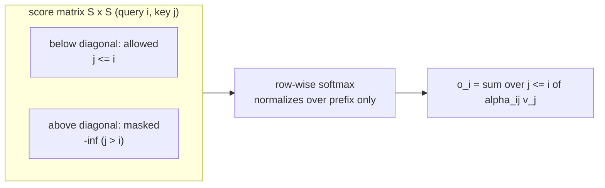
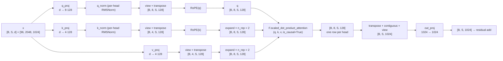

# Attention in LLaMA-3-Lite — From First Principles

> **Audience:** beginner → intermediate. You know what a transformer is and have
> glanced at `model.py`; you want the complete *why* behind the attention block:
> the scaled dot product, the `√d_k` scaling, the causal mask, the eight heads,
> the grouped-query KV sharing, and the Flash-Attention-2 path — with every
> number worked out at this project's scale (batch 96, sequence 2048, `d_model`
> 1024).

## Table of Contents

1. The 60-Second Summary
2. Why Attention Exists
3. Intuition: Attention as Content-Addressable Retrieval
4. Scaled Dot-Product Attention, Step by Step
5. Why Divide by √d_k — The Variance Argument
6. Causal Masking: Why the Future Must Not Leak
7. Multi-Head Attention: Anatomy and Purpose
8. Grouped-Query Attention: Sharing the KV Heads
9. Flash Attention 2 / SDPA: From O(S²) to O(S) Memory
10. Compute Cost at This Project's Scale
11. How the Code Realizes It — Walkthrough and Shape Trace
12. Edge Cases and Pitfalls
13. Further Reading

---

## 1. The 60-Second Summary

Attention is the layer that lets each token in a sequence look at every other
token and decide, from *content*, how much weight to give each one when
producing its output. A token emits a **query** ("what am I looking for"), every
token emits a **key** ("what I am") and a **value** ("what I carry"); the output
of a position is the weighted sum of all values, where the weight of value $j$
is the softmax of the dot product between position $i$'s query and position
$j$'s key, divided by $\sqrt{d_k}$. Because the language-modeling task is
causal — each token may only see itself and its predecessors — the score matrix
is masked so that future tokens contribute nothing. LLaMA-3-Lite's attention
(`model.py:GroupedQueryAttention`) splits this into 8 heads of width 128, shares
the key/value heads between pairs of query heads (4 KV heads, `n_rep = 2`), and
delegates the actual math to PyTorch's fused
`F.scaled_dot_product_attention(q, k, v, is_causal=True)`, which on an A100 runs
Flash Attention 2: same numbers, but $O(S)$ memory instead of $O(S^2)$ and no
materialized attention matrix.

## 2. Why Attention Exists

### 2.1 The problem: modeling dependencies between positions

Language is a sequence of tokens, and the job of a decoder-only model is to
predict the next token given the previous ones. The hard part is that any two
positions can matter to each other: the subject of a sentence and its verb can
be tens of tokens apart, with arbitrary structure in between. A model needs a
mechanism whose *connectivity* is not fixed by construction — any position must
be able to reach any earlier position — and whose *strength of connection* is
computed from the content of the two positions, not from a hand-written rule.

The pre-attention alternatives each fail on one of these requirements:

- **Fixed-window context** (an $n$-gram model, or a convolutional receptive
  field): position $i$ can only see $i-n+1 \dots i$. Long-range dependencies are
  simply out of reach, and the budget grows linearly with the range you want.
- **Recurrent state** (an RNN/LSTM): in principle the hidden state at step $i$
  summarizes all of history, but in practice the state is a fixed-size vector
  that must compress everything, and gradients must flow through the recurrence
  to reach earlier steps — vanishing-gradient territory. The path from position
  $i$ to position $j$ is $|i-j|$ long.
- **Fully-connected, fixed weights**: every position attends to every other with
  the *same* weight. This has full connectivity but zero selectivity — it cannot
  express "attend to the subject, not the adverb".

Attention solves all three at once: every position computes a *query*, every
position offers a *key* and a *value*, and the weight between positions $i$ and
$j$ is a learned, content-dependent function of the query at $i$ and the key at
$j$. Connectivity is complete, the strength is computed on the fly, and the path
from any position to any other is exactly one hop — gradient flow is direct.

### 2.2 Where it sits in the model

Attention is one of two sublayers inside each decoder block; the other is the
feed-forward network (see [feedforward.md](feedforward.md)). The block applies
them in pre-norm residual form:

```python
# illustrative
# model.py:DecoderBlock.forward (verbatim)
x = x + self.attention(self.attention_norm(x))
x = x + self.ffn(self.ffn_norm(x))
```

The residual stream `x` of shape `[B, S, d_model]` carries information through
all 16 blocks (`model.py:build_transformer` builds `n_layers = 16` of them),
and each block's attention reads it, mixes information *across positions*, and
writes the result back. That cross-position mixing is the one thing the rest of
the model cannot do: the feed-forward network and the norms operate per token,
independently. Attention is the only place where tokens talk to each other.

## 3. Intuition: Attention as Content-Addressable Retrieval

Think of a hash table, but differentiable. At every position you have three
vectors:

- **Query** $q_i$ — "what am I looking for". In a translation example, the
  token at position $i$ might be looking for the subject it depends on, or a
  coreferent noun.
- **Key** $k_j$ — "what I am". Each position announces its identity, in the
  same space as the queries so that dot products are meaningful.
- **Value** $v_j$ — "what I carry". The payload that position $j$ will hand
  over, in whatever proportion it is selected.

The retrieval: position $i$ computes how well each key $k_j$ matches its query
$q_i$ (the dot product, a similarity measure), normalizes those scores into a
probability distribution (softmax), and returns the weighted sum of the values.
So the output of position $i$ is a *mixture of the values of every position,
with mixture weights determined by content similarity*:

$$o_i = \sum_{j=1}^{S} \alpha_{ij} v_j, \qquad
\alpha_{ij} = \frac{\exp\big(q_i \cdot k_j / \sqrt{d_k}\big)}
{\sum_{j'=1}^{S} \exp\big(q_i \cdot k_{j'} / \sqrt{d_k}\big)}.$$

This is not a lookup with exact keys — it is a *soft* lookup: if the query is
somewhere between two keys, the output is a blend of the two values. And because
everything is differentiable, the projections that produce $q$, $k$, $v$ are
learned end-to-end: training discovers what kinds of "matching" are useful for
the loss. Different heads (Section 7) learn different retrieval patterns —
some heads track the previous token, some track syntactic relations, some track
positional structure via RoPE (Section 4 of
[positional-encoding.md](positional-encoding.md)).

### 3.1 A tiny worked example

Take three tokens with 2-dimensional keys and values, and suppose the query of
token 2 happens to point exactly at key 0:

```
keys:   k0 = (1, 0)    k1 = (0, 1)    k2 = (0.7, 0.7)
values: v0 = (5, -2)   v1 = (0, 3)    v2 = (1, 1)
query:  q2 = (1, 0)
```

Dot products (ignoring the $\sqrt{d_k}$ factor for the example): $q_2 \cdot k_0
= 1$, $q_2 \cdot k_1 = 0$, $q_2 \cdot k_2 = 0.7$. Softmax of $(1, 0, 0.7)$ gives
roughly $\alpha = (0.42, 0.15, 0.30)$ (after subtracting the max for stability,
$\exp$ of $(0, -1, -0.3)$ normalized). The output is
$o_2 = 0.42 \cdot v_0 + 0.15 \cdot v_1 + 0.30 \cdot v_2 = (2.4, -0.39)$. Token 2
mostly retrieved token 0's payload, diluted by the others. The mechanism has
selected "who to listen to" from content alone — no position index, no
hand-written rule. (With the real $\sqrt{d_k}$ scaling and $d_k = 128$ the
numbers are the same in kind; see Section 5 for why the division matters.)

## 4. Scaled Dot-Product Attention, Step by Step

### 4.1 The formula

For a single head, let $Q, K, V \in \mathbb{R}^{S \times d_k}$ be the query,
key, and value matrices (one row per sequence position; $d_k$ is the head
dimension, 128 here). Attention is:

$$\text{Attention}(Q, K, V) = \operatorname{softmax}\!\left(\frac{Q K^\top}{\sqrt{d_k}}\right) V,$$

with the softmax applied row-wise (each row is one query's distribution over the
$S$ keys). The three ingredients:

1. **$Q K^\top$** — the $S \times S$ score matrix; entry $(i, j)$ is the raw
   similarity between query $i$ and key $j$. This is a batched matmul over the
   head dimension: for every pair of positions, a length-$d_k$ dot product.
2. **$1/\sqrt{d_k}$** — the *temperature* that keeps the scores in a sane
   range; Section 5 derives why the exact factor is $\sqrt{d_k}$.
3. **softmax + multiply by $V$** — normalize each row to a probability
   distribution and take the weighted average of the values.

The whole thing is two matrix multiplications and a row-wise softmax in
between. That is the entire "attention mechanism" — everything else in this doc
(positions, heads, masking, GQA, Flash Attention) is an engineering refinement
on top of this one formula.

### 4.2 What the softmax buys you

Why softmax rather than, say, a plain average or a rectified score?

- **Normalization**: each row sums to 1, so the output is a convex combination
  of values — the output lives in the same space and scale as the values
  regardless of the number of keys.
- **Selectivity**: the exponential sharpens differences. A key that scores
  twice as high gets $e^1 \approx 2.7\times$ the weight of a baseline key, not
  $2\times$; the mechanism is pushed toward near-one-hot "retrieval" while
  remaining fully differentiable.
- **Differentiability**: softmax is smooth everywhere, so the discrete choice
  "which keys to attend to" is relaxed into a continuous one and gradient
  descent can move the query to point at better keys.

## 5. Why Divide by √d_k — The Variance Argument

### 5.1 The problem: dot products grow with dimension

Consider the dot product of two *independent* random vectors with independent,
zero-mean, unit-variance entries (a reasonable model of freshly-initialized or
normalized query and key vectors):

$$s = q \cdot k = \sum_{i=1}^{d_k} q_i k_i, \qquad
\mathbb{E}[q_i] = \mathbb{E}[k_i] = 0,\quad
\operatorname{Var}(q_i) = \operatorname{Var}(k_i) = 1.$$

Because the entries are independent and zero-mean, the cross terms vanish and
the variance of each product term is

$$\operatorname{Var}(q_i k_i) = \mathbb{E}[q_i^2]\,\mathbb{E}[k_i^2]
- \mathbb{E}[q_i]^2 \mathbb{E}[k_i]^2 = 1 \cdot 1 - 0 = 1,$$

so the variance of the sum is additive:

$$\operatorname{Var}(s) = \sum_{i=1}^{d_k} \operatorname{Var}(q_i k_i) = d_k,
\qquad \operatorname{std}(s) = \sqrt{d_k}.$$

The score's standard deviation is $\sqrt{d_k}$ — it grows with the head
dimension. For $d_k = 128$ (this model's `head_dim`, from
`config.py:get_config`), $\operatorname{std}(s) \approx 11.3$. The softmax
inputs are spread over roughly $\pm 6 \cdot 11.3 \approx \pm 68$ once you
account for the tail — a range that spans ~30 orders of magnitude in
$e^z$. Scaling by $1/\sqrt{d_k}$ normalizes the variance back to 1, making the
softmax inputs $O(1)$ regardless of $d_k$:

$$\operatorname{Var}\!\left(\frac{s}{\sqrt{d_k}}\right) = \frac{d_k}{d_k} = 1.$$

That is the entire reason for the factor: it is a variance-normalizing
temperature. (This is exactly the argument in the original transformer paper;
the derivation above makes the "why $d_k$ and not $d_k/2$" question precise —
the variance of a length-$d_k$ sum is $d_k$, so the correct normalization is
$\sqrt{d_k}$.)

### 5.2 What happens without it: softmax saturation kills the gradient

Softmax is only a useful learning signal where it is *sensitive* to its inputs.
Write the softmax row as $p = \operatorname{softmax}(z)$; the Jacobian is

$$\frac{\partial p_i}{\partial z_j} = p_i\,(\delta_{ij} - p_j).$$

If one entry of $z$ is much larger than the rest (which is typical when
$\operatorname{std}(z) \approx 11$: the max of 2048 draws sits around
$11.3 \cdot \sqrt{2 \ln 2048} \approx 45$), then $p$ is nearly one-hot: $p_m
\approx 1$ for the argmax $m$ and $p_{i \ne m} \approx 0$. In that regime

$$\frac{\partial p_m}{\partial z_j} \approx \delta_{mj} - p_j \approx 0
\quad\text{for all } j,$$

so the gradient of *everything downstream of the softmax* with respect to the
scores is essentially zero — the row is a hard argmax that backprop cannot
push. With unnormalized scores, early in training (random queries/keys) most
rows land in this saturated state, and the model cannot learn to retarget its
attention: the gradient signal through the softmax is dead. The $1/\sqrt{d_k}$
factor keeps typical scores in the regime where
$p_i (1 - p_i)$ is comfortably nonzero, so the softmax stays "plastic".

The same intuition in terms of the final cross-entropy gradient: the loss
gradient with respect to the logits is $p - y_{\text{target}}$; when $p$ is a
near-one-hot at the *wrong* token, the gradient is large but the softmax
Jacobian (which sits between the logits and $p$) is what actually backprops —
and it is the same near-zero matrix. Scaling fixes the root cause, not the
symptom.

### 5.3 Numbers at this project's scale

- `head_dim` = 128 → unscaled score std $\sqrt{128} \approx 11.31$; scaled std
  = 1.
- Unscaled, the typical max score over a row of $S = 2048$ keys sits around
  $11.31 \cdot \sqrt{2 \ln 2048} \approx 11.31 \cdot 3.94 \approx 45$; $e^{45}$
  dwarfs every other term, i.e. effectively one-hot. Scaled, the typical max is
  $\approx 3.9$ and the softmax has real spread.
- With `qknorm=True` (the default in `config.py:get_config`), the query and key
  vectors are RMS-normalized per head (`model.py:GroupedQueryAttention`
  applies `RMSNorm(head_dim)` to $q$ and $k$ before RoPE; see
  [normalization.md](normalization.md) Section 8 for the full story), so
  $\|q\| \approx \|k\| \approx \sqrt{d_k}$ and $q \cdot k$ is bounded by
  $d_k = 128$ in magnitude by Cauchy–Schwarz. The $\sqrt{d_k}$ scaling inside
  `F.scaled_dot_product_attention` still applies on top, keeping typical logits
  $O(1)$; the two mechanisms are complementary — QK-norm caps the worst case,
  the scaling normalizes the typical case.

## 6. Causal Masking: Why the Future Must Not Leak

### 6.1 The training setup is next-token prediction

The model is trained to predict token $t+1$ from tokens $1 \dots t$ (see
[transformers-from-scratch.md](transformers-from-scratch.md) and
[loss-functions.md](loss-functions.md) for the shift-by-one setup). The target
for position $i$ is the token at position $i+1$, so position $i$'s prediction
may legitimately use only positions $j \le i$. If attention let position $i$
read position $j > i$, the model could cheat: the answer to "what comes after
$i$" is literally sitting at position $i+1$ in the input. At training time the
full sequence is fed in at once (no sequential loop), so *nothing except the
mask* prevents this leakage — the model would learn "copy the next token", and
at generation time (where tokens are produced one at a time and the future
genuinely does not exist) it would collapse.

The fix is to force the score matrix to be lower-triangular: set the score of
every (query $i$, key $j$) pair with $j > i$ to $-\infty$ before the softmax.
Since $e^{-\infty} = 0$, those positions get zero attention weight and their
values contribute nothing; equivalently, the softmax is taken over the prefix
only:

$$o_i = \sum_{j \le i} \alpha_{ij} v_j, \qquad
\alpha_{ij} = \frac{\exp\!\big((q_i \cdot k_j + M_{ij}) / \sqrt{d_k}\big)}
{\sum_{j' \le i} \exp\!\big((q_i \cdot k_{j'} + M_{ij'}) / \sqrt{d_k}\big)},$$

with $M_{ij} = 0$ for $j \le i$ and $M_{ij} = -\infty$ for $j > i$. Masked
entries also receive no gradient through the softmax, which is exactly right:
a future token is not allowed to influence an earlier prediction, so it should
not influence the parameters through that prediction either.



### 6.2 The flag in the code

The mask is not built by hand anywhere in `model.py`. The attention module
requests it declaratively:

```python
# model.py:GroupedQueryAttention.forward (verbatim)
x = F.scaled_dot_product_attention(q, k, v, is_causal=True)
```

`is_causal=True` tells PyTorch's `scaled_dot_product_attention` to apply the
causal mask. How the mask is *realized* depends on the backend (Section 9):
the eager "math" backend materializes an additive $S \times S$ mask of
$-\infty$ above the diagonal; the Flash Attention kernels never build the mask
at all — they skip the masked tiles, which is both faster and uses no extra
memory. Either way the caller supplies a flag, not a tensor.

There is one subtlety worth being explicit about: the model has **no padding
mask** and needs none. The data pipeline packs documents contiguously with EOS
separators and no padding tokens (see
[data-engineering.md](data-engineering.md)), and the loss masks ignored
positions with `ignore_index=-100` rather than the attention
(`model.py:chunked_head_cross_entropy_with_z` defaults to
`ignore_index=-100`). Causal masking is therefore the *only* masking the model
ever needs — which is exactly the situation where the fused `is_causal` path
can be used unconditionally (Section 9.5).

### 6.3 The test that proves causality

`tests/test_model.py::TestGroupedQueryAttention.test_causality` verifies the
property directly. The setup (from the test source):

```python
# illustrative
torch.manual_seed(0)
attn = GroupedQueryAttention(
    d_model=32, n_heads=4, n_kv_heads=2, head_dim=8,
    max_seq_len=16, rope_theta=10000.0,
).to(device).eval()
x = torch.randn(1, 6, 32, device=device)
out1 = attn(x)
x2 = x.clone()
x2[:, -1, :] += torch.randn_like(x[:, -1, :]) * 10.0
out2 = attn(x2)
assert torch.allclose(out1[:, :3, :], out2[:, :3, :], atol=1e-5)
```

It perturbs the *last* token (position 5) by a huge amount — ten times a
standard normal — and re-runs the forward pass. Under a causal mask, positions
0–2 may only read positions $\le$ themselves, so the perturbation at position 5
must leave their outputs untouched; the test asserts `out1[:, :3, :]` and
`out2[:, :3, :]` agree to `atol=1e-5`. (Positions 3–5 are *not* checked: 4 and
5 may legitimately attend to token 5, and 3 — while it happens not to — is
allowed to in principle.) The model runs in `eval()` mode so no dropout noise
is involved; the small tolerance absorbs floating-point nondeterminism rather
than any real leakage. If `is_causal=True` were dropped, the first three
outputs would shift by the perturbed value's contribution and the test would
fail loudly.

## 7. Multi-Head Attention: Anatomy and Purpose

### 7.1 Why more than one head

A single attention distribution per position is a severe bottleneck: the output
of position $i$ would be one weighted average, committing to a single "who to
listen to" pattern. Real text needs several simultaneous patterns — token $i$
may need to copy the immediately preceding token *and* resolve a long-range
coreference *and* track positional structure — and a single softmax cannot
express three different retrieval schemes at once.

Multi-head attention fixes this by running $H$ independent attention
computations in parallel, each in its own $d_k$-dimensional subspace, and
concatenating the results:

$$\text{MHA}(x) = \text{Concat}(\text{head}_1, \dots, \text{head}_H)\, W_O,
\qquad
\text{head}_h = \text{Attention}(x W_{Qh},\, x W_{Kh},\, x W_{Vh}).$$

Each head has its own query, key, and value projection, so each learns its own
retrieval pattern; the concatenated outputs are mixed by the output projection
$W_O$ into the $d_model$-dimensional stream. Two properties follow:

- **Parallel retrieval channels.** Different heads specialize (empirically:
  positional/adjacent-token heads, syntactic heads, coreference heads), and the
  output projection learns how to combine them.
- **Averaging/ensemble effect.** Per-head attention distributions are noisy
  estimates; averaging across heads reduces variance, which is part of why MHA
  trains so much more reliably than single-head attention at equal parameter
  count.

The cost is bounded: the total width of the $H$ heads equals $d_model$ (the
projections concatenate to exactly the input width), so the parameter count of
the attention block grows with $H$ only through the KV projections — which is
precisely what GQA shrinks back down (Section 8).

### 7.2 The projection anatomy

In `model.py:GroupedQueryAttention.__init__`, the four projections are plain
linear layers without bias:

```python
# illustrative
# model.py:GroupedQueryAttention.__init__ (verbatim)
self.q_proj = nn.Linear(d_model, n_heads * head_dim, bias=False)
self.k_proj = nn.Linear(d_model, n_kv_heads * head_dim, bias=False)
self.v_proj = nn.Linear(d_model, n_kv_heads * head_dim, bias=False)
self.out_proj = nn.Linear(n_heads * head_dim, d_model, bias=False)
```

- `q_proj` produces all $H$ queries at once: `[B, S, n_heads * head_dim]`,
  reshaped to `[B, S, n_heads, head_dim]` and transposed to
  `[B, n_heads, S, head_dim]` so the head dimension is the second axis, as
  `F.scaled_dot_product_attention` expects.
- `k_proj` / `v_proj` are the grouped-query versions: they produce
  `n_kv_heads = 4` heads' worth, not 8 (Section 8).
- `out_proj` maps the concatenated heads `[B, S, n_heads * head_dim]` back to
  `d_model`, mixing information *across* heads (each output coordinate is a
  learned combination of all heads).

The `bias=False` everywhere is deliberate and LLaMA-3-consistent: attention
logits are centered by the norms, and dropping biases removes parameters that
would mostly learn offsets (see [normalization.md](normalization.md)).

### 7.3 Shapes and parameters at this scale

With `d_model = 1024`, `n_heads = 8`, `n_kv_heads = 4`, `head_dim = 128`
(`config.py:get_config`; these are also the defaults of
`model.py:build_transformer`):

| Tensor | Shape | Notes |
|---|---|---|
| `x` (block input) | `[96, 2048, 1024]` | batch 96, seq 2048 |
| `q` after `q_proj` + view + transpose | `[96, 8, 2048, 128]` | 8 heads × 128 |
| `k`, `v` after projections + transpose | `[96, 4, 2048, 128]` | 4 shared KV heads |
| `k`, `v` after GQA expansion | `[96, 8, 2048, 128]` | broadcast ×2 (Section 8.4) |
| scores (conceptual) | `[96, 8, 2048, 2048]` | never materialized (Section 9) |
| SDPA output | `[96, 8, 2048, 128]` | one output row per head |
| after transpose + view | `[96, 2048, 1024]` | heads concatenated |
| after `out_proj` | `[96, 2048, 1024]` | back to the residual stream |

Parameter count of one attention block (all `bias=False`):

- `q_proj`: $1024 \times 1024 = 1{,}048{,}576$
- `k_proj`: $1024 \times 512 = 524{,}288$ (4 heads × 128)
- `v_proj`: $1024 \times 512 = 524{,}288$
- `out_proj`: $1024 \times 1024 = 1{,}048{,}576$
- **Total: 3,145,728 per layer**, or 50,331,648 across the 16 layers
  (≈ 50.3 M, about 20% of the 251.7 M non-embedding parameters — the rest is
  the feed-forward network; cross-check: 16 × 3,145,728 + 16 × 15,730,944 − …
  the per-layer sum of attention + FFN + norms is 15,730,944, and
  16 × 15,730,944 + 1024 = 251,696,128 ≈ 251.7 M, matching
  `model.py:Transformer.get_num_params`'s advertised figure).
- QK-norm adds a further $2 \times 128 = 256$ parameters per layer (two
  RMSNorm gains of `head_dim`), which
  `tests/test_model.py::TestQKNorm.test_param_count_increases_when_enabled`
  checks.

Why `head_dim = 128` and not larger? The per-pair score cost is proportional to
$d_k$ (a dot product of length 128), and Flash Attention 2 requires
$d_k \le 256$ and a multiple of 8 for its fast path — 128 is the LLaMA-3
convention, comfortably inside the fused-kernel envelope. The product
$n_{heads} \times head\_dim = d\_model$ is fixed by the projection width, so
"more heads" and "wider heads" trade against each other at constant parameter
count.

## 8. Grouped-Query Attention: Sharing the KV Heads

### 8.1 The problem: the KV cache

At inference time a decoder generates tokens one at a time. To avoid
recomputing the keys and values of all previous tokens at every step, a serving
stack caches them: per sequence, per layer, it stores K and V for every
position generated so far. The cache size per token is

$$\text{KV bytes/token/layer} = 2 \cdot n_{kv\_heads} \cdot head\_dim \cdot
\text{bytes},$$

and it is multiplied by sequence length and layer count. With plain
multi-head attention ($n_{kv\_heads} = n_{heads} = 8$) at this scale in BF16:

$$8 \text{ heads} \times 2 \text{ (K and V)} \times 128 \times 2\ \text{B}
= 4\ \text{KiB/token/layer},$$

$$4\ \text{KiB} \times 2048\ \text{tokens} \times 16\ \text{layers}
= 128\ \text{MiB/sequence},$$

$$128\ \text{MiB} \times 96 = 12\ \text{GiB}$$

for a full batch of 96 concurrent sequences. That is a large, purely
*inference-side* memory bill that grows linearly with context length and batch
— and it buys nothing at training time. (During training, the KV activations
are transient per layer, and Flash Attention recomputes rather than stores the
scores; the cache arithmetic is the design driver for GQA, which the GQA paper
motivates exactly this way.)

### 8.2 The idea: share K and V heads, keep Q heads

**Multi-query attention** (MQA) goes to the extreme: a single KV head shared by
all query heads, which minimizes the cache but measurably hurts quality — one
KV projection must serve every distinct retrieval pattern. **Grouped-query
attention** (GQA) interpolates: the $n_{heads}$ query heads are partitioned
into $n_{kv\_heads}$ groups, and each group shares one key head and one value
head. The sharing factor is

$$n_{rep} = \frac{n_{heads}}{n_{kv\_heads}},$$

computed in the code as `self.n_rep = n_heads // n_kv_heads`
(`model.py:GroupedQueryAttention.__init__`). With 8 query heads and 4 KV heads,
$n_{rep} = 2$: query heads 0–1 share KV head 0, query heads 2–3 share KV head
1, and so on. Every query head still gets its own softmax over a distinct key
stream — the *scores* are full-size — but the keys and values themselves are
computed once per group.

### 8.3 What it saves: parameters and cache, both exactly halved

The KV projections are $n_{kv\_heads}/n_{heads} = 1/2$ the width they would have
under MHA:

- Params per layer: MHA `k_proj` + `v_proj` would be
  $2 \times 1024 \times 1024 = 2{,}097{,}152$; with GQA they are
  $2 \times 1024 \times 512 = 1{,}048{,}576$ — a saving of 1,048,576 per layer,
  16,777,216 total (≈ 16.8 M parameters, 6.7% of the non-embedding count).
- KV cache: 4 KiB → 2 KiB per token per layer, i.e. the 12 GiB figure above
  becomes

$$2\ \text{KiB} \times 2048 \times 16 = 64\ \text{MiB/sequence},\qquad
64\ \text{MiB} \times 96 = 6\ \text{GiB}.$$

Exactly half, for both. The quality/cost knob is $n_{kv\_heads}$: 4 sits
between MQA's 1 and MHA's 8, capturing most of the cache saving with minimal
quality loss (the empirical finding of the GQA paper, and the choice LLaMA-3
made at this size).

### 8.4 The eager expansion in the code

`model.py:GroupedQueryAttention.forward` realizes the sharing by broadcasting
each KV head to its group before calling SDPA:

```python
# illustrative
# model.py:GroupedQueryAttention.forward (verbatim)
if self.n_rep > 1:
    k = k[:, :, None, :, :].expand(B, self.n_kv_heads, self.n_rep, S, self.head_dim).reshape(B, self.n_heads, S, self.head_dim)
    v = v[:, :, None, :, :].expand(B, self.n_kv_heads, self.n_rep, S, self.head_dim).reshape(B, self.n_heads, S, self.head_dim)
```

Step by step, for `k` of shape `[B, 4, S, 128]`:

1. `k[:, :, None, :, :]` inserts a singleton axis: `[B, 4, 1, S, 128]`.
2. `.expand(B, 4, 2, S, 128)` broadcasts along the new axis. `expand` is a
   *view*: it writes no data, it just gives every output index in the middle
   axis stride 0, so this costs nothing.
3. `.reshape(B, 8, S, 128)` collapses `(4, 2)` into 8. Because the expanded
   view has a stride-0 axis, a contiguous `[B, 8, S, 128]` cannot be a view of
   it — the reshape materializes a fresh copy, ~0.38 GiB per tensor per layer
   in BF16 at this scale (2 × 96 × 8 × 2048 × 128 × 2 B = 402.7 MB). This is a
   real, if transient, allocation; it is freed as soon as the SDPA call
   finishes. [Verified by experiment: `expand` returns a stride-0 view, the
   subsequent `reshape` is contiguous and does not alias the original
   storage.]
4. The interleaving produced by the collapse is immaterial: query head $h$
   reads exactly KV head $\lfloor h / n_{rep} \rfloor$, and since the $n_{rep}$
   replicas are identical broadcasts, every ordering gives the same result.

Note the order of operations: RoPE is applied to `k` *before* the expansion
(`q = self.rope(q, S); k = self.rope(k, S)` above the snippet). This matters:
the rotation is elementwise per head, so rotating the 4 KV heads once and then
broadcasting is exactly equivalent to rotating 8 copies — and costs half the
trig multiplies. The eager expansion also means SDPA sees 8 fully-materialized
KV heads; a hypothetical fused "grouped" kernel could avoid the copy entirely,
but the current code prioritizes simplicity, and the 0.77 GiB transient (K + V
together) is a small fraction of the attention budget at this scale (Section
9.1). [INFERENCE: the choice of eager expansion over a grouped SDPA call is a
simplicity/portability tradeoff; the memory cost above is measured, not
estimated.]

### 8.5 The divisibility constraint and its test

`n_rep` uses *integer* division, so nothing at construction time checks that
$n_{heads}$ is divisible by $n_{kv\_heads}$. If it is not, the `reshape` in the
expansion has the wrong element count (e.g. `n_heads=8`, `n_kv_heads=3` gives
$3 \times 2 = 6$ expanded heads, not 8) and raises `RuntimeError` at the first
forward pass. The test suite pins both behaviors:

- `tests/test_model.py::TestGroupedQueryAttention.test_n_rep_consistency`
  iterates the valid configurations `(4, 2)`, `(8, 4)`, `(4, 4)`, `(2, 1)`,
  asserts `attn.n_rep == n_heads // n_kv` for each, and checks the output shape
  `(1, 8, 32)`. Note `(4, 4)` is the `n_rep = 1` case — plain MHA, which GQA
  degenerates to when the group count equals the head count.
- `tests/test_model.py::TestGroupedQueryAttention.test_invalid_n_kv_heads_raises`
  builds `(8, 3)` and asserts a `RuntimeError` on forward.

## 9. Flash Attention 2 / SDPA: From O(S²) to O(S) Memory

### 9.1 The O(S²) problem, with this project's numbers

The naive implementation materializes the score matrix
$S_{bh} = Q_{bh} K_{bh}^\top \in \mathbb{R}^{S \times S}$ in global memory
before the softmax and the second matmul. At this scale:

$$96 \times 8 \times 2048 \times 2048 = 3{,}221{,}225{,}472\ \text{elements}
\approx 3.2\ \text{G per layer},$$

which is 12.0 GiB in FP32 or 6.0 GiB in BF16 — *per layer, per step, in
addition to the model itself*. Sixteen layers would need ~96–192 GiB of
transient score tensors. This is the single largest activation cost in a
transformer at long context, and it is why the memory-engineering story of this
project (see [memory-engineering.md](memory-engineering.md)) treats attention
memory as a first-class problem. The scaling is the issue: the scores tensor is
$O(B \cdot H \cdot S^2 \cdot 4\ \text{bytes})$, quadratic in sequence length,
while everything else in the model is linear in $S$.

### 9.2 The fix: never materialize the scores — online softmax and tiling

Flash Attention (and its successor Flash Attention 2) computes the same
function without ever writing the full $S \times S$ matrix. The trick has two
parts:

1. **Tiling.** The computation is blocked: load a tile of $Q$ (`[B_r, d_k]`)
   and a tile of $K$ (`[B_c, d_k]`), form only the small `[B_r, B_c]` score
   block, and accumulate partial outputs `[B_r, d_k]`. At no point does more
   than one tile (a few tens of KiB) of scores exist in SRAM/registers.
2. **Online softmax.** The softmax denominator for a row is a *running* sum
   maintained as key tiles stream in. The standard trick keeps a running max
   $m$ and running sum $l$:

$$\text{softmax}(x)_i = \frac{e^{x_i - m}}{\sum_j e^{x_j - m}}
\quad\Longleftrightarrow\quad
\text{update: } m' = \max(m, m_{\text{tile}}),\quad
l' = l \cdot e^{m - m'} + l_{\text{tile}} \cdot e^{m_{\text{tile}} - m'},$$

   rescaling previously accumulated output by $e^{m - m'}$ when the max moves.
   This is the same max-subtraction used for numerical stability in any
   softmax, but done *incrementally*, so no separate pass over the full row is
   needed.

The result: peak memory for the attention computation is $O(S)$ (the output
`[B, H, S, d_k]` plus tiles), not $O(S^2)$. At this scale the SDPA output is
$96 \times 8 \times 2048 \times 128 = 201{,}326{,}592$ elements — 0.38 GiB in
BF16 — versus the 6.0 GiB score tensor it replaces. The backward pass reuses
the same trick: instead of storing the scores, Flash Attention 2 *recomputes*
them from the saved softmax statistics $(m, l)$ and the query/key tiles,
trading a small amount of extra FLOPs for the same $O(S)$ memory. This is
exactly the memory-engineering lever the project's headline numbers rely on
(`docs/reference/memory-stack.md` derives the full budget).

### 9.3 Causal tiling saves compute, too

With `is_causal=True`, the fused kernels only process tiles whose row block is
at or below the diagonal (roughly the lower half of the matrix). Each tile
above the diagonal is skipped entirely — no scores computed, no softmax, no
output accumulation. The causal flag is thus not just a correctness feature; in
the fused path it roughly halves the QKᵀ and PV work versus the full matrix.

### 9.4 Backend dispatch

`F.scaled_dot_product_attention` is a single entry point with several
implementations behind it. Which one runs is decided at runtime from the input
properties (device, dtype, shapes, contiguity, whether `is_causal` or an
explicit mask is set):

| Backend | Conditions (typical) | Notes |
|---|---|---|
| FlashAttention (FA2) | CUDA, fp16/bf16, `head_dim` ≤ 256 and a multiple of 8, 4-D contiguous inputs, causal or no mask | Fastest on Ampere+; this is the A100 path for this model |
| memory-efficient | broader conditions incl. fp32 and explicit masks | online-softmax kernel, xformers lineage |
| cuDNN | some CUDA configurations | occasionally chosen for fp16 |
| math (eager) | everything else, incl. CPU | the reference implementation; builds the causal mask as an additive tensor |

The tests in `tests/` run on CPU in FP32 (the `device` fixture defaults to
`cpu` and `dtype` to `torch.float32` on CPU, `tests/conftest.py:device`,
`tests/conftest.py:dtype`), so they exercise the *math* backend — the slowest
but the most portable. The causality and GQA tests therefore verify the
*semantics* (masking, sharing, shapes), not the fused kernels; the fused path
is exercised by the e2e GPU script. All backends implement the same
mathematical function, so the correctness tests transfer.

### 9.5 Why there is no `mask` parameter in the forward

`GroupedQueryAttention.forward` takes exactly one argument:

```python
def forward(self, x):
```

There is no `attn_mask` parameter, and the SDPA call passes only
`is_causal=True`. The reasons are grounded in the design:

1. **The model only ever needs causal masking.** There is no padding to mask
   (documents are packed contiguously with EOS separators —
   [data-engineering.md](data-engineering.md) — and the loss handles ignored
   positions via `ignore_index=-100`), so an arbitrary-mask API would have
   exactly one caller in the entire codebase: none.
2. **Arbitrary masks defeat the fused backend.** FlashAttention's fast kernels
   support either no mask or the built-in causal flag; a hand-built additive
   mask forces SDPA to fall back to the memory-efficient or math backend,
   losing the O(S) memory win and the causal tiling speedup. Keeping the
   signature mask-free guarantees the fast path stays reachable.
3. **The flag is a commitment, not an option.** Baking `is_causal=True` into
   the one call site makes the invariant "this model is a causal decoder"
   locally visible and un-forgettable — the test in Section 6.3 exists because
   the property is load-bearing.

So the removal is not an omission but the API surface matching the actual
problem: a decoder-only model with no padding needs exactly one mask, and that
mask is expressed by one boolean. [INFERENCE: the intent behind the minimal
signature; the code facts (single-argument `forward`, `is_causal=True`, no
padding pipeline) are verified in source.]

## 10. Compute Cost at This Project's Scale

### 10.1 Per-layer forward FLOPs

FLOPs count 1 multiply + 1 add per MAC. With $B = 96$, $S = 2048$,
$d = 1024$, $H = 8$, $H_{kv} = 4$, $d_k = 128$, one attention layer's forward
pass costs:

| Operation | Matmul shape | FLOPs (forward) |
|---|---|---|
| `q_proj` | `[96, 2048, 1024] × [1024, 1024]` | $2 \cdot 96 \cdot 2048 \cdot 1024^2 = 412.3$ G |
| `k_proj` | `[96, 2048, 1024] × [1024, 512]` | $2 \cdot 96 \cdot 2048 \cdot 1024 \cdot 512 = 206.2$ G |
| `v_proj` | same | 206.2 G |
| QKᵀ | `[96, 8, 2048, 128] × [96, 8, 128, 2048]` | $2 \cdot 96 \cdot 8 \cdot 2048^2 \cdot 128 = 824.6$ G |
| softmax | elementwise (max, sub, exp, sum, div) | ≈ 16 G (5 ops × 3.2 G elements) |
| PV | `[96, 8, 2048, 2048] × [96, 8, 2048, 128]` | $2 \cdot 96 \cdot 8 \cdot 2048^2 \cdot 128 = 824.6$ G |
| `out_proj` | `[96, 2048, 1024] × [1024, 1024]` | 412.3 G |
| **Total** | | **≈ 2.90 TFLOPs per layer** |

Check the per-token picture: 2.90 T / 196,608 tokens = 14.8 MFLOPs per token
per layer. Of that, the projections contribute $6 d^2 = 6.3$ M (q and out each
$2 d^2$, k and v each $d^2$ under GQA), the score matmuls contribute
$4 S d = 8.4$ M, and softmax is negligible. The two terms that scale with $d^2$
(projections) and with $S \cdot d$ (scores) are the only ones that matter.

### 10.2 Training FLOPs

The backward pass of a matmul-dominated graph costs about twice the forward
(one gradient for the input, one for the weight), so training ≈ 3 × forward:

$$2.90\ \text{TFLOPs} \times 16\ \text{layers} \times 3 \approx
139\ \text{TFLOPs per step},$$

at 196,608 tokens per step ($96 \times 2048$). For context, the standard
`6 × params × tokens` rule of thumb gives
$6 \times 251.7 \text{ M} \times 196{,}608 \approx 297$ TFLOPs/step for the
whole model (attention + FFN + head); the attention-specific figure above
excludes the FFN (Section 10.1's total counts attention only) and the score
matmuls, which have no weights, are precisely why the attention-only count is
*not* derivable from the 6NT rule alone.

### 10.3 What GQA saves in FLOPs

The score matmuls (QKᵀ + PV = 1.65 T forward per layer) are the same under GQA
and MHA — every query head gets a full-size softmax either way. The savings are
confined to the KV projections: MHA would make `k_proj`/`v_proj` 1024-wide
instead of 512-wide, adding $2 \times 206.2 = 412.3$ GFLOPs forward per layer
(≈ 0.4 T/layer, ≈ 20 TFLOPs/step with the ×3 factor). Measured against the 139
TFLOPs/step total this is ~14% — real but secondary. The *decisive* wins of GQA
are the ones that do not show up in training FLOPs at all: the 16.8 M saved
parameters and the halved KV cache (Section 8.3). FLOPs drove the choice of
Flash Attention; GQA is a memory/parameter play.

### 10.4 Scaling with context length

As a function of $S$ and $d$, the two dominant per-token costs are:

$$\text{projections: } O(d^2), \qquad
\text{attention scores: } O(S \cdot d).$$

At this model's $S = 2048$, $d = 1024$, the score term (8.4 MFLOPs/token)
already exceeds the projection term (6.3 MFLOPs/token) — the crossover is near
$S \approx 1.5 d = 1536$ (GQA; $2d = 2048$ under MHA). This is the sense in
which "attention becomes the bottleneck at long context": every doubling of the
context doubles the score cost, and at some point it dominates the entire
model. It is also why the O(S) memory property of Flash Attention matters more
than its speed: at $S = 2048$ the naive score tensor is already 6–12 GiB per
layer, and that bill grows quadratically.

## 11. How the Code Realizes It — Walkthrough and Shape Trace

The full forward pass of `model.py:GroupedQueryAttention.forward` (the module
built per layer by `model.py:DecoderBlock` via `model.py:build_transformer`):

```python
# illustrative
def forward(self, x):
    B, S, _ = x.shape

    # Normalize over last axis (D) BEFORE transpose so RMSNorm sees head_dim.
    q = self.q_proj(x).view(B, S, self.n_heads, self.head_dim)
    k = self.k_proj(x).view(B, S, self.n_kv_heads, self.head_dim)
    v = self.v_proj(x).view(B, S, self.n_kv_heads, self.head_dim)
    q = self.q_norm(q)
    k = self.k_norm(k)
    q = q.transpose(1, 2)
    k = k.transpose(1, 2)
    v = v.transpose(1, 2)

    q = self.rope(q, S)
    k = self.rope(k, S)

    if self.n_rep > 1:
        k = k[:, :, None, :, :].expand(B, self.n_kv_heads, self.n_rep, S, self.head_dim).reshape(B, self.n_heads, S, self.head_dim)
        v = v[:, :, None, :, :].expand(B, self.n_kv_heads, self.n_rep, S, self.head_dim).reshape(B, self.n_heads, S, self.head_dim)

    x = F.scaled_dot_product_attention(q, k, v, is_causal=True)

    x = x.transpose(1, 2).contiguous().view(B, S, -1)
    return self.out_proj(x)
```

(The module is `model.py:GroupedQueryAttention`; `q_norm`/`k_norm` are per-head
RMSNorm when `qknorm=True`, `nn.Identity()` otherwise; `self.rope` is the
`model.py:RoPE` module with precomputed cos/sin buffers.)

### 11.1 Shape trace at production scale

| Step | Operation | Shape |
|---|---|---|
| 0 | block input `x` | `[96, 2048, 1024]` |
| 1 | `q_proj(x)` → `view` | `[96, 2048, 1024]` → `[96, 2048, 8, 128]` |
| 2 | `k_proj(x)` / `v_proj(x)` → `view` | `[96, 2048, 512]` → `[96, 2048, 4, 128]` |
| 3 | `q_norm(q)`, `k_norm(k)` | RMSNorm over last axis (128) — per head |
| 4 | `transpose(1, 2)` | `[96, 8, 2048, 128]` (and `[96, 4, 2048, 128]`) |
| 5 | `rope(q, S)`, `rope(k, S)` | same shapes; rotation per head (see [positional-encoding.md](positional-encoding.md)) |
| 6 | GQA expand + reshape | `[96, 4, 2048, 128]` → `[96, 8, 2048, 128]` |
| 7 | `F.scaled_dot_product_attention(q, k, v, is_causal=True)` | `[96, 8, 2048, 128]` |
| 8 | `transpose(1, 2)` + `contiguous()` + `view` | `[96, 2048, 1024]` |
| 9 | `out_proj` | `[96, 2048, 1024]` — back to the residual stream |

The attention-flow diagram, at the head level:



### 11.2 Points of interest in the walkthrough

- **QK-norm placement.** Normalization runs on the `[B, S, H, 128]` view
  *before* the transpose, so the norm sees `head_dim` on the last axis —
  exactly the per-head semantics (the comment in the code says this
  explicitly). It also runs *before* RoPE, which is a rotation and preserves
  norms (see [normalization.md](normalization.md) Section 8 and
  `tests/test_model.py::TestRoPE.test_rotation_is_orthogonal`).
- **RoPE on q and k only.** `v` is never rotated — position enters through the
  scores, not through the payload (Section 14 of
  [rope.md](../reference/rope.md)).
- **The `contiguous()` call.** `transpose(1, 2)` yields a non-contiguous
  tensor; `.view(B, S, -1)` requires contiguity, so the code materializes one
  explicit copy of the SDPA output. Without it, PyTorch would either copy
  implicitly or error; the explicit call makes the copy visible.
- **One SDPA call per layer, no manual kernels.** Despite the "Flash Attention"
  branding, `model.py` never calls a flash kernel directly — everything goes
  through `F.scaled_dot_product_attention`, and backend selection is PyTorch's
  job (Section 9.4). The custom Triton kernels in `kernels/` are for RMSNorm,
  SwiGLU, and cross-entropy, *not* for attention (see
  [kernel-programming.md](kernel-programming.md)).

## 12. Edge Cases and Pitfalls

1. **Non-divisible head counts fail at forward, not construction.**
   `n_rep = n_heads // n_kv_heads` truncates silently; a config like
   `(8, 3)` builds fine and explodes in the GQA `reshape` with a
   `RuntimeError` on the first forward.
   `tests/test_model.py::TestGroupedQueryAttention.test_invalid_n_kv_heads_raises`
   pins this. The valid configurations are pinned by
   `tests/test_model.py::TestGroupedQueryAttention.test_n_rep_consistency`.

2. **The GQA expansion materializes a copy.** `expand` is free, but the
   `reshape` that follows must materialize ~0.38 GiB per tensor per layer
   (BF16, production scale) because a stride-0 view cannot be re-viewed as
   contiguous. It is transient (freed after the SDPA call) but it is real
   memory traffic; a fused grouped-KV backend could avoid it. [Verified by
   experiment; see Section 8.4.]

3. **Fused backends are picky about dtype and shape.** FlashAttention needs
   fp16/bf16 on CUDA, `head_dim` ≤ 256 and a multiple of 8 (128 is fine),
   contiguous 4-D inputs, and no explicit mask. The CPU tests (FP32, math
   backend) and the A100 training path (BF16, FA2) therefore exercise
   *different implementations of the same function*; the tests validate
   semantics, and any backend-specific behavior must be validated on GPU.

4. **Removing the scaling factor silently kills learning.** The √d_k factor is
   load-bearing for gradient health (Section 5). With `head_dim = 128` and no
   scaling, score std ≈ 11.3 → near-one-hot softmax rows → near-zero softmax
   Jacobian → no learning signal. The factor lives inside
   `F.scaled_dot_product_attention`, so the model code cannot accidentally
   forget it — but any hand-rolled attention implementation must add it.

5. **Saturation can still bite late in training.** Even with scaling and
   QK-norm, attention logits can grow as activations inflate; QK-norm
   (default `qknorm=True`) exists precisely to bound them
   (`model.py:GroupedQueryAttention` builds `q_norm`/`k_norm` when enabled,
   and `tests/test_model.py::TestQKNorm.test_disabled_attention_is_bit_identical`
   documents the identity behavior when disabled). This is complementary to
   z-loss, which bounds the *LM-head* logits — see
   [loss-functions.md](loss-functions.md). One fact, one home.

6. **RoPE must be applied before the KV expansion.** The code rotates the 4 KV
   heads once, then broadcasts. Rotating after expansion would be correct but
   wasteful (2× the rotation work); rotating only some replicas would be
   catastrophically wrong. The current order is also what makes
   `test_causality`-style perturbation tests meaningful — positions are encoded
   in the scores, where the causal mask acts.

7. **`is_causal=True` and explicit masks are mutually exclusive paths.** If a
   future change needs a custom mask (say, cross-attention or block-diagonal
   attention), the SDPA call must change form and the FA2 backend will be
   silently unavailable for that call — the mask-free `is_causal` form is a
   deliberate contract, not a cosmetic choice (Section 9.5).

8. **Batch and sequence are both in the shapes.** The head-major layout
   `[B, H, S, d_k]` is what SDPA requires; forgetting the `transpose(1, 2)`
   (or the `contiguous()` before the final `view`) produces silent shape
   errors or implicit copies. The shape trace in Section 11.1 is the checklist.

9. **Causal masking and the KV cache interact at inference.** During training
   every position attends to all its predecessors every step, so nothing is
   cached. At generation time the causal structure is what *allows* the KV
   cache: a generated token's key/value depends only on itself, so past K/V
   never change and can be reused. GQA's halved cache (Section 8.3) is the
   payoff of the same grouping that the training-time expansion implements.

## 13. Further Reading

- [positional-encoding.md](positional-encoding.md) — why positions exist, the
  three families, and RoPE theory; this doc covers only the placement of RoPE
  inside attention.
- [rope.md](../reference/rope.md) — the implementation deep-dive of
  `model.py:RoPE` (buffers, even/odd pairing, gradient flow).
- [normalization.md](normalization.md) — RMSNorm and QK-norm, which set the
  scale of the query/key vectors before the dot product.
- [transformers-from-scratch.md](transformers-from-scratch.md) — where the
  attention block sits in the decoder, the residual stream, and the full data
  flow at this scale.
- [feedforward.md](feedforward.md) — the other half of the decoder block
  (SwiGLU), which mixes *features* per token while attention mixes *positions*.
- [loss-functions.md](loss-functions.md) — shift-by-one targets,
  `ignore_index=-100`, and z-loss; the loss is where attention's outputs
  finally get scored.
- [memory-engineering.md](memory-engineering.md) — the full memory budget that
  attention's O(S) behavior and GQA's halved cache plug into.
- [gradient-checkpointing.md](gradient-checkpointing.md) — activation
  recomputation, which is how the 16 layers of attention/FFN activations stay
  within budget.
- [mixed-precision.md](mixed-precision.md) — BF16/TF32 numerics; the FA2 path
  requires BF16 on GPU, and the loss chain upcasts to FP32.
- [kernel-programming.md](kernel-programming.md) — the Triton kernels
  (RMSNorm/SwiGLU/CE); attention deliberately uses PyTorch's fused SDPA
  instead.
- [data-engineering.md](data-engineering.md) — document packing with EOS
  separators and no padding, which is why attention needs no padding mask.
- [model.md](../reference/model.md) — the code-keyed walkthrough of the whole
  `model.py` file.
- [tests.md](../reference/tests.md) — the test suite, including the
  GQA/causality tests referenced throughout this doc.
- [config.md](../reference/config.md) — the full hyperparameter surface:
  `n_heads`, `n_kv_heads`, `head_dim`, `rope_theta`, `qknorm`, and friends.
- [learning-paths.md](../guides/learning-paths.md) — where this doc sits in
  the reading order.
- [glossary.md](../guides/glossary.md) — attention, head, query/key/value,
  causal mask, KV cache, SDPA.
