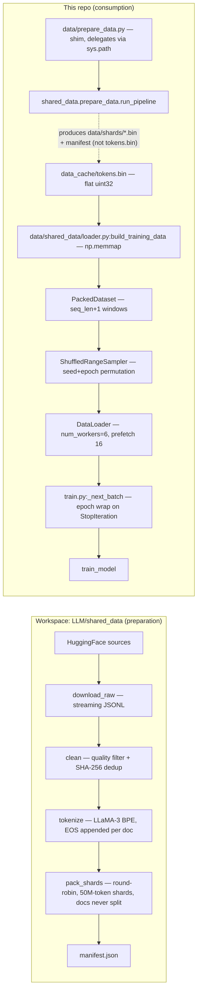
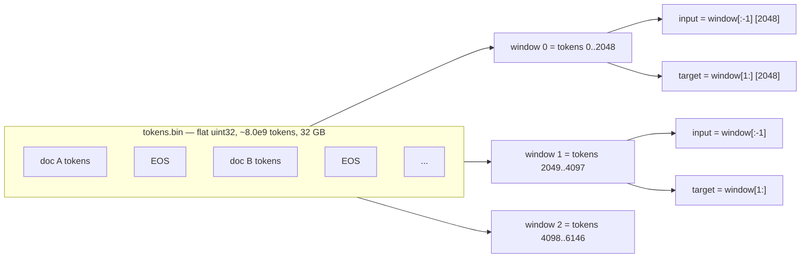
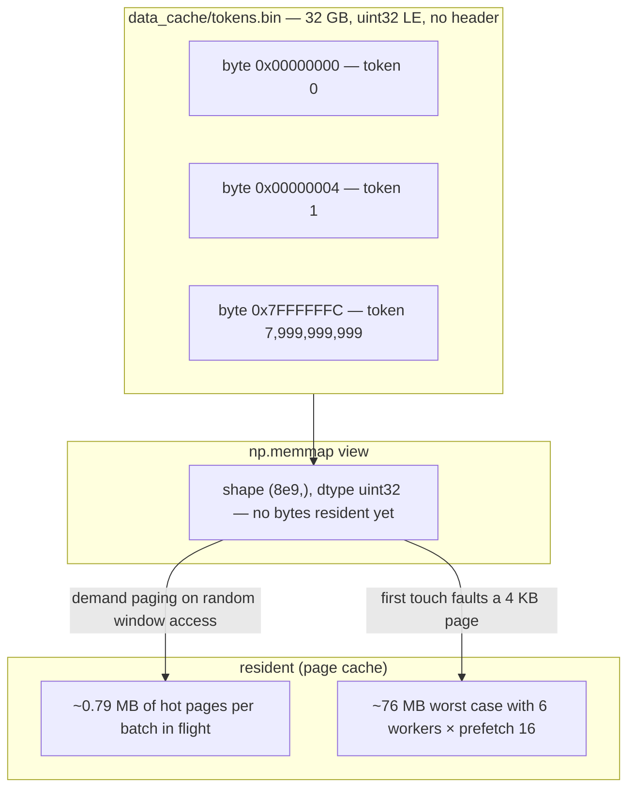

# Data Engineering: The 8B-Token Corpus and the mmap Data Path

> Audience: intermediate · Prereqs: none beyond basic numpy/PyTorch

## The 60-second summary

An LLM is only as good as the text it trains on. LLaMA-3-Lite consumes an
**8.0-billion-token** pretraining corpus shared by the whole CoreProjects LLM
suite. Preparation happens in a **workspace-level pipeline**
(`LLM/shared_data/`) that downloads five web/code/math/arxiv sources,
quality-filters them, removes exact duplicates, tokenizes them with the
LLaMA-3 BPE, and packs the result into a flat stream of `uint32` token ids
with an EOS separator after every document. This repo vendors only the
**loader** half (`data/shared_data/loader.py`, two files): a `PackedDataset`
that memory-maps the token stream and slices `seq_len+1`-token windows with a
free next-token shift, a deterministic `ShuffledRangeSampler`, and the
`build_training_data`/`build_synthetic_data` factory functions that `train.py`
calls. Because the corpus is read through `np.memmap`, a 32 GB corpus costs
only a few megabytes of resident RAM — the page-fault argument that anchors
the project's headline memory reduction. The 42,000-step plan consumes
~8.26B tokens, which slightly exceeds the 8B corpus, so `train.py:_next_batch`
wraps the epoch with a fresh sampler permutation instead of crashing.

## Why this exists

Pretraining data engineering exists to answer three questions, and each one
has bitten real projects when ignored:

1. **What text, and how much?** Model quality at fixed compute is dominated
   by data quality and diversity. A model trained on 1TB of undeduplicated
   web crawl learns to regurgitate near-duplicate boilerplate. A model
   trained only on Wikipedia never learns code. The mixture in
   `LLM/shared_data/config/mixture.yaml` is the answer this project gives,
   and its total budget (8.0B tokens) is a Chinchilla-optimal target for
   ~400–500M-parameter models (see "The mixture and the Chinchilla budget").

2. **How is raw text turned into a tensor?** Transformers consume integer
   token ids of fixed sequence length. Text must be tokenized, truncated,
   deduplicated, and packed into windows — and the *boundaries between
   documents* must be represented, or the model sees run-on concatenated
   text. This project's answer is EOS-separated packing (AGENTS.md hard
   rule 6).

3. **How does the GPU actually get the bytes without blowing the memory
   budget?** A naive in-RAM corpus of 8B tokens would be 32 GB of host RAM
   (and a naive in-GPU copy would be catastrophic). The answer here is
   `np.memmap` + a shuffled window sampler: the OS serves pages on demand,
   so the resident footprint stays in the low megabytes no matter the corpus
   size.

This doc is deliberately split in two halves. The first half is the
**preparation** path (who writes the bytes), which lives in the workspace
`LLM/shared_data` pipeline; the second half is the **consumption** path (who
reads the bytes), which lives in this repo's vendored loader. Keeping those
two halves straight is the whole point of the alignment work this doc
documents: earlier project docs described workspace functions as if they
lived in this repo (`dataset.py` was claimed to contain `_stream_to_disk`,
`_doc_hash`, `interleave_datasets` — those symbols exist nowhere here).
Everything cited below is verified in source.

## Intuition: the corpus as a tape

Think of the prepared corpus as a **single long tape of token ids**, one
after another, like a reel of film:

```
[doc A tokens ...][EOS][doc B tokens ...][EOS][doc C tokens ...][EOS] ...
```

The loader never needs to know where one document ends and the next begins —
it doesn't have to. Training proceeds by cutting the tape into fixed-length
windows of `seq_len + 1 = 2049` tokens (they overlap by exactly one token,
which gives the next-token shift for free), and feeding each window to the
model twice: once as `input` (the first 2048 tokens) and once as `target`
(the last 2048 tokens, i.e. the input shifted right by one).

The EOS token id (128,009) is just a token on the tape. The model's job is
to *learn* that it marks a boundary — the same way it learns that a period
ends a sentence. Because windows cut the tape blindly, a window can contain
the tail of document A, an EOS, and the head of document B; attention is
fully causal across the whole window, so the model can attend across the
boundary. That is the standard packed-training trade: ~100% token
utilization with zero padding, at the cost of some attention capacity spent
on cross-document pairs (more on this in "Document packing").

Shuffling happens at the **window level**, not the document level. Each
epoch, the sampler produces a fresh deterministic permutation of the ~3.9M
window indices, so consecutive batches draw windows from all over the tape —
never 96 consecutive windows from one source. The permutation depends only
on `(seed, epoch)`, which is what makes a resumed run's data order
reproducible in principle.

## The real data path: who writes the bytes, who reads them

This is the picture that the retired `docs/data_prep.md` got wrong, so it is
worth being pedantic. There are **two distinct codebases** involved:



### The preparation side (workspace)

The canonical pipeline lives at `LLM/shared_data/` — one level up from this
repo, in the workspace. It is shared by Mamba-2-Lite, GPT-OSS-Lite, HyMo,
DeepSeek-v3-Lite, and LLaMA-3-Lite ("one corpus, five models"). Its stages
run as subprocesses from `shared_data.prepare_data.run_pipeline`:

1. `download_raw` streams the mixture sources from HuggingFace as JSONL.
2. `clean` applies the quality filter and the SHA-256 exact dedup.
3. `tokenize` encodes each document with the LLaMA-3 BPE
   (`add_special_tokens=false` — no BOS; EOS is appended manually) and
   writes one `uint32` token stream per source.
4. `pack_shards` round-robin interleaves documents across sources
   (respecting per-source token budgets) and writes fixed-size shards of
   50,000,000 tokens each, plus a validated `data/manifest.json` that
   records vocab size, EOS id, dtype, shard list with per-shard SHA-256,
   and per-source stats.

The output layout is a set of flat uint32 buffers (`data/shards/shard_*.bin`,
~190 MB each), each a contiguous run of token ids with an EOS after every
document. Documents are **never split across shards** (the pack config
`cross_document_boundary_ok: false` in `LLM/shared_data/config/data_config.yaml`).

### The shim: `data/prepare_data.py`

This repo's `data/prepare_data.py` is a **thin shim** (about 60 lines). It
does no preparation itself. Its job is to put the workspace package on
`sys.path` and call the orchestrator. The path resolution is subtle and is
the most common source of confusion:

- It computes three roots: `_DATA_ROOT` = `.../LLaMA-3-Lite/data/` (where the
  vendored loader lives), `_PROJECT_ROOT` = `.../LLaMA-3-Lite/`, and
  `_WORKSPACE_ROOT` = `.../LLM/` (the parent of the project root).
- It inserts all three into `sys.path`, in that order, with
  `sys.path.insert(0, ...)`. Since each insert lands at position 0, the
  final lookup order is **workspace first, then project, then vendored
  `data/`**.
- `data/prepare_data.py:_apply_llama3_defaults` then does
  `from shared_data.config import UNIVERSAL_TOTAL_TOKENS`. Because the
  workspace is first on the path, this resolves to
  `LLM/shared_data/config.py`. If the workspace package is not importable
  (say, the machine has no `LLM/` checkout), Python falls through to the
  **vendored** `data/shared_data/` package, which has no `config.py` — the
  import raises `ModuleNotFoundError`, and the shim catches it and exits
  with a message pointing at `LLM/shared_data/`. That failure mode is
  deliberate: the shim refuses to silently prepare a different corpus than
  every other project uses.
- `data/prepare_data.py:main` parses the flags
  (`--stage pretrain`, `--skip-download`, `--skip-clean`, `--skip-tokenize`,
  `--skip-pack`, `--mixture`, `--data-config`, `--data-root`, `--source`)
  and forwards them to `shared_data.prepare_data.run_pipeline`. Nothing in
  the project's own `config.py` is passed — the mixture and pipeline knobs
  come exclusively from the workspace YAMLs. This is why the `data_sources`
  dict in `config.py:get_config` is vestigial (see Pitfalls).

The workspace pipeline resolves its data root as `$LLM_DATA_ROOT` if set,
else `$PWD/data` (`shared_data.common._resolve_data_root`). Run
`python data/prepare_data.py` from this repo's root, and the raw/clean/
tokens/shards trees and `manifest.json` land under `LLaMA-3-Lite/data/`.

### The consumption side (vendored)

`data/shared_data/` is the **only** data code in this repo, and it is a
**loader only** — two files (`__init__.py` re-exporting the public surface,
`loader.py` with the implementations). `dataset.py` at the repo root is a
32-line re-export shim that puts `data/` on `sys.path` and re-exports
`PackedDataset`, `ShuffledRangeSampler`, `collate_fn`, `build_training_data`,
`build_synthetic_data` — so `train.py`'s
`from dataset import build_training_data, build_synthetic_data` keeps working
regardless of how the package is laid out.

`data/shared_data/loader.py:build_training_data` expects a **single flat
file** `data_cache/tokens.bin` (config keys `data_cache_dir` / `data_cache_filename`):
raw `uint32` little-endian, no header. It is this file that gets mmap'd.
The shard files the workspace pipeline produces are byte-compatible with it —
concatenating `shard_*.bin` in manifest order yields exactly the flat stream
the loader wants — but note that the current workspace code does not itself
emit `tokens.bin` (see Pitfalls: the missing cache).

The full consumption path is walked with code in the sections below, in the
order a training run touches it:



## The mixture and the Chinchilla budget

### The 8.0B-token mixture

The canonical recipe is `LLM/shared_data/config/mixture.yaml` — the file's
own header calls it "the canonical recipe" consumed by all five LLM
projects, and the pipeline validates at load time that the weights sum to
1.0 (it raises otherwise). The current mixture has seven sources:

| id | dataset (config) | weight | tokens (×8.0e9) | role |
|---|---|---|---|---|
| `fineweb-edu` | `HuggingFaceFW/fineweb-edu` (sample-10BT) | 0.40 | 3.20 B | quality-gated web backbone |
| `dclm-baseline` | `mlfoundations/dclm-baseline-1.0` | 0.15 | 1.20 B | DCLM-curated web (SOTA diet) |
| `the-stack-v2-python` | `bigcode/the-stack-v2` (Python) | 0.15 | 1.20 B | code reasoning |
| `the-stack-v2-jupyter` | `bigcode/the-stack-v2` (JupyterNotebook) | 0.05 | 0.40 B | notebook code+prose |
| `openmath` | `nvidia/OpenMathInstruct-2` | 0.10 | 0.80 B | math, problem + generated solution |
| `arxiv` | `cdv/arxiv-classification` | 0.10 | 0.80 B | long-form scientific prose |
| `cosmopedia` | `HuggingFaceTB/cosmopedia` | 0.05 | 0.40 B | synthetic educational prose |

Total: 8,000,000,000 tokens. The design notes in the YAML spell out the
rationale: web text dominates but is quality-gated (edu filter + DCLM
curation); **code + math together reach ~30%** (the single strongest lever
for reasoning in small models); arxiv supplies the long documents that
improve long-context behaviour; cosmopedia adds a diversity tail. OpenMath
is special: each document concatenates the problem and its generated
solution with a `"\n\n### Solution\n\n"` separator (`extra_text_field` /
`extra_separator`), so the model sees full worked derivations, not bare
problem statements.

Two honest caveats about this table, both verified:

- The workspace `README.md` §5 still shows an **older five-source recipe**
  (fineweb-edu 0.50 / fineweb 0.20 / the-stack-python 0.15 / openmath 0.10 /
  arxiv 0.05). The YAML is authoritative; the README is stale doc-rot —
  exactly the disease this doc set is being purged of. `[INFERENCE]` the
  README predates the current mixture.
- This project's `config.py:get_config` carries its own `data_sources` dict
  (six entries: fineweb_edu 0.5, fineweb_code 0.1, the_stack_python 0.2,
  the_stack_multilang 0.05, wikipedia 0.05, stackoverflow_qa 0.05 — summing
  to 0.95). **Nothing reads it**: the vendored loader consults only the
  cache-path and loader keys, and `data/prepare_data.py:main` never passes
  the project config to the workspace. It survives because
  `tests/test_config.py:REQUIRED_KEYS` pins the config surface and the
  weight-positivity test keeps it sane. Treat it as a legacy documentation
  surface, not the mixture.

### The Chinchilla budget: why 8.0B tokens

Chinchilla (Hoffmann et al., 2022) measured the compute-optimal
parameter/token ratio for a fixed training FLOP budget: roughly **20 tokens
per parameter** at the frontier scale it swept (70B params, 1.4T tokens).
The scaling law is a sum of power laws in parameters $N$ and data $D$:

$$L(N, D) = A\,N^{-\alpha} + B\,D^{-\beta} + E,$$

where $E$ is the irreducible entropy of the data. Given a FLOP budget
$C \approx 6ND$, the optimal allocation moves *both* $N$ and $D$ up together
— for a fixed model size, more data than the 20:1 rule keeps helping, just
sublinearly.

Applied at this project's scale:

- $N = 515\text{M}$ (this model) $\Rightarrow$ the 20:1 rule wants
  $D^* \approx 20 \times 515 \times 10^6 \approx 10.3$B tokens.
- $N = 404\text{M}$ (the smallest model in the suite) $\Rightarrow$
  $D^* \approx 8.1$B tokens.

The shared corpus picks **8.0B** as a single budget for all five projects:
it is within ~1% of optimal for the suite's smallest model, a clean round
number, and one number for every log line and manifest (the workspace
README states exactly this reasoning). For LLaMA-3-Lite that is
$8.0\times10^9 / 515\times10^6 \approx 15.5$ tokens per parameter — 78% of
the 20:1 guideline, a deliberate compute-bound choice (the corpus is cheap
to extend; the A100-hours are not).

The training plan is consistent with the budget from the other side:
$42{,}000$ steps $\times 96$ batch $\times 2048$ seq $= 8.26$B tokens
consumed. That is *slightly more* than the corpus — by design, the last
~3.4k steps run on a second epoch pass (see "Shuffling and the epoch wrap").
Total training compute at this scale is roughly
$6 \times 513.8\times10^6 \times 8.26\times10^9 \approx 2.5\times10^{19}$
FLOPs — about 25.5 exaFLOPs `[derived]`. At an A100 80GB's ~312 TFLOPS of
BF16 matmul peak, that is ~23 hours at 100% MFU and more like 2.5 days at a
realistic 40% `[estimated; see scaling-and-metrics.md]`.

## Tokenization and the EOS convention

The tokenizer story is short here because it has a dedicated reference doc;
the data-engineering-relevant facts are:

- The corpus is tokenized with the **LLaMA-3 BPE** (workspace default:
  `name: llama3`, `vocab_size: 128000`, `eos_token_id: 128009`,
  `pad_token_id: 128002` in `LLM/shared_data/config/data_config.yaml`).
- The project's `config.py` declares `vocab_size: 128000` and
  `tokenizer_name: 'NousResearch/Meta-Llama-3-8B'`. The real tokenizer has
  128,256 ids (128,000 base + 256 special), so `train.py:train_model`
  computes `real_vocab_size = max(config['vocab_size'], len(tokenizer))` —
  with the real tokenizer that is 128,256, which is why EOS 128,009 is
  in-range of the embedding table. With the synthetic byte stub,
  `len(tokenizer)` returns 128,000 and the max resolves to the config
  value.
- `data/shared_data/loader.py:build_tokenizer` loads the real tokenizer via
  `transformers.AutoTokenizer.from_pretrained(config["tokenizer_name"])` and
  falls back `pad_token` → `eos_token` if the tokenizer has no pad token.
  `build_training_data` wraps that call in a try/except: if the download
  fails, it substitutes `_SyntheticTokenizerStub` and prints a warning that
  generation samples will be meaningless until a real tokenizer is
  available. The stub maps bytes ⇄ ids (`encode` clamps each byte to
  `vocab-1`, `decode` decodes with `errors="replace"`), so `train.py`
  always has a duck-typed tokenizer with `pad_token_id`, `eos_token_id`,
  `encode`, `decode`, and `__len__`.

EOS ids are added by the pipeline's tokenize/pack stages
(`add_eos: true`), *not* by the loader — the loader treats EOS as an
ordinary token. This split matters for the "who adds the EOS" question that
plagued the old docs.

## Document packing: EOS separators and the shift-by-one window

### Why EOS separators (AGENTS.md rule 6)

If you concatenate documents without a separator, the model sees
"...the capital of France is ParisThe quick brown fox..." — a run-on
sentence with no boundary signal. The model can never learn where documents
end, and its next-token predictions across the boundary are garbage (it
must predict 'T' of "The" from "Paris"). AGENTS.md hard rule 6 states the
policy:

> **Document packing** must include EOS separators; without them the model
> sees run-on concatenated documents and degrades.

The EOS token (128,009) is the boundary signal. It is *learned*, like any
other token: the loss on the EOS position teaches the model to emit it at
document ends, and the loss on the token after EOS teaches it to start a
fresh document. This only works if EOS targets are actually supervised —
see the `ignore_index` note below.

### The `seq_len+1` window trick

`data/shared_data/loader.py:PackedDataset` slices the tape into **disjoint**
windows of `seq_len + 1` tokens:

```python
# illustrative
chunk = seq_len + 1                       # 2049
self.n_chunks = tokens.size // chunk      # ~3.9M at 8B tokens

def __getitem__(self, idx: int) -> dict:
    start = idx * (self.seq_len + 1)
    end = start + self.seq_len + 1
    window = np.asarray(self.tokens[start:end], dtype=np.int64)
    return {
        "input": torch.from_numpy(window[:-1]),   # [2048]
        "target": torch.from_numpy(window[1:]),   # [2048]
    }
```

The `+1` gives the next-token shift for free: window `i` covers tape
positions $[i \cdot 2049, (i+1) \cdot 2049)$, `input` is that range minus
the last token, `target` is that range minus the first token. Because the
windows are disjoint and adjacent, every tape token except index 0 appears
as a target in **exactly one** window — token coverage is 100%. There is no
padding anywhere: no `[PAD]` runs, no truncated windows (the tape is
pre-truncated to a whole number of windows in `build_training_data`), and
no `mask` tensor. This is the "zero padding; every token is a training
target" property.

### Cross-document attention

Because windows ignore document boundaries, a window can straddle an EOS.
With fully causal attention, tokens in the head of document B attend back
to the tail of document A. The cost: some attention capacity is spent on
pairs that carry no useful signal (A's ending rarely predicts B's start —
except through topic continuity), and the model must devote a few heads'
worth of capacity to "the EOS token means restart". The alternative —
block-diagonal attention masks that forbid cross-document pairs, as in
Megatron-LM-style packing — is not implemented here; it would complicate
the fused Flash-Attention path for a few percent of pairs. The EOS design
is the cheap, standard choice, and rule 6 exists precisely so the boundary
is *representable* even when it is crossed.

One consequence for loss design: since there is no padding, the
`ignore_index=-100` passed to the loss in `train.py:train_model` never
actually masks anything in the current pipeline — the comment there says so
explicitly. EOS targets are therefore always supervised, which is what makes
EOS learning possible. (The `-100` convention is kept so that any future
padding-aware pipeline gets correct masking for free.)

## Deduplication and quality filtering

### The project config surface

`config.py:get_config` declares:

```python
# illustrative
'dedup': True,          # enable exact dedup
'dedup_hash_bytes': 256,  # prefix length hashed per document
'min_doc_tokens': 16,     # drop documents shorter than this
'max_doc_tokens': 8192,   # truncate documents longer than this
```

These are part of the pinned config contract
(`tests/test_config.py:REQUIRED_KEYS`). But — verified against the loader —
**the vendored loader never reads them**. `build_training_data` and
`build_synthetic_data` consult only cache paths, `seq_len`, `batch_size`,
`num_workers`, `pin_memory`, `prefetch_factor`, `val_split`,
`shuffle_seed`, `vocab_size`, and the tokenizer keys. The dedup/length keys
are the residue of the old in-repo streaming writer that the retired
`docs/data_prep.md` described; they now describe intent, not execution.
`[INFERENCE]` they were retained because the config surface is test-pinned.

### What the workspace actually does

Dedup happens in the workspace `clean` stage, *before* tokenization, on
**text**:

- `shared_data.common.sha256_text` hashes the whole document after
  whitespace normalization (`" ".join(text.split())`).
- `shared_data.dedup.DedupFilter.is_duplicate` keeps a seen-set of those
  hashes, persisted per source to JSON (`dedup_<source>.json`) so a crash
  mid-clean neither re-emits duplicates nor forgets the seen set. A
  document is dropped iff its hash has been seen before — **exact** match,
  not prefix, not fuzzy.
- `shared_data.common.hash_to_bucket` maps each hash to one of 256 buckets
  (first 8 hex chars mod 256) so dedup state shards across files/workers.
  `LLM/shared_data/config/data_config.yaml` also reserves bloom-filter
  parameters (`bloom_capacity_per_bucket: 200000`,
  `bloom_error_rate: 0.001`), but the implemented `DedupFilter` keeps a
  plain in-memory set — the bloom is configured, not wired. `[INFERENCE]`
  the README's "bloom filter" bullet describes the reserved design.

So the "SHA-256 over the first 256 tokens" phrasing that appears in the old
docs describes a pipeline that no longer exists; the current pipeline
hashes the **entire normalized document**. The `dedup_hash_bytes: 256` key
is the only surviving trace of the prefix-hash design.

Length bounds are enforced per source in `mixture.yaml` itself, as
character counts (`min_chars`/`max_chars`, e.g. arxiv 500–500,000, fineweb
200–200,000), plus a global quality filter in `data_config.yaml`:
`drop_empty`, `min_unique_chars_ratio: 0.05`, `max_digit_ratio: 0.50`,
`max_punct_ratio: 0.50`, `max_whitespace_ratio: 0.50`. The net effect:
a document must be non-empty, reasonably varied, and not dominated by
digits/punctuation/whitespace; web text must clear 200 chars (to kill
snippet junk), arxiv must clear 500 (to keep long-form science).

Why dedup at all? Web crawls are dominated by near-duplicates (mirrored
articles, boilerplate templates, paginated re-posts). A deduplicated corpus
is worth several times its raw token count: every duplicate that survives
is a token the model spends capacity memorizing instead of generalizing,
and duplicates bias the empirical distribution toward whatever site
happened to be crawled most. Exact SHA-256 dedup after whitespace
normalization removes the *exact* duplicates cheaply; it deliberately does
not touch near-duplicates (that would need minhash/embedding clustering —
reserved, not implemented).

## Shuffling: deterministic permutations and the epoch wrap

### Why shuffle at the window level

The tape is ordered by source (round-robin interleaved, but still
correlated: batches of arxiv windows, then batches of code, ...). Feeding
the tape in order makes the loss curve sawtooth — every source switch is a
distribution shift the optimizer must recover from — and lets the model
memorize order. Shuffling the *windows* (not documents, not tokens) makes
each batch a near-uniform draw over the whole corpus while preserving the
next-token structure inside each window. Window-level permutation is also
cheap: `~3.9M` indices, shuffled once per epoch, versus re-tokenizing or
re-packing anything.

### The sampler

`data/shared_data/loader.py:ShuffledRangeSampler` is a
`torch.utils.data.Sampler[int]` over `range(n_chunks)`:

```python
# illustrative
def __iter__(self):
    rng = np.random.default_rng(self.seed + self.offset)
    order = rng.permutation(self.n)
    return iter(int(i) for i in order)

def set_epoch(self, epoch: int) -> None:
    self.offset = epoch
```

The permutation is a pure function of `(n, seed, offset)`: NumPy's PCG64
generator is deterministic given its seed, so the same triple always yields
the same permutation. `set_epoch(epoch)` simply sets `offset = epoch`, so
epoch $e$'s permutation comes from generator seed `seed + e` — a fresh
permutation every epoch, with no state carried across epochs. This is the
design that makes data order *reproducible in principle*: given the config's
`shuffle_seed` (42) and an epoch counter, any run can reconstruct exactly
which windows every step consumed. Cross-epoch resumability is discussed in
`reproducibility.md`; the interaction with checkpoints is a pitfall below.

The sampler plugs into a `torch.utils.data.DataLoader` with
`batch_size=96`, `drop_last=True`, `num_workers=6`, `prefetch_factor=16`,
`pin_memory=True`, `persistent_workers=True`. `collate_fn` stacks the
per-window dicts:

```python
# illustrative
def collate_fn(batch: list[dict]) -> dict:
    return {
        "input": torch.stack([b["input"] for b in batch], dim=0),   # [96, 2048]
        "target": torch.stack([b["target"] for b in batch], dim=0), # [96, 2048]
    }
```

### The epoch wrap in `train.py:_next_batch`

The training loop never iterates `for batch in dataloader` directly. It
holds `step_iterator = iter(train_dataloader)` and fetches through
`train.py:_next_batch`, which owns the wrap-around:

```python
# illustrative — condensed from train.py:_next_batch
def _next_batch(step_iterator, train_dataloader, epoch_state):
    try:
        return next(step_iterator)
    except StopIteration:
        epoch_state['epoch'] += 1
        if hasattr(train_dataloader.sampler, 'set_epoch'):
            train_dataloader.sampler.set_epoch(epoch_state['epoch'])
        return next(iter(train_dataloader))
```

Why this exists is arithmetic: the corpus is 8.0B tokens, the plan consumes
8.26B, so the tape runs out ~38.6k steps into the 42k-step plan (see
"Train/val split" for the exact numbers). Without the wrap, training would
die with `StopIteration` at step ~38,637. With it, the sampler gets
`set_epoch(1)` and a fresh permutation, and the final ~3.4k steps consume a
second epoch's worth of windows. `epoch_state = {'epoch': 0}` is
initialized once in `train_model`, and the same `_next_batch` is used for
the warmup batch and every step.

The `hasattr(train_dataloader.sampler, 'set_epoch')` guard matters: the val
loader has no sampler (`shuffle=False`), and any future custom sampler
without `set_epoch` degrades gracefully.

## The memmap layout: uint32, 32 GB, page-fault residency

### The file format

`data/shared_data/loader.py:build_training_data` opens the corpus as:

```python
tokens = np.memmap(path, dtype=np.uint32, mode="r")
```

The file is a raw little-endian `uint32` stream, no header, no index: token
$t$ lives at byte offset $4t$. Sizes at this project's scale:

- 8.0B tokens × 4 bytes = **32 GB** on disk (29.8 GiB).
- One shard = 50M tokens ≈ 190 MB (the workspace writes 161 shards —
  `ceil(8.0e9 / 50e6) = 160`, plus the EOS tokens that ride along with
  documents push the total past the even boundary `[derived]`).
- `uint16` would suffice for vocab ≤ 65,535; `uint32` covers any realistic
  vocab (up to 4.29B ids) and is the suite-wide convention, so all five
  projects' shards share one dtype.

Why `uint32` rather than, say, `int32` or packed bytes: token ids fit in
32 bits with headroom for special tokens; `uint32` maps 1:1 onto
`numpy`/mmap semantics; and the flat no-header layout means the file *is*
the array — no parsing, no deserialization, no per-shard open overhead in
the hot path.

### Why the resident footprint is tiny: demand paging

`np.memmap` is a lazy view: the OS maps the file into virtual address space
but loads physical pages **on demand**. A page (4 KB on the A100 host) is
faulted into RAM only when a byte in it is touched, and evicted when
pressure demands. The loader touches the tape at random (shuffled window
indices), each window spanning 2049 × 4 = 8,196 bytes ≈ 2 pages:

- **One batch** touches at most 96 windows × ~8 KB ≈ **0.79 MB** of
  distinct corpus bytes — the source of the "~1 MB resident" headline.
- With `num_workers=6` and `prefetch_factor=16`, up to 96 batches can be
  in flight: 96 × 0.79 MB ≈ **76 MB** of page-cache pressure worst case
  `[derived]`. Still negligible next to the 32 GB file; and it is *host*
  page cache, invisible to the GPU memory budget.
- The GPU never sees the corpus: only the current batch is copied
  host→device (`non_blocking=True` from pinned buffers, since
  `pin_memory=True`).

Two corollaries worth stating:

1. **First-touch cost.** The first time training touches a window, the OS
   pays a page fault (~microseconds each, batched by the prefetch workers).
   This is why `num_workers > 0` matters: the faults hide behind the 16-batch
   prefetch pipeline.
2. **The int64 conversion.** `PackedDataset.__getitem__` converts each
   window with `np.asarray(..., dtype=np.int64)` before
   `torch.from_numpy` — `torch.from_numpy` cannot take `uint32` on CPU, so
   the ~8 KB window becomes a ~16 KB `int64` tensor. The docstring's "no
   copy" claim is about the memmap *slice* (a view); the dtype conversion
   is a per-window copy, deliberate and cheap. `collate_fn` stacks 96 of
   them into `[96, 2048]` `int64` tensors (1.5 MB each; 3.0 MB for
   input+target per batch).

### The layout in one picture



## Train/val split alignment

The same file serves train and validation. `build_training_data` computes
both sides from one `val_split` (0.05, i.e. 5%):

```python
# illustrative
chunk = seq_len + 1
n_total = (tokens.size // chunk) * chunk          # truncate to whole windows
split = int(n_total * (1.0 - val_split))          # 95% boundary
split = (split // chunk) * chunk                  # align to a window edge
train_ds = PackedDataset(tokens[:split], seq_len)
val_ds   = PackedDataset(tokens[split:], seq_len)
```

Two alignment properties, both deliberate:

- **The corpus is first truncated to a whole number of windows**, so no
  window is ever partially filled (up to 2048 trailing tokens are dropped
  — 0.003% of an 8B corpus).
- **The split lands on a window boundary**, so train and val windows never
  overlap. Both are guaranteed by the `// chunk * chunk` floor.

At 8.0B tokens this yields `[derived]`:

| | tokens | windows | full batches (96) |
|---|---|---|---|
| train | ~7.60 B | ~3,709,125 | 38,636 (+69 leftover, dropped) |
| val | ~0.40 B | ~195,218 | 2,033 (+50 leftover, kept) |

The train loader has `drop_last=True` (the 69-window remainder is dropped
each epoch); the val loader has `drop_last=False` (a partial 50-window
batch is legal). Validation is capped anyway: `train.py:validate` breaks
after `val_max_batches=100` batches, so a validation pass reads 100 × 96 ×
2048 ≈ 19.7M tokens — a 0.25% sample of the val stream, evaluated every
`val_interval=2000` steps.

One structural note: the val split is the **tail of the packed tape**, not a
stratified sample. Because `pack_shards` round-robins sources and the split
is on a window boundary, the tail contains a mix of all sources
`[INFERENCE: from the round-robin interleave]`; it is not, however, the same
source proportion as the whole, and any future change to packing order
would change what validation sees. The val stream is deliberately *not*
shuffled (`shuffle=False`), so validation loss is comparable across
checkpoints.

## The synthetic fallback

`data/shared_data/loader.py:build_synthetic_data` exists so the repo runs
with **zero data artifacts**: no download, no cache, no HF tokenizer. It
generates a deterministic random-id stream

```python
# illustrative
num_tokens = max(8 * (seq_len + 1) * batch, 4096)   # 8 × 2049 × 96 = 1,573,632
rng = np.random.default_rng(seed)
tokens = rng.integers(2, max(3, vocab), size=num_tokens, dtype=np.uint32)
```

and builds the same `PackedDataset` + `ShuffledRangeSampler` + `DataLoader`
machinery over it, with the byte stub as tokenizer. `train.py:train_model`
wires the fallback: it tries `build_training_data(config)` first and catches
`FileNotFoundError`, printing a warning that points at
`python data/prepare_data.py`, then proceeds with synthetic data. The
pipeline therefore always runs; what changes is whether the loss curve means
anything. Synthetic data exercises the full data path (packing, shuffling,
epoch wrap, collation) and is what the test suite uses; it cannot train a
real model.

## Edge cases & pitfalls

1. **The missing cache (the big one).** `build_training_data` raises
   `FileNotFoundError` if `data_cache/tokens.bin` does not exist, and
   `train.py` silently falls back to synthetic data. Today that fallback
   *always* fires: there is no `data_cache/` in the tree, and — verified by
   grepping the workspace for `tokens.bin` — the current pack stage emits
   `data/shards/shard_*.bin` + `manifest.json`, **not** `tokens.bin`. The
   statement in `data/DATA_PIPELINE.md` that "the packing stage produces
   `data_cache/tokens.bin`" is not backed by workspace code. Concatenating
   shards in manifest order yields exactly the flat stream the loader
   expects (byte-compatible `uint32`), so the wiring is a small missing
   step, but it is *missing*: as of this writing, `python train.py` on a
   fresh checkout trains on synthetic data even after
   `python data/prepare_data.py` succeeds. `[INFERENCE]` the shard→single-file
   concatenation is the intended bridge.

2. **The vendored loader is a snapshot.** Diffing
   `data/shared_data/loader.py` against `LLM/shared_data/loader.py` shows
   the workspace canonical loader has moved on (it now reads shards via the
   manifest). The `rsync` refresh command in `data/DATA_PIPELINE.md` would
   replace the vendored file and *change the input contract* from
   `tokens.bin` to the shards — a real behavioral change, not a cosmetic
   update.

3. **Doc rot in the mixture docs.** The workspace README §5 and this
   project's `data_sources` config both describe mixtures that differ from
   the canonical `mixture.yaml`. When reading any data doc, the YAML wins.
   (And `SKILLS.md` still teaches adding sources to `config.py:get_config`,
   which nothing consumes — a trap for anyone extending the mixture.)

4. **Resume does not restore the epoch counter.** `save_checkpoint` stores
   model/optimizer/scheduler/EMA/RNG states but **not** the sampler offset
   or epoch count; `epoch_state` restarts at `{'epoch': 0}` on every run.
   A run resumed at step 20k does not see the same window order as a
   never-stopped run at step 20k (the first StopIteration after resume bumps
   to epoch 1, replaying epoch-1 order from its start). The RNG state *is*
   restored, so the *sampler's* epoch-1 permutation is bit-identical to the
   original run's — the divergence is in *where* in the permutation the
   resumed iterator starts. See `reproducibility.md` for the full analysis.

5. **EOS 128,009 vs vocab 128,000.** The corpus contains token 128,009, but
   the config declares `vocab_size: 128,000`. This is safe *only* because
   `train.py` computes `real_vocab_size = max(config['vocab_size'],
   len(tokenizer))` — 128,256 with the real tokenizer. With the synthetic
   stub the embedding is 128,000-wide, but synthetic ids live in
   `[2, 128000)`, so the out-of-range id never occurs. Do not "simplify"
   `real_vocab_size` to the config value.

6. **`ignore_index=-100` never fires — by design.** There is no padding, so
   nothing is masked; EOS targets stay supervised (that is what makes EOS
   learning work). Any future padding must be added *with* a corresponding
   loss-mask, or the `-100` will silently start masking real tokens.

7. **Shuffled windows ≈ 0.79 MB/batch on the host.** The "~1 MB resident"
   headline is the single-batch footprint; the prefetch pipeline (6 workers
   × 16 batches) can hold ~76 MB of corpus pages. Neither touches GPU
   memory, but a `num_workers`/`prefetch_factor` increase has a host-RAM
   cost that scales linearly with both.

8. **The tail-of-tape val split.** Validation sees the last 5% of the packed
   stream, not a stratified sample. If packing order ever changed to be
   source-blocked, val would silently become source-skewed. The round-robin
   interleave is what keeps this honest today.

9. **Byte-stub generation output is garbage.** With the stub tokenizer
   (any run that lacks a real HF download), `train.py:generate_samples`
   decodes ids as raw bytes — expect mojibake, by design, and the warning
   printed at startup says so.

10. **Partial batches.** `drop_last=True` discards up to 95 windows per
    epoch (~0.5% of steps); `PackedDataset.__init__` pads buffers smaller
    than one window with zeros (only reachable with tiny synthetic corpora
    — the zeros are ordinary learnable ids in that case).

## Further reading

- `[data.md](../reference/data.md)` — the code tour of the vendored loader,
  line by line.
- `[tokenizer.md](../reference/tokenizer.md)` — BPE theory, the special-token
  table, `build_tokenizer` vs the stub.
- `[scaling-and-metrics.md](scaling-and-metrics.md)` — token math, Chinchilla
  numbers, loss-curve expectations, validation methodology.
- `[reproducibility.md](reproducibility.md)` — sampler determinism, RNG
  checkpoint restore, the epoch-counter caveat above.
- `[memory-engineering.md](memory-engineering.md)` — where the mmap data path
  sits in the 92→20 GB derivation.
- `[loss-functions.md](loss-functions.md)` — `ignore_index`, chunked CE, and
  why EOS targets stay supervised.
- `[config.md](../reference/config.md)` — every data-related key and its
  interactions.
- `[training.md](../reference/training.md)` — the loop that consumes
  `_next_batch`, warmup, and validation.
