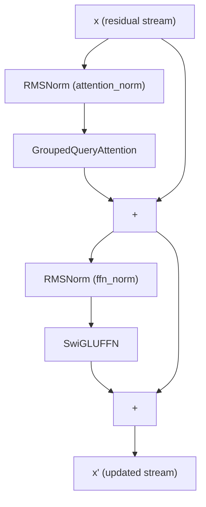
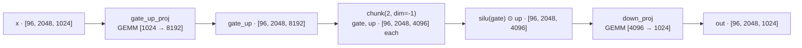

# The Feed-Forward Network and SwiGLU

> Audience: intermediate. Prerequisites: comfortable with matrix multiplication,
> basic activation functions, and the residual-stream view of a transformer
> block. If the last point is new, skim
> [transformers-from-scratch.md](transformers-from-scratch.md) first.

---

## Table of Contents

1. [The 60-Second Summary](#1-the-60-second-summary)
2. [Why the FFN Exists](#2-why-the-ffn-exists)
3. [Intuition: Per-Token Working Memory with a Soft Gate](#3-intuition-per-token-working-memory-with-a-soft-gate)
4. [Formal Treatment](#4-formal-treatment)
5. [Numbers at This Project's Scale](#5-numbers-at-this-projects-scale)
6. [How the Code Realizes It](#6-how-the-code-realizes-it)
7. [Numerical Equivalence and the Test Suite](#7-numerical-equivalence-and-the-test-suite)
8. [Edge Cases and Pitfalls](#8-edge-cases-and-pitfalls)
9. [Further Reading](#9-further-reading)

---

## 1. The 60-Second Summary

Every transformer block in LLaMA-3-Lite contains two sub-layers: a
multi-head attention layer that mixes information **across tokens**, and a
feed-forward network (FFN) that transforms each token's representation
**independently**. The FFN is a stack of two matrix multiplications with a
nonlinearity in between, expanded from `d_model = 1024` to an intermediate
width of `d_ff = 4096` (4×).

LLaMA-3-Lite uses **SwiGLU**, a *gated* FFN: instead of one intermediate
projection followed by `ReLU`, it computes two projections — a `gate` and an
`up` — and multiplies them elementwise after applying SiLU (the swish
activation) to the gate: `silu(gate) ⊙ up`. The two projections are fused
into a single matrix, `gate_up_proj`, so the layer costs three matrix
multiplies per token (`gate`, `up`, `down`) instead of two. At this scale
that is 12.58M parameters and 25.2M FLOPs per token per layer — 1.5× the cost
of a plain ReLU FFN of the same width, concentrated in the widest tensor the
model ever materializes (`[96, 2048, 8192]`).

The whole block is realized in `model.py:SwiGLUFFN`, with an optional
Triton-fused activation path gated behind `swiglu_impl='triton'` +
`ENABLE_TRITON_KERNELS=1`.

---

## 2. Why the FFN Exists

A transformer is an alternating composition of two very different
operations:

1. **Attention** — a content-based routing mechanism. Every token emits a
   query and attends to every other token's keys, producing a weighted
   average of values. Attention is where the model *mixes information across
   positions*: "the subject of this sentence is the word three tokens back."
2. **The FFN** — a position-wise function applied identically to every token
   vector, with no interaction between tokens at all. The FFN is where the
   model *transforms each token's representation*: "given what this token
   means in this context, produce a richer, more abstract feature vector."

Why is the second operation necessary at all? Two classical arguments:

- **Capacity.** Attention output is a weighted average of value vectors —
  an operation that can only produce points in the convex hull of its
  inputs. Left alone, the representation space collapses toward mixtures of
  existing vectors. The FFN breaks the convex-hull constraint: its first
  projection expands into a much higher-dimensional space, applies a
  nonlinearity, and projects back, letting the model carve out features that
  no convex combination of token embeddings can express. This is the
  original motivation in Vaswani et al. (2017): the "position-wise
  feed-forward network" follows every attention sub-layer.

- **Key-value memory.** Geva et al. (2021) ("Transformer Feed-Forward
  Layers Are Key-Value Memories") read the two FFN matrices as a memory:
  each row of the first projection is a *key pattern* the input is tested
  against, and each column of the second projection is a *value* retrieved
  when the key matches. Under this view the FFN is where the model stores
  and recalls discrete knowledge ("the capital of France is Paris") —
  pattern matching followed by retrieval, applied per token.

A third, practical argument: the FFN is where most of the model's
**parameters and FLOPs live**. In LLaMA-3-Lite, the 16 FFN layers hold
201.3M of the 251.7M non-embedding parameters — 80% — and roughly 60% of
the per-block compute. Understanding the FFN is understanding the bulk of
the model's cost.

### The residual-stream view

In a pre-norm transformer block the FFN is not a standalone function; it is
a *delta* added onto a slowly evolving residual stream:

$$x' = x + \text{FFN}(\text{RMSNorm}(x))$$

The residual connection guarantees that the FFN only ever has to produce a
*correction* to its input, and that gradients always have a direct, un-gated
path back to the embedding. The block as a whole is:



The two RMSNorm applications are what keep the stream well-scaled before
each sub-layer; the FFN itself is deliberately *unnormalized internally*.
See [normalization.md](normalization.md) for why, and
[transformers-from-scratch.md](transformers-from-scratch.md) for the full
block.

---

## 3. Intuition: Per-Token Working Memory with a Soft Gate

### Expand, transform, contract

Think of the FFN as a detour through a wider "working memory":

```
d_model = 1024  →  d_ff = 4096  →  d_model = 1024
  (compact)        (expanded)       (compact again)
```

The expansion to 4× width matters because a token's contextual meaning is a
complex function of its embedding: many candidate features compete for the
1024 dimensions. Expanding to 4096 dimensions gives each candidate feature
its own slot to "fire" in (the keys/memory rows), the nonlinearity decides
which slots fire, and the contraction blends the firing features back into
the residual stream. The expansion is cheap in an architectural sense — the
FLOP cost grows only linearly with `d_ff`, and there are no pairwise
interactions between positions, so the width is a free-ish knob the designer
turns to trade compute for capacity.

### The gate: a soft, learned switch

A plain ReLU FFN computes, per feature, `max(0, x·w_i)`: a hard, binary
switch — the feature either fires or it is dead (gradient exactly zero in
the dead region). SwiGLU replaces the hard switch with a *multiplicative
gate*: every feature is computed twice, once as the *content* (`up`) and
once as the *emphasis* (`gate`), and the content is multiplied by
`sigmoid(gate)`:

- A large positive gate → `silu ≈ gate` → content passes **amplified**.
- A large negative gate → `silu ≈ 0` → content is **suppressed**.

The gate is *soft*: it is a smooth, everywhere-differentiable function of
the input, so gradients always flow through both branches. The model learns
per-token emphasis: which transformations to apply, and how strongly,
conditioned on what the token currently means in context.

A tiny worked example (real numbers): with `silu(x) = x/(1 + e^{-x})`,

- `silu(2.0) = 2.0 / (1 + e^{-2.0}) = 2.0 / 1.1353 = 1.7616` — the gate
  *amplifies* an `up` value of `0.5` to `1.7616 × 0.5 = 0.8808`.
- `silu(-3.0) = -3.0 / (1 + e^{3.0}) = -3.0 / 21.0855 = -0.1423` — a gate of
  `-3.0` crushes an `up` value of `10.0` down to `-1.423`: 10 units of
  content contribute less than one and a half units to the output.

Note the second case: unlike ReLU, a suppressed feature still contributes a
small *negative* signal rather than exactly zero. This asymmetry (slightly
negative saturation) is a property of SiLU that empirical work has found
helpful; the important qualitative point is the continuous, learnable
emphasis.

---

## 4. Formal Treatment

### 4.1 The canonical two-projection FFN

The vanilla FFN (Vaswani et al., 2017) is, for a token vector $x \in
\mathbb{R}^{d}$:

$$\text{FFN}(x) = W_2 \,\phi(W_1 x + b_1) + b_2$$

with $W_1 \in \mathbb{R}^{d_{\text{ff}} \times d}$, $W_2 \in
\mathbb{R}^{d \times d_{\text{ff}}}$, and $\phi$ a pointwise nonlinearity
(ReLU in the original paper). Two matrix multiplies, one nonlinearity. In
LLaMA-3-Lite both biases are dropped (`bias=False`), consistent with the
LLaMA family, so the layer is exactly:

$$\text{FFN}(x) = W_{\text{down}}\,\phi(W_{\text{up}}\,x)$$

### 4.2 Why 4× d_model

The expansion factor is a hyperparameter, but 4× has been the default since
the original transformer (`d_model = 512`, `d_ff = 2048`) and survives in
most modern models. The reasoning:

- **The bottleneck is the residual stream, not the FFN.** The residual
  stream must stay low-dimensional to keep attention cheap (attention FLOPs
  scale as $d$ per token-position pair) and to keep the gradient clean. The
  FFN is the designated place where the model is allowed to "think in
  high dimensions" at linear cost in $d_{\text{ff}}$.
- **Diminishing returns are gentle.** Each doubling of $d_{\text{ff}}$
  doubles the FFN's share of FLOPs and parameters but adds genuinely new
  feature slots. Ablations across the literature show quality climbing with
  width until the compute budget bites; 4× sits near the sweet spot.

At this project's scale the choice is explicit in `config.py:get_config`:
`d_ff: 4096 = 4 × d_model: 1024`.

> **A family-specific note.** The LLaMA family normally *shrinks* the
> SwiGLU width to $d_{\text{ff}} = \tfrac{8}{3}\,d_{\text{model}}$ so that
> three projections cost the same as a plain 4× FFN's two projections
> ($3 \cdot \tfrac{8}{3} d^2 = 8d^2 = 2 \cdot 4d^2$). LLaMA-3-Lite instead
> keeps `d_ff = 4 × d_model`, which makes its FFN 1.5× heavier than a plain
> ReLU FFN at the same width — see §4.5 for the arithmetic. [INFERENCE: the
> intent behind keeping 4× is not recorded in the repo; the config value and
> its consequences are.]

### 4.3 SiLU — the activation

SiLU (Sigmoid Linear Unit; also called *swish*, Ramachandran et al., 2017)
is defined as

$$\text{silu}(x) = x \cdot \sigma(x) = \frac{x}{1 + e^{-x}}$$

with derivative

$$\frac{d}{dx}\text{silu}(x) = \sigma(x)\big(1 + x\,(1 - \sigma(x))\big)$$

Properties that matter here:

- **Smooth and differentiable everywhere** — no kink, no exact-zero-gradient
  region, unlike ReLU.
- **Self-gating** — the input is its own gate: the derivative is a soft
  switch that is ~1 for large positive $x$ and ~0 for large negative $x$.
- **Bounded below, unbounded above** — the range is approximately
  $[-0.278, \infty)$, with the minimum attained near $x \approx -1.278$; a
  saturated feature leaks a small negative signal instead of dying.

### 4.4 SwiGLU — the gated FFN

SwiGLU (Shazeer, 2020, "GLU Variants Improve Transformer") replaces the
single intermediate projection with a *gated linear unit*: three projections
$W_g$, $W_u \in \mathbb{R}^{d_{\text{ff}} \times d}$, $W_d \in
\mathbb{R}^{d \times d_{\text{ff}}}$, and the rule

$$\text{SwiGLU}(x) = \Big(\text{silu}(x W_g) \odot (x W_u)\Big) W_d$$

where $\odot$ is the elementwise (Hadamard) product. The gate projection
$W_g$ decides *whether* each of the $d_{\text{ff}}$ features should fire;
the up projection $W_u$ decides *what* fires; the down projection $W_d$
blends the survivors back to `d_model`.

**Lineage.** The gated-FFN family entered the transformer literature with
Shazeer (2020), who found SwiGLU the best among gated variants at matched
compute. PaLM (Chowdhery et al., 2022) adopted SwiGLU ("gated activation")
at $d_{\text{ff}} = 4d$; LLaMA (Touvron et al., 2023) kept SwiGLU with the
$8/3$ width convention; Gemma uses GeGLU (the same gating with GELU as the
activation). LLaMA-3-Lite follows the PaLM/LLaMA lineage directly: `silu`
gate, `bias=False`, and a fused `gate_up_proj`.

**Why gating helps — the gradient argument.** In a plain ReLU FFN the
gradient with respect to the pre-activation is a binary mask: a feature
either contributes a full gradient or none. SwiGLU's gate gradient is

$$\frac{\partial \text{SwiGLU}}{\partial g_i} = \sigma(g_i)\big(1 + g_i(1 - \sigma(g_i))\big)\, u_i$$

— a *soft* weight that is large exactly when the gate is confident
($|g_i|$ large and sign consistent with firing). Features learn to modulate
their own gradients, which empirically improves optimization and
quality-per-FLOP over hard-gated ReLU at matched budget (the headline result
of Shazeer 2020).

### 4.5 FLOP comparison: SwiGLU vs plain ReLU FFN

Counting multiply–adds per token per layer (each matmul of shape
$[d_{\text{in}}, d_{\text{out}}]$ costs $2\, d_{\text{in}} d_{\text{out}}$
FLOPs):

| Quantity | Plain ReLU FFN | SwiGLU (this repo) |
|---|---|---|
| Projections | $W_1, W_2$ | $W_g, W_u, W_d$ |
| Matmuls per token | 2 | 3 |
| FLOPs per token per layer | $4\, d\, d_{\text{ff}}$ | $6\, d\, d_{\text{ff}}$ |
| At $d=1024, d_{\text{ff}}=4096$ | $4 \cdot 1024 \cdot 4096 = 16.8\text{M}$ | $6 \cdot 1024 \cdot 4096 = 25.2\text{M}$ |
| Params per layer | $8d^2 = 8.39\text{M}$ | $12d^2 = 12.58\text{M}$ |
| Relative cost | $1\times$ | $1.5\times$ |

The factor is exactly $\tfrac{3}{2}$: three projections instead of two, at
the same width. The *qualitative* comparison the literature makes is
fairer: at matched compute (i.e. comparing the 25.2M-FLOP SwiGLU against a
plain FFN of width $\tfrac{3}{2} \cdot 4096$), SwiGLU wins; at matched
width, the plain FFN wins on raw cost. This repo optimizes for the former
quality regime and pays the 1.5× tax.

For context, one attention layer at this scale costs
$8d^2 + 4 S d = 8 \cdot 1024^2 + 4 \cdot 2048 \cdot 1024 \approx 16.8\text{M}$
FLOPs per token per layer — *equal* to the plain FFN and $2/3$ of the
SwiGLU FFN. So the FFN is the dominant block: about 60% of per-block
matmul FLOPs (`25.2 / (25.2 + 16.8)`) at `seq_len = 2048 = 2·d_model`.

### 4.6 Fusing gate and up

Because $W_g$ and $W_u$ have identical shape and consume the *same input
tensor* $x$, the two matmuls can be stacked into one:

$$x\,[W_g \,\Vert\, W_u] = [\,x W_g \;\Vert\; x W_u\,] = [\,\text{gate} \;\Vert\; \text{up}\,]$$

Concatenating weight matrices along their *output* dimension (rows) turns
two GEMMs of shape $[d, d_{\text{ff}}]$ into one GEMM of shape
$[d, 2 d_{\text{ff}}]$. The input is read once instead of twice, kernel
launches drop from two to one, and the single larger GEMM utilizes tensor
cores better (GEMM efficiency rises with the square-ish dimension of the
reduction/shared tile). This is exactly `gate_up_proj` in the code.

---

## 5. Numbers at This Project's Scale

All figures below are derived from `config.py:get_config` (`d_model 1024`,
`d_ff 4096`, `n_layers 16`, `batch_size 96`, `seq_len 2048`) unless marked
estimated.

### Parameters

Per FFN layer:

$$\underbrace{2 \cdot 4096 \times 1024}_{\text{gate\_up\_proj}} + \underbrace{1024 \times 4096}_{\text{down\_proj}} = 8{,}388{,}608 + 4{,}194{,}304 = 12{,}582{,}912 \approx 12.58\text{M}$$

- `gate_up_proj.weight`: `[8192, 1024]` → 8.39M params.
- `down_proj.weight`: `[1024, 4096]` → 4.19M params.
- No biases anywhere, so that is the whole count.

Across 16 layers:

$$16 \times 12{,}582{,}912 = 201{,}326{,}592 \approx 201.3\text{M}$$

against a total of 513.8M parameters and 251.7M non-embedding parameters
(`model.py:Transformer.get_num_params`), the FFN is **80%** of the
non-embedding budget:

$$201.3 / 251.7 = 0.80$$

For comparison, all 16 attention blocks together are 50.3M
($16 \times 3.15\text{M}$), and the embedding + un-tied LM head is 131.1M
($128{,}000 \times 1024$). The unit test
`tests/test_model.py::TestTransformerParamCount.test_full_model_total_params`
pins the total within 1% of the advertised ~515M.

### FLOPs

Tokens per step: $96 \times 2048 = 196{,}608$.

Per step, forward pass, FFN only:

$$16 \text{ layers} \times 25{,}165{,}824 \frac{\text{FLOP}}{\text{token}} \times 196{,}608 \text{ tokens} \approx 79.2 \text{ TFLOP}$$

Backward through a matmul costs ~2× the forward (gradients w.r.t. both the
input and the weight), so the FFN contributes ≈ 237 TFLOP per step
forward+backward. At the A100's 312 TFLOP/s BF16 dense peak that is ≥ 0.76 s
per step at 100% MFU; at a realistic 40–50% MFU, roughly 1.5–2 s per step
just from the FFN matmuls. [ESTIMATE: MFU is not measured in this repo;
`.benchmarks/` is empty.]

### Activation memory

The fused projection output is the widest activation tensor the model
materializes during training (the full logits tensor would be wider, but the
chunked head never materializes it — see
[loss-functions.md](loss-functions.md)):

$$[96, 2048, 8192] = 1.61\text{G elements} = 3.22\text{ GB (BF16)} = 6.44\text{ GB (FP32)}$$

per layer, plus the `[96, 2048, 4096]` activated tensor (1.61 GB BF16). This
is the dominant activation cost in the model and the reason the training
loop pairs gradient checkpointing (`model.py:Transformer.forward`) with
chunked head computation. Full per-tensor accounting lives in
[memory-engineering.md](memory-engineering.md).

---

## 6. How the Code Realizes It

### 6.1 The module

`model.py:SwiGLUFFN` is 25 lines:

```python
# illustrative
class SwiGLUFFN(nn.Module):
    """SwiGLU FFN with fused gate+up projection."""
    def __init__(self, d_model: int, d_ff: int, swiglu_impl: str = "pytorch"):
        super().__init__()
        self.gate_up_proj = nn.Linear(d_model, 2 * d_ff, bias=False)
        self.down_proj = nn.Linear(d_ff, d_model, bias=False)
        self.d_ff = d_ff
        self.swiglu_impl = swiglu_impl
        self._triton_fallback_warned = False

    def forward(self, x):
        gate_up = self.gate_up_proj(x)
        if self.swiglu_impl == "triton":
            try:
                return self.down_proj(triton_swiglu(gate_up, self.d_ff))
            except (ImportError, ValueError) as exc:
                if not self._triton_fallback_warned:
                    print(
                        f"[SwiGLUFFN] triton path unavailable "
                        f"({type(exc).__name__}: {exc}); "
                        f"falling back to 'pytorch'."
                    )
                    self._triton_fallback_warned = True
        gate, up = gate_up.chunk(2, dim=-1)
        return self.down_proj(F.silu(gate) * up)
```

The constructor (`model.py:SwiGLUFFN.__init__`) creates exactly the two
matrices from §4.6:

- `self.gate_up_proj = nn.Linear(d_model, 2 * d_ff, bias=False)` — the fused
  gate+up GEMM, weight shape `[2·d_ff, d_model]` = `[8192, 1024]` at full
  scale.
- `self.down_proj = nn.Linear(d_ff, d_model, bias=False)` — the contraction,
  weight shape `[d_model, d_ff]` = `[1024, 4096]`.

PyTorch convention: an `nn.Linear(in, out)` has weight `[out, in]`, so the
*rows* of `gate_up_proj.weight` partition as gate rows `0..d_ff-1` and up
rows `d_ff..2·d_ff-1` (see §6.2 and §7 for how the tests exploit this).

### 6.2 The eager forward path

`model.py:SwiGLUFFN.forward`, pytorch branch:

1. `gate_up = self.gate_up_proj(x)` — one GEMM, output `[B, S, 2·d_ff]`.
2. `gate, up = gate_up.chunk(2, dim=-1)` — split the last axis into two
   `[B, S, d_ff]` views; `chunk` is a view operation, so this is free.
3. `F.silu(gate) * up` — the gated activation, elementwise.
4. `self.down_proj(...)` — the contraction back to `[B, S, d_model]`.

Shape trace at full scale (batch 96, seq 2048):



### 6.3 The Triton opt-in branch

The same forward, with `swiglu_impl == "triton"`, replaces steps 2–3 with a
single fused kernel call (`model.py:SwiGLUFFN.forward`):

```python
return self.down_proj(triton_swiglu(gate_up, self.d_ff))
```

`kernels/swiglu_triton.py:triton_swiglu` reads the fused `[..., 2·d_ff]`
tensor, splits it *inside* the kernel, computes `silu(gate) * up`, and writes
only the `d_ff`-wide result — one launch, one write, instead of the eager
path's `silu` write + `*` read/write (two extra elementwise roundtrips
through global memory). The kernel body (the `@triton.jit` function named
`_swiglu_fwd_kernel` in `kernels/swiglu_triton.py`):

- one program per row of the flattened `[M, 2·d_ff]` tensor, `M =
  B·S = 196,608` at full scale;
- loads `g = GU[row, 0..D)` and `u = GU[row, D..2D)` in one pass, computes in
  FP32 (`tl.sigmoid`), and stores the product cast back to the input dtype;
- `BLOCK_SIZE = triton.next_power_of_2(d_ff)` — exactly 4096 for this
  config — with `num_warps=8, num_stages=2`;
- the backward is a PyTorch autograd re-compute stub (`save_for_backward` +
  `torch.autograd.grad` through `kernels/swiglu_triton.py:swiglu_pytorch`),
  i.e. only the forward is fused; the gradient re-materializes
  `silu(gate) * up` eagerly.

Three gates control whether this path ever runs:

1. The config key `swiglu_impl` — `config.py:get_config` defaults to
   `'pytorch'`.
2. The environment variable `ENABLE_TRITON_KERNELS=1` — `train.py:train_model`
   force-restores all three `*_impl` keys to `'pytorch'` and warns if the
   variable is unset while any key says `'triton'`. Default runs never
   silently switch to a fused path.
3. Runtime availability — `triton_swiglu` raises `ImportError` when triton
   is not installed (CPU/Mac), and `ValueError` when the last dim is not
   exactly `2·d_ff` or `d_ff` exceeds the kernel's `_MAX_BLOCK_SIZE` (8192).
   `model.py:SwiGLUFFN.forward` catches both and falls back to the eager
   path, printing a warning exactly once per module instance
   (`self._triton_fallback_warned`).

### 6.4 Wiring into the block

`model.py:DecoderBlock.__init__` constructs the FFN with the block's width:

```python
# illustrative
self.ffn = SwiGLUFFN(d_model, d_ff, swiglu_impl=swiglu_impl)
self.attention_norm = RMSNorm(d_model, eps=1e-5, impl=rmsnorm_impl)
self.ffn_norm = RMSNorm(d_model, eps=1e-5, impl=rmsnorm_impl)
```

and `model.py:DecoderBlock.forward` applies it as a pre-norm residual delta:

```python
x = x + self.ffn(self.ffn_norm(x))
```

`model.py:Transformer.__init__` builds 16 such blocks inside `Decoder`, and
`model.py:build_transformer` threads the `swiglu_impl` choice through from
the config. Weight initialization is uniform with the rest of the model:
`model.py:Transformer._init_weights` draws every `nn.Linear` weight —
including `gate_up_proj` and `down_proj` — from `normal_(0.0, 0.02)`.

---

## 7. Numerical Equivalence and the Test Suite

The fused `gate_up_proj` must be *exactly* equivalent to two separate
projections — it is a pure arithmetic reorganization, not an approximation.
Three tests pin this down in `tests/test_model.py::TestSwiGLUFFN`:

**`tests/test_model.py::TestSwiGLUFFN.test_fused_equals_unfused_reference`**
is the equivalence contract. It splits the fused weight by rows
(`torch.split(gate_up_w, d_ff, dim=0)`), applies the two projections
separately, builds the reference

```python
# illustrative
gate = F.linear(x, gate_w)
up = F.linear(x, up_w)
ref = F.linear(F.silu(gate) * up, down_w)
out = ffn(x)
assert torch.allclose(out, ref, atol=1e-6), (out - ref)
```

and asserts the module's output matches to `atol=1e-6`. The same test
implicitly verifies the row layout of §6.1: the top `d_ff` rows of
`gate_up_proj.weight` act as the gate matrix, the bottom `d_ff` as the up
matrix.

**`tests/test_model.py::TestSwiGLUFFN.test_gate_up_proj_has_2x_d_ff_rows`**
pins the shapes: `gate_up_proj.weight.shape == (2*d_ff, d_model)` and
`down_proj.weight.shape == (d_model, d_ff)`.

**`tests/test_model.py::TestSwiGLUFFN.test_output_shape`** pins the
input/output shape invariance: `[2, 8, 64]` in, `[2, 8, 64]` out.

The Triton path's numerics are checked separately on GPU by
`tests/e2e_gpu_smoke.py::check_triton_kernels`, which compares
`triton_swiglu(gu, d_ff)` against the FP32 PyTorch reference and tolerates
abs diff < 1.0, with a comment that BF16 elementwise on cc-7.5+ can show a
~1e-3 constant bias — the kernel's FP32 internal accumulation keeps it well
inside that bound. There is no unit test for the eager→triton fallback in
`tests/`; the fallback is exercised only by running without triton (CPU/Mac)
or by the opt-in gates.

---

## 8. Edge Cases and Pitfalls

**1. The `2·d_ff` invariant.** Everything downstream assumes
`gate_up.shape[-1] == 2 * d_ff`. In the eager path this is guaranteed by
construction — `gate_up_proj` is the only producer — and `chunk(2, dim=-1)`
cannot fail dimensionally even if the invariant broke, it would just produce
semantically wrong halves. The Triton path is stricter:
`kernels/swiglu_triton.py:triton_swiglu` raises `ValueError` if the
last dim is not exactly `2·d_ff`, and `SwiGLUFFN.forward` converts that into
a one-time warning + eager fallback. `test_gate_up_proj_has_2x_d_ff_rows`
guards the shape contract at test time.

**2. Silent path switching.** A fused kernel and an eager computation that
differ by ~1e-3 can silently change training dynamics mid-run. The repo
avoids this by defaulting `swiglu_impl` to `'pytorch'`
(`config.py:get_config`) and by requiring the explicit
`ENABLE_TRITON_KERNELS=1` opt-in (`train.py:train_model`); when triton is
missing at runtime the fallback is loud (one warning per module) but safe.

**3. Block-size limits on the fused kernel.** `_MAX_BLOCK_SIZE = 8192`
bounds `triton.next_power_of_2(d_ff)`. At the current `d_ff = 4096` the
block is exactly 4096 (no masking waste); any `d_ff > 8192` would push the
block past the limit and route back to eager via the `ValueError` fallback.
Doubling `d_ff` therefore silently disables the fused path unless the
kernel is extended.

**4. BF16 accumulation.** Under autocast the eager path runs `F.silu` and
the multiply in BF16; the Triton kernel loads both halves as FP32 and only
casts the *product* back to the input dtype. Both are "correct" but not
bit-identical — hence the tolerance in
`tests/e2e_gpu_smoke.py::check_triton_kernels`. See
[mixed-precision.md](mixed-precision.md) for the broader numerics story.

**5. Activation memory is the widest tensor in the model.** `[96, 2048,
8192]` at 3.22 GB BF16 per layer, and it must exist simultaneously for all
16 layers unless gradient checkpointing is on
(`model.py:Transformer.forward`). This single tensor is a large part of why
the training loop checkpoints per block and chunks the LM head; the full
derivation is in [memory-engineering.md](memory-engineering.md) and
[gradient-checkpointing.md](gradient-checkpointing.md).

**6. No biases, no dropout.** `bias=False` on both projections matches the
LLaMA family and keeps the param count exact (nothing hidden in bias
vectors); it also matters for quantization later. There is no dropout in the
model at all — the FFN relies on data scale and weight decay for
regularization.

**7. Gate saturation ≈ soft dead units.** SiLU's derivative vanishes as the
gate goes very negative, so a persistently negative gate row behaves like a
dead ReLU unit — but softly, and recoverable because the gradient is never
*exactly* zero and the input to the gate is re-normalized every block
(`model.py:DecoderBlock.forward`). Watch for it in the same way you would
watch for dead ReLU units: a large fraction of permanently-saturated gate
rows in an FFN suggests a learning-rate or init problem, not a SwiGLU
defect.

**8. The 1.5× cost is real and deliberate in the config.** At
`d_ff = 4·d_model` the SwiGLU FFN costs 12.58M params / 25.2M FLOPs per
token per layer — 1.5× a plain ReLU FFN of the same width. If the model
ever needs to shave compute at constant width, the standard LLaMA move is
$d_{\text{ff}} = \tfrac{8}{3} d_{\text{model}}$ (§4.2); the config
(`config.py:get_config`) is the single place such a change lands.

---

## 9. Further Reading

- [transformers-from-scratch.md](transformers-from-scratch.md) — the
  residual stream and the full block, from scratch.
- [normalization.md](normalization.md) — why the FFN input is RMSNorm-ed and
  the block is pre-norm.
- [attention.md](attention.md) — the other half of the block, and the FLOP
  comparison this doc leans on.
- [kernel-programming.md](kernel-programming.md) — the Triton model of
  computation behind `triton_swiglu`, and the other two fused kernels.
- [gradient-checkpointing.md](gradient-checkpointing.md) and
  [memory-engineering.md](memory-engineering.md) — where the FFN's wide
  activations show up in the memory budget.
- [mixed-precision.md](mixed-precision.md) — BF16/TF32 behavior of the three
  GEMMs.
- [loss-functions.md](loss-functions.md) — the chunked head that consumes
  the residual stream after the last FFN.
- Reference walkthroughs: [model.md](../reference/model.md),
  [kernels.md](../reference/kernels.md), [config.md](../reference/config.md),
  [tests.md](../reference/tests.md).
- Index: [docs/README.md](../README.md).
