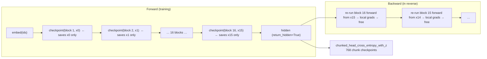

# Gradient Checkpointing in LLaMA-3-Lite

> Audience: intermediate

## Table of Contents

1. [The 60-Second Summary](#1-the-60-second-summary)
2. [Why This Exists](#2-why-this-exists)
3. [Intuition](#3-intuition)
4. [Formal Treatment: How Much Memory, Exactly](#4-formal-treatment-how-much-memory-exactly)
5. [How the Code Realizes It](#5-how-the-code-realizes-it)
6. [Edge Cases & Pitfalls](#6-edge-cases--pitfalls)
7. [How to Verify](#7-how-to-verify)
8. [Further Reading](#8-further-reading)

---

## 1. The 60-Second Summary

Training a transformer must remember intermediate activations so the backward
pass can compute gradients. At this project's scale — batch $B = 96$, sequence
$S = 2048$, $d_{\text{model}} = 1024$, $d_{\text{ff}} = 4096$, $L = 16$ layers —
the naive activation bill is **~71 GB** of the A100's 80 GB before anything
else is counted. Gradient checkpointing (a.k.a. activation recomputation)
trades compute for memory: instead of keeping every layer's activations, keep
only each layer's **input** and re-run the layer's forward pass during
backward. The price is roughly one extra forward pass per layer per step
(about +33% FLOPs); the payoff is that activation memory drops from ~71 GB to
~6.4 GB of saved inputs.

LLaMA-3-Lite applies the same idea at **two complementary sites**:

- every `DecoderBlock` is wrapped in `checkpoint(layer, x, use_reentrant=False)`
  inside `model.py:Transformer.forward` (guarded by
  `self.gradient_checkpointing and self.training`); and
- every 256-row chunk of the chunked LM-head loss is itself wrapped in
  `checkpoint(..., use_reentrant=False)` inside
  `model.py:chunked_head_cross_entropy_with_z`, so the 50.3 GB logits tensor is
  never materialized.

Both use the non-reentrant checkpoint variant: compile-friendly, saves only
inputs, and free of the reentrant variant's double-backward restrictions.

---

## 2. Why This Exists

### 2.1 Autograd is a memory consumer you did not choose

In PyTorch, `loss.backward()` works because the forward pass recorded a graph.
Every non-leaf tensor that a backward needs — the inputs to every matmul, every
residual-branch operand — is kept alive from the moment it is created in
forward until the backward pass consumes it. For a stack of $L$ transformer
layers the dependency chain is $L$ deep, so the number of live tensors grows
linearly in $L$:

$$\text{naive activation memory} = O(L \cdot B \cdot S \cdot d)$$

with $d_{\text{ff}} = 4d$ making the FFN term dominate. The constant matters
enormously at this scale, and the linear-in-$L$ growth is what makes deep
transformers the poster child for checkpointing.

### 2.2 The budget at this project's scale

The A100 80GB must hold, simultaneously:

| component | bytes | derivation |
|---|---|---|
| weights (BF16) | 1.03 GB | 513.8M params × 2 B |
| AdamW moments (FP32) | 4.11 GB | 2 × 513.8M × 4 B |
| gradients (BF16) | 1.03 GB | same shape as weights |
| full logits `[N, V]` (BF16) | 50.3 GB | 196,608 × 128,000 × 2 B |
| naive layer activations | ~71 GB | derived in §4 |

The last row alone is already 89% of the card. The model cannot train on an
80 GB GPU **without** either checkpointing, a smaller batch, or a shorter
sequence — and shrinking $B$ or $S$ directly shrinks the tokens-per-step
throughput the run is budgeted around (96 × 2048 = 196,608 tokens/step,
`config.py:get_config`). Checkpointing is the technique that keeps the batch
and sequence fixed while trading the cheap resource (FLOPs, of which the A100
has ~312 TFLOPS dense in BF16) for the scarce one (VRAM).

### 2.3 Why not just use a smaller batch?

`batch_size=96` and `seq_len=2048` are not arbitrary: they define the
tokens-per-step that the 42,000-step plan and the 8B-token corpus budget are
built around. Dropping to $B = 24$ would cut activation memory 4× but would
also cut throughput 4× (or require 4× more steps, which the cosine schedule
and EMA decay were not designed for). Checkpointing buys the memory back at
~33% compute cost — almost always the better trade at this scale.

---

## 3. Intuition

**The student analogy.** A student derives a 16-step result. If she writes
down every intermediate line, she can answer "how did you get from line 3 to
line 4?" instantly, but she fills her notebook. If instead she only writes
down the starting line of each section, she must *re-derive* a section when
asked about it — slower, but the notebook lasts. Gradient checkpointing is
the second strategy: each layer boundary is a written-down checkpoint; the
interior of a layer is re-derived during backward.

**A two-matmul micro-example.** Consider $y = W_2\,(W_1 x)$. The backward
needs $W_1 x$ (to compute $\partial y / \partial W_2$'s gradient) and $x$ (for
$\partial y / \partial W_1$). Naively you save both $x$ and $W_1 x$ — 2
activations. Checkpointed, you save only $x$; in backward you recompute
$W_1 x$ from $x$, then use it. Same answer, one saved tensor, one extra
matmul.

**The spectrum.** Three regimes trade memory against compute:

| regime | activations kept | extra FLOPs |
|---|---|---|
| save everything | every intermediate | none |
| per-layer checkpoint (this repo) | layer inputs only | +1 forward per layer ≈ +33% |
| checkpoint everything | embedding output only | +1 forward per layer, plus head/embedding recompute |

Per-layer checkpointing is the sweet spot: it removes the
linear-in-$L$ accumulation of interiors while keeping the recompute unit
small enough that the extra forward fits comfortably in the backward's
"shadow" time.

---

## 4. Formal Treatment: How Much Memory, Exactly

Throughout: $B = 96$, $S = 2048$, $d = d_{\text{model}} = 1024$,
$d_{\text{ff}} = 4096$, $L = 16$, $V = 128{,}000$, batch size 96, and BF16
storage (2 bytes/tensor element) unless stated otherwise. All figures are
**derived from config** (`config.py:get_config`) — none are measured; the
repo's `.benchmarks/` directory is currently empty.

**The fundamental unit.** One full-width activation is

$$U \;=\; B \cdot S \cdot d \;=\; 96 \times 2048 \times 1024 \;=\; 201{,}326{,}592
\approx 2.01 \times 10^8 \text{ elements},$$

which is $U \times 2\,\text{B} = 402.65$ MB in BF16 (805.3 MB in FP32).

### 4.1 The per-layer bill: attention path

Per layer, the attention sub-block produces these dominant tensors
(`model.py:GroupedQueryAttention.forward`):

| tensor | elements | BF16 bytes |
|---|---|---|
| $q$ after `q_proj` | $B \cdot S \cdot d = 1.0\,U$ | 402.65 MB |
| $k$ after `k_proj` | $B \cdot S \cdot (n_{kv} \cdot h) = 0.5\,U$ | 201.33 MB |
| $v$ after `v_proj` | $0.5\,U$ | 201.33 MB |
| attention output (SDPA → `out_proj`) | $1.0\,U$ | 402.65 MB |

The $k/v$ width is half of $d$ because of GQA: 4 KV heads × head_dim 128 =
512, vs 8 query heads × 128 = 1024. The attention sub-block sum is
**1.21 GB** per layer.

Flash Attention 2 (via `F.scaled_dot_product_attention(q, k, v, is_causal=True)`)
keeps the $S \times S$ attention matrix out of global memory entirely, which
is why there is no $O(S^2)$ term in this table — see
[attention.md](attention.md) for the $O(S)$ argument.

### 4.2 The per-layer bill: FFN path

The FFN is where the memory really lives. `model.py:SwiGLUFFN.forward` first
computes the fused gate+up projection, **8× wider than the residual stream**:

$$B \cdot S \cdot 2 d_{\text{ff}} \;=\; 96 \times 2048 \times 8192
\;=\; 1{,}610{,}612{,}736 \text{ elements} \;\approx\; 1.61 \times 10^9,$$

which at 2 bytes/tensor element is **3.22 GB** — one tensor, 8U, bigger than
the entire attention sub-block. This single tensor alone is the dominant
activation in the whole model.

### 4.3 Summing to ~70 GB

| component | per layer | × 16 layers |
|---|---|---|
| attention ($q, k, v$, output) | 1.21 GB | 19.3 GB |
| FFN `gate_up` intermediate | 3.22 GB | 51.5 GB |
| **total** | **4.43 GB** | **70.9 GB** |

$$\text{total} \;=\; 16 \times 4.43\,\text{GB} \;=\; 70.9\,\text{GB}
\;\approx\; 71\,\text{GB}.$$

That is the "~70 GB" figure. Two honest caveats:

- This counts only the five **dominant** per-layer tensors. A complete
  autograd accounting also keeps the norm outputs, the RoPE outputs, the
  expanded $K/V$ copies, the `silu(gate)` and gated intermediates, and the
  residual operands — roughly 28U ≈ 11.3 GB per layer, i.e. ~180 GB for 16
  layers in BF16. The ~70 GB headline is therefore a *lower bound* on the
  naive cost, not the full one. Either way it is far past the 80 GB ceiling;
  the conclusion is unchanged.
- The reference table in `docs/reference/memory-stack.md` asserts the same
  "~70.0 GB" activation figure (and a 3.2 GB post-checkpoint figure); the
  per-tensor arithmetic above is the derivation that table's numbers
  reference. The post-checkpoint number is revisited honestly in §4.4.

### 4.4 What checkpointing actually keeps

With per-layer checkpointing, the only activation retained per layer is the
layer's **input** — one $U$-wide tensor:

$$L \times U \times 2\,\text{B} \;=\; 16 \times 402.65\,\text{MB}
\;=\; 6.44\,\text{GB}.$$

During backward the picture is: 16 saved inputs (6.44 GB) plus **one**
layer's worth of recomputed activations (≈ 4.4 GB by the dominant-tensor
count, ≈ 11.3 GB by the full count) live at peak, giving a peak activation
window of roughly **11–18 GB** [derived estimate]. The `memory-stack.md`
table's "3.2 GB activations + 3.6 GB recompute buffer" figures are asserted
targets; the derivation here lands higher because it includes the full saved
input chain and a realistic single-layer recompute footprint. The order of
magnitude — single-digit-to-low-tens of GB instead of ~71–180 GB — is the
point.

### 4.5 The compute price: one extra forward per backward

A linear layer's backward is two matmuls (grad-input and grad-weight) versus
one in forward, so backward ≈ 2× forward FLOPs. Checkpointing adds exactly one
forward per checkpointed layer:

$$\frac{F_{\text{fwd}} + F_{\text{bwd}} + F_{\text{recompute}}}{F_{\text{fwd}} + F_{\text{bwd}}}
\;=\; \frac{1 + 2 + 1}{1 + 2} \;=\; \frac{4}{3},$$

i.e. **+33% total FLOPs**. At this scale, forward FLOPs per layer are:

- projections ($q, k, v$, out): $4 \times 2 B S d^2 = 1.65$ TFLOP,
- SDPA (flash): $\approx 2 \times 2 B S d^2 = 1.65$ TFLOP,
- FFN: $2 B S d (2 d_{\text{ff}}) + 2 B S d_{\text{ff}} d = 3.30 + 1.65 = 4.95$ TFLOP,

so one layer ≈ 8.25 TFLOP and the 16-layer body ≈ **132 TFLOP per forward**.
Per step: 132 (fwd) + 264 (bwd) + 132 (recompute) ≈ **528 TFLOP**, versus 396
without checkpointing. At the A100's 312 TFLOP/s dense BF16 peak that is
~1.7 s/step at 100% MFU; at a realistic 40–50% MFU, ~3.4–4.2 s/step, i.e.
~40–50 hours for the full 42,000 steps [derived estimate; not measured].

### 4.6 The head, separately: why a second checkpoint site

The LM head `[N, V] = [196,608, 128{,}000]` logits tensor is 50.3 GB in BF16
(100.6 GB FP32) — larger than all layer activations combined, and it lives
*after* the last layer, outside any per-layer checkpoint. It gets its own
treatment in `model.py:chunked_head_cross_entropy_with_z`: the head matmul is
computed in 256-row chunks, and **each chunk's computation is itself
checkpointed**, so only one chunk's logits exist at a time:

- chunks per step: $196{,}608 / 256 = 768$,
- per-chunk logits: $256 \times 128{,}000 = 32.8$M elements → 65.5 MB BF16,
  131.1 MB after the FP32 upcast,
- plus one FP32 chunk gradient (131.1 MB) during backward:
  ~**0.33 GB** transient loss memory [derived], consistent with the
  function's own "~0.3 GB at `chunk_size=256`" docstring.

If the per-chunk checkpoint were omitted, all 768 chunk logits would stay
alive in the autograd graph — 768 × 65.5 MB ≈ 50 GB again. The checkpoint is
what makes the chunking actually bound memory rather than just reordering it.

The head GEMM is not small either: $2 N d V = 2 \times 196{,}608 \times 1024
\times 128{,}000 \approx 51.5$ TFLOP per pass, doubled to ~103 TFLOP by the
per-chunk recompute. See [loss-functions.md](loss-functions.md) for the
proof that chunked CE ≡ dense CE.

---

## 5. How the Code Realizes It

### 5.1 The switch: config → constructor → forward

The flag is on by default in `config.py:get_config`
(`'gradient_checkpointing': True`), flows through `model.py:build_transformer`
into `model.py:Transformer.__init__` (stored as `self.gradient_checkpointing`),
and is wired from the config in `train.py:train_model`
(`gradient_checkpointing = config.get('gradient_checkpointing', True)`).
`model.py:build_transformer` prints `Gradient checkpointing: ENABLED` when it
is on. The flag is read once, in `model.py:Transformer.forward`; the setters
that used to toggle it at runtime were removed, so the mode is fixed for the
lifetime of a model object.

### 5.2 The checkpointed forward

`model.py:Transformer.forward` splits into two paths:

```python
# illustrative
def forward(self, x, return_hidden: bool = False):
    x = self.input_embedding(x)
    if self.gradient_checkpointing and self.training:
        for layer in self.decoder.layers:
            x = checkpoint(layer, x, use_reentrant=False)
    else:
        x = self.decoder(x)
    if return_hidden:
        return x
    logits = self.output_proj(x)
    return logits
```

Two details matter:

1. **The guard is `and self.training`.** In eval mode (validation, generation)
   the checkpoint branch is skipped and the plain `model.py:Decoder` path
   runs. This is desirable — no recompute machinery under `torch.no_grad()` —
   but see §6.1 for the subtle consequence.
2. **The unit of recompute is a full `DecoderBlock`**
   (`model.py:DecoderBlock`, `x = x + self.attention(self.attention_norm(x))`
   then `x = x + self.ffn(self.ffn_norm(x))`). Each layer's input is saved;
   its attention + FFN interiors are re-derived during backward.



The gradient flow is standard: `checkpoint(layer, x)` calls the module as a
function, so its parameters are captured by the autograd graph and receive
gradients exactly as if it had run inline — the only difference is *when* the
forward executes.

### 5.3 Why `use_reentrant=False`

`torch.utils.checkpoint.checkpoint` has two implementations. The reentrant
variant (the legacy default) wraps the segment in a single
`torch.autograd.Function` whose backward re-runs the forward under
`torch.no_grad`; the non-reentrant variant (used at both call sites here)
drives recomputation with autograd saved-tensor hooks. PyTorch's own
documentation recommends `use_reentrant=False`, and the installed torch warns
that omitting the parameter will become an error (torch 2.9). The practical
differences, all of which favor this repo's choice:

- **Saves only inputs.** The non-reentrant implementation packs the input
  tensors into lightweight placeholders (`_Holder`) at forward time; the
  actual tensor storage is released, and unpacking a placeholder triggers the
  recompute during backward. Nothing else from the layer is retained.
- **No double-backward quirks.** The reentrant variant records the re-run
  forward under `torch.no_grad` and is incompatible with `torch.autograd.grad`
  or passing an `inputs=` argument to `backward()`. The non-reentrant variant
  records the graph *inside* the checkpointed region, so backward-within-
  backward works normally.
- **Compile-friendly.** TorchDynamo does not step inside `checkpoint`; it
  wraps the call as a higher-order op, and the non-reentrant implementation is
  the one that composes with `torch.compile` (see §5.5).
- **Early-stop recomputation.** Recomputation stops as soon as every needed
  tensor has been produced (default `early_stop=True`), so a layer whose
  backward only needs the head of the computation re-runs less than the whole
  layer.
- **Determinism checking.** The default `determinism_check="default"`
  compares shapes, dtypes, and devices of recomputed tensors against the
  originals, surfacing silent divergence early.

The reentrant variant's restrictions — needs at least one input/output with
`requires_grad`, mis-handles detached tensors and nested structures — are all
avoided by construction here.

### 5.4 The head-chunked loss as a second checkpoint site

`model.py:chunked_head_cross_entropy_with_z` builds a closure `_chunk` that
computes `F.linear(hidden_c, w)` plus the FP32 CE + z-loss chain, then loops:

```python
# illustrative
for start in range(0, hidden.shape[0], chunk_size):
    end = min(start + chunk_size, hidden.shape[0])
    out = checkpoint(_chunk, hidden[start:end], head_weight,
                     targets[start:end], use_reentrant=False)
```

Each iteration is its own checkpointed segment: in forward, `_chunk` runs and
only `hidden[start:end]`, `head_weight`, and `targets[start:end]` are saved
(as placeholders); in backward, each chunk's logits are recomputed one at a
time and freed. Because `head_weight` is the same tensor object every chunk,
autograd stores its storage once (~262 MB), not 768 times. This is the
mechanism that bounds loss-side memory at ~0.33 GB (§4.6) and keeps the
full-logits 50.3 GB tensor from ever existing. The body checkpointing (§5.2)
and this head chunking are complementary: the former shrinks
$\sim 71 \rightarrow \sim 6.4$ GB of layer activations, the latter
$50.3 \rightarrow \sim 0.3$ GB of logits.

### 5.5 Interplay with `torch.compile` and CUDA graphs

The training path compiles the whole model: `train.py:train_model` wraps it
with `torch.compile(model, mode='reduce-overhead')` when
`config['compile_model']` is true. Three interactions matter:

1. **Non-reentrant checkpoint is the compile-compatible variant.** When the
   forward is compiled, the checkpoint call is traced as a higher-order op and
   the recompute becomes part of the compiled/optimized graph — the backward
   does not re-enter the Python-level `checkpoint` machinery.
2. **Static shapes are a hard requirement.** `mode='reduce-overhead'` uses
   CUDA graphs, and a graph is captured for one exact shape. The code honors
   this in `train.py:train_model` by warming up with a **real training
   batch** before the loop ("CUDA graphs recompile on shape change, so the
   warmup must use real training shapes"): it runs one forward
   (`model(_warmup_input, return_hidden=True)`) + the chunked loss + one
   `backward()` + `torch.cuda.synchronize()`, which captures the graph and
   absorbs the compile/autotune stall before the timed loop starts.
3. **Stream ownership.** The graph owns the device stream during execution,
   so the only async host→device prefetch that is compatible is
   `non_blocking=True` with `pin_memory=True` — which is exactly what the
   loop does; manual streams are off-limits (comment in `train.py:train_model`).

A shape change mid-run (different `B` or `S`) forces a full graph re-capture,
a multi-second-to-minute stall — one more reason the loop never varies the
batch or sequence shape.

### 5.6 Interplay with BF16 autocast

The training step runs under
`torch.autocast(device_type=device.type, dtype=torch.bfloat16, enabled=(device.type == 'cuda'))`
(`train.py:train_model`): matmuls downcast to BF16, and the loss chain
upcasts per chunk in `model.py:chunked_head_cross_entropy_with_z` (`.float()`
before `logsumexp`/CE).

A common piece of folklore says the checkpointed recompute runs *outside* the
autocast context and therefore in FP32. **That is not what happens in the
torch version this repo runs.** The non-reentrant implementation snapshots
the autocast state (`enabled`, `dtype`, cache flag) at the moment the
checkpointed region executes in the original forward, and re-enters
`torch.amp.autocast(...)` with that snapshot around the recomputed forward.
The recomputed matmuls therefore get the **same BF16 policy as the original
forward** — recompute and forward agree on precision by construction. The
FP32-recompute story predates this snapshot-and-restore behavior and does not
apply to current torch (2.x). The residual numerics caveat is different and
real: with `tf32=True` (`train.py:setup_gpu_optimizations` sets
`torch.backends.cuda.matmul.allow_tf32 = True`) and cuBLAS non-determinism,
the recomputed forward can differ from the original in the last bits. That is
harmless — the recompute is an independent, valid execution of the same
function, and its values feed only the local backward — but it is why
"checkpointed training" and "non-checkpointed training" should not be
expected to produce bit-identical gradients.

---

## 6. Edge Cases & Pitfalls

### 6.1 The final norm is applied in both branches (fix verified)

`model.py:Transformer.forward`'s checkpoint branch is:

```python
# illustrative
for layer in self.decoder.layers:
    x = checkpoint(layer, x, use_reentrant=False)
x = self.decoder.norm(x)
```

It iterates `self.decoder.layers` and then **explicitly applies the decoder's
final RMSNorm** (`self.decoder.norm`), matching the non-checkpointed branch
(`self.decoder(x)`, via `model.py:Decoder.forward`). Consequences, verified
by running both paths on a tiny model [observation]:

- In training with `gradient_checkpointing=True` (the config default), the LM
  head sees the same normalized features as validation and generation.
- The final norm's weight receives gradient in checkpointed training and
  stays coupled to the optimizer.

Historical note: an earlier version of the checkpoint branch omitted
`self.decoder.norm`, producing a train/eval mismatch (the LM head saw
un-normalized features in training, and the final-norm weight drifted via
AdamW decay). The fix is in the code, and the training-mode regression test
`tests/test_model.py::TestTransformerForward.test_gradient_checkpointing_matches_normal_in_training`
locks it in.

### 6.2 The eval-mode equivalence test

`tests/test_model.py::TestTransformerForward.test_gradient_checkpointing_matches_normal`
builds two identical-weight models, one with `gradient_checkpointing=True`,
puts **both in eval mode**, runs them under `torch.no_grad()`, and asserts
`allclose(..., atol=1e-6)`. Because both models are in eval mode,
`self.training` is `False` and the checkpoint branch — guarded by
`self.gradient_checkpointing and self.training` — is never taken; both go
through `model.py:Decoder`. The training-mode variant added with the norm fix
covers the checkpointed branch directly.
§6.1 divergence. A training-mode gradient comparison would (see §7).

### 6.3 The eval/inference guard is doing double duty

Because the branch requires `self.training`, the recompute machinery is
automatically off during validation and generation — good for latency. It also
means `torch.no_grad()` inference pays nothing, since checkpoint is a no-op
when no graph is being recorded anyway.

### 6.4 Statefulness and RNG inside checkpointed regions

The recompute re-executes the layer's forward a second time, so anything the
forward does besides pure math would happen twice: buffer updates, global
state, sampling. This model's `model.py:DecoderBlock.forward` is pure — the
only "state" is `model.py:RoPE`'s read-only `cos_cached`/`sin_cached` buffers —
so recompute is value-exact. There is no dropout anywhere in
`model.py:DecoderBlock` or `model.py:Transformer`, so the RNG-preservation
concern that motivates `preserve_rng_state=True` (the default; and torch
always preserves RNG under `torch.compile`) is moot. If dropout were ever
added to a checkpointed region, recompute would draw different noise unless
RNG state were restored — a classic footgun.

### 6.5 Don't checkpoint regions that are too small

Checkpointing has overhead of its own: placeholder bookkeeping, the
recompute launch, and the determinism check. Wrapping a single matmul saves
nothing worth the machinery. Here the granularity is well chosen — a whole
`DecoderBlock` (the natural unit whose interior is expensive) and a 256-row
head chunk (whose recompute is a single large GEMM). The loss-side chunk size
is the tunable knob: `'ce_chunk_size': 256` in `config.py:get_config`; larger
chunks mean fewer recomputes but more transient logits memory (131.1 MB FP32
per chunk at 256), and the triton CE path's chunk-mean averaging is exact only
for equal-sized chunks (196,608 / 256 = 768 — exact here).

### 6.6 Memory accounting vs the reference table

`docs/reference/memory-stack.md` asserts a 3.2 GB post-checkpoint activation
figure and a 3.6 GB recompute buffer. The derivation here — 16 saved inputs =
6.44 GB, plus one recomputed layer at peak, ~11–18 GB total — is larger and
is the honest accounting given the code's per-layer granularity. Treat the
reference table's numbers as aspirational targets; [memory-engineering.md](memory-engineering.md)
reconciles the full 92 → 20 GB stack.

---

## 7. How to Verify

**The repo's own test.** `tests/test_model.py::TestTransformerForward.test_gradient_checkpointing_matches_normal`
passes and is a useful plumbing guard: it proves that flipping the
`gradient_checkpointing` flag does not perturb weights, state dicts, or
eval-mode outputs. As noted in §6.2 it does **not** exercise the recompute
branch.

**A training-mode check.** The meaningful verification is to compare
train-mode forward/backward against the non-checkpointed path. This is
runnable as written from the repo root (tiny model, CPU-safe), and on the
current code it *reveals* the §6.1 divergence rather than asserting equality:

```python
# illustrative
import torch
from model import build_transformer, chunked_head_cross_entropy_with_z

torch.manual_seed(42)
kw = dict(vocab_size=256, d_model=64, n_layers=4, n_heads=4, n_kv_heads=2,
          head_dim=16, d_ff=256, max_seq_len=32, rope_theta=500000.0,
          rms_norm_eps=1e-5)
ma = build_transformer(**kw, gradient_checkpointing=False)
mb = build_transformer(**kw, gradient_checkpointing=True)
mb.load_state_dict(ma.state_dict())
ma.train(); mb.train()

ids = torch.randint(0, 256, (2, 32), dtype=torch.long)
tgt = torch.randint(0, 256, (2, 32), dtype=torch.long)

ha = ma(ids, return_hidden=True)                     # layers + final norm
hb = mb(ids, return_hidden=True)                     # layers only (no final norm)
print("train hidden equal:", torch.allclose(ha, hb, atol=1e-6))

la = chunked_head_cross_entropy_with_z(ha.view(-1, 64), ma.output_proj.weight,
                                       tgt.view(-1), chunk_size=16)
lb = chunked_head_cross_entropy_with_z(hb.view(-1, 64), mb.output_proj.weight,
                                       tgt.view(-1), chunk_size=16)
la.backward(); lb.backward()
print("final-norm grad, plain/ckpt:",
      ma.decoder.norm.weight.grad is not None, mb.decoder.norm.weight.grad is not None)
```

On the current code this prints `train hidden equal: False` and
`final-norm grad, plain/ckpt: True False` — the norm-skip defect (§6.1), with
repro. After a fix that applies `self.decoder.norm` in the checkpoint branch,
the same snippet should print `True` and `True True`, and per-parameter grads
should match to ~1e-6 (module-internal recompute is value-exact; only TF32
non-determinism, §5.6, would blur the last bits).

**End-to-end.** The strongest check is the GPU training run itself:
`gradient_checkpointing=True` + `compile_mode='reduce-overhead'` + warmup
must start the timed loop only after "Pre-warmup complete (CUDA graphs
captured)" prints in `train.py:train_model`, with peak VRAM staying under
80 GB (expect ~20 GB per the stack accounting in
[memory-engineering.md](memory-engineering.md)).

---

## 8. Further Reading

- [memory-engineering.md](memory-engineering.md) — the full 92 → 20 GB stack
  that this doc's activation math feeds into.
- [loss-functions.md](loss-functions.md) — why chunked CE ≡ dense CE, and the
  per-chunk FP32 chain.
- [mixed-precision.md](mixed-precision.md) — autocast scoping and BF16
  numerics that the recompute path inherits.
- [../reference/memory-stack.md](../reference/memory-stack.md) — the
  reference table this doc's derivation reconciles.
- [../reference/model.md](../reference/model.md) — full walkthrough of
  `model.py`, including `model.py:Transformer.forward` and
  `model.py:chunked_head_cross_entropy_with_z`.
- [../reference/training.md](../reference/training.md) — the loop, warmup,
  and compile/cuda-graph integration in `train.py:train_model`.
- [../reference/tests.md](../reference/tests.md) — the test suite including
  `tests/test_model.py::TestTransformerForward`.
- [../README.md](../README.md) — the docs index and learning paths.
