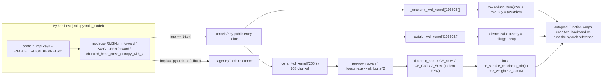

# Kernel Programming with Triton: Fused RMSNorm, SwiGLU, and Chunked CE + Z-Loss

> Audience: expert — assumes familiarity with GPU execution (threads, warps, shared memory) and with `model.py`'s layer structure. This doc is the theory half of the story; the code-keyed walkthrough lives in [kernels.md](../reference/kernels.md).

## The 60-second summary

Triton is a Python-embedded DSL that lets you write CUDA kernels with a single language model: you launch a **grid** of *programs*, each program is assigned an ID (`tl.program_id(0)`), and each program operates on **blocks** of a tensor declared with `tl.arange`, masked against the real tensor shape, with the compiler deciding how to map the block onto warps and threads. LLaMA-3-Lite ships three such kernels in `kernels/` — one per "pattern": a **row-wise reduction** (RMSNorm), an **elementwise fusion** (SwiGLU), and a **fused reduction + cross-program accumulation** (chunked cross-entropy + z-loss, which uses `tl.atomic_add` on three scalar accumulators). Each kernel is wrapped in a `torch.autograd.Function` whose backward is not a Triton kernel at all: it **re-computes** the forward through the pure-PyTorch reference and lets autograd differentiate it. The kernels are strictly opt-in: they only run when the config keys `rmsnorm_impl` / `swiglu_impl` / `cross_entropy_impl` are set to `'triton'` **and** `ENABLE_TRITON_KERNELS=1` is in the environment; otherwise `train.py:train_model` force-restores all three to `'pytorch'`. At runtime, a missing Triton install or a tripped shape guard makes `model.py` print a one-time warning and fall back to the eager path — never silently — while any *other* kernel failure propagates as a hard error.

## Why these kernels exist

The project's performance contract (AGENTS.md hard rule 2) is that a sanctioned Triton path must clear a **1.5× speedup** over the raw-PyTorch path before it is enabled by default. The three kernels in `kernels/` are the first candidates for that contract, and each targets a different bottleneck:

1. **RMSNorm is launch-bound.** The eager chain `pow → mean → add → rsqrt → multiply` is several kernel launches over the same tensor, each one re-reading the full activation from HBM. Applied 33 times per forward (two per decoder block across 16 layers, plus the final norm — see `model.py:DecoderBlock` and `model.py:Decoder`), the eager path fires on the order of a hundred small kernels per step. A single row-wise Triton program reads each row **once** and does the whole reduction on-chip.

2. **SwiGLU is a pure fusion win.** `silu(gate) * up` is two elementwise launches that must each read and write a `[196608, 4096]` intermediate. Fusing them halves the elementwise memory traffic per layer and removes one intermediate tensor write + read of ~1.6 GB per layer.

3. **CE + z-loss is a memory and numerical problem.** The dense path computes `logsumexp` and `cross_entropy` as separate reductions over a `[N, 128000]` logits tensor; at full-batch scale that tensor alone is 50.3 GB in BF16, which is why the training path never materializes it (see [memory-engineering.md](memory-engineering.md)). The Triton variant folds the stable-logsumexp (max-shift) and the target-token NLL into one pass per row, and writes three running totals with `tl.atomic_add` — no per-row intermediate softmax tensor, no second reduction pass.

There is also a **correctness** argument that predates the speedup one: each kernel ships with a pure-PyTorch reference (`kernels/rmsnorm_triton.py:rmsnorm_pytorch`, `kernels/swiglu_triton.py:swiglu_pytorch`, `kernels/cross_entropy_triton.py:cross_entropy_with_z_pytorch`) that runs on CPU without Triton, and the backward passes are *implemented* as re-runs of those references. The autograd graph you get from a Triton forward is therefore numerically identical to the eager graph in both directions — gradient checks cannot drift from the reference implementation even if the forward kernel has subtle rounding.

One caveat about the 1.5× rule: AGENTS.md names `scripts/microbench_a100.py` as the measurement harness, but that script is not in the working tree (only `scripts/generate_code_map.py` is [verified]). No in-repo microbenchmark exists, so the speedup contract is currently enforced by rule, not by measurement — treat any throughput claim below as an estimate, not a benchmark.

## The Triton model of computation

### Grids, programs, and `tl.program_id`

A Triton launch looks like a Python call with a **grid** in square brackets:

```python
# illustrative — pattern shared by all three kernels in this repo
_rmsnorm_fwd_kernel[(M,)](x_2d, weight, y, x_2d.stride(0), y.stride(0),
                          N=N, eps=eps, BLOCK_SIZE=block,
                          num_warps=4, num_stages=1)
```

`(M,)` is a 1-D grid of **M programs**. Each program is an independent unit of work that Triton schedules onto a streaming multiprocessor; programs do not share memory except through explicit global-memory atomics. Inside the kernel, `tl.program_id(0)` returns this program's index along grid axis 0. The universal idiom in this repo is *one program per row*: program `row` owns the `row`-th row of the (flattened) tensor. That makes the kernel trivially parallel across rows and puts the reduction axis entirely inside one program — no cross-program communication for reductions. The price is that the reduction axis must fit in one program's block, which is exactly the constraint that `_MAX_VOCAB_BLOCK` encodes (see Pattern 3).

### Blocks: `tl.arange`, masks, `tl.constexpr`

Within a program, Triton code is written over **blocks** — virtual vectors whose length is a compile-time constant:

```python
# illustrative — body of the _rmsnorm_fwd_kernel JIT function
cols = tl.arange(0, BLOCK_SIZE)          # block of indices 0..BLOCK_SIZE-1
mask = cols < N                          # mask against the real width
x = tl.load(x_ptr, mask=mask, other=0.0).to(tl.float32)  # masked load
var = tl.sum(x * x, axis=0) / N          # block-wide reduction
```

`tl.arange(0, BLOCK_SIZE)` materializes a block of consecutive integers; the compiler distributes that block across the program's threads and, crucially, decides how to *loop* if the block is bigger than what fits in registers. `tl.load` with a `mask` predicate and an `other=` fill value is the safe way to read near a tensor's edge; every kernel here launches a power-of-two block against a non-power-of-two tensor width, so every load and store is masked. The mask fill value is pattern-dependent: `0.0` for RMSNorm (masked lanes contribute nothing to the sum-of-squares) and SwiGLU (masked lanes contribute nothing to the output, which is masked on store), but `-float("inf")` for cross-entropy — because a masked lane feeds `exp(x - m)`, and `exp(-inf) = 0` is exactly the "not part of the sum" value.

`N`, `eps`, `BLOCK_SIZE`, `D`, `V`, `BLOCK_V` are all declared `tl.constexpr`. A `tl.constexpr` is baked into the kernel at JIT-compile time: the compiler sees the concrete value, so masks like `cols < N` become compile-time-known loop bounds, and `eps` becomes a constant instead of a loaded scalar. Triton specializes a fresh kernel binary per distinct combination of constexpr values, which is why the same `@triton.jit` function serves any width — but also why a launch with a surprising width (see the `_MAX_BLOCK_SIZE` guard) pays a one-time compile cost.

### `num_warps` and `num_stages`

Every launch in `kernels/` passes `num_warps` and `num_stages` explicitly:

- `num_warps` — how many warps (32 threads each) make up one program. RMSNorm uses `num_warps=4` (128 threads) for its 1024-wide block (8 elements per thread); SwiGLU and CE use `num_warps=8` (256 threads) for their 4096- and 131072-wide blocks.
- `num_stages` — software-pipelining depth for loads. `num_stages=1` (RMSNorm) means no overlap of memory loads with compute; `num_stages=2` (SwiGLU, CE) lets the compiler prefetch the next tile while computing the current one. The CE kernel's whole-row block makes pipelining moot at the block level, but the setting is kept uniform with SwiGLU.

These are the only two scheduling knobs the repo exposes; everything else about thread mapping, vectorization, and register allocation is Triton's job.

### The launch-config table

| Kernel | Grid | Block (`tl.arange`) | Mask fill | `tl.constexpr` args | `num_warps` / `num_stages` | Shape guard |
|---|---|---|---|---|---|---|
| `_rmsnorm_fwd_kernel` (launched by `kernels/rmsnorm_triton.py:_triton_rmsnorm_forward`) | `(M,)` — 1 program per row | `BLOCK_SIZE = next_power_of_2(N)` | `other=0.0` | `N`, `eps`, `BLOCK_SIZE` | 4 / 1 | `BLOCK_SIZE ≤ _MAX_BLOCK_SIZE = 8192` |
| `_swiglu_fwd_kernel` (launched by `kernels/swiglu_triton.py:_triton_swiglu_forward`) | `(M,)` — 1 program per row | `BLOCK_SIZE = next_power_of_2(d_ff)`; reads `cols` and `D + cols` of the fused `gate_up` row | `other=0.0` | `D`, `BLOCK_SIZE` | 8 / 2 | `BLOCK_SIZE ≤ _MAX_BLOCK_SIZE = 8192` |
| `_ce_z_fwd_kernel` (launched by `kernels/cross_entropy_triton.py:_triton_ce_z_forward`) | `(M,)` — 1 program per row | `BLOCK_V = next_power_of_2(V)` | `other=-inf` | `V`, `BLOCK_V` | 8 / 2 | `BLOCK_V ≤ _MAX_VOCAB_BLOCK = 131072` |

At project scale, `M = batch × seq = 96 × 2048 = 196,608` for all three kernels in the training forward (the CE kernel is invoked per chunk of 256 rows inside `model.py:chunked_head_cross_entropy_with_z`), `N = d_model = 1024`, `D = d_ff = 4096`, and `V = vocab_size = 128,000` (or 128,256 with `model.py:build_transformer`'s default). Note that `next_power_of_2(1024) = 1024` and `next_power_of_2(4096) = 4096` — the two "small" kernels launch exactly-sized blocks — while `next_power_of_2(128000) = 131072 = _MAX_VOCAB_BLOCK`, so the CE kernel's block is a full 2¹⁷-wide.



## Pattern 1 — row-wise RMSNorm

### The eager baseline

RMSNorm over a row $x \in \mathbb{R}^N$ with gain $w \in \mathbb{R}^N$:

$$y_i = \frac{x_i}{\sqrt{\frac{1}{N}\sum_j x_j^2 + \epsilon}} \, w_i$$

The reference implementation `kernels/rmsnorm_triton.py:rmsnorm_pytorch` is three lines of eager torch:

```python
# illustrative
# kernels/rmsnorm_triton.py:rmsnorm_pytorch — the reference (verbatim)
variance = x.pow(2).mean(dim=-1, keepdim=True)
return x * torch.rsqrt(variance + eps) * weight
```

The module docstring counts this as a "4-launch eager chain (pow, mean, add, rsqrt, multiply)": each `pow`, `mean`, `add`, `rsqrt`, and multiply is a separate kernel that reads the row from HBM and writes a (usually small) result. Five reads of the activation per norm application, times 33 norm applications per forward — the activation tensor is the single biggest per-layer tensor in the model, so this traffic dominates the op's cost.

### The kernel

```python
# illustrative — body of the _rmsnorm_fwd_kernel JIT function
row = tl.program_id(0)
cols = tl.arange(0, BLOCK_SIZE)
mask = cols < N

x = tl.load(X_ptr + row * stride_x_row + cols, mask=mask, other=0.0).to(tl.float32)
var = tl.sum(x * x, axis=0) / N
rstd = 1.0 / tl.sqrt(var + eps)

w = tl.load(W_ptr + cols, mask=mask, other=0.0).to(tl.float32)
y = (x * rstd) * w
tl.store(Y_ptr + row * stride_y_row + cols, y.to(Y_ptr.dtype.element_ty), mask=mask)
```

Program `row` loads its 1024-wide row once into registers (masked with `0.0` fill), squares and sums it with one block reduction, and divides by the *real* width `N` — not by `BLOCK_SIZE` — which is why the masked-lanes-as-zero trick is correct: masked lanes add exactly $0^2 = 0$ to the sum. The weight is loaded with the same mask, and the store is masked so padded lanes are never written. The row is read from HBM **once**; the reduction stays on-chip. This is the canonical "row-wise reduce" Triton pattern, and it is exactly what the FA2-style tiling literature calls a *block-level* reduction: `tl.sum(..., axis=0)` is a cross-thread reduction that Triton lowers to shared-memory shuffles inside the program.

The host wrapper `kernels/rmsnorm_triton.py:_triton_rmsnorm_forward` reshapes any input to 2-D (`M, N`), forces contiguity, computes `block = triton.next_power_of_2(N)`, launches, and reshapes back. The `.contiguous()` is deliberate: a strided view would make `X_ptr + row * stride_x_row + cols` a strided access pattern; the kernel takes an explicit `stride_x_row` argument so it *could* handle non-contiguous rows, but the wrapper guarantees the common case.

### Why `next_power_of_2` and the `_MAX_BLOCK_SIZE` guard

`tl.arange(0, BLOCK_SIZE)` requires `BLOCK_SIZE` to be a power of two, and Triton compiles the block as a whole — so the launch pads the real width up to the next power of two and masks the tail. For `d_model = 1024` that is free (1024 is already a power of two). The guard in `_triton_rmsnorm_forward`:

```python
# illustrative
# kernels/rmsnorm_triton.py:_triton_rmsnorm_forward (verbatim guard)
block = triton.next_power_of_2(N)
if block > _MAX_BLOCK_SIZE:
    raise ValueError(...)
```

exists because `N` is not a trusted constant at the call site: it comes from whatever tensor is passed to `RMSNorm.forward`, and a shape bug (a non-flattened tensor, a wrong head_dim, a 2-D input where 3-D was expected) could produce a width whose power-of-two block explodes the register budget and the JIT cache. `_MAX_BLOCK_SIZE = 8192` is the repo's line in the sand: anything wider than 8192 raises a `ValueError` that the module-level dispatch catches (see "Fallback semantics" below). At this project's scale the guard is inert — `d_model = 1024` and even the widest per-row axis in the model (`2 · d_ff = 8192`, which is SwiGLU's fused gate-up row) are at or below the cap.

The `ValueError` (not an assertion, not a silent pass) is the important design choice: the kernel is *refusing* to compile something pathological, and it does so in a way that the dispatch layer can catch and downgrade to the eager path.

## Pattern 2 — fused SwiGLU

### Why fusion saves launches (and traffic)

The FFN block `model.py:SwiGLUFFN.forward` computes $y = \text{down\_proj}(\text{silu}(gate) \odot up)$, where `gate_up_proj` produces a single fused `[M, 2·d_ff]` tensor and `gate`, `up` are its two halves. Eagerly:

```python
# illustrative — the eager tail of model.py:SwiGLUFFN.forward
gate, up = gate_up.chunk(2, dim=-1)
return self.down_proj(F.silu(gate) * up)
```

`F.silu(gate)` materializes a `[196608, 4096]` intermediate (BF16: $196{,}608 \times 4096 \times 2$ B $= 1.6$ GB), writes it to HBM, then the multiply reads it back. The Triton kernel `_swiglu_fwd_kernel` instead loads both halves of the fused row in one masked load, computes $\text{silu}(g) = g \cdot \sigma(g)$ on-chip, multiplies by $u$, and stores the `d_ff`-wide result:

```python
# illustrative — body of the _swiglu_fwd_kernel JIT function
g = tl.load(GU_ptr + row * stride_row + cols, mask=mask, other=0.0).to(tl.float32)
u = tl.load(GU_ptr + row * stride_row + D + cols, mask=mask, other=0.0).to(tl.float32)
silu_g = g * tl.sigmoid(g)
y = silu_g * u
tl.store(Y_ptr + row * stride_row + cols, y.to(Y_ptr.dtype.element_ty), mask=mask)
```

Two elementwise launches become one; the 1.6 GB intermediate never exists. The host-side `_triton_swiglu_forward` also validates its contract up front: the last dimension **must** equal `2 * d_ff` (else `ValueError`) — the fused `gate_up_proj` output, not a pair of separate projections. The `2 * d_ff` row is never loaded as a whole: the kernel reads only the two `d_ff`-wide slices at `cols` and `D + cols`.

The shape math at project scale: per layer, eager is 2 launches over a 1.6 GB tensor pair; Triton is 1 launch with ~half the elementwise traffic. Across 16 layers that is 16 launches saved per forward plus 16 intermediate writes+reads of ~1.6 GB eliminated. This is the *weakest* of the three kernels in pure-launch-count terms (the reduction-free pattern has no algorithmic depth), which is exactly why AGENTS.md's 1.5× rule exists: elementwise fusion is easy to write and easy to under-deliver on, and the rule exists to prevent enabling it by default on launch-count aesthetics alone. `num_warps=8` here is chosen so the 4096-wide block gives 16 elements per thread.

## Pattern 3 — chunked CE + z-loss

### The memory problem

Cross-entropy with z-loss (PaLM / Gemma2) over a row of logits $z \in \mathbb{R}^V$ with target token $t$:

$$\ell_{\text{CE}} = -\log \frac{e^{z_t}}{\sum_j e^{z_j}} = \log\!\sum_j e^{z_j} - z_t, \qquad \ell_Z = \left(\log\!\sum_j e^{z_j}\right)^{\!2}, \qquad L = \text{mean}_{\text{valid}}(\ell_{\text{CE}}) + \lambda \cdot \text{mean}(\ell_Z)$$

with $\lambda = 1\text{e-}4$ (`config.py:get_config`, `z_loss_weight`). The logits tensor `[N, V]` at full batch scale is the model's largest single tensor: $N \times V \times 2$ B $= 196{,}608 \times 128{,}000 \times 2 \approx 50.3$ GB in BF16. The training path therefore never builds it: `model.py:chunked_head_cross_entropy_with_z` computes `F.linear(hidden_c, head_weight)` per 256-row chunk, each chunk's logits are `[256, 128000]` (65.5 MB BF16 / 131 MB FP32), and the chunk lives inside `torch.utils.checkpoint.checkpoint(..., use_reentrant=False)` so only one chunk is alive at a time. See [gradient-checkpointing.md](gradient-checkpointing.md) and [memory-engineering.md](memory-engineering.md) for the full stack.

### The kernel: one program per row, the whole vocab in the block

```python
# illustrative — body of the _ce_z_fwd_kernel JIT function
row = tl.program_id(0)
if row >= M:
    return
target = tl.load(T_ptr + row)
valid = target != ignore_index

cols = tl.arange(0, BLOCK_V)
mask = cols < V
x = tl.load(L_ptr + row * V + cols, mask=mask, other=-float("inf")).to(tl.float32)

m = tl.max(x, axis=0)                    # running max over the row
x_shift = x - m
l = tl.sum(tl.exp(x_shift), axis=0)      # sum of exp of shifted logits
log_z = m + tl.log(l)                    # stable log-sum-exp

target_logit = tl.load(L_ptr + row * V + target).to(tl.float32)
nll = log_z - target_logit

if valid:
    tl.atomic_add(CE_SUM_ptr, nll)
    tl.atomic_add(CE_CNT_ptr, 1.0)
tl.atomic_add(Z_SUM_ptr, log_z * log_z)  # z accumulated for every row
```

### Online softmax: the m/l running-max trick

`logsumexp` is numerically unstable if computed directly: a row of logits can reach magnitude ~20–30 late in training, and $\exp(30) \approx 10^{13}$ is fine, but $\exp$ of any value above ~88 overflows FP32 (the z-loss's entire purpose is to keep the log-partition from growing unboundedly — but the kernel must be robust *before* the loss has done its job). The fix is the classic max-shift identity:

$$\log\sum_j e^{z_j} = m + \log\sum_j e^{z_j - m}, \qquad m = \max_j z_j$$

which is exactly what the kernel does: `m = tl.max(x)` over the row, shift, `exp`, sum, then `log_z = m + tl.log(l)`. In online-softmax terminology, `m` and `l` are the running-max and the running-sum that a multi-tile implementation would maintain and rescale as it streams; here the whole row is one block, so the "running" part collapses to a single max pass followed by a single exp-sum pass — the identity is the same, and it is what makes `exp(x - m)` safe (`x - m ≤ 0`, so all exponentials are in `(0, 1]`). The masked lanes load as `-inf`, so they contribute `exp(-inf) = 0` to `l` and never win the max.

The NLL is then one subtraction: `nll = log_z - target_logit` — no second softmax pass, no normalized distribution ever materialized. This is the same trick the reference `kernels/cross_entropy_triton.py:cross_entropy_with_z_pytorch` uses via `torch.logsumexp`, and `F.cross_entropy` is internally max-shifted the same way, so the fused kernel and the reference agree to floating-point order-of-operations (the e2e GPU check in `tests/e2e_gpu_smoke.py:check_triton_kernels` asserts the CE path against the reference).

### `atomic_add` accumulators

The kernel does **not** return per-row values. Each program atomically adds into one of three 1-element FP32 device tensors: `CE_SUM` (sum of valid NLLs), `CE_CNT` (count of valid rows), `Z_SUM` (sum of $\log_z^2$). The host `kernels/cross_entropy_triton.py:_triton_ce_z_forward` then forms the loss:

```python
# illustrative — kernels/cross_entropy_triton.py:_triton_ce_z_forward (tail)
ce_mean = ce_sum / ce_cnt.clamp_min(1.0)   # guard: all rows ignored -> 0/1 = 0
z_mean = z_sum / M                          # z is averaged over ALL rows
return ce_mean + z_loss_weight * z_mean
```

Two semantic details are load-bearing here. First, **CE is count-weighted but Z is not**: the CE mean divides by the number of *valid* rows (`CE_CNT`), while the z mean divides by `M` unconditionally — the `Z_SUM` atomic sits outside the `if valid` block. This matches the kernel's own reference `cross_entropy_with_z_pytorch` (`z = log_z.pow(2).mean()` over all rows) but differs from the masked-z semantics of `model.py:chunked_cross_entropy_with_z`, which averages z over non-ignored tokens only. In this repo's training data there are no ignored rows (the pipeline has no padding and `ignore_index = -100` never appears in targets — EOS stays learnable), so the two agree; if ignore_index rows were ever present, the Triton path's z term would differ from the PyTorch chunked path. Flagged here because it is a latent, not active, discrepancy.

Second, `clamp_min(1.0)` turns the degenerate all-rows-ignored case into `0/1 = 0` instead of a NaN, matching the eager path's `if total_count > 0 ... else 0.0` guard in `model.py:chunked_cross_entropy_with_z`.

The atomic pattern is a deliberate simplicity trade: `M` programs hammering three single addresses costs serialization (up to $M$ atomic adds per accumulator per chunk — 256 per chunk here, 196,608 if called on full logits), but three 4-byte buffers is a trivial amount of contention relative to the per-row work, and it keeps the kernel a single pass with no cross-program reduction protocol. A production kernel would instead give each program a private slot (an `M`-sized scratch buffer) and do a second small reduction; the repo chose the 3-atomic design for clarity — and because the per-chunk invocation keeps `M` small.

### Why the vocab axis must fit one program: `_MAX_VOCAB_BLOCK`

The max and the exp-sum are block reductions *within* one program. If the vocab axis were split across two programs, each would see only half the row: the partial maxes would need a second pass to combine, and the partial exp-sums would need the online-softmax rescale $\ell_{AB} = \ell_A + e^{m_A - m_B} \ell_B$ across program boundaries — a cross-program protocol with its own atomics or a second kernel. The module comment states the constraint directly: *"Vocab is the per-block reduction axis; 128k fits, 256k would need 2 programs/row."* The guard `_MAX_VOCAB_BLOCK = 131072` is that constraint in code — `next_power_of_2(128000) = 131072`, so the current vocab fits with zero waste; a 256k vocab would trip the guard with a `ValueError` (dispatch-caught, falls back to eager) rather than silently producing a wrong split-reduction.

The cost of "whole vocab in one program" is register pressure, and it is worth being explicit about: with `num_warps = 8` (256 threads) and `BLOCK_V = 131072`, each thread's share of the block is $131072 / 256 = 512$ FP32 values, and the kernel must keep the *entire row live* between the max-reduction and the exp-sum (it needs `x - m` after `m` is known). 512 live FP32 values per thread exceeds the register file by an order of magnitude, so Triton will spill to local memory (or re-load) [INFERENCE — the compiler's exact choice is not observable from this repo; no GPU profiling artifacts exist]. This is the honest trade of Pattern 3: the single-program design buys a trivial host protocol and an exact one-pass reduction at the price of per-thread working-set pressure. At 256 rows per chunk the total spill traffic is bounded, which is why the chunked-head integration (below) is what makes the design viable at training scale.

### The chunked-head integration

`model.py:chunked_head_cross_entropy_with_z` dispatches per chunk: when `cross_entropy_impl == "triton"` and `kernels/cross_entropy_triton.py:HAS_TRITON` is true, `_chunk` computes the chunk's logits with `F.linear` and hands them to `triton_chunked_cross_entropy_with_z`, which returns the scalar `ce_mean + λ·z_mean` for that chunk. The host accumulates and averages:

```python
# illustrative — model.py:chunked_head_cross_entropy_with_z (triton tail)
triton_acc = triton_acc + out
...
return triton_acc / max(n_chunks, 1)
```

Mean-of-chunk-means equals the global mean only when every chunk has the same number of valid rows. At this project's scale that is guaranteed: `hidden.shape[0] = 196,608 = 768 × 256` exactly, so all 768 chunks are equal-size and (with no ignored rows) equal-count — the average is exact. The plan-level claim "per-chunk losses are then averaged (equal-size chunks ⇒ exact)" in the docstring is correct precisely because 196,608 is divisible by `ce_chunk_size = 256`. With `ignore_index` rows present or a ragged tail, mean-of-means would be slightly biased — same latent discrepancy as the z-mean note above.

## The autograd.Function contract

Every kernel is wrapped the same way. The forward runs the Triton kernel; the backward **re-computes the forward through the pure-PyTorch reference inside `torch.enable_grad()`** and lets autograd differentiate it. `kernels/cross_entropy_triton.py:_TritonCEWithZ` is the canonical shape:

```python
# illustrative — the autograd.Function pattern (all three kernels, verbatim shape)
class _TritonCEWithZ(torch.autograd.Function):
    @staticmethod
    def forward(ctx, logits, targets, ignore_index, z_loss_weight):
        ctx.save_for_backward(logits, targets)
        ctx.ignore_index = ignore_index
        ctx.z_loss_weight = z_loss_weight
        return _triton_ce_z_forward(logits, targets, ignore_index, z_loss_weight)

    @staticmethod
    def backward(ctx, grad_out):
        logits, targets = ctx.saved_tensors
        with torch.enable_grad():
            x = logits.detach().requires_grad_(True)
            y = cross_entropy_with_z_pytorch(x, targets, ctx.ignore_index, ctx.z_loss_weight)
        grad_x, = torch.autograd.grad(y, x, grad_out)
        return grad_x, None, None, None
```

Three obligations, all visible here:

1. **`forward(ctx, ...)` returns the kernel's output.** The first argument after `ctx` is the tensor that gets `requires_grad` tracking; non-tensor arguments (`ignore_index`, `z_loss_weight`, `d_ff`, `eps`) ride along on `ctx` as plain attributes.
2. **`ctx.save_for_backward(...)`** registers tensors for the backward pass *and* participates in autograd's memory bookkeeping: saved tensors are kept alive until backward runs (or freed early under `torch.autograd.graph.saved_tensors_hooks`, which this repo does not use). This is the one place the Function's memory profile differs from a plain eager graph — see below.
3. **`backward(ctx, grad_out)` returns one gradient per `forward` input**, `None` for non-tensor inputs. Because the re-computed graph is built from `detach().requires_grad_(True)` copies, the backward never re-enters the Triton kernel — the re-computed `y` is a *plain PyTorch* graph whose own autograd walks back to `x`, and `torch.autograd.grad(y, x, grad_out)` extracts exactly `∂L/∂x` as if the forward had been eager. `torch.enable_grad()` is mandatory: `backward` runs under `no_grad` by default in some call paths, and the re-computation must build a graph.

The other two kernels follow the identical contract: `kernels/rmsnorm_triton.py:_TritonRMSNorm` saves `(x, weight)` and re-runs `rmsnorm_pytorch`; `kernels/swiglu_triton.py:_TritonSwiGLU` saves `gate_up` and re-runs `swiglu_pytorch` after a `chunk(2, dim=-1)`.

### Memory implications

The re-compute design has three concrete consequences, in increasing order of subtlety:

- **No Triton backward kernels exist.** Each file's docstring says "Backward is a PyTorch autograd re-compute stub." This is a deliberate scope cut: writing backward kernels for three different reduction patterns (a second RMSNorm-style reduction, an elementwise derivative, and a softmax-derivative pass) would triple the kernel surface and multiply the numerical-equivalence surface by the same factor. Instead the backward is *bit-identical by construction* to the eager reference's backward — gradient tests cannot drift.
- **Saved tensors are the only persistent cost.** The Functions save their *inputs*: `x` (an activation, e.g. `[196608, 1024]` BF16 ≈ 403 MB per norm application) for RMSNorm, `gate_up` (`[196608, 8192]` BF16 ≈ 3.2 GB per layer!) for SwiGLU, and the chunk logits (`[256, 128000]` BF16 ≈ 65.5 MB) for CE. That is not free: an eager elementwise chain also keeps its inputs alive for backward, but a fused Function keeps the *largest* input of the fused op rather than letting intermediate buffers die. `ctx.save_for_backward(gate_up)` is exactly why SwiGLU's fusion saves forward memory traffic but not activation memory — the whole fused projection is pinned until backward.
- **Gradient checkpointing bounds the damage.** Because `gradient_checkpointing: True` is the default (`config.py:get_config`) and `model.py:Transformer.forward` wraps each block in `torch.utils.checkpoint.checkpoint(..., use_reentrant=False)`, block forwards run under `no_grad` and the Functions' `save_for_backward` happens during the *recomputed* forward in backward — so the saved `gate_up` tensors of all 16 layers never coexist. The RMSNorm/SwiGLU saved-activation cost is bounded by one block's worth; the CE Function's saved chunk logits are already bounded by the 256-row chunk design (65.5 MB). Without checkpointing, 16 × 3.2 GB of saved `gate_up` tensors would be a new 51 GB peak — the Triton paths are only memory-safe *because* of the checkpoint stack, and any experiment that disables `gradient_checkpointing` should account for the Functions' saved tensors on top of the eager graph's own.

The backward re-compute also re-runs the *whole* fused op in eager PyTorch, so backward time is eager-equivalent — the speedup contract (1.5×, AGENTS.md rule 2) applies to the fused forward only. That asymmetry is accepted: the rule's phrase "over the raw-PyTorch path" is interpreted as the end-to-end step, and the forward fusion plus launch-count reduction is where the win lives.

## Opt-in gating: `ENABLE_TRITON_KERNELS` and the `*_impl` keys

The kernels are reachable through exactly three switches, and all three must agree for a Triton kernel to run:

1. **Per-kernel config keys** — `config.py:get_config` ships `'rmsnorm_impl': 'pytorch'`, `'swiglu_impl': 'pytorch'`, `'cross_entropy_impl': 'pytorch'` (and `tests/test_config.py:REQUIRED_KEYS` asserts all three exist). Setting one to `'triton'` is the *request*.
2. **The environment gate** — `train.py:train_model` reads `ENABLE_TRITON_KERNELS` (`os.environ.get("ENABLE_TRITON_KERNELS", "0") == "1"`). If it is not exactly `"1"` and *any* of the three keys is `'triton'`, the trainer prints a `WARN:` and force-restores all three to `'pytorch'` before `model.py:build_transformer` is called. The inline comment at the gate in `train.py:train_model` states the contract: "default runs never silently switch to a fused path."
3. **Runtime availability** — each kernel module guards `import triton` in `try/except ImportError`, setting a module-level `HAS_TRITON` flag (`kernels/rmsnorm_triton.py:HAS_TRITON`, etc.). The public entry points `triton_rmsnorm`, `triton_swiglu`, `triton_chunked_cross_entropy_with_z` raise `ImportError` with a remediation message ("Install with `pip install triton` (Linux + CUDA only). Use `rmsnorm_impl='pytorch'` for CPU/Mac.") when Triton is absent.

The three gates are deliberately redundant, and the redundancy is the point (AGENTS.md hard rule 7, quoted in the next section): a *default* run — no env var, no config edit — can never end up executing a Triton kernel, because the keys default to `'pytorch'` and the trainer force-backs even an explicit request without the env var. The opt-in is three keystrokes of intent: `rmsnorm_impl='triton'` + `swiglu_impl='triton'` + `cross_entropy_impl='triton'` + `ENABLE_TRITON_KERNELS=1`.

When `impl='triton'` is requested and the model is built, `model.py:build_transformer` prints which paths are active ("Triton kernels active: rmsnorm, swiglu") so the run's own logs document what actually executed.

## Fallback semantics: one-time warning vs the hard-fail rule

AGENTS.md hard rule 7 is strict: *"Never let a Triton kernel silently fall back to the raw-PyTorch path during a default-config training run... If the kernel fails to compile or throws at runtime, the run must surface a clear error, not a silent fallback."* The dispatch code in `model.py` implements a *loud* fallback rather than a hard error, and the distinction is the design:

- `model.py:RMSNorm.forward` and `model.py:SwiGLUFFN.forward` wrap the kernel call in `try/except (ImportError, ValueError)` and, on failure, `print` a message naming the module, the exception type, and the reason ("[RMSNorm] triton path unavailable (ValueError: ...); falling back to 'pytorch'.") — **once per module instance**, guarded by the `self._triton_fallback_warned` flag, then run the eager math.
- `model.py:chunked_cross_entropy_with_z` (the dense variant) catches the same pair and prints the same message (without the one-time guard — it prints per call).
- `model.py:chunked_head_cross_entropy_with_z` checks `HAS_TRITON` *before* the chunk loop, prints a one-line fallback notice, and sets `use_triton = False` for the whole loop.

Why fall back at all instead of raising? Because the two failure classes are qualitatively different:

- **`ImportError`** means "Triton is not installed" — a *capability* problem, not a kernel problem. On a CPU/Mac dev box or a CI runner without Triton, hard-failing would make `impl='triton'` configurations untestable and un-runnable; the config would be a brick. The repo's own contract (AGENTS.md rule 8) requires every kernel path to have a CPU-runnable pure-PyTorch reference, and the fallback is what makes `impl='triton'` gracefully degrade to that reference. The one-time warning converts the silent fallback the rule forbids into an *announced* one: the run's stdout names exactly which module fell back, why, and when.
- **`ValueError`** means "your tensor shape is outside the kernel's contract" — the `_MAX_BLOCK_SIZE` / `_MAX_VOCAB_BLOCK` guards. This is the near-pathological case the guards exist for, and downgrading to eager keeps a single bad width from killing a run that would otherwise be fine.

The hard-fail rule's real teeth are elsewhere: the **default-config** run can never hit a fallback, because defaults are `'pytorch'` and the trainer force-backs explicit requests without the env var — rule 7's "silent" clause is about a kernel that *claims* to be active and isn't. And when the run *has* opted in and a kernel genuinely miscompiles (a `TritonError` at JIT time — *not* one of the two caught exception types), the `except` clause does not match and the exception propagates: the run fails loudly, exactly as the rule demands. The fallback net catches only the two *anticipated* failure classes; everything else is an error. That is the boundary, and it is encoded in the exception tuple of the `try/except`.

One alignment note, verified against the working tree: AGENTS.md's "Sanctioned Triton paths" list still reads "(none yet)" even though `kernels/` contains the three kernels described here. The rule's *structure* (gate on `import triton`, set `HAS_TRITON`, wrap in `torch.autograd.Function`, ship a CPU-runnable reference) is exactly what the three kernel files do, but the list itself and the `models/<name>_triton.py` placement convention were not updated when the kernels landed — treat AGENTS.md's sanctioned list as stale [verified: `kernels/rmsnorm_triton.py`, `kernels/swiglu_triton.py`, `kernels/cross_entropy_triton.py` exist; the AGENTS.md list does not mention them]. Rule 8's test obligation is likewise only partially satisfied: the GPU-only numeric checks live in `tests/e2e_gpu_smoke.py:check_triton_kernels` (rmsnorm tolerance 5e-2, swiglu 1.0, CE against the reference), and `tests/test_config.py:REQUIRED_KEYS` pins the config keys, but no test in `tests/test_model.py` constructs `RMSNorm(impl="triton")` or exercises the fallback path [verified via search]. The fallback semantics are enforced by code review and by the e2e script, not by a unit test.

## Edge cases & pitfalls

1. **The `ignore_index` target-logit load is unmasked.** In `_ce_z_fwd_kernel`, `target_logit = tl.load(L_ptr + row * V + target)` uses `target` as a raw offset *before* the `valid` check. For an ignored row, `target = -100`, so the address is `row * V - 100` — for `row = 0` that is before the buffer start (out-of-bounds read), for `row ≥ 1` it silently reads the tail of the previous row. The value is discarded (the `nll` is only used under `if valid`), so it is dead-but-unsafe rather than wrong [the load executes regardless; CUDA does not fault on most OOB reads]. With no ignored rows in this repo's data the hazard is latent, but any code path that feeds `ignore_index` rows into the Triton path should mask this load.
2. **The z-mean and CE-mean denominators disagree.** The Triton kernel divides z by `M` (all rows) but CE by `ce_cnt` (valid rows), matching `cross_entropy_with_z_pytorch` but *not* `model.py:chunked_cross_entropy_with_z`'s masked z-mean. Identical today (no ignored rows); divergent the day ignore_index rows appear. Documented in the kernel's own comment ("z-loss mean is computed outside as Z_SUM / M").
3. **Mean-of-chunk-means is exact only for equal chunks.** The chunked-head triton path averages per-chunk scalars; exactness requires equal valid counts per chunk. Exact at this scale ($196{,}608 = 768 \times 256$); biased for a ragged tail or uneven ignore patterns.
4. **Register pressure on the 131072-wide CE block.** 512 FP32 values per thread (8 warps) cannot live in registers; Triton spills to local memory or re-loads [INFERENCE]. The 256-row chunked invocation bounds the blast radius; a direct call on full logits (`chunked_cross_entropy_with_z` with `impl='triton'`) still materializes 50.3 GB of logits *and* pays the spill — the docstring of `model.py:chunked_cross_entropy_with_z` explicitly warns to prefer the head-chunked variant.
5. **`_MAX_BLOCK_SIZE` and `_MAX_VOCAB_BLOCK` are the only shape guards.** d_ff = 4096 and vocab 128k are at/below the caps today; a config change (e.g. d_ff = 16384, or a 256k vocab) trips the `ValueError` and silently (well, loudly) downgrades to eager — the guard fires *before* the JIT attempts a pathological compile. Nothing in `config.py` validates the caps up front, so the failure mode is the runtime warning, not a config error.
6. **Saving `gate_up` pins 3.2 GB per layer.** `_TritonSwiGLU`'s `ctx.save_for_backward` holds the full fused projection; only the gradient-checkpointing stack keeps 16 of them from coexisting. Disabling `gradient_checkpointing` with `swiglu_impl='triton'` needs a fresh memory budget (see [memory-engineering.md](memory-engineering.md)).
7. **Contiguity is forced, not assumed.** Both `_triton_rmsnorm_forward` and `_triton_ce_z_forward` call `.contiguous()` on the reshaped input — a defensive copy on strided views. Non-contiguous inputs (e.g. a transposed `[S, B, d_model]` layout) pay a copy before the kernel runs; the kernels themselves accept a `stride_row` argument but the wrappers always pass the contiguous stride.
8. **`eps` as `tl.constexpr` means a JIT specialization per eps value.** The RMSNorm kernel bakes `eps` into the binary; distinct eps values (e.g. 1e-5 for pre-norms vs any future variant) mean distinct compiled kernels in the Triton cache. Harmless at this scale, worth knowing if the config surface grows eps knobs.
9. **The dense-variant fallback prints on every call.** `model.py:chunked_cross_entropy_with_z` lacks the `_triton_fallback_warned` one-time guard the module classes have; in a loop that calls it with `impl='triton'` on a Triton-less box, the warning repeats per call. Cosmetic, but the asymmetry is real.
10. **The 1.5× rule is currently unmeasured.** No microbenchmark harness ships in the repo (AGENTS.md names `scripts/microbench_a100.py`, which does not exist [verified]). Launch-count savings are real (RMSNorm: ~4–5 eager launches → 1, per application, 33 applications/forward; SwiGLU: 2 → 1 per layer, 16 layers), and elementwise traffic drops (SwiGLU intermediate eliminated, RMSNorm rows read once), but whether the aggregate clears 1.5× is an open empirical question until a harness lands.

## Further reading

- [kernels.md](../reference/kernels.md) — the code-keyed walkthrough of the three kernel files (planned reference sibling).
- [loss-functions.md](loss-functions.md) — chunked CE, z-loss theory, and why `chunk_size=256` bounds the FP32 slice to 131 MB.
- [memory-engineering.md](memory-engineering.md) — the full 92 GB → 20 GB derivation, including where saved activations and chunked logits sit in the peak.
- [gradient-checkpointing.md](gradient-checkpointing.md) — why `use_reentrant=False` makes the re-compute backward safe with these `autograd.Function`s.
- [normalization.md](normalization.md) — RMSNorm math and placement (the op the first kernel fuses).
- [feedforward.md](feedforward.md) — SwiGLU anatomy and the fused `gate_up_proj` (the second kernel's input).
- [mixed-precision.md](mixed-precision.md) — why kernels upcast to FP32 internally while the pipeline runs BF16.
- [model.md](../reference/model.md) — the module-level dispatch (`model.py:RMSNorm`, `model.py:SwiGLUFFN`, `model.py:chunked_head_cross_entropy_with_z`) in full context.
