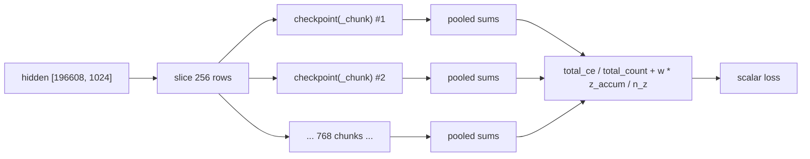

# Loss Functions in LLaMA-3-Lite — Cross-Entropy, Chunked CE, and Z-Loss

> **Audience:** intermediate. You know what a transformer is and have skimmed
> `model.py` once; you want the *why* behind the three loss mechanics in this
> codebase: the next-token cross-entropy, the chunked computation that keeps
> the LM head from materializing a 50 GB logits tensor, and the z-loss penalty
> that caps logit growth late in training.

## Table of Contents

1. The 60-Second Summary
2. Why This Exists
3. Intuition
4. Formal Treatment I — Cross-Entropy for Language Modeling
5. Formal Treatment II — The Chunked-Equals-Dense Proof
6. Formal Treatment III — Z-Loss and Its Gradient
7. Numbers at This Project's Scale
8. How the Code Realizes It
9. Edge Cases and Pitfalls
10. What the Tests Guard
11. Further Reading

---

## 1. The 60-Second Summary

Language modeling is next-token prediction: for every position in a sequence,
the model must assign high probability to the token that actually follows. The
training objective is the mean negative log-likelihood of those target tokens
under the model's softmax — the **cross-entropy (CE)** loss. At this project's
scale the logits tensor is huge: 96 × 2048 positions × 128,000 vocab entries is
25.2 billion numbers, 50.3 GB in BF16 — far too large to materialize on an
80 GB A100 alongside the model, optimizer, and activations. The code therefore
slices the token axis into chunks of `ce_chunk_size = 256` rows and computes
the loss per chunk inside a gradient-checkpoint region, keeping only one
chunk's logits alive (~131 MB FP32) at any instant; because CE is an additive
sum over positions, summing per-chunk numerators and denominators and dividing
once at the end is *exactly* equal to the dense loss. On top of CE, the loss
adds **z-loss** (`z_loss_weight = 1e-4`), a penalty on the squared
log-partition $\ell = \log\sum_j e^{z_j}$ that grows quadratically and
prevents logits from drifting upward as training progresses, the failure
mode PaLM and Gemma 2 guarded against. An optional fused Triton kernel
(`cross_entropy_impl = 'triton'`) computes the same per-chunk loss with an
online-softmax pass and `atomic_add` accumulators, but averages chunk means
instead of pooled sums — exact only when chunks are equal-sized, which they
are at the training shape (196,608 = 768 × 256 exactly).

---

## 2. Why This Exists

### 2.1 The loss is the only training signal

Everything in this model — 16 layers, GQA with 8/4 heads, SwiGLU, RoPE at
$\theta = 500000$, RMSNorm, QK-norm — exists to transform a token sequence
into predictions. The loss is the single scalar that tells the optimizer
whether those predictions are good. If the loss is wrong, every gradient in
the model is wrong, so the loss path gets treated with the same care as the
forward path: numerical precision, memory footprint, and exactness are all
negotiated here explicitly.

### 2.2 Problem one: the logits tensor does not fit

A decoder-only transformer scores every position against the whole vocab. With
`batch_size = 96`, `seq_len = 2048`, and `vocab_size = 128000`
(`config.py:get_config`), the logits tensor has

$$N = B \times S = 96 \times 2048 = 196{,}608 \text{ rows}$$

and $V = 128{,}000$ columns. That is $196{,}608 \times 128{,}000 =
25{,}165{,}824{,}000$ elements. At 2 bytes each (BF16, the dtype under
autocast on the A100):

$$25{,}165{,}824{,}000 \times 2\ \text{B} = 50{,}331{,}648{,}000\ \text{B}
\approx 50.3\ \text{GB}$$

An 80 GB A100 already holds 1.03 GB of BF16 weights, 4.11 GB of FP32 AdamW
moments, gradients, and several GB of activations. Allocating 50.3 GB of
logits on top is impossible — and that is before the FP32 upcast the loss
chain needs, which would be 100.7 GB. The loss computation must therefore
avoid ever materializing the full `[N, V]` tensor.

### 2.3 Problem two: logits drift upward late in training

Even if memory were free, a plain CE loss has a known failure mode in
large-scale pretraining: the logits slowly inflate. The quantity
$\ell_i = \log\sum_j e^{z_{ij}}$ — the log of the softmax normalization
constant, i.e. the log-partition function — grows without bound as training
proceeds. Nothing in CE stops this: CE is invariant to adding a constant to
all logits in a row (the constant cancels in $\ell - z_t$), so the optimizer
has no gradient pressure against a common-mode offset. The consequences are
spiky, overconfident softmaxes, degraded calibration, and — in scaled or
low-precision settings — outright numerical instability. PaLM
(Chowdhery et al., 2022) added a small penalty on $\ell^2$ to arrest this
drift, and Gemma 2 uses the same idea. That penalty is **z-loss**, and it is
the second ingredient of this project's loss.

---

## 3. Intuition

**Cross-entropy as a prediction game.** For each position the model outputs
128,000 scores, one per vocab token. Softmax turns them into a probability
distribution. If the correct next token got probability $p_t$, the loss
contributes $-\log p_t$: near 0 when the model is confident and right, growing
to infinity as the model's probability for the true token approaches zero.
Minimizing mean $-\log p_t$ over all positions is exactly maximizing the
likelihood of the training text.

**Chunking as paying a bill in slices.** Summing a thousand itemized charges
then dividing by the count gives the same average as adding them all up at
once — the arithmetic is the same regardless of grouping, as long as you do
not round at each group. That is the entire trick of chunked CE: accumulate
the *sum* of losses and the *count* of valid positions per chunk, and divide
once at the very end. Averaging the per-chunk *means* instead would change the
answer when chunks are unequal (the small final chunk would count as heavily
as a full one) — which is precisely why the PyTorch path pools sums while the
Triton path's mean-of-chunk-means is only exact for equal chunks.

**Z-loss as a cap on logit inflation.** Picture a balloon (the log-partition
$\ell$) that slowly inflates as training goes on. CE does not care how big the
balloon is, only how much air is on the correct token's side. Z-loss is a
rubber band around the balloon: its penalty grows as the *square* of the
balloon's size, so the bigger the logits drift, the harder the band pulls
them back down. The gradient of $\ell^2$ is $2\ell \cdot \text{softmax}(z)$ —
a pressure that pushes every logit down, proportionally to its softmax share
and to the current inflation $\ell$. At weight $1\times 10^{-4}$ it is a
gentle, mostly-invisible hand during normal training that turns into a real
force only if logits start running away.

---

## 4. Formal Treatment I — Cross-Entropy for Language Modeling

### 4.1 One row

For a single position with logits $z \in \mathbb{R}^{V}$ and target token
$t \in \{0, \dots, V-1\}$, the softmax probabilities are

$$p_j = \frac{e^{z_j}}{\sum_{k} e^{z_k}},$$

and the negative log-likelihood of the target is

$$L_{\text{CE}}(z, t) = -\log p_t
= \log\sum_{k} e^{z_k} - z_t
= \text{logsumexp}(z) - z_t .$$

The gradient with respect to the logits is the softmax minus a one-hot at the
target:

$$\frac{\partial L_{\text{CE}}}{\partial z_j} = p_j - \mathbb{1}[j = t].$$

This is the classic "softmax minus one-hot" update: the model raises the
target logit and lowers every other logit, each proportionally to its current
probability. Positions the model is already confident about (large $p_t$)
receive a small push; wrong predictions receive a large one.

### 4.2 Shift-by-1 targets

Given a token sequence $x_0, x_1, \dots, x_{S-1}$, the training pair for
position $i$ is input $x_i$, target $x_{i+1}$: each position predicts the
*next* token. In this repo the shift happens at the data layer, not in the
loss: `data/shared_data/loader.py:PackedDataset.__getitem__` slices a
`seq_len + 1`-token window and returns `window[:-1]` as inputs and
`window[1:]` as targets, so the target tensor for a batch is literally the
input tensor shifted by one position. Because documents are packed
back-to-back with a reserved EOS separator token (`eos_id = 0`), every window
is full and every one of the $B \times S$ positions has a valid target —
there is no padding anywhere in the pipeline.

### 4.3 The masked mean and `ignore_index`

The loss over a batch is a *masked mean* over the $N = B \times S$ rows:

$$L = \frac{1}{C}\sum_{i=1}^{N} w_i\, L_{\text{CE}}(z_i, t_i),
\qquad w_i = \begin{cases} 1 & t_i \ne \text{ignore\_index} \\ 0 & \text{otherwise} \end{cases},
\qquad C = \sum_i w_i .$$

Positions whose target equals `ignore_index` contribute zero to the numerator
and are excluded from the denominator `C`. In PyTorch this is exactly what
`F.cross_entropy(logits, targets, ignore_index=-100, reduction='mean')`
computes.

Why `-100`? `ignore_index` semantics are *"this position is not supervised"*,
which is the right treatment for padding in a padded pipeline. This pipeline
has no padding — but the convention still matters for a different reason:
`train.py:train_model` sets `ignore_index = -100` with the comment
*"No padding in this pipeline (packed documents, full windows), so nothing is
ignored; using -100 keeps EOS separators learnable."* If the code had used a
real token id as the ignore value — say `0`, the EOS id — then every EOS
separator between packed documents would be silently excluded from the loss,
and the model would never learn to emit end-of-document tokens. `-100` is not
a valid token id (ids live in $[0, 128000)$), so no position ever matches it
in the training data: every token, EOS included, stays supervised. The value
`-100` is purely conventional (PyTorch's own default); what matters is that
it is outside the vocab range.

---

## 5. Formal Treatment II — The Chunked-Equals-Dense Proof

The claim: computing the masked-mean loss on disjoint slices of the token
axis, then pooling the partial sums and counts, produces *bit-for-bit the
same arithmetic expression* as computing it on the whole tensor at once.

Let the valid rows be the set $\mathcal{V} = \{i : w_i = 1\}$, and let
$\{c_1, \dots, c_K\}$ be a partition of the row indices into chunks (e.g.
consecutive blocks of 256). Write $L_{\text{CE}}(z_i, t_i) = \ell_i - z_{i, t_i}$
with $\ell_i = \text{logsumexp}(z_i)$.

**Dense** (single pass):

$$L_{\text{dense}} = \frac{1}{C}\sum_{i \in \mathcal{V}} (\ell_i - z_{i,t_i}),
\qquad C = |\mathcal{V}| = \sum_{i \in \mathcal{V}} 1 .$$

**Chunked** (per chunk $c$, accumulate sums and counts, divide at the end):

$$L_{\text{chunked}} = \frac{\sum_{c=1}^{K} \sum_{i \in \mathcal{V} \cap c} (\ell_i - z_{i,t_i})}{\sum_{c=1}^{K} |\mathcal{V} \cap c|} .$$

Because the chunks partition the row indices, the sets
$\mathcal{V} \cap c$ are disjoint and their union is $\mathcal{V}$. Finite
sums over disjoint sets add, so the double sum collapses:

$$\sum_{c} \sum_{i \in \mathcal{V} \cap c} (\ell_i - z_{i,t_i})
= \sum_{i \in \mathcal{V}} (\ell_i - z_{i,t_i}),
\qquad
\sum_{c} |\mathcal{V} \cap c| = |\mathcal{V}| = C .$$

Hence $L_{\text{chunked}} = L_{\text{dense}}$. **The equality is exact — no
approximation, no averaging of chunk means** — provided the implementation
accumulates numerators and denominators separately and performs the division
once, after all chunks. The identical argument applies to the z-loss term
$\sum_{i \in \mathcal{V}} \ell_i^2 / C$, and to the combined loss
$L + \lambda L_z$ since it is a weighted sum of two such pooled expressions.

The one way to break exactness is to average *chunk means* (each chunk's
loss divided by its own count) and then average those averages. If every
chunk has the same number of valid rows, the unweighted mean of chunk means
equals the pooled mean — but if the final chunk is short, or chunks have
different valid counts, the short chunk is over-weighted. This is exactly the
difference between the PyTorch path (pooled, exact always) and the Triton
path (mean of chunk means, exact for equal chunks) in
`model.py:chunked_head_cross_entropy_with_z`, discussed in §8.4.

**Gradients are preserved too.** Since the loss is an exact arithmetic
rearrangement of the dense expression, its gradient with respect to every
logit (and hence, through the LM head, to `hidden` and `head_weight`) is
identical: autograd differentiates the pooled expression, which is the same
function. The numerical values differ only at the last-ulp level, from
different summation orders — and even the summation order is nearly the same,
since the loss divides pooled FP32 sums.

---

## 6. Formal Treatment III — Z-Loss and Its Gradient

### 6.1 The log-partition growth problem

Define the row log-partition

$$\ell_i = \log\sum_{j=1}^{V} e^{z_{ij}} = \text{logsumexp}(z_i).$$

Two facts about $\ell_i$:

1. **CE is invariant to it.** Adding a constant $c$ to all logits of a row
   leaves $p = \text{softmax}(z)$ unchanged (the constant cancels in the
   normalization), and leaves $L_{\text{CE}} = \ell_i - z_{i,t_i}$ unchanged.
   So CE gives *zero* gradient signal about the common-mode scale of the
   logits — the optimizer is free to push logits up or down without penalty.
2. **It grows with training.** Empirically, logit magnitudes drift upward
   over the course of pretraining: the model becomes progressively more
   overconfident, the softmax sharpens, and $\ell_i$ inflates. At extreme
   logit scales this degrades calibration and can push loss computations into
   unstable territory.

### 6.2 The penalty

Z-loss penalizes the squared log-partition, averaged over the valid rows:

$$L_z = \frac{1}{C}\sum_{i \in \mathcal{V}} \ell_i^2
= \operatorname{mean}\Big(\big(\log\textstyle\sum_j e^{z_{ij}}\big)^2\Big),$$

and the total loss is

$$L_{\text{total}} = L_{\text{CE}} + \lambda\, L_z,
\qquad \lambda = \text{z\_loss\_weight} = 10^{-4}
\quad (\text{config.py:get_config}).$$

The quadratic form is deliberate: at small $\ell$ the penalty and its gradient
are negligible, while at large $\ell$ they grow linearly — a soft but
unbounded counterforce to logit inflation.

### 6.3 The gradient

The gradient of $\ell_i$ with respect to its logits is the softmax itself:

$$\frac{\partial \ell_i}{\partial z_{ij}}
= \frac{1}{\sum_k e^{z_{ik}}} \cdot e^{z_{ij}}
= p_{ij} .$$

(This is the familiar identity: the derivative of the log-normalizer of a
softmax is the mean of the sufficient statistic — the distribution itself.)
Applying the chain rule to $\ell_i^2$:

$$\frac{\partial L_z}{\partial z_{ij}}
= \frac{1}{C}\cdot 2\,\ell_i\,\frac{\partial \ell_i}{\partial z_{ij}}
= \frac{2}{C}\,\ell_i\,p_{ij},$$

which is the elementwise form stated in the outline:
$\frac{\partial L_z}{\partial z_i} = 2\,\ell_i \cdot \text{softmax}(z_i)$.

Every component of this gradient is non-negative (since $\ell_i \ge 0$ —
logsumexp of anything is at least its max, and logits can be negative, but
$\ell_i \geq \max_j z_{ij}$; in practice for a trained model $\ell_i > 0$),
so gradient descent *pushes every logit down*, with force proportional to
$p_{ij}$ (the model's own confidence) times the current inflation $\ell_i$.
The more a row has run away, the harder it is pulled back; the target logit
is pulled down too, but it simultaneously receives the CE push
$1 - p_t$, so the net effect is to compress the whole logit distribution
toward a smaller scale without destroying the relative ordering that CE
maintains.

### 6.4 The combined per-logit gradient

Putting CE and z-loss together, for a valid row $i$ with target $t_i$:

$$\frac{\partial L_{\text{total}}}{\partial z_{ij}}
= \underbrace{\frac{1}{C}\big(p_{ij} - \mathbb{1}[j = t_i]\big)}_{\text{CE: softmax minus one-hot}}
\;+\; \underbrace{\frac{2\lambda}{C}\,\ell_i\,p_{ij}}_{\text{z-loss: scale down}}.$$

For an ignored row ($w_i = 0$) the entire gradient is zero: the code masks
the z-loss contribution as well as the CE contribution, so ignored positions
are completely unsupervised (see §8.2 for the masking in
`model.py:chunked_cross_entropy_with_z`). Note also the interaction with the
rest of the architecture: QK-norm (`model.py:GroupedQueryAttention`) already
bounds the *pre-softmax attention* scale, and z-loss bounds the *output
logits* scale — two complementary guards against scale drift, at opposite
ends of the model.

---

## 7. Numbers at This Project's Scale

All figures below are derived from `config.py:get_config`:
`batch_size = 96`, `seq_len = 2048`, `vocab_size = 128000`,
`d_model = 1024`, `ce_chunk_size = 256`.

**The full logits tensor (what we never materialize):**

$$N = 96 \times 2048 = 196{,}608 \text{ rows}, \qquad V = 128{,}000$$

| Storage | Elements | Bytes | Size (decimal) | Size (GiB) |
|---|---|---|---|---|
| BF16 (autocast path) | $196{,}608 \times 128{,}000 = 2.5166 \times 10^{10}$ | $\times 2$ | **50.3 GB** | 46.9 GiB |
| FP32 (loss chain needs) | same | $\times 4$ | 100.7 GB | 93.7 GiB |

The 50.3 GB figure is BF16: $196{,}608 \times 128{,}000 \times 2\ \text{B} =
50{,}331{,}648{,}000\ \text{B} \approx 50.3$ GB. An 80 GB A100 could not hold
this alongside the rest of the training state; the FP32 version (100.7 GB)
is doubly impossible.

**The chunked head (what we actually do):** the hidden state
$[196{,}608, 1024]$ is sliced into $K$ chunks of 256 rows. The chunk count at
training shape is exact:

$$\frac{196{,}608}{256} = 768 \quad \text{chunks, no remainder.}$$

Per chunk, the loss materializes at most one logits slice:

$$256 \times 128{,}000 \times 4\ \text{B (FP32 upcast)} = 131{,}072{,}000\
\text{B} = 131.1\ \text{MB}$$

plus the BF16 pre-upcast slice (65.5 MB) and the 1 MiB hidden chunk
($256 \times 1024 \times 4$ B). Peak loss-path working set is therefore on
the order of 200 MB per chunk — and because each chunk runs inside a
`checkpoint` region, only one chunk's tensors are alive at a time. The whole
loss adds roughly 0.4 GB for the full hidden activation (which the caller
must hold: $196{,}608 \times 1024 \times 2$ B = 402.7 MB BF16) plus one
chunk's working set, instead of 50.3 GB for the logits. This is the
~50 GB → ~0.3 GB claim in the docstring of
`model.py:chunked_head_cross_entropy_with_z`, now derived rather than
asserted.

**The LM head itself:** `output_proj` is a single `nn.Linear(d_model,
vocab_size, bias=False)` ($128{,}000 \times 1024 = 131{,}072{,}000$
parameters = 131.1M, about a quarter of the model's 513.8M total; it is
excluded from the 251.7M non-embedding count by
`model.py:Transformer.get_num_params`). In BF16 the head weight is
262.1 MB; it is passed by reference into every chunk's matmul, so it is
counted once, not per chunk.

**The z-loss magnitude:** with a healthy model, $\ell_i$ is on the order of a
few to a few tens. At $\ell = 10$, the z penalty per row is
$\lambda \ell^2 = 10^{-4} \times 100 = 0.01$, small next to a CE of order
2–5. At $\ell = 30$ it is 0.09 — comparable to a well-fit CE and growing.
This is the intended regime: invisible early, corrective late.

---

## 8. How the Code Realizes It

### 8.1 The training path

The training loop never asks the model for logits. `model.py:Transformer.forward`
supports `return_hidden: bool = False` and, when set, returns the decoder
output directly, skipping the head:

```python
# illustrative — model.py:Transformer.forward (abridged)
def forward(self, x, return_hidden: bool = False):
    x = self.input_embedding(x)
    x = self.decoder(x)          # or checkpointed layers
    if return_hidden:
        return x                 # [B, S, d_model] — the LM head is deferred
    logits = self.output_proj(x) # [B, S, V] — the 50.3 GB tensor, avoided
    return logits
```

The training loop (`train.py:train_model`) and validation
(`train.py:validate`) call it with `return_hidden=True`, then hand the
flattened hidden state, the head weight, and the flattened targets to the
chunked loss:

```python
# illustrative — train.py:train_model (abridged)
hidden = model(input_ids, return_hidden=True)          # [96, 2048, 1024]
loss = chunked_head_cross_entropy_with_z(
    hidden.view(-1, hidden.size(-1)),                  # [196608, 1024]
    _head_weight(model),                               # [128000, 1024]
    target_ids.view(-1),                               # [196608]
    chunk_size=ce_chunk_size,                          # 256
    ignore_index=ignore_index,                         # -100
    z_loss_weight=z_loss_weight,                       # 1e-4
    cross_entropy_impl=cross_entropy_impl,             # 'pytorch'
)
```

Two details matter here. First, `train.py:_head_weight` exists because the
model may be wrapped (EMA `AveragedModel`, `torch.compile`): it resolves
`model.output_proj.weight` if present, else `model.module.output_proj.weight`.
Second, the whole forward-plus-loss runs inside a BF16 autocast context on
CUDA, so the per-chunk `F.linear` in the loss produces BF16 logits that are
then upcast to FP32 for the loss arithmetic — the FP32 chain is confined to
one 131 MB chunk at a time (`train.py:train_model`, autocast block).

### 8.2 `chunked_cross_entropy_with_z` — chunking an existing logits tensor

`model.py:chunked_cross_entropy_with_z(logits, targets, chunk_size=256,
ignore_index=-100, z_loss_weight=1e-4, cross_entropy_impl='pytorch')` is the
simpler of the two functions: it *receives* an already-materialized logits
tensor (fine for tests and small shapes) and chunks along the token axis so
the FP32 loss chain never sees more than `chunk_size` rows at once. Its
docstring is explicit: prefer the head variant when the logits tensor itself
would not fit.

Per chunk it does, in order:

```python
# illustrative — model.py:chunked_cross_entropy_with_z (abridged)
cl = logits[start:end].float()            # upcast once, shared by CE and z
ct = targets[start:end]
mask = ct != ignore_index                 # valid-position mask
log_z = torch.logsumexp(cl, dim=-1)       # ell_i, numerically stable
z_accum = z_accum + log_z[mask].pow(2).sum()   # pooled z numerator (masked)
n_z += mask.sum()                          # pooled z denominator
ce = F.cross_entropy(cl, ct, ignore_index=ignore_index, reduction='none')
total_ce = total_ce + ce[mask].sum()       # pooled CE numerator
total_count = total_count + mask.sum()     # pooled CE denominator
```

and after the loop:

```python
# illustrative
ce_loss = (total_ce / total_count.float()) if total_count > 0 else torch.tensor(0.0, ...)
z_loss = z_accum / max(int(n_z), 1)
return ce_loss + z_loss_weight * z_loss
```

This is the pooled-sums pattern from §5 — exact for any chunk size, including
a ragged final chunk. Note the *double* masking of the z-loss: the mask gates
both the `log_z[mask].pow(2)` numerator and the `n_z` denominator, so ignored
rows are entirely absent from the z-statistic. This is the
"why the code masks ignored tokens" detail: an ignored position is
unsupervised, its logits are arbitrary, and letting its $\ell^2$ pollute the
z-mean would inject noise into a global statistic. The behavior is guarded by
`tests/test_model.py::TestChunkedCrossEntropyWithZ.test_z_loss_ignores_ignore_index_positions`.

### 8.3 `chunked_head_cross_entropy_with_z` — the checkpoint-per-chunk design

`model.py:chunked_head_cross_entropy_with_z(hidden, head_weight, targets,
chunk_size=256, ignore_index=-100, z_loss_weight=1e-4,
cross_entropy_impl='pytorch')` is the memory-bounded variant: it computes the
logits itself, per chunk, and never holds more than one chunk's slice. The
per-chunk computation is a closure `_chunk(hidden_c, w, targets_c)` that
performs the head matmul and returns pooled partials:

```python
# illustrative — model.py:chunked_head_cross_entropy_with_z (abridged)
def _chunk(hidden_c, w, targets_c):
    logits = F.linear(hidden_c, w)         # [256, 128000] — one chunk only
    cl = logits.float()                    # FP32 upcast for the loss chain
    log_z = torch.logsumexp(cl, dim=-1)
    ce = F.cross_entropy(cl, targets_c, ignore_index=ignore_index, reduction='none')
    mask = targets_c != ignore_index
    return ce[mask].sum(), mask.sum().float(), log_z[mask].pow(2).sum()
```

and the loop wraps each call in gradient checkpointing:

```python
# illustrative — model.py:chunked_head_cross_entropy_with_z (abridged)
for start in range(0, hidden.shape[0], chunk_size):
    end = min(start + chunk_size, hidden.shape[0])
    out = checkpoint(_chunk, hidden[start:end], head_weight,
                     targets[start:end], use_reentrant=False)
    total_ce = total_ce + out[0]
    total_count = total_count + out[1].long()
    z_accum = z_accum + out[2]
    n_z += int(out[1])
ce_loss = (total_ce / total_count.float()) if total_count > 0 else ...
z_loss = z_accum / max(n_z, 1)
return ce_loss + z_loss_weight * z_loss
```

The checkpoint call is the heart of the memory bound. With
`use_reentrant=False`, the `_chunk` function's *inputs* (`hidden` slice,
`head_weight`, `targets` slice) are saved for the backward pass, but its
*outputs* — the logits, the FP32 upcast, the logsumexp — are not: they are
recomputed from the saved inputs when gradients flow backward. Consequently
at any instant only one chunk's logits exist, and they exist only during the
forward of that chunk (or during the backward recompute of that chunk),
never all 768 of them. The memory profile per chunk is:

```
hidden chunk  [256, 1024]   FP32    1.0 MiB   (saved input)
logits chunk  [256, 128000] BF16   65.5 MB    (transient, forward + backward)
logits chunk  [256, 128000] FP32  131.1 MB    (transient, .float() upcast)
head_weight   [128000, 1024]  shared reference (counted once)
---------------------------------------------------------------
peak per chunk ≈ 200 MB transient + 1 MiB saved
```

The full hidden activation `[196608, 1024]` (402.7 MB BF16) is held by the
caller — it is the input to the function — but that is an order of magnitude
smaller than the 50.3 GB logits tensor the dense path would require. The
trade-off is compute: backward recomputes each chunk's matmul once (the
classic checkpoint cost of one extra forward over the head), which is cheap
relative to the 16-layer decoder the chunks sit behind. The flow:



### 8.4 The Triton variant — fused kernel, online softmax, `atomic_add`

With `cross_entropy_impl='triton'` (and `ENABLE_TRITON_KERNELS=1`, see §8.5),
`model.py:chunked_head_cross_entropy_with_z` calls
`kernels/cross_entropy_triton.py:triton_chunked_cross_entropy_with_z` per
chunk instead of the eager chain. The public entry point is
`triton_chunked_cross_entropy_with_z(logits, targets, ignore_index=-100,
z_loss_weight=1e-4)`, wrapped in
`kernels/cross_entropy_triton.py:_TritonCEWithZ`, an
`torch.autograd.Function` whose backward is a re-compute stub (below).

**The kernel** (the `_ce_z_fwd_kernel` JIT, launched by `kernels/cross_entropy_triton.py:_triton_ce_z_forward`) launches
one program per row (`grid = (M,)`). Each program loads the row's vocab slice
as a single vectorized block and computes the numerically stable
logsumexp — the classic max-shift (online-softmax `m`/`l`) trick:

```
m = max over vocab of x                 (running maximum)
x_shift = x - m                         (subtract to keep exp in range)
l = sum over vocab of exp(x_shift)      (running sum of exp)
log_z = m + log(l)                      (stable logsumexp)
```

For one block this is exactly the identity
$\log\sum e^{z_j} = m + \log\sum e^{z_j - m}$: shifting by the max prevents
`exp` overflow on large logits and underflow-induced loss of precision on
small ones. The kernel is "online" in the broader sense that each row needs
only one streaming pass over its vocab — no two-pass softmax, no stored
intermediate probabilities. The `m`/`l` merge becomes genuinely
multi-block only when the vocab axis exceeds one `tl.arange` block; here the
kernel's guard `_MAX_VOCAB_BLOCK = 131072` ensures that never happens at this
project's vocab (128,000 ≤ 131,072 = `next_power_of_2(128000)`), with a
`ValueError` raised otherwise — the file's comment notes a 256k vocab would
need two programs per row and hence a real online merge.

The per-row results are reduced with three scalar accumulators, all
`torch.float32` zeros of shape `(1,)`, updated via `tl.atomic_add`:

```python
# illustrative — body of the fused CE+z kernel (abridged; the JIT function is defined
# under `if HAS_TRITON:` and launched by kernels/cross_entropy_triton.py:_triton_ce_z_forward)
nll = log_z - target_logit                  # stable CE: logsumexp - target logit
if valid:                                   # ignored rows skip the CE accumulators
    tl.atomic_add(CE_SUM_ptr, nll)
    tl.atomic_add(CE_CNT_ptr, 1.0)
tl.atomic_add(Z_SUM_ptr, log_z * log_z)     # z accumulated for EVERY row
```

After the grid finishes, `kernels/cross_entropy_triton.py:_triton_ce_z_forward`
normalizes once:

```python
# illustrative
ce_mean = ce_sum / ce_cnt.clamp_min(1.0)    # masked mean over valid rows
z_mean = z_sum / M                          # mean over ALL rows (see §9)
return ce_mean + z_loss_weight * z_mean
```

**The backward** (`kernels/cross_entropy_triton.py:_TritonCEWithZ.backward`)
is a re-compute stub: it re-runs the *PyTorch reference*
`kernels/cross_entropy_triton.py:cross_entropy_with_z_pytorch` on the saved
logits under `torch.enable_grad()` and harvests the gradient with
`torch.autograd.grad`. This trades forward memory for backward compute and
keeps the fused forward simple; the price is that the chunk's logits are
saved in `ctx` (65.5 MB BF16 per chunk, still bounded by one chunk) and the
reference loss is materialized during backward.

**The mean-of-chunk-means caveat.** `chunked_head_cross_entropy_with_z`
cannot pool the Triton path's per-chunk scalars into exact global sums —
the kernel returns *means*, not sums. So the Triton branch of the loop does:

```python
# illustrative
triton_acc = triton_acc + out
...
return triton_acc / max(n_chunks, 1)        # unweighted mean of chunk means
```

This is *not* the pooled expression of §5: a chunk with 256 valid rows and a
final ragged chunk with, say, 128 rows each contribute one term to the
average, so the small chunk is weighted twice as heavily per row. The
function's docstring states the condition for exactness: *"per-chunk losses
are then averaged (equal-size chunks ⇒ exact)."* At the training shape the
condition holds exactly — 196,608 = 768 × 256, no remainder — and with no
ignored tokens every chunk's valid count equals its row count, so the Triton
path agrees with the PyTorch path to within FP32 rounding. (And because the
Triton kernel divides `z_sum` by `M` — all rows — rather than the valid
count, the two paths also agree on the z-term only when nothing is ignored,
which is the training reality.)

### 8.5 Gating

The Triton path is opt-in and guarded twice: `train.py:train_model` resets
`cross_entropy_impl` to `'pytorch'` unless `ENABLE_TRITON_KERNELS=1` is set
(default runs never silently switch to a fused path), and
`model.py:chunked_head_cross_entropy_with_z` falls back to the eager chain
with a printed warning when `import triton` fails. `chunked_cross_entropy_with_z`
has an analogous `ImportError`/`ValueError` fallback around its Triton call.
This mirrors the repo-wide convention (AGENTS.md rule 7) that fused kernels
are explicit, environment-gated choices, never implicit behavior changes.

---

## 9. Edge Cases and Pitfalls

1. **Calling the wrong function at training scale.** `chunked_cross_entropy_with_z`
   still *receives* full logits; calling it on a `[196608, 128000]` tensor
   requires the 50.3 GB allocation first. Its own docstring warns to prefer
   `model.py:chunked_head_cross_entropy_with_z` when logits would not fit.
   The head variant is the only one safe at training shape.

2. **Unequal chunks break Triton exactness.** If `N % chunk_size != 0`, the
   Triton path's unweighted mean of chunk means over-weights the final short
   chunk; the PyTorch path stays exact. At the training shape this cannot
   happen (768 × 256 = 196,608). Any experiment with a different
   `batch_size × seq_len` or `ce_chunk_size` should prefer the PyTorch path,
   or verify the remainder is zero.

3. **Z-masking divergence between paths.** The eager paths
   (`chunked_cross_entropy_with_z`, the eager branch of the head variant)
   mask ignored rows out of the z-statistic; the Triton kernel and its
   reference `cross_entropy_with_z_pytorch` do not — `z_sum` is accumulated
   for every row and divided by `M`, and the reference uses an unmasked
   `log_z.pow(2).mean()`. With `ignore_index = -100` and no padding the sets
   agree; with real ignored tokens they do not. If you use the Triton path on
   data that has ignored positions, its z-term will differ from the eager
   path by the ignored rows' contribution.

4. **Unconditional target-logit load.** The Triton kernel computes
   `target_logit = tl.load(L_ptr + row * V + target)` *before* checking
   `valid`. For an ignored row (`target = -100`), this is an out-of-range
   scalar pointer read; the value is garbage but is never used because the
   `if valid:` guard gates the `atomic_add`. It cannot be observed through
   the loss, but it is the kind of latent OOB access that would fault if the
   kernel were refactored; the training path never triggers it.

5. **All-ignored edge cases.** `total_count > 0` and `max(int(n_z), 1)`
   guards in `model.py:chunked_cross_entropy_with_z` turn an all-ignored
   input into a zero loss instead of a NaN; the Triton path's
   `ce_cnt.clamp_min(1.0)` serves the same role for its denominator. The
   z-denominator guard `max(n_z, 1)` means an all-ignored tensor yields
   `z_accum / 1 = 0`, which is the right degenerate answer.

6. **`reduction='none'` + explicit mask.** The eager path uses
   `F.cross_entropy(..., reduction='none')` and re-masks with `ce[mask].sum()`
   rather than relying on `reduction='mean'`, because it needs the masked
   *sum* and *count* separately to pool across chunks. `F.cross_entropy` with
   `reduction='none'` already zeroes ignored positions; the explicit mask
   makes the denominator independent of PyTorch's internal counting.

7. **Precision of the loss chain.** All loss arithmetic runs in FP32:
   `cl = logits[...].float()` before both logsumexp and CE, so BF16 logits
   are upcast once and shared, avoiding double promotion and BF16 rounding
   inside the loss. `logsumexp` is stable by construction (max-shift), so
   extreme logits cannot overflow the softmax normalization — this is also
   why the z-loss gradient is well-behaved at large $\ell$ (see [mixed-precision.md](mixed-precision.md)).

8. **Memory moves to backward.** In the eager head variant, `checkpoint`
   recomputes each chunk during backward, so peak loss memory during the
   backward pass is one chunk again, not N. In the Triton variant, the
   autograd `Function` *saves* the chunk logits for its re-compute backward —
   still one chunk, but saved rather than recomputed. Both stay
   $O(\text{chunk} \times V)$, never $O(N \times V)$.

9. **EOS must stay learnable.** `ignore_index = -100` is deliberately not a
   token id: the packed-document pipeline reserves `eos_id = 0`, and if 0
   were used as the ignore value, every document-boundary token would drop
   out of the loss and the model would never learn to emit EOS. The comment
   at `train.py:train_model` documents this choice explicitly. Relatedly, the
   loss is computed over *all* positions of the window — `window[1:]` is a
   full-length target tensor (`data/shared_data/loader.py:PackedDataset.__getitem__`),
   so the shift-by-1 never creates an unsupervised "last position".

10. **`z_loss_weight` is small on purpose.** At $10^{-4}$, the penalty is
    negligible until $\ell$ is large ($\ell^2 \cdot 10^{-4} \gtrsim 0.01$
    needs $\ell \gtrsim 10$). Turning it up an order of magnitude changes the
    loss's optimum: CE wants the true-token logit high; z-loss pulls
    everything down, and the balance point moves. The tests use weights from
    $10^{-4}$ to $1.0$ to probe behavior, but the training value is the
    PaLM-scale $10^{-4}$.

---

## 10. What the Tests Guard

The contract "chunked == dense, z-loss behaves" is enforced numerically in
`tests/test_model.py`, against a `tiny_model` (d_model 64, vocab 256,
seq_len 32; `tests/conftest.py`) so full logits are materializable for the
reference:

- `tests/test_model.py::TestChunkedCrossEntropyWithZ.test_matches_ce_plus_zpen_reference` —
  `chunked_cross_entropy_with_z` (chunk_size 32) must equal
  `F.cross_entropy(mean) + 1e-4 * mean(logsumexp²)` within 1e-5: the
  chunked-≡-dense equivalence for both terms at once.
- `tests/test_model.py::TestChunkedCrossEntropyWithZ.test_z_weight_zero_matches_pure_ce` —
  weight 0 must reduce exactly to plain CE (atol 1e-6): the z term is
  identically zero, not a no-op approximation.
- `tests/test_model.py::TestChunkedCrossEntropyWithZ.test_gradients_flow` —
  z-loss must backprop through logits with finite gradients, otherwise the
  logit-growth bound is worthless.
- `tests/test_model.py::TestChunkedCrossEntropyWithZ.test_z_loss_grows_with_logit_magnitude` —
  scaling logits ×5 must increase the z penalty: $\ell$ grows with the max
  logit, so $\ell^2$ grows.
- `tests/test_model.py::TestChunkedCrossEntropyWithZ.test_z_loss_ignores_ignore_index_positions` —
  rows with target −100 must not contribute to the z average: the masking
  contract of §8.2.
- `tests/test_model.py::TestChunkedHeadCrossEntropyWithZ.test_matches_dense_ce_with_zero_z` —
  the head variant at chunk_size 7 must equal dense CE on full logits
  (atol 1e-5): the checkpoint-per-chunk path is exact, not approximate.
- `tests/test_model.py::TestChunkedHeadCrossEntropyWithZ.test_matches_dense_ce_plus_z` —
  same with `z_loss_weight = 1e-4`: the combined loss matches the dense
  reference including the z term.
- `tests/test_model.py::TestChunkedHeadCrossEntropyWithZ.test_gradients_flow_to_hidden_and_head` —
  gradients must reach both `output_proj.weight` and, through the hidden
  state, `input_embedding.weight`, all finite: the head matmul and the
  checkpoint recompute are fully differentiable.
- `tests/test_model.py::TestChunkedHeadCrossEntropyWithZ.test_return_hidden_skips_head` —
  `return_hidden=True` returns `(B, S, d_model)` and never touches the head:
  the memory-saving contract of §8.1.

(The chunk sizes 7, 16, and 32 in the tests deliberately leave remainders, so
the pooled PyTorch path is exercised with ragged final chunks — the case
where mean-of-chunk-means would fail but pooled sums do not.)

---

## 11. Further Reading

- [transformers-from-scratch.md](transformers-from-scratch.md) — the decoder stack that produces the hidden states the head scores.
- [attention.md](attention.md) — the causal softmax whose output-scale discipline pairs with z-loss at the model's output.
- [normalization.md](normalization.md) — RMSNorm and QK-norm, the input-side answer to the same scale-drift problem z-loss fights on the output side.
- [mixed-precision.md](mixed-precision.md) — why the loss chain upcasts to FP32 per chunk and why BF16 logits are safe to compute with.
- [gradient-checkpointing.md](gradient-checkpointing.md) — the `use_reentrant=False` mechanics the checkpoint-per-chunk design relies on.
- [memory-engineering.md](memory-engineering.md) — the full 92→20 GB derivation, of which the 50.3 GB→0.3 GB logits bound is one component.
- [kernel-programming.md](kernel-programming.md) — the Triton model of computation, online softmax, and `atomic_add` patterns in depth.
- [data-engineering.md](data-engineering.md) — document packing, EOS separators, and why the shift-by-1 window keeps every position supervised.
- Reference: [model.md](../reference/model.md), [training.md](../reference/training.md), [config.md](../reference/config.md), [tests.md](../reference/tests.md), [kernels.md](../reference/kernels.md).

*All memory, parameter, and loss-magnitude figures in this document are
derived from `config.py:get_config` values (`batch_size = 96`,
`seq_len = 2048`, `vocab_size = 128000`, `d_model = 1024`,
`ce_chunk_size = 256`, `z_loss_weight = 1e-4`) and the formulas in
Sections 4–7; nothing is measured from a running model. External claims
about PaLM/Gemma 2 motivation are background knowledge, not repo facts.*
