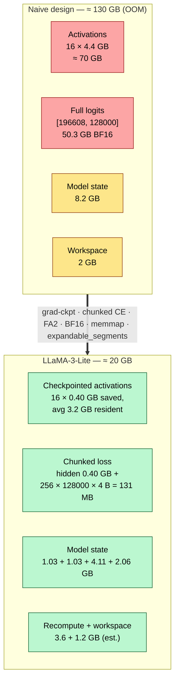

# Memory Engineering: The Full 92 GB → 20 GB Derivation

> Audience: intermediate → expert. You should know what a transformer is and
> roughly what AdamW, backpropagation, and CUDA VRAM are. You do not need any
> other doc in this repo: every number below is derived from the config and
> the source code with the arithmetic shown.

## 1. The 60-Second Summary

LLaMA-3-Lite is a 513.8M-parameter decoder-only transformer that pretrains at
`batch_size=96`, `seq_len=2048` — 196,608 tokens per step — on a single A100
80GB. A naive implementation of the same model would need on the order of
**130–180 GB of VRAM**: ~70 GB of saved activations across 16 layers, a
~50 GB full logits tensor, and ~8 GB of model state. This repo gets the same
training step into **~20 GB** with eight cooperating techniques: BF16
compute, FP32 AdamW moments, gradient checkpointing, a chunked LM-head loss
that never materializes full logits, Flash-Attention 2's $O(S)$ attention
memory, a memory-mapped token corpus, a CUDA caching allocator configured
with `expandable_segments`, and `torch.compile` CUDA graphs. The headline
claim — **78% peak-memory reduction, 92 GB → 20 GB** — is an estimate, not a
measurement: `.benchmarks/` is empty and no full run has completed. This doc
derives every component of that estimate, marks each number as
derived-from-config, estimated, or `[INFERENCE]`, and shows where the older
asserted figures (70 GB, 92 GB, 112 GB) do and do not survive scrutiny.

## 2. Why This Exists

The pretraining goal is fixed: 42,000 steps at 96 × 2048 tokens per step.
Nothing about that goal can be relaxed to fit memory — the data budget is
8.26B tokens, the batch size is a quality/throughput choice, and the A100
80GB is the hardware. So the question is purely one of *accounting*: where
does every byte go, and which bytes can be (a) recomputed instead of stored,
(b) computed in a smaller format, (c) streamed from disk instead of held in
RAM, or (d) reused instead of re-allocated?

Three of the four biggest consumers in the naive design are storage
artifacts, not computation:

- **Activations.** Backpropagation needs every intermediate tensor of every
  layer. At this scale the FFN alone writes a `[96, 2048, 8192]` tensor
  (3.2 GB) per layer per step.
- **Logits.** Cross-entropy wants `[196608, 128000]` scores — 50.3 GB in
  BF16, 100.7 GB in FP32 — for a single number (the loss).
- **The corpus.** 8B tokens of training data is 32 GB of `uint32`, which a
  naive pipeline would load into RAM (or worse, into several RAM
  representations).

All three are storage, and all three have a classic engineering answer:
**don't store them**. Recompute activations during backward (gradient
checkpointing), compute the loss in slices (chunked CE), and let the OS page
the corpus in on demand (memmap). The fourth big consumer — the optimizer
state — cannot be recomputed or streamed; it must live in VRAM for the whole
run. The budget below is the story of which parts are unavoidable and which
parts are merely stored.

## 3. Intuition

Think of VRAM as a workspace you rent by the step. Four kinds of things
compete for it:

1. **The model itself** — weights, gradients, optimizer moments, EMA shadow.
   These live for the entire run. You cannot shrink the *count* (513.8M
   parameters), only the *format* (2 vs 4 bytes per number) and the *number
   of copies*.
2. **Activations** — tensors produced mid-forward and needed again during
   backward. These live for (at most) one step. You can shrink their count
   (recompute instead of store) or their format (BF16).
3. **The loss computation's workspace** — for cross-entropy at vocab 128k,
   this is one giant tensor whose only job is to be reduced to a scalar.
   You can compute it in slices so only one slice exists at a time.
4. **Data plumbing** — input batches, pinned buffers, allocator slack. Small
   if done right.

The central trick of this repo is to make the *peak* of categories 2 and 3
small by construction: category 2 never holds more than one layer's worth of
transients at once (gradient checkpointing), and category 3 never holds more
than 256 rows of the vocab dimension at once (chunked head loss). Everything
else is arithmetic.

A useful mental model for the arithmetic below: **the unit tensor is
`B·S·d` = 96 × 2048 × 1024 elements, and in BF16 that is 402.7 MB.** Every
derivation is a count of how many such tensors (or their bigger FFN cousins)
are alive at the same time.

## 4. The Parameter Budget (everything else hangs off this)

`build_transformer` (`model.py:build_transformer`) constructs a
`Transformer` (`model.py:Transformer`) from the config keys in
`config.py:get_config` — `d_model=1024`, `n_heads=8`, `n_kv_heads=4`,
`head_dim=128`, `d_ff=4096`, `vocab_size=128000`, `n_layers=16`. The
parameter count is derivable per module:

| Module | Shape | Parameters |
|---|---|---|
| `input_embedding` | 128000 × 1024 | 131,072,000 |
| per-block `q_proj` | 1024 × 1024 | 1,048,576 |
| per-block `k_proj` | 1024 × 512 | 524,288 |
| per-block `v_proj` | 1024 × 512 | 524,288 |
| per-block `out_proj` | 1024 × 1024 | 1,048,576 |
| per-block QK-norm | 2 × 128 | 256 |
| per-block norms | 2 × 1024 | 2,048 |
| per-block `gate_up_proj` | 1024 × 8192 | 8,388,608 |
| per-block `down_proj` | 4096 × 1024 | 4,194,304 |
| **per-block total** | | **15,730,944** |
| 16 blocks | | 251,695,104 |
| final `RMSNorm` | 1024 | 1,024 |
| `output_proj` (LM head) | 1024 × 128000 | 131,072,000 |
| **Total** | | **513,840,128 ≈ 513.8M** |

Non-embedding parameters (16 blocks + final norm) = 251,695,104 + 1,024 ≈
**251.7M**; the embedding plus the LM head each contribute 131.07M. The
`Transformer.get_num_params` (`model.py:Transformer.get_num_params`) prints
exactly this split (`non_embedding=True` subtracts the two
131,072,000-parameter matrices).

Two config details affect this count at the margins. First, the model is
built with `real_vocab_size = max(config['vocab_size'], len(tokenizer))`
(`train.py:train_model`): with the synthetic byte stub
(`data/shared_data/loader.py:_SyntheticTokenizerStub`, whose `__len__`
returns its `vocab`) this stays 128,000; if the real HuggingFace tokenizer
loads it is 128,256, adding 2 × 256 × 1024 = 0.52M parameters — a 0.1%
change, irrelevant to the budget. Second, the `vocab_size` here is the
*model's* vocab; the *data* pipeline's tokenizer is a separate concern
covered in [data-engineering.md](data-engineering.md).

## 5. Component-by-Component Derivation

All arithmetic below uses $B=96$, $S=2048$, $d=1024$, $d_{\mathrm{ff}}=4096$,
$V=128000$, $L=16$, $H=8$ query heads, $KV=4$ KV heads, $N=B\cdot S=196{,}608$
tokens per step, and 2 bytes per BF16 element unless noted. All VRAM numbers
are derived-from-config; where a number is an estimate or a `[INFERENCE]`
it is marked.

### 5.1 Model state: weights, gradients, optimizer, EMA

The model state is the one component that cannot be shrunk by cleverness in
the training step — it is a fixed cost of 513.8M parameters, and it does not
scale with batch size.

- **Weights (BF16).** $513{,}840{,}128 \times 2\ \mathrm{B} = 1.03\ \mathrm{GB}$.
- **Gradients (BF16).** One tensor per parameter: another $1.03\ \mathrm{GB}$.
- **AdamW moments (FP32).** `torch.optim.AdamW` (`train.py:train_model`)
  keeps two states per parameter — first and second moment. In FP32:
  $2 \times 513{,}840{,}128 \times 4\ \mathrm{B} = 4.11\ \mathrm{GB}$.
- **EMA shadow (FP32).** With `use_ema: True`, `train.py:train_model`
  constructs `AveragedModel(model, multi_avg_fn=get_ema_multi_avg_fn(0.999))`
  (`torch.optim.swa_utils`), which deep-copies the model: a full second
  weight copy. At FP32 that is $513{,}840{,}128 \times 4\ \mathrm{B} = 2.06\ \mathrm{GB}$.

Sum: **8.23 GB** of model state per step, independent of batch size:

$$1.03 + 1.03 + 4.11 + 2.06 = 8.23\ \mathrm{GB}$$

Two conventions appear in older docs and both are consistent with this one:
the README's "7.2 GB" is the same accounting with FP32 gradients and without
EMA — $513.84\mathrm{M} \times (2 + 4 + 8)\ \mathrm{B} = 7.19\ \mathrm{GB}$
— and the "BF16 halves parameter & gradient memory" claim in
`docs/memory_stack.md` is exactly the weights/gradients rows above.

**Honesty flag (code reality).** `train.py` never calls `.bfloat16()` on the
model: parameters are created in FP32 and only *compute* is downcast by
`torch.autocast(dtype=torch.bfloat16)` around the forward/loss
(`train.py:train_model`). At runtime the live weight storage is therefore
$2 \times 1.03 = 2.06\ \mathrm{GB}$ and the EMA shadow is exactly the
2.06 GB derived above (it deep-copies the FP32 model). The 1.03 GB weight
row is the *design profile* (weights cast to BF16), which the print in
`train.py:train_model` ("1.03 GB in BF16") assumes. This is a
derived-from-config number, not a measurement; see §9.

### 5.2 Activations: the naive ~70 GB and the checkpointed ~3.2 GB

The unit tensor. One `[B, S, d]` activation in BF16:

$$B \cdot S \cdot d \times 2\ \mathrm{B} = 96 \times 2048 \times 1024 \times 2 = 402.7\ \mathrm{MB} \approx 0.40\ \mathrm{GB}$$

**Naive (no checkpointing).** Backpropagation retains every intermediate of
every layer between the end of forward and the start of backward. The four
largest per-layer tensors are:

| Tensor | Shape | Size |
|---|---|---|
| block input `x` | [96, 2048, 1024] | 0.40 GB |
| `attention_norm` output | [96, 2048, 1024] | 0.40 GB |
| `gate_up_proj` output | [96, 2048, 8192] | 3.22 GB |
| `down_proj` output | [96, 2048, 1024] | 0.40 GB |

The `gate_up_proj` tensor dominates because $2d_{\mathrm{ff}} = 8192 = 8d$:

$$96 \times 2048 \times 8192 \times 2\ \mathrm{B} = 3.22\ \mathrm{GB}$$

Per layer these four sum to $0.40 + 0.40 + 3.22 + 0.40 = 4.43\ \mathrm{GB}$,
and over 16 layers:

$$16 \times 4.43 = 70.9\ \mathrm{GB} \approx 70\ \mathrm{GB}$$

**This is the origin of the ~70 GB activation figure.** It is an *estimate
by dominant terms*: it deliberately omits the SwiGLU intermediate
(`[B,S,4096]` = 1.61 GB/layer), the attention path (q/k/v/out projections,
expanded KV heads, attention output — ~2.4 GB/layer), and the second norm.
Strict per-tensor retention is $9.46\ \mathrm{GB}$/layer, i.e. ~151 GB total
over 16 layers. Both numbers are derived from the shapes in
`model.py:DecoderBlock.forward` and `model.py:SwiGLUFFN.forward`; the 70 GB
figure is the one the README uses, and it is the conservative (smaller) one.
The full per-tensor walkthrough lives in
[gradient-checkpointing.md](gradient-checkpointing.md) — this doc only needs
the magnitude: **activations, unoptimized, are 70–150 GB and alone can
exceed the A100's 80 GB.**

**With gradient checkpointing.** `model.py:Transformer.forward` wraps each
`DecoderBlock` in `checkpoint(layer, x, use_reentrant=False)` when
`gradient_checkpointing: True` (config default) and the model is in training
mode. Each checkpoint boundary saves only its *input* — one `[B,S,d]` tensor
per block:

$$16 \times 402.7\ \mathrm{MB} = 6.44\ \mathrm{GB}$$

at the instant backward begins. The saved inputs are consumed (and freed)
one block at a time in reverse order, so the *resident* count averages
roughly half — $8 \times 402.7\ \mathrm{MB} = 3.22\ \mathrm{GB} \approx
3.2\ \mathrm{GB}$ — which is the figure the README and `docs/memory_stack.md`
quote for "checkpointed activations". During each block's backward, the
recompute re-runs that block's forward (`checkpoint` invokes the layer with
`use_reentrant=False`), producing one layer's transient working set. The
README's "~3.6 GB backward recomputation buffer" is that working set,
estimated as ~9 `[B,S,d]`-sized tensors; strictly, one layer's recompute
touches ~9.5 GB of tensors (dominated by `gate_up_proj` at 3.22 GB), but the
CUDA caching allocator reuses the blocks freed from the saved-input pool, so
the marginal footprint is the ~3.2–3.6 GB row. Both figures are estimates
marked as such; what is *derived* is the saved-input total of 6.44 GB and
the per-layer recompute contents.

The compute cost: recomputation approximately doubles the FLOPs of the
forward pass (each layer is computed twice per step instead of once), which
is why the README describes checkpointing as trading ~25% per-step compute
for the memory reduction; [gradient-checkpointing.md](gradient-checkpointing.md)
quantifies the exact recompute budget.

### 5.3 Logits and the loss: 50.3 GB → 0.5 GB

The LM head is a `nn.Linear(d_model, vocab_size)` — `output_proj`
(`model.py:Transformer`). A naive training loop would compute the full
logits tensor over all $N = 196{,}608$ tokens:

$$N \times V \times 2\ \mathrm{B} = 196{,}608 \times 128{,}000 \times 2 = 50.3\ \mathrm{GB}\ \text{(BF16)}$$

and the FP32 loss chain would need $100.7\ \mathrm{GB}$. Both exceed the
80 GB GPU by themselves.

The training path never materializes it. The loop calls
`model(input_ids, return_hidden=True)` (`train.py:train_model`), so
`model.py:Transformer.forward` returns the final hidden states — a single
$[B,S,d]$ tensor:

$$N \times d \times 2\ \mathrm{B} = 196{,}608 \times 1024 \times 2 = 0.40\ \mathrm{GB}$$

and passes them to `model.py:chunked_head_cross_entropy_with_z`, which
computes `F.linear(hidden_c, head_weight)` in slices of `chunk_size=256`
rows (`ce_chunk_size` in `config.py:get_config`). The per-chunk logits slice
is:

$$256 \times 128{,}000 \times 4\ \mathrm{B} = 131\ \mathrm{MB}\ \text{(FP32, upcast inside the chunk)}$$

Each chunk runs inside `checkpoint(..., use_reentrant=False)`
(`model.py:chunked_head_cross_entropy_with_z`), so the chunk's logits and
its FP32 loss chain (`logsumexp`, per-token CE, z-loss) exist only for the
duration of that chunk's backward, then are freed. The full loss region is
therefore:

$$0.40\ \mathrm{GB}\ (\text{hidden buffer}) + 0.13\ \mathrm{GB}\ (\text{one chunk}) \approx 0.5\ \mathrm{GB}$$

The code's own docstring states "~0.3 GB at `chunk_size=256`" — that figure
counts only the chunk slices (131 MB each, plus the per-chunk
checkpoint-internal copies); with the hidden buffer the honest bound is
~0.5 GB. The reduction factor against the naive BF16 path is
$50.3/0.53 \approx 95\times$; against the FP32 loss chain,
$100.7/0.53 \approx 190\times$. The `chunk_size` knob trades this directly:
raising it to 2048 gives 2048 × 128000 × 4 B = 1.05 GB per slice, and the
pre-defect value 65536 would give 33.5 GB per slice — an OOM. The loss
arithmetic (why chunked CE is *numerically identical* to dense CE — the
reduction is over disjoint per-chunk index sets — and what the z-loss term
does) is derived in [loss-functions.md](loss-functions.md).

### 5.4 Attention: O(S) instead of O(S²)

Eager scaled-dot-product attention materializes the score matrix
$QK^\top/\sqrt{d_k}$ of shape $[B, H, S, S]$. At this scale, per layer:

$$B \cdot H \cdot S^2 \times 4\ \mathrm{B} = 96 \times 8 \times 2048^2 \times 4 = 12.9\ \mathrm{GB}$$

— for *one* layer, in FP32 scores, before softmax, plus the same size again
for the softmax output. Even the per-head-per-batch slice
$96 \times 2048^2 \times 4\ \mathrm{B} = 1.61\ \mathrm{GB}$ is a large
allocation. Across 16 layers this is the single most wasteful allocation in
the naive design (~200 GB of churn).

`model.py:GroupedQueryAttention.forward` instead calls
`F.scaled_dot_product_attention(q, k, v, is_causal=True)`, which dispatches
to a fused FlashAttention-style kernel. FA2 tiles the $S \times S$ computation
and keeps only $O(S)$ state per block — the online-softmax running statistics
(`m`, `l`) — in SRAM, never materializing the score matrix in global memory.
The tensors that *do* exist are the $[B,H,S,\mathrm{hd}]$ q/k/v/out tensors:

$$96 \times 8 \times 2048 \times 128 \times 2\ \mathrm{B} = 0.40\ \mathrm{GB}\ \text{each}$$

which are needed regardless (they are the attention path's activations).
One code detail worth noting: because the KV heads are expanded eagerly
(`k[:, :, None, :, :].expand(...).reshape(...)` in
`model.py:GroupedQueryAttention.forward`), the expanded k and v *are*
materialized at 0.40 GB each before the kernel runs; FA2's $O(S)$ win is the
score matrix, not the KV activations. GQA still halves the KV *parameters*
and the pre-expansion KV tensors ($[B,S,512]$ = 0.20 GB each vs 0.40 GB for
full MHA), and it halves the *inference* KV cache — see
[attention.md](attention.md) for the full treatment.

### 5.5 The corpus: 32 GB on disk, ~1 MB resident

The training data is a single `uint32` binary, `data_cache/tokens.bin`,
produced by `data/prepare_data.py` (a thin shim delegating to the workspace
`LLM/shared_data` pipeline) and consumed by
`data/shared_data/loader.py:build_training_data`:

$$\text{8B tokens} \times 4\ \mathrm{B} = 32\ \mathrm{GB}\ \text{on disk}$$

The loader memory-maps it with `np.memmap(path, dtype=np.uint32, mode="r")`
and `data/shared_data/loader.py:PackedDataset.__getitem__` slices
`seq_len+1`-token windows out of it with no copy. The OS pages the file in
4 KB pages on demand: a window touches ~8.2 KB ≈ 3 pages, and the resident
set tracks the *working set*, not the file size. One batch's unique bytes:

$$96\ \text{windows} \times 2049 \times 4\ \mathrm{B} = 0.79\ \mathrm{MB} \approx 1\ \mathrm{MB}$$

so resident RAM stays on the order of ~1 MB per fetched batch no matter how
large the corpus grows — this is the "112 GB → ~1 MB" row in
`docs/memory_stack.md`. The 112 GB figure is itself an estimate of the naive
alternative (the corpus held in RAM in multiple representations — e.g.
uint32 plus int64 copies plus padded buffers, ≈ 14 B/token × 8B tokens);
what matters is that the naive *in-RAM* path is 32–112 GB of host memory
while the mmap path is bounded by the batch working set. Details of the
packing, shuffling (`data/shared_data/loader.py:ShuffledRangeSampler`), and
the `seq_len+1` shift-by-one window live in
[data-engineering.md](data-engineering.md) and `docs/reference/data.md`.

### 5.6 Allocator behavior: reuse, and `expandable_segments`

Two PyTorch mechanics turn the per-component totals into a *peak* that is
smaller than the naive sum:

1. **The CUDA caching allocator.** PyTorch does not call `cudaMalloc` per
   tensor; it caches freed blocks in a pool and reuses them. This is what
   makes the §5.2 claim "one layer's recompute working set, not 16× it"
   true: as backward consumes each checkpointed block, its blocks return to
   the pool and the next recompute reuses them. Without the allocator, the
   recompute transients would stack additively.
2. **`expandable_segments:True`.** `train.py:setup_gpu_optimizations` sets
   `PYTORCH_CUDA_ALLOC_CONF` from the config key `cuda_alloc_conf`
   (`config.py:get_config`). With expandable segments the allocator reserves
   virtual address space and grows segments on demand instead of pre-cutting
   fixed-size blocks, which suppresses the fragmentation that large
   variable-size allocations (recompute transients, chunk slices) would
   otherwise cause and reduces the chance of spurious OOM at the same
   working set.

Additionally, `torch.compile(model, mode='reduce-overhead')`
(`train.py:train_model`) captures the forward+loss graph as a CUDA graph,
which (a) removes per-op launch overhead and (b) holds the graph's static
workspace allocations in a persistent pool — that pool is the ~1 GB of the
"workspace" row below. CUDA-graph capture is shape-sensitive, which is why
the code warms up with real training shapes before the loop
(`train.py:train_model`, the warmup block) and why the pipeline is
one-shot-per-step with `non_blocking` H2D copies rather than manual streams.

## 6. The End-to-End Peak: B=96, B=48, B=16

### 6.1 The full step at B=96

Putting it together — this is the flagship table. Every cell carries its
derivation; "derived" means straight arithmetic from config shapes,
"est." means an estimate whose reasoning is given in the text.

| Component | Naive | Optimized | Derivation |
|---|---|---|---|
| Weights (BF16) | 1.03 GB | 1.03 GB | 513.84M × 2 B |
| Gradients (BF16) | 1.03 GB | 1.03 GB | 513.84M × 2 B |
| AdamW moments (FP32) | 4.11 GB | 4.11 GB | 2 × 513.84M × 4 B |
| EMA shadow (FP32) | 2.06 GB | 2.06 GB | 513.84M × 4 B |
| **Model state** | **8.23 GB** | **8.23 GB** | fixed cost, B-independent |
| Saved activations | 70.9 GB (dominant terms, est.; strict ≈ 151 GB) | 6.44 GB at backward start → ~3.2 GB resident | 16 × 0.40 GB saved block inputs; avg 8 × 0.40 GB |
| Recompute working set | — | ~3.6 GB (est., allocator-reused) | one layer's transients; `gate_up_proj` alone 3.22 GB |
| Logits / loss | 50.3 GB BF16 (100.7 GB FP32 loss) | 0.53 GB | hidden 0.40 + chunk 256×128000×4 B = 131 MB |
| Data (host RAM, not VRAM) | 32–112 GB | ~1 MB resident | 8B × 4 B on disk; ~0.8 MB/batch working set |
| Workspace + CUDA context + graph pools + input buffers | ~2 GB (est.) | ~1.2 GB (est.) | allocator slack, compile pools, [96,2048] int64 batches ≈ 1.6 MB each |
| **Peak VRAM total** | **≈ 130 GB (OOM)** | **≈ 20 GB** | see sums below |

Naive sum (dominant-terms accounting, BF16 logits):

$$8.23 + 70.9 + 50.3 + 0.40 + 2.0 \approx 131.8\ \mathrm{GB} \rightarrow \text{OOM by ~50 GB}$$

Optimized sum:

$$8.23 + 6.44 + 3.6 + 0.53 + 1.2 \approx 20.0\ \mathrm{GB}$$

The two caveats that keep this honest: (a) the 20 GB uses the saved-input
peak of 6.44 GB and the allocator-reused recompute estimate of 3.6 GB; a
strict "everything coexists" reading of the first recompute window gives
~24–26 GB. (b) The 78% headline is computed against the *older* 92 GB naive
figure: $(92 - 20)/92 = 78.3\%$. Against the derived 130 GB naive total the
same optimized footprint is an 85% cut, and against the strict ~212 GB
accounting it is 91% — the README's 78% is the *conservative* framing, but
the "92" itself cannot be reconstructed from any current table (the README's
own naive rows sum to ~130, `docs/memory_stack.md`'s to ~180). Treat 92 as
a stale headline estimate and 20 as the design estimate this doc derives.
With 20 GB on an 80 GB card, headroom is ~60 GB — the README's "2× batch
headroom".

### 6.2 Sizing guide: B=48 and B=16

Model state is batch-independent, so only the activation and loss rows
scale. Using the same accounting at $B=48$ (unit tensor
$48 \times 2048 \times 1024 \times 2 = 201.3\ \mathrm{MB}$):

- saved block inputs: $16 \times 0.20 = 3.22\ \mathrm{GB}$; recompute ~1.6 GB
- hidden: 0.20 GB; chunk slice unchanged at 131 MB
- total: $8.23 + 3.22 + 1.6 + 0.33 + 1.0 \approx 14.4\ \mathrm{GB}$
  → comfortably fits a 40 GB GPU (README's `batch_size=48` row).

At $B=16$ (unit tensor 67.1 MB):

- saved inputs: $16 \times 0.067 = 1.07\ \mathrm{GB}$; recompute ~0.5 GB
- hidden: 67 MB; chunk 131 MB
- total: $8.23 + 1.07 + 0.5 + 0.20 + 1.0 \approx 11.0\ \mathrm{GB}$
  → fits a 24 GB GPU (README's `batch_size=16` row, which pairs it with
  `gradient_accumulation=6` so tokens per step stay $16 \times 2048 \times 6
  = 196{,}608$, identical to B=96).

At 16 GB the model state alone (8.23 GB with EMA) plus the recompute and
loss rows leaves under ~5 GB of slack — workable only with a smaller `d_ff`
or sequence length, which is why the README marks 16 GB "not recommended".
The README rows are reproduced in `docs/reference/memory-stack.md`; the
derivations above are the numbers behind them.

## 7. How the Code Realizes It

Every technique above maps to a symbol in the source. In file order:

**`config.py:get_config`** — the memory knobs all live here: `batch_size: 96`,
`seq_len: 2048`, `gradient_checkpointing: True`, `ce_chunk_size: 256`,
`use_ema: True`, `ema_decay: 0.999`, `tf32: True`, `cuda_alloc_conf:
'expandable_segments:True'`, `compile_model: True`, `compile_mode:
'reduce-overhead'`, `pin_memory: True`, `data_cache_dir` /
`data_cache_filename`, `target_tokens: 8_000_000_000`.

**`train.py:setup_gpu_optimizations`** — sets `allow_tf32`, calls
`torch.set_float32_matmul_precision('high')`, enables cuDNN benchmark, and
writes `PYTORCH_CUDA_ALLOC_CONF` from `cuda_alloc_conf` (§5.6).

**`model.py:Transformer.forward`** — the two branches that define the memory
profile: `if self.gradient_checkpointing and self.training: for layer in
self.decoder.layers: x = checkpoint(layer, x, use_reentrant=False)` (§5.2),
and `if return_hidden: return x` before `output_proj` (§5.3).

**`model.py:GroupedQueryAttention.forward`** — `F.scaled_dot_product_attention(q,
k, v, is_causal=True)` (§5.4) with the eager GQA KV expansion noted above.

**`model.py:chunked_head_cross_entropy_with_z`** — the 256-row loop over
`hidden`, each slice through `checkpoint(_chunk, hidden[start:end],
head_weight, targets[start:end], use_reentrant=False)` where `_chunk` does
`F.linear(hidden_c, w)` then the FP32 `logsumexp` + CE + z-loss chain
(§5.3). Gradients flow to both `hidden` and `head_weight` — the LM head is
trained without ever materializing its output tensor in full.

**`train.py:train_model`** — the orchestrator: builds the model with
`real_vocab_size` (train.py:train_model), compiles it
(`torch.compile(model, mode='reduce-overhead')`), warms up with real
shapes, builds the two-group `AdamW` (decay on `dim() >= 2`, none on norms),
constructs the EMA wrapper
(`AveragedModel(model, multi_avg_fn=get_ema_multi_avg_fn(0.999))`), and runs
the step under `torch.autocast(dtype=torch.bfloat16)` with
`loss.backward()`, `clip_grad_norm_`, `optimizer.step()`, and
`ema.update_parameters(model)`. The batch is moved with `non_blocking=True`
onto `pin_memory` buffers (§5.6).

**`data/shared_data/loader.py:build_training_data`** — `np.memmap(path,
dtype=np.uint32, mode="r")` (§5.5); **`data/shared_data/loader.py:PackedDataset`**
— the zero-copy `seq_len+1` window slicing;
**`data/shared_data/loader.py:collate_fn`** — stacks windows into the
`[96, 2049]` int64 batch. The tokenizer's `pad_token`/`eos_token` surface is
used by the packing pipeline; the synthetic fallback
(`data/shared_data/loader.py:build_synthetic_data`) exercises the same path
in RAM for smoke tests.

**`data/prepare_data.py:main`** — produces the 32 GB `tokens.bin` by
delegating to the workspace `LLM/shared_data` pipeline (the vendored
`data/shared_data/` package is only the loader). The workspace pipeline's
8B-token corpus, dedup, and packing are documented in
[data-engineering.md](data-engineering.md).

## 8. Measured vs. Estimated

Be explicit, because the headline deserves it:

- **Measured.** Nothing yet. `.benchmarks/` is empty, no training run has
  completed, and the only peak-memory instrumentation is the planned
  `gpu/memory_used_mb` W&B log (`config.py:get_config`, `log_interval: 50`).
  The audit trail for this claim: `docs/memory_stack.md` asserts all of the
  above numbers without derivation; this doc is the first place they are
  derived.
- **Derived from config/source.** All per-tensor arithmetic in §4–§5:
  parameter counts, model state, saved checkpoint inputs (6.44 GB), logits
  (50.3/100.7 GB), hidden (0.40 GB), chunk (131 MB), attention matrices
  (12.9 GB/layer), corpus size (32 GB), per-batch working set (~0.8 MB).
- **Estimated.** The 70 GB naive-activation figure (dominant-terms
  accounting), the ~3.2 GB resident checkpoint average, the ~3.6 GB
  recompute buffer, the ~1.2 GB workspace/context/graph-pool row, the 112 GB
  naive-RAM figure, and the 20 GB total (which carries ~1.2 GB of estimates).
- **`[INFERENCE]`.** The claim that FP32 parameter storage persists at
  runtime (no `.bfloat16()` cast exists in `train.py`; grep-confirmed), and
  the ~24–26 GB strict-coexistence peak.

To verify the headline on real hardware: run one step at
`batch_size=96` behind `torch.cuda.reset_peak_memory_stats()` +
`torch.cuda.max_memory_allocated()` (the pattern in
`SKILLS.md`), and compare against the 20 GB estimate.

## 9. Edge Cases & Pitfalls

1. **FP32 master weights (the quiet 2×).** Because `train.py` relies on
   autocast rather than casting the model, the *stored* weights are FP32:
   `max_memory_allocated` will show ~2.06 GB for weights, not the 1.03 GB
   design row. The compute is still BF16 (Tensor Core), and BF16's 8-bit
   exponent means no `GradScaler` is needed — see
   [mixed-precision.md](mixed-precision.md). If you want the design profile
   exactly, `model.bfloat16()` before `optimizer.step()` (with the optimizer
   built after the cast, so moments stay FP32).

2. **EMA is a whole extra model.** `AveragedModel` deep-copies at
   construction, so turning `use_ema` on costs +2.06 GB (FP32) that nothing
   else reuses, and `save_checkpoint`/`load_checkpoint` (train.py) serialize
   the shadow into every checkpoint. On a 40 GB card this is the difference
   between B=48 and B=32. The EMA mechanics (why 0.999, how
   `get_ema_multi_avg_fn` updates) are in [optimization.md](optimization.md).

3. **`ce_chunk_size` is the loss's memory dial.** 256 → 131 MB/chunk. The
   audit of this repo found the pre-fix default of 65536 would allocate
   33.5 GB per slice — instant OOM. Keep it a power of two for the Triton
   path's equal-chunk exactness (`kernels/cross_entropy_triton.py`); the
   PyTorch path is exact for any size.

4. **GQA does not shrink the expanded KV activations.** The eager
   `expand(...).reshape(...)` materializes full `[B,8,S,128]` k and v before
   SDPA. GQA's memory win here is params + inference KV cache + the
   pre-expansion tensors; do not claim an activation saving that the code
   does not have.

5. **Generation still materializes logits.** `generate_samples`
   (`train.py:generate_samples`) calls `model(generated)` without
   `return_hidden`, so sampling peaks at `[5, 2048, 128000]` BF16 ≈ 2.6 GB
   transiently — irrelevant to the training peak but relevant if you
   benchmark inference on the same process.

6. **The allocator makes estimates fragile.** Whether the peak is 20, 24, or
   26 GB depends on block reuse order, which changes with
   `expandable_segments`, `torch.compile` graph capture, and cuDNN
   workspace allocations. Treat the 20 GB as a budget with ~20% variance,
   not a guarantee.

7. **Don't cargo-cult the 92.** The 78% headline only reproduces against the
   92 GB figure, which no current table sums to. Quote either the derived
   totals (130 → 20, ~85%) or the headline with the caveat in §8.

## 10. Further Reading

- [gradient-checkpointing.md](gradient-checkpointing.md) — the full
  per-tensor activation walkthrough and recompute-cost analysis behind §5.2.
- [loss-functions.md](loss-functions.md) — chunked-CE equivalence proof,
  z-loss, `ignore_index=-100` semantics behind §5.3.
- [mixed-precision.md](mixed-precision.md) — BF16/FP32/TF32 numerics and why
  no `GradScaler` (§5.1, §9.1).
- [attention.md](attention.md) — FA2's tiled softmax and GQA's KV sharing
  behind §5.4.
- [optimization.md](optimization.md) — AdamW state, EMA mechanics (§5.1).
- [data-engineering.md](data-engineering.md) — the corpus, packing, and
  memmap design behind §5.5.
- [scaling-and-metrics.md](scaling-and-metrics.md) — why 42,000 steps ×
  196,608 tokens = 8.26B tokens, and the loss curves this budget is meant to
  buy.
- Reference: [memory-stack.md](../reference/memory-stack.md) (the derived
  table in reference form), [config.md](../reference/config.md) (every key),
  [training.md](../reference/training.md) (the loop), and
  [data.md](../reference/data.md) (the loader).
