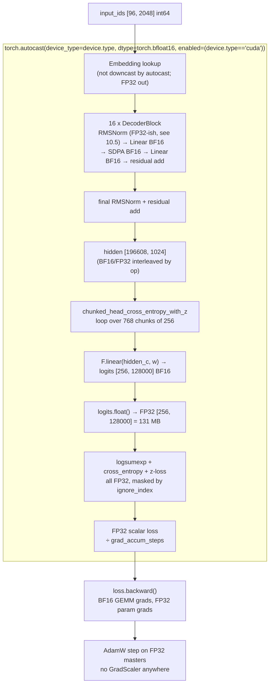

# Mixed Precision in LLaMA-3-Lite — FP32, BF16, FP16, TF32, and Why There Is No GradScaler

> Audience: intermediate. You should know what a floating-point number is and roughly what a matmul is. Everything else — the bit layouts, the four formats, why BF16 training needs no loss scaling, and exactly where each format appears in this codebase — is derived here from first principles.

## Table of Contents

1. [The 60-Second Summary](#1-the-60-second-summary)
2. [Why This Exists](#2-why-this-exists)
3. [Intuition: Digits vs Range](#3-intuition-digits-vs-range)
4. [Formal Treatment: IEEE-754 and the Four Formats](#4-formal-treatment-ieee-754-and-the-four-formats)
5. [Why BF16 Training Needs No GradScaler](#5-why-bf16-training-needs-no-gradscaler)
6. [Precision, Not Just Range: Why the Loss Chain Must Be FP32](#6-precision-not-just-range-why-the-loss-chain-must-be-fp32)
7. [The Standard Recipe: BF16 Compute + FP32 Master Weights](#7-the-standard-recipe-bf16-compute--fp32-master-weights)
8. [Numbers at This Project's Scale](#8-numbers-at-this-projects-scale)
9. [How the Code Realizes It](#9-how-the-code-realizes-it)
10. [Edge Cases & Pitfalls](#10-edge-cases--pitfalls)
11. [Further Reading](#11-further-reading)

---

## 1. The 60-Second Summary

LLaMA-3-Lite trains with **mixed precision**: the model's parameters live in memory as FP32, but every matrix multiply runs on the GPU tensor cores in **BF16** (bfloat16) inside `torch.autocast` blocks, with the final loss computed chunk-by-chunk in **FP32**. BF16 keeps the full 8-bit exponent range of FP32, so gradients that are representable in FP32 are also representable in BF16 — small values do not flush to zero, which is exactly the failure mode that makes FP16 training require a `GradScaler`. Because the code uses BF16, there is no scaler, no inf/nan step-skipping, and no loss-scale bookkeeping: `loss.backward()` just works (`train.py` even says so in a comment). A second knob, TF32, is enabled for FP32 matmuls that escape autocast, and `torch.set_float32_matmul_precision('high')` pins the matmul precision policy. The numerically sensitive part — the softmax/log-sum-exp over the 128,000-token vocabulary — is explicitly upcast to FP32 per 256-row chunk, because doing it in BF16 would corrupt the loss.

---

## 2. Why This Exists

A 515M-parameter transformer trains on a single A100 80GB. Two pressures push away from pure FP32:

1. **Throughput.** A100 dense FP32 compute is 19.5 TFLOPS; BF16 tensor cores are 312 TFLOPS, TF32 is 156 TFLOPS (vendor figures). Training a model whose largest matmul writes a 50 GB tensor every step is dominated by precision-limited throughput, so leaving 16x of compute on the table is not an option.
2. **Memory.** Activations, logits, and optimizer state dwarf the weights. Every byte of dtype saved on a large tensor is bytes of HBM bandwidth saved per step and bytes of peak residency saved. The LM-head GEMM alone produces a `[196608, 128000]` output; in BF16 that is 50.3 GB written per step, in FP32 it is 100.7 GB (derived in §8).

But naively running everything in a 16-bit format breaks training in a specific, well-understood way: **FP16's 5-bit exponent cannot represent small gradients**, and underflow to zero silently kills the update for deep layers late in training. The industry's first answer was loss scaling (`GradScaler`); the cleaner answer, available since Ampere, is **BF16**, which keeps FP32's exponent range and simply does not have the underflow problem. This doc explains the numeric formats, why the underflow argument is the whole story, and how LLaMA-3-Lite wires the pieces together.

---

## 3. Intuition: Digits vs Range

Think of a floating-point number as scientific notation: *mantissa × 2^exponent*. The **exponent bits buy range** — how big or small a number can be. The **mantissa bits buy precision** — how many significant digits a number carries, regardless of its magnitude. Every real number is rounded to the nearest representable one, and the rounding error is always *relative*: a 7-bit mantissa stores about 2.8 significant decimal digits everywhere in its range, a 10-bit mantissa about 3.3 digits, a 23-bit mantissa about 7.2 digits.

Two failure modes follow:

- **Underflow (a range failure):** the true value is smaller than the smallest representable exponent, so it rounds to zero. A gradient of $10^{-8}$ is unrepresentable if the format's smallest normal is $6\times10^{-5}$ — it vanishes, and the weight never moves.
- **Rounding (a precision failure):** the value is representable in range, but the mantissa is too short, so each arithmetic operation perturbs the result by up to $\epsilon$ (machine epsilon) relative error. Errors compound through reductions (sums over 128,000 terms) and through chains of operations.

BF16 fixes the first failure entirely (same exponent field as FP32) and accepts a worse mantissa than FP16 for the second — a trade that is safe *only because* GEMMs accumulate in FP32 internally and the loss is computed in FP32. Range is cheap to fix; precision is fixed by where you accumulate, not by the input format.

---

## 4. Formal Treatment: IEEE-754 and the Four Formats

### 4.1 The bit layout

A normal IEEE-754 binary number is

$$x = (-1)^s \times 1.m \times 2^{e - \text{bias}}$$

where $s$ is the sign bit, $m$ is the mantissa stored without its leading 1 (the "hidden bit"), $e$ is the biased exponent, and the bias is $2^{k-1}-1$ for $k$ exponent bits. The largest exponent is reserved for inf/NaN; the smallest signals subnormals. Two quantities matter:

- **Range limits:** max value $(2 - 2^{-p}) \times 2^{2^{k-1}}$, min normal $2^{1 - 2^{k-1}}$ (for bias $2^{k-1}-1$), where $p$ = mantissa bits.
- **Unit roundoff (machine epsilon):** $\epsilon = 2^{-p}$. Each correctly-rounded operation satisfies $|\text{fl}(a \circ b) - (a \circ b)| \le \epsilon\,|a \circ b|$ (ignoring subnormal and overflow edge cases). It is the *relative* error per operation.

### 4.2 The four formats

| Format | Bits (s/e/m) | Unit roundoff $\epsilon = 2^{-m}$ | Max value | Min normal | Min subnormal | Underflow risk in training |
|---|---|---|---|---|---|---|
| FP32 | 1/8/23 | $2^{-23} \approx 1.19\times10^{-7}$ | $\approx 3.40\times10^{38}$ | $1.18\times10^{-38}$ | $1.40\times10^{-45}$ | None — the reference |
| FP16 | 1/5/10 | $2^{-10} \approx 9.77\times10^{-4}$ | $65504$ | $6.10\times10^{-5}$ | $5.96\times10^{-8}$ | **Severe** — gradients $< 6\times10^{-5}$ lose precision, $< 6\times10^{-8}$ flush to zero |
| BF16 | 1/8/7 | $2^{-7} \approx 7.81\times10^{-3}$ | $\approx 3.39\times10^{38}$ | $1.18\times10^{-38}$ | $1.18\times10^{-38}$ | None — identical exponent range to FP32 |
| TF32 | 1/8/10 | $2^{-10} \approx 9.77\times10^{-4}$ | $\approx 3.39\times10^{38}$ | $1.18\times10^{-38}$ | — | None (matmul-only format) |

Key observations:

- **FP16 and BF16 are both 16 bits** but spend them completely differently. FP16 = 5 exponent + 10 mantissa: precise but narrow. BF16 = 8 exponent + 7 mantissa: FP32's full range, FP16-level precision at best (actually one third of FP16's mantissa).
- **BF16's exponent field is bit-for-bit identical to FP32's.** That is the entire thesis of this doc: anything whose *magnitude* is representable in FP32 — every gradient, every intermediate, every logit — is representable in BF16. Only the digits change.
- **TF32 is not a storage format.** It is a 19-bit (1/8/10) *compute* format: FP32 inputs are rounded to 10 mantissa bits and multiplied on the tensor cores, with the product accumulated in FP32. You never store TF32 tensors; it is a hardware trick to run FP32-shaped matmuls ~3x faster (up to 8x at vendor peak) on Ampere and later.

### 4.3 The worked underflow example

Take a typical late-training gradient for a deep layer: $g = 10^{-6}$. Its FP32 representation is exact to 7 digits. In FP16:

- $10^{-6} < 6.10\times10^{-5}$ (min normal) — the value is *subnormal*, so it has fewer than 10 effective mantissa bits;
- $10^{-6} > 5.96\times10^{-8}$ — it survives as a subnormal, but a slightly smaller gradient $g = 5\times10^{-8}$ is below the subnormal floor and rounds to exactly zero.

The Adam update is $w \leftarrow w - \eta \frac{m}{\sqrt{v}+\hat{\epsilon}}$; with $\eta = 3\times10^{-4}$ (config `learning_rate`) a vanished gradient means that weight gets no update at all. Across millions of parameters, the fraction of zeroed gradients grows as training proceeds (gradients shrink), which is why naive FP16 training stalls. Loss scaling ($\text{loss} \times 2^S$, then unscale gradients before the optimizer step) fixes this by making all gradients larger by $2^S$; it adds bookkeeping, a dynamic scale factor, and inf/NaN overflow checks. **BF16 removes the problem instead of managing it**: $10^{-6}$ and even $10^{-20}$ are far above BF16's min normal $1.18\times10^{-38}$. No scaling, no bookkeeping.

---

## 5. Why BF16 Training Needs No GradScaler

The `GradScaler` exists for exactly one reason: **FP16's 5-bit exponent underflows gradients**. Its contract is: scale the loss up by $2^S$ before `backward()`, so gradients land in FP16's representable band; after the backward pass, unscale the gradients by $2^{-S}$ before the optimizer step; if the scaled loss overflowed to inf/NaN, skip the step and lower $S$. Three moving parts, all compensating for a range defect.

BF16 has FP32's exponent field, so **the scaling factor is unnecessary**: every gradient FP32 can hold, BF16 can hold too. The only remaining precision question is mantissa width, and that is handled not by scaling but by *where accumulation happens*:

1. BF16 tensor-core GEMMs accumulate products in **FP32 internally** — the per-dot-product error stays $\epsilon_{\text{BF16}}$-class, not $\epsilon_{\text{BF16}} \times K$ for the dot-product length $K$ (the hardware keeps a wide accumulator).
2. The **loss is computed in FP32** (the per-chunk `.float()` chain, §6), so the scalar that drives backpropagation is accurate to 7 digits.
3. **Master weights are FP32** (§7), so weight updates are added at FP32 precision even though the forward matmuls consume BF16 copies.

The codebase makes this explicit. In `train.py`, the training step's autocast block is followed by a bare `loss.backward()` with the comment *"BF16 has the FP32 exponent range; no GradScaler needed."* A grep of the repo finds no `GradScaler`, no `scaler.scale(...)`, no `scaler.step(...)` anywhere — the entire class of machinery is absent because the format choice removed its reason to exist.

---

## 6. Precision, Not Just Range: Why the Loss Chain Must Be FP32

Range is not the only hazard; reductions amplify rounding. The loss must compute

$$\log Z = \log\sum_{i=1}^{V} e^{z_i}, \qquad V = 128{,}000$$

twice per chunk (once for the CE normalization inside `F.cross_entropy`, once for the z-loss term), then form CE $= -\log p_{t} = \log Z - z_{t}$.

**The BF16 arithmetic:** each addend $e^{z_i}$ is stored with relative error up to $\epsilon_{\text{BF16}} = 7.8\times10^{-3}$. Summing $V = 128{,}000$ positive terms, the accumulated relative error of the sum is bounded (pessimistically) by $V \cdot \epsilon \approx 1000$, or around $\sqrt{V}\,\epsilon \approx 358 \times 7.8\times10^{-3} \approx 2.8$ under a random-walk model. That is an *absolute* error of up to ~2.8 nats in $\log Z$ — compared to a training loss of order 3–7 nats, this is not noise on top of the signal, it is the same size as the signal. The z-loss term $\overline{(\log Z)^2}$ would be garbage.

**The FP32 arithmetic:** the same bound gives $128{,}000 \times 1.19\times10^{-7} \approx 0.015$ (worst case) or $\sim 4\times10^{-5}$ (random walk) — harmless next to a loss of ~5.

So the upcast is load-bearing, not cosmetic: **`logsumexp` over a 128k-wide axis is the single most reduction-heavy computation in the model, and it must run in FP32.** The implementation enforces this per chunk rather than trusting autocast policy: in `model.py:chunked_head_cross_entropy_with_z` the per-chunk helper does `cl = logits.float()` *before* `torch.logsumexp(cl, dim=-1)` and `F.cross_entropy(cl, ...)`, with the comment *"Upcast to FP32 once so logsumexp + CE share a single precision promotion"`. `model.py:chunked_cross_entropy_with_z` (the variant that receives already-materialized logits) does the identical `cl = logits[start:end].float()`. Accumulators across chunks are FP32 tensors (`total_ce`, `z_accum`) and the final `ce_loss` is a FP32 scalar, so the loss that reaches `backward()` is FP32 end to end — only the logits *production* (`F.linear`) runs in BF16 under autocast.

---

## 7. The Standard Recipe: BF16 Compute + FP32 Master Weights

Why not store the weights in BF16 and save 1.03 GB? Because a weight stored in BF16 can only absorb updates at BF16 precision: each update $-\eta\frac{m}{\sqrt v + \hat\epsilon}$ is typically $10^{-3}$–$10^{-5}$ relative to the weight, and the BF16 rounding error per write is $\epsilon_{\text{BF16}} \approx 0.8\%$ of the weight. Over tens of thousands of steps these rounding errors accumulate in the direction of drift ($\sim\sqrt{\text{steps}}\,\epsilon \cdot |w|$), and the model quietly loses the low-order bits of its trained parameters. The fix that everyone converged on:

1. **FP32 master weights** — the parameters in memory, what the optimizer updates.
2. **Per-op BF16 compute** — autocast casts a FP32 weight to BF16 only for the duration of the matmul (a transient, not a storage change).
3. **FP32 accumulation** — GEMM internal accumulators and the entire loss chain run FP32.
4. **FP32 optimizer state** — AdamW's first and second moments, $m$ and $v$, span tiny magnitudes (config `eps = 1e-8`, and $v$ for rarely-updated weights is far below FP16's floor) and must be FP32; see [optimization.md](optimization.md).

This is exactly what LLaMA-3-Lite does, and it is *not* the variant where weights are stored BF16: `model.py:build_transformer` constructs every `nn.Linear` and `nn.Embedding` in the default FP32 dtype, `train.py:train_model` moves the model with a plain `.to(device)` (no dtype change), and a grep of `train.py`/`model.py` finds no `.bfloat16()` or `.half()` cast on any parameter. BF16 exists only inside the autocast context, as per-op temporaries. Consequences:

- The in-memory weight cost is the FP32 one: 2.06 GB, not 1.03 GB (math in §8).
- The `state_dict` and checkpoints are FP32; the EMA shadow in `train.py` (built via `AveragedModel`) holds FP32 copies too — see [optimization.md](optimization.md).
- "BF16 training" here means *BF16 compute*, which is what the throughput argument cares about; the memory argument (storage-level BF16) is a further optimization this repo deliberately does not take, trading 1.03 GB for update precision.

---

## 8. Numbers at This Project's Scale

All figures below are derived from the config (`config.py:get_config`: batch 96, seq 2048, d_model 1024, vocab 128,000, 513.8M params) or from vendor-published A100 80GB specs; none are measured in this repo. `[derived]` = arithmetic from config, `[vendor]` = published hardware spec.

**Weight memory.** $513.8 \times 10^{6}$ parameters:

- FP32 (what this repo keeps in memory): $513.8\text{M} \times 4\text{ B} = 2.06\text{ GB}$ `[derived]`
- BF16 (storage-level variant): $513.8\text{M} \times 2\text{ B} = 1.03\text{ GB}$ `[derived]`
- AdamW moments (FP32, 2 per param): $2 \times 513.8\text{M} \times 4\text{ B} = 4.11\text{ GB}$ `[derived]`
- Gradients (FP32, match param dtype): $2.06\text{ GB}$ `[derived]`
- Total model state here: $2.06 + 2.06 + 4.11 = 8.22\text{ GB}$; in the BF16-storage variant: $1.03 + 1.03 + 4.11 = 6.17\text{ GB}$. Full accounting lives in [memory-engineering.md](memory-engineering.md). `[derived]`

**The LM head, the reason everything is chunked and BF16.** With $N = 96 \times 2048 = 196{,}608$ rows:

- FLOPs per step: $2 \cdot N \cdot V \cdot d = 2 \times 196{,}608 \times 128{,}000 \times 1024 \approx 51.5\text{ TFLOPs}$ `[derived]`
- Ideal time at BF16 312 TFLOPS: $\approx 0.17\text{ ms}$; at FP32 19.5 TFLOPS: $\approx 2.6\text{ ms}$ `[derived, vendor]`
- Output write traffic: $196{,}608 \times 128{,}000 \times 2\text{ B} = 50.3\text{ GB}$ in BF16 vs $100.7\text{ GB}$ in FP32 — at 2 TB/s HBM that is ~25 ms vs ~50 ms of pure bandwidth per step, making the head *bandwidth-bound, not compute-bound*. `[derived, vendor]`
- Per-chunk FP32 slice in the loss: $256 \times 128{,}000 \times 4\text{ B} = 131\text{ MB}$ alive at once (one chunk at a time, thanks to `checkpoint`), vs 100.7 GB for the full FP32 logits tensor. `[derived]`

**Per-step scale.** 196,608 tokens/step; 42,000 steps → 8.26B tokens; the chunked loss loops over $196{,}608 / 256 = 768$ chunks per step.

---

## 9. How the Code Realizes It

### 9.1 The global switches: `train.py:setup_gpu_optimizations`

Called from `train.py:train_model` and only when `device.type == 'cuda'` (on CPU every precision toggle is skipped, which is why the CPU test suite runs pure FP32 — see §10). Its effect:

```python
# illustrative — condensed from train.py:setup_gpu_optimizations
if config.get('tf32', True):
    torch.backends.cuda.matmul.allow_tf32 = True   # FP32 matmuls -> TF32 tensor cores
    torch.backends.cudnn.allow_tf32 = True         # FP32 convs -> TF32 (no convs in this model)
torch.set_float32_matmul_precision('high')         # matmul FP32 policy: 'high' == TF32
torch.backends.cudnn.benchmark = config.get('cudnn_benchmark', True)
torch.backends.cudnn.deterministic = False
if 'cuda_alloc_conf' in config:
    os.environ['PYTORCH_CUDA_ALLOC_CONF'] = config['cuda_alloc_conf']  # expandable_segments:True
```

- **`allow_tf32 = True` (both matmul and cudnn):** FP32 matmuls round inputs to TF32's 10-bit mantissa and run on the tensor cores at ~3x FP32 throughput on Ampere `[vendor]`. In this training loop most heavy matmuls are already BF16 via autocast (§9.2), so TF32 is the safety net for FP32 matmuls that escape autocast — see the pitfall in §10 about what actually controls this knob.
- **`torch.set_float32_matmul_precision('high')`:** the modern spelling of the same policy. PyTorch's float32 matmul precision modes are `'highest'` (strict FP32), `'high'` (TF32 on Ampere+), and `'medium'` (BF16 matmuls). Setting `'high'` enables TF32 for `matmul` — on recent PyTorch this is the `torch.backends.cuda.matmul` precision policy, and it also informs `torch.compile` which FP32 matmul kernels are fair game. It is set *unconditionally*, not gated on `config['tf32']` (see §10 for the interaction).
- **`cudnn_benchmark` / `cudnn.deterministic`:** algorithm autotuning; this model has no convolutions, so these are inert here and exist for the wider codebase pattern. `deterministic = False` is the explicit opposite of reproducibility; see [reproducibility.md](reproducibility.md).
- **`PYTORCH_CUDA_ALLOC_CONF=expandable_segments:True`:** set in `config.py:get_config` (`'cuda_alloc_conf': 'expandable_segments:True'`). Tells the CUDA caching allocator to use expandable segments (no giant upfront virtual-address reservation; segments grow/shrink on demand), which matters because the chunked-loss design allocates and frees a 131 MB logits slice 768 times per step. The environment variable must be set before the first CUDA allocation; `setup_gpu_optimizations` runs at the top of `train_model`, before the model is built. Full treatment in [memory-engineering.md](memory-engineering.md).

### 9.2 The autocast scoping rules, in code

Four sites wrap compute in the same context manager:

```python
# illustrative — the real callsite in train.py:train_model elides the
# chunked_head_cross_entropy_with_z arguments, which fill 6 lines.
with torch.autocast(device_type=device.type, dtype=torch.bfloat16,
                    enabled=(device.type == 'cuda')):
    hidden = model(input_ids, return_hidden=True)
    loss = chunked_head_cross_entropy_with_z(...)
    loss = loss / grad_accum_steps
```

at the train step and the pre-loop warmup in `train.py:train_model`; a hardcoded-`'cuda'` variant in `train.py:validate` and `train.py:generate_samples`.

PyTorch autocast is **op-level, not module-level**: inside the context, every operation is classified, and only eligible ones are downcast:

| Op class | Examples in this model | Behavior under autocast(bf16) |
|---|---|---|
| **Downcast-eligible** | `nn.Linear`/`F.linear` (all projections, the LM head), `matmul`, `addmm`, `bmm`, `F.scaled_dot_product_attention` | FP32 inputs cast to **BF16**; GEMM runs on tensor cores, accumulates FP32 |
| **Force-FP32** | `F.cross_entropy`, `F.nll_loss`, native `layer_norm`/`rms_norm` | Always FP32 regardless of input dtype |
| **Promote-to-widest** | `pow`, `mean`, `sqrt`, `rsqrt`, `exp`, `log`, `sum` | FP32 if any input is FP32, else input dtype |
| **Everything else** | `mul`, `add` (residual stream), `silu`, `nn.Embedding` lookup, RoPE's `cos`/`sin` multiplies | Runs in input dtype with standard type promotion; parameters never modified in place |

Three consequences visible in this codebase:

1. **The residual stream interleaves dtypes.** A `Linear` outputs BF16; the residual `add` promotes to the wider operand; the custom `RMSNorm` (see §10) multiplies by an FP32 scale weight, promoting its output back to FP32. The code never relies on any of this — the only place precision is load-bearing, the loss, pins FP32 explicitly.
2. **Loss and norms stay FP32 by policy.** `F.cross_entropy` is on the force-FP32 list, so even without the explicit `.float()` the CE part would be FP32; the explicit upcast makes the *entire* chain (including `logsumexp` and the z-loss term, which are not force-FP32) FP32 deterministically.
3. **Backward passes are scoped too.** Autocast records the dtype of each forward op and applies the same policy in the backward pass; gradients flow through BF16 GEMMs (BF16 backward matmuls) but accumulate into FP32 parameters, and the FP32 loss keeps the gradient *signal* at FP32 precision at every non-GEMM step.

The `enabled=(device.type == 'cuda')` guard is deliberate: on CPU the context is a no-op and everything runs FP32 — which is precisely what the test suite relies on (`tests/conftest.py:dtype`: *"FP32 on CPU for exactness; bf16 only on GPU"*). BF16 autocast is a CUDA hardware feature; the guard makes the same code path exact-and-deterministic on CPU and fast on GPU.

### 9.3 The FP32 loss chain: `model.py:chunked_head_cross_entropy_with_z`

Per chunk of 256 rows, inside a `checkpoint`:

```python
# illustrative — condensed from model.py:chunked_head_cross_entropy_with_z
def _chunk(hidden_c, w, targets_c):
    logits = F.linear(hidden_c, w)          # BF16 under autocast: [256, 128000]
    cl = logits.float()                     # <- the FP32 upcast, per chunk
    log_z = torch.logsumexp(cl, dim=-1)     # FP32 reduction over 128k
    ce = F.cross_entropy(cl, targets_c, ignore_index=ignore_index, reduction='none')
    mask = targets_c != ignore_index
    return ce[mask].sum(), mask.sum().float(), log_z[mask].pow(2).sum()
```

Then, across the loop over `range(0, hidden.shape[0], chunk_size)` (768 iterations at batch 96), the FP32 scalars `total_ce`, `total_count`, `z_accum` accumulate and the final loss is `ce_loss + z_loss_weight * z_loss` — `ce_loss` and `z_loss` are both FP32. This is the *whole* precision story in one function: BF16 for the throughput-critical GEMM, FP32 for every reduction that feeds the gradient. The same pattern appears in `model.py:chunked_cross_entropy_with_z` for the pre-materialized-logits variant. The chunking and the per-chunk `checkpoint` are memory engineering (see [gradient-checkpointing.md](gradient-checkpointing.md) and [loss-functions.md](loss-functions.md)); the `.float()` is numerics.

### 9.4 The flow, end to end



---

## 10. Edge Cases & Pitfalls

1. **Never "helpfully" remove the `.float()` in the loss.** §6's arithmetic is the whole argument: `logsumexp` over 128,000 terms in BF16 carries a worst-case absolute error of order $10^2$–$10^3$ (and ~2.8 even under the optimistic random-walk model) against a loss of ~5 nats. The upcast in `model.py:chunked_head_cross_entropy_with_z` and `model.py:chunked_cross_entropy_with_z` is the difference between a training signal and noise. A reviewer who "optimizes" it to BF16 silently breaks training while keeping every test green on CPU (where the guard in §9.2 disables autocast and the FP32 path always ran anyway — the bug would only appear on GPU).

2. **Switching the autocast dtype to `fp16` would resurrect the entire GradScaler requirement.** The comment in `train.py` ("BF16 has the FP32 exponent range; no GradScaler needed") and the whole §5 argument depend on the 8-bit exponent. FP16 would underflow gradients, and this codebase has no scaler machinery — the step would silently train poorly. The design is BF16-or-nothing.

3. **`config['tf32'] = False` does not disable matmul TF32.** In `train.py:setup_gpu_optimizations` the `allow_tf32` flags are gated on `config.get('tf32', True)`, but `torch.set_float32_matmul_precision('high')` is called *unconditionally* immediately after — and `'high'` is the matmul TF32 policy. Flipping the config key therefore only reliably disables cudnn-conv TF32 (there are no convs in this model); matmul TF32 stays on via `'high'`. If you want strict IEEE FP32 matmuls, you must set `set_float32_matmul_precision('highest')` (and be prepared to pay the ~8x throughput difference).

4. **TF32 and BF16 are not competitors here — they are different layers.** Under BF16 autocast, eligible GEMMs are BF16 and TF32 never applies to them; TF32 only touches FP32 matmuls outside autocast (and is what `'high'` means for `torch.compile`). Do not expect `allow_tf32` to speed up the autocast'd forward — that is BF16's job. The `'high'` setting matters most for FP32 fallback paths and for non-autocast'd code (e.g. any future inference path that skips the context manager).

5. **The custom RMSNorm is not on autocast's force-FP32 list.** `model.py:RMSNorm.forward` is hand-rolled elementwise math (`x * torch.rsqrt(x.pow(2).mean(-1) + eps) * weight`), not `torch.nn.functional.rms_norm`, so its dtype follows the promote-to-widest rules: `pow`/`mean`/`rsqrt` stay in the activation's dtype, and only the final multiply by the FP32 `weight` promotes to FP32. If the incoming stream is BF16 (e.g. straight out of a Linear), the mean-of-squares is computed in BF16 — a relative error of $\sim\sqrt{1024}\,\epsilon_{\text{BF16}} \approx 0.25$ worst case in the variance estimate. That is *acceptable* (RMSNorm is a scaling, not a 128k-wide reduction, and the error is a mild gain jitter absorbed by training), but it is exactly why the loss path cannot follow the same pattern and why the code pins FP32 there. See [normalization.md](normalization.md).

6. **`generate_samples` hardcodes `device_type='cuda'`.** The other three autocast sites use `device.type`; `train.py:generate_samples` writes `device_type='cuda'` with `enabled=device.type == 'cuda'`. On CPU this is harmless — `enabled=False` makes the context a no-op regardless of `device_type` — but it is an asymmetry; if generation ever runs on a non-CUDA accelerator that supports autocast, this site would need `device.type` too.

7. **`PYTORCH_CUDA_ALLOC_CONF` is read once, at first allocation.** The `os.environ` assignment in `train.py:setup_gpu_optimizations` works only because it runs before `train_model` builds the model and touches CUDA memory. Setting it later (e.g. after the first forward) is silently ignored. `expandable_segments:True` is also the reason the per-chunk 131 MB allocations don't fragment the heap over 768 iterations per step.

8. **Autocast never changes what a checkpoint contains.** Parameters stay FP32; `state_dict`, EMA shadow, and optimizer state are all FP32. Loading a checkpoint "in BF16" would require an explicit cast that this repo does not perform. The wandb config tag `"precision": "bf16"` in `train.py:train_model` means *compute* precision, not storage.

9. **No GradScaler also means no overflow safety net.** BF16 eliminates underflow, not divergence: if the loss runs away (NaN/Inf), `loss.backward()` propagates it and the step proceeds — there is no scaler to skip the step. That is the standard BF16 trade: you trade FP16's overflow bookkeeping for the assumption that your loss is well-behaved. Z-loss (config `use_z_loss`, `z_loss_weight=1e-4`) exists partly to keep the loss bounded late in training — see [loss-functions.md](loss-functions.md).

---

## 11. Further Reading

- [loss-functions.md](loss-functions.md) — the chunked CE + z-loss chain this doc's §6 and §9.3 depend on; the proof that chunking is exact.
- [optimization.md](optimization.md) — AdamW with FP32 moments, EMA shadow weights, why decay targets 2D+ params.
- [memory-engineering.md](memory-engineering.md) — the full 92→20 GB derivation, including the weight/optimizer math begun in §8.
- [gradient-checkpointing.md](gradient-checkpointing.md) — the `checkpoint(..., use_reentrant=False)` per loss chunk, and why only one 131 MB logits slice is alive at a time.
- [normalization.md](normalization.md) — RMSNorm math and the dtype-promotion subtlety of §10.5.
- [transformers-from-scratch.md](transformers-from-scratch.md) — the forward data flow and shape trace at this scale.
- [attention.md](attention.md) — SDPA under BF16 autocast and the fused softmax.
- Reference: [training.md](../reference/training.md) (loop walkthrough), [memory-stack.md](../reference/memory-stack.md), [config.md](../reference/config.md) (every precision-related key), [docs/README.md](../README.md) (index and learning paths).
