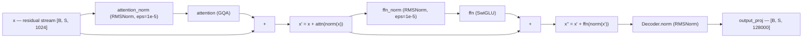
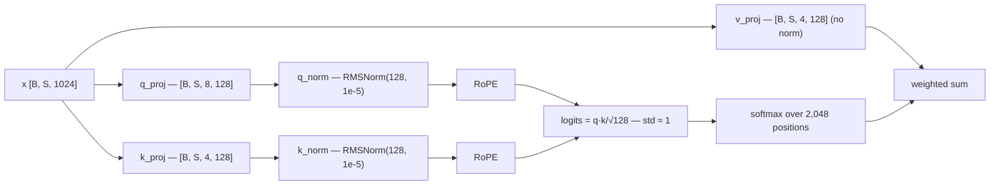

# Normalization in LLaMA-3-Lite — LayerNorm to RMSNorm to QK-Norm

> **Audience:** intermediate. You know what a transformer block looks like and have
> skimmed `model.py` once; you want the *why* behind the three normalization
> mechanisms in this codebase: the two per-block RMSNorm layers, the final decoder
> norm, and the per-head QK-norm inside attention.

## Table of Contents

1. The 60-Second Summary
2. Why Normalization Exists
3. Intuition: Controlling Scale and Gradient Health
4. Formal Treatment I — LayerNorm
5. Formal Treatment II — RMSNorm (Dropping the Mean)
6. Numbers at This Project's Scale
7. Pre-Norm Residual Placement
8. QK-Norm: Per-Head Normalization Before RoPE
9. How the Code Realizes It
10. Edge Cases and Pitfalls
11. Further Reading

---

## 1. The 60-Second Summary

Deep networks amplify or shrink signals as they pass through layers, and
unchecked, the magnitude of the residual stream and its gradients drifts in ways
that make training unstable or impossible. Normalization layers re-anchor the
scale of a tensor at every block so that the optimizer always works on
well-conditioned, roughly unit-scale inputs. LLaMA-3-Lite uses **RMSNorm**
(`model.py:RMSNorm`), a cheaper cousin of LayerNorm that drops the mean
subtraction and keeps only the root-mean-square rescaling plus a learnable gain:
`y = x · rsqrt(mean(x²) + eps) · γ`. Every decoder block applies it twice in
**pre-norm** position (`x = x + attention(attention_norm(x))` in
`model.py:DecoderBlock.forward`), and a final RMSNorm sits after the last block
before the LM head (`model.py:Decoder.forward`). Inside attention, a second,
finer-grained normalization — **QK-norm** — applies a per-head RMSNorm of
`head_dim = 128` to the query and key vectors *before* RoPE
(`model.py:GroupedQueryAttention`), which bounds the scale of the pre-softmax
attention logits so they stay O(1) late in training instead of growing with the
activations. All of this is cheap: the norm layers account for roughly 34K of
the 251.7M non-embedding parameters.

---

## 2. Why Normalization Exists

### 2.1 The problem: scale drift

Consider a stack of linear layers. After `L` layers, a perturbation to the input
is multiplied by `L` matrices; if the spectral norm of the typical layer is
`ρ > 1`, magnitudes grow like `ρ^L`, and if `ρ < 1` they decay like `ρ^L`. A
16-layer stack is not extreme, but transformers are not a plain linear stack
either: each block contains a softmax (which is scale-sensitive), a gated
nonlinearity, and residual adds that let the stream grow monotonically. The
result is that nothing intrinsic fixes the *scale* of the activations, and two
things that should stay fixed — the statistics seen by each sublayer and the
magnitude of gradients — drift with training.

The second-order problem compounds it: if activations inflate by a factor `g`,
backpropagated gradients typically scale with `g` as well (each linear layer
multiplies the gradient by its weight matrix), so the optimizer has to cope with
signals whose magnitude changes by orders of magnitude over the course of
training. Adam's per-parameter normalisation (`optimization.md`) absorbs a lot
of this, but the *shape* of the loss landscape still depends on activation
scale, and large activations push softmaxes into saturated regimes where
gradients vanish.

### 2.2 What normalization layers provide

A normalization layer inserted at a fixed point in the graph gives three
guarantees:

1. **A fixed input scale for the next sublayer.** Whatever the residual stream
   has accumulated, the sublayer always sees a tensor whose per-token RMS is
   pinned to a known value (1 here). The sublayer's weights can therefore be
   initialised, regularised, and trained as if the input distribution were
   stationary.
2. **Bounded Jacobian magnitude.** The derivative of a norm layer w.r.t. its
   input is (up to a learnable gain) an orthogonal projection divided by the
   RMS — an operator with singular values ≈ 1/r. This prevents the layer from
   amplifying or damping the gradient signal it passes.
3. **A learnable scale-and-shift knob.** The per-feature gain `γ` (and bias `β`
   in LayerNorm) lets the optimizer decide what variance and offset each
   sublayer actually wants, independently of the upstream stream magnitude.
   Without normalization, this knob would have to be learned implicitly by
   scaling entire weight matrices, which is slower and couples layers.

Historically this is the "internal covariate shift" argument from the
BatchNorm paper (Ioffe & Szegedy, 2015): the distribution of a layer's inputs
changes as upstream weights move, and the optimizer keeps chasing a moving
target. BatchNorm attacked it by normalising over the *batch* dimension;
LayerNorm (Ba, Kiros & Hinton, 2016) moved the statistics to the *feature*
dimension, which is what makes it usable for variable-length sequences and
batch size 1. RMSNorm (Zhang & Sennrich, 2019) then observed that for
transformers the mean term is largely redundant and dropped it, cutting cost.

---

## 3. Intuition: Controlling Scale and Gradient Health

### 3.1 The gauge analogy

Think of the residual stream as a pipeline whose pressure you do not control
directly: embeddings inject a small, fixed amount; each attention and FFN block
adds more; nothing removes any. Normalization layers are **pressure
regulators** placed on the branch pipes: no matter how high the main line's
pressure is, the branch that feeds a sublayer is always bled down to the same
working pressure (unit RMS). The sublayer then computes in a predictable
regime, and the regulator itself absorbs the pressure difference — that is
precisely what `x = x + attention(norm(x))` expresses: the *add* carries the
unregulated stream, the *norm* regulates only the branch.

### 3.2 A worked micro-example (RMSNorm by hand)

Take a single token with `d = 4` features, `x = [1, −2, 3, −4]`, and `γ = 1`:

$$
\text{mean}(x^2) = \frac{1^2 + (-2)^2 + 3^2 + (-4)^2}{4} = \frac{30}{4} = 7.5,
\qquad
r = \sqrt{7.5 + 10^{-5}} \approx 2.7386,
\qquad
y = \frac{x}{r} \approx [0.365, \; -0.730, \; 1.096, \; -1.461].
$$

Now feed the norm `3x = [3, −6, 9, −12]`:

$$
\text{mean}((3x)^2) = 9 \cdot 7.5 = 67.5, \qquad r = \sqrt{67.5 + 10^{-5}} \approx 8.2158,
\qquad
\frac{3x}{r} \approx [0.365, \; -0.730, \; 1.096, \; -1.461].
$$

Same output. The norm is **scale-invariant**: it divides out the input's
magnitude and keeps only its *direction* (shape). That single property is the
source of almost everything good and everything tricky about RMSNorm — see
§5.4 and §10.

### 3.3 Gradient health

Why does fixing the forward scale fix the backward pass? Let `r = RMS(x)` be
the scalar denominator of a norm with `γ = 1`. The output is `y = x/r`, and a
short derivation (§5.5) shows the input gradient is

$$
\frac{\partial L}{\partial x} = \frac{1}{r}\left(\frac{\partial L}{\partial y} - \frac{x}{d\,r^2}\left\langle x,\; \frac{\partial L}{\partial y}\right\rangle\right),
$$

i.e. the incoming gradient, scaled by `1/r`, with its component along `x`
removed. Two consequences:

- **No amplification:** the Jacobian has singular values ≈ `1/r`, so a norm
  layer never multiplies a gradient by a large factor. A stack of 16 blocks can
  no longer compound gradient growth through the normed branches.
- **No runaway in the radial direction:** gradient components parallel to the
  activation vector `x` (the ones that would make `x`'s norm grow) are
  explicitly projected away. The only way to change the stream's magnitude is
  through the learnable gain `γ` (and, in LayerNorm, `β`), whose gradients are
  O(1). The optimizer gets a clean, well-scaled channel for adjusting scale.

---

## 4. Formal Treatment I — LayerNorm

LayerNorm normalises each vector `x ∈ ℝ^d` (for a transformer: one token's
`d_model`-dimensional hidden state) using its own mean and variance, then
applies a learned per-feature affine transform:

$$
\mu = \frac{1}{d}\sum_{j=1}^{d} x_j, \qquad
\sigma^2 = \frac{1}{d}\sum_{j=1}^{d} (x_j - \mu)^2,
$$

$$
y_i = \frac{x_i - \mu}{\sqrt{\sigma^2 + \epsilon}}\,\gamma_i + \beta_i, \qquad
i = 1, \dots, d.
$$

Here `γ, β ∈ ℝ^d` are learnable parameters (the "gain" and "bias"), and `ε > 0`
is a tiny constant that prevents division by zero and clips the denominator's
dynamic range for low-precision arithmetic. In a transformer the statistics are
computed **per token, over the hidden dimension only** — never over the batch or
sequence axes — so the transform is identical for every position and every
sequence, which is what makes it work at inference time with sequences of any
length and any batch size, without running statistics.

Properties that matter here:

- **Invariance to translation and scaling.** Adding any constant `c` to `x`
  cancels in `x − μ`; multiplying `x` by any `α > 0` cancels in `(x−μ)/σ`.
  The layer is insensitive to both the offset and the magnitude of its input,
  and only the *shape* of the vector survives.
- **Cost:** computing `μ` and `σ²` requires two reduction passes over `d`
  features, plus a third elementwise pass for the final transform (subtract,
  scale, scale by `γ`, add `β`). In PyTorch's eager mode that is roughly 4–5
  kernel launches per layer invocation.
- **Parameter cost:** `2d` per norm (`γ` and `β`), which at `d = 1024` is
  2,048 parameters per instance.

LayerNorm is the right *concept* — per-token, feature-wise, learnable — and it
is what the original transformer used (with post-norm placement, §7). Its
weaknesses for a modern LLM are only about efficiency and redundancy, which is
exactly what RMSNorm addresses next.

---

## 5. Formal Treatment II — RMSNorm (Dropping the Mean)

### 5.1 The observation

Zhang & Sennrich (2019) made two empirical points. First, the *mean*
subtraction in LayerNorm contributes little for transformers: the residual
stream is approximately zero-mean already (zero-mean weight initialisation,
zero-mean embeddings, unbiased projections — see §10 for the caveats), and
training quality is roughly unchanged when the centering is removed. Second,
what actually matters for stability is the **root-mean-square scale** of the
vector — the thing that determines the magnitude of the dot products feeding
softmaxes and the variance of layer outputs.

### 5.2 The math, matched to the code exactly

`model.py:RMSNorm.forward` computes, verbatim:

```python
x * torch.rsqrt(x.pow(2).mean(dim=-1, keepdim=True) + self.eps) * self.weight
```

For a token row `x ∈ ℝ^d` with learnable gain `γ = self.weight ∈ ℝ^d` and
`self.eps = ε`, this is, coordinate-wise:

$$
y_i = x_i \cdot \frac{1}{\sqrt{\frac{1}{d}\sum_{j=1}^{d} x_j^2 + \epsilon}} \cdot \gamma_i,
\qquad
\text{i.e.} \qquad
y = \frac{x}{\operatorname{RMS}(x)}\,\gamma, \qquad
\operatorname{RMS}(x) = \sqrt{\frac{1}{d}\sum_{j} x_j^2 + \epsilon}.
$$

Three implementation details worth naming, because they are easy to get wrong
when reimplementing from memory:

1. **The bias `β` is gone.** Only the gain `γ` survives, so a norm costs `d`
   parameters, not `2d`.
2. **`ε` lives inside the square root**, as `sqrt(mean(x²) + ε)`, *not* outside
   it (`sqrt(mean(x²)) + ε`) and *not* inside the mean (`mean(x² + ε)`). The
   code's placement matches the original paper and the reference in
   `kernels/rmsnorm_triton.py:rmsnorm_pytorch`; numerically the three variants
   differ only at the `ε` scale (≈ 1e-5), so this is a convention, but the
   convention is load-bearing for bit-exact test comparisons such as
   `tests/test_model.py::TestRMSNorm.test_matches_reference`, which asserts
   equality against `x * torch.rsqrt(x.pow(2).mean(-1, keepdim=True) + 1e-5)`
   in float64.
3. **`mean` is over the last axis only, with `keepdim=True`**, so the RMS is a
   per-token scalar broadcast against `[B, S, d]`; no cross-token mixing.

### 5.3 The `eps` term and `rms_norm_eps: 1e-5`

The `ε` guard exists because the division is by `sqrt(mean(x²) + ε)`. If every
feature of a token is exactly zero, the denominator would be 0 without `ε`
and the output NaN. With `ε = 1e-5`, `rsqrt(ε) = 316.23` — large but finite —
and since the numerator `x` is zero, the output is exactly zero; the layer
passes a finite (zero) value and gradients still flow. The constant is wired
through the whole model: `config.py:get_config` sets `'rms_norm_eps': 1e-5`,
`model.py:build_transformer` defaults `rms_norm_eps: float = 1e-5`, the block
norms hard-code `eps=1e-5` in `model.py:DecoderBlock.__init__`, and the final
norm inherits the config value via `model.py:Decoder.__init__`
(`eps: float = 1e-5`). A single consistent `ε` matters for two reasons: the
QK-norms and the block norms share the value, and changing it silently shifts
every normalised distribution by a relative `ε/mean(x²)`.

Why `1e-5` and not something bigger? `ε` must be small compared with the
typical `mean(x²)` (order 1 after normalisation, order 1e-4 for raw
embedding outputs at the init scale of §6) so it does not measurably shrink
the normalised variance, yet large enough to keep the reciprocal square root
representable in BF16/FP32 for zero or near-zero rows. `1e-5` is the
canonical RMSNorm/LayerNorm choice and is what `torch.nn.RMSNorm` uses by
default.

### 5.4 Why RMSNorm works for transformers

Three reasons, in increasing order of importance:

1. **It is scale-invariant by construction.** As the worked example in §3.2
   shows, `RMSNorm(αx) = RMSNorm(x)` for any `α > 0`. Whatever the residual
   stream's magnitude — 0.02 at init (§6), larger later — the attention and
   FFN branches always see unit-RMS inputs. This is the same property that made
   LayerNorm work; dropping the mean only removes the *translation*-invariance
   half, which transformers barely use.
2. **The mean is nearly redundant in this architecture.** The embedding and
   every linear projection are initialised zero-mean (`model.py:Transformer._init_weights`
   draws from `normal_(0, 0.02)`), and the residual stream is a sum of
   zero-mean-ish contributions, so per-token means hover near zero. The
   statistic that actually controls downstream dot products is the RMS.
3. **It is measurably cheaper.** Removing `μ` removes an entire reduction pass
   over the hidden dimension and the `β` parameter. For the eager path that
   turns the ~4-launch LayerNorm chain into a 3-launch chain (`pow`+`mean` →
   `add`+`rsqrt` → multiply), and the fused Triton path
   (`kernels/rmsnorm_triton.py:triton_rmsnorm`) collapses even that into a
   single row-wise kernel. At this project's scale the FLOP saving is small
   (§6), but the kernel-launch and memory-traffic saving is real on a GPU that
   runs 16 blocks × 2 norms × (forward + backward) every step.

### 5.5 Gradient of RMSNorm

Let `r = sqrt(s + ε)` with `s = (1/d) Σ_j x_j²`. Then `y = x·γ/r` and

$$
\frac{\partial y_i}{\partial x_j} = \frac{\gamma_i}{r}\left(\delta_{ij} - \frac{x_i x_j}{d\,r^2}\right).
$$

In matrix form the Jacobian (with `γ = 1`) is `(I − xxᵀ/(d r²))/r`: a scaled
**orthogonal projection** onto the hyperplane perpendicular to `x`. The input
gradient is therefore the incoming gradient, scaled by `1/r`, minus its
projection onto `x` (§3.3). Two practical readings:

- The norm is a conditioner: it neither inflates nor collapses gradient
  magnitudes, and it actively blocks the direction of growth — the one
  direction that would otherwise compound through a deep stack.
- The `γ` gradient is `∂L/∂γ = (x/r) ⊙ ∂L/∂y`, i.e. the *normalised* direction
  scaled by the incoming gradient — O(1) by construction, so the learnable gain
  trains at a healthy rate even when raw activations are tiny or huge.

The same derivation for LayerNorm additionally subtracts the mean direction;
RMSNorm simply omits that term.

---

## 6. Numbers at This Project's Scale

All numbers below are derived from `config.py:get_config`
(`d_model = 1024`, `n_layers = 16`, `n_heads = 8`, `n_kv_heads = 4`,
`head_dim = 128`, `seq_len = 2048`, `batch_size = 96`, `vocab_size = 128000`)
and from `model.py`; none are measured.

**Tensors the norms touch.** A block input is `[96, 2048, 1024]` =
196,608 × 1024 = 201,326,592 elements ≈ 201.3M. That is ≈ 805 MB in FP32 or
≈ 402.7 MB in BF16 per live norm input — which is exactly why
`model.py:Transformer.forward` runs each block under
`torch.utils.checkpoint.checkpoint` when `gradient_checkpointing=True`: the
norm's input is the block's activation, and re-computing it on the backward
pass is cheaper than holding 16 such tensors. The mean/`x²` reductions reduce
201.3M elements to `[96, 2048, 1]` = 196,608 scalars.

**Parameter cost of the norms.** RMSNorm keeps only `γ`:

- per block: `attention_norm` (1024) + `ffn_norm` (1024) = 2,048;
- 16 blocks + final `Decoder.norm`: (16·2 + 1) · 1024 = **33,792** parameters;
- the LayerNorm equivalent would carry `γ + β = 2048` per norm, i.e. 67,584 —
  RMSNorm halves the count (saving 33,792);
- QK-norm adds `q_norm` (128) + `k_norm` (128) = 256 per layer → 16 × 256 =
  **4,096** parameters, exactly the `2 * head_dim * n_layers` arithmetic the
  test `tests/test_model.py::TestQKNorm.test_param_count_increases_when_enabled`
  asserts by diffing a `qknorm=True` model against a `qknorm=False` model.

As a fraction of the 251.7M non-embedding parameters, all normalisation
weights together (33,792 + 4,096 = 37,888) are ≈ 0.015% — a rounding error in
the parameter budget, which is the point: the conditioning they provide is
nearly free in memory.

**Compute cost.** Per token, one RMSNorm over `d` features costs ≈ `4d` FLOPs
(`x²`, the sum, the `rsqrt`, the scale-multiply; the `γ` multiply rides along).
The 33 full-dimension norms then cost ≈ 33 × 4 × 1024 × 196,608 ≈ 26.6 GFLOP
per forward pass. The model's total forward+backward cost is ≈ 6·N·T =
6 × 513.8e6 × 196,608 ≈ 606 TFLOP per step, so all RMSNorm layers together are
well under 0.1% of training compute. QK-norm's reductions cover
[96, 2048, 12, 128] ≈ 302M elements per layer ≈ 1.2 GFLOP/layer — similarly
negligible. The *real* win of RMSNorm over LayerNorm is therefore not FLOPs
but kernel launches and memory traffic on the 201.3M-element tensors, plus the
`β`-free parameter budget.

**What the norms actually see at init.** Embeddings and projections are
initialised with std 0.02 (`model.py:Transformer._init_weights`), so the raw
embedding output has per-token RMS ≈ 0.02. The first `attention_norm` rescales
that to RMS 1 immediately; every branch input after that is unit-RMS by
construction regardless of how the stream grows.

---

## 7. Pre-Norm Residual Placement

### 7.1 Post-norm vs pre-norm

The original transformer (Vaswani et al., 2017) used **post-norm**:
`x = norm(x + attention(x))`. The norm sees the *sum*, so the residual stream
is normalised at every block — but the gradient of `norm` then sits *on* the
residual path, multiplying the backpropagated signal, which made deep
post-norm stacks brittle and dependent on careful warmup.

Modern LLMs (GPT-2 onward, LLaMA, and this repo) use **pre-norm**:

$$
x \;\leftarrow\; x + \operatorname{Attention}(\operatorname{Norm}(x)), \qquad
x \;\leftarrow\; x + \operatorname{FFN}(\operatorname{Norm}(x)).
$$

The norm sits *inside* the branch, on the path from the stream into the
sublayer, and the residual add bypasses it entirely. The gradient of the loss
w.r.t. the stream then has an identity path through every block — a pure skip
connection — so depth no longer multiplies gradient magnitudes. The cost is
that the *stream itself* is never normalised and can grow; pre-norm shifts the
responsibility for final scaling to one norm at the end.

### 7.2 What this repo does

`model.py:DecoderBlock.forward` is the textbook pre-norm block:

```python
# illustrative
def forward(self, x):
    x = x + self.attention(self.attention_norm(x))
    x = x + self.ffn(self.ffn_norm(x))
    return x
```

`attention_norm` and `ffn_norm` are both `RMSNorm(d_model, eps=1e-5)`
(`model.py:DecoderBlock.__init__`); each sublayer gets its own gain vector, so
attention and FFN can demand different per-feature scales. Order matters: the
attention branch is normalised and applied *first*, then the FFN branch sees
the updated stream. Neither branch reads the other's raw output — only the
post-attention stream.

### 7.3 The final norm

Because pre-norm never rescales the stream, the stream entering the LM head
after 16 blocks has an arbitrary magnitude. `model.py:Decoder.forward`
applies one last `RMSNorm(d_model, eps=rms_norm_eps)` after the layer stack,
immediately before `output_proj` in `model.py:Transformer.forward`. This final
norm serves two purposes: it re-pins the stream to unit RMS so the 128,000-way
logits are computed at a calibrated scale (the logits inherit the stream's
magnitude through the unbiased head projection), and it is the *only* place
where the stream's accumulated growth is corrected, which is what keeps the
z-loss term (§8.4) from having to fight a runaway input distribution.



Note what is *not* there: there is no norm right after the input embedding.
The raw embedding feeds the first block, and the first `attention_norm` absorbs
its ≈ 0.02 RMS (§6). This is standard LLaMA practice and saves one norm on the
hot path.

---

## 8. QK-Norm: Per-Head Normalization Before RoPE

### 8.1 The problem: attention logit growth

Inside attention, the pre-softmax score for query position `i` and key position
`j` is `q_i · k_j / sqrt(head_dim)` (the scaling lives inside
`F.scaled_dot_product_attention` in `model.py:GroupedQueryAttention.forward`).
Nothing in this formula pins the *magnitude* of `q_i · k_j`. If the
activations feeding `q_proj`/`k_proj` grow by a factor `g` during training, the
query/key vectors grow by `g`, and the dot product — and therefore the logits —
grow by `g²`. The `1/sqrt(128)` scaling only fixes the variance under the
assumption that `q` and `k` coordinates are unit-variance, which holds at
initialisation (weights ~ `N(0, 0.02)`) but not later, when weight norms
increase and the residual stream inflates.

Growing attention logits are harmful in a specific way: softmax is
scale-sensitive, and `softmax(λ·z)` for `λ > 1` is a *sharper* distribution
(lower temperature). As training progresses and the model naturally sharpens,
this compounds: logits grow → attention becomes near one-hot → gradients
through the softmax vanish for the losing keys → the attention heads lose
their ability to mix context → the model's effective context becomes a single
token. Late in training this appears as attention entropy collapse and
stalled loss improvement.

### 8.2 The fix: per-head RMSNorm on Q and K

The remedy — adopted by Qwen2 (Yang et al., 2024) and Gemma 2 (Team Gemma,
2024), and enabled here by default — is to normalise each head's query and key
vectors to unit RMS *after* the projection and *before* RoPE, using
`RMSNorm(head_dim, eps=1e-5)`:

```python
# illustrative
# model.py:GroupedQueryAttention.__init__
if qknorm:
    self.q_norm = RMSNorm(head_dim, eps=1e-5)
    self.k_norm = RMSNorm(head_dim, eps=1e-5)
else:
    self.q_norm = nn.Identity()
    self.k_norm = nn.Identity()
```

and in the forward pass:

```python
# illustrative
q = self.q_proj(x).view(B, S, self.n_heads, self.head_dim)
k = self.k_proj(x).view(B, S, self.n_kv_heads, self.head_dim)
v = self.v_proj(x).view(B, S, self.n_kv_heads, self.head_dim)
q = self.q_norm(q)      # per-head, over head_dim — BEFORE transpose
k = self.k_norm(k)
q = q.transpose(1, 2)
k = k.transpose(1, 2)
```

The comment in the source states the design contract: *"QK-norm placement:
per-head, after projection, before RoPE (Qwen2 / Gemma2). Bounds attention
logit growth late in training."* Three placement details are deliberate:

1. **Per-head:** the norm runs over the last axis of the `[B, S, n_heads,
   head_dim]` view, i.e. over `head_dim = 128` features *per head*, not over
   the whole 1024-dim vector. Each of the 8 query heads and 4 key heads gets
   its own 128-parameter gain, and heads can legitimately operate at different
   scales.
2. **Before the transpose:** `model.py:GroupedQueryAttention.forward` comments
   *"Normalize over last axis (D) BEFORE transpose so RMSNorm sees head_dim"* —
   the `view` keeps `head_dim` last, so `dim=-1` is exactly the per-head axis;
   normalising after `transpose(1, 2)` would be equivalent here, but doing it
   before keeps the layout contiguous and the intent explicit.
3. **Before RoPE:** the norm runs on the unrotated vectors. This is not a
   numerical necessity — RoPE is an orthogonal (block-rotation) transform, so
   it preserves RMS and `RMSNorm(RoPE(x)) = RoPE(RMSNorm(x))` exactly — but it
   matches the Qwen2/Gemma2 lineage, keeps the norm outside the rotary path,
   and means the gain applies to the same coordinate basis as the projection
   that produced the vectors.

The `qknorm=False` branch installs `nn.Identity()` placeholders, so the module
structure (`attn.q_norm`, `attn.k_norm`) is stable while the transform is a
no-op; `tests/test_model.py::TestQKNorm.test_disabled_attention_is_bit_identical`
relies on this to prove that disabling QK-norm changes nothing else in the
model, and `tests/test_model.py::TestQKNorm.test_enabled_attention_does_not_crash`
checks the enabled path produces finite logits. The default is `qknorm: True`
in `config.py:get_config` and in `model.py:build_transformer`.

### 8.3 What it does to the logit scale — the math

After QK-norm with unit gains, each head's `q` and `k` vectors have
`RMS(q) = RMS(k) = 1`, so each coordinate has `E[q_i²] = E[k_i²] = 1`. Treating
coordinates as independent and zero-mean:

$$
\mathbb{E}[(q \cdot k)^2] = \sum_{i=1}^{128} \mathbb{E}[q_i^2]\,\mathbb{E}[k_i^2] = 128,
\qquad
\operatorname{std}(q \cdot k) \approx \sqrt{128} \approx 11.31.
$$

The SDPA scaling `1/sqrt(head_dim) = 1/sqrt(128) ≈ 0.0884` then divides this
back down, so the pre-softmax logits have std ≈ 1 — regardless of how large
the activations entering `q_proj`/`k_proj` have grown. The learned per-head
gains modulate this: with gains `γ_q, γ_k`, the logit std scales by
`γ_q · γ_k`, and the dot product is bounded in magnitude by
`‖q‖·‖k‖ = 128 · γ_q · γ_k` via Cauchy–Schwarz. The optimizer has exactly one
cheap, well-scaled knob per head to trade attention sharpness against
expressivity, and that knob cannot blow up: its gradient is O(1) (§5.5).

Contrast with the unnormalised case: with pre-norm activations of RMS `g`, the
projected `q` has RMS ≈ `g · ‖W_q‖_F / sqrt(d)` (order `g`), so logits scale
like `g²` and the `1/sqrt(128)` factor is a constant that cannot adapt. QK-norm
makes the logit scale **state-independent**: the bound holds at step 1 and at
step 42,000 with identical force. For reference, the maximum of 2,048 iid
`N(0,1)` samples is ≈ `sqrt(2 ln 2048) ≈ 3.9`, so with unit-logit std the
causal softmax over `seq_len = 2048` positions operates in a regime where a
few keys can win by modest factors — a healthy entropy gradient signal —
whereas a `g² ≈ 10` inflation would push those maxima to ≈ 12, crushing the
softmax toward one-hot.

### 8.4 Interplay with z-loss

QK-norm is not the only guard against late-training logit growth in this repo.
The training loss is
`chunked_head_cross_entropy_with_z(hidden, head_weight, targets, ...)`
(`model.py`), which adds PaLM-style **z-loss** (Chowdhery et al., 2022):

$$
L_z = \operatorname{mean}_{t}\left(\log \sum_{v=1}^{128000} e^{z_{t,v}}\right)^2,
\qquad
\frac{\partial L_z}{\partial z} = 2\,\log\!\sum_v e^{z_v}\;\cdot\;\operatorname{softmax}(z),
$$

weighted by `z_loss_weight = 1e-4` (`config.py:get_config`). The two mechanisms
attack the same failure mode at different points:

- **QK-norm** bounds the logits *inside* attention — before the softmax over
  the 2,048 positions — protecting attention entropy and the gradients that
  flow through it.
- **z-loss** bounds the log-partition of the *output* logits — before the
  softmax over the 128,000 vocab — by penalising `(log Σ e^z)²`, whose gradient
  pushes every logit toward 0 in proportion to its softmax share times the
  current log-partition.

Neither subsumes the other: attention logits never see the z-loss gradient
directly (the loss is computed on the head's output, far downstream), and the
head logits are not normalised by any architecture (this repo has no Gemma-2
style logit soft-capping; the z-loss is the designated output-side regulariser
— see [loss-functions.md](loss-functions.md) for the full treatment). The
`qknorm=True` and `use_z_loss=True` config flags are therefore two independent,
complementary levers on the same phenomenon, and the combination is what keeps
both softmaxes — positional and vocabular — in their high-entropy, gradient-rich
regimes for the full 42,000-step run.



---

## 9. How the Code Realizes It

### 9.1 `RMSNorm` end to end

`model.py:RMSNorm` is minimal: `__init__` creates a single learnable gain
`self.weight = nn.Parameter(torch.ones(d_model))` (initialised to 1, i.e. the
norm is an exact no-op at init), stores `self.eps` and a dispatch flag
`self.impl`, and `forward` implements the §5.2 formula directly. The
`impl="triton"` opt-in routes to `kernels/rmsnorm_triton.py:triton_rmsnorm`,
which fuses the eager chain (`pow`, `mean`, `add`, `rsqrt`, multiply) into one
row-wise kernel; `RMSNorm.forward` wraps the call in `try/except
(ImportError, ValueError)` and falls back to the eager formula — with a
one-time warning — if Triton is missing or the hidden size exceeds the
kernel's `_MAX_BLOCK_SIZE = 8192` guard (`kernels/rmsnorm_triton.py`).
`model.py:build_transformer` selects the implementation through
`rmsnorm_impl` (`"pytorch"` default), and `Transformer` threads it into every
block norm and the final norm. The eager and Triton paths compute the same
formula, and the kernel module ships its own pure-PyTorch reference
(`kernels/rmsnorm_triton.py:rmsnorm_pytorch`) as the numeric contract.

### 9.2 Wiring through the model

The full chain, verified in source:

- `config.py:get_config` → `'rms_norm_eps': 1e-5`, `'qknorm': True`;
- `model.py:build_transformer(rms_norm_eps=1e-5, qknorm=True, rmsnorm_impl="pytorch", ...)`
  → `model.py:Transformer`, which builds `DecoderBlock`s
  (`attention_norm = RMSNorm(d_model, eps=1e-5)`,
  `ffn_norm = RMSNorm(d_model, eps=1e-5)`) and a `Decoder` whose final norm
  takes `eps=rms_norm_eps`;
- `model.py:DecoderBlock.forward` applies the pre-norm residual pattern of §7;
- `model.py:Decoder.forward` runs the 16 blocks and applies the final norm;
- `model.py:Transformer.forward` embeds, runs the decoder (per-block
  `checkpoint(..., use_reentrant=False)` when gradient checkpointing is on),
  and either returns the hidden state (`return_hidden=True`, used by the
  chunked-head training path) or projects to logits via `output_proj`;
- `model.py:GroupedQueryAttention` installs `q_norm`/`k_norm` per §8.2 and
  applies them in `forward` before `transpose(1, 2)` and RoPE.

### 9.3 Shape trace

| Stage | Tensor shape | Notes |
|---|---|---|
| token ids | `[96, 2048]` | `batch_size × seq_len` |
| embedding | `[96, 2048, 1024]` | RMS ≈ 0.02 at init |
| `attention_norm(x)` | `[96, 2048, 1024]` | per-token RMS → 1 |
| `q` after projection + view | `[96, 2048, 8, 128]` | `n_heads × head_dim` |
| `q_norm(q)` | `[96, 2048, 8, 128]` | per-head RMS → 1 |
| `k` after projection + view | `[96, 2048, 4, 128]` | `n_kv_heads × head_dim` |
| `k_norm(k)` | `[96, 2048, 4, 128]` | per-head RMS → 1 |
| attention output | `[96, 2048, 1024]` | added to stream |
| `ffn_norm(x')` | `[96, 2048, 1024]` | per-token RMS → 1 |
| `Decoder.norm` (after 16 blocks) | `[96, 2048, 1024]` | stream re-pinned to RMS 1 |
| `output_proj` logits | `[96, 2048, 128000]` | only materialised if `return_hidden=False` |

The `keepdim=True` reductions never collapse a batch/sequence axis: every norm
is a per-row transform with shapes `[B, S, d] → [B, S, d]` and `[B, S, H, d_h]
→ [B, S, H, d_h]`, which is why `tests/test_model.py::TestRMSNorm.test_output_shape`
passes trivially — the layer cannot change the shape of its input by
construction.

---

## 10. Edge Cases and Pitfalls

**Zero inputs.** A row of all zeros yields `mean(x²) = 0`, `rsqrt(ε) = 316.23`,
and output exactly 0 — finite, not NaN, thanks to `ε`. This is asserted by
`tests/test_model.py::TestRMSNorm.test_zero_input_yields_weight`. The subtle
consequence: a zeroed row *stays* zero (the norm cannot reanimate it), but
gradients still flow through the layer (the Jacobian is finite), so the
sublayer can learn its way out. Dead rows in practice indicate a dead sublayer
upstream, not a norm failure.

**Scale-invariance is multiplicative, not translational.** RMSNorm does *not*
subtract the mean, so it is invariant to `x → αx` (`tests/test_model.py::TestRMSNorm.test_scale_invariance`)
but *not* to `x → x + c`: a constant offset inflates `mean(x²)` and shrinks
the output. The architecture relies on the stream being approximately
zero-mean — zero-mean init, zero-mean projections, symmetric activations. If
some future change adds a persistent bias to the stream (a learned embedding
bias, a nonzero-mean activation), the norms would silently downscale and the
gain parameters would compensate at a cost in conditioning. LayerNorm's
translation invariance is the only thing RMSNorm gives up.

**`ε` placement.** Adding `ε` inside the root (`sqrt(mean(x²) + ε)`) vs
outside or inside the mean differs by ~1e-5 relative — irrelevant for
training, decisive for bit-exact tests: the reference in
`tests/test_model.py::TestRMSNorm.test_matches_reference` is written to match
the code's placement in float64, and any reimplementation that moves `ε` will
fail it.

**Precision under BF16.** Under autocast, the eager path computes `x.pow(2)` in
the input dtype. For BF16 the range is FP32-like (~1e-38 min normal), so
underflow is not a practical concern, but the *accumulation* of 1024 squares
in BF16 loses precision relative to FP32; the norms are small enough that this
is benign in practice (the loss chain itself is the FP32-critical part — see
[mixed-precision.md](mixed-precision.md)). The Triton kernel stores its output
in the input's dtype, so no silent upcast happens there either.

**Normalising the wrong axis.** RMSNorm always targets the last axis
(`dim=-1`). This is correct for the stream (`d_model`) and for heads only
because `GroupedQueryAttention.forward` views `q`/`k` as `[B, S, n_heads,
head_dim]` *before* the norm so that the last axis is `head_dim`, not `1024`
or `S`. Normalising over the sequence axis instead would mix tokens and destroy
the per-position independence the residual stream relies on. The test suite
guards this implicitly: `test_output_shape` and the QK-norm finite-output test
would fail loudly on a wrong-axis implementation only if shapes changed or
values diverged, so the axis choice is a review-level invariant rather than a
test-level one.

**Initialisation interaction.** `model.py:Transformer._init_weights` re-inits
only `nn.Linear` and `nn.Embedding` weights (`normal_(0, 0.02)`); the RMSNorm
gains are intentionally left at their `torch.ones(d_model)` initialisation.
This makes every norm an exact identity at step 0 — the model starts as a
perfectly conditioned, unnormalised-forward stack and only then begins to move
the gains. Re-initialising `γ` would break that clean start.

**QK-norm when disabled.** `qknorm=False` swaps in `nn.Identity`, which is not
a numerical change but a structural one: the attribute names survive, so
code that accesses `attn.q_norm` keeps working, and
`tests/test_model.py::TestQKNorm.test_disabled_attention_is_bit_identical`
verifies the model's outputs are bit-identical to a model whose norms were
manually replaced. This makes `qknorm` a clean A/B switch in
`config.py:get_config` — but note the flip side: with `qknorm=False`, the
`g²` logit-growth bound of §8.3 is gone, and the only remaining guard on
attention entropy is whatever the head loss indirectly imposes.

**RoPE and the norm commute.** Because RoPE is an orthogonal transform
(block-diagonal 2×2 rotations; `model.py:RoPE.forward`), it preserves RMS, so
applying QK-norm before or after RoPE is mathematically identical. The code
normalises before, per the Qwen2/Gemma2 convention — the placement is lineage,
not necessity, and any future "optimisation" that moves the norm after RoPE
must preserve that the norm still runs per-head on `head_dim`.

**Triton fallback masking.** The fused kernel path is guarded by
`try/except (ImportError, ValueError)` in `model.py:RMSNorm.forward`; the
`ValueError` arm exists because `kernels/rmsnorm_triton.py` refuses hidden
sizes above `_MAX_BLOCK_SIZE = 8192`. At `d_model = 1024` and `head_dim = 128`
this never triggers, but a hypothetical 16K-wide model would silently fall
back to eager per norm — numerically identical, slower, and warned once.
Gradient checkpointing and the Triton path are orthogonal: `RMSNorm` is
recomputed inside the block's checkpoint region either way.

---

## 11. Further Reading

- [transformers-from-scratch.md](transformers-from-scratch.md) — the residual-stream view of the block that these norms regulate.
- [attention.md](attention.md) — where the `1/sqrt(head_dim)` scaling and causal softmax live; QK-norm's partner in controlling logit scale.
- [positional-encoding.md](positional-encoding.md) — what RoPE does after QK-norm, and why it commutes with it.
- [loss-functions.md](loss-functions.md) — z-loss, the output-side counterpart to QK-norm.
- [feedforward.md](feedforward.md) — the other pre-normed branch in `model.py:DecoderBlock`.
- [optimization.md](optimization.md) — AdamW's 2D+ weight decay, the other mechanism that indirectly controls weight (and hence activation) norms.
- [mixed-precision.md](mixed-precision.md) — why norms stay out of the FP32-critical path.
- [gradient-checkpointing.md](gradient-checkpointing.md) — how the 201.3M-element norm inputs are recomputed instead of stored.
- [kernel-programming.md](kernel-programming.md) — the fused row-wise RMSNorm kernel.
- Reference: [model.md](../reference/model.md), [rope.md](../reference/rope.md), [config.md](../reference/config.md), [training.md](../reference/training.md), [tests.md](../reference/tests.md).
