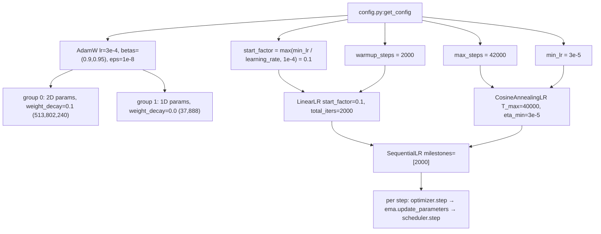
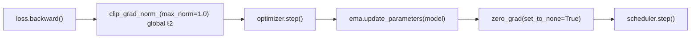

# Optimization: AdamW, Decayed Weights, and the Cosine Schedule

> Audience: intermediate

## The 60-second summary

Training a transformer is a constrained-optimization problem: AdamW decides *how far* each weight moves per step, gradient clipping caps the worst case, and the learning-rate schedule decides *how bold* the optimizer is allowed to be at each point in the run. This project uses the standard LLM-pretraining recipe: AdamW with decoupled weight decay ($\lambda = 0.1$) applied only to 2D weight matrices, global-norm gradient clipping at $1.0$, and a two-phase schedule — 2,000 warmup steps climbing linearly from $3\times10^{-5}$ to a peak of $3\times10^{-4}$, then 40,000 cosine steps decaying back to $3\times10^{-5}$. The whole schedule covers 42,000 optimizer steps and 196,608 tokens per step, about 8.26B tokens in total. Every piece of this recipe exists to answer one question: how do we make 513.8M parameters converge in the fewest tokens without diverging?

## Why this exists

Stochastic gradient descent moves every weight by $\eta \cdot g$, where the gradient $g$ is a noisy estimate. A 513.8M-parameter transformer trained on natural language faces three problems that plain SGD does not solve:

1. **Per-coordinate scale.** Some weights (embedding rows) see huge, dense gradients; others (deep FFN weights) see small, sparse ones. One global learning rate cannot serve both — the update step needs to be normalized by an estimate of each coordinate's gradient scale.
2. **Noisy early signals.** Gradients from a 196,608-token batch are only a sample; the first few thousand steps of training are the most fragile (the model's loss starts near $\ln 128000 \approx 11.76$ nats/token and must be driven down by orders of magnitude). Taking full-size steps before the optimizer has reliable statistics invites divergence.
3. **Generalization pressure.** A model with 513.8M parameters and ~8.26B tokens of data sees each parameter only ~16 times over the run. Without some form of regularization pressure, the optimizer will happily memorize the training distribution at the cost of validation loss.

AdamW + clipping + warmup + cosine decay is the empirical answer to all three: Adam normalizes each coordinate by its gradient history; clipping bounds rare catastrophic gradient events; warmup lets the optimizer's statistics (and the model's loss geometry) settle before large steps; cosine decay to a nonzero floor spends the second half of the run doing fine-grained convergence instead of thrashing.

## Intuition

**Adam as a ball rolling downhill with per-axis brakes.** Imagine a ball rolling over a surface. SGD is a ball with constant friction. Adam is a ball that brakes each axis independently: axes along which the ball has recently been moving fast (large gradient variance) get more braking, so the ball never rockets down a steep ravine while crawling along a flat ridge. The two running averages — first moment $m_t$ (mean gradient, i.e. direction) and second moment $v_t$ (mean squared gradient, i.e. how jumpy that direction is) — are the ball's memory. The update is roughly *direction / jumpiness*, which has units of a step in parameter space regardless of how big or small the raw gradients are.

**Weight decay as slow rust.** Decoupled weight decay multiplies every matrix weight by $(1 - \eta\lambda)$ each step — a tiny, uniform "rust" that slowly pulls large weights back toward zero. It is not about fitting the training data at all; it is a prior that says "prefer smaller matrices unless the data demands otherwise." Rust that scales with the weight (multiplicative) is qualitatively different from a constant pull: big weights rust faster, small weights barely rust, and the equilibrium magnitude of a weight is set by the tug-of-war between the data (pushing it up) and the rust (pulling it down).

**Warmup as warming up the engine.** Adam's second-moment estimate starts at zero. Until $v_t$ accumulates enough samples, the normalized update is essentially sign-descent with full magnitude — the largest step the optimizer is ever willing to take, taken in a direction estimated from a handful of noisy gradients. Warmup is the engine-idle period: run the engine at 10% throttle while the statistics warm up, then open the throttle.

**Cosine decay as easing off the gas.** The model needs big steps early, when the loss landscape is coarse, and small steps late, when it is fine. Cosine gives a smooth, self-decelerating throttle curve that spends most of its time near the middle and glides into a low floor instead of slamming to zero — and the floor matches the warmup start, so the throttle curve is one continuous arc from the first step to the last.

## Formal treatment

### Adam: the update rule

Adam (Kingma & Ba, 2015) maintains two exponential moving averages per parameter. Let $g_t$ be the gradient at step $t$ (a vector over all parameters; the equations below are per-coordinate), $\beta_1, \beta_2 \in [0,1)$ decay rates, and $\eta_t$ the learning rate at step $t$:

$$
\begin{aligned}
m_t &= \beta_1 m_{t-1} + (1-\beta_1)\, g_t &\text{(first moment: smoothed gradient)} \\
v_t &= \beta_2 v_{t-1} + (1-\beta_2)\, g_t^2 &\text{(second moment: smoothed squared gradient)} \\
\hat m_t &= \frac{m_t}{1 - \beta_1^{\,t}} &\text{(bias correction)} \\
\hat v_t &= \frac{v_t}{1 - \beta_2^{\,t}} &\text{(bias correction)} \\
w_t &= w_{t-1} - \eta_t \frac{\hat m_t}{\sqrt{\hat v_t} + \varepsilon}
\end{aligned}
$$

The bias correction matters at small $t$. Both moments are initialized to zero, so the EMA starts out biased low; dividing by $1-\beta^{t}$ restores the expectation. Concretely: at $t=1$, $m_1 = (1-\beta_1)g_1$, so $\hat m_1 = g_1$ exactly; at $t=2$, $\hat m_2$ is the proper two-sample weighting, and so on. The correction decays away as $1-\beta^t \to 1$.

The per-coordinate step magnitude is bounded: by Cauchy–Schwarz, $|\hat m_t| \le \sqrt{\hat v_t}$ elementwise (an EMA of $g$ can never exceed the RMS of the $g$'s it averages), so each coordinate moves by at most $\eta_t$ per step — *regardless of how large the raw gradients are*. This is the property that lets one learning rate serve the embedding layer and the deepest FFN weight simultaneously.

**Why $\beta_1 = 0.9$.** The first moment is a smoothed direction estimate. $\beta_1 = 0.9$ gives an effective window of $1/(1-\beta_1) = 10$ steps: the direction used at step $t$ is an average over roughly the last ten gradients. That is long enough to suppress per-batch noise, short enough to track the direction as the loss landscape changes.

**Why $\beta_2 = 0.95$ instead of $0.999$.** The second moment estimates each coordinate's gradient variance, and its effective window is $1/(1-\beta_2)$:

| $\beta_2$ | window (steps) | window at 196,608 tokens/step |
|---|---|---|
| 0.999 (Adam default) | 1,000 | 196.6M tokens |
| 0.99 (LLaMA-2-style) | 100 | 19.7M tokens |
| **0.95 (this project)** | **20** | **3.9M tokens** |

The default $0.999$ assumes the per-coordinate gradient scale is roughly stationary over ~200M tokens. That assumption is wrong twice over in LLM pretraining: the gradient scale collapses by orders of magnitude over the run (loss goes from ~11.76 to ~2 nats), and the learning rate itself changes by $10\times$. With $\beta_2 = 0.95$, the optimizer re-estimates the coordinate scales every 3.9M tokens — fast enough to track the changing regime, at the cost of a noisier (shorter-average) variance estimate. LLM pretraining empirically tolerates that noise better than it tolerates a stale scale (GPT-3 used 0.95; the config here follows that convention).

### AdamW: decoupled weight decay vs. L₂ regularization

"L₂ regularization" means adding $\frac{\lambda}{2}\|w\|^2$ to the loss, so the *gradient* gains a $\lambda w$ term. "Weight decay" means subtracting $\eta\lambda w$ from the weight directly. For SGD these are equivalent (both subtract $\eta\lambda w$ per step). For Adam they are **not** equivalent, and the difference is the entire point of AdamW (Loshchilov & Hutter, 2019).

With L₂-in-the-loss, the regularizer rides through Adam's normalization. Writing $g_t' = g_t + \lambda w_{t-1}$, the update becomes:

$$
w_t = w_{t-1} - \eta_t \frac{\hat m_t'}{\sqrt{\hat v_t'} + \varepsilon}
$$

The decay term $\lambda w$ is mixed into $\hat m_t'$ and $\hat v_t'$ and therefore divided by $\sqrt{\hat v_t'}$ — the *effective* decay applied to a coordinate is approximately $\eta_t \lambda w / \sqrt{\hat v_t'}$, which varies per-coordinate and over time. Coordinates with quiet gradient histories (small $\hat v$) get decayed hard; coordinates with loud histories barely decayed. The regularization strength becomes an accident of each coordinate's gradient statistics — precisely the coupling that makes regularization non-uniform.

Decoupled weight decay applies the decay *outside* the moment machinery:

$$
\begin{aligned}
w_t &= w_{t-1} - \eta_t \lambda\, w_{t-1} &\text{(decay: uniform, history-independent)} \\
w_t &= w_t - \eta_t \frac{\hat m_t}{\sqrt{\hat v_t} + \varepsilon} &\text{(Adam update, unmodified)}
\end{aligned}
$$

(or equivalently combined into one line, as PyTorch documents it: $w_t = w_{t-1} - \eta_t(\lambda w_{t-1} + \hat m_t/(\sqrt{\hat v_t}+\varepsilon))$). Every coordinate decays by exactly $\eta_t \lambda$ per step, a constant fraction of its current magnitude. Decay is now a pure, predictable force: the equilibrium magnitude of a weight is set by the tug-of-war between data-driven updates and the uniform rust, with no dependence on the optimizer's internal bookkeeping. Loshchilov & Hutter show empirically that this decoupling improves generalization across vision and translation benchmarks, and it has become the default for LLM pretraining.

At this project's numbers: $\lambda = 0.1$, $\eta$ ranges $3\times10^{-5} \to 3\times10^{-4}$, so the per-step relative decay is $\eta\lambda \in [3\times10^{-6},\, 3\times10^{-5}]$ — at peak LR, 0.003% of a weight's magnitude per step. Small per step, but compounding: a weight receiving no gradient for the whole run would shrink by $(1 - \eta\lambda)^N$; integrating the actual $\eta_t$ curve (average $\eta \approx 1.0\times10^{-4}$ over the schedule) gives roughly $(1-1\times10^{-5})^{42000} \approx e^{-0.42} \approx 0.66$ of its initial magnitude. Decay is a real, cumulative force even though it is invisible per step.

### Why decay 2D+ parameters only

The optimizer construction in `train.py:train_model` partitions parameters by `param.dim() >= 2`: every 2D-or-larger tensor goes into the decayed group, every 1D tensor into an undecayed group. At this project's scale that split is:

| group | rule | count | fraction |
|---|---|---|---|
| decayed | `dim() >= 2`: embeddings, LM head, q/k/v/out projections, gate/up/down | 513,802,240 | 99.993% |
| undecayed | 1D: RMSNorm gains, QK-norm gains | 37,888 | 0.007% |

The undecayed 1D parameters are exactly the normalization gains: per decoder block, `attention.q_norm.weight` (128) + `attention.k_norm.weight` (128) + `attention_norm.weight` (1024) + `ffn_norm.weight` (1024) = 2,304, times 16 blocks, plus the final `decoder.norm.weight` (1024) = 37,888 total. There are no biases anywhere in the model (every `nn.Linear` in `model.py:GroupedQueryAttention` and `model.py:SwiGLUFFN` is `bias=False`).

Why exclude them?

1. **Norm gains are scale parameters, not weights.** An RMSNorm gain multiplies a unit-variance activation (see [normalization.md](normalization.md)); its magnitude is meaningful *as a scale*. Decaying it drags the residual-stream amplitude down over training, and every downstream layer must compensate by growing — an unnecessary, coupled distortion that fights the normalization.
2. **The magnitude argument.** 37,888 parameters is 0.007% of the model. Even if decay on them helped, it would be below the noise floor of the run; the risk (distorting norm scales) is real, the benefit is not.
3. **The positive case for 2D.** Decaying the big matrices — including the 262.1M-parameter embedding + LM head pair ($2 \times 128000 \times 1024$) and the 251.7M non-embedding weights — is where the generalization pressure actually lives. The `dim() >= 2` heuristic is the nanoGPT/GPT-2 idiom: "matrix weights decay, vectors don't."

Note that the *embedding* is decayed even though it is technically a lookup table, not a matrix multiply — it is 2D, so it decays, and that is standard for LLM pretraining.

### FP32 moments

The Adam state ($m_t$, $v_t$, plus the step counter) lives in FP32. This falls out of how the code is structured: the model is never cast to a lower precision — `train.py` wraps only the forward/backward *compute* in `torch.autocast(device_type='cuda', dtype=torch.bfloat16, ...)` (see [mixed-precision.md](mixed-precision.md)) — so parameters, gradients, and optimizer state are all FP32 by construction. The moments must not be BF16: the second moment is a *scale* estimate whose precision directly sets the precision of the normalized step, and BF16's ~3 significant decimal digits would quantize $\sqrt{\hat v_t}$ coarsely enough to corrupt the step size; $\varepsilon = 10^{-8}$ would also be meaningless in BF16 (it is far below representable precision). FP32 moments cost memory: $2 \times 513.8\text{M} \times 4\text{ B} = 4.11\text{ GB}$, against 2.06 GB for FP32 weights (see [memory-engineering.md](memory-engineering.md) for the full stack). That is the price of a stable adaptive optimizer, and it is paid once, up front.

### Gradient clipping: global-norm semantics

The code clips with `torch.nn.utils.clip_grad_norm_(model.parameters(), max_norm=1.0)`. The semantics are *global*: compute the L₂ norm of the *concatenated* gradient vector over every parameter,

$$
g = \sqrt{\sum_{p \in \text{params}} \sum_i g_{p,i}^{\,2}},
$$

and if $g > 1.0$, scale every gradient in the model by $1.0/g$ (if $g \le 1.0$, nothing changes). This is a "rare-event guard," not a regularizer: with Adam's normalization, the per-coordinate step is already bounded by $\eta_t$, so clipping mainly protects the *first moment* from being polluted by a single catastrophic gradient event (one bad batch can otherwise inject a large spike into $m_t$ that takes ~10 steps to wash out). It also bounds the norm of the actual parameter update: the update vector's norm is at most $\eta_t \cdot g_{\text{clipped}} \le \eta_t$ in the worst case. A single A100 run at batch 96 is too small for gradient noise to be the dominant failure mode, but the guard is cheap and standard.

### Warmup: why, and the start_factor trick

Three compounding reasons make the first few thousand steps the most dangerous phase of an LLM run:

1. **Cold-start second moment.** At step $t$, $\hat v_t$ is an average over $t$ samples. For $t < 20$ (the $\beta_2$ window), the variance estimate is dominated by a handful of gradients; the normalized step magnitude $\eta_t \hat m_t/\sqrt{\hat v_t}$ wanders as those few samples come and go. At $t=1$ the update is exactly $\eta \cdot \operatorname{sign}(g_1)$ — full-magnitude sign descent, the largest relative step Adam ever takes, on the basis of one sample.
2. **Steep initial landscape.** With init weights $\sim \mathcal{N}(0, 0.02^2)$ (`model.py:Transformer._init_weights`) and a 128,000-way output, the initial loss is near $\ln 128000 \approx 11.76$ nats/token, and the gradients in the first steps are large and correlated across the batch of 196,608 tokens.
3. **The schedule's own math.** $\eta = 3\times10^{-4}$ is chosen for the *converged* regime (where the normalized update is small and the model can afford large steps). Taking $3\times10^{-4}$-sized steps from step 1, when the model is changing fastest and the optimizer's statistics are worst, is exactly backwards.

Warmup fixes this by throttling $\eta$ from small to peak while the moments accumulate and the loss geometry settles. The code's construction makes the throttle's starting value meaningful rather than arbitrary:

$$
\texttt{start\_factor} = \max\!\left(\frac{\texttt{min\_lr}}{\texttt{learning\_rate}},\; 10^{-4}\right) = \max\!\left(\frac{3\times10^{-5}}{3\times10^{-4}},\; 10^{-4}\right) = 0.1
$$

So warmup starts at $0.1 \times 3\times10^{-4} = 3\times10^{-5}$ — **exactly the value the cosine tail ends at**. The warmup start is not a fourth free hyperparameter; it is derived from the two the schedule already has. The schedule is then one continuous arc: $3\times10^{-5} \to 3\times10^{-4} \to 3\times10^{-5}$. The $10^{-4}$ floor on `start_factor` guards pathological configs ($\texttt{min\_lr} = 0$, or a zero/negative peak LR), which would otherwise produce a zero or negative warmup start. `LinearLR` then interpolates multiplicatively from `start_factor` to `1.0` across `total_iters` steps, landing at the peak exactly on step 2,000.

### Cosine decay: why cosine, why not exponential

After warmup, the schedule hands off to `CosineAnnealingLR` with $T_{\max} = 40000$, $\eta_{\min} = 3\times10^{-5}$:

$$
\eta_t = \eta_{\min} + \frac{1}{2}(\eta_{\max} - \eta_{\min})\left(1 + \cos\frac{\pi t}{T_{\max}}\right)
$$

with $\eta_{\max} = 3\times10^{-4}$, $\eta_{\min} = 3\times10^{-5}$, $t = 0, 1, \dots, 39999$.

**Why not exponential decay?** An exponential $\eta_t = \eta_{\max} r^{t}$ has one knob — the rate $r$ — which must be fixed up front. To traverse a $10\times$ range over 40,000 steps it must decay quickly early (when the model still wants large steps) and keeps decaying forever after (the tail is asymptotically flat, so the last ~10,000 steps crawl at near-minimum LR, spending the run's final data on near-zero updates). Cosine has the same two endpoints but a qualitatively different shape: it *decelerates* — the curve spends most of its time in the upper-middle range and only drops sharply near the end. The derivative $d\eta_t/dt \propto \sin(\pi t/T_{\max})$ is largest mid-schedule and vanishes at both ends, so the schedule glides into the floor rather than slamming into it. This smooth, "spend most of the time at a useful LR" shape is the empirical winner (Loshchilov & Hutter, 2017, SGDR).

**Why a nonzero floor ($\eta_{\min} = 3\times10^{-5} = 10\%$ of peak)?** Three reasons. First, the last steps still need to *move*: a hard zero freezes the model and wastes the final tokens — the run's last gradient information is discarded. Second, the EMA shadow model (`ema_decay = 0.999`) keeps averaging the online weights and only converges to them if they keep moving; a zero-LR tail freezes the online weights while the EMA keeps blending stale snapshots (see [training.md](../reference/training.md)). Third, the $10\%$-of-peak convention is the empirical sweet spot (GPT-3 used exactly peak $3\times10^{-4}$, min $3\times10^{-5}$ — the same pair as here).

### The complete curve at this scale

| step | phase (t = cosine steps elapsed) | LR |
|---|---|---|
| 0 | warmup start | $3.000\times10^{-5}$ |
| 1,000 | warmup midpoint | $1.650\times10^{-4}$ |
| 2,000 | peak, cosine t=0 | $3.000\times10^{-4}$ |
| 12,000 | cosine t=10,000 | $2.605\times10^{-4}$ |
| 22,000 | cosine t=20,000 | $1.650\times10^{-4}$ |
| 32,000 | cosine t=30,000 | $6.954\times10^{-5}$ |
| 42,000 | cosine t=40,000 | $3.000\times10^{-5}$ |

Worked values: at t=10,000, $\cos(\pi/4) = 0.7071 \Rightarrow \eta = 3\times10^{-5} + \tfrac{1}{2}(2.7\times10^{-4})(1.7071) = 2.605\times10^{-4}$. At t=20,000, $\cos(\pi/2) = 0 \Rightarrow \eta = 1.65\times10^{-4}$ — the cosine midpoint lands at the arithmetic mean of peak and floor, exactly like the warmup midpoint. At t=30,000, $\cos(3\pi/4) = -0.7071 \Rightarrow \eta = 6.954\times10^{-5}$. The warmup-to-cosine seam is continuous: warmup's last step (t=1,999) sits at $0.99955 \times$ peak and cosine's first step at exactly peak — a 0.04% blip, invisible in practice.

### Tokens per step and the LR/batch relationship

The schedule's x-axis is *steps*, but the meaningful unit is *tokens*: each step consumes

$$
\text{tokens/step} = \texttt{batch\_size} \times \texttt{seq\_len} \times \texttt{grad\_accum\_steps} = 96 \times 2048 \times 1 = 196{,}608
$$

(computed verbatim in `train.py:train_model` as `tokens_per_step`). The run-level budget:

- warmup: $2{,}000 \times 196{,}608 = 3.93\times10^8$ tokens (0.39B, 4.8% of the run)
- cosine: $40{,}000 \times 196{,}608 = 7.86\times10^9$ tokens
- total: $42{,}000 \times 196{,}608 = 8.26\times10^9$ tokens — about 16.1 tokens per parameter for a 513.8M-param model, roughly 80% of the Chinchilla-recommended 20 tokens/param (see [scaling-and-metrics.md](scaling-and-metrics.md))

Two scheduling consequences follow from the token rate. First, the $\beta_2 = 0.95$ window of 20 steps is only 3.9M tokens — a fraction of a percent of the run — so the optimizer can track the changing gradient scale as the schedule itself evolves. Second, warmup at 4.8% of the run is proportionally *long* compared with frontier runs (GPT-3 warmed up over 0.125% of its tokens); a small model seeing each token only ~16 times cannot afford to waste early tokens on a divergent trajectory, so it spends a larger share of the run easing in. The peak LR of $3\times10^{-4}$ is the near-universal transformer-pretraining default (same value as GPT-3 and LLaMA-3), chosen to be safe at this batch: for Adam-based training, 196,608 tokens/step is small enough that $3\times10^{-4}$ does not overshoot, and large enough that it is not wasteful.

## How the code realizes it

### Optimizer construction

All of this lives in `train.py:train_model`. The parameter split and `AdamW` construction:

```python
# illustrative — trimmed from train.py:train_model; the loop body is verbatim
decay_params = []
no_decay_params = []
for param in model.named_parameters():
    if not param[1].requires_grad:
        continue
    if param[1].dim() >= 2:
        decay_params.append(param[1])
    else:
        no_decay_params.append(param[1])

optimizer = torch.optim.AdamW([
    {'params': decay_params, 'weight_decay': config['weight_decay']},
    {'params': no_decay_params, 'weight_decay': 0.0},
], lr=config['learning_rate'], betas=(config['beta1'], config['beta2']),
   eps=config['eps'])
```

The two param groups differ *only* in `weight_decay` ($0.1$ vs. $0.0$); both share `lr=3e-4`, `betas=(0.9, 0.95)`, `eps=1e-8`, all read from `config.py:get_config`. Because the model stays in FP32 (autocast covers only the compute), the Adam state is FP32 automatically — no master-weight copy is needed. The `requires_grad` guard also protects the (rare) frozen parameter from being grouped.

### Scheduler construction

```python
# illustrative — trimmed from train.py:train_model; verbatim
warmup_steps = config['warmup_steps']
max_steps = config['max_steps']
start_factor = max(config['min_lr'] / config['learning_rate'], 1e-4) if config['learning_rate'] > 0 else 1e-4
warmup_scheduler = LinearLR(optimizer, start_factor=start_factor, total_iters=warmup_steps)
cosine_scheduler = CosineAnnealingLR(optimizer, T_max=max_steps - warmup_steps, eta_min=config['min_lr'])
scheduler = SequentialLR(optimizer, schedulers=[warmup_scheduler, cosine_scheduler], milestones=[warmup_steps])
```

`torch.optim.lr_scheduler.SequentialLR` composes the two schedulers: it runs `LinearLR` for the first 2,000 `scheduler.step()` calls, then hands off to `CosineAnnealingLR` for the remaining 40,000, which is exactly `T_max = max_steps - warmup_steps`. Both schedulers act on both param groups identically — the decay/no-decay groups share the same LR trajectory, only the decay differs.



### The per-step sequence

Inside the training loop, on every optimizer step (with `gradient_accumulation = 1`, that is every batch):

```python
# illustrative
grad_norm = nn.utils.clip_grad_norm_(model.parameters(), max_norm=config['max_grad_norm'])
optimizer.step()
if ema is not None:
    ema.update_parameters(model)
optimizer.zero_grad(set_to_none=True)
scheduler.step()
```

Order matters: clip before `optimizer.step()` (so the optimizer never sees an unclipped gradient), EMA update after the step (so the shadow tracks the *new* weights), `zero_grad(set_to_none=True)` after (releases gradient memory), and `scheduler.step()` last (the LR used by step $t$ was set by step $t-1$'s scheduler call — the standard PyTorch ordering). The logged LR comes from `scheduler.get_last_lr()[0]`, and the logged `tokens_seen = step * tokens_per_step` uses the same 196,608 tokens/step accounting. Clipping is inside the grad-accumulation branch too, so with `gradient_accumulation > 1` the norm is taken over the *accumulated* gradient — the correct global norm — and the scheduler steps once per optimizer step, not once per micro-batch.



### The tiny-scheduler mirror in tests

`tests/test_train.py:make_tiny_scheduler` replicates the production chain at toy scale (2 warmup steps, 10 total, min/peak $10^{-5}/3\times10^{-4}$), including the exact `start_factor` formula:

```python
# illustrative
def make_tiny_scheduler(opt, warmup_steps=2, max_steps=10, min_lr=1e-5, peak_lr=3e-4):
    """Mirror of the production scheduler chain (LinearLR → CosineAnnealingLR)."""
    start_factor = max(min_lr / peak_lr, 1e-4) if peak_lr > 0 else 1e-4
    warm = LinearLR(opt, start_factor=start_factor, total_iters=warmup_steps)
    cos = CosineAnnealingLR(opt, T_max=max_steps - warmup_steps, eta_min=min_lr)
    return SequentialLR(opt, schedulers=[warm, cos], milestones=[warmup_steps])
```

This is runnable as written (it is the test's own code). It is used throughout `tests/test_train.py::TestCheckpointRoundTrip`, whose round-trip tests build an optimizer + `make_tiny_scheduler` chain, run a few steps, save via `train.py:save_checkpoint`, reload via `train.py:load_checkpoint`, and verify that optimizer and scheduler state (including step counters) restore exactly — which is what makes the LR curve bit-exact across resume boundaries. If the production construction drifts from this mirror, the mismatch shows up as a checkpoint round-trip failure.

## Edge cases & pitfalls

**The warmup seam is (almost) seamless.** Warmup's last step sits at $0.99955 \times$ peak, cosine's first at exactly peak; the 0.04% jump is far below the noise of the run. It is worth knowing it exists, because `SequentialLR`'s milestone is inclusive: at `last_epoch == 2000` control transfers to the cosine scheduler, which is why `T_max` must be `max_steps - warmup_steps` and not `max_steps` — double-counting the 2,000 warmup steps would stretch the cosine over 42,000 steps and end the run above `min_lr`.

**`T_max <= 0` is unguarded.** If a config ever sets `max_steps <= warmup_steps`, `CosineAnnealingLR` receives `T_max <= 0` and the schedule degenerates (division by zero in the cosine term). The code does not guard this; it is an invariant of `config.py:get_config`'s defaults (42,000 vs. 2,000). [INFERENCE: no guard exists in `train.py:train_model`.]

**The `1e-4` floor on `start_factor` silently overrides the curve.** If someone sets `min_lr` such that `min_lr / learning_rate < 1e-4` (e.g. `min_lr = 1e-5` at peak `3e-4`, as the test's default does: $3.33\times10^{-2}$ — fine — but `min_lr = 1e-8` would floor at `1e-4`), the warmup start no longer equals `min_lr` and the curve develops a small kink at the bottom. The floor exists to keep `LinearLR` from receiving a zero or negative `start_factor`; it is a safety net, not a feature.

**Warmup length vs. the $\beta_2$ window.** 2,000 warmup steps is 100 second-moment windows — plenty for the statistics to stabilize. If warmup were shorter than ~20 steps, the LR would reach peak before the moments converged, defeating the purpose. This is a sanity check to re-run if `warmup_steps` is ever shrunk.

**The global clip includes the embeddings — and they dominate.** The 262.1M embedding + LM-head parameters are 51% of the model, receive dense gradients every step, and therefore contribute a large share of the global L₂ norm. The clip is *global*, so a loud embedding gradient scales down every other gradient in the model proportionally. This is standard behavior (and usually benign), but it means `max_grad_norm` is not a per-layer budget; if one layer's gradients chronically dominate, the others get silently damped. The code clips everything with one call and no per-group handling — a deliberate simplicity.

**`eps=1e-8` only makes sense with FP32 moments.** In the update $\hat m_t/(\sqrt{\hat v_t} + \varepsilon)$, the epsilon exists to avoid division by zero and to bound the step when $\hat v_t \to 0$. With FP32 moments (this repo) $10^{-8}$ is fine. If the model were ever cast to BF16 with default AdamW state, the moments would become BF16 and a $10^{-8}$ epsilon would be pure noise — a silent correctness trap. [INFERENCE: PyTorch's default (non-fused) AdamW initializes moment state with the parameter's dtype; verified on torch 2.12.0 by inspection of `torch/optim/adam.py` and empirically on CPU.]

**`scheduler.step()` placement.** Stepping the scheduler once per *optimizer* step (inside the grad-accumulation branch) is correct: LR is a function of optimizer steps, not micro-batches. Moving `scheduler.step()` out of that branch (as a naive reader might) would advance the curve `grad_accum_steps` times too fast.

**Weight decay on a frozen-parameter bug.** The `requires_grad` guard in the grouping loop means a parameter that is temporarily frozen drops out of *both* groups and stops decaying. For a permanently frozen parameter that is correct; if parameters were ever frozen and unfrozen mid-run (they are not, here), their decay would pause — a subtle behavior worth knowing.

**Zero/negative LR configs.** `learning_rate <= 0` routes `start_factor` to the `1e-4` floor; `min_lr >= learning_rate` would make `start_factor >= 1` and the warmup would overshoot the peak (LinearLR would interpolate above the base LR). The defaults keep $\texttt{min\_lr} = 10\%$ of peak, which is the sane regime.

## Further reading

- [attention.md](attention.md) — what the decayed q/k/v/out matrices actually compute
- [normalization.md](normalization.md) — why the undecayed RMSNorm gains are scale parameters
- [feedforward.md](feedforward.md) — the decayed gate/up/down matrices
- [loss-functions.md](loss-functions.md) — the loss the optimizer is minimizing (CE + z-loss)
- [mixed-precision.md](mixed-precision.md) — why compute is BF16 while params/moments stay FP32
- [memory-engineering.md](memory-engineering.md) — the 4.11 GB Adam-moment line item in the memory budget
- [scaling-and-metrics.md](scaling-and-metrics.md) — the 8.26B-token budget vs. Chinchilla
- [training.md](../reference/training.md) — the full training loop (validate/checkpoint/EMA) around this optimizer
- [config.md](../reference/config.md) — every knob named in this doc, in one table
