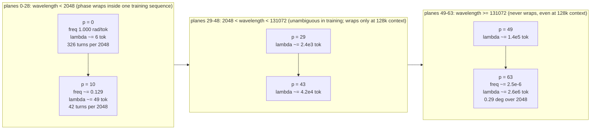

# Positional Encoding: Why Order Matters, and the RoPE Landscape

> Audience: beginner → intermediate
> Prerequisites: a working mental model of scaled dot-product attention (see
> [attention.md](attention.md)) and the token-embedding → block-stack → LM-head
> data flow of a decoder-only transformer (see
> [transformers-from-scratch.md](transformers-from-scratch.md)).
> The line-by-line implementation deep-dive of this project's RoPE module
> lives in [rope.md](../reference/rope.md); this document is the *theory*
> landscape: why positions exist at all, how the three historical families
> solve the problem, the mathematics that makes rotary embeddings work, and
> what the frequency schedule actually controls.

---

## 1. The 60-Second Summary

Attention computes a weighted average of value vectors, where the weights come
from dot products between query and key vectors. Dot products compare
*content*, not *location*: if you shuffle the tokens of a sequence, the
attention layer's output shuffles along with them — the model literally cannot
tell `"the cat sat"` from `"sat cat the"`. Positional encoding is the
mechanism that breaks this symmetry and injects *where* a token sits.

There are three families of solutions. **Absolute** encodings (sinusoidal or
learned) add a position vector to each token embedding. **Relative** encodings
(T5 bias, ALiBi) add a distance-dependent bias directly to attention logits.
**Rotary** encodings (RoPE) rotate query and key vectors in 2-D planes before
the dot product, which makes the attention score depend on the *relative*
distance between tokens by pure linear algebra — no extra parameters, and a
built-in notion of "farther = different phase."

RoPE is what this project uses (`model.py:RoPE`), with one conspicuous
hyperparameter: the frequency base `rope_theta = 500000.0` in
`config.py:get_config`. That base controls the *wavelengths* of the rotation
planes — how many tokens a plane needs to complete one full turn. LLaMA-3
picked 500K (vs LLaMA-2's 10K) so that the slowest planes stay unambiguous
far beyond the training window, which is what makes long-context
extrapolation possible at all.

---

## 2. Why Positions Exist: Attention Is Permutation-Invariant

### 2.1 The symmetry, stated precisely

Take a single attention head with no position information. For an input
sequence of token vectors $x_1, \dots, x_S$, the head computes projections
$q_i = W_q x_i$, $k_j = W_k x_j$, $v_j = W_v x_j$ and produces

$$
\text{out}_i = \sum_{j=1}^{S} \alpha_{ij}\, v_j,
\qquad
\alpha_i = \operatorname{softmax}\!\Big(\frac{q_i^{\mathsf T} k_j}{\sqrt{d_k}}\Big)_j .
$$

Now swap two tokens $x_{j_1}$ and $x_{j_2}$ (neither of which is at position
$i$). What changes in $\text{out}_i$? The query $q_i$ is unchanged, every key
$k_j$ and value $v_j$ is unchanged as a *vector* — they just occupy different
slots. The sum over $j$ is a sum over a multiset, so reordering the slots
leaves $\text{out}_i$ **exactly unchanged**.

That is the sharp statement of the problem:

> **Without position information, the attention output at position $i$ is
> invariant under permutations of every *other* position.** The context around
> a token is treated as a *bag* of tokens, not a sequence.

The same holds for the whole transformer: RMSNorm and the FFN act
elementwise, residual adds are commutative, so every block is
permutation-equivariant, and by induction the entire stack is
permutation-equivariant: $\text{model}(\pi x) = \pi\, \text{model}(x)$ for any
permutation $\pi$ of positions. The only thing in the architecture that can
break the symmetry is an explicit position signal.

### 2.2 Why that is fatal for language

Consider what a causal language model must learn. It predicts the next token
after a *prefix*, and the identity of that next token depends on order:

- `"the cat sat"` → next-token distribution heavily favoring `.`
- `"sat cat the"` → an ungrammatical prefix; the model should be confused

A permutation-invariant model cannot distinguish these two prefixes. It can
only learn order-insensitive statistics — "the word *cat* is in the context,
so *sat* is more likely" — which is bag-of-words modeling, not language
modeling. Order is where syntax, scope, coreference, and argument structure
live; a model with no position signal cannot represent any of them.

The practical failure is equally concrete. Because $\text{out}_i$ is invariant
to reorderings of the other positions, the *representation* of a token is
identical regardless of what surrounds it. Every copy of the same token would
behave identically, and the model would be unable to implement "the second
noun is the object" — a rule that requires distinguishing positions 3 and 5.

### 2.3 What information must be injected

At minimum, the model needs:

1. **Order** — a way to tell that position 3 ≠ position 5.
2. **Distance** — a way to know that two tokens are 2 apart, not 20.
3. **Direction** — in a causal model, the distinction between "to my left"
   (attended) and "to my right" (masked, or future).

A good encoding scheme also has two soft requirements that turn out to decide
between families:

4. **Relative, not absolute, semantics** — the rule the model wants is
   "the verb comes 2 tokens after the subject", not "the verb is at position
   17". If positions enter only in absolute form, the model must spend
   capacity *re-deriving* offsets from pairs of absolute codes.
5. **Generalization beyond the training window** — a model trained on
   `seq_len = 2048` should degrade gracefully, not collapse, when asked to
   process 4096 tokens.

---

## 3. Intuition: A Tape Measure Made of Clocks

Before the math, a mental model that makes every later section predictable.

**Picture each RoPE plane as the hand of a clock.** The vector pair
$(x_{2p}, x_{2p+1})$ is the position of the hand; the token's position $m$
advances the hand by a fixed angle $m\theta_p$ (one hand per plane, each with
its own gear ratio $\theta_p$). When you take the dot product of a query hand
at position $m$ and a key hand at position $n$, rotation math collapses the
two absolute angles into *one* relative angle $(n-m)\theta_p$ — the hands only
"see" how far apart they are, not where they both point in absolute terms.

**Why many planes with different speeds?** Think of an odometer. The
ones-digit wheel spins fast and distinguishes nearby mile values; the tens
wheel spins ten times slower and disambiguates values the ones wheel has
already wrapped past; the hundreds wheel extends the range further. RoPE's
planes are odometer wheels at geometric gear ratios:

- **Fast planes** (high frequency, small $\theta_p$): complete many turns
  across the context. They encode fine-grained local order — "is the key 1 or
  2 tokens away?" — but wrap around, so on their own they cannot distinguish
  distance $d$ from $d + \lambda_p$ (their period).
- **Slow planes** (low frequency, large $\theta_p$): barely move across the
  whole context. They act as the coarse, high-order odometer digits that
  disambiguate large distances.

A single plane is ambiguous beyond its wavelength $\lambda_p = 2\pi/\theta_p$;
a *stack* of planes at many wavelengths pins down a distance the way several
odometer wheels together pin down a mileage. This is why the family of
frequencies — and the parameter that sets its scale, $\theta_{\text{base}}$ —
matters so much: it is the "gear box" that decides over what range position
is unambiguous at all.

A second intuition: **rotation is rigid.** Multiplying a vector by an
orthogonal matrix preserves its length and the angles between rotated vectors.
RoPE therefore adds position information *without* changing the statistics of
the dot products that attention computes — no norm drift, no extra
learned capacity, nothing for the optimizer to fight. It is the only family
where the position signal costs zero parameters and cannot be "overwritten"
by the network.

---

## 4. The Three Families of Position Encoding

The design space has two axes: **where** the signal is injected (into the
residual stream, or into the attention logits, or into Q/K themselves) and
**what form** it takes (absolute position, or relative distance). The three
families occupy three corners of this space.

| Family | Representative | Injection point | Position form | Parameters | Length extrapolation |
|---|---|---|---|---|---|
| Absolute, sinusoidal | Vaswani et al. 2017 | added to token embeddings (residual stream) | absolute | 0 (fixed formula) | poor in practice |
| Absolute, learned | GPT-2, BERT | added to token embeddings | absolute | $L \times d_{\text{model}}$ table | none (fixed $L$) |
| Relative, bias | T5, ALiBi | added to attention logits | relative (distance) | T5: learned $2L{-}1$ scalars; ALiBi: 0 | ALiBi strong, T5 weak |
| Rotary (RoPE) | RoFormer, LLaMA, Mistral, Qwen, Gemma | multiplies Q and K | relative (distance) | 0 | strong, tunable via base |

### 4.1 Absolute additive: sinusoidal and learned

The original transformer adds a position vector $p_m$ to the token embedding:

$$
x_m \leftarrow x_m + p_m .
$$

**Sinusoidal** (Vaswani et al. 2017) defines $p_m$ by closed form, with the
same geometric frequency schedule that RoPE would later reuse:

$$
p_{m, 2p} = \sin\Big(\frac{m}{10000^{2p/d}}\Big),
\qquad
p_{m, 2p+1} = \cos\Big(\frac{m}{10000^{2p/d}}\Big).
$$

**Learned** tables instead make $P \in \mathbb{R}^{L \times d_{\text{model}}}$
a parameter matrix trained end-to-end (GPT-2, BERT).

Why it works, partially: with $\sin$/$\cos$ codes, the relative offset
between two positions is recoverable *in principle* — the identity
$\sin(a+b) = \sin a\cos b + \cos a\sin b$ means a position-$m$ code rotated by
a phase offset produces a position-$(m+d)$ code — so the network *could*
extract distances from pairs of absolute codes. But it must learn to do so,
competing with content modeling for the same residual-stream capacity.

Why it is weak:

- **Contention.** $p_m$ is added into the same vector that carries the token
  embedding, so the position signal must be separated from content by later
  layers, and it perturbs the embedding geometry for all downstream use.
- **Absolute bias.** The signal is "I am at position 17", not "my context is
  2 to my left." Relative rules must be re-derived.
- **No window generalization.** Learned tables have no definition for
  positions beyond $L$ — the model simply has no vector for token 2049.
  Sinusoidal codes are defined for all $m$, but models trained on a window
  never learn to *use* them outside it; extrapolation is empirically poor.
- At this project's scale, a learned table would cost
  $2048 \times 1024 = 2{,}097{,}152 \approx 2.1\text{M}$ parameters (about
  $0.4\%$ of the 513.8M total) and would grow linearly with any attempt to
  extend the context.

### 4.2 Relative additive: attention-logit bias (T5, ALiBi)

Instead of perturbing embeddings, add the position signal directly where it
is consumed — the pre-softmax logit:

$$
s_{ij} = \frac{q_i^{\mathsf T} k_j}{\sqrt{d_k}} + b_{j-i}.
$$

**T5** learns a scalar per offset bucket $b_{j-i} \in \mathbb{R}^{2L-1}$
(usually log-bucketed for large offsets, so the table is far smaller than
$2L-1$ entries). **ALiBi** uses a fixed arithmetic bias $b_{j-i} = -m\,|j-i|$
with a per-head slope $m$, no learned parameters at all.

Strengths: the signal is *relative by construction* — the network directly
sees distance in the logit — and costs almost nothing (at most $2L-1 = 4095$
scalars at $L = 2048$). ALiBi extrapolates well because a linearly growing
penalty is defined for every distance.

Weaknesses: the bias is a *scalar*, so it can only push attention toward or
away from nearby tokens; it cannot express "attend to the token that matches
this *pattern* at distance 3" the way a vector-valued encoding can. The
position information never enters the Q/K representations, so it is invisible
to anything that consumes Q/K directly. And the bias must be materialized per
layer, adding a $[B, H, S, S]$ broadcast that is awkward with flash-attention
kernels (which is precisely why this project's attention call passes no mask
and no bias — see [rope.md](../reference/rope.md) and
[attention.md](attention.md)).

### 4.3 Rotary: multiply Q and K by a rotation (RoPE)

RoPE takes the "inject into Q/K" corner: instead of adding anything, it
*rotates* each query and key vector by an angle proportional to its position,
so that the position-dependent change is carried into the dot product. As
Section 5 shows, this makes the score a function of the relative offset
$j - i$ with **no learned parameters and no addition into the residual
stream** — the position signal lives entirely in the rotation phases, is
norm-preserving, and is defined for every integer position (hence
extrapolable).

RoPE has become the default for modern open LLMs (LLaMA 2/3, Mistral, Qwen,
Gemma) precisely because it threads the needle: relative semantics by
construction, zero parameters, orthogonal (training-stable), and a
*continuous knob* — the frequency base — that controls how far position
information stays unambiguous. The rest of this document is about that knob.

---

## 5. Rotary Embeddings, Formally

### 5.1 The rotation matrix

In 2-D, rotation by angle $\varphi$ is

$$
R(\varphi) =
\begin{bmatrix}
\cos\varphi & -\sin\varphi\\
\sin\varphi & \cos\varphi
\end{bmatrix},
\qquad
R(\varphi)^{\mathsf T} R(\varphi) = I,\quad
\det R(\varphi) = 1 .
$$

Rotations form the additive group: $R(\alpha) R(\beta) = R(\alpha+\beta)$ and
$R(\varphi)^{-1} = R(\varphi)^{\mathsf T} = R(-\varphi)$. These two identities
are the *entire* mechanism behind RoPE — everything else is bookkeeping.

### 5.2 Lifting to $D$ dimensions: block-diagonal rotation

For an even-dimensional vector $x \in \mathbb{R}^{D}$ (here
$D = \text{head\_dim} = 128$), split it into $D/2$ adjacent pairs
$(x_0, x_1), (x_2, x_3), \dots, (x_{D-2}, x_{D-1})$ and give each pair its own
frequency $\theta_p$. The position-$m$ rotation is the block-diagonal matrix

$$
\mathbf{R}_m =
\operatorname{diag}\!\big(
  R(m\theta_0),\;
  R(m\theta_1),\;
  \dots,\;
  R(m\theta_{D/2 - 1})
\big),
\qquad
\theta_p = \theta_{\text{base}}^{-2p/D},
$$

and RoPE is simply the linear map $\text{RoPE}(x, m) = \mathbf{R}_m x$.
Each block rotates one 2-D plane by $m\theta_p$ radians — the clock-hand
picture of Section 3, in matrix form. Because $\mathbf{R}_m$ is orthogonal
(a block-diagonal of orthogonal blocks), $\|\text{RoPE}(x,m)\| = \|x\|$ for
every position: the encoding is a rigid motion, not a resizing.

The frequency schedule $\theta_p = \theta_{\text{base}}^{-2p/D}$ is a
geometric progression: $p = 0$ gets the fastest plane ($\theta_0 = 1$
radian per token), and each subsequent plane is slower by a factor
$\theta_{\text{base}}^{2/D}$. For $D = 128$ and
$\theta_{\text{base}} = 500000$, consecutive planes slow down by
$500000^{1/64} = e^{\ln 500000 / 64} = e^{0.2050} \approx 1.2276$, so the 64
planes span a huge range of timescales — this is the "odometer gear box."

### 5.3 The relative-position payoff

The attention score between a query at position $m$ and a key at position $n$
after rotation is

$$
s(m,n) = \langle \mathbf{R}_m q,\; \mathbf{R}_n k \rangle
       = q^{\mathsf T} \mathbf{R}_m^{\mathsf T} \mathbf{R}_n k
       = q^{\mathsf T} \mathbf{R}_{n-m} k ,
$$

using $R(-\alpha)R(\beta) = R(\beta-\alpha)$ block-wise. **The absolute
positions $m$ and $n$ cancel; only the offset $n-m$ remains.**

Expanded per plane, with 2-D pairs $q^{(p)} = (q_{2p}, q_{2p+1})$ and
$k^{(p)} = (k_{2p}, k_{2p+1})$:

$$
\langle R(m\theta_p)\, q^{(p)},\; R(n\theta_p)\, k^{(p)} \rangle
= (q^{(p)}\cdot k^{(p)})\, \cos\big((n-m)\theta_p\big)
+ (q^{(p)} \times k^{(p)})\, \sin\big((n-m)\theta_p\big) ,
$$

where $\times$ is the scalar cross product $q_{2p}k_{2p+1} - q_{2p+1}k_{2p}$.
Summing over all $D/2$ planes:

> **The score depends only on the content of $q_i$, the content of $k_j$,
> and the relative distance $j - i$:**
> $$
> s(i,j) = g\big(q_i,\; k_j,\; j - i\big) .
> $$
> It does not depend on $i$ or $j$ individually.

Two structural facts fall out of this formula:

1. **Symmetric vs. antisymmetric channels.** The $\cos$ term is symmetric
   under swapping $q$ and $k$ (alignment: "are these tokens semantically
   related?"), while the $\sin$ term is antisymmetric and changes sign with
   the direction of the offset (chirality: "is the key before or after me?").
   A causal model needs exactly this directed signal — the future must look
   different from the past, and the $\sin$ channel is what makes it so.
2. **Translation equivariance.** The model learns *distance-dependent*
   patterns — "the noun two places after this determiner" — that apply at any
   absolute location. The same grammatical relationship produces the same
   score at the start of a sequence and 1000 tokens in. This is the property
   the project's test `tests/test_model.py::TestRoPE.test_relative_position_property`
   pins down: it places identical (q, k) pairs at positions 0 and 5 and
   asserts the rotated dot products match, i.e. the score for offset 0 is
   position-independent.

### 5.4 Why the rotation is applied to Q and K only

The score is a dot product of Q and K, so the cancellation in
$q^{\mathsf T}\mathbf{R}_m^{\mathsf T}\mathbf{R}_n k = q^{\mathsf T}\mathbf{R}_{n-m} k$
requires *both* vectors to be rotated. Rotating only one leaks absolute
position through the leftover phase. The value vector V never enters a dot
product with another V; it is only weighted by the already-position-aware
scores, so rotating V would add no position information while making the
output's coordinate frame position-dependent. The code applies RoPE exactly
where the math demands: `model.py:GroupedQueryAttention.forward` rotates
`q` and `k` and leaves `v` alone.

---

## 6. The Frequency Schedule: What $\theta_{\text{base}} = 500000$ Controls

### 6.1 Wavelengths at this project's scale

Each plane $p$ has an angular speed of $\theta_p$ radians per token and a
**wavelength** — the distance it travels before returning to the same phase —

$$
\lambda_p = \frac{2\pi}{\theta_p} = 2\pi\, \theta_{\text{base}}^{2p/D} .
$$

A plane with wavelength $\lambda_p$ resolves relative distances
unambiguously up to $\lambda_p$ tokens; beyond that its phase is periodic
(aliased) and distance $d$ is indistinguishable from $d + \lambda_p$.

Concrete numbers for this model: $D = 128$ (64 planes),
$\theta_{\text{base}} = 500000$, `seq_len = 2048`
(`config.py:get_config`), so $\ln\theta_{\text{base}} = 13.1224$ and
$\theta_p = e^{-p \cdot 13.1224/64}$:

| Plane $p$ | $\theta_p$ (rad/token) | Wavelength $\lambda_p$ | Rotation over 2048 tokens |
|---|---|---|---|
| 0 | $1.000$ | $2\pi \approx 6.3$ tokens | $2048$ rad $\approx 326$ full turns |
| 10 | $e^{-2.0504} \approx 0.129$ | $\approx 49$ tokens | $\approx 264$ rad $\approx 42$ turns |
| 28 | $e^{-5.7423} \approx 3.2\times10^{-3}$ | $\approx 2.0\times10^{3}$ tokens | $\approx 6.6$ rad (wraps once) |
| 29 | $e^{-5.9461} \approx 2.6\times10^{-3}$ | $\approx 2.4\times10^{3}$ tokens | $\approx 5.4$ rad (no full turn) |
| 43 | $e^{-8.8168} \approx 1.5\times10^{-4}$ | $\approx 4.2\times10^{4}$ tokens | $\approx 0.30$ rad |
| 63 | $e^{-12.9176} \approx 2.5\times10^{-6}$ | $\approx 2.6\times10^{6}$ tokens | $\approx 5.0\times10^{-3}$ rad ($0.29^\circ$) |

Derivation shown for the slowest plane: $\theta_{63} = 500000^{-63/64} =
e^{-0.984375 \times 13.1224} = e^{-12.9176} \approx 2.45\times10^{-6}$, so
$\lambda_{63} = 2\pi / 2.45\times10^{-6} \approx 2.56\times10^{6}$ tokens.
The fastest plane spins 326 full turns inside one training sequence; the
slowest one moves a fifth of a degree. The spectrum spans roughly **six
orders of magnitude in wavelength** — that is the multi-scale odometer.



The boundary between the fast and mid bands is where the phase first survives
a full 2048-token sequence. Solving $\lambda_p \ge 2048$:

$$
2\pi\, 500000^{p/64} \ge 2048
\iff p \ge 64 \cdot \frac{\ln(2048/2\pi)}{\ln 500000}
= 64 \cdot \frac{5.7868}{13.1224} = 28.2 ,
$$

so planes $p = 29 \dots 63$ — **35 of the 64 planes, 55%** — never wrap inside
the training window. They carry absolute-distance information across the
entire 2048-token context; the other 29 planes wrap and provide the
fine-grained, periodic local phase.

### 6.2 What the base actually does

For a fixed plane $p$, raising $\theta_{\text{base}}$ *lowers* every
frequency $\theta_p$ (the exponent $-2p/D$ is negative) and *lengthens* every
wavelength by the same factor $(\theta_{\text{base}}')^{2p/D}$. So the base is
a single scalar that stretches or compresses the whole odometer:

- **Large base → slower planes → longer unambiguous range.** Position
  information stays trustworthy for larger distances and larger contexts.
- **Small base → faster planes → shorter range.** More planes wrap inside the
  training window, so long-range position becomes periodic noise.

The trade-off is real: if the base is too large, even the mid-frequency
planes barely move across the training context, and the model sees almost no
position signal in the low-frequency bands during training — the capacity is
there but never exercised. The base must be large enough to cover the target
context, but not so large that the relevant planes are effectively frozen
during training.

### 6.3 Why LLaMA-3 uses 500K (and this project inherits it)

LLaMA-2 used $\theta_{\text{base}} = 10000$; LLaMA-3 jumped to
$\theta_{\text{base}} = 500000$ — a 50× change — to support 128K-token
contexts after training on much shorter sequences. The arithmetic makes the
reason crisp. Repeating the Section 6.1 analysis for both bases at
$D = 128$:

| Quantity | $\theta_{\text{base}} = 10^4$ (LLaMA-2) | $\theta_{\text{base}} = 5\times10^{5}$ (LLaMA-3) |
|---|---|---|
| Slowest frequency $\theta_{63}$ | $e^{-9.0664} \approx 1.16\times10^{-4}$ | $e^{-12.9176} \approx 2.45\times10^{-6}$ |
| Slowest wavelength $\lambda_{63}$ | $\approx 5.4\times10^{4}$ tokens | $\approx 2.6\times10^{6}$ tokens |
| Planes with $\lambda_p \ge 2048$ (unwrapped in training) | $p \ge 41$ → 23 of 64 (36%) | $p \ge 29$ → 35 of 64 (55%) |
| Planes with $\lambda_p \ge 131072$ (unwrapped at 128K) | **none** ($\lambda_{63} \approx 54\text{K} < 128\text{K}$) | $p \ge 49$ → 15 of 64 (23%) |

The punchline is the last row. At a 128K-token context with base 10K, *every
single plane* has completed at least one full rotation — the entire position
signal has aliased, and the model cannot tell distance $d$ from $d + \lambda$
in any band. With base 500K, the slowest 15 planes remain fully unambiguous
across the whole 128K window (plane 49 has $\lambda \approx 1.4\times10^{5}
\ge 131072$; plane 48 has $\lambda \approx 1.2\times10^{5}$, just short).
Those 15 unwrapped planes are the "long-distance anchor" that lets the model
keep a consistent notion of position at extreme context lengths.

This is why the project's operating rule treats the value as load-bearing:
AGENTS.md rule 5 states that **RoPE $\theta=500$K is load-bearing for
long-context extrapolation; reducing it to 10K cuts context quality
dramatically.** It is not a style choice — it is the difference between having
15 unwrapped long-range planes at 128K and having zero.

Note that within the *training* window the two bases differ more modestly
(55% vs 36% unwrapped planes at 2048 tokens), which is why the choice barely
matters for short-context training but dominates at inference beyond the
training length.

---

## 7. Beyond the Training Window: Extrapolation and the NTK/YaRN Landscape

RoPE is defined for every integer position, but as Section 6 showed, "defined"
is not "useful": planes whose wavelength is shorter than the distance being
measured wrap around and alias. Extending a RoPE model to a longer context
therefore requires either keeping enough planes unwrapped (the 500K strategy)
or actively fixing the ones that wrap. The standard toolkit, in historical
order:

1. **Position Interpolation (PI, Chen et al. 2023).** Down-scale *all*
   positions by the extension ratio $s$: use angle $m\theta_p / s$ instead of
   $m\theta_p$, so the rotation angles at the new context stay inside the
   range seen in training. Cheap to fine-tune, but it compresses *all* planes,
   including the fast ones whose short-range behavior was already fine —
   making nearby-token discrimination mushier.
2. **NTK-aware scaling (bloc97, 2023).** Rescale the *base* instead of the
   positions: $\theta_{\text{base}}' = \theta_{\text{base}} \cdot s^{D/(D-2)}$.
   The name comes from a neural-tangent-kernel intuition: low-frequency
   (long-wavelength) components carry absolute position and should be
   rescaled to stay unambiguous, while high-frequency components are already
   periodic and can be left alone. Rescaling the base implements exactly that
   blend — but as a *single* global knob for all planes.
3. **YaRN (Peng et al. 2023) — "NTK-by-parts".** Make the per-plane choice
   explicit. Classify each plane by its wavelength relative to the training
   and target context lengths: planes with $\lambda_p$ much larger than the
   new context are left untouched (they never wrap); planes with $\lambda_p$
   much smaller than the training window are fully interpolated (they already
   wrap, so interpolation costs nothing); planes in between get a smooth
   per-dimension blend. YaRN also adds an attention-logit temperature
   correction: keeping high frequencies intact sharpens the attention
   distribution, and the correction compensates so the entropy of the scores
   matches the training-time behavior.
4. **Fine-tuning-free and fine-tuned variants.** NTK/YaRN-style rescaling
   works zero-shot (moderate extensions) and better still with a short
   context-extension fine-tune.

This project does none of this at training time: it uses plain RoPE with the
500K base and `max_seq_len = 2048`; the 500K base *is* its extrapolation
headroom. The full implementation story — buffers, slicing, the GQA/flash
interaction, and the failure modes — lives in
[rope.md](../reference/rope.md).

---

## 8. How the Code Realizes It

### 8.1 The configuration

`config.py:get_config` fixes the three numbers that determine the whole
positional scheme: `head_dim: 128` (the plane count is $128/2 = 64$),
`seq_len: 2048` (the cache length), and `rope_theta: 500000.0` (the base).
`model.py:build_transformer` threads `rope_theta` and `max_seq_len` down
through `Transformer` and `DecoderBlock` to every attention layer.

### 8.2 Construction: `model.py:RoPE.__init__`

```python
# illustrative
class RoPE(nn.Module):
    """Rotary Position Embeddings with precomputed cos/sin buffers."""
    def __init__(self, head_dim: int, max_seq_len: int, theta: float = 500000.0):
        super().__init__()
        inv_freq = 1.0 / (theta ** (torch.arange(0, head_dim, 2).float() / head_dim))
        self.register_buffer('inv_freq', inv_freq)
        t = torch.arange(max_seq_len).float()
        freqs = torch.outer(t, inv_freq)
        self.register_buffer('cos_cached', freqs.cos().unsqueeze(0).unsqueeze(0))
        self.register_buffer('sin_cached', freqs.sin().unsqueeze(0).unsqueeze(0))
```

This is Section 5.2 verbatim, with the trig precomputed once:

- `inv_freq` is exactly $\theta_p = \theta_{\text{base}}^{-2p/D}$ for
  $p = 0 \dots D/2 - 1$ (a decreasing sequence; the test
  `tests/test_model.py::TestRoPE.test_inv_freq_monotonic` pins that down).
- `freqs = torch.outer(t, inv_freq)` is the angle matrix with
  $\text{freqs}[m, p] = m\theta_p$.
- `cos_cached` / `sin_cached` are the $[1, 1, \texttt{max\_seq\_len}, D/2]$
  lookup tables. Registering them as buffers (not parameters) is what keeps
  them non-trainable, on-device after `.to(device)`, and present in
  `state_dict()`; they are read, never recomputed, in the forward pass.

Per-layer memory: each table is
$2048 \times 64 \times 4\,\text{B} = 512\,\text{KiB}$, so 1 MiB per RoPE
module and 16 MiB across the 16 layers — negligible against the 1.03 GB of
BF16 weights.

### 8.3 The rotation: `model.py:RoPE.forward`

```python
# illustrative
    def forward(self, x, seq_len: int):
        cos = self.cos_cached[:, :, :seq_len, :]
        sin = self.sin_cached[:, :, :seq_len, :]
        x1, x2 = x[..., ::2], x[..., 1::2]
        rotated = torch.stack([x1 * cos - x2 * sin, x1 * sin + x2 * cos], dim=-1)
        return rotated.flatten(-2)
```

The math is the per-pair rotation of Section 5.1, written out for every pair
at once:

- `x[..., ::2]` / `x[..., 1::2]` split each $D$-vector into its even and odd
  halves; index $p$ of both halves is the 2-D pair $p$.
- `x1 * cos - x2 * sin` and `x1 * sin + x2 * cos` are the two rows of
  $R(m\theta_p)$, broadcast against the $[1, 1, S, D/2]$ tables.
- `stack(..., dim=-1)` interleaves the rotated halves back into
  $[B, H, S, D/2, 2]$, and `flatten(-2)` restores $[B, H, S, D]$ with the
  original even/odd layout.

The slice `cos_cached[:, :, :seq_len, :]` means short sequences pay for only
the rows they use. Because the rotation is computed from cached constants
with no learned weights, the module adds exactly **zero parameters** to the
model.

### 8.4 Placement in the attention pipeline: `model.py:GroupedQueryAttention.forward`

```python
# illustrative
        q = self.q_proj(x).view(B, S, self.n_heads, self.head_dim)
        k = self.k_proj(x).view(B, S, self.n_kv_heads, self.head_dim)
        v = self.v_proj(x).view(B, S, self.n_kv_heads, self.head_dim)
        q = self.q_norm(q)
        k = self.k_norm(k)
        q = q.transpose(1, 2)
        k = k.transpose(1, 2)
        v = v.transpose(1, 2)

        q = self.rope(q, S)
        k = self.rope(k, S)

        if self.n_rep > 1:
            k = k[:, :, None, :, :].expand(...).reshape(...)
            v = v[:, :, None, :, :].expand(...).reshape(...)

        x = F.scaled_dot_product_attention(q, k, v, is_causal=True)
```

The placement honors every constraint from Section 5:

- **Q and K only.** `self.rope(q, S)` and `self.rope(k, S)`; `v` passes
  through untouched — V carries content, position enters via the weights.
- **After QK-norm, before the GQA replication.** Rotating after
  `q_norm`/`k_norm` preserves the norm-bounding that QK-norm provides
  (rotation is length-preserving, see
  [normalization.md](normalization.md)); rotating *before* the
  `expand`/`reshape` means all replicated KV copies share one rotation, and
  flash-attention sees plain `[B, H, S, D]` tensors — the backend does not
  need to know about positions at all.
- **One RoPE per layer, shared by all heads.** `GroupedQueryAttention.__init__`
  builds `self.rope = RoPE(head_dim, max_seq_len, rope_theta)` once; since
  every head has the same `head_dim = 128`, one frequency table serves all
  8 query heads and all 4 KV heads.

Shape trace at full scale ($B = 96$, $S = 2048$, $H = 8$, $D = 128$):
`q` enters RoPE as $[96, 8, 2048, 128]$; the even/odd split yields two
$[96, 8, 2048, 64]$ tensors; after the rotation and re-interleaving the
output is again $[96, 8, 2048, 128]$ — same shape, same dtype, no
allocations beyond the rotation result.

### 8.5 Cost

The rotation is $6$ FLOPs per pair (4 multiplies, 2 adds) times 64 pairs,
applied to $B \cdot H \cdot S = 96 \cdot 8 \cdot 2048 = 1{,}572{,}864$
vectors for Q and the same for K:

$$
2 \times 1{,}572{,}864 \times 384 = 1.21 \times 10^{9}\ \text{FLOPs}
$$

per layer — about 0.15% of the attention matmuls for the same layer
($2 \times B H S^2 D \approx 8.2 \times 10^{11}$ FLOPs). Position encoding is
effectively free at this scale.

### 8.6 The tests that pin the theory down

- `tests/test_model.py::TestRoPE.test_relative_position_property` — the
  Section 5.3 payoff: identical (q, k) pairs at positions 0 and 5 give equal
  rotated dot products (translation equivariance).
- `tests/test_model.py::TestRoPE.test_rotation_is_orthogonal` — the
  Section 5.2 rigidity: the L2 norm is preserved, exactly because
  $\mathbf{R}_m$ is a rotation.
- `tests/test_model.py::TestRoPE.test_position_zero_is_identity` — at
  $m = 0$ all angles vanish ($\cos = 1$, $\sin = 0$), so RoPE is the identity
  for the first token.
- `tests/test_model.py::TestRoPE.test_inv_freq_monotonic` — the frequency
  schedule is strictly decreasing (fast planes first).
- `tests/test_model.py::TestRoPE.test_buffer_shapes` — the cached tables are
  $[1, 1, \texttt{max\_seq\_len}, D/2]$.

---

## 9. Edge Cases & Pitfalls

| Edge case | What happens | What this code does about it |
|---|---|---|
| `seq_len` exceeds `max_seq_len` | The `[:seq_len]` slice indexes past the buffer → out-of-bounds error | Crash, not silent corruption. Config keeps both at 2048; extending context requires rebuilding RoPE with a larger `max_seq_len` |
| Odd `head_dim` | The even/odd split leaves one feature unpaired | `head_dim = 128` is even; an odd value would silently drop the last feature (`[INFERENCE]`: the code does not guard it) |
| Position 0 | All rotation angles are 0 → identity | Correct by construction; verified by `test_position_zero_is_identity` |
| Fast-plane aliasing | Plane $p$ cannot distinguish distance $d$ from $d + \lambda_p$ | Intrinsic; mitigated by the multi-scale schedule (Section 6.1) and by the 500K base, not by the code |
| Buffer dtype vs model dtype | Tables are float32; a BF16 forward down-casts on read | Loss of ~2 decimal digits of phase precision — immaterial for angles used in $\cos$/$\sin$ products |
| Rotating only Q or only K | Breaks the cancellation $q^{\mathsf T}R_{n-m}k$; absolute position leaks | Both `self.rope(q, S)` and `self.rope(k, S)` are applied; V is intentionally not rotated |
| Per-head frequency tables | Breaks the uniform distance semantics | One `RoPE` per layer, shared by all heads |
| Pairing convention | Interleaved (even/odd) vs half-split pairings are not interchangeable | Code uses interleaved pairing (NeoX convention); a checkpoint from a half-split implementation would silently misalign |
| Changing `rope_theta` after training | Wavelengths shift, position semantics change | AGENTS.md rule 5 treats 500K as load-bearing; the config value is the single source of truth |
| Recomputing trig every forward | Wasteful | `register_buffer` caches `cos_cached`/`sin_cached` once at construction |

The one failure mode worth internalizing: **the 500K base buys extrapolation
headroom, not extrapolation itself.** Inside the 2048-token training window
the choice between 10K and 500K changes the unwrapped-plane count from 36% to
55% — visible but not transformative. The payoff appears only at inference
lengths far beyond training, where base 10K has zero unwrapped planes left
and base 500K still has 15 (Section 6.3). Any "long-context" claim about this
model therefore rests on the frequency schedule, which is exactly why the
project rules mark it load-bearing.

---

## 10. Further Reading

- [rope.md](../reference/rope.md) — the implementation deep-dive: buffer
  mechanics, the `stack`/`flatten` layout trick, the shape trace, and the
  GQA/flash-attention interaction.
- [attention.md](attention.md) — scaled dot-product attention, GQA, and
  flash-attention backends; RoPE's output feeds directly into
  `F.scaled_dot_product_attention` here.
- [normalization.md](normalization.md) — QK-norm, which runs immediately
  before RoPE in `model.py:GroupedQueryAttention.forward`; rotation preserves
  the norms QK-norm establishes.
- [transformers-from-scratch.md](transformers-from-scratch.md) — where the
  `[96, 2048, 1024]` tensors that flow through the attention layers come from.
- [model.md](../reference/model.md) — the full model walkthrough, including
  how `rope_theta` travels from `config.py:get_config` to every
  `DecoderBlock`.

---

## References

1. Su et al. (2021). *RoFormer: Enhanced Transformer with Rotary Position
   Embedding.* arXiv:2104.09864 — the original RoPE paper; the
   relative-position identity of Section 5.3 is Theorem 2.1 there.
2. Vaswani et al. (2017). *Attention Is All You Need.* — sinusoidal absolute
   encodings and the original frequency schedule.
3. Raffel et al. (2020). *Exploring the Limits of Transfer Learning with a
   Unified Text-to-Text Transformer.* — T5 relative position bias.
4. Press et al. (2021). *Train Short, Test Long.* — ALiBi.
5. Meta AI (2024). *The Llama 3 Herd of Models.* arXiv:2407.21783 — the
   $\theta_{\text{base}} = 500000$ choice and its rationale.
6. Chen et al. (2023). *Extending Context Window of Large Language Models via
   Positional Interpolation.* arXiv:2306.15595.
7. Peng et al. (2023). *YaRN: Efficient Context Window Extension of Large
   Language Models.* arXiv:2309.00071 — the per-dimension "NTK-by-parts"
   ramp and the attention-temperature correction.

*All wavelength, rotation, and parameter figures in this document are derived
from `config.py:get_config` values (`head_dim = 128`, `seq_len = 2048`,
`rope_theta = 500000.0`) and the formulas in Sections 5–6; nothing is
measured from a running model.*
