# Reproducibility: Deterministic Checkpoints and RNG State Restoration

> Audience: intermediate

## The 60-second summary

LLaMA-3-Lite trains for 42,000 steps over ~8.26B tokens on a single A100 80GB —
days of wall time in which a crash, a node preemption, or a manual stop is not a
question of *if* but *when*. Resuming must not mean "close to where we were"; it
must mean "bit-identical to the trajectory we would have followed had we never
stopped." That requires more than saving weights. A training trajectory is a
deterministic function of four things: the model parameters, the optimizer and
scheduler state, every stochastic stream the run draws from (dropout masks,
sampling noise), and the order of the data. The checkpoint written by
`train.py:save_checkpoint` stores all four, plus the EMA shadow and the
config snapshot; `train.py:load_checkpoint` restores them in order, including a
cross-device fix that moves saved RNG-state tensors back to the CPU before
reinstalling them. The data order needs no RNG state at all: the sampler's
permutation is a pure function of a seed and an epoch offset
(`data/shared_data/loader.py:ShuffledRangeSampler`), so it is recomputed
identically on every resume. The result is that a resumed run continues the
interrupted run's exact stochastic stream and exact learning state — with two
honest caveats documented at the end: the *data* stream replays from the head of
the current epoch after a resume, and bit-identity is only guaranteed given the
same kernel selections on the same machine.

## Why this exists

### Reproducibility is a resumability problem, not a testing nicety

There are two different things people mean by "reproducible training":

1. **Cold-start reproducibility** — the same seed produces the same run from
   step 0. This needs only a few seed calls at process start.
2. **Resume reproducibility** — a run interrupted at step $N$ can be restarted
   and produce exactly the trajectory that a never-interrupted run would have
   produced from step $N+1$ onward.

Cold-start reproducibility is cheap and is what most tutorials show. But it is
useless for a 42,000-step pretraining run: nobody restarts a run from step 0
because the machine hiccuped. What matters operationally is that a run stopped
at step $N$ — with a live model, live AdamW moments, a live LR schedule, and a
live RNG stream half-consumed — can be resurrected *in the middle of all four*.
That is a strictly harder problem, and it is the one this repo solves.

The README's reproducibility claim, as the test suite reads it, is "exact
reproducibility via full RNG restore" (the docstring of
`tests/test_train.py::TestCheckpointRoundTrip.test_load_restores_rng_state`).
"Exact" is load-bearing: the goal is not that the resumed run behaves
*statistically like* the original, but that a given stochastic draw after
resume is the same tensor the interrupted run would have drawn next.

### Why seeding alone cannot do this

Every PRNG is a deterministic state machine: a seed chooses an entry point into
a long, fixed sequence of outputs, and the generator advances along that
sequence. Seeding sets the *entry point*. If a resume simply re-seeds with the
original seed, the generator replays outputs $0, 1, 2, \dots$ — but the
interrupted run had already consumed outputs $0 \dots N-1$ and would next have
consumed output $N$. Replaying output 0 means re-rolling the *same* dropout
mask the model already saw at step 1, then the one it saw at step 2, and so on.
The model's weights at step $N$ encode the effect of masks $0 \dots N-1$, so
replaying them is double-counting history. What resume needs is the generator's
*position*, not its entry point: output $N$.

That is the entire theory behind this doc, in one sentence:
**a checkpoint must store the full state of every stochastic stream, not the
seeds that started them.**

## Intuition

Think of a PRNG as a book of random numbers. Seeding opens the book to page 1.
Every call to `rand` reads one more number and turns the page. A checkpoint
that stores only the seed is like telling the resumed process "start the book
again from page 1" — it will read the same pages the original already read,
while the model has moved on. A checkpoint that stores the full generator state
is a bookmark on the exact page the interrupted run was reading. Restoring the
bookmark makes the next `rand` return the number that would have come next.

Now count how many books the training loop is reading simultaneously:

- the **torch** generator, which produces dropout masks and any other
  `torch.rand*` draws inside `model.py` (and, during sampling, the noise for
  top-k/top-p);
- the **CUDA** generator, which produces the same kind of draws on the GPU;
- the **numpy** legacy global generator (`np.random.get_state`), stored for
  completeness — today's data path deliberately does *not* use it (see
  Sampler determinism below), but the contract stores it anyway;
- the **Python** `random` generator, also stored for completeness;
- the **data order**, which is not a book at all: it is recomputed from a
  deterministic formula (seed + epoch offset), like an index into a fixed
  dataset rather than a stream of draws.

The checkpoint round-trip is exactly the set of bookmarks: four RNG states,
four learning-state objects (model, optimizer, scheduler, EMA), one counter
(step), one derived counter (tokens seen), and one best-metric value. Restore
all of them and the resumed run's next step is a pure deterministic function of
the restored state — identical to the never-interrupted run.

## Formal treatment

### RNG state theory: what each generator's state actually is

**PyTorch CPU generator.** The CPU default generator (`torch.default_generator`)
is a Mersenne Twister (MT19937), the same algorithm class as NumPy's legacy
generator. `torch.random.get_rng_state()` returns the entire internal state —
the 624-word twist table plus the position in it — serialized as a
`torch.uint8` tensor on the CPU. Measured on this repo's environment
(torch 2.12): 5,056 bytes. Restoring this byte tensor via
`torch.random.set_rng_state` reinstalls the table *and* the position, so the
next `torch.rand`, `torch.randn`, or `torch.bernoulli` (the primitive behind
dropout) emits exactly the value the interrupted run would have emitted next.
This is a *state*, not a seed: `set_rng_state` does not touch the generator's
`initial_seed` metadata, which is why it can be called any number of times and
each time makes the stream continue from the saved position.

**PyTorch CUDA generator.** Each CUDA device has its own generator
(`torch.cuda.default_generator`), a Philox4_32_10 counter-based PRNG (torch's
documented default for CUDA). Its state is a small counter/key tensor, returned
by `torch.cuda.get_rng_state()` as a `torch.uint8` tensor **on the CUDA
device itself**. Dropout executed on GPU tensors draws from this generator, so
restoring only the CPU generator would restore half the stochastic stream.
`torch.cuda.manual_seed_all(seed)` (as used in
`tests/conftest.py::seed_everything`) seeds every device's generator; the
checkpoint instead stores each device's current state.

**NumPy legacy generator.** `numpy.random.get_state()` returns a 5-tuple:
the algorithm name `'MT19937'`, a 624-word array of uint32s, the position, and
two Gaussian-cache fields (`has_gauss` and the cached value). `set_state` is
the exact inverse. Like torch's CPU generator this is a full MT19937 state, so
restoring it makes the next `np.random.*` call bit-identical. It is stored in
`train.py:save_checkpoint` and restored in `train.py:load_checkpoint`, even
though the training loop never draws from the legacy global — see Sampler
determinism for why the data path avoids it.

**Python `random`.** `random.getstate()` returns a 3-tuple: version `3`, a
625-tuple of words (624 MT19937 state words plus the position), and the
cached Gaussian for `random.gauss`. `random.setstate` restores it. Stored and
restored for the same completeness reason.

**NumPy `default_rng` (PCG64).** This is the engine the sampler actually uses:
`np.random.default_rng(seed)` creates a **new, independent** PCG64 generator
seeded with `seed`, entirely separate from the legacy global. PCG64 is a
permutation-based counter generator: for a fixed seed its output sequence is a
pure function of the seed, deterministic across platforms and NumPy versions
(within the stable algorithm). This is why `ShuffledRangeSampler` can produce a
bit-identical permutation on any machine without any RNG state being saved.

**Why full-state restore gives bit-identical resumes.** A training step is a
deterministic function of (weights, optimizer state, LR, input batch, RNG
state). A checkpoint that restores all of them exactly — not approximately —
means step $N+1$ computes the same forward pass, the same loss, the same
backward pass, and the same parameter update as the never-interrupted run. By
induction, every subsequent step matches as well, up to the environment caveats
in Edge cases. The word "bit-identical" is justified because every restored
object is either a verbatim tensor copy (`model_state_dict`, RNG state bytes,
optimizer moments) or a deterministic recomputation (the sampler permutation);
nothing is re-sampled, re-initialized, or rounded.

### What the checkpoint stores, and why each piece is needed

`train.py:save_checkpoint` assembles this dictionary:

| Key | What it is | Why resume needs it |
|---|---|---|
| `model_state_dict` | All parameters and buffers | Without exact weights, the trajectory starts from the wrong point |
| `optimizer_state_dict` | AdamW first/second moments (FP32), per-parameter step counts | Moments encode the entire gradient history; a fresh Adam would take a different step even from identical weights |
| `scheduler_state_dict` | Internal LR-schedule position (warmup/cosine phase, `last_epoch`) | The LR at step $N$ is a specific point on the 3e-4 → 3e-5 curve; the wrong LR silently changes every subsequent update |
| `step` | Global step counter | Resumes `train_model`'s loop at the right index; drives `tokens_seen` |
| `tokens_seen` | Derived: `step × batch_size × seq_len × gradient_accumulation` | Bookkeeping/logging; at the default config this is `step × 96 × 2048 × 1 = step × 196,608` tokens (≈8.26B at step 42,000) |
| `best_val_loss` | Best validation loss so far | Keeps the "new best" comparison in `train_model` correct across a resume |
| `rng_torch` | Full CPU generator state (5,056-byte uint8 tensor) | Dropout masks and all CPU `torch.rand*` draws continue exactly |
| `rng_cuda` | Full CUDA generator state (only when CUDA is available) | GPU-side dropout/kernel draws continue exactly |
| `rng_numpy` | Legacy NumPy MT19937 state | Completeness of the restore contract |
| `rng_python` | Python `random` state | Completeness of the restore contract |
| `config` | The full config dict snapshot | Archival: the exact hyperparameters of the run that produced the checkpoint |
| `ema_state_dict` | EMA shadow weights + averaging counter (`None` when EMA off) | EMA — not the live model — is what `validate` and `generate_samples` use, so a resume with a re-initialized EMA would validate/generate from the wrong weights |

**Checkpoint size arithmetic.** The dominant costs are weights and optimizer
state. At 513.8M parameters: BF16 weights = $513.8 \times 10^6 \times 2$ bytes
≈ 1.03 GB; AdamW keeps FP32 moments (two per parameter) = $2 \times 513.8
\times 10^6 \times 4$ bytes ≈ 4.11 GB; the EMA shadow is a second full copy of
the module in BF16 ≈ 1.03 GB. Total ≈ 6.2 GB per step checkpoint, plus a few
KB of RNG state and the config dict — negligible by comparison. With
`keep_last_n_checkpoints: 3`, disk usage for periodic checkpoints caps at
≈18.6 GB. All four RNG states together are under 20 KB. *(Derived from config
and the checkpoint schema; not measured.)*

### Sampler determinism: why the data order needs no RNG state

`data/shared_data/loader.py:ShuffledRangeSampler` is the only source of data
ordering in the training loop, and it is deliberately **stateless between
permutations**:

```python
# illustrative — structure, elided; source: data/shared_data/loader.py:ShuffledRangeSampler
def __init__(self, n, seed=0, offset=0):
    self.n, self.seed, self.offset = n, seed, offset

def __iter__(self):
    rng = np.random.default_rng(self.seed + self.offset)  # fresh PCG64
    order = rng.permutation(self.n)                       # pure function
    return iter(int(i) for i in order)

def set_epoch(self, epoch):
    self.offset = epoch
```

Each `__iter__` builds a **brand-new** PCG64 seeded with
$\text{seed} + \text{offset}$ and permutes $\{0, \dots, n-1\}$ with it. Three
properties follow:

1. **Same (seed, offset) ⇒ same permutation, bit-identically.** PCG64 is
   deterministic for a fixed seed, so the permutation is a pure function of
   two integers. No state to save, no state to restore.
2. **Bumping the offset per epoch gives a fresh permutation** without touching
   the seed. `set_epoch(epoch)` sets `offset = epoch`, so epoch $e$ uses
   seed $42 + e$ (with the default `shuffle_seed: 42` in config). The mapping
   `epoch → permutation` is reproducible forever: epoch 3's order is always
   the one seeded with 45, in any run, on any machine.
3. **It never touches the legacy NumPy global.** Because the sampler seeds its
   own `default_rng`, the checkpointed `rng_numpy` state is *not* part of the
   data stream — which is exactly why the stream needs no RNG restore and why
   the checkpointed NumPy state is stored only for completeness.

The dataset side is equally deterministic: `data/shared_data/loader.py:PackedDataset`
is a read-only `np.uint32` memmap sliced into `seq_len+1` windows, and
`data/shared_data/loader.py:build_training_data` builds both loaders from that
fixed buffer. Nothing in the worker processes draws random numbers, and
PyTorch seeds DataLoader workers deterministically from the main process's
torch initial seed — which the checkpoint does not change — so worker RNG is
not a variable either. The full batch stream is a pure function of
(shuffle_seed, epoch offset, token buffer).

## How the code realizes it

```mermaid
flowchart LR
    A["Training loop at step N<br/>(train.py:train_model)"] --> B["save_checkpoint<br/>(train.py:save_checkpoint)"]
    B --> C["checkpoint dict: model / optimizer / scheduler state,<br/>step, tokens_seen, best_val_loss,<br/>rng_torch, rng_numpy, rng_python, rng_cuda,<br/>config snapshot, ema_state_dict"]
    C -->|"async daemon thread, or sync when async_save=False"| D["llama3-515M_step_N.pt"]
    D --> E["load_checkpoint<br/>(train.py:load_checkpoint)<br/>glob * _step_ * .pt, take newest"]
    E --> F["torch.load(..., map_location=device,<br/>weights_only=False)"]
    F --> G["restore model, optimizer, scheduler"]
    G --> H["restore RNG streams, each moved<br/>via .cpu().to(torch.uint8)"]
    H --> I["restore EMA shadow<br/>if ema given and present"]
    I --> J["train_model resumes<br/>at step N with best_val_loss"]
    J --> A
```



### The save path: `train.py:save_checkpoint`

```python
# illustrative — verbatim excerpt from train.py:save_checkpoint
checkpoint = {
    'model_state_dict': model.state_dict(),
    'optimizer_state_dict': optimizer.state_dict(),
    'scheduler_state_dict': scheduler.state_dict(),
    'step': step,
    'tokens_seen': step * config['batch_size'] * config['seq_len']
                   * config.get('gradient_accumulation', 1),
    'best_val_loss': best_val_loss,
    'rng_torch': torch.random.get_rng_state(),
    'rng_numpy': numpy.random.get_state(),
    'rng_python': random.getstate(),
    'config': config,
    'ema_state_dict': ema.state_dict() if ema is not None else None,
}
if torch.cuda.is_available():
    checkpoint['rng_cuda'] = torch.cuda.get_rng_state()
```

Two naming families exist. **Periodic checkpoints** are written to
`{model_filename}_step_{step}.pt` — the files `train.py:load_checkpoint` globs
for resume. **Final checkpoints** (`is_final=True`) skip the step namespace and
write `{model_filename}_final_model_full.pt` (the whole dict, RNG included) and
`{model_filename}_final_model_weights.pt` (weights only, for inference
consumers). The full-final file is *not* a resume source by design — a finished
run has no trajectory to continue. A third artifact, `{model_filename}_best.pt`
(weights only), is written by `train_model` whenever validation improves; it is
a deliverable, not a resume point.

With the default `async_checkpoint: True`, `save_checkpoint` hands the write to
a daemon thread:

```python
# illustrative — verbatim excerpt from train.py:save_checkpoint
t = threading.Thread(target=torch.save, args=(checkpoint, path),
                     daemon=True, name=f"ckpt-save-{step}")
t.start()
return t
```

The rationale is in the code comment: `torch.save` serializes mostly in C++
without holding the GIL, so the Python training loop keeps issuing optimizer
steps while the file is written to disk — at the cost of a CPU-core and I/O
contention, which is acceptable at a 5,000-step checkpoint interval
(`checkpoint_interval`). The caller must `t.join()` before exiting, and the
trainer does exactly that — see Async checkpointing below. Note that the
dictionary (including every `state_dict()`) is assembled in the main thread
*before* the thread starts, so the RNG states are a consistent point-in-time
snapshot; the caveat about weights is in Edge cases.

### The load path: `train.py:load_checkpoint`

`load_checkpoint` first finds the newest step checkpoint:

```python
# illustrative — verbatim excerpt from train.py:load_checkpoint
checkpoints = sorted(
    model_folder.glob(f"{config['model_filename']}_step_*.pt"),
    key=lambda x: int(str(x.stem).split('_step_')[-1])
    if str(x.stem).split('_step_')[-1].isdigit() else -1,
)
if not checkpoints:
    return 0, float('inf')
latest = checkpoints[-1]
checkpoint = torch.load(latest, map_location=device, weights_only=False)
```

Three details matter here. First, only `_step_*.pt` files are candidates —
final and best files are deliberately invisible to resume. Second,
`map_location=device` pulls every tensor in the archive onto the load device
(CPU when training on CPU, CUDA when training on CUDA). Third,
`weights_only=False` is required because the archive contains non-tensor
objects: NumPy state tuples, the Python `random` state tuple, and the config
dict. (The security trade-off of `weights_only=False` is noted in Edge cases.)

Restoration happens in dependency order — weights first, then optimizer, then
scheduler, then the four RNG streams, then EMA:

```python
# illustrative — verbatim excerpt from train.py:load_checkpoint
model.load_state_dict(checkpoint['model_state_dict'])
optimizer.load_state_dict(checkpoint['optimizer_state_dict'])
scheduler.load_state_dict(checkpoint['scheduler_state_dict'])

rng_torch = checkpoint['rng_torch']
if isinstance(rng_torch, torch.Tensor):
    rng_torch = rng_torch.cpu().to(torch.uint8)
torch.random.set_rng_state(rng_torch)
numpy.random.set_state(checkpoint['rng_numpy'])
random.setstate(checkpoint['rng_python'])
if 'rng_cuda' in checkpoint and torch.cuda.is_available():
    rng_cuda = checkpoint['rng_cuda']
    if isinstance(rng_cuda, torch.Tensor):
        rng_cuda = rng_cuda.cpu().to(torch.uint8)
    torch.cuda.set_rng_state(rng_cuda)

if ema is not None and checkpoint.get('ema_state_dict') is not None:
    ema.load_state_dict(checkpoint['ema_state_dict'])
```

The function returns `(step, best_val_loss)`, which `train_model` uses to
start the progress bar at `initial_step` and to seed the best-model
comparison.

### The cross-device RNG move fix

This is the subtle line, worth a section of its own:

```python
# illustrative — the cross-device normalization from train.py:load_checkpoint
rng_torch = rng_torch.cpu().to(torch.uint8)
```

**The problem.** `torch.random.get_rng_state()` returns a CPU tensor, but
`torch.cuda.get_rng_state()` returns its tensor **on the CUDA device**. After
`torch.load(..., map_location=device)`, *every* tensor in the archive has been
moved to the load device — including the RNG state tensors. So if a checkpoint
saved on CUDA is loaded with `map_location='cuda'` (or loaded by default onto
the device it was saved on), the previously-CPU `rng_torch` tensor is now a
CUDA tensor — and `torch.random.set_rng_state` requires a CPU byte tensor and
will not accept it. The reverse direction has the same hazard: a CPU-saved
checkpoint loaded onto CUDA leaves `rng_cuda` (saved on device) wherever
`map_location` put it.

**The fix.** `.cpu()` moves the state tensor to the host unconditionally,
regardless of which device the archive landed on, so `set_rng_state` and
`torch.cuda.set_rng_state` always receive the CPU byte tensor they are defined
to consume. `.to(torch.uint8)` then normalizes the dtype: `get_rng_state`
already produces `torch.uint8` today, but the cast makes the restore robust to
checkpoints written by other torch versions or tooling that might have
serialized the state in a different dtype, so a resume can never fail on an
assertion about the state tensor's type.

This was a real bug, not a theoretical one: the regression test
`tests/test_train.py::TestCheckpointRoundTrip.test_load_restores_rng_state_cross_device`
(gpu-marked) is titled "Regression: `torch.load(map_location=device)` moved RNG
state tensors to the load device." It saves a checkpoint while training on
CUDA, loads it onto CPU, and asserts that step and best loss are restored and
that the resumed model's forward outputs match the saved model's within
tolerance.

### The EMA shadow

The EMA object is a `torch.optim.swa_utils.AveragedModel` wrapping the live
model with an exponential moving-average update function:

```python
# illustrative — verbatim excerpt from train.py:train_model
ema = AveragedModel(model, multi_avg_fn=get_ema_multi_avg_fn(config.get('ema_decay', 0.999)))
```

`AveragedModel` maintains a shadow copy of the module (`ema.module`) plus an
internal averaging counter, and `train_model` advances it once per optimizer
step with `ema.update_parameters(model)`. The shadow is not decorative: both
validation and sample generation prefer it —
`validate(ema, ...)` / `generate_samples(ema, ...)` in `train_model` — because
the EMA centre of the recent weight trajectory is the noise-free estimate.
Saving it is therefore mandatory for a faithful resume: `ema.state_dict()`
captures the shadow weights and the counter, and `load_checkpoint` restores
them via `ema.load_state_dict(...)` when an EMA exists and the checkpoint has
one. Without this, a resumed run would validate and generate from an EMA that
had been re-initialized to the just-restored live weights — a different
trajectory for every artifact the run reports, even though training itself
would continue correctly.

### The sampler wiring and the epoch wrap

`data/shared_data/loader.py:build_training_data` constructs the training
loader with `ShuffledRangeSampler(len(train_ds), seed=int(config.get("shuffle_seed", 42)))`.
The offset starts at 0 and is only changed by `set_epoch`.

The epoch wrap lives in `train.py:_next_batch`:

```python
# illustrative — verbatim excerpt from train.py:_next_batch
try:
    return next(step_iterator)
except StopIteration:
    epoch_state['epoch'] += 1
    if hasattr(train_dataloader.sampler, 'set_epoch'):
        train_dataloader.sampler.set_epoch(epoch_state['epoch'])
    return next(iter(train_dataloader))
```

When the 42k-step plan (~8.26B tokens) exceeds the prepared corpus
(~8B tokens), the iterator is exhausted, the epoch counter increments,
`set_epoch` installs offset $e$, and a fresh `iter(train_dataloader)` draws the
next permutation — epoch $e$'s order is seed $42 + e$, reproducible in any
later run. This is what the outline means by "why `set_epoch` keeps
permutation reproducibility": each epoch is a *fresh* shuffle (no repeated
ordering) while remaining a *deterministic* function of (seed, epoch), so
nothing about the data order needs to be checkpointed.

### Async checkpointing and the join

Periodic saves are asynchronous by default. `train_model` captures the thread
returned by `save_checkpoint` and, after the main loop, does two things in
order:

```python
# illustrative — verbatim excerpt from train.py:train_model
if ckpt_thread is not None:
    ckpt_thread.join()  # don't exit while the last async checkpoint is mid-write
save_checkpoint(model, optimizer, scheduler, config['max_steps'], config,
                best_val_loss, is_final=True, ema=ema)
```

Why join at all? The save thread is `daemon=True`: daemon threads are killed
abruptly when the Python process exits, so an un-joined thread may be
interrupted mid-`torch.save`, truncating the checkpoint file that the next
resume would rely on. The join guarantees the last periodic checkpoint is
fully on disk before the trainer touches the exit path. The final save is then
synchronous — the `is_final=True` branch of `save_checkpoint` writes both
final artifacts directly and returns `None` — so the final artifacts are
complete by construction and need no joining. The ordering (join, then final
save) also keeps the step- and final-namespace files from racing each other.

### How the tests verify all of this

`tests/conftest.py::seed_everything` is the harness-side counterpart: it seeds
torch (`manual_seed`), every CUDA generator (`manual_seed_all`), NumPy, and
Python `random` to a caller-chosen seed (default 1234), so tests start from a
known state. The dedicated suite is
`tests/test_train.py::TestCheckpointRoundTrip`:

- **`test_load_restores_rng_state`** — the heart of the guarantee. It seeds
  all three host streams, draws ten samples from each, snapshots the states
  *after* the draws, and saves a checkpoint. Then it re-seeds everything to 0,
  draws fifty samples to perturb the streams, builds a fresh model/optimizer/
  scheduler, and loads the checkpoint. The assertions are exact:
  `torch.equal` on the full torch state tensor, `np.array_equal` on the NumPy
  state's word array, and tuple equality on the Python state. Finally it
  demonstrates the *behavioral* meaning: drawing `torch.rand(5)` twice from the
  restored state yields the same tensor — and even drawing 50 values, then
  restoring again, still yields the same 5 — proving the restore is a
  position, not a rewind.
- **`test_load_restores_rng_state_cross_device`** — the gpu-marked regression
  for the `.cpu().to(torch.uint8)` fix described above.
- **`test_save_creates_step_file`** — a step-42 checkpoint lands at
  `{model_filename}_step_42.pt`.
- **`test_final_checkpoint_uses_special_names`** — the final save writes the
  `_final_model_full.pt` / `_final_model_weights.pt` pair and *not* a step
  file, pinning the two-namespace design.
- **`test_load_returns_zero_when_no_checkpoints`** — an empty model folder
  makes `load_checkpoint` return `(0, inf)`, i.e. a clean cold start.
- **`test_async_save_returns_thread`** — with `async_checkpoint: True` the
  save returns a live thread; the test joins it and confirms the file exists,
  pinning the async contract.

## Edge cases & pitfalls

**The data stream replays from the epoch head after a resume.** This is the
most important honest caveat. The sampler permutation is recomputed from
(seed, offset) on every process start, and the resumed process starts with
`offset = 0`. `load_checkpoint` restores `step`, but the permutation position
is *not* persisted — nor is `epoch_state`, which lives only inside
`train_model`. Concretely: the warmup consumes permutation slot 0, the
pre-loop prefetch consumes slot 1, and step $k$ consumes slot $k+1$; a run
resumed at step $N$ starts consuming slots $1, 2, \dots$ again. Within the
first epoch the *sequence* is identical (same permutation, and the step
counter aligns with the slot index), but the resumed run re-processes batches
the model already trained on, instead of continuing from slot $N+1$. The model,
optimizer, and stochastic streams continue exactly; the input stream does not.
After the first wrap, the mismatch compounds: the crashed process would have
wrapped to epoch $e$, while the resumed process wraps from offset 0. This is
statistically benign (the same corpus, re-shuffled) and rare in practice — the
42k-step plan crosses the epoch boundary only about once — but it means
"bit-identical resume" describes the *compute* state, not the *data*
continuation. *(Verified from the code paths in `train_model`, `_next_batch`,
and `load_checkpoint`; the divergence is by construction, not by accident.)*

**Async checkpoints are not strict point-in-time snapshots.** `model.state_dict()`
returns references to the live parameter storages (no copy), and the save
thread reads them while the main thread may already be running the next
optimizer step. A periodic checkpoint can therefore blend step $N$ and step
$N+1$ weights. The RNG states are immune (they are copied tensors), and the
final save is synchronous, so the final artifacts are exact. For a resume
source, the blend shifts the trajectory by at most one step's worth of weight
history — acceptable at a 5,000-step interval, but worth knowing before
treating a periodic checkpoint as a forensic record.

**Bit-identity is environment-scoped.** `train.py:setup_gpu_optimizations`
enables TF32 matmuls (`torch.backends.cuda.matmul.allow_tf32 = True`), and the
run uses `torch.compile(mode='reduce-overhead')` with CUDA graphs. Given the
same machine, driver, cuBLAS heuristics, and compilation cache, TF32 reductions
are deterministic and the resume is bit-identical. Across machines, driver
versions, or autotune results, cuBLAS may select different kernels and the
low bits of matmuls can differ. The checkpoint guarantees the *stochastic*
continuation exactly; it cannot pin kernel selection. On a different GPU
generation, plan for approximately-equal trajectories, not bit-equal ones.
*([INFERENCE] — kernel selection is environment-dependent; the RNG restore
itself is exact.)*

**The live config, not the checkpoint's config, drives the resumed run.**
`load_checkpoint` stores `config` but does not install it: the resumed process
builds its dataloader, model, and schedule from the *current* `config.py`.
The stored snapshot is archival (exactly what that run used). If
`shuffle_seed` or the token corpus changed between crash and resume, the
resumed permutation differs from the interrupted one — silently. Compare the
checkpoint's `config` against the live one when resuming.

**`weights_only=False` is a security surface.** Loading an untrusted
checkpoint with `weights_only=False` can execute arbitrary code via pickle.
This repo's checkpoints legitimately require it (non-tensor state), so only
load checkpoints from trusted sources. *(Standard PyTorch pickle caveat.)*

**`keep_last_n_checkpoints` deletes the oldest step files** immediately after
queuing the newest async save. A stale file is only removed if it is outside
the newest `N`; the just-queued newest file is never the deletion target, but
an in-flight save of an older checkpoint could in principle be unlinked while
still being written. With writes completing in seconds and pruning at a
5,000-step cadence this has not been observed; the final `join()` covers the
last save regardless.

**What is deliberately not stored.** The DataLoader worker RNG (workers draw
nothing; worker base seeds derive from the invariant main-process torch
initial seed), the sampler permutation (recomputed deterministically), the
tokenizer (a pure bytes⇄ids stub, or external HF weights with no RNG), and
`epoch_state` (see the first pitfall). Each omission is safe *except*
`epoch_state`, which is the known data-continuation gap above.

## Further reading

- [data-engineering.md](data-engineering.md) — the memmap dataset, packing,
  and the `set_epoch` epoch-wrap in full.
- [optimization.md](optimization.md) — why AdamW moments and the warmup/cosine
  schedule must be restored for exact continuation.
- [mixed-precision.md](mixed-precision.md) — TF32/BF16 numerics and the
  environment scope of bit-identity.
- [scaling-and-metrics.md](scaling-and-metrics.md) — the 42k-step / 8.26B-token
  budget that makes resumability an operational requirement.
- [training.md](../reference/training.md) — the full loop: where
  `save_checkpoint`/`load_checkpoint` are called, the EMA wiring, the async
  join.
- [data.md](../reference/data.md) — `ShuffledRangeSampler` and
  `build_training_data` walkthrough.
- [tests.md](../reference/tests.md) — how `TestCheckpointRoundTrip` and
  `seed_everything` pin the guarantees.
