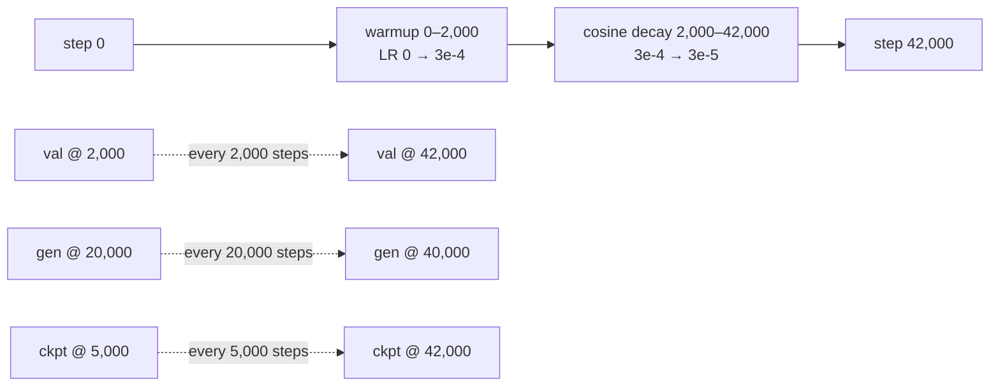

# Scaling and Metrics

> **Audience:** intermediate
> **Scope:** why this run is sized the way it is (42,000 steps, 8.26B tokens, ~515M params), what loss/perplexity curves are expected to look like, how validation and generation are measured, every metric W&B records, and how to benchmark the data pipeline.
> **Status:** no pretraining run has started yet (see `README.md` status banner). Everything about *actual curves* is therefore marked **expected** / `[INFERENCE]`; everything about *configuration, arithmetic, and code behavior* is verified against the working tree.

---

## The 60-second summary

Training a 513.8M-parameter LLaMA-3-style decoder on a single A100 80GB is a fixed-budget exercise. The schedule in `config.py:get_config` consumes `max_steps × batch_size × seq_len = 42,000 × 96 × 2048 = 8.26B` tokens against an 8B-token corpus, which is a deliberate near-Chinchilla ratio (~15.6 tokens per parameter; the 20/parameter guideline would want ~10.3B). Because 42,000 steps slightly exceeds one pass over the 95% train split (~38.6k steps), `train.py:_next_batch` wraps the sampler to a fresh permutation instead of crashing at `StopIteration`.

Progress is observed through three instruments, all logged to W&B: a training-step dict every 50 steps (loss, LR, grad norm, throughput, memory), a validation pass every 2,000 steps (EMA weights, up to 100 batches, cross-entropy + perplexity), and a generation sample every 20,000 steps (5 prompts, 128 tokens, top-k/top-p/temperature). The data pipeline itself can be measured in isolation with `benchmark_data.py:benchmark`. Because the run has not started, the loss/perplexity trajectory in this document is a theoretical power-law prediction to check against, not a measurement.

---

## Why this exists

A training run is only interpretable if three questions have explicit answers:

1. **How much data, and why that much?** Token budgets look arbitrary without a model. Scaling-law literature (Kaplan et al. 2020; Hoffmann et al. 2022) turns "how big should the run be?" into arithmetic: for a given parameter count there is a compute-optimal data budget, and the loss as a function of data/parameters follows a predictable power-law shape. This doc derives the budget for 513.8M parameters and gives the expected curve so a deviation is recognizable as a bug, not "training is slow."
2. **What does "it's working" mean?** With no human reading 8.26B tokens, we need cheap, deterministic, comparable signals: a held-out validation slice, a loss-to-perplexity conversion that is comparable across runs, and generated samples as a qualitative check.
3. **Is the pipeline fast enough?** A 196,608-token step must be delivered faster than the GPU can consume it, or the run becomes data-bound. `train/data_wait_ms` and `benchmark_data.py` exist to answer that.

The 42k-step / 8.26B-token / 8B-corpus mismatch specifically exists because the plan predates the corpus size: `max_steps` was set to hit ~8.26B tokens while `target_tokens` (the prepared corpus) is 8B. The fix was not to shrink the plan but to make the loader wrap (`train.py:_next_batch`), so the run completes its intended 8.26B-token trajectory with ~1.09 passes over the train split rather than dying at step ~38.6k. That decision is defensible: one extra epoch of 8B tokens is negligible re-observation, and a full second epoch would have changed the loss-vs-tokens curve interpretation.

---

## Intuition

**Token math is just dimensional analysis.** Every step the model sees one batch of 96 sequences, each 2,048 tokens long, and predicts each token given the previous ones: 96 × 2,048 = 196,608 predictions per step. Multiply by the number of steps and you get the total number of training examples seen. Nothing else about the model enters this arithmetic — it is a property of the schedule, not the network.

**Loss is measured in "surprise."** Cross-entropy is the average negative log-probability the model assigns to the correct next token. If the model were guessing uniformly among 128,000 vocabulary entries, every token would get probability $1/128{,}000$ and the loss would be $\ln 128{,}000 = 11.76$ nats. If the model were perfect, loss would be ~0. Real runs start near the uniform value and decay along a power law. Perplexity is just the loss re-expressed on a probability scale: $\mathrm{PPL} = e^{\mathrm{loss}}$ is the inverse geometric mean of the per-token probabilities — "the model is as surprised as if it were choosing uniformly among PPL options."

**Validation is a thermometer, not a training signal.** The model never trains on the validation slice; it only reads it every 2,000 steps to report how well it generalizes. Using EMA (moving-average) weights makes the reading steadier, because the averaged weights sit at the center of the recent optimizer trajectory instead of at its noisy end.

**The power-law shape.** When loss is plotted against tokens seen on log-log axes, pretraining curves are approximately straight lines over most of the run (loss decays polynomially, so a constant exponent appears as a constant slope). The curve is steep at the start (most of the "easy" structure of language is learned in the first few percent of data) and flattens toward a floor set by model size and data quality. Two straight segments of different slope, or a curve that goes *up*, are the signatures of a problem.

---

## Formal treatment

### 3.1 Token arithmetic at this project's scale

All values from `config.py:get_config` (verified):

| Quantity | Symbol | Value | Arithmetic |
|---|---|---|---|
| Steps | $S$ | 42,000 | `max_steps` |
| Batch | $B$ | 96 | `batch_size` |
| Sequence | $T$ | 2,048 | `seq_len` |
| Tokens/step | | 196,608 | $96 \times 2{,}048$ |
| **Tokens consumed** | $D_{\text{plan}}$ | **8,257,536,000** | $42{,}000 \times 96 \times 2{,}048$ |
| Corpus | $D_{\text{corpus}}$ | 8,000,000,000 | `target_tokens` |
| Val split | | 0.05 | `val_split` |
| Train corpus | $D_{\text{train}}$ | 7,600,000,000 | $8 \times 10^9 \times 0.95$ |

The loader (`data/shared_data/loader.py:PackedDataset`) reads the token buffer in **windows of `seq_len + 1 = 2,049`** raw tokens: window $i$ yields 2,048 inputs (tokens $i \cdot 2049 \ldots i \cdot 2049 + 2047$) and 2,048 targets (the same window shifted by one). So the *raw* consumption rate is $96 \times 2{,}049 = 196{,}704$ tokens/step, while the nominal logged rate (`train.py:train_model`, `tokens_per_step = config['batch_size'] * config['seq_len'] * grad_accum_steps`) is 196,608 labels/step. The 0.05% difference (1 in 2,049) is the overlap between adjacent windows and is why the two numbers never quite agree — harmless, but see §7.

**Epoch wrap arithmetic** (derived from config):

$$N_{\text{train windows}} = \left\lfloor \frac{D_{\text{train}}}{2049} \right\rfloor = \left\lfloor \frac{7.6 \times 10^9}{2049} \right\rfloor = 3{,}709{,}126$$

$$\text{steps per epoch} = \left\lfloor \frac{3{,}709{,}126}{96} \right\rfloor = 38{,}636 \quad (< 42{,}000)$$

The plan overshoots one epoch by $42{,}000 - 38{,}636 = 3{,}364$ steps — about 1.09 epochs of raw consumption. Without the wrap, the one-shot `DataLoader` would raise `StopIteration` at step 38,636 and the run would die ~8% short of its target. `train.py:_next_batch` catches that, bumps `epoch_state['epoch']`, and calls `train_dataloader.sampler.set_epoch(...)`, which reseeds `ShuffledRangeSampler` (`data/shared_data/loader.py:ShuffledRangeSampler.__iter__` uses `np.random.default_rng(self.seed + self.offset)`) so the second pass gets a *fresh permutation*, not a repeat of the first.

### 3.2 Chinchilla context: is 8B tokens the right budget?

Hoffmann et al. (2022, "Chinchilla") found that for compute-optimal training the data budget scales roughly linearly in parameters:

$$D_{\text{opt}} \approx 20 \times N$$

For this model, with $N$ verified at 513,840,128 parameters ($513.8$M; `model.py:Transformer.get_num_params`, confirmed by instantiating `model.py:build_transformer` with the config values):

| Run | Params | Tokens | Tokens/param | vs Chinchilla 20× |
|---|---|---|---|---|
| **LLaMA-3-Lite** | 513.8M | 8.0B | **15.6** | **0.78× (slightly data-starved)** |
| GPT-3 (175B) | 175B | 300B | 1.7 | 0.09× (massively under-trained) |
| Chinchilla reference | 70B | 1.4T | 20 | 1.0× (compute-optimal) |
| LLaMA-1 (7B) | 6.7B | 1.0T | ~143 | 7.2× (deliberately over-trained) |

Two readings of the 0.78× figure, both legitimate:

- **Compute-optimality:** the run is slightly below the 20/parameter guideline; the model will end marginally data-limited — its final loss will sit just above the parameter-limited floor $L(N)$ rather than at the combined floor.
- **Budget reality:** the schedule is what one A100 in ~2–3 days affords ($\approx 2.55 \times 10^{19}$ FLOPs; see §3.4). LLaMA-1's *inference-optimal* reasoning (train a smaller model longer because serving cost dominates) pulls in the opposite direction — at 8B tokens this project is closer to Chinchilla than to either extreme.

Because the model is slightly data-limited, the loss-vs-tokens curve should *not* be expected to fully plateau by step 42,000; the slope late in the run is a diagnostic of how much headroom remains.

### 3.3 Expected loss/perplexity trajectory (theoretical)

**Starting point (deterministic, not an estimate).** At initialization the model is effectively a uniform distribution over the 128,000-token vocabulary: $\text{loss}_0 = \ln V = \ln 128{,}000 = 11.76$ nats, $\text{PPL}_0 = 128{,}000$.

**Power-law shape (literature; `[INFERENCE]` for this run).** Kaplan et al. (2020) fit loss to parameter- and data-limited terms:

$$L(N) = \left(\frac{N_c}{N}\right)^{\alpha_N}, \qquad L(D) = \left(\frac{D_c}{D}\right)^{\alpha_D}, \qquad \frac{1}{L} = \frac{1}{L(N)} + \frac{1}{L(D)}$$

with fitted constants $N_c = 8.8 \times 10^{13}$, $D_c = 5.4 \times 10^{13}$, $\alpha_N = 0.076$, $\alpha_D = 0.095$ (log-log: $\log L \propto -\alpha \log X$, i.e. straight lines of slope $-\alpha$). At this project's scale:

$$L(N) = \left(\frac{8.8 \times 10^{13}}{5.138 \times 10^8}\right)^{0.076} \approx 2.50 \text{ nats}, \qquad L(D) = \left(\frac{5.4 \times 10^{13}}{8 \times 10^9}\right)^{0.095} \approx 2.31 \text{ nats}$$

$$\Rightarrow L_{\text{asymptote}} = \left(\frac{1}{2.50} + \frac{1}{2.31}\right)^{-1} \approx 1.20 \text{ nats}, \quad \mathrm{PPL}_{\text{asymptote}} \approx e^{1.20} \approx 3.3$$

Real runs converge toward, but rarely reach, the fitted asymptote within a fixed budget. A defensible *expectation band* for a 515M-parameter model after 8B tokens, based on published small-model curves, is a final validation loss of roughly **2.2–2.8 nats (PPL ≈ 9–16)** `[INFERENCE]` — i.e., far above the 3.3 floor, with the gap being "not enough parameters/data."

```mermaid
flowchart LR
    A["step 0<br/>loss = ln(128000) = 11.76 nats<br/>PPL = 128,000"] --> B["early: steep power-law drop<br/>first ~20% of tokens<br/>loss → ~3–5 nats [INFERENCE]"]
    B --> C["mid: near-log-linear decay on log-log axes<br/>slope ≈ −α_D [INFERENCE]"]
    C --> D["end of run (8.26B tokens)<br/>val loss ≈ 2.2–2.8 nats<br/>PPL ≈ 9–16 [INFERENCE]"]
    D -. asymptotic floor L ≈ 1.2 nats, PPL ≈ 3.3 .-> E["would need more params/data"]
```

**What a healthy W&B curve looks like.** A steep drop through warmup (steps 0–2,000, LR ramping 0 → 3e-4), then a long logarithmic grind; `val/loss` tracking `train/loss` with a small, roughly constant gap; `train/tokens_per_sec` flat or slowly rising as CUDA graphs amortize. Red flags: val loss rising while train falls (overfitting or distribution shift between the train slice and the held-out tail), loss stalling far above the band (LR/optimizer issue), or step time growing with step index (memory fragmentation, `gpu/memory_peak_mb` climbing).

### 3.4 Throughput and wall-clock expectations

The dense-transformer rule of thumb is $\approx 6ND$ FLOPs for training on $D$ tokens. At this scale:

$$6 \times 5.138 \times 10^8 \times 8.2575 \times 10^9 \approx 2.55 \times 10^{19} \text{ FLOPs}$$

On an A100 80GB (BF16 peak ≈ 312 TFLOPS, dense):

| MFU | Wall clock |
|---|---|
| 100% (impossible) | ~22.7 h |
| 45% (plausible with `torch.compile` + TF32/BF16 + FA2) | ~50 h |
| 35% (conservative) | ~65 h |

These are estimates `[INFERENCE]` — the run has not started — but they set expectations for `train/step_time_ms` (~4–6 s at 40–50k tokens/s) and for `train/tokens_per_sec` (~40–60k). If the measured throughput is far below this band, the bottleneck is likely the data pipeline (`train/data_wait_ms` large) or a low-MFU configuration issue, not the model.

### 3.5 Why perplexity = exp(loss)

Validation computes the mean cross-entropy over the validation slice:

$$\mathcal{L} = -\frac{1}{N}\sum_{i=1}^{N} \log p(x_i \mid x_{<i})$$

(here a sum over $N$ individual token predictions). Perplexity is defined as the inverse geometric mean of the per-token probabilities:

$$\mathrm{PPL} = \left(\prod_{i=1}^{N} p(x_i \mid x_{<i})\right)^{-1/N} = \exp\left(-\frac{1}{N}\sum_i \log p(x_i \mid x_{<i})\right) = e^{\mathcal{L}}$$

So the conversion is exact, not approximate — it is the same number in a friendlier unit ("the model is as surprised as if choosing uniformly among PPL symbols"). `train.py:validate` implements it as `perplexity = math.exp(min(avg_loss, 20))`; the `min(..., 20)` cap is an overflow guard (see §7).

---

## How the code realizes it

### 4.1 The schedule and the epoch wrap

The budget lives entirely in `config.py:get_config`: `max_steps = 42000`, `batch_size = 96`, `seq_len = 2048`, `gradient_accumulation = 1` (no accumulation — effective batch = 96), `target_tokens = 8_000_000_000`, `val_split = 0.05`, `val_interval = 2000`, `val_max_batches = 100`, `generation_interval = 20000`, `generation_max_tokens = 128`, `generation_temperature = 0.8`, `generation_top_k = 50`, `log_interval = 50`.

`train.py:_next_batch` is the wrap point:

```python
# illustrative — structure from train.py:_next_batch
def _next_batch(step_iterator, train_dataloader, epoch_state):
    try:
        return next(step_iterator)
    except StopIteration:
        epoch_state['epoch'] += 1
        if hasattr(train_dataloader.sampler, 'set_epoch'):
            train_dataloader.sampler.set_epoch(epoch_state['epoch'])
        return next(iter(train_dataloader))
```

`ShuffledRangeSampler.set_epoch` sets `offset = epoch`, and `__iter__` builds `np.random.default_rng(seed + offset)` — so epoch 2 is a new permutation of the same windows, reproducibly (same seed → same order; see `reproducibility.md`). Note the wrap only reseeds the sampler on the first `StopIteration`; `train.py:train_model` drives it from a single persistent `step_iterator`.

The timeline, from config:



The LR schedule (warmup `LinearLR` then `CosineAnnealingLR` inside `SequentialLR`, constructed in `train.py:train_model`) is documented in theory in `optimization.md`; its only role here is that it shapes the expected loss curve — expect the steepest loss improvement while LR is high (first ~20% of the run), and a shallower, noisier decay as LR approaches `min_lr = 3e-5`.

### 4.2 Validation methodology

`train.py:validate` runs, per validation point:

1. Every `val_interval = 2000` steps (`step > 0 and step % config['val_interval'] == 0`), from `train.py:train_model`.
2. On the **EMA weights when `use_ema` is on** (`validate(ema, ...)`), because the EMA shadow is the noise-free center of the recent trajectory — the model state you would actually ship.
3. Over the held-out **tail 5%** of the corpus: `data/shared_data/loader.py:build_training_data` computes `split = int(n_total * (1.0 - val_split))`, rounds down to a window multiple, and hands `tokens[:split]` to train and `tokens[split:]` to validation. The validation `DataLoader` uses `shuffle=False`, so the same batches are re-read at every checkpoint — val/loss is comparable across time by construction.
4. For at most `val_max_batches = 100` batches: `hidden = model(input_ids, return_hidden=True)`, then `model.py:chunked_head_cross_entropy_with_z(hidden, _head_weight(model), targets, chunk_size=ce_chunk_size, ignore_index=ignore_index, z_loss_weight=z_loss_weight)` — the same loss path as training, never materializing full logits (see `loss-functions.md` and `memory-engineering.md`). `_head_weight` (`train.py:_head_weight`) resolves the LM head through the EMA/compile wrapper.
5. Averages the per-batch losses and logs `val/loss` + `val/perplexity = exp(min(avg_loss, 20))` at the current step, then returns `avg_loss` to the caller, which updates `best_val_loss` (used for checkpoint bookkeeping).

Coverage per validation point: $100 \times 96 \times 2{,}048 = 19{,}660{,}800$ tokens ≈ 0.25% of the corpus, 21 points across the run. Because the val dataloader is contiguous and deterministic, each point evaluates the *same* slice — the curve you plot is pure model improvement, not re-sampling noise.

Two honest caveats about what `val/loss` contains:

- It includes the **z-loss term** (`z_loss_weight = 1e-4`, `use_z_loss = True`). With per-position $\log\sum\exp(z)$ typically in the 5–10 range, z-loss contributes roughly $1e-4 \times (25\ldots 100) \approx 0.0025$–$0.01$ nats — small, but it means `exp(val/loss)` is a *slight overestimate* of the pure-CE perplexity. The bias is constant across checkpoints, so trend-reading is unaffected.
- `ignore_index = -100` is passed in (`train.py:train_model`): the pipeline has no padding, so nothing is ignored in practice; -100 merely keeps EOS separators learnable. Validation covers every token in the slice.

### 4.3 Generation cadence

Every `generation_interval = 20000` steps (`train.py:generate_samples`, again on EMA weights when present), the trainer:

1. Switches to eval mode and runs 5 fixed prompts — 2 prose (`"The history of artificial intelligence began in the"`, `"In a surprising discovery, researchers found that"`) and 3 code (a `fibonacci` docstring, a `BinaryTree` class, an `numpy` function) — chosen to exercise both prose and code modes of the mixture.
2. Autoregressively decodes up to `generation_max_tokens = 128` tokens, stopping early if EOS is sampled.
3. Samples with `train.py:top_k_top_p_sampling(logits[:, -1, :], config['generation_top_k'], top_p=0.9, temperature=config['generation_temperature'])`: divide logits by temperature 0.8, hard-mask everything outside top-k 50, hard-mask the cumulative-probability tail beyond top-p 0.9, then `torch.multinomial`. Note `top_p=0.9` is hard-coded at the call site — only top-k and temperature are config keys.
4. Logs a `wandb.Table` under `gen/samples` (columns: prompt, generated, step).

Generation is qualitative: it is not a metric, but it is the fastest way to *see* memorization vs generalization, mode collapse into a few tokens, or a broken tokenizer (the byte stub in `data/shared_data/loader.py:build_synthetic_data` decodes bytes directly — samples from a synthetic run are expected to be garbage by design).

### 4.4 The W&B metrics reference

`train.py:train_model` initializes a run (`wandb.init`) named `llama3-515M-<device>-<ts>` in project `langgpt-llama3-pretrain` with the hyperparameters baked into the run config, and logs the following keys. Train/gpu keys are logged every `log_interval = 50` steps; val keys every 2,000; gen keys every 20,000.

| Key | Cadence | Definition (from code) | What it tells you |
|---|---|---|---|
| `train/loss` | 50 | `loss.item() * grad_accum_steps` (includes z-loss; =1 accumulation here) | Instantaneous training loss; noisy — smooth it or compare against val |
| `train/lr` | 50 | `scheduler.get_last_lr()[0]` | Confirms warmup/cosine shape; sanity-check vs config |
| `train/grad_norm` | 50 | global grad norm returned by `clip_grad_norm_(..., max_norm=1.0)` | Spikes >1.0 are clipped; sustained ~1.0 means clipping is active (LR too high?) |
| `train/step_time_ms` | 50 | wall clock per loop iteration (includes the next batch's fetch) | Perf; expect ~4–6 s at batch 96 on A100 `[INFERENCE]` |
| `train/tokens_per_sec` | 50 | `tokens_per_step / step_time` | Throughput; ~40–60k tok/s expected `[INFERENCE]` |
| `train/tokens_seen` | 50 | `step * tokens_per_step` (196,608/step) | Progress in data units; x-axis for power-law plots |
| `train/effective_batch_size` | 50 | `batch_size * grad_accum_steps` (=96) | Constant here; matters only if accumulation is used |
| `train/data_wait_ms` | 50 | cumulative loader-fetch time since last log, then reset | Pipeline bound? If large relative to step time, tune `num_workers`/`prefetch_factor` |
| `gpu/memory_used_mb` | 50 (CUDA) | `torch.cuda.memory_allocated()` | Live tensor memory |
| `gpu/memory_peak_mb` | 50 (CUDA) | `torch.cuda.max_memory_allocated()` since last reset | Peak; **reset every 2,000 steps** right before validation, so it is a per-segment peak |
| `gpu/memory_reserved_mb` | 50 (CUDA) | `torch.cuda.memory_reserved()` | Allocator pool size; gap vs `used` is fragmentation/caching |
| `gpu/utilization_pct` | 50 (CUDA) | `torch.cuda.utilization()` (SM-busy %) | 0% at val/generation gaps is normal; sustained <30% during training ⇒ bottleneck elsewhere |
| `val/loss` | 2,000 | mean chunked-head CE + z-loss over ≤100 batches, EMA weights | The headline number; compare against the §3.3 band |
| `val/perplexity` | 2,000 | `exp(min(avg_loss, 20))` | Human-scale version of val/loss |
| `gen/samples` | 20,000 | W&B table (prompt, generated, step) | Qualitative check |

Reading guide: `train/loss` is a high-frequency noisy signal, `val/loss` is the low-frequency truth; `tokens_seen` (not steps) is the correct x-axis for scaling-law analysis because step-based x-axes distort curves after resumption or accumulation changes; `gpu/memory_peak_mb` should stay comfortably under 80 GB — if it approaches ~72 GB, lower `batch_size` or `ce_chunk_size` (see `memory-engineering.md`).

### 4.5 The data-pipeline benchmark

`benchmark_data.py:benchmark(steps, batch_size, seq_len, vocab_size, num_workers, prefetch_factor, pin_memory, device, with_model_forward)` isolates the loader from the GPU: it builds a synthetic uint32 buffer of BOS..EOS documents (`benchmark_data.py:build_benchmark_buffer`), wraps it in `PackedDataset` + `ShuffledRangeSampler` + the real `collate_fn`, and times `steps` iterations with the exact production loader settings (`num_workers=6`, `prefetch_factor=16`, `pin_memory`, `persistent_workers`). With `--with_model_forward` it also runs a tiny 2-layer proxy model forward per step to include the device-transfer + launch overhead.

It returns, per step: `tokens_per_step`, `total_tokens`, `total_time_s`, `tokens_per_sec`, `mean_step_ms`, `p50_step_ms`, `p99_step_ms` (p99 is the real signal — a loader that stutters once in a while destroys step-time predictability on the GPU), plus the settings.

```bash
python benchmark_data.py --steps 50 --batch_size 96 --seq_len 2048 \
    --num_workers 6 --prefetch_factor 16 --pin_memory --json
```

Use it to answer: *can the pipeline feed 196,608 tokens/step faster than the GPU consumes them?* If `p99_step_ms` is small relative to the training `train/step_time_ms`, the pipeline is not the bottleneck; if `train/data_wait_ms` grows during real training, re-run the benchmark with different `num_workers`/`prefetch_factor` before touching anything else.

---

## Edge cases & pitfalls

- **`StopIteration` at step ~38.6k.** The one-shot dataloader exhausts the 95% train split before step 42,000. Without the `train.py:_next_batch` wrap this crashes the run ~8% early — this was the defect the wrap fixed. Do not "fix" it by shrinking `max_steps` to 38,636 unless the intent is to train exactly one epoch; the wrap is the intended behavior.
- **Perplexity overflow guard.** `exp(min(avg_loss, 20))` caps PPL at $e^{20} \approx 4.85 \times 10^8$. Early in training loss is ~11.8 nats so the cap is idle, but a pathological batch (or a resumed run with a corrupted checkpoint) can produce huge losses; without the cap, `math.exp` overflows to `inf` and W&B records garbage.
- **`tokens_seen` vs raw tokens.** The logged `train/tokens_seen = step × 196,608` counts *labels*, while the corpus actually advances by 196,704 raw tokens/step (2,049-window overlap). Over 42,000 steps the discrepancy is $42{,}000 \times 96 = 4{,}032{,}000$ tokens ≈ 0.05% — invisible on a loss plot, but do not use `tokens_seen` for exact corpus-position accounting.
- **val/loss is EMA-weights loss; train/loss is live-weights loss.** The gap between them is not a pure overfitting measure. Comparing like with like requires both to come from the same weight state; treat "val − train" as a loose upper bound on generalization gap.
- **val/loss includes z-loss.** `exp(val/loss)` is a slight overestimate of pure-CE perplexity (≈0.0025–0.01 nats at `z_loss_weight=1e-4` `[INFERENCE]`). Constant across the run, so trends are unaffected — but don't compare this PPL digit-for-digit with a run that disables z-loss (`use_z_loss = False`).
- **Memory metrics have reset semantics.** `gpu/memory_peak_mb` is `max_memory_allocated` since the last `torch.cuda.reset_peak_memory_stats()`, which happens every 2,000 steps; the peak is per-segment, not run-total. The run-total peak lives in the final checkpoint-time printout.
- **Synthetic-data fallback produces meaningless curves.** Without a token cache, `train.py:train_model` falls back to `data/shared_data/loader.py:build_synthetic_data` (random ids, byte-stub tokenizer). Loss *will* drop (the model can memorize random structure), but no power-law interpretation applies and `gen/samples` is byte-garbage. The status banner in `README.md` is explicit: the 8.25B-token run has not started. Run `benchmark_data.py` for pipeline numbers; use `data/prepare_data.py` + `build_training_data` for real curves.
- **Comparing PPL across runs/tokenizers.** PPL is only meaningful against the same vocabulary and mixture. This model's `vocab_size = 128{,}000` (LLaMA-3 tokenizer, `NousResearch/Meta-Llama-3-8B`); a 32k-vocab model's PPL is not comparable even at the same loss-to-data ratio.
- **Per-step timing includes data fetch.** `train/step_time_ms` brackets the whole iteration including the prefetch of the *next* batch, so a slow loader inflates step time directly. Cross-check with `train/data_wait_ms` and the standalone benchmark before blaming the GPU.

---

## Further reading

- `data-engineering.md` — the corpus mixture, document packing (EOS separators, 2,049-token windows), dedup, and the memmap layout behind `target_tokens`.
- `loss-functions.md` — chunked-head CE + z-loss, the exact objective whose average becomes `val/loss`.
- `optimization.md` — the warmup/cosine schedule that shapes the expected loss trajectory.
- `memory-engineering.md` — the memory stack that makes batch 96 / 196,608 tokens per step fit on one A100; `memory-stack.md` is the one-page summary.
- `reproducibility.md` — seed/offset determinism of `ShuffledRangeSampler`, checkpoint RNG restore.
- `transformers-from-scratch.md` — what the model is predicting (next-token distribution over 128k vocabulary).
- Reference: `config.md` (every key), `training.md` (loop walkthrough), `data.md` (loader tour), `memory-stack.md` (the 92→20 GB table).
