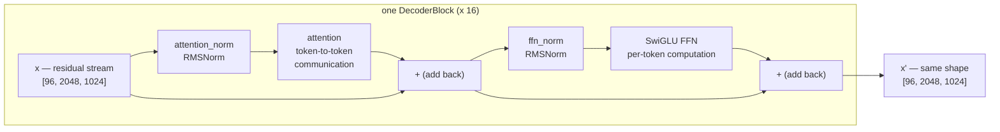
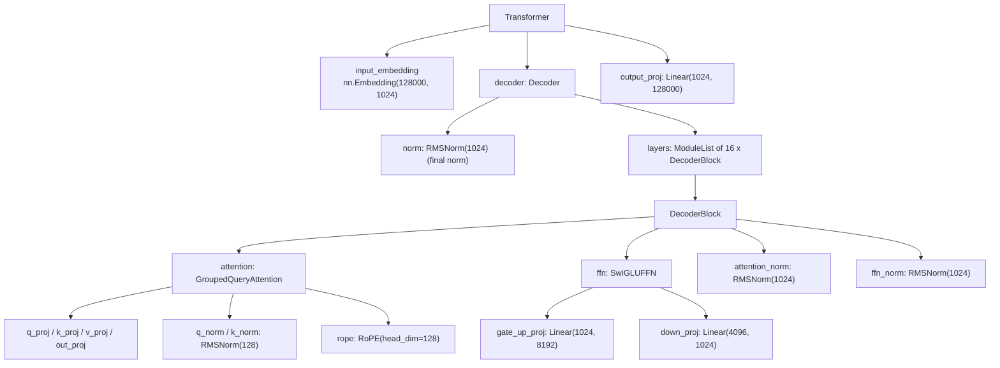
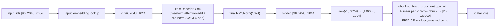

# Transformers from Scratch: The LLaMA-3-Lite Architecture, End to End

> Audience: beginner → intermediate. Assumes Python, basic PyTorch tensors, and the idea of a probability distribution over words. Everything else — attention, normalization, position encodings, loss functions — is built up from first principles here or in the sibling theory docs.

---

## Table of Contents

1. [The 60-Second Summary](#1-the-60-second-summary)
2. [The Language-Modeling Task](#2-the-language-modeling-task)
3. [Why Decoder-Only? The Sequence-to-Sequence Origin](#3-why-decoder-only-the-sequence-to-sequence-origin)
4. [Intuition: The Residual Stream](#4-intuition-the-residual-stream)
5. [Formal Treatment](#5-formal-treatment)
6. [How the Code Realizes It](#6-how-the-code-realizes-it)
7. [Edge Cases & Pitfalls](#7-edge-cases--pitfalls)
8. [Further Reading](#8-further-reading)

---

## 1. The 60-Second Summary

A transformer language model is a function that reads a sequence of token IDs and outputs a probability distribution over "what comes next." LLaMA-3-Lite is a **decoder-only** transformer: one stack of 16 identical blocks that reads a prefix of up to 2,048 tokens and predicts the next token at every position at once. Each block is a residual refinement step: it reads the current hidden state, computes an attention update and a feed-forward update, and **adds** them back (`x = x + block(x)`), so information flows through the network along an unbroken identity path. The model never sees the whole corpus at once — it is trained to maximize the log-probability of each token given only the tokens before it. At this project's scale the data flow is: token IDs `[96, 2048]` → embedding lookup → `[96, 2048, 1024]` hidden states → 16 blocks → one final normalization → a learned "LM head" that scores all 128,000 vocabulary entries per position → cross-entropy loss, computed in memory-bounded chunks. The whole thing has 513.8M parameters, of which 251.7M live in the 16 blocks and the other 262.1M are the two vocabulary-sized embedding tables.

---

## 2. Why This Exists

### 2.1 The task: predict the next token

Natural language is a sequence of discrete symbols. A language model turns that sequence into a probability distribution. Write a sequence of tokens as

$$t_1, t_2, \dots, t_n$$

where each $t_i$ is an integer in $\{0, 1, \dots, V-1\}$ and $V$ is the vocabulary size. The joint probability of the whole sequence factorizes by the chain rule of probability:

$$p(t_1, \dots, t_n) = \prod_{i=1}^{n} p(t_i \mid t_1, \dots, t_{i-1}).$$

Nothing is assumed about the conditional distributions — this factorization is exact for any distribution over sequences. The modeling problem is therefore: *learn one conditional distribution per position*, $p(t_i \mid t_{<i})$. The model takes the prefix $t_{<i}$ and outputs a vector of $V$ scores (logits) that are turned into a probability distribution by softmax:

$$p(t_i = v \mid t_{<i}) = \frac{\exp(z_v)}{\sum_{j=0}^{V-1} \exp(z_j)},$$

where $z \in \mathbb{R}^V$ is the logit vector for position $i$.

Two consequences of this formulation matter enormously:

1. **It is self-supervised.** Any text corpus gives labels for free: for each position $i$, the "answer" is the observed token $t_i$. No human annotation, no labels beyond the text itself.
2. **Generation is just iterated prediction.** To generate, sample $\hat{t}_{n+1} \sim p(\cdot \mid t_{1..n})$, append it, and repeat. Because the model only ever conditions on the *past*, the training objective and the generation-time behavior are the same operation. This is the deep reason language models are trained with a next-token objective rather than, say, a reconstruction objective.

### 2.2 The training signal, concretely

During training the model sees a window of $S = 2048$ tokens and produces one logit vector per position. The target for position $i$ is the token at position $i+1$ — the *next* token. The data pipeline builds this shift for us: `data/shared_data/loader.py:PackedDataset.__getitem__` slices a window of `seq_len + 1` tokens and returns `window[:-1]` as the inputs and `window[1:]` as the targets. Training maximizes

$$\mathcal{L}_{\text{CE}} = -\frac{1}{N} \sum_{i} \log p(t_{i+1} \mid t_{\le i}),$$

i.e. mean per-token cross-entropy, summed over all positions in the batch. At this project's scale, one training step consumes a batch of 96 windows of 2,048 tokens — $96 \times 2048 = 196{,}608$ tokens per step — and the planned 42,000 steps consume $196{,}608 \times 42{,}000 = 8.26$ billion tokens. That number matters because it sits in the range where a ~0.5B-parameter model is compute-matched to its data (see [scaling-and-metrics.md](scaling-and-metrics.md)).

A useful way to read the loss: minimizing cross-entropy is equivalent to maximizing the probability the model assigns to the real continuation. If the model is perfect, the loss is 0 (it assigns probability 1 to the true next token); a uniform random guess over 128,000 tokens gives $\ln(128{,}000) \approx 11.76$ nats. Training moves the loss from somewhere near that ceiling down toward the irreducible entropy of natural text. The model's quality is often quoted as **perplexity**, $\exp(\mathcal{L})$, which reads as "the model's average branching factor per token."

### 2.3 Why next-token prediction is enough

It is worth being explicit about a subtlety: the model is trained to predict *one* token ahead, yet it is expected to learn syntax, facts, and reasoning. The mechanism is that each conditional $p(t_i \mid t_{<i})$ must implicitly summarize the entire prefix — grammar constrains the next word, semantics constrain it further, and long-range patterns (coreference, argument structure) require the model to have tracked them across thousands of tokens. Predicting the next token is a cheap-to-evaluate probe that forces the model to build exactly this summary, because the summary is what the prediction must be conditioned on. This is why the hidden state after reading a prefix is a useful "representation" of it, and why the model's internals are worth studying — they are the machinery that maintains that summary.

---

## 3. Why Decoder-Only? The Sequence-to-Sequence Origin

### 3.1 The original transformer was an encoder-decoder

The 2017 transformer was invented for **sequence-to-sequence** tasks such as machine translation, where the input (a French sentence) and the output (an English sentence) are different sequences. The architecture therefore had three parts:

- an **encoder** that reads the *entire* source sequence with *bidirectional* self-attention — every source position may attend to every other source position, because the source is fully known;
- a **decoder** that generates the target one token at a time, using *causal* self-attention over the target prefix (each target position may attend only to earlier target positions, so the future cannot leak into the prediction) plus **cross-attention** that queries the encoder's final representation;
- a learned mapping (the head) from decoder hidden states to vocabulary scores.

The encoder-decoder split encodes a structural fact: the *source* is fully observed and can be summarized with bidirectional context, while the *target* is produced left-to-right and must respect causality.

### 3.2 Language modeling collapses the two sides

Now consider plain language modeling. The "source" and "target" are the **same text**: the model's job is to continue a prefix. There is no separate input sentence to summarize — the conditioning context *is* the prefix the model has already generated (or read from the corpus). That observation dissolves the encoder-decoder split:

- **Bidirectional context is unavailable by construction.** The future tokens do not exist at prediction time. Causal masking is not a limitation imposed on language modeling; it is the correct statement of the task.
- **Cross-attention is unnecessary.** In translation, cross-attention tells the decoder "the source sentence is done, here is its summary." In language modeling, the prefix is itself the thing to attend to. A causal self-attention stack already conditions every position on every earlier position.
- **One stack suffices for both "reading" and "writing."** The same layers that processed the corpus prefix during training process the generated prefix during sampling. There is no separate encoder to run at generation time.

So the decoder-only architecture — a single causal stack with no cross-attention — is not a simplification that sacrifices capability; it is the *exact* minimal structure that implements next-token prediction. This is the design lineage of GPT and LLaMA.

In LLaMA-3-Lite the absence of an encoder is visible directly in the code: `model.py:DecoderBlock` contains exactly three things — a `GroupedQueryAttention` (causal self-attention), a `SwiGLUFFN`, and two normalization layers. There is no encoder, no cross-attention module, and no attention mask argument at all: causality comes from `is_causal=True` inside the attention call (see [attention.md](attention.md)).

### 3.3 The decoder-only residual payoff

Dropping the encoder also halves the memory and compute footprint of every "reading" pass: the model never needs to run a second network over the input or store its activations for cross-attention. The remaining stack is the largest single consumer of FLOPs, and it is shared between the training forward pass and every generation step.

---

## 4. Intuition: The Residual Stream

### 4.1 A blackboard, not a pipeline

The classic way to picture a neural network is a pipeline: data flows in one end, gets transformed at each layer, and comes out the other end. A transformer with residual connections is better pictured as a **shared blackboard** (the "residual stream"). The hidden state $x$ is a board of $B \times S$ rows, each row a vector in $\mathbb{R}^{1024}$ holding the current "working notes" for one token position. Each block is an expert that:

1. reads the board,
2. computes an update — a small *delta* — from what it read,
3. **adds** the delta to the board, and leaves the board in place for the next block.

The update rule is exactly

$$x \leftarrow x + \text{block}(x).$$

Nothing is ever overwritten destructively; information only ever accumulates. That single design decision is what makes transformers trainable at 16 layers deep (see §5.2).

### 4.2 Two kinds of updates

The two sub-blocks inside each `model.py:DecoderBlock` do two different kinds of work:

- **Attention** (the "communication" update): each position looks at every earlier position, gathers relevant information, and writes a summary of what it found back to its own row. This is how information moves *between* tokens — a pronoun can "look at" its antecedent four hundred tokens back, a code token can attend to the function definition that names it.
- **Feed-forward** (the "computation" update): each row is processed *independently* through a wide two-layer network with a nonlinearity. No cross-token communication happens here; the FFN is where the model "thinks" about what it currently knows — pattern matching, arithmetic-like manipulation, recall of facts — one token at a time.

The alternation is deliberate and repeated 16 times: communicate, compute; communicate, compute. Each round of communication+computation is one "refinement step" of the board, and each block's delta is small enough (in practice) that the board evolves smoothly across the depth of the network rather than being overwritten.



### 4.3 A worked toy example

Suppose a 3-token prefix `["the", "cat", "sat"]` is embedded as three 1024-dimension vectors. After the first block's attention, the vector for "sat" contains a blend of "sat" plus gathered context about "cat" (the subject). After the first FFN, that blended vector is transformed nonlinearly into a slightly more "prediction-ready" vector — closer to whatever the model believes follows "the cat sat". The next block repeats: attention lets "sat" also gather information from "the" (e.g. that the noun phrase started at position 0), and the FFN further refines. After 16 rounds, the final vector for the last position is the model's complete summary of "the cat sat" as evidence for predicting the next token. Note the shape never changes: in, `[96, 2048, 1024]`; out, `[96, 2048, 1024]`. Depth buys *refinement*, not *growth* — the model is free to use as much or as little of the 1024 dimensions per token as the task needs.

### 4.4 What the residual stream buys you, concretely

- **A clean gradient highway.** The identity path `x = x + block(x)` means the gradient of the loss with respect to early layers has a term that flows through the blocks *without ever passing through a weight matrix or nonlinearity*. Deep stacks stay trainable.
- **Interpretability.** Since each block adds a delta, you can inspect "what did block 5 contribute to this prediction" — the deltas are directly additive.
- **Weight sharing across depth is not needed.** Each of the 16 blocks has its own parameters, but the *interface* is identical, so the blocks are interchangeable modules from the code's perspective — which is exactly how `model.py:Transformer.__init__` builds them, in a list comprehension over `n_layers`.

---

## 5. Formal Treatment

### 5.1 The block equations

Let $B$ = batch size, $S$ = sequence length, $d = d_{\text{model}} = 1024$, $L = 16$ layers, $V = 128{,}000$ vocabulary entries. The model is:

$$x_0 = \text{Embed}(t_{1..S}) \in \mathbb{R}^{B \times S \times d},$$

$$x_{\ell+1} = x_\ell + \text{Attn}\big(\text{RMSNorm}_a(x_\ell)\big) + \text{SwiGLU}\big(\text{RMSNorm}_f(x'_\ell)\big),$$

where the attention and FFN updates are applied as two separate residual adds inside each block (see `model.py:DecoderBlock.forward`), and

$$x_{\text{out}} = \text{RMSNorm}_{\text{final}}(x_L),$$

$$\text{logits} = x_{\text{out}}\, W_{\text{head}}^{\top} \in \mathbb{R}^{B \times S \times V}.$$

The attention sub-block (detail in [attention.md](attention.md)) is scaled dot-product attention with causal masking:

$$\text{Attn}(x) = \text{softmax}\left(\frac{QK^{\top}}{\sqrt{d_h}} + \text{mask}\right) V \, W_{\text{out}}, \qquad Q = xW_q,\; K = xW_k,\; V = xW_v,$$

with $d_h = 128$ the per-head dimension, 8 query heads, and 4 KV heads (grouped-query attention: each KV head is shared by 2 query heads, $n\_rep = 8/4 = 2$). The mask is a causal one — position $i$ may only attend to $j \le i$.

The SwiGLU sub-block (detail in [feedforward.md](feedforward.md)) is:

$$\text{SwiGLU}(x) = \big(\text{SiLU}(x W_g) \odot (x W_u)\big) W_{\text{down}},$$

where $\odot$ is elementwise multiplication and $W_g, W_u$ are stacked into a single fused `gate_up_proj` of width $2 d_{\text{ff}} = 8192$ in the code.

### 5.2 Pre-norm vs post-norm

There are two places a normalization layer can sit relative to a residual update:

- **Post-norm** (the original 2017 transformer): `y = Norm(x + Sublayer(x))`. The normalization is applied *after* the addition, so the residual path itself passes through the norm. The gradient of the loss with respect to a deep layer's input must multiply through the norms of all later layers. With 16 stacked blocks, the effective learning rate of early layers is controlled by the product of these norm scales, which in practice makes deep post-norm stacks finicky to train.
- **Pre-norm** (GPT, LLaMA): `y = x + Sublayer(Norm(x))`. The normalization is applied to the *input* of the sublayer only; the residual identity path `x` is untouched. The gradient of the loss with respect to $x_0$ then contains a term that is literally the identity — `dL/dx_L` passed back unchanged through all 16 blocks — so early layers receive a strong, stable gradient signal regardless of depth.

LLaMA-3-Lite is pre-norm throughout, and you can read the placement directly off the code:

```python
# illustrative
# model.py:DecoderBlock.forward
def forward(self, x):
    x = x + self.attention(self.attention_norm(x))
    x = x + self.ffn(self.ffn_norm(x))
    return x
```

The norm is a `model.py:RMSNorm` — a scale-only variant of LayerNorm that skips mean subtraction (see [normalization.md](normalization.md)):

$$\text{RMSNorm}(x) = \frac{x}{\sqrt{\frac{1}{d}\sum_j x_j^2 + \epsilon}} \odot \gamma,$$

with $\epsilon = 10^{-5}$ and a learned per-dimension gain $\gamma \in \mathbb{R}^{1024}$. The final normalization after the last block (`model.py:Decoder.forward`) is the *same* pre-norm logic applied once more: the output of the 16th block passes through one last RMSNorm before the LM head, so the head always reads a stably-scaled representation.

### 5.3 Tokenization → embedding

The model never sees characters or bytes directly; it sees integers. **Tokenization** is the fixed, learned-before-training mapping from text to integers (see [tokenizer.md](../reference/tokenizer.md) for this repo's pipeline). LLaMA-3-Lite's vocabulary has $V = 128{,}000$ entries (`config.py:get_config` → `vocab_size: 128000`), which comfortably covers multi-byte UTF-8, common subwords, and frequent punctuation.

The first learned layer is a lookup table:

$$x_0[i] = E[t_i], \qquad E \in \mathbb{R}^{128{,}000 \times 1024}.$$

`model.py:Transformer.__init__` creates this as `nn.Embedding(vocab_size, d_model)` — a table of 128,000 rows, each a 1024-dimensional learned vector. The lookup is a pure gather: row `t_i` is copied into position $i$ of the hidden state. For a batch of 96 sequences of 2,048 tokens this produces the tensor $[96, 2048, 1024]$ — the first time the $[B, S, d]$ shape appears.

Two things are deliberately *absent* here:

- **No positional embedding is added at the input.** The classic GPT-style architecture adds learned position vectors; LLaMA instead injects position information *inside* attention, by rotating queries and keys with **RoPE** (`model.py:RoPE`) before the dot product (see [positional-encoding.md](positional-encoding.md) and [rope.md](../reference/rope.md)). The embedding output is pure content.
- **The embedding is not normalized.** The first `attention_norm` inside block 0 is the first normalization the vectors see.

The embedding table is a large parameter sink: $128{,}000 \times 1024 = 131{,}072{,}000$ parameters — 131.1M — which is 25.5% of the entire model. And there are *two* such tables, because (unlike some older GPT models) the output head is **not weight-tied** to the input embedding: the model keeps separate `input_embedding` and `output_proj` weights. The two tables together are 262.1M parameters — more than the entire 16-block stack. This is the "embeddings dominate a small model" phenomenon: at 0.5B scale the vocabulary is a first-class citizen of the budget (see §5.6 for the full table).

### 5.4 The stack of blocks

The embedding output $[96, 2048, 1024]$ enters `model.py:Decoder`, which runs the 16 `model.py:DecoderBlock`s in sequence and applies the final norm. Every block preserves the shape:

$$[96, 2048, 1024] \xrightarrow{\text{block } \ell} [96, 2048, 1024].$$

Per block, the tensor work is: two RMSNorms (each a reduction over the last axis, $1024$ floats per row), one multi-head attention pass (projections in and out of $1024$ dimensions, plus the attention score computation described in [attention.md](attention.md)), and one SwiGLU pass (expand to $8192$, gate, compress back to $1024$; see [feedforward.md](feedforward.md)).

If we count the per-block parameters once (derived in full in §5.6): attention projections 3,145,728, QK-norm gains 256, SwiGLU 12,582,912, block norms 2,048 — **15,730,944 per block**, 16 blocks = 251,695,104. The stack of blocks, plus the final norm's 1,024 gains, is the entire **non-embedding** parameter budget: 251,696,128, i.e. 251.7M.

### 5.5 The LM head and the loss

After the final norm, the model must turn each of the $S$ row vectors into a distribution over $V = 128{,}000$ tokens. The **LM head** is a learned linear map, shared across all positions:

$$z = x_{\text{out}} W_{\text{head}}^{\top}, \qquad W_{\text{head}} \in \mathbb{R}^{128{,}000 \times 1024}.$$

In the code this is the `output_proj` head created in `model.py:Transformer.__init__` — `nn.Linear(d_model, vocab_size, bias=False)` — a matrix with $128{,}000 \times 1024 = 131{,}072{,}000$ parameters, the second 131.1M vocabulary-sized table.

**This is the moment where memory becomes the design constraint.** Flattening the batch, the head produces

$$N = B \times S = 96 \times 2048 = 196{,}608 \text{ rows},$$

so the full logits tensor is $[196{,}608, 128{,}000]$ — 25.17 billion entries. In BF16 that is $25{,}165{,}824{,}000 \times 2$ bytes $= 50.3$ GB; in FP32, 100.7 GB. Neither fits on the 80 GB A100 once the model weights, gradients, and activations are also resident. The code therefore never materializes the full logits in training. `model.py:Transformer.forward` has a `return_hidden: bool = False` flag: when `True` it returns the `[96, 2048, 1024]` hidden states and skips the head, and the loss function `model.py:chunked_head_cross_entropy_with_z` computes `hidden @ W_head.T` in slices of `chunk_size = 256` rows (see §6.6). A single slice is $[256, 128{,}000]$ in FP32 — $256 \times 128{,}000 \times 4$ bytes $= 131$ MB — and only one slice is alive at a time because each slice's math runs inside a gradient-checkpoint boundary.

The loss is cross-entropy plus a small **z-loss** regularizer (PaLM/Gemma2 style):

$$\mathcal{L} = \underbrace{-\frac{1}{N}\sum_i \log p(t_{i+1} \mid t_{\le i})}_{\text{CE}} + z_{\text{weight}} \cdot \underbrace{\frac{1}{N_z}\sum_{i \in \text{valid}} \left(\log \sum_v e^{z_{i,v}}\right)^2}_{\text{z-loss}},$$

with `z_loss_weight = 1e-4` (`config.py:get_config`). The z-loss penalizes the log-partition function $\log \sum_v e^{z_v}$ — a measure of how "spread out" the logits are — which prevents the model's logits from drifting to ever-larger magnitudes late in training (see [loss-functions.md](loss-functions.md) for the full treatment, including why the training path masks ignored positions with `ignore_index=-100`: this pipeline packs documents with no padding, so in principle nothing is ignored, and `-100` exists to keep EOS-separator tokens learnable).

### 5.6 The parameter anatomy (the budget, derived)

Every number below is computed from the shapes in `model.py` and the hyperparameters in `config.py:get_config`, and the totals were verified by building the model (`model.py:build_transformer` prints them; `model.py:Transformer.get_num_params` computes the non-embedding split). Vocabulary $V = 128{,}000$, $d = 1024$, $d_{\text{ff}} = 4096$, 8 query heads, 4 KV heads, `head_dim = 128`.

| Component | Weight shape(s) | Derivation | Params |
|---|---|---|---|
| input_embedding | $[128000, 1024]$ | $128{,}000 \times 1024$ | 131,072,000 |
| — per block, attention: q_proj | $[1024, 1024]$ | $d \times (n\_heads \cdot d_h) = 1024 \times 1024$ | 1,048,576 |
| k_proj | $[512, 1024]$ | $1024 \times (4 \cdot 128) = 1024 \times 512$ | 524,288 |
| v_proj | $[512, 1024]$ | $1024 \times 512$ | 524,288 |
| out_proj | $[1024, 1024]$ | $(8 \cdot 128) \times 1024$ | 1,048,576 |
| q_norm + k_norm gains | $[128]$ each | $2 \times \text{head\_dim} = 2 \times 128$ | 256 |
| gate_up_proj | $[8192, 1024]$ | $d \times 2 d_{\text{ff}} = 1024 \times 8192$ | 8,388,608 |
| down_proj | $[1024, 4096]$ | $d_{\text{ff}} \times d = 4096 \times 1024$ | 4,194,304 |
| attention_norm + ffn_norm gains | $[1024]$ each | $2 \times d$ | 2,048 |
| **per-block total** | | $3{,}145{,}728 + 256 + 12{,}582{,}912 + 2{,}048$ | **15,730,944** |
| **16 blocks** | | $15{,}730{,}944 \times 16$ | **251,695,104** |
| final RMSNorm gains | $[1024]$ | $d$ | 1,024 |
| **non-embedding total** | | $251{,}695{,}104 + 1{,}024$ | **251,696,128** (251.7M) |
| output_proj (LM head) | $[128000, 1024]$ | $128{,}000 \times 1024$ | 131,072,000 |
| **grand total** | | $251{,}696{,}128 + 2 \times 131{,}072{,}000$ | **513,840,128** (513.8M) |

Reading the table:

- **The two vocabulary tables cost 262.1M — over half the model.** `input_embedding` + `output_proj` = $2 \times 131{,}072{,}000 = 262{,}144{,}000$, versus 251.7M for everything else. This is why `model.py:Transformer.get_num_params` splits the count: `non_embedding=True` subtracts both tables and reports 251.7M, the number that reflects the "reasoning machinery" rather than the vocabulary.
- **The FFN dominates the block.** SwiGLU is $12{,}582{,}912$ of the $15{,}730{,}944$ per block (80%), because it expands to $2 d_{\text{ff}} = 8192$ wide. This is standard for LLaMA-family models and is worth remembering when reasoning about FLOPs and memory ([feedforward.md](feedforward.md)).
- **Attention is the KV-cheap part.** q + out are $1024 \times 1024$ each, but k and v are only $1024 \times 512$ because of grouped-query attention: 4 KV heads instead of 8. The KV projections are $2 \times 524{,}288 = 1{,}048{,}576$ — had they been full-width like q, the block would carry 1M extra params and, more importantly, the KV cache would be twice as large at inference ([attention.md](attention.md)).
- **Weights in memory.** In BF16, $513{,}840{,}128 \times 2$ bytes $= 1.03$ GB for the weights alone (0.52 GB of it embeddings). Gradients add another 1.03 GB in training, and AdamW keeps FP32 moments — $2 \times 513{,}840{,}128 \times 4$ bytes $= 4.11$ GB. The full training-memory ledger is derived in [memory-engineering.md](memory-engineering.md).

---

## 6. How the Code Realizes It

### 6.1 The module tree

The whole model is built by one function call: `model.py:build_transformer` takes the hyperparameters (with defaults matching the config) and constructs a `model.py:Transformer`. The composition is:



`model.py:Transformer.__init__` does exactly this: creates the embedding, builds the 16 blocks in a list comprehension over `range(n_layers)`, wraps them in a `model.py:Decoder`, creates the `output_proj` head, and calls `model.py:Transformer._init_weights`, which initializes every `nn.Linear` and `nn.Embedding` weight from $\mathcal{N}(0, 0.02)$. Note there are **no bias parameters anywhere** — every `Linear` is created with `bias=False`, and the norms have only a gain vector. (The 0.02 init standard deviation is a deliberate small-value choice: with $d = 1024$ and 16 residual adds, keeping early activations small keeps the first blocks' deltas small relative to the stream, and it is a well-tested GPT-era default.)

### 6.2 The data flow, block by block

The complete forward data flow with real shapes (training configuration: `batch_size = 96`, `seq_len = 2048`, `vocab_size = 128000` from `config.py:get_config`):



At generation time (see `train.py:generate_samples`), the same graph is used in a loop: the model is called without `return_hidden` so `model.py:Transformer.forward` runs the head and returns logits `[1, S, 128000]`; `train.py:top_k_top_p_sampling` converts the last row into a sampled next token, which is appended and fed back in.

### 6.3 `model.py:Transformer.forward`

The forward pass is the whole data flow in 15 lines:

```python
# illustrative
# model.py:Transformer.forward
def forward(self, x, return_hidden: bool = False):
    x = self.input_embedding(x)
    if self.gradient_checkpointing and self.training:
        for layer in self.decoder.layers:
            x = checkpoint(layer, x, use_reentrant=False)
    else:
        x = self.decoder(x)
    if return_hidden:
        return x
    logits = self.output_proj(x)
    return logits
```

Three design points are worth naming:

1. **The head is a separate, optional last step.** `return_hidden=True` returns the `[96, 2048, 1024]` representation so the training loop can hand it to the memory-bounded loss. The flag exists precisely because the full logits tensor is the memory bottleneck (§5.5). The behavior is guarded by a test: `tests/test_model.py::TestChunkedHeadCrossEntropyWithZ.test_return_hidden_skips_head`.
2. **Gradient checkpointing lives here, not in the loss.** When `gradient_checkpointing=True` (the config default) and the module is in training mode, each block is wrapped in `torch.utils.checkpoint.checkpoint(layer, x, use_reentrant=False)`: the forward recomputes the block's activations during backprop instead of storing them, trading compute for memory (see [gradient-checkpointing.md](gradient-checkpointing.md)). The `self.training` guard matters: in eval mode the model runs the plain, faster path. `tests/test_model.py::TestTransformerForward.test_gradient_checkpointing_matches_normal` verifies the two paths are bit-identical in the forward output.
3. **The shape contract is fixed.** Input must be `[B, S]` of `torch.long` token IDs; output is `[B, S, d]` hidden states or `[B, S, V]` logits. `tests/test_model.py::TestTransformerForward.test_forward_output_shape` pins this down.

### 6.4 `model.py:Decoder` and `model.py:DecoderBlock`

`model.py:Decoder` is a thin loop over the block list plus the final norm:

```python
# illustrative
# model.py:Decoder.forward
def forward(self, x):
    for layer in self.layers:
        x = layer(x)
    return self.norm(x)
```

`model.py:DecoderBlock.forward` is the residual-stream equation from §5.1 in code — attention add, then FFN add, both pre-norm:

```python
# illustrative
# model.py:DecoderBlock.forward
def forward(self, x):
    x = x + self.attention(self.attention_norm(x))
    x = x + self.ffn(self.ffn_norm(x))
    return x
```

The two norms (`attention_norm`, `ffn_norm`) are `model.py:RMSNorm(1024)` instances; the block owns no other parameters. Every detail of the sublayers — head geometry, RoPE, the fused SwiGLU — is encapsulated in `model.py:GroupedQueryAttention` and `model.py:SwiGLUFFN`.

### 6.5 Inside the sublayers (a sketch; details in sibling docs)

`model.py:GroupedQueryAttention.forward` projects the input to queries, keys, and values; applies per-head QK-norm (`model.py:RMSNorm` over `head_dim`, before RoPE — the Qwen2/Gemma2 placement); rotates q and k with `model.py:RoPE.forward`; replicates the 4 KV heads to 8 query heads (`n_rep = 2`) via expand-and-reshape; and calls `F.scaled_dot_product_attention(q, k, v, is_causal=True)`, which dispatches to Flash Attention 2 on the A100 and applies the causal mask for free. Causality is therefore not a separate mask tensor anywhere in the model — it is the `is_causal=True` flag, and it is tested directly by `tests/test_model.py::TestGroupedQueryAttention.test_causality` (perturbing a future position must not change earlier outputs). See [attention.md](attention.md).

`model.py:SwiGLUFFN.forward` runs the fused gate+up projection, applies SiLU to the first half, multiplies elementwise with the second half, and projects down:

```python
# illustrative
# model.py:SwiGLUFFN.forward
gate, up = gate_up.chunk(2, dim=-1)
return self.down_proj(F.silu(gate) * up)
```

`gate_up_proj` is one `nn.Linear(1024, 8192)` instead of two separate `Linear(1024, 4096)` layers — a fused parameter layout that is mathematically identical (verified by `tests/test_model.py::TestSwiGLUFFN.test_fused_equals_unfused_reference`) and cheaper to launch as a single GEMM. See [feedforward.md](feedforward.md).

### 6.6 The chunked head loss

The training loop (in `train.py:train_model`) calls the model with `return_hidden=True` and hands the flattened hidden states to the loss:

```python
# illustrative — real call shape from train.py:train_model
hidden = model(input_ids, return_hidden=True)            # [96, 2048, 1024]
loss = chunked_head_cross_entropy_with_z(
    hidden.view(-1, hidden.size(-1)),                    # [196608, 1024]
    _head_weight(model),                                 # [128000, 1024]
    target_ids.view(-1),                                 # [196608]
    chunk_size=config["ce_chunk_size"],                  # 256
    z_loss_weight=config["z_loss_weight"],               # 1e-4
)
```

`model.py:chunked_head_cross_entropy_with_z` implements the memory bound from §5.5:

```python
# illustrative — condensed from model.py:chunked_head_cross_entropy_with_z
def _chunk(hidden_c, w, targets_c):
    logits = F.linear(hidden_c, w)                       # [256, 128000]
    cl = logits.float()                                  # FP32 upcast once
    log_z = torch.logsumexp(cl, dim=-1)
    ce = F.cross_entropy(cl, targets_c, ignore_index=-100, reduction='none')
    mask = targets_c != ignore_index
    return ce[mask].sum(), mask.sum().float(), log_z[mask].pow(2).sum()

for start in range(0, hidden.shape[0], chunk_size):
    out = checkpoint(_chunk, hidden[start:end], head_weight,
                     targets[start:end], use_reentrant=False)
    # accumulate total_ce, total_count, z_accum
# ce_loss = total_ce / total_count ; z_loss = z_accum / n_z
return ce_loss + z_loss_weight * z_loss
```

Each chunk computes its logits slice, upcasts to FP32 once (so `logsumexp` and `cross_entropy` share a single precision promotion), masks out `ignore_index` positions, and returns three scalars: the CE sum, the count of valid positions, and the z-loss sum. The per-chunk function runs inside `checkpoint(...)` so the `[256, 128,000]` logits slice is recomputed in the backward pass rather than stored — only one chunk's logits are ever alive. Because the chunk index sets are disjoint, the accumulated `sum / count` equals dense CE exactly (proof in [loss-functions.md](loss-functions.md)); `N = 196{,}608 = 256 \times 768` means the chunks are equal-sized here, and the code handles a ragged final chunk with `min(end, hidden.shape[0])` anyway. The PyTorch path is exact for any chunking; only the optional Triton fused path (which averages per-chunk means) requires equal chunks for exactness. Gradients flow to both `hidden` and `head_weight`, verified by `tests/test_model.py::TestChunkedHeadCrossEntropyWithZ.test_gradients_flow_to_hidden_and_head`.

### 6.7 Counting parameters, and the tests that pin it down

`model.py:Transformer.get_num_params` computes the two headline numbers:

```python
# illustrative
# model.py:Transformer.get_num_params
n_params = sum(p.numel() for p in self.parameters())
if non_embedding:
    n_params -= self.input_embedding.weight.numel()
    n_params -= self.output_proj.weight.numel()
return n_params
```

`model.py:build_transformer` prints both counts at construction time ("Total params: 513,840,128 (513.8M)" and "Non-embedding params: 251,696,128 (251.7M)"). The parameter budget is a tested contract: `tests/test_model.py::TestTransformerParamCount.test_full_model_total_params` asserts the total is within 1% of the advertised ~515M (the config's `model_filename` is `llama3-515M`), and `tests/test_model.py::TestTransformerParamCount.test_get_num_params_definition_mismatch` guards the definition of the non-embedding split.

The config that drives all of this — `config.py:get_config` — is a single dict: `d_model 1024`, `n_layers 16`, `n_heads 8`, `n_kv_heads 4`, `head_dim 128`, `d_ff 4096`, `vocab_size 128000`, `seq_len 2048`, `batch_size 96`, `rope_theta 500000.0`, `rms_norm_eps 1e-5`, `ce_chunk_size 256`, `z_loss_weight 1e-4`, `qknorm True`, plus training and data keys. Every one of the shapes and numbers in this document traces back to that dict (see [config.md](../reference/config.md) for the key-by-key treatment).

---

## 7. Edge Cases & Pitfalls

- **Forgetting `return_hidden=True` materializes 50 GB.** Calling `model(x)` in the training configuration runs `output_proj` over all 196,608 positions: a `[196608, 128000]` BF16 tensor (50.3 GB). The training path always pairs `return_hidden=True` with the chunked head loss, and `model.py:Transformer.forward` makes the choice explicit rather than implicit.
- **Feeding the head through a wrapper.** The training loop resolves the head weight through `train.py:_head_weight`, which unwraps EMA and `torch.compile` wrappers (`model.module.output_proj.weight`) — the head weight must be passed into the loss explicitly because the chunked loss needs `W_head` as an argument, not as a layer inside the module graph.
- **Logits dtype: FP32 upcast is mandatory.** The loss chain (`logsumexp`, `cross_entropy`) runs in FP32 on a `float()` copy of each chunk. Skipping the upcast would lose the low-probability tail of the softmax to BF16's 3 significant bits; the code upcasts once per chunk so both losses share the same precision.
- **`ignore_index=-100` with no padding.** This pipeline packs documents into full windows (no padding), so the mask is all-True in the normal case. The `-100` convention is kept so that if a padded or EOS position ever appears it contributes nothing — and EOS tokens themselves remain learnable because they are *not* ignored in ordinary data (see [data-engineering.md](data-engineering.md) and [loss-functions.md](loss-functions.md)).
- **The causal mask is a flag, not a tensor.** `F.scaled_dot_product_attention(q, k, v, is_causal=True)` — there is no mask argument plumbed through `model.py:GroupedQueryAttention.forward`. If you add cross-attention or non-causal variants later, the mask has to be reintroduced deliberately.
- **Sequence length is capped by the RoPE cache.** `model.py:RoPE` precomputes cos/sin buffers for `max_seq_len = 2048` positions; `RoPE.forward` slices `cos_cached[:, :, :seq_len, :]`, so a longer input indexes out of range. Fixed 2048-token windows are assumed everywhere (data chunks are `seq_len + 1`, CUDA-graph compilation is static-shape). See [rope.md](../reference/rope.md).
- **Gradient checkpointing silently only helps in training.** `model.py:Transformer.forward` gates on `self.training`; in eval mode the blocks run plain. That is correct behavior (checkpointing is a training-time memory trade), but it means "eval uses more activation memory per block, not less."
- **Embedding and head are separate tables.** The model does not weight-tie `input_embedding` and `output_proj`, so gradients for the two tables are independent and both tables must be checkpointed/EMA'd with the rest. `model.py:Transformer.get_num_params` deliberately subtracts *both* for the non-embedding count.
- **`d_model` must equal `n_heads * head_dim`.** The attention reshape `view(B, S, n_heads, head_dim)` and the KV expansion (`n_rep = n_heads // n_kv_heads = 2`) rely on exact divisibility: 8 heads × 128 = 1024, 4 KV heads divide 8 query heads evenly. The tests cover the constraint (`tests/test_model.py::TestGroupedQueryAttention.test_invalid_n_kv_heads_raises` and `test_n_rep_consistency`).
- **Init scale matters at depth.** With 16 residual adds, a large init standard deviation would let early deltas dominate the stream and destabilize training; the $\mathcal{N}(0, 0.02)$ init in `model.py:Transformer._init_weights` keeps the first blocks' contributions small relative to the embedding scale.
- **Vocab size is a config decision, and it is expensive.** `vocab_size: 128000` means 131.1M parameters per table. Bumping the vocab changes the embedding budget quadratically in nothing but linearly — each new token costs 2 × 1024 parameters across the two tables.

---

## 8. Further Reading

Now that you can see the whole machine, each piece has its own theory doc:

- [attention.md](attention.md) — scaled dot-product attention, causal masking, multi-head and grouped-query attention, Flash Attention.
- [feedforward.md](feedforward.md) — the SwiGLU block, the fused gate+up projection, why `d_ff = 4d`.
- [normalization.md](normalization.md) — RMSNorm math, pre-norm placement, QK-norm.
- [positional-encoding.md](positional-encoding.md) — why positions at all, RoPE, the θ = 500K frequency schedule.
- [loss-functions.md](loss-functions.md) — cross-entropy, chunked CE, z-loss, `ignore_index` semantics.
- [optimization.md](optimization.md) — AdamW, warmup, cosine schedule, the 3e-4 → 3e-5 curve.
- [gradient-checkpointing.md](gradient-checkpointing.md) — the recompute-vs-store trade used by `Transformer.forward`.
- [memory-engineering.md](memory-engineering.md) — the full 92 GB → 20 GB derivation, including the 50.3 GB logits problem this doc sketched.
- [scaling-and-metrics.md](scaling-and-metrics.md) — the 8.26B-token budget and Chinchilla context.

Code-keyed companions in the reference track: [model.md](../reference/model.md) walks every method of `model.py`; [config.md](../reference/config.md) explains every key in `config.py:get_config`; [rope.md](../reference/rope.md) is the RoPE deep dive; [training.md](../reference/training.md) covers the loop that calls `return_hidden=True`; [tokenizer.md](../reference/tokenizer.md) and [data.md](../reference/data.md) cover the token stream; [tests.md](../reference/tests.md) documents the test suite this doc cites.

Lost? Start at [learning-paths.md](../guides/learning-paths.md); new to the repo, try [quickstart.md](../guides/quickstart.md); unclear terms, [glossary.md](../guides/glossary.md). The full index is [docs/README.md](../README.md).
