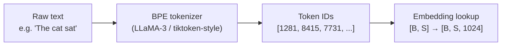
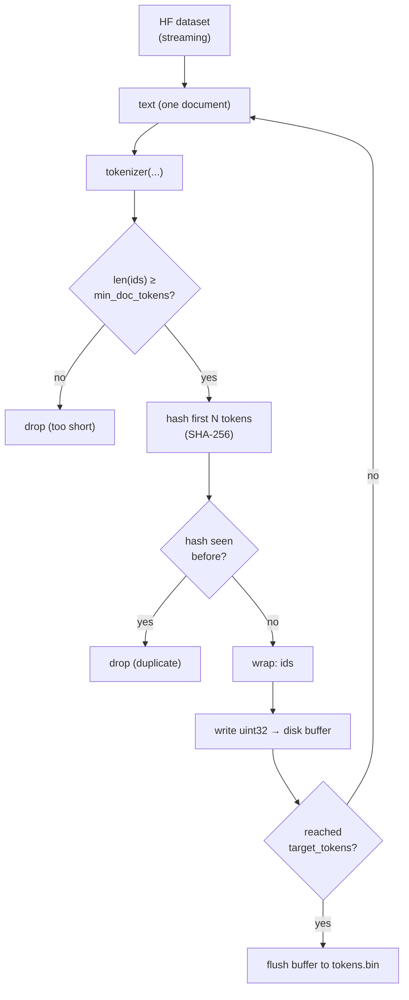
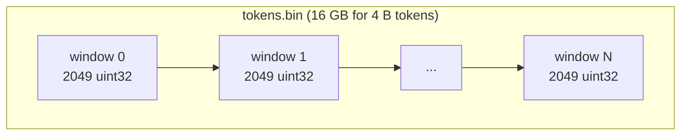
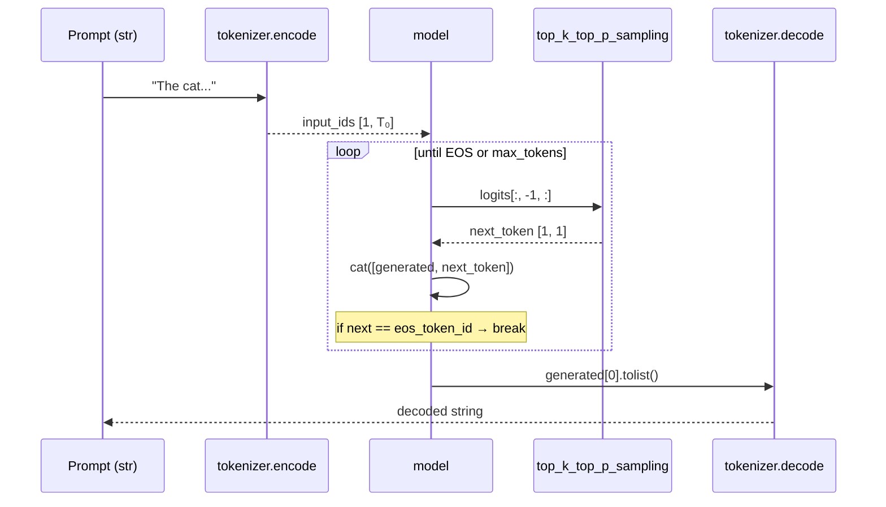
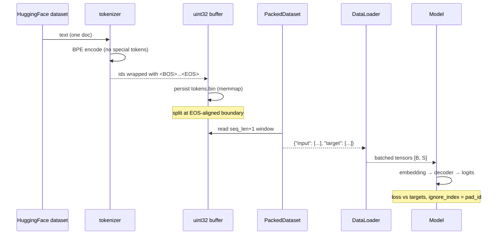

# LLaMA-3-Lite — Tokenizer Reference

> A complete walkthrough of the tokenization pipeline used to train and run LLaMA-3-Lite.
> Covers the algorithm, the specific artifacts used, every touch-point in the codebase, and the rationale behind each design decision.

---

## Table of Contents

1. [The Tokenizer in 60 Seconds](#1-the-tokenizer-in-60-seconds)
2. [Why a BPE Tokenizer?](#2-why-a-bpe-tokenizer)
3. [The LLaMA-3 Tokenizer Artifacts](#3-the-llama-3-tokenizer-artifacts)
4. [Loading the Tokenizer (`dataset.build_tokenizer`)](#4-loading-the-tokenizer-datasetbuild_tokenizer)
5. [Special Tokens: BOS, EOS, PAD, Reserved IDs](#5-special-tokens-bos-eos-pad-reserved-ids)
6. [Encoding: From Text to Token IDs](#6-encoding-from-text-to-token-ids)
7. [Decoding: From Token IDs Back to Text](#7-decoding-from-token-ids-back-to-text)
8. [Streaming Tokenization in the Data Pipeline](#8-streaming-tokenization-in-the-data-pipeline)
9. [Document Packing & Boundary Tokens](#9-document-packing--boundary-tokens)
10. [Hash-Based Dedup on Token IDs](#10-hash-based-dedup-on-token-ids)
11. [uint32 Storage Layout](#11-uint32-storage-layout)
12. [Train-Time Token Usage (`train.py`)](#12-train-time-token-usage-trainpy)
13. [Generation Usage (`train.generate_samples`)](#13-generation-usage-traingenerate_samples)
14. [Synthetic Smoke Test Path (`build_synthetic_data`)](#14-synthetic-smoke-test-path-build_synthetic_data)
15. [Offline-Testing Considerations](#15-offline-testing-considerations)
16. [End-to-End Token Lifecycle](#16-end-to-end-token-lifecycle)
17. [Configuration Reference](#17-configuration-reference)
18. [References](#18-references)

---

## 1. The Tokenizer in 60 Seconds

LLaMA-3-Lite uses the **LLaMA-3 tokenizer** published by Meta and re-hosted on the Hugging Face Hub:

```
tokenizer_name: "NousResearch/Meta-Llama-3-8B"
vocab_size:     128 256
algo:           Byte Pair Encoding (BPE) with byte-level pre-tokenization
backend:        HuggingFace `tokenizers` (Rust) wrapped by `transformers.AutoTokenizer`
```

The tokenizer turns raw text into a sequence of integers in `[0, 128 255]`. Those integers are the **only** interface between the data pipeline and the model — `model.py` never sees a string.



---

## 2. Why a BPE Tokenizer?

**Byte Pair Encoding (BPE)** is a sub-word tokenization algorithm:

1. Start with the 256 byte vocabulary.
2. Repeatedly merge the most-frequent adjacent pair in the training corpus into a new symbol.
3. Stop after `V` merges, giving a vocabulary of size `256 + V`.

BPE gives the best of both worlds:

| Property | Character-level | Word-level | BPE |
|---|---|---|---|
| Vocabulary size | 256 (tiny) | Millions | ~100 K |
| OOV handling | None | Brittle | Always defined |
| Sequence length | Very long | Short | Short |
| Multilingual | Yes | No | Yes |

For LLMs specifically:

- **Fixed, finite vocab** → the model's `nn.Embedding` is a static matrix and the output projection targets exactly `vocab_size` logits.
- **Common sub-words are tokens** ("the", "ing", "ation") — the model spends its capacity on **meaning**, not on spelling.
- **Rare words split into pieces** — no `<UNK>` token, every byte of input is reachable.

LLaMA-3 specifically uses a **byte-level BPE** variant — the base 256 alphabet is the **UTF-8 bytes** of the text, which guarantees that any input string, including arbitrary code, emoji, and non-Latin scripts, can be encoded losslessly.

---

## 3. The LLaMA-3 Tokenizer Artifacts

The tokenizer lives at `NousResearch/Meta-Llama-3-8B` on the Hugging Face Hub. Loading it via `AutoTokenizer.from_pretrained` downloads (and caches) these files:

| File | Purpose |
|---|---|
| `tokenizer.json` | Merges, vocab map, pre-tokenizer, decoder — the full fast tokenizer in one file |
| `tokenizer_config.json` | Special tokens, chat template, class metadata |
| `special_tokens_map.json` | Maps `<\|begin_of_text\|>`, `<\|end_of_text\|>`, reserved IDs → human names |
| `added_tokens.json` | Extra special tokens added on top of the base BPE vocab |

`AutoTokenizer` picks the right backend (`tokenizers` Rust core, fast path) based on the config. All encoding/decoding calls go through the optimized Rust implementation — no Python regex per token.

### Vocabulary properties

| Property | Value |
|---|---|
| `vocab_size` (`len(tokenizer)`) | **128 256** |
| Base byte alphabet | 256 (UTF-8 bytes) |
| Number of merges | 128 000 |
| Reserved special tokens | 256 (128 000–128 255) |
| Default `pad_token` | `None` (LLaMA-3 has no native pad token) |
| Default `eos_token` | `<\|end_of_text\|>` = `128 001` |
| Default `bos_token` | `<\|begin_of_text\|>` = `128 000` |

The vocabulary is **8× larger** than GPT-2's 50 257, which dramatically improves multilingual and code-token efficiency.

---

## 4. Loading the Tokenizer (`dataset.build_tokenizer`)

```python
# dataset.py:74
def build_tokenizer(config):
    """Load LLaMA 3 tokenizer with pad_token set to eos_token."""
    cache_dir = config.get('tokenizer_cache_dir', None)
    tokenizer = AutoTokenizer.from_pretrained(
        config['tokenizer_name'],
        cache_dir=cache_dir,
    )
    if tokenizer.pad_token is None:
        tokenizer.pad_token = tokenizer.eos_token
    return tokenizer
```

### What it does, line by line

1. Read `tokenizer_name` from config (`"NousResearch/Meta-Llama-3-8B"`).
2. Pass an optional `cache_dir` so the tokenizer can be reused across runs without re-downloading.
3. `AutoTokenizer.from_pretrained` returns a `PreTrainedTokenizerFast` instance — backed by the Rust `tokenizers` library.
4. **Patch `pad_token`**: LLaMA-3 does not ship with a padding token. Without a pad token, anything that tries to pad (e.g. dynamic batching in some pipelines) raises. Setting it to `eos_token` is a harmless convention — pad positions get `ignore_index = pad_id` in the loss anyway.

### Why use `AutoTokenizer` instead of `LlamaTokenizer` directly?

`AutoTokenizer` is the **dispatch-free** entry point — it picks the right class based on the config. If Meta or NousResearch swaps the tokenizer class (or if you swap `tokenizer_name` to a Qwen / Mistral tokenizer), nothing else changes.

### Where it's called

| Caller | Purpose |
|---|---|
| `build_training_data(config)` (line 313) | Real training pipeline |
| `build_synthetic_data(config)` (line 360) | Smoke tests |
| `train.train_model(...)` indirectly | Always uses the tokenizer returned by the loader |

---

## 5. Special Tokens: BOS, EOS, PAD, Reserved IDs

The LLaMA-3 vocab reserves the **last 256 IDs** (128 000 – 128 255) for **special tokens**. The most important ones:

| ID | Token | Used as |
|---|---|---|
| `128 000` | `<\|begin_of_text\|>` | BOS — start of a sequence |
| `128 001` | `<\|end_of_text\|>` | EOS — end of a sequence |
| `128 002`–`128 255` | reserved | future use / chat template control codes |

LLaMA-3 does **not** define a native `<pad>` token — `pad_token_id` is `None` by default.

### How LLaMA-3-Lite uses them

```python
# dataset.py:184
eos_id = tokenizer.eos_token_id   # 128 001
bos_id = tokenizer.bos_token_id   # 128 000
```

```python
# train.py:299
pad_id = tokenizer.pad_token_id if tokenizer.pad_token_id is not None \
         else tokenizer.eos_token_id   # fallback when pad_token is unset
```

#### BOS placement

The data pipeline writes **one BOS per document** at the start:

```python
# dataset.py:263-266
doc = np.empty(len(ids) + 2, dtype=_TOKEN_DTYPE)
doc[0]    = bos_id
doc[1:-1] = np.asarray(ids, dtype=_TOKEN_DTYPE)
doc[-1]   = eos_id
```

This means each document in the training stream is wrapped as:

```
<BOS>  token₁  token₂  ...  tokenₙ  <EOS>
```

The model learns to interpret `<EOS>` as a **stop signal** and `<BOS>` as a fresh-context marker.

#### Why PAD = EOS

Setting `pad_token = eos_token` (in `build_tokenizer`) is safe because:

1. Pad tokens are masked out of the loss via `ignore_index = pad_id` in `chunked_cross_entropy`.
2. So even if the model "sees" an EOS in pad position, it never gets a gradient signal to predict it.

This is the same trick GPT-2-style models use — there's no reason to invent a separate `<pad>` token when `<eos>` is already reserved.

### Mermaid: token-ID anatomy of one document


---

## 6. Encoding: From Text to Token IDs

### The primary call site

```python
# dataset.py:250
enc = tokenizer(text, add_special_tokens=False, truncation=True, max_length=max_doc_tokens)
ids = enc['input_ids']
```

Key flags:

| Flag | Value | Why |
|---|---|---|
| `add_special_tokens` | `False` | BOS/EOS are inserted manually around each document |
| `truncation` | `True` | Cap any single document at `max_doc_tokens` (default 8192) |
| `max_length` | `max_doc_tokens` | Same — cap |

Setting `add_special_tokens=False` is critical because the data pipeline **adds BOS/EOS at document boundaries** itself. Letting the tokenizer also add them would lead to double-BOS / misplaced-EOS.

### What `AutoTokenizer.__call__` returns

A `BatchEncoding` (here a length-1 batch) with at least:

```python
{
    "input_ids":      List[int],   # the tokens
    "attention_mask": List[int],   # 1 everywhere (no padding here)
}
```

`attention_mask` is ignored downstream — the dataset packs documents contiguously with **no padding**, and uses causal masking inside the model instead.

### What the BPE pre-tokenizer does to the input

LLaMA-3 uses the `Split` pre-tokenizer with the **TikToken-style** regex pattern that:

1. Splits on whitespace.
2. Treats each contiguous run of letters / digits / punctuation as a separate "word".
3. Keeps numbers, ASCII letters, and punctuation as **distinct atomic units** so they don't accidentally merge across word boundaries.

Inside each pre-tokenized "word", the byte-level BPE merges then apply.

### Concrete encoding example

```python
text  = "The cat sat on the mat."
ids   = tokenizer.encode(text)
#     = [1281, 8415, 7731, 773, 389, 279, 773, 6634, 13]
#       'The'  'cat' 'sat' 'on' ' the' ' mat' '.'
```

Notice how `"on"` + `" the"` + `" mat"` get distinct IDs — the leading-space variants are separate tokens. This is standard for GPT-style tokenizers and lets the model represent word boundaries faithfully.

### Helper: encoding a prompt at inference

```python
# train.py:118
tokens = tokenizer.encode(prompt)
```

`encode` is the no-frills variant — returns a plain `List[int]`, no special tokens added. Perfect for priming generation.

---

## 7. Decoding: From Token IDs Back to Text

```python
# train.py:134
text = tokenizer.decode(generated[0].tolist())
```

`decode` walks the ID list in order, looks up each token in the vocab, and **stitches the bytes** back together. Because LLaMA-3 uses **byte-level BPE**, the bytes form a valid UTF-8 string by construction — `decode` will not produce half-emoji or replacement characters for in-vocab IDs.

Notes:

- `decode` does **not** auto-skip special tokens by default. We pass the full generated sequence (which may end with `<EOS>`), so the decoded text will include `<|end_of_text|>` if present. For human-readable samples you'd add `skip_special_tokens=True`.
- Multiple spaces and newlines are preserved exactly as tokenized — useful for code generation.

---

## 8. Streaming Tokenization in the Data Pipeline

The data path is **streaming-first**: documents arrive from HuggingFace datasets one at a time and are tokenized on the fly. The full pipeline lives in `dataset._stream_to_disk` (line 166).

### Sequence diagram



### The relevant code

```python
# dataset.py:250-266 (inside _stream_to_disk)
enc = tokenizer(text, add_special_tokens=False, truncation=True,
                max_length=max_doc_tokens)
ids = enc['input_ids']
if len(ids) < min_doc_tokens:        # default 16
    dropped_short += 1
    continue

if do_dedup:
    h = _doc_hash(ids, hash_size)   # SHA-256 of first N tokens
    if h in seen_hashes:
        dropped_dup += 1
        continue
    seen_hashes.add(h)

doc = np.empty(len(ids) + 2, dtype=_TOKEN_DTYPE)
doc[0]    = bos_id
doc[1:-1] = np.asarray(ids, dtype=_TOKEN_DTYPE)
doc[-1]   = eos_id
```

### Why this order?

1. **Tokenize first** — duplicate detection on tokens is exact (more on this below).
2. **Filter short docs** — a 3-token snippet is more likely a header or boilerplate than useful training signal.
3. **Deduplicate** — eliminates near-clones (web scrapers love them).
4. **Wrap with BOS/EOS** — marks document boundaries in the contiguous stream.
5. **Write to disk** — feeds the uint32 buffer.

---

## 9. Document Packing & Boundary Tokens

Documents are written back-to-back into a single uint32 file. There is **no padding** between them — they are separated only by their `<EOS>` token:

```
[BOS] doc₁ tokens [EOS] [BOS] doc₂ tokens [EOS] [BOS] doc₃ tokens [EOS] ...
```

This is **document packing**. At training time, `PackedDataset` cuts the stream into non-overlapping windows of `seq_len + 1` tokens:

```
window 0: tokens 0 .. 2048
window 1: tokens 2048 .. 4096
window 2: tokens 4096 .. 6144
...
```

Each window yields one training example:

```python
# dataset.py:39-47 (PackedDataset.__getitem__)
chunk_idx = int(self.indices[idx])
start     = chunk_idx * (seq_len + 1)
end       = start + seq_len + 1
chunk     = np.array(self.data[start:end], copy=True)
return {
    'input':  torch.from_numpy(chunk[:-1]).long(),   # tokens 0..2047
    'target': torch.from_numpy(chunk[1:]).long(),    # tokens 1..2048  (next-token)
}
```

### Why pack?

A non-packed setup would pad every batch to `seq_len` with `<pad>`. With `batch_size=96, seq_len=2048`, that means up to ~96·2048 = 196 K tokens per batch of which **most** could be padding for short documents. Packing removes the waste — every token in a batch is a real training target.

### The cost: cross-document attention

In a packed sequence, the last few tokens of `doc₁` and the first few of `doc₂` end up in the **same window**. With pure causal attention, the early tokens of `doc₂` will attend to the tail of `doc₁`, which is technically incorrect — they're unrelated documents.

In practice this is **tolerated** because:

1. The model is causal, so doc₁ tokens never attend forward into doc₂ — only doc₂ tokens "see" doc₁.
2. The fraction of "polluted" positions per document is small (a handful of tokens at the start).
3. The throughput win is large (≥10× more useful tokens per batch).

If you wanted to eliminate the pollution you could switch to **flash-attention's `document_mask`** (variable-length packing) — out of scope for this codebase.

---

## 10. Hash-Based Dedup on Token IDs

```python
# dataset.py:86
def _doc_hash(token_ids, n_hash_tokens: int) -> bytes:
    """Hash first n_hash_tokens for exact-dedup (tokenizer-version-independent)."""
    head = token_ids[:n_hash_tokens]
    return hashlib.sha256(np.ascontiguousarray(head).tobytes()).digest()
```

### Why dedup on tokens, not text?

- **Text-level dedup** is brittle: two identical strings can tokenize differently if the tokenizer version changes (e.g., a BPE merge added).
- **Token-level dedup** is **tokenizer-version-independent** — re-running the pipeline with the same tokenizer gives identical hashes, and an upgrade that doesn't change early merges keeps the early-token hash the same.

### Why only the first `n_hash_tokens` (default 256)?

- Full-doc hashing is expensive for long docs (SHA-256 over 8 KB is fast, but over millions of docs the CPU cost adds up).
- A prefix hash catches **near-identical duplicates** (the head of a web-cloned page is usually enough to disambiguate) while remaining cheap.
- Collisions on the 32-byte (256-bit) SHA-256 prefix are astronomically unlikely.

### Why `np.ascontiguousarray(...).tobytes()`?

The numpy buffer from the tokenizer is **not always contiguous in memory** — it may be a view over a Python list with non-trivial stride. Forcing it contiguous guarantees a deterministic byte layout, which guarantees the hash is reproducible across runs and machines.

---

## 11. uint32 Storage Layout

```python
# dataset.py:13
_TOKEN_DTYPE = np.uint32
```

Why **uint32** instead of int64?

| Dtype | Max value | Enough for vocab 128 256? | Bytes/tok |
|---|---|---|---|
| int8 | 127 | ❌ | 1 |
| int16 | 32 767 | ❌ | 2 |
| int32 / **uint32** | ~2.1 B / 4.3 B | ✅ | **4** |
| int64 | ~9.2 × 10¹⁸ | ✅ (wasteful) | 8 |

uint32 is the **smallest safe dtype** for vocab IDs up to ~4.3 B. For our 128 256-token vocab:

- 4 bytes/token × 4 B tokens target ≈ **16 GB** on disk — fits comfortably on a single SSD.
- The memmap'd array (`np.memmap(..., dtype=uint32, mode='r')`) lets us address 4 B tokens without loading the file into RAM — only the windows we touch are paged in.

### Mermaid: on-disk format



Each window is `seq_len + 1 = 2049` uint32s — the extra +1 is the "lookahead" target token.

### RAM implication

The cache file is opened with `np.memmap(..., mode='r')` — the OS pages in 4 KB chunks on demand. A typical `DataLoader` worker might touch a few MB at a time; the resident set stays tiny while the file can be many GB.

---

## 12. Train-Time Token Usage (`train.py`)

### Validation loss with `chunked_cross_entropy`

```python
# train.py:142-186 (validate)
pad_id = tokenizer.pad_token_id if tokenizer.pad_token_id is not None \
         else tokenizer.eos_token_id     # fallback

use_chunked_ce = config.get('use_chunked_cross_entropy', True)

for batch in val_dataloader:
    input_ids  = batch['input'].to(device,  non_blocking=True)
    target_ids = batch['target'].to(device, non_blocking=True)

    logits = model(input_ids)

    if use_chunked_ce:
        loss = chunked_cross_entropy(
            logits.view(-1, logits.size(-1)),
            target_ids.view(-1),
            chunk_size=65536,
            ignore_index=pad_id,
        )
    else:
        loss = F.cross_entropy(
            logits.view(-1, logits.size(-1)),
            target_ids.view(-1),
            ignore_index=pad_id,
        )
```

Key choices:

- **`pad_id` as `ignore_index`** — any `<EOS>` token used as padding never contributes to the loss.
- **`chunked_cross_entropy`** — processes the `[B·S, V]` logits in 65 K-row chunks; same loss numerically, ~100× less peak memory.
- **`non_blocking=True`** — overlaps the H2D copy with the previous forward pass.

### Why `real_vocab_size = max(config['vocab_size'], len(tokenizer))`

```python
# train.py:302
real_vocab_size = max(config['vocab_size'], len(tokenizer))
```

This guards against two cases:

1. **Config drift** — `config['vocab_size']` is set to 128 000, but the actual tokenizer has 128 256 (the new special-token range).
2. **Tokenizer upgrade** — if you swap to a tokenizer with a larger vocab, the model needs an output projection that's at least as wide.

The embedding/output-projection tensors are constructed to the **larger** of the two numbers; the model is always at least as wide as the tokenizer needs.

---

## 13. Generation Usage (`train.generate_samples`)

```python
# train.py:106-138
@torch.no_grad()
def generate_samples(model, tokenizer, device, step, config):
    model.eval()
    prompts = [
        "The history of artificial intelligence began in the",
        "In a surprising discovery, researchers found that",
        "def fibonacci(n):\n    \"\"\"Return the nth Fibonacci number.\"\"\"\n    ",
        # ...
    ]

    table = wandb.Table(columns=["prompt", "generated", "step"])
    for prompt in prompts:
        tokens = tokenizer.encode(prompt)
        input_ids = torch.tensor([tokens], device=device)
        generated = input_ids
        for _ in range(config['generation_max_tokens']):
            with torch.autocast(...):
                logits = model(generated)
            next_token = top_k_top_p_sampling(
                logits[:, -1, :],
                config['generation_top_k'],
                top_p=0.9,
                temperature=config['generation_temperature']
            )
            generated = torch.cat([generated, next_token], dim=1)
            if next_token.item() == tokenizer.eos_token_id:
                break

        text = tokenizer.decode(generated[0].tolist())
        table.add_data(prompt, text, step)

    wandb.log({"gen/samples": table}, step=step)
    model.train()
```

### Token-by-token generation flow



### Sampling parameters (from config)

| Param | Default | Effect |
|---|---|---|
| `generation_max_tokens` | 128 | Hard cap on generated length |
| `generation_temperature` | 0.8 | Softens/sharpens the softmax |
| `generation_top_k` | 50 | Truncate to top-50 tokens before sampling |
| `top_p` | 0.9 | Nucleus sampling — keep smallest set summing to 0.9 |

### Stop conditions

Generation terminates when **either**:

1. `next_token.item() == tokenizer.eos_token_id` — the model produces the special stop token, OR
2. `generation_max_tokens` is reached — hard cap.

Both cases call `tokenizer.decode(generated[0].tolist())` on the full sequence (including any `<EOS>` at the end).

---

## 14. Synthetic Smoke Test Path (`build_synthetic_data`)

For unit tests and CI, downloading ~16 GB of tokens is impractical. `dataset.build_synthetic_data` (line 358) bypasses the real pipeline entirely:

```python
# dataset.py:358-403 (build_synthetic_data, abridged)
def build_synthetic_data(config):
    tokenizer = build_tokenizer(config)
    eos_id    = tokenizer.eos_token_id
    bos_id    = tokenizer.bos_token_id
    seq_len   = config['seq_len']

    rng = random.Random(42)
    vocab_size = len(tokenizer)
    total_tokens = 100_000
    doc_len = 200
    docs = []
    for _ in range(total_tokens // doc_len):
        doc = [bos_id] + [rng.randint(0, vocab_size - 1) for _ in range(doc_len - 2)] + [eos_id]
        docs.extend(doc)

    buf = np.array(docs, dtype=_TOKEN_DTYPE)
    val_split = config.get('val_split', 0.05)
    split = int(len(buf) * (1.0 - val_split))
    chunk = seq_len + 1
    split = (split // chunk) * chunk
    train_arr = buf[:split]
    val_arr   = buf[split:]

    train_dataset = PackedDataset(train_arr, seq_len, eos_id)
    val_dataset   = PackedDataset(val_arr, seq_len, eos_id)
    # ... DataLoaders ...
    return train_dataloader, val_dataloader, tokenizer
```

It still **uses the real tokenizer** to get `eos_id`, `bos_id`, and `vocab_size` (so the shape of any downstream tensors is correct), but generates IDs by **uniform random sampling** in `[0, vocab_size)`. This:

- Exercises the entire training loop end-to-end (model forward, loss, backward, optimizer step).
- Produces meaningless text — only used to verify that loss decreases and shapes are correct.

The unit tests in `tests/test_smoke.py` use this path explicitly so they can run on a developer laptop without 16 GB of cache.

---

## 15. Offline-Testing Considerations

The tokenizer must be **downloadable at least once** before any offline run. The code path is:

```python
# tests/conftest.py:24 (and dataset.build_tokenizer)
tokenizer = AutoTokenizer.from_pretrained(
    config['tokenizer_name'],         # "NousResearch/Meta-Llama-3-8B"
    cache_dir=cache_dir,              # Optional: a local path
)
```

After the first run, the tokenizer files live in:

- `~/.cache/huggingface/hub/` if `cache_dir=None` (default)
- `cache_dir` if provided

Subsequent runs are **fully offline** — `AutoTokenizer.from_pretrained` reuses the cached files.

### `tests/test_dataset.py` gate

```python
# tests/test_dataset.py:247
def _tokenizer_available() -> bool:
    """Return True iff the LLaMA-3 tokenizer is reachable / cached."""
    ...
```

Tests that need the real tokenizer are decorated:

```python
@pytest.mark.skipif(
    not _HAS_TOKENIZER,
    reason="LLaMA-3 tokenizer not cached locally"
)
def test_returns_dataloaders_and_tokenizer(self, ...):
    ...
```

Tests that **don't** need it (e.g. `PackedDataset` shape checks on raw uint32 arrays) run unconditionally.

---

## 16. End-to-End Token Lifecycle



### Step-by-step

| # | Stage | Token format | Where |
|---|---|---|---|
| 1 | Download | raw UTF-8 text | HuggingFace Hub |
| 2 | Tokenize | `List[int]` | `dataset._stream_to_disk` |
| 3 | Filter | drop too-short / duplicates | same |
| 4 | Wrap | `[BOS] ids [EOS]` | same |
| 5 | Persist | `np.uint32` array on disk | `tokens.bin` |
| 6 | Split | train/val at EOS+chunk boundary | `_align_split_to_docs_and_chunks` |
| 7 | Window | `seq_len + 1` uint32s | `PackedDataset.__getitem__` |
| 8 | Batch | `[B, S]` int64 tensors | `collate_fn` |
| 9 | Embed | `[B, S, 1024]` float | `model.InputEmbedding` |
| 10 | Train | logits `[B, S, V]` → loss | `chunked_cross_entropy` |
| 11 | Sample | prompt IDs → generated IDs → text | `generate_samples` |

---

## 17. Configuration Reference

All tokenizer-related keys from `config.py`:

| Key | Default | Meaning |
|---|---|---|
| `tokenizer_name` | `"NousResearch/Meta-Llama-3-8B"` | HF repo id to load |
| `tokenizer_type` | `"autotokenizer"` | Loader hint (used by tests) |
| `tokenizer_cache_dir` | `None` | Local path; `None` → `~/.cache/huggingface` |
| `vocab_size` | `128 000` | Model-side default; runtime widened by `max(config, len(tokenizer))` |
| `tokenize_batch_size` | `1000` | Reserved for future batched encode (currently encoded one doc at a time) |
| `min_doc_tokens` | `16` | Drop docs with fewer tokens than this |
| `max_doc_tokens` | `8192` | Truncate any single doc to this many tokens |
| `dedup` | `True` | Enable SHA-256 dedup |
| `dedup_hash_bytes` | `256` | Length of the prefix used for hashing |
| `data_cache_filename` | `"tokens.bin"` | Output cache filename |
| `data_cache_dir` | `"data_cache"` | Output cache directory |
| `reuse_data_cache` | `True` | Re-use the cache if present |
| `pad_token_id` (derived) | `eos_token_id` if pad unset | Used as `ignore_index` for loss |

---

## 18. References

1. **LLaMA 3** — Meta AI (2024). *The Llama 3 Herd of Models.* arXiv:2407.21783 — tokenizer section.
2. **Byte Pair Encoding** — Sennrich et al. (2016). *Neural Machine Translation of Rare Words with Subword Units.* arXiv:1508.07909.
3. **Byte-Level BPE** — Wang et al. (2020). *Neural Machine Translation with Byte-Level Subwords.* arXiv:1909.03341.
4. **TikToken regex pre-tokenizer** — OpenAI (2022). `tiktoken` repository.
5. **HuggingFace `tokenizers`** — HuggingFace Team. *Fast State-of-the-Art Tokenizers Optimized for Research and Production.*
6. **`AutoTokenizer`** — HuggingFace `transformers` docs.

---

*Document generated for the LLaMA-3-Lite repository. The content is keyed to `dataset.py` and `train.py` line numbers so the documentation and code stay in lock-step.*

---

## Appendix — LLaMA-3 tokenizer rationale (from inline comments)

### Tokenizer artifacts

`NousResearch/Meta-Llama-3-8B` (public re-upload of Meta's LLaMA-3
tokenizer, no gated access). Byte-level BPE with the TikToken-style regex
pre-tokenizer; Rust backend wrapped by `transformers.AutoTokenizer`.

### Vocabulary properties

| Property | Value |
|----------|-------|
| `vocab_size` (`len(tokenizer)`) | **128 256** |
| Base byte alphabet | 256 (UTF-8 bytes) |
| Number of merges | 128 000 |
| Reserved special tokens | 256 (IDs 128 000–128 255) |
| `<\|begin_of_text\|>` (BOS) | 128 000 |
| `<\|end_of_text\|>` (EOS) | 128 001 |
| Native `<pad>` | **none** — LLaMA-3 does not define one |

The vocab is 8× larger than GPT-2's 50 257, dramatically improving
multilingual and code-token efficiency.

### `pad_token = eos_token` patch

`build_tokenizer` sets `tokenizer.pad_token = tokenizer.eos_token` because
LLaMA-3 ships without a native pad token. Safe because pad positions get
`ignore_index = pad_id` in `chunked_cross_entropy` — the model never gets a
gradient signal to predict an EOS in pad position.

### Runtime vocab widening

`real_vocab_size = max(config['vocab_size'], len(tokenizer))` guards
against config drift (`config['vocab_size'] = 128000` vs actual tokenizer
size 128 256) and tokenizer upgrades. The embedding/output-projection
tensors are constructed to the **larger** of the two numbers.

### uint32 storage

`_TOKEN_DTYPE = np.uint32` — the smallest safe dtype for vocab IDs up to
~4.3 B. For 128 256 tokens: 4 bytes/token × 4 B tokens target ≈ 16 GB on
disk. `np.memmap(..., mode='r')` lets the OS page in 4 KB chunks on demand
— resident memory stays tiny while the file can be many GB.

### Per-document wrapping (not per-cache)

The data pipeline calls the tokenizer with `add_special_tokens=False` and
wraps each document manually: `[BOS] ids [EOS]`. Letting the tokenizer add
special tokens would prepend a single BOS to the entire cache, not one per
document — the only sane interpretation is one BOS/EOS pair per document.
