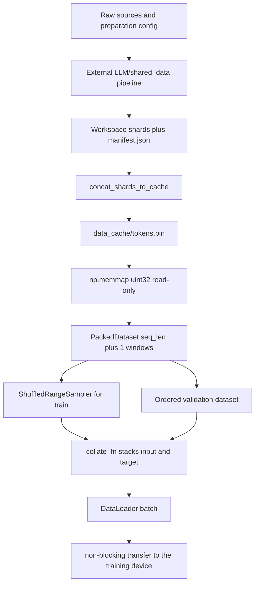

# Token Data and Loader Pipeline

This repository has two deliberately separate data responsibilities:

- `data/prepare_data.py` is a CLI bridge. It delegates downloading, cleaning, tokenizing, and packing to the workspace-level `LLM/shared_data` package, which is outside this repository. This checkout does **not** contain that preparation package; `data/shared_data/` is the vendored loader only.
- `data/shared_data/loader.py` owns the runtime contract: it opens one flat token cache, creates fixed-length train/validation datasets, and builds PyTorch `DataLoader`s. `dataset.py` preserves the public import surface used by `train.py` and `benchmark_data.py`.

The preparation boundary matters operationally: a real-data run requires the external workspace package and a completed pack stage, whereas a training run can still execute on synthetic data when the cache is absent.

## End-to-end path

The repository-side path is:



Caption: Workspace-produced shards are bridged into the flat cache, then converted into fixed next-token batches.

### Preparation and shard-to-cache conversion

Run the real-data entrypoint from the repository root:

```bash
python data/prepare_data.py --stage pretrain
```

The CLI also accepts `--mixture`, `--data-config`, `--data-root`, `--source`, and the stage switches `--skip-download`, `--skip-clean`, `--skip-tokenize`, and `--skip-pack`. These arguments are forwarded to the external `shared_data.prepare_data.run_pipeline`; this repository does not implement those stages. The shim inserts the project, `data/`, and workspace-parent paths into `sys.path`, imports the external configuration and orchestrator, applies the LLaMA-3 reporting constants, and only then calls the pipeline.

After the external pipeline returns, the shim's `concat_shards_to_cache` bridge reads the manifest at the external data root, orders its `shards` entries by numeric `index`, and opens each listed path relative to the shard directory. It copies bytes shard by shard, using bounded reads (`_CONCAT_CHUNK_TOKENS * 4`) rather than loading the corpus into one large host-memory buffer. The destination is created beneath the configured `data_cache_dir` with the configured `data_cache_filename`—the production defaults are `data_cache/tokens.bin`—and is installed with `os.replace` from a sibling `tokens.bin.tmp` file. A successful replacement leaves no temporary sibling. The bridge does not add EOS tokens or headers: it preserves the already-packed shard byte stream.

The manifest is therefore a correctness boundary, not merely metadata. Its order—not filename sorting or directory enumeration—defines the resulting stream. A missing manifest, or a manifest with no shards, causes `concat_shards_to_cache` to raise `SystemExit` with an instruction to run the pack stage; it does not create an empty cache. A pre-existing cache is reused when `reuse_data_cache` is true, so a preparation rerun will skip concatenation. Inspect or remove the cache deliberately when changing the corpus or tokenizer contract.

The external workspace package is not present in this checkout. If its `shared_data.config` import cannot be resolved, the shim exits with a message explaining that `LLM/shared_data` must be importable and that this project vendors only the loader. That is a **preparation dependency failure**, distinct from a missing runtime cache.

## On-disk token contract

`build_training_data` expects `data_cache/tokens.bin` (or the configured equivalent) as a raw, headerless, little-endian `uint32` stream. There is no per-record framing in the cache. The preparation pipeline's packed shards are already EOS-separated; concatenation only joins those byte-compatible streams. At four bytes per token, the configured eight-billion-token target is approximately 32 GB on disk.

EOS is an ordinary token to the runtime loader. The loader does not search for document boundaries, reset context, or accept an `eos_id` argument. Fixed windows may contain an EOS separator and may cross it; the separator remains learnable. The preparation-side constants identify the intended LLaMA-3 contract (`LLAMA3_TOKENIZER_NAME = "llama3"`, vocabulary `128_000`, EOS `128_009`, and pad `128_002`), but the loader trusts the ids already in the cache rather than validating them against the stream.

The production configuration puts the main runtime knobs in one dictionary:

| Key | Production value | Runtime role |
|---|---:|---|
| `data_cache_dir` | `data_cache` | Cache directory |
| `data_cache_filename` | `tokens.bin` | Flat cache name |
| `reuse_data_cache` | `True` | Skip bridge work when the cache exists |
| `seq_len` | `2048` | Input and target length |
| `batch_size` | `96` | Samples per batch |
| `val_split` | `0.05` | Final holdout fraction |
| `shuffle_seed` | `42` | Training permutation seed |
| `num_workers` | `6` | DataLoader worker count |
| `prefetch_factor` | `16` | Worker prefetch setting |
| `pin_memory` | `True` | Host-buffer pinning for transfer |
| `tokenizer_name` | `NousResearch/Meta-Llama-3-8B` | Runtime tokenizer checkpoint |
| `tokenizer_cache_dir` | `None` | Optional Transformers cache location |

Several preparation-oriented settings also appear in `config.py`, including `data_sources`, `dedup`, document limits, and `target_tokens`. They describe the broader corpus contract, but the vendored runtime loader does not consume them. The external preparation package is the owner of those settings; do not assume editing the local `data_sources` dictionary changes an already-built cache or changes the arguments passed to `run_pipeline`.

## Runtime loading and window semantics

`build_training_data(config)` first checks the cache path. If it is absent, it raises `FileNotFoundError` with the command needed to prepare real data. If it exists, it creates `np.memmap(path, dtype=np.uint32, mode="r")`. The mapping is read-only and lazy: the loader exposes the file without copying the whole corpus into Python or GPU memory.

The loader truncates the usable stream to a whole number of non-overlapping chunks:

```text
chunk = seq_len + 1
n_total = (number of cached tokens // chunk) * chunk
```

The extra token is required for next-token prediction. For dataset item `idx`, `PackedDataset` takes the half-open slice `[idx * (seq_len + 1), (idx + 1) * (seq_len + 1))`, converts the view to `int64` for PyTorch, and returns:

- `input = window[:-1]`, with exactly `seq_len` ids;
- `target = window[1:]`, the same window shifted one position right, also exactly `seq_len` ids.

Items do not overlap: the dataset advances by `seq_len + 1`, not by one token. A buffer shorter than one chunk is a special synthetic-test convenience: `PackedDataset` pads it with zero-valued `uint32` ids to make one window. Normal prepared corpora should be long enough that this path is irrelevant.

The validation boundary is also chunk-aligned. The loader first discards the unusable tail, computes `int(n_total * (1.0 - val_split))`, rounds that split down to a chunk boundary, and constructs `PackedDataset(tokens[:split], seq_len)` for training and `PackedDataset(tokens[split:], seq_len)` for validation. Thus validation is the **final** `val_split` portion of the usable stream, not a random sample and not an interleaved document split. Training uses `drop_last=True`; validation uses `drop_last=False`.

`build_synthetic_data` follows the same window, split, sampler, collation, and DataLoader structure, but creates a deterministic random `uint32` stream with `np.random.default_rng(seed)`. It is intentionally suitable for offline tests and smoke runs, not for learning from text.

## Sampling, collation, and device transfer

Training uses `ShuffledRangeSampler`, which creates `np.random.default_rng(self.seed + self.offset)` and yields a permutation of dataset indices. `set_epoch(epoch)` sets `offset` to that epoch number. Consequently, the same `(seed, epoch)` reproduces the same order, while advancing the epoch changes the permutation without relying on process-global RNG state. Validation sets `shuffle=False`, so validation batches retain stream order.

`collate_fn` stacks the individual `input` and `target` tensors along dimension zero and returns the same two-key dictionary. With the production configuration, a full batch is shaped `(96, 2048)` for both keys and contains `96 * 2048` training input tokens. `DataLoader` enables `persistent_workers` only when workers are present and passes `prefetch_factor` only in that case, avoiding PyTorch's invalid zero-worker prefetch configuration.

The training loop requests the first batch before compilation, then transfers `input` and `target` with `.to(device, non_blocking=True)`. `pin_memory=True` makes the host-side pinned-buffer path available for CUDA; the benchmark applies pinning only when its selected device is CUDA. When an iterator is exhausted, `train.py` increments an epoch counter, calls `set_epoch` when supported, and starts a fresh iterator. A corpus shorter than the complete training plan therefore wraps with a reproducible new permutation rather than terminating training.

## Tokenizer selection and failure modes

The cache is pretokenized; this repository does not tokenize each training document at batch time. Runtime tokenizer loading is separate from cache loading:

1. `build_tokenizer` calls `transformers.AutoTokenizer.from_pretrained(config["tokenizer_name"], cache_dir=...)`.
2. If the returned tokenizer has no pad token, it assigns `tokenizer.eos_token` as its pad token.
3. `build_training_data` catches any exception from that load—including missing `transformers`, unavailable network access, or an inaccessible/invalid checkpoint—and prints a warning before returning a byte-level `_SyntheticTokenizerStub`.

That tokenizer failure is soft: train and validation loaders still use the real cached ids, but generation and decoding are not meaningful until the intended tokenizer is available. The stub maps UTF-8 bytes to ids for `encode` and decodes low-byte values with replacement; it is a test/offline substitute, not a compatible LLaMA-3 tokenizer.

A missing cache is different. `build_training_data` raises `FileNotFoundError` before tokenizer loading. `train.py:train_model` catches that error, warns that no token cache was found, and calls `build_synthetic_data(config)`. This fallback is also soft for execution but changes the experiment: the model trains on random ids and receives the synthetic byte stub. To train on real data, fix preparation and verify the configured cache exists; do not mistake a successful synthetic smoke run for a real-corpus run.

A third, earlier failure is missing workspace preparation support: `data/prepare_data.py` raises a clear `SystemExit` when `LLM/shared_data` cannot be imported. It cannot be repaired by calling `build_synthetic_data` inside the preparation command; use the synthetic builder directly or make the external workspace package available.

There is a tokenizer-identity contract across the boundary: the tokenizer that produced the workspace ids must use the same id space expected by the runtime tokenizer. The local model guards vocabulary *size* with `max(config['vocab_size'], len(tokenizer))`, but that cannot detect semantic renumbering or a different EOS convention. Treat a tokenizer change as requiring a new cache and a compatibility check, not merely a config edit.

## Public API and extension points

Consumers should import the loader API from `dataset.py`, not reach into the vendored package as an implementation detail:

```python
from dataset import (
    PackedDataset,
    ShuffledRangeSampler,
    collate_fn,
    build_training_data,
    build_synthetic_data,
)
```

`dataset.py` adds `data/` to `sys.path`, imports these five symbols from `shared_data.loader`, and lists them in `__all__`. This re-export is the compatibility point for `train.py`, `benchmark_data.py`, and downstream callers. Changes to loader internals should preserve these names and the dictionary keys/shapes unless the callers and focused tests are changed together.

The safe extension boundaries are:

- **Preparation:** change the external `LLM/shared_data` pipeline or its arguments; keep the shard bytes, manifest ordering, and tokenizer metadata compatible with the bridge.
- **Cache conversion:** change `concat_shards_to_cache` only with care for bounded streaming, manifest order, and sibling-`.tmp` atomic replacement.
- **Window policy:** change `PackedDataset` and the chunk-aligned split together; altering `seq_len + 1` changes both targets and usable dataset cardinality.
- **Sampling:** implement the `Sampler` interface and preserve `set_epoch` if the trainer should produce epoch-specific reproducible orders.
- **Tokenizer:** replace `build_tokenizer` only if the new object still supplies the tokenizer attributes and `encode`/`decode` behavior used by training and generation.
- **Batch transport:** tune `num_workers`, `prefetch_factor`, and `pin_memory` in configuration; keep the collated `input`/`target` contract and the trainer's non-blocking transfer path.

## Focused verification

The data tests validate the boundaries that are easiest to regress:

- `tests/test_data_pipeline.py::TestConcatShardsToCache` writes fake `uint32` shards and a manifest, checks byte-exact index order, verifies the `.tmp` sibling is gone after replacement, checks missing/empty manifests, and opens the output with `np.memmap`.
- The same file runs `benchmark_data.py` end to end and checks JSON metrics, protecting the public re-export path and batch arithmetic.
- `tests/test_smoke.py` builds EOS-separated synthetic streams, creates train/validation loaders through the re-exported API, runs a forward/backward step, and exercises validation. Its split calculation mirrors the loader's chunk alignment.
- `tests/e2e_gpu_smoke.py` checks the synthetic-to-`PackedDataset`-to-`DataLoader` path, batch shapes, and CPU/CUDA transfer behavior; it is a GPU-oriented smoke test rather than a real-corpus preparation test.
- `tests/conftest.py` makes synthetic tests deterministic with explicit NumPy/Python/Torch seeding and defaults the test device to CPU. It also disables network-dependent W&B/tokenizer behavior for the test environment.

These tests do not validate the implementation of `LLM/shared_data`, because that package is outside this repository. For real data, separately verify the external pipeline's manifest and tokenizer contract before trusting a produced cache.
