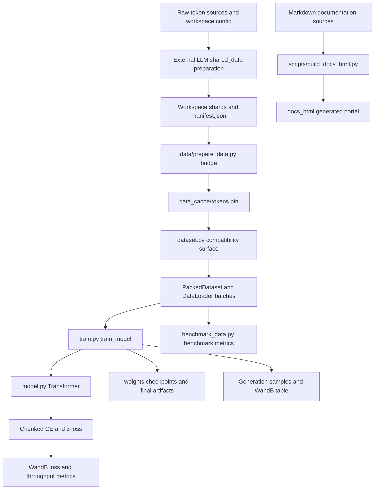

# System Boundaries and Public Surfaces

LLaMA-3-Lite is a script-oriented PyTorch training repository rather than an installed framework or service. The root scripts are the operational interface: `python train.py` runs orchestration, `python data/prepare_data.py` prepares or bridges real data, and `python benchmark_data.py` measures the loader path. `config.py` supplies the single configuration dictionary consumed by the training runtime; `model.py` supplies the decoder and loss primitives; and `dataset.py` preserves the historical data-import surface.

The most important boundary is between **workspace-owned corpus preparation** and **repository-owned runtime consumption**. The repository vendors `data/shared_data/loader.py`, but it does not vendor the external `LLM/shared_data` preparation package. A successful local smoke run can therefore prove the model and loader wiring without proving that the real corpus can be downloaded, packed, or tokenized.

## Runtime domains and artifact boundaries

Caption: Real token data crosses from the external workspace into a flat local cache, then flows through the loader, model, metrics, and persisted artifacts; documentation is generated on a separate path.

The domains in the diagram have distinct ownership:

- **Preparation boundary:** The external workspace owns source acquisition, cleaning, tokenization, deduplication, packing, and shard manifests. The local preparation script applies LLaMA-3 reporting constants, forwards CLI options, and converts the result into the cache format expected by the local loader.
- **Data runtime:** `data/shared_data/loader.py` owns memory-mapped token access, fixed windows, sampler order, collation, tokenizer lookup for generation, and `DataLoader` construction. `dataset.py` is deliberately not a second loader implementation; it is a compatibility shim over that vendored loader.
- **Model runtime:** `model.py` owns the decoder-only transformer, RoPE, GQA, RMSNorm, SwiGLU, gradient-checkpointing branch, and memory-bounded language-model loss. It has no responsibility for files, W&B, checkpoint policy, or corpus preparation.
- **Training orchestration:** `train.py` owns device setup, data fallback, model construction from configuration, compilation, optimizer and scheduler lifecycle, EMA, validation, sampling, logging, checkpoint retention, and finalization.
- **Measurement and documentation:** `benchmark_data.py` is an independent synthetic-data/loader benchmark with an optional tiny model forward. `scripts/build_docs_html.py` transforms a fixed list of Markdown documents into the ignored `docs_html/` portal; it does not participate in training.

## Entrypoints and control flow

### Training entrypoint

The `train.py` module-level entrypoint obtains `get_config()` and calls `train_model(config)`. Callers can also import the orchestration helpers for focused tests, but the full run is intentionally controlled by the configuration dictionary rather than command-line flags. The runtime selects CUDA when available and otherwise uses CPU. On CUDA it enables the configured TF32, cuDNN benchmark, and allocator settings.

`train_model` first accepts injected train/validation loaders and a tokenizer, which is useful for tests and specialized callers. If any of those are absent, it calls `build_training_data`. A missing cache is caught as an operationally soft failure: the trainer warns and switches to `build_synthetic_data`. This keeps the training loop executable offline, but it changes the experiment from real text to deterministic random token ids. A tokenizer-loading failure is softer still: the real cached ids remain in use, while the loader returns a byte-level tokenizer stub and warns that generation is not meaningful.

Once data is available, the trainer derives the effective vocabulary as the maximum of configured vocabulary size and tokenizer length, constructs the transformer, optionally forces Triton settings back to PyTorch unless `ENABLE_TRITON_KERNELS=1` is set, and performs a real-shape warmup. If `compile_model` is enabled and `torch.compile` exists, the model and chunked loss are compiled/warmed before measured steps. This makes compilation overhead separate from the normal throughput path.

The training loop overlaps host-to-device preparation with compute by fetching the next batch and using `to(device, non_blocking=True)`. Each step runs BF16 autocast on CUDA, asks the model for hidden states, evaluates the chunked head loss, divides by gradient accumulation, backpropagates, clips gradients, and periodically steps AdamW, EMA, and the sequential warmup/cosine scheduler. If the data iterator ends, `_next_batch` increments an epoch counter, resets the sampler epoch when supported, and starts a fresh iterator rather than terminating the run. This matters because the configured 42,000-step plan can consume more tokens than one prepared corpus.

Validation runs every `val_interval` steps for at most `val_max_batches`, preferring the EMA model when enabled. It logs validation loss and perplexity. Generation runs at its own interval using fixed prompts, temperature, top-k, and top-p sampling, then logs a W&B table. Checkpoints run independently at `checkpoint_interval`; the finalization path joins the last asynchronous save thread before writing the special final full-state and weights-only files.

### Real-data preparation entrypoint

`data/prepare_data.py` is a CLI adapter, not the implementation of the universal data pipeline. It inserts the repository, `data/`, and workspace-parent paths into `sys.path`, imports `shared_data.config` and `shared_data.prepare_data`, applies LLaMA-3 constants, and forwards mixture, data-config, source, data-root, and skip-stage options to `run_pipeline`.

The external package boundary is explicit in failure behavior. If `shared_data.config` cannot be imported, the script exits with a message that the `LLM/shared_data` workspace package must be available and that this repository vendors only the loader. That dependency is **not vendored here**; adding or changing local loader code does not make real-data preparation self-contained.

After the external pipeline returns, the adapter reads the manifest, orders shard entries by numeric `index`, streams each listed binary file into a sibling `.tmp` cache, and installs it with `os.replace`. The bridge preserves the already-packed byte stream; it does not add EOS tokens, headers, or record framing. Missing or empty manifests fail instead of creating an empty cache. If the configured cache already exists and `reuse_data_cache` is true, concatenation is skipped. The manifest order, shard byte format, and tokenizer identity are therefore correctness boundaries for any real-data run.

### Benchmark entrypoint

`benchmark_data.py` builds an explicit synthetic `uint32` stream with document markers, wraps it in the same `PackedDataset`, `ShuffledRangeSampler`, and `collate_fn` surface used by training, and measures loader throughput. It can optionally run a small model forward, select CPU or CUDA, pin memory only when CUDA is selected, and emit either human-readable output or JSON. It is a diagnostic for the repository-side data and transfer path, not a benchmark of external downloading, tokenization, or the full configured 515M-parameter run.

## Module boundaries and public surfaces

### Configuration is data, not a service object

`config.py` exposes `get_config()`, which returns one dictionary containing architecture, optimization, runtime, data, tokenizer, validation, generation, artifact, and W&B settings. Important defaults include 16 layers, 1024 hidden width, 8 query heads and 4 KV heads, sequence length 2048, batch size 96, gradient checkpointing, 256-row CE chunks, a 5% final validation split, and the `weights` and `data_cache/tokens.bin` artifact locations.

The local `data_sources` dictionary is not the active preparation implementation: the README notes that the canonical mixture is workspace-owned, and `data/prepare_data.py` passes the external mixture/config paths to `run_pipeline`. Treat corpus settings in the local configuration as descriptive unless the external pipeline explicitly consumes them. Conversely, loader and training settings such as cache location, batch shape, worker count, validation interval, checkpoint interval, and logging interval are consumed inside this repository. The configuration also holds the three per-kernel implementation selectors (`rmsnorm_impl`, `swiglu_impl`, and `cross_entropy_impl`); their default is PyTorch, and `train.py` requires the explicit `ENABLE_TRITON_KERNELS=1` opt-in before honoring Triton selections.

### `dataset.py` is the compatibility surface

Consumers that need the loader API should import from `dataset.py`. Its `__all__` re-exports exactly `PackedDataset`, `ShuffledRangeSampler`, `collate_fn`, `build_training_data`, and `build_synthetic_data` from `shared_data.loader`, after adding `data/` to `sys.path`. `train.py` and `benchmark_data.py` use this surface so callers do not need to know the vendored package’s import path.

The contract behind those names is structural as well as nominal. A dataset item contains `input` and `target`; the two tensors are fixed `seq_len` windows shifted by one token. The collator stacks those keys into batch dimension zero. Training data is read-only `np.memmap` over a raw `uint32` cache, split at chunk boundaries into a final validation holdout, and sampled with a reproducible NumPy permutation. Changes to names, keys, shapes, or the `seq_len + 1` window rule require coordinated caller and test changes.

### `model.py` owns model and loss primitives

The model surface is composed of importable classes and functions rather than a package-level `__all__`. `build_transformer` maps explicit architecture settings into a `Transformer`. `Transformer` embeds ids, applies the decoder stack, optionally checkpoints each block during training, and either returns hidden states or applies its separate output projection. The output projection is not tied to the input embedding. `get_num_params(non_embedding=True)` reports the non-embedding count by subtracting both the input embedding and output projection from the total.

Within each pre-norm decoder block, RMSNorm feeds causal scaled-dot-product attention and then a fused gate/up SwiGLU feed-forward path, each with a residual add. GQA projects 8 query heads and 4 KV heads, repeats KV heads for attention, and applies RoPE. The default implementation is PyTorch; the three sanctioned Triton choices are explicit per-kernel configuration options and are not silently enabled.

The loss boundary is important for memory. `chunked_cross_entropy_with_z` accepts materialized logits and processes token rows in slices. `chunked_head_cross_entropy_with_z` is the training path: it computes the LM head and FP32 CE/z-loss inside checkpointed chunks so a full `[tokens, vocabulary]` logits tensor is never retained. `train.py` calls the latter for both training and validation, while smoke tests use the former when comparing a chunked loss with dense cross-entropy.

## End-to-end token-to-metrics path

1. The external preparation pipeline emits EOS-separated packed shards and `manifest.json`. The local adapter concatenates them, in manifest index order, to the configured flat cache.
2. `build_training_data` checks that cache path, maps it read-only as `uint32`, truncates the usable stream to complete `seq_len + 1` chunks, and divides the final fraction into validation.
3. `PackedDataset` turns each non-overlapping chunk into an `int64` input/target pair. The training sampler permutes dataset indices with seed plus epoch offset; validation is ordered. `collate_fn` produces batch dictionaries.
4. `train_model` transfers input and target tensors to the selected device. The model maps input ids to hidden states through embedding, 16 decoder blocks, and final normalization.
5. The trainer flattens hidden states and targets, computes the output projection and chunked FP32 CE plus optional z-loss, and backpropagates. Gradient clipping, AdamW, EMA, and the scheduler update state at the configured accumulation boundary.
6. At logging intervals, the trainer reports loss, learning rate, gradient norm, step time, token throughput, tokens seen, effective batch size, data wait time, and CUDA memory/utilization fields when available. W&B receives those scalar metrics; validation adds perplexity and generation adds a table.

This path has a deliberate observability distinction: the logged `train/loss` is restored to the un-divided loss when gradient accumulation is used, while `tokens_seen` is computed from step, batch size, sequence length, and accumulation. A synthetic fallback can produce valid finite metrics and passing smoke tests, but those metrics are not evidence that the external corpus was prepared correctly.

## Generated and persistent artifacts

The repository creates several artifacts outside the source-module boundary:

- **Token cache:** `data_cache/tokens.bin`, a raw headerless `uint32` stream. It is reused when configured, memory-mapped at runtime, and ignored by Git. Rebuild it when changing the upstream tokenizer, packing, or corpus.
- **Checkpoints:** files under `weights/` named from `model_filename`. Periodic files contain model, optimizer, scheduler, step, token count, best validation loss, CPU/CUDA/Python/NumPy RNG state, configuration, and optional EMA state. Retention deletes older step files beyond `keep_last_n_checkpoints`. Finalization writes separate full-state and model-weights-only files.
- **Experiment records:** W&B receives training and validation scalars plus generated samples when the configured project/entity are usable. W&B is an external integration and is not the source of model state; checkpoints remain local artifacts.
- **Documentation portal:** `scripts/build_docs_html.py` reads its fixed `DOC_FILES` list and writes HTML plus copied CSS and JavaScript beneath `docs_html/`. The output is ignored by Git and is regenerated in CI or locally; Markdown sources are not supposed to be modified by that build.

No module in this repository owns a database, HTTP server, or long-lived service process. The durable state is files and external W&B runs. This makes path configuration, filesystem capacity, atomic cache replacement, checkpoint joining, and tokenizer/cache compatibility operational concerns rather than hidden service behavior.

## Focused verification and safe change plan

The CI workflow runs on Ubuntu with Python 3.11, installs CPU PyTorch and runtime dependencies, imports `model`, `dataset`, and `train`, runs the full pytest suite, and separately runs the documentation reference checker. The suite is therefore both an integration contract and a boundary map.

- `tests/test_config.py` verifies the complete configuration key set, important numeric defaults, GQA divisibility, positive data weights, and learning-rate invariants.
- `tests/test_data_pipeline.py` verifies manifest-order byte-exact concatenation, atomic temporary-file cleanup, missing and empty manifest failures, mmap readability, benchmark CLI execution, and JSON metrics.
- `tests/test_model.py` covers RMSNorm reference equivalence, RoPE rotation properties, causal attention, GQA repetition, fused SwiGLU equivalence, parameter counts, forward/backward gradients, checkpointing equivalence, and chunked-loss behavior.
- `tests/test_smoke.py` exercises synthetic EOS-separated data through the re-exported loader, one forward/backward optimizer step, short-run learning behavior, dense-versus-chunked CE, and finite validation metrics.
- `tests/test_train.py` covers sampling filters, checkpoint round trips, RNG restoration, final artifact naming, asynchronous save joining, scheduler setup, and GPU-specific cross-device restoration where available.
- `tests/test_build_docs_html.py` verifies generated portal assets and paths, while `tests/test_doc_refs.py` resolves documented Python symbols, rejects line-number citations, checks links, and requires markers on non-trivial Python snippets.

A safe change should first identify the owning domain: alter external preparation for source or packing behavior, `data/shared_data/loader.py` and its shim for batch contracts, `model.py` for tensor computation, `train.py` for lifecycle and policy, `config.py` for defaults, and the documentation generator only for portal behavior. Preserve the compatibility exports and the batch dictionary contract, run the narrow domain tests first, then run the CI-equivalent suite and documentation checks. For real-data changes, separately validate the external workspace manifest and tokenizer identity; this repository cannot test an unvendored preparation package.
