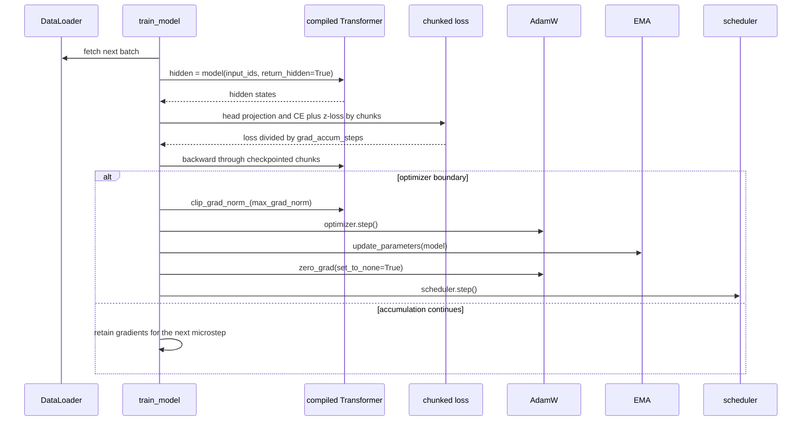
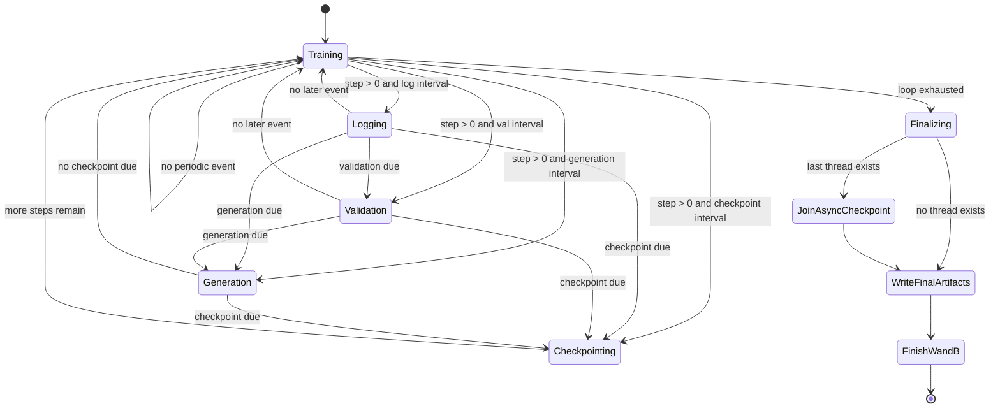

# Training Runtime and Lifecycle

`train.py` is the orchestration layer for a single-process, decoder-only language-model run. Its public entrypoint is `train_model(config, ...)`; executing `python train.py` obtains `get_config()` and calls it. The trainer owns device selection, data acquisition, model construction, loss execution, optimizer state, periodic side effects, and final artifact publication. The loader and model supply the data and compute contracts described in [Token Data and Loader Pipeline](/openwiki/architecture/data-pipeline.md) and [Memory and Numerics](/openwiki/concepts/memory-and-numerics.md).

## Run phases at a glance

A run has this effective order:

1. Select `cuda` when available, otherwise `cpu`; configure CUDA throughput settings only on CUDA.
2. Acquire all three data objects unless `train_dataloader`, `val_dataloader`, and `tokenizer` are all supplied. A missing token cache falls back to synthetic data; a tokenizer error falls back only to the byte tokenizer stub.
3. Resolve vocabulary and kernel implementations, then build and move the Transformer to the selected device.
4. Create an iterator and consume one real-shape batch for compile warmup. If enabled, compile the model and run a hidden-state forward, chunked loss, backward pass, and CUDA synchronization.
5. Partition trainable parameters into decayed tensors with dimension at least two and no-decay tensors, then construct AdamW, the warmup-plus-cosine scheduler, and optional EMA.
6. If `preload` is non-`None`, restore the newest numeric step checkpoint found in `model_folder`.
7. Initialize W&B, preload the next batch, and execute the step loop.
8. At periodic boundaries, log, validate, generate samples, and/or queue a checkpoint in that order.
9. Report throughput, join the most recently returned checkpoint thread, synchronously write final artifacts, finish W&B, and print the artifact directory.

The order is significant. In particular, compile warmup occurs before optimizer construction, and validation precedes generation, which precedes checkpointing when their intervals coincide.

## Entry, device setup, and data acquisition

The command-line entrypoint is:

```bash
python train.py
```

`train_model` chooses `torch.device('cuda')` if `torch.cuda.is_available()` is true, otherwise `torch.device('cpu')`, and prints `Using device: ...`. On CUDA it calls `setup_gpu_optimizations(config)`, which enables TF32 when `tf32` is true, sets float32 matmul precision to `high`, applies the configured cuDNN benchmark flag, disables cuDNN determinism, optionally sets `PYTORCH_CUDA_ALLOC_CONF`, and prints GPU name, memory, and compute capability. These settings are not applied by the trainer's CUDA branch on CPU runs.

If any of the three optional inputs is missing, the trainer calls `build_training_data(config)` and replaces the whole trio. That loader expects the configured raw `uint32` cache and uses a read-only `np.memmap`; it creates fixed `seq_len + 1` windows, shifts each into `input` and `target`, and builds train and validation `DataLoader`s. Training uses a reproducibly shuffled sampler and `drop_last=True`; validation is ordered and keeps its final partial batch. Device transfers use `non_blocking=True`, matching the loader's optional pinned-memory configuration.

### Explicit failure and fallback paths

These outcomes are intentionally observable:

- **Missing cache:** `build_training_data` raises `FileNotFoundError`. `train_model` catches it, prints the missing path and the suggested `python data/prepare_data.py` command, then calls `build_synthetic_data(config)`. The run continues, but it trains on deterministic random token ids and is not a real-corpus experiment.
- **Tokenizer failure:** when a cache exists, `build_training_data` separately tries `AutoTokenizer.from_pretrained`. Any exception—including unavailable `transformers`, download failure, or an invalid checkpoint—is printed as `[data] tokenizer load failed ...`; the runtime keeps the real cached training ids but supplies `_SyntheticTokenizerStub`. Its byte encode/decode behavior is useful for offline execution, while generation output is explicitly meaningless until a compatible tokenizer is available.
- **Preparation dependency failure:** `data/prepare_data.py` delegates preparation to the external `LLM/shared_data` package. If that package cannot be imported, the preparation command exits with a message explaining that the workspace package is required. This is different from the trainer's missing-cache fallback.
- **Triton not opted in:** the three implementation settings (`rmsnorm_impl`, `swiglu_impl`, and `cross_entropy_impl`) are read independently, but if any requests `triton` while `ENABLE_TRITON_KERNELS` is not exactly `1`, the trainer prints a warning and force-restores **all three** to `pytorch`. An explicitly opted-in Triton kernel does not silently fall back if unavailable or if it fails; the kernel error surfaces.

The effective model vocabulary is `max(config['vocab_size'], len(tokenizer))`, which protects capacity but cannot detect a semantically incompatible tokenizer. A cache and tokenizer must therefore share an id-space contract.

## Model construction and compile warmup

`build_transformer` creates the configured LLaMA-style decoder: 16 layers, GQA with 8 query and 4 key/value heads, RoPE, pre-norm RMSNorm, SwiGLU, and a separate untied output projection. The trainer passes `gradient_checkpointing`, QK-Norm, and the gated RMSNorm/SwiGLU implementation choices into the model. During training, gradient checkpointing wraps each decoder layer; during evaluation or generation, the decoder runs normally.

Before compilation, the trainer creates `step_iterator = iter(train_dataloader)` and consumes `_warmup_batch = _next_batch(...)`. It transfers that batch to the device. This is not a dry shape fabrication: the actual batch shape is used to avoid a later graph rebuild. If `compile_model` is true and `torch.compile` exists, the trainer compiles with `compile_mode` (default `reduce-overhead`) and runs:

- `model(_warmup_input, return_hidden=True)`;
- `chunked_head_cross_entropy_with_z` with the configured `ce_chunk_size`, `ignore_index=-100`, z-loss setting, and CE implementation;
- `_warmup_loss.backward()`; and
- CUDA synchronization followed by `Pre-warmup complete (CUDA graphs captured).` on CUDA-capable execution.

The warmup batch is consumed and not subsequently used as a training batch: after optimizer setup the trainer fetches the next iterator item into `next_batch`. Also, warmup backward happens before the optimizer exists and there is no explicit warmup `zero_grad`; those gradients remain on parameters until the first optimizer boundary clears them after stepping. This is an important implementation behavior when diagnosing the first step rather than an assumption that warmup is side-effect free.

Autocast is enabled with `torch.bfloat16` only when `device.type == 'cuda'`. On CPU, the autocast contexts are disabled. BF16 needs no GradScaler in this loop; gradient clipping and the optimizer operate on the resulting gradients and parameters.

## One training iteration

After warmup and setup, the trainer prefetches one batch into `next_input` and `next_target`. Each loop iteration uses that already-transferred batch as its current batch, fetches and transfers the following batch before compute, then executes the forward and loss. This overlaps host-side data acquisition with the current iteration's compute as far as the DataLoader and non-blocking copies permit; the code deliberately does not introduce a manual CUDA stream while CUDA graphs own the device stream.



Caption: One loop iteration transfers the following batch, computes a memory-bounded loss on the current batch, accumulates gradients, and conditionally performs the optimizer boundary.

The loss path requests hidden states rather than full logits. `chunked_head_cross_entropy_with_z` applies the output head and FP32 CE/z-loss to `ce_chunk_size` rows at a time, with a checkpoint around each chunk, so a full `[tokens, vocabulary]` logits tensor is not retained. `ignore_index` is `-100`; packed windows otherwise leave EOS separators learnable. The trainer divides loss by `grad_accum_steps` before `backward()`.

The optimizer boundary is exactly `(step + 1) % grad_accum_steps == 0`:

1. Clip all model gradients with `nn.utils.clip_grad_norm_` and `max_grad_norm`.
2. Call `optimizer.step()`.
3. Update EMA, if enabled, from the post-step model.
4. Clear gradients with `optimizer.zero_grad(set_to_none=True)`.
5. Step the `SequentialLR` scheduler.

Thus EMA and scheduler stepping occur only on optimizer boundaries, not every microstep. AdamW puts tensors with `dim() >= 2` in the configured weight-decay group and all other trainable tensors in a zero-decay group. The scheduler is `LinearLR` for `warmup_steps`, followed by `CosineAnnealingLR` through `max_steps`, from the configured learning rate toward `min_lr`.

The loop's data iterator can exhaust before `max_steps`. `_next_batch` increments an epoch counter, calls `sampler.set_epoch(epoch)` when available, prints a corpus-exhaustion warning, and starts a fresh iterator. This is normal wraparound for the configured plan (the source comment calls out roughly 8.26B planned tokens), not a termination condition. A resumed loop uses the checkpoint's step as the range start, but the accumulation boundary is still calculated from the absolute `step` value.

## Logging and periodic side effects

The default production cadence is `log_interval=50`, `val_interval=2000`, `generation_interval=20000`, and `checkpoint_interval=5000`; every periodic condition also requires `step > 0`. Logging is checked first after the optimizer/accumulation work, followed by validation, generation, and checkpointing.

At a log point, CUDA synchronizes before timing and metrics are read. W&B receives:

- `train/loss`, restored to the unscaled value by multiplying the current scaled loss by `grad_accum_steps`;
- current scheduler LR and the most recently computed gradient norm;
- step time, tokens per second, tokens seen, effective batch size, and accumulated data-wait time; and
- on CUDA, allocated, peak allocated, reserved memory, and GPU utilization when available.

The same loss, LR, throughput, and data wait are shown in the tqdm postfix. `tokens_seen` is calculated for logging as `step * (batch_size * seq_len * grad_accum_steps)`, while checkpoint metadata uses its analogous checkpoint-step formula.

### Validation

At a validation boundary, CUDA peak-memory statistics are reset first. The trainer validates the EMA model when EMA exists; otherwise it validates the live model. `validate` sets evaluation mode, processes at most `val_max_batches` batches (100 by default), uses CUDA-only BF16 autocast, requests hidden states, and applies the same chunked head loss and z-loss configuration. It averages the per-batch scalar losses, computes `exp(min(avg_loss, 20))`, logs `val/loss` and `val/perplexity`, restores training mode, and returns the average.

If the returned loss is strictly below `best_val_loss`, the trainer updates the shared best-loss state and synchronously saves the **live** `model.state_dict()` to `<model_folder>/<model_filename>_best.pt`. Validation may use EMA, but this best-model file is not the EMA state. Equal losses do not replace the existing best. The validation branch then calls `model.train()` on the live model.

### Generation

At a generation boundary, the trainer chooses EMA when available and calls `generate_samples`. That function sets the selected model to evaluation mode and uses five fixed prose/code prompts. For each prompt it encodes with the runtime tokenizer, autoregressively runs up to `generation_max_tokens` (128 by default), applies CUDA-only BF16 autocast, temperature, `generation_top_k` (50 by default), and a hard-coded `top_p=0.9`, then samples with `torch.multinomial`. It stops early when the sampled id equals `tokenizer.eos_token_id`, decodes the complete sequence, adds a row to a W&B table, logs `gen/samples`, and restores training mode. With the byte stub, this remains executable but is not meaningful text generation.

## Checkpoint persistence, resume, and shutdown

Periodic checkpoints capture a full restart state:

```text
model_state_dict
optimizer_state_dict
scheduler_state_dict
step
tokens_seen
best_val_loss
rng_torch, rng_numpy, rng_python
config
ema_state_dict (or None)
rng_cuda (when CUDA is available)
```

`save_checkpoint` creates `model_folder` as needed. A periodic save writes `<model_filename>_step_<step>.pt`; with `async_checkpoint=True` it starts a daemon thread named `ckpt-save-<step>`, calls `torch.save` in that thread, prints `Checkpoint queued (async): ...`, and returns the thread. With asynchronous saving disabled it writes synchronously and prints `Checkpoint saved: ...`. The retention pass, when `keep_last_n_checkpoints > 0`, sorts step files numerically and unlinks all but the newest configured number (three by default).

At the end of the loop the trainer prints elapsed hours and average throughput. If a checkpoint thread was returned, it calls `ckpt_thread.join()` before final persistence, explicitly preventing process exit while the last asynchronous write is in progress. The variable stores only the most recently returned thread; earlier asynchronous saves are not separately joined by this shutdown block. The final save is synchronous and uses special names:

- `<model_filename>_final_model_full.pt` contains the full checkpoint structure;
- `<model_filename>_final_model_weights.pt` contains only `model.state_dict()`.

The trainer then calls `wandb.finish()` and prints `All artifacts saved to: <model_folder>`. Final files are not named as a normal step checkpoint, so retention cleanup does not treat them as step files.

When `config['preload']` is non-`None`, `load_checkpoint` scans `model_folder` for `<model_filename>_step_*.pt`, sorts numeric suffixes, and restores the newest one. It restores model, optimizer, scheduler, Python/NumPy/Torch RNG state, CUDA RNG state when present, and EMA state when present, then prints `Resumed from step ...`. It returns `(0, inf)` without error if no step checkpoint exists. The `preload` value acts as an enable switch; the loader does not use it as a direct checkpoint pathname.

## Configuration and safe operating boundaries

`config.py:get_config()` is the single source for architecture, data, runtime, cadence, persistence, and W&B settings. The production defaults most relevant to lifecycle behavior are:

| Area | Keys and defaults |
|---|---|
| Compute | `compile_model=True`, `compile_mode='reduce-overhead'`, `gradient_checkpointing=True`, `ce_chunk_size=256` |
| Precision and kernels | `tf32=True`, `cudnn_benchmark=True`, all three `*_impl='pytorch'`, `use_z_loss=True`, `z_loss_weight=1e-4` |
| Optimization | `batch_size=96`, `gradient_accumulation=1`, `max_steps=42000`, `learning_rate=3e-4`, `min_lr=3e-5`, `warmup_steps=2000`, `max_grad_norm=1.0`, `ema_decay=0.999` |
| Side effects | `val_interval=2000`, `val_max_batches=100`, `generation_interval=20000`, `checkpoint_interval=5000`, `log_interval=50` |
| Persistence | `model_folder='weights'`, `model_filename='llama3-515M'`, `keep_last_n_checkpoints=3`, `async_checkpoint=True`, `preload=None` |
| Observability | `wandb_project='langgpt-llama3-pretrain'`, optional `wandb_entity`, and `wandb_tags` |

Safe extensions preserve the batch dictionary (`input`, `target`), the hidden-state/output-head loss boundary, the explicit Triton opt-in, the optimizer-boundary ordering, and checkpoint state completeness. Change the loader and training wraparound together when changing corpus cardinality or sampler semantics. Change tokenizer and cache together when changing token ids. If using an EMA model or adding an artifact, decide explicitly whether validation, best-model saving, generation, and final persistence should use live or averaged weights; the current implementation intentionally uses EMA for validation/generation but live weights for best and final state dictionaries.

## Focused verification

The tests cover the components that determine whether a run is trustworthy, while deliberately avoiding an unbounded production `train_model` run:

- `tests/test_smoke.py` exercises synthetic windows, one forward/backward optimizer step, finite gradients and loss, short-run overfitting, dense-versus-chunked CE equivalence, and finite validation with a stubbed W&B logger.
- `tests/test_train.py` checks deterministic top-k/top-p sampling, checkpoint creation, model/optimizer/scheduler round-trip, full RNG restoration, no-checkpoint resume behavior, special final names, asynchronous save completion, cross-device RNG/checkpoint restore on GPU, and idempotent GPU setup.
- `tests/test_config.py` protects the complete configuration key set, important defaults, head divisibility, positive data weights, and learning-rate schedule invariants.
- `tests/e2e_gpu_smoke.py` runs the synthetic data/model path, chunked-loss comparison, validation, and checkpoint round-trip on the selected device; GPU-only checks are skipped when CUDA is unavailable.

The test suite does not prove that a real cache contains the intended corpus or that an external tokenizer is semantically compatible. Those remain deployment checks at the data boundary.

## Periodic lifecycle

The following state view captures the actual event order inside the loop and the finalization barrier. Validation, generation, and checkpointing are independent modulo conditions; if several are due on one step, they run in the order shown.



Caption: Periodic work is ordered logging, validation, generation, then checkpointing; loop exhaustion joins the last async save before final files, W&B shutdown, and process completion.
