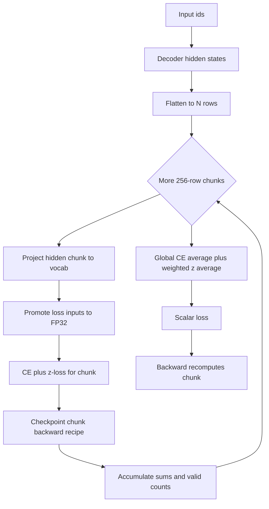

# Memory, Precision, and Loss Engineering

This model is sized for a single A100 80GB run at `batch_size=96` and `seq_len=2048`. The important design is not one optimization but the boundary between the decoder, its output head, and the loss: the decoder produces hidden states, then the training loop applies the vocabulary projection and loss in small token slices. The result is a bounded peak working set rather than a persistent `[batch, sequence, vocabulary]` logits tensor.

The production defaults that are load-bearing for this page are `gradient_checkpointing=True`, `ce_chunk_size=256`, `use_z_loss=True`, `z_loss_weight=1e-4`, `tf32=True`, `compile_model=True`, and `compile_mode='reduce-overhead'`. The architecture is 16 layers with `d_model=1024`, 8 query heads, 4 key/value heads, `head_dim=128`, `d_ff=4096`, and a 128,000-token vocabulary. See [Training Runtime and Lifecycle](/openwiki/architecture/training-runtime.md) for the surrounding iterator, optimizer, validation, and checkpoint lifecycle.

## The memory boundary: hidden states, not full logits

`Transformer.forward` always computes embeddings and the decoder first. In training, `return_hidden=True` returns the final normalized hidden states and deliberately skips `output_proj`; the trainer flattens them to `[N, d_model]`, where `N = batch_size * seq_len`, and passes them with `output_proj.weight` and flattened targets to `chunked_head_cross_entropy_with_z`.

There are two similarly named losses with different memory contracts:

- **`chunked_cross_entropy_with_z(logits, targets, ...)`** accepts already-materialized logits. It chunks only the FP32 loss calculation along the token axis. It is useful for equivalence tests or callers that already have logits, but it cannot reclaim the memory used to create the full logits tensor.
- **`chunked_head_cross_entropy_with_z(hidden, head_weight, targets, ...)`** is the production LM-head path. For each slice it computes `F.linear(hidden_c, head_weight)`, evaluates CE plus z-loss, and discards that slice after checkpoint bookkeeping. The full vocabulary projection is therefore never materialized.

At the default workload, a dense BF16 logits tensor is roughly `96 * 2048 * 128000 * 2` bytes (about 50 GB before temporary loss intermediates). A 256-row slice has a vastly smaller live vocabulary matrix; the repository's memory budget reports about 0.3 GB for the chunked logits/loss working set. The exact peak depends on allocator and autograd temporaries, but **256 is the default invariant**: do not change it casually when tuning memory.

### Loss and memory control flow



Caption: The production path keeps one LM-head logits chunk alive, accumulates token-normalized statistics, and replays chunks during backward.

Each PyTorch chunk returns CE numerator, valid-token count, and z numerator. Final CE is `total_ce / total_count`; z-loss is `z_accum / n_z`; the returned scalar is their sum with `z_loss_weight`. `ignore_index=-100` positions are excluded from both averages in the PyTorch implementation. If every target is ignored, the implementation returns a zero CE term and avoids division by zero for z-loss.

The chunk function wraps each `_chunk` call in `torch.utils.checkpoint.checkpoint(..., use_reentrant=False)`. This saves the inputs needed to replay the chunk instead of retaining all forward intermediates. Gradients still flow to both hidden states and `head_weight`; the focused tests prove the output projection and input embedding receive finite gradients.

## CE, z-loss, and numerical contracts

The intended objective is:

```text
CE(logits, targets) + z_loss_weight * mean(logsumexp(float(logits), dim=-1) ** 2)
```

The `float` promotion is intentional. Autocast may produce BF16 logits, but `logsumexp` and the loss chain use FP32 values, reducing overflow and precision loss in the vocabulary reduction. The z-loss penalizes a large log-partition value and therefore discourages uncontrolled output-logit growth. Its default coefficient is small (`1e-4`), so it stabilizes the output scale without replacing next-token CE. Setting `use_z_loss=False` selects a zero coefficient; it does not change the head-memory boundary.

For a caller that already owns dense logits, `chunked_cross_entropy_with_z` uses the same FP32 per-chunk reduction and globally aggregates token sums. With `z_loss_weight=0`, it is expected to match ordinary `F.cross_entropy`; with the penalty enabled, tests compare it to dense CE plus the log-partition penalty within `1e-5` on representative inputs. The head-bounded implementation is tested against dense CE both with zero z-loss and with z-loss, and its gradient contract is separately tested.

These are equivalence contracts, not a promise of bit identity across every backend. BF16 projection output, FP32 loss promotion, reduction order, and Triton atomics can produce small differences. A safe numerical change should preserve finite loss/gradients and the tested tolerance against the pure-PyTorch reference.

### Important ignored-target boundary

The PyTorch model path excludes `ignore_index` rows from CE and z-loss. The Triton module's standalone reference and fused forward currently reduce z-loss over all rows, and its kernel loads the target logit before guarding the `valid` contribution. Consequently, the Triton path should be treated as equivalent for the packed, non-ignored training workload covered by the GPU smoke test, not as a drop-in guarantee for arbitrary ignored-target batches. If padding or ignored rows are introduced, update and test the Triton reduction and target-load semantics before enabling it.

## Activation checkpointing

The Transformer applies checkpointing per decoder layer only when both `gradient_checkpointing` is enabled and the model is in training mode. Each layer is a pre-norm residual block: RMSNorm → causal attention → residual add, followed by RMSNorm → SwiGLU → residual add. The embedding and final norm remain outside those layer checkpoints. During evaluation and generation the decoder runs normally, so checkpointing is a training-memory feature rather than an inference behavior.

Checkpointing trades recomputation for activation residency: backward replays a layer instead of keeping every layer's intermediate activation. The loss adds a second checkpoint boundary around each 256-row head/loss slice. Together, the stack removes the two dominant persistent tensors—layer activations and full-vocabulary logits—while retaining the model parameters and optimizer state.

The training loop uses the hidden-state boundary in both training and validation. Validation also uses the chunked head loss and at most the configured validation batches, so measuring validation does not accidentally allocate dense logits. A normal forward with `return_hidden=False` remains available for generation and tests that need logits.

## BF16 and TF32: different jobs

Training enters `torch.autocast(device_type='cuda', dtype=torch.bfloat16)` around the model and loss when the selected device is CUDA; CPU contexts are disabled. Parameters are not converted by this context, and the optimizer continues to update the model's stored parameters and gradients. BF16 reduces activation and matrix-product footprint and is native on the target A100. Its FP32-like exponent range is why this loop does not use `GradScaler`; it still promotes the loss reduction to FP32 and clips gradients with `max_grad_norm=1.0` before an optimizer step.

`setup_gpu_optimizations` is called for CUDA runs. With `tf32=True` it enables TF32 for CUDA float32 matmuls and cuDNN, sets `torch.set_float32_matmul_precision('high')`, enables the configured cuDNN benchmark behavior, and leaves cuDNN nondeterministic. TF32 is primarily a throughput choice for float32 matrix operations; it is not a substitute for BF16 autocast and does not reduce memory by itself. Reproducibility claims must therefore distinguish checkpointed RNG restoration from deterministic kernel execution.

RMSNorm is computed as `x * rsqrt(mean(x^2) + eps) * weight` with `eps=1e-5`. The reference implementation and tests establish its shape, scale invariance, learnable weight, and float64 numerical behavior. QK-Norm applies the same style of normalization to each projected query and key head before RoPE; it bounds the scale entering attention logits and is enabled by default. Disabling QK-Norm replaces those two norms with `nn.Identity`, and tests verify the disabled branch is structurally and numerically uneventful.

## SDPA attention and GQA

`GroupedQueryAttention` projects queries to 8 heads but keys and values to 4 heads. It applies QK-Norm, RoPE with the load-bearing `rope_theta=500000.0`, transposes to attention layout, and repeats each KV head for `n_rep = n_heads // n_kv_heads` (2 in production). It then calls:

```python
F.scaled_dot_product_attention(q, k, v, is_causal=True)
```

This is the SDPA dispatch boundary: PyTorch selects an available optimized attention backend, including a Flash-Attention-style fused backend when the device, dtype, shape, and installed PyTorch support permit it. The model does not import a separate attention package or force a backend in this code. The causal flag is part of the correctness contract; the attention test perturbs a future token and verifies earlier outputs do not change.

GQA narrows the K/V projections from 8 heads to 4, reducing those projection parameters and the pre-repeat K/V representation relative to MHA. The current implementation repeats K/V before SDPA and contains no persistent KV-cache implementation, so do not describe this repository as proving a halved inference cache. Its tested contract is head divisibility, `n_rep` calculation, valid output shape, causal masking, and finite execution.

## Fused SwiGLU

Each feed-forward block uses one `gate_up_proj` with output width `2 * d_ff`, splits it into `gate` and `up`, computes `F.silu(gate) * up`, and applies `down_proj`. This replaces separate gate and up GEMMs with one fused projection GEMM plus the down projection and reads the input activation once for the pair. The test reconstructs two separate linear projections from the packed weight and requires the fused path to match.

The raw PyTorch path is the default and is the numerical reference. The optional Triton path fuses only `silu(gate) * up` after `gate_up_proj`; it does not create a custom kernel outside `kernels/`. Its reference is `swiglu_pytorch`, and its custom autograd backward recomputes that reference.

## Compile behavior and shape discipline

`train_model` compiles the model, not a new alternate numerical algorithm. When `compile_model=True` and `torch.compile` exists, it uses `compile_mode='reduce-overhead'`. Before compilation it consumes a real batch from the training iterator, transfers it, and runs a warmup hidden-state forward, the configured chunked head loss, and backward. This pays compilation and autotuning costs before measured steps and gives the compiler the production batch shapes. The warmup batch is consumed rather than trained a second time; a later iterator fetch supplies the first actual loop batch.

The loss remains an explicit Python call around the compiled model and still owns its 256-row checkpoint loop. A compile failure is not silently converted to eager execution. Conversely, if compilation is disabled or the installed PyTorch has no `torch.compile`, the trainer proceeds without compilation. Changes to batch shape, sequence length, vocabulary width, chunk size, or checkpoint structure can trigger graph specialization or alter memory; benchmark such changes rather than assuming the warmup contract survives unchanged.

## Triton modules: explicit, narrow, and fail-loud

There are exactly three sanctioned Triton modules, all under `kernels/`:

| Setting | Module and reference | Fused responsibility |
|---|---|---|
| `rmsnorm_impl='triton'` | `kernels/rmsnorm_triton.py` / `rmsnorm_pytorch` | Row-wise RMSNorm forward |
| `swiglu_impl='triton'` | `kernels/swiglu_triton.py` / `swiglu_pytorch` | Fused `silu(gate) * up` |
| `cross_entropy_impl='triton'` | `kernels/cross_entropy_triton.py` / `cross_entropy_with_z_pytorch` | Online-softmax CE plus z-loss over supplied logits |

Each module imports Triton under `try/except ImportError` and exposes `HAS_TRITON`. Each forward is wrapped in `torch.autograd.Function`; backward recomputes through its pure-PyTorch reference. This makes the references usable on CPU without Triton and gives tests a concrete equivalence target. The cross-entropy Triton reduction uses one program per row and a power-of-two vocabulary block; it raises when the next power-of-two block exceeds its 131072 maximum. RMSNorm and SwiGLU similarly validate their supported block widths.

All three config keys default to `'pytorch'`. A Triton implementation is active only when its per-kernel config value is `'triton'` **and** `ENABLE_TRITON_KERNELS=1`. If any key requests Triton without that exact environment opt-in, `train_model` warns and force-restores all three implementations to `'pytorch'`. If the environment opt-in is present, missing Triton raises `ImportError`, and unsupported shapes or runtime/compile failures surface from the selected kernel. There is no silent fallback from an opted-in kernel to PyTorch. Use the explicit PyTorch setting for CPU, Mac, or a kernel failure investigation.

The GPU smoke path checks all three sanctioned modules against references when CUDA and Triton are available; on CPU it skips GPU-only execution. The repository does not claim or permit a custom kernel outside these three `kernels/` paths without extending the sanctioned contract and its CPU-reference tests.

## What to preserve when changing this page's systems

- Keep `ce_chunk_size=256` unless a deliberate memory benchmark and numerical test justify a coordinated change.
- Preserve the hidden-state → chunked LM-head loss boundary; using `model(input_ids)` in the training loss recreates the dense logits problem.
- Keep CE and z-loss reductions in FP32 and maintain the ignored-target denominator semantics on the PyTorch path.
- Treat `return_hidden=True` as the memory-critical entrypoint used by training and validation.
- Keep checkpointing in training only and preserve both per-layer and per-loss-chunk recomputation behavior.
- Preserve causal SDPA, the 8Q/4KV divisibility relationship, `rope_theta=500000.0`, and the packed `2*d_ff` gate/up projection.
- Keep all three Triton switches explicit, the `ENABLE_TRITON_KERNELS=1` gate exact, and failures fail-loud rather than silently falling back.

## Focused verification

`tests/test_model.py` covers RMSNorm/reference behavior, causal and shape-safe GQA, fused SwiGLU equivalence, checkpointed versus ordinary Transformer outputs and gradients, CE-plus-z numerical behavior, ignored-target masking, dense versus memory-bounded head loss, hidden/head gradient flow, and QK-Norm toggles. `tests/test_smoke.py` exercises a synthetic end-to-end step, finite gradients, short-run learning, dense-versus-chunked CE, and validation through the same memory-bounded head path. `tests/test_config.py` protects the production `ce_chunk_size=256`, GQA divisibility, and complete runtime configuration. `tests/e2e_gpu_smoke.py` adds CUDA-side chunked-loss, checkpoint, and sanctioned Triton reference checks when the required hardware and package are present.

These tests establish implementation contracts and representative tolerances; they do not prove a particular A100 memory peak, an available SDPA backend, or semantic compatibility between an external tokenizer and a token cache. Those are deployment and benchmark checks.
