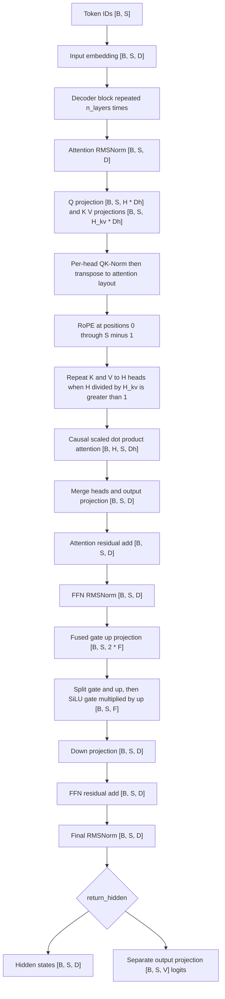

# Decoder Model Architecture

This repository implements a decoder-only, LLaMA-style Transformer in `model.py`. The production configuration has 16 decoder blocks, `d_model=1024`, 8 query heads, 4 key/value heads, `head_dim=128`, `d_ff=4096`, a 128,000-token vocabulary, and `seq_len=2048`. The model is causal: a token may attend to itself and earlier positions, but not to later positions.

The implementation is deliberately split into two boundaries:

1. `Transformer.forward` embeds token IDs and runs the decoder stack, ending at final normalized hidden states.
2. The separate `output_proj` language-model head maps those states to vocabulary logits only when the caller requests the ordinary logits output. Training and validation use `return_hidden=True` and apply the head in the memory-bounded chunked-loss path instead of materializing all logits at once.

The README's older architecture sketch mentions multiplying embeddings by `sqrt(d_model)`, but the current `Transformer.forward` does not perform that scaling. The actual embedding output is passed directly to the decoder.

## Forward contract

Let `B` be batch size, `S` the input sequence length, `D = d_model`, `H = n_heads`, `H_kv = n_kv_heads`, `Dh = head_dim`, `F = d_ff`, and `V = vocab_size`.



Caption: The forward pass embeds IDs, applies pre-norm attention and SwiGLU residual sublayers `n_layers` times, then either returns final hidden states or applies the untied LM head.

For production settings, `H=8`, `H_kv=4`, and `Dh=128`, so each query head is paired with one of four KV heads and `n_rep = H // H_kv = 2`. The model does not validate divisibility at construction time; the repeat-and-reshape operation assumes that `n_heads` is divisible by `n_kv_heads`. A non-divisible configuration can construct successfully but fail at forward time when the expanded K/V tensor is reshaped. The tests explicitly cover valid ratios and this failure mode.

## Transformer ownership and entrypoints

`build_transformer(...)` is the construction entrypoint. It forwards explicit architecture settings to `Transformer`, which owns:

- `input_embedding = nn.Embedding(vocab_size, d_model)`;
- a `ModuleList` containing `n_layers` `DecoderBlock` instances;
- the `Decoder` wrapper and its final RMSNorm; and
- `output_proj = nn.Linear(d_model, vocab_size, bias=False)`.

All linear and embedding weights are initialized from a normal distribution with mean `0.0` and standard deviation `0.02`. RoPE frequency tables are buffers rather than trainable parameters. `build_transformer` prints total and non-embedding parameter counts but does not alter the forward contract.

The production `config.py` supplies `vocab_size=128000`, while the builder's standalone default is `vocab_size=128256`. `train.py` passes `real_vocab_size = max(config['vocab_size'], len(tokenizer))` to the builder, so the runtime head width is the tokenizer-compatible value selected by training. Tests that use `full_config` pass the configured 128,000 explicitly; tiny tests use a 256-token vocabulary.

### `return_hidden` is an architectural boundary

`Transformer.forward(x, return_hidden=False)` first computes the embedding and decoder output in both modes. With `return_hidden=True`, it returns the final `[B, S, D]` tensor immediately and does **not** execute `output_proj`. With the default `False`, it computes and returns logits of shape `[B, S, V]`.

This distinction is observable and important:

- Tests assert that `return_hidden=True` has the model-width shape while the ordinary path has vocabulary width.
- Training and validation flatten hidden states to `[B*S, D]`, pass them with `output_proj.weight` and flattened targets to `chunked_head_cross_entropy_with_z`, and thereby avoid a full `[B, S, V]` allocation.
- Callers such as generation that need next-token scores use the ordinary logits path.

The head-loss function computes `F.linear(hidden_chunk, output_proj.weight)` for each token chunk, so gradients still reach both the decoder hidden states and the untied output-head weights. The memory and numerical details of this boundary are documented in [Memory, Precision, and Loss Engineering](/openwiki/concepts/memory-and-numerics.md).

## Pre-norm decoder blocks

Each `DecoderBlock` preserves the residual stream width `[B, S, D]` throughout and executes in this exact order:

```text
x = x + attention(attention_norm(x))
x = x + ffn(ffn_norm(x))
```

This is pre-norm ordering: each sublayer sees a normalized copy of the current residual stream, and the sublayer result is added back to the unnormalized stream. Attention is completed before the second normalization and FFN sublayer begins. There is no post-attention normalization between the attention output projection and its residual add.

`Decoder` applies every block in list order and then applies one final RMSNorm. The final norm is part of the decoder output in both ordinary and hidden-state modes.

When `gradient_checkpointing=True` and the model is in training mode, `Transformer.forward` checkpoints each decoder layer individually and applies `self.decoder.norm` afterward. When the model is in evaluation mode, or checkpointing is disabled, it calls `self.decoder(x)`, which runs the same blocks and final norm without layer checkpoints. The focused tests require checkpointed and ordinary outputs to match in both evaluation and training modes and verify finite gradients through the checkpointed branch.

## RMSNorm and QK-Norm

`RMSNorm` has one learnable vector `weight` of length equal to its normalized width and computes:

```text
x * rsqrt(mean(x ** 2, dim=-1, keepdim=True) + eps) * weight
```

The default epsilon is `1e-5`. It normalizes the last dimension without subtracting a mean, preserves the input shape, and leaves a zero input at zero. The tests cover the reference formula, shape preservation, scale invariance, and learnability of the weight.

The block norms use the configured `rms_norm_eps` (production `1e-5`) and width `D`. QK-Norm is a separate optional feature enabled by production `qknorm=True`: after projection and before the attention-layout transpose, it applies an RMSNorm of width `Dh` independently to each projected query and key head. This bounds the projected Q/K scale before RoPE and attention. In the current implementation those Q/K norms use the `GroupedQueryAttention` default `eps=1e-5`; they do not receive `rms_norm_eps` from the outer `Transformer` constructor.

With `qknorm=False`, `q_norm` and `k_norm` are `nn.Identity` modules and no QK-Norm parameters are added. With it enabled, each block adds one `Dh`-element query norm and one `Dh`-element key norm, or `2 * head_dim` parameters per layer. Tests verify both the parameter increase and the enabled/disabled module choices.

## Grouped-Query Attention

`GroupedQueryAttention` starts from `[B, S, D]` and uses bias-free projections:

| Projection | Output before reshape | Per-head layout |
|---|---:|---:|
| `q_proj` | `[B, S, H * Dh]` | `[B, S, H, Dh]` |
| `k_proj` | `[B, S, H_kv * Dh]` | `[B, S, H_kv, Dh]` |
| `v_proj` | `[B, S, H_kv * Dh]` | `[B, S, H_kv, Dh]` |

Q and K are optionally QK-normalized while `Dh` is their last dimension. All three tensors are then transposed to put heads before sequence: Q is `[B, H, S, Dh]`, while K and V are initially `[B, H_kv, S, Dh]`.

RoPE is applied independently to Q and K, not V. The attention module owns one `RoPE` instance configured with `head_dim`, `max_seq_len`, and `rope_theta`. If `H > H_kv`, K and V are expanded by inserting a repetition dimension and reshaping so each KV head is shared by `n_rep = H // H_kv` query heads. In production, two query heads share each KV head. The repeated tensors sent to attention are `[B, H, S, Dh]`.

The attention operation is exactly:

```python
F.scaled_dot_product_attention(q, k, v, is_causal=True)
```

The `is_causal=True` argument is the masking invariant. SDPA returns `[B, H, S, Dh]`; the module transposes and concatenates heads to `[B, S, H * Dh]`, then uses `out_proj` to return `[B, S, D]`. There is no persistent KV-cache implementation in `model.py`; GQA's tested contract is projection shape, repetition ratio, causal behavior, and output shape rather than a separately implemented inference cache.

The causal test changes a later input token and asserts that earlier outputs are unchanged. The valid-ratio tests cover `(4, 2)`, `(8, 4)`, `(4, 4)`, and `(2, 1)` head/KV-head configurations. The invalid `(8, 3)` case demonstrates why callers must preserve divisibility even though construction computes an integer floor division.

## RoPE

`RoPE` precomputes inverse frequencies and cosine/sine tables for positions up to `max_seq_len`. For an input whose last dimension is `Dh`, it splits even and odd channels into `x1` and `x2`, rotates each pair with the cached cosine and sine values, stacks the pairs, and flattens back to the original shape. The cached cosine and sine tensors have shape `[1, 1, max_seq_len, Dh / 2]`; the returned tensor retains the input shape.

The production invariant is `rope_theta=500000.0`, not the common small illustrative value `10000.0`. The constructor and builder both default to 500,000, and `config.py` supplies the same value. Tests verify cache shapes, decreasing inverse frequencies, norm preservation, identity at position zero, and a relative-position property. Inputs longer than `max_seq_len` are outside the cached-table contract and should be rejected or configured for explicitly rather than assumed to extrapolate at runtime.

## Fused SwiGLU feed-forward network

Each block's `SwiGLUFFN` uses two bias-free linear layers, but packs the gate and up projections into one matrix:

```text
gate_up = gate_up_proj(x)                 # [B, S, 2 * F]
gate, up = gate_up.chunk(2, dim=-1)       # each [B, S, F]
y = down_proj(SiLU(gate) * up)            # [B, S, D]
```

Thus `gate_up_proj.weight` has shape `[2 * d_ff, d_model]` and `down_proj.weight` has shape `[d_model, d_ff]`. In the production configuration these are `[8192, 1024]` and `[1024, 4096]`. The packed projection replaces separate gate and up matrix multiplications while preserving the standard SwiGLU computation. The test reconstructs separate projections from the packed rows and requires the fused output to match.

The default `swiglu_impl='pytorch'` path performs the split and `F.silu(gate) * up` directly. `swiglu_impl='triton'` is an explicit optional path that replaces only this elementwise operation after the packed projection; selected Triton failures are intended to surface rather than silently change implementation. The same explicit-PyTorch-by-default policy applies to `rmsnorm_impl` and the separate loss implementation. See [Memory, Precision, and Loss Engineering](/openwiki/concepts/memory-and-numerics.md) for the sanctioned kernel and numerical contracts.

## Final normalization and the separate LM head

The decoder's final `RMSNorm` produces the representation consumed by either API branch. `output_proj` is a bias-free `D`-to-`V` linear layer owned directly by `Transformer`, not by `Decoder`, and its weight is **not** tied to `input_embedding.weight`. This untied relationship is load-bearing: input token lookup and output vocabulary scoring have separate parameter matrices, even though both use the vocabulary dimension.

For an ordinary forward call, the shape progression after the final norm is:

```text
[B, S, D] --output_proj--> [B, S, V]
```

For the hidden-state call, the progression stops at `[B, S, D]`. This is why the output head can be used independently by the chunked loss, and why a hidden-state caller must supply the matching `output_proj.weight` if it wants vocabulary scores.

## Parameter-count convention

`Transformer.get_num_params(non_embedding=True)` begins with the number of elements in **all** model parameters. When `non_embedding=True`, it subtracts both:

- `input_embedding.weight.numel()`; and
- `output_proj.weight.numel()`.

Because the two matrices are untied, both are present and both are excluded by this repository's “non-embedding” metric. It does not subtract decoder norms, attention projections, FFN projections, or any other vocabulary-independent parameters. With `non_embedding=False`, the method returns the full parameter count.

This convention is easy to confuse with a metric that subtracts only the input embedding or with a tied-head model. The parameter-count tests build the production configuration, check total parameters against the approximately 515M advertised size, and independently check the non-embedding definition against the approximately 252M advertised size. QK-Norm parameters are included in the total and in the non-embedding count when enabled.

## Configuration and safe extension points

Use `build_transformer` or `Transformer` with explicit compatible dimensions when constructing variants. Preserve these relationships when changing configuration:

- `n_heads` must be divisible by `n_kv_heads`, because K/V repetition uses `n_heads // n_kv_heads` and reshapes to `n_heads`.
- `head_dim` must be compatible with RoPE's even/odd pairing; the implementation's frequency table has `head_dim / 2` columns.
- `seq_len` passed as `max_seq_len` bounds the cached RoPE positions.
- `d_model` is the embedding, residual, norm, and output-head input width.
- `d_ff` is the post-gate/up width and the first projection emits exactly `2 * d_ff` values.
- `rope_theta=500000.0`, causal SDPA, pre-norm residual ordering, and untied embeddings are production invariants, not cosmetic defaults.

The model is raw PyTorch by default. Triton substitutions are narrow opt-ins selected by `rmsnorm_impl` and `swiglu_impl`; training separately controls the chunked loss implementation. In `train.py`, Triton settings are force-restored to PyTorch unless `ENABLE_TRITON_KERNELS=1` is set, and the model is built with the runtime vocabulary size. Changes to these boundaries should update both the CPU reference tests and the training/validation callers.

## Focused verification

`tests/test_model.py` is the authoritative focused suite for this contract:

- `TestRMSNorm` checks shape, zero behavior, reference numerical equivalence, scale invariance, and a learnable unit-initialized weight.
- `TestRoPE` checks cache dimensions, frequency ordering, orthogonal norm preservation, position-zero identity, and translation-relative behavior.
- `TestGroupedQueryAttention` checks output dimensions, causal masking, valid GQA repetition ratios, and the runtime failure for a non-divisible KV-head count.
- `TestSwiGLUFFN` checks output dimensions, packed projection dimensions, and equality with an unfused reference.
- `TestTransformerForward` checks logits shape, finite gradients, and equivalence of checkpointed and non-checkpointed paths in evaluation and training.
- `TestChunkedHeadCrossEntropyWithZ` checks dense-loss equivalence, z-loss equivalence, gradient flow to the head and embeddings, and that `return_hidden=True` skips the head and returns model width.
- `TestQKNorm` checks the parameter delta and enabled/disabled QK-Norm modules.
- `TestTransformerParamCount` protects both the total-parameter estimate and the repository-specific subtraction convention.

These tests establish tensor and ordering contracts for representative inputs. They do not prove that every arbitrary head ratio, sequence length beyond the RoPE cache, SDPA backend, or optional Triton kernel is supported; those remain configuration and deployment checks.
