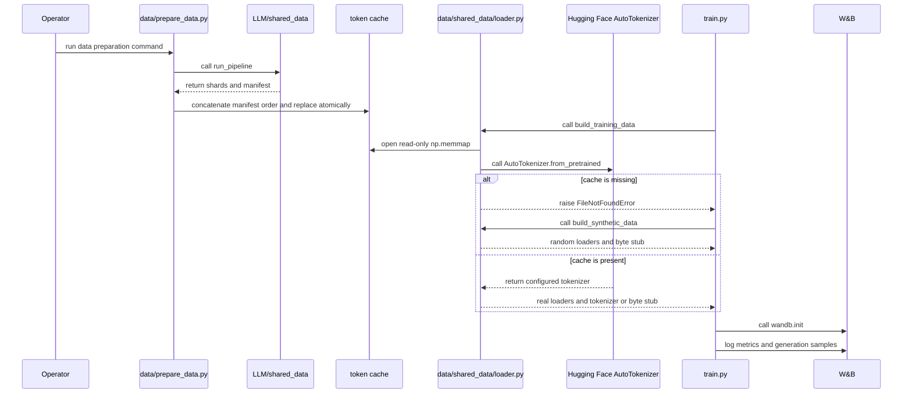

# External Data, Tokenizer, Tracking, and Accelerators

This project keeps several integrations deliberately narrow:

- **Data preparation** belongs to the unvendored workspace package `LLM/shared_data`. This repository contains only the adapter CLI in `data/prepare_data.py` and the runtime loader in `data/shared_data/`.
- **Token IDs** come from the prepared cache. The configured Hugging Face tokenizer is loaded separately, primarily so training can decode generation samples; it is not a substitute for preparing the cache.
- **Telemetry** is a production `wandb` integration in `train.py`, while tests install an offline stub or monkeypatch logging.
- **Acceleration** is ordinary PyTorch by default. CUDA tuning and BF16 are selected from the runtime device; Triton is a separate, explicit opt-in and is not allowed to quietly fall back after activation.

These boundaries mean that “the training process started” does not prove that a real corpus, a real tokenizer, online telemetry, or a fused GPU kernel is active. Operators should inspect the startup warnings and selected implementation before interpreting a run.

## Boundary sequence



Caption: Preparation produces the cache in a separate process boundary, loader construction combines cache data with tokenizer setup, and the trainer owns telemetry; the missing-cache and tokenizer-failure paths are different fallbacks.

## External data: preparation versus loading

### The workspace-owned preparation package

The real-data entrypoint is:

```bash
python data/prepare_data.py --stage pretrain
```

`data/prepare_data.py` adds the project, `data/`, and workspace-parent directories to `sys.path`, then imports `shared_data.config` and `shared_data.prepare_data.run_pipeline`. The intended `shared_data` for this command is the workspace-level `LLM/shared_data` preparation package. It is **not** the repository's `data/shared_data` package, despite the shared import name. The local package owns the `PackedDataset`, sampler, collation, and loader functions; `dataset.py` adds the compatibility re-export that lets `train.py` continue to import those symbols.

The shim forwards `--mixture`, `--data-config`, `--data-root`, `--source`, and the skip switches `--skip-download`, `--skip-clean`, `--skip-tokenize`, and `--skip-pack` to `run_pipeline`. Downloading, cleaning, tokenizing, and packing are therefore external responsibilities. If `LLM/shared_data` cannot be imported, the command exits with a specific message naming that missing workspace package and explaining that this checkout vendors only the loader. Installing `transformers` or calling the synthetic builder does not repair that preparation dependency.

A successful workspace pack stage is expected to produce `shard_*.bin` files and `manifest.json`. The adapter reads the manifest, sorts its shard records by numeric `index`, and copies each listed file in bounded byte chunks into the configured cache. It does not add EOS tokens, headers, or document metadata. The output is installed with a sibling `.tmp` file followed by `os.replace`, so a completed conversion is atomic from the cache consumer's perspective. Missing manifests and manifests with no shards raise `SystemExit` rather than creating an empty cache. If `reuse_data_cache` is true and the configured cache already exists, the adapter skips this concatenation step; remove or relocate the cache deliberately when changing the corpus or tokenization contract.

### Runtime cache contract

`data/shared_data/loader.py:build_training_data` expects a raw, headerless little-endian `uint32` stream at `data_cache/tokens.bin` by default. It maps the file read-only with `np.memmap`; it does not validate the vocabulary, EOS value, shard checksums, or document boundaries. The cache should already be packed and EOS-separated by the workspace pipeline.

`PackedDataset` partitions the stream into non-overlapping `seq_len + 1` chunks. Each item returns an `input` of length `seq_len` and a one-token-shifted `target`. The final `val_split` fraction is held out after chunk alignment. Training uses `ShuffledRangeSampler` with the configured seed and an epoch offset; validation is ordered. `collate_fn` stacks the two fields, and the DataLoaders apply the configured worker, prefetch, pin-memory, and batch settings. A shorter-than-one-chunk buffer is padded with zero IDs for synthetic-test convenience, not as a normal prepared-corpus repair.

A missing cache is a training-time fallback, not a successful preparation result. `build_training_data` raises `FileNotFoundError` before attempting tokenizer loading. `train_model` catches that exact failure, prints the command needed to build the real cache, and calls `build_synthetic_data`. The synthetic builder creates a deterministic random `uint32` stream with `np.random.default_rng(seed)`, applies the same window and split structure, and returns a byte tokenizer stub. This lets CPU smoke tests run, but it changes the experiment: random IDs are not the prepared corpus and generated text is not meaningful.

Production defaults relevant to this boundary are `seq_len=2048`, `batch_size=96`, `val_split=0.05`, `data_cache_dir='data_cache'`, `data_cache_filename='tokens.bin'`, `reuse_data_cache=True`, `num_workers=6`, `prefetch_factor=16`, and `pin_memory=True`. The configured target of 8,000,000,000 tokens is roughly 32 GB as a four-byte cache, so disk capacity and the cache path should be checked before preparation.

## Tokenizer boundary

The real tokenizer path is `build_tokenizer(config)`. It imports `transformers.AutoTokenizer` and calls `AutoTokenizer.from_pretrained(config["tokenizer_name"], cache_dir=config.get("tokenizer_cache_dir", None))`. The production configuration names `NousResearch/Meta-Llama-3-8B` and leaves `tokenizer_cache_dir` as `None`; a deployment can provide a local Transformers cache directory through the config dictionary. If the loaded tokenizer has no pad token, the loader assigns its EOS token as the pad token.

This setup is intentionally separate from cache loading. `build_training_data` has already created the memmap-backed loaders before it tries to construct the tokenizer, and the cache's integer IDs are not re-tokenized. The trainer passes the returned tokenizer to `generate_samples`, where it encodes fixed prompts, decodes generated IDs, and stops when the tokenizer's `eos_token_id` is produced.

Tokenizer setup has a **soft fallback** in the real-cache path: any exception from the import, local cache lookup, model resolution, or download is caught. The loader prints the exception type and message, returns `_SyntheticTokenizerStub`, and continues with the real token loaders. The warning explicitly says that generation samples are meaningless until a real tokenizer is available. The stub is not a Hugging Face tokenizer: it encodes UTF-8 bytes capped by the configured vocabulary and decodes the low eight bits of IDs with replacement for invalid UTF-8. It exists for generation and tests, not for interpreting a production corpus.

This differs from the missing-cache branch. A missing cache replaces the entire data source with deterministic synthetic data in `train_model`; a tokenizer failure preserves the real cache and only replaces the generation tokenizer. Diagnose the warning accordingly. `requirements-dev.txt` lists `transformers`, `datasets`, `numpy`, `torch`, and `wandb` as commented runtime dependencies rather than installing them, so an operational environment must provision the required packages itself.

## W&B telemetry and test isolation

`train.py` imports `wandb` at module import time and calls `wandb.init` after model construction, optional checkpoint restore, and scheduler setup. The initialization sends the configured project, optional entity, run name, selected model/training configuration, and `wandb_tags`. During the run, `wandb.log` receives periodic training and GPU metrics, validation loss and perplexity, and a `wandb.Table` of fixed-prompt generation samples. `wandb.finish` is called after the final checkpoint is written. There is no application-level catch around these calls: a production installation or service failure should remain visible rather than being mistaken for a fully instrumented run.

The production settings are `wandb_project='langgpt-llama3-pretrain'`, `wandb_entity=None`, `wandb_tags=['llama3', '515M', 'a100', 'pretrain', 'code']`, and `log_interval=50`. W&B is not the source of training state; checkpoints and RNG state are saved locally by `train.py`. Telemetry can therefore be unavailable without changing the data or model artifact contract, but the operator should treat a failed initialization as an operational failure.

Tests use a different boundary. `tests/conftest.py` sets `TOKENIZERS_PARALLELISM=false`, `WANDB_MODE=offline`, and `WANDB_DISABLED=true` before test imports. If the real `wandb` package cannot be imported, it injects a minimal module implementing `init`, `log`, `finish`, and `Table`, with in-memory call records. Individual tests also monkeypatch `wandb.log`, and the GPU smoke test injects its own stub when it drives validation directly. This is an offline test double, not evidence that production W&B authentication or network delivery works. The smoke test checks that validation logs once and returns a finite loss; it does not test the W&B service.

## PyTorch, CUDA, and memory-transfer behavior

The trainer selects `cuda` when `torch.cuda.is_available()` is true and otherwise uses `cpu`. GPU-only setup runs only on CUDA: `setup_gpu_optimizations` enables TF32 according to `tf32`, sets PyTorch float32 matmul precision to `high`, applies the configured cuDNN benchmark setting, leaves cuDNN nondeterministic, and sets `PYTORCH_CUDA_ALLOC_CONF` from `cuda_alloc_conf`. It also prints the device name, memory, and compute capability when available. The production values are `tf32=True`, `cudnn_benchmark=True`, and `cuda_alloc_conf='expandable_segments:True'`.

The forward and loss regions use BF16 autocast only when the selected device is CUDA. CPU runs execute without that CUDA autocast, and BF16 training does not use `GradScaler` because BF16 retains the FP32 exponent range. DataLoader batches use `pin_memory` from config and are copied with `non_blocking=True`; with the production worker settings this is the intended host-to-device transfer path. Manual streams are deliberately not added around the training loop because the compile and CUDA-graph path owns the device stream.

`torch.compile` is independently controlled by `compile_model`, which defaults to true with `compile_mode='reduce-overhead'`. The trainer obtains a real batch before compilation, runs a hidden-state and loss warmup using the actual shapes, backpropagates the warmup loss, and synchronizes CUDA before measured steps. Set `compile_model=False` for a simpler diagnostic run; this does not enable or disable Triton.

## Triton accelerator contract

There are exactly three sanctioned custom paths:

| Config key | Kernel | What is fused or specialized |
|---|---|---|
| `rmsnorm_impl` | `kernels/rmsnorm_triton.py` | Row-wise RMSNorm |
| `swiglu_impl` | `kernels/swiglu_triton.py` | `silu(gate) * up` over the fused `2*d_ff` projection |
| `cross_entropy_impl` | `kernels/cross_entropy_triton.py` | Fused cross-entropy plus z-loss over a vocab block |

All three config values default to `'pytorch'`. Each kernel module catches only `ImportError` while importing `triton` and records `HAS_TRITON=False`; it also provides a pure-PyTorch reference. Its public Triton function raises a clear `ImportError` when the package is absent, identifying `pip install triton`, Linux plus CUDA, and the corresponding PyTorch implementation. The wrappers use `torch.autograd.Function`: the forward is the fused kernel and backward recomputes gradients through the PyTorch reference.

Triton is CUDA-only in the supported contract and requires two independent opt-ins: the relevant per-kernel config value must be `'triton'`, and `ENABLE_TRITON_KERNELS=1` must be present. In `train_model`, if the environment opt-in is absent while any of the three values requests Triton, the trainer warns and force-restores **all three** implementations to `'pytorch'`. This protects the default run from accidental custom-kernel selection. Once the environment opt-in is present, there is no fallback: missing or unusable Triton, compilation errors, runtime errors, and invalid shapes surface to the caller.

The kernels also enforce shape limits rather than silently changing algorithms. RMSNorm requires a last dimension whose next power-of-two block is at most 8192. SwiGLU requires an input width exactly `2 * d_ff` and `d_ff` at most 8192. The cross-entropy path requires a vocab whose next power-of-two block is at most 131072. The memory-bounded LM-head loss invokes the cross-entropy implementation per hidden-state chunk, with the default `ce_chunk_size=256`; the Triton path is therefore still subject to the model's chunking and vocab constraints.

For a safe extension, keep the raw PyTorch path as the reference, place a new kernel under `kernels/`, gate import availability, wrap autograd, add a CPU-runnable reference test, and add a GPU-marked test for the accelerated path. Do not catch a Triton runtime failure and silently switch implementations. The repository's hard-rule contract also requires a microbenchmark target of at least 1.5x before enabling a sanctioned path by default.

## Focused verification and operations

Use these checks to identify which boundary is failing:

1. **Preparation and cache:** run `python data/prepare_data.py --stage pretrain`, confirm that the external workspace package is importable, inspect `manifest.json`, and confirm the configured `data_cache/tokens.bin` exists. `tests/test_data_pipeline.py` verifies manifest-order concatenation, atomic replacement cleanup, missing and empty manifest failures, and that the result can be mmapped as `uint32`.
2. **Loader and synthetic fallback:** `tests/test_smoke.py` builds synthetic EOS-separated streams through the re-exported loader API, checks forward and backward flow, and exercises validation. It is not a real-corpus test.
3. **Tokenizer:** check the loader's warning for `tokenizer load failed`. If the warning appears with a valid cache, training data remains real but generation is byte-stub output. There is no dedicated test in the inspected suite for a live Hugging Face download; avoid using a generation sample as a tokenizer health check without confirming the warning is absent.
4. **Telemetry:** the test suite's W&B assertions exercise the offline stub or monkeypatched `log`. Production telemetry needs the real runtime package and its normal authentication/network configuration.
5. **CUDA and Triton:** the default pytest device is CPU. `tests/e2e_gpu_smoke.py` skips its GPU sections on CPU or when Triton is unavailable, and when run on a suitable GPU compares RMSNorm, SwiGLU, and cross-entropy outputs with PyTorch references. Run it with the repository's GPU-test option before enabling `ENABLE_TRITON_KERNELS=1`; a skipped test is not a successful Triton validation.
6. **Documentation automation is separate:** `.github/workflows/openwiki-update.yml` runs on GitHub Actions, installs OpenWiki with Mermaid and jsdom validation, and authenticates its OpenAI and optional LangSmith integrations through `OPENWIKI_*` and `LANGSMITH_*` environment variables. It does not provision the model's data cache, Hugging Face tokenizer, W&B run, CUDA device, or Triton package.

When changing one of these integrations, preserve the distinction between a hard boundary failure and a deliberate test fallback. In particular, do not turn a missing workspace preparation package into synthetic data inside `data/prepare_data.py`, do not treat the byte tokenizer as the configured Hugging Face tokenizer, and do not add a silent fallback after a Triton opt-in.
