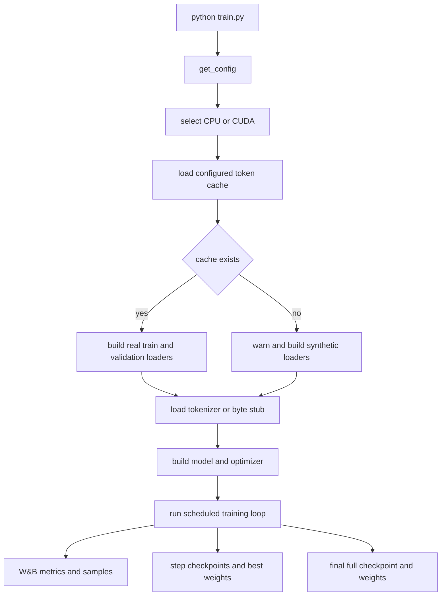

# Configuration, Environment, and Artifacts

`config.py:get_config()` is the repository's single configuration dictionary for model architecture, optimization, data loading, evaluation cadence, persistence, and telemetry. The executable entrypoint is `python train.py`: it obtains a fresh dictionary and passes it to `train_model`. The configuration is deliberately code-based rather than a separately parsed YAML or command-line settings file, so a change to a run setting means an edit to `config.py` or an explicit dictionary override supplied by a caller.

This page describes the settings by operational domain rather than by their order in the source dictionary. For the training lifecycle, see [Training Runtime and Lifecycle](/openwiki/architecture/training-runtime.md); for cache production and loader semantics, see [Token Data and Loader Pipeline](/openwiki/architecture/data-pipeline.md); for external integration boundaries, see [External Data, Tokenizer, Tracking, and Accelerators](/openwiki/integrations/external-services.md).

## How settings become a run

The configuration dictionary is consumed at several distinct boundaries. A missing cache can cause the trainer to switch to synthetic data, while an unavailable tokenizer changes only decoding and generation. Kernel implementation keys are further constrained by an environment opt-in. These are different behaviors and should not be conflated when diagnosing a run.



Caption: Configuration, environment gates, and cache availability determine the inputs to one run; the trainer then emits telemetry and persisted artifacts.

### Configuration versus environment

The following are not interchangeable:

- **Configuration keys** are values in the dictionary returned by `get_config()`. They include `tf32`, `cuda_alloc_conf`, the three `*_impl` kernel choices, W&B project metadata, and all paths and intervals.
- **`ENABLE_TRITON_KERNELS`** is an environment switch. A Triton implementation is effective only when the variable is exactly `"1"` and the corresponding configuration key requests `"triton"`. If any of the three kernel keys requests Triton without that switch, the trainer force-restores all three implementations to `"pytorch"`.
- **`PYTORCH_CUDA_ALLOC_CONF`** is the PyTorch runtime environment variable. The config key `cuda_alloc_conf` supplies its value, but `setup_gpu_optimizations` installs it into `os.environ` only when the CUDA setup path runs. It is not the same thing as setting the environment before Python starts.
- **`WANDB_MODE` and `WANDB_DISABLED`** are W&B environment controls, not configuration keys. The test fixture defaults them to `offline` and `true`, respectively, so tests do not require online tracking. Production `train.py` still calls the normal W&B API and does not set those test values itself.
- **`TOKENIZERS_PARALLELISM`** is also an environment switch; `train.py` sets it to `false` at module import to avoid tokenizer parallelism. It is not returned by `get_config()`.

On CUDA, `setup_gpu_optimizations` enables TF32 according to `tf32`, sets float32 matmul precision to `high`, applies `cudnn_benchmark`, disables cuDNN determinism, applies `cuda_alloc_conf` when present, and prints GPU identity, memory, and compute capability. `train_model` calls that function only when `torch.cuda.is_available()` selects the CUDA device. The default `cudnn_benchmark=True` favors throughput over deterministic cuDNN execution; the function explicitly sets `torch.backends.cudnn.deterministic=False`.

## Model domain

These settings define the decoder and its token-space capacity. Their production defaults are verified directly in `config.py`:

| Key | Default | Operational meaning |
|---|---:|---|
| `d_model` | `1024` | Hidden dimension |
| `n_layers` | `16` | Decoder block count |
| `n_heads` | `8` | Query attention heads |
| `n_kv_heads` | `4` | Key and value heads used by GQA |
| `head_dim` | `128` | Per-head dimension |
| `d_ff` | `4096` | SwiGLU feed-forward dimension |
| `vocab_size` | `128000` | Configured vocabulary capacity |
| `seq_len` | `2048` | Input and target sequence length |
| `rope_theta` | `500000.0` | RoPE base frequency |
| `rms_norm_eps` | `1e-5` | RMSNorm numerical epsilon |
| `qknorm` | `True` | Enable QK normalization |

The trainer computes the effective model vocabulary as `max(config['vocab_size'], len(tokenizer))`. This protects against a tokenizer with a larger declared vocabulary, but does not prove that the tokenizer's token-id semantics match the pretokenized cache. A tokenizer identity change therefore requires a compatible new cache, not merely a larger `vocab_size`.

The implementation choices below are model execution settings, but they also form an acceleration boundary:

| Key | Default | Effect |
|---|---|---|
| `rmsnorm_impl` | `'pytorch'` | RMSNorm implementation |
| `swiglu_impl` | `'pytorch'` | SwiGLU implementation |
| `cross_entropy_impl` | `'pytorch'` | Chunked head loss implementation |
| `gradient_checkpointing` | `True` | Recompute decoder activations to reduce memory |
| `ce_chunk_size` | `256` | Token rows processed per LM-head loss chunk |
| `compile_model` | `True` | Use `torch.compile` when available |
| `compile_mode` | `'reduce-overhead'` | Mode passed to `torch.compile` |
| `tf32` | `True` | Allow TF32 CUDA matmul paths |
| `cudnn_benchmark` | `True` | Enable cuDNN algorithm benchmarking |
| `cuda_alloc_conf` | `'expandable_segments:True'` | Value applied to `PYTORCH_CUDA_ALLOC_CONF` during CUDA setup |

`compile_model` is a configuration choice, not a Triton switch. The trainer consumes one real-shape batch before compilation, and if compilation is enabled it performs a hidden-state forward, chunked loss, backward pass, and CUDA synchronization as warmup. If a memory-constrained device cannot compile reliably, disable `compile_model` independently of the kernel implementation keys.

## Optimization domain

The optimizer and schedule defaults are:

| Key | Default | Operational meaning |
|---|---:|---|
| `batch_size` | `96` | Per-step batch size supplied by the loader |
| `gradient_accumulation` | `1` | Microbatches per optimizer update |
| `max_steps` | `42000` | Training-loop endpoint |
| `learning_rate` | `3e-4` | Peak AdamW learning rate |
| `min_lr` | `3e-5` | Cosine schedule floor |
| `warmup_steps` | `2000` | Linear warmup duration |
| `weight_decay` | `0.1` | Decoupled decay for tensors with dimension at least two |
| `max_grad_norm` | `1.0` | Gradient clipping bound |
| `beta1` | `0.9` | AdamW first moment coefficient |
| `beta2` | `0.95` | AdamW second moment coefficient |
| `eps` | `1e-8` | AdamW numerical epsilon |
| `use_ema` | `True` | Maintain an exponential moving average model |
| `ema_decay` | `0.999` | EMA averaging decay |
| `use_z_loss` | `True` | Enable the z-loss contribution |
| `z_loss_weight` | `1e-4` | z-loss scale when enabled |

`train_model` partitions trainable parameters into a decayed group when `param.dim() >= 2` and a no-decay group otherwise, then constructs AdamW with the configured betas, epsilon, learning rate, and weight decay. Gradient accumulation divides each microbatch loss by `gradient_accumulation`; clipping, `optimizer.step()`, EMA update, zeroing, and `scheduler.step()` happen only at the optimizer-update boundary.

The scheduler is a `SequentialLR` composed of `LinearLR` and `CosineAnnealingLR`. Its warmup uses:

```text
start_factor = max(min_lr / learning_rate, 1e-4)
```

when `learning_rate > 0`, and the cosine phase uses `T_max = max_steps - warmup_steps` with `eta_min=min_lr`. With the production values, each full optimizer step consumes `96 * 2048 * 1 = 196,608` tokens and the nominal 42,000-step plan accounts for `8,257,536,000` tokens, approximately 8.26 billion. The training loop reports and checkpoints an analogous step-based `tokens_seen` value. The schedule invariants are material: `0 < min_lr < learning_rate` and `0 < warmup_steps < max_steps`.

The corpus can be shorter than this plan. `_next_batch` catches `StopIteration`, increments an epoch counter, calls `set_epoch` on samplers that provide it, warns, and starts a fresh iterator. This intentionally wraps the data rather than terminating the run, so changing corpus cardinality or sampler behavior should be considered together with this restart logic.

## Data domain

### Runtime cache and loader settings

| Key | Default | Operational meaning |
|---|---|---|
| `data_cache_dir` | `'data_cache'` | Directory containing the runtime token cache |
| `data_cache_filename` | `'tokens.bin'` | Flat cache filename |
| `reuse_data_cache` | `True` | Skip shard concatenation when the cache already exists |
| `shuffle_documents` | `True` | Configuration-level corpus shuffle intent |
| `shuffle_seed` | `42` | Reproducible training sampler seed |
| `num_workers` | `6` | Training DataLoader worker count |
| `prefetch_factor` | `16` | Batches prefetched per worker |
| `pin_memory` | `True` | Enable pinned host buffers for CUDA transfers |
| `val_split` | `0.05` | Final fraction held out for validation |
| `tokenizer_name` | `'NousResearch/Meta-Llama-3-8B'` | Hugging Face tokenizer checkpoint |
| `tokenizer_cache_dir` | `None` | Optional Transformers cache directory |

The runtime cache is a raw, headerless, little-endian `uint32` stream. `build_training_data` opens it read-only with `np.memmap`, truncates the usable stream to complete `seq_len + 1` chunks, and holds out the final `val_split` portion after chunk alignment. Each item returns `input` and one-token-shifted `target`, each of length `seq_len`; training drops its final partial batch while validation retains it. `ShuffledRangeSampler` uses `shuffle_seed + epoch` to produce a reproducible permutation when the trainer wraps to another epoch.

`num_workers`, `prefetch_factor`, and `pin_memory` affect transport rather than token semantics. The loader passes `prefetch_factor` only when workers are present and enables persistent workers only when `num_workers > 0`. The trainer transfers the collated tensors with `non_blocking=True`; pinned memory is therefore useful on CUDA but does not make a CPU run asynchronous.

### Preparation and source mixture

The remaining data keys describe the corpus contract and preparation policy:

| Key | Default | Meaning |
|---|---:|---|
| `target_tokens` | `8_000_000_000` | Target corpus token count |
| `dedup` | `True` | Exact document deduplication intent |
| `dedup_hash_bytes` | `256` | Hashing parameter for preparation |
| `min_doc_tokens` | `16` | Minimum document length |
| `max_doc_tokens` | `8192` | Maximum document length |
| `data_sources` | six weighted entries | Local description of source names, weights, splits, and filters |

`data/prepare_data.py` is an adapter to the external `LLM/shared_data` preparation package. It runs that pipeline, reads the resulting manifest in numeric shard-index order, streams shard bytes into a sibling temporary file, and installs the flat cache with `os.replace`. A pre-existing cache is skipped when `reuse_data_cache=True`.

Do not assume that editing the local `data_sources` dictionary rebuilds an existing cache or changes the arguments passed to the external `run_pipeline`. The vendored loader consumes the finished flat cache, not those source entries. When changing source composition, deduplication, document bounds, tokenizer identity, or target size, prepare and verify a new cache deliberately; remove or rename the old cache if reuse would otherwise select it.

The preparation bridge fails visibly when the manifest is missing or empty, and preparation exits with a dependency error when `LLM/shared_data` is not importable. These are different from the trainer's missing-cache behavior: `train_model` catches a missing runtime cache and falls back to synthetic random ids, allowing a smoke run to proceed but no longer representing the real corpus. A successful process start is therefore not evidence that real data was used.

## Evaluation and generation domain

| Key | Default | Operational meaning |
|---|---:|---|
| `val_interval` | `2000` | Validate at positive steps divisible by this interval |
| `val_max_batches` | `100` | Maximum validation batches per evaluation |
| `generation_interval` | `20000` | Generate samples at positive steps divisible by this interval |
| `generation_max_tokens` | `128` | Maximum new tokens per prompt |
| `generation_temperature` | `0.8` | Sampling temperature |
| `generation_top_k` | `50` | Top-k vocabulary filter |

Validation uses the EMA model when `use_ema=True`, otherwise the live model. It uses the same chunked head loss and z-loss feature switch as training, averages at most `val_max_batches`, computes `math.exp(min(avg_loss, 20))` for perplexity, and logs `val/loss` and `val/perplexity`. If the result strictly improves `best_val_loss`, the trainer saves the **live** model weights to the best-model path; it does not save EMA weights there.

Generation also prefers EMA and uses five fixed prose and code prompts. It applies the configured temperature and top-k, plus a hard-coded `top_p=0.9`, and stops early on the tokenizer's EOS id. Samples are logged as a W&B table. If tokenizer loading failed, the byte stub keeps generation executable but its decoded text is not meaningful; treat that warning as an operational defect rather than a model-quality signal.

When intervals coincide, the loop performs logging first, then validation, then generation, then checkpointing. Each periodic action is independently guarded by its interval and `step > 0`, so step zero does not emit those side effects.

## Checkpoint domain and artifact names

| Key | Default | Operational meaning |
|---|---|---|
| `model_folder` | `'weights'` | Directory for model artifacts |
| `model_filename` | `'llama3-515M'` | Prefix for checkpoint and weight filenames |
| `checkpoint_interval` | `5000` | Periodic checkpoint cadence |
| `keep_last_n_checkpoints` | `3` | Number of numeric step checkpoints retained |
| `async_checkpoint` | `True` | Queue periodic `torch.save` in a daemon thread |
| `preload` | `None` | Enable newest-step checkpoint restoration when non-`None` |

A periodic checkpoint is named:

```text
<model_folder>/<model_filename>_step_<step>.pt
```

It contains `model_state_dict`, `optimizer_state_dict`, `scheduler_state_dict`, `step`, derived `tokens_seen`, `best_val_loss`, Torch/NumPy/Python RNG states, the configuration dictionary, optional `ema_state_dict`, and CUDA RNG state when CUDA is available. The directory is created automatically. With asynchronous saving enabled, the trainer returns a daemon thread for the most recently queued save; at shutdown it joins that thread before synchronously writing final artifacts. Retention sorts numeric step suffixes and deletes older step files beyond `keep_last_n_checkpoints`.

The final save is intentionally not a normal step checkpoint:

```text
<model_folder>/<model_filename>_final_model_full.pt
<model_folder>/<model_filename>_final_model_weights.pt
```

The first contains the full checkpoint structure and the second contains only `model.state_dict()`. The best validation artifact is separate:

```text
<model_folder>/<model_filename>_best.pt
```

It is a live-model state dictionary written only when validation strictly improves. Final files and the best file are not included in numeric step retention cleanup.

Resume has an important operational nuance. When `preload` is non-`None`, `load_checkpoint` scans `model_folder` for matching numeric `_step_*.pt` files and loads the newest one; it does not use `preload` as a direct pathname. If no matching step checkpoint exists, it returns `(0, float('inf'))` without raising. A valid resume restores model, optimizer, scheduler, RNG, and optional EMA state, so deleting or mixing files with the same prefix can change which state is selected.

## Telemetry domain

| Key | Default | Operational meaning |
|---|---|---|
| `wandb_project` | `'langgpt-llama3-pretrain'` | W&B project name |
| `wandb_entity` | `None` | Optional W&B entity |
| `wandb_tags` | `['llama3', '515M', 'a100', 'pretrain', 'code']` | Run tags |
| `log_interval` | `50` | Training metric cadence |

`wandb.init` records selected architecture and optimization values and applies the configured project, entity, and tags. At log boundaries the trainer reports training loss, current learning rate, gradient norm, step timing, throughput, tokens seen, effective batch size, and accumulated data wait. CUDA runs add allocated, peak, and reserved memory and GPU utilization when available. Validation reports loss and perplexity; generation reports the `gen/samples` table.

Tests set `WANDB_MODE=offline` and `WANDB_DISABLED=true` before importing the trainer, and install a minimal W&B stub if the package is absent. Those settings isolate tests from the network and should not be copied into a production run unless disabling online telemetry is intentional. A W&B run finishing successfully also does not prove that the training cache or real tokenizer was valid.

## Ignored runtime outputs and cleanup

The repository intentionally does not version normal run outputs:

- `weights/` is ignored; it contains periodic `.pt` checkpoints, the `_best.pt` live weights, and final full and weights-only files.
- `data_cache/` is ignored; the default `data_cache/tokens.bin` may be approximately 32 GB for an eight-billion-token `uint32` corpus. Temporary cache-conversion siblings such as `tokens.bin.tmp` are runtime files and should disappear after atomic replacement.
- `*.pt`, `*.pth`, and `*.ckpt` are ignored globally, protecting checkpoint files even when they are placed outside the default weights directory.
- `wandb/` and `*.log` are ignored, covering W&B local run state and log files.
- `docs_html/` is ignored because generated HTML documentation is rebuilt by CI rather than committed as source.

These ignore rules do not provide retention or backup. Numeric checkpoint retention deletes old matching step files during training, but it does not replace an external backup policy and does not remove best or final artifacts. Before cleaning a workspace, preserve the newest usable step checkpoint, the configuration embedded in it, and any cache required for reproducible continuation.

## Safe changes and verification

Treat changes according to the boundary they affect:

1. **Model or tokenizer contract:** change `vocab_size`, `seq_len`, tokenizer settings, or model dimensions only with compatible cache and checkpoint decisions. A checkpoint is not safely reusable when parameter shapes or token-id semantics changed.
2. **Memory and throughput:** tune `batch_size`, `gradient_accumulation`, `ce_chunk_size`, `gradient_checkpointing`, workers, pinning, compilation, and CUDA settings together with the target hardware. Preserve the `input` and `target` batch keys and the chunked hidden-state-to-head-loss boundary.
3. **Optimization:** preserve the schedule inequalities and decide whether a changed learning-rate plan requires a fresh run. Resume restores scheduler state, so editing schedule values while loading an old checkpoint can create an intentional but discontinuous schedule.
4. **Kernel acceleration:** first set the relevant `*_impl` keys to `'triton'`, then set `ENABLE_TRITON_KERNELS=1`. Without the switch, all three are forced to PyTorch. Once explicitly enabled, kernel import or execution failures are surfaced rather than silently replaced.
5. **Data composition:** use the external preparation configuration and invalidate a reused cache when its contents, tokenizer, or packing contract changes. The local `data_sources` dictionary is not a substitute for that preparation boundary.
6. **Persistence and telemetry:** changing `model_folder` or `model_filename` changes discovery and retention scope. Changing W&B environment switches changes observability, not training semantics.

The focused tests protect these expectations:

- `tests/test_config.py` asserts that the complete configuration has every required key and no untested extra key. It checks known model values including `d_model=1024`, `n_layers=16`, `n_heads=8`, `n_kv_heads=4`, `head_dim=128`, `d_ff=4096`, `vocab_size=128000`, `seq_len=2048`, and `ce_chunk_size=256`.
- The same configuration tests enforce even GQA head division, positive data-source weights with a total above `0.5` and at most `1.0`, and learning-rate, warmup, weight-decay, and gradient-clipping invariants.
- `tests/test_train.py` mirrors the production `LinearLR` to `CosineAnnealingLR` scheduler chain and verifies checkpoint creation, model/optimizer/scheduler restoration, full Torch/NumPy/Python RNG restoration, no-checkpoint resume, special final filenames, asynchronous save completion, cross-device loading, and idempotent GPU setup.
- The data-pipeline tests exercise manifest-order cache concatenation, atomic temporary-file replacement, memory-mapped loading, synthetic loader shapes, split alignment, and sampler behavior. They do not validate the external `LLM/shared_data` implementation or prove that a real cache uses the intended tokenizer.
- `tests/conftest.py` establishes the offline and disabled W&B test environment. GPU-specific tests are conditional, so a passing CPU suite is not evidence that CUDA memory settings or Triton execution have been exercised.

When a configuration change causes a test failure, update the source and its focused invariant together rather than adding an untested key or relying on a README-only value. The tests are the contract for required keys, known defaults, and scheduler/data invariants; the runtime warnings and artifact names are the operational contract for interpreting a run.
