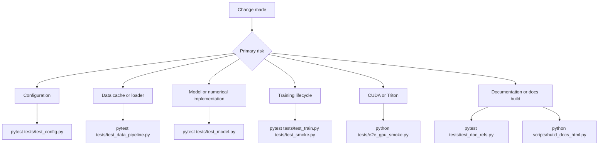

# Testing, Validation, and CI

This repository has several validation layers rather than one universal test command. The ordinary suite is CPU-first and exercises model, data, training, and synthetic end-to-end behavior. Numerical checks protect optimized implementations against reference operations; a direct GPU smoke script covers the CUDA and Triton path; documentation checks protect references and generated-doc contracts; and GitHub Actions assembles only a subset of these checks automatically.

The safe default for a code change is:

```bash
python -m pytest tests/ --no-header -q
```

That command uses the repository's `pytest.ini` configuration, discovers files named `test_*.py` under `tests`, enables strict markers and strict configuration, reports extra summary information, and disables pytest's cache provider. It does not run `tests/e2e_gpu_smoke.py`: that file is a directly executable eight-stage diagnostic, not a `test_*.py` module discovered by the default test path.

## Choose the narrowest validation



Caption: Select the focused check first, then widen to the full CPU suite when a shared boundary or cross-cutting change makes the focused result insufficient.

| Change surface | Narrow check | What it does not prove |
|---|---|---|
| `config.py` defaults and required keys | `python -m pytest tests/test_config.py --no-header -q` | Runtime training with a real cache |
| Shard concatenation, mmap cache, or benchmark wiring | `python -m pytest tests/test_data_pipeline.py --no-header -q` | Model correctness or CUDA transfer performance |
| Transformer blocks, attention, RoPE, FFN, or loss | `python -m pytest tests/test_model.py --no-header -q` | Checkpoint persistence or the full training loop |
| Sampler, validation, checkpoint, or recovery behavior | `python -m pytest tests/test_train.py tests/test_smoke.py --no-header -q` | Triton kernels unless the direct GPU smoke is run |
| Documentation citations, links, or snippets | `python -m pytest tests/test_doc_refs.py --no-header -q` | HTML styling or deployment to Pages |
| HTML portal generator or its assets | `python -m pytest tests/test_build_docs_html.py --no-header -q` | Markdown reference validity, which is a different test |
| CUDA path, chunked CE, checkpoint, and fused kernels together | `python tests/e2e_gpu_smoke.py` | A successful CPU fallback is not evidence that CUDA is available or exercised |

When the change affects public behavior across boundaries, use the full CPU suite after the focused check. The CI command is intentionally `python -m pytest tests/ --no-header -q`, not a marker-filtered subset.

## Pytest configuration and devices

`pytest.ini` registers three markers:

- `slow` means a test takes more than a few seconds.
- `gpu` means a test requires a CUDA GPU.
- `numeric` means a test asserts numerical equivalence between implementations.

`--strict-markers` makes an unregistered marker an error, while `--strict-config` rejects invalid pytest configuration. At present, the collected suite uses `numeric` for the z-loss reference test and `gpu` for the cross-device checkpoint regression. The `slow` marker is available but is not the mechanism used to select the ordinary suite.

`tests/conftest.py` adds two command-line options:

```bash
python -m pytest tests/ --device cpu
python -m pytest tests/ --device cuda --run-gpu
```

`--device` accepts only `cpu` or `cuda` and controls the session-scoped `device` fixture. With no option, the fixture is **CPU**. If `--device cuda` is requested without an available CUDA runtime, the fixture skips rather than silently moving back to CPU. The `dtype` fixture is `torch.float32` on CPU for exactness and `torch.bfloat16` on GPU.

`--run-gpu` disables the automatic skip applied to tests marked `gpu`; without it, marked tests are skipped with the reason `needs --run-gpu and a CUDA device`. It does not itself change the fixture device. Therefore:

- `--run-gpu` is the switch that permits GPU-marked tests to run.
- `--device cuda` is the switch that makes ordinary fixture-based tests construct tensors and models on CUDA.
- `--run-gpu` alone leaves the fixture on CPU. This matters for the marked cross-device checkpoint test: it deliberately expects the fixture to remain on CPU while CUDA is available so it can save on CUDA and load on CPU. Passing both options makes that particular test skip because its own cross-device precondition requires `device.type == "cpu"`.

The fixture also seeds `TOKENIZERS_PARALLELISM=false`, `WANDB_MODE=offline`, and `WANDB_DISABLED=true`. If the real `wandb` package cannot be imported, it injects a minimal stub implementing `log`, `init`, `finish`, and `Table.add_data`, allowing `train.py` imports and CPU tests to run on development machines without W&B installed. Individual validation tests additionally monkeypatch or replace W&B where they call validation directly.

## What the focused tests protect

### Configuration

`tests/test_config.py` treats `config.get_config()` as a contract. It requires the complete set of architecture, optimization, data, validation, generation, checkpoint, telemetry, and Triton-dispatch keys, rejects untested extra keys, checks production values such as the 1024 hidden size, 16 layers, 128,000 vocabulary, 2,048 sequence length, and CE chunk size 256, and checks invariants including evenly divisible GQA heads, positive data-source weights, and a valid learning-rate schedule. A configuration-only change should start here because failures identify schema or default drift directly.

### Data and benchmark wiring

`tests/test_data_pipeline.py` creates workspace-like `uint32` shards and a manifest, then verifies that `data.prepare_data.concat_shards_to_cache` concatenates shards in manifest order, produces the target cache, removes its temporary file after the atomic rename, and fails for a missing or empty manifest. It also opens the result with `numpy.memmap`, protecting the loader's on-disk contract. Separate subprocess tests run `benchmark_data.py` end to end and in `--json` mode, checking both human-readable throughput output and machine-readable fields such as `steps` and `tokens_per_step`.

The loader turns each stream window of `seq_len + 1` tokens into `seq_len` inputs and one-token-shifted targets. Real training data is read from a read-only `uint32` `numpy.memmap`; a missing cache raises `FileNotFoundError` in the loader and `train_model` falls back to deterministic synthetic data with a warning. The data tests are consequently the right guard for cache production and loader boundary changes, while the benchmark is a measurement tool rather than a correctness substitute.

Useful benchmark forms are:

```bash
python benchmark_data.py --steps 50 --batch_size 96 --seq_len 2048 --num_workers 6 --prefetch_factor 16
python benchmark_data.py --steps 1 --batch_size 2 --seq_len 32 --num_workers 0 --json
python benchmark_data.py --device cuda --pin_memory --with_model_forward
```

The benchmark's `--device auto` selects CUDA only when available; `--pin_memory` affects CUDA host-to-device loading, `--with_model_forward` adds a tiny model forward, and JSON mode emits metrics instead of the formatted report. Do not interpret a CPU run, or a run without `--with_model_forward`, as an end-to-end GPU training throughput result.

### Model and numerical invariants

`tests/test_model.py` checks both shapes and focused mathematical behavior:

- RMSNorm matches a double-precision reference, preserves scale invariance, returns zero for zero input, and keeps its weight learnable.
- RoPE caches have the expected shape, inverse frequencies are monotonic, rotation preserves vector norm, position zero is identity, and equal relative positions preserve the tested inner-product property.
- Grouped-query attention produces the expected shape, prevents future-token perturbations from changing earlier outputs (causality), derives the expected query-to-KV repetition count, and fails at runtime for a non-divisible head configuration.
- The fused gate-and-up SwiGLU projection matches separate projections and has the expected 2x feed-forward weight layout.
- Transformer forward output has the expected batch, sequence, and vocabulary dimensions; backward propagation supplies finite gradients to every parameter; and gradient checkpointing matches the normal path in evaluation and training mode while still allowing gradients to flow.
- `chunked_cross_entropy_with_z` matches the dense CE-plus-z-loss reference, reduces to pure CE when the z weight is zero, backpropagates finite gradients, grows with logit magnitude, and excludes `ignore_index` rows from the z-loss average. The `numeric` marker identifies the primary equivalence test.
- `chunked_head_cross_entropy_with_z` matches dense CE both with and without z-loss and propagates gradients through the hidden states into the embedding and through the language-model head. `return_hidden=True` is checked as the memory-bounded route that skips materializing the full logits tensor.

These tests are especially important when changing chunk sizes, fused/Triton dispatch, mixed precision, attention masking, checkpointing, or the LM head: output shape alone would not catch numerical drift, causality leaks, or broken gradient paths.

### Training, recovery, and smoke behavior

`tests/test_train.py` covers deterministic top-k/top-p sampling with a fixed seed, top-k and top-p restriction, temperature handling, and finite behavior for `-inf` logits. Its checkpoint tests verify step-file creation, model-weight restoration, optimizer and scheduler state participation in the round trip, exact restoration of PyTorch, NumPy, and Python RNG state, the zero/`inf` result when no checkpoint exists, special final checkpoint names, and completion of asynchronous saves. The marked cross-device regression saves on CUDA and loads on CPU to ensure RNG tensors are normalized before `torch.random.set_rng_state` and that outputs remain equivalent.

`tests/test_smoke.py` uses a tiny synthetic stream and model to run one forward/backward optimizer step with finite loss and finite gradients for every parameter, verifies that a tiny model can reduce loss over repeated updates on one batch, compares chunked and dense CE in a real model forward, and runs `train.validate`. The validation test proves the result is finite and positive and that the offline W&B `log` call occurs exactly once; it does not require network access.

The direct smoke script, `tests/e2e_gpu_smoke.py`, is broader than pytest's ordinary smoke test. It runs eight sequential stages: environment discovery, synthetic data through `PackedDataset` and `DataLoader`, tiny model construction, training steps, chunked CE versus dense CE, validation, checkpoint save/load, and Triton RMSNorm/SwiGLU/cross-entropy checks. It uses CUDA when available and otherwise prints a warning and runs the non-CUDA stages on CPU. The Triton stage is skipped on CPU, without Triton, or without CUDA; thus `E2E SMOKE: ALL CHECKS PASSED` on a CPU host does not certify fused GPU kernels.

Run it directly, with an optional step override:

```bash
python tests/e2e_gpu_smoke.py
python tests/e2e_gpu_smoke.py --steps 2
```

The script's numerical tolerances are intentionally dtype-aware: dense versus chunked CE must differ by less than `1e-3`, Triton RMSNorm by less than `5e-2`, Triton SwiGLU by less than `1.0`, and Triton CE by less than `5e-1`. These are smoke thresholds, not a replacement for the tighter CPU reference tests.

## Documentation checks are tests, but generation is not

The CI doc-reference step runs:

```bash
python -m pytest tests/test_doc_refs.py --no-header -q
```

`tests/test_doc_refs.py` scans `docs/**/*.md` and the repository's top-level Markdown files. It resolves citations in the `file.py:Symbol` and `file.py::Class.method` forms by importing the referenced module and walking the symbol, rejects line-number anchors, validates intra-repository Markdown links outside code fences, and requires non-trivial Python snippets to contain `# illustrative` or `# verified`. This is a documentation consistency test: it does not build the HTML portal.

HTML generation is a separate operation:

```bash
python scripts/build_docs_html.py
python -m pytest tests/test_build_docs_html.py --no-header -q
```

`scripts/build_docs_html.py` has an explicit `DOC_FILES` manifest for the README, core docs, concepts, guides, and references. It converts those Markdown sources to the ignored `docs_html/` output, copies shared assets, builds navigation, and adds the portal's math, syntax-highlighting, boot, and interactive wiring. `tests/test_build_docs_html.py` executes the generator once and checks the asset copies, relative prefixes, boot overlay, font links, hero and mechanism widgets, and dark-only theme contract. It also protects the rule that Markdown sources are not modified by the build. Passing this test means the generator's output contract held; it does not mean doc symbols or links resolve unless `test_doc_refs.py` also passes.

## GitHub Actions paths

### CI on pushes and pull requests

`.github/workflows/ci.yml` runs on pushes to `main` and pull requests targeting `main`. Its single `smoke` job uses `ubuntu-latest` and Python 3.11, installs a CPU-indexed PyTorch wheel followed by `transformers`, `datasets`, `wandb`, and `requirements-dev.txt`, then performs three distinct checks in order:

1. **Import checks:** `python -c "import model; import dataset; import train"` catches missing imports and module-level dependency failures.
2. **CPU smoke test:** `python -m pytest tests/ --no-header -q` runs the configured suite. No CUDA flag is supplied, so CPU is the default and GPU-marked tests remain skipped.
3. **Doc reference checker:** `python -m pytest tests/test_doc_refs.py --no-header -q` runs the documentation consistency pass separately, even though that test is also included by the preceding `tests/` invocation. The separate step makes its failure category visible in the Actions log.

The workflow does not run `tests/e2e_gpu_smoke.py`, the benchmark, `scripts/build_docs_html.py`, or the HTML contract tests. It also has no GPU runner. A change to Triton or CUDA therefore needs an explicitly provisioned GPU environment and the direct smoke script in addition to a green CI run.

`requirements-dev.txt` itself declares only `pytest>=7.4`; the CI workflow supplies the runtime packages explicitly. Local environments should install the runtime dependencies described by the project before attempting the full suite.

### GitHub Pages build and deploy

`.github/workflows/deploy-docs.yml` is documentation delivery, not a test workflow. It runs on pushes to `main` or manual `workflow_dispatch`, grants read access to repository contents plus Pages write and identity-token permissions, and serializes deployments in the `pages` concurrency group without cancelling an in-progress run. Its `build` job uses Python 3.11, runs `python scripts/build_docs_html.py`, and uploads `docs_html` with `actions/upload-pages-artifact@v3`. A dependent `deploy` job targets the `github-pages` environment and invokes `actions/deploy-pages@v4`.

A successful Pages deployment proves that the generator produced an uploadable artifact and that the Pages deployment action completed. It is not evidence that pytest passed, and the workflow does not invoke `tests/test_doc_refs.py` or `tests/test_build_docs_html.py`; run those checks explicitly when changing documentation or the generator.

### Scheduled OpenWiki update

`.github/workflows/openwiki-update.yml` is a separate documentation-maintenance automation. It can be started manually and is scheduled daily at `08:00` UTC by `cron: "0 8 * * *"`. It checks out full history (`fetch-depth: 0`) so `openwiki code --update` can compare against the commit last documented, installs Node.js 22 and pinned `openwiki@0.4.3`, `mermaid@11.16.0`, and `jsdom@29.1.1`, and runs `openwiki code --update --print` with the configured provider/model and LangSmith-related environment variables.

The final step uses `peter-evans/create-pull-request@v7` to create or update branch `openwiki/update`, with a `docs: update OpenWiki` commit and pull request. Its allowed paths are `openwiki`, `AGENTS.md`, `CLAUDE.md`, and the workflow file. This scheduled job updates documentation through a pull request; it is not a test gate, it does not run the CPU suite, and it should not be confused with the Pages build/deploy workflow.

## Interpreting failures

- **Import failure:** check runtime installation and module-level optional dependencies first. The test fixture's W&B fallback helps pytest, but CI deliberately installs the real `wandb` package.
- **Unexpected marker or config failure:** use the registered marker names and preserve `--strict-markers` and `--strict-config` compatibility.
- **CPU numerical failure:** inspect dtype, chunk boundaries, `ignore_index`, and reference reduction before changing tolerances. CPU fixtures use FP32 specifically to make these comparisons exact.
- **CUDA requested but skipped:** distinguish an unavailable CUDA runtime from a marked-test skip. Confirm the exact combination of `--run-gpu`, `--device`, and the test's own preconditions.
- **Checkpoint mismatch:** check model, optimizer, scheduler, EMA, and all three host RNG states, plus CUDA RNG when present. A model-only load can produce matching immediate outputs while still failing resume reproducibility.
- **Doc-reference failure:** repair the citation, link, or snippet marker rather than adding a line-number anchor; line anchors are explicitly banned because they drift.
- **HTML failure:** run the generator and its contract test separately from reference checks. Generated `docs_html/` is an output artifact and is not the Markdown source of truth.

The practical validation ladder is therefore: focused CPU test for the changed boundary, full CPU suite for shared behavior, direct GPU smoke for CUDA or fused-kernel work, and the two documentation checks when prose, source references, or the HTML generator changes. A green CI job covers imports, the configured CPU suite, and a separately displayed doc-reference pass—but not GPU execution, benchmarks, Pages deployment, or scheduled OpenWiki updates.
