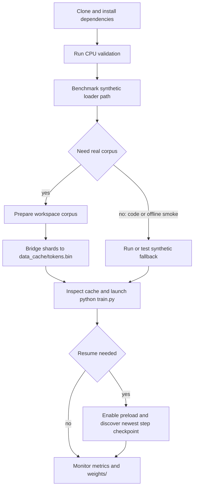

# Quickstart and Task Routing

This page is the stable starting point for a contributor working from the repository root. It gets a checkout from installation to a CPU smoke run, a cache-independent benchmark, real-data preparation, training, and checkpoint resume. It intentionally summarizes boundaries and commands; use the linked owned-system pages for implementation detail.

## Choose the path



Caption: The contributor path separates repository-owned CPU/loader checks, optional external corpus preparation, training, and checkpoint recovery.

## 1. Install prerequisites

Run commands from the repository root. The supported baseline is Python 3.10+; CI uses Python 3.11. The CPU CI environment installs PyTorch from the CPU index and then the runtime and development packages:

```bash
python -m pip install --upgrade pip
pip install torch --index-url https://download.pytorch.org/whl/cpu
pip install transformers datasets wandb
pip install -r requirements-dev.txt
```

`requirements-dev.txt` declares `pytest>=7.4`; the other runtime packages are installed explicitly by CI. For the recommended GPU setup, the README targets CUDA 12.1+ and an NVIDIA A100 80GB SXM (smaller devices require smaller settings in `config.py`):

```bash
pip install torch torchvision torchaudio --index-url https://download.pytorch.org/whl/cu121
pip install transformers datasets wandb
```

A W&B account is optional for online tracking, but `train.py` imports `wandb` and the training path calls `wandb.init`; install the package and choose the desired online or offline environment. Tests set `WANDB_MODE=offline` and `WANDB_DISABLED=true` through `tests/conftest.py`, and can inject a minimal W&B stub if the package is absent.

## 2. Run the CPU smoke validation

The CI-equivalent CPU smoke command is:

```bash
python -m pytest tests/ --no-header -q
```

It imports the model, loader, and trainer through the discovered tests and runs the CPU-first suite. The default test device is CPU; GPU-marked tests are skipped unless explicitly enabled. For a narrower first check, use:

```bash
python -m pytest tests/test_smoke.py tests/test_data_pipeline.py --no-header -q
```

`tests/test_smoke.py` builds a tiny synthetic token stream and verifies a finite forward/backward step, optimization over repeated steps, dense-versus-chunked loss agreement, and finite validation logging. `tests/test_data_pipeline.py` verifies manifest-order cache concatenation, mmap compatibility, failure for missing or empty manifests, and both benchmark output modes. Neither command downloads a corpus.

The README also shows `python -m pytest tests/ -m smoke`, but `smoke` is not a registered marker in `pytest.ini` and the smoke tests are not marked with it. Prefer the implemented commands above; use `tests/conftest.py`'s `--device cpu`, `--device cuda`, and `--run-gpu` options only when selecting the device or permitting GPU-marked tests.

For the full validation ladder, marker behavior, CI boundaries, and documentation checks, see [Testing, Validation, and CI](/openwiki/operations/testing-and-ci.md).

## 3. Benchmark the data path

`benchmark_data.py` is deliberately independent of the prepared cache and Hugging Face downloads. `benchmark_data.py:build_benchmark_buffer` creates a deterministic synthetic `uint32` stream with explicit document markers; `benchmark_data.py:benchmark` feeds it through the same `dataset.py` exports used by training and reports transfer/loader timing. Start with a CPU-safe command:

```bash
python benchmark_data.py --steps 20 --batch_size 4 --seq_len 256 --num_workers 0 --device cpu
```

For production-shaped CUDA transport, use a working GPU and adjust the batch to its memory:

```bash
python benchmark_data.py --steps 50 --batch_size 96 --seq_len 2048 --num_workers 6 --prefetch_factor 16 --pin_memory --device cuda
```

Useful options are `--device {auto,cpu,cuda}`, `--with_model_forward`, and `--json`. The optional model-forward mode uses a tiny two-layer model, not the production 515M-parameter model. JSON output is useful for automation:

```bash
python benchmark_data.py --steps 1 --batch_size 2 --seq_len 32 --num_workers 0 --json
```

A benchmark proves loader and host/device transport behavior only. It does not prove that a real cache exists, that the external corpus was downloaded or tokenized, or that production training will fit the selected GPU. The detailed data workflow is [Prepare Data, Benchmark, and Train](/openwiki/workflows/prepare-and-train.md).

## 4. Prepare real data when required

Real-data preparation is a separate boundary from the synthetic smoke path. The repository vendors the runtime loader under `data/shared_data/`, but `data/prepare_data.py` delegates download, cleaning, tokenization, deduplication, and packing to the workspace package `LLM/shared_data`. That package must be importable; otherwise preparation exits with a dependency error and does not create synthetic data.

The normal command is:

```bash
python data/prepare_data.py --stage pretrain
```

The adapter accepts and forwards these options to the workspace pipeline:

```text
--stage {pretrain}
--mixture PATH
--data-config PATH
--data-root PATH
--source SOURCE
--skip-download
--skip-clean
--skip-tokenize
--skip-pack
```

Examples:

```bash
python data/prepare_data.py --stage pretrain --mixture /path/to/mixture.yaml
python data/prepare_data.py --stage pretrain --data-config /path/to/data.yaml --data-root /path/to/data
python data/prepare_data.py --stage pretrain --source fineweb_edu --skip-download
```

Use skip flags only when the next stage's inputs already exist in the workspace data root. After `shared_data.prepare_data:run_pipeline` returns, `data/prepare_data.py:concat_shards_to_cache` reads the manifest's numeric shard order, streams listed binary files into a temporary sibling, and atomically installs the configured flat cache, normally `data_cache/tokens.bin`. Missing or empty manifests fail closed. The bridge does not add EOS tokens or metadata, so the upstream tokenizer, packed `uint32` format, manifest, and cache must remain compatible.

`config.py:get_config` sets `reuse_data_cache=True`. If the configured cache already exists, the bridge skips concatenation; remove or move the old cache before a deliberate rebuild after changing corpus, tokenizer, packing, or deduplication policy. The local `data_sources` dictionary is not the active workspace preparation configuration; the canonical mixture is external. For cache layout, windows, tokenizer behavior, and preparation failures, see [Token Data and Loader Pipeline](/openwiki/architecture/data-pipeline.md) and [Prepare Data, Benchmark, and Train](/openwiki/workflows/prepare-and-train.md).

## 5. Launch training and identify the data actually used

The executable has no training CLI flags. Configure the run in `config.py`, then launch:

```bash
python train.py
```

`train.py:train_model` selects CUDA when available and CPU otherwise, loads the configured model and runtime settings, and starts the training lifecycle. Production defaults include `batch_size=96`, `seq_len=2048`, `max_steps=42000`, gradient checkpointing, `ce_chunk_size=256`, and `compile_model=True`; these are A100-oriented and may need reduction on smaller GPUs. `config.py:get_config` is the single source for those settings, artifact paths, validation cadence, W&B settings, and the tokenizer name.

The cache decision is important:

- If `data_cache/tokens.bin` (or the configured cache path) exists, `dataset.py:build_training_data` memory-maps it read-only as `uint32`, builds shifted next-token windows, and creates train/validation loaders.
- If the cache is missing, `train.py:train_model` catches the loader's `FileNotFoundError`, prints a warning, and calls `dataset.py:build_synthetic_data`. The run can continue, but it is deterministic random-token training and is **not** evidence that real data was prepared or used.
- If the cache exists but the Transformers tokenizer cannot load, the loader retains real cached batches and returns a byte tokenizer stub for generation. Loss can still run, but generated samples are not meaningful until the intended tokenizer is available.

Before calling training successful for a real-data run, inspect the configured cache and confirm the startup log contains no `no token cache found — falling back to synthetic data` warning. A successful `Using device` or `Starting training` message alone does not establish the data source. Training lifecycle, optimizer/scheduler, validation, generation, and compilation details belong to [Training Runtime and Lifecycle](/openwiki/architecture/training-runtime.md).

Normal outputs are written below `weights/`: periodic `<model_filename>_step_<step>.pt`, a best-validation state dict, and final full and weights-only files. W&B receives training and validation metrics when its integration is usable. See [Configuration, Environment, and Artifacts](/openwiki/operations/configuration-and-artifacts.md) for paths and settings, and [External Data, Tokenizer, Tracking, and Accelerators](/openwiki/integrations/external-services.md) for integration boundaries.

## 6. Resume after an interruption

To enable recovery, set `preload` to a non-`None` value in `config.py` and run the same entrypoint:

```python
'preload': 'weights/llama3-515M_step_5000.pt'
```

The current implementation treats this value as an enable switch. `train.py:load_checkpoint` scans `model_folder` for matching numeric `<model_filename>_step_*.pt` files and loads the newest one; it does not load the literal path in `preload`. Confirm the startup message `Resumed from step N`. A missing matching step file returns step zero and proceeds like a fresh run, so absence of that message is a recovery failure, not proof of a successful resume.

Periodic step checkpoints contain model, optimizer, scheduler, progress, best-loss, RNG, configuration, and optional EMA state. The weights-only final artifact cannot resume training by itself, and the final full artifact is not automatically found by the step-file scan. Keep the data/cache and model configuration compatible with the checkpoint. The complete naming, retention, async-save, RNG, and recovery procedure is [Resume, Checkpoint, and Recover](/openwiki/workflows/resume-and-recover.md).

## Task-routing map

Use the smallest owned page that answers the question, then widen to the [System Boundaries and Public Surfaces](/openwiki/architecture/system-overview.md) overview when a change crosses domains.

| Task or question | Owning page |
|---|---|
| Where are the repository's entrypoints and ownership boundaries? | [System Boundaries and Public Surfaces](/openwiki/architecture/system-overview.md) |
| How do raw sources become shards, cache bytes, windows, batches, and validation splits? | [Token Data and Loader Pipeline](/openwiki/architecture/data-pipeline.md) |
| How does `train.py:train_model` run device setup, compilation, optimization, validation, logging, and shutdown? | [Training Runtime and Lifecycle](/openwiki/architecture/training-runtime.md) |
| What are the decoder blocks, GQA, RoPE, RMSNorm, SwiGLU, and LM-head contracts? | [Decoder Model Architecture](/openwiki/concepts/model-architecture.md) |
| Why are checkpointing, chunked CE/z-loss, BF16, SDPA, and related numerical choices used? | [Memory, Precision, and Loss Engineering](/openwiki/concepts/memory-and-numerics.md) |
| How do tokenizer, shared-data, W&B, CUDA, and Triton integrations fail or opt in? | [External Data, Tokenizer, Tracking, and Accelerators](/openwiki/integrations/external-services.md) |
| Which configuration keys, environment gates, paths, and artifact names are safe to change? | [Configuration, Environment, and Artifacts](/openwiki/operations/configuration-and-artifacts.md) |
| Which focused, CPU, GPU, benchmark, and CI checks should run for a change? | [Testing, Validation, and CI](/openwiki/operations/testing-and-ci.md) |
| What is the complete prepare/benchmark/train runbook? | [Prepare Data, Benchmark, and Train](/openwiki/workflows/prepare-and-train.md) |
| How should an interrupted run be resumed or recovered? | [Resume, Checkpoint, and Recover](/openwiki/workflows/resume-and-recover.md) |

## Minimal operational checklist

1. Install PyTorch, runtime packages, and `pytest`.
2. Run `python -m pytest tests/ --no-header -q` on CPU.
3. Run the synthetic benchmark if loader or transfer performance matters.
4. For real training, make `LLM/shared_data` importable and run `python data/prepare_data.py --stage pretrain`.
5. Inspect the configured `data_cache/tokens.bin`; do not confuse synthetic fallback with real preparation.
6. Configure hardware-sensitive settings and run `python train.py`.
7. Watch for cache, tokenizer, CUDA, and W&B warnings; verify `weights/` and metrics.
8. For recovery, enable `preload`, verify `Resumed from step N`, and retain the previous checkpoint until a newer one is validated.
