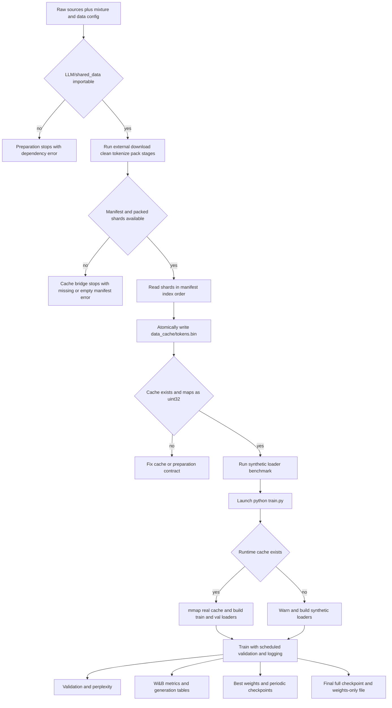

# Prepare Data, Benchmark, and Train

This is the repository's end-to-end operating sequence:

1. Make the external preparation workspace available, or decide that this run is only a synthetic smoke run.
2. Prepare the corpus and convert its packed shards into the flat runtime cache, or deliberately reuse an existing cache.
3. Validate that the cache can be memory-mapped and turned into next-token batches.
4. Measure the loader, with or without a tiny model forward, using the cache-independent benchmark.
5. Launch `python train.py`, monitor the data-source and tokenizer messages, and distinguish real-data execution from synthetic fallback.
6. Check periodic validation, W&B metrics, best weights, step checkpoints, and the final files in `weights/`.

The preparation and training entrypoints have different ownership boundaries. `data/prepare_data.py` is only a shim over the workspace-level `LLM/shared_data` preparation package; this checkout contains the runtime loader under `data/shared_data/`, not the downloader, cleaner, tokenizer, or packer. Training and the benchmark use the loader through the compatibility module `dataset.py`.

## End-to-end flow



Caption: Preparation produces a manifest-ordered flat cache; cache availability selects real or synthetic training, after which validation, telemetry, and model artifacts are emitted.

## Preconditions and source-of-truth rules

Before a real-data run, install the Python dependencies used by the project and arrange the intended CUDA device if using the production defaults. The README targets Python 3.10+, CUDA 12.1+, and an NVIDIA A100 80GB SXM (smaller GPUs require lower `batch_size` and possibly gradient accumulation). `train.py` imports W&B and initializes a run; provide a W&B login/API key or configure the W&B environment for the desired online/offline behavior. The tokenizer is loaded separately through `transformers` from `NousResearch/Meta-Llama-3-8B` when a real cache is used.

The following distinction prevents a common false-success diagnosis:

- **Preparation dependency:** `LLM/shared_data.config` and `LLM/shared_data.prepare_data` must be importable for `data/prepare_data.py` to do real preparation. The shim reports that the workspace package is missing and exits; it does not synthesize a corpus.
- **Runtime cache:** `build_training_data` requires the configured `data_cache_dir/data_cache_filename`, which defaults to `data_cache/tokens.bin`. If this file is absent, `train_model` catches the resulting `FileNotFoundError`, warns, and calls `build_synthetic_data(config)`. The process can therefore run without a real corpus, but the resulting experiment is random-token training, not pretraining on the named mixture.
- **Tokenizer failure:** if the cache exists but the Transformers tokenizer cannot load, the loader keeps the real token batches and substitutes a byte-level tokenizer stub for generation. Loss and validation still operate on cached ids, but generated text is not meaningful. This is not the same as synthetic-data fallback.
- **Configuration ownership:** `config.py:get_config()` is the source of training and loader defaults. The local `data_sources` dictionary describes a corpus policy but is not passed to the external pipeline by this shim and is not read by the vendored loader. Changing it does not rebuild an existing cache.

A cache is a raw, headerless `uint32` stream. It is expected to contain the already-tokenized and packed data from the external pipeline; the bridge does not add EOS tokens, metadata, or framing. The loader consumes complete non-overlapping windows of `seq_len + 1` tokens and holds out the final `val_split` fraction after chunk alignment. A tokenizer or EOS-id change requires a newly prepared compatible cache, not just a larger `vocab_size` setting.

## 1. Prepare the real corpus

From the repository root, the normal command is:

```bash
python data/prepare_data.py --stage pretrain
```

The parser accepts exactly these preparation options:

```text
--stage {pretrain}
--mixture PATH
--data-config PATH
--data-root PATH
--source SOURCE
--skip-download
--skip-clean
--skip-tokenize
--skip-pack
```

`--stage pretrain` is the only accepted stage value. `--mixture`, `--data-config`, `--data-root`, and `--source` are passed to the workspace `run_pipeline` call when supplied; each skip switch is also forwarded as the corresponding `skip_*` argument. The external pipeline owns what those stages do. Use a skip switch only when the output required by the next stage is already present in the workspace data root. In particular, skipping pack is compatible with cache conversion only if a usable `shards/manifest.json` and its listed shard files already exist.

Examples of the supported forms are:

```bash
python data/prepare_data.py --stage pretrain --mixture /path/to/mixture.yaml
python data/prepare_data.py --stage pretrain --data-config /path/to/data.yaml --data-root /path/to/data
python data/prepare_data.py --stage pretrain --source fineweb_edu --skip-download
python data/prepare_data.py --stage pretrain --skip-download --skip-clean --skip-tokenize --skip-pack
```

The last command is not a universal cache validator: it asks the external pipeline to skip every stage, then the shim still expects the external manifest and shards. Use it only to bridge an already completed workspace output. The `--source` value is likewise an external-pipeline selector; the local shim does not validate source names.

### What the preparation shim does

After importing the external package, the shim prints the universal corpus and LLaMA-3 reporting constants, invokes `shared_data.prepare_data.run_pipeline`, and then bridges the workspace shard layout to the loader layout:

1. It reads `manifest.json` and sorts its `shards` entries by numeric `index`.
2. It opens each listed shard path relative to the discovered shard directory and copies bytes in bounded chunks rather than concatenating the whole corpus in RAM.
3. It writes to a sibling `tokens.bin.tmp` and installs the destination with `os.replace`, so a successful conversion leaves the final cache in place without a temporary sibling.
4. It prints the shard count, token count, cache path, and approximate GB written.

The manifest's numeric order is the data order. Do not infer order from directory listing or rename shards without updating the manifest. A missing manifest raises `SystemExit` with a request to run without `--skip-pack`; an empty shard list also stops rather than creating an empty cache. A missing workspace import fails earlier with a message that this project vendors only the loader.

### Cache reuse and deliberate rebuilds

The default `reuse_data_cache` is `True`. The shim still invokes the external pipeline first, but after it returns, an existing configured cache causes the shard-concatenation step to print a reuse message and return. This is useful for repeat training and benchmarking, but it can silently preserve old data when the source mixture, deduplication policy, document limits, tokenizer, or target size has changed.

For a deliberate rebuild, confirm the intended external outputs and remove or move the old `data_cache/tokens.bin` before running preparation, or override the configuration used by the caller so the cache path is different. There is no preparation command-line flag that overrides `reuse_data_cache`; it is a `config.py` setting consumed after `run_pipeline` returns. Keep the manifest, shard metadata, tokenizer identity, vocabulary, EOS convention, and cache together as one versioned data contract.

## 2. Validate the cache and loader

There is no separate `validate-cache` CLI. Validation is a sequence of narrow contract checks:

- Confirm that the configured path exists and is the intended cache, not merely any file named `tokens.bin`.
- Confirm that the file is a raw `uint32` stream and opens read-only with `np.memmap`.
- Confirm that the usable token count is large enough for several `(seq_len + 1)` windows and at least one full training batch.
- Confirm that the loader creates `input` and `target` tensors of shape `(batch_size, seq_len)`, with `target` equal to the one-token shift of the same window.
- Confirm that training uses a reproducible shuffled sampler while validation is ordered and retains its final partial batch.

`build_training_data(config)` performs the runtime portion of these checks by opening `np.memmap(path, dtype=np.uint32, mode="r")`, truncating the stream to complete chunks, splitting on a chunk boundary, and constructing the train and validation `DataLoader`s. `PackedDataset` does not overlap windows: item `idx` reads the `seq_len + 1` slice beginning at `idx * (seq_len + 1)` and returns `window[:-1]` and `window[1:]`. With the production defaults, the nominal batch is `(96, 2048)` and contains 196,608 input tokens.

A useful local inspection, after preparing the cache, is:

```bash
python - <<'PY'
from pathlib import Path
import numpy as np
from config import get_config

cfg = get_config()
path = Path(cfg["data_cache_dir"]) / cfg["data_cache_filename"]
mm = np.memmap(path, dtype=np.uint32, mode="r")
chunk = cfg["seq_len"] + 1
print("cache:", path)
print("dtype:", mm.dtype, "tokens:", mm.size)
print("complete windows:", mm.size // chunk)
print("remainder:", mm.size % chunk)
PY
```

This inspection checks representation and cardinality, not tokenizer semantic compatibility. The loader trusts ids already present in the cache. If the cache is missing, use `python data/prepare_data.py` for a real corpus or use the synthetic builder through tests/code; do not interpret the trainer's automatic fallback as cache validation.

## 3. Benchmark the data path before training

`benchmark_data.py` deliberately does **not** read the prepared cache or download from Hugging Face. It creates a deterministic synthetic `uint32` stream with explicit boundary tokens, builds `PackedDataset`, `ShuffledRangeSampler`, and a `DataLoader`, and measures host-to-device loading. The optional `--with_model_forward` path adds a small two-layer transformer, so it is useful for separating loader transport from a representative end-to-end forward without allocating the production model.

The complete command-line surface is:

```text
--steps INT                 default 50
--batch_size INT            default 96
--seq_len INT               default 2048
--vocab_size INT             default 128000
--num_workers INT            default 6
--prefetch_factor INT        default 16
--pin_memory                flag
--device {auto,cpu,cuda}    default auto
--with_model_forward        flag
--json                      flag
```

Typical checks are:

```bash
# CPU-safe loader timing with small shapes
python benchmark_data.py --steps 20 --batch_size 4 --seq_len 256 --num_workers 0 --device cpu

# Production-shaped CUDA transport benchmark
python benchmark_data.py --steps 50 --batch_size 96 --seq_len 2048 --num_workers 6 --prefetch_factor 16 --pin_memory --device cuda

# Include the tiny model forward and emit machine-readable metrics
python benchmark_data.py --steps 50 --batch_size 96 --seq_len 2048 --with_model_forward --json
```

With `--device auto`, the script selects CUDA when available and CPU otherwise. `--pin_memory` is only applied when the selected device is CUDA. A zero-worker run intentionally passes no prefetch factor and disables persistent workers. The reported fields include `tokens_per_step`, total tokens and time, throughput, mean and p50 step time, p99 step time, worker settings, device, and whether the model forward ran. For fewer than 100 steps, `p99_step_ms` is reported as `0.0` by the implementation, so do not compare that field with a real percentile for a short smoke run.

The benchmark's synthetic source makes it a loader/transport benchmark, not evidence that the prepared corpus is readable. It is safe to run before the external workspace is installed. If it fails, fix Python/PyTorch, worker, device, or batch-shape issues before attributing a training problem to the corpus.

## 4. Run focused tests before a long job

Run the data and smoke coverage from the repository root:

```bash
python -m pytest tests/test_data_pipeline.py tests/test_smoke.py
```

For the documented quick offline check, the README also provides:

```bash
python -m pytest tests/ -m smoke
```

The narrow evidence matters:

- `tests/test_data_pipeline.py::TestConcatShardsToCache::test_concatenates_in_manifest_order` writes fake `uint32` shards, verifies byte-exact numeric manifest order, and verifies that atomic replacement leaves no `.tmp` file.
- `tests/test_data_pipeline.py::TestConcatShardsToCache::test_missing_manifest_raises` and `test_empty_manifest_lists_no_shards` protect the fail-closed pack-stage precondition.
- `tests/test_data_pipeline.py::TestConcatShardsToCache::test_cache_mmaps_cleanly` checks that bridge output satisfies the loader's read-only `np.memmap` contract.
- `tests/test_data_pipeline.py::TestBenchmarkData::test_runs_end_to_end` runs the actual benchmark subprocess and checks its throughput output; `test_json_mode` checks machine-readable metrics and the `tokens_per_step` arithmetic.
- `tests/test_smoke.py::tiny_dataloaders` constructs a chunk-aligned synthetic train/validation split with the same `PackedDataset`, sampler, and collation contract used by runtime callers. It does not exercise the external workspace pipeline.
- `tests/test_smoke.py::TestEndToEndSmoke::test_one_forward_backward_step` verifies finite loss and finite gradients; `test_loss_decreases_over_few_steps` verifies that a tiny model can optimize; `test_chunked_ce_matches_full_ce_in_training` protects the training loss equivalence; and `test_validate_runs_and_returns_finite_loss` verifies one offline validation/logging call.

These tests validate repository-owned conversion, loading, model, and validation boundaries. They cannot validate the implementation of `LLM/shared_data`, because that package is outside this repository. A passing synthetic test suite is necessary for a run but does not prove that a real cache was used.

## 5. Launch training

The executable has no training command-line options. The actual command is:

```bash
python train.py
```

`train.py` calls `get_config()` and chooses `cuda` when PyTorch reports a CUDA device, otherwise `cpu`. On CUDA it applies the configured TF32, cuDNN benchmark, float32 matmul precision, allocator, and BF16-related runtime settings. It then loads real data with `build_training_data`; only a missing cache triggers the warning and synthetic fallback described above. If the cache exists, tokenizer loading can still fall back independently to the byte stub.

The production defaults are deliberately substantial: `batch_size=96`, `seq_len=2048`, `gradient_accumulation=1`, `max_steps=42000`, `gradient_checkpointing=True`, `ce_chunk_size=256`, and `compile_model=True`. The nominal plan is 196,608 tokens per optimizer step and approximately 8.26 billion tokens over 42,000 steps. On a smaller GPU, edit `config.py` before launching rather than assuming the A100 settings fit.

Before the first measured step, the trainer fetches a real-shape batch. If `compile_model` is enabled and `torch.compile` is available, it compiles the model and performs a hidden-state forward, chunked cross-entropy/z-loss, backward pass, and CUDA synchronization as warmup. This startup cost is expected. The optimizer is AdamW with separate decay and no-decay parameter groups; gradient accumulation, clipping, optimizer update, EMA update, and scheduler stepping occur at their configured boundaries.

If the train iterator reaches the end of the prepared corpus before `max_steps`, `_next_batch` increments an epoch counter, calls `set_epoch` on the sampler, warns that the corpus was exhausted, and starts a fresh iterator. This is an intentional wraparound, not evidence that the cache was replenished. It means a corpus shorter than the nominal plan can complete while repeating data.

### Reading startup output

Expected messages include:

- `Using device: ...` and, on CUDA, the GPU identity and memory information.
- A cache-missing warning followed by `falling back to synthetic data` only when the configured cache is absent. Treat this as a failed real-data precondition for production, even though the process continues.
- A tokenizer-load warning followed by `using the byte stub` when only tokenizer retrieval failed. Real cached ids are still used, but generation is not meaningful.
- Model size, gradient-checkpointing, batch/sequence/tokens-per-step, QK-Norm, Z-Loss, and EMA status.
- `Compiling model ...` and `Pre-warmup complete ...` when compilation is active.
- `Starting training for 42000 steps...`, periodic tqdm loss/LR/tokens-per-second/data timing, and W&B initialization.

Do not confuse a successful `Using device` or `Starting training` line with proof of real-data use. The authoritative signals are the absence of the cache-missing warning and an explicit inspection of the configured cache before launch.

## 6. Validation, logging, and lifecycle

The loop performs periodic side effects only for positive steps that are divisible by their interval. With the defaults:

| Event | Default cadence | Observable behavior |
|---|---:|---|
| Training log | Every 50 steps | W&B train metrics and tqdm postfix |
| Validation | Every 2,000 steps | Up to 100 validation batches, loss and perplexity |
| Sample generation | Every 20,000 steps | Five fixed prompts, up to 128 new tokens, W&B table |
| Step checkpoint | Every 5,000 steps | Full resumable state, asynchronously queued by default |
| Final save | After the loop | Full state plus weights-only state at the final step |

`validate` uses the EMA model when EMA is enabled, otherwise the live model. It computes the same chunked head loss and optional z-loss without materializing the full vocabulary logits, averages at most `val_max_batches`, computes `math.exp(min(avg_loss, 20))`, and logs `val/loss` and `val/perplexity`. On a strict improvement it saves the **live** model state to the best path even when validation evaluated EMA. The fixed generation prompts combine prose and code; sampling uses configured temperature and top-k, hard-coded `top_p=0.9`, and stops on the tokenizer EOS id.

Training logs the following groups:

- `train/loss`, `train/lr`, `train/grad_norm`, `train/step_time_ms`, `train/tokens_per_sec`, `train/tokens_seen`, `train/effective_batch_size`, and `train/data_wait_ms` at the log interval.
- `gpu/memory_used_mb`, `gpu/memory_peak_mb`, `gpu/memory_reserved_mb`, and CUDA utilization when running on CUDA.
- `val/loss` and `val/perplexity` at validation.
- `gen/samples` as a W&B table at generation.

When several intervals coincide, logging happens first, then validation, generation, and checkpointing. Step zero does not emit these periodic side effects. The final loop index is exclusive (`range(initial_step, max_steps)`), but the final save is still labeled with `max_steps`.

## 7. Locate and resume artifacts

The default artifact directory is `weights/`, with prefix `llama3-515M`. Periodic checkpoints are named:

```text
weights/llama3-515M_step_<step>.pt
```

They contain model, optimizer, and scheduler state, step and derived token count, best validation loss, Torch/NumPy/Python RNG state, the configuration, optional EMA state, and CUDA RNG state when available. With `async_checkpoint=True`, periodic `torch.save` runs in a background thread; the trainer joins the most recent thread before final save so the last queued write is not abandoned. `keep_last_n_checkpoints=3` removes older numeric step checkpoints, but does not remove the best or final files.

The best-validation file is:

```text
weights/llama3-515M_best.pt
```

It is a live-model `state_dict` saved only on strict validation improvement. The final files are:

```text
weights/llama3-515M_final_model_full.pt
weights/llama3-515M_final_model_weights.pt
```

The `_full` file is resumable state; the `_weights` file contains only `model.state_dict()`. At normal completion the process prints `All artifacts saved to: weights` after W&B finishes.

To resume, set `preload` to a non-`None` value in `config.py` and run the same command:

```python
'preload': 'weights/llama3-515M_step_5000.pt'
```

The current implementation uses that setting as an enable switch: `load_checkpoint` scans `model_folder` for matching numeric `_step_*.pt` files and loads the newest one; it does not load the literal path stored in `preload`. A valid checkpoint restores model, optimizer, scheduler, RNG, and optional EMA state. If no matching step checkpoint exists, it silently returns step zero and infinite best loss, so verify the selected files and prefixes before assuming a resume occurred. The final and best files are not candidates for this scan.

## Failure and recovery checklist

| Symptom | Meaning | Recovery |
|---|---|---|
| `shared_data` import error from preparation | External workspace package is unavailable | Install or expose the workspace `LLM/shared_data`; this repository cannot perform download/clean/tokenize/pack itself |
| Missing manifest or no shards | Pack output is absent or invalid | Run preparation without `--skip-pack`, or point the pipeline at a data root containing a complete manifest and listed shards |
| Cache exists but old data is used | `reuse_data_cache=True` selected the existing flat file | Move/remove the cache and prepare again after changing corpus or tokenizer settings |
| `Token cache not found ...` during training | Runtime cache precondition failed | For real training, prepare and inspect the configured cache; for an intentional offline smoke run, recognize that training will be synthetic |
| Tokenizer load warning | Real cache is usable but decode/generation tokenizer is unavailable | Make `transformers` and the intended tokenizer available; do not treat byte-stub samples as quality evidence |
| Train corpus exhausted warning | Prepared corpus is shorter than the configured step plan | Confirm intentional repetition, increase corpus, or change `max_steps`; the sampler restarts with a new epoch permutation |
| CUDA out-of-memory during startup or compile | Production shape/settings exceed the device | Lower `batch_size`, use gradient accumulation, keep gradient checkpointing and chunked CE enabled, or disable compilation independently |
| Benchmark reports CPU | `--device auto` found no CUDA device, or CPU was requested | Use `--device cuda` only on a working CUDA setup; compare CPU results only for functional checks |

The safest operational interpretation is: **prepare and inspect for real training; benchmark synthetic transport; run focused tests; launch; watch for fallback warnings; then verify W&B and `weights/` artifacts.**
