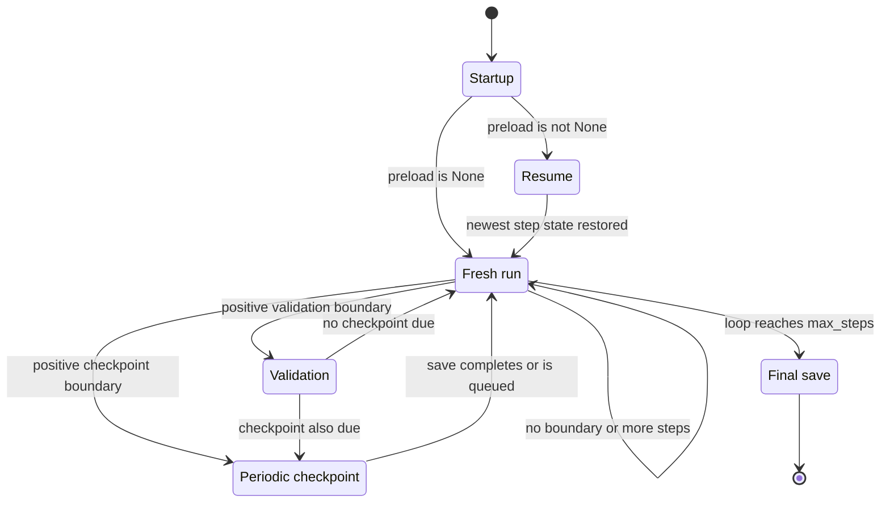

# Resume, Checkpoint, and Recover

This runbook covers the persistence boundary owned by `train.py`. A periodic checkpoint is a **training-state checkpoint**, not merely model weights: it is intended to let a compatible run continue with its optimizer, scheduler, validation history, random streams, and optional EMA model. The final weights-only file is a different product and cannot resume training by itself.

For the surrounding training lifecycle, see [Training Runtime and Lifecycle](/openwiki/architecture/training-runtime.md). For configuration ownership, ignored runtime outputs, and the broader artifact contract, see [Configuration, Environment, and Artifacts](/openwiki/operations/configuration-and-artifacts.md). The end-to-end launch and data-precondition workflow is in [Prepare Data, Benchmark, and Train](/openwiki/workflows/prepare-and-train.md).

## Lifecycle at a glance

`train_model` constructs the model, optimizer, scheduler, and optional EMA before it considers resuming. The `preload` setting then gates whether `load_checkpoint` is called. Once the loop is running, validation and checkpointing are independent interval checks; when both are due on one positive step, validation runs before the checkpoint save. At loop exhaustion, the last asynchronous save is joined before final files are written.



Caption: Startup either enables discovery-based restoration or begins fresh training; periodic validation and checkpointing lead to a joined, synchronous final save.

## Naming and discovery

The default values in `config.py` produce this artifact namespace:

```text
weights/llama3-515M_step_<step>.pt
weights/llama3-515M_best.pt
weights/llama3-515M_final_model_full.pt
weights/llama3-515M_final_model_weights.pt
```

The general periodic name is:

```text
<model_folder>/<model_filename>_step_<step>.pt
```

`save_checkpoint` creates `model_folder` if needed. Step files are the only files considered for automatic resume. `load_checkpoint` scans `model_folder` with the glob `<model_filename>_step_*.pt`, sorts candidates by the numeric suffix after `_step_`, and loads the newest candidate. It does not search the whole repository, inspect the best file, or consider either final file a resume source.

There is an important distinction between the README example and the implementation. Setting:

```python
'preload': 'weights/llama3-515M_step_5000.pt'
```

makes `preload` non-`None`, so it enables the call to `load_checkpoint`; the string is **not** used as a direct pathname. The directory and filename prefix used for discovery come from `model_folder` and `model_filename`. To resume a particular step, make that step the newest matching file in the configured directory and prefix, or isolate it under a separate directory/prefix. A non-`None` value with the wrong folder or prefix silently behaves like a run with no matching checkpoint and returns step `0` with best loss `inf`.

The default cadence is `checkpoint_interval=5000`, and the default retention setting is `keep_last_n_checkpoints=3`. Retention applies only after a periodic save and only to matching `_step_*.pt` files. With a positive setting, the trainer sorts those files by numeric suffix and deletes all but the newest configured number. With `keep_last_n_checkpoints=0`, the cleanup block is disabled. `_best.pt` and both final artifacts are not in this retention pattern and are not deleted by it.

## What a periodic checkpoint contains

A normal checkpoint is written from a dictionary with these fields:

```text
model_state_dict
optimizer_state_dict
scheduler_state_dict
step
tokens_seen
best_val_loss
rng_torch
rng_numpy
rng_python
config
ema_state_dict
rng_cuda (when CUDA is available at save time)
```

The state has distinct owners and recovery meanings:

- **Model:** `model_state_dict` restores the live Transformer parameters. The model must be rebuilt with compatible parameter names and shapes before loading.
- **Optimizer:** `optimizer_state_dict` restores AdamW parameter-group and moment state. Loading model weights without this state is not an equivalent continuation.
- **Scheduler:** `scheduler_state_dict` restores the `SequentialLR` progress across `LinearLR` warmup and `CosineAnnealingLR` decay. The current run still constructs a scheduler before loading, so its structure must be compatible with the checkpoint.
- **Progress:** `step` is returned as the loop start, while `tokens_seen` is stored as derived metadata (`step * batch_size * seq_len * gradient_accumulation`). The loop and later saves derive their own step-based token counts; `tokens_seen` is not separately advanced from a cursor.
- **Validation history:** `best_val_loss` is returned with the restored step and becomes the run's current best threshold. The best-weights file itself is not loaded during resume.
- **EMA:** when EMA is enabled, `ema_state_dict` stores `AveragedModel` state and is loaded only when the caller supplied an EMA object and the checkpoint contains a non-`None` EMA state. If the current run disables EMA, the saved EMA is ignored; if an old checkpoint has no EMA state, one is not reconstructed by `load_checkpoint`.
- **Configuration:** the dictionary is embedded for provenance, but the loader does not compare it with the current configuration or replace current settings. Compatibility checks therefore belong in the operator's recovery procedure.

### RNG restoration and device normalization

The checkpoint captures the default CPU Torch RNG, NumPy's state tuple, and Python's `random` state. When CUDA is available at save time it also captures `torch.cuda.get_rng_state()`. On load, `torch.load(..., map_location=device, weights_only=False)` can move serialized RNG tensors onto the load device. The loader explicitly normalizes both Torch RNG tensors back to CPU `torch.uint8` before calling `torch.random.set_rng_state` or `torch.cuda.set_rng_state`. This is why a checkpoint saved on CUDA can restore its model on CPU without passing a GPU-resident RNG tensor to the CPU setter. CUDA restoration happens only when the checkpoint has `rng_cuda` and CUDA is available during loading; a CPU-created checkpoint has no saved CUDA stream to restore.

This is complete restoration of the RNG state fields that the trainer persists, and it supports reproducible random draws after loading. It is not a serialized DataLoader cursor: the checkpoint does not contain the active iterator, sampler permutation, worker state, or epoch counter. Startup also performs the normal data-loader/compile warmup before loading. Consequently, use “exact RNG restoration” to mean restoration of the saved Torch, NumPy, Python, and available CUDA states—not an unconditional promise that a restarted process will consume the identical batch sequence in every external loader configuration.

## Save timing, validation, EMA, and best weights

On a positive step divisible by `val_interval`, `validate` evaluates the EMA model when EMA exists, otherwise the live model. It returns the average validation loss after at most `val_max_batches`. If that loss is strictly less than the restored or current `best_val_loss`, the trainer updates the threshold and synchronously writes:

```text
<model_folder>/<model_filename>_best.pt
```

That file contains only the **live** `model.state_dict()`, even when validation used EMA. It is an inference/selection artifact, not a full resume checkpoint: it has no optimizer, scheduler, RNG, progress, or EMA state. Equal validation losses do not replace it. If an interrupted run has no completed improvement, there may be no best file even though valid step checkpoints exist.

At an optimizer boundary, the live model is stepped first, then EMA is updated from the post-step model, gradients are cleared, and the scheduler advances. A periodic checkpoint later in the same loop therefore records the post-update model and the corresponding EMA/scheduler state. When several boundaries coincide, the effective order is logging, validation and best-file handling, generation, then periodic checkpointing.

A resumed loop uses `range(initial_step, config['max_steps'])`, where `initial_step` is the checkpoint's stored `step`. Thus the first resumed loop index equals the stored step rather than being explicitly incremented before entering the range. The absolute loop index is also used for gradient-accumulation and interval tests. Operators changing resume semantics or adding a cursor should preserve this ordering deliberately; do not assume that the numeric checkpoint suffix alone describes an independently persisted DataLoader position.

## Asynchronous saves and retention

With `async_checkpoint=True` (the production default), a periodic save builds the complete checkpoint dictionary, starts a daemon thread named `ckpt-save-<step>` whose target is `torch.save`, prints `Checkpoint queued (async): ...`, and returns that thread. With asynchronous saving disabled, `torch.save` runs in the training thread and the function prints `Checkpoint saved: ...`.

The training loop stores only the most recently returned thread in `ckpt_thread`. At normal loop completion it calls `ckpt_thread.join()` before final persistence, preventing the last queued write from being abandoned while the process exits. Earlier asynchronous threads are not individually retained or joined by the shutdown block. This matters when checkpoint intervals are shorter than save time: a clean end guarantees the last tracked write has completed, but it is not a general barrier for every earlier daemon save. An external interruption can also leave a directly written `.pt` file incomplete; the loader does not validate a candidate before selecting it.

Retention runs immediately after queueing or writing a checkpoint. It deletes old matching step files but does not create a backup, perform an atomic rename, or preserve the best/final artifacts. Keep external copies of important checkpoints, especially before changing `model_folder`, `model_filename`, or retention policy. Avoid introducing non-numeric files matching the step glob: loading sorts non-digit suffixes as `-1`, while the retention sort calls `int(...)` and can fail on a malformed suffix.

## Final artifacts

After the loop, the trainer reports elapsed time, joins the most recently returned asynchronous checkpoint thread if one exists, and calls `save_checkpoint(..., is_final=True)` synchronously. The final call writes two deliberately distinct files:

```text
<model_folder>/<model_filename>_final_model_full.pt
<model_folder>/<model_filename>_final_model_weights.pt
```

`_final_model_full.pt` contains the full checkpoint structure described above, with the final call labeled by `config['max_steps']`. `_final_model_weights.pt` contains only `model.state_dict()`. The final save does not create `<model_filename>_step_<max_steps>.pt`, so it is not a candidate for automatic discovery or numeric retention. W&B is finished only after these files are written, and the process then prints the artifact directory.

For recovery, prefer a valid periodic step file or the final **full** file as a source of complete state. Do not point a model loader that expects a checkpoint dictionary at the weights-only file, and do not treat `_best.pt` as resumable training state. Note that `load_checkpoint` currently discovers only periodic step files, so the final full artifact is a durable archive but is not automatically selected by setting `preload`; to use it as a resume source requires deliberately placing/renaming a compatible copy into the step-file discovery namespace, or changing the loader implementation.

## Resume procedure

1. **Stop and identify the run namespace.** From the repository root, determine the intended `model_folder` and `model_filename`. List only the matching step files and check their numeric suffixes. Do not infer the resume point from `_best.pt` or a final weights-only file.
2. **Check the newest candidate before enabling resume.** Attempt to load the candidate with the same Python environment and `torch.load(..., map_location=...)`. If it is truncated or raises deserialization errors, remove or quarantine it so discovery can reach the next valid step. Do not leave a corrupt newest file in place: `load_checkpoint` does not skip a failing newest candidate.
3. **Restore the compatible run contract.** Use model dimensions, tokenizer/cache identity, optimizer grouping, scheduler phase, `gradient_accumulation`, and EMA choice compatible with the checkpoint. Current configuration values are not validated against the embedded `config`, and a changed architecture or token-id space can fail at `load_state_dict` or produce an invalid experiment.
4. **Enable the gate and run the normal entrypoint.** Set `preload` to any non-`None` value, keep the intended `model_folder` and `model_filename`, and run:

   ```bash
   python train.py
   ```

   The startup log `Resumed from step N` is the authoritative signal that a step checkpoint was actually found and loaded. If it is absent, inspect the namespace: a non-`None` `preload` value alone does not prove that a resume occurred.
5. **Verify the first post-resume artifacts.** Confirm that the run's validation/best-loss behavior starts from the restored threshold, that the expected step namespace is being updated, and that EMA is enabled consistently. Keep the previous checkpoint until the resumed run has produced and validated a newer one.

A deliberate fresh run requires `preload = None` and a new or isolated `model_folder`/`model_filename`. This avoids accidentally discovering old checkpoints. If no matching step file exists while `preload` is non-`None`, the implementation returns `(0, float('inf'))` without raising and proceeds as a fresh run; treat that silent fallback as an operational failure when a resume was expected.

## Recovery actions for common failures

| Symptom | Likely meaning | Recovery |
|---|---|---|
| Process stopped before final files appeared | The loop did not reach finalization, or finalization was interrupted | Use the newest valid periodic step file. Validate it before resume; the final files are written only after the async join and are not required for continuation. |
| `Resumed from step ...` is absent | `preload` is `None`, or discovery found no matching file under the configured directory/prefix | Set a non-`None` gate, verify `model_folder` and `model_filename`, and check the exact `_step_<number>.pt` namespace. |
| `torch.load` or `load_state_dict` fails on the newest file | The file may be truncated, corrupt, or incompatible with the current model/runtime | Quarantine the newest candidate and test the next retained checkpoint. If all candidates are invalid, restore the original configuration/environment or start a new run. Do not silently skip an architecture or tokenizer mismatch. |
| Resume fails during compilation or startup OOM | Compilation/warmup or the current hardware shape is too large; loading happens after model setup | Temporarily set `compile_model=False`, reduce `batch_size`, or use `gradient_accumulation` while preserving compatible model shapes. Keep the checkpoint untouched and retry. |
| A final file exists but resume discovery ignores it | Final names are intentionally outside `_step_*.pt` discovery | Use a periodic step checkpoint, or make a deliberate compatible copy/loader change for the final full checkpoint. Never use the weights-only file as full state. |
| Best validation weight differs from evaluated output | Validation used EMA but `_best.pt` saved live weights | This is expected. Use EMA state from a full checkpoint when investigating EMA validation; use `_best.pt` specifically as the live-model best artifact. |
| Newest step file is zero-length/truncated after an interruption | A daemon `torch.save` was interrupted during direct file writing | Remove or quarantine that candidate before retrying. Recover from the next valid retained file or an external backup; do not trust filename existence alone. |
| Retention removed an older recovery point | `keep_last_n_checkpoints` deliberately keeps only the newest configured step files | Recover from an external copy or final full archive if available. Increase retention or add external backup before future long runs. Retention is not backup. |
| Run warns that the token cache is missing | Training has switched to synthetic data rather than using the intended corpus | Stop a production recovery, prepare/restore the configured cache, and verify it before launching. A model checkpoint cannot make a synthetic-data continuation equivalent to a real-corpus run. |
| Checkpoint loads but the experiment is not reproducible at batch level | RNG fields were restored, but loader cursor, sampler epoch, worker state, and iterator position were not persisted | Treat the checkpoint as reproducible trainer/RNG state, not a full data-stream snapshot. Preserve the data contract and document any intentional batch-sequence change. |

## Focused verification

`tests/test_train.py` exercises the recovery boundary without running a production-length job. The checkpoint tests verify that a step file is created, model outputs round-trip after loading, the `(step, best_val_loss)` result is restored, and Torch/NumPy/Python RNG draws resume from the saved states. They also cover the no-checkpoint `(0, inf)` result, special final filenames, asynchronous thread completion, and the CUDA-to-CPU cross-device load regression in which RNG tensors must be normalized back to CPU. See `tests/test_train.py#L67-L301`.

`tests/test_config.py` protects the required persistence controls—`model_folder`, `model_filename`, `checkpoint_interval`, `keep_last_n_checkpoints`, `async_checkpoint`, and `preload`—as part of the complete configuration contract. See `tests/test_config.py#L9-L33`. The loader and synthetic-data tests additionally establish the sampler and DataLoader behavior that is intentionally not serialized in a checkpoint; see `data/shared_data/loader.py#L48-L73` and `data/shared_data/loader.py#L123-L143`.

A passing checkpoint round-trip proves serialization and restoration of the covered state fields. It does not prove that a real token cache, tokenizer id space, external W&B run, or external backup policy is valid. Those remain explicit preconditions for a safe production recovery.
